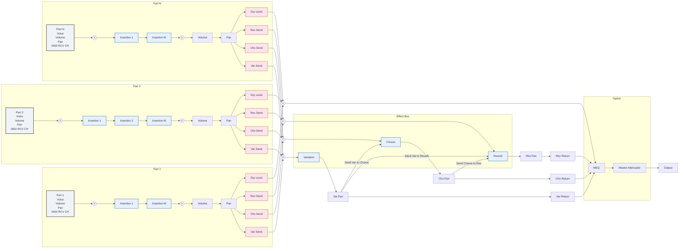
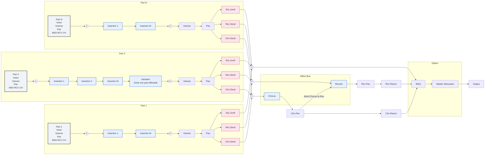
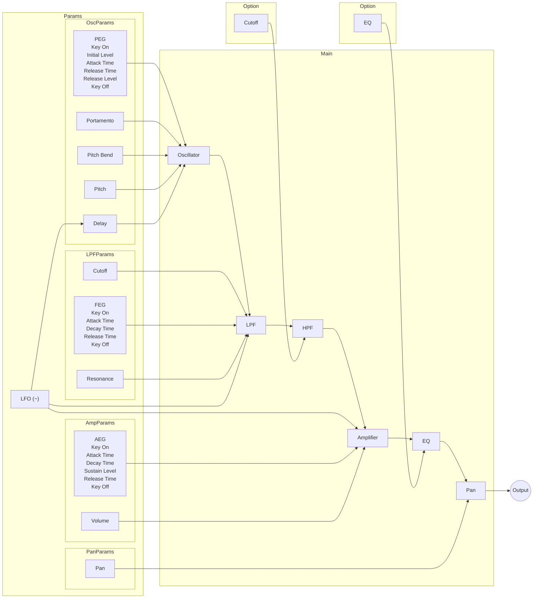
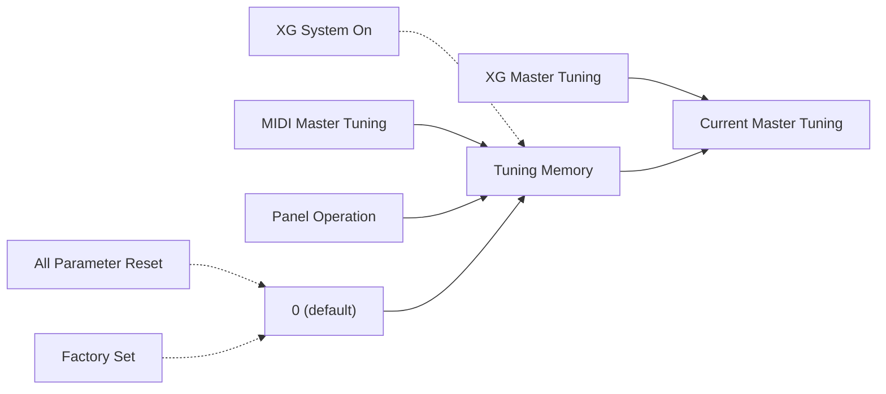

# XG 规格说明 ver 2.00

## XG 格式概述

Yamaha 开发了一种新的音源控制格式，旨在满足新一代多媒体的需求。

这种新的"XG"格式——是现有 GM 格式的扩展——提供了更广泛的能力，以适应日益复杂和多样化的计算机环境的需求。

这种新格式实现了显著更高水平的音乐表现力，同时确保持续兼容现有的声音数据。

Yamaha 将以 XG 格式作为未来电子乐器、音乐软件和音源 LSI 电路的基础，
同时努力在 Yamaha 各型号之间保持兼容性和可扩展性。

### 开发背景

音源被广泛应用于从乐器到通信设备和计算机游戏的各种设备中。第一个国际 MIDI 标准应运而生，目的是使所有设备类型上的音源都能实现一致的外部控制，无论制造商或型号如何。然而，由于不同制造商和型号之间的音源音色排布往往差异很大，不同的 MIDI 设备经常对相同的 MIDI 指令产生不同类型的聲音响应。

1991 年，MIDI 标准委员会制定了附加规范，称为 GM（General MIDI）标准，旨在标准化音色排布并提高 MIDI 的一致性。GM 标准显著增强了兼容设备之间的声学兼容性，进而推动了 GM 软件应用基础的扩大。但 GM 标准也有其局限性。它只支持 128 种音色，而许多用户现在认为需要更多适合更广泛音乐流派的音色。用户还表示希望更好地控制音色修改和效果，以实现更高水平的表现力。

基于计算机的多媒体的出现又增加了一个不同的视角，使人们对图像和声音技术都给予了更多关注。多媒体相关声音和音乐处理的发展与图像压缩领域的最新进展并行，并指引着多媒体的未来方向。目前处理声音和控制数据有两种根本不同的方法。一种方法是在软件端将声音数据与控制数据一起数字化存储，然后将所有数据一起发送以生成回放。第二种方法是让软件仅向安装在计算机上或连接到计算机的音源提供控制数据。音源处理传入的数据并在本地生成声音。

第一种方法提供高度逼真的声音，但需要大量的数据，并锁定特定的演奏特性和音色。第二种方法所需的数据量要少得多，同时允许完全自由地变化音色、速度和几乎所有其他演奏特性。因此第二种方法非常适合交互式多媒体应用，如卡拉OK和重复性的计算机游戏音效。基于 MIDI 的应用是第二种方法的典型代表。随着多媒体技术的发展，我们迫切需要扩展这种方法，以容纳更多的音色和更高程度的表达控制。这就是 Yamaha 很高兴提出新的 XG 格式的原因——21 世纪的音源格式。

### 基本概念

XG 格式保持了 MIDI 和 GM 标准的通用性和兼容性，同时显著提高了表现力范围并确保数据的连续性。

具体来说，XG 格式实现以下目标：
- 能够产生极具表现力的声音数据
- 显著扩展可用的音色类型及变体
- 支持乐器、计算机和其他设备之间声音数据的未来兼容性
- 确保数据在未来长期完全可用
- 支持新型效果数据（如卡拉OK数据）的标准化处理

XG 格式基于以下三个原则：
- 兼容性
- 可扩展性
- 可扩充性

#### 兼容性

兼容 XG 的歌曲数据将在任何 XG 设备上忠实地回放，无论其型号或制造商如何。由于 XG 格式保持与 GM 格式向上兼容，XG 设备也将正确再现 GM 声音数据。

#### 可扩展性

尽管 XG 格式对音色集和音色变化进行了详细且广泛的规范，但它并不要求 XG 设备支持全部功能。设计人员可以自由开发各种产品，以满足不同的成本和性能目标。每个 XG 机器将根据设备的复杂程度回放 XG 数据。如果某个型号不支持变体音色，它将自动播放对应的基础音色。如果某个型号包含图形均衡器，它可以充分利用图形均衡器功能来控制频率特性，以最适合正在播放的音乐流派——从活跃的摇滚到舒缓的古典。

#### 可扩充性

XG 格式对增强和扩展保持开放，以使其能够与未来的产品发展保持同步。

### 对 GM 的扩展

XG 在 GM 标准基础上增加了以下扩展。

#### 音色数量
GM 格式支持 128 种音色。XG 格式提供了 Bank Select（库选择）消息，显著扩展了支持的音色数量。
1. 通过 Bank Select LSB 扩展音色
   基础 GM 音色的变体存储在库中。每个库与特定类型的变体相关联，以便于查找音色。
2. Bank Select MSB 增加了 SFX 库
   Bank Select LSB 方法不适用于扩展那些没有有意义变体（即没有有意义的替换）的独特 SFX 音色。因此，XG 格式支持一个完整的 SFX 扩展效果库，您可以通过发送 Bank Select MSB 值 40H 来选择。相比之下，Bank Select MSB 7Eh 或 7Fh 可用于将任何通道设置为节奏声部播放。

#### 音色修改
XG 格式允许创建极具表现力的控制数据，可以使音色变暗或变亮、延迟或加速声音启动，或实现许多其他类型的控制。大多数控制通过控制变化消息发出，但也使用系统专用消息进行精细控制。

#### 效果
XG 格式提供高级效果支持，能够控制效果类型、电路操作以及基本和复杂效果的内部参数设置。配备图形均衡器的设备将能够根据所播放的音乐类型修改氛围和声音。

#### 外部输入
现有的音源仅响应内部数据生成声音，而 XG 格式通过增加对外部音频信号输入的支持来提供实时参与。外部信号可以像内部音源数据一样通过混音器进行处理。支持此功能的型号将允许您，例如，创建可以自动设置用于回放的麦克风回声的卡拉OK数据。

### 新支持的 MIDI 消息（GM 下不支持的新增消息）

1. 控制变化
   - 库选择（Bank Select）
   - 滑音时间（Portamento Time）
   - 滑音（Portamento）
   - 持续音（Sostenuto）
   - 柔音踏板（Soft Pedal）
   - 泛音含量（Harmonic Content）
   - 释音时间（Release Time）
   - 起音时间（Attack Time）
   - 亮度（Brightness）
   - 滑音控制（Portamento Control）
   - 效果发送 1（混响）
   - 效果发送 3（合唱）
   - 效果发送 4（变化）
   - 基于 NRPN 的声部参数和鼓组参数控制
   - 全部静音（All Sound Off）
2. 通道模式消息
3. 复音触后（Polyphonic Aftertouch）
4. 系统专用消息
   - 参数变更
     - 系统参数
     - 效果参数
       - 支持三个系统效果单元。其中一个单元可切换为插入效果。主均衡器和多重插入效果作为选项提供。
     - 声部参数
       - 滤波器截止和 AEG 值可通过偏移值控制。
     - 显示参数
     - 外部输入控制参数
     - 鼓组参数
   - 批量转储（Bulk Dump）
   - 参数请求（Parameter Request）
   - 转储请求（Dump Request）

## 音源模型

本章解释 XG 系统的整体结构和音源模型，并说明这些与主要音源参数的关系。

### 总体设计





图 1 显示了 XG 音源设计的整体结构。音源由多个声部以及一个对声部输出进行运算的效果部分组成（其中插入效果、主均衡器和主衰减器作为可选效果提供）。效果部分的连接方式取决于变化效果模式设置为"系统模式"还是"插入模式"。关于插入效果的详细信息，请参见下文第 4 节。

### 音源模型



图 2 显示了 XG 音源模型。具体来说，该图显示了为每个声部提供的音源模块的模型。该模块包括振荡器、LPF、放大器和声像（HPF 和 EQ 作为选项提供）。

该模块包括一个对音高进行时间调制的音高包络发生器（PEG）、一个对音量进行时间调制的幅度包络发生器（AEG），以及一个对低通滤波器的截止频率进行时间调制的滤波器包络发生器（FEG）。LFO（低频振荡器）实现对音高、滤波和音量的周期性调制。

这些特性主要通过可为每个声部设置的各种声部参数进行控制。

### 参数与音源模型的对应关系

MIDI 消息作用于图 2 所示的模块之一。本节显示每个消息作用于哪些模块。

下表中使用的缩写如下。
- **MIDI**：通过 MIDI 消息接收的数据。
- **PART**：声部参数
- **SYS**：系统参数
- **DSU**：鼓组参数
- **VCE**：音色参数设定的值

数据来源指示如下。
- **MIDI:BEND** 表示音高轮数据。
- **MIDI:MW** 表示来自调制轮的数据。
- **MIDI:CAT** 是通道触后数据。
- **MIDI:PAT** 是复音触后数据。
- **MIDI:AC1** 是来自可分配控制器 #1 的数据。
- **MIDI:AC2** 是来自可分配控制器 #2 的数据。

音高（PITCH）
- VCE：音高
- MIDI：NOTE NUMBER
- MIDI：VELOCITY
- MIDI：BEND
- MIDI：MW
- MIDI：CAT
- MIDI：PAT
- MIDI：AC1
- MIDI：AC2
- MIDI：FINE TUNING
- MIDI：COARSE TUNING
- SYS：MASTER TUNE
- SYS：TRANSPOSE
- PART：NOTE SHIFT
- PART：DETUNE

音高包络发生器（PEG）
- VCE：PEG
- PART：EG ATTACK TIME (MIDI: ATTACK TIME, MIDI: EG ATTACK TIME)
- PART：EG DECAY TIME (MIDI: EG DECAY TIME)
- PART：EG RELEASE TIME (MIDI: RELEASE TIME, MIDI :EG RELEASE TIME)
- PART：PITCH EG INITIAL LEVEL
- PART：PITCH EG ATTACK TIME
- PART：PITCH EG RELEASE LEVEL
- PART：PITCH EG RELEASE TIME

滑音（PORTAMENTO）
- PART：PORTAMENTO SWITCH (MIDI: PORTAMENTO)
- PART：PORTAMENTO TIME (MIDI: PORTAMENTO TIME)

低频振荡器（LFO）
- VCE：LFO
- MIDI：BEND
- MIDI：MW
- MIDI：CAT
- MIDI：PAT
- MIDI：AC1
- MIDI：AC2
- PART：VIBRATO RATE (MIDI: VIBRATO RATE)
- PART：VIBRATO DEPTH (MIDI: VIBRATO DEPTH)
- PART：MW LFO PMOD DEPTH
- PART：MW LFO FMOD DEPTH
- PART：MW LFO AMOD DEPTH
- PART：BEND LFO PMOD DEPTH
- PART：BEND LFO FMOD DEPTH
- PART：BEND LFO AMOD DEPTH
- PART：CAT LFO PMOD DEPTH
- PART：CAT LFO FMOD DEPTH
- PART：CAT LFO AMOD DEPTH
- PART：PAT LFO PMOD DEPTH
- PART：PAT LFO FMOD DEPTH
- PART：PAT LFO AMOD DEPTH
- PART：AC1 LFO PMOD DEPTH
- PART：AC1 LFO FMOD DEPTH
- PART：AC1 LFO AMOD DEPTH
- PART：AC2 LFO PMOD DEPTH
- PART：AC2 LFO FMOD DEPTH
- PART：AC2 LFO AMOD DEPTH

延迟（DELAY）
- VCE：LFO DELAY
- PART：VIBRATO DELAY (MIDI: VIBRATO DELAY)

低通滤波器截止（LOW-PASS-FILTER CUTOFF）
- VCE：LPF CUTOFF FREQUENCY
- MIDI：VELOCITY
- MIDI：BEND
- MIDI：MW
- MIDI：CAT
- MIDI：PAT
- MIDI：AC1
- MIDI：AC2
- PART：FILTER CUTOFF FREQUENCY (MIDI: BRIGHTNESS, MIDI: FILTER CUTOFF FREQUENCY)
- PART：MW FILTER CONTROL
- PART：BEND FILTER CONTROL
- PART：CAT FILTER CONTROL
- PART：PAT FILTER CONTROL
- PART：AC1 FILTER CONTROL
- PART：AC2 FILTER CONTROL
- DSU：CUTOFF (MIDI: DRUM FILTER CUTOFF FREQUENCY)
- DSU：VELOCITY CUTOFF SENSITIVITY

低通滤波器共鸣（LOW-PASS-FILTER RESONANCE）
- VCE：FILTER RESONANCE
- PART：RESONANCE (MIDI: HARMONIC CONTENT, MIDI: FILTER RESONANCE)
- DSU：RESONANCE (MIDI: DRUM FILTER RESONANCE)

高通滤波器截止（HIGH PASS FILTER CUTOFF）
- VCE：HPF CUTOFF FREQUENCY
- PART：HPF CUTOFF FREQUENCY (MIDI: HPF CUTOFF FREQUENCY)
- DSU：HPF CUTOFF FREQUENCY (MIDI: DRUM HPF CUTOFF FREQUENCY)

滤波器包络发生器（FEG）
- VCE：FEG
- PART：EG ATTACK TIME (MIDI: ATTACK TIME, MIDI: EG ATTACK TIME)
- PART：EG DECAY TIME (MIDI: EG DECAY TIME)
- PART：EG RELEASE TIME (MIDI: RELEASE TIME, MIDI: EG RELEASE TIME)

音量（VOLUME）
- VCE：VOLUME
- MIDI：VELOCITY
- MIDI：BEND
- MIDI：MW
- MIDI：CAT
- MIDI：PAT
- MIDI：AC1
- MIDI：AC2
- MIDI：EXPRESSION
- SYS：MASTER VOLUME
- SYS：MASTER ATTENUATOR
- PART：VOLUME (MIDI: MAIN VOLUME)
- PART：VELOCITY SENSE DEPTH
- PART：VELOCITY SENSE OFFSET
- PART：MW AMPLITUDE CONTROL
- PART：BEND AMPLITUDE CONTROL
- PART：CAT AMPLITUDE CONTROL
- PART：PAT AMPLITUDE CONTROL
- PART：AC1 AMPLITUDE CONTROL
- PART：AC2 AMPLITUDE CONTROL
- DSU：LEVEL (MIDI: DRUM LEVEL)

幅度包络发生器（AEG）
- VCE：AEG
- PART：EG ATTACK TIME (MIDI: ATTACK TIME, MIDI: EG ATTACK TIME)
- PART：EG DECAY TIME (MIDI: EG DECAY TIME)
- PART：EG RELEASE TIME (MIDI: RELEASE TIME, MIDI: EG RELEASE TIME)
- DSU：EG ATTACK (MIDI: DRUM EG ATTACK RATE)
- DSU：EG DECAY1 (MIDI: DRUM EG DECAY RATE)
- DSU：EG DECAY2 (MIDI:DRUM EG DECAY RATE)

均衡器（EQ）
- PART：EQ BASS
- PART：EQ TREBLE
- PART：EQ MID-BASS
- PART：EQ MID-TREBLE
- PART：EQ BASS FREQUENCY
- PART：EQ TREBLE FREQUENCY
- PART：EQ MID-BASS FREQUENCY
- PART：EQ MID-TREBLE FREQUENCY
- PART：EQ BASS Q
- PART：EQ TREBLE Q
- PART：EQ MID-BASS Q
- PART：EQ MID-TREBLE Q
- PART：EQ BASS SHAPE
- PART：EQ TREBLE SHAPE

声像（PAN）
- VCE：PAN
- PART：PAN(MIDI:PANPOT)
- DSU：PAN(MIDI:DRUM PAN)

## MIDI 规格

本章阐述 XG 下应支持的 MIDI 消息的规格。消息按以下分组列出。

- 通道消息
  - Key On / Key Off
  - 音色变化（Program Change）
  - 通道触后（CAT）
  - 复音触后（PAT）
  - 音高轮（Pitch Bend）
  - 控制变化（Control Change）
  - 通道模式消息
- 系统专用消息
  - XG 系统专用消息
    - 系统数据参数
    - 系统信息
    - 多重效果数据参数
    - 多重均衡器数据参数
    - 插入效果数据参数
    - 显示数据参数
    - 多声部数据参数
    - AD 声部数据参数
    - 鼓组数据参数
  - Yamaha 系统专用消息
  - 通用系统专用消息

**关于排版约定的说明**

未以特殊标题开头说明的功能特性是必须实现的。*可选* 标题表示该功能是可选的，而*推荐* 标题表示出于兼容性考虑推荐实现该功能或能力。*XG 数据编写者注意事项* 标题表示与 XG 数据生成相关的值得注意的信息。

十六进制值始终带有 `H` 后缀（如 `00H`）；没有 `H` 后缀的值为十进制值。大写字母 `A` 到 `F` 表示十六进制数字，而其他大写字母和所有小写字母可用于表示变量。

### 通道消息

#### Key On / Key Off

状态：`9nH`/`8nH`

如果多声部参数"接收 NOTE 消息"为 OFF，则声部忽略这些消息。请注意，接收到的 Key ON 消息的播放优先于其他播放。具体来说，如果当前没有剩余资源来播放所接收的 Key On 的声音，系统应关闭一个正在播放的音符或采取其他此类操作，以便获取资源并播放该 Key ON。没有提供具体规则来确定应关闭哪个声部的哪个音符以获取所需资源。

*_推荐_：如果接收到某个音符的 Key Off 并且该音符当前有多个实例正在播放，则 Key Off 最好应关闭这些音符中第一个接收到的音符。*

#### 音色变化（Program Change）

状态：`CnH`
默认：`00H`

如果多声部参数"接收 NOTE 消息"为 OFF，则声部忽略这些消息。

##### 旋律音色

如附表 6 所示，可以通过使用 Bank Select LSB 添加音色。（请参阅 Bank Select 的说明。）

##### 节奏音色

如附表 7 所示，Program Change 消息可用于更改音色（鼓组）。如果音源没有与指定音色编号对应的鼓组，它将忽略该消息并继续使用当前的鼓组。

*_示例_：假设第 2 声部选择了模拟套鼓，然后将第 2 声部更改为钢琴。如果随后第 2 声部被更改为音源不支持的鼓组，则应恢复为播放模拟套鼓。*

如果声部模式设置为 Drum Setup，此消息将初始化设置。即使消息只是重新选择了当前选定的套鼓，设置也会被重新初始化。

*_示例_：假设第 10 声部设置为 Drum Setup 1，并且已使用 NRPN 或其他方式调整了音符编号 38 的小军鼓的滤波器截止。如果随后收到 Program Change 消息并重新选择了相同的套鼓，小军鼓的截止值将恢复为该套鼓的小军鼓默认值。*

##### 声部模式

如果 Program Change 从普通音色更改为鼓组，则声部模式应恢复到调用普通模式之前的状态。接收到 XG System On 后，系统除第 10 声部外，应将所有声部 1 到 16 的"恢复至"模式虚拟设置为 Drum Setup 2。

*_示例_：如果第 2 声部在 XG System On 后设置为 Drum Kit，则应设置为 Drum Setup 2 模式。*

*_示例_：如果第 3 声部从 Drum Setup 1 更改为普通模式，然后通过 Program Change 更改为 Drum Kit，则应设置为 Drum Setup 1 模式。*

*_示例_：如果第 4 声部从 Drum Setup 1 更改为 Drum Mode，然后更改为普通模式，再通过 Program Change 更改为 Drum Kit，则应设置为 Drum Mode。*

*_XG 数据编写者注意事项_：即使不更改库，也应始终发送 Bank Select 消息。*

#### 通道触后

状态：`DnH`

如果多声部参数"接收通道触后"为 OFF，则声部将忽略此消息。

将获得通道触后的音生成参数以及该触后的深度，由地址 `08H nnH 4DH` 到 `52H`（CAT 音高控制 – CAT LFO AMOD 控制）处的声部参数设定。默认情况下，不使用通道触后。

#### 复音触后

状态：`AnH`

如果多声部参数"接收复音触后"为 OFF，则声部将忽略此消息。

请注意，不必将此效果扩展到所有音符编号 0 到 127。将获得复音触后的音生成参数以及该触后的深度，由地址 `08H nnH 53H` 到 `58H`（PAT 音高控制 – PAT LFO AMOD 控制）处的声部参数设定。默认情况下，不使用复音触后。

#### 音高轮（Pitch Bend）

状态：`EnH`

默认：`40H 00H`

如果多声部参数"接收音高轮"为 OFF，则声部将忽略此消息。目标音生成参数以及深度，由地址 `08H nnH 23H` 到 `28H`（BEND 音高控制 – BEND LFO AMOD 控制）处的声部参数设定。默认情况下，音高轮设置为仅应用于音高。

#### 控制变化

状态：`BnH`

如果多声部参数"接收控制变化"为 OFF，则声部将忽略除通道模式消息之外的所有控制变化消息。

#### Bank Select MSB / LSB

| Ctrl# | 参数 | 数据范围 |
| ----- | --------- | ---------- |
| `00H` | Bank Select MSB | 0:普通, 64:SFX 音色, 126:SFX 套鼓, 127:鼓 |
| `20H` | Bank Select LSB | `00H...7FH` |

默认：`00H 00H`

如果多声部参数"接收库选择"为 OFF，则声部忽略此消息。

Bank Select 处理本身在收到 Program Change 之前不会执行。Bank Select MSB 选择旋律音色、SFX 音色或节奏套鼓，并允许将 10 以外的通道指定为节奏通道。Bank Select MSB 值如下。

- `00H`：旋律音色
- `01H...3FH`：型号专用区域
- `40H`：SFX 音色
- `41H...77H`：为 XG 扩展保留的区域
- `78H`：GM Level-2 节奏套鼓（键盘上编排的节奏音色）
- `79H`：GM Level-2 旋律音色
- `7AH...7DH`：为 XG 扩展保留的区域
- `7EH`：SFX 套鼓（键盘上编排的 SFX 音色）
- `7FH`：节奏套鼓（键盘上编排的节奏音色）

Bank Select LSB 表旋律音色的扩展区域。（SFX 套鼓和节奏套鼓音色目前不支持 Bank Select LSB 扩展集。）每个库被定义为特定类型的变体，从而简化所需音色的检索。扩展音色与基础音色一样具有定义的名称（请参见附表 6）。将来可能会添加其他库和音色。

某些型号不支持附表 6 中列出的所有 LSB 可选扩展音色。但是，如果扩展库中支持一个或多个音色，则该库中所有其他音色变化编号将填充为 0 号库（基础音色）的对应音色。

注意 1：默认情况下，通道 10 播放节奏音色，而其他通道使用 0 号库的旋律音色。（与 GM 系统 Level 1 相同。）

注意 2：如果新的 Bank Select MSB 为 00H（旋律音色），但音源不支持与最后接收到的 Bank Select LSB 对应的旋律音色，则该通道回退到与最近一次播放的旋律音色对应的 Bank Select LSB。

注意 3：如果新的 Bank Select MSB 为 7FH（节奏音色），则音源无条件使用 LSB 00H，而不使用最近接收到的 Bank Select LSB。如果音源不支持与通道最近接收到的 Program Change 对应的鼓组，则该通道将回退到与最近一次播放的节奏套鼓对应的 Program Change。

注意 4：如果接收到 Bank Select MSB 值 01H–77H 或 7AH–7EH（型号专用区域、SFX 音色或 XG 扩展音色），并且音源没有与最后接收到的 LSB 和 Program Change 对应的音色，则无论后续的 Key On 消息如何，该音源都不会为该通道产生声音。

*_XG 数据编写者注意事项_：如果您正在制作歌曲数据，请注意以下与上述问题相关的要点。*

- 以上提供的讨论和示例旨在澄清与音源制造规格相关的复杂情况。在一般操作期间，Bank Select MSB、LSB 和 Program Change 应始终一起发送，每个信号之间至少间隔 1/480。
- 如果旋律音色首先更改为库-LSB A 中的音色，然后更改为库-LSB B 中的音色，并且更改为 A 可行但更改为 B 不可行，则将使用 A 作为 B 的替代。如果既不能更改为 A 也不能更改为 B，则前一个库的音色将替代 A 和 B。
- 如果节奏音色首先更改为音色编号套鼓 A，然后更改为音色编号套鼓 B，并且更改为 A 可行但更改为 B 不可行，则将使用 A 作为 B 的替代。如果既不能更改为 A 也不能更改为 B，则前一个库的音色将替代 A 和 B。

#### 调制（Modulation）

| Ctrl# | 参数 | 数据范围 |
| ----- | --------- | ---------- |
| `01H` | Modulation | `00H...7FH` |

默认：`00H`

如果多声部参数"接收调制"为 OFF，则声部忽略此消息。

目标音生成参数和深度由地址 `08H nnH 1DH` 到 `22H`（MW 音高控制 – MW LFO AMOD 控制）处的声部参数设定。默认情况下，此消息仅控制颤音深度（LFO PMOD DEPTH）。

#### 滑音时间（Portamento Time）

| Ctrl# | 参数 | 数据范围 |
| ----- | --------- | ---------- |
| `05H` | Portamento Time | `00H...7FH` |

默认：`00H`

设置滑音开启时使用的音高变化速度。对滑音控制没有影响。值为 0 产生最短的滑音时间；值为 127 产生最长时间。音高变化为百分音线性变化。

#### Data Entry MSB / LSB

| Ctrl# | 参数 | 数据范围 |
| ----- | --------- | ---------- |
| `06H` | Data Entry MSB | `00H...7FH` |
| `26H` | Data Entry LSB | `00H...7FH` |

#### 主音量（Main Volume）

| Ctrl# | 参数 | 数据范围 |
| ----- | --------- | ---------- |
| `07H` | Main Volume | `00H...7FH` |

默认：`64H`

如果多声部参数"接收主音量"为 OFF，则声部忽略此消息。

*_XG 数据编写者注意事项_：使用此消息来平衡不同声部之间的音量。*

#### 声像（Panpot，亦称 Pan）

| Ctrl# | 参数 | 数据范围 |
| ----- | --------- | ---------- |
| `0AH` | Panpot | `00H...7FH` (0:L63, 1...127:L63...R63) |

默认：`40H`

如果多声部参数"接收声像"为 OFF，则声部忽略此消息。此消息对节奏声部中每种乐器的声像应用相对变化。

#### 表情（Expression）

| Ctrl# | 参数 | 数据范围 |
| ----- | --------- | ---------- |
| `0BH` | Expression | `00H...7FH` |

默认：`7FH`

如果多声部参数"接收表情"为 OFF，则声部忽略此消息。

*_XG 数据编写者注意事项_：使用此消息在歌曲中产生语调类型的力度变化。*

#### 延音（Hold）

| Ctrl# | 参数 | 数据范围 |
| ----- | --------- | ---------- |
| `40H` | Sustain | `00H...7FH` (0...63: Off, 64...127: On) |

默认：`00H`

此设置也影响音符关闭后声音的释放部分（制音器后效果）。如果多声部参数"接收延音1"为 OFF，则声部忽略此消息。

#### 滑音（Portamento）

| Ctrl# | 参数 | 数据范围 |
| ----- | --------- | ---------- |
| `41H` | Portamento | `00H...7FH` (0...63: Off, 64...127: On) |

默认：`00H`

如果多声部参数"接收滑音"为 OFF，则声部忽略此消息。

#### 持续音（Sostenuto）

| Ctrl# | 参数 | 数据范围 |
| ----- | --------- | ---------- |
| `42H` | Sostenuto | `00H...7FH` (0...63: Off, 64...127: On) |

默认：`00H`

如果多声部参数"接收持续音"为 OFF，则声部忽略此消息。

#### 柔音踏板（Soft Pedal）

| Ctrl# | 参数 | 数据范围 |
| ----- | --------- | ---------- |
| `43H` | Soft Pedal | `00H...7FH` (0...63: Off, 64...127: On) |

默认：`00H`

如果多声部参数"接收柔音踏板"为 OFF，则声部忽略此消息。

#### 泛音含量（Harmonic Content）

| Ctrl# | 参数 | 数据范围 |
| ----- | --------- | ---------- |
| `47H` | Harmonic Content | `00H...7FH` (0: -64, 64:+0, 127: +63) |

默认：`40H`

对音色设定的共鸣进行调整。由于此参数应用相对变化，它指定相对于 64 的增加或减少。在某些音色上，有效范围比可设置的范围窄。

#### 释音时间（Release Time）

| Ctrl# | 参数 | 数据范围 |
| ----- | --------- | ---------- |
| `48H` | Release Time | `00H...7FH` (0: -64, 64:+0, 127: +63) |

默认：`40H`

对音色设定的包络释放时间进行调整。由于此参数应用相对变化，它指定相对于 64 的增加或减少。在某些音色上，有效范围比可设置的范围窄。

#### 起音时间（Attack Time）

| Ctrl# | 参数 | 数据范围 |
| ----- | --------- | ---------- |
| `49H` | Attack Time | `00H...7FH` (0: -64, 64:+0, 127: +63) |

默认：`40H`

对音色设定的包络起音时间进行调整。由于此参数应用相对变化，它指定相对于 64 的增加或减少。在某些音色上，有效范围比可设置的范围窄。

#### 亮度（Brightness）

| Ctrl# | 参数 | 数据范围 |
| ----- | --------- | ---------- |
| `4AH` | Brightness | `00H...7FH` (0: -64, 64:+0, 127: +63) |

默认：`40H`

对音色设定的滤波器截止频率进行调整。由于此参数应用相对变化，它指定相对于 64 的增加或减少。在某些音色上，有效范围比可设置的范围窄。

#### 滑音控制（Portamento Control）

| Ctrl# | 参数 | 数据范围 |
| ----- | --------- | ---------- |
| `54H` | Portamento Control | `00H...7FH` |

滑音时间始终为 0。

#### 效果发送 1（混响）

| Ctrl# | 参数 | 数据范围 |
| ----- | --------- | ---------- |
| `5BH` | Effect1 Depth | `00H...7FH` |

默认：`28H`

调整混响发送量。

#### 效果发送 3（合唱）

| Ctrl# | 参数 | 数据范围 |
| ----- | --------- | ---------- |
| `5DH` | Effect3 Depth | `00H...7FH` |

默认：`00H`

调整合唱发送量。

#### 效果发送 4（变化）

| Ctrl# | 参数 | 数据范围 |
| ----- | --------- | ---------- |
| `5EH` | Effect4 Depth | `00H...7FH` |

默认：`00H`

调整变化效果发送量。仅在变化连接 = 系统时有效。

#### 数据递增/递减

| Ctrl# | 参数 | 数据范围 |
| ----- | --------- | ---------- |
| `60H` | Increment | `00H...7FH` |
| `61H` | Decrement | `00H...7FH` |

数据字节被忽略。

#### 非注册参数编号（NRPN）LSB/MSB

| Ctrl# | 参数 | 数据范围 |
| ----- | --------- | ---------- |
| `62H` | NRPN LSB | `00H...7FH` |
| `63H` | NRPN MSB | `00H...7FH` |

如果多声部参数"接收 NRPN"为 OFF，则声部忽略此消息。

首先发送 NRPN MSB 和 NRPN LSB 以指定要控制的参数，然后使用 Data Entry 消息指定该参数的值。一旦设置了 NRPN，随后在该通道上接收到的 Data Entry 消息将被处理为与该 NRPN 对应的参数的值。

应支持接收以下 NRPN 消息。

| NRPN MSB | NRPN LSB | Data MSB | 参数 | 数据范围 |
| -------- | -------- | -------- | --------- | ---------- |
| `01H` | `08H` | `mmH` | Vibrato Rate | mm:`00H` – `40H` – `7FH` ( – 64...0...+63) |
| `01H` | `09H` | `mmH` | Vibrato Depth | mm:`00H` – `40H` – `7FH` (–64...0...+63) |
| `01H` | `0AH` | `mmH` | Vibrato Delay | mm:`00H` – `40H` – `7FH` ( – 64...0...+63) |
| `01H` | `20H` | `mmH` | Filter Cutoff Frequency | mm:`00H` – `40H` – `7FH` ( – 64...0...+63) |
| `01H` | `21H` | `mmH` | Filter Resonance | mm:`00H` – `40H` – `7FH` ( – 64...0...+63) |
| `01H` | `24H` | `mmH` | HPF Cutoff Frequency | mm:`00H` – `40H` – `7FH` ( – 64...0...+63)\*\* |
| `01H` | `25H` | `mmH` | HPF Resonance (reserved) | mm:`00H` – `40H` – `7FH` ( – 64...0...+63)\*\* |
| `01H` | `30H` | `mmH` | EQ BASS | mm:`00H` – `40H` – `7FH` ( – 64...0...+63)\*\* |
| `01H` | `31H` | `mmH` | EQ TREBLE | mm:`00H` – `40H` – `7FH` ( – 64...0...+63)\*\* |
| `01H` | `32H` | `mmH` | EQ MID-BASS (reserved) | mm:`00H` – `40H` – `7FH` ( – 64...0...+63)\*\* |
| `01H` | `33H` | `mmH` | EQ MID-TREBLE (reserved) | mm:`00H` – `40H` – `7FH` ( – 64...0...+63)\*\* |
| `01H` | `34H` | `mmH` | EQ BASS Frequency | mm:`00H` – `40H` – `7FH` ( – 64...0...+63)\*\* |
| `01H` | `35H` | `mmH` | EQ TREBLE Frequency | mm:`00H` – `40H` – `7FH` ( – 64...0...+63)\*\* |
| `01H` | `36H` | `mmH` | EQ MID-BASS Frequency (reserved) | mm:`00H` – `40H` – `7FH` ( – 64...0...+63)\*\* |
| `01H` | `37H` | `mmH` | EQ MID-TREBLE Frequency (reserved) | mm:`00H` – `40H` – `7FH` ( – 64...0...+63)\*\* |
| `01H` | `38H` | `mmH` | reserved for EQ | \*\* |
| `01H` | `39H` | `mmH` | reserved for EQ | \*\* |
| `01H` | `3AH` | `mmH` | reserved for EQ | \*\* |
| `01H` | `3BH` | `mmH` | reserved for EQ | \*\* |
| `01H` | `3CH` | `mmH` | reserved for EQ | \*\* |
| `01H` | `3DH` | `mmH` | reserved for EQ | \*\* |
| `01H` | `3EH` | `mmH` | reserved for EQ | \*\* |
| `01H` | `3FH` | `mmH` | reserved for EQ | \*\* |
| `01H` | `63H` | `mmH` | EG Attack Time | mm:`00H` – `40H` – `7FH` ( – 64...0...+63) |
| `01H` | `64H` | `mmH` | EG Decay Time | mm:`00H` – `40H` – `7FH` ( – 64...0...+63) |
| `14H` | `rrH` | `mmH` | Drum Filter Cutoff Frequency | mm:`00H` – `40H` – `7FH` ( – 64...0...+63) |
| `15H` | `rrH` | `mmH` | Drum Filter Resonance | mm:`00H` – `40H` – `7FH` ( – 64...0...+63) |
| `16H` | `rrH` | `mmH` | Drum EG Attack Rate | mm:`00H` – `40H` – `7FH` ( – 64...0...+63) |
| `17H` | `rrH` | `mmH` | Drum EG Decay Rate | mm:`00H` – `40H` – `7FH` ( – 64...0...+63) |
| `18H` | `rrH` | `mmH` | Drum Pitch Coarse | mm:`00H` – `40H` – `7FH` ( – 64...0...+63) |
| `19H` | `rrH` | `mmH` | Drum Pitch Fine | mm:`00H` – `40H` – `7FH` ( – 64...0...+63) |
| `1AH` | `rrH` | `mmH` | Drum Level | mm:`00H` – `7FH` (0...Max) |
| `1CH` | `rrH` | `mmH` | Drum Pan | mm:`00H` – `40H` – `7FH` (Random,L-Center-R) |
| `1DH` | `rrH` | `mmH` | Drum Reverb Send | mm:`00H` – `7FH` (0...Max) |
| `1EH` | `rrH` | `mmH` | Drum Chorus Send | mm:`00H` – `7FH` (0...Max) |
| `1FH` | `rrH` | `mmH` | Drum Variation Send | mm:`00H` – `7FH` (0...Max) |
| `24H` | `rrH` | `mmH` | Drum HPF Cutoff Frequency | mm:`00H` – `40H` – `7FH` ( – 64...0...+63)\*\* |
| `25H` | `rrH` | `mmH` | Drum HPF Resonance (reserved) | mm:`00H` – `40H` – `7FH` ( – 64...0...+63)\*\* |
| `30H` | `rrH` | `mmH` | Drum EQ BASS | mm:`00H` – `40H` – `7FH` ( – 64...0...+63)\*\* |
| `31H` | `rrH` | `mmH` | Drum EQ TREBLE | mm:`00H` – `40H` – `7FH` ( – 64...0...+63)\*\* |
| `32H` | `rrH` | `mmH` | Drum EQ MID-BASS (reserved) | mm:`00H` – `40H` – `7FH` ( – 64...0...+63)\*\* |
| `33H` | `rrH` | `mmH` | Drum EQ MID-TREBLE (reserved) | mm:`00H` – `40H` – `7FH` ( – 64...0...+63)\*\* |
| `34H` | `rrH` | `mmH` | Drum EQ BASS Frequency | mm:`00H` – `40H` – `7FH` ( – 64...0...+63)\*\* |
| `35H` | `rrH` | `mmH` | Drum EQ TREBLE Frequency | mm:`00H` – `40H` – `7FH` ( – 64...0...+63)\*\* |
| `36H` | `rrH` | `mmH` | Drum EQ MID-BASS Freq.(reserved) | mm:`00H` – `40H` – `7FH` ( – 64...0...+63)\*\* |
| `37H` | `rrH` | `mmH` | Drum EQ MID-TREBLE Freq.(reserved) | mm:`00H` – `40H` – `7FH` ( – 64...0...+63)\*\* |
| `38H` | `rrH` | `mmH` | reserved for EQ |  |
| `39H` | `rrH` | `mmH` | reserved for EQ |  |
| `3AH` | `rrH` | `mmH` | reserved for EQ |  |
| `3BH` | `rrH` | `mmH` | reserved for EQ |  |
| `3CH` | `rrH` | `mmH` | reserved for EQ |  |
| `3DH` | `rrH` | `mmH` | reserved for EQ |  |
| `3EH` | `rrH` | `mmH` | reserved for EQ |  |
| `3FH` | `rrH` | `mmH` | reserved for EQ |  |
| `40H` | `rrH` | `mmH` | Drum VELOCITY PITCH SENS. | mm:`00H` – `0FH` (0...15)\*\* |
| `41H` | `rrH` | `mmH` | Drum VELOCITY LPF CUTOFF SENS. | mm:`00H` – `0FH` (0...15)\*\* |

MSB 参数 14H 到 41H（节奏参数）仅在声部处于节奏模式时有效。

其中 `rr`：鼓乐器音符编号

*_XG 数据编写者注意事项_：完成所需设置后，您应将 RPN 设置为 Null，以防止意外更改。*

*_可选_：`**` 标记表示该参数是可选的，可在具备相应能力的音源上实现。*

#### 注册参数编号（RPN）LSB/MSB

| Ctrl# | 参数 | 数据范围 |
| ----- | --------- | ---------- |
| `64H` | RPN LSB | `00H...7FH` |
| `65H` | RPN MSB | `00H...7FH` |

默认：`7FH 7FH`

如果多声部参数"接收 RPN"为 OFF，则声部忽略此消息。

支持以下参数。

| RPN MSB | RPN LSB | DATA MSB | 参数 | 数据范围 |
| ------- | ------- | -------- | --------- | ---------- |
| `00H`   | `00H`   | `mmH`    | Pitch Bend Sensitivity | mm: `00H-7FH`(0...+127), Default: `02H` |
| `00H`   | `01H`   | `mmH`    | Fine Tune | mm: `00H...40H...7FH`(-64...0...+63), Default: `40H 00H` |
| `00H`   | `02H`   | `mmH`    | Coarse Tune | mm: `00H...40H...7FH`(-64...0...+63), Default: `40H 00H` |
| `7FH`   | `7FH`   | ---      | Null      |            |

LSB 值被忽略。
最小移动范围应为 00H 00H 到 0CH 00H（±八度）。

### 通道模式消息

#### 全部静音（All Sound Off）

| Ctrl# | 参数 | 数据范围 |
| ----- | --------- | ---------- |
| `78H` | All Sound Off | `00H` |

使相应声部上所有当前正在发声的音符静音。
此消息不会重置通道消息设置的内容。

#### 重置所有控制器

| Ctrl# | 参数 | 数据范围 |
| ----- | --------- | ---------- |
| `79H` | Reset All Controllers | `00H` |

此消息将以下数据恢复到默认状态：
- Pitch Bend
- Modulation
- Expression
- Sustain
- Portamento
- Sostenuto
- Soft Pedal
- RPN

同时关闭 Portamento Control 的接收。
它不会重置 Portamento 源键。

#### 所有音符关闭

| Ctrl# | 参数 | 数据范围 |
| ----- | --------- | ---------- |
| `7BH` | All Notes Off | `00H` |

对于相关的声部，将所有当前为 ON 的音符设置为 OFF。
如果当前为 ON 的音符处于延音或持续音阶段，
在该阶段被关闭之前不会停止该音符的发声。

#### Omni OFF

| Ctrl# | 参数 | 数据范围 |
| ----- | --------- | ---------- |
| `7CH` | Omni Off | `00H` |

与 All Notes Off 处理相同。

#### Omni ON

| Ctrl# | 参数 | 数据范围 |
| ----- | --------- | ---------- |
| `7DH` | Omni ON | `00H` |

与 All Notes Off 处理相同。（不实现 OMNI ON。）

#### Mono

| Ctrl# | 参数 | 数据范围 |
| ----- | --------- | ---------- |
| `7EH` | Mono | 0...16 |

与 All Sound Off 处理相同。
如果第三字节（mono 计数）是 0 到 16 之间的值，
则将相关通道设置为 Mode 4 (m=1)。

#### Poly

| Ctrl# | 参数 | 数据范围 |
| ----- | --------- | ---------- |
| `7FH` | Poly | 0...16 |

与 All Sound Off 处理相同，
并将相关通道设置为 Mode 3。

## 系统专用消息

### XG 系统专用消息

使用四种系统专用格式来设置和获取 XG 定义的参数，如下所示。

**参数变更**

用于设置单个参数的值。

```text
11110000	F0	Exclusive status
01000011	43	YAMAHA ID
0001nnnn	1n	Device Number
01001100	4C	Model ID
0aaaaaaa	aa	Address High
0aaaaaaa	aa	Address Mid
0aaaaaaa	aa	Address Low
0ddddddd	dd	Data
   |	    |	
0ddddddd	dd	Data
11110111	F7	End of Exclusive
```

应使用单条消息来设置数据值，即使该值的数据大小由多个字节组成。如果发送的数据字节数少于所需的数据字节数，音源应拒绝该消息。当发送多字节参数（如主调音）的数据时，不能只发送高阶字节。

**批量转储（Bulk Dump）**

用于批量设置参数。

```text
11110000	F0	Exclusive status
01000011	43	YAMAHA ID
0000nnnn	0n	Device Number
01001100	4C	Model ID
0bbbbbbb	bb	Byte Count MSB
0bbbbbbb	bb	Byte Count LSB
0aaaaaaa	aa	Address High
0aaaaaaa	aa	Address Mid
0aaaaaaa	aa	Address Low
0ddddddd	dd	Data
0ddddddd	dd	Data
0ccccccc	cc	Checksum
11110111	F7	End of Exclusive
```

关于地址和字节计数字段的信息，请参见附表 5。

请注意，此处的"字节计数"对应于表中显示的"总大小"。将地址设置为数据块的开头，其中"数据块"指附表 5 中"总大小"所示的数据。

校验和应设置为使得 Byte Count、Address、Data 和 Checksum 本身之和的低 7 位为 0。

关于支持接收块单元批量转储的详细信息，请参见附表 5。

*_XG 数据编写者注意事项_：如果发送连续的批量转储，请在 F7 和下一个 F0 之间留出约 10ms 的间隔。*

**参数请求**

*_可选_：获取指定参数的值。收到消息后，音源应发送指定地址处的当前参数更改设置。此功能是可选的，因为对于没有 MIDI OUT 能力的音源没有意义。*

```text
11110000	F0	Exclusive status
01000011	43	YAMAHA ID
0011nnnn	3n	Device Number
01001100	4C	Model ID
0aaaaaaa	aa	Address High
0aaaaaaa	aa	Address Mid
0aaaaaaa	aa	Address Low
11110111	F7	End of Exclusive
```

**转储请求**

*_可选_：获取指定块的值。收到消息后，音源应发送指定块中设置的批量转储（数据）。此功能是可选的，因为对于没有 MIDI OUT 能力的音源没有意义。*

```text
11110000	F0	Exclusive status
01000011	43	YAMAHA ID
0010nnnn	2n	Device Number
01001100	4C	Model ID
0aaaaaaa	aa	Address High
0aaaaaaa	aa	Address Mid
0aaaaaaa	aa	Address Low
11110111	F7	End of Exclusive
```

#### 系统数据参数

##### 主调音（Master Tuning）

- 地址：`00H 00H 00H`
- 数据：4 字节（`aaH bbH ccH ddH`）
- 默认：`00H 04H 00H 00H`
- 范围：(–102.4...0...+102.3 百分音)

主调音计算如下（以 0.1 百分音为单位）：

```
aaH * 1000H + bbH * 0100H + ccH * 0010H + ddH × 0001H) - 0400H
（以 0.1 百分音为单位）。
```

关于操作规格，请参见第 4 章中的主调音部分。

*_XG 数据编写者注意事项_：不应在歌曲播放过程中使用，因为某些实现可能在音符发声时收到此消息不会改变音符音高。相反，此消息应用于进行初始设置。*

##### 主音量（Master Volume）

- 地址：`00H 00H 04H`
- 数据：1 字节
- 默认：`7FH`
- 范围：`00H...7FH`

关于操作规格，请参见第 2 章中介绍的音源模型。请注意，此参数值也可能由通用系统专用的主音量消息更改。

##### 主衰减器（Master Attenuator）

- 地址：`00H 00H 05H`
- 数据：1 字节
- 默认：`00H`
- 范围：`00H...7FH` (0dB...-∞dB)

*_可选_：此参数是可选的。*

##### 主移调（Master Transpose）

- 地址：`00H 00H 06H`
- 数据：1 字节
- 默认：`40H`
- 范围：`28H...58H` (–24...0...+24)

导致接收到的 Key On 音符移调。对已接收的音符没有影响。
每个增量移调一个半音：`40H` 值设置 0 移调，
而 `41H` 向上移调一个半音，`3FH` 向下移调 1 半音。
因此，该范围允许在每个方向上移调最多两个八度（±24 半音）。
关于移调与每个声部的关系，请参见第 2 节中描述的音源模型。

##### 鼓组重置

- 地址：`00H 00H 7DH`
- 数据：1 字节
- 默认：-
- 范围：`00H`...（鼓组计数 - 1）

初始化数据字节指定的鼓组参数。
不更改鼓组的套鼓编号。

##### XG System On

- 地址：`00H 00H 7EH`
- 数据：1 字节
- 默认：-

此消息仅在数据值为 00H 时被接受，否则被忽略。此消息将音源模式重置为 XG 初始状态。关于 MIDI 主调音设置的处理细节，请参见第 4 章中的主调音部分。

*_推荐_：在具有多种音源模式的设备上，非 XG 模式也应识别此消息，以便它们通过切换到 XG 模式来响应。*

##### 所有参数重置

- 地址：`00H 00H 7FH`
- 数据：1 字节
- 默认：-

此消息仅在数据值为 `00H` 时被接受，否则被忽略。此消息将音源模式重置为出厂默认设置。

#### 系统信息

*_可选_：此功能是可选的，因为对于没有 MIDI OUT 能力的音源没有意义。*

#### 多重效果数据参数

这些消息用于控制 XG 格式所需的效果：混响、合唱和变化。每个参数作用于所选的效果类型，如附表 2 所示。

关于效果连接和音量控制的信息，请参见第 2 章中给出的音源模型。

效果类型由两个字节设置：MSB 和 LSB。如果型号没有指定的效果，应按如下方式选择替代。

(1) 如果型号不包含指定 MSB 的效果......

如果选择系统类型效果（混响、合唱或系统模式变化），则应应用"无效果"（即输出为 0）。如果选择插入类型效果（插入模式变化或插入效果），则应设置为"直通"（即输入将无变化地输出）。

*_示例_：如果为混响设置了 MSB=0x10, LSB=0x00，未提供 White Room 效果的型号将使用无效果。*

(2) 如果型号不包含指定 LSB 的效果......

在这种情况下，应使用替代 LSB。替代应按如下方式计算：

```
替代 LSB = (给定 LSB/32) 的整数部分 × 32
```

此替代 LSB 将是 32 的倍数（0、32、64 或 96），因此必然能选择一个支持的效果。

但关于上述 (2) 中描述的 LSB 替代方法，必须注意此方法基于 XG 扩展，一些旧型号将不支持此规则，并将简单地不支持的非支持 LSB 更改为 0。然而，新开发的型号应实现为支持替代方法。

另请注意，如果已设置效果类型，则该效果的参数设置（除了声像和各种发送设置）应初始化为该类型的默认值。即使重新发送相同的效果类型，参数设置也将被初始化。

#### 多重均衡器数据参数

可选：此功能是可选的。

#### 插入效果数据参数

可选：此功能是可选的。

#### 显示数据参数

可选：此功能是可选的。

#### 多声部数据参数

这些消息用于控制声部参数。关于那些也可以通过通道消息访问的声部参数的详细信息，请参阅对应通道消息的描述。

请注意，这些多声部数据参数通过设置地址中间字节中的声部编号来指定特定的声部（其中 `00H` 是声部 1，`01H` 是声部 2......`0FH` 是声部 16）。

##### Bank Select MSB

- 地址：`08H nnH 01H`

请参阅控制变化 Bank Select MSB (CC# `00H`) 的说明。

##### Bank Select LSB

- 地址：`08H nnH 02H`

请参阅控制变化 Bank Select LSB (CC# `20H`) 的说明。

##### 音色变化（Program Change）

- 地址：`08H nnH 03H`

请参阅音色变化部分。

##### 接收通道（Receive Channel）

- 地址：`08H nnH 04H`
- 数据：1 字节
- 默认：`nnH`
- 范围：`00H...3FH`, `7FH`

设置声部接收的 MIDI 通道编号。
默认情况下，MIDI 通道编号与声部编号相同。
数据值为 `7FH` 时禁用接收，使声部不接收通道消息。
如果多个声部设置为相同的通道编号，则该通道编号的任何通道消息都应由所有这些声部接收。

##### 单音模式 / 复音模式

- 地址：`08H nnH 05H`
- 数据：1 字节
- 默认：`01H`
- 范围：`00H`, `01H`

值为 00H 选择单音模式；值为 01H 选择复音模式。关于这些模式的信息，请参阅通道模式消息中的选择。

##### 音符分配（Note Assign）

- 地址：`08H nnH 06H`
- 数据：1 字节
- 默认：`01H`
- 范围：`00H…02H`

确定声部在接收到已正在播放的音符（相同音符编号）的 Key On 时的响应方式。
- `00H`：Single — 关闭当前正在播放的音符，然后为该音符播放新的 Note On。
- `01H`：Multi — 保持当前正在播放的音符，同时播放新的 Note On。（设计人员可以自由设置可播放的同一音符实例数的上限。）
- `02H`：Inst — 仅对节奏声部有效。优先使用节奏乐器设置。

##### 声部模式（Part Mode）

- 地址：`08H nnH 07H`
- 数据：1 字节
- 默认：`00H`（仅第 10 声部为 `02H`）
- 范围：`00H…`（鼓组计数 +1）

设置声部的模式。

- `00H`：普通模式（Normal Mode）— 接收的音符编号控制所演奏的音符。
- `01H`：鼓模式（Drum Mode）— 接收的音符编号控制所演奏的乐器。无法更改每个鼓乐器的音色参数设置，因为音色设置为整个声部独立设定。
- `02H`：Drum Setup 1
- `03H`：Drum Setup 2
- (N+1)：Drum Setup N
  — 接收的音符编号控制所演奏的乐器，但可以更改每个鼓乐器的音色参数设置。音色由具有相同 Setup 模式的所有声部共享。

当声部模式更改时，Bank Select 和 Program Change 值将自动更改。如果声部模式更改为普通模式或鼓模式，则重新选择上次该模式生效时正在使用的音色。如果声部模式更改为 Drum Setup 模式之一，则按原样使用该 Setup 中的音色。

*_示例_：选择风琴音色的声部更改为鼓模式，然后更改回普通模式。重新进入普通模式后，该声部再次使用风琴音色。*

*_示例_：假设 Drum Setup 1 设置为模拟套鼓。在这种情况下，当您将声部设置为 Drum Setup 1 时，该声部选择模拟套鼓。*

*_示例_：假设声部 1 和 2 都设置为 Drum Setup 1。如果此时向声部 1 发送 Program Change 以更改为爵士套鼓，则声部 2 的音色也会自动更改为爵士套鼓。*

##### 音符移调（Note Shift）

- 地址：`08H nnH 08H`
- 数据：1 字节
- 默认：`40H`
- 范围：`28H…58H`（–24…0…+24）

导致接收到的 Key On 音符移调。对已接收的音符没有影响。每个增量移调一个半音：`40H` 值设置 0 移调，`41H` 向上移调一个半音，`3FH` 向下移调 1 半音。范围允许在每个方向上移调最多两个八度（±24 半音）。关于此功能与主移调的关系，请参见第 2 节中的音源模型。

##### 失谐（Detune）

- 地址：`08H nnH 09H-0AH`
- 数据：2 字节
- 默认：`08H 00H`
- 范围：`00H 00H…0FH 0FH`（–12.8…12.7）

对接收到的 Key On 音符进行音高微调。关于此功能与微调的关系，请参见第 2 节中的音源模型。

##### 音量（Volume）

- 地址：`08H nnH 0BH`
- 数据：1 字节
- 默认：`64H`
- 范围：`00H…7FH`

请参阅控制变化音量（CC# `0BH`）的说明。

##### 力度灵敏度深度（Velocity Sensitivity Depth）

- 地址：`08H nnH 0CH`
- 数据：1 字节
- 默认：`40H`
- 范围：`00H…7FH`

增加或减小应用于接收到的 Key On 音符的力度变化范围。请参阅音源模型。

##### 力度偏移（Velocity Offset）

- 地址：`08H nnH 0DH`
- 数据：1 字节
- 默认：`40H`
- 范围：`00H…7FH`

增加或减小应用于接收到的 Key On 音符的力度变化范围。请参阅音源模型。

##### 声像（Pan）

- 地址：`08H nnH 0EH`
- 数据：1 字节
- 默认：`40H`
- 范围：`00H…7FH`

数据值为 `00H` 选择"随机声像"，对每个接收到的 Key On 音符应用随机声像定位。关于其他数据值（`01H` 到 `7FH`）的信息，请参阅控制变化声像（CC# `0AH`）的说明。

##### 音符下限（Note Limit Low）

- 地址：`08H nnH 0FH`
- 数据：1 字节
- 默认：`00H`
- 范围：`00H…7FH`（C-2…G8）

设置可以接收的最低音符编号。

##### 音符上限（Note Limit High）

- 地址：`08H nnH 10H`
- 数据：1 字节
- 默认：`00H`
- 范围：`00H…7FH`（C-2…G8）

设置可以接收的最高音符编号。

##### 鼓电平（Drum Level）

- 地址：`08H nnH 11H`
- 数据：1 字节
- 默认：`7FH`
- 范围：`00H…7FH`

设置声部的鼓电平。请参阅第 2 节中的音源模型。

##### 合唱发送（Chorus Send）

- 地址：`08H nnH 12H`
- 数据：1 字节
- 默认：`00H`
- 范围：`00H…7FH`

设置声部的合唱发送量。请参阅控制变化合唱发送（CC# `5DH`）的说明。

##### 混响发送（Reverb Send）

- 地址：`08H nnH 13H`
- 数据：1 字节
- 默认：`28H`
- 范围：`00H…7FH`

设置声部的混响发送量。请参阅控制变化混响发送（CC# `5BH`）的说明。

##### 变化发送（Variation Send）

- 地址：`08H nnH 14H`
- 数据：1 字节
- 默认：`00H`
- 范围：`00H…7FH`

设置声部的变化发送量。请参阅控制变化变化发送（CC# `5EH`）的说明。

##### 颤音速率（Vibrato Rate）

- 地址：`08H nnH 15H`
- 数据：1 字节
- 默认：`40H`
- 范围：`00H…7FH`（–64…0…+63）

更改当前选定音色的颤音速率。请参阅 NRPN `01H`/`08H`（颤音速率）的说明。

##### 颤音深度（Vibrato Depth）

- 地址：`08H nnH 16H`
- 数据：1 字节
- 默认：`40H`
- 范围：`00H…7FH`（–64…0…+63）

更改当前选定音色的颤音深度。请参阅 NRPN `01H`/`09H`（颤音深度）的说明。

##### 颤音延迟（Vibrato Delay）

- 地址：`08H nnH 17H`
- 数据：1 字节
- 默认：`40H`
- 范围：`00H…7FH`（–64…0…+63）

更改当前选定音色的颤音延迟。请参阅 NRPN `01H`/`0AH`（颤音延迟）的说明。

##### 低通滤波器截止（Low-Pass-Filter Cutoff）

- 地址：`08H nnH 18H`
- 数据：1 字节
- 默认：`40H`
- 范围：`00H…7FH`（–64…0…+63）

升高或降低当前选定音色的低通滤波器截止频率。请参阅控制变化亮度（CC# `4AH`）。

##### 低通滤波器共鸣（Low-Pass-Filter Resonance）

- 地址：`08H nnH 19H`
- 数据：1 字节
- 默认：`40H`
- 范围：`00H…7FH`（–64…0…+63）

升高或降低当前选定音色的低通滤波器共鸣。请参阅控制变化泛音含量（CC# `47H`）。

##### EG 起音时间（EG Attack Time）

- 地址：`08H nnH 1AH`
- 数据：1 字节
- 默认：`40H`
- 范围：`00H…7FH`（–64…0…+63）

升高或降低选定音色的起音时间。请参阅控制变化起音时间（CC# `49H`）。

##### EG 衰减时间（EG Decay Time）

- 地址：`08H nnH 1BH`
- 数据：1 字节
- 默认：`40H`
- 范围：`00H…7FH`（–64…0…+63）

升高或降低选定音色的衰减时间。请参阅 NRPN `01H`/`64H`（EG 衰减时间）。

##### EG 释音时间（EG Release Time）

- 地址：`08H nnH 1CH`
- 数据：1 字节
- 默认：`40H`
- 范围：`00H…7FH`（–64…0…+63）

升高或降低选定音色的释音时间。请参阅控制变化释音时间（CC# `48H`）。

##### MW 音高控制（MW Pitch Control）

- 地址：`08H nnH 1DH`
- 数据：1 字节
- 默认：`40H`
- 范围：`28H…58H`（–24…0…+24）

设置调制（CC#01）音高控制的宽度。数据值给出调制处于最大值（`7FH`）时发生的音高变化。功能上类似于音高轮，但不同之处在于调制不能同时向上和向下移动音高。有关详细信息，请参见第 2 节中的音源模型。

*_示例_：如果数据值为 `4CH`，调制最大值时音高变化为升高 1 个八度。*
*_示例_：如果数据值为 `3EH`，调制最大值时音高变化为降低 2 个半音。*
*_示例_：如果数据值为 `40H`，调制对音高无影响。*
*_示例_：无论数据值如何，调制为 0 时对音高无影响。*

##### MW 低通滤波器控制（MW Low-Pass-Filter Control）

- 地址：`08H nnH 1EH`
- 数据：1 字节
- 默认：`40H`
- 范围：`00H…7FH`（–9600 cent…0…+9450 cent）

设置调制（CC#01）对低通滤波器截止频率的控制宽度。数据值给出调制处于最大值（`7FH`）时发生的截止频率变化。

*_示例_：如果数据值为 `7FH`，调制最大值时截止频率变化为 +9450 百分音。*
*_示例_：如果数据值为 `00H`，调制最大值时截止频率变化为 –9600 百分音。*

##### MW 幅度控制（MW Amplitude Control）

- 地址：`08H nnH 1FH`
- 数据：1 字节
- 默认：`40H`
- 范围：`00H…7FH`（–100%…0…+100%）

设置调制（CC#01）对音量的控制宽度。数据值给出调制处于最大值（`7FH`）时的音量变化范围。

##### MW LFO 音高调制深度（MW LFO PMOD Control）

- 地址：`08H nnH 20H`
- 数据：1 字节
- 默认：`0AH`
- 范围：`00H…7FH`

设置由调制（CC#01）控制的 LFO 音高调制深度。数据值给出调制处于最大值（`7FH`）时的变化范围。

##### MW LFO 滤波器调制深度（MW LFO FMOD Control）

- 地址：`08H nnH 21H`
- 数据：1 字节
- 默认：`00H`
- 范围：`00H…7FH`

设置由调制（CC#01）控制的 LFO 滤波器调制深度。数据值给出调制处于最大值（`7FH`）时的变化范围。有关信息，请参见第 2 章中的音源模型。

##### MW LFO 音量调制深度（MW LFO AMOD Control）

- 地址：`08H nnH 22H`
- 数据：1 字节
- 默认：`00H`
- 范围：`00H…7FH`

*_可选_：此参数是可选的。它指定调制的 LFO 音量控制深度（CC# `01H`）。数据值设置最大调制值（`7FH`）的音量变化范围。有关详细信息，请参见第 2 章中的音源模型。*

##### BEND 音高控制（BEND Pitch Control）

- 地址：`08H nnH 23H`
- 数据：1 字节
- 默认：`42H`（+2 半音）
- 范围：`28H…58H`（–24…0…+24 半音）

设置音高轮（`EnH` `aaH` `bbH`）的音高控制范围。具体来说，数据值设置音高轮处于最大值（`7FH`/`7FH`）时的音高变化范围。音高轮允许在中心音高轮值（`40H`/`00H`）周围进行上下音高控制。有关详细信息，请参见第 2 节中的音源模型。

*_推荐_：更改此参数值时，更改最好也作用于当前正在播放的音符。*

*_示例_：如果数据值设置为 `34H`，最大音高轮值将音高降低 1 个八度，最小音高轮值将音高升高 1 个八度。*

##### BEND 低通滤波器控制（BEND Low-Pass-Filter Control）

##### BEND 幅度控制（BEND Amplitude Control）

##### BEND LFO 音高调制深度（BEND LFO PMOD Control）

##### BEND LFO 滤波器调制深度（BEND LFO FMOD Control）

##### BEND LFO 音量调制深度（BEND LFO AMOD Control）

这些设置由音高轮（`EnH` `aaH` `bbH`）控制的各种音生成参数的控制宽度。

*_可选_：BEND LFO AMOD 控制是可选的。以上所有其他控制都是必需的。*

##### 接收音高轮（Rcv PITCH BEND）

##### 接收通道触后（Rcv CHANNEL AFTER）

##### 接收音色变化（Rcv PROGRAM CHANGE）

##### 接收控制变化（Rcv CONTROL CHANGE）

##### 接收复音触后（Rcv POLY AFTERTOUCH）

##### 接收音符消息（Rcv NOTE MESSAGE）

##### 接收 RPN（Rcv RPN）

##### 接收 NRPN（Rcv NRPN）

##### 接收调制（Rcv MODULATION）

##### 接收音量（Rcv VOLUME）

##### 接收声像（Rcv PAN）

##### 接收表情（Rcv EXPRESSION）

##### 接收延音（Rcv HOLD1）

##### 接收滑音（Rcv PORTAMENTO）

##### 接收持续音（Rcv SOSTENUTO）

##### 接收柔音踏板（Rcv SOFT PEDAL）

##### 接收库选择（Rcv BANK SELECT）

- 地址：`08H nnH 30H…40H`
- 数据：1 字节
- 默认：`01H`
- 范围：`00H`，`01H`（OFF，ON）

*_可选_：所有这些参数都是可选的。除 Rcv CONTROL CHANGE 外，每个参数用于启用或禁用相应通道消息的接收。Rcv CONTROL CHANGE 参数用于启用或禁用所有控制变化消息的接收：如果 Rcv CONTROL CHANGE 为 OFF，声部将不接受任何控制变化消息；如果 Rcv CONTROL CHANGE 为 ON，声部将根据上述其他参数的启用/禁用设置来接受或拒绝控制变化消息。*

##### 音阶调音（Scale Tuning）

- 地址：`08H nnH 41H…4CH`
- 数据：1 字节
- 默认：`40H`
- 范围：`00H…7FH`（–64…0…+63 百分音）

*_可选_：此参数是可选的。该参数设置接收到的 Key On 在每个音阶上的音符调音。*

##### CAT 音高控制（CAT Pitch Control）

##### CAT 低通滤波器控制（CAT Low-Pass-Filter Control）

##### CAT 幅度控制（CAT Amplitude Control）

##### CAT LFO 音高调制深度（CAT LFO PMOD Control）

##### CAT LFO 滤波器调制深度（CAT LFO FMOD Control）

##### CAT LFO 音量调制深度（CAT LFO AMOD Control）

- 地址：`08H nnH 4DH…52H`
- 数据：1 字节
- 默认：—
- 范围：—

*_可选_：所有这些参数都是可选的。每个参数设置相应 CAT 控制（`DnH` `aaH`）的控制宽度。请参见第 2 节中的音源模型。*

##### PAT 音高控制（PAT Pitch Control）

##### PAT 低通滤波器控制（PAT Low-Pass-Filter Control）

##### PAT 幅度控制（PAT Amplitude Control）

##### PAT LFO 音高调制深度（PAT LFO PMOD Control）

##### PAT LFO 滤波器调制深度（PAT LFO FMOD Control）

##### PAT LFO 音量调制深度（PAT LFO AMOD Control）

- 地址：`08H nnH 53H…58H`
- 数据：1 字节
- 默认：—
- 范围：—

*_可选_：所有这些参数都是可选的。每个参数设置相应 PAT 控制（`AnH` `nnH` `ppH`）的控制宽度。这些消息允许对每个音符实现控制。请参见第 2 节中的音源模型。*

##### 可分配控制器 1 编号（AC1 Control Number）

- 地址：`08H nnH 59H`
- 数据：1 字节
- 默认：`10H`
- 范围：`00H…5FH`（0…95）

*_可选_：此参数是可选的。该参数设置可分配控制器 1 的 CC#。*

##### AC1 音高控制（AC1 Pitch Control）

##### AC1 低通滤波器控制（AC1 Low-Pass-Filter Control）

##### AC1 幅度控制（AC1 Amplitude Control）

##### AC1 LFO 音高调制深度（AC1 LFO PMOD Control）

##### AC1 LFO 滤波器调制深度（AC1 LFO FMOD Control）

##### AC1 LFO 音量调制深度（AC1 LFO AMOD Control）

- 地址：`08H nnH 5AH…5FH`
- 数据：1 字节
- 默认：—
- 范围：—

*_可选_：所有这些参数都是可选的。这些参数设置由可分配控制器 1（`BnH` `aaH` `bbH`）控制的音生成参数的控制宽度。请参见第 2 节中的音源模型。*

##### 可分配控制器 2 编号（AC2 Control Change Number）

- 地址：`08H nnH 60H`
- 数据：1 字节
- 默认：`10H`
- 范围：`00H…5FH`（0…95）

*_可选_：此参数是可选的。该参数设置可分配控制器 2 的 CC#。*

##### AC2 音高控制（AC2 Pitch Control）

##### AC2 低通滤波器控制（AC2 Low-Pass-Filter Control）

##### AC2 幅度控制（AC2 Amplitude Control）

##### AC2 LFO 音高调制深度（AC2 LFO PMOD Control）

##### AC2 LFO 滤波器调制深度（AC2 LFO FMOD Control）

##### AC2 LFO 音量调制深度（AC2 LFO AMOD Control）

- 地址：`08H nnH 61H…66H`
- 数据：1 字节
- 默认：—
- 范围：—

*_可选_：所有这些参数都是可选的。这些参数设置由可分配控制器 2（`BnH` `aaH` `bbH`）控制的音生成参数的控制宽度。请参见第 2 节中的音源模型。*

##### 滑音开关（Portamento Switch）

- 地址：`08H nnH 67H`
- 数据：1 字节
- 默认：`00H`
- 范围：`00H`，`01H`（OFF，ON）

*_可选_：此参数是可选的。关于其功能，请参阅控制变化滑音（CC# `41H`）的说明。但请注意，对于此消息，`00H` = OFF，`01H` = ON。*

##### 滑音时间（Portamento Time）

- 地址：`08H nnH 68H`
- 数据：1 字节
- 默认：`00H`
- 范围：`00H…7FH`（0…127）

*_可选_：此参数是可选的。请参阅控制变化滑音时间（CC# `05H`）的说明。*

##### 音高 EG 初始电平（Pitch-EG Initial Level）

- 地址：`08H nnH 69H`
- 数据：1 字节
- 默认：`00H`
- 范围：`00H…7FH`（–64…0…+63）

*_可选_：此参数是可选的。它实现音高 EG 初始电平的相对变化。请参阅第 2 章中的音源模型。*

##### 音高 EG 起音时间（Pitch-EG Attack Time）

- 地址：`08H nnH 6AH`
- 数据：1 字节
- 默认：`00H`
- 范围：`00H…7FH`（–64…0…+63）

*_可选_：此参数是可选的。它实现音高 EG 起音时间的相对变化。请参阅第 2 章中的音源模型。*

##### 音高 EG 释音电平（Pitch-EG Release Level）

- 地址：`08H nnH 6BH`
- 数据：1 字节
- 默认：`00H`
- 范围：`00H…7FH`（–64…0…+63）

*_可选_：此参数是可选的。它实现音高 EG 释音电平的相对变化。请参阅第 2 章中的音源模型。*

##### 音高 EG 释音时间（Pitch-EG Release Time）

- 地址：`08H nnH 6CH`
- 数据：1 字节
- 默认：`00H`
- 范围：`00H…7FH`（–64…0…+63）

*_可选_：此参数是可选的。它实现音高 EG 释音时间的相对变化。请参阅第 2 章中的音源模型。*

##### 力度下限（Velocity Limit Low）

- 地址：`08H nnH 6DH`
- 数据：1 字节
- 默认：`01H`
- 范围：`01H…7FH`（1…127）

*_可选_：此参数是可选的。它设置接收到的 Key On 的力度下限。力度值低于此下限的 Key On 将被忽略。*

##### 力度上限（Velocity Limit High）

- 地址：`08H nnH 6EH`
- 数据：1 字节
- 默认：`7FH`
- 范围：`01H…7FH`（1…127）

*_可选_：此参数是可选的。它设置接收到的 Key On 的力度上限。力度值高于此上限的 Key On 将被忽略。*

#### AD 声部数据参数

*_可选_：此功能是可选的。*

#### 鼓组数据参数

这些消息设置鼓组参数。声部编号（n）由地址高阶字节的低 4 位给出。乐器编号（rr）由地址中间字节给出。

示例：消息 `31H 26H 00H` 选择鼓组编号 2，鼓乐器音符编号 `26H`。

##### 音高粗调（Pitch Coarse）

- 地址：`3nH rrH 00H`
- 数据：1 字节
- 默认：`40H`
- 范围：`00H...7FH` (–64...0...+63）

以半音为单位升高或降低指定乐器的音高。请参阅 NRPN `18H`/`rrH`（鼓乐器音高粗调）的说明。

##### 音高微调（Pitch Fine）

- 地址：`3nH rrH 01H`
- 数据：1 字节
- 默认：`40H`
- 范围：`00H...7FH` (–64...0...+63 百分音）

以百分音为单位升高或降低指定乐器的音高。请参阅 NRPN `19H`/`rrH`（鼓乐器音高微调）的说明。

##### 电平（Level）

- 地址：`3nH rrH 02H`
- 数据：1 字节
- 默认：—
- 范围：`00H...7FH`

设置指定乐器的电平。请参阅 NRPN `1AH`/`rrH`（鼓乐器电平）的说明。

##### 交替组（Alternate Group）

- 地址：`3nH rrH 03H`
- 数据：1 字节
- 默认：—
- 范围：`00H...7FH`（Off，1...127）

设置指定乐器的组。给定组内乐器的播放是互斥的。

##### 声像（Pan）

- 地址：`3nH rrH 04H`
- 数据：1 字节
- 默认：—
- 范围：`00H...7FH`（Random，L63...Center...R63）

设置指定乐器的声像。请参阅 NRPN `1CH`/`rrH`（鼓乐器声像）。

##### 混响发送（Reverb Send）

- 地址：`3nH rrH 05H`
- 数据：1 字节
- 默认：—
- 范围：`00H...7FH`（0...127）

设置指定乐器的混响发送量。请参阅 NRPN `1DH`/`rrH`（鼓乐器混响发送）。

##### 合唱发送（Chorus Send）

- 地址：`3nH rrH 06H`
- 数据：1 字节
- 默认：—
- 范围：`00H...7FH`（0...127）

设置指定乐器的合唱发送量。请参阅 NRPN `1EH`/`rrH`（鼓乐器合唱发送）。

##### 变化发送（Variation Send）

- 地址：`3nH rrH 07H`
- 数据：1 字节
- 默认：—
- 范围：`00H...7FH`（0...127）

设置指定乐器的变化发送量。请参阅 NRPN `1DH`/`rrH`（鼓乐器变化发送）。

##### 键位分配（Key Assign）

- 地址：`3nH rrH 08H`
- 数据：1 字节
- 默认：`00H`
- 范围：`00H`，`01H`（Single，Multiple）

设置指定乐器的单实例播放或多实例播放。当声部模式的音符分配（地址 = `08H nnH 06H`）设置为 Inst `02H` 时有效。

##### 接收音符关闭（Rcv Note Off）

- 地址：`3nH rrH 09H`
- 数据：1 字节
- 默认：`00H`
- 范围：`00H`，`01H`（OFF，ON）

启用或禁用接收 Note Off。

##### 接收音符开启（Rcv Note On）

- 地址：`3nH rrH 0AH`
- 数据：1 字节
- 默认：`00H`
- 范围：`00H`，`01H`（OFF，ON）

启用或禁用接收 Note On。

##### 低通滤波器截止（Low-Pass-Filter Cutoff）

- 地址：`3nH rrH 0BH`
- 数据：1 字节
- 默认：`40H`
- 范围：`00H...7FH` (–64...0...+63)

设置指定乐器低通滤波器截止频率的增加/减少。请参阅 NRPN `14H`/`rrH`（鼓乐器截止频率）。

##### 低通滤波器共鸣（Low-Pass-Filter Resonance）

- 地址：`3nH rrH 0CH`
- 数据：1 字节
- 默认：`40H`
- 范围：`00H...7FH` (–64...0...+63)

升高或降低指定乐器的低通滤波器共鸣。请参阅 NRPN `14H`/`rrH`（鼓乐器滤波器共鸣）。

##### EG 起音速率（EG Attack Rate）

- 地址：`3nH rrH 0DH`
- 数据：1 字节
- 默认：`40H`
- 范围：`00H...7FH` (–64...0...+63)

升高或降低指定乐器的 EG 起音速率。请参阅 NRPN `16H`/`rrH`（EG 起音速率）。

##### EG 衰减-1 速率（EG Decay-1 Rate）

- 地址：`3nH rrH 0EH`
- 数据：1 字节
- 默认：`40H`
- 范围：`00H...7FH` (–64...0...+63)

升高或降低指定乐器的 EG 衰减-1 速率。请注意，NRPN `17H`/`rrH`（鼓 EG 衰减速率）同时将此衰减-1 速率和下面紧接着描述的衰减-2 速率设置为相同的值。

##### EG 衰减-2 速率（EG Decay-2 Rate）

- 地址：`3nH rrH 0FH`
- 数据：1 字节
- 默认：`40H`
- 范围：`00H...7FH` (–64...0...+63）

升高或降低指定乐器的 EG 衰减-2 速率。请注意，NRPN `17H`/`rrH`（鼓 EG 衰减速率）同时将此衰减-2 速率和上面描述的衰减-1 速率设置为相同的值。

### Yamaha 系统专用消息

*_可选_：此消息是可选的，提供用于保持与前 XG 型号的兼容性。*

#### MIDI 主调音

```
F0H 43H 1nH 27H 30H 00H 00H 0mH 0lH ccH F7H
```

| 二进制 | 十六进制 | 说明 |
|--------|---------|------|
| `11110000` | `F0` | Exclusive 状态 |
| `01000011` | `43` | YAMAHA ID |
| `0001nnnn` | `1n` | 设备编号 |
| `00100111` | `27` | Model ID |
| `00110000` | `30` | |
| `00000000` | `00` | |
| `00000000` | `00` | |
| `0000mmmm` | `mm` | 主调音 MSB |
| `0000pppp` | `pp` | 主调音 LSB |
| `0ccccccc` | `cc` | 忽略 |
| `11110111` | `F7` | End of Exclusive |

同时更改所有通道的音高。

### 通用系统专用消息

XG 系统应支持以下通用系统专用消息。

#### GM System On

```
F0H 7EH 7FH 09H 01H F7H
```

| 二进制 | 十六进制 | 说明 |
|--------|---------|------|
| `11110000` | `F0` | Exclusive 状态 |
| `01111110` | `7E` | 通用非实时 ID |
| `01111111` | `7F` | 设备 ID |
| `00001001` | `09` | Sub ID1 |
| `00000001` | `01` | Sub ID2 |
| `11110111` | `F7` | End of Exclusive |

将所有设置（MIDI 主调音除外）恢复为默认值。对 MIDI 主调音的作用方式与 XG System On 相同。

#### MIDI 主音量

```
F0H 7FH 7FH 04H 01H xxH yyH F7H
```

| 二进制 | 十六进制 | 说明 |
|--------|---------|------|
| `11110000` | `F0` | Exclusive 状态 |
| `01111111` | `7F` | 通用实时 ID |
| `01111111` | `7F` | 设备 ID |
| `00000100` | `04` | Sub-ID 1 |
| `00000001` | `01` | Sub-ID 2 |
| `0xxxxxxx` | `xx` | 主音量 LSB |
| `0yyyyyyy` | `yy` | 主音量 MSB |
| `11110111` | `F7` | End of Exclusive |

同时更改所有通道的音量（通用系统专用消息）。

---

## 4. 议题

本节介绍实现某些功能和规格时的重要注意事项。

### 4.1. 主调音（Master Tuning）

XG 提供三种更改主调音的方式，如下所示。

(1) XG 主调音（`F0H`,`43H`,`1nH`,`4CH`...`F7H`）
(2) MIDI 主调音（`F0H`,`43H`,`1nH`,`27H`...`F7H`）
(3) 面板设置

方法 (1) 用于歌曲的调音，而方法 (2) 和 (3) 用于系统的调音（以匹配原声乐器等的音高）。最新的设置生效。下图中，实线表示数值设置，虚线表示输出触发。



接收到 XG System On 时，设置必须返回到最近的值（最新的 (2) 值或最新的 (3) 值，以较新者为准）。

示例：假设 MIDI 主调音将调音从 440.0Hz 更改为 442.0Hz，然后 XG 主调音将调音更改为 339.0Hz。在这种情况下，当接收到 XG System On 时，调音必须返回到 442.0Hz。

*_XG 数据编写者注意事项_：此消息执行大约需要 50ms。请确保在此消息和下一条消息之间留有足够的间隔。*

### 4.2. 关于变化效果和仅插入效果

变化效果同时用于系统模式和插入模式。在系统模式的情况下，效果器接收来自所有声部的发送（与混响效果一样），对此输入应用效果，然后输出结果。在插入模式的情况下，变化效果仅连接到单个声部的输出，因此它作为"声部专用"效果运行。从音乐控制环境的角度来考虑，在系统模式下，操作类似于将效果器连接到调音台，而在插入模式下，操作类似于使用直接连接到特定乐器的效果器（如吉他效果器）。

XG 格式提供仅插入效果作为可选功能。这些是不能在系统模式下设置的专用效果。可以将多个插入效果连接到一个声部。如果这样做，声部输出将依次通过插入效果（1, 2, ...n，从最靠近声部输出的效果开始），然后通过变化效果（如果是插入模式）。

*_XG 数据编写者注意事项_：避免使用过多的连接级，因为使用过多级可能会引入直流分量和其他干扰，可能对输出声音产生不利影响。*

---

## 附表

### [附表 1] 效果映射表（XG EFFECT MAP）

*注：XGlite 不包含插入效果或多重均衡器。*

#### 混响（REVERB）

| DEC | HEX | 0 | 1 | 2 | 3 | 4 | 5 | 6 | 7 | 8 | 9-31 |
| --- | --- | --- | --- | --- | --- | --- | --- | --- | --- | --- | --- |
| 0 | 00 | NO EFFECT | | | | | | | | | |
| 1 | 01 | HALL 1 | HALL 2 | - LARGE HALL | + MEDIUM HALL | | | HALL M | + HALL L | | |
| 2 | 02 | ROOM 1 | ROOM 2 | - ROOM 3 | - WARM ROOM | + WOODY ROOM | + ROOM S | + ROOM M | + ROOM L | | |
| 3 | 03 | STAGE 1 | STAGE 2 | - | | | | | | | |
| 4 | 04 | PLATE | RICH PLATE | + | | | | | | GM PLATE | + |
| 5 | 05 | NO EFFECT | | | | | | | | | |
| : | : | : | | | | | | | | | |
| 15 | 0F | NO EFFECT | | | | | | | | | |
| 16 | 10 | WHITE ROOM | + | | | | | | | | |
| 17 | 11 | TUNNEL | + | | | | | | | | |
| 18 | 12 | CANYON | + | | | | | | | | |
| 19 | 13 | BASEMENT | + | | | | | | | | |
| 20 | 14 | NO EFFECT | | | | | | | | | |
| : | : | : | | | | | | | | | |
| 127 | 7F | NO EFFECT | | | | | | | | | |

空项：LSB=0 的基础效果。

符号：
- 空白：XG 标准 / XGLite 标准
- O：可选
- +：XG 可选 / XGLite 可选
- -：XG 标准 / XGLite 可选

**混响 LSB 32-63、64-95、96-127 分区**：与 LSB=32、64、96 的基础效果相同（均为 NO EFFECT）。

#### 合唱（CHORUS）

| DEC | HEX | 0 | 1 | 2 | 3 | 4 | 5 | 6 | 7 | 8 | 9-31 |
| --- | --- | --- | --- | --- | --- | --- | --- | --- | --- | --- | --- |
| 0 | 00 | NO EFFECT | | | | | | | | | |
| 1 | 01 | NO EFFECT | | | | | | | | | |
| : | : | : | | | | | | | | | |
| 64 | 40 | NO EFFECT | | | | | | | | | |
| 65 | 41 | CHORUS 1 | CHORUS 2 | - CHORUS 3 | - GM CHORUS 1 | + GM CHORUS 2 | + GM CHORUS 3 | + GM CHORUS 4 | + FB CHORUS | + CHORUS 4 | + |
| 66 | 42 | CELESTE 1 | CELESTE 2 | - CELESTE 3 | - | | | | | CELESTE 4 | + |
| 67 | 43 | FLANGER 1 | FLANGER 2 | - | | | | | GM FLANGER | + FLANGER 3 | + |
| 68 | 44 | SYMPHONIC | + | | | | | | | | |
| 69 | 45 | NO EFFECT | | | | | | | | | |
| : | : | : | | | | | | | | | |
| 71 | 47 | NO EFFECT | | | | | | | | | |
| 72 | 48 | PHASER 1 | + | | | | | | | | |
| 73 | 49 | NO EFFECT | | | | | | | | | |
| : | : | : | | | | | | | | | |
| 86 | 56 | NO EFFECT | | | | | | | | | |
| 87 | 57 | ENSEMBLE DETUNE | + | | | | | | | | |
| 88 | 58 | NO EFFECT | | | | | | | | | |
| : | : | : | | | | | | | | | |
| 127 | 7F | NO EFFECT | | | | | | | | | |

LSB 32-63、64-95、96-127 分区：与 LSB=32、64、96 的基础效果相同（均为 NO EFFECT）。

#### 变化/插入效果（VARIATION / INSERTION）

| DEC | HEX | 效果名称 | O | 变体 1 | O | 变体 2 | O | 变体 3 | O | 地址类型 |
| --- | --- | --- | --- | --- | --- | --- | --- | --- | --- | --- | --- |
| 0 | 00 | NO EFFECT or THRU | - | | | | | | | | Byte |
| 1 | 01 | HALL 1 | - | HALL 2 | - | LARGE HALL | | + MEDIUM HALL | + | Byte |
| 2 | 02 | ROOM 1 | - | ROOM 2 | - | ROOM 3 | - | WARM ROOM | + | Byte |
| 3 | 03 | STAGE 1 | - | STAGE 2 | - | | | | | Byte |
| 4 | 04 | PLATE | - | RICH PLATE | + | | | | | Byte |
| 5 | 05 | DELAY L,C,R | - | | | | | | | Word |
| 6 | 06 | DELAY L,R | - | | | | | | | Word |
| 7 | 07 | ECHO | - | | | | | | | Word |
| 8 | 08 | CROSS DELAY | - | | | | | | | Word |
| 9 | 09 | ER 1 | - | ER 2 | - | | | | | Byte |
| 10 | 0A | GATE REVERB | - | | | | | | | Byte |
| 11 | 0B | REVERSE GATE | - | | | | | | | Byte |
| 12-15 | 0C-0F | NO EFFECT or THRU | - | | | | | | | Byte |
| 16 | 10 | WHITE ROOM | + | | | | | | | Byte |
| 17 | 11 | TUNNEL | + | | | | | | | Byte |
| 18 | 12 | CANYON | + | | | | | | | Byte |
| 19 | 13 | BASEMENT | + | | | | | | | Byte |
| 20 | 14 | KARAOKE 1 | + | KARAOKE 2 | + | KARAOKE 3 | + | | | Byte |
| 21 | 15 | TEMPO DELAY | + | | | | | | | Byte |
| 22 | 16 | TEMPO CROSS | + | | | | | | | Byte |
| 23-63 | 17-3F | NO EFFECT or THRU | - | | | | | | | Byte |
| 64 | 40 | NO EFFECT or THRU | - | | | | | | | Byte |
| 65 | 41 | CHORUS 1 | - | CHORUS 2 | - | CHORUS 3 | - | GM CHORUS 1 | + | Byte |
| 66 | 42 | CELESTE 1 | - | CELESTE 2 | - | CELESTE 3 | - | | | Byte |
| 67 | 43 | FLANGER 1 | - | FLANGER 2 | - | | | | | Byte |
| 68 | 44 | SYMPHONIC | - | | | | | | | Byte |
| 69 | 45 | ROTARY SPEAKER | - | DIST+ROTARY SPK | + | OD+ROTARY SPK | + | AMP SIM+ROTARY SPK | + | Byte |
| 70 | 46 | TREMOLO | - | | | | | | | Byte |
| 71 | 47 | AUTO PAN | - | AUTO PAN 2 | + | | | | | Byte |
| 72 | 48 | PHASER 1 | - | | | | | | | Byte |
| 73 | 49 | DISTORTION | - | COMPRESSOR+DIST | + | | | | | Byte |
| 74 | 4A | OVER DRIVE | - | | | | | | | Byte |
| 75 | 4B | AMP SIMULATOR | - | AMP SIMULATOR 2 | + | | | | | Byte |
| 76 | 4C | 3-BAND EQ | - | | | | | | | Byte |
| 77 | 4D | 2-BAND EQ | - | | | | | | | Byte |
| 78 | 4E | AUTO WAH | - | AUTO WAH+DIST | + | AUTO WAH+OD | + | | | Byte |
| 79 | 4F | NO EFFECT or THRU | - | | | | | | | Byte |
| 80 | 50 | PITCH CHANGE | + | PITCH CHANGE 2 | + | | | | | Byte |
| 81 | 51 | HARMONIC ENHANCER | + | | | | | | | Byte |
| 82 | 52 | TOUCH WAH 1 | + | TOUCH WAH+DIST | + | TOUCH WAH+OD | + | | | Byte |
| 83 | 53 | COMPRESSOR | + | | | | | | | Byte |
| 84 | 54 | NOISE GATE | + | | | | | | | Byte |
| 85 | 55 | VOICE CANCEL | + | | | | | | | Byte |
| 86 | 56 | 2WAY ROTARY SPK | + | DIST+2WAY ROTARY | + | OD+2WAY ROTARY | + | AMP SIM+2WAY ROTARY | + | Byte |
| 87 | 57 | ENSEMBLE DETUNE | + | | | | | | | Byte |
| 88 | 58 | AMBIENCE | + | | | | | | | Byte |
| 89 | 59 | VOCODER HARMONY | + | | | | | | | Byte |
| 90 | 5A | CHORDAL HARMONY | + | | | | | | | Byte |
| 91 | 5B | DETUNE HARMONY | + | | | | | | | Byte |
| 92 | 5C | CHROMATIC HARMONY | + | | | | | | | Byte |
| 93 | 5D | TALKING MODULATOR | + | | | | | | | Byte |
| 94 | 5E | LO-FI | + | | | | | | | Byte |
| 95 | 5F | DISTORTION+DELAY | + | OVERDRIVE+DELAY | + | | | | | Word |
| 96 | 60 | COMP+DIST+DELAY | + | COMP+OD+DELAY | + | | | | | Word |
| 97 | 61 | WAH+DIST+DELAY | + | WAH+OD+DELAY | + | | | | | Word |
| 98 | 62 | V DIST HARD | + | V DIST HARD+DELAY | + | V DIST SOFT | + | V DIST SOFT+DELAY | + | Word |
| 99 | 63 | DUAL ROTOR SPK 1 | + | DUAL ROTOR SPK 2 | + | | | | | Byte |
| 100 | 64 | DIST+TEMPO DELAY | + | OD+TEMPO DELAY | + | | | | | Byte |
| 101 | 65 | COMP+DIST+TEMPO DL | + | COMP+OD+TEMPO DL | + | | | | | Byte |
| 102 | 66 | WAH+DIST+TEMPO DL | + | WAH+OD+TEMPO DL | + | | | | | Byte |
| 103 | 67 | V DIST HARD+TEMPO DL | + | V DIST SOFT+TEMPO DL | + | | | | | Byte |
| 104 | 68 | V-FLANGER | + | | | | | | | Byte |
| 105 | 69 | MULTI BAND COMP BASIC | + | | | | | | | Byte |
| 106 | 6A | NO EFFECT or THRU | - | | | | | | | Byte |
| 107 | 6B | TEMPO FLANGER | + | | | | | | | Byte |
| 108 | 6C | TEMPO PHASER | + | | | | | | | Byte |
| 109 | 6D | DYNAMIC FILTER | + | | | | | | | Byte |
| 110 | 6E | DYNAMIC FLANGER | + | | | | | | | Byte |
| 111 | 6F | DYNAMIC PHASER | + | | | | | | | Byte |
| 112 | 70 | DYNAMIC RING MOD | + | | | | | | | Byte |
| 113 | 71 | RING MODULATOR | + | | | | | | | Byte |
| 114 | 72 | SLICE | + | | | | | | | Byte |
| 115 | 73 | ISOLATOR | + | | | | | | | Byte |
| 116 | 74 | LOW RESOLUTION | + | | | | | | | Byte |
| 117 | 75 | DIGITAL TURNTABLE | + | | | | | | | Byte |
| 118 | 76 | DIGITAL SCRATCH | + | | | | | | | Byte |
| 119 | 77 | VIBE VIBRATE | + | | | | | | | Byte |
| 120-126 | 78-7E | NO EFFECT or THRU | - | | | | | | | Byte |
| 127 | 7F | NO EFFECT or THRU（3D系）| - | 3D MANUAL | + | 3D AUTO | + | WIDE STEREO | + | Byte |

标记说明：
- 空白: XG 标准 / XGLite 标准，
- O：可选，
- +：XG 可选 / XGLite 可选
- -：XG 标准 / XGLite 可选

如果是系统效果，指定"NO EFFECT"；如果是插入效果，指定"THRU"。

# XG EFFECT PARAMETER LIST (Attached Chart 2)

## 图例说明

| 标记 | 含义 |
|------|------|
| R | 混响 (Reverb) |
| C | 合唱 (Chorus) |
| V | 变化 (Variation) |
| I | 插入 (Insertion) |
| (空白) | XG标准 / XGLite标准 |
| + | XG可选 / XGLite可选 |
| - | XG标准 / XGLite可选 |
| [] | 单位 |
| () | XG标准数据范围 |

### NO EFFECT

| # | 参数名 | R/C/V/I | 数据范围 | 默认值 | 参考表 | 控制 |
|---|--------|---------|----------|--------|--------|------|
| 1-16 | - | - | - | - | - | |

### HALL 1

| # | 参数名 | R/C/V/I | 数据范围 | 默认值 | 参考表 | 控制 |
|---|--------|---------|----------|--------|--------|------|
| 1 | Reverb Time | R(-) V I(+) | 0 - 69 0.3 〜 30.0 [sec] | 18 2.1[sec] | table#4 |  |
| 2 | Diffusion | R(-) V I(+) | 0 - 10 0 〜 10 | 10 10 |  |  |
| 3 | Initial Delay | R(-) V I(+) | 0 - 63 0.1 〜 99.3 [ms] | 8 12.7[ms] | table#5 |  |
| 4 | HPF Cutoff | R(-) V I(+) | 0 - 52 Thru 〜 8.0[kHz] | 13 90[Hz] | table#3 |  |
| 5 | LPF Cutoff | R(-) V I(+) | 34 - 60 1.0[kHz] 〜 Thru | 49 5.6[kHz] | table#3 |  |
| 6 | - | - | - | - | | |
| 7 | - | - | - | - | | |
| 8 | - | - | - | - | | |
| 9 | - | - | - | - | | |
| 10 | Dry/Wet Balance | R(-) V I(+) | 1 - 127 D63\&gt;W 〜 D=W 〜 D&lt;W63 | 40 D24&gt;W | table#15 | ● |
| 11 | Rev Delay | R(+) V(+) I(+) | 0 - 63 0.1 〜 99.3 [ms] | 0 0.1[ms] | table#5 |  |
| 12 | Density | R(+) V(+) I(+) | 0-4 0〜4 | 4 4 |  |  |
| 13 | Er/Rev Balance | R(+) V(+) I(+) | 1 - 127 E63\&gt;R 〜 E=R 〜 E&lt;R63 | 50 E14&gt;R |  |  |
| 14 | High Damp | R(+) V(+) I(+) | 1 - 10 0.1 〜 1.0 | 8 0.8 |  |  |
| 15 | Feedback Level | R(+) V(+) I(+) | 1 - 127 -63 〜 +63 | 64 +0 | table#16 |  |
| 16 | - | - | - | - | | |

### HALL 2

| # | 参数名 | R/C/V/I | 数据范围 | 默认值 | 参考表 | 控制 |
|---|--------|---------|----------|--------|--------|------|
| 1 | Reverb Time | R(-) V(-) I(+) | 0 - 69 0.3 〜 30.0 [sec] | 25 2.8[sec] | table#4 |  |
| 2 | Diffusion | R(-) V(-) I(+) | 0 - 10 0 〜 10 | 10 10 |  |  |
| 3 | Initial Delay | R(-) V(-) I(+) | 0 - 63 0.1 〜 99.3 [ms] | 28 44.2[ms] | table#5 |  |
| 4 | HPF Cutoff | R(-) V(-) I(+) | 0 - 52 Thru 〜 8.0[kHz] | 6 40[Hz] | table#3 |  |
| 5 | LPF Cutoff | R(-) V(-) I(+) | 34 - 60 1.0[kHz] 〜 Thru | 46 4.0[kHz] | table#3 |  |
| 6 | - | - | - | - | | |
| 7 | - | - | - | - | | |
| 8 | - | - | - | - | | |
| 9 | - | - | - | - | | |
| 10 | Dry/Wet Balance | R(-) V(-) I(+) | 1 - 127 D63\&gt;W 〜 D=W 〜 D&lt;W63 | 40 D24&gt;W | table#15 | ● |
| 11 | Rev Delay | R(+) V(+) I(+) | 0 - 63 0.1 〜 99.3 [ms] | 13 20.6[ms] | table#5 |  |
| 12 | Density | R(+) V(+) I(+) | 0-4 0〜4 | 3 3 |  |  |
| 13 | Er/Rev Balance | R(+) V(+) I(+) | 1 - 127 E63\&gt;R 〜 E=R 〜 E\&lt;R63 | 74 E\&lt;R10 |  |  |
| 14 | High Damp | R(+) V(+) I(+) | 1 - 10 0.1 〜 1.0 | 7 0.7 |  |  |
| 15 | Feedback Level | R(+) V(+) I(+) | 1 - 127 -63 〜 +63 | 64 +0 | table#16 |  |
| 16 | - | - | - | - | | |

### LARGE HALL

| # | 参数名 | R/C/V/I | 数据范围 | 默认值 | 参考表 | 控制 |
|---|--------|---------|----------|--------|--------|------|
| 1 | Reverb Time | R(+) V(+) I(+) | 0-69 0.3 〜 30.0 [sec] | 18 2.1[sec] | table#4 |  |
| 2 | Diffusion | R(+) V(+) I(+) | 0-10 0 〜 10 | 10 10 |  |  |
| 3 | Initial Delay | R(+) V(+) I(+) | 0-63 0.1 〜 99.3 [ms] | 8 12.7[ms] | table#5 |  |
| 4 | HPF Cutoff | R(+) V(+) I(+) | 0-52 Thru 〜 8.0[kHz] | 13 90[Hz] | table#3 |  |
| 5 | LPF Cutoff | R(+) V(+) I(+) | 34-60 1.0[kHz] 〜 Thru | 49 5.6[kHz] | table#3 |  |
| 6 | - | - | - | - | | |
| 7 | - | - | - | - | | |
| 8 | - | - | - | - | | |
| 9 | - | - | - | - | | |
| 10 | Dry/Wet | R(+) V(+) I(+) | 1-127 D63\&gt;W 〜 D=W 〜 D\&lt;W63 | 40 D24\&gt;W |  | ● |
| 11 | - | - | - | - | | |
| 12 | - | - | - | - | | |
| 13 | - | - | - | - | | |
| 14 | Feedback High Damp | R(+) V(+) I(+) | 1-10 0.1〜1.0 | 8 0.8 |  |  |
| 15 | - | - | - | - | | |
| 16 | - | - | - | - | | |

### MEDIUM HALL

| # | 参数名 | R/C/V/I | 数据范围 | 默认值 | 参考表 | 控制 |
|---|--------|---------|----------|--------|--------|------|
| 1 | Reverb Time | R(+) V(+) I(+) | 0-69 0.3 〜 30.0 [sec] | 15 1.8[sec] | table#4 |  |
| 2 | Diffusion | R(+) V(+) I(+) | 0-10 0 〜 10 | 10 10 |  |  |
| 3 | Initial Delay | R(+) V(+) I(+) | 0-63 0.1 〜 99.3 [ms] | 14 22.1[ms] | table#5 |  |
| 4 | HPF Cutoff | R(+) V(+) I(+) | 0-52 Thru 〜 8.0 [kHz] | 13 90[Hz] | table#3 |  |
| 5 | LPF Cutoff | R(+) V(+) I(+) | 34-60 1.0[kHz] 〜 Thru | 49 5.6[kHz] | table#3 |  |
| 6 | - | - | - | - | | |
| 7 | - | - | - | - | | |
| 8 | - | - | - | - | | |
| 9 | - | - | - | - | | |
| 10 | Dry/Wet | R(+) V(+) I(+) | 1-127 D63\&gt;W 〜 D=W 〜 D\&lt;W63 | 40 D24\&gt;W |  | ● |
| 11 | - | - | - | - | | |
| 12 | - | - | - | - | | |
| 13 | - | - | - | - | | |
| 14 | Feedback High Damp | R(+) V(+) I(+) | 1-10 0.1〜1.0 | 8 0.8 |  |  |
| 15 | - | - | - | - | | |
| 16 | - | - | - | - | | |

### HALL M

| # | 参数名 | R/C/V/I | 数据范围 | 默认值 | 参考表 | 控制 |
|---|--------|---------|----------|--------|--------|------|
| 1 | Reverb Time | R(+) V(+) I(+) | 0 - 69 0.3 〜 30.0 [sec] | 18 2.1[sec] | table#4 |  |
| 2 | Diffusion | R(+) V(+) I(+) | 0 - 10 0 〜 10 | 10 10 |  |  |
| 3 | Initial Delay | R(+) V(+) I(+) | 0 - 63 0.1 〜 99.3 [ms] | 8 12.7[ms] | table#5 |  |
| 4 | HPF Cutoff Frequency | R(+) V(+) I(+) | 0 - 52 Thru 〜 8.0[kHz] | 13 90[Hz] | table#3 |  |
| 5 | LPF Cutoff Frequency | R(+) V(+) I(+) | 34 - 60 1.0[kHz] 〜 Thru | 49 5.6[kHz] | table#3 |  |
| 6 | - | - | - | - | | |
| 7 | - | - | - | - | | |
| 8 | - | - | - | - | | |
| 9 | - | - | - | - | | |
| 10 | Dry/Wet Balance | R(+) V(+) I(+) | 1 - 127 D63\&gt;W 〜 D=W 〜 D\&lt;W63 | 40 D24\&gt;W | table#15 | ● |
| 11 | Reverb Delay | R(+) V(+) I(+) | 0 - 63 0.1 〜 99.3 [ms] | 0 0.1[ms] | table#5 |  |
| 12 | Density | R(+) V(+) I(+) | 0-4 0〜4 | 4 4 |  |  |
| 13 | Er/Rev Balance | R(+) V(+) I(+) | 1 - 127 E63\&gt;R 〜 E=R 〜 E\&lt;R63 | 50 E14\&gt;R |  |  |
| 14 | Feedback High Damp | R(+) V(+) I(+) | 1 - 10 0.1 〜 1.0 | 8 0.8 |  |  |
| 15 | Feedback Level | R(+) V(+) I(+) | 1 - 127 -63 〜 +63 | 64 0 | table#16 |  |
| 16 | - | - | - | - | | |

### HALL L

| # | 参数名 | R/C/V/I | 数据范围 | 默认值 | 参考表 | 控制 |
|---|--------|---------|----------|--------|--------|------|
| 1 | Reverb Time | R(+) V(+) I(+) | 0 - 69 0.3 〜 30.0 [sec] | 18 2.1[sec] | table#4 |  |
| 2 | Diffusion | R(+) V(+) I(+) | 0 - 10 0 〜 10 | 10 10 |  |  |
| 3 | Initial Delay | R(+) V(+) I(+) | 0 - 63 0.1 〜 99.3 [ms] | 28 44.2[ms] | table#5 |  |
| 4 | HPF Cutoff Frequency | R(+) V(+) I(+) | 0 - 52 Thru 〜 8.0[kHz] | 6 40[Hz] | table#3 |  |
| 5 | LPF Cutoff Frequency | R(+) V(+) I(+) | 34 - 60 1.0[kHz] 〜 Thru | 46 4.0[kHz] | table#3 |  |
| 6 | - | - | - | - | | |
| 7 | - | - | - | - | | |
| 8 | - | - | - | - | | |
| 9 | - | - | - | - | | |
| 10 | Dry/Wet Balance | R(+) V(+) I(+) | 1 - 127 D63&gt;W 〜 D=W 〜 D\&lt;W63 | 40 D24&gt;W | table#15 | ● |
| 11 | Reverb Delay | R(+) V(+) I(+) | 0 - 63 0.1 〜 99.3 [ms] | 13 20.6[ms] | table#5 |  |
| 12 | Density | R(+) V(+) I(+) | 0-4 0〜4 | 3 3 |  |  |
| 13 | Er/Rev Balance | R(+) V(+) I(+) | 1 - 127 E63&gt;R 〜 E=R 〜 E\&lt;R63 | 74 E\&lt;R10 |  |  |
| 14 | Feedback High Damp | R(+) V(+) I(+) | 1 - 10 0.1 〜 1.0 | 7 0.7 |  |  |
| 15 | Feedback Level | R(+) V(+) I(+) | 1 - 127 -63 〜 +63 | 64 0 | table#16 |  |
| 16 | - | - | - | - | | |

### ROOM 1

| # | 参数名 | R/C/V/I | 数据范围 | 默认值 | 参考表 | 控制 |
|---|--------|---------|----------|--------|--------|------|
| 1 | Reverb Time | R(-) V I(+) | 0 - 69 0.3 〜 30.0 [sec] | 5 0.8[sec] | table#4 |  |
| 2 | Diffusion | R(-) V I(+) | 0 - 10 0 〜 10 | 10 10 |  |  |
| 3 | Initial Delay | R(-) V I(+) | 0 - 63 0.1 〜 99.3 [ms] | 16 25.3[ms] | table#5 |  |
| 4 | HPF Cutoff | R(-) V I(+) | 0 - 52 Thru 〜 8.0[kHz] | 4 32[Hz] | table#3 |  |
| 5 | LPF Cutoff | R(-) V I(+) | 34 - 60 1.0[kHz] 〜 Thru | 49 5.6[kHz] | table#3 |  |
| 6 | - | - | - | - | | |
| 7 | - | - | - | - | | |
| 8 | - | - | - | - | | |
| 9 | - | - | - | - | | |
| 10 | Dry/Wet Balance | R(-) V I(+) | 1 - 127 D63&gt;W 〜 D=W 〜 D\&lt;W63 | 40 D24&gt;W | table#15 | ● |
| 11 | Rev Delay | R(+) V(+) I(+) | 0 - 63 0.1 〜 99.3 [ms] | 5 8.0[ms] | table#5 |  |
| 12 | Density | R(+) V(+) I(+) | 0-4 0〜4 | 3 3 |  |  |
| 13 | Er/Rev Balance | R(+) V(+) I(+) | 1 - 127 E63&gt;R 〜 E=R 〜 E\&lt;R63 | 64 (E=R) |  |  |
| 14 | High Damp | R(+) V(+) I(+) | 1 - 10 0.1 〜 1.0 | 8 0.8 |  |  |
| 15 | Feedback Level | R(+) V(+) I(+) | 1 - 127 -63 〜 +63 | 64 +0 | table#16 |  |
| 16 | - | - | - | - | | |

### ROOM 2

| # | 参数名 | R/C/V/I | 数据范围 | 默认值 | 参考表 | 控制 |
|---|--------|---------|----------|--------|--------|------|
| 1 | Reverb Time | R(-) V(-) I(+) | 0 - 69 0.3 〜 30.0 [sec] | 12 1.5[sec] | table#4 |  |
| 2 | Diffusion | R(-) V(-) I(+) | 0 - 10 0 〜 10 | 10 10 |  |  |
| 3 | Initial Delay | R(-) V(-) I(+) | 0 - 63 0.1 〜 99.3 [ms] | 5 8.0[ms] | table#5 |  |
| 4 | HPF Cutoff | R(-) V(-) I(+) | 0 - 52 Thru 〜 8.0[kHz] | 4 32[Hz] | table#3 |  |
| 5 | LPF Cutoff | R(-) V(-) I(+) | 34 - 60 1.0[kHz] 〜 Thru | 38 1.6[kHz] | table#3 |  |
| 6 | - | - | - | - | | |
| 7 | - | - | - | - | | |
| 8 | - | - | - | - | | |
| 9 | - | - | - | - | | |
| 10 | Dry/Wet Balance | R(-) V(-) I(+) | 1 - 127 D63&gt;W 〜 D=W 〜 D\&lt;W63 | 40 D24&gt;W | table#15 | ● |
| 11 | Rev Delay | R(+) V(+) I(+) | 0 - 63 0.1 〜 99.3 [ms] | 0 0.1[ms] | table#5 |  |
| 12 | Density | R(+) V(+) I(+) | 0-4 0〜4 | 4 4 |  |  |
| 13 | Er/Rev Balance | R(+) V(+) I(+) | 1 - 127 E63&gt;R 〜 E=R 〜 E\&lt;R63 | 50 E14&gt;R |  |  |
| 14 | High Damp | R(+) V(+) I(+) | 1 - 10 0.1 〜 1.0 | 8 0.8 |  |  |
| 15 | Feedback Level | R(+) V(+) I(+) | 1 - 127 -63 〜 +63 | 64 +0 | table#16 |  |
| 16 | - | - | - | - | | |

### ROOM 3

| # | 参数名 | R/C/V/I | 数据范围 | 默认值 | 参考表 | 控制 |
|---|--------|---------|----------|--------|--------|------|
| 1 | Reverb Time | R(-) V(-) I(+) | 0 - 69 0.3 〜 30.0 [sec] | 9 1.2[sec] | table#4 |  |
| 2 | Diffusion | R(-) V(-) I(+) | 0 - 10 0 〜 10 | 10 10 |  |  |
| 3 | Initial Delay | R(-) V(-) I(+) | 0 - 63 0.1 〜 99.3 [ms] | 47 74.1[ms] | table#5 |  |
| 4 | HPF Cutoff | R(-) V(-) I(+) | 0 - 52 Thru 〜 8.0[kHz] | 5 36[Hz] | table#3 |  |
| 5 | LPF Cutoff | R(-) V(-) I(+) | 34 - 60 1.0[kHz] 〜 Thru | 36 1.2[kHz] | table#3 |  |
| 6 | - | - | - | - | | |
| 7 | - | - | - | - | | |
| 8 | - | - | - | - | | |
| 9 | - | - | - | - | | |
| 10 | Dry/Wet Balance | R(-) V(-) I(+) | 1 - 127 D63&gt;W 〜 D=W 〜 D\&lt;W63 | 40 D24&gt;W | table#15 | ● |
| 11 | Rev Delay | R(+) V(+) I(+) | 0 - 63 0.1 〜 99.3 [ms] | 0 0.1[ms] | table#5 |  |
| 12 | Density | R(+) V(+) I(+) | 0-4 0〜4 | 4 4 |  |  |
| 13 | Er/Rev Balance | R(+) V(+) I(+) | 1 - 127 E63&gt;R 〜 E=R 〜 E\&lt;R63 | 60 E4&gt;R |  |  |
| 14 | High Damp | R(+) V(+) I(+) | 1 - 10 0.1 〜 1.0 | 8 0.8 |  |  |
| 15 | Feedback Level | R(+) V(+) I(+) | 1 - 127 -63 〜 +63 | 64 +0 | table#16 |  |
| 16 | - | - | - | - | | |

### WARM ROOM

| # | 参数名 | R/C/V/I | 数据范围 | 默认值 | 参考表 | 控制 |
|---|--------|---------|----------|--------|--------|------|
| 1 | Reverb Time | R(+) V(+) I(+) | 0-69 0.3 〜 30.0 [sec] | 3 0.6[sec] | table#4 |  |
| 2 | Diffusion | R(+) V(+) I(+) | 0-10 0 〜 10 | 10 10 |  |  |
| 3 | Initial Delay | R(+) V(+) I(+) | 0-63 0.1 〜 99.3 [ms] | 8 12.7[ms] | table#5 |  |
| 4 | HPF Cutoff | R(+) V(+) I(+) | 0-52 Thru 〜 8.0[kHz] | 8 50[Hz] | table#3 |  |
| 5 | LPF Cutoff | R(+) V(+) I(+) | 34-60 1.0[kHz] 〜 Thru | 48 5.0[kHz] | table#3 |  |
| 6 | - | - | - | - | | |
| 7 | - | - | - | - | | |
| 8 | - | - | - | - | | |
| 9 | - | - | - | - | | |
| 10 | Dry/Wet | R(+) V(+) I(+) | 1-127 D63&gt;W 〜 D=W 〜 D\&lt;W63 | 40 D24&gt;W |  | ● |
| 11 | - | - | - | - | | |
| 12 | - | - | - | - | | |
| 13 | - | - | - | - | | |
| 14 | Feedback High Damp | R(+) V(+) I(+) | 1-10 0.1 〜 1.0 | 7 0.7 |  |  |
| 15 | - | - | - | - | | |
| 16 | - | - | - | - | | |

### WOODY ROOM

| # | 参数名 | R/C/V/I | 数据范围 | 默认值 | 参考表 | 控制 |
|---|--------|---------|----------|--------|--------|------|
| 1 | Reverb Time | R(+) V(+) I(+) | 0-69 0.3 〜 30.0 [sec] | 5 0.8[sec] | table#4 |  |
| 2 | Diffusion | R(+) V(+) I(+) | 0-10 0 〜 10 | 10 10 |  |  |
| 3 | Initial Delay | R(+) V(+) I(+) | 0-63 0.1 〜 99.3 [ms] | 16 25.3[ms] | table#5 |  |
| 4 | HPF Cutoff | R(+) V(+) I(+) | 0-52 Thru 〜 8.0[kHz] | 4 32[Hz] | table#3 |  |
| 5 | LPF Cutoff | R(+) V(+) I(+) | 34-60 1.0[kHz] 〜 Thru | 49 5.6[kHz] | table#3 |  |
| 6 | - | - | - | - | | |
| 7 | - | - | - | - | | |
| 8 | - | - | - | - | | |
| 9 | - | - | - | - | | |
| 10 | Dry/Wet | R(+) V(+) I(+) | 1-127 D63&gt;W 〜 D=W 〜 D\&lt;W63 | 40 D24&gt;W |  | ● |
| 11 | - | - | - | - | | |
| 12 | - | - | - | - | | |
| 13 | - | - | - | - | | |
| 14 | Feedback High Damp | R(+) V(+) I(+) | 1-10 0.1〜1.0 | 8 0.8 |  |  |
| 15 | - | - | - | - | | |
| 16 | - | - | - | - | | |

### ROOM S

| # | 参数名 | R/C/V/I | 数据范围 | 默认值 | 参考表 | 控制 |
|---|--------|---------|----------|--------|--------|------|
| 1 | Reverb Time | R(+) V(+) I(+) | 0 - 69 0.3 〜 30.0 [sec] | 11 1.4[sec] | table#4 |  |
| 2 | Diffusion | R(+) V(+) I(+) | 0 - 10 0 〜 10 | 10 10 |  |  |
| 3 | Initial Delay | R(+) V(+) I(+) | 0 - 63 0.1 〜 99.3 [ms] | 5 8.0[ms] | table#5 |  |
| 4 | HPF Cutoff Frequency | R(+) V(+) I(+) | 0 - 52 Thru 〜 8.0[kHz] | 4 32[Hz] | table#3 |  |
| 5 | LPF Cutoff Frequency | R(+) V(+) I(+) | 34 - 60 1.0[kHz] 〜 Thru | 38 1.6[kHz] | table#3 |  |
| 6 | - | - | - | - | | |
| 7 | - | - | - | - | | |
| 8 | - | - | - | - | | |
| 9 | - | - | - | - | | |
| 10 | Dry/Wet Balance | R(+) V(+) I(+) | 1 - 127 D63&gt;W 〜 D=W 〜 D\&lt;W63 | 40 D24&gt;W | table#15 | ● |
| 11 | Reverb Delay | R(+) V(+) I(+) | 0 - 63 0.1 〜 99.3 [ms] | 0 0.1[ms] | table#5 |  |
| 12 | Density | R(+) V(+) I(+) | 0-4 0〜4 | 4 4 |  |  |
| 13 | Er/Rev Balance | R(+) V(+) I(+) | 1 - 127 E63&gt;R 〜 E=R 〜 E\&lt;R63 | 50 E14&gt;R |  |  |
| 14 | Feedback High Damp | R(+) V(+) I(+) | 1 - 10 0.1 〜 1.0 | 8 0.8 |  |  |
| 15 | Feedback Level | R(+) V(+) I(+) | 1 - 127 -63 〜 +63 | 64 0 | table#16 |  |
| 16 | - | - | - | - | | |

### ROOM M

| # | 参数名 | R/C/V/I | 数据范围 | 默认值 | 参考表 | 控制 |
|---|--------|---------|----------|--------|--------|------|
| 1 | Reverb Time | R(+) V(+) I(+) | 0 - 69 0.3 〜 30.0 [sec] | 13 1.6[sec] | table#4 |  |
| 2 | Diffusion | R(+) V(+) I(+) | 0 - 10 0 〜 10 | 10 10 |  |  |
| 3 | Initial Delay | R(+) V(+) I(+) | 0 - 63 0.1 〜 99.3 [ms] | 16 25.3[ms] | table#5 |  |
| 4 | HPF Cutoff Frequency | R(+) V(+) I(+) | 0 - 52 Thru 〜 8.0[kHz] | 4 32[Hz] | table#3 |  |
| 5 | LPF Cutoff Frequency | R(+) V(+) I(+) | 34 - 60 1.0[kHz] 〜 Thru | 49 5.6[kHz] | table#3 |  |
| 6 | - | - | - | - | | |
| 7 | - | - | - | - | | |
| 8 | - | - | - | - | | |
| 9 | - | - | - | - | | |
| 10 | Dry/Wet Balance | R(+) V(+) I(+) | 1 - 127 D63&gt;W 〜 D=W 〜 D\&lt;W63 | 40 D24&gt;W | table#15 | ● |
| 11 | Reverb Delay | R(+) V(+) I(+) | 0 - 63 0.1 〜 99.3 [ms] | 5 8.0[ms] | table#5 |  |
| 12 | Density | R(+) V(+) I(+) | 0-4 0〜4 | 3 3 |  |  |
| 13 | Er/Rev Balance | R(+) V(+) I(+) | 1 - 127 E63&gt;R 〜 E=R 〜 E\&lt;R63 | 64 E=R |  |  |
| 14 | Feedback High Damp | R(+) V(+) I(+) | 1 - 10 0.1 〜 1.0 | 8 0.8 |  |  |
| 15 | Feedback Level | R(+) V(+) I(+) | 1 - 127 -63 〜 +63 | 64 0 | table#16 |  |
| 16 | - | - | - | - | | |

### ROOM L

| # | 参数名 | R/C/V/I | 数据范围 | 默认值 | 参考表 | 控制 |
|---|--------|---------|----------|--------|--------|------|
| 1 | Reverb Time | R(+) V(+) I(+) | 0 - 69 0.3 〜 30.0 [sec] | 15 1.8[sec] | table#4 |  |
| 2 | Diffusion | R(+) V(+) I(+) | 0 - 10 0 〜 10 | 10 10 |  |  |
| 3 | Initial Delay | R(+) V(+) I(+) | 0 - 63 0.1 〜 99.3 [ms] | 47 74.1[ms] | table#5 |  |
| 4 | HPF Cutoff Frequency | R(+) V(+) I(+) | 0 - 52 Thru 〜 8.0[kHz] | 5 36[Hz] | table#3 |  |
| 5 | LPF Cutoff Frequency | R(+) V(+) I(+) | 34 - 60 1.0[kHz] 〜 Thru | 36 1.2[kHz] | table#3 |  |
| 6 | - | - | - | - | | |
| 7 | - | - | - | - | | |
| 8 | - | - | - | - | | |
| 9 | - | - | - | - | | |
| 10 | Dry/Wet Balance | R(+) V(+) I(+) | 1 - 127 D63&gt;W 〜 D=W 〜 D\&lt;W63 | 40 D24&gt;W | table#15 | ● |
| 11 | Reverb Delay | R(+) V(+) I(+) | 0 - 63 0.1 〜 99.3 [ms] | 0 0.1[ms] | table#5 |  |
| 12 | Density | R(+) V(+) I(+) | 0-4 0〜4 | 4 4 |  |  |
| 13 | Er/Rev Balance | R(+) V(+) I(+) | 1 - 127 E63&gt;R 〜 E=R 〜 E\&lt;R63 | 60 E4&gt;R |  |  |
| 14 | Feedback High Damp | R(+) V(+) I(+) | 1 - 10 0.1 〜 1.0 | 8 0.8 |  |  |
| 15 | Feedback Level | R(+) V(+) I(+) | 1 - 127 -63 〜 +63 | 64 0 | table#16 |  |
| 16 | - | - | - | - | | |

### STAGE 1

| # | 参数名 | R/C/V/I | 数据范围 | 默认值 | 参考表 | 控制 |
|---|--------|---------|----------|--------|--------|------|
| 1 | Reverb Time | R(-) V I(+) | 0 - 69 0.3 〜 30.0 [sec] | 19 2.2[sec] | table#4 |  |
| 2 | Diffusion | R(-) V I(+) | 0 - 10 0 〜 10 | 10 10 |  |  |
| 3 | Initial Delay | R(-) V I(+) | 0 - 63 0.1 〜 99.3 [ms] | 16 25.3[ms] | table#5 |  |
| 4 | HPF Cutoff | R(-) V I(+) | 0 - 52 Thru 〜 8.0[kHz] | 7 45[Hz] | table#3 |  |
| 5 | LPF Cutoff | R(-) V I(+) | 34 - 60 1.0[kHz] 〜 Thru | 54 10[kHz] | table#3 |  |
| 6 | - | - | - | - | | |
| 7 | - | - | - | - | | |
| 8 | - | - | - | - | | |
| 9 | - | - | - | - | | |
| 10 | Dry/Wet Balance | R(-) V I(+) | 1 - 127 D63&gt;W 〜 D=W 〜 D\&lt;W63 | 40 D24&gt;W | table#15 | ● |
| 11 | Rev Delay | R(+) V(+) I(+) | 0 - 63 0.1 〜 99.3 [ms] | 0 0.1[ms] | table#5 |  |
| 12 | Density | R(+) V(+) I(+) | 0-4 0〜4 | 3 3 |  |  |
| 13 | Er/Rev Balance | R(+) V(+) I(+) | 1 - 127 E63&gt;R 〜 E=R 〜 E\&lt;R63 | 64 E=R |  |  |
| 14 | High Damp | R(+) V(+) I(+) | 1 - 10 0.1 〜 1.0 | 6 0.6 |  |  |
| 15 | Feedback Level | R(+) V(+) I(+) | 1 - 127 -63 〜 +63 | 64 +0 | table#16 |  |
| 16 | - | - | - | - | | |

### STAGE 2

| # | 参数名 | R/C/V/I | 数据范围 | 默认值 | 参考表 | 控制 |
|---|--------|---------|----------|--------|--------|------|
| 1 | Reverb Time | R(-) V(-) I(+) | 0 - 69 0.3 〜 30.0 [sec] | 11 1.4[sec] | table#4 |  |
| 2 | Diffusion | R(-) V(-) I(+) | 0 - 10 0 〜 10 | 10 10 |  |  |
| 3 | Initial Delay | R(-) V(-) I(+) | 0 - 63 0.1 〜 99.3 [ms] | 16 25.3[ms] | table#5 |  |
| 4 | HPF Cutoff | R(-) V(-) I(+) | 0 - 52 Thru 〜 8.0[kHz] | 7 45[Hz] | table#3 |  |
| 5 | LPF Cutoff | R(-) V(-) I(+) | 34 - 60 1.0[kHz] 〜 Thru | 51 7.0[kHz] | table#3 |  |
| 6 | - | - | - | - | | |
| 7 | - | - | - | - | | |
| 8 | - | - | - | - | | |
| 9 | - | - | - | - | | |
| 10 | Dry/Wet Balance | R(-) V(-) I(+) | 1 - 127 D63&gt;W 〜 D=W 〜 D\&lt;W63 | 40 D24&gt;W | table#15 | ● |
| 11 | Rev Delay | R(+) V(+) I(+) | 0 - 63 0.1 〜 99.3 [ms] | 2 3.2[ms] | table#5 |  |
| 12 | Density | R(+) V(+) I(+) | 0-4 0〜4 | 2 2 |  |  |
| 13 | Er/Rev Balance | R(+) V(+) I(+) | 1 - 127 E63&gt;R 〜 E=R 〜 E\&lt;R63 | 64 E=R |  |  |
| 14 | High Damp | R(+) V(+) I(+) | 1 - 10 0.1 〜 1.0 | 6 0.6 |  |  |
| 15 | Feedback Level | R(+) V(+) I(+) | 1 - 127 -63 〜 +63 | 64 +0 | table#16 |  |
| 16 | - | - | - | - | | |

### PLATE

| # | 参数名 | R/C/V/I | 数据范围 | 默认值 | 参考表 | 控制 |
|---|--------|---------|----------|--------|--------|------|
| 1 | Reverb Time | R(-) V I(+) | 0 - 69 0.3 〜 30.0 [sec] | 25 2.8[sec] | table#4 |  |
| 2 | Diffusion | R(-) V I(+) | 0 - 10 0 〜 10 | 10 10 |  |  |
| 3 | Initial Delay | R(-) V I(+) | 0 - 63 0.1 〜 99.3 [ms] | 6 9.5[ms] | table#5 |  |
| 4 | HPF Cutoff | R(-) V I(+) | 0 - 52 Thru 〜 8.0[kHz] | 8 50[Hz] | table#3 |  |
| 5 | LPF Cutoff | R(-) V I(+) | 34 - 60 1.0[kHz] 〜 Thru | 49 5.6[kHz] | table#3 |  |
| 6 | - | - | - | - | | |
| 7 | - | - | - | - | | |
| 8 | - | - | - | - | | |
| 9 | - | - | - | - | | |
| 10 | Dry/Wet Balance | R(-) V I(+) | 1 - 127 D63&gt;W 〜 D=W 〜 D\&lt;W63 | 40 D24&gt;W | table#15 | ● |
| 11 | Rev Delay | R(+) V(+) I(+) | 0 - 63 0.1 〜 99.3 [ms] | 2 3.2[ms] | table#5 |  |
| 12 | Density | R(+) V(+) I(+) | 0-4 0〜4 | 3 2 |  |  |
| 13 | Er/Rev Balance | R(+) V(+) I(+) | 1 - 127 E63&gt;R 〜 E=R 〜 E\&lt;R63 | 64 E=R |  |  |
| 14 | High Damp | R(+) V(+) I(+) | 1 - 10 0.1 〜 1.0 | 5 0.5 |  |  |
| 15 | Feedback Level | R(+) V(+) I(+) | 1 - 127 -63 〜 +63 | 64 +0 | table#16 |  |
| 16 | - | - | - | - | | |

### RICH PLATE

| # | 参数名 | R/C/V/I | 数据范围 | 默认值 | 参考表 | 控制 |
|---|--------|---------|----------|--------|--------|------|
| 1 | Reverb Time | R(+) V(+) I(+) | 0-69 0.3 〜 30.0 [sec] | 23 2.6[sec] | table#4 |  |
| 2 | Diffusion | R(+) V(+) I(+) | 0-10 0 〜 10 | 10 10 |  |  |
| 3 | Initial Delay | R(+) V(+) I(+) | 0-63 0.1 〜 99.3 [ms] | 6 9.5[ms] | table#5 |  |
| 4 | HPF Cutoff | R(+) V(+) I(+) | 0-52 Thru 〜 8.0[kHz] | 8 50[Hz] | table#3 |  |
| 5 | LPF Cutoff | R(+) V(+) I(+) | 34-60 1.0[kHz] 〜 Thru | 49 5.6[kHz] | table#3 |  |
| 6 | - | - | - | - | | |
| 7 | - | - | - | - | | |
| 8 | - | - | - | - | | |
| 9 | - | - | - | - | | |
| 10 | Dry/Wet | R(+) V(+) I(+) | 1-127 D63&gt;W 〜 D=W 〜 D\&lt;W63 | 40 D24&gt;W |  | ● |
| 11 | - | - | - | - | | |
| 12 | - | - | - | - | | |
| 13 | - | - | - | - | | |
| 14 | Feedback High Damp | R(+) V(+) I(+) | 1-10 0.1 〜 1.0 | 5 0.5 |  |  |
| 15 | - | - | - | - | | |
| 16 | - | - | - | - | | |

### GM PLATE

| # | 参数名 | R/C/V/I | 数据范围 | 默认值 | 参考表 | 控制 |
|---|--------|---------|----------|--------|--------|------|
| 1 | Reverb Time | R(+) V(+) I(+) | 0 - 69 0.3 〜 30.0 [sec] | 13 1.6[sec] | table#4 |  |
| 2 | Diffusion | R(+) V(+) I(+) | 0 - 10 0 〜 10 | 10 10 |  |  |
| 3 | Initial Delay | R(+) V(+) I(+) | 0 - 63 0.1 〜 99.3 [ms] | 6 9.5[ms] | table#5 |  |
| 4 | HPF Cutoff Frequency | R(+) V(+) I(+) | 0 - 52 Thru 〜 8.0[kHz] | 8 50[Hz] | table#3 |  |
| 5 | LPF Cutoff Frequency | R(+) V(+) I(+) | 34 - 60 1.0[kHz] 〜 Thru | 49 5.6[kHz] | table#3 |  |
| 6 | - | - | - | - | | |
| 7 | - | - | - | - | | |
| 8 | - | - | - | - | | |
| 9 | - | - | - | - | | |
| 10 | Dry/Wet Balance | R(+) V(+) I(+) | 1 - 127 D63&gt;W 〜 D=W 〜 D\&lt;W63 | 40 D24&gt;W | table#15 | ● |
| 11 | Reverb Delay | R(+) V(+) I(+) | 0 - 63 0.1 〜 99.3 [ms] | 2 3.2[ms] | table#5 |  |
| 12 | Density | R(+) V(+) I(+) | 0-4 0〜4 | 3 3 |  |  |
| 13 | Er/Rev Balance | R(+) V(+) I(+) | 1 - 127 E63&gt;R 〜 E=R 〜 E\&lt;R63 | 64 E=R |  |  |
| 14 | Feedback High Damp | R(+) V(+) I(+) | 1 - 10 0.1 〜 1.0 | 5 0.5 |  |  |
| 15 | Feedback Level | R(+) V(+) I(+) | 1 - 127 -63 〜 +63 | 64 0 | table#16 |  |
| 16 | - | - | - | - | | |

### DELAY L,C,R

| # | 参数名 | R/C/V/I | 数据范围 | 默认值 | 参考表 | 控制 |
|---|--------|---------|----------|--------|--------|------|
| 1 | Lch Delay | V(-) I(+) | 1 - 16383(1 - 7150) 0.1 〜 1638.3(0.1 〜 715.0) [ms] | 3333 333.3[ms] |  |  |
| 2 | Rch Delay | V(-) I(+) | 1 - 16383(1 - 7150) 0.1 〜 1638.3(0.1 〜 715.0) [ms] | 1667 166.7[ms] |  |  |
| 3 | Cch Delay | V(-) I(+) | 1 - 16383(1 - 7150) 0.1 〜 1638.3(0.1 〜 715.0) [ms] | 5000 500.0[ms] |  |  |
| 4 | Feedback Delay | V(-) I(+) | 1 - 16383(1 - 7150) 0.1 〜 1638.3(0.1 〜 715.0) [ms] | 5000 500.0[ms] |  |  |
| 5 | Feedback Level | V(-) I(+) | 1 - 127 -63 〜 +63 | 74 +10 | table#16 |  |
| 6 | Cch Level | V(-) I(+) | 0 - 127 0 〜 127 | 100 100 | table#18 |  |
| 7 | High Damp | V(-) I(+) | 1 - 10 0.1 〜 1.0 | 10 1.0 |  |  |
| 8 | - | - | - | - | | |
| 9 | - | - | - | - | | |
| 10 | Dry/Wet Balance | V(-) I(+) | 1 - 127 D63&gt;W 〜 D=W 〜 D\&lt;W63 | 32 D32&gt;W | table#15 | ● |
| 11 | - | - | - | - | | |
| 12 | - | - | - | - | | |
| 13 | EQ Low Frequency | V(+) I(+) | 4 - 40 32 〜 2.0k [Hz] | 28 500[Hz] | table#3 |  |
| 14 | EQ Low Gain | V(+) I(+) | 52 - 76 -12 〜 +12 [dB] | 64 +0[dB] |  |  |
| 15 | EQ High Frequency | V(+) I(+) | 28 - 58 500 〜 16.0k [Hz] | 46 4.0[kHz] | table#3 |  |
| 16 | EQ High Gain | V(+) I(+) | 52 - 76 -12 〜 +12 [dB] | 64 +0[dB] |  |  |

### DELAY L,R

| # | 参数名 | R/C/V/I | 数据范围 | 默认值 | 参考表 | 控制 |
|---|--------|---------|----------|--------|--------|------|
| 1 | Lch Delay | V(-) I(+) | 1 - 16383(1 - 7150) 0.1 〜 1638.3(0.1 〜 715.0) [ms] | 2500 250.0[ms] |  |  |
| 2 | Rch Delay | V(-) I(+) | 1 - 16383(1 - 7150) 0.1 〜 1638.3(0.1 〜 715.0) [ms] | 3750 375.0[ms] |  |  |
| 3 | Feedback Delay 1 | V(-) I(+) | 1 - 16383(1 - 7150) 0.1 〜 1638.3(0.1 〜 715.0) [ms] | 3752 375.2[ms] |  |  |
| 4 | Feedback Delay 2 | V(-) I(+) | 1 - 16383(1 - 7150) 0.1 〜 1638.3(0.1 〜 715.0) [ms] | 3750 375.0[ms] |  |  |
| 5 | Feedback Level | V(-) I(+) | 1 - 127 -63 〜 +63 | 87 +23 | table#16 |  |
| 6 | High Damp | V(-) I(+) | 1 - 10 0.1 〜 1.0 | 10 1.0 |  |  |
| 7 | - | - | - | - | | |
| 8 | - | - | - | - | | |
| 9 | - | - | - | - | | |
| 10 | Dry/Wet Balance | V(-) I(+) | 1 - 127 D63&gt;W 〜 D=W 〜 D\&lt;W63 | 32 D32&gt;W | table#15 | ● |
| 11 | - | - | - | - | | |
| 12 | - | - | - | - | | |
| 13 | EQ Low Frequency | V(+) I(+) | 4 - 40 32 〜 2.0k [Hz] | 28 500[Hz] | table#3 |  |
| 14 | EQ Low Gain | V(+) I(+) | 52 - 76 -12 〜 +12 [dB] | 64 +0[dB] |  |  |
| 15 | EQ High Frequency | V(+) I(+) | 28 - 58 500 〜 16.0k [Hz] | 46 4.0[kHz] | table#3 |  |
| 16 | EQ High Gain | V(+) I(+) | 52 - 76 -12 〜 +12 [dB] | 64 +0[dB] |  |  |

### ECHO

| # | 参数名 | R/C/V/I | 数据范围 | 默认值 | 参考表 | 控制 |
|---|--------|---------|----------|--------|--------|------|
| 1 | Lch Delay1 | V(-) I(+) | 1 - 16383(1 - 3550) 0.1 〜 1638.3(0.1 〜 355.0) [ms] | 1700 170.0[ms] |  |  |
| 2 | Lch Feedback Level | V(-) I(+) | 1 - 127 -63 〜 +63 | 80 +16 | table#16 |  |
| 3 | Rch Delay1 | V(-) I(+) | 1 - 16383(1 - 3550) 0.1 〜 1638.3(0.1 〜 355.0) [ms] | 1780 178.0[ms] |  |  |
| 4 | Rch Feedback Level | V(-) I(+) | 1 - 127 -63 〜 +63 | 80 +16 | table#16 |  |
| 5 | High Damp | V(-) I(+) | 1 - 10 0.1 〜 1.0 | 10 1.0 |  |  |
| 6 | Lch Delay2 | V(-) I(+) | 1 - 16383(1 - 3550) 0.1 〜 1638.3(0.1 〜 355.0) [ms] | 1700 170.0[ms] |  |  |
| 7 | Rch Delay2 | V(-) I(+) | 1 - 16383(1 - 3550) 0.1 〜 1638.3(0.1 〜 355.0) [ms] | 1780 178.0[ms] |  |  |
| 8 | Delay2 Level | V(-) I(+) | 0 - 127 0 〜 127 | 0 0 | table#18 |  |
| 9 | - | - | - | - | | |
| 10 | Dry/Wet Balance | V(-) I(+) | 1 - 127 D63&gt;W 〜 D=W 〜 D\&lt;W63 | 40 D24&gt;W | table#15 | ● |
| 11 | - | - | - | - | | |
| 12 | - | - | - | - | | |
| 13 | EQ Low Frequency | V(+) I(+) | 4 - 40 32 〜 2.0k [Hz] | 28 500[Hz] | table#3 |  |
| 14 | EQ Low Gain | V(+) I(+) | 52 - 76 -12 〜 +12 [dB] | 64 +0[dB] |  |  |
| 15 | EQ High Frequency | V(+) I(+) | 28 - 58 500 〜 16.0k [Hz] | 46 4.0[kHz] | table#3 |  |
| 16 | EQ High Gain | V(+) I(+) | 52 - 76 -12 〜 +12 [dB] | 64 +0[dB] |  |  |

### CROSS DELAY

| # | 参数名 | R/C/V/I | 数据范围 | 默认值 | 参考表 | 控制 |
|---|--------|---------|----------|--------|--------|------|
| 1 | L-&gt;R Delay | V(-) I(+) | 1 - 16383(1 - 3550) 0.1 〜 1638.3(0.1 〜 355.0) [ms] | 1700 170.0[Hz] |  |  |
| 2 | R-&gt;L Delay | V(-) I(+) | 1 - 16383(1 - 3550) 0.1 〜 1638.3(0.1 〜 355.0) [ms] | 1750 175.0[Hz] |  |  |
| 3 | Feedback Level | V(-) I(+) | 1 - 127 -63 〜 +63 | 111 +47 | table#16 |  |
| 4 | Input Select | V(-) I(+) | 0-2 L,R,L&R | 1 R |  |  |
| 5 | High Damp | V(-) I(+) | 1 - 10 0.1 〜 1.0 | 10 1.0 |  |  |
| 6 | - | - | - | - | | |
| 7 | - | - | - | - | | |
| 8 | - | - | - | - | | |
| 9 | - | - | - | - | | |
| 10 | Dry/Wet Balance | V(-) I(+) | 1 - 127 D63&gt;W 〜 D=W 〜 D\&lt;W63 | 32 D32&gt;W | table#15 | ● |
| 11 | - | - | - | - | | |
| 12 | - | - | - | - | | |
| 13 | EQ Low Frequency | V(+) I(+) | 4 - 40 32 〜 2.0k [Hz] | 28 500[Hz] | table#3 |  |
| 14 | EQ Low Gain | V(+) I(+) | 52 - 76 -12 〜 +12 [dB] | 64 +0[dB] |  |  |
| 15 | EQ High Frequency | V(+) I(+) | 28 - 58 500 〜 16.0k [Hz] | 46 4.0[kHz] | table#3 |  |
| 16 | EQ High Gain | V(+) I(+) | 52 - 76 -12 〜 +12 [dB] | 64 +0[dB] |  |  |

### EARLY REF 1

| # | 参数名 | R/C/V/I | 数据范围 | 默认值 | 参考表 | 控制 |
|---|--------|---------|----------|--------|--------|------|
| 1 | Type | V(-) I(+) | 0-5 S-H,L-H,Rdm,Rvs,Plt,Spr | 0 S-H |  |  |
| 2 | Room Size | V(-) I(+) | 0 - 44 0.1 〜 7.0 | 19 3.1 | table#6 |  |
| 3 | Diffusion | V(-) I(+) | 0 - 10 0 〜 10 | 5 5 |  |  |
| 4 | Initial Delay | V(-) I(+) | 0 - 127(0 - 63) 0.1 〜 200.0(0.1 〜 99.3) [ms] | 16 25.3[ms] | table#5 |  |
| 5 | Feedback Level | V(-) I(+) | 1 - 127 -63 〜 +63 | 64 +0 | table#16 |  |
| 6 | HPF Cutoff | V(-) I(+) | 0 - 52 Thru 〜 8.0[kHz] | 0 Thru | table#3 |  |
| 7 | LPF Cutoff | V(-) I(+) | 34 - 60 1.0[kHz] 〜 Thru | 46 4.0[kHz] | table#3 |  |
| 8 | - | - | - | - | | |
| 9 | - | - | - | - | | |
| 10 | Dry/Wet Balance | V(-) I(+) | 1 - 127 D63&gt;W 〜 D=W 〜 D\&lt;W63 | 32 D32&gt;W | table#15 | ● |
| 11 | Liveness | V(+) I(+) | 0 - 10 0 〜 10 | 5 5 |  |  |
| 12 | Density | V(+) I(+) | 0-3 0〜3 | 0 0 |  |  |
| 13 | High Damp | V(+) I(+) | 1 - 10 0.1 〜 1.0 | 10 1.0 |  |  |
| 14 | - | - | - | - | | |
| 15 | - | - | - | - | | |
| 16 | - | - | - | - | | |

### EARLY REF 2

| # | 参数名 | R/C/V/I | 数据范围 | 默认值 | 参考表 | 控制 |
|---|--------|---------|----------|--------|--------|------|
| 1 | Type | V(-) I(+) | 0-5 S-H,L-H,Rdm,Rvs,Plt,Spr | 2 Rdm |  |  |
| 2 | Room Size | V(-) I(+) | 0 - 44 0.1 〜 7.0 | 7 1.2 | table#6 |  |
| 3 | Diffusion | V(-) I(+) | 0 - 10 0 〜 10 | 10 10 |  |  |
| 4 | Initial Delay | V(-) I(+) | 0 - 127(0 - 63) 0.1 〜 200.0(0.1 〜 99.3) [ms] | 16 25.3[ms] | table#5 |  |
| 5 | Feedback Level | V(-) I(+) | 1 - 127 -63 〜 +63 | 64 +0 | table#16 |  |
| 6 | HPF Cutoff | V(-) I(+) | 0 - 52 Thru 〜 8.0[kHz] | 3 28[Hz] | table#3 |  |
| 7 | LPF Cutoff | V(-) I(+) | 34 - 60 1.0[kHz] 〜 Thru | 46 4.0[kHz] | table#3 |  |
| 8 | - | - | - | - | | |
| 9 | - | - | - | - | | |
| 10 | Dry/Wet Balance | V(-) I(+) | 1 - 127 D63&gt;W 〜 D=W 〜 D\&lt;W63 | 32 D32&gt;W | table#15 | ● |
| 11 | Liveness | V(+) I(+) | 0 - 10 0 〜 10 | 5 5 |  |  |
| 12 | Density | V(+) I(+) | 0-3 0〜3 | 2 2 |  |  |
| 13 | High Damp | V(+) I(+) | 1 - 10 0.1 〜 1.0 | 10 1.0 |  |  |
| 14 | - | - | - | - | | |
| 15 | - | - | - | - | | |
| 16 | - | - | - | - | | |

### GATE REVERB

| # | 参数名 | R/C/V/I | 数据范围 | 默认值 | 参考表 | 控制 |
|---|--------|---------|----------|--------|--------|------|
| 1 | Type | V(-) I(+) | 0-1 TypeA,TypeB | 0 TypeA |  |  |
| 2 | Room Size | V(-) I(+) | 0 - 44 0.1 〜 7.0 | 15 2.5 | table#6 |  |
| 3 | Diffusion | V(-) I(+) | 0 - 10 0 〜 10 | 6 6 |  |  |
| 4 | Initial Delay | V(-) I(+) | 0 - 127(0 - 63) 0.1 〜 200.0(0.1 〜 99.3) [ms] | 2 3.2 | table#5 |  |
| 5 | Feedback Level | V(-) I(+) | 1 - 127 -63 〜 +63 | 64 +0 | table#16 |  |
| 6 | HPF Cutoff | V(-) I(+) | 0 - 52 Thru 〜 8.0[kHz] | 0 Thru | table#3 |  |
| 7 | LPF Cutoff | V(-) I(+) | 34 - 60 1.0[kHz] 〜 Thru | 44 3.2[kHz] | table#3 |  |
| 8 | - | - | - | - | | |
| 9 | - | - | - | - | | |
| 10 | Dry/Wet Balance | V(-) I(+) | 1 - 127 D63&gt;W 〜 D=W 〜 D\&lt;W63 | 32 D32&gt;W | table#15 | ● |
| 11 | Liveness | V(+) I(+) | 0 - 10 0 〜 10 | 4 4 |  |  |
| 12 | Density | V(+) I(+) | 0-3 0〜3 | 3 3 |  |  |
| 13 | High Damp | V(+) I(+) | 1 - 10 0.1 〜 1.0 | 10 1.0 |  |  |
| 14 | - | - | - | - | | |
| 15 | - | - | - | - | | |
| 16 | - | - | - | - | | |

### REVERSE GATE

| # | 参数名 | R/C/V/I | 数据范围 | 默认值 | 参考表 | 控制 |
|---|--------|---------|----------|--------|--------|------|
| 1 | Type | V(-) I(+) | 0-1 TypeA,TypeB | 1 TypeB |  |  |
| 2 | Room Size | V(-) I(+) | 0 - 44 0.1 〜 7.0 | 19 3.1 | table#6 |  |
| 3 | Diffusion | V(-) I(+) | 0 - 10 0 〜 10 | 8 8 |  |  |
| 4 | Initial Delay | V(-) I(+) | 0 - 127(0 - 63) 0.1 〜 200.0(0.1 〜 99.3) [ms] | 3 4.8[ms] | table#5 |  |
| 5 | Feedback Level | V(-) I(+) | 1 - 127 -63 〜 +63 | 64 +0 | table#16 |  |
| 6 | HPF Cutoff | V(-) I(+) | 0 - 52 Thru 〜 8.0[kHz] | 0 Thru | table#3 |  |
| 7 | LPF Cutoff | V(-) I(+) | 34 - 60 1.0[kHz] 〜 Thru | 47 4.5[kHz] | table#3 |  |
| 8 | - | - | - | - | | |
| 9 | - | - | - | - | | |
| 10 | Dry/Wet Balance | V(-) I(+) | 1 - 127 D63&gt;W 〜 D=W 〜 D\&lt;W63 | 32 D32&gt;W | table#15 | ● |
| 11 | Liveness | V(+) I(+) | 0 - 10 0 〜 10 | 6 6 |  |  |
| 12 | Density | V(+) I(+) | 0-3 0〜3 | 3 3 |  |  |
| 13 | High Damp | V(+) I(+) | 1 - 10 0.1 〜 1.0 | 10 1.0 |  |  |
| 14 | - | - | - | - | | |
| 15 | - | - | - | - | | |
| 16 | - | - | - | - | | |

### WHITE ROOM

| # | 参数名 | R/C/V/I | 数据范围 | 默认值 | 参考表 | 控制 |
|---|--------|---------|----------|--------|--------|------|
| 1 | Reverb Time | R(+) V(+) I(+) | 0 - 69 0.3 〜 30.0 [sec] | 9 1.2[sec] | table#4 |  |
| 2 | Diffusion | R(+) V(+) I(+) | 0 - 10 0 〜 10 | 5 5 |  |  |
| 3 | Initial Delay | R(+) V(+) I(+) | 0 - 63 0.1 〜 99.3 [ms] | 11 17.4[ms] | table#5 |  |
| 4 | HPF Cutoff | R(+) V(+) I(+) | 0 - 52 Thru 〜 8.0[kHz] | 0 Thru | table#3 |  |
| 5 | LPF Cutoff | R(+) V(+) I(+) | 34 - 60 1.0[kHz] 〜 Thru | 46 4.0[kHz] | table#3 |  |
| 6 | Width | R(+) V(+) I(+) | 0 - 37 0.5 〜 10.2 [m] | 30 8.3[m] | table#11 |  |
| 7 | Height | R(+) V(+) I(+) | 0 - 73 0.5 〜 20.2 [m] | 50 13.7[m] | table#11 |  |
| 8 | Depth | R(+) V(+) I(+) | 0 - 104 0.5 〜 30.2 [m] | 70 19.4[m] | table#11 |  |
| 9 | Wall Vary | R(+) V(+) I(+) | 0 - 30 0 〜 30 | 7 7 |  |  |
| 10 | Dry/Wet Balance | R(+) V(+) I(+) | 1 - 127 D63&gt;W 〜 D=W 〜 D\&lt;W63 | 40 D24&gt;W | table#15 | ● |
| 11 | Rev Delay | R(+) V(+) I(+) | 0 - 63 0.1 〜 99.3 [ms] | 34 53.6[ms] | table#5 |  |
| 12 | Density | R(+) V(+) I(+) | 0-4 0〜4 | 4 4 |  |  |
| 13 | Er/Rev Balance | R(+) V(+) I(+) | 1 - 127 E63&gt;R 〜 E=R 〜 E\&lt;R63 | 64 E=R |  |  |
| 14 | High Damp | R(+) V(+) I(+) | 1 - 10 0.1 〜 1.0 | 7 0.7 |  |  |
| 15 | Feedback Level | R(+) V(+) I(+) | 1 - 127 -63 〜 +63 | 64 +0 | table#16 |  |
| 16 | - | - | - | - | | |

### TUNNEL

| # | 参数名 | R/C/V/I | 数据范围 | 默认值 | 参考表 | 控制 |
|---|--------|---------|----------|--------|--------|------|
| 1 | Reverb Time | R(+) V(+) I(+) | 0 - 69 0.3 〜 30.0 [sec] | 48 5.5[sec] | table#4 |  |
| 2 | Diffusion | R(+) V(+) I(+) | 0 - 10 0 〜 10 | 6 6 |  |  |
| 3 | Initial Delay | R(+) V(+) I(+) | 0 - 63 0.1 〜 99.3 [ms] | 19 30.0[ms] | table#5 |  |
| 4 | HPF Cutoff | R(+) V(+) I(+) | 0 - 52 Thru 〜 8.0[kHz] | 0 Thru | table#3 |  |
| 5 | LPF Cutoff | R(+) V(+) I(+) | 34 - 60 1.0[kHz] 〜 Thru | 44 3.2[kHz] | table#3 |  |
| 6 | Width | R(+) V(+) I(+) | 0 - 37 0.5 〜 10.2 [m] | 33 9.1[m] | table#11 |  |
| 7 | Height | R(+) V(+) I(+) | 0 - 73 0.5 〜 20.2 [m] | 52 14.2[m] | table#11 |  |
| 8 | Depth | R(+) V(+) I(+) | 0 - 104 0.5 〜 30.2 [m] | 70 19.4[m] | table#11 |  |
| 9 | Wall Vary | R(+) V(+) I(+) | 0 - 30 0 〜 30 | 16 16 |  |  |
| 10 | Dry/Wet Balance | R(+) V(+) I(+) | 1 - 127 D63&gt;W 〜 D=W 〜 D\&lt;W63 | 40 D24&gt;W | table#15 | ● |
| 11 | Rev Delay | R(+) V(+) I(+) | 0 - 63 0.1 〜 99.3 [ms] | 20 31.6[ms] | table#5 |  |
| 12 | Density | R(+) V(+) I(+) | 0-4 0〜4 | 4 4 |  |  |
| 13 | Er/Rev Balance | R(+) V(+) I(+) | 1 - 127 E63&gt;R 〜 E=R 〜 E\&lt;R63 | 64 E=R |  |  |
| 14 | High Damp | R(+) V(+) I(+) | 1 - 10 0.1 〜 1.0 | 7 0.7 |  |  |
| 15 | Feedback Level | R(+) V(+) I(+) | 1 - 127 -63 〜 +63 | 64 +0 | table#16 |  |
| 16 | - | - | - | - | | |

### CANYON

| # | 参数名 | R/C/V/I | 数据范围 | 默认值 | 参考表 | 控制 |
|---|--------|---------|----------|--------|--------|------|
| 1 | Reverb Time | R(+) V(+) I(+) | 0 - 69 0.3 〜 30.0 [sec] | 59 12.0[sec] | table#4 |  |
| 2 | Diffusion | R(+) V(+) I(+) | 0 - 10 0 〜 10 | 6 6 |  |  |
| 3 | Initial Delay | R(+) V(+) I(+) | 0 - 63 0.1 〜 99.3 [ms] | 63 99.3[ms] | table#5 |  |
| 4 | HPF Cutoff | R(+) V(+) I(+) | 0 - 52 Thru 〜 8.0[kHz] | 0 Thru | table#3 |  |
| 5 | LPF Cutoff | R(+) V(+) I(+) | 34 - 60 1.0[kHz] 〜 Thru | 45 3.6[kHz] | table#3 |  |
| 6 | Width | R(+) V(+) I(+) | 0 - 37 0.5 〜 10.2 [m] | 34 9.4[m] | table#11 |  |
| 7 | Height | R(+) V(+) I(+) | 0 - 73 0.5 〜 20.2 [m] | 62 17.1[m] | table#11 |  |
| 8 | Depth | R(+) V(+) I(+) | 0 - 104 0.5 〜 30.2 [m] | 91 25.8[m] | table#11 |  |
| 9 | Wall Vary | R(+) V(+) I(+) | 0 - 30 0 〜 30 | 13 13 |  |  |
| 10 | Dry/Wet Balance | R(+) V(+) I(+) | 1 - 127 D63&gt;W 〜 D=W 〜 D\&lt;W63 | 40 D24&gt;W | table#15 | ● |
| 11 | Rev Delay | R(+) V(+) I(+) | 0 - 63 0.1 〜 99.3 [ms] | 25 39.5[ms] | table#5 |  |
| 12 | Density | R(+) V(+) I(+) | 0-4 0〜4 | 4 4 |  |  |
| 13 | Er/Rev Balance | R(+) V(+) I(+) | 1 - 127 E63&gt;R 〜 E=R 〜 E\&lt;R63 | 64 E=R |  |  |
| 14 | High Damp | R(+) V(+) I(+) | 1 - 10 0.1 〜 1.0 | 4 0.4 |  |  |
| 15 | Feedback Level | R(+) V(+) I(+) | 1 - 127 -63 〜 +63 | 64 +0 | table#16 |  |
| 16 | - | - | - | - | | |

### BASEMENT

| # | 参数名 | R/C/V/I | 数据范围 | 默认值 | 参考表 | 控制 |
|---|--------|---------|----------|--------|--------|------|
| 1 | Reverb Time | R(+) V(+) I(+) | 0 - 69 0.3 〜 30.0 [sec] | 3 0.6[sec] | table#4 |  |
| 2 | Diffusion | R(+) V(+) I(+) | 0 - 10 0 〜 10 | 6 6 |  |  |
| 3 | Initial Delay | R(+) V(+) I(+) | 0 - 63 0.1 〜 99.3 [ms] | 3 4.8[ms] | table#5 |  |
| 4 | HPF Cutoff | R(+) V(+) I(+) | 0 - 52 Thru 〜 8.0[kHz] | 0 Thru | table#3 |  |
| 5 | LPF Cutoff | R(+) V(+) I(+) | 34 - 60 1.0[kHz] 〜 Thru | 34 1.0[kHz] | table#3 |  |
| 6 | Width | R(+) V(+) I(+) | 0 - 37 0.5 〜 10.2 [m] | 26 7.2[m] | table#11 |  |
| 7 | Height | R(+) V(+) I(+) | 0 - 73 0.5 〜 20.2 [m] | 29 8.0[m] | table#11 |  |
| 8 | Depth | R(+) V(+) I(+) | 0 - 104 0.5 〜 30.2 [m] | 59 16.2[m] | table#11 |  |
| 9 | Wall Vary | R(+) V(+) I(+) | 0 - 30 0 〜 30 | 15 15 |  |  |
| 10 | Dry/Wet Balance | R(+) V(+) I(+) | 1 - 127 D63&gt;W 〜 D=W 〜 D\&lt;W63 | 40 D24&gt;W | table#15 | ● |
| 11 | Rev Delay | R(+) V(+) I(+) | 0 - 63 0.1 〜 99.3 [ms] | 32 50.5[ms] | table#5 |  |
| 12 | Density | R(+) V(+) I(+) | 0-4 0〜4 | 4 4 |  |  |
| 13 | Er/Rev Balance | R(+) V(+) I(+) | 1 - 127 E63&gt;R 〜 E=R 〜 E\&lt;R63 | 64 E=R |  |  |
| 14 | High Damp | R(+) V(+) I(+) | 1 - 10 0.1 〜 1.0 | 8 0.8 |  |  |
| 15 | Feedback Level | R(+) V(+) I(+) | 1 - 127 -63 〜 +63 | 64 +0 | table#16 |  |
| 16 | - | - | - | - | | |

### KARAOKE 1

| # | 参数名 | R/C/V/I | 数据范围 | 默认值 | 参考表 | 控制 |
|---|--------|---------|----------|--------|--------|------|
| 1 | Delay Time | V(+) I(+) | 0 - 127 0.1 〜 400 [ms] | 63 198.5[ms] | table#7 |  |
| 2 | Feedback Level | V(+) I(+) | 1 - 127 -63 〜 +63 | 97 +33 | table#16 |  |
| 3 | HPF Cutoff | V(+) I(+) | 0 - 52 Thru 〜 8.0[kHz] | 0 Thru | table#3 |  |
| 4 | LPF Cutoff | V(+) I(+) | 34 - 60 1.0[kHz] 〜 Thru | 48 5.0[kHz] | table#3 |  |
| 5 | - | - | - | - | | |
| 6 | - | - | - | - | | |
| 7 | - | - | - | - | | |
| 8 | - | - | - | - | | |
| 9 | - | - | - | - | | |
| 10 | Dry/Wet Balance | V(+) I(+) | 1 - 127 D63&gt;W 〜 D=W 〜 D\&lt;W63 | 64 D=W | table#15 | ● |
| 11 | Density | V(+) I(+) | 0-3 0〜3 | 2 2 |  |  |
| 12 | - | - | - | - | | |
| 13 | - | - | - | - | | |
| 14 | - | - | - | - | | |
| 15 | - | - | - | - | | |
| 16 | - | - | - | - | | |

### KARAOKE 2

| # | 参数名 | R/C/V/I | 数据范围 | 默认值 | 参考表 | 控制 |
|---|--------|---------|----------|--------|--------|------|
| 1 | Delay Time | V(+) I(+) | 0 - 127 0.1 〜 400 [ms] | 55 173.3[ms] | table#7 |  |
| 2 | Feedback Level | V(+) I(+) | 1 - 127 -63 〜 +63 | 105 +41 | table#16 |  |
| 3 | HPF Cutoff | V(+) I(+) | 0 - 52 Thru 〜 8.0[kHz] | 0 Thru | table#3 |  |
| 4 | LPF Cutoff | V(+) I(+) | 34 - 60 1.0[kHz] 〜 Thru | 50 6.3[kHz] | table#3 |  |
| 5 | - | - | - | - | | |
| 6 | - | - | - | - | | |
| 7 | - | - | - | - | | |
| 8 | - | - | - | - | | |
| 9 | - | - | - | - | | |
| 10 | Dry/Wet Balance | V(+) I(+) | 1 - 127 D63&gt;W 〜 D=W 〜 D\&lt;W63 | 64 D=W | table#15 | ● |
| 11 | Density | V(+) I(+) | 0-3 0〜3 | 1 1 |  |  |
| 12 | - | - | - | - | | |
| 13 | - | - | - | - | | |
| 14 | - | - | - | - | | |
| 15 | - | - | - | - | | |
| 16 | - | - | - | - | | |

### KARAOKE 3

| # | 参数名 | R/C/V/I | 数据范围 | 默认值 | 参考表 | 控制 |
|---|--------|---------|----------|--------|--------|------|
| 1 | Delay Time | V(+) I(+) | 0 - 127 0.1 〜 400 [ms] | 43 135.5[ms] | table#7 |  |
| 2 | Feedback Level | V(+) I(+) | 1 - 127 -63 〜 +63 | 110 +46 | table#16 |  |
| 3 | HPF Cutoff | V(+) I(+) | 0 - 52 Thru 〜 8.0[kHz] | 14 100[Hz] | table#3 |  |
| 4 | LPF Cutoff | V(+) I(+) | 34 - 60 1.0[kHz] 〜 Thru | 53 9.0[kHz] | table#3 |  |
| 5 | - | - | - | - | | |
| 6 | - | - | - | - | | |
| 7 | - | - | - | - | | |
| 8 | - | - | - | - | | |
| 9 | - | - | - | - | | |
| 10 | Dry/Wet Balance | V(+) I(+) | 1 - 127 D63&gt;W 〜 D=W 〜 D\&lt;W63 | 64 D=W | table#15 | ● |
| 11 | Density | V(+) I(+) | 0-3 0〜3 | 0 0 |  |  |
| 12 | - | - | - | - | | |
| 13 | - | - | - | - | | |
| 14 | - | - | - | - | | |
| 15 | - | - | - | - | | |
| 16 | - | - | - | - | | |

### TEMPO DELAY

| # | 参数名 | R/C/V/I | 数据范围 | 默认值 | 参考表 | 控制 |
|---|--------|---------|----------|--------|--------|------|
| 1 | Delay Time | V(+) I(+) | 0 - 19 64th/3 〜 4thx6 | 10 8th | table#14 |  |
| 2 | Feedback Level | V(+) I(+) | 1 - 127 -63 〜 +63 | 80 +16 | table#16 |  |
| 3 | Feedback High Dump | V(+) I(+) | 1 - 10 0.1 〜 1.0 | 10 1.0 |  |  |
| 4 | L/R Diffusion | V(+) I(+) | 1 - 127 -63 〜 +63 [ms] | 78 +14[ms] |  |  |
| 5 | Lag | V(+) I(+) | 1 - 127 -63 〜 63 [ms] | 64 +0[ms] |  |  |
| 6 | - | - | - | - | | |
| 7 | - | - | - | - | | |
| 8 | - | - | - | - | | |
| 9 | - | - | - | - | | |
| 10 | Dry/Wet Balance | V(+) I(+) | 1 - 127 D63&gt;W 〜 D=W 〜 D\&lt;W63 | 39 D25 | table#15 | ● |
| 11 | - | - | - | - | | |
| 12 | - | - | - | - | | |
| 13 | EQ Low Frequency | V(+) I(+) | 4 - 40 32 〜 2.0k [Hz] | 28 500[Hz] | table#3 |  |
| 14 | EQ Low Gain | V(+) I(+) | 52 - 76 -12 〜 +12 [dB] | 64 +0[dB] |  |  |
| 15 | EQ High Frequency | V(+) I(+) | 28 - 58 500 〜 16.0k [Hz] | 46 4.0[kHz] | table#3 |  |
| 16 | EQ High Gain | V(+) I(+) | 52 - 76 -12 〜 +12 [dB] | 64 +0[dB] |  |  |

### TEMPO ECHO

| # | 参数名 | R/C/V/I | 数据范围 | 默认值 | 参考表 | 控制 |
|---|--------|---------|----------|--------|--------|------|
| 1 | Delay Time | V(+) I(+) | 0 - 19 64th/3 〜 4thx6 | 11 4th | table#14 |  |
| 2 | Feedback Level | V(+) I(+) | 1 - 127 -63 〜 +63 | 92 +28 | table#16 |  |
| 3 | Feedback High Dump | V(+) I(+) | 1 - 10 0.1 〜 1.0 | 10 1.0 |  |  |
| 4 | L/R Diffusion | V(+) I(+) | 1 - 127 -63 〜 63 [ms] | 78 +14[ms] |  |  |
| 5 | Lag | V(+) I(+) | 1 - 127 -63 〜 63 [ms] | 64 +0[ms] |  |  |
| 6 | - | - | - | - | | |
| 7 | - | - | - | - | | |
| 8 | - | - | - | - | | |
| 9 | - | - | - | - | | |
| 10 | Dry/Wet Balance | V(+) I(+) | 1 - 127 D63&gt;W 〜 D=W 〜 D\&lt;W63 | 40 D24 | table#15 | ● |
| 11 | - | - | - | - | | |
| 12 | - | - | - | - | | |
| 13 | EQ Low Frequency | V(+) I(+) | 4 - 40 32 〜 2.0k [Hz] | 28 500[Hz] | table#3 |  |
| 14 | EQ Low Gain | V(+) I(+) | 52 - 76 -12 〜 +12 [dB] | 64 +0[dB] |  |  |
| 15 | EQ High Frequency | V(+) I(+) | 28 - 58 500 〜 16.0k [Hz] | 46 4.0[kHz] | table#3 |  |
| 16 | EQ High Gain | V(+) I(+) | 52 - 76 -12 〜 +12 [dB] | 64 +0[dB] |  |  |

### TEMPO CROSS

| # | 参数名 | R/C/V/I | 数据范围 | 默认值 | 参考表 | 控制 |
|---|--------|---------|----------|--------|--------|------|
| 1 | Delay Time L&gt;R | V(+) I(+) | 0 - 19 64th/3 〜 4thx6 | 8 8th | table#14 |  |
| 2 | Delay Time R&gt;L | V(+) I(+) | 0 - 19 64th/3 〜 4thx6 | 8 8th | table#14 |  |
| 3 | Feedback Level | V(+) I(+) | 1 - 127 -63 〜 +63 | 102 +38 | table#16 |  |
| 4 | Input Select | V(+) I(+) | 0-2 L,R,L&R | 1 R |  |  |
| 5 | Feedback High Dump | V(+) I(+) | 1 - 10 0.1 〜 1.0 | 10 1.0 |  |  |
| 6 | Lag | V(+) I(+) | 1 - 127 -63 〜 63 [ms] | 64 +0[dB] |  |  |
| 7 | - | - | - | - | | |
| 8 | - | - | - | - | | |
| 9 | - | - | - | - | | |
| 10 | Dry/Wet Balance | V(+) I(+) | 1 - 127 D63&gt;W 〜 D=W 〜 D\&lt;W63 | 34 D30 | table#15 | ● |
| 11 | - | - | - | - | | |
| 12 | - | - | - | - | | |
| 13 | EQ Low Frequency | V(+) I(+) | 4 - 40 32 〜 2.0k [Hz] | 28 500[Hz] | table#3 |  |
| 14 | EQ Low Gain | V(+) I(+) | 52 - 76 -12 〜 +12 [dB] | 64 +0[dB] |  |  |
| 15 | EQ High Frequency | V(+) I(+) | 28 - 58 500 〜 16.0k [Hz] | 46 4[kHz] | table#3 |  |
| 16 | EQ High Gain | V(+) I(+) | 52 - 76 -12 〜 +12 [dB] | 64 +0[dB] |  |  |

### THRU

| # | 参数名 | R/C/V/I | 数据范围 | 默认值 | 参考表 | 控制 |
|---|--------|---------|----------|--------|--------|------|
| 1 | - | - | - | - | | |
| 2 | - | - | - | - | | |
| 3 | - | - | - | - | | |
| 4 | - | - | - | - | | |
| 5 | - | - | - | - | | |
| 6 | - | - | - | - | | |
| 7 | - | - | - | - | | |
| 8 | - | - | - | - | | |
| 9 | - | - | - | - | | |
| 10 | - | - | - | - | | |
| 11 | - | - | - | - | | |
| 12 | - | - | - | - | | |
| 13 | - | - | - | - | | |
| 14 | - | - | - | - | | |
| 15 | - | - | - | - | | |
| 16 | - | - | - | - | | |
| | | | | | | Only insertion-type effects can be assigned. |

### CHORUS 1

| # | 参数名 | R/C/V/I | 数据范围 | 默认值 | 参考表 | 控制 |
|---|--------|---------|----------|--------|--------|------|
| 1 | LFO Frequency | C(-) V I(+) | 0 - 127 0.00 〜 39.7 [Hz] | 6 0.25[Hz] | table#1 |  |
| 2 | LFO Depth | C(-) V I(+) | 0 - 127 0 〜 127 | 54 54 | table#19 |  |
| 3 | Feedback Level | C(-) V I(+) | 1 - 127 -63 〜 +63 | 77 +13 | table#17 |  |
| 4 | Delay Offset | C(-) V I(+) | 0 - 127 0.0 〜 50.0 [ms] | 106 17.1[ms] | table#2 |  |
| 5 | - | - | - | - | | |
| 6 | EQ Low Frequency | C(-) V I(+) | 4 - 40(8 - 40) 32 〜 2.0k(50 〜 2.0k) [Hz] | 28 500[Hz] | table#3 |  |
| 7 | EQ Low Gain | C(-) V I(+) | 52 - 76 -12 〜 +12 [dB] | 64 +0[dB] |  |  |
| 8 | EQ High Frequency | C(-) V I(+) | 28 - 58 500 〜 16.0k [Hz] | 46 4.0[kHz] | table#3 |  |
| 9 | EQ High Gain | C(-) V I(+) | 52 - 76 -12 〜 +12 [dB] | 64 +0[dB] |  |  |
| 10 | Dry/Wet Balance | C(-) V I(+) | 1 - 127 D63&gt;W 〜 D=W 〜 D\&lt;W63 | 64 D=W | table#15 | ● |
| 11 | EQ Mid Frequency | C(+) V(+) I(+) | 14 - 54 100 〜 10.0k [Hz] | 46 4.0[kHz] | table#3 |  |
| 12 | EQ Mid Gain | C(+) V(+) I(+) | 52 - 76 -12 〜 +12 [dB] | 64 +0[dB] |  |  |
| 13 | EQ Mid Width | C(+) V(+) I(+) | 10 - 120 1.0 〜 12.0 | 10 1.0 |  |  |
| 14 | - | - | - | - | | |
| 15 | Input Mode | C(+) V(+) I(+) | 0-1 Mono,Stereo | 0 Mono |  |  |
| 16 | - | - | - | - | | |

### CHORUS 2

| # | 参数名 | R/C/V/I | 数据范围 | 默认值 | 参考表 | 控制 |
|---|--------|---------|----------|--------|--------|------|
| 1 | LFO Frequency | C(-) V(-) I(+) | 0 - 127 0.00 〜 39.7 [Hz] | 8 0.34[Hz] | table#1 |  |
| 2 | LFO Depth | C(-) V(-) I(+) | 0 - 127 0 〜 127 | 63 63 | table#19 |  |
| 3 | Feedback Level | C(-) V(-) I(+) | 1 - 127 -63 〜 +63 | 64 +0 | table#17 |  |
| 4 | Delay Offset | C(-) V(-) I(+) | 0 - 127 0.0 〜 50.0 [ms] | 30 3.0[ms] | table#2 |  |
| 5 | - | - | - | - | | |
| 6 | EQ Low Frequency | C(-) V(-) I(+) | 4 - 40(8 - 40) 32 〜 2.0k(50 〜 2.0k) [Hz] | 28 500[Hz] | table#3 |  |
| 7 | EQ Low Gain | C(-) V(-) I(+) | 52 - 76 -12 〜 +12 [dB] | 62 -2[dB] |  |  |
| 8 | EQ High Frequency | C(-) V(-) I(+) | 28 - 58 500 〜 16.0k [Hz] | 42 2.5[kHz] | table#3 |  |
| 9 | EQ High Gain | C(-) V(-) I(+) | 52 - 76 -12 〜 +12 [dB] | 58 -6[dB] |  |  |
| 10 | Dry/Wet Balance | C(-) V(-) I(+) | 1 - 127 D63&gt;W 〜 D=W 〜 D\&lt;W63 | 64 D=W | table#15 | ● |
| 11 | EQ Mid Frequency | C(+) V(+) I(+) | 14 - 54 100 〜 10.0k [Hz] | 46 4.0[kHz] | table#3 |  |
| 12 | EQ Mid Gain | C(+) V(+) I(+) | 52 - 76 -12 〜 +12 [dB] | 64 +0[dB] |  |  |
| 13 | EQ Mid Width | C(+) V(+) I(+) | 10 - 120 1.0 〜 12.0 | 10 1.0 |  |  |
| 14 | - | - | - | - | | |
| 15 | Input Mode | C(+) V(+) I(+) | 0-1 Mono,Stereo | 0 Mono |  |  |
| 16 | - | - | - | - | | |

### CHORUS 3

| # | 参数名 | R/C/V/I | 数据范围 | 默认值 | 参考表 | 控制 |
|---|--------|---------|----------|--------|--------|------|
| 1 | LFO Frequency | C(-) V(-) I(+) | 0 - 127 0.00 〜 39.7 [Hz] | 4 0.17[Hz] | table#1 |  |
| 2 | LFO Depth | C(-) V(-) I(+) | 0 - 127 0 〜 127 | 44 44 | table#19 |  |
| 3 | Feedback Level | C(-) V(-) I(+) | 1 - 127 -63 〜 +63 | 64 +0 | table#17 |  |
| 4 | Delay Offset | C(-) V(-) I(+) | 0 - 127 0.0 〜 50.0 [ms] | 110 23.3[ms] | table#2 |  |
| 5 | - | - | - | - | | |
| 6 | EQ Low Frequency | C(-) V(-) I(+) | 4 - 40(8 - 40) 32 〜 2.0k(50 〜 2.0k) [Hz] | 28 500[Hz] | table#3 |  |
| 7 | EQ Low Gain | C(-) V(-) I(+) | 52 - 76 -12 〜 +12 [dB] | 64 +0[dB] |  |  |
| 8 | EQ High Frequency | C(-) V(-) I(+) | 28 - 58 500 〜 16.0k [Hz] | 46 4.0[kHz] | table#3 |  |
| 9 | EQ High Gain | C(-) V(-) I(+) | 52 - 76 -12 〜 +12 [dB] | 66 +2[dB] |  |  |
| 10 | Dry/Wet Balance | C(-) V(-) I(+) | 1 - 127 D63&gt;W 〜 D=W 〜 D\&lt;W63 | 64 D=W | table#15 | ● |
| 11 | EQ Mid Frequency | C(+) V(+) I(+) | 14 - 54 100 〜 10.0k [Hz] | 46 4.0[kHz] | table#3 |  |
| 12 | EQ Mid Gain | C(+) V(+) I(+) | 52 - 76 -12 〜 +12 [dB] | 64 +0[dB] |  |  |
| 13 | EQ Mid Width | C(+) V(+) I(+) | 10 - 120 1.0 〜 12.0 | 10 1.0 |  |  |
| 14 | - | - | - | - | | |
| 15 | Input Mode | C(+) V(+) I(+) | 0-1 Mono,Stereo | 0 Mono |  |  |
| 16 | - | - | - | - | | |

### GM CHORUS 1

| # | 参数名 | R/C/V/I | 数据范围 | 默认值 | 参考表 | 控制 |
|---|--------|---------|----------|--------|--------|------|
| 1 | LFO Frequency | C(+) V(+) I(+) | 0 - 127 0.0 〜 39.7 [Hz] | 9 0.38[Hz] | table#1 |  |
| 2 | LFO Depth | C(+) V(+) I(+) | 0 - 127 0 〜 127 | 10 10 | table#19 |  |
| 3 | Feedback Level | C(+) V(+) I(+) | 1 - 127 -63 〜 +63 | 64 +0 | table#17 |  |
| 4 | Delay Offset | C(+) V(+) I(+) | 0 - 127 0.0 〜 50.0 [ms] | 109 21.8[ms] | table#2 |  |
| 5 | - | - | - | - | | |
| 6 | EQ Low Frequency | C(+) V(+) I(+) | 4 - 40 32 〜 2.0k [Hz] | 28 500[Hz] | table#3 |  |
| 7 | EQ Low Gain | C(+) V(+) I(+) | 52 - 76 -12 〜 +12 [dB] | 64 +0[dB] |  |  |
| 8 | EQ High Frequency | C(+) V(+) I(+) | 28 - 58 500 〜 16.0k [Hz] | 46 4.0[kHz] | table#3 |  |
| 9 | EQ High Gain | C(+) V(+) I(+) | 52 - 76 -12 〜 +12 [dB] | 64 +0[dB] |  |  |
| 10 | Dry/Wet Balance | C(+) V(+) I(+) | 1 - 127 D63&gt;W 〜 D=W 〜 D\&lt;W63 | 64 D=W | table#15 | ● |
| 11 | EQ Mid Frequency | C(+) V(+) I(+) | 14 - 54 100 〜 10.0k [Hz] | 46 4.0[kHz] | table#3 |  |
| 12 | EQ Mid Gain | C(+) V(+) I(+) | 52 - 76 -12 〜 +12 [dB] | 64 +0[dB] |  |  |
| 13 | EQ Mid Width | C(+) V(+) I(+) | 10 - 120 1.0 〜 12.0 | 10 1.0 |  |  |
| 14 | - | - | - | - | | |
| 15 | Input Mode | C(+) V(+) I(+) | 0-1 Mono,Stereo | 0 Mono |  |  |
| 16 | - | - | - | - | | |

### GM CHORUS 2

| # | 参数名 | R/C/V/I | 数据范围 | 默认值 | 参考表 | 控制 |
|---|--------|---------|----------|--------|--------|------|
| 1 | LFO Frequency | C(+) V(+) I(+) | 0 - 127 0.0 〜 39.7 [Hz] | 26 1.09[Hz] | table#1 |  |
| 2 | LFO Depth | C(+) V(+) I(+) | 0 - 127 0 〜 127 | 34 34 | table#19 |  |
| 3 | Feedback Level | C(+) V(+) I(+) | 1 - 127 -63 〜 +63 | 67 +3 | table#17 |  |
| 4 | Delay Offset | C(+) V(+) I(+) | 0 - 127 0.0 〜 50.0 [ms] | 105 15.5[ms] | table#2 |  |
| 5 | - | - | - | - | | |
| 6 | EQ Low Frequency | C(+) V(+) I(+) | 4 - 40 32 〜 2.0k [Hz] | 28 500[Hz] | table#3 |  |
| 7 | EQ Low Gain | C(+) V(+) I(+) | 52 - 76 -12 〜 +12 [dB] | 64 +0[dB] |  |  |
| 8 | EQ High Frequency | C(+) V(+) I(+) | 28 - 58 500 〜 16.0k [Hz] | 46 4.0[kHz] | table#3 |  |
| 9 | EQ High Gain | C(+) V(+) I(+) | 52 - 76 -12 〜 +12 [dB] | 64 +0[dB] |  |  |
| 10 | Dry/Wet Balance | C(+) V(+) I(+) | 1 - 127 D63&gt;W 〜 D=W 〜 D\&lt;W63 | 64 D=W | table#15 | ● |
| 11 | EQ Mid Frequency | C(+) V(+) I(+) | 14 - 54 100 〜 10.0k [Hz] | 46 4.0[kHz] | table#3 |  |
| 12 | EQ Mid Gain | C(+) V(+) I(+) | 52 - 76 -12 〜 +12 [dB] | 64 +0[dB] |  |  |
| 13 | EQ Mid Width | C(+) V(+) I(+) | 10 - 120 1.0 〜 12.0 | 10 1.0 |  |  |
| 14 | - | - | - | - | | |
| 15 | Input Mode | C(+) V(+) I(+) | 0-1 Mono,Stereo | 0 Mono |  |  |
| 16 | - | - | - | - | | |

### GM CHORUS 3

| # | 参数名 | R/C/V/I | 数据范围 | 默认值 | 参考表 | 控制 |
|---|--------|---------|----------|--------|--------|------|
| 1 | LFO Frequency | C(+) V(+) I(+) | 0 - 127 0.0 〜 39.7 [Hz] | 9 0.38[Hz] | table#1 |  |
| 2 | LFO Depth | C(+) V(+) I(+) | 0 - 127 0 〜 127 | 34 34 | table#19 |  |
| 3 | Feedback Level | C(+) V(+) I(+) | 1 - 127 -63 〜 +63 | 69 +5 | table#17 |  |
| 4 | Delay Offset | C(+) V(+) I(+) | 0 - 127 0.0 〜 50.0 [ms] | 105 15.5[ms] | table#2 |  |
| 5 | - | - | - | - | | |
| 6 | EQ Low Frequency | C(+) V(+) I(+) | 4 - 40 32 〜 2.0k [Hz] | 28 500[Hz] | table#3 |  |
| 7 | EQ Low Gain | C(+) V(+) I(+) | 52 - 76 -12 〜 +12 [dB] | 64 +0[dB] |  |  |
| 8 | EQ High Frequency | C(+) V(+) I(+) | 28 - 58 500 〜 16.0k [Hz] | 46 4.0[kHz] | table#3 |  |
| 9 | EQ High Gain | C(+) V(+) I(+) | 52 - 76 -12 〜 +12 [dB] | 66 +2[dB] |  |  |
| 10 | Dry/Wet Balance | C(+) V(+) I(+) | 1 - 127 D63&gt;W 〜 D=W 〜 D\&lt;W63 | 64 D=W | table#15 | ● |
| 11 | EQ Mid Frequency | C(+) V(+) I(+) | 14 - 54 100 〜 10.0k [Hz] | 46 4.0[kHz] | table#3 |  |
| 12 | EQ Mid Gain | C(+) V(+) I(+) | 52 - 76 -12 〜 +12 [dB] | 64 +0[dB] |  |  |
| 13 | EQ Mid Width | C(+) V(+) I(+) | 10 - 120 1.0 〜 12.0 | 10 1.0 |  |  |
| 14 | - | - | - | - | | |
| 15 | Input Mode | C(+) V(+) I(+) | 0-1 Mono,Stereo | 0 Mono |  |  |
| 16 | - | - | - | - | | |

### GM CHORUS 4

| # | 参数名 | R/C/V/I | 数据范围 | 默认值 | 参考表 | 控制 |
|---|--------|---------|----------|--------|--------|------|
| 1 | LFO Frequency | C(+) V(+) I(+) | 0 - 127 0.0 〜 39.7 [Hz] | 26 1.09[Hz] | table#1 |  |
| 2 | LFO Depth | C(+) V(+) I(+) | 0 - 127 0 〜 127 | 29 29 | table#19 |  |
| 3 | Feedback Level | C(+) V(+) I(+) | 1 - 127 -63 〜 +63 | 75 +11 | table#17 |  |
| 4 | Delay Offset | C(+) V(+) I(+) | 0 - 127 0.0 〜 50.0 [ms] | 102 12.2[ms] | table#2 |  |
| 5 | - | - | - | - | | |
| 6 | EQ Low Frequency | C(+) V(+) I(+) | 4 - 40 32 〜 2.0k [Hz] | 28 500[Hz] | table#3 |  |
| 7 | EQ Low Gain | C(+) V(+) I(+) | 52 - 76 -12 〜 +12 [dB] | 64 +0[dB] |  |  |
| 8 | EQ High Frequency | C(+) V(+) I(+) | 28 - 58 500 〜 16.0k [Hz] | 46 4.0[kHz] | table#3 |  |
| 9 | EQ High Gain | C(+) V(+) I(+) | 52 - 76 -12 〜 +12 [dB] | 64 +0[dB] |  |  |
| 10 | Dry/Wet Balance | C(+) V(+) I(+) | 1 - 127 D63&gt;W 〜 D=W 〜 D\&lt;W63 | 64 D=W | table#15 | ● |
| 11 | EQ Mid Frequency | C(+) V(+) I(+) | 14 - 54 100 〜 10.0k [Hz] | 46 4.0[kHz] | table#3 |  |
| 12 | EQ Mid Gain | C(+) V(+) I(+) | 52 - 76 -12 〜 +12 [dB] | 64 +0[dB] |  |  |
| 13 | EQ Mid Width | C(+) V(+) I(+) | 10 - 120 1.0 〜 12.0 | 10 1.0 |  |  |
| 14 | - | - | - | - | | |
| 15 | Input Mode | C(+) V(+) I(+) | 0-1 Mono,Stereo | 0 Mono |  |  |
| 16 | - | - | - | - | | |

### FB CHORUS

| # | 参数名 | R/C/V/I | 数据范围 | 默认值 | 参考表 | 控制 |
|---|--------|---------|----------|--------|--------|------|
| 1 | LFO Frequency | C(+) V(+) I(+) | 0 - 127 0.0 〜 39.7 [Hz] | 6 0.25[Hz] | table#1 |  |
| 2 | LFO Depth | C(+) V(+) I(+) | 0 - 127 0 〜 127 | 43 43 | table#19 |  |
| 3 | Feedback Level | C(+) V(+) I(+) | 1 - 127 -63 〜 +63 | 107 +43 | table#17 |  |
| 4 | Delay Offset | C(+) V(+) I(+) | 0 - 127 0.0 〜 50.0 [ms] | 111 24.9[ms] | table#2 |  |
| 5 | - | - | - | - | | |
| 6 | EQ Low Frequency | C(+) V(+) I(+) | 4 - 40 32 〜 2.0k [Hz] | 28 500[Hz] | table#3 |  |
| 7 | EQ Low Gain | C(+) V(+) I(+) | 52 - 76 -12 〜 +12 [dB] | 64 +0[dB] |  |  |
| 8 | EQ High Frequency | C(+) V(+) I(+) | 28 - 58 500 〜 16.0k [Hz] | 46 4.0[kHz] | table#3 |  |
| 9 | EQ High Gain | C(+) V(+) I(+) | 52 - 76 -12 〜 +12 [dB] | 64 +0[dB] |  |  |
| 10 | Dry/Wet Balance | C(+) V(+) I(+) | 1 - 127 D63&gt;W 〜 D=W 〜 D\&lt;W63 | 64 D=W | table#15 | ● |
| 11 | EQ Mid Frequency | C(+) V(+) I(+) | 14 - 54 100 〜 10.0k [Hz] | 46 4.0[kHz] | table#3 |  |
| 12 | EQ Mid Gain | C(+) V(+) I(+) | 52 - 76 -12 〜 +12 [dB] | 64 +0[dB] |  |  |
| 13 | EQ Mid Width | C(+) V(+) I(+) | 10 - 120 1.0 〜 12.0 | 10 1.0 |  |  |
| 14 | - | - | - | - | | |
| 15 | Input Mode | C(+) V(+) I(+) | 0-1 Mono,Stereo | 0 Mono |  |  |
| 16 | - | - | - | - | | |

### CHORUS 4

| # | 参数名 | R/C/V/I | 数据范围 | 默认值 | 参考表 | 控制 |
|---|--------|---------|----------|--------|--------|------|
| 1 | LFO Frequency | C(+) V(+) I(+) | 0 - 127 0.00 〜 39.7 [Hz] | 9 0.38[Hz] | table#1 |  |
| 2 | LFO Depth | C(+) V(+) I(+) | 0 - 127 0 〜 127 | 32 32 | table#19 |  |
| 3 | Feedback Level | C(+) V(+) I(+) | 1 - 127 -63 〜 +63 | 69 +5 | table#17 |  |
| 4 | Delay Offset | C(+) V(+) I(+) | 0 - 127 0.0 〜 50.0 [ms] | 104 14.4[ms] | table#2 |  |
| 5 | - | - | - | - | | |
| 6 | EQ Low Frequency | C(+) V(+) I(+) | 4 - 40(8 - 40) 32 〜 2.0k(50 〜 2.0k) [Hz] | 28 500[Hz] | table#3 |  |
| 7 | EQ Low Gain | C(+) V(+) I(+) | 52 - 76 -12 〜 +12 [dB] | 64 +0[dB] |  |  |
| 8 | EQ High Frequency | C(+) V(+) I(+) | 28 - 58 500 〜 16.0k [Hz] | 46 4.0[kHz] | table#3 |  |
| 9 | EQ High Gain | C(+) V(+) I(+) | 52 - 76 -12 〜 +12 [dB] | 64 +0[dB] |  |  |
| 10 | Dry/Wet Balance | C(+) V(+) I(+) | 1 - 127 D63&gt;W 〜 D=W 〜 D\&lt;W63 | 64 D=W | table#15 | ● |
| 11 | EQ Mid Frequency | C(+) V(+) I(+) | 14 - 54 100 〜 10.0k [Hz] | 46 4.0[kHz] | table#3 |  |
| 12 | EQ Mid Gain | C(+) V(+) I(+) | 52 - 76 -12 〜 +12 [dB] | 64 +0[dB] |  |  |
| 13 | EQ Mid Width | C(+) V(+) I(+) | 10 - 120 1.0 〜 12.0 | 10 1.0 |  |  |
| 14 | - | - | - | - | | |
| 15 | Input Mode | C(+) V(+) I(+) | 0-1 Mono,Stereo | 1 Stereo |  |  |
| 16 | - | - | - | - | | |

### CELESTE 1

| # | 参数名 | R/C/V/I | 数据范围 | 默认值 | 参考表 | 控制 |
|---|--------|---------|----------|--------|--------|------|
| 1 | LFO Frequency | C(-) V I(+) | 0 - 127 0.00 〜 39.7 [Hz] | 12 0.51[Hz] | table#1 |  |
| 2 | LFO Depth | C(-) V I(+) | 0 - 127 0 〜 127 | 32 32 | table#19 |  |
| 3 | Feedback Level | C(-) V I(+) | 1 - 127 -63 〜 +63 | 64 +0 | table#17 |  |
| 4 | Delay Offset | C(-) V I(+) | 0 - 127 0.0 〜 50.0 [ms] | 0 0.0[ms] | table#2 |  |
| 5 | - | - | - | - | | |
| 6 | EQ Low Frequency | C(-) V I(+) | 4 - 40(8 - 40) 32 〜 2.0k(50 〜 2.0k) [Hz] | 28 500[Hz] | table#3 |  |
| 7 | EQ Low Gain | C(-) V I(+) | 52 - 76 -12 〜 +12 [dB] | 64 +0[dB] |  |  |
| 8 | EQ High Frequency | C(-) V I(+) | 28 - 58 500 〜 16.0k [Hz] | 46 4.0[kHz] | table#3 |  |
| 9 | EQ High Gain | C(-) V I(+) | 52 - 76 -12 〜 +12 [dB] | 64 +0[dB] |  |  |
| 10 | Dry/Wet Balance | C(-) V I(+) | 1 - 127 D63&gt;W 〜 D=W 〜 D\&lt;W63 | 127 D\&lt;W63 | table#15 | ● |
| 11 | EQ Mid Frequency | C(+) V(+) I(+) | 14 - 54 100 〜 10.0k [Hz] | 40 2.0[kHz] | table#3 |  |
| 12 | EQ Mid Gain | C(+) V(+) I(+) | 52 - 76 -12 〜 +12 [dB] | 68 +4[dB] |  |  |
| 13 | EQ Mid Width | C(+) V(+) I(+) | 10 - 120 1.0 〜 12.0 | 10 1.0 |  |  |
| 14 | - | - | - | - | | |
| 15 | Input Mode | C(+) V(+) I(+) | 0-1 Mono,Stereo | 0 Mono |  |  |
| 16 | - | - | - | - | | |

### CELESTE 2

| # | 参数名 | R/C/V/I | 数据范围 | 默认值 | 参考表 | 控制 |
|---|--------|---------|----------|--------|--------|------|
| 1 | LFO Frequency | C(-) V(-) I(+) | 0 - 127 0.00 〜 39.7 [Hz] | 28 1.18[Hz] | table#1 |  |
| 2 | LFO Depth | C(-) V(-) I(+) | 0 - 127 0 〜 127 | 18 18 | table#19 |  |
| 3 | Feedback Level | C(-) V(-) I(+) | 1 - 127 -63 〜 +63 | 90 +26 | table#17 |  |
| 4 | Delay Offset | C(-) V(-) I(+) | 0 - 127 0.0 〜 50.0 [ms] | 2 0.2[ms] | table#2 |  |
| 5 | - | - | - | - | | |
| 6 | EQ Low Frequency | C(-) V(-) I(+) | 4 - 40(8 - 40) 32 〜 2.0k(50 〜 2.0k) [Hz] | 28 500[Hz] | table#3 |  |
| 7 | EQ Low Gain | C(-) V(-) I(+) | 52 - 76 -12 〜 +12 [dB] | 62 -2[dB] |  |  |
| 8 | EQ High Frequency | C(-) V(-) I(+) | 28 - 58 500 〜 16.0k [Hz] | 42 2.5[kHz] | table#3 |  |
| 9 | EQ High Gain | C(-) V(-) I(+) | 52 - 76 -12 〜 +12 [dB] | 60 -4[dB] |  |  |
| 10 | Dry/Wet Balance | C(-) V(-) I(+) | 1 - 127 D63&gt;W 〜 D=W 〜 D\&lt;W63 | 84 D\&lt;W20 | table#15 | ● |
| 11 | EQ Mid Frequency | C(+) V(+) I(+) | 14 - 54 100 〜 10.0k [Hz] | 40 2.0[kHz] | table#3 |  |
| 12 | EQ Mid Gain | C(+) V(+) I(+) | 52 - 76 -12 〜 +12 [dB] | 68 +4[dB] |  |  |
| 13 | EQ Mid Width | C(+) V(+) I(+) | 10 - 120 1.0 〜 12.0 | 10 1.0 |  |  |
| 14 | - | - | - | - | | |
| 15 | Input Mode | C(+) V(+) I(+) | 0-1 Mono,Stereo | 0 Mono |  |  |
| 16 | - | - | - | - | | |

### CELESTE 3

| # | 参数名 | R/C/V/I | 数据范围 | 默认值 | 参考表 | 控制 |
|---|--------|---------|----------|--------|--------|------|
| 1 | LFO Frequency | C(-) V(-) I(+) | 0 - 127 0.00 〜 39.7 [Hz] | 4 0.17[Hz] | table#1 |  |
| 2 | LFO Depth | C(-) V(-) I(+) | 0 - 127 0 〜 127 | 63 63 | table#19 |  |
| 3 | Feedback Level | C(-) V(-) I(+) | 1 - 127 -63 〜 +63 | 44 -20 | table#17 |  |
| 4 | Delay Offset | C(-) V(-) I(+) | 0 - 127 0.0 〜 50.0 [ms] | 2 0.2[ms] | table#2 |  |
| 5 | - | - | - | - | | |
| 6 | EQ Low Frequency | C(-) V(-) I(+) | 4 - 40(8 - 40) 32 〜 2.0k(50 〜 2.0k) [Hz] | 28 500[Hz] | table#3 |  |
| 7 | EQ Low Gain | C(-) V(-) I(+) | 52 - 76 -12 〜 +12 [dB] | 64 +0[dB] |  |  |
| 8 | EQ High Frequency | C(-) V(-) I(+) | 28 - 58 500 〜 16.0k [Hz] | 46 4.0[kHz] | table#3 |  |
| 9 | EQ High Gain | C(-) V(-) I(+) | 52 - 76 -12 〜 +12 [dB] | 68 +4[dB] |  |  |
| 10 | Dry/Wet Balance | C(-) V(-) I(+) | 1 - 127 D63&gt;W 〜 D=W 〜 D\&lt;W63 | 127 D\&lt;W63 | table#15 | ● |
| 11 | EQ Mid Frequency | C(+) V(+) I(+) | 14 - 54 100 〜 10.0k [Hz] | 40 2.0[kHz] | table#3 |  |
| 12 | EQ Mid Gain | C(+) V(+) I(+) | 52 - 76 -12 〜 +12 [dB] | 68 +4[dB] |  |  |
| 13 | EQ Mid Width | C(+) V(+) I(+) | 10 - 120 1.0 〜 12.0 | 10 1.0 |  |  |
| 14 | - | - | - | - | | |
| 15 | Input Mode | C(+) V(+) I(+) | 0-1 Mono,Stereo | 0 Mono |  |  |
| 16 | - | - | - | - | | |

### CELESTE 4

| # | 参数名 | R/C/V/I | 数据范围 | 默认值 | 参考表 | 控制 |
|---|--------|---------|----------|--------|--------|------|
| 1 | LFO Frequency | C(+) V(+) I(+) | 0 - 127 0.00 〜 39.7 [Hz] | 8 0.34[Hz] | table#1 |  |
| 2 | LFO Depth | C(+) V(+) I(+) | 0 - 127 0 〜 127 | 29 29 | table#19 |  |
| 3 | Feedback Level | C(+) V(+) I(+) | 1 - 127 -63 〜 +63 | 64 +0 | table#17 |  |
| 4 | Delay Offset | C(+) V(+) I(+) | 0 - 127 0.0 〜 50.0 [ms] | 0 0.0[ms] | table#2 |  |
| 5 | - | - | - | - | | |
| 6 | EQ Low Frequency | C(+) V(+) I(+) | 4 - 40 32 〜 2.0k [Hz] | 28 500[Hz] | table#3 |  |
| 7 | EQ Low Gain | C(+) V(+) I(+) | 52 - 76 -12 〜 +12 [dB] | 64 +0[dB] |  |  |
| 8 | EQ High Frequency | C(+) V(+) I(+) | 28 - 58 500 〜 16.0k [Hz] | 51 7.0[kHz] | table#3 |  |
| 9 | EQ High Gain | C(+) V(+) I(+) | 52 - 76 -12 〜 +12 [dB] | 66 +2[dB] |  |  |
| 10 | Dry/Wet Balance | C(+) V(+) I(+) | 1 - 127 D63&gt;W 〜 D=W 〜 D\&lt;W63 | 127 D\&lt;W63 | table#15 | ● |
| 11 | EQ Mid Frequency | C(+) V(+) I(+) | 14 - 54 100 〜 10.0k [Hz] | 40 2.0[kHz] | table#3 |  |
| 12 | EQ Mid Gain | C(+) V(+) I(+) | 52 - 76 -12 〜 +12 [dB] | 68 +4[dB] |  |  |
| 13 | EQ Mid Width | C(+) V(+) I(+) | 10 - 120 1.0 〜 12.0 | 10 1.0 |  |  |
| 14 | - | - | - | - | | |
| 15 | Input Mode | C(+) V(+) I(+) | 0-1 Mono,Stereo | 1 Stereo |  |  |
| 16 | - | - | - | - | | |

### FLANGER 1

| # | 参数名 | R/C/V/I | 数据范围 | 默认值 | 参考表 | 控制 |
|---|--------|---------|----------|--------|--------|------|
| 1 | LFO Frequency | C(-) V I(+) | 0 - 127 0.00 〜 39.7 [Hz] | 14 0.59[Hz] | table#1 |  |
| 2 | LFO Depth | C(-) V I(+) | 0 - 127 0 〜 127 | 14 14 | table#19 |  |
| 3 | Feedback Level | C(-) V I(+) | 1 - 127 -63 〜 +63 | 104 +40 | table#16 |  |
| 4 | Delay Offset | C(-) V I(+) | 0 - 127 0.0 〜 50.0 [ms] | 2 0.2[ms] | table#2 |  |
| 5 | - | - | - | - | | |
| 6 | EQ Low Frequency | C(-) V I(+) | 4 - 40(8 - 40) 32 〜 2.0k(50 〜 2.0k) [Hz] | 28 500[Hz] | table#3 |  |
| 7 | EQ Low Gain | C(-) V I(+) | 52 - 76 -12 〜 +12 [dB] | 64 +0[dB] |  |  |
| 8 | EQ High Frequency | C(-) V I(+) | 28 - 58 500 〜 16.0k [Hz] | 46 4.0[kHz] | table#3 |  |
| 9 | EQ High Gain | C(-) V I(+) | 52 - 76 -12 〜 +12 [dB] | 64 +0[dB] |  |  |
| 10 | Dry/Wet Balance | C(-) V I(+) | 1 - 127 D63&gt;W 〜 D=W 〜 D\&lt;W63 | 96 D\&lt;W32 | table#15 | ● |
| 11 | EQ Mid Frequency | C(+) V(+) I(+) | 14 - 54 100 〜 10.0k [Hz] | 40 2.0[kHz] | table#3 |  |
| 12 | EQ Mid Gain | C(+) V(+) I(+) | 52 - 76 -12 〜 +12 [dB] | 64 +0[dB] |  |  |
| 13 | EQ Mid Width | C(+) V(+) I(+) | 10 - 120 1.0 〜 12.0 | 10 1.0 |  |  |
| 14 | LFO Phase Difference | C(+) V(+) I(+) | 4 - 124 -180 〜 +180 [deg] | 4 -180[deg] |  |  |
| 15 | - | - | - | - | | |
| 16 | - | - | - | - | | |

### FLANGER 2

| # | 参数名 | R/C/V/I | 数据范围 | 默认值 | 参考表 | 控制 |
|---|--------|---------|----------|--------|--------|------|
| 1 | LFO Frequency | C(-) V(-) I(+) | 0 - 127 0.00 〜 39.7 [Hz] | 32 1.35[Hz] | table#1 |  |
| 2 | LFO Depth | C(-) V(-) I(+) | 0 - 127 0 〜 127 | 17 17 | table#19 |  |
| 3 | Feedback Level | C(-) V(-) I(+) | 1 - 127 -63 〜 +63 | 26 -38 | table#16 |  |
| 4 | Delay Offset | C(-) V(-) I(+) | 0 - 127 0.0 〜 50.0 [ms] | 2 0.2[ms] | table#2 |  |
| 5 | - | - | - | - | | |
| 6 | EQ Low Frequency | C(-) V(-) I(+) | 4 - 40(8 - 40) 32 〜 2.0k(50 〜 2.0k) [Hz] | 28 500[Hz] | table#3 |  |
| 7 | EQ Low Gain | C(-) V(-) I(+) | 52 - 76 -12 〜 +12 [dB] | 64 +0[dB] |  |  |
| 8 | EQ High Frequency | C(-) V(-) I(+) | 28 - 58 500 〜 16.0k [Hz] | 46 4.0[kHz] | table#3 |  |
| 9 | EQ High Gain | C(-) V(-) I(+) | 52 - 76 -12 〜 +12 [dB] | 60 -4[dB] |  |  |
| 10 | Dry/Wet Balance | C(-) V(-) I(+) | 1 - 127 D63&gt;W 〜 D=W 〜 D\&lt;W63 | 96 D\&lt;W32 | table#15 | ● |
| 11 | EQ Mid Frequency | C(+) V(+) I(+) | 14 - 54 100 〜 10.0k [Hz] | 40 2.0[kHz] | table#3 |  |
| 12 | EQ Mid Gain | C(+) V(+) I(+) | 52 - 76 -12 〜 +12 [dB] | 64 +0[dB] |  |  |
| 13 | EQ Mid Width | C(+) V(+) I(+) | 10 - 120 1.0 〜 12.0 | 10 1.0 |  |  |
| 14 | LFO Phase Difference | C(+) V(+) I(+) | 4 - 124 -180 〜 +180 [deg] | 4 -180[deg] |  |  |
| 15 | - | - | - | - | | |
| 16 | - | - | - | - | | |

### GM FLANGER

| # | 参数名 | R/C/V/I | 数据范围 | 默认值 | 参考表 | 控制 |
|---|--------|---------|----------|--------|--------|------|
| 1 | LFO Frequency | C(+) V(+) I(+) | 0 - 127 0.0 〜 39.7 [Hz] | 3 0.13[Hz] | table#1 |  |
| 2 | LFO Depth | C(+) V(+) I(+) | 0 - 127 0 〜 127 | 21 21 | table#19 |  |
| 3 | Feedback Level | C(+) V(+) I(+) | 1 - 127 -63 〜 +63 | 120 +56 | table#16 |  |
| 4 | Delay Offset | C(+) V(+) I(+) | 0 - 127 0.0 〜 50.0 [ms] | 1 0.1[ms] | table#2 |  |
| 5 | - | - | - | - | | |
| 6 | EQ Low Frequency | C(+) V(+) I(+) | 4 - 40 32 〜 2.0k [Hz] | 28 500[Hz] | table#3 |  |
| 7 | EQ Low Gain | C(+) V(+) I(+) | 52 - 76 -12 〜 +12 [dB] | 64 +0[dB] |  |  |
| 8 | EQ High Frequency | C(+) V(+) I(+) | 28 - 58 500 〜 16.0k [Hz] | 46 4.0[kHz] | table#3 |  |
| 9 | EQ High Gain | C(+) V(+) I(+) | 52 - 76 -12 〜 +12 [dB] | 64 +0[dB] |  |  |
| 10 | Dry/Wet Balance | C(+) V(+) I(+) | 1 - 127 D63&gt;W 〜 D=W 〜 D\&lt;W63 | 96 D\&lt;W32 | table#15 | ● |
| 11 | EQ Mid Frequency | C(+) V(+) I(+) | 14 - 54 100 〜 10.0k [Hz] | 40 2.0[kHz] | table#3 |  |
| 12 | EQ Mid Gain | C(+) V(+) I(+) | 52 - 76 -12 〜 +12 [dB] | 64 +0[dB] |  |  |
| 13 | EQ Mid Width | C(+) V(+) I(+) | 10 - 120 1.0 〜 12.0 | 10 1.0 |  |  |
| 14 | LFO Phase Difference | C(+) V(+) I(+) | 4 - 124 -180 〜 +180 [deg] | 4 -180[deg] |  |  |
| 15 | - | - | - | - | | |
| 16 | - | - | - | - | | |

### FLANGER 3

| # | 参数名 | R/C/V/I | 数据范围 | 默认值 | 参考表 | 控制 |
|---|--------|---------|----------|--------|--------|------|
| 1 | LFO Frequency | C(+) V(+) I(+) | 0 - 127 0.00 〜 39.7 [Hz] | 4 0.17[Hz] | table#1 |  |
| 2 | LFO Depth | C(+) V(+) I(+) | 0 - 127 0 〜 127 | 109 109 | table#19 |  |
| 3 | Feedback Level | C(+) V(+) I(+) | 1 - 127 -63 〜 +63 | 109 +45 | table#16 |  |
| 4 | Delay Offset | C(+) V(+) I(+) | 0 - 127 0.0 〜 50.0 [ms] | 2 0.2[ms] | table#2 |  |
| 5 | - | - | - | - | | |
| 6 | EQ Low Frequency | C(+) V(+) I(+) | 4 - 40 32 〜 2.0k [Hz] | 28 500[Hz] | table#3 |  |
| 7 | EQ Low Gain | C(+) V(+) I(+) | 52 - 76 -12 〜 +12 [dB] | 64 +0[dB] |  |  |
| 8 | EQ High Frequency | C(+) V(+) I(+) | 28 - 58 500 〜 16.0k [Hz] | 46 4.0[kHz] | table#3 |  |
| 9 | EQ High Gain | C(+) V(+) I(+) | 52 - 76 -12 〜 +12 [dB] | 64 +0[dB] |  |  |
| 10 | Dry/Wet Balance | C(+) V(+) I(+) | 1 - 127 D63&gt;W 〜 D=W 〜 D\&lt;W63 | 127 D\&lt;W63 | table#15 | ● |
| 11 | EQ Mid Frequency | C(+) V(+) I(+) | 14 - 54 100 〜 10.0k [Hz] | 40 2.0[kHz] | table#3 |  |
| 12 | EQ Mid Gain | C(+) V(+) I(+) | 52 - 76 -12 〜 +12 [dB] | 64 +0[dB] |  |  |
| 13 | EQ Mid Width | C(+) V(+) I(+) | 10 - 120 1.0 〜 12.0 | 10 1.0 |  |  |
| 14 | LFO Phase Difference | C(+) V(+) I(+) | 4 - 124 -180 〜 +180 [deg] | 4 -180[deg] |  |  |
| 15 | - | - | - | - | | |
| 16 | - | - | - | - | | |

### SYMPHONIC

| # | 参数名 | R/C/V/I | 数据范围 | 默认值 | 参考表 | 控制 |
|---|--------|---------|----------|--------|--------|------|
| 1 | LFO Frequency | C(+) V(-) I(+) | 0 - 127 0.00 〜 39.7 [Hz] | 12 0.51[Hz] | table#1 |  |
| 2 | LFO Depth | C(+) V(-) I(+) | 0 - 127 0 〜 127 | 25 25 | table#19 |  |
| 3 | Delay Offset | C(+) V(-) I(+) | 0 - 127 0.0 〜 50.0 [ms] | 16 1.6[ms] | table#2 |  |
| 4 | - | - | - | - | | |
| 5 | - | - | - | - | | |
| 6 | EQ Low Frequency | C(+) V(-) I(+) | 4 - 40(8 - 40) 32 〜 2.0k(50 〜 2.0k) [Hz] | 28 500[Hz] | table#3 |  |
| 7 | EQ Low Gain | C(+) V(-) I(+) | 52 - 76 -12 〜 +12 [dB] | 64 +0[dB] |  |  |
| 8 | EQ High Frequency | C(+) V(-) I(+) | 28 - 58 500 〜 16.0k [Hz] | 46 4.0[kHz] | table#3 |  |
| 9 | EQ High Gain | C(+) V(-) I(+) | 52 - 76 -12 〜 +12 [dB] | 64 +0[dB] |  |  |
| 10 | Dry/Wet Balance | C(+) V(-) I(+) | 1 - 127 D63&gt;W 〜 D=W 〜 D\&lt;W63 | 127 D\&lt;W63 | table#15 | ● |
| 11 | EQ Mid Frequency | C(+) V(+) I(+) | 14 - 54 100 〜 10.0k [Hz] | 46 4.0[kHz] | table#3 |  |
| 12 | EQ Mid Gain | C(+) V(+) I(+) | 52 - 76 -12 〜 +12 [dB] | 64 +0[dB] |  |  |
| 13 | EQ Mid Width | C(+) V(+) I(+) | 10 - 120 1.0 〜 12.0 | 10 1.0 |  |  |
| 14 | - | - | - | - | | |
| 15 | - | - | - | - | | |
| 16 | - | - | - | - | | |

### ROTARY SPEAKER

| # | 参数名 | R/C/V/I | 数据范围 | 默认值 | 参考表 | 控制 |
|---|--------|---------|----------|--------|--------|------|
| 1 | LFO Frequency | V(-) I(+) | 0 - 127 0.00 〜 39.7 [Hz] | 81 4.54[Hz] | table#1 | ● |
| 2 | LFO Depth | V(-) I(+) | 0 - 127 0 〜 127 | 35 35 | table#19 |  |
| 3 | - | - | - | - | | |
| 4 | - | - | - | - | | |
| 5 | - | - | - | - | | |
| 6 | EQ Low Frequency | V(-) I(+) | 4 - 40(8 - 40) 32 〜 2.0k(50 〜 2.0k) [Hz] | 24 315[Hz] | table#3 |  |
| 7 | EQ Low Gain | V(-) I(+) | 52 - 76 -12 〜 +12 [dB] | 60 -4[dB] |  |  |
| 8 | EQ High Frequency | V(-) I(+) | 28 - 58 500 〜 16.0k [Hz] | 45 3.6[kHz] | table#3 |  |
| 9 | EQ High Gain | V(-) I(+) | 52 - 76 -12 〜 +12 [dB] | 54 -10[dB] |  |  |
| 10 | Dry/Wet Balance | V(-) I(+) | 1 - 127 D63&gt;W 〜 D=W 〜 D\&lt;W63 | 127 D\&lt;W63 | table#15 |  |
| 11 | EQ Mid Frequency | V(+) I(+) | 14 - 54 100 〜 10.0k [Hz] | 33 900[Hz] | table#3 |  |
| 12 | EQ Mid Gain | V(+) I(+) | 52 - 76 -12 〜 +12 [dB] | 52 -12[dB] |  |  |
| 13 | EQ Mid Width | V(+) I(+) | 10 - 120 1.0 〜 12.0 | 30 3.0 |  |  |
| 14 | - | - | - | - | | |
| 15 | - | - | - | - | | |
| 16 | - | - | - | - | | |

### DISTORTION+ROTARY SPEAKER

| # | 参数名 | R/C/V/I | 数据范围 | 默认值 | 参考表 | 控制 |
|---|--------|---------|----------|--------|--------|------|
| 1 | LFO Frequency | V(+) I(+) | 0 - 127 0.0 〜 39.7 [Hz] | 6 0.25[Hz] | table#1 | ● |
| 2 | LFO Depth | V(+) I(+) | 0 - 127 0 〜 127 | 92 92 | table#19 |  |
| 3 | - | - | - | - | | |
| 4 | - | - | - | - | | |
| 5 | - | - | - | - | | |
| 6 | EQ Low Frequency | V(+) I(+) | 4 - 40 32 〜 2.0k [Hz] | 26 400[Hz] | table#3 |  |
| 7 | EQ Low Gain | V(+) I(+) | 52 - 76 -12 〜 +12 [dB] | 68 +4[dB] |  |  |
| 8 | EQ High Frequency | V(+) I(+) | 28 - 58 500 〜 16.0k [Hz] | 56 12.0[kHz] | table#3 |  |
| 9 | EQ High Gain | V(+) I(+) | 52 - 76 -12 〜 +12 [dB] | 52 -12[dB] |  |  |
| 10 | Dry/Wet Balance | V(+) I(+) | 1 - 127 D63&gt;W 〜 D=W 〜 D\&lt;W63 | 127 D\&lt;W63 | table#15 |  |
| 11 | - | - | - | - | | |
| 12 | - | - | - | - | | |
| 13 | - | - | - | - | | |
| 14 | Drive | V(+) I(+) | 0 - 127 0 〜 127 | 5 5 |  |  |
| 15 | LPF Cutoff | V(+) I(+) | 34 - 60 1.0[kHz] 〜 Thru | 49 5.6[kHz] | table#3 |  |
| 16 | Output Level | V(+) I(+) | 0 - 127 0 〜 127 | 55 55 | table#18 |  |

### OVERDRIVE+ROTARY SPEAKER

| # | 参数名 | R/C/V/I | 数据范围 | 默认值 | 参考表 | 控制 |
|---|--------|---------|----------|--------|--------|------|
| 1 | LFO Frequency | V(+) I(+) | 0 - 127 0.0 〜 39.7 [Hz] | 7 0.29[Hz] | table#1 | ● |
| 2 | LFO Depth | V(+) I(+) | 0 - 127 0 〜 127 | 90 90 | table#19 |  |
| 3 | - | - | - | - | | |
| 4 | - | - | - | - | | |
| 5 | - | - | - | - | | |
| 6 | EQ Low Frequency | V(+) I(+) | 4 - 40 32 〜 2.0k [Hz] | 24 315[Hz] | table#3 |  |
| 7 | EQ Low Gain | V(+) I(+) | 52 - 76 -12 〜 +12 [dB] | 66 +2[dB] |  |  |
| 8 | EQ High Frequency | V(+) I(+) | 28 - 58 500 〜 16.0k [Hz] | 56 12.0[kHz] | table#3 |  |
| 9 | EQ High Gain | V(+) I(+) | 52 - 76 -12 〜 +12 [dB] | 52 -12[dB] |  |  |
| 10 | Dry/Wet Balance | V(+) I(+) | 1 - 127 D63&gt;W 〜 D=W 〜 D\&lt;W63 | 127 D\&lt;W63 | table#15 |  |
| 11 | - | - | - | - | | |
| 12 | - | - | - | - | | |
| 13 | - | - | - | - | | |
| 14 | Drive | V(+) I(+) | 0 - 127 0 〜 127 | 4 4 |  |  |
| 15 | LPF Cutoff | V(+) I(+) | 34 - 60 1.0[kHz] 〜 Thru | 47 4.5[kHz] | table#3 |  |
| 16 | Output Level | V(+) I(+) | 0 - 127 0 〜 127 | 45 45 | table#18 |  |

### AMP SIMULATOR+ROTARY SPEAKER

| # | 参数名 | R/C/V/I | 数据范围 | 默认值 | 参考表 | 控制 |
|---|--------|---------|----------|--------|--------|------|
| 1 | LFO Frequency | V(+) I(+) | 0 - 127 0.0 〜 39.7 [Hz] | 5 0.21[Hz] | table#1 | ● |
| 2 | LFO Depth | V(+) I(+) | 0 - 127 0 〜 127 | 90 90 | table#19 |  |
| 3 | AMP Type | V(+) I(+) | 0-3 Off,Stack,Combo,Tube | 3 Tube |  |  |
| 4 | - | - | - | - | | |
| 5 | - | - | - | - | | |
| 6 | EQ Low Frequency | V(+) I(+) | 4 - 40 32 〜 2.0k [Hz] | 25 355[Hz] | table#3 |  |
| 7 | EQ Low Gain | V(+) I(+) | 52 - 76 -12 〜 +12 [dB] | 68 +4[dB] |  |  |
| 8 | EQ High Frequency | V(+) I(+) | 28 - 58 500 〜 16.0k [Hz] | 56 12[kHz] | table#3 |  |
| 9 | EQ High Gain | V(+) I(+) | 52 - 76 -12 〜 +12 [dB] | 52 -12[dB] |  |  |
| 10 | Dry/Wet Balance | V(+) I(+) | 1 - 127 D63&gt;W 〜 D=W 〜 D\&lt;W63 | 127 D\&lt;W63 | table#15 |  |
| 11 | - | - | - | - | | |
| 12 | - | - | - | - | | |
| 13 | - | - | - | - | | |
| 14 | Drive | V(+) I(+) | 0 - 127 0 〜 127 | 4 4 |  |  |
| 15 | LPF Cutoff | V(+) I(+) | 34 - 60 1.0[kHz] 〜 Thru | 48 5.0[kHz] | table#3 |  |
| 16 | Output Level | V(+) I(+) | 0 - 127 0 〜 127 | 45 45 | table#18 |  |

### TREMOLO

| # | 参数名 | R/C/V/I | 数据范围 | 默认值 | 参考表 | 控制 |
|---|--------|---------|----------|--------|--------|------|
| 1 | LFO Frequency | V(-) I(+) | 0 - 127 0.00 〜 39.7 [Hz] | 83 4.88[Hz] | table#1 | ● |
| 2 | AM Depth | V(-) I(+) | 0 - 127 0 〜 127 | 56 56 |  |  |
| 3 | PM Depth | V(-) I(+) | 0 - 127 0 〜 127 | 0 0 |  |  |
| 4 | - | - | - | - | | |
| 5 | - | - | - | - | | |
| 6 | EQ Low Frequency | V(-) I(+) | 4 - 40(8 - 40) 32 〜 2.0k(50 〜 2.0k) [Hz] | 28 500[Hz] | table#3 |  |
| 7 | EQ Low Gain | V(-) I(+) | 52 - 76 -12 〜 +12 [dB] | 64 +0[dB] |  |  |
| 8 | EQ High Frequency | V(-) I(+) | 28 - 58 500 〜 16.0k [Hz] | 46 4.0[kHz] | table#3 |  |
| 9 | EQ High Gain | V(-) I(+) | 52 - 76 -12 〜 +12 [dB] | 64 +0[dB] |  |  |
| 10 | - | - | - | - | | |
| 11 | EQ Mid Frequency | V(+) I(+) | 14 - 54 100 〜 10.0k [Hz] | 40 2.0[kHz] | table#3 |  |
| 12 | EQ Mid Gain | V(+) I(+) | 52 - 76 -12 〜 +12 [dB] | 64 +0[dB] |  |  |
| 13 | EQ Mid Width | V(+) I(+) | 10 - 120 1.0 〜 12.0 | 10 1.0 |  |  |
| 14 | LFO Phase Difference | V(+) I(+) | 4 - 124 -180 〜 +180 [deg] | 64 +0[deg] |  |  |
| 15 | Input Mode | V(+) I(+) | 0-1 Mono,Stereo | 0 Mono |  |  |
| 16 | - | - | - | - | | |

### AUTO PAN

| # | 参数名 | R/C/V/I | 数据范围 | 默认值 | 参考表 | 控制 |
|---|--------|---------|----------|--------|--------|------|
| 1 | LFO Frequency | V(-) I(+) | 0 - 127 0.00 〜 39.7 [Hz] | 76 3.70[Hz] | table#1 | ● |
| 2 | L/R Depth | V(-) I(+) | 0 - 127 0 〜 127 | 80 80 |  |  |
| 3 | F/R Depth | V(-) I(+) | 0 - 127 0 〜 127 | 32 32 |  |  |
| 4 | PAN Direction | V(-) I(+) | 0-5 L\&lt;-&gt;R,L-&gt;R,L\&lt;-R,Lturn,Rturn,L/R | 5 L/R |  |  |
| 5 | - | - | - | - | | |
| 6 | EQ Low Frequency | V(-) I(+) | 4 - 40(8 - 40) 32 〜 2.0k(50 〜 2.0k) [Hz] | 28 500[Hz] | table#3 |  |
| 7 | EQ Low Gain | V(-) I(+) | 52 - 76 -12 〜 +12 [dB] | 64 +0[dB] |  |  |
| 8 | EQ High Frequency | V(-) I(+) | 28 - 58 500 〜 16.0k [Hz] | 46 4.0[kHz] | table#3 |  |
| 9 | EQ High Gain | V(-) I(+) | 52 - 76 -12 〜 +12 [dB] | 64 +0[dB] |  |  |
| 10 | - | - | - | - | | |
| 11 | EQ Mid Frequency | V(+) I(+) | 14 - 54 100 〜 10.0k [Hz] | 40 2.0[kHz] | table#3 |  |
| 12 | EQ Mid Gain | V(+) I(+) | 52 - 76 -12 〜 +12 [dB] | 64 +0[dB] |  |  |
| 13 | EQ Mid Width | V(+) I(+) | 10 - 120 1.0 〜 12.0 | 10 1.0 |  |  |
| 14 | - | - | - | - | | |
| 15 | - | - | - | - | | |
| 16 | - | - | - | - | | |

### AUTO PAN2

| # | 参数名 | R/C/V/I | 数据范围 | 默认值 | 参考表 | 控制 |
|---|--------|---------|----------|--------|--------|------|
| 1 | LFO Freq | V(+) I(+) | 0 - 127 0.0 〜 39.70 [Hz] | 67 2.94[Hz] | table#1 | ● |
| 2 | L/R Depth | V(+) I(+) | 0 - 127 0 〜 127 | 127 127 |  |  |
| 3 | F/R Depth | V(+) I(+) | 0 - 127 0 〜 127 | 32 32 |  |  |
| 4 | PAN Direction | V(+) I(+) | 0-5 L\&lt;&gt;R,L&gt;&gt;R,L\&lt;\&lt;R,Lturn,Rturn,L/R | 5 L/R |  |  |
| 5 | LFO Wave | V(+) I(+) | 0 - 28 0 〜 28 | 15 15 |  |  |
| 6 | EQ Low Frequency | V(+) I(+) | 4 - 40 32 〜 2.0k [Hz] | 28 500[Hz] | table#3 |  |
| 7 | EQ Low Gain | V(+) I(+) | 52 - 76 -12 〜 +12 [dB] | 64 +0[dB] |  |  |
| 8 | EQ High Frequency | V(+) I(+) | 28 - 58 500 〜 16.0k [Hz] | 46 4.0[kHz] | table#3 |  |
| 9 | EQ High Gain | V(+) I(+) | 52 - 76 -12 〜 +12 [dB] | 64 +0[dB] |  |  |
| 10 | - | - | - | - | | |
| 11 | EQ Mid Frequency | V(+) I(+) | 14 - 54 100 〜 10.0k [Hz] | 40 2.0[kHz] | table#3 |  |
| 12 | EQ Mid Gain | V(+) I(+) | 52 - 76 -12 〜 +12 [dB] | 64 +0[dB] |  |  |
| 13 | EQ Mid Width | V(+) I(+) | 1 - 120 0.1 〜 12.0 | 10 1.0 |  |  |
| 14 | - | - | - | - | | |
| 15 | Input Mode | V(+) I(+) | 0-1 Mono,Stereo | 0 Mono |  |  |
| 16 | - | - | - | - | | |

### PHASER 1

| # | 参数名 | R/C/V/I | 数据范围 | 默认值 | 参考表 | 控制 |
|---|--------|---------|----------|--------|--------|------|
| 1 | LFO Frequency | C(+) V(-) I(+) | 0 - 127 0.00 〜 39.7 [Hz] | 8 0.34[Hz] | table#1 |  |
| 2 | LFO Depth | C(+) V(-) I(+) | 0 - 127 0 〜 127 | 111 111 | table#19 |  |
| 3 | Phase Shift Offset | C(+) V(-) I(+) | 0 - 127 0 〜 127 | 74 74 |  |  |
| 4 | Feedback Level | C(+) V(-) I(+) | 1 - 127 -63 〜 +63 | 104 +40 | table#16 |  |
| 5 | - | - | - | - | | |
| 6 | EQ Low Frequency | C(+) V(-) I(+) | 4 - 40(8 - 40) 32 〜 2.0k(50 〜 2.0k) [Hz] | 28 500[Hz] | table#3 |  |
| 7 | EQ Low Gain | C(+) V(-) I(+) | 52 - 76 -12 〜 +12 [dB] | 64 +0[dB] |  |  |
| 8 | EQ High Frequency | C(+) V(-) I(+) | 28 - 58 500 〜 16.0k [Hz] | 46 4.0[kHz] | table#3 |  |
| 9 | EQ High Gain | C(+) V(-) I(+) | 52 - 76 -12 〜 +12 [dB] | 64 +0[dB] |  |  |
| 10 | Dry/Wet Balance | C(+) V(-) I(+) | 1 - 127 D63&gt;W 〜 D=W 〜 D\&lt;W63 | 64 D=W | table#15 | ● |
| 11 | Stage | C(+) V(+) I(+) | 4 - 22 4 〜 22 | 6 6 |  |  |
| 12 | Diffusion | C(+) V(+) I(+) | 0-1 Mono,Stereo | 1 Stereo |  |  |
| 13 | - | - | - | - | | |
| 14 | - | - | - | - | | |
| 15 | - | - | - | - | | |
| 16 | - | - | - | - | | |

### PHASER 2

| # | 参数名 | R/C/V/I | 数据范围 | 默认值 | 参考表 | 控制 |
|---|--------|---------|----------|--------|--------|------|
| 1 | LFO Frequency | V(+) I(+) | 0 - 127 0.00 〜 39.7 [Hz] | 8 0.34[Hz] | table#1 |  |
| 2 | LFO Depth | V(+) I(+) | 0 - 127 0 〜 127 | 111 111 | table#19 |  |
| 3 | Phase Shift Offset | V(+) I(+) | 0 - 127 0 〜 127 | 74 74 |  |  |
| 4 | Feedback Level | V(+) I(+) | 1 - 127 -63 〜 +63 | 108 +44 | table#16 |  |
| 5 | - | - | - | - | | |
| 6 | EQ Low Frequency | V(+) I(+) | 4 - 40 32 〜 2.0k [Hz] | 28 500[Hz] | table#3 |  |
| 7 | EQ Low Gain | V(+) I(+) | 52 - 76 -12 〜 +12 [dB] | 64 +0[dB] |  |  |
| 8 | EQ High Frequency | V(+) I(+) | 28 - 58 500 〜 16.0k [Hz] | 46 4.0[kHz] | table#3 |  |
| 9 | EQ High Gain | V(+) I(+) | 52 - 76 -12 〜 +12 [dB] | 64 +0[dB] |  |  |
| 10 | Dry/Wet Balance | V(+) I(+) | 1 - 127 D63&gt;W 〜 D=W 〜 D\&lt;W63 | 64 D=W | table#15 | ● |
| 11 | Stage | V(+) I(+) | 3 - 11 3 〜 11 | 5 5 |  |  |
| 12 | - | - | - | - | | |
| 13 | LFO Phase Difference | V(+) I(+) | 4 - 124 -180 〜 +180 [deg] | 4 -180[deg] |  |  |
| 14 | - | - | - | - | | |
| 15 | - | - | - | - | | |
| 16 | - | - | - | - | | |

### DISTORTION

| # | 参数名 | R/C/V/I | 数据范围 | 默认值 | 参考表 | 控制 |
|---|--------|---------|----------|--------|--------|------|
| 1 | Drive | V(-) I(+) | 0 - 127 0 〜 127 | 40 40 |  | ● |
| 2 | EQ Low Frequency | V(-) I(+) | 4 - 40(8 - 40) 32 〜 2.0k(50 〜 2.0k) [Hz] | 20 200[Hz] | table#3 |  |
| 3 | EQ Low Gain | V(-) I(+) | 52 - 76 -12 〜 +12 [dB] | 72 +8[dB] |  |  |
| 4 | LPF Cutoff | V(-) I(+) | 34 - 60 1.0[kHz] 〜 Thru | 53 9.0[kHz] | table#3 |  |
| 5 | Output Level | V(-) I(+) | 0 - 127 0 〜 127 | 48 48 | table#18 |  |
| 6 | - | - | - | - | | |
| 7 | EQ Mid Frequency | V(-) I(+) | 14 - 54(28 - 54) 100 〜 10.0k(500 〜 10.0k) [Hz] | 43 2.8[kHz] | table#3 |  |
| 8 | EQ Mid Gain | V(-) I(+) | 52 - 76 -12 〜 +12 [dB] | 74 +10 |  |  |
| 9 | EQ Mid Width | V(-) I(+) | 10 - 120 1.0 〜 12.0 | 10 1.0 |  |  |
| 10 | Dry/Wet Balance | V(-) I(+) | 1 - 127 D63&gt;W 〜 D=W 〜 D\&lt;W63 | 127 D\&lt;W63 | table#15 |  |
| 11 | Edge(Clip Curve) | V(+) I(+) | 0 - 127 0 〜 127 | 120 120 |  |  |
| 12 | - | - | - | - | | |
| 13 | - | - | - | - | | |
| 14 | - | - | - | - | | |
| 15 | - | - | - | - | | |
| 16 | - | - | - | - | | |

### COMPRESSOR+DISTORTION

| # | 参数名 | R/C/V/I | 数据范围 | 默认值 | 参考表 | 控制 |
|---|--------|---------|----------|--------|--------|------|
| 1 | Drive | V(+) I(+) | 0 - 127 0 〜 127 | 40 40 |  | ● |
| 2 | EQ Low Frequency | V(+) I(+) | 4 - 40 32 〜 2.0k [Hz] | 20 200[Hz] | table#3 |  |
| 3 | EQ Low Gain | V(+) I(+) | 52 - 76 -12 〜 +12 [dB] | 72 +8[dB] |  |  |
| 4 | LPF Cutoff | V(+) I(+) | 34 - 60 1.0[kHz] 〜 Thru | 53 9.0[kHz] | table#3 |  |
| 5 | Output Level | V(+) I(+) | 0 - 127 0 〜 127 | 48 48 | table#18 |  |
| 6 | - | - | - | - | | |
| 7 | EQ Mid Frequency | V(+) I(+) | 14 - 54 100 〜 10.0k [Hz] | 43 2.8[kHz] | table#3 |  |
| 8 | EQ Mid Gain | V(+) I(+) | 52 - 76 -12 〜 +12 [dB] | 74 +10[dB] |  |  |
| 9 | EQ Mid Width | V(+) I(+) | 10 - 120 1.0 〜 12.0 | 10 1.0 |  |  |
| 10 | Dry/Wet Balance | V(+) I(+) | 1 - 127 D63&gt;W 〜 D=W 〜 D\&lt;W63 | 127 D\&lt;W63 | table#15 |  |
| 11 | Edge(Clip Curve) | V(+) I(+) | 0 - 127 0 〜 127 | 120 120 |  |  |
| 12 | Attack | V(+) I(+) | 0 - 19 1 〜 40 [ms] | 6 7[ms] | table#8 |  |
| 13 | Release | V(+) I(+) | 0 - 15 10 〜 680 [ms] | 2 25[ms] | table#9 |  |
| 14 | Threshold | V(+) I(+) | 79 - 121 -48 〜 -6 [dB] | 100 -27[dB] |  |  |
| 15 | Ratio | V(+) I(+) | 0-7 1.0 〜 20.0 | 4 5.0 | table#10 |  |
| 16 | - | - | - | - | | |

### STEREO DISTORTION

| # | 参数名 | R/C/V/I | 数据范围 | 默认值 | 参考表 | 控制 |
|---|--------|---------|----------|--------|--------|------|
| 1 | Drive | V(+) I(+) | 0 - 127 0 〜 127 | 18 18 |  | ● |
| 2 | EQ Low Frequency | V(+) I(+) | 4 - 40 32 〜 2.0k [Hz] | 27 450[Hz] | table#3 |  |
| 3 | EQ Low Gain | V(+) I(+) | 52 - 76 -12 〜 +12 [dB] | 71 +7[dB] |  |  |
| 4 | LPF Cutoff | V(+) I(+) | 34 - 60 1.0[kHz] 〜 Thru | 48 5.0[kHz] | table#3 |  |
| 5 | Output Level | V(+) I(+) | 0 - 127 0 〜 127 | 84 84 | table#18 |  |
| 6 | - | - | - | - | | |
| 7 | EQ Mid Frequency | V(+) I(+) | 14 - 54 100 〜 10.0k [Hz] | 32 800[Hz] | table#3 |  |
| 8 | EQ Mid Gain | V(+) I(+) | 52 - 76 -12 〜 +12 [dB] | 66 +2[dB] |  |  |
| 9 | EQ Mid Width | V(+) I(+) | 10 - 120 1.0 〜 12.0 | 10 1.0 |  |  |
| 10 | Dry/Wet Balance | V(+) I(+) | 1 - 127 D63&gt;W 〜 D=W 〜 D\&lt;W63 | 127 D\&lt;W63 | table#15 |  |
| 11 | Edge(Clip Curve) | V(+) I(+) | 0 - 127 0 〜 127 | 105 105 |  |  |
| 12 | - | - | - | - | | |
| 13 | - | - | - | - | | |
| 14 | - | - | - | - | | |
| 15 | - | - | - | - | | |
| 16 | - | - | - | - | | |

### OVERDRIVE

| # | 参数名 | R/C/V/I | 数据范围 | 默认值 | 参考表 | 控制 |
|---|--------|---------|----------|--------|--------|------|
| 1 | Drive | V(-) I(+) | 0 - 127 0 〜 127 | 29 29 |  | ● |
| 2 | EQ Low Frequency | V(-) I(+) | 4 - 40(8 - 40) 32 〜 2.0k(50 〜 2.0k) [Hz] | 24 315[Hz] | table#3 |  |
| 3 | EQ Low Gain | V(-) I(+) | 52 - 76 -12 〜 +12 [dB] | 68 +4[dB] |  |  |
| 4 | LPF Cutoff | V(-) I(+) | 34 - 60 1.0[kHz] 〜 Thru | 45 3.6[kHz] | table#3 |  |
| 5 | Output Level | V(-) I(+) | 0 - 127 0 〜 127 | 55 55 | table#18 |  |
| 6 | - | - | - | - | | |
| 7 | EQ Mid Frequency | V(-) I(+) | 14 - 54(28 - 54) 100 〜 10.0k(500 〜 10.0k) [Hz] | 41 2.2[kHz] | table#3 |  |
| 8 | EQ Mid Gain | V(-) I(+) | 52 - 76 -12 〜 +12 [dB] | 72 +8[dB] |  |  |
| 9 | EQ Mid Width | V(-) I(+) | 10 - 120 1.0 〜 12.0 | 10 1.0 |  |  |
| 10 | Dry/Wet Balance | V(-) I(+) | 1 - 127 D63&gt;W 〜 D=W 〜 D\&lt;W63 | 127 D\&lt;W63 | table#15 |  |
| 11 | Edge(Clip Curve) | V(+) I(+) | 0 - 127 0 〜 127 | 104 104 |  |  |
| 12 | - | - | - | - | | |
| 13 | - | - | - | - | | |
| 14 | - | - | - | - | | |
| 15 | - | - | - | - | | |
| 16 | - | - | - | - | | |

### STEREO OVER DRIVE

| # | 参数名 | R/C/V/I | 数据范围 | 默认值 | 参考表 | 控制 |
|---|--------|---------|----------|--------|--------|------|
| 1 | Drive | V(+) I(+) | 0 - 127 0 〜 127 | 10 10 |  | ● |
| 2 | EQ Low Frequency | V(+) I(+) | 4 - 40 32 〜 2.0k [Hz] | 24 315[Hz] | table#3 |  |
| 3 | EQ Low Gain | V(+) I(+) | 52 - 76 -12 〜 +12 [dB] | 69 +5[dB] |  |  |
| 4 | LPF Cutoff | V(+) I(+) | 34 - 60 1.0[kHz] 〜 Thru | 46 4.0[kHz] | table#3 |  |
| 5 | Output Level | V(+) I(+) | 0 - 127 0 〜 127 | 105 105 | table#18 |  |
| 6 | - | - | - | - | | |
| 7 | EQ Mid Frequency | V(+) I(+) | 14 - 54 100 〜 10.0k [Hz] | 41 2.2[kHz] | table#3 |  |
| 8 | EQ Mid Gain | V(+) I(+) | 52 - 76 -12 〜 +12 [dB] | 66 +2[dB] |  |  |
| 9 | EQ Mid Width | V(+) I(+) | 10 - 120 1.0 〜 12.0 | 10 1.0 |  |  |
| 10 | Dry/Wet Balance | V(+) I(+) | 1 - 127 D63&gt;W 〜 D=W 〜 D\&lt;W63 | 127 D\&lt;W63 | table#15 |  |
| 11 | Edge(Clip Curve) | V(+) I(+) | 0 - 127 0 〜 127 | 104 104 |  |  |
| 12 | - | - | - | - | | |
| 13 | - | - | - | - | | |
| 14 | - | - | - | - | | |
| 15 | - | - | - | - | | |
| 16 | - | - | - | - | | |

### AMP SIMULATOR

| # | 参数名 | R/C/V/I | 数据范围 | 默认值 | 参考表 | 控制 |
|---|--------|---------|----------|--------|--------|------|
| 1 | Drive | V(-) I(+) | 0 - 127 0 〜 127 | 39 39 |  | ● |
| 2 | AMP Type | V(-) I(+) | 0-3 Off,Stack,Combo,Tube | 1 Stack |  |  |
| 3 | LPF Cutoff | V(-) I(+) | 34 - 60 1.0[kHz] 〜 Thru | 48 5.0[kHz] | table#3 |  |
| 4 | Output Level | V(-) I(+) | 0 - 127 0 〜 127 | 55 55 | table#18 |  |
| 5 | - | - | - | - | | |
| 6 | - | - | - | - | | |
| 7 | - | - | - | - | | |
| 8 | - | - | - | - | | |
| 9 | - | - | - | - | | |
| 10 | Dry/Wet Balance | V(-) I(+) | 1 - 127 D63&gt;W 〜 D=W 〜 D\&lt;W63 | 127 D\&lt;W63 | table#15 |  |
| 11 | Edge(Clip Curve) | V(+) I(+) | 0 - 127 0 〜 127 | 112 112 |  |  |
| 12 | - | - | - | - | | |
| 13 | - | - | - | - | | |
| 14 | - | - | - | - | | |
| 15 | - | - | - | - | | |
| 16 | - | - | - | - | | |

### AMP SIMULATOR2

| # | 参数名 | R/C/V/I | 数据范围 | 默认值 | 参考表 | 控制 |
|---|--------|---------|----------|--------|--------|------|
| 1 | Drive | V(+) I(+) | 0 - 127 0〜127 | 50 50 |  | ● |
| 2 | AMP Type | V(+) I(+) | 0-6 Off,Stack,Combo,Tube,Crunch,Hi gain,British | 3 tube |  |  |
| 3 | LPF Cutoff Frequency | V(+) I(+) | 34 - 60 1.0[kHz] 〜 Thru | 48 5.0[kHz] | table#3 |  |
| 4 | Output Level | V(+) I(+) | 0 - 127 0〜127 | 70 70 |  |  |
| 5 | - | - | - | - | | |
| 6 | - | - | - | - | | |
| 7 | - | - | - | - | | |
| 8 | - | - | - | - | | |
| 9 | - | - | - | - | | |
| 10 | Dry/Wet Balance | V(+) I(+) | 1 - 127 D63&gt;W 〜 D=W 〜 D\&lt;W63 | 127 D\&lt;W63 | table#15 |  |
| 11 | - | - | - | - | | |
| 12 | - | - | - | - | | |
| 13 | - | - | - | - | | |
| 14 | - | - | - | - | | |
| 15 | - | - | - | - | | |
| 16 | - | - | - | - | | |

### STEREO AMP SIMULATOR

| # | 参数名 | R/C/V/I | 数据范围 | 默认值 | 参考表 | 控制 |
|---|--------|---------|----------|--------|--------|------|
| 1 | Drive | V(+) I(+) | 0 - 127 0 〜 127 | 16 16 |  | ● |
| 2 | AMP Type | V(+) I(+) | 0-3 Off,Stack,Combo,Tube | 2 Combo |  |  |
| 3 | LPF Cutoff | V(+) I(+) | 34 - 60 1[kHz] 〜 Thru | 46 4.0[kHz] | table#3 |  |
| 4 | Output Level | V(+) I(+) | 0 - 127 0 〜 127 | 119 119 | table#18 |  |
| 5 | - | - | - | - | | |
| 6 | - | - | - | - | | |
| 7 | - | - | - | - | | |
| 8 | - | - | - | - | | |
| 9 | - | - | - | - | | |
| 10 | Dry/Wet Balance | V(+) I(+) | 1 - 127 D63&gt;W 〜 D=W 〜 D\&lt;W63 | 127 D\&lt;W63 | table#15 |  |
| 11 | Edge | V(+) I(+) | 0 - 127 0 〜 127 | 106 106 |  |  |
| 12 | - | - | - | - | | |
| 13 | - | - | - | - | | |
| 14 | - | - | - | - | | |
| 15 | - | - | - | - | | |
| 16 | - | - | - | - | | |

### 3BAND EQ

| # | 参数名 | R/C/V/I | 数据范围 | 默认值 | 参考表 | 控制 |
|---|--------|---------|----------|--------|--------|------|
| 1 | EQ Low Gain | V(-) I(+) | 52 - 76 -12 〜 +12 [dB] | 70 +6[dB] |  |  |
| 2 | EQ Mid Frequency | V(-) I(+) | 14 - 54(28 - 54) 100 〜 10.0k(500 〜 10.0k) [Hz] | 34 1.0[kHz] | table#3 |  |
| 3 | EQ Mid Gain | V(-) I(+) | 52 - 76 -12 〜 +12 [dB] | 60 -4[dB] |  |  |
| 4 | EQ Mid Width | V(-) I(+) | 10 - 120 1.0 〜 12.0 | 10 1.0 |  |  |
| 5 | EQ High Gain | V(-) I(+) | 52 - 76 -12 〜 +12 [dB] | 70 +6[dB] |  |  |
| 6 | EQ Low Frequency | V(-) I(+) | 8 - 40 50 〜 2.0k [Hz] | 28 500[Hz] | table#3 |  |
| 7 | EQ High Frequency | V(-) I(+) | 28 - 58 500 〜 16.0k [Hz] | 46 4.0[kHz] | table#3 |  |
| 8 | - | - | - | - | | |
| 9 | - | - | - | - | | |
| 10 | - | - | - | - | | |
| 11 | - | - | - | - | | |
| 12 | - | - | - | - | | |
| 13 | - | - | - | - | | |
| 14 | - | - | - | - | | |
| 15 | Input Mode | V(+) I(+) | 0-1 Mono,Stereo | 0 Mono |  |  |
| 16 | - | - | - | - | | |

### 2BAND EQ

| # | 参数名 | R/C/V/I | 数据范围 | 默认值 | 参考表 | 控制 |
|---|--------|---------|----------|--------|--------|------|
| 1 | EQ Low Frequency | V(-) I(+) | 4 - 40(8 - 40) 32 〜 2.0k(50 〜 2.0k) [Hz] | 28 500[Hz] | table#3 |  |
| 2 | EQ Low Gain | V(-) I(+) | 52 - 76 -12 〜 +12 [dB] | 70 +6[dB] |  |  |
| 3 | EQ High Frequency | V(-) I(+) | 28 - 58 500 〜 16.0k [Hz] | 46 4.0[kHz] | table#3 |  |
| 4 | EQ High Gain | V(-) I(+) | 52 - 76 -12 〜 +12 [dB] | 70 +6[dB] |  |  |
| 5 | - | - | - | - | | |
| 6 | - | - | - | - | | |
| 7 | - | - | - | - | | |
| 8 | - | - | - | - | | |
| 9 | - | - | - | - | | |
| 10 | - | - | - | - | | |
| 11 | - | - | - | - | | |
| 12 | - | - | - | - | | |
| 13 | - | - | - | - | | |
| 14 | - | - | - | - | | |
| 15 | - | - | - | - | | |
| 16 | - | - | - | - | | |

### AUTO WAH

| # | 参数名 | R/C/V/I | 数据范围 | 默认值 | 参考表 | 控制 |
|---|--------|---------|----------|--------|--------|------|
| 1 | LFO Frequency | V(-) I(+) | 0 - 127 0.00 〜 39.7 [Hz] | 70 3.20[Hz] | table#1 |  |
| 2 | LFO Depth | V(-) I(+) | 0 - 127 0 〜 127 | 56 56 | table#19 |  |
| 3 | Cutoff Frequency Offset | V(-) I(+) | 0 - 127 0 〜 127 | 39 39 |  | ● |
| 4 | Resonance | V(-) I(+) | 10 - 120 1.0 〜 12.0 | 25 2.5 |  |  |
| 5 | - | - | - | - | | |
| 6 | EQ Low Frequency | V(-) I(+) | 4 - 40(8 - 40) 32 〜 2.0k(50 〜 2.0k) [Hz] | 28 500{Hz] | table#3 |  |
| 7 | EQ Low Gain | V(-) I(+) | 52 - 76 -12 〜 +12 [dB] | 66 +2[dB] |  |  |
| 8 | EQ High Frequency | V(-) I(+) | 28 - 58 500 〜 16.0k [Hz] | 46 4.0[kHz] | table#3 |  |
| 9 | EQ High Gain | V(-) I(+) | 52 - 76 -12 〜 +12 [dB] | 64 +0[dB] |  |  |
| 10 | Dry/Wet Balance | V(-) I(+) | 1 - 127 D63&gt;W 〜 D=W 〜 D\&lt;W63 | 127 D\&lt;W63 | table#15 |  |
| 11 | Drive | V(+) I(+) | 0 - 127 0 〜 127 | 0 0 |  |  |
| 12 | - | - | - | - | | |
| 13 | - | - | - | - | | |
| 14 | - | - | - | - | | |
| 15 | - | - | - | - | | |
| 16 | - | - | - | - | | |

### AUTO WAH+DISTORTION

| # | 参数名 | R/C/V/I | 数据范围 | 默认值 | 参考表 | 控制 |
|---|--------|---------|----------|--------|--------|------|
| 1 | LFO Frequency | V(+) I(+) | 0 - 127 0.00 〜 39.7 [Hz] | 40 1.68[Hz] | table#1 |  |
| 2 | LFO Depth | V(+) I(+) | 0 - 127 0 〜 127 | 73 73 | table#19 |  |
| 3 | Cutoff Frequency Offset | V(+) I(+) | 0 - 127 0 〜 127 | 26 26 |  | ● |
| 4 | Resonance | V(+) I(+) | 10 - 120 1.0 〜 12.0 | 29 2.9 |  |  |
| 5 | - | - | - | - | | |
| 6 | EQ Low Frequency | V(+) I(+) | 4 - 40 32 〜 2.0k [Hz] | 28 500[Hz] | table#3 |  |
| 7 | EQ Low Gain | V(+) I(+) | 52 - 76 -12 〜 +12 [dB] | 66 +2[dB] |  |  |
| 8 | EQ High Frequency | V(+) I(+) | 28 - 58 500 〜 16.0k [Hz] | 46 4.0[kHz] | table#3 |  |
| 9 | EQ High Gain | V(+) I(+) | 52 - 76 -12 〜 +12 [dB] | 64 +0[dB] |  |  |
| 10 | Dry/Wet Balance | V(+) I(+) | 1 - 127 D63&gt;W 〜 D=W 〜 D\&lt;W63 | 127 D\&lt;W63 | table#15 |  |
| 11 | Drive | V(+) I(+) | 0 - 127 0 〜 127 | 30 30 |  |  |
| 12 | Distortion EQ Low Gain | V(+) I(+) | 52 - 76 -12 〜 +12 [dB] | 72 +8[dB] |  |  |
| 13 | Distortion EQ Mid Gain | V(+) I(+) | 52 - 76 -12 〜 +12 [dB] | 74 +10[dB] |  |  |
| 14 | LPF Cutoff | V(+) I(+) | 34 - 60 1.0[kHz] 〜 Thru | 53 9.0[kHz] | table#3 |  |
| 15 | Output Level | V(+) I(+) | 0 - 127 0 〜 127 | 48 48 | table#18 |  |
| 16 | - | - | - | - | | |

### AUTO WAH+OVER DRIVE

| # | 参数名 | R/C/V/I | 数据范围 | 默认值 | 参考表 | 控制 |
|---|--------|---------|----------|--------|--------|------|
| 1 | LFO Frequency | V(+) I(+) | 0 - 127 0.00 〜 39.7 [Hz] | 48 2.02[Hz] | table#1 |  |
| 2 | LFO Depth | V(+) I(+) | 0 - 127 0 〜 127 | 64 64 | table#19 |  |
| 3 | Cutoff Frequency Offset | V(+) I(+) | 0 - 127 0 〜 127 | 32 32 |  | ● |
| 4 | Resonance | V(+) I(+) | 10 - 120 1.0 〜 12.0 | 23 2.3 |  |  |
| 5 | - | - | - | - | | |
| 6 | EQ Low Frequency | V(+) I(+) | 4 - 40 32 〜 2.0k [Hz] | 28 500[Hz] | table#3 |  |
| 7 | EQ Low Gain | V(+) I(+) | 52 - 76 -12 〜 +12 [dB] | 66 +2[dB] |  |  |
| 8 | EQ High Frequency | V(+) I(+) | 28 - 58 500 〜 16.0k [Hz] | 46 4.0[kHz] | table#3 |  |
| 9 | EQ High Gain | V(+) I(+) | 52 - 76 -12 〜 +12 [dB] | 64 +0[dB] |  |  |
| 10 | Dry/Wet Balance | V(+) I(+) | 1 - 127 D63&gt;W 〜 D=W 〜 D\&lt;W63 | 127 D\&lt;W63 | table#15 |  |
| 11 | Drive | V(+) I(+) | 0 - 127 0 〜 127 | 29 29 |  |  |
| 12 | Distortion EQ Low Gain | V(+) I(+) | 52 - 76 -12 〜 +12 [dB] | 68 +4[dB] |  |  |
| 13 | Distortion EQ Mid Gain | V(+) I(+) | 52 - 76 -12 〜 +12 [dB] | 72 +8[dB] |  |  |
| 14 | LPF Cutoff | V(+) I(+) | 34 - 60 1.0[kHz] 〜 Thru | 45 3.6[kHz] | table#3 |  |
| 15 | Output Level | V(+) I(+) | 0 - 127 0 〜 127 | 55 55 | table#18 |  |
| 16 | - | - | - | - | | |

### PITCH CHANGE

| # | 参数名 | R/C/V/I | 数据范围 | 默认值 | 参考表 | 控制 |
|---|--------|---------|----------|--------|--------|------|
| 1 | Pitch | V(+) I(+) | 40 - 88 -24 〜 +24 | 64 +0 |  |  |
| 2 | Initial Delay | V(+) I(+) | 0 - 127 0.1 〜 400.0 [ms] | 0 0.1[ms] | table#7 |  |
| 3 | Fine 1 | V(+) I(+) | 14 - 114 -50 〜 +50 | 74 +10 |  |  |
| 4 | Fine 2 | V(+) I(+) | 14 - 114 -50 〜 +50 | 54 -10 |  |  |
| 5 | Feedback Level | V(+) I(+) | 1 - 127 -99 〜 +99 [%] | 64 +0[%] |  |  |
| 6 | - | - | - | - | | |
| 7 | - | - | - | - | | |
| 8 | - | - | - | - | | |
| 9 | - | - | - | - | | |
| 10 | Dry/Wet Balance | V(+) I(+) | 1 - 127 D63&gt;W 〜 D=W 〜 D\&lt;W63 | 64 D=W | table#15 | ● |
| 11 | Pan 1 | V(+) I(+) | 1 - 127 L63 〜 R63 | 1 L63 |  |  |
| 12 | Output Level 1 | V(+) I(+) | 0 - 127 0 〜 127 | 127 127 | table#18 |  |
| 13 | Pan 2 | V(+) I(+) | 1 - 127 L63 〜 R63 | 127 R63 |  |  |
| 14 | Output Level 2 | V(+) I(+) | 0 - 127 0 〜 127 | 127 127 | table#18 |  |
| 15 | - | - | - | - | | |
| 16 | - | - | - | - | | |

### PITCH CHANGE 2

| # | 参数名 | R/C/V/I | 数据范围 | 默认值 | 参考表 | 控制 |
|---|--------|---------|----------|--------|--------|------|
| 1 | Pitch | V(+) I(+) | 40 - 88 -24 〜 +24 | 65 +1 |  |  |
| 2 | Initial Delay | V(+) I(+) | 0 - 127 0.1 〜 400.0 [ms] | 50 157.5[ms] | table#7 |  |
| 3 | Fine 1 | V(+) I(+) | 14 - 114 -50 〜 +50 [cent] | 67 +3[cent] |  |  |
| 4 | Fine 2 | V(+) I(+) | 14 - 114 -50 〜 +50 [cent] | 61 -3[cent] |  |  |
| 5 | Feedback Level | V(+) I(+) | 1 - 127 -99 〜 +99 [%] | 87 +23[%] |  |  |
| 6 | - | - | - | - | | |
| 7 | - | - | - | - | | |
| 8 | - | - | - | - | | |
| 9 | - | - | - | - | | |
| 10 | Dry/Wet Balance | V(+) I(+) | 1 - 127 D63&gt;W 〜 D=W 〜 D\&lt;W63 | 32 D32&gt;W | table#15 | ● |
| 11 | Pan 1 | V(+) I(+) | 1 - 127 L63 〜 R63 | 1 L63 |  |  |
| 12 | Output Level 1 | V(+) I(+) | 0 - 127 0 〜 127 | 127 127 | table#18 |  |
| 13 | Pan 2 | V(+) I(+) | 1 - 127 L63 〜 R63 | 127 R63 |  |  |
| 14 | Output Level 2 | V(+) I(+) | 0 - 127 0 〜 127 | 127 127 | table#18 |  |
| 15 | - | - | - | - | | |
| 16 | - | - | - | - | | |

### HARMONIC ENHANCER

| # | 参数名 | R/C/V/I | 数据范围 | 默认值 | 参考表 | 控制 |
|---|--------|---------|----------|--------|--------|------|
| 1 | HPF Cutoff | V(+) I(+) | 28 - 58 500 〜 16.0k [Hz] | 44 3.2[kHz] | table#3 |  |
| 2 | Drive | V(+) I(+) | 0 - 127 0 〜 127 | 30 30 |  |  |
| 3 | Mix Level | V(+) I(+) | 0 - 127 0 〜 127 | 48 48 |  |  |
| 4 | - | - | - | - | | |
| 5 | - | - | - | - | | |
| 6 | - | - | - | - | | |
| 7 | - | - | - | - | | |
| 8 | - | - | - | - | | |
| 9 | - | - | - | - | | |
| 10 | - | - | - | - | | |
| 11 | - | - | - | - | | |
| 12 | - | - | - | - | | |
| 13 | - | - | - | - | | |
| 14 | - | - | - | - | | |
| 15 | - | - | - | - | | |
| 16 | - | - | - | - | | |

### TOUCH WAH 1

| # | 参数名 | R/C/V/I | 数据范围 | 默认值 | 参考表 | 控制 |
|---|--------|---------|----------|--------|--------|------|
| 1 | Sensitivity | V(+) I(+) | 0 - 127 0 〜 127 | 36 36 |  |  |
| 2 | Cutoff Frequency Offset | V(+) I(+) | 0 - 127 0 〜 127 | 0 0 |  | ● |
| 3 | Resonance | V(+) I(+) | 10 - 120 1.0 〜 12.0 | 30 3.0 |  |  |
| 4 | - | - | - | - | | |
| 5 | - | - | - | - | | |
| 6 | EQ Low Frequency | V(+) I(+) | 4 - 40 32 〜 2.0k [Hz] | 28 500[Hz] | table#3 |  |
| 7 | EQ Low Gain | V(+) I(+) | 52 - 76 -12 〜 +12 [dB] | 66 +2[dB] |  |  |
| 8 | EQ High Frequency | V(+) I(+) | 28 - 58 500 〜 16.0k [Hz] | 46 4.0[kHz] | table#3 |  |
| 9 | EQ High Gain | V(+) I(+) | 52 - 76 -12 〜 +12 [dB] | 64 +0[dB] |  |  |
| 10 | Dry/Wet Balance | V(+) I(+) | 1 - 127 D63&gt;W 〜 D=W 〜 D\&lt;W63 | 127 D\&lt;W63 | table#15 |  |
| 11 | Drive | V(+) I(+) | 0 - 127 0 〜 127 | 0 0 |  |  |
| 12 | - | - | - | - | | |
| 13 | - | - | - | - | | |
| 14 | - | - | - | - | | |
| 15 | - | - | - | - | | |
| 16 | - | - | - | - | | |

### TOUCH WAH+DISTORTION

| # | 参数名 | R/C/V/I | 数据范围 | 默认值 | 参考表 | 控制 |
|---|--------|---------|----------|--------|--------|------|
| 1 | Sensitivity | V(+) I(+) | 0 - 127 0 〜 127 | 36 36 |  |  |
| 2 | Cutoff Frequency Offset | V(+) I(+) | 0 - 127 0 〜 127 | 0 0 |  | ● |
| 3 | Resonance | V(+) I(+) | 10 - 120 1.0 〜 12.0 | 30 3.0 |  |  |
| 4 | - | - | - | - | | |
| 5 | - | - | - | - | | |
| 6 | EQ Low Frequency | V(+) I(+) | 4 - 40 32 〜 2.0k [Hz] | 28 500[Hz] | table#3 |  |
| 7 | EQ Low Gain | V(+) I(+) | 52 - 76 -12 〜 +12 [dB] | 66 +2[dB] |  |  |
| 8 | EQ High Frequency | V(+) I(+) | 28 - 58 500 〜 16.0k [Hz] | 46 4.0[kHz] | table#3 |  |
| 9 | EQ High Gain | V(+) I(+) | 52 - 76 -12 〜 +12 [dB] | 64 +0[dB] |  |  |
| 10 | Dry/Wet Balance | V(+) I(+) | 1 - 127 D63&gt;W 〜 D=W 〜 D\&lt;W63 | 127 D\&lt;W63 | table#15 |  |
| 11 | Drive | V(+) I(+) | 0 - 127 0 〜 127 | 30 30 |  |  |
| 12 | - | - | - | - | | |
| 13 | - | - | - | - | | |
| 14 | - | - | - | - | | |
| 15 | - | - | - | - | | |
| 16 | - | - | - | - | | |

### TOUCH WAH+OVER DRIVE

| # | 参数名 | R/C/V/I | 数据范围 | 默认值 | 参考表 | 控制 |
|---|--------|---------|----------|--------|--------|------|
| 1 | Sensitivity | V(+) I(+) | 0 - 127 0 〜 127 | 45 45 |  |  |
| 2 | Cutoff Frequency Offset | V(+) I(+) | 0 - 127 0 〜 127 | 18 18 |  | ● |
| 3 | Resonance | V(+) I(+) | 10 - 120 1.0 〜 12.0 | 28 2.8 |  |  |
| 4 | - | - | - | - | | |
| 5 | - | - | - | - | | |
| 6 | EQ Low Frequency | V(+) I(+) | 4 - 40 32 〜 2.0k [Hz] | 28 500[Hz] | table#3 |  |
| 7 | EQ Low Gain | V(+) I(+) | 52 - 76 -12 〜 +12 [dB] | 66 +2[dB] |  |  |
| 8 | EQ High Frequency | V(+) I(+) | 28 - 58 500 〜 16.0k [Hz] | 46 4.0[kHz] | table#3 |  |
| 9 | EQ High Gain | V(+) I(+) | 52 - 76 -12 〜 +12 [dB] | 64 +0[dB] |  |  |
| 10 | Dry/Wet Balance | V(+) I(+) | 1 - 127 D63&gt;W 〜 D=W 〜 D\&lt;W63 | 127 D\&lt;W63 | table#15 |  |
| 11 | Drive | V(+) I(+) | 0 - 127 0 〜 127 | 29 29 |  |  |
| 12 | Distortion EQ Low Gain | V(+) I(+) | 52 - 76 -12 〜 +12 [dB] | 68 +4[dB] |  |  |
| 13 | Distortion EQ Mid Gain | V(+) I(+) | 52 - 76 -12 〜 +12 [dB] | 72 +8[dB] |  |  |
| 14 | LPF Cutoff | V(+) I(+) | 34 - 60 1.0[kHz] 〜 Thru | 45 3.6[kHz] | table#3 |  |
| 15 | Output Level | V(+) I(+) | 0 - 127 0 〜 127 | 55 55 | table#18 |  |
| 16 | Release | V(+) I(+) | 52 - 67 10 〜 680 [ms] | 64 170[ms] | table#12 |  |

### TOUCH WAH 2

| # | 参数名 | R/C/V/I | 数据范围 | 默认值 | 参考表 | 控制 |
|---|--------|---------|----------|--------|--------|------|
| 1 | Sensitivity | V(+) I(+) | 0 - 127 0 〜 127 | 68 68 |  |  |
| 2 | Cutoff Frequency Offset | V(+) I(+) | 0 - 127 0 〜 127 | 18 18 |  | ● |
| 3 | Resonance | V(+) I(+) | 10 - 120 1.0 〜 12.0 | 60 6.0 |  |  |
| 4 | - | - | - | - | | |
| 5 | - | - | - | - | | |
| 6 | EQ Low Frequency | V(+) I(+) | 4 - 40 32 〜 2.0k [Hz] | 28 500[Hz] | table#3 |  |
| 7 | EQ Low Gain | V(+) I(+) | 52 - 76 -12 〜 +12 [dB] | 66 +2[dB] |  |  |
| 8 | EQ High Frequency | V(+) I(+) | 28 - 58 500 〜 16.0k [Hz] | 46 4.0[kHz] | table#3 |  |
| 9 | EQ High Gain | V(+) I(+) | 52 - 76 -12 〜 +12 [dB] | 64 +0[dB] |  |  |
| 10 | Dry/Wet Balance | V(+) I(+) | 1 - 127 D63&gt;W 〜 D=W 〜 D\&lt;W63 | 127 D\&lt;W63 | table#15 |  |
| 11 | Drive | V(+) I(+) | 0 - 127 0 〜 127 | 0 0 |  |  |
| 12 | Distortion EQ Low Gain | V(+) I(+) | 52 - 76 -12 〜 +12 [dB] | 72 +8[dB] |  |  |
| 13 | Distortion EQ Mid Gain | V(+) I(+) | 52 - 76 -12 〜 +12 [dB] | 74 +10[dB] |  |  |
| 14 | LPF Cutoff | V(+) I(+) | 34 - 60 1.0[kHz] 〜 Thru | 53 9.0[kHz] | table#3 |  |
| 15 | Output Level | V(+) I(+) | 0 - 127 0 〜 127 | 57 57 | table#18 |  |
| 16 | Release | V(+) I(+) | 52 - 67 10 〜 680 [ms] | 64 170 | table#12 |  |

### COMPRESSOR

| # | 参数名 | R/C/V/I | 数据范围 | 默认值 | 参考表 | 控制 |
|---|--------|---------|----------|--------|--------|------|
| 1 | Attack | V(+) I(+) | 0 - 19 1 〜 40 [ms] | 6 7[ms] | table#8 |  |
| 2 | Release | V(+) I(+) | 0 - 15 10 〜 680 [ms] | 2 25[ms] | table#9 |  |
| 3 | Threshold | V(+) I(+) | 79 - 121 -48 〜 -6 [dB] | 100 -27[dB] |  |  |
| 4 | Ratio | V(+) I(+) | 0-7 1.0 〜 20.0 | 4 5.0 | table#10 |  |
| 5 | Output Level | V(+) I(+) | 0 - 127 0 〜 127 | 96 96 | table#18 |  |
| 6 | - | - | - | - | | |
| 7 | - | - | - | - | | |
| 8 | - | - | - | - | | |
| 9 | - | - | - | - | | |
| 10 | - | - | - | - | | |
| 11 | - | - | - | - | | |
| 12 | - | - | - | - | | |
| 13 | - | - | - | - | | |
| 14 | - | - | - | - | | |
| 15 | - | - | - | - | | |
| 16 | - | - | - | - | | |

### NOISE GATE

| # | 参数名 | R/C/V/I | 数据范围 | 默认值 | 参考表 | 控制 |
|---|--------|---------|----------|--------|--------|------|
| 1 | Attack | V(+) I(+) | 0 - 19 1 〜 40 [ms] | 0 1[ms] | table#8 |  |
| 2 | Release | V(+) I(+) | 0 - 15 10 〜 680 [ms] | 11 140[ms] | table#9 |  |
| 3 | Threshold | V(+) I(+) | 55 - 97 -72 〜 -30 [dB] | 82 -45[dB] |  |  |
| 4 | Output Level | V(+) I(+) | 0 - 127 0 〜 127 | 50 50 | table#18 |  |
| 5 | - | - | - | - | | |
| 6 | - | - | - | - | | |
| 7 | - | - | - | - | | |
| 8 | - | - | - | - | | |
| 9 | - | - | - | - | | |
| 10 | - | - | - | - | | |
| 11 | - | - | - | - | | |
| 12 | - | - | - | - | | |
| 13 | - | - | - | - | | |
| 14 | - | - | - | - | | |
| 15 | - | - | - | - | | |
| 16 | - | - | - | - | | |

### VOICE CANCEL

| # | 参数名 | R/C/V/I | 数据范围 | 默认值 | 参考表 | 控制 |
|---|--------|---------|----------|--------|--------|------|
| 1 | - | - | - | - | | |
| 2 | - | - | - | - | | |
| 3 | - | - | - | - | | |
| 4 | - | - | - | - | | |
| 5 | - | - | - | - | | |
| 6 | - | - | - | - | | |
| 7 | - | - | - | - | | |
| 8 | - | - | - | - | | |
| 9 | - | - | - | - | | |
| 10 | - | - | - | - | | |
| 11 | Low Adjust | V(+) I(+) | 0 - 26 0 〜 26 | 8 8 |  |  |
| 12 | High Adjust | V(+) I(+) | 0 - 26 0 〜 26 | 25 25 |  |  |
| 13 | - | - | - | - | | |
| 14 | - | - | - | - | | |
| 15 | - | - | - | - | | |
| 16 | - | - | - | - | | |
| | | | | | | Recommended for use with insertion effects. |

### 2WAY ROTARY SPEAKER

| # | 参数名 | R/C/V/I | 数据范围 | 默认值 | 参考表 | 控制 |
|---|--------|---------|----------|--------|--------|------|
| 1 | Rotor Speed | V(+) I(+) | 0 - 127 0.0 〜 39.7 [Hz] | 16 0.67[Hz] | table#1 | ● |
| 2 | Drive Low | V(+) I(+) | 0 - 127 0 〜 127 | 26 26 |  |  |
| 3 | Drive High | V(+) I(+) | 0 - 127 0 〜 127 | 35 35 |  |  |
| 4 | Low/High Balance | V(+) I(+) | 1 - 127 L63&gt;H 〜 L=H 〜 L\&lt;H63 | 70 L\&lt;H6 |  |  |
| 5 | - | - | - | - | | |
| 6 | EQ Low Frequency | V(+) I(+) | 4 - 40 32 〜 2.0k [Hz] | 24 315[Hz] | table#3 |  |
| 7 | EQ Low Gain | V(+) I(+) | 52 - 76 -12 〜 +12 [dB] | 60 -4[dB] |  |  |
| 8 | EQ High Frequency | V(+) I(+) | 28 - 58 500 〜 16.0k [Hz] | 45 3.6[kHz] | table#3 |  |
| 9 | EQ High Gain | V(+) I(+) | 52 - 76 -12 〜 +12 [dB] | 54 -10[dB] |  |  |
| 10 | - | - | - | - | | |
| 11 | Crossover Frequency | V(+) I(+) | 14 - 54 100 〜 10.0k [Hz] | 31 700[Hz] | table#3 |  |
| 12 | Mic L-R Angle | V(+) I(+) | 0 - 60 0 〜 180 [deg] | 45 135[deg] |  |  |
| 13 | - | - | - | - | | |
| 14 | - | - | - | - | | |
| 15 | - | - | - | - | | |
| 16 | - | - | - | - | | |

### DISTORTION+2WAY ROTARY SPEAKER

| # | 参数名 | R/C/V/I | 数据范围 | 默认值 | 参考表 | 控制 |
|---|--------|---------|----------|--------|--------|------|
| 1 | Rotor Speed | V(+) I(+) | 0 - 127 0.0 〜 39.7 [Hz] | 6 0.25[Hz] | table#1 | ● |
| 2 | Drive Low | V(+) I(+) | 0 - 127 0 〜 127 | 28 28 |  |  |
| 3 | Drive High | V(+) I(+) | 0 - 127 0 〜 127 | 30 30 |  |  |
| 4 | Low/High Balance | V(+) I(+) | 1 - 127 L63&gt;H 〜 L=H 〜 L\&lt;H63 | 64 L=H |  |  |
| 5 | - | - | - | - | | |
| 6 | EQ Low Frequency | V(+) I(+) | 4 - 40 32 〜 2.0k [Hz] | 24 315[Hz] | table#3 |  |
| 7 | EQ Low Gain | V(+) I(+) | 52 - 76 -12 〜 +12 [dB] | 66 +2[dB] |  |  |
| 8 | EQ High Frequency | V(+) I(+) | 28 - 58 500 〜 16.0k [Hz] | 56 12[kHz] | table#3 |  |
| 9 | EQ High Gain | V(+) I(+) | 52 - 76 -12 〜 +12 [dB] | 59 -5[dB] |  |  |
| 10 | - | - | - | - | | |
| 11 | Crossover Frequency | V(+) I(+) | 14 - 54 100 〜 10.0k [Hz] | 36 1.2[kHz] | table#3 |  |
| 12 | Mic L-R Angle | V(+) I(+) | 0 - 60 0 〜 180 [deg] | 60 180[deg] |  |  |
| 13 | - | - | - | - | | |
| 14 | Drive | V(+) I(+) | 0 - 127 0 〜 127 | 3 3 |  |  |
| 15 | LPF Cutoff | V(+) I(+) | 34 - 60 1.0[kHz] 〜 Thru | 48 5.0[kHz] | table#3 |  |
| 16 | Output Level | V(+) I(+) | 0 - 127 0 〜 127 | 60 60 | table#18 |  |

### OVER DRIVE+2WAY ROTARY SPEAKER

| # | 参数名 | R/C/V/I | 数据范围 | 默认值 | 参考表 | 控制 |
|---|--------|---------|----------|--------|--------|------|
| 1 | Rotor Speed | V(+) I(+) | 0 - 127 0.0 〜 39.7 [Hz] | 5 0.21[Hz] | table#1 | ● |
| 2 | Drive Low | V(+) I(+) | 0 - 127 0 〜 127 | 28 28 |  |  |
| 3 | Drive High | V(+) I(+) | 0 - 127 0 〜 127 | 30 30 |  |  |
| 4 | Low/High Balance | V(+) I(+) | 1 - 127 L63&gt;H 〜 L=H 〜 L\&lt;H63 | 62 L2 |  |  |
| 5 | - | - | - | - | | |
| 6 | EQ Low Frequency | V(+) I(+) | 4 - 40 32 〜 2.0k [Hz] | 20 200[Hz] | table#3 |  |
| 7 | EQ Low Gain | V(+) I(+) | 52 - 76 -12 〜 +12 [dB] | 67 +3[dB] |  |  |
| 8 | EQ High Frequency | V(+) I(+) | 28 - 58 500 〜 16.0k [Hz] | 56 12.0[kHz] | table#3 |  |
| 9 | EQ High Gain | V(+) I(+) | 52 - 76 -12 〜 +12 [dB] | 60 -4[dB] |  |  |
| 10 | - | - | - | - | | |
| 11 | Crossover Frequency | V(+) I(+) | 14 - 54 100 〜 10.0k [Hz] | 33 900[Hz] | table#3 |  |
| 12 | Mic L-R Angle | V(+) I(+) | 0 - 60 0 〜 180 [deg] | 60 180[deg] |  |  |
| 13 | - | - | - | - | | |
| 14 | Drive | V(+) I(+) | 0 - 127 0 〜 127 | 4 4 |  |  |
| 15 | LPF Cutoff | V(+) I(+) | 34 - 60 1.0[kHz] 〜 Thru | 46 4.0[kHz] | table#3 |  |
| 16 | Output Level | V(+) I(+) | 0 - 127 0 〜 127 | 50 50 | table#18 |  |

### AMP SIMULATOR+2WAY ROTARY SPEAKER

| # | 参数名 | R/C/V/I | 数据范围 | 默认值 | 参考表 | 控制 |
|---|--------|---------|----------|--------|--------|------|
| 1 | Rotor Speed | V(+) I(+) | 0 - 127 0.0 〜 39.7 [Hz] | 8 0.34[Hz] | table#1 | ● |
| 2 | Drive Low | V(+) I(+) | 0 - 127 0 〜 127 | 27 27 |  |  |
| 3 | Drive High | V(+) I(+) | 0 - 127 0 〜 127 | 29 29 |  |  |
| 4 | Low/High Balance | V(+) I(+) | 1 - 127 L63&gt;H 〜 L=H 〜 L\&lt;H63 | 64 L=H |  |  |
| 5 | - | - | - | - | | |
| 6 | EQ Low Frequency | V(+) I(+) | 4 - 40 32 〜 2.0k [Hz] | 17 140[Hz] | table#3 |  |
| 7 | EQ Low Gain | V(+) I(+) | 52 - 76 -12 〜 +12 [dB] | 66 +2[dB] |  |  |
| 8 | EQ High Frequency | V(+) I(+) | 28 - 58 500 〜 16.0k [Hz] | 58 16[kHz] | table#3 |  |
| 9 | EQ High Gain | V(+) I(+) | 52 - 76 -12 〜 +12 [dB] | 52 -12[dB] |  |  |
| 10 | - | - | - | - | | |
| 11 | Crossover Frequency | V(+) I(+) | 14 - 54 100 〜 10.0k [Hz] | 33 900[Hz] | table#3 |  |
| 12 | Mic L-R Angle | V(+) I(+) | 0 - 60 0 〜 180 [deg] | 60 180[deg] |  |  |
| 13 | AMP Type | V(+) I(+) | 0-3 Off,Stack,Combo,Tube | 3 Tube |  |  |
| 14 | Drive | V(+) I(+) | 0 - 127 0 〜 127 | 3 3 |  |  |
| 15 | LPF Cutoff | V(+) I(+) | 34 - 60 1.0[kHz] 〜 Thru | 48 5.0[kHz] | table#3 |  |
| 16 | Output Level | V(+) I(+) | 0 - 127 0 〜 127 | 52 52 | table#18 |  |

### ENSEMBLE DETUNE

| # | 参数名 | R/C/V/I | 数据范围 | 默认值 | 参考表 | 控制 |
|---|--------|---------|----------|--------|--------|------|
| 1 | Detune | C(+) V(+) I(+) | 14 - 114 -50 〜 +50 [cent] | 54 -10[cent] |  |  |
| 2 | Lch Init Delay | C(+) V(+) I(+) | 0 - 127 0.0 〜 50.0 [ms] | 0 0.0[ms] | table#2 |  |
| 3 | Rch Init Delay | C(+) V(+) I(+) | 0 - 127 0.0 〜 50.0 [ms] | 0 0.0[ms] | table#2 |  |
| 4 | - | - | - | - | | |
| 5 | - | - | - | - | | |
| 6 | - | - | - | - | | |
| 7 | - | - | - | - | | |
| 8 | - | - | - | - | | |
| 9 | - | - | - | - | | |
| 10 | Dry/Wet Balance | C(+) V(+) I(+) | 1 - 127 D63&gt;W 〜 D=W 〜 D\&lt;W63 | 64 D=W | table#15 | ● |
| 11 | EQ Low Frequency | C(+) V(+) I(+) | 4 - 40 32 〜 2.0k [Hz] | 28 500[Hz] | table#3 |  |
| 12 | EQ Low Gain | C(+) V(+) I(+) | 52 - 76 -12 〜 +12 [dB] | 64 +0[dB] |  |  |
| 13 | EQ High Frequency | C(+) V(+) I(+) | 28 - 58 500 〜 16.0k [Hz] | 46 4.0[kHz] | table#3 |  |
| 14 | EQ High Gain | C(+) V(+) I(+) | 52 - 76 -12 〜 +12 [dB] | 64 +0[dB] |  |  |
| 15 | - | - | - | - | | |
| 16 | - | - | - | - | | |

### AMBIENCE

| # | 参数名 | R/C/V/I | 数据范围 | 默认值 | 参考表 | 控制 |
|---|--------|---------|----------|--------|--------|------|
| 1 | Delay Time | V(+) I(+) | 0 - 127 0.0 〜 50.0 [ms] | 114 29.6[ms] | table#2 |  |
| 2 | Output Phase | V(+) I(+) | 0-1 Normal,Invers | 0 Normal |  |  |
| 3 | - | - | - | - | | |
| 4 | - | - | - | - | | |
| 5 | - | - | - | - | | |
| 6 | EQ Low Frequency | V(+) I(+) | 4 - 40 32 〜 2.0k [Hz] | 28 500[Hz] | table#3 |  |
| 7 | EQ Low Gain | V(+) I(+) | 52 - 76 -12 〜 +12 [dB] | 64 +0[dB] |  |  |
| 8 | EQ High Frequency | V(+) I(+) | 28 - 58 500 〜 16.0k [Hz] | 46 4.0[kHz] | table#3 |  |
| 9 | EQ High Gain | V(+) I(+) | 52 - 76 -12 〜 +12 [dB] | 64 +0[dB] |  |  |
| 10 | Dry/Wet Balance | V(+) I(+) | 1 - 127 D63&gt;W 〜 D=W 〜 D\&lt;W63 | 64 D=W | table#15 | ● |
| 11 | - | - | - | - | | |
| 12 | - | - | - | - | | |
| 13 | - | - | - | - | | |
| 14 | - | - | - | - | | |
| 15 | - | - | - | - | | |
| 16 | - | - | - | - | | |

### VOCODER HARMONY

| # | 参数名 | R/C/V/I | 数据范围 | 默认值 | 参考表 | 控制 |
|---|--------|---------|----------|--------|--------|------|
| 1 | Mode | V(+) I(+) | 0-7 no trns,auto trans,-3 oct trns,-2 oct trns, | 0 no trns |  |  |
| 2 | Harmony Gender Type | V(+) I(+) | 0-1 off,auto | 0 off |  |  |
| 3 | Lead Gender Type | V(+) I(+) | 0-3 off,unis,male,fem. | 0 off |  |  |
| 4 | Lead Gender Depth | V(+) I(+) | 0 - 127 -64 〜 +63 | 64 +0 |  |  |
| 5 | Lead Pitch correction | V(+) I(+) | 0-1 off,on | 0 off |  |  |
| 6 | Auto Upper Gender Threshold | V(+) I(+) | 0 - 12 0 〜 12 | 1 1 |  |  |
| 7 | Auto Lower Gender Threshold | V(+) I(+) | 0 - 12 0 〜 12 | 1 1 |  |  |
| 8 | Upper Gender Depth | V(+) I(+) | 0 - 127 -64 〜 +63 | 84 +20 |  |  |
| 9 | Lower Gender Depth | V(+) I(+) | 0 - 127 -64 〜 +63 | 44 -20 |  |  |
| 10 | Lead/Harmony | V(+) I(+) | 1 - 127 L63&gt;H 〜 L=H 〜 L\&lt;H63 | 64 L=H |  |  |
| 11 | Vibrato depth | V(+) I(+) | 0 - 127 0 〜 127 | 39 39 |  |  |
| 12 | Vibrato rate | V(+) I(+) | 0 - 127 0 〜 127 | 47 47 |  |  |
| 13 | Vibrato delay | V(+) I(+) | 0 - 127 0 〜 127 | 0 0 |  |  |
| 14 | - | - | - | - | | |
| 15 | - | - | - | - | | |
| 16 | - | - | - | - | | |

### CHORDAL HARMONY

| # | 参数名 | R/C/V/I | 数据范围 | 默认值 | 参考表 | 控制 |
|---|--------|---------|----------|--------|--------|------|
| 1 | Mode | V(+) I(+) | 0-9 duet above,duet below,duet abv+b,trio above, | 0 duet above |  |  |
| 2 | Harmony Gender Type | V(+) I(+) | 0-1 off,auto | 0 off |  |  |
| 3 | Lead Gender Type | V(+) I(+) | 0-3 off,unis,male,fem. | 0 off |  |  |
| 4 | Lead Gender Depth | V(+) I(+) | 0 - 127 -64 〜 +63 | 64 +0 |  |  |
| 5 | Lead Pitch Correction | V(+) I(+) | 0-1 off,on | 0 off |  |  |
| 6 | Auto Upper Gender Threshold | V(+) I(+) | 0 - 12 0 〜 12 | 1 1 |  |  |
| 7 | Auto Lower Gender Threshold | V(+) I(+) | 0 - 12 0 〜 12 | 1 1 |  |  |
| 8 | Upper Gender Depth | V(+) I(+) | 0 - 127 -64 〜 +63 | 84 +20 |  |  |
| 9 | Lower Gender Depth | V(+) I(+) | 0 - 127 -64 〜 +63 | 44 -20 |  |  |
| 10 | Lead/Harmony | V(+) I(+) | 1 - 127 L63&gt;H 〜 L=H 〜 L\&lt;H63 | 64 L=H |  |  |
| 11 | Vibrato depth | V(+) I(+) | 0 - 127 0 〜 127 | 39 39 |  |  |
| 12 | Vibrato rate | V(+) I(+) | 0 - 127 0 〜 127 | 47 47 |  |  |
| 13 | Vibrato delay | V(+) I(+) | 0 - 127 0 〜 127 | 0 0 |  |  |
| 14 | - | - | - | - | | |
| 15 | - | - | - | - | | |
| 16 | - | - | - | - | | |

### DETUNE HARMONY

| # | 参数名 | R/C/V/I | 数据范围 | 默认值 | 参考表 | 控制 |
|---|--------|---------|----------|--------|--------|------|
| 1 | Mode | V(+) I(+) | 0-3 low,mid-low,mid-high,high | 0 low |  |  |
| 2 | - | - | - | - | | |
| 3 | Lead Gender Type | V(+) I(+) | 0-3 off,unis,male,fem. | 0 off |  |  |
| 4 | Lead Gender Depth | V(+) I(+) | 0 - 127 -64 〜 +63 | 64 +0 |  |  |
| 5 | - | - | - | - | | |
| 6 | - | - | - | - | | |
| 7 | - | - | - | - | | |
| 8 | - | - | - | - | | |
| 9 | - | - | - | - | | |
| 10 | Lead/Harmony | V(+) I(+) | 1 - 127 L63&gt;H 〜 L=H 〜 L\&lt;H63 | 64 L=H |  |  |
| 11 | Vibrato depth | V(+) I(+) | 0 - 127 0 〜 127 | 39 39 |  |  |
| 12 | Vibrato rate | V(+) I(+) | 0 - 127 0 〜 127 | 47 47 |  |  |
| 13 | Vibrato delay | V(+) I(+) | 0 - 127 0 〜 127 | 0 0 |  |  |
| 14 | - | - | - | - | | |
| 15 | - | - | - | - | | |
| 16 | - | - | - | - | | |

### CHROMATIC HARMONY

| # | 参数名 | R/C/V/I | 数据范围 | 默认值 | 参考表 | 控制 |
|---|--------|---------|----------|--------|--------|------|
| 1 | Mode | V(+) I(+) | 0-6 oct below,3rd below,5th below,unison,3rd above, | 0 oct below |  |  |
| 5 | th above,oct above | | | | | |
| 2 | Harmony Gender Type | V(+) I(+) | 0-1 off,auto | 0 off |  |  |
| 3 | Lead Gender Type | V(+) I(+) | 0-3 off,unis,male,fem. | 0 off |  |  |
| 4 | Lead Gender Depth | V(+) I(+) | 0 - 127 -64 〜 +63 | 64 +0 |  |  |
| 5 | Lead Pitch Correction | V(+) I(+) | 0-1 off,on | 0 off |  |  |
| 6 | Auto Upper Gender Threshold | V(+) I(+) | 0 - 12 0 〜 12 | 1 1 |  |  |
| 7 | Auto Lower Gender Threshold | V(+) I(+) | 0 - 12 0 〜 12 | 1 1 |  |  |
| 8 | Upper Gender Depth | V(+) I(+) | 0 - 127 -64 〜 +63 | 84 +20 |  |  |
| 9 | Lower Gender Depth | V(+) I(+) | 0 - 127 -64 〜 +63 | 44 -20 |  |  |
| 10 | Lead/Harmony | V(+) I(+) | 1 - 127 L63&gt;H 〜 L=H 〜 L\&lt;H63 | 64 L=H |  |  |
| 11 | Vibrato depth | V(+) I(+) | 0 - 127 0 〜 127 | 39 39 |  |  |
| 12 | Vibrato rate | V(+) I(+) | 0 - 127 0 〜 127 | 47 47 |  |  |
| 13 | Vibrato delay | V(+) I(+) | 0 - 127 0 〜 127 | 0 0 |  |  |
| 14 | - | - | - | - | | |
| 15 | - | - | - | - | | |
| 16 | - | - | - | - | | |

### TALKING MODULATOR

| # | 参数名 | R/C/V/I | 数据范围 | 默认值 | 参考表 | 控制 |
|---|--------|---------|----------|--------|--------|------|
| 1 | Vowel | V(+) I(+) | 0-4 a,i,u,e,o | 0 a |  |  |
| 2 | Move Speed | V(+) I(+) | 1 - 62 1 〜 62 | 15 15 |  | ● |
| 3 | Dirve | V(+) I(+) | 0 - 127 0 〜 127 | 31 31 |  |  |
| 4 | Output Level | V(+) I(+) | 0 - 127 0 〜 127 | 63 63 | table#18 |  |
| 5 | - | - | - | - | | |
| 6 | - | - | - | - | | |
| 7 | - | - | - | - | | |
| 8 | - | - | - | - | | |
| 9 | - | - | - | - | | |
| 10 | - | - | - | - | | |
| 11 | - | - | - | - | | |
| 12 | - | - | - | - | | |
| 13 | - | - | - | - | | |
| 14 | - | - | - | - | | |
| 15 | - | - | - | - | | |
| 16 | - | - | - | - | | |

### LO-FI

| # | 参数名 | R/C/V/I | 数据范围 | 默认值 | 参考表 | 控制 |
|---|--------|---------|----------|--------|--------|------|
| 1 | Sampling Freq Control | V(+) I(+) | 0 - 127 44.1k 〜 345 [Hz] | 2 14.7[kHz] | table#13 |  |
| 2 | Word Length | V(+) I(+) | 1 - 127 1 〜 127 | 60 60 |  |  |
| 3 | Output Gain | V(+) I(+) | 0 - 42 -6 〜 +36 [dB] | 6 +0[dB] |  |  |
| 4 | LPF Cutoff | V(+) I(+) | 10 - 60 63[Hz] 〜 Thru | 54 10[kHz] | table#3 |  |
| 5 | Filter type | V(+) I(+) | 0-5 Thru,PowerBass,Radio,Telephone,Clean,Low | 5 Low |  |  |
| 6 | LPF Resonance | V(+) I(+) | 10 - 120 1.0 〜 12.0 | 10 1.0 |  |  |
| 7 | Bit Assign | V(+) I(+) | 0-6 0〜6 | 1 1 |  |  |
| 8 | Emphasis | V(+) I(+) | 0-1 Off,On | 1 On |  |  |
| 9 | - | - | - | - | | |
| 10 | Dry/Wet Balance | V(+) I(+) | 1 - 127 D63&gt;W 〜 D=W 〜 D\&lt;W63 | 127 D\&lt;W63 | table#15 | ● |
| 11 | - | - | - | - | | |
| 12 | - | - | - | - | | |
| 13 | - | - | - | - | | |
| 14 | - | - | - | - | | |
| 15 | Input Mode | V(+) I(+) | 0-1 Mono,Stereo | 1 Stereo |  |  |
| 16 | - | - | - | - | | |

### DISTORTION+DELAY

| # | 参数名 | R/C/V/I | 数据范围 | 默认值 | 参考表 | 控制 |
|---|--------|---------|----------|--------|--------|------|
| 1 | Lch Delay Time | V(+) I(+) | 1 - 16383 0.1 〜 1638.3 [ms] | 2500 250.0[ms] |  |  |
| 2 | Rch Delay Time | V(+) I(+) | 1 - 16383 0.1 〜 1638.3 [ms] | 3000 300.0[ms] |  |  |
| 3 | Delay Feedback Time | V(+) I(+) | 1 - 16383 0.1 〜 1638.3 [ms] | 3750 375.0[ms] |  |  |
| 4 | Delay Feedback Level | V(+) I(+) | 1 - 127 -63 〜 +63 | 74 +10 | table#16 |  |
| 5 | Delay Mix | V(+) I(+) | 0 - 127 0 〜 127 | 70 70 |  |  |
| 6 | Dist Drive | V(+) I(+) | 0 - 127 0 〜 127 | 40 40 |  |  |
| 7 | Dist Output Level | V(+) I(+) | 0 - 127 0 〜 127 | 48 48 | table#18 |  |
| 8 | Dist EQ Low Gain | V(+) I(+) | 52 - 76 -12 〜 +12 [dB] | 72 +8[dB] |  |  |
| 9 | Dist EQ Mid Gain | V(+) I(+) | 52 - 76 -12 〜 +12 [dB] | 74 +10[dB] |  |  |
| 10 | Dry/Wet Balance | V(+) I(+) | 1 - 127 D63&gt;W 〜 D=W 〜 D\&lt;W63 | 127 D\&lt;W63 | table#15 | ● |
| 11 | - | - | - | - | | |
| 12 | - | - | - | - | | |
| 13 | - | - | - | - | | |
| 14 | - | - | - | - | | |
| 15 | - | - | - | - | | |
| 16 | - | - | - | - | | |

### OVER DRIVE+DELAY

| # | 参数名 | R/C/V/I | 数据范围 | 默认值 | 参考表 | 控制 |
|---|--------|---------|----------|--------|--------|------|
| 1 | Lch Delay Time | V(+) I(+) | 1 - 16383 0.1 〜 1638.3 [ms] | 1900 190.0[ms] |  |  |
| 2 | Rch Delay Time | V(+) I(+) | 1 - 16383 0.1 〜 1638.3 [ms] | 1400 140.0[ms] |  |  |
| 3 | Delay Feedback Time | V(+) I(+) | 1 - 16383 0.1 〜 1638.3 [ms] | 2500 250.0[ms] |  |  |
| 4 | Delay Feedback Level | V(+) I(+) | 1 - 127 -63 〜 +63 | 78 +14 | table#16 |  |
| 5 | Delay Mix | V(+) I(+) | 0 - 127 0 〜 127 | 60 60 |  |  |
| 6 | Dist Drive | V(+) I(+) | 0 - 127 0 〜 127 | 29 29 |  |  |
| 7 | Dist Output Level | V(+) I(+) | 0 - 127 0 〜 127 | 55 55 | table#18 |  |
| 8 | Dist EQ Low Gain | V(+) I(+) | 52 - 76 -12 〜 +12 [dB] | 68 +4[dB] |  |  |
| 9 | Dist EQ Mid Gain | V(+) I(+) | 52 - 76 -12 〜 +12 [dB] | 72 +8[dB] |  |  |
| 10 | Dry/Wet Balance | V(+) I(+) | 1 - 127 D63&gt;W 〜 D=W 〜 D\&lt;W63 | 127 D\&lt;W63 | table#15 | ● |
| 11 | - | - | - | - | | |
| 12 | - | - | - | - | | |
| 13 | - | - | - | - | | |
| 14 | - | - | - | - | | |
| 15 | - | - | - | - | | |
| 16 | - | - | - | - | | |

### COMPRESSOR+DISTORTION+DELAY

| # | 参数名 | R/C/V/I | 数据范围 | 默认值 | 参考表 | 控制 |
|---|--------|---------|----------|--------|--------|------|
| 1 | Delay Time | V(+) I(+) | 1 - 16383 0.1 〜 1638.3 [ms] | 3000 300.0[ms] |  |  |
| 2 | Delay Feedback Level | V(+) I(+) | 1 - 127 -63 〜 +63 | 72 +8 | table#16 |  |
| 3 | Delay Mix | V(+) I(+) | 0 - 127 0 〜 127 | 66 66 |  |  |
| 4 | Dist Drive | V(+) I(+) | 0 - 127 0 〜 127 | 40 40 |  |  |
| 5 | Dist Output Level | V(+) I(+) | 0 - 127 0 〜 127 | 48 48 | table#18 |  |
| 6 | Dist EQ Low Gain | V(+) I(+) | 52 - 76 -12 〜 +12 [dB] | 72 +8[dB] |  |  |
| 7 | Dist EQ Mid Gain | V(+) I(+) | 52 - 76 -12 〜 +12 [dB] | 74 +10[dB] |  |  |
| 8 | - | - | - | - | | |
| 9 | - | - | - | - | | |
| 10 | Dry/Wet Balance | V(+) I(+) | 1 - 127 D63&gt;W 〜 D=W 〜 D\&lt;W63 | 127 D\&lt;W63 | table#15 | ● |
| 11 | Comp. Attack | V(+) I(+) | 0 - 19 1 〜 40 [ms] | 6 7[ms] | table#8 |  |
| 12 | Comp. Release | V(+) I(+) | 0 - 15 10 〜 680 [ms] | 2 25[ms] | table#9 |  |
| 13 | Comp. Threshold | V(+) I(+) | 79 - 121 -48 〜 -6 [dB] | 100 -27[dB] |  |  |
| 14 | Comp. Ratio | V(+) I(+) | 0-7 1.0 〜 20.0 | 4 5.0 | table#10 |  |
| 15 | - | - | - | - | | |
| 16 | - | - | - | - | | |

### COMPRESSOR+OVER DRIVE+DELAY

| # | 参数名 | R/C/V/I | 数据范围 | 默认值 | 参考表 | 控制 |
|---|--------|---------|----------|--------|--------|------|
| 1 | Delay Time | V(+) I(+) | 1 - 16383 0.1 〜 1638.3 [ms] | 3000 300.0[ms] |  |  |
| 2 | Delay Feedback Level | V(+) I(+) | 1 - 127 -63 〜 +63 | 72 +8 | table#16 |  |
| 3 | Delay Mix | V(+) I(+) | 0 - 127 0 〜 127 | 66 66 |  |  |
| 4 | Dist Drive | V(+) I(+) | 0 - 127 0 〜 127 | 29 29 |  |  |
| 5 | Dist Output Level | V(+) I(+) | 0 - 127 0 〜 127 | 55 55 | table#18 |  |
| 6 | Dist EQ Low Gain | V(+) I(+) | 52 - 76 -12 〜 +12 [dB] | 68 +4[dB] |  |  |
| 7 | Dist EQ Mid Gain | V(+) I(+) | 52 - 76 -12 〜 +12 [dB] | 72 +8[dB] |  |  |
| 8 | - | - | - | - | | |
| 9 | - | - | - | - | | |
| 10 | Dry/Wet Balance | V(+) I(+) | 1 - 127 D63&gt;W 〜 D=W 〜 D\&lt;W63 | 127 D\&lt;W63 | table#15 | ● |
| 11 | Comp. Attack | V(+) I(+) | 0 - 19 1 〜 40 [ms] | 6 7[ms] | table#8 |  |
| 12 | Comp. Release | V(+) I(+) | 0 - 15 10 〜 680 [ms] | 2 25[ms] | table#9 |  |
| 13 | Comp. Threshold | V(+) I(+) | 79 - 121 -48 〜 -6 [dB] | 100 -27[dB] |  |  |
| 14 | Comp. Ratio | V(+) I(+) | 0-7 1.0 〜 20.0 | 4 5.0 | table#10 |  |
| 15 | - | - | - | - | | |
| 16 | - | - | - | - | | |

### WAH+DISTORTION+DELAY

| # | 参数名 | R/C/V/I | 数据范围 | 默认值 | 参考表 | 控制 |
|---|--------|---------|----------|--------|--------|------|
| 1 | Delay Time | V(+) I(+) | 1 - 16383 0.1 〜 1638.3 [ms] | 1600 160.0[ms] |  |  |
| 2 | Delay Feedback Level | V(+) I(+) | 1 - 127 -63 〜 +63 | 84 +20 | table#16 |  |
| 3 | Delay Mix | V(+) I(+) | 0 - 127 0 〜 127 | 64 64 |  |  |
| 4 | Dist Drive | V(+) I(+) | 0 - 127 0 〜 127 | 30 30 |  |  |
| 5 | Dist Output Level | V(+) I(+) | 0 - 127 0 〜 127 | 48 48 | table#18 |  |
| 6 | Dist EQ Low Gain | V(+) I(+) | 52 - 76 -12 〜 +12 [dB] | 69 +5[dB] |  |  |
| 7 | Dist EQ Mid Gain | V(+) I(+) | 52 - 76 -12 〜 +12 [dB] | 72 +8[dB] |  |  |
| 8 | - | - | - | - | | |
| 9 | - | - | - | - | | |
| 10 | Dry/Wet Balance | V(+) I(+) | 1 - 127 D63&gt;W 〜 D=W 〜 D\&lt;W63 | 127 D\&lt;W63 | table#15 | ● |
| 11 | Wah Sensitivity | V(+) I(+) | 0 - 127 0 〜 127 | 40 40 |  |  |
| 12 | Wah Cutoff Freq Offset | V(+) I(+) | 0 - 127 0 〜 127 | 0 0 |  |  |
| 13 | Wah Resonance | V(+) I(+) | 10 - 120 1.0 〜 12.0 | 30 3.0 |  |  |
| 14 | Wah Release | V(+) I(+) | 52 - 67 10 〜 680 [ms] | 64 170[ms] | table#12 |  |
| 15 | - | - | - | - | | |
| 16 | - | - | - | - | | |

### WAH+OVER DRIVE+DELAY

| # | 参数名 | R/C/V/I | 数据范围 | 默认值 | 参考表 | 控制 |
|---|--------|---------|----------|--------|--------|------|
| 1 | Delay Time | V(+) I(+) | 1 - 16383 0.1 〜 1638.3 [ms] | 1600 160.0[ms] |  |  |
| 2 | Delay Feedback Level | V(+) I(+) | 1 - 127 -63 〜 +63 | 84 +20 | table#16 |  |
| 3 | Delay Mix | V(+) I(+) | 0 - 127 0 〜 127 | 64 64 |  |  |
| 4 | Dist Drive | V(+) I(+) | 0 - 127 0 〜 127 | 24 24 |  |  |
| 5 | Dist Output Level | V(+) I(+) | 0 - 127 0 〜 127 | 55 55 | table#18 |  |
| 6 | Dist EQ Low Gain | V(+) I(+) | 52 - 76 -12 〜 +12 [dB] | 65 +1[dB] |  |  |
| 7 | Dist EQ Mid Gain | V(+) I(+) | 52 - 76 -12 〜 +12 [dB] | 70 +6[dB] |  |  |
| 8 | - | - | - | - | | |
| 9 | - | - | - | - | | |
| 10 | Dry/Wet Balance | V(+) I(+) | 1 - 127 D63&gt;W 〜 D=W 〜 D\&lt;W63 | 127 D\&lt;W63 | table#15 | ● |
| 11 | Wah Sensitivity | V(+) I(+) | 0 - 127 0 〜 127 | 40 40 |  |  |
| 12 | Wah Cutoff Freq Offset | V(+) I(+) | 0 - 127 0 〜 127 | 0 0 |  |  |
| 13 | Wah Resonance | V(+) I(+) | 10 - 120 1.0 〜 12.0 | 30 3.0 |  |  |
| 14 | Wah Release | V(+) I(+) | 52 - 67 10 〜 680 [ms] | 64 170[ms] | table#12 |  |
| 15 | - | - | - | - | | |
| 16 | - | - | - | - | | |

### V DISTORTION HARD

| # | 参数名 | R/C/V/I | 数据范围 | 默认值 | 参考表 | 控制 |
|---|--------|---------|----------|--------|--------|------|
| 1 | Overdrive | V(+) I(+) | 0 - 100 0 〜 100 [%] | 22 22[%] |  |  |
| 2 | Device | V(+) I(+) | 0-4 Transistor,Vintage Tube,Dist1,Dist2,Fuzz | 3 Dist2 |  |  |
| 3 | Speaker | V(+) I(+) | 0-5 Flat,Stack,Combo,Twin,Radio,Megaphone | 2 Combo |  |  |
| 4 | Presence | V(+) I(+) | 0 - 20 0 〜 20 | 6 6 |  |  |
| 5 | Output Level | V(+) I(+) | 0 - 100 0 〜 100 [%] | 88 88[%] |  |  |
| 6 | - | - | - | - | | |
| 7 | - | - | - | - | | |
| 8 | - | - | - | - | | |
| 9 | - | - | - | - | | |
| 10 | Dry/Wet Balance | V(+) I(+) | 1 - 127 D63&gt;W 〜 D=W 〜 D\&lt;W63 | 127 D\&lt;W63 | table#15 | ● |
| 11 | - | - | - | - | | |
| 12 | - | - | - | - | | |
| 13 | - | - | - | - | | |
| 14 | - | - | - | - | | |
| 15 | - | - | - | - | | |
| 16 | - | - | - | - | | |

### V DISTORTION HARD+DELAY

| # | 参数名 | R/C/V/I | 数据范围 | 默认值 | 参考表 | 控制 |
|---|--------|---------|----------|--------|--------|------|
| 1 | Overdrive | V(+) I(+) | 0 - 100 0 〜 100 [%] | 22 22[%] |  |  |
| 2 | Device | V(+) I(+) | 0-4 Transistor,Vintage Tube,Dist1,Dist2,Fuzz | 3 Dist2 |  |  |
| 3 | Speaker | V(+) I(+) | 0-5 Flat,Stack,Combo,Twin,Radio,Megaphone | 2 Combo |  |  |
| 4 | Presence | V(+) I(+) | 0 - 20 0 〜 20 | 5 5 |  |  |
| 5 | Output Level | V(+) I(+) | 0 - 100 0 〜 100 [%] | 82 82[%] |  |  |
| 6 | Delay Time L | V(+) I(+) | 1 - 16383 0.1 〜 1638.3 [ms] | 2500 250.0[ms] |  |  |
| 7 | Delay Time R | V(+) I(+) | 1 - 16383 0.1 〜 1638.3 [ms] | 5000 500.0[ms] |  |  |
| 8 | Delay Feedback Time | V(+) I(+) | 1 - 16383 0.1 〜 1638.3 [ms] | 5000 500.0[ms] |  |  |
| 9 | Delay Feedback Level | V(+) I(+) | 1 - 127 -63 〜 +63 | 85 +21 | table#16 |  |
| 10 | Dry/Wet Balance | V(+) I(+) | 1 - 127 D63&gt;W 〜 D=W 〜 D\&lt;W63 | 127 D\&lt;W63 | table#15 | ● |
| 11 | Delay Mix | V(+) I(+) | 0 - 127 0 〜 127 | 46 46 |  |  |
| 12 | - | - | - | - | | |
| 13 | - | - | - | - | | |
| 14 | - | - | - | - | | |
| 15 | - | - | - | - | | |
| 16 | - | - | - | - | | |

### V DISTORTION SOFT

| # | 参数名 | R/C/V/I | 数据范围 | 默认值 | 参考表 | 控制 |
|---|--------|---------|----------|--------|--------|------|
| 1 | Overdrive | V(+) I(+) | 0 - 100 0 〜 100 [%] | 13 13[%] |  |  |
| 2 | Device | V(+) I(+) | 0-4 Transistor,Vintage Tube,Dist1,Dist2,Fuzz | 3 Dist2 |  |  |
| 3 | Speaker | V(+) I(+) | 0-5 Flat,Stack,Combo,Twin,Radio,Megaphone | 2 Combo |  |  |
| 4 | Presence | V(+) I(+) | 0 - 20 0 〜 20 | 6 6 |  |  |
| 5 | Output Level | V(+) I(+) | 0 - 100 0 〜 100 [%] | 98 98[%] |  |  |
| 6 | - | - | - | - | | |
| 7 | - | - | - | - | | |
| 8 | - | - | - | - | | |
| 9 | - | - | - | - | | |
| 10 | Dry/Wet Balance | V(+) I(+) | 1 - 127 D63&gt;W 〜 D=W 〜 D\&lt;W63 | 127 D\&lt;W63 | table#15 | ● |
| 11 | - | - | - | - | | |
| 12 | - | - | - | - | | |
| 13 | - | - | - | - | | |
| 14 | - | - | - | - | | |
| 15 | - | - | - | - | | |
| 16 | - | - | - | - | | |

### V DISTORTION SOFT+DELAY

| # | 参数名 | R/C/V/I | 数据范围 | 默认值 | 参考表 | 控制 |
|---|--------|---------|----------|--------|--------|------|
| 1 | Overdrive | V(+) I(+) | 0 - 100 0 〜 100 [%] | 14 14[%] |  |  |
| 2 | Device | V(+) I(+) | 0-4 Transistor,Vintage Tube,Dist1,Dist2,Fuzz | 3 Dist2 |  |  |
| 3 | Speaker | V(+) I(+) | 0-5 Flat,Stack,Combo,Twin,Radio,Megaphone | 2 Combo |  |  |
| 4 | Presence | V(+) I(+) | 0 - 20 0 〜 20 | 6 6 |  |  |
| 5 | Output Level | V(+) I(+) | 0 - 100 0 〜 100 [%] | 92 92[%] |  |  |
| 6 | Delay Time L | V(+) I(+) | 1 - 16383 0.1 〜 1638.3 [ms] | 2500 250.0[ms] |  |  |
| 7 | Delay Time R | V(+) I(+) | 1 - 16383 0.1 〜 1638.3 [ms] | 5000 500.0[ms] |  |  |
| 8 | Delay Feedback Time | V(+) I(+) | 1 - 16383 0.1 〜 1638.3 [ms] | 5000 500.0[ms] |  |  |
| 9 | Delay Feedback Level | V(+) I(+) | 1 - 127 -63 〜 +63 | 76 +12 | table#16 |  |
| 10 | Dry/Wet Balance | V(+) I(+) | 1 - 127 D63&gt;W 〜 D=W 〜 D\&lt;W63 | 127 D\&lt;W63 | table#15 | ● |
| 11 | Delay Mix | V(+) I(+) | 0 - 127 0 〜 127 | 44 44 |  |  |
| 12 | - | - | - | - | | |
| 13 | - | - | - | - | | |
| 14 | - | - | - | - | | |
| 15 | - | - | - | - | | |
| 16 | - | - | - | - | | |

### DUAL ROTOR SPEAKER 1

| # | 参数名 | R/C/V/I | 数据范围 | 默认值 | 参考表 | 控制 |
|---|--------|---------|----------|--------|--------|------|
| 1 | Rotor Speed Slow | V(+) I(+) | 0 - 63 0.0 〜 2.65 [Hz] | 15 0.63[Hz] | table#1 |  |
| 2 | Horn Speed Slow | V(+) I(+) | 0 - 63 0.0 〜 2.65 [Hz] | 18 0.76[Hz] | table#1 |  |
| 3 | Rotor Speed Fast | V(+) I(+) | 64 - 127 2.69 〜 39.7 [Hz] | 89 6.06[Hz] | table#1 |  |
| 4 | Horn Speed Fast | V(+) I(+) | 64 - 127 2.69 〜 39.7 [Hz] | 91 6.73[Hz] | table#1 |  |
| 5 | Rotor Slow-Fast Time | V(+) I(+) | 0 - 127 0 〜 127 | 54 54 |  |  |
| 6 | Horn Slow-Fast Time | V(+) I(+) | 0 - 127 0 〜 127 | 22 22 |  |  |
| 7 | Drive Low | V(+) I(+) | 0 - 127 0 〜 127 | 20 20 |  |  |
| 8 | Drive High | V(+) I(+) | 0 - 127 0 〜 127 | 22 22 |  |  |
| 9 | Low/High Balance | V(+) I(+) | 1 - 127 L63&gt;H 〜 L=H 〜 L\&lt;H63 | 52 L12 |  |  |
| 10 | - | - | - | - | | |
| 11 | EQ Low Frequency | V(+) I(+) | 4 - 40 32 〜 2.0k [Hz] | 14 100[Hz] | table#3 |  |
| 12 | EQ Low Gain | V(+) I(+) | 52 - 76 -12 〜 +12 [dB] | 72 +8[dB] |  |  |
| 13 | EQ High Frequency | V(+) I(+) | 28 - 58 500 〜 16.0k [Hz] | 34 1.0[kHz] | table#3 |  |
| 14 | EQ High Gain | V(+) I(+) | 52 - 76 -12 〜 +12 [dB] | 61 -3[dB] |  |  |
| 15 | Mic L-R Angle | V(+) I(+) | 0 - 60 0 〜 180 [deg] | 60 180[deg] |  |  |
| 16 | Speed Control                    +   +      0/1      Slow,Fast                                   0 | V I | Slow |  |  | ● |

### DUAL ROTOR SPEAKER 2

| # | 参数名 | R/C/V/I | 数据范围 | 默认值 | 参考表 | 控制 |
|---|--------|---------|----------|--------|--------|------|
| 1 | Rotor Speed Slow | V(+) I(+) | 0 - 63 0.0 〜 2.65 [Hz] | 14 0.59[Hz] | table#1 |  |
| 2 | Horn Speed Slow | V(+) I(+) | 0 - 63 0.0 〜 2.65 [Hz] | 18 0.76[Hz] | table#1 |  |
| 3 | Rotor Speed Fast | V(+) I(+) | 64 - 127 2.69 〜 39.7 [Hz] | 91 6.73[Hz] | table#1 |  |
| 4 | Horn Speed Fast | V(+) I(+) | 64 - 127 2.69 〜 39.7 [Hz] | 95 8.08[Hz] | table#1 |  |
| 5 | Rotor Slow-Fast Time | V(+) I(+) | 0 - 127 0 〜 127 | 54 54 |  |  |
| 6 | Horn Slow-Fast Time | V(+) I(+) | 0 - 127 0 〜 127 | 22 22 |  |  |
| 7 | Drive Low | V(+) I(+) | 0 - 127 0 〜 127 | 22 22 |  |  |
| 8 | Drive High | V(+) I(+) | 0 - 127 0 〜 127 | 29 29 |  |  |
| 9 | Low/High Balance | V(+) I(+) | 1 - 127 L63&gt;H 〜 L=H 〜 L\&lt;H63 | 64 L=H |  |  |
| 10 | - | - | - | - | | |
| 11 | EQ Low Frequency | V(+) I(+) | 4 - 40 32 〜 2.0k [Hz] | 34 1.0[kHz] | table#3 |  |
| 12 | EQ Low Gain | V(+) I(+) | 52 - 76 -12 〜 +12 [dB] | 64 +0[dB] |  |  |
| 13 | EQ High Frequency | V(+) I(+) | 28 - 58 500 〜 16.0k [Hz] | 34 1.0[kHz] | table#3 |  |
| 14 | EQ High Gain | V(+) I(+) | 52 - 76 -12 〜 +12 [dB] | 64 +0[dB] |  |  |
| 15 | Mic L-R Angle | V(+) I(+) | 0 - 60 0 〜 180 [deg] | 60 180[deg] |  |  |
| 16 | Speed Control                    +   +      0,1      Slow,Fast                                   0 | V I | Slow |  |  | ● |

### DISTORTION+TEMPO DELAY

| # | 参数名 | R/C/V/I | 数据范围 | 默认值 | 参考表 | 控制 |
|---|--------|---------|----------|--------|--------|------|
| 1 | Delay Time | V(+) I(+) | 0 - 19 64th/3 〜 4thx6 | 11 4th | table#14 |  |
| 2 | Delay Feedback Level | V(+) I(+) | 1 - 127 -63 〜 +63 | 86 +22 | table#16 |  |
| 3 | Delay Mix | V(+) I(+) | 0 - 127 0 〜 127 | 62 62 |  |  |
| 4 | Dist Drive | V(+) I(+) | 0 - 127 0 〜 127 | 8 8 |  |  |
| 5 | Dist Output Level | V(+) I(+) | 0 - 127 0 〜 127 | 88 88 | table#18 |  |
| 6 | Dist EQ Low Gain | V(+) I(+) | 52 - 76 -12 〜 +12 [dB] | 70 +6[dB] |  |  |
| 7 | Dist EQ Mid Gain | V(+) I(+) | 52 - 76 -12 〜 +12 [dB] | 68 +4[dB] |  |  |
| 8 | L/R Diffusion | V(+) I(+) | 1 - 127 -63 〜 +63 [ms] | 64 +0[ms] |  |  |
| 9 | Lag | V(+) I(+) | 1 - 127 -63 〜 +63 [ms] | 64 +0[ms] |  |  |
| 10 | Dry/Wet Balance | V(+) I(+) | 1 - 127 D63&gt;W 〜 D=W 〜 D\&lt;W63 | 127 D\&lt;W63 | table#15 | ● |
| 11 | - | - | - | - | | |
| 12 | - | - | - | - | | |
| 13 | - | - | - | - | | |
| 14 | - | - | - | - | | |
| 15 | - | - | - | - | | |
| 16 | - | - | - | - | | |

### OVER DRIVE+TEMPO DELAY

| # | 参数名 | R/C/V/I | 数据范围 | 默认值 | 参考表 | 控制 |
|---|--------|---------|----------|--------|--------|------|
| 1 | Delay Time | V(+) I(+) | 0 - 19 64th/3 〜 4thx6 | 11 4th | table#14 |  |
| 2 | Delay Feedback Level | V(+) I(+) | 1 - 127 -63 〜 +63 | 78 +14 | table#16 |  |
| 3 | Delay Mix | V(+) I(+) | 0 - 127 0 〜 127 | 64 64 |  |  |
| 4 | Dist Drive | V(+) I(+) | 0 - 127 0 〜 127 | 10 10 |  |  |
| 5 | Dist Output Level | V(+) I(+) | 0 - 127 0 〜 127 | 110 110 | table#18 |  |
| 6 | Dist EQ Low Gain | V(+) I(+) | 52 - 76 -12 〜 +12 [dB] | 68 +4[dB] |  |  |
| 7 | Dist EQ Mid Gain | V(+) I(+) | 52 - 76 -12 〜 +12 [dB] | 70 +6[dB] |  |  |
| 8 | L/R Diffusion | V(+) I(+) | 1 - 127 -63 〜 +63 [ms] | 70 +6[ms] |  |  |
| 9 | Lag | V(+) I(+) | 1 - 127 -63 〜 +63 [ms] | 64 +0[ms] |  |  |
| 10 | Dry/Wet Balance | V(+) I(+) | 1 - 127 D63&gt;W 〜 D=W 〜 D\&lt;W63 | 127 D\&lt;W63 | table#15 | ● |
| 11 | - | - | - | - | | |
| 12 | - | - | - | - | | |
| 13 | - | - | - | - | | |
| 14 | - | - | - | - | | |
| 15 | - | - | - | - | | |
| 16 | - | - | - | - | | |

### COMPRESSOR+DISTORTION+TEMPO DELAY

| # | 参数名 | R/C/V/I | 数据范围 | 默认值 | 参考表 | 控制 |
|---|--------|---------|----------|--------|--------|------|
| 1 | Delay Time | V(+) I(+) | 0 - 19 64th/3 〜 4thx6 | 11 4th | table#14 |  |
| 2 | Delay Feedback Level | V(+) I(+) | 1 - 127 -63 〜 +63 | 76 +12 | table#16 |  |
| 3 | Delay Mix | V(+) I(+) | 0 - 127 0 〜 127 | 62 62 |  |  |
| 4 | Dist Drive | V(+) I(+) | 0 - 127 0 〜 127 | 10 10 |  |  |
| 5 | Dist Output Level | V(+) I(+) | 0 - 127 0 〜 127 | 90 90 | table#18 |  |
| 6 | Dist EQ Low Gain | V(+) I(+) | 52 - 76 -12 〜 +12 [dB] | 72 +8[dB] |  |  |
| 7 | Dist EQ Mid Gain | V(+) I(+) | 52 - 76 -12 〜 +12 [dB] | 74 +10[dB] |  |  |
| 8 | L/R Diffusion | V(+) I(+) | 1 - 127 -63 〜 +63 [ms] | 70 +6[ms] |  |  |
| 9 | Lag | V(+) I(+) | 1 - 127 -63 〜 +63 [ms] | 64 +0[ms] |  |  |
| 10 | Dry/Wet Balance | V(+) I(+) | 1 - 127 D63&gt;W 〜 D=W 〜 D\&lt;W63 | 127 D\&lt;W63 | table#15 | ● |
| 11 | Comp. Attack | V(+) I(+) | 0 - 19 1 〜 40 [ms] | 4 5[ms] | table#8 |  |
| 12 | Comp. Release | V(+) I(+) | 0 - 15 10 〜 680 [ms] | 4 45[ms] | table#9 |  |
| 13 | Comp. Threshold | V(+) I(+) | 79 - 121 -48 〜 -6 [dB] | 101 -26[dB] |  |  |
| 14 | Comp. Ratio | V(+) I(+) | 0-7 1.0 〜 -20.0 | 3 3.0 | table#10 |  |
| 15 | - | - | - | - | | |
| 16 | - | - | - | - | | |

### COMPRESSOR+OVER DRIVE+TEMPO DELAY

| # | 参数名 | R/C/V/I | 数据范围 | 默认值 | 参考表 | 控制 |
|---|--------|---------|----------|--------|--------|------|
| 1 | Delay Time | V(+) I(+) | 0 - 19 64th/3 〜 4thx6 | 11 4th | table#14 |  |
| 2 | Delay Feedback Level | V(+) I(+) | 1 - 127 -63 〜 +63 | 74 +10 | table#16 |  |
| 3 | Delay Mix | V(+) I(+) | 0 - 127 0 〜 127 | 62 62 |  |  |
| 4 | Dist Drive | V(+) I(+) | 0 - 127 0 〜 127 | 9 9 |  |  |
| 5 | Dist Output Level | V(+) I(+) | 0 - 127 0 〜 127 | 94 94 | table#18 |  |
| 6 | Dist EQ Low Gain | V(+) I(+) | 52 - 76 -12 〜 +12 [dB] | 74 +10[dB] |  |  |
| 7 | Dist EQ Mid Gain | V(+) I(+) | 52 - 76 -12 〜 +12 [dB] | 74 +10[dB] |  |  |
| 8 | L/R Diffusion | V(+) I(+) | 1 - 127 -63 〜 +63 [ms] | 70 +6[ms] |  |  |
| 9 | Lag | V(+) I(+) | 1 - 127 -63 〜 +63 [ms] | 64 +0[ms] |  |  |
| 10 | Dry/Wet Balance | V(+) I(+) | 1 - 127 D63&gt;W 〜 D=W 〜 D\&lt;W63 | 127 D\&lt;W63 | table#15 | ● |
| 11 | Comp. Attack | V(+) I(+) | 0 - 19 1 〜 40 [ms] | 8 9[ms] | table#8 |  |
| 12 | Comp. Release | V(+) I(+) | 0 - 15 10 〜 680 [ms] | 9 100[ms] | table#9 |  |
| 13 | Comp. Threshold | V(+) I(+) | 79 - 121 -48 〜 -6 [dB] | 103 -24[dB] |  |  |
| 14 | Comp. Ratio | V(+) I(+) | 0-7 1.0 〜 -20.0 | 3 3.0 | table#10 |  |
| 15 | - | - | - | - | | |
| 16 | - | - | - | - | | |

### WAH+DISTORTION+TEMPO DELAY

| # | 参数名 | R/C/V/I | 数据范围 | 默认值 | 参考表 | 控制 |
|---|--------|---------|----------|--------|--------|------|
| 1 | Delay Time | V(+) I(+) | 0 - 19 64th/3 〜 4thx6 | 11 4th | table#14 |  |
| 2 | Delay Feedback Level | V(+) I(+) | 1 - 127 -63 〜 +63 | 86 +22 | table#16 |  |
| 3 | Delay Mix | V(+) I(+) | 0 - 127 0 〜 127 | 52 52 |  |  |
| 4 | Dist Drive | V(+) I(+) | 0 - 127 0 〜 127 | 10 10 |  |  |
| 5 | Dist Output Level | V(+) I(+) | 0 - 127 0 〜 127 | 120 120 | table#18 |  |
| 6 | Dist EQ Low Gain | V(+) I(+) | 52 - 76 -12 〜 +12 [dB] | 68 +4[dB] |  |  |
| 7 | Dist EQ Mid Gain | V(+) I(+) | 52 - 76 -12 〜 +12 [dB] | 64 +0[dB] |  |  |
| 8 | L/R Diffusion | V(+) I(+) | 1 - 127 -63 〜 +63 [ms] | 70 +6[ms] |  |  |
| 9 | Lag | V(+) I(+) | 1 - 127 -63 〜 +63 [ms] | 64 0[ms] |  |  |
| 10 | Dry/Wet Balance | V(+) I(+) | 1 - 127 D63&gt;W 〜 D=W 〜 D\&lt;W63 | 127 D\&lt;W63 | table#15 | ● |
| 11 | Wah Sensitivity | V(+) I(+) | 0 - 127 0 〜 127 | 50 50 |  |  |
| 12 | Wah Cutoff Freq Offset | V(+) I(+) | 0 - 127 0 〜 127 | 0 0 |  |  |
| 13 | Wah Resonance | V(+) I(+) | 10 - 120 1.0 〜 12.0 | 30 3.0 |  |  |
| 14 | Wah Release | V(+) I(+) | 52 - 67 10 〜 680 [ms] | 64 170[ms] | table#12 |  |
| 15 | - | - | - | - | | |
| 16 | - | - | - | - | | |

### WAH+OVER DRIVE+TEMPO DELAY

| # | 参数名 | R/C/V/I | 数据范围 | 默认值 | 参考表 | 控制 |
|---|--------|---------|----------|--------|--------|------|
| 1 | Delay Time | V(+) I(+) | 0 - 19 64th/3 〜 4thx6 | 11 4th | table#14 |  |
| 2 | Delay Feedback Level | V(+) I(+) | 1 - 127 -63 〜 +63 | 84 +20 | table#16 |  |
| 3 | Delay Mix | V(+) I(+) | 0 - 127 0 〜 127 | 58 58 |  |  |
| 4 | Dist Drive | V(+) I(+) | 0 - 127 0 〜 127 | 16 16 |  |  |
| 5 | Dist Output Level | V(+) I(+) | 0 - 127 0 〜 127 | 127 127 | table#18 |  |
| 6 | Dist EQ Low Gain | V(+) I(+) | 52 - 76 -12 〜 +12 [dB] | 68 +4[dB] |  |  |
| 7 | Dist EQ Mid Gain | V(+) I(+) | 52 - 76 -12 〜 +12 [dB] | 65 +1[dB] |  |  |
| 8 | L/R Diffusion | V(+) I(+) | 1 - 127 -63 〜 +63 [ms] | 70 +6[ms] |  |  |
| 9 | Lag | V(+) I(+) | 1 - 127 -63 〜 +63 [ms] | 64 0[ms] |  |  |
| 10 | Dry/Wet Balance | V(+) I(+) | 1 - 127 D63&gt;W 〜 D=W 〜 D\&lt;W63 | 127 D\&lt;W63 | table#15 | ● |
| 11 | Wah Sensitivity | V(+) I(+) | 0 - 127 0 〜 127 | 64 64 |  |  |
| 12 | Wah Cutoff Freq Offset | V(+) I(+) | 0 - 127 0 〜 127 | 0 0 |  |  |
| 13 | Wah Resonance | V(+) I(+) | 10 - 120 1.0 〜 12.0 | 30 3.0 |  |  |
| 14 | Wah Release | V(+) I(+) | 52 - 67 10 〜 680 [ms] | 64 170[ms] | table#12 |  |
| 15 | - | - | - | - | | |
| 16 | - | - | - | - | | |

### V DISTORTION HARD+TEMPO DELAY

| # | 参数名 | R/C/V/I | 数据范围 | 默认值 | 参考表 | 控制 |
|---|--------|---------|----------|--------|--------|------|
| 1 | Overdrive | V(+) I(+) | 0 - 100 0 〜 100 [%] | 22 22[%] |  |  |
| 2 | Device | V(+) I(+) | 0-4 Transistor,Vintage Tube,Dist1,Dist2,Fuzz | 3 Dist2 |  |  |
| 3 | Speaker | V(+) I(+) | 0-5 Flat,Stack,Combo,Twin,Radio,Megaphone | 2 Combo |  |  |
| 4 | Presence | V(+) I(+) | 0 - 20 0 〜 20 | 5 5 |  |  |
| 5 | Output Level | V(+) I(+) | 0 - 100 0 〜 100 [%] | 82 82[%] |  |  |
| 6 | Delay Time | V(+) I(+) | 0 - 19 64th/3 〜 4thx6 | 11 4th | table#14 |  |
| 7 | Delay Feedback Level | V(+) I(+) | 1 - 127 -63 〜 +63 | 90 +26 | table#16 |  |
| 8 | L/R Diffusion | V(+) I(+) | 1 - 127 -63 〜 +63 [ms] | 72 +8[ms] |  |  |
| 9 | Lag | V(+) I(+) | 1 - 127 -63 〜 +63 [ms] | 64 0[ms] |  |  |
| 10 | Dry/Wet Balance | V(+) I(+) | 1 - 127 D63&gt;W 〜 D=W 〜 D\&lt;W63 | 127 D\&lt;W63 | table#15 | ● |
| 11 | Delay Mix | V(+) I(+) | 0 - 127 0 〜 127 | 64 64 |  |  |
| 12 | - | - | - | - | | |
| 13 | - | - | - | - | | |
| 14 | - | - | - | - | | |
| 15 | - | - | - | - | | |
| 16 | - | - | - | - | | |

### V DISTORTION SOFT+TEMPO DELAY

| # | 参数名 | R/C/V/I | 数据范围 | 默认值 | 参考表 | 控制 |
|---|--------|---------|----------|--------|--------|------|
| 1 | Overdrive | V(+) I(+) | 0 - 100 0 〜 100 [%] | 14 14[%] |  |  |
| 2 | Device | V(+) I(+) | 0-4 Transistor,Vintage Tube,Dist1,Dist2,Fuzz | 3 Dist2 |  |  |
| 3 | Speaker | V(+) I(+) | 0-5 Flat,Stack,Combo,Twin,Radio,Megaphone | 2 Combo |  |  |
| 4 | Presence | V(+) I(+) | 0 - 20 0 〜 20 | 6 6 |  |  |
| 5 | Output Level | V(+) I(+) | 0 - 100 0 〜 100 [%] | 90 90[%] |  |  |
| 6 | Delay Time | V(+) I(+) | 0 - 19 64th/3 〜 4thx6 | 11 4th | table#14 |  |
| 7 | Delay Feedback Level | V(+) I(+) | 1 - 127 -63 〜 +63 | 92 +28 | table#16 |  |
| 8 | L/R Diffusion | V(+) I(+) | 1 - 127 -63 〜 +63 [ms] | 77 +13[ms] |  |  |
| 9 | Lag | V(+) I(+) | 1 - 127 -63 〜 +63 [ms] | 64 +0[ms] |  |  |
| 10 | Dry/Wet Balance | V(+) I(+) | 1 - 127 D63&gt;W 〜 D=W 〜 D\&lt;W63 | 127 D\&lt;W63 | table#15 | ● |
| 11 | Delay Mix | V(+) I(+) | 0 - 127 0 〜 127 | 66 66 |  |  |
| 12 | - | - | - | - | | |
| 13 | - | - | - | - | | |
| 14 | - | - | - | - | | |
| 15 | - | - | - | - | | |
| 16 | - | - | - | - | | |

### V-FLANGER

| # | 参数名 | R/C/V/I | 数据范围 | 默认值 | 参考表 | 控制 |
|---|--------|---------|----------|--------|--------|------|
| 1 | LFO Freq | V(+) I(+) | 0 - 127 0.0 〜 39.70 [Hz] | 5 0.21[Hz] | table#1 |  |
| 2 | LFO Depth | V(+) I(+) | 0 - 127 0 〜 127 | 45 45 |  |  |
| 3 | LFO Wave | V(+) I(+) | 0-2 Triangle,Sine,Random | 0 Triangle |  |  |
| 4 | Delay Offset | V(+) I(+) | 0 - 139 0.09 〜 36.21 [ms] | 17 0.46[ms] | table#23 |  |
| 5 | Feedback Level | V(+) I(+) | 0 - 200 -100 〜 +100 [%] | 184 +84[%] |  |  |
| 6 | EQ Low Frequency | V(+) I(+) | 4 - 40 32 〜 2.0k [Hz] | 28 500[Hz] | table#3 |  |
| 7 | EQ Low Gain | V(+) I(+) | 52 - 76 -12 〜 +12 [dB] | 64 +0[dB] |  |  |
| 8 | EQ High Frequency | V(+) I(+) | 28 - 58 500 〜 16.0k [Hz] | 46 4.0[kHz] | table#3 |  |
| 9 | EQ High Gain | V(+) I(+) | 52 - 76 -12 〜 +12 [dB] | 64 +0[dB] |  |  |
| 10 | Dry/Wet Balance | V(+) I(+) | 1 - 127 D63&gt;W 〜 D=W 〜 D\&lt;W63 | 127 D\&lt;W63 | table#15 | ● |
| 11 | EQ mid frequency | V(+) I(+) | 14 - 54 100 〜 10.0k [Hz] | 46 4.0[kHz] | table#3 |  |
| 12 | EQ mid gain | V(+) I(+) | 52 - 76 -12 〜 +12 [dB] | 64 +0[dB] |  |  |
| 13 | EQ mid width | V(+) I(+) | 1 - 120 0.1 〜 12.0 | 10 1.0 |  |  |
| 14 | Modulation Phase | V(+) I(+) | 0 - 16 -180 〜 +180 [deg] | 16 +180[deg] | table#24 |  |
| 15 | Feedback High Damp | V(+) I(+) | 1 - 10 0.1 〜 1.0 | 9 0.9 |  |  |
| 16 | Analog Feel | V(+) I(+) | 0 - 10 0 〜 10 | 5 5 |  |  |

### MULTI BAND COMP BASIC

| # | 参数名 | R/C/V/I | 数据范围 | 默认值 | 参考表 | 控制 |
|---|--------|---------|----------|--------|--------|------|
| 1 | Type | V(+) I(+) | 0 - 12 Normal, Low, Mid, High, Low/High, Low/Mid, | 9 Attacky |  |  |
| 2 | Threshold Offset | V(+) I(+) | 32 - 96 -32 〜 +32 | 64 +0 |  | ● |
| 3 | Low Gain Offset | V(+) I(+) | 1 - 127 -63 〜 +63 | 64 +0 |  |  |
| 4 | Mid Gain Offset | V(+) I(+) | 1 - 127 -63 〜 +63 | 64 +0 |  |  |
| 5 | High Gain Offset | V(+) I(+) | 1 - 127 -63 〜 +63 | 64 +0 |  |  |
| 6 | - | - | - | - | | |
| 7 | - | - | - | - | | |
| 8 | - | - | - | - | | |
| 9 | - | - | - | - | | |
| 10 | - | - | - | - | | |
| 11 | - | - | - | - | | |
| 12 | - | - | - | - | | |
| 13 | - | - | - | - | | |
| 14 | - | - | - | - | | |
| 15 | - | - | - | - | | |
| 16 | - | - | - | - | | |

### TEMPO FLANGER

| # | 参数名 | R/C/V/I | 数据范围 | 默认值 | 参考表 | 控制 |
|---|--------|---------|----------|--------|--------|------|
| 1 | LFO Freq | V(+) I(+) | 5 - 21 16th 〜 4thx8 | 17 4thx4 | table#14 |  |
| 2 | LFO Depth | V(+) I(+) | 0 - 127 0 〜 127 | 10 10 |  |  |
| 3 | Feedback Level | V(+) I(+) | 1 - 127 -63 〜 +63 | 12 -52 |  |  |
| 4 | Delay Offset | V(+) I(+) | 0 - 127 0.0 〜 50.0 [ms] | 2 0.2[ms] | table#2 |  |
| 5 | LFO Phase Reset | V(+) I(+) | 0-2 Off (free run), KeyOnReset, SEQ Start Reset | 0 Off Abbr: off, KeyOn, SeqStart |  |  |
| 6 | EQ Low Frequency | V(+) I(+) | 4 - 40 32 〜 2.0k [Hz] | 28 500[Hz] | table#3 |  |
| 7 | EQ Low Gain | V(+) I(+) | 52 - 76 -12 〜 +12 [dB] | 64 +0[dB] |  |  |
| 8 | EQ High Frequency | V(+) I(+) | 28 - 58 500 〜 16.0k [Hz] | 46 4.0[kHz] | table#3 |  |
| 9 | EQ High Gain | V(+) I(+) | 52 - 76 -12 〜 +12 [dB] | 64 +0[dB] |  |  |
| 10 | Dry/Wet Balance | V(+) I(+) | 1 - 127 D63&gt;W 〜 D=W 〜 D\&lt;W63 | 96 D\&lt;W32 | table#15 | ● |
| 11 | EQ mid frequency | V(+) I(+) | 14 - 54 100 〜 10.0k [Hz] | 40 2.0[kHz] | table#3 |  |
| 12 | EQ mid gain | V(+) I(+) | 52 - 76 -12 〜 +12 [dB] | 64 +0[dB] |  |  |
| 13 | EQ mid width | V(+) I(+) | 10 - 120 1.0 〜 12.0 | 10 1.0 |  |  |
| 14 | LFO phase difference | V(+) I(+) | 4 - 124 -180 〜 +180 [deg] | 64 +0[deg] |  |  |
| 15 | - | - | - | - | | |
| 16 | - | - | - | - | | |

### TEMPO PHASER

| # | 参数名 | R/C/V/I | 数据范围 | 默认值 | 参考表 | 控制 |
|---|--------|---------|----------|--------|--------|------|
| 1 | LFO Freq | V(+) I(+) | 5 - 21 16th 〜 4thx8 | 17 4thx4 | table#14 |  |
| 2 | LFO Depth | V(+) I(+) | 0 - 127 0 〜 127 | 48 48 |  |  |
| 3 | Phase Shift Offset | V(+) I(+) | 0 - 127 0 〜 127 | 67 67 |  |  |
| 4 | Feedback Level | V(+) I(+) | 1 - 127 -63 〜 +63 | 108 +44 |  |  |
| 5 | LFO Phase Reset | V(+) I(+) | 0-2 Off (free run), KeyOnReset, SEQ Start Reset | 0 Off |  |  |
| 6 | EQ Low Frequency | V(+) I(+) | 4 - 40 32 〜 2.0k [Hz] | 28 500[Hz] | table#3 |  |
| 7 | EQ Low Gain | V(+) I(+) | 52 - 76 -12 〜 +12 [dB] | 64 +0[dB] |  |  |
| 8 | EQ High Frequency | V(+) I(+) | 28 - 58 500 〜 16.0k [Hz] | 46 4.0[kHz] | table#3 |  |
| 9 | EQ High Gain | V(+) I(+) | 52 - 76 -12 〜 +12 [dB] | 64 +0[dB] |  |  |
| 10 | Dry/Wet Balance | V(+) I(+) | 1 - 127 D63&gt;W 〜 D=W 〜 D\&lt;W63 | 64 D=W | table#15 | ● |
| 11 | Stage | V(+) I(+) | 3-6 3,4,5,6 | 6 6 |  |  |
| 12 | - | - | - | - | | |
| 13 | LFO phase difference | V(+) I(+) | 4 - 124 -180 〜 +180 [deg] | 64 +0[deg] |  |  |
| 14 | - | - | - | - | | |
| 15 | - | - | - | - | | |
| 16 | - | - | - | - | | |

### DYNA FILTER

| # | 参数名 | R/C/V/I | 数据范围 | 默认值 | 参考表 | 控制 |
|---|--------|---------|----------|--------|--------|------|
| 1 | Filter Type | V(+) I(+) | 0-5 LPF(12dB), LPF(18dB), LPF(24dB), HPF, BPF, BEF | 1 LPF(18[dB]) |  |  |
| 2 | Sensitivity | V(+) I(+) | 0 - 127 0 〜 127 | 110 110 |  | ● |
| 3 | Dyna Level Offset | V(+) I(+) | 0 - 127 0 〜 127 | 0 0 |  |  |
| 4 | Resonance | V(+) I(+) | 0 - 127 -16 〜 +111 | 66 +50 |  |  |
| 5 | Attack Time | V(+) I(+) | 0 - 127 0.3 〜 227 [ms] | 19 30[ms] | table#20 |  |
| 6 | Release Time | V(+) I(+) | 0 - 127 2.6 〜 2171 [ms] | 40 121.6[ms] | table#21 |  |
| 7 | Release Curve | V(+) I(+) | 0 - 127 0 〜 127 | 110 110 |  |  |
| 8 | Direction | V(+) I(+) | 0-1 Up,Down | 0 Up |  |  |
| 9 | Dyna Threshold Level | V(+) I(+) | 0 - 127 0 〜 127 | 0 0 |  |  |
| 10 | Dry/Wet Balance | V(+) I(+) | 1 - 127 D63&gt;W 〜 D=W 〜 D\&lt;W63 | 96 D\&lt;W32 | table#15 |  |
| 11 | - | - | - | - | | |
| 12 | - | - | - | - | | |
| 13 | EQ Low Frequency | V(+) I(+) | 4 - 40 32 〜 2.0k [Hz] | 28 500[Hz] | table#3 |  |
| 14 | EQ Low Gain | V(+) I(+) | 52 - 76 -12 〜 +12 [dB] | 64 +0[dB] |  |  |
| 15 | EQ High Frequency | V(+) I(+) | 28 - 58 500 〜 16.0k [Hz] | 46 4.0[kHz] | table#3 |  |
| 16 | EQ High Gain | V(+) I(+) | 52 - 76 -12 〜 +12 [dB] | 64 +0[dB] |  |  |

### DYNA FLANGER

| # | 参数名 | R/C/V/I | 数据范围 | 默认值 | 参考表 | 控制 |
|---|--------|---------|----------|--------|--------|------|
| 1 | Sensitivity | V(+) I(+) | 0 - 127 0 〜 127 | 122 122 |  | ● |
| 2 | Delay Time Offset | V(+) I(+) | 0 - 127 0 〜 127 | 1 1 |  |  |
| 3 | Feedback Level | V(+) I(+) | 1 - 127 -63 〜 +63 | 6 -58 |  |  |
| 4 | Attack Time | V(+) I(+) | 0 - 127 0.3 〜 227 [ms] | 63 110.0[ms] | table#20 |  |
| 5 | Release Time | V(+) I(+) | 0 - 127 2.6 〜 2171 [ms] | 65 390.8[ms] | table#21 |  |
| 6 | Release Curve | V(+) I(+) | 0 - 127 0 〜 127 | 100 100 |  |  |
| 7 | Direction | V(+) I(+) | 0-1 Up,Down | 0 Up |  |  |
| 8 | Dyna Threshold Level | V(+) I(+) | 0 - 127 0 〜 127 | 0 0 |  |  |
| 9 | Dyna Level Offset | V(+) I(+) | 0 - 127 0 〜 127 | 0 0 |  |  |
| 10 | Dry/Wet Balance | V(+) I(+) | 1 - 127 D63&gt;W 〜 D=W 〜 D\&lt;W63 | 96 D\&lt;W32 | table#15 |  |
| 11 | - | - | - | - | | |
| 12 | - | - | - | - | | |
| 13 | EQ Low Frequency | V(+) I(+) | 4 - 40 32 〜 2.0k [Hz] | 28 500[Hz] | table#3 |  |
| 14 | EQ Low Gain | V(+) I(+) | 52 - 76 -12 〜 +12 [dB] | 64 +0[dB] |  |  |
| 15 | EQ High Frequency | V(+) I(+) | 28 - 58 500 〜 16.0k [Hz] | 46 4.0[kHz] | table#3 |  |
| 16 | EQ High Gain | V(+) I(+) | 52 - 76 -12 〜 +12 [dB] | 64 +0[dB] |  |  |

### DYNA PHASER

| # | 参数名 | R/C/V/I | 数据范围 | 默认值 | 参考表 | 控制 |
|---|--------|---------|----------|--------|--------|------|
| 1 | Sensitivity | V(+) I(+) | 0 - 127 0 〜 127 | 98 98 |  | ● |
| 2 | Dyna Level Offset | V(+) I(+) | 0 - 127 0 〜 127 | 0 0 |  |  |
| 3 | Feedback Level | V(+) I(+) | 1 - 127 -63 〜 +63 | 113 +49 |  |  |
| 4 | Attack Time | V(+) I(+) | 0 - 127 0.3 〜 227 [ms] | 30 50.0[ms] | table#20 |  |
| 5 | Release Time | V(+) I(+) | 0 - 127 2.6 〜 2171 [ms] | 52 173.7[ms] | table#21 |  |
| 6 | Release Curve | V(+) I(+) | 0 - 127 0 〜 127 | 25 25 |  |  |
| 7 | Direction | V(+) I(+) | 0-1 Up,Down | 0 Up |  |  |
| 8 | Dyna Threshold Level | V(+) I(+) | 0 - 127 0 〜 127 | 0 0 |  |  |
| 9 | - | - | - | - | | |
| 10 | Dry/Wet Balance | V(+) I(+) | 1 - 127 D63&gt;W 〜 D=W 〜 D\&lt;W63 | 32 D32&gt;W | table#15 |  |
| 11 | Stage | V(+) I(+) | 4-6 4,5,6 | 6 6 |  |  |
| 12 | - | - | - | - | | |
| 13 | EQ Low Frequency | V(+) I(+) | 4 - 40 32 〜 2.0k [Hz] | 28 500[Hz] | table#3 |  |
| 14 | EQ Low Gain | V(+) I(+) | 52 - 76 -12 〜 +12 [dB] | 64 +0[dB] |  |  |
| 15 | EQ High Frequency | V(+) I(+) | 28 - 58 500 〜 16.0k [Hz] | 46 4.0[kHz] | table#3 |  |
| 16 | EQ High Gain | V(+) I(+) | 52 - 76 -12 〜 +12 [dB] | 64 +0[dB] |  |  |

### DYNA RING MODULATOR

| # | 参数名 | R/C/V/I | 数据范围 | 默认值 | 参考表 | 控制 |
|---|--------|---------|----------|--------|--------|------|
| 1 | Sensitivity | V(+) I(+) | 0 - 127 0 〜 127 | 70 70 |  | ● |
| 2 | HPF Cutoff Frequency | V(+) I(+) | 0 - 52 Thru 〜 8.0[kHz] | 0 Thru | table#3 |  |
| 3 | LPF Cutoff Frequency | V(+) I(+) | 34 - 60 1.0[kHz] 〜 Thru | 60 Thru | table#3 |  |
| 4 | Attack Time | V(+) I(+) | 0 - 127 0.3 〜 227 [ms] | 12 18[ms] | table#20 |  |
| 5 | Release Time | V(+) I(+) | 0 - 127 2.6 〜 2171 [ms] | 58 238.8[ms] | table#21 |  |
| 6 | Release Curve | V(+) I(+) | 0 - 127 0 〜 127 | 70 70 |  |  |
| 7 | Direction | V(+) I(+) | 0-1 Up,Down | 0 Up |  |  |
| 8 | Dyna Threshold Level | V(+) I(+) | 0 - 127 0 〜 127 | 0 0 |  |  |
| 9 | Dyna Level Offset | V(+) I(+) | 0 - 127 0 〜 127 | 10 10 |  |  |
| 10 | Dry/Wet Balance | V(+) I(+) | 1 - 127 D63&gt;W 〜 D=W 〜 D\&lt;W63 | 64 D=W | table#15 |  |
| 11 | - | - | - | - | | |
| 12 | - | - | - | - | | |
| 13 | EQ Low Frequency | V(+) I(+) | 4 - 40 32 〜 2.0k [Hz] | 28 500[Hz] | table#3 |  |
| 14 | EQ Low Gain | V(+) I(+) | 52 - 76 -12 〜 +12 [dB] | 64 +0[dB] |  |  |
| 15 | EQ High Frequency | V(+) I(+) | 28 - 58 500 〜 16.0k [Hz] | 46 4.0[kHz] | table#3 |  |
| 16 | EQ High Gain | V(+) I(+) | 52 - 76 -12 〜 +12 [dB] | 64 +0[dB] |  |  |

### RING MODULATOR

| # | 参数名 | R/C/V/I | 数据范围 | 默认值 | 参考表 | 控制 |
|---|--------|---------|----------|--------|--------|------|
| 1 | Carrier Freq Course | V(+) I(+) | 0 - 127 0.5 〜 5k [Hz] | 98 1.0[kHz] | table#22 | ● |
| 2 | Carrier Freq Fine | V(+) I(+) | 0 - 127 0 〜 127 | 0 0 |  |  |
| 3 | LFO Wave | V(+) I(+) | 0-1 Triangle,Sine | 0 Tri |  |  |
| 4 | LFO Depth | V(+) I(+) | 0 - 127 0 〜 127 | 0 0 |  |  |
| 5 | LFO Freq | V(+) I(+) | 0 - 127 0.0 〜 39.70 [Hz] | 64 2.69[Hz] | table#1 |  |
| 6 | HPF Cutoff Frequency | V(+) I(+) | 0 - 52 Thru 〜 8.0[kHz] | 0 Thru | table#3 |  |
| 7 | LPF Cutoff Frequency | V(+) I(+) | 34 - 60 1.0[kHz] 〜 Thru | 60 Thru | table#3 |  |
| 8 | - | - | - | - | | |
| 9 | - | - | - | - | | |
| 10 | Dry/Wet Balance | V(+) I(+) | 1 - 127 D63&gt;W 〜 D=W 〜 D\&lt;W63 | 127 D\&lt;W63 | table#15 |  |
| 11 | - | - | - | - | | |
| 12 | - | - | - | - | | |
| 13 | EQ Low Frequency | V(+) I(+) | 4 - 40 32 〜 2.0k [Hz] | 28 500[Hz] | table#3 |  |
| 14 | EQ Low Gain | V(+) I(+) | 52 - 76 -12 〜 +12 [dB] | 64 +0[dB] |  |  |
| 15 | EQ High Frequency | V(+) I(+) | 28 - 58 500 〜 16.0k [Hz] | 46 4.0[kHz] | table#3 |  |
| 16 | EQ High Gain | V(+) I(+) | 52 - 76 -12 〜 +12 [dB] | 64 +0[dB] |  |  |

### SLICE

| # | 参数名 | R/C/V/I | 数据范围 | 默认值 | 参考表 | 控制 |
|---|--------|---------|----------|--------|--------|------|
| 1 | Divide Type | V(+) I(+) | 5 - 11 16th 〜 4th | 5 16th | table#14 |  |
| 2 | Gate Time | V(+) I(+) | 0 - 100 0 〜 100 [%] | 30 30[%] |  | ● |
| 3 | Pan Aeg Type | V(+) I(+) | 0-4 A〜 E | 2 C |  |  |
| 4 | Pan Aeg Min Level | V(+) I(+) | 0 - 127 0 〜 127 | 127 127 |  |  |
| 5 | Pan Depth | V(+) I(+) | 1 - 127 -63 〜 +63 | 64 0 |  |  |
| 6 | Divide Min Level | V(+) I(+) | 0 - 127 0 〜 127 | 1 1 |  |  |
| 7 | Pan Type | V(+) I(+) | 0-9 A〜 J | 0 A |  |  |
| 8 | Drive | V(+) I(+) | 0 - 127 0 〜 127 | 0 0 |  |  |
| 9 | AEG Phase | V(+) I(+) | 0 - 15 0 〜 15（×１６分音符） | 0 0 |  |  |
| 10 | Dry/Wet Balance | V(+) I(+) | 1 - 127 D63&gt;W 〜 D=W 〜 D\&lt;W63 | 127 D\&lt;W63 | table#15 |  |
| 11 | - | - | - | - | | |
| 12 | - | - | - | - | | |
| 13 | EQ Low Frequency | V(+) I(+) | 4 - 40 32 〜 2.0k [Hz] | 28 500[Hz] | table#3 |  |
| 14 | EQ Low Gain | V(+) I(+) | 52 - 76 -12 〜 +12 [dB] | 64 +0[dB] |  |  |
| 15 | EQ High Frequency | V(+) I(+) | 28 - 58 500 〜 16.0k [Hz] | 46 4.0[kHz] | table#3 |  |
| 16 | EQ High Gain | V(+) I(+) | 52 - 76 -12 〜 +12 [dB] | 64 +0[dB] |  |  |

### ISOLATOR

| # | 参数名 | R/C/V/I | 数据范围 | 默认值 | 参考表 | 控制 |
|---|--------|---------|----------|--------|--------|------|
| 1 | On/off SW | V(+) I(+) | 0-1 Off,On | 1 On |  | ● |
| 2 | Low Level | V(+) I(+) | 0 - 127 0 〜 127 | 64 64 |  |  |
| 3 | Mid Level | V(+) I(+) | 0 - 127 0 〜 127 | 64 64 |  |  |
| 4 | High Level | V(+) I(+) | 0 - 127 0 〜 127 | 64 64 |  |  |
| 5 | Low Mute | V(+) I(+) | 0-1 Off,On | 0 Off |  |  |
| 6 | Mid Mute | V(+) I(+) | 0-1 Off,On | 1 On |  |  |
| 7 | High Mute | V(+) I(+) | 0-1 Off,On | 0 Off |  |  |
| 8 | - | - | - | - | | |
| 9 | - | - | - | - | | |
| 10 | - | - | - | - | | |
| 11 | - | - | - | - | | |
| 12 | - | - | - | - | | |
| 13 | - | - | - | - | | |
| 14 | - | - | - | - | | |
| 15 | - | - | - | - | | |
| 16 | - | - | - | - | | |

### LOW RESOLUTION

| # | 参数名 | R/C/V/I | 数据范围 | 默认值 | 参考表 | 控制 |
|---|--------|---------|----------|--------|--------|------|
| 1 | Mod Depth | V(+) I(+) | 0 - 127 0 〜 127 | 3 3 |  | ● |
| 2 | Mod Delay Offset | V(+) I(+) | 1 - 127 1 〜 127 | 1 1 |  |  |
| 3 | Mod Feedback | V(+) I(+) | 1 - 127 -63 〜 +63 | 66 +2 |  |  |
| 4 | Resolution | V(+) I(+) | 0-7 1,1/2 〜 1/128 | 0 1 |  |  |
| 5 | Mod Mix Balance | V(+) I(+) | 0 - 127 0 〜 127 | 64 64 |  |  |
| 6 | Phase Inverse R | V(+) I(+) | 0-2 Off,Wet,Wet+Dry | 0 Off |  |  |
| 7 | - | - | - | - | | |
| 8 | - | - | - | - | | |
| 9 | - | - | - | - | | |
| 10 | Dry/Wet Balance | V(+) I(+) | 1 - 127 D63&gt;W 〜 D=W 〜 D\&lt;W63 | 127 D\&lt;W63 | table#15 |  |
| 11 | - | - | - | - | | |
| 12 | - | - | - | - | | |
| 13 | - | - | - | - | | |
| 14 | - | - | - | - | | |
| 15 | - | - | - | - | | |
| 16 | - | - | - | - | | |

### DIGITAL TURNTABLE

| # | 参数名 | R/C/V/I | 数据范围 | 默认值 | 参考表 | 控制 |
|---|--------|---------|----------|--------|--------|------|
| 1 | Click Density | V(+) I(+) | 0-5 0〜5 | 1 1 |  | ● |
| 2 | Click Level | V(+) I(+) | 0 - 127 0 〜 127 | 20 20 |  |  |
| 3 | Noise Tone | V(+) I(+) | 0-6 0〜6 | 2 2 |  |  |
| 4 | Noise Mod Speed | V(+) I(+) | 0 - 127 0.00 〜 39.7 [Hz] | 15 110[Hz] | table#1 |  |
| 5 | Noise Mod Depth | V(+) I(+) | 0 - 127 0 〜 127 | 72 72 |  |  |
| 6 | Dry Send to Noise | V(+) I(+) | 0 - 127 0 〜 127 | 4 4 |  |  |
| 7 | Noise LPF Freq | V(+) I(+) | 34 - 60 1.0[kHz] 〜 Thru | 52 8.0[kHz] | table#3 |  |
| 8 | Noise LPF Q | V(+) I(+) | 10 - 120 1.0 〜 12.0 | 15 1.5 |  |  |
| 9 | Noise Level | V(+) I(+) | 0 - 127 0 〜 127 | 20 20 |  |  |
| 10 | - | - | - | - | | |
| 11 | Dry Level | V(+) I(+) | 0 - 127 0 〜 127 | 127 127 |  |  |
| 12 | Dry LPF Frequency | V(+) I(+) | 34 - 60 1.0[kHz] 〜 Thru | 49 5.6[kHz] | table#3 |  |
| 13 | - | - | - | - | | |
| 14 | - | - | - | - | | |
| 15 | - | - | - | - | | |
| 16 | - | - | - | - | | |

### DIGITAL SCRATCH

| # | 参数名 | R/C/V/I | 数据范围 | 默认值 | 参考表 | 控制 |
|---|--------|---------|----------|--------|--------|------|
| 1 | Input Level | V(+) I(+) | 0 - 127 0 〜 127 | 80 80 |  | ● |
| 2 | Initial Delay | V(+) I(+) | 1 - 4600 0.1 〜 460.0 [ms] | 1800 180.0[ms] |  |  |
| 3 | Scratch Speed | V(+) I(+) | 1 - 127 1 〜 127 | 9 9 |  |  |
| 4 | Scratch Depth | V(+) I(+) | 0 - 127 0 〜 127 | 90 90 |  |  |
| 5 | Auto Pan Speed | V(+) I(+) | 0 - 127 0.00 〜 39.7 [Hz] | 16 0.67[Hz] | table#1 |  |
| 6 | Auto Pan Depth | V(+) I(+) | 0 - 127 0 〜 127 | 127 127 |  |  |
| 7 | EQ Frequency | V(+) I(+) | 14 - 54 100 〜 10.0k [Hz] | 46 4.0[kHz] | table#3 |  |
| 8 | EQ Gain | V(+) I(+) | 52 - 76 -12 〜 +12 [dB] | 64 +0[dB] |  |  |
| 9 | EQ Width | V(+) I(+) | 10 - 120 1.0 〜 12.0 | 20 2.0 |  |  |
| 10 | Dry/Wet Balance | V(+) I(+) | 1 - 127 D63&gt;W 〜 D=W 〜 D\&lt;W63 | 64 D=W | table#15 |  |
| 11 | HPF Frequency | V(+) I(+) | 0 - 52 20 〜 8.0k [Hz] | 12 80[Hz] | table#3 |  |
| 12 | - | - | - | - | | |
| 13 | - | - | - | - | | |
| 14 | - | - | - | - | | |
| 15 | - | - | - | - | | |
| 16 | - | - | - | - | | |

### VIBE VIBRATE

| # | 参数名 | R/C/V/I | 数据范围 | 默认值 | 参考表 | 控制 |
|---|--------|---------|----------|--------|--------|------|
| 1 | Vibrate Speed | V(+) I(+) | 0 - 127 0.0 〜 39.70 [Hz] | 69 2.94[Hz] | table#1 |  |
| 2 | Vibrate Depth(AM) | V(+) I(+) | 0 - 127 0 〜 127 | 56 56 |  |  |
| 3 | Vibrate Depth(PM) | V(+) I(+) | 0 - 127 0 〜 127 | 12 12 |  |  |
| 4 | - | - | - | - | | |
| 5 | - | - | - | - | | |
| 6 | EQ Low Frequency | V(+) I(+) | 4 - 40 32 〜 2.0k [Hz] | 28 500[Hz] | table#3 |  |
| 7 | EQ Low Gain | V(+) I(+) | 52 - 76 -12 〜 +12 [dB] | 64 +0[dB] |  |  |
| 8 | EQ High Frequency | V(+) I(+) | 28 - 58 500 〜 16.0k [Hz] | 46 4.0[kHz] | table#3 |  |
| 9 | EQ High Gain | V(+) I(+) | 52 - 76 -12 〜 +12 [dB] | 64 +0[dB] |  |  |
| 10 | Dry/Wet Balance | V(+) I(+) | 1 - 127 D63&gt;W 〜 D=W 〜 D\&lt;W63 | 38 D26&gt;W | table#15 |  |
| 11 | EQ Mid Frequency | V(+) I(+) | 14 - 54 100 〜 10.0k [Hz] | 40 2.0[kHz] | table#3 |  |
| 12 | EQ Mid Gain | V(+) I(+) | 52 - 76 -12 〜 +12 [dB] | 64 +0[dB] |  |  |
| 13 | EQ Mid Width | V(+) I(+) | 10 - 120 0.1 〜 12.0 | 10 1.0 |  |  |
| 14 | LFO Phase Difference | V(+) I(+) | 4 - 124 -180 〜 +180 [deg] | 64 +000 |  |  |
| 15 | Input Mode | V(+) I(+) | 0-1 Mono/Stereo | 1 Stereo |  |  |
| 16 | Vibrate SW | V(+) I(+) | 0-1 Off,On | 1 On |  | ● |

### 3D MANUAL

| # | 参数名 | R/C/V/I | 数据范围 | 默认值 | 参考表 | 控制 |
|---|--------|---------|----------|--------|--------|------|
| 1 | Azimuth | V(+) I(+) | 4 - 124 -180 〜 +180 [deg] | 64 +0[deg] |  | ● |
| 2 | Elevation | V(+) I(+) | 49 - 79 -90 〜 +90 [deg] | 64 +0[deg] |  |  |
| 3 | Distance | V(+) I(+) | 0 - 127 0 〜 127 | 40 40 |  |  |
| 4 | - | - | - | - | | |
| 5 | - | - | - | - | | |
| 6 | Output Mode | V(+) I(+) | 0-1 Speaker,Headphone | 0 Speaker |  |  |
| 7 | - | - | - | - | | |
| 8 | - | - | - | - | | |
| 9 | - | - | - | - | | |
| 10 | - | - | - | - | | |
| 11 | - | - | - | - | | |
| 12 | - | - | - | - | | |
| 13 | - | - | - | - | | |
| 14 | - | - | - | - | | |
| 15 | - | - | - | - | | |
| 16 | - | - | - | - | | |

### 3D AUTO

| # | 参数名 | R/C/V/I | 数据范围 | 默认值 | 参考表 | 控制 |
|---|--------|---------|----------|--------|--------|------|
| 1 | Azimuth | V(+) I(+) | 4 - 124 -180 〜 +180 [deg] | 64 +0[deg] |  |  |
| 2 | Elevation | V(+) I(+) | 49 - 79 -90 〜 +90 [deg] | 64 +0[deg] |  |  |
| 3 | Distance | V(+) I(+) | 0 - 127 0 〜 127 | 40 40 |  |  |
| 4 | Turn Mode | V(+) I(+) | 0-2 L Turn,R Turn,Stop | 2 Stop |  |  |
| 5 | Turn Speed | V(+) I(+) | 0 - 100 0.00 〜 1.0 [Hz] | 10 0.10[Hz] |  | ● |
| 6 | Output Mode | V(+) I(+) | 0-1 Speaker,Headphone | 0 Speaker |  |  |
| 7 | - | - | - | - | | |
| 8 | - | - | - | - | | |
| 9 | - | - | - | - | | |
| 10 | - | - | - | - | | |
| 11 | - | - | - | - | | |
| 12 | - | - | - | - | | |
| 13 | - | - | - | - | | |
| 14 | - | - | - | - | | |
| 15 | - | - | - | - | | |
| 16 | - | - | - | - | | |

### WIDE STEREO

| # | 参数名 | R/C/V/I | 数据范围 | 默认值 | 参考表 | 控制 |
|---|--------|---------|----------|--------|--------|------|
| 1 | Wide | V(+) I(+) | 64 - 94 0 〜 90 [deg] | 89 75[deg] |  | ● |
| 2 | Output Mode | V(+) I(+) | 0-1 Speaker,Headphone | 0 Speaker |  |  |
| 3 | - | - | - | - | | |
| 4 | - | - | - | - | | |
| 5 | - | - | - | - | | |
| 6 | - | - | - | - | | |
| 7 | - | - | - | - | | |
| 8 | - | - | - | - | | |
| 9 | - | - | - | - | | |
| 10 | - | - | - | - | | |
| 11 | - | - | - | - | | |
| 12 | - | - | - | - | | |
| 13 | - | - | - | - | | |
| 14 | - | - | - | - | | |
| 15 | - | - | - | - | | |
| 16 | - | - | - | - | | |

# Chart 3: XG EFFECT PARAMETER TABLE

## table#1: LFO Frequency
| Data | Value[Hz] |
|------|-----------|
| 0 | 0.00 | 64 | 2.69 |
| 1 | 0.04 | 65 | 2.78 |
| 2 | 0.08 | 66 | 2.86 |
| 3 | 0.13 | 67 | 2.94 |
| 4 | 0.17 | 68 | 3.03 |
| 5 | 0.21 | 69 | 3.11 |
| 6 | 0.25 | 70 | 3.20 |
| 7 | 0.29 | 71 | 3.28 |
| 8 | 0.34 | 72 | 3.37 |
| 9 | 0.38 | 73 | 3.45 |
| 10 | 0.42 | 74 | 3.53 |
| 11 | 0.46 | 75 | 3.62 |
| 12 | 0.51 | 76 | 3.70 |
| 13 | 0.55 | 77 | 3.87 |
| 14 | 0.59 | 78 | 4.04 |
| 15 | 0.63 | 79 | 4.21 |
| 16 | 0.67 | 80 | 4.37 |
| 17 | 0.72 | 81 | 4.54 |
| 18 | 0.76 | 82 | 4.71 |
| 19 | 0.80 | 83 | 4.88 |
| 20 | 0.84 | 84 | 5.05 |
| 21 | 0.88 | 85 | 5.22 |
| 22 | 0.93 | 86 | 5.38 |
| 23 | 0.97 | 87 | 5.55 |
| 24 | 1.01 | 88 | 5.72 |
| 25 | 1.05 | 89 | 6.06 |
| 26 | 1.09 | 90 | 6.39 |
| 27 | 1.14 | 91 | 6.73 |
| 28 | 1.18 | 92 | 7.07 |
| 29 | 1.22 | 93 | 7.40 |
| 30 | 1.26 | 94 | 7.74 |
| 31 | 1.30 | 95 | 8.08 |
| 32 | 1.35 | 96 | 8.41 |
| 33 | 1.39 | 97 | 8.75 |
| 34 | 1.43 | 98 | 9.08 |
| 35 | 1.47 | 99 | 9.42 |
| 36 | 1.51 | 100 | 9.76 |
| 37 | 1.56 | 101 | 10.1 |
| 38 | 1.60 | 102 | 10.8 |
| 39 | 1.64 | 103 | 11.4 |
| 40 | 1.68 | 104 | 12.1 |
| 41 | 1.72 | 105 | 12.8 |
| 42 | 1.77 | 106 | 13.5 |
| 43 | 1.81 | 107 | 14.1 |
| 44 | 1.85 | 108 | 14.8 |
| 45 | 1.89 | 109 | 15.5 |
| 46 | 1.94 | 110 | 16.2 |
| 47 | 1.98 | 111 | 16.8 |
| 48 | 2.02 | 112 | 17.5 |
| 49 | 2.06 | 113 | 18.2 |
| 50 | 2.10 | 114 | 19.5 |
| 51 | 2.15 | 115 | 20.9 |
| 52 | 2.19 | 116 | 22.2 |
| 53 | 2.23 | 117 | 23.6 |
| 54 | 2.27 | 118 | 24.9 |
| 55 | 2.31 | 119 | 26.2 |
| 56 | 2.36 | 120 | 27.6 |
| 57 | 2.40 | 121 | 28.9 |
| 58 | 2.44 | 122 | 30.3 |
| 59 | 2.48 | 123 | 31.6 |
| 60 | 2.52 | 124 | 33.0 |
| 61 | 2.57 | 125 | 34.3 |
| 62 | 2.61 | 126 | 37.0 |
| 63 | 2.65 | 127 | 39.7 |

## table#2: Modulation Delay Offset
| Data | Value | Data | Value |
|------|-------|------|-------|
| 0 | 0.0 | 64 | 6.4 |
| 1 | 0.1 | 65 | 6.5 |
| 2 | 0.2 | 66 | 6.6 |
| 3 | 0.3 | 67 | 6.7 |
| 4 | 0.4 | 68 | 6.8 |
| 5 | 0.5 | 69 | 6.9 |
| 6 | 0.6 | 70 | 7.0 |
| 7 | 0.7 | 71 | 7.1 |
| 8 | 0.8 | 72 | 7.2 |
| 9 | 0.9 | 73 | 7.3 |
| 10 | 1.0 | 74 | 7.4 |
| 11 | 1.1 | 75 | 7.5 |
| 12 | 1.2 | 76 | 7.6 |
| 13 | 1.3 | 77 | 7.7 |
| 14 | 1.4 | 78 | 7.8 |
| 15 | 1.5 | 79 | 7.9 |
| 16 | 1.6 | 80 | 8.0 |
| 17 | 1.7 | 81 | 8.1 |
| 18 | 1.8 | 82 | 8.2 |
| 19 | 1.9 | 83 | 8.3 |
| 20 | 2.0 | 84 | 8.4 |
| 21 | 2.1 | 85 | 8.5 |
| 22 | 2.2 | 86 | 8.6 |
| 23 | 2.3 | 87 | 8.7 |
| 24 | 2.4 | 88 | 8.8 |
| 25 | 2.5 | 89 | 8.9 |
| 26 | 2.6 | 90 | 9.0 |
| 27 | 2.7 | 91 | 9.1 |
| 28 | 2.8 | 92 | 9.2 |
| 29 | 2.9 | 93 | 9.3 |
| 30 | 3.0 | 94 | 9.4 |
| 31 | 3.1 | 95 | 9.5 |
| 32 | 3.2 | 96 | 9.6 |
| 33 | 3.3 | 97 | 9.7 |
| 34 | 3.4 | 98 | 9.8 |
| 35 | 3.5 | 99 | 9.9 |
| 36 | 3.6 | 100 | 10.0 |
| 37 | 3.7 | 101 | 11.1 |
| 38 | 3.8 | 102 | 12.2 |
| 39 | 3.9 | 103 | 13.3 |
| 40 | 4.0 | 104 | 14.4 |
| 41 | 4.1 | 105 | 15.5 |
| 42 | 4.2 | 106 | 17.1 |
| 43 | 4.3 | 107 | 18.6 |
| 44 | 4.4 | 108 | 20.2 |
| 45 | 4.5 | 109 | 21.8 |
| 46 | 4.6 | 110 | 23.3 |
| 47 | 4.7 | 111 | 24.9 |
| 48 | 4.8 | 112 | 26.5 |
| 49 | 4.9 | 113 | 28.0 |
| 50 | 5.0 | 114 | 29.6 |
| 51 | 5.1 | 115 | 31.2 |
| 52 | 5.2 | 116 | 32.8 |
| 53 | 5.3 | 117 | 34.3 |
| 54 | 5.4 | 118 | 35.9 |
| 55 | 5.5 | 119 | 37.5 |
| 56 | 5.6 | 120 | 39.0 |
| 57 | 5.7 | 121 | 40.6 |
| 58 | 5.8 | 122 | 42.2 |
| 59 | 5.9 | 123 | 43.7 |
| 60 | 6.0 | 124 | 45.3 |
| 61 | 6.1 | 125 | 46.9 |
| 62 | 6.2 | 126 | 48.4 |
| 63 | 6.3 | 127 | 50.0 |

## table#3: EQ Frequency
| Data | Value[Hz] | Data | Value[Hz] |
|------|-----------|------|-----------|
| 0 | THRU(20) | 31 | 700 |
| 1 | 22 | 32 | 800 |
| 2 | 25 | 33 | 900 |
| 3 | 28 | 34 | 1.0k |
| 4 | 32 | 35 | 1.1k |
| 5 | 36 | 36 | 1.2k |
| 6 | 40 | 37 | 1.4k |
| 7 | 45 | 38 | 1.6k |
| 8 | 50 | 39 | 1.8k |
| 9 | 56 | 40 | 2.0k |
| 10 | 63 | 41 | 2.2k |
| 11 | 70 | 42 | 2.5k |
| 12 | 80 | 43 | 2.8k |
| 13 | 90 | 44 | 3.2k |
| 14 | 100 | 45 | 3.6k |
| 15 | 110 | 46 | 4.0k |
| 16 | 125 | 47 | 4.5k |
| 17 | 140 | 48 | 5.0k |
| 18 | 160 | 49 | 5.6k |
| 19 | 180 | 50 | 6.3k |
| 20 | 200 | 51 | 7.0k |
| 21 | 225 | 52 | 8.0k |
| 22 | 250 | 53 | 9.0k |
| 23 | 280 | 54 | 10.0k |
| 24 | 315 | 55 | 11.0k |
| 25 | 355 | 56 | 12.0k |
| 26 | 400 | 57 | 14.0k |
| 27 | 450 | 58 | 16.0k |
| 28 | 500 | 59 | 18.0k |
| 29 | 560 | 60 | THRU(20.0k) |
| 30 | 630 |  |  |

## table#4: Reverb Time
| Data | Value[s] |
|------|----------|
| 0 | 0.3 |
| 1 | 0.4 |
| 2 | 0.5 |
| 3 | 0.6 |
| 4 | 0.7 |
| 5 | 0.8 |
| 6 | 0.9 |
| 7 | 1.0 |
| 8 | 1.1 |
| 9 | 1.2 |
| 10 | 1.3 |
| 11 | 1.4 |
| 12 | 1.5 |
| 13 | 1.6 |
| 14 | 1.7 |
| 15 | 1.8 |
| 16 | 1.9 |
| 17 | 2.0 |
| 18 | 2.1 |
| 19 | 2.2 |
| 20 | 2.3 |
| 21 | 2.4 |
| 22 | 2.5 |
| 23 | 2.6 |
| 24 | 2.7 |
| 25 | 2.8 |
| 26 | 2.9 |
| 27 | 3.0 |
| 28 | 3.1 |
| 29 | 3.2 |
| 30 | 3.3 |
| 31 | 3.4 |
| 32 | 3.5 |
| 33 | 3.6 |
| 34 | 3.7 |
| 35 | 3.8 |
| 36 | 3.9 |
| 37 | 4.0 |
| 38 | 4.1 |
| 39 | 4.2 |
| 40 | 4.3 |
| 41 | 4.4 |
| 42 | 4.5 |
| 43 | 4.6 |
| 44 | 4.7 |
| 45 | 4.8 |
| 46 | 4.9 |
| 47 | 5.0 |
| 48 | 5.5 |
| 49 | 6.0 |
| 50 | 6.5 |
| 51 | 7.0 |
| 52 | 7.5 |
| 53 | 8.0 |
| 54 | 8.5 |
| 55 | 9.0 |
| 56 | 9.5 |
| 57 | 10.0 |
| 58 | 11.0 |
| 59 | 12.0 |
| 60 | 13.0 |
| 61 | 14.0 |
| 62 | 15.0 |
| 63 | 16.0 |

## table#5: Delay Time (0.1~200.0[ms])
| Data | Value[ms] | Data | Value[ms] |
|------|-----------|------|-----------|
| 0 | 0.1 | 64 | 100.8 |
| 1 | 1.7 | 65 | 102.4 |
| 2 | 3.2 | 66 | 104.0 |
| 3 | 4.8 | 67 | 105.6 |
| 4 | 6.4 | 68 | 107.1 |
| 5 | 8.0 | 69 | 108.7 |
| 6 | 9.5 | 70 | 110.3 |
| 7 | 11.1 | 71 | 111.9 |
| 8 | 12.7 | 72 | 113.4 |
| 9 | 14.3 | 73 | 115.0 |
| 10 | 15.8 | 74 | 116.6 |
| 11 | 17.4 | 75 | 118.2 |
| 12 | 19.0 | 76 | 119.7 |
| 13 | 20.6 | 77 | 121.3 |
| 14 | 22.1 | 78 | 122.9 |
| 15 | 23.7 | 79 | 124.4 |
| 16 | 25.3 | 80 | 126.0 |
| 17 | 26.9 | 81 | 127.6 |
| 18 | 28.4 | 82 | 129.2 |
| 19 | 30.0 | 83 | 130.7 |
| 20 | 31.6 | 84 | 132.3 |
| 21 | 33.2 | 85 | 133.9 |
| 22 | 34.7 | 86 | 135.5 |
| 23 | 36.3 | 87 | 137.0 |
| 24 | 37.9 | 88 | 138.6 |
| 25 | 39.5 | 89 | 140.2 |
| 26 | 41.0 | 90 | 141.8 |
| 27 | 42.6 | 91 | 143.3 |
| 28 | 44.2 | 92 | 144.9 |
| 29 | 45.7 | 93 | 146.5 |
| 30 | 47.3 | 94 | 148.1 |
| 31 | 48.9 | 95 | 149.6 |
| 32 | 50.5 | 96 | 151.2 |
| 33 | 52.0 | 97 | 152.8 |
| 34 | 53.6 | 98 | 154.4 |
| 35 | 55.2 | 99 | 155.9 |
| 36 | 56.8 | 100 | 157.5 |
| 37 | 58.3 | 101 | 159.1 |
| 38 | 59.9 | 102 | 160.6 |
| 39 | 61.5 | 103 | 162.2 |
| 40 | 63.1 | 104 | 163.8 |
| 41 | 64.6 | 105 | 165.4 |
| 42 | 66.2 | 106 | 166.9 |
| 43 | 67.8 | 107 | 168.5 |
| 44 | 69.4 | 108 | 170.1 |
| 45 | 70.9 | 109 | 171.7 |
| 46 | 72.5 | 110 | 173.2 |
| 47 | 74.1 | 111 | 174.8 |
| 48 | 75.7 | 112 | 176.4 |
| 49 | 77.2 | 113 | 178.0 |
| 50 | 78.8 | 114 | 179.5 |
| 51 | 80.4 | 115 | 181.1 |
| 52 | 81.9 | 116 | 182.7 |
| 53 | 83.5 | 117 | 184.3 |
| 54 | 85.1 | 118 | 185.8 |
| 55 | 86.7 | 119 | 187.4 |
| 56 | 88.2 | 120 | 189.0 |
| 57 | 89.8 | 121 | 190.6 |
| 58 | 91.4 | 122 | 192.1 |
| 59 | 93.0 | 123 | 193.7 |
| 60 | 94.5 | 124 | 195.3 |
| 61 | 96.1 | 125 | 196.9 |
| 62 | 97.7 | 126 | 198.4 |
| 63 | 99.3 | 127 | 200.0 |

## table#6: Room Size
| Data | Value | Data | Value |
|------|-------|------|-------|
| 0 | 0.1 | 0 | 0.1 |
| 1 | 0.3 | 1 | 0.3 |
| 2 | 0.4 | 2 | 0.4 |
| 3 | 0.6 | 3 | 0.6 |
| 4 | 0.7 | 4 | 0.7 |
| 5 | 0.9 | 5 | 0.9 |
| 6 | 1.0 | 6 | 1.0 |
| 7 | 1.2 | 7 | 1.2 |
| 8 | 1.4 | 8 | 1.4 |
| 9 | 1.5 | 9 | 1.5 |
| 10 | 1.7 | 10 | 1.7 |
| 11 | 1.8 | 11 | 1.8 |
| 12 | 2.0 | 12 | 2.0 |
| 13 | 2.1 | 13 | 2.1 |
| 14 | 2.3 | 14 | 2.3 |
| 15 | 2.5 | 15 | 2.5 |
| 16 | 2.6 | 16 | 2.6 |
| 17 | 2.8 | 17 | 2.8 |
| 18 | 2.9 | 18 | 2.9 |
| 19 | 3.1 | 19 | 3.1 |
| 20 | 3.2 | 20 | 3.2 |
| 21 | 3.4 | 21 | 3.4 |
| 22 | 3.5 | 22 | 3.5 |
| 23 | 3.7 | 23 | 3.7 |
| 24 | 3.9 | 24 | 3.9 |
| 25 | 4.0 | 25 | 4.0 |
| 26 | 4.2 | 26 | 4.2 |
| 27 | 4.3 | 27 | 4.3 |
| 28 | 4.5 | 28 | 4.5 |
| 29 | 4.6 | 29 | 4.6 |
| 30 | 4.8 | 30 | 4.8 |
| 31 | 5.0 | 31 | 5.0 |
| 32 | 5.1 | 32 | 5.1 |
| 33 | 5.3 | 33 | 5.3 |
| 34 | 5.4 | 34 | 5.4 |
| 35 | 5.6 | 35 | 5.6 |
| 36 | 5.7 | 36 | 5.7 |
| 37 | 5.9 | 37 | 5.9 |
| 38 | 6.1 | 38 | 6.1 |
| 39 | 6.2 | 39 | 6.2 |
| 40 | 6.4 | 40 | 6.4 |
| 41 | 6.5 | 41 | 6.5 |
| 42 | 6.7 | 42 | 6.7 |
| 43 | 6.8 | 43 | 6.8 |
| 44 | 7.0 | 44 | 7.0 |
| 45 | 7.1 | 45 | 7.1 |
| 46 | 7.3 | 46 | 7.3 |
| 47 | 7.4 | 47 | 7.4 |
| 48 | 7.6 | 48 | 7.6 |
| 49 | 7.7 | 49 | 7.7 |
| 50 | 7.9 | 50 | 7.9 |
| 51 | 8.0 | 51 | 8.0 |
| 52 | 8.2 | 52 | 8.2 |
| 53 | 8.3 | 53 | 8.3 |
| 54 | 8.5 | 54 | 8.5 |
| 55 | 8.6 | 55 | 8.6 |
| 56 | 8.8 | 56 | 8.8 |
| 57 | 8.9 | 57 | 8.9 |
| 58 | 9.1 | 58 | 9.1 |
| 59 | 9.2 | 59 | 9.2 |
| 60 | 9.4 | 60 | 9.4 |
| 61 | 9.5 | 61 | 9.5 |
| 62 | 9.7 | 62 | 9.7 |
| 63 | 9.8 | 63 | 9.8 |

## table#7: Delay Time (0.1~400.0[ms])
| Data | Value[ms] | Data | Value[ms] |
|------|-----------|------|-----------|
| 0 | 0.1 | 64 | 201.6 |
| 1 | 3.2 | 65 | 204.8 |
| 2 | 6.4 | 66 | 207.9 |
| 3 | 9.5 | 67 | 211.1 |
| 4 | 12.7 | 68 | 214.2 |
| 5 | 15.8 | 69 | 217.4 |
| 6 | 19.0 | 70 | 220.5 |
| 7 | 22.1 | 71 | 223.7 |
| 8 | 25.3 | 72 | 226.8 |
| 9 | 28.4 | 73 | 230.0 |
| 10 | 31.6 | 74 | 233.1 |
| 11 | 34.7 | 75 | 236.3 |
| 12 | 37.9 | 76 | 239.4 |
| 13 | 41.0 | 77 | 242.6 |
| 14 | 44.2 | 78 | 245.7 |
| 15 | 47.3 | 79 | 248.9 |
| 16 | 50.5 | 80 | 252.0 |
| 17 | 53.6 | 81 | 255.2 |
| 18 | 56.8 | 82 | 258.3 |
| 19 | 59.9 | 83 | 261.5 |
| 20 | 63.1 | 84 | 264.6 |
| 21 | 66.2 | 85 | 267.7 |
| 22 | 69.4 | 86 | 270.9 |
| 23 | 72.5 | 87 | 274.0 |
| 24 | 75.7 | 88 | 277.2 |
| 25 | 78.8 | 89 | 280.3 |
| 26 | 82.0 | 90 | 283.5 |
| 27 | 85.1 | 91 | 286.6 |
| 28 | 88.3 | 92 | 289.8 |
| 29 | 91.4 | 93 | 292.9 |
| 30 | 94.6 | 94 | 296.1 |
| 31 | 97.7 | 95 | 299.2 |
| 32 | 100.9 | 96 | 302.4 |
| 33 | 104.0 | 97 | 305.5 |
| 34 | 107.2 | 98 | 308.7 |
| 35 | 110.3 | 99 | 311.8 |
| 36 | 113.5 | 100 | 315.0 |
| 37 | 116.6 | 101 | 318.1 |
| 38 | 119.8 | 102 | 321.3 |
| 39 | 122.9 | 103 | 324.4 |
| 40 | 126.1 | 104 | 327.6 |
| 41 | 129.2 | 105 | 330.7 |
| 42 | 132.4 | 106 | 333.9 |
| 43 | 135.5 | 107 | 337.0 |
| 44 | 138.6 | 108 | 340.2 |
| 45 | 141.8 | 109 | 343.3 |
| 46 | 144.9 | 110 | 346.5 |
| 47 | 148.1 | 111 | 349.6 |
| 48 | 151.2 | 112 | 352.8 |
| 49 | 154.4 | 113 | 355.9 |
| 50 | 157.5 | 114 | 359.1 |
| 51 | 160.7 | 115 | 362.2 |
| 52 | 163.8 | 116 | 365.4 |
| 53 | 167.0 | 117 | 368.5 |
| 54 | 170.1 | 118 | 371.7 |
| 55 | 173.3 | 119 | 374.8 |
| 56 | 176.4 | 120 | 378.0 |
| 57 | 179.6 | 121 | 381.1 |
| 58 | 182.7 | 122 | 384.3 |
| 59 | 185.9 | 123 | 387.4 |
| 60 | 189.0 | 124 | 390.6 |
| 61 | 192.2 | 125 | 393.7 |
| 62 | 195.3 | 126 | 396.9 |
| 63 | 198.5 | 127 | 400.0 |

## table#8: Compressor Attack Time
| Data | Value[ms] | Data | Value[ms] |
|------|-----------|------|-----------|
| 0 | 1 | 10 | 12 |
| 1 | 2 | 11 | 14 |
| 2 | 3 | 12 | 16 |
| 3 | 4 | 13 | 18 |
| 4 | 5 | 14 | 20 |
| 5 | 6 | 15 | 23 |
| 6 | 7 | 16 | 26 |
| 7 | 8 | 17 | 30 |
| 8 | 9 | 18 | 35 |
| 9 | 10 | 19 | 40 |

## table#9: Compressor Release Time
| Data | Value[ms] |
|------|-----------|
| 0 | 10 |
| 1 | 15 |
| 2 | 25 |
| 3 | 35 |
| 4 | 45 |
| 5 | 55 |
| 6 | 65 |
| 7 | 75 |
| 8 | 85 |
| 9 | 100 |
| 10 | 115 |
| 11 | 140 |
| 12 | 170 |
| 13 | 230 |
| 14 | 340 |
| 15 | 680 |

## table#10: Compressor Ratio
| Data | Value |
|------|-------|
| 0 | 1.0 |
| 1 | 1.5 |
| 2 | 2.0 |
| 3 | 3.0 |
| 4 | 5.0 |
| 5 | 7.0 |
| 6 | 10.0 |
| 7 | 20.0 |

## table#11: Reverb Width; Depth; Height
| Data | Value[m] | Data | Value[m] | Data | Value[m] | Data | Value[m] |
|------|----------|------|----------|------|----------|------|----------|
| 0 | 0.5 | 33 | 9.1 | 64 | 17.6 | 97 | 27.8 |
| 1 | 0.8 | 34 | 9.4 | 65 | 17.9 | 98 | 28.1 |
| 2 | 1.0 | 35 | 9.6 | 66 | 18.2 | 99 | 28.5 |
| 3 | 1.3 | 36 | 9.9 | 67 | 18.5 | 100 | 28.8 |
| 4 | 1.5 | 37 | 10.2 | 68 | 18.8 | 101 | 29.2 |
| 5 | 1.8 | 38 | 10.4 | 69 | 19.1 | 102 | 29.5 |
| 6 | 2.0 | 39 | 10.7 | 70 | 19.4 | 103 | 29.9 |
| 7 | 2.3 | 40 | 11.0 | 71 | 19.7 | 104 | 30.2 |
| 8 | 2.6 | 41 | 11.2 | 72 | 20.0 | | |
| 9 | 2.8 | 42 | 11.5 | 73 | 20.2 | | |
| 10 | 3.1 | 43 | 11.8 | 74 | 20.5 | | |
| 11 | 3.3 | 44 | 12.1 | 75 | 20.8 | | |
| 12 | 3.6 | 45 | 12.3 | 76 | 21.1 | | |
| 13 | 3.9 | 46 | 12.6 | 77 | 21.4 | | |
| 14 | 4.1 | 47 | 12.9 | 78 | 21.7 | | |
| 15 | 4.4 | 48 | 13.1 | 79 | 22.0 | | |
| 16 | 4.6 | 49 | 13.4 | 80 | 22.4 | | |
| 17 | 4.9 | 50 | 13.7 | 81 | 22.7 | | |
| 18 | 5.2 | 51 | 14.0 | 82 | 23.0 | | |
| 19 | 5.4 | 52 | 14.2 | 83 | 23.3 | | |
| 20 | 5.7 | 53 | 14.5 | 84 | 23.6 | | |
| 21 | 5.9 | 54 | 14.8 | 85 | 23.9 | | |
| 22 | 6.2 | 55 | 15.1 | 86 | 24.2 | | |
| 23 | 6.5 | 56 | 15.4 | 87 | 24.5 | | |
| 24 | 6.7 | 57 | 15.6 | 88 | 24.9 | | |
| 25 | 7.0 | 58 | 15.9 | 89 | 25.2 | | |
| 26 | 7.2 | 59 | 16.2 | 90 | 25.5 | | |
| 27 | 7.5 | 60 | 16.5 | 91 | 25.8 | | |
| 28 | 7.8 | 61 | 16.8 | 92 | 26.1 | | |
| 29 | 8.0 | 62 | 17.1 | 93 | 26.5 | | |
| 30 | 8.3 | 63 | 17.3 | 94 | 26.8 | | |
| 31 | 8.6 | | | 95 | 27.1 | | |
| 32 | 8.8 | | | 96 | 27.5 | | |

## table#12: Wah Release Time
| Data | Value[ms] | Data | Value[ms] |
|------|-----------|------|-----------|
| 52 | 10 | 60 | 85 |
| 53 | 15 | 61 | 100 |
| 54 | 25 | 62 | 115 |
| 55 | 35 | 63 | 140 |
| 56 | 45 | 64 | 170 |
| 57 | 55 | 65 | 230 |
| 58 | 65 | 66 | 340 |
| 59 | 75 | 67 | 680 |

## table#13: LO-FI Sampling Frequency Control
| Data | Value[Hz] | Data | Value[Hz] | Data | Value[Hz] | Data | Value[Hz] |
|------|-----------|------|-----------|------|-----------|------|-----------|
| 0 | 44.1k | 32 | 1.34k | 64 | 678.0 | 96 | 455.0 |
| 1 | 22.1k | 33 | 1.30k | 65 | 668.0 | 97 | 450.0 |
| 2 | 14.7k | 34 | 1.26k | 66 | 658.0 | 98 | 445.0 |
| 3 | 11.0k | 35 | 1.23k | 67 | 649.0 | 99 | 441.0 |
| 4 | 8.8k | 36 | 1.19k | 68 | 639.0 | 100 | 437.0 |
| 5 | 7.4k | 37 | 1.16k | 69 | 630.0 | 101 | 432.0 |
| 6 | 6.3k | 38 | 1.13k | 70 | 621.0 | 102 | 428.0 |
| 7 | 5.5k | 39 | 1.10k | 71 | 613.0 | 103 | 424.0 |
| 8 | 4.9k | 40 | 1.08k | 72 | 604.0 | 104 | 420.0 |
| 9 | 4.4k | 41 | 1.05k | 73 | 596.0 | 105 | 416.0 |
| 10 | 4.0k | 42 | 1.03k | 74 | 588.0 | 106 | 412.0 |
| 11 | 3.7k | 43 | 1.00k | 75 | 580.0 | 107 | 408.0 |
| 12 | 3.4k | 44 | 980.0 | 76 | 573.0 | 108 | 405.0 |
| 13 | 3.2k | 45 | 959.0 | 77 | 565.0 | 109 | 401.0 |
| 14 | 2.9k | 46 | 938.0 | 78 | 558.0 | 110 | 397.0 |
| 15 | 2.8k | 47 | 919.0 | 79 | 551.0 | 111 | 394.0 |
| 16 | 2.6k | 48 | 900.0 | 80 | 544.0 | 112 | 390.0 |
| 17 | 2.5k | 49 | 882.0 | 81 | 538.0 | 113 | 387.0 |
| 18 | 2.3k | 50 | 865.0 | 82 | 531.0 | 114 | 383.0 |
| 19 | 2.2k | 51 | 848.0 | 83 | 525.0 | 115 | 380.0 |
| 20 | 2.1k | 52 | 832.0 | 84 | 519.0 | 116 | 377.0 |
| 21 | 2.0k | 53 | 817.0 | 85 | 513.0 | 117 | 374.0 |
| 22 | 1.92k | 54 | 802.0 | 86 | 507.0 | 118 | 371.0 |
| 23 | 1.84k | 55 | 788.0 | 87 | 501.0 | 119 | 368.0 |
| 24 | 1.76k | 56 | 774.0 | 88 | 496.0 | 120 | 364.0 |
| 25 | 1.70k | 57 | 760.0 | 89 | 490.0 | 121 | 361.0 |
| 26 | 1.63k | 58 | 747.0 | 90 | 485.0 | 122 | 359.0 |
| 27 | 1.58k | 59 | 735.0 | 91 | 479.0 | 123 | 356.0 |
| 28 | 1.52k | 60 | 723.0 | 92 | 474.0 | 124 | 353.0 |
| 29 | 1.47k | 61 | 711.0 | 93 | 469.0 | 125 | 350.0 |
| 30 | 1.42k | 62 | 700.0 | 94 | 464.0 | 126 | 347.0 |
| 31 | 1.38k | 63 | 689.0 | 95 | 459.0 | 127 | 345.0 |

## table#14: Tempo
| Data | Value | Data | Value |
|------|-------|------|-------|
| 0 | 64th/3 | 32 | 4thX19 |
| 1 | 64th. | 33 | 4thX20 |
| 2 | 32th | 34 | 4thX21 |
| 3 | 32th/3 | 35 | 4thX22 |
| 4 | 32th. | 36 | 4thX23 |
| 5 | 16th | 37 | 4thX24 |
| 6 | 16th/3 | 38 | 4thX25 |
| 7 | 16th. | 39 | 4thX26 |
| 8 | 8th | 40 | 4thX27 |
| 9 | 8th/3 | 41 | 4thX28 |
| 10 | 8th. | 42 | 4thX29 |
| 11 | 4th | 43 | 4thX30 |
| 12 | 4th/3 | 44 | 4thX31 |
| 13 | 4th. | 45 | 4thX32 |
| 14 | 2nd | 46 | 4thX33 |
| 15 | 2nd/3 | 47 | 4thX34 |
| 16 | 2nd. | 48 | 4thX35 |
| 17 | 4thX4 | 49 | 4thX36 |
| 18 | 4thX5 | 50 | 4thX37 |
| 19 | 4thX6 | 51 | 4thX38 |
| 20 | 4thX7 | 52 | 4thX39 |
| 21 | 4thX8 | 53 | 4thX40 |
| 22 | 4thX9 | 54 | 4thX41 |
| 23 | 4thX10 | 55 | 4thX42 |
| 24 | 4thX11 | 56 | 4thX43 |
| 25 | 4thX12 | 57 | 4thX44 |
| 26 | 4thX13 | 58 | 4thX45 |
| 27 | 4thX14 | 59 | 4thX46 |
| 28 | 4thX15 | 60 | 4thX47 |
| 29 | 4thX16 | 61 | 4thX48 |
| 30 | 4thX17 | 62 | 4thX49 |
| 31 | 4thX18 | 63 | 4thX50 |
| 64 | 4thX51 |  |  |
| 65 | 4thX52 |  |  |
| 66 | 4thX53 |  |  |
| 67 | 4thX54 |  |  |
| 68 | 4thX55 |  |  |
| 69 | 4thX56 |  |  |
| 70 | 4thX57 |  |  |
| 71 | 4thX58 |  |  |
| 72 | 4thX59 |  |  |
| 73 | 4thX60 |  |  |
| 74 | 4thX61 |  |  |
| 75 | 4thX62 |  |  |
| 76 | 4thX63 |  |  |
| 77 | 4thX64 |  |  |

## table#15: Dry/Wet
| Data | Dry[dB] | Wet[dB] | Data | Dry[dB] | Wet[dB] |
|------|---------|---------|------|---------|---------|
| 1 | 0.00 | -∞ | 65 | -0.28 | 0.00 |
| 2 | 0.00 | -71.97 | 66 | -0.56 | 0.00 |
| 3 | 0.00 | -59.93 | 67 | -0.85 | 0.00 |
| 4 | 0.00 | -52.89 | 68 | -1.14 | 0.00 |
| 5 | 0.00 | -47.89 | 69 | -1.44 | 0.00 |
| 6 | 0.00 | -44.01 | 70 | -1.74 | 0.00 |
| 7 | 0.00 | -40.85 | 71 | -2.05 | 0.00 |
| 8 | 0.00 | -38.17 | 72 | -2.36 | 0.00 |
| 9 | 0.00 | -35.85 | 73 | -2.68 | 0.00 |
| 10 | 0.00 | -33.80 | 74 | -3.00 | 0.00 |
| 11 | 0.00 | -31.97 | 75 | -3.33 | 0.00 |
| 12 | 0.00 | -30.32 | 76 | -3.67 | 0.00 |
| 13 | 0.00 | -28.81 | 77 | -4.01 | 0.00 |
| 14 | 0.00 | -27.42 | 78 | -4.37 | 0.00 |
| 15 | 0.00 | -26.13 | 79 | -4.72 | 0.00 |
| 16 | 0.00 | -24.93 | 80 | -5.09 | 0.00 |
| 17 | 0.00 | -23.81 | 81 | -5.46 | 0.00 |
| 18 | 0.00 | -22.76 | 82 | -5.85 | 0.00 |
| 19 | 0.00 | -21.76 | 83 | -6.24 | 0.00 |
| 20 | 0.00 | -20.82 | 84 | -6.63 | 0.00 |
| 21 | 0.00 | -19.93 | 85 | -7.04 | 0.00 |
| 22 | 0.00 | -19.08 | 86 | -7.46 | 0.00 |
| 23 | 0.00 | -18.28 | 87 | -7.89 | 0.00 |
| 24 | 0.00 | -17.50 | 88 | -8.33 | 0.00 |
| 25 | 0.00 | -16.77 | 89 | -8.78 | 0.00 |
| 26 | 0.00 | -16.06 | 90 | -9.25 | 0.00 |
| 27 | 0.00 | -15.37 | 91 | -9.72 | 0.00 |
| 28 | 0.00 | -14.72 | 92 | -10.21 | 0.00 |
| 29 | 0.00 | -14.09 | 93 | -10.71 | 0.00 |
| 30 | 0.00 | -13.48 | 94 | -11.23 | 0.00 |
| 31 | 0.00 | -12.89 | 95 | -11.77 | 0.00 |
| 32 | 0.00 | -12.32 | 96 | -12.32 | 0.00 |
| 33 | 0.00 | -11.77 | 97 | -12.89 | 0.00 |
| 34 | 0.00 | -11.23 | 98 | -13.48 | 0.00 |
| 35 | 0.00 | -10.71 | 99 | -14.09 | 0.00 |
| 36 | 0.00 | -10.21 | 100 | -14.72 | 0.00 |
| 37 | 0.00 | -9.72 | 101 | -15.37 | 0.00 |
| 38 | 0.00 | -9.25 | 102 | -16.06 | 0.00 |
| 39 | 0.00 | -8.78 | 103 | -16.77 | 0.00 |
| 40 | 0.00 | -8.33 | 104 | -17.50 | 0.00 |
| 41 | 0.00 | -7.89 | 105 | -18.28 | 0.00 |
| 42 | 0.00 | -7.46 | 106 | -19.08 | 0.00 |
| 43 | 0.00 | -7.04 | 107 | -19.93 | 0.00 |
| 44 | 0.00 | -6.63 | 108 | -20.82 | 0.00 |
| 45 | 0.00 | -6.24 | 109 | -21.76 | 0.00 |
| 46 | 0.00 | -5.85 | 110 | -22.76 | 0.00 |
| 47 | 0.00 | -5.46 | 111 | -23.81 | 0.00 |
| 48 | 0.00 | -5.09 | 112 | -24.93 | 0.00 |
| 49 | 0.00 | -4.72 | 113 | -26.13 | 0.00 |
| 50 | 0.00 | -4.37 | 114 | -27.42 | 0.00 |
| 51 | 0.00 | -4.01 | 115 | -28.81 | 0.00 |
| 52 | 0.00 | -3.67 | 116 | -30.32 | 0.00 |
| 53 | 0.00 | -3.33 | 117 | -31.97 | 0.00 |
| 54 | 0.00 | -3.00 | 118 | -33.80 | 0.00 |
| 55 | 0.00 | -2.68 | 119 | -35.85 | 0.00 |
| 56 | 0.00 | -2.36 | 120 | -38.17 | 0.00 |
| 57 | 0.00 | -2.05 | 121 | -40.85 | 0.00 |
| 58 | 0.00 | -1.74 | 122 | -44.01 | 0.00 |
| 59 | 0.00 | -1.44 | 123 | -47.89 | 0.00 |
| 60 | 0.00 | -1.14 | 124 | -52.89 | 0.00 |
| 61 | 0.00 | -0.85 | 125 | -59.93 | 0.00 |
| 62 | 0.00 | -0.56 | 126 | -71.97 | 0.00 |
| 63 | 0.00 | -0.28 | 127 | -∞ | 0.00 |
| 64 | 0.00 | 0.00 | | | |

## table#16: Feedback Level (Reverb, Delay, Flange)
| Data | Value[%] | Data | Value[%] |
|------|----------|------|----------|
| 1 | -99.21 | 65 | 1.57 |
| 2 | -97.63 | 66 | 3.15 |
| 3 | -96.06 | 67 | 4.72 |
| 4 | -94.48 | 68 | 6.30 |
| 5 | -92.91 | 69 | 7.87 |
| 6 | -91.33 | 70 | 9.45 |
| 7 | -89.76 | 71 | 11.02 |
| 8 | -88.18 | 72 | 12.60 |
| 9 | -86.61 | 73 | 14.17 |
| 10 | -85.03 | 74 | 15.75 |
| 11 | -83.46 | 75 | 17.32 |
| 12 | -81.88 | 76 | 18.90 |
| 13 | -80.31 | 77 | 20.47 |
| 14 | -78.74 | 78 | 22.05 |
| 15 | -77.16 | 79 | 23.62 |
| 16 | -75.59 | 80 | 25.20 |
| 17 | -74.01 | 81 | 26.77 |
| 18 | -72.44 | 82 | 28.34 |
| 19 | -70.86 | 83 | 29.92 |
| 20 | -69.29 | 84 | 31.49 |
| 21 | -67.71 | 85 | 33.07 |
| 22 | -66.14 | 86 | 34.64 |
| 23 | -64.56 | 87 | 36.22 |
| 24 | -62.99 | 88 | 37.79 |
| 25 | -61.41 | 89 | 39.37 |
| 26 | -59.84 | 90 | 40.94 |
| 27 | -58.26 | 91 | 42.52 |
| 28 | -56.69 | 92 | 44.09 |
| 29 | -55.11 | 93 | 45.67 |
| 30 | -53.54 | 94 | 47.24 |
| 31 | -51.97 | 95 | 48.82 |
| 32 | -50.39 | 96 | 50.39 |
| 33 | -48.82 | 97 | 51.97 |
| 34 | -47.24 | 98 | 53.54 |
| 35 | -45.67 | 99 | 55.11 |
| 36 | -44.09 | 100 | 56.69 |
| 37 | -42.52 | 101 | 58.26 |
| 38 | -40.94 | 102 | 59.84 |
| 39 | -39.37 | 103 | 61.41 |
| 40 | -37.79 | 104 | 62.99 |
| 41 | -36.22 | 105 | 64.56 |
| 42 | -34.64 | 106 | 66.14 |
| 43 | -33.07 | 107 | 67.71 |
| 44 | -31.49 | 108 | 69.29 |
| 45 | -29.92 | 109 | 70.86 |
| 46 | -28.34 | 110 | 72.44 |
| 47 | -26.77 | 111 | 74.01 |
| 48 | -25.20 | 112 | 75.59 |
| 49 | -23.62 | 113 | 77.16 |
| 50 | -22.05 | 114 | 78.74 |
| 51 | -20.47 | 115 | 80.31 |
| 52 | -18.90 | 116 | 81.88 |
| 53 | -17.32 | 117 | 83.46 |
| 54 | -15.75 | 118 | 85.03 |
| 55 | -14.17 | 119 | 86.61 |
| 56 | -12.60 | 120 | 88.18 |
| 57 | -11.02 | 121 | 89.76 |
| 58 | -9.45 | 122 | 91.33 |
| 59 | -7.87 | 123 | 92.91 |
| 60 | -6.30 | 124 | 94.48 |
| 61 | -4.72 | 125 | 96.06 |
| 62 | -3.15 | 126 | 97.63 |
| 63 | -1.57 | 127 | 99.21 |
| 64 | 0.00 |  |  |

## table#17: Feedback Level (Chorus)
| Data | Value[%] | Data | Value[%] |
|------|----------|------|----------|
| 1 | -72.29 | 65 | 1.15 |
| 2 | -71.14 | 66 | 2.29 |
| 3 | -70.00 | 67 | 3.44 |
| 4 | -68.85 | 68 | 4.59 |
| 5 | -67.70 | 69 | 5.74 |
| 6 | -66.55 | 70 | 6.88 |
| 7 | -65.41 | 71 | 8.03 |
| 8 | -64.26 | 72 | 9.18 |
| 9 | -63.11 | 73 | 10.33 |
| 10 | -61.96 | 74 | 11.47 |
| 11 | -60.82 | 75 | 12.62 |
| 12 | -59.67 | 76 | 13.77 |
| 13 | -58.52 | 77 | 14.92 |
| 14 | -57.37 | 78 | 16.06 |
| 15 | -56.23 | 79 | 17.21 |
| 16 | -55.08 | 80 | 18.36 |
| 17 | -53.93 | 81 | 19.51 |
| 18 | -52.78 | 82 | 20.65 |
| 19 | -51.64 | 83 | 21.80 |
| 20 | -50.49 | 84 | 22.95 |
| 21 | -49.34 | 85 | 24.10 |
| 22 | -48.19 | 86 | 25.24 |
| 23 | -47.05 | 87 | 26.39 |
| 24 | -45.90 | 88 | 27.54 |
| 25 | -44.75 | 89 | 28.69 |
| 26 | -43.60 | 90 | 29.83 |
| 27 | -42.46 | 91 | 30.98 |
| 28 | -41.31 | 92 | 32.13 |
| 29 | -40.16 | 93 | 33.28 |
| 30 | -39.01 | 94 | 34.42 |
| 31 | -37.87 | 95 | 35.57 |
| 32 | -36.72 | 96 | 36.72 |
| 33 | -35.57 | 97 | 37.87 |
| 34 | -34.42 | 98 | 39.01 |
| 35 | -33.28 | 99 | 40.16 |
| 36 | -32.13 | 100 | 41.31 |
| 37 | -30.98 | 101 | 42.46 |
| 38 | -29.83 | 102 | 43.60 |
| 39 | -28.69 | 103 | 44.75 |
| 40 | -27.54 | 104 | 45.90 |
| 41 | -26.39 | 105 | 47.05 |
| 42 | -25.24 | 106 | 48.19 |
| 43 | -24.10 | 107 | 49.34 |
| 44 | -22.95 | 108 | 50.49 |
| 45 | -21.80 | 109 | 51.64 |
| 46 | -20.65 | 110 | 52.78 |
| 47 | -19.51 | 111 | 53.93 |
| 48 | -18.36 | 112 | 55.08 |
| 49 | -17.21 | 113 | 56.23 |
| 50 | -16.06 | 114 | 57.37 |
| 51 | -14.92 | 115 | 58.52 |
| 52 | -13.77 | 116 | 59.67 |
| 53 | -12.62 | 117 | 60.82 |
| 54 | -11.47 | 118 | 61.96 |
| 55 | -10.33 | 119 | 63.11 |
| 56 | -9.18 | 120 | 64.26 |
| 57 | -8.03 | 121 | 65.41 |
| 58 | -6.88 | 122 | 66.55 |
| 59 | -5.74 | 123 | 67.70 |
| 60 | -4.59 | 124 | 68.85 |
| 61 | -3.44 | 125 | 70.00 |
| 62 | -2.29 | 126 | 71.14 |
| 63 | -1.15 | 127 | 72.29 |
| 64 | 0.00 |  |  |

## table#18: Level
| Data | Value[dB] | Data | Value[dB] |
|------|-----------|------|-----------|
| 0 | -∞ | 64 | -11.90 |
| 1 | -84.15 | 65 | -11.64 |
| 2 | -72.11 | 66 | -11.37 |
| 3 | -65.07 | 67 | -11.11 |
| 4 | -60.07 | 68 | -10.85 |
| 5 | -56.19 | 69 | -10.60 |
| 6 | -53.03 | 70 | -10.35 |
| 7 | -50.35 | 71 | -10.10 |
| 8 | -48.03 | 72 | -9.86 |
| 9 | -45.98 | 73 | -9.62 |
| 10 | -44.15 | 74 | -9.38 |
| 11 | -42.50 | 75 | -9.15 |
| 12 | -40.98 | 76 | -8.92 |
| 13 | -39.59 | 77 | -8.69 |
| 14 | -38.31 | 78 | -8.47 |
| 15 | -37.11 | 79 | -8.25 |
| 16 | -35.99 | 80 | -8.03 |
| 17 | -34.93 | 81 | -7.81 |
| 18 | -33.94 | 82 | -7.60 |
| 19 | -33.00 | 83 | -7.39 |
| 20 | -32.11 | 84 | -7.18 |
| 21 | -31.26 | 85 | -6.98 |
| 22 | -30.46 | 86 | -6.77 |
| 23 | -29.68 | 87 | -6.57 |
| 24 | -28.94 | 88 | -6.37 |
| 25 | -28.23 | 89 | -6.18 |
| 26 | -27.55 | 90 | -5.98 |
| 27 | -26.90 | 91 | -5.79 |
| 28 | -26.27 | 92 | -5.60 |
| 29 | -25.66 | 93 | -5.41 |
| 30 | -25.07 | 94 | -5.23 |
| 31 | -24.50 | 95 | -5.04 |
| 32 | -23.95 | 96 | -4.86 |
| 33 | -23.41 | 97 | -4.68 |
| 34 | -22.89 | 98 | -4.50 |
| 35 | -22.39 | 99 | -4.33 |
| 36 | -21.90 | 100 | -4.15 |
| 37 | -21.42 | 101 | -3.98 |
| 38 | -20.96 | 102 | -3.81 |
| 39 | -20.51 | 103 | -3.64 |
| 40 | -20.07 | 104 | -3.47 |
| 41 | -19.64 | 105 | -3.30 |
| 42 | -19.22 | 106 | -3.14 |
| 43 | -18.81 | 107 | -2.98 |
| 44 | -18.41 | 108 | -2.82 |
| 45 | -18.02 | 109 | -2.66 |
| 46 | -17.64 | 110 | -2.50 |
| 47 | -17.27 | 111 | -2.34 |
| 48 | -16.90 | 112 | -2.18 |
| 49 | -16.54 | 113 | -2.03 |
| 50 | -16.19 | 114 | -1.88 |
| 51 | -15.85 | 115 | -1.72 |
| 52 | -15.51 | 116 | -1.57 |
| 53 | -15.18 | 117 | -1.42 |
| 54 | -14.86 | 118 | -1.28 |
| 55 | -14.54 | 119 | -1.13 |
| 56 | -14.22 | 120 | -0.98 |
| 57 | -13.92 | 121 | -0.84 |
| 58 | -13.62 | 122 | -0.70 |
| 59 | -13.32 | 123 | -0.56 |
| 60 | -13.03 | 124 | -0.42 |
| 61 | -12.74 | 125 | -0.28 |
| 62 | -12.46 | 126 | -0.14 |
| 63 | -12.18 | 127 | 0.00 |

## table#19: LFO Depth
| Data | Value[%] | Data | Value[%] |
|------|----------|------|----------|
| 0 | 0.00 | 64 | 50.39 |
| 1 | 0.78 | 65 | 51.17 |
| 2 | 1.56 | 66 | 51.95 |
| 3 | 2.34 | 67 | 52.73 |
| 4 | 3.13 | 68 | 53.52 |
| 5 | 3.91 | 69 | 54.30 |
| 6 | 4.69 | 70 | 55.08 |
| 7 | 5.47 | 71 | 55.86 |
| 8 | 6.25 | 72 | 56.64 |
| 9 | 7.03 | 73 | 57.42 |
| 10 | 7.81 | 74 | 58.20 |
| 11 | 8.59 | 75 | 58.98 |
| 12 | 9.38 | 76 | 59.77 |
| 13 | 10.16 | 77 | 60.55 |
| 14 | 10.94 | 78 | 61.33 |
| 15 | 11.72 | 79 | 62.11 |
| 16 | 12.50 | 80 | 62.89 |
| 17 | 13.28 | 81 | 63.67 |
| 18 | 14.06 | 82 | 64.45 |
| 19 | 14.84 | 83 | 65.23 |
| 20 | 15.63 | 84 | 66.02 |
| 21 | 16.41 | 85 | 66.80 |
| 22 | 17.19 | 86 | 67.58 |
| 23 | 17.97 | 87 | 68.36 |
| 24 | 18.75 | 88 | 69.14 |
| 25 | 19.53 | 89 | 69.92 |
| 26 | 20.31 | 90 | 70.70 |
| 27 | 21.09 | 91 | 71.48 |
| 28 | 21.88 | 92 | 72.27 |
| 29 | 22.66 | 93 | 73.05 |
| 30 | 23.44 | 94 | 73.83 |
| 31 | 24.22 | 95 | 74.61 |
| 32 | 25.20 | 96 | 75.59 |
| 33 | 25.98 | 97 | 76.37 |
| 34 | 26.76 | 98 | 77.15 |
| 35 | 27.54 | 99 | 77.93 |
| 36 | 28.32 | 100 | 78.71 |
| 37 | 29.10 | 101 | 79.49 |
| 38 | 29.88 | 102 | 80.27 |
| 39 | 30.66 | 103 | 81.05 |
| 40 | 31.45 | 104 | 81.84 |
| 41 | 32.23 | 105 | 82.62 |
| 42 | 33.01 | 106 | 83.40 |
| 43 | 33.79 | 107 | 84.18 |
| 44 | 34.57 | 108 | 84.96 |
| 45 | 35.35 | 109 | 85.74 |
| 46 | 36.13 | 110 | 86.52 |
| 47 | 36.91 | 111 | 87.30 |
| 48 | 37.70 | 112 | 88.09 |
| 49 | 38.48 | 113 | 88.87 |
| 50 | 39.26 | 114 | 89.65 |
| 51 | 40.04 | 115 | 90.43 |
| 52 | 40.82 | 116 | 91.21 |
| 53 | 41.60 | 117 | 91.99 |
| 54 | 42.38 | 118 | 92.77 |
| 55 | 43.16 | 119 | 93.55 |
| 56 | 43.95 | 120 | 94.34 |
| 57 | 44.73 | 121 | 95.12 |
| 58 | 45.51 | 122 | 95.90 |
| 59 | 46.29 | 123 | 96.68 |
| 60 | 47.07 | 124 | 97.46 |
| 61 | 47.85 | 125 | 98.24 |
| 62 | 48.63 | 126 | 99.02 |
| 63 | 49.41 | 127 | 100.00 |

## table#20: Dyna Attack Time
| Data | Value[ms] | Data | Value[ms] | Data | Value[ms] | Data | Value[ms] |
|------|-----------|------|-----------|------|-----------|------|-----------|
| 0 | 0.3 | 32 | 54.0 | 64 | 112 | 96 | 170 |
| 1 | 0.9 | 33 | 56.0 | 65 | 114 | 97 | 172 |
| 2 | 1.8 | 34 | 58.0 | 66 | 116 | 98 | 174 |
| 3 | 2.7 | 35 | 60.0 | 67 | 118 | 99 | 176 |
| 4 | 3.6 | 36 | 61.0 | 68 | 120 | 100 | 178 |
| 5 | 5.4 | 37 | 63.0 | 69 | 121 | 101 | 180 |
| 6 | 7.2 | 38 | 65.0 | 70 | 123 | 102 | 181 |
| 7 | 9.0 | 39 | 67.0 | 71 | 125 | 103 | 183 |
| 8 | 10.0 | 40 | 69.0 | 72 | 127 | 104 | 185 |
| 9 | 12.0 | 41 | 70.0 | 73 | 129 | 105 | 187 |
| 10 | 14.0 | 42 | 72.0 | 74 | 130 | 106 | 189 |
| 11 | 16.0 | 43 | 74.0 | 75 | 132 | 107 | 190 |
| 12 | 18.0 | 44 | 76.0 | 76 | 134 | 108 | 192 |
| 13 | 20.0 | 45 | 78.0 | 77 | 136 | 109 | 194 |
| 14 | 21.0 | 46 | 80.0 | 78 | 138 | 110 | 196 |
| 15 | 23.0 | 47 | 81.0 | 79 | 140 | 111 | 198 |
| 16 | 25.0 | 48 | 83.0 | 80 | 141 | 112 | 200 |
| 17 | 27.0 | 49 | 85.0 | 81 | 143 | 113 | 201 |
| 18 | 29.0 | 50 | 87.0 | 82 | 145 | 114 | 203 |
| 19 | 30.0 | 51 | 89.0 | 83 | 147 | 115 | 205 |
| 20 | 32.0 | 52 | 90.0 | 84 | 149 | 116 | 207 |
| 21 | 34.0 | 53 | 92.0 | 85 | 150 | 117 | 209 |
| 22 | 36.0 | 54 | 94.0 | 86 | 152 | 118 | 210 |
| 23 | 38.0 | 55 | 96.0 | 87 | 154 | 119 | 212 |
| 24 | 40.0 | 56 | 98.0 | 88 | 156 | 120 | 214 |
| 25 | 41.0 | 57 | 100.0 | 89 | 158 | 121 | 216 |
| 26 | 43.0 | 58 | 101.0 | 90 | 160 | 122 | 218 |
| 27 | 45.0 | 59 | 103.0 | 91 | 161 | 123 | 220 |
| 28 | 47.0 | 60 | 105.0 | 92 | 163 | 124 | 221 |
| 29 | 49.0 | 61 | 107.0 | 93 | 165 | 125 | 223 |
| 30 | 50.0 | 62 | 109.0 | 94 | 167 | 126 | 225 |
| 31 | 52.0 | 63 | 110.0 | 95 | 169 | 127 | 227 |

## table#21: Dyna Release Time
| Data | Value[ms] | Data | Value[ms] | Data | Value[ms] | Data | Value[ms] |
|------|-----------|------|-----------|------|-----------|------|-----------|
| 0 | 2.6 | 32 | 86.8 | 64 | 369.1 | 96 | 1064.0 |
| 1 | 3.0 | 33 | 91.2 | 65 | 390.8 | 97 | 1085.7 |
| 2 | 3.4 | 34 | 95.5 | 66 | 412.5 | 98 | 1107.4 |
| 3 | 3.9 | 35 | 99.8 | 67 | 434.2 | 99 | 1129.1 |
| 4 | 4.3 | 36 | 104.2 | 68 | 456.0 | 100 | 1150.8 |
| 5 | 4.7 | 37 | 108.5 | 69 | 477.7 | 101 | 1172.5 |
| 6 | 5.2 | 38 | 112.9 | 70 | 499.4 | 102 | 1194.3 |
| 7 | 5.6 | 39 | 117.2 | 71 | 521.1 | 103 | 1216.0 |
| 8 | 6.0 | 40 | 121.6 | 72 | 542.8 | 104 | 1237.7 |
| 9 | 6.5 | 41 | 125.9 | 73 | 564.5 | 105 | 1259.4 |
| 10 | 6.9 | 42 | 130.2 | 74 | 586.2 | 106 | 1281.1 |
| 11 | 7.3 | 43 | 134.6 | 75 | 608.0 | 107 | 1302.8 |
| 12 | 7.8 | 44 | 138.9 | 76 | 629.7 | 108 | 1346.3 |
| 13 | 8.2 | 45 | 143.3 | 77 | 651.4 | 109 | 1389.7 |
| 14 | 8.6 | 46 | 147.6 | 78 | 673.1 | 110 | 1433.1 |
| 15 | 13.0 | 47 | 152.0 | 79 | 694.8 | 111 | 1476.6 |
| 16 | 17.3 | 48 | 156.3 | 80 | 716.5 | 112 | 1520.0 |
| 17 | 21.7 | 49 | 160.6 | 81 | 738.3 | 113 | 1563.4 |
| 18 | 26.0 | 50 | 165.0 | 82 | 760.0 | 114 | 1606.8 |
| 19 | 30.4 | 51 | 169.3 | 83 | 781.7 | 115 | 1650.3 |
| 20 | 34.7 | 52 | 173.7 | 84 | 803.4 | 116 | 1693.7 |
| 21 | 39.0 | 53 | 178.0 | 85 | 825.1 | 117 | 1737.1 |
| 22 | 43.4 | 54 | 182.4 | 86 | 846.8 | 118 | 1780.6 |
| 23 | 47.7 | 55 | 186.7 | 87 | 868.5 | 119 | 1824.0 |
| 24 | 52.1 | 56 | 195.4 | 88 | 890.3 | 120 | 1867.4 |
| 25 | 56.4 | 57 | 217.1 | 89 | 912.0 | 121 | 1910.8 |
| 26 | 60.8 | 58 | 238.8 | 90 | 933.7 | 122 | 1954.3 |
| 27 | 65.1 | 59 | 260.5 | 91 | 955.4 | 123 | 1997.7 |
| 28 | 69.4 | 60 | 282.2 | 92 | 977.1 | 124 | 2041.1 |
| 29 | 73.8 | 61 | 304.0 | 93 | 998.8 | 125 | 2084.6 |
| 30 | 78.1 | 62 | 325.7 | 94 | 1020.5 | 126 | 2128.0 |
| 31 | 82.5 | 63 | 347.4 | 95 | 1042.3 | 127 | 2171.4 |

## table#22: Ring Mod Carrier Freq Course
| Data | Value[Hz] | Data | Value[Hz] |
|------|-----------|------|-----------|
| 0 | 0.7 | 64 | 151.4 |
| 1 | 1.3 | 65 | 160.2 |
| 2 | 2.0 | 66 | 169.6 |
| 3 | 2.7 | 67 | 179.0 |
| 4 | 3.4 | 68 | 189.1 |
| 5 | 4.0 | 69 | 199.9 |
| 6 | 4.7 | 70 | 211.3 |
| 7 | 5.4 | 71 | 223.4 |
| 8 | 6.1 | 72 | 236.2 |
| 9 | 6.7 | 73 | 249.7 |
| 10 | 7.4 | 74 | 263.8 |
| 11 | 8.1 | 75 | 279.3 |
| 12 | 8.7 | 76 | 294.7 |
| 13 | 9.4 | 77 | 311.6 |
| 14 | 10.1 | 78 | 329.7 |
| 15 | 10.8 | 79 | 348.6 |
| 16 | 11.4 | 80 | 368.1 |
| 17 | 12.1 | 81 | 389.6 |
| 18 | 12.8 | 82 | 411.8 |
| 19 | 13.5 | 83 | 435.4 |
| 20 | 14.1 | 84 | 459.6 |
| 21 | 14.8 | 85 | 485.9 |
| 22 | 15.5 | 86 | 514.1 |
| 23 | 16.2 | 87 | 543.1 |
| 24 | 16.8 | 88 | 574.0 |
| 25 | 17.5 | 89 | 607.0 |
| 26 | 18.2 | 90 | 642.0 |
| 27 | 19.5 | 91 | 678.3 |
| 28 | 20.9 | 92 | 717.3 |
| 29 | 21.5 | 93 | 757.7 |
| 30 | 22.9 | 94 | 801.5 |
| 31 | 24.2 | 95 | 847.2 |
| 32 | 25.6 | 96 | 895.0 |
| 33 | 26.9 | 97 | 946.1 |
| 34 | 28.9 | 98 | 1000.7 |
| 35 | 30.3 | 99 | 1057.2 |
| 36 | 32.3 | 100 | 1117.7 |
| 37 | 33.6 | 101 | 1181.7 |
| 38 | 35.7 | 102 | 1249.0 |
| 39 | 37.7 | 103 | 1320.3 |
| 40 | 39.7 | 104 | 1395.7 |
| 41 | 42.4 | 105 | 1475.1 |
| 42 | 44.4 | 106 | 1559.2 |
| 43 | 47.1 | 107 | 1648.7 |
| 44 | 49.8 | 108 | 1742.9 |
| 45 | 52.5 | 109 | 1841.8 |
| 46 | 55.9 | 110 | 1947.5 |
| 47 | 59.2 | 111 | 2058.5 |
| 48 | 62.6 | 112 | 2175.6 |
| 49 | 65.9 | 113 | 2300.1 |
| 50 | 70.0 | 114 | 2431.3 |
| 51 | 73.3 | 115 | 2569.9 |
| 52 | 78.1 | 116 | 2716.6 |
| 53 | 82.1 | 117 | 2871.4 |
| 54 | 86.8 | 118 | 3035.6 |
| 55 | 92.2 | 119 | 3208.5 |
| 56 | 96.9 | 120 | 3391.6 |
| 57 | 103.0 | 121 | 3585.4 |
| 58 | 108.3 | 122 | 3790.0 |
| 59 | 115.1 | 123 | 4006.6 |
| 60 | 121.1 | 124 | 4234.8 |
| 61 | 128.5 | 125 | 4477.0 |
| 62 | 135.9 | 126 | 4732.1 |
| 63 | 143.3 | 127 | 5002.6 |

## table#23: V-Flanger Delay Offset
| Data | Value[ms] | Data | Value[ms] | Data | Value[ms] |
|------|-----------|------|-----------|------|-----------|
| 0 | 0.1 | 43 | 1.7 | 86 | 12.9 |
| 1 | 0.1 | 44 | 1.8 | 87 | 13.4 |
| 2 | 0.1 | 45 | 1.8 | 88 | 13.8 |
| 3 | 0.2 | 46 | 1.9 | 89 | 14.2 |
| 4 | 0.2 | 47 | 2.0 | 90 | 14.7 |
| 5 | 0.2 | 48 | 2.1 | 91 | 15.1 |
| 6 | 0.2 | 49 | 2.3 | 92 | 15.6 |
| 7 | 0.2 | 50 | 2.4 | 93 | 16.0 |
| 8 | 0.3 | 51 | 2.5 | 94 | 16.4 |
| 9 | 0.3 | 52 | 2.6 | 95 | 16.9 |
| 10 | 0.3 | 53 | 2.7 | 96 | 17.3 |
| 11 | 0.3 | 54 | 2.9 | 97 | 17.8 |
| 12 | 0.4 | 55 | 3.0 | 98 | 18.2 |
| 13 | 0.4 | 56 | 3.2 | 99 | 18.6 |
| 14 | 0.4 | 57 | 3.3 | 100 | 19.1 |
| 15 | 0.4 | 58 | 3.5 | 101 | 19.5 |
| 16 | 0.4 | 59 | 3.7 | 102 | 20.0 |
| 17 | 0.5 | 60 | 3.9 | 103 | 20.4 |
| 18 | 0.5 | 61 | 4.1 | 104 | 20.8 |
| 19 | 0.5 | 62 | 4.3 | 105 | 21.3 |
| 20 | 0.5 | 63 | 4.5 | 106 | 21.7 |
| 21 | 0.6 | 64 | 4.7 | 107 | 22.2 |
| 22 | 0.6 | 65 | 5.0 | 108 | 22.6 |
| 23 | 0.6 | 66 | 5.2 | 109 | 23.0 |
| 24 | 0.7 | 67 | 5.5 | 110 | 23.5 |
| 25 | 0.7 | 68 | 5.8 | 111 | 23.9 |
| 26 | 0.7 | 69 | 6.0 | 112 | 24.4 |
| 27 | 0.8 | 70 | 6.4 | 113 | 24.8 |
| 28 | 0.8 | 71 | 6.7 | 114 | 25.2 |
| 29 | 0.8 | 72 | 7.0 | 115 | 25.7 |
| 30 | 0.9 | 73 | 7.4 | 116 | 26.1 |
| 31 | 0.9 | 74 | 7.7 | 117 | 26.5 |
| 32 | 1.0 | 75 | 8.1 | 118 | 27.0 |
| 33 | 1.0 | 76 | 8.5 | 119 | 27.4 |
| 34 | 1.1 | 77 | 9.0 | 120 | 27.9 |
| 35 | 1.1 | 78 | 9.4 | 121 | 28.3 |
| 36 | 1.2 | 79 | 9.9 | 122 | 28.7 |
| 37 | 1.2 | 80 | 10.3 | 123 | 29.2 |
| 38 | 1.3 | 81 | 10.7 | 124 | 29.6 |
| 39 | 1.4 | 82 | 11.2 | 125 | 30.1 |
| 40 | 1.4 | 83 | 11.6 | 126 | 30.5 |
| 41 | 1.5 | 84 | 12.1 | 127 | 30.9 |
| 42 | 1.6 | 85 | 12.5 | 128 | 31.4 |
|  |  |  |  | 129 | 31.8 |
|  |  |  |  | 130 | 32.3 |
|  |  |  |  | 131 | 32.7 |
|  |  |  |  | 132 | 33.1 |
|  |  |  |  | 133 | 33.6 |
|  |  |  |  | 134 | 34.0 |
|  |  |  |  | 135 | 34.5 |
|  |  |  |  | 136 | 34.9 |
|  |  |  |  | 137 | 35.3 |
|  |  |  |  | 138 | 35.8 |
|  |  |  |  | 139 | 36.2 |

## table#24: Modulation Phase
| Data | Value[deg] |
|------|-----------|
| 0 | -180 |
| 1 | -158 |
| 2 | -135 |
| 3 | -113 |
| 4 | -90 |
| 5 | -68 |
| 6 | -45 |
| 7 | -23 |
| 8 | 0 |
| 9 | 23 |
| 10 | 45 |
| 11 | 68 |
| 12 | 90 |
| 13 | 113 |
| 14 | 135 |
| 15 | 158 |
| 16 | 180 |


---

# Chart 4: XG EFFECT PARAMETER DEFAULTS

## 混响/合唱/变化/插入效果默认值
| 效果类型 | P1 | P2 | P3 | P4 | P5 | P6 | P7 | P8 | P9 | P10 | P11 | P12 | P13 | P14 | P15 | P16 |
|----------|----|----|----|----|----|----|----|----|----|-----|-----|-----|-----|-----|-----|-----|
| NOEFFECT | 0 | 0 | 0 | 0 | 0 | 0 | 0 | 0 | 0 | 0 | 0 | 0 | 0 | 0 | 0 | 0 |
| HALL 1 | 18 | 10 | 8 | 13 | 49 | 0 | 0 | 0 | 0 | 40 | 0 | 4 | 50 | 8 | 64 | 0 |
| HALL 2 | 25 | 10 | 28 | 6 | 46 | 0 | 0 | 0 | 0 | 40 | 13 | 3 | 74 | 7 | 64 | 0 |
| LARGE HALL | 18 | 10 | 8 | 13 | 49 | 0 | 0 | 0 | 0 | 40 | 0 | 0 | 0 | 8 | 0 | 0 |
| MEDIUM HALL | 15 | 10 | 14 | 13 | 49 | 0 | 0 | 0 | 0 | 40 | 0 | 0 | 0 | 8 | 0 | 0 |
| HALL M | 18 | 10 | 8 | 13 | 49 | 0 | 0 | 0 | 0 | 40 | 0 | 4 | 50 | 8 | 64 | 0 |
| HALL L | 18 | 10 | 28 | 6 | 46 | 0 | 0 | 0 | 0 | 40 | 13 | 3 | 74 | 7 | 64 | 0 |
| ROOM 1 | 5 | 10 | 16 | 4 | 49 | 0 | 0 | 0 | 0 | 40 | 5 | 3 | 64 | 8 | 64 | 0 |
| ROOM 2 | 12 | 10 | 5 | 4 | 38 | 0 | 0 | 0 | 0 | 40 | 0 | 4 | 50 | 8 | 64 | 0 |
| ROOM 3 | 9 | 10 | 47 | 5 | 36 | 0 | 0 | 0 | 0 | 40 | 0 | 4 | 60 | 8 | 64 | 0 |
| WARM ROOM | 3 | 10 | 8 | 8 | 48 | 0 | 0 | 0 | 0 | 40 | 0 | 0 | 0 | 7 | 0 | 0 |
| WOODY ROOM | 5 | 10 | 16 | 4 | 49 | 0 | 0 | 0 | 0 | 40 | 0 | 0 | 0 | 8 | 0 | 0 |
| ROOM S | 11 | 10 | 5 | 4 | 38 | 0 | 0 | 0 | 0 | 40 | 0 | 4 | 50 | 8 | 64 | 0 |
| ROOM M | 13 | 10 | 16 | 4 | 49 | 0 | 0 | 0 | 0 | 40 | 5 | 3 | 64 | 8 | 64 | 0 |
| ROOM L | 15 | 10 | 47 | 5 | 36 | 0 | 0 | 0 | 0 | 40 | 0 | 4 | 60 | 8 | 64 | 0 |
| STAGE 1 | 19 | 10 | 16 | 7 | 54 | 0 | 0 | 0 | 0 | 40 | 0 | 3 | 64 | 6 | 64 | 0 |
| STAGE 2 | 11 | 10 | 16 | 7 | 51 | 0 | 0 | 0 | 0 | 40 | 2 | 2 | 64 | 6 | 64 | 0 |
| PLATE | 25 | 10 | 6 | 8 | 49 | 0 | 0 | 0 | 0 | 40 | 2 | 3 | 64 | 5 | 64 | 0 |
| RICH PLATE | 23 | 10 | 6 | 8 | 49 | 0 | 0 | 0 | 0 | 40 | 0 | 0 | 0 | 5 | 0 | 0 |
| GM PLATE | 13 | 10 | 6 | 8 | 49 | 0 | 0 | 0 | 0 | 40 | 2 | 3 | 64 | 5 | 64 | 0 |
| DELAYL,C,R | 3333 | 1667 | 5000 | 5000 | 74 | 100 | 10 | 0 | 0 | 32 | 0 | 0 | 28 | 64 | 46 | 64 |
| DELAYL,R | 2500 | 3750 | 3752 | 3750 | 87 | 10 | 0 | 0 | 0 | 32 | 0 | 0 | 28 | 64 | 46 | 64 |
| ECHO | 1700 | 80 | 1780 | 80 | 10 | 1700 | 1780 | 0 | 0 | 40 | 0 | 0 | 28 | 64 | 46 | 64 |
| CROSS DELAY | 1700 | 1750 | 111 | 1 | 10 | 0 | 0 | 0 | 0 | 32 | 0 | 0 | 28 | 64 | 46 | 64 |
| EARLY REF1 | 0 | 19 | 5 | 16 | 64 | 0 | 46 | 0 | 0 | 32 | 5 | 0 | 10 | 0 | 0 | 0 |
| EARLY REF2 | 2 | 7 | 10 | 16 | 64 | 3 | 46 | 0 | 0 | 32 | 5 | 2 | 10 | 0 | 0 | 0 |
| GATE REVERB | 0 | 15 | 6 | 2 | 64 | 0 | 44 | 0 | 0 | 32 | 4 | 3 | 10 | 0 | 0 | 0 |
| REVERSE GATE | 1 | 19 | 8 | 3 | 64 | 0 | 47 | 0 | 0 | 32 | 6 | 3 | 10 | 0 | 0 | 0 |
| WHITE ROOM | 9 | 5 | 11 | 0 | 46 | 30 | 50 | 70 | 7 | 40 | 34 | 4 | 64 | 7 | 64 | 0 |
| TUNNEL | 48 | 6 | 19 | 0 | 44 | 33 | 52 | 70 | 16 | 40 | 20 | 4 | 64 | 7 | 64 | 0 |
| CANYON | 59 | 6 | 63 | 0 | 45 | 34 | 62 | 91 | 13 | 40 | 25 | 4 | 64 | 4 | 64 | 0 |
| BASEMENT | 3 | 6 | 3 | 0 | 34 | 26 | 29 | 59 | 15 | 40 | 32 | 4 | 64 | 8 | 64 | 0 |
| KARAOKE 1 | 63 | 97 | 0 | 48 | 0 | 0 | 0 | 0 | 0 | 64 | 2 | 0 | 0 | 0 | 0 | 0 |
| KARAOKE 2 | 55 | 105 | 0 | 50 | 0 | 0 | 0 | 0 | 0 | 64 | 1 | 0 | 0 | 0 | 0 | 0 |
| KARAOKE 3 | 43 | 110 | 14 | 53 | 0 | 0 | 0 | 0 | 0 | 64 | 0 | 0 | 0 | 0 | 0 | 0 |
| TEMPO DELAY | 10 | 80 | 10 | 78 | 64 | 0 | 0 | 0 | 0 | 39 | 0 | 0 | 28 | 64 | 46 | 64 |
| TEMPO ECHO | 11 | 92 | 10 | 78 | 64 | 0 | 0 | 0 | 0 | 40 | 0 | 0 | 28 | 64 | 46 | 64 |
| TEMPO CROSS | 8 | 8 | 102 | 1 | 10 | 64 | 0 | 0 | 0 | 34 | 0 | 0 | 28 | 64 | 46 | 64 |
| THRU | 0 | 0 | 0 | 0 | 0 | 0 | 0 | 0 | 0 | 0 | 0 | 0 | 0 | 0 | 0 | 0 |
| CHORUS 1 | 6 | 54 | 77 | 106 | 0 | 28 | 64 | 46 | 64 | 64 | 46 | 64 | 10 | 0 | 0 | 0 |
| CHORUS 2 | 8 | 63 | 64 | 30 | 0 | 28 | 62 | 42 | 58 | 64 | 46 | 64 | 10 | 0 | 0 | 0 |
| CHORUS 3 | 4 | 44 | 64 | 110 | 0 | 28 | 64 | 46 | 66 | 64 | 46 | 64 | 10 | 0 | 0 | 0 |
| GM CHORUS 1 | 9 | 10 | 64 | 109 | 0 | 28 | 64 | 46 | 64 | 64 | 46 | 64 | 10 | 0 | 0 | 0 |
| GM CHORUS 2 | 26 | 34 | 67 | 105 | 0 | 28 | 64 | 46 | 64 | 64 | 46 | 64 | 10 | 0 | 0 | 0 |
| GM CHORUS 3 | 9 | 34 | 69 | 105 | 0 | 28 | 64 | 46 | 66 | 64 | 46 | 64 | 10 | 0 | 0 | 0 |
| GM CHORUS 4 | 26 | 29 | 75 | 102 | 0 | 28 | 64 | 46 | 64 | 64 | 46 | 64 | 10 | 0 | 0 | 0 |
| FB CHORUS | 6 | 43 | 107 | 111 | 0 | 28 | 64 | 46 | 64 | 64 | 46 | 64 | 10 | 0 | 0 | 0 |
| CHORUS 4 | 9 | 32 | 69 | 104 | 0 | 28 | 64 | 46 | 64 | 64 | 46 | 64 | 10 | 0 | 1 | 0 |
| CELESTE 1 | 12 | 32 | 64 | 0 | 0 | 28 | 64 | 46 | 64 | 127 | 40 | 68 | 10 | 0 | 0 | 0 |
| CELESTE 2 | 28 | 18 | 90 | 2 | 0 | 28 | 62 | 42 | 60 | 84 | 40 | 68 | 10 | 0 | 0 | 0 |
| CELESTE 3 | 4 | 63 | 44 | 2 | 0 | 28 | 64 | 46 | 68 | 127 | 40 | 68 | 10 | 0 | 0 | 0 |
| CELESTE 4 | 8 | 29 | 64 | 0 | 0 | 28 | 64 | 51 | 66 | 127 | 40 | 68 | 10 | 0 | 1 | 0 |
| FLANGER 1 | 14 | 14 | 104 | 2 | 0 | 28 | 64 | 46 | 64 | 96 | 40 | 64 | 10 | 4 | 0 | 0 |
| FLANGER 2 | 32 | 17 | 26 | 2 | 0 | 28 | 64 | 46 | 60 | 96 | 40 | 64 | 10 | 4 | 0 | 0 |
| GM FLANGER | 3 | 21 | 120 | 1 | 0 | 28 | 64 | 46 | 64 | 96 | 40 | 64 | 10 | 4 | 0 | 0 |
| FLANGER 3 | 4 | 109 | 109 | 2 | 0 | 28 | 64 | 46 | 64 | 127 | 40 | 64 | 10 | 4 | 0 | 0 |
| SYMPHONIC | 12 | 25 | 16 | 0 | 0 | 28 | 64 | 46 | 64 | 127 | 46 | 64 | 10 | 0 | 0 | 0 |
| ROTARY SPEAKER | 81 | 35 | 0 | 0 | 0 | 24 | 60 | 45 | 54 | 127 | 33 | 52 | 30 | 0 | 0 | 0 |
| DISTORTION+ROTARY SPEAKER | 6 | 92 | 0 | 0 | 0 | 26 | 68 | 56 | 52 | 127 | 0 | 0 | 0 | 5 | 49 | 55 |
| OVER DRIVE+ROTARY SPEAKER | 7 | 90 | 0 | 0 | 0 | 24 | 66 | 56 | 52 | 127 | 0 | 0 | 0 | 4 | 47 | 45 |
| AMP SIMULATOR+ROTARY SPEAKER | 5 | 90 | 3 | 0 | 0 | 25 | 68 | 56 | 52 | 127 | 0 | 0 | 0 | 4 | 48 | 45 |
| TREMOLO | 83 | 56 | 0 | 0 | 0 | 28 | 64 | 46 | 64 | 127 | 40 | 64 | 10 | 64 | 0 | 0 |
| AUTOPAN | 76 | 80 | 32 | 5 | 0 | 28 | 64 | 46 | 64 | 127 | 40 | 64 | 10 | 0 | 0 | 0 |
| AUTO PAN2 | 67 | 127 | 32 | 5 | 15 | 28 | 64 | 46 | 64 | 127 | 40 | 64 | 10 | 0 | 0 | 0 |
| PHASER 1 | 8 | 111 | 74 | 104 | 0 | 28 | 64 | 46 | 64 | 64 | 6 | 1 | 0 | 0 | 0 | 0 |
| PHASER 2 | 8 | 111 | 74 | 108 | 0 | 28 | 64 | 46 | 64 | 64 | 5 | 0 | 4 | 0 | 0 | 0 |
| DISTORTION | 40 | 20 | 72 | 53 | 48 | 0 | 43 | 74 | 10 | 127 | 120 | 0 | 0 | 0 | 0 | 0 |
| COMPRESSOR+DISTORTION | 40 | 20 | 72 | 53 | 48 | 0 | 43 | 74 | 10 | 127 | 120 | 6 | 2 | 100 | 4 | 0 |
| STEREO DISTORTION | 18 | 27 | 71 | 48 | 84 | 0 | 32 | 66 | 10 | 127 | 105 | 0 | 0 | 0 | 0 | 0 |
| OVER DRIVE | 29 | 24 | 68 | 45 | 55 | 0 | 41 | 72 | 10 | 127 | 104 | 0 | 0 | 0 | 0 | 0 |
| STEREO OVER DRIVE | 10 | 24 | 69 | 46 | 105 | 0 | 41 | 66 | 10 | 127 | 104 | 0 | 0 | 0 | 0 | 0 |
| AMP SIMULATOR | 39 | 1 | 48 | 55 | 0 | 0 | 0 | 0 | 0 | 127 | 112 | 0 | 0 | 0 | 0 | 0 |
| AMP SIMLATOR2 | 50 | 3 | 48 | 70 | 0 | 0 | 0 | 0 | 0 | 127 | 0 | 0 | 0 | 0 | 0 | 0 |
| STEREO AMP SIMULATOR | 16 | 2 | 46 | 119 | 0 | 0 | 0 | 0 | 0 | 127 | 106 | 0 | 0 | 0 | 0 | 0 |
| 3-BAND EQ | 70 | 34 | 60 | 10 | 70 | 28 | 46 | 0 | 0 | 127 | 0 | 0 | 0 | 0 | 0 | 0 |
| 2-BAND EQ | 28 | 70 | 46 | 70 | 0 | 0 | 0 | 0 | 0 | 127 | 34 | 64 | 10 | 0 | 0 | 0 |
| AUTO WAH | 70 | 56 | 39 | 25 | 0 | 28 | 66 | 46 | 64 | 127 | 0 | 0 | 0 | 0 | 0 | 0 |
| AUTO WAH+DISTORTION | 40 | 73 | 26 | 29 | 0 | 28 | 66 | 46 | 64 | 127 | 30 | 72 | 74 | 53 | 48 | 0 |
| AUTO WAH+OVER DRIVE | 48 | 64 | 32 | 23 | 0 | 28 | 66 | 46 | 64 | 127 | 29 | 68 | 72 | 45 | 55 | 0 |
| PITCH CHANGE | 64 | 0 | 74 | 54 | 64 | 0 | 0 | 0 | 0 | 64 | 1 | 127 | 127 | 127 | 0 | 0 |
| PITCH CHANGE 2 | 65 | 50 | 67 | 61 | 87 | 0 | 0 | 0 | 0 | 32 | 1 | 127 | 127 | 127 | 0 | 0 |
| HARMONIC ENHANCER | 44 | 30 | 48 | 0 | 0 | 0 | 0 | 0 | 0 | 127 | 0 | 0 | 0 | 0 | 0 | 0 |
| TOUCH WAH 1 | 36 | 0 | 30 | 0 | 0 | 28 | 66 | 46 | 64 | 127 | 0 | 0 | 0 | 0 | 0 | 0 |
| TOUCH WAH+DISTORTION | 36 | 0 | 30 | 0 | 0 | 28 | 66 | 46 | 64 | 127 | 30 | 0 | 0 | 0 | 0 | 0 |
| TOUCH WAH+OVER DRIVE | 45 | 18 | 28 | 0 | 0 | 28 | 66 | 46 | 64 | 127 | 29 | 68 | 72 | 45 | 55 | 64 |
| TOUCH WAH 2 | 68 | 18 | 60 | 0 | 0 | 28 | 66 | 46 | 64 | 127 | 0 | 72 | 74 | 53 | 57 | 64 |
| COMPRESSOR | 6 | 2 | 100 | 4 | 96 | 0 | 0 | 0 | 0 | 127 | 0 | 0 | 0 | 0 | 0 | 0 |
| NOISE GATE | 0 | 11 | 82 | 50 | 0 | 0 | 0 | 0 | 0 | 127 | 0 | 0 | 0 | 0 | 0 | 0 |
| VOICE CANCEL | 0 | 0 | 0 | 0 | 0 | 0 | 0 | 0 | 0 | 64 | 8 | 25 | 0 | 0 | 0 | 0 |
| 2WAY ROTARY SPEAKER | 16 | 26 | 35 | 70 | 0 | 24 | 60 | 45 | 54 | 127 | 31 | 45 | 0 | 0 | 0 | 0 |
| DISTORTION+2WAY ROTARY SP | 6 | 28 | 30 | 64 | 0 | 24 | 66 | 56 | 59 | 127 | 36 | 60 | 0 | 3 | 48 | 60 |
| OVER DRIVE+2WAY ROTARY SPEAKER | 5 | 28 | 30 | 62 | 0 | 20 | 67 | 56 | 60 | 127 | 33 | 60 | 0 | 4 | 46 | 50 |
| AMP SIMULATOR+2WAY ROTARY SPEAKER | 8 | 27 | 29 | 64 | 0 | 17 | 66 | 58 | 52 | 127 | 33 | 60 | 3 | 3 | 48 | 52 |
| ENSEMBLE DETUNE | 54 | 0 | 0 | 0 | 0 | 0 | 0 | 0 | 0 | 64 | 28 | 64 | 46 | 64 | 0 | 0 |
| AMBIENCE | 114 | 0 | 0 | 0 | 0 | 28 | 64 | 46 | 64 | 64 | 0 | 0 | 0 | 0 | 0 | 0 |
| VOCODER HARMONY | 0 | 0 | 0 | 64 | 0 | 1 | 1 | 84 | 44 | 64 | 39 | 47 | 0 | 0 | 0 | 0 |
| CHORDAL HARMONY | 0 | 0 | 0 | 64 | 0 | 1 | 1 | 84 | 44 | 64 | 39 | 47 | 0 | 0 | 0 | 0 |
| DETUNE HARMONY | 0 | 0 | 0 | 64 | 0 | 0 | 0 | 0 | 0 | 64 | 39 | 47 | 0 | 0 | 0 | 0 |
| CHROMATIC HARMONY | 0 | 0 | 0 | 64 | 0 | 1 | 1 | 84 | 44 | 64 | 39 | 47 | 0 | 0 | 0 | 0 |
| TALKING MODULATOR | 0 | 15 | 31 | 63 | 0 | 0 | 0 | 0 | 0 | 127 | 0 | 0 | 0 | 0 | 0 | 0 |
| LO-FI | 2 | 60 | 6 | 54 | 5 | 10 | 1 | 1 | 0 | 127 | 0 | 0 | 0 | 0 | 1 | 0 |
| DISTORTION+DELAY | 2500 | 3000 | 3750 | 74 | 70 | 40 | 48 | 72 | 74 | 127 | 0 | 0 | 0 | 0 | 0 | 0 |
| OVER DRIVE+DELAY | 1900 | 1400 | 2500 | 78 | 60 | 29 | 55 | 68 | 72 | 127 | 0 | 0 | 0 | 0 | 0 | 0 |
| COMPRESSOR+DISTORTION+DELAY | 3000 | 72 | 66 | 40 | 48 | 72 | 74 | 0 | 0 | 127 | 6 | 2 | 100 | 4 | 0 | 0 |
| COMPRESSOR+OVER DRIVE+DELAY | 3000 | 72 | 66 | 29 | 55 | 68 | 72 | 0 | 0 | 127 | 6 | 2 | 100 | 4 | 0 | 0 |
| WAH+DISTORTION+DELAY | 1600 | 84 | 64 | 30 | 48 | 69 | 72 | 0 | 0 | 127 | 40 | 0 | 30 | 64 | 0 | 0 |
| WAH+OVER DRIVE+DELAY | 1600 | 84 | 64 | 24 | 55 | 65 | 70 | 0 | 0 | 127 | 40 | 0 | 30 | 64 | 0 | 0 |
| V DISTORTION HARD | 22 | 3 | 2 | 6 | 88 | 0 | 0 | 0 | 0 | 127 | 0 | 0 | 0 | 0 | 0 | 0 |
| V DISTORTION HARD+DELAY | 22 | 3 | 2 | 5 | 82 | 2500 | 5000 | 5000 | 85 | 127 | 46 | 0 | 0 | 0 | 0 | 0 |
| V DISTORTION SOFT | 13 | 3 | 2 | 6 | 98 | 0 | 0 | 0 | 0 | 127 | 0 | 0 | 0 | 0 | 0 | 0 |
| V DISTORTION SOFT+DELAY | 14 | 3 | 2 | 6 | 92 | 2500 | 5000 | 5000 | 76 | 127 | 44 | 0 | 0 | 0 | 0 | 0 |
| DUAL ROTOR SPEAKER 1 | 15 | 18 | 89 | 91 | 54 | 22 | 20 | 22 | 52 | 127 | 14 | 72 | 34 | 61 | 60 | 0 |
| DUAL ROTOR SPEAKER 2 | 14 | 18 | 91 | 95 | 54 | 22 | 22 | 29 | 64 | 127 | 34 | 64 | 34 | 64 | 60 | 0 |
| DISTORTION+TEMPO DELAY | 11 | 86 | 62 | 8 | 88 | 70 | 68 | 64 | 64 | 127 | 0 | 0 | 0 | 0 | 0 | 0 |
| OVER DRIVE+TEMPO DELAY | 11 | 78 | 64 | 10 | 110 | 68 | 70 | 70 | 64 | 127 | 0 | 0 | 0 | 0 | 0 | 0 |
| COMPRESSOR+DISTORTION+TEMPO DELAY | 11 | 76 | 62 | 10 | 90 | 72 | 74 | 70 | 64 | 127 | 4 | 4 | 101 | 3 | 0 | 0 |
| COMPRESSOR+OVER DRIVE+TEMPO DELAY | 11 | 74 | 62 | 9 | 94 | 74 | 74 | 70 | 64 | 127 | 8 | 9 | 103 | 3 | 0 | 0 |
| WAH+DISTORTION+TEMPO DELAY | 11 | 86 | 52 | 10 | 120 | 68 | 64 | 70 | 64 | 127 | 50 | 0 | 30 | 64 | 0 | 0 |
| WAH+OVER DRIVE+TEMPO DELAY | 11 | 84 | 58 | 16 | 127 | 68 | 65 | 70 | 64 | 127 | 64 | 0 | 30 | 64 | 0 | 0 |
| V DISTORTION HARD+TEMPO DELAY | 22 | 3 | 2 | 5 | 82 | 11 | 90 | 72 | 64 | 127 | 64 | 0 | 0 | 0 | 0 | 0 |
| V DISTORTION SOFT+TEMPO DELAY | 14 | 3 | 2 | 6 | 90 | 11 | 92 | 77 | 64 | 127 | 66 | 0 | 0 | 0 | 0 | 0 |
| V-FLANGER | 5 | 45 | 0 | 17 | 184 | 28 | 64 | 46 | 64 | 127 | 46 | 64 | 10 | 16 | 9 | 5 |
| MULTI BAND COMP BASIC | 9 | 64 | 64 | 64 | 64 | 0 | 0 | 0 | 0 | 0 | 0 | 0 | 0 | 0 | 0 | 0 |
| TEMPO FLANGER | 17 | 10 | 12 | 2 | 0 | 28 | 64 | 46 | 64 | 96 | 40 | 64 | 10 | 64 | 0 | 0 |
| TEMPO PHASER | 17 | 48 | 67 | 108 | 0 | 28 | 64 | 46 | 64 | 64 | 6 | 0 | 64 | 0 | 0 | 0 |
| DYNA FILTER | 1 | 110 | 0 | 66 | 19 | 40 | 110 | 0 | 0 | 96 | 0 | 0 | 28 | 64 | 46 | 64 |
| DYNA FLANGER | 122 | 1 | 6 | 63 | 65 | 100 | 0 | 0 | 0 | 96 | 0 | 0 | 28 | 64 | 46 | 64 |
| DYNA PHASER | 98 | 0 | 113 | 30 | 52 | 25 | 0 | 0 | 0 | 32 | 6 | 0 | 28 | 64 | 46 | 64 |
| DYNA RING MODULATOR | 70 | 0 | 60 | 12 | 58 | 70 | 0 | 0 | 10 | 64 | 0 | 0 | 28 | 64 | 46 | 64 |
| RING MODULATOR | 98 | 0 | 0 | 0 | 64 | 0 | 60 | 0 | 0 | 127 | 0 | 0 | 28 | 64 | 46 | 64 |
| SLICE | 5 | 30 | 2 | 127 | 64 | 1 | 0 | 0 | 0 | 127 | 0 | 0 | 28 | 64 | 46 | 64 |
| ISOLATOR | 1 | 64 | 64 | 64 | 0 | 1 | 0 | 0 | 0 | 0 | 0 | 0 | 0 | 0 | 0 | 0 |
| LOW RESOLUTION | 3 | 1 | 66 | 0 | 64 | 0 | 0 | 0 | 0 | 127 | 0 | 0 | 0 | 0 | 0 | 0 |
| DIGITAL TURNTABLE | 1 | 20 | 2 | 15 | 72 | 4 | 52 | 15 | 20 | 127 | 127 | 49 | 0 | 0 | 0 | 0 |
| DIGITAL SCRATCH | 80 | 1800 | 9 | 90 | 16 | 127 | 46 | 64 | 20 | 64 | 12 | 0 | 0 | 0 | 0 | 0 |
| VIBE VIBRATE | 69 | 56 | 12 | 0 | 0 | 28 | 64 | 46 | 64 | 38 | 40 | 64 | 10 | 64 | 1 | 1 |
| 3D MANUAL | 64 | 64 | 40 | 0 | 0 | 0 | 0 | 0 | 0 | 127 | 0 | 0 | 0 | 0 | 0 | 0 |
| 3D AUTO | 64 | 64 | 40 | 2 | 10 | 0 | 0 | 0 | 0 | 127 | 0 | 0 | 0 | 0 | 0 | 0 |
| WIDE STEREO | 89 | 0 | 0 | 0 | 0 | 0 | 0 | 0 | 0 | 127 | 0 | 0 | 0 | 0 | 0 | 0 |

## Multi EQ Block Defaults
| TYPE | Gain1 | Frequency1 | Q1 | Shape1 | Gain2 | Frequency2 | Q2 | Gain3 | Frequency3 | Q3 | Gain4 | Frequency4 | Q4 | Gain5 | Frequency5 | Q5 | Shape5 |
|------|-------|------------|----|--------|-------|------------|----|-------|------------|----|-------|------------|----|-------|------------|----|--------|
| Flat | 64 | 12 | 7 | 0 | 64 | 28 | 7 | 64 | 34 | 7 | 64 | 46 | 7 | 64 | 52 | 7 | 0 |
| Jazz | 58 | 8 | 7 | 0 | 66 | 16 | 3 | 68 | 33 | 3 | 60 | 44 | 5 | 58 | 50 | 7 | 0 |
| Pops | 68 | 16 | 7 | 0 | 60 | 24 | 20 | 67 | 34 | 7 | 60 | 40 | 20 | 70 | 48 | 7 | 0 |
| Rock | 71 | 16 | 7 | 0 | 68 | 20 | 7 | 60 | 36 | 5 | 68 | 41 | 10 | 66 | 50 | 7 | 0 |
| Concert | 67 | 12 | 7 | 0 | 68 | 24 | 7 | 64 | 34 | 5 | 66 | 50 | 7 | 61 | 52 | 7 | 0 |


---

# Chart 5: XG PARAMETER CHANGE TABLE (SYSTEM)

All data extracted from the original document. See below for complete parameter address maps.

Extracted from lines 6776-7563 of the original document:

```
Address    Size Data      Parameter                                  Option   Description                       Default Value
(H)        (H) (H)                                                                                              (H)
  00 00 00 4 00           MASTER TUNE                                         -102.4 - +102.3[cent]             00 04 00 00
                00 - 7F                                                       1st bit3-0→bit15-12
                00 - 7F                                                       2nd bit3-0→bit11-8
                00 - 7F                                                       3rd bit3-0→bit7-4
                                                                              4th bit3-0→bit3-0
         04       1    00 - 7F        MASTER VOLUME                           0 - 127                           7F
         05       1    00 - 7F        MASTER ATTENUATOR              [Opt.]   0 - 127                           00
         06       1    28 - 58        TRANSPOSE                               -24 - +24[semitones]              40
         7D            n              DRUM SETUP RESET                        n=Drum setup number (0 - 3)
         7E            00             XG SYSTEM ON                            00=XG sytem ON
         7F            00             ALL PARAMETER RESET                     00=ON
TOTAL SIZE       07


XG PARAMETER CHANGE TABLE (SYSTEM INFORMATI)
Address     Size Data     Parameter                                  Option   Description                       Default Value
(H)         (H) (H)                                                                                             (H)
  01 00 00 E 20 - 7F      Model Name                                          32-127(ASCII)
                 :
                 20 - 7F
         0E 1 00                                                                                                00
         0F 1 00                                                                                                00
TOTAL SIZE   10

Sent in response to dump request. Not received.


XG PARAMETER CHANGE TABLE (EFFECT 1 )
Address     Size Data     Parameter                                  Option   Description                       Default Value
(H)         (H) (H)                                                                                             (H)
  02 01 00 2 00 - 7F      REVERB TYPE MSB                                     See XG EFFECT TYPE LIST           01(=HALL1)
                 00 - 7F  REVERB TYPE LSB                                     00 : basic type                   00
         02 1 00 - 7F     REVERB PARAMETER 1                                  See XG EFFECT PARAMETER LIST      depends on reverb type
         03 1 00 - 7F     REVERB PARAMETER 2                                  〃                                 〃
         04 1 00 - 7F     REVERB PARAMETER 3                                  〃                                 〃
         05 1 00 - 7F     REVERB PARAMETER 4                                  〃                                 〃
         06 1 00 - 7F     REVERB PARAMETER 5                                  〃                                 〃
         07 1 00 - 7F     REVERB PARAMETER 6                                  〃                                 〃
         08 1 00 - 7F     REVERB PARAMETER 7                                  〃                                 〃
         09 1 00 - 7F     REVERB PARAMETER 8                                  〃                                 〃
         0A 1 00 - 7F     REVERB PARAMETER 9                                  〃                                 〃
         0B 1 00 - 7F     REVERB PARAMETER 10                                 〃                                 〃
         0C 1 00 - 7F     REVERB RETURN                                       -∞dB...0dB...+6dB(0...64...127)   40
         0D 1 01 - 7F     REVERB PAN                                          L63...C...R63(1...64...127)       40
TOTAL SIZE   0E

 02    0110       1    00 - 7F        REVERB PARAMETER 11            [Opt.]                                     depends on reverb type
         11       1    00 - 7F        REVERB PARAMETER 12            [Opt.]   〃                                 〃
         12       1    00 - 7F        REVERB PARAMETER 13            [Opt.]   〃                                 〃
         13       1    00 - 7F        REVERB PARAMETER 14            [Opt.]   〃                                 〃
         14       1    00 - 7F        REVERB PARAMETER 15            [Opt.]   〃                                 〃
         15       1    00 - 7F        REVERB PARAMETER 16            [Opt.]   〃                                 〃
TOTAL SIZE       06

 02    01   20    2    00 - 7F        CHORUS TYPE MSB                         See XG EFFECT PARAMETER LIST      41(=CHORUS1)
                       00 - 7F        CHORUS TYPE LSB                         00 : basic type                   00
         22       1    00 - 7F        CHORUS PARAMETER 1                      See XG EFFECT PARAMETER LIST      depends on chorus Type
         23       1    00 - 7F        CHORUS PARAMETER 2                      〃                                 〃
         24       1    00 - 7F        CHORUS PARAMETER 3                      〃                                 〃
         25       1    00 - 7F        CHORUS PARAMETER 4                      〃                                 〃
         26       1    00 - 7F        CHORUS PARAMETER 5                      〃                                 〃
         27       1    00 - 7F        CHORUS PARAMETER 6                      〃                                 〃
         28       1    00 - 7F        CHORUS PARAMETER 7                      〃                                 〃
         29       1    00 - 7F        CHORUS PARAMETER 8                      〃                                 〃
         2A       1    00 - 7F        CHORUS PARAMETER 9                      〃                                 〃
         2B       1    00 - 7F        CHORUS PARAMETER 10                     〃                                 〃
         2C       1    00 - 7F        CHORUS RETURN                           -∞dB...0dB...+6dB(0...64...127)   40
         2D       1    01 - 7F        CHORUS PAN                              L63...C...R63(1...64...127)       40
         2E       1    00 - 7F        SEND CHORUS TO REVERB                   -∞dB...0dB...+6dB(0...64...127)   00
TOTAL SIZE       0F

 02    0130       1    00 - 7F        CHORUS PARAMETER 11            [Opt.]   See XG EFFECT PARAMETER LIST      depends on chorus Type
         31       1    00 - 7F        CHORUS PARAMETER 12            [Opt.]   〃                                 〃
         32       1    00 - 7F        CHORUS PARAMETER 13            [Opt.]   〃                                 〃
         33       1    00 - 7F        CHORUS PARAMETER 14            [Opt.]   〃                                 〃
         34       1    00 - 7F        CHORUS PARAMETER 15            [Opt.]   〃                                 〃
         35       1    00 - 7F        CHORUS PARAMETER 16            [Opt.]   〃                                 〃
TOTAL SIZE       06

 02    01   40    2    00 - 7F        VARIATION TYPE MSB                      See XG EFFECT TYPE LIST           05(=DELAY L,C,R)
                       00 - 7F        VARIATION TYPE LSB                      00 : basic type                   00
            42    2    00 - 7F        VARIATION PARAMETER 1 MSB               See XG EFFECT PARAMETER LIST      depends on variation type
                       00 - 7F        VARIATION PARAMETER 1 LSB               〃                                 〃
            44    2    00 - 7F        VARIATION PARAMETER 2 MSB               〃                                 〃
                       00 - 7F        VARIATION PARAMETER 2 LSB               〃                                 〃
            46    2    00 - 7F        VARIATION PARAMETER 3 MSB               〃                                 〃
                       00 - 7F        VARIATION PARAMETER 3 LSB               〃                                 〃
            48    2    00 - 7F        VARIATION PARAMETER 4 MSB               〃                                 〃
                       00 - 7F        VARIATION PARAMETER 4 LSB               〃                                 〃
            4A    2    00 - 7F        VARIATION PARAMETER 5 MSB               〃                                 〃
                       00 - 7F        VARIATION PARAMETER 5 LSB               〃                                 〃
            4C    2    00 - 7F        VARIATION PARAMETER 6 MSB               〃                                 〃
                       00 - 7F        VARIATION PARAMETER 6 LSB               〃                                 〃
            4E    2    00 - 7F        VARIATION PARAMETER 7 MSB               〃                                 〃
                       00 - 7F        VARIATION PARAMETER 7 LSB               〃                                 〃
            50    2    00 - 7F        VARIATION PARAMETER 8 MSB               〃                                 〃
                       00 - 7F        VARIATION PARAMETER 8 LSB               〃                                 〃
            52    2    00 - 7F        VARIATION PARAMETER 9 MSB               〃                                 〃
                       00 - 7F        VARIATION PARAMETER 9 LSB               〃                                 〃
            54    2    00 - 7F        VARIATION PARAMETER 10 MSB              〃                                 〃
                       00 - 7F        VARIATION PARAMETER 10 LSB              〃                                 〃
            56    1    00 - 7F        VARIATION RETURN                        -∞dB...0dB...+6dB(0...64...127)   40
            57    1    01 - 7F        VARIATION PAN                           L63...C...R63(1...64...127)       40
            58    1    00 - 7F        SEND VARIATION TO REVERB                -∞dB...0dB...+6dB(0...64...127)   00
            59    1    00 - 7F        SEND VARIATION TO CHORUS                -∞dB...0dB...+6dB(0...64...127)   00
            5A    1    00 - 01        VARIATION CONNECTION                    0:INSERTION,1:SYSTEM              00
            5B    1    00 - 7F        VARIATION PART                          Part1...64(0...63)                7F
                                                                              AD1...AD63(64...126)
                                                                              OFF(127)
         5C       1    00 - 7F        MW VARIATION CONTROL DEPTH     [Opt.]   -64 - +63                         40
         5D       1    00 - 7F        BEND VARIATION CONTROL DEPTH   [Opt.]   -64 - +63                         40
         5E       1    00 - 7F        CAT VARIATION CONTROL DEPTH    [Opt.]   -64 - +63                         40
         5F       1    00 - 7F        AC1 VARIATION CONTROL DEPTH    [Opt.]   -64 - +63                         40
         60       1    00 - 7F        AC2 VARIATION CONTROL DEPTH    [Opt.]   -64 - +63                         40
TOTAL SIZE       21

02 01    61       1    00 - 7F        CBC1 VARIATION CONTROL DEPTH   [Opt.]   -64 - +63                         40
TOTAL SIZE       01


                                                                                                                                            1
[Attached Chart 5]


02 01    62          1   00 - 7F         CBC2 VARIATION CONTROL DEPTH                                     [Opt.]   -64 - +63                       40
TOTAL SIZE          01

 02     01
         70          1   00 - 7F         VARIATION PARAMETER 11                                           [Opt.]   See XG EFFECT PARAMETER LIST    depends on variation type
         71          1   00 - 7F         VARIATION PARAMETER 12                                           [Opt.]   〃                               〃
         72          1   00 - 7F         VARIATION PARAMETER 13                                           [Opt.]   〃                               〃
         73          1   00 - 7F         VARIATION PARAMETER 14                                           [Opt.]   〃                               〃
         74          1   00 - 7F         VARIATION PARAMETER 15                                           [Opt.]   〃                               〃
         75          1   00 - 7F         VARIATION PARAMETER 16                                           [Opt.]   〃                               〃
TOTAL SIZE          06

      If multiple variation effects, the second byte of the address gives the effect number.


XG PARAMETER CHANGE TABLE( MULTI EQ )                                                                     [Opt.]
Address    Size Data      Parameter                                                                       Option    Description                    Default Value
(H)        (H) (H)                                                                                                                                 (H)
  02 40 00 １ 00 - 04      EQ type                                                                         [Opt.]   0:FLAT                          00
                                                                                                                   1:JAZZ
                                                                                                                   2:POPS
                                                                                                                   3:ROCK
                                                                                                                   4:CONCERT
         01         １    34 - 4C         EQ gain1                                                         [Opt.]   -12 - +12[dB]                   40
         02         １    04 - 28         EQ frequency1                                                    [Opt.]   32-2000[Hz]                     0C
         03         １    01 - 78         EQ Q1                                                            [Opt.]   0.1-12.0                        07
         04         １    00 - 01         EQ shape1                                                        [Opt.]   00:shelving, 01:peaking         00
         05         １    34 - 4C         EQ gain2                                                         [Opt.]   -12 - +12[dB]                   40
         06         １    0E - 36         EQ frequency2                                                    [Opt.]   100-10.0[kHz]                   1C
         07         １    01 - 78         EQ Q2                                                            [Opt.]   0.1-12.0                        07
         08         １                    not used                                                         [Opt.]
         09         １    34 - 4C         EQ gain3                                                         [Opt.]   -12 - +12[dB]                   40
         0A         １    0E - 36         EQ frequency3                                                    [Opt.]   100-10.0[kHz]                   22
         0B         １    01 - 78         EQ Q3                                                            [Opt.]   0.1-12.0                        07
         0C         １                    not used                                                         [Opt.]
         0D         １    34 - 4C         EQ gain4                                                         [Opt.]   -12 - +12[dB]                   40
         0E         １    0E - 36         EQ frequency4                                                    [Opt.]   100-10.0[kHz]                   2E
         0F         １    01 - 78         EQ Q4                                                            [Opt.]   0.1-12.0                        07
         10         １                    not used                                                         [Opt.]
         11         １    34 - 4C         EQ gain5                                                         [Opt.]   -12 - +12[dB]                   40
         12         １    1C - 3A         EQ frequency5                                                    [Opt.]   0.5-16.0[kHz]                   34
         13         １    01 - 78         EQ Q5                                                            [Opt.]   0.1-12.0                        07
         14         １    00 - 01         EQ shape5                                                        [Opt.]   00:shelving, 01:peaking         00
TOTAL SIZE          15


XG PARAMETER CHANGE TABLE( EFFECT 2 )                                                                     [Opt.]
Address    Size Data      Parameter                                                                       Option    Description                    Default Value
(H)        (H) (H)                                                                                                                                 (H)
  03 nn 00 2 00 - 7F      INSERTION EFFECT TYPE MSB                                                       [Opt.]   See XG EFFECT TYPE LIST+J63     49(=DISTORTION)
                00 - 7F   INSERTION EFFECT TYPE LSB                                                       [Opt.]   00 : basic type                 00
        02 1 00 - 7F      INSERTION EFFECT PARAMETER1                                                     [Opt.]   See XG EFFECT PARAMETER LIST    depends on insertion type
        03 1 00 - 7F      INSERTION EFFECT PARAMETER2                                                     [Opt.]   〃                               〃
        04 1 00 - 7F      INSERTION EFFECT PARAMETER3                                                     [Opt.]   〃                               〃
        05 1 00 - 7F      INSERTION EFFECT PARAMETER4                                                     [Opt.]   〃                               〃
        06 1 00 - 7F      INSERTION EFFECT PARAMETER5                                                     [Opt.]   〃                               〃
        07 1 00 - 7F      INSERTION EFFECT PARAMETER6                                                     [Opt.]   〃                               〃
        08 1 00 - 7F      INSERTION EFFECT PARAMETER7                                                     [Opt.]   〃                               〃
        09 1 00 - 7F      INSERTION EFFECT PARAMETER8                                                     [Opt.]   〃                               〃
        0A 1 00 - 7F      INSERTION EFFECT PARAMETER9                                                     [Opt.]   〃                               〃
        0B 1 00 - 7F      INSERTION EFFECT PARAMETER10                                                    [Opt.]   〃                               〃
        0C 1 00 - 7F      INSERTION EFFECT PART                                                           [Opt.]   Part1...64(0...63)              7F
                                                                                                                   AD1...AD63(64...126)
                                                                                                                   OFF(127)
         0D          1   00 - 7F         MW INSERTION CONTROL DEPTH                                       [Opt.]   -64 - 63                        40
         0E          1   00 - 7F         BEND INSERTION CONTROL DEPTH                                     [Opt.]   -64 - 63                        40
         0F          1   00 - 7F         CAT INSERTION CONTROL DEPTH                                      [Opt.]   -64 - 63                        40
         10          1   00 - 7F         AC1 INSERTION CONTROL DEPTH                                      [Opt.]   -64 - 63                        40
         11          1   00 - 7F         AC2 INSERTION CONTROL DEPTH                                      [Opt.]   -64 - 63                        40
TOTAL SIZE          12

 03 nn 12            1   00 - 7F         CBC1 INSERTION CONTROL DEPTH                                     [Opt.]   -64 - 63                        40
TOTAL SIZE          01

 03 nn 13            1   00 - 7F         CBC2 INSERTION CONTROL DEPTH                                     [Opt.]   -64 - 63                        40
TOTAL SIZE          01

 03     nn
         20          1   00 - 7F         INSERTION EFFECT PARAMETER11                                     [Opt.]   See XG EFFECT PARAMETER LIST    depends on insertion type
         21          1   00 - 7F         INSERTION EFFECT PARAMETER12                                     [Opt.]   〃                               〃
         22          1   00 - 7F         INSERTION EFFECT PARAMETER13                                     [Opt.]   〃                               〃
         23          1   00 - 7F         INSERTION EFFECT PARAMETER14                                     [Opt.]   〃                               〃
         24          1   00 - 7F         INSERTION EFFECT PARAMETER15                                     [Opt.]   〃                               〃
         25          1   00 - 7F         INSERTION EFFECT PARAMETER16                                     [Opt.]   〃                               〃
TOTAL SIZE          06

 03     nn    30    2    00 - 7F         INSERTION EFFECT PARAMETER1 MSB                                  [Opt.]   See XG EFFECT PARAMETER LIST    depends on insertion type
                         00 - 7F         INSERTION EFFECT PARAMETER1 LSB                                  [Opt.]   〃                               〃
              32    2    00 - 7F         INSERTION EFFECT PARAMETER2 MSB                                  [Opt.]   〃                               〃
                         00 - 7F         INSERTION EFFECT PARAMETER2 LSB                                  [Opt.]   〃                               〃
              34    2    00 - 7F         INSERTION EFFECT PARAMETER3 MSB                                  [Opt.]   〃                               〃
                         00 - 7F         INSERTION EFFECT PARAMETER3 LSB                                  [Opt.]   〃                               〃
              36    2    00 - 7F         INSERTION EFFECT PARAMETER4 MSB                                  [Opt.]   〃                               〃
                         00 - 7F         INSERTION EFFECT PARAMETER4 LSB                                  [Opt.]   〃                               〃
              38    2    00 - 7F         INSERTION EFFECT PARAMETER5 MSB                                  [Opt.]   〃                               〃
                         00 - 7F         INSERTION EFFECT PARAMETER5 LSB                                  [Opt.]   〃                               〃
              3A    2    00 - 7F         INSERTION EFFECT PARAMETER6 MSB                                  [Opt.]   〃                               〃
                         00 - 7F         INSERTION EFFECT PARAMETER6 LSB                                  [Opt.]   〃                               〃
              3C    2    00 - 7F         INSERTION EFFECT PARAMETER7 MSB                                  [Opt.]   〃                               〃
                         00 - 7F         INSERTION EFFECT PARAMETER7 LSB                                  [Opt.]   〃                               〃
              3E    2    00 - 7F         INSERTION EFFECT PARAMETER8 MSB                                  [Opt.]   〃                               〃
                         00 - 7F         INSERTION EFFECT PARAMETER8 LSB                                  [Opt.]   〃                               〃
              40    2    00 - 7F         INSERTION EFFECT PARAMETER9 MSB                                  [Opt.]   〃                               〃
                         00 - 7F         INSERTION EFFECT PARAMETER9 LSB                                  [Opt.]   〃                               〃
              42    2    00 - 7F         INSERTION EFFECT PARAMETER10 MSB                                 [Opt.]   〃                               〃
                         00 - 7F         INSERTION EFFECT PARAMETER10 LSB                                 [Opt.]   〃                               〃
TOTAL SIZE        14
nn = Insertion Effect Number
     Second byte of the address gives the insertion effect number.


Note:        If effect type does not require MSB, accept parameters with addresses 02 to 0B, and ignore parameters with addresses from 30 to 42.
             If effect type requires MSB, accept parameters with addresses 30 to 42 and ignore parameters with addresses 02 to 0B.
             Bulk transmissions that include effect-type information will always send parameters at addresses 02 to 0B, but
               if the effect type requires the MSB, the bulk receiving side shall ignore parameters at addresses 02 to 0B.
             At present, the folloiwng four effect types require MSBs.
                    Delay L,C,R、 Delay L,R、 Echo、 Cross Delay
                            *Data range varies according to effect-type value.


XG PARAMETER CHANGE TABLE( DISPLAY DATA )                                                                 [Opt.]
Address    Size Data      Parameter                                                                       Option   Description                     Default Value
           (H) (H)        (H)                                                                                                                      (H)
 06 00 00 20 20 - 7F      DISPLAY LETTER                                                                  [Opt.]   32-127(ASCII)
                :


                                                                                                                                                                               2
[Attached Chart 5]

                        20 - 7F
TOTAL SIZE        20

  07   vh    00   30    00 - 7F         DISPLAY BITMAP Data0                                               [Opt.]    0 - 127
                        :               :
                        00 - 7F         DISPLAY BITMAP Data47
TOTAL SIZE        30

v : vertical extension (0 to 7)         Each screen is 16×16 dots, so display
h : horizontal extension (0 to F)       can show up to 256 × 128 dots (h × v)


Relation between data and display screen is as follows.
 A single data byte gives up to 7 pixels in horizontal direction.
 A bit value of 1 means dot is displayed; a value of 0 means not displayed.
 Data arrangement on screen is as follows:
          b6 b5 b4 b3 b2 b1 b0                b6 b5 b4 b3 b2 b1 b0                                                        b6 b5 b4 b3 b2 b1 b0
     Data0 * * * * * * *                Data16 * * * * * * *                                                         Data32 * * - - - - -
     Data1                              Data17                                                                       Data33
     Data2                              Data18                                                                       Data34
     Data3                              Data19                                                                       Data35
     Data4                              Data20                                                                       Data36
     Data5                              Data21                                                                       Data37
     Data6                              Data22                                                                       Data38
     Data7                              Data23                                                                       Data39
     Data8                              Data24                                                                       Data40
     Data9                              Data25                                                                       Data41
     Data10                             Data26                                                                       Data42
     Data11                             Data27                                                                       Data43
     Data12                             Data28                                                                       Data44
     Data13                             Data29                                                                       Data45
     Data14                             Data30                                                                       Data46
     Data15                             Data31                                                                       Data47

 For data 32 to 47, only bits 6 and 5 are used.

It is possible to accept data for any arbitrary subset of pixels (rather than for all pixels). Pixels for which data is not received will retain their previous state.
DISPLAY DATA parameter change data can be sent continuously from any location.


XG PARAMETER CHANGE TABLE( MULTI PART )
Address     Size Data     Parameter                                                                        Option     Description                                    Default Value
(H)         (H) (H)                                                                                                                                                  (H)
  08 pp 00 1 00 - 20      ELEMENT RESERVE                                                                            0 - 32                                          part10=00, other=02
      pp 01 1 00 - 7F     BANK SELECT MSB                                                                            0 - 127                                         part10=7F, other=00
      pp 02 1 00 - 7F     BANK SELECT LSB                                                                            0 - 127                                         00
      pp 03 1 00 - 7F     PROGRAM NUMBER                                                                             1 - 128                                         00
      pp 04 1 00 - 0F,7F  Rcv CHANNEL                                                                                1 - 16,OFF                                      Part No.

       pp    05    1    00 - 01         MONO/POLY MODE                                                               0:MONO                                          01
                                                                                                                     1:POLY
       pp    06    1    00 - 02         SAME NOTE NUMBER                                                             0:SINGLE                                        01
                                        KEY ON ASSIGN                                                                1:MULTI
                                                                                                                     2:INST (for DRUM)
       pp    07    1    00 - 05         PART MODE                                                                    0:NORMAL                                        00 (Part10以外)
                                                                                                                     1:DRUM                                          02 (Part10)
                                                                                                                     2 - 5:DRUMS1 - 4                                04,05 = [L3-80]
       pp    08    1    28 - 58         NOTE SHIFT                                                                   -24 - +24[semitones]                            40
       pp    09    2    00 - FF         DETUNE                                                                       -12.8 - +12.7[Hz] (if key A3)                   08 00
                                                                                                                     1st bit3-0→bit7-4                               (80)
                                                                                                                     2nd bit3-0→bit3-0
       pp 0B       1    00 - 7F         VOLUME                                                                       0 - 127                                         64
       pp 0C       1    00 - 7F         VELOCITY SENSE DEPTH                                                         0 - 127                                         40
       pp 0D       1    00 - 7F         VELOCITY SENSE OFFSET                                                        0 - 127                                         40
       pp 0E       1    00 - 7F         PAN                                                                          0:random                                        40
                                                                                                                     L63...C...R63(1...64...127)
       pp    0F    1    00 - 7F         NOTE LIMIT LOW                                                               C-2 - G8                                        00
       pp    10    1    00 - 7F         NOTE LIMIT HIGH                                                              C-2 - G8                                        7F
       pp    11    1    00 - 7F         DRY LEVEL                                                                    0 - 127                                         7F
       pp    12    1    00 - 7F         CHORUS SEND                                                                  0 - 127                                         00
       pp    13    1    00 - 7F         REVERB SEND                                                                  0 - 127                                         28
       pp    14    1    00 - 7F         VARIATION SEND                                                               0 - 127                                         00

       pp 15       1    00 - 7F         VIBRATO RATE                                                                 -64 - +63                                       40
       pp 16       1    00 - 7F         VIBRATO DEPTH                                                                -64 - +63                                       40
       pp 17       1    00 - 7F         VIBRATO DELAY                                                                -64 - +63                                       40
       pp 18       1    00 - 7F         FILTER CUTOFF FREQUENCY                                                      -64 - +63                                       40
       pp 19       1    00 - 7F         FILTER RESONANCE                                                             -64 - +63                                       40
       pp 1A       1    00 - 7F         EG ATTACK TIME                                                               -64 - +63                                       40
       pp 1B       1    00 - 7F         EG DECAY TIME                                                                -64 - +63                                       40
       pp 1C       1    00 - 7F         EG RELEASE TIME                                                              -64 - +63                                       40

       pp 1D       1    28 - 58         MW PITCH CONTROL                                                             -24 - +24[semitones]                            40
       pp 1E       1    00 - 7F         MW FILTER CONTROL                                                            -9600 - +9450[cent]                             40
       pp 1F       1    00 - 7F         MW AMPLITUDE CONTROL                                                         -100 - +100[%]                                  40
       pp 20       1    00 - 7F         MW LFO PMOD DEPTH                                                            0 - 127                                         0A
       pp 21       1    00 - 7F         MW LFO FMOD DEPTH                                                            0 - 127                                         00
       pp 22       1    00 - 7F         MW LFO AMOD DEPTH                                                  [Opt.]    0 - 127                                         00

    pp 23          1    28 - 58         BEND PITCH CONTROL                                                           -24 - +24[semitones]                            42
    pp 24          1    00 - 7F         BEND FILTER CONTROL                                                          -9600 - +9450[cent]                             40
    pp 25          1    00 - 7F         BEND AMPLITUDE CONTROL                                                       -100 - +100[%]                                  40
    pp 26          1    00 - 7F         BEND LFO PMOD DEPTH                                                          0 - 127                                         00
    pp 27          1    00 - 7F         BEND LFO FMOD DEPTH                                                          0 - 127                                         00
    pp 28          1    00 - 7F         BEND LFO AMOD DEPTH                                                [Opt.]    0 - 127                                         00
TOTAL SIZE        29

  08   pp 30       1    00 - 01         RCV PITCH BEND                                                     [Opt.]    OFF/ON                                          01
       pp 31       1    00 - 01         RCV CH AFTER TOUCH(CAT)                                            [Opt.]    OFF/ON                                          01
       pp 32       1    00 - 01         RCV PROGRAM CHANGE                                                 [Opt.]    OFF/ON                                          01
       pp 33       1    00 - 01         RCV CONTROL CHANGE                                                 [Opt.]    OFF/ON                                          01
       pp 34       1    00 - 01         RCV POLY AFTER TOUCH(PAT)                                          [Opt.]    OFF/ON                                          01
       pp 35       1    00 - 01         RCV NOTE MESSAGE                                                   [Opt.]    OFF/ON                                          01
       pp 36       1    00 - 01         RCV RPN                                                            [Opt.]    OFF/ON                                          01
       pp 37       1    00 - 01         RCV NRPN                                                           [Opt.]    OFF/ON                                          01
       pp 38       1    00 - 01         RCV MODULATION                                                     [Opt.]    OFF/ON                                          01
       pp 39       1    00 - 01         RCV VOLUME                                                         [Opt.]    OFF/ON                                          01
       pp 3A       1    00 - 01         RCV PAN                                                            [Opt.]    OFF/ON                                          01
       pp 3B       1    00 - 01         RCV EXPRESSION                                                     [Opt.]    OFF/ON                                          01
       pp 3C       1    00 - 01         RCV HOLD1                                                          [Opt.]    OFF/ON                                          01
       pp 3D       1    00 - 01         RCV PORTAMENTO                                                     [Opt.]    OFF/ON                                          01
       pp 3E       1    00 - 01         RCV SOSTENUTO                                                      [Opt.]    OFF/ON                                          01
       pp 3F       1    00 - 01         RCV SOFT PEDAL                                                     [Opt.]    OFF/ON                                          01
       pp 40       1    00 - 01         RCV BANK SELECT                                                    [Opt.]    OFF/ON                                          01

       pp    41    1    00 - 7F         SCALE TUNING C                                                     [Opt.]    -64 - +63[cent]                                 40
       pp    42    1    00 - 7F         SCALE TUNING C#                                                    [Opt.]    -64 - +63[cent]                                 40
       pp    43    1    00 - 7F         SCALE TUNING D                                                     [Opt.]    -64 - +63[cent]                                 40
       pp    44    1    00 - 7F         SCALE TUNING D#                                                    [Opt.]    -64 - +63[cent]                                 40
       pp    45    1    00 - 7F         SCALE TUNING E                                                     [Opt.]    -64 - +63[cent]                                 40
       pp    46    1    00 - 7F         SCALE TUNING F                                                     [Opt.]    -64 - +63[cent]                                 40
       pp    47    1    00 - 7F         SCALE TUNING F#                                                    [Opt.]    -64 - +63[cent]                                 40
       pp    48    1    00 - 7F         SCALE TUNING G                                                     [Opt.]    -64 - +63[cent]                                 40
       pp    49    1    00 - 7F         SCALE TUNING G#                                                    [Opt.]    -64 - +63[cent]                                 40


                                                                                                                                                                                           3
[Attached Chart 5]

        pp 4A        1   00 - 7F          SCALE TUNING A                                                [Opt.]   -64 - +63[cent]                40
        pp 4B        1   00 - 7F          SCALE TUNING A#                                               [Opt.]   -64 - +63[cent]                40
        pp 4C        1   00 - 7F          SCALE TUNING B                                                [Opt.]   -64 - +63[cent]                40

        pp 4D        1   28 - 58          CAT PITCH CONTROL                                             [Opt.]   -24 - +24[semitones]           40
        pp 4E        1   00 - 7F          CAT FILTER CONTROL                                            [Opt.]   -9600 - +9450[cent]            40
        pp 4F        1   00 - 7F          CAT AMPLITUDE CONTROL                                         [Opt.]   -100 - +100[%]                 40
        pp 50        1   00 - 7F          CAT LFO PMOD DEPTH                                            [Opt.]   0 - 127                        00
        pp 51        1   00 - 7F          CAT LFO FMOD DEPTH                                            [Opt.]   0 - 127                        00
        pp 52        1   00 - 7F          CAT LFO AMOD DEPTH                                            [Opt.]   0 - 127                        00

        pp     53    1   28 - 58          PAT PITCH CONTROL                                             [Opt.]   -24 - +24[semitones]           40
        pp     54    1   00 - 7F          PAT FILTER CONTROL                                            [Opt.]   -9600 - +9450[cent]            40
        pp     55    1   00 - 7F          PAT AMPLITUDE CONTROL                                         [Opt.]   -100 - +100[%]                 40
        pp     56    1   00 - 7F          PAT LFO PMOD DEPTH                                            [Opt.]   0 - 127                        00
        pp     57    1   00 - 7F          PAT LFO FMOD DEPTH                                            [Opt.]   0 - 127                        00
        pp     58    1   00 - 7F          PAT LFO AMOD DEPTH                                            [Opt.]   0 - 127                        00

        pp 59        1   00 - 5F          AC1 CONTROLLER NUMBER                                         [Opt.]   0 - 95                         10
        pp 5A        1   28 - 58          AC1 PITCH CONTROL                                             [Opt.]   -24 - +24[semitones]           40
        pp 5B        1   00 - 7F          AC1 FILTER CONTROL                                            [Opt.]   -9600 - +9450[cent]            40
        pp 5C        1   00 - 7F          AC1 AMPLITUDE CONTROL                                         [Opt.]   -100 - +100[%]                 40
        pp 5D        1   00 - 7F          AC1 LFO PMOD DEPTH                                            [Opt.]   0 - 127                        00
        pp 5E        1   00 - 7F          AC1 LFO FMOD DEPTH                                            [Opt.]   0 - 127                        00
        pp 5F        1   00 - 7F          AC1 LFO AMOD DEPTH                                            [Opt.]   0 - 127                        00

        pp     60    1   00 - 5F          AC2 CONTROLLER NUMBER                                         [Opt.]   0 - 95                         11
        pp     61    1   28 - 58          AC2 PITCH CONTROL                                             [Opt.]   -24 - +24[semitones]           40
        pp     62    1   00 - 7F          AC2 FILTER CONTROL                                            [Opt.]   -9600 - +9450[cent]            40
        pp     63    1   00 - 7F          AC2 AMPLITUDE CONTROL                                         [Opt.]   -100 - +100[%]                 40
        pp     64    1   00 - 7F          AC2 LFO PMOD DEPTH                                            [Opt.]   0 - 127                        00
        pp     65    1   00 - 7F          AC2 LFO FMOD DEPTH                                            [Opt.]   0 - 127                        00
        pp     66    1   00 - 7F          AC2 LFO AMOD DEPTH                                            [Opt.]   0 - 127                        00

        pp     67    1   00 - 01          PORTAMENTO SWITCH                                             [Opt.]   OFF/ON                         00
        pp     68    1   00 - 7F          PORTAMENTO TIME                                               [Opt.]   0 - 127                        00

    pp 69            1   00 - 7F          PITCH EG INITIAL LEVEL                                        [Opt.]   -64 - +63                      40
    pp 6A            1   00 - 7F          PITCH EG ATTACK TIME                                          [Opt.]   -64 - +63                      40
    pp 6B            1   00 - 7F          PITCH EG RELEASE LEVEL                                        [Opt.]   -64 - +63                      40
    pp 6C            1   00 - 7F          PITCH EG RELEASE TIME                                         [Opt.]   -64 - +63                      40
    pp 6D            1   01 - 7F          VELOCITY LIMIT LOW                                            [Opt.]   1 - 127                        00
    pp 6E            1   01 - 7F          VELOCITY LIMIT HIGH                                           [Opt.]   1 - 127                        7F
TOTAL SIZE          3F

Address     Size Data                     Parameter                                                               Description                   Default Value
(H)         (H) (H)                                                                                                                             (H)
  08 pp 70 1 28 - 58                      BEND PITCH LOW CONTROL                                        [Opt.]   -24 - +24(semitones)           3E
      pp 71 1 00 - 7F                     FILTER EG DEPTH                                               [Opt.]   -64 - +63                      40
      pp 72 1 00 - 7F                     EQ BASS                                                       [Opt.]   -64 - +63(-12 - +12[dB])       40
      pp 73 1 00 - 7F                     EQ TREBLE                                                     [Opt.]   -64 - +63(-12 - +12[dB])       40
TOTAL SIZE   04
                                          For EQ BASS/EQ TREBLE, the VL70-m spec controls multiple bands; maximum is -12 - +12[dB].


XG ADDITIONAL PARAMETER CHANGE TABLE( MULTI PART )                                                      [Opt.]
Address     Size Data     Parameter                                                                     Option    Description                   Default Value
(H)         (H) (H)                                                                                                                             (H)
  08 pp 74 1 00 - 7F      EQ MID-BASS                                                   (NOT USED) [Opt.]        -64 - +63(-12 - +12[dB])       40
         75 １ 00 - 7F     EQ MID-TREBLE                                                 (NOT USED) [Opt.]        -64 - +63(-12 - +12[dB])       40
         76 １ 04 - 28     EQ BASS frequency                                                        [Opt.]        32-2.0k[Hz]                    0C
         77 １ 1C - 3A     EQ TREBLE frequency                                                      [Opt.]        500-16.0k[Hz]                  36
         78 １ 0E - 36     EQ MID-BASS frequency                                         (NOT USED) [Opt.]        100-10.0k[Hz]                  22
         79 １ 0E - 36     EQ MID-TREBLE frequency                                       (NOT USED) [Opt.]        100-10.0k[Hz]                  2E
         7A １ 01 - 78     EQ BASS Q                                                     (NOT USED) [Opt.]        0.1-12.0                       07
         7B １ 01 - 78     EQ TREBLE Q                                                   (NOT USED) [Opt.]        0.1-12.0                       07
         7C １ 01 - 78     EQ MID-BASS Q                                                 (NOT USED) [Opt.]        0.1-12.0                       07
         7D １ 01 - 78     EQ MID-TREBLE Q                                               (NOT USED) [Opt.]        0.1-12.0                       07
         7E １ 00 - 01     EQ BASS shape                                                 (NOT USED) [Opt.]        00:shelving, 01:peaking        00
         7F １ 00 - 01     EQ TREBLE shape                                               (NOT USED) [Opt.]        00:shelving, 01:peaking        00
TOTAL SIZE  0C

 0A pp 10            1   00 - 67          OUTPUT SELECT                                                 [Opt.]   0-7 : Stereo1-8,               00
TOTAL SIZE          01                                                                                           8-39 : Ind1+2, ...Ind63+64,
                                                                                                                 40-103 : Ind1-Ind64

Note:        If the received OUTPUT SELECT value is not supported, the value shall be understood to select Stereo Output 1.

 0A     pp
         20          1   00 - 7F          HIGH PASS FILTER CUTOFF FREQUENCY            [Opt.]                    -64 - +63                      40
         21          1   00 - 7F          HIGH PASS FILTER RESONANCE        (NOT USED) [Opt.]                    -64 - +63                      40
TOTAL SIZE          02

 0A     pp
         22          1   00 - 7F          MW HPF CONTROL DEPTH                          (NOT USED)      [Opt.]   -64 - +63                      40
         23          1   00 - 7F          BEND HPF CONTROL DEPTH                        (NOT USED)      [Opt.]   -64 - +63                      40
         24          1   00 - 7F          CAT HPF CONTROL DEPTH                         (NOT USED)      [Opt.]   -64 - +63                      40
         25          1   00 - 7F          PAT HPF CONTROL DEPTH                         (NOT USED)      [Opt.]   -64 - +63                      40
         26          1   00 - 7F          AC1 HPF CONTROL DEPTH                         (NOT USED)      [Opt.]   -64 - +63                      40
         27          1   00 - 7F          AC2 HPF CONTROL DEPTH                         (NOT USED)      [Opt.]   -64 - +63                      40
TOTAL SIZE          06

             Addresses A nn 28 to 3F are reserved for future filter additions.

 0A     pp
         30 1            00 - 5F          CBC1 Control Number                                           [Opt.]   0 - 95                         12
         31 1            24 - 58          CBC1 Pitch Control                                            [Opt.]   -24 - +24[semitones]           40
         32 1            00 - 7F          CBC1 LPF Control                                              [Opt.]   -64(-9600) - +63(9450)[cent]   40
         33 1            00 - 7F          CBC1 Amplitude Control                                        [Opt.]   -100 - +100[%]                 40
         34 1            00 - 7F          CBC1 LFO PMod Control Depth                                   [Opt.]   0 - 127                        00
         35 1            00 - 7F          CBC1 LFO FMod Control Depth                                   [Opt.]   0 - 127                        00
         36 1            00 - 7F          CBC1 LFO AMod Control Depth                                   [Opt.]   0 - 127                        00
TOTAL SIZE 07

 0A     pp
         38 1            00 - 5F          CBC2 Control Number                                           [Opt.]   0 - 95                         13
         39 1            24 - 58          CBC2 Pitch Control                                            [Opt.]   -24 - +24[semitones]           40
         3A 1            00 - 7F          CBC2 LPF Control                                              [Opt.]   -64(-9600) - +63(9450)[cent]   40
         3B 1            00 - 7F          CBC2 Amplitude Control                                        [Opt.]   -100 - +100[%]                 40
         3C 1            00 - 7F          CBC2 LFO PMod Control Depth                                   [Opt.]   0 - 127                        00
         3D 1            00 - 7F          CBC2 LFO FMod Control Depth                                   [Opt.]   0 - 127                        00
         3E 1            00 - 7F          CBC2 LFO AMod Control Depth                                   [Opt.]   0 - 127                        00
TOTAL SIZE 07

0A pp    40          1   00 - 7F          MW OFFSET LEVEL CONTROL                                       [Opt.]   -100 - 100[%]                  40
         41          1   00 - 7F          BEND OFFSET LEVEL CONTROL                                     [Opt.]   -100 - 100[%]                  40
         42          1   00 - 7F          CAT OFFSET LEVEL CONTROL                                      [Opt.]   -100 - 100[%]                  40
         43          1   00 - 7F          PAT OFFSET LEVEL CONTROL                                      [Opt.]   -100 - 100[%]                  40
         44          1   00 - 7F          AC1 OFFSET LEVEL CONTROL                                      [Opt.]   -100 - 100[%]                  40
         45          1   00 - 7F          AC2 OFFSET LEVEL CONTROL                                      [Opt.]   -100 - 100[%]                  40
TOTAL SIZE           6

pp = PartNumber

If drum part, the following parameters have no effect.
                                       ・BANK SELECT LSB
                                       ・PORTAMENTO
                                       ・SOFT PEDAL


                                                                                                                                                                4
[Attached Chart 5]

                                ・MONO/POLY
                                ・SCALE TUNING
                                ・POLY AFTER TOUCH
                                ・PITCH EG


XG PARAMETER CHANGE TABLE( MULTI PART for VL )              [Opt.]
Address     Size Data     Parameter                         Option   Description                   Default Value
(H)         (H) (H)                                                                                (H)
  09 pp 00 1 00 - 01      NOTE ASSIGN                       [Opt.]   OFF/ON                        01
         01 1             reseved
         02 1 00 - 0F,7F  NOTE FILTER                       [Opt.]   ch1 - ch16,THRU               7F
         03 1 00 - 62     PRESSURE CONTROL NO.              [Opt.]   off - 95, AT, VELOCTIY, PB    00
         04 1 00 - 7F     PRESSURE CONTROL DEPTH            [Opt.]   -64 - +63                     40
         05 1 00 - 62     EMBOUCHURE CONTROL NO.            [Opt.]   off - 95, AT, VELOCTIY, PB    00
         06 1 00 - 7F     EMBOUCHURE CONTROL DEPTH          [Opt.]   -64 - +63                     40
         07 1 00 - 62     TONGUING CONTROL NO.              [Opt.]   off - 95, AT, VELOCTIY, PB    00
         08 1 00 - 7F     TONGUING CONTROL DEPTH            [Opt.]   -64 - +63                     40
         09 1 00 - 62     SCREAM CONTROL NO.                [Opt.]   off - 95, AT, VELOCTIY, PB    00
         0A 1 00 - 7F     SCREAM CONTROL DEPTH              [Opt.]   -64 - +63                     40
         0B 1 00 - 62     BREATH CONTROL NO.                [Opt.]   off - 95, AT, VELOCTIY, PB    00
         0C 1 00 - 7F     BREATH CONTROL DEPTH              [Opt.]   -64 - +63                     40
         0D 1 00 - 62     GROWL CONTROL NO.                 [Opt.]   off - 95, AT, VELOCTIY, PB    00
         0E 1 00 - 7F     GROWL CONTROL DEPTH               [Opt.]   -64 - +63                     40
         0F 1 00 - 62     THROAT FORMANT CONTROL NO.        [Opt.]   off - 95, AT, VELOCTIY, PB    00
         10 1 00 - 7F     THROAT FORMANT CONTROL DEPTH      [Opt.]   -64 - +63                     40
         11 1 00 - 62     HARMONIC ENHANCER CONTROL NO.     [Opt.]   off - 95, AT, VELOCTIY, PB    00
         12 1 00 - 7F     HARMONIC ENHANCER CONTROL DEPTH   [Opt.]   -64 - +63                     40
         13 1 00 - 62     DAMPING CONTROL NO.               [Opt.]   off - 95, AT, VELOCTIY, PB    00
         14 1 00 - 7F     DAMPING CONTROL DEPTH             [Opt.]   -64 - +63                     40
         15 1 00 - 62     ABSORPTION CONTROL NO.            [Opt.]   off - 95, AT, VELOCTIY, PB    00
         16 1 00 - 7F     ABSORPTION CONTROL DEPTH          [Opt.]   -64 - +63                     40
TOTAL SIZE   17


XG PARAMETER CHANGE TABLE( AD PART )                        [Opt.]
Address     Size Data     Parameter                         Option   Description                   Default Value
(H)         (H) (H)                                                                                (H)
  10 pp 00 1 00 - 01      INPUT GAIN                        [Opt.]   0:MIC,1:LINE                  00
         01 1 00 - 7F     BANK SELECT MSB                   [Opt.]   0 - 127                       00
         02 1 00 - 7F     BANK SELECT LSB                   [Opt.]   0 - 127                       00
         03 1 00 - 7F     PROGRAM NUMBER                    [Opt.]   1 - 128                       00
         04 1 00 - 1F,7F  Rcv CHANNEL                       [Opt.]   A1 - A16,B1 - B16,OFF         7F
         05 1             NOT USED                          [Opt.]
         06 1             NOT USED                          [Opt.]
         07 1             NOT USED                          [Opt.]
         08 1             NOT USED                          [Opt.]
         09 1             NOT USED                          [Opt.]
         0A 1             NOT USED                          [Opt.]
         0B 1 00 - 7F     VOLUME                            [Opt.]   0 - 127                       00
         0C 1             NOT USED                          [Opt.]
         0D 1             NOT USED                          [Opt.]
         0E 1 01 - 7F     PAN                               [Opt.]   L63...C...R63(1...64...127)   40
         0F 1             NOT USED                          [Opt.]
         10 1             NOT USED                          [Opt.]
         11 1 00 - 7F     DRY LEVEL                         [Opt.]   0 - 127                       7F
         12 1 00 - 7F     CHORUS SEND                       [Opt.]   0 - 127                       00
         13 1 00 - 7F     REVERB SEND                       [Opt.]   0 - 127                       00
         14 1 00 - 7F     VARIATION SEND                    [Opt.]   0 - 127                       00
TOTAL SIZE   15

 10   pp   30   1               NOT USED                    [Opt.]
           31   1               NOT USED                    [Opt.]
           32   1     00 - 01   Rcv PROGRAM CHANGE          [Opt.]   OFF/ON                        01
           33   1     00 - 01   Rcv CONTROL CHANGE          [Opt.]   OFF/ON                        01
           34   1               NOT USED                    [Opt.]
           35   1               NOT USED                    [Opt.]
           36   1               NOT USED                    [Opt.]
           37   1               NOT USED                    [Opt.]
           38   1               NOT USED                    [Opt.]
           39   1     00 - 01   Rcv VOLUME                  [Opt.]   OFF/ON                        01
           3A   1     00 - 01   Rcv PAN                     [Opt.]   OFF/ON                        01
           3B   1     00 - 01   Rcv EXPRESSION              [Opt.]   OFF/ON                        01
           3C   1               NOT USED                    [Opt.]
           3D   1               NOT USED                    [Opt.]
           3E   1               NOT USED                    [Opt.]
           3F   1               NOT USED                    [Opt.]
           40   1     00 - 01   Rcv BANK SELECT             [Opt.]   OFF/ON                        01

           41   1               NOT USED                    [Opt.]
           42   1               NOT USED                    [Opt.]
           43   1               NOT USED                    [Opt.]
           44   1               NOT USED                    [Opt.]
           45   1               NOT USED                    [Opt.]
           46   1               NOT USED                    [Opt.]
           47   1               NOT USED                    [Opt.]
           48   1               NOT USED                    [Opt.]
           49   1               NOT USED                    [Opt.]
           4A   1               NOT USED                    [Opt.]
           4B   1               NOT USED                    [Opt.]
           4C   1               NOT USED                    [Opt.]

           4D   1               NOT USED                    [Opt.]
           4E   1               NOT USED                    [Opt.]
           4F   1               NOT USED                    [Opt.]
           50   1               NOT USED                    [Opt.]
           51   1               NOT USED                    [Opt.]
           52   1               NOT USED                    [Opt.]

           53   1               NOT USED                    [Opt.]
           54   1               NOT USED                    [Opt.]
           55   1               NOT USED                    [Opt.]
           56   1               NOT USED                    [Opt.]
           57   1               NOT USED                    [Opt.]
           58   1               NOT USED                    [Opt.]

           59   1     00 - 5F   AC1 CONTROLLER NUMBER       [Opt.]   0 - 95                        10
           5A   1               NOT USED                    [Opt.]
           5B   1               NOT USED                    [Opt.]
           5C   1               NOT USED                    [Opt.]
           5D   1               NOT USED                    [Opt.]
           5E   1               NOT USED                    [Opt.]
           5F   1               NOT USED                    [Opt.]

         60      1    00 - 5F   AC2 CONTROLLER NUMBER       [Opt.]   0 - 95                        11
TOTAL SIZE      31

pp = AD Part Number


XG PARAMETER CHANGE TABLE( AD PART CONFIGURATION )
Address    Size Data      Parameter                                  Description                   Default Value
(H)        (H) (H)                                                                                 (H)
  11 pp 00 1 00 - 01      MONO/STEREO                       [Opt.]   0: MONO                       AD Part1,2=depends on bank select MSB/LSB


                                                                                                                                               5
[Attached Chart 5]

                                                                                                                   1: STEREO                          and program number, other parts=00
TOTAL SIZE     01
   This parameter is effective only if AD Part Number is even.

 11     pp    01    3    00 - 7F         INPUT CATEGORY                                                  [Opt.]    Off, Analog, USB, mLan, Y2(MEL),   depends on the model
                                                                                                                   S/PDIF, AES/EBU, ADAT, TASCAM,
                                                                                                                   Undefind (9-63)
                                                                                                                   PCI1...PCI62(64-126),
                                                                                                                   Ext. Device(127)
                         00 - 7F         INPUT SUB CATEGORY                                              [Opt.]                                       depends on the model

                         00 - 7F         INPUT SERIAL NUMBER                                             [Opt.]                                       depends on the model
TOTAL SIZE     03
   NOT initialized at XG SYSTEM On.

pp = AD Part Number


XG PARAMETER CHANGE TABLE( AD PART ADDITIONAL )                                                          [Opt.]
Address     Size Data     Prameter                                                                                 Description                        Default Value
(H)         (H) (H)                                                                                                                                   (H)
  12 pp 30 1 00 - 5F      CBC1 Control Number                                                            [Opt.]    0 - 95                             16
TOTAL SIZE 01

 12 pp 38 1              00 - 5F         CBC2 Control Number                                             [Opt.]    0 - 95                             16
TOTAL SIZE 01

pp = AD Part Number


XG PARAMETER CHANGE TABLE( DRUM SETUP )
Address    Size Data      Parameter                                                                      Option     Description                       Default Value
(H)        (H) (H)                                                                                                                                    (H)
  3n rr 00 1 00 - 7F      PITCH COARSE                                                                             -64 - +63                          40
  3n rr 01 1 00 - 7F      PITCH FINE                                                                               -64 - +63[cent]                    40
  3n rr 02 1 00 - 7F      LEVEL                                                                                    0 - 127                            depends on the note
  3n rr 03 1 00 - 7F      ALTERNATE GROUP                                                                          0:OFF                              depends on the note
                                                                                                                   1 - 127
 3n     rr    04    1    00 - 7F         PAN                                                                       0:random                           depends on the note
                                                                                                                   1:L63
                                                                                                                       :
                                                                                                                   64:C(center)
                                                                                                                       :
                                                                                                                   127:R63
 3n     rr    05    1    00 - 7F         REVERB SEND                                                               0 - 127                            depends on the note
 3n     rr    06    1    00 - 7F         CHORUS SEND                                                               0 - 127                            depends on the note
 3n     rr    07    1    00 - 7F         VARIATION SEND                                                            0 - 127                            7F

 3n     rr    08    1    00 - 01         KEY ASSIGN                                                                0:SINGLE                           00
                                                                                                                   1:MULTI
 3n rr 09            1   00 - 01         Rcv NOTE OFF                                                              OFF/ON                             depends on the note
 3n rr 0A            1   00 - 01         Rcv NOTE ON                                                               OFF/ON                             01
 3n rr 0B            1   00 - 7F         FILTER CUTOFF FREQUENCY                                                   -64 - +63                          40
 3n rr 0C            1   00 - 7F         FILTER RESONANCE                                                          -64 - +63                          40
 3n rr 0D            1   00 - 7F         EG ATTACK                                                                 -64 - +63                          40
 3n rr 0E            1   00 - 7F         EG DECAY1                                                                 -64 - +63                          40
 3n rr 0F            1   00 - 7F         EG DECAY2                                                                 -64 - +63                          40
TOTAL SIZE          10


XG ADDITIONAL PARAMETER CHANGE TABLE( DRUM SETUP )                                                       [Opt.]
Address     Size Data     Parameter                                                                      Option     Description                       Default Value
(H)         (H) (H)                                                                                                                                   (H)
  3n rr 20 1 00 - 7F      EQ BASS                                                                        [Opt.]    -64 - +63(-12 - +12[dB])           40
         21 1 00 - 7F     EQ TREBLE                                                                      [Opt.]    -64 - +63(-12 - +12[dB])           40
         22 1 00 - 7F     EQ MID-BASS                                                     (NOT USED)     [Opt.]    -64 - +63(-12 - +12[dB])           40
         23 １ 00 - 7F     EQ MID-TREBLE                                                   (NOT USED)     [Opt.]    -64 - +63(-12 - +12[dB])           40
         24 １ 04 - 28     EQ BASS frequency                                                              [Opt.]    32-2.0k[Hz]                        0C
         25 １ 1C - 3A     EQ TREBLE frequency                                                            [Opt.]    500-16.0k[Hz]                      36
         26 １ 0E - 36     EQ MID-BASS frequency                                           (NOT USED)     [Opt.]    100-10.0k[Hz]                      22
         27 １ 0E - 36     EQ MID-TREBLE frequency                                         (NOT USED)     [Opt.]    100-10.0k[Hz]                      2E
         28 １ 01 - 78     EQ BASS Q                                                       (NOT USED)     [Opt.]    0.1-12.0                           07
         29 １ 01 - 78     EQ TREBLE Q                                                     (NOT USED)     [Opt.]    0.1-12.0                           07
         2A １ 01 - 78     EQ MID-BASS Q                                                   (NOT USED)     [Opt.]    0.1-12.0                           07
         2B １ 01 - 78     EQ MID-TREBLE Q                                                 (NOT USED)     [Opt.]    0.1-12.0                           07
         2C １ 00 - 01     EQ BASS shape                                                   (NOT USED)     [Opt.]    00:shelving, 01:peaking            00
         2D １ 00 - 01     EQ TREBLE shape                                                 (NOT USED)     [Opt.]    00:shelving, 01:peaking            00
TOTAL SIZE   0F

 3n rr 40            1   00 - 67         OUTPUT SELECT                                                   [Opt.]    0-7 : Stereo1-8,                   00
TOTAL SIZE          01                                                                                             8-39 : Ind1+2, ...Ind63+64,
                                                                                                                   40-103 : Ind1-Ind64

Note:        If the received OUTPUT SELECT value is not supported, the value shall be understood to select Stereo Output 1.

 3n     rr
         50          1   00 - 7F         HIGH PASS FILTER CUTOFF FREQUENCY            [Opt.]                       -64 - +63                          40
         51          1   00 - 7F         HIGH PASS FILTER RESONANCE        (NOT USED) [Opt.]                       -64 - +63                          40
TOTAL SIZE          02

Suggested:               Reserve address 3n rr 52 to 5F for future filter additions.

 3n     rr
         60          1   30 - 50         VELOCITY PITCH SENSE                                            [Opt.]    -16 - +16                          depends on the note
         61          1   30 - 50         VELOCITY LPF CUTOFF SENSE                                       [Opt.]    -16 - +16                          depends on the note
TOTAL SIZE          02

 3n     rr    70    4    7E - 7F         SOURCE DRUM KIT(Bank select MSB)                 (NOT USED)     [Opt.]    126:SFX kit, 127:Drum kit          depends on the note
                         00 - 7F         SOURCE DRUM KIT(Bank select LSB)                 (NOT USED)     [Opt.]                                       depends on the note
                         00 - 7F         SOURCE DRUM KIT(Program number)                  (NOT USED)     [Opt.]                                       depends on the note
                         0D - 5B         SOURCE DRUM KIT(Note number)                     (NOT USED)     [Opt.]                                       depends on the note
TOTAL SIZE       04
This message is used for switching the drum kit.

[Note]
n = Drum Setup Number At least two setups must be provided. n=2,3: [Opt.]
rr = Note Number (0D - 5B)
On reception of XG System On or GM System On message, all drum setup parameters are reinitialized.
The Drum Setup Reset message can be used to initialized the drum setup parameters.
Drum kit program change resets the drum seup content.


XG PARAMETER CHANGE TABLE (PLUGIN)                                                          [Opt.]
Address    Size Data      Parameter                                                         Option Description                                        Default Value
(H)        (H) (H)                                                                                                                                    (H)
  70 nn mm 1 00 - 7F      Part Assign                                                       [Opt.]  Part1 - Part16, OFF                               00
TOTAL SIZE  01
                          This message specifies the part to which the plugin specified by Address Mid, Low is assigned.

 71 nn pp           １    00 - 0F         Note Filter                                                     [Opt.]    Part1 - Part16                     --
TOTAL SIZE          01
                                         If the plugin specified by Address Mid has been assigned to the part specified by Address Low,
                                           the Part Note On messages designated by the data are ignored.
                                          (To do this, the part's RcvNote Messages must be turned off.)

      nn = PB Type LSB (0:PLG100-VL, 1:PLG100-SG, 2:PLG100-DX ...)


                                                                                                                                                                                           6
```
# XG 音色数据 - 附图6至附图11
---
## 附图6: 旋律音色映射表 (Melody Voice Map)

| 库选择 MSB | 库选择 LSB | 乐器组 | PGM# | 名称 | E | O |
|------------|-----------|--------|------|------|---|---|
| 0 | 0 | 钢琴 | 1 | Grand Piano | 1 |  |
| 0 | 0 | 钢琴 | 2 | Bright Piano | 1 |  |
| 0 | 0 | 钢琴 | 3 | Electric Grand Piano | 2 |  |
| 0 | 0 | 钢琴 | 4 | Honky-tonk Piano | 2 |  |
| 0 | 0 | 钢琴 | 5 | Electric Piano 1 | 2 |  |
| 0 | 0 | 钢琴 | 6 | Electric Piano 2 | 2 |  |
| 0 | 0 | 钢琴 | 7 | Harpsichord | 1 |  |
| 0 | 0 | 钢琴 | 8 | Clavi | 2 |  |
| 0 | 0 | 半音阶打击乐器 | 9 | Celesta | 1 |  |
| 0 | 0 | 打击乐器 | 10 | Glockenspiel | 1 |  |
| 0 | 0 | 打击乐器 | 11 | Music Box | 2 |  |
| 0 | 0 | 打击乐器 | 12 | Vibraphone | 1 |  |
| 0 | 0 | 打击乐器 | 13 | Marimba | 1 |  |
| 0 | 0 | 打击乐器 | 14 | Xylophone | 1 |  |
| 0 | 0 | 打击乐器 | 15 | Tubular Bells | 1 |  |
| 0 | 0 | 打击乐器 | 16 | Dulcimer | 1 |  |
| 0 | 0 | 风琴 | 17 | Drawbar Organ | 1 |  |
| 0 | 0 | 风琴 | 18 | Percussive Organ | 1 |  |
| 0 | 0 | 风琴 | 19 | Rock Organ | 2 |  |
| 0 | 0 | 风琴 | 20 | Church Organ | 2 |  |
| 0 | 0 | 风琴 | 21 | Reed Organ | 1 |  |
| 0 | 0 | 风琴 | 22 | Accordion | 2 |  |
| 0 | 0 | 风琴 | 23 | Hamonica | 1 |  |
| 0 | 0 | 风琴 | 24 | Tango Accordion | 2 |  |
| 0 | 0 | 吉他 | 25 | Nylon Guitar | 1 |  |
| 0 | 0 | 吉他 | 26 | Steel Guitar | 1 |  |
| 0 | 0 | 吉他 | 27 | Jazz Guitar | 1 |  |
| 0 | 0 | 吉他 | 28 | Clean Guitar | 1 |  |
| 0 | 0 | 吉他 | 29 | Muted Guitar | 1 |  |
| 0 | 0 | 吉他 | 30 | Overdriven Guitar | 1 |  |
| 0 | 0 | 吉他 | 31 | Distortion Guitar | 1 |  |
| 0 | 0 | 吉他 | 32 | Guitar Harmonics | 1 |  |
| 0 | 0 | 贝斯 | 33 | Acoustic Bass | 1 |  |
| 0 | 0 | 贝斯 | 34 | Finger Bass | 1 |  |
| 0 | 0 | 贝斯 | 35 | Pick Bass | 1 |  |
| 0 | 0 | 贝斯 | 36 | Fretless Bass | 1 |  |
| 0 | 0 | 贝斯 | 37 | Slap Bass 1 | 1 |  |
| 0 | 0 | 贝斯 | 38 | Slap Bass 2 | 1 |  |
| 0 | 0 | 贝斯 | 39 | Synth Bass 1 | 1 |  |
| 0 | 0 | 贝斯 | 40 | Synth Bass 2 | 2 |  |
| 0 | 0 | 弦乐 | 41 | Violin | 1 |  |
| 0 | 0 | 弦乐 | 42 | Viola | 1 |  |
| 0 | 0 | 弦乐 | 43 | Cello | 1 |  |
| 0 | 0 | 弦乐 | 44 | Contrabass | 1 |  |
| 0 | 0 | 弦乐 | 45 | Tremolo Strings | 1 |  |
| 0 | 0 | 弦乐 | 46 | Pizzicato Strings | 1 |  |
| 0 | 0 | 弦乐 | 47 | Orchestral Harp | 1 |  |
| 0 | 0 | 弦乐 | 48 | Timpani | 1 |  |
| 0 | 0 | 合奏 | 49 | Strings 1 | 1 |  |
| 0 | 0 | 合奏 | 50 | Strings 2 | 1 |  |
| 0 | 0 | 合奏 | 51 | Synth Strings 1 | 2 |  |
| 0 | 0 | 合奏 | 52 | Synth Strings 2 | 2 |  |
| 0 | 0 | 合奏 | 53 | Choir Aahs | 1 |  |
| 0 | 0 | 合奏 | 54 | Voice Oohs | 1 |  |
| 0 | 0 | 合奏 | 55 | Synth Voice | 1 |  |
| 0 | 0 | 合奏 | 56 | Orchestra Hit | 2 |  |
| 0 | 0 | 铜管 | 57 | Trumpet | 1 |  |
| 0 | 0 | 铜管 | 58 | Trombone | 1 |  |
| 0 | 0 | 铜管 | 59 | Tuba | 1 |  |
| 0 | 0 | 铜管 | 60 | Muted Trumpet | 1 |  |
| 0 | 0 | 铜管 | 61 | French Horn | 1 |  |
| 0 | 0 | 铜管 | 62 | Brass Section | 1 |  |
| 0 | 0 | 铜管 | 63 | Synth Brass 1 | 2 |  |
| 0 | 0 | 铜管 | 64 | Synth Brass 2 | 1 |  |
| 0 | 0 | 簧片乐器 | 65 | Soprano Sax | 1 |  |
| 0 | 0 | 簧片乐器 | 66 | Alto Sax | 1 |  |
| 0 | 0 | 簧片乐器 | 67 | Tenor Sax | 1 |  |
| 0 | 0 | 簧片乐器 | 68 | Baritone Sax | 1 |  |
| 0 | 0 | 簧片乐器 | 69 | Oboe | 2 |  |
| 0 | 0 | 簧片乐器 | 70 | English Horn | 1 |  |
| 0 | 0 | 簧片乐器 | 71 | Bassoon | 1 |  |
| 0 | 0 | 簧片乐器 | 72 | Clarinet | 1 |  |
| 0 | 0 | 管乐器 | 73 | Piccolo | 1 |  |
| 0 | 0 | 管乐器 | 74 | Flute | 1 |  |
| 0 | 0 | 管乐器 | 75 | Recorder | 1 |  |
| 0 | 0 | 管乐器 | 76 | Pan Flute | 1 |  |
| 0 | 0 | 管乐器 | 77 | Blown Bottle | 2 |  |
| 0 | 0 | 管乐器 | 78 | Shakuhachi | 2 |  |
| 0 | 0 | 管乐器 | 79 | Whistle | 1 |  |
| 0 | 0 | 管乐器 | 80 | Ocarina | 1 |  |
| 0 | 0 | 合成主音 | 81 | Square Lead | 2 |  |
| 0 | 0 | 合成主音 | 82 | Sawtooth Lead | 2 |  |
| 0 | 0 | 合成主音 | 83 | Calliope Lead | 2 |  |
| 0 | 0 | 合成主音 | 84 | Chiff Lead | 2 |  |
| 0 | 0 | 合成主音 | 85 | Charang Lead | 2 |  |
| 0 | 0 | 合成主音 | 86 | Voice Lead | 2 |  |
| 0 | 0 | 合成主音 | 87 | Fifths Lead | 2 |  |
| 0 | 0 | 合成主音 | 88 | Bass & Lead | 2 |  |
| 0 | 0 | 合成铺垫 | 89 | New Age Pad | 2 |  |
| 0 | 0 | 合成铺垫 | 90 | Warm Pad | 2 |  |
| 0 | 0 | 合成铺垫 | 91 | Poly Synth Pad | 2 |  |
| 0 | 0 | 合成铺垫 | 92 | Choir Pad | 2 |  |
| 0 | 0 | 合成铺垫 | 93 | Bowed Pad | 2 |  |
| 0 | 0 | 合成铺垫 | 94 | Metallic Pad | 2 |  |
| 0 | 0 | 合成铺垫 | 95 | Halo Pad | 2 |  |
| 0 | 0 | 合成铺垫 | 96 | Sweep Pad | 2 |  |
| 0 | 0 | 合成效果 | 97 | Rain | 2 |  |
| 0 | 0 | 合成效果 | 98 | Sound Track | 2 |  |
| 0 | 0 | 合成效果 | 99 | Crystal | 2 |  |
| 0 | 0 | 合成效果 | 100 | Atmosphere | 2 |  |
| 0 | 0 | 合成效果 | 101 | Brightness | 2 |  |
| 0 | 0 | 合成效果 | 102 | Goblins | 2 |  |
| 0 | 0 | 合成效果 | 103 | Echoes | 2 |  |
| 0 | 0 | 合成效果 | 104 | Sci-Fi | 2 |  |
| 0 | 0 | 民族乐器 | 105 | Sitar | 1 |  |
| 0 | 0 | 民族乐器 | 106 | Banjo | 1 |  |
| 0 | 0 | 民族乐器 | 107 | Shamisen | 1 |  |
| 0 | 0 | 民族乐器 | 108 | Koto | 1 |  |
| 0 | 0 | 民族乐器 | 109 | Kalimba | 1 |  |
| 0 | 0 | 民族乐器 | 110 | Bagpipe | 2 |  |
| 0 | 0 | 民族乐器 | 111 | Fiddle | 1 |  |
| 0 | 0 | 民族乐器 | 112 | Shanai | 1 |  |
| 0 | 0 | 打击乐器 | 113 | Tinkle Bell | 2 |  |
| 0 | 0 | 打击乐器 | 114 | Agogo | 2 |  |
| 0 | 0 | 打击乐器 | 115 | Steel Drums | 2 |  |
| 0 | 0 | 打击乐器 | 116 | Woodblock | 1 |  |
| 0 | 0 | 打击乐器 | 117 | Taiko Drum | 1 |  |
| 0 | 0 | 打击乐器 | 118 | Melodic Tom | 2 |  |
| 0 | 0 | 打击乐器 | 119 | Synth Drum | 1 |  |
| 0 | 0 | 打击乐器 | 120 | Reverse Cymbal | 1 |  |
| 0 | 0 | 音效 | 121 | Fret Noise | 2 |  |
| 0 | 0 | 音效 | 122 | Breath Noise | 2 |  |
| 0 | 0 | 音效 | 123 | Seashore | 2 |  |
| 0 | 0 | 音效 | 124 | Bird Tweet | 2 |  |
| 0 | 0 | 音效 | 125 | Telephone Ring | 1 |  |
| 0 | 0 | 音效 | 126 | Helicopter | 1 |  |
| 0 | 0 | 音效 | 127 | Applause | 1 |  |
| 0 | 0 | 音效 | 128 | Gunshot | 1 |  |
| 0 | 1 | 钢琴 | 1 | Grand Piano KSP | 1 |  |
| 0 | 1 | 钢琴 | 2 | Bright Piano KSP | 1 |  |
| 0 | 1 | 钢琴 | 3 | Electric Grand Piano KSP | 2 |  |
| 0 | 1 | 钢琴 | 4 | Honky-tonk Piano KSP | 2 |  |
| 0 | 1 | 钢琴 | 5 | Electric Piano 1 KSP | 1 |  |
| 0 | 1 | 钢琴 | 6 | Electric Piano 2 KSP | 1 |  |
| 0 | 1 | 钢琴 | 7 | Harpsichord KSP | 1 |  |
| 0 | 1 | 钢琴 | 8 | Clavi KSP | 1 |  |
| 0 | 1 | 打击乐器 | 12 | Vibraphone KSP | 1 |  |
| 0 | 1 | 打击乐器 | 13 | Marimba KSP | 1 |  |
| 0 | 3 | 钢琴 | 2 | Stereo Bright Piano | 2 | + |
| 0 | 3 | 风琴 | 17 | Stereo Drawbar Organ | 2 | + |
| 0 | 3 | 合奏 | 49 | Stereo Strings | 2 |  |
| 0 | 3 | 合奏 | 50 | Stereo Slow Strings | 2 |  |
| 0 | 3 | 合奏 | 53 | Stereo Choir | 2 |  |
| 0 | 3 | 铜管 | 62 | Stereo Brass Section | 2 | + |
| 0 | 6 | 贝斯 | 35 | Pick Bass 2 | 1 | + |
| 0 | 6 | 贝斯 | 40 | Mellow Synth Bass | 1 |  |
| 0 | 6 | 铜管 | 61 | French Horn Solo | 1 |  |
| 0 | 6 | 合成主音 | 81 | Square Lead 2 | 1 |  |
| 0 | 6 | 合成主音 | 82 | Sawtooth Lead 2 | 1 |  |
| 0 | 8 | 弦乐 | 41 | Slow Violin | 1 |  |
| 0 | 8 | 弦乐 | 45 | Slow Tremolo Strings | 1 |  |
| 0 | 8 | 合奏 | 49 | Slow Strings | 1 |  |
| 0 | 8 | 合奏 | 50 | Legato Strings | 2 |  |
| 0 | 8 | 合奏 | 51 | Memory | 2 | + |
| 0 | 8 | 簧片乐器 | 65 | Vague Soprano Sax | 1 | + |
| 0 | 8 | 合成主音 | 81 | LM Square | 2 |  |
| 0 | 8 | 合成主音 | 82 | Thick Sawtooth | 2 |  |
| 0 | 8 | 合成主音 | 87 | Fifths Lead Soft | 2 | + |
| 0 | 8 | 合成效果 | 103 | Echoes 2 | 2 | - |
| 0 | 12 | 钢琴 | 6 | Chorus Electric Piano Decay | 2 | + |
| 0 | 12 | 吉他 | 31 | Distorted Rhythm Guitar | 2 | + |
| 0 | 12 | 贝斯 | 40 | Sequenced Bass | 2 |  |
| 0 | 12 | 合奏 | 56 | Lo-Fi Hit | 2 | + |
| 0 | 12 | 铜管 | 63 | Quack Brass | 2 | - |
| 0 | 12 | 合成效果 | 99 | Synth Drum Comp | 2 |  |
| 0 | 14 | 合奏 | 49 | Sforzando Strings | 1 | + |
| 0 | 14 | 铜管 | 62 | Sforzando Brass | 2 | + |
| 0 | 14 | 合成效果 | 99 | Popcorn | 2 |  |
| 0 | 14 | 合成效果 | 103 | Echo Pan | 2 | - |
| 0 | 16 | 吉他 | 25 | Nylon Guitar 2 | 1 | - |
| 0 | 16 | 吉他 | 26 | Steel Guitar 2 | 1 | - |
| 0 | 16 | 贝斯 | 38 | Bright Slap Split | 2 | + |
| 0 | 16 | 合奏 | 53 | Choir Aahs 2 | 2 | - |
| 0 | 16 | 铜管 | 57 | Trumpet 2 | 1 | - |
| 0 | 16 | 铜管 | 59 | Tuba 2 | 1 | - |
| 0 | 16 | 合成主音 | 88 | Big & Low | 2 |  |
| 0 | 16 | 合成铺垫 | 90 | Thick Pad | 2 | - |
| 0 | 17 | 铜管 | 57 | Bright Trumpet | 2 | - |
| 0 | 17 | 合成铺垫 | 90 | Soft Pad | 2 | - |
| 0 | 18 | 钢琴 | 1 | Mellow Grand Piano | 1 | - |
| 0 | 18 | 钢琴 | 5 | Mellow Electric Piano 1 | 2 | - |
| 0 | 18 | 吉他 | 27 | Mellow Guitar | 1 | - |
| 0 | 18 | 贝斯 | 34 | Finger Dark | 2 |  |
| 0 | 18 | 贝斯 | 39 | Synth Bass 1 Dark | 1 | - |
| 0 | 18 | 贝斯 | 40 | Click Synth Bass | 2 |  |
| 0 | 18 | 合奏 | 51 | Zephyr | 2 | + |
| 0 | 18 | 铜管 | 58 | Trombone 2 | 2 |  |
| 0 | 18 | 铜管 | 62 | Mild Brass | 2 | + |
| 0 | 18 | 铜管 | 64 | Soft Brass | 2 |  |
| 0 | 18 | 簧片乐器 | 66 | Alto Sax Legato | 1 | + |
| 0 | 18 | 合成主音 | 81 | Hollow | 1 |  |
| 0 | 18 | 合成主音 | 82 | Dynamic Sawtooth | 1 |  |
| 0 | 18 | 合成铺垫 | 90 | Sine Pad | 2 | - |
| 0 | 18 | 合成效果 | 99 | Tiny Bells | 2 |  |
| 0 | 18 | 合成效果 | 100 | Warm Atmosphere | 2 |  |
| 0 | 19 | 贝斯 | 40 | Synth Bass 2 Dark | 1 |  |
| 0 | 19 | 合成主音 | 81 | Shroud | 2 |  |
| 0 | 19 | 合成主音 | 82 | Digital Sawtooth | 2 |  |
| 0 | 19 | 合成效果 | 100 | Hollow Release | 2 |  |
| 0 | 20 | 钢琴 | 2 | Resonant Bright Piano | 1 | + |
| 0 | 20 | 贝斯 | 39 | Fast Resonant Bass | 1 | - |
| 0 | 20 | 铜管 | 63 | Resonant Synth Brass | 2 |  |
| 0 | 20 | 合成主音 | 82 | Big Lead | 2 |  |
| 0 | 20 | 合成铺垫 | 96 | Shwimmer | 2 | - |
| 0 | 21 | 贝斯 | 37 | Cosmic Slap | 2 | + |
| 0 | 21 | 贝斯 | 39 | TL66 | 2 | + |
| 0 | 21 | 合奏 | 52 | Trade Wind | 2 | + |
| 0 | 22 | 贝斯 | 38 | Wah Slap | 2 | + |
| 0 | 22 | 贝斯 | 40 | Zealot | 2 | + |
| 0 | 24 | 风琴 | 18 | 70's Percussive Organ 1 | 2 |  |
| 0 | 24 | 吉他 | 31 | Distortion Guitar 2 | 2 | + |
| 0 | 24 | 贝斯 | 39 | Acid Bass | 1 | - |
| 0 | 24 | 合奏 | 49 | Arco Strings | 2 | - |
| 0 | 24 | 铜管 | 63 | Poly Brass | 2 | - |
| 0 | 24 | 合成主音 | 82 | Heavy Synth | 2 | - |
| 0 | 24 | 合成主音 | 86 | Synth Aahs | 2 | - |
| 0 | 25 | 钢琴 | 7 | Harpsichord 2 | 2 | - |
| 0 | 25 | 吉他 | 25 | Nylon Guitar 3 | 2 | - |
| 0 | 25 | 合成主音 | 82 | Waspy Synth | 2 | - |
| 0 | 26 | 合成主音 | 82 | Mondo | 1 | + |
| 0 | 27 | 钢琴 | 8 | Clavi Wah | 2 | - |
| 0 | 27 | 贝斯 | 34 | Flange Bass | 2 | - |
| 0 | 27 | 贝斯 | 37 | Resonant Slap | 1 | - |
| 0 | 27 | 贝斯 | 39 | Resonant Bass | 1 | + |
| 0 | 27 | 合奏 | 51 | Resonant Strings | 2 | - |
| 0 | 27 | 铜管 | 63 | Synth Brass 3 | 2 | - |
| 0 | 27 | 合成主音 | 82 | Rezzy Sawtooth | 1 | + |
| 0 | 27 | 合成铺垫 | 96 | Converge | 2 | - |
| 0 | 27 | 合成效果 | 98 | Prologue | 2 |  |
| 0 | 28 | 贝斯 | 35 | Muted Pick Bass | 1 |  |
| 0 | 28 | 贝斯 | 39 | Muted Pulse Bass | 1 | + |
| 0 | 28 | 民族乐器 | 106 | Muted Banjo | 1 |  |
| 0 | 29 | 贝斯 | 39 | Slow Attack | 1 | + |
| 0 | 29 | 铜管 | 63 | Analog Sforzando | 2 | + |
| 0 | 32 | 钢琴 | 2 | Detuned Bright Piano | 2 | + |
| 0 | 32 | 钢琴 | 3 | Detuned CP80 | 2 |  |
| 0 | 32 | 钢琴 | 5 | Chorus Electric Piano 1 | 2 |  |
| 0 | 32 | 钢琴 | 6 | Chorus Electric Piano 2 | 2 | - |
| 0 | 32 | 钢琴 | 7 | Harpsichord Detune | 2 | + |
| 0 | 32 | 风琴 | 17 | Detuned Drawbar Organ | 2 |  |
| 0 | 32 | 风琴 | 18 | Detuned Percussive Organ | 2 |  |
| 0 | 32 | 风琴 | 20 | Church Organ 3 | 2 |  |
| 0 | 32 | 风琴 | 21 | Reed Organ Detuned | 2 | + |
| 0 | 32 | 风琴 | 22 | Accord It | 2 | - |
| 0 | 32 | 风琴 | 23 | Harmonica 2 | 2 |  |
| 0 | 32 | 吉他 | 25 | Nylon Guitar Detuned | 2 | + |
| 0 | 32 | 吉他 | 26 | Steel Guitar Detuned | 2 | + |
| 0 | 32 | 吉他 | 27 | Jazz Amp | 2 |  |
| 0 | 32 | 吉他 | 28 | Chorus Guitar | 2 |  |
| 0 | 32 | 吉他 | 30 | Overdriven Guitar Detuned | 2 | + |
| 0 | 32 | 贝斯 | 34 | Finger Bass Detuned | 2 | + |
| 0 | 32 | 贝斯 | 36 | Fretless Bass 2 | 2 |  |
| 0 | 32 | 贝斯 | 37 | Punch Thumb Bass | 2 |  |
| 0 | 32 | 贝斯 | 40 | Smooth Synth Bass | 2 | - |
| 0 | 32 | 合奏 | 53 | Mellow Choir | 2 |  |
| 0 | 32 | 铜管 | 57 | Warm Trumpet | 2 |  |
| 0 | 32 | 铜管 | 61 | French Horn 2 | 2 |  |
| 0 | 32 | 铜管 | 63 | Jump Brass | 2 | - |
| 0 | 32 | 合成主音 | 82 | Double Sawtooth | 2 | + |
| 0 | 32 | 民族乐器 | 105 | Detuned Sitar | 2 |  |
| 0 | 33 | 钢琴 | 6 | DX Electric Piano Hard | 2 | - |
| 0 | 33 | 风琴 | 17 | 60's Drawbar Organ 1 | 2 |  |
| 0 | 33 | 风琴 | 18 | Light Organ | 2 |  |
| 0 | 33 | 吉他 | 28 | Chorus Guitar Light | 2 | + |
| 0 | 33 | 贝斯 | 36 | Fretless Bass 3 | 2 |  |
| 0 | 34 | 钢琴 | 6 | DX Legend | 2 | - |
| 0 | 34 | 风琴 | 17 | 60's Drawbar Organ 2 | 2 |  |
| 0 | 34 | 贝斯 | 36 | Fretless Bass 4 | 2 |  |
| 0 | 35 | 钢琴 | 3 | Synth CP | 2 | + |
| 0 | 35 | 钢琴 | 7 | Harpsichord 3 | 2 |  |
| 0 | 35 | 打击乐器 | 16 | Dulcimer 2 | 2 |  |
| 0 | 35 | 风琴 | 17 | 70's Drawbar Organ 1 | 2 |  |
| 0 | 35 | 风琴 | 20 | Church Organ 2 | 2 |  |
| 0 | 35 | 吉他 | 26 | 12-string Guitar | 2 |  |
| 0 | 35 | 吉他 | 31 | Distortion Guitar 3 | 2 | + |
| 0 | 35 | 贝斯 | 39 | Clavi Bass | 2 | - |
| 0 | 35 | 弦乐 | 46 | Pizzicato Octave | 2 | + |
| 0 | 35 | 合奏 | 49 | 60's Strings | 2 |  |
| 0 | 35 | 合奏 | 51 | Synth Strings 3 | 2 | + |
| 0 | 35 | 合奏 | 56 | Orchestra Hit 2 | 2 |  |
| 0 | 35 | 铜管 | 62 | Trumpet & Trombone Section | 2 |  |
| 0 | 35 | 合成主音 | 81 | 2 Oscillators | 2 | + |
| 0 | 35 | 合成主音 | 82 | Toy Lead | 2 | + |
| 0 | 35 | 合成主音 | 87 | Big Five | 2 |  |
| 0 | 35 | 合成效果 | 99 | Round Glockenspiel | 2 |  |
| 0 | 35 | 民族乐器 | 105 | Sitar 2 | 2 |  |
| 0 | 36 | 风琴 | 17 | Drawbar Organ 2 | 2 | - |
| 0 | 36 | 吉他 | 31 | Power Guitar 2 | 2 | + |
| 0 | 36 | 铜管 | 62 | Trumpet & Trombone Section 2 | 2 | + |
| 0 | 36 | 合成主音 | 82 | Dim Sawtooth | 2 | + |
| 0 | 37 | 风琴 | 17 | 60's Drawbar Organ 3 | 2 |  |
| 0 | 37 | 风琴 | 18 | Percussive Organ 2 | 2 |  |
| 0 | 37 | 吉他 | 31 | Power Guitar 1 | 2 | + |
| 0 | 37 | 铜管 | 61 | Horn Orchestra | 2 |  |
| 0 | 38 | 风琴 | 17 | Even Bar | 2 | - |
| 0 | 38 | 吉他 | 31 | Distorted Fifths | 2 | + |
| 0 | 39 | 合奏 | 51 | Monarchy | 2 | + |
| 0 | 39 | 合奏 | 52 | Worm Hole | 2 | + |
| 0 | 39 | 合奏 | 53 | Gasp | 2 | + |
| 0 | 39 | 铜管 | 62 | Brass Fall | 1 | + |
| 0 | 40 | 钢琴 | 1 | Piano Strings | 2 |  |
| 0 | 40 | 钢琴 | 2 | Synth Pad Piano | 2 | + |
| 0 | 40 | 钢琴 | 3 | Layered CP 1 | 2 | - |
| 0 | 40 | 钢琴 | 5 | Hard Electric Piano | 2 | - |
| 0 | 40 | 钢琴 | 6 | DX Phase Electric Piano | 2 | - |
| 0 | 40 | 钢琴 | 7 | Electric Harpsichord | 2 | + |
| 0 | 40 | 钢琴 | 8 | Cosmic Clavi | 2 | + |
| 0 | 40 | 风琴 | 17 | 16+2"2/3 | 2 |  |
| 0 | 40 | 风琴 | 20 | Notre Dame | 2 |  |
| 0 | 40 | 风琴 | 21 | Puff Organ | 2 |  |
| 0 | 40 | 吉他 | 25 | Wayside | 2 | + |
| 0 | 40 | 吉他 | 26 | Nylon & Steel Guitar | 2 |  |
| 0 | 40 | 吉他 | 27 | Organ Guitar | 2 | + |
| 0 | 40 | 吉他 | 29 | Funk Guitar 1 | 2 |  |
| 0 | 40 | 吉他 | 30 | Parallel | 2 | + |
| 0 | 40 | 吉他 | 31 | Feedback Guitar | 2 |  |
| 0 | 40 | 贝斯 | 33 | Jazz Rhythm | 2 |  |
| 0 | 40 | 贝斯 | 34 | Bass & Distorted Electric Guitar | 2 |  |
| 0 | 40 | 贝斯 | 35 | Pick Bass & Muted Guitar | 2 | + |
| 0 | 40 | 贝斯 | 39 | Techno Synth Bass | 2 |  |
| 0 | 40 | 贝斯 | 40 | Modular Synth Bass | 2 | - |
| 0 | 40 | 弦乐 | 41 | Unison | 2 | + |
| 0 | 40 | 弦乐 | 42 | Viola Double | 2 | + |
| 0 | 40 | 弦乐 | 45 | Suspense Strings | 2 |  |
| 0 | 40 | 弦乐 | 46 | Sleep | 2 | + |
| 0 | 40 | 弦乐 | 47 | Yang Chin | 2 |  |
| 0 | 40 | 合奏 | 49 | Orchestra | 2 |  |
| 0 | 40 | 合奏 | 50 | Warm Strings | 2 |  |
| 0 | 40 | 合奏 | 51 | Grand Pad | 2 | + |
| 0 | 40 | 合奏 | 53 | Choir Strings | 2 |  |
| 0 | 40 | 合奏 | 55 | Synth Voice 2 | 2 |  |
| 0 | 40 | 合奏 | 56 | Throne | 2 | + |
| 0 | 40 | 铜管 | 60 | Backyard | 2 | + |
| 0 | 40 | 铜管 | 62 | Brass Section 2 | 2 | - |
| 0 | 40 | 铜管 | 63 | Synth Brass with Sub Oscillator | 2 | + |
| 0 | 40 | 铜管 | 64 | Synth Brass 4 | 2 | - |
| 0 | 40 | 簧片乐器 | 66 | Sax Section | 2 |  |
| 0 | 40 | 簧片乐器 | 67 | Breathy Tenor Sax | 2 |  |
| 0 | 40 | 簧片乐器 | 72 | Synth & Clarinet | 2 | + |
| 0 | 40 | 管乐器 | 74 | Neat Breath | 2 | + |
| 0 | 40 | 合成主音 | 82 | Pulse Sawtooth | 2 | - |
| 0 | 40 | 合成主音 | 83 | Novice | 2 | + |
| 0 | 40 | 合成主音 | 84 | Salt Lead | 2 | + |
| 0 | 40 | 合成铺垫 | 90 | Vishnu | 2 | + |
| 0 | 40 | 合成铺垫 | 95 | Tiu | 2 | + |
| 0 | 40 | 合成效果 | 99 | Glockenspiel Chimes | 2 |  |
| 0 | 40 | 合成效果 | 100 | Nylon Electric Piano | 2 |  |
| 0 | 40 | 民族乐器 | 105 | Bhuj | 2 | + |
| 0 | 41 | 钢琴 | 1 | Dream | 2 |  |
| 0 | 41 | 钢琴 | 3 | Layered CP 2 | 2 | - |
| 0 | 41 | 钢琴 | 6 | DX + Analog Electric Piano | 2 |  |
| 0 | 41 | 吉他 | 26 | Steel Guitar with Body Sound | 2 |  |
| 0 | 41 | 吉他 | 27 | Octave Plate | 2 | + |
| 0 | 41 | 吉他 | 29 | Muted Steel Guitar | 2 |  |
| 0 | 41 | 吉他 | 31 | Feedback Guitar 2 | 2 |  |
| 0 | 41 | 贝斯 | 33 | Pick Acoustic Bass | 2 | + |
| 0 | 41 | 贝斯 | 39 | Kick'n'Bass | 2 | + |
| 0 | 41 | 贝斯 | 40 | DX Bass | 2 |  |
| 0 | 41 | 合奏 | 49 | Orchestra 2 | 2 |  |
| 0 | 41 | 合奏 | 50 | Kingdom | 2 |  |
| 0 | 41 | 合奏 | 51 | Sweep Strings | 2 | + |
| 0 | 41 | 合奏 | 53 | Dead Sea | 2 | + |
| 0 | 41 | 合奏 | 55 | Choral | 2 |  |
| 0 | 41 | 铜管 | 62 | High Brass | 2 | - |
| 0 | 41 | 铜管 | 64 | Choir Brass | 2 |  |
| 0 | 41 | 簧片乐器 | 67 | Soft Tenor Sax | 2 | - |
| 0 | 41 | 合成主音 | 82 | Dr. Lead | 2 | - |
| 0 | 41 | 合成效果 | 99 | Clear Bells | 2 |  |
| 0 | 42 | 钢琴 | 6 | DX Koto Electric Piano | 2 | - |
| 0 | 42 | 吉他 | 31 | Twin Distortion | 2 | + |
| 0 | 42 | 贝斯 | 39 | NEP | 2 | + |
| 0 | 42 | 贝斯 | 40 | DX Bass Bright | 2 | + |
| 0 | 42 | 合奏 | 49 | Tremolo Orchestra | 2 |  |
| 0 | 42 | 合奏 | 51 | Sweep Strings Octave | 2 | + |
| 0 | 42 | 铜管 | 62 | Mellow Brass | 2 | - |
| 0 | 42 | 铜管 | 64 | Analog Horns Rich | 2 | + |
| 0 | 42 | 合成效果 | 99 | Chorus Bells | 2 |  |
| 0 | 43 | 吉他 | 25 | Velocity Guitar Harmonics | 2 |  |
| 0 | 43 | 吉他 | 29 | Funk Guitar 2 | 2 | - |
| 0 | 43 | 吉他 | 30 | Guitar Pinch | 2 |  |
| 0 | 43 | 吉他 | 31 | Rock Rhythm Guitar 2 | 2 | + |
| 0 | 43 | 贝斯 | 33 | Blink Bass | 2 | + |
| 0 | 43 | 贝斯 | 34 | Finger Slap Bass | 2 |  |
| 0 | 43 | 贝斯 | 38 | Velocity Switch Slap | 2 |  |
| 0 | 43 | 弦乐 | 48 | Roll & Hit | 2 | + |
| 0 | 43 | 簧片乐器 | 66 | Hyper Alto Sax | 2 | - |
| 0 | 45 | 钢琴 | 5 | Velocity Crossfade Electric Piano 1 | 2 | - |
| 0 | 45 | 钢琴 | 6 | Velocity Crossfade Electric Piano 2 | 2 | - |
| 0 | 45 | 打击乐器 | 12 | Hard Vibraphone | 2 | - |
| 0 | 45 | 吉他 | 29 | Jazz Man | 1 |  |
| 0 | 45 | 吉他 | 31 | Rock Rhythm Guitar 1 | 2 | + |
| 0 | 45 | 贝斯 | 33 | Velocity Crossfade Upright Bass | 2 |  |
| 0 | 45 | 贝斯 | 34 | Finger Bass 2 | 2 |  |
| 0 | 45 | 合奏 | 49 | Velocity Strings | 2 |  |
| 0 | 45 | 铜管 | 63 | Analog Velocity Brass 1 | 2 | - |
| 0 | 45 | 铜管 | 64 | Analog Velocity Brass 2 | 2 | - |
| 0 | 45 | 合成主音 | 82 | Velocity Lead | 2 | - |
| 0 | 45 | 合成效果 | 97 | Clavi Pad | 2 | - |
| 0 | 48 | 钢琴 | 6 | Chorus Electric Piano KSP | 2 | + |
| 0 | 52 | 钢琴 | 6 | DX Mallet | 2 | + |
| 0 | 52 | 合奏 | 49 | Lento | 2 | + |
| 0 | 52 | 铜管 | 62 | Bund | 2 | + |
| 0 | 53 | 铜管 | 62 | Fake Horns | 2 | + |
| 0 | 54 | 铜管 | 62 | Fake Horns Octave | 2 | + |
| 0 | 64 | 钢琴 | 1 | Concert Grand | 1 | + |
| 0 | 64 | 钢琴 | 2 | Bright Concert Grand | 1 | + |
| 0 | 64 | 钢琴 | 5 | 60's Electric Piano 1 | 1 | - |
| 0 | 64 | 钢琴 | 6 | Shirakawa | 2 | + |
| 0 | 64 | 钢琴 | 7 | Synth Harpsichord | 2 | + |
| 0 | 64 | 钢琴 | 8 | Pulse Clavi | 1 | - |
| 0 | 64 | 半音阶打击乐器 | 9 | FM Celesta | 1 | + |
| 0 | 64 | 打击乐器 | 11 | Orgel | 2 |  |
| 0 | 64 | 打击乐器 | 13 | Sine Marimba | 2 |  |
| 0 | 64 | 风琴 | 17 | Organ Bass | 1 |  |
| 0 | 64 | 风琴 | 18 | Jazz Organ | 1 | + |
| 0 | 64 | 风琴 | 19 | Rotary Organ | 2 |  |
| 0 | 64 | 风琴 | 20 | Organ Flute | 2 |  |
| 0 | 64 | 风琴 | 21 | Synth Reed Dark | 2 | + |
| 0 | 64 | 风琴 | 24 | Tango Accordion 2 | 2 |  |
| 0 | 64 | 吉他 | 25 | Spanish Guitar | 1 | + |
| 0 | 64 | 吉他 | 26 | Nashville | 1 | + |
| 0 | 64 | 吉他 | 27 | Super Jazz Middle | 1 | + |
| 0 | 64 | 吉他 | 28 | Clean Guitar 2 | 1 | + |
| 0 | 64 | 吉他 | 29 | Wrench | 1 | + |
| 0 | 64 | 吉他 | 30 | Manhattan Middle | 1 | + |
| 0 | 64 | 吉他 | 31 | Bite | 1 | + |
| 0 | 64 | 吉他 | 32 | Acoustic Harmonics | 1 | + |
| 0 | 64 | 贝斯 | 33 | Boston | 1 | + |
| 0 | 64 | 贝斯 | 34 | Jazzy Bass | 1 | + |
| 0 | 64 | 贝斯 | 35 | Hard Pick | 1 | + |
| 0 | 64 | 贝斯 | 36 | Powered Fretless | 1 | + |
| 0 | 64 | 贝斯 | 37 | Slapper | 1 | + |
| 0 | 64 | 贝斯 | 39 | Orbiter | 2 | - |
| 0 | 64 | 贝斯 | 40 | X Wire Bass | 2 | - |
| 0 | 64 | 弦乐 | 41 | Cadenza | 1 | + |
| 0 | 64 | 弦乐 | 42 | Sonata | 1 | + |
| 0 | 64 | 弦乐 | 43 | Cello Section | 2 | + |
| 0 | 64 | 弦乐 | 44 | Contrabass Section | 2 | + |
| 0 | 64 | 弦乐 | 45 | Fear | 1 | + |
| 0 | 64 | 弦乐 | 46 | Collegno | 2 | + |
| 0 | 64 | 弦乐 | 47 | Electric Harp | 1 | + |
| 0 | 64 | 合奏 | 49 | Super Strings | 1 | + |
| 0 | 64 | 合奏 | 50 | 70's Strings | 1 | - |
| 0 | 64 | 合奏 | 51 | Synth Strings 4 | 2 | - |
| 0 | 64 | 合奏 | 52 | Hope | 2 | + |
| 0 | 64 | 合奏 | 53 | Strings & Choir Aahs | 1 | + |
| 0 | 64 | 合奏 | 54 | Voice Doo | 1 | + |
| 0 | 64 | 合奏 | 55 | Analog Voice | 1 |  |
| 0 | 64 | 合奏 | 56 | Impact | 2 |  |
| 0 | 64 | 铜管 | 57 | Dark Trumpet | 1 | + |
| 0 | 64 | 铜管 | 58 | Bright Trombone | 1 | + |
| 0 | 64 | 铜管 | 59 | Hard Attack Tuba | 2 | + |
| 0 | 64 | 铜管 | 60 | Muted Trumpet 2 | 1 | + |
| 0 | 64 | 铜管 | 61 | Synth Horn | 1 | + |
| 0 | 64 | 铜管 | 62 | Super Brass | 2 | + |
| 0 | 64 | 铜管 | 63 | Analog Brass 1 | 2 | - |
| 0 | 64 | 铜管 | 64 | Analog Brass 2 | 2 | - |
| 0 | 64 | 簧片乐器 | 65 | Meditation | 1 | + |
| 0 | 64 | 簧片乐器 | 66 | Alto Sax Powered | 1 | + |
| 0 | 64 | 簧片乐器 | 67 | Tenor Sax 2 | 1 | - |
| 0 | 64 | 簧片乐器 | 69 | Heinz | 1 | + |
| 0 | 64 | 管乐器 | 74 | Boehm | 1 | + |
| 0 | 64 | 管乐器 | 75 | Piplith | 2 | + |
| 0 | 64 | 管乐器 | 76 | Pan Flute 2 | 1 | + |
| 0 | 64 | 管乐器 | 77 | Bottle Legato | 2 | + |
| 0 | 64 | 管乐器 | 79 | Reverie | 2 | + |
| 0 | 64 | 管乐器 | 80 | Opalina | 1 | + |
| 0 | 64 | 合成主音 | 81 | Mellow | 2 |  |
| 0 | 64 | 合成主音 | 82 | Digger | 1 | + |
| 0 | 64 | 合成主音 | 83 | Vent Synth | 2 | + |
| 0 | 64 | 合成主音 | 84 | Rubby | 2 | - |
| 0 | 64 | 合成主音 | 85 | Distorted Lead | 2 |  |
| 0 | 64 | 合成主音 | 86 | Vox Lead | 2 | - |
| 0 | 64 | 合成主音 | 88 | Fat & Perky | 2 |  |
| 0 | 64 | 合成铺垫 | 89 | Fantasy | 2 |  |
| 0 | 64 | 合成铺垫 | 90 | Horn Pad | 2 | - |
| 0 | 64 | 合成铺垫 | 91 | Poly Pad 80 | 2 | - |
| 0 | 64 | 合成铺垫 | 92 | Heaven | 2 | - |
| 0 | 64 | 合成铺垫 | 93 | Glacier | 2 | - |
| 0 | 64 | 合成铺垫 | 94 | Tine Pad | 2 | - |
| 0 | 64 | 合成铺垫 | 95 | Aries | 2 | + |
| 0 | 64 | 合成铺垫 | 96 | Polar Pad | 2 | - |
| 0 | 64 | 合成效果 | 97 | Harmo Rain | 2 | - |
| 0 | 64 | 合成效果 | 98 | Ancestral | 2 | - |
| 0 | 64 | 合成效果 | 99 | Synth Mallet | 1 | - |
| 0 | 64 | 合成效果 | 100 | Nylon Harp | 2 |  |
| 0 | 64 | 合成效果 | 101 | Fantasy Bells | 2 | - |
| 0 | 64 | 合成效果 | 102 | Goblins Synth | 2 |  |
| 0 | 64 | 合成效果 | 103 | Echo Bells | 2 | - |
| 0 | 64 | 合成效果 | 104 | Starz | 2 | - |
| 0 | 64 | 民族乐器 | 105 | Raga Synth | 2 | + |
| 0 | 64 | 民族乐器 | 106 | Electric Banjo | 1 | + |
| 0 | 64 | 民族乐器 | 108 | FM Koto | 2 | + |
| 0 | 64 | 民族乐器 | 109 | Big Kalimba | 2 | + |
| 0 | 64 | 民族乐器 | 110 | Thistle | 2 | + |
| 0 | 64 | 民族乐器 | 112 | Shanai 2 | 1 | - |
| 0 | 64 | 打击乐器 | 113 | Tickle Bell | 2 | + |
| 0 | 64 | 打击乐器 | 118 | Melodic Tom 2 | 1 |  |
| 0 | 64 | 打击乐器 | 119 | Analog Tom | 1 |  |
| 0 | 64 | 打击乐器 | 120 | Reverse Cymbal 2 | 1 | + |
| 0 | 65 | 钢琴 | 1 | Concert Grand KSP | 1 | + |
| 0 | 65 | 钢琴 | 2 | Bright Concert Grand KSP | 1 | + |
| 0 | 65 | 钢琴 | 5 | Old Electric Piano | 1 | + |
| 0 | 65 | 钢琴 | 6 | Old Electric Piano Tine | 2 | + |
| 0 | 65 | 钢琴 | 8 | Pierce Clavi | 2 | - |
| 0 | 65 | 打击乐器 | 11 | Small Orgel | 2 | + |
| 0 | 65 | 风琴 | 17 | 70's Drawbar Organ 2 | 2 |  |
| 0 | 65 | 风琴 | 18 | Warm Jazz Organ | 2 | + |
| 0 | 65 | 风琴 | 19 | Slow Rotary | 2 |  |
| 0 | 65 | 风琴 | 20 | Tremolo Organ Flute | 2 |  |
| 0 | 65 | 风琴 | 24 | Tight Accordion | 1 | + |
| 0 | 65 | 吉他 | 25 | Spanish Guitar Hard | 1 | + |
| 0 | 65 | 吉他 | 26 | Nashville Resonant | 1 | + |
| 0 | 65 | 吉他 | 27 | Super Jazz Bridge | 1 | + |
| 0 | 65 | 吉他 | 28 | Mid Tone Guitar | 1 | + |
| 0 | 65 | 吉他 | 29 | Wrench Heavy | 1 | + |
| 0 | 65 | 吉他 | 30 | Manhattan Bridge | 1 | + |
| 0 | 65 | 吉他 | 31 | Bite Resonant | 1 | + |
| 0 | 65 | 吉他 | 32 | Guitar Feedback | 1 |  |
| 0 | 65 | 贝斯 | 33 | Boston Bright | 1 | + |
| 0 | 65 | 贝斯 | 34 | Modulated Bass | 2 |  |
| 0 | 65 | 贝斯 | 35 | Hard Pick Resonant | 2 | + |
| 0 | 65 | 贝斯 | 36 | Powered Fretless Resonant | 1 | + |
| 0 | 65 | 贝斯 | 37 | Thumb & Slap | 2 | + |
| 0 | 65 | 贝斯 | 39 | Square Bass | 2 | - |
| 0 | 65 | 贝斯 | 40 | Attack Pulse | 1 | + |
| 0 | 65 | 弦乐 | 41 | Cadenza Dark | 1 | + |
| 0 | 65 | 弦乐 | 42 | Viola Section | 2 | + |
| 0 | 65 | 弦乐 | 43 | Hard Attack Cello Section | 2 | + |
| 0 | 65 | 弦乐 | 44 | Hard Attack Contrabass Section | 2 | + |
| 0 | 65 | 弦乐 | 45 | Fear Detuned | 2 | + |
| 0 | 65 | 合奏 | 49 | Super Strings Stereo | 2 | + |
| 0 | 65 | 合奏 | 50 | String Ensemble 3 | 1 | - |
| 0 | 65 | 合奏 | 51 | Synth Strings 5 | 2 | - |
| 0 | 65 | 合奏 | 52 | Virgo | 2 | + |
| 0 | 65 | 合奏 | 53 | Male Choir Aahs | 1 | + |
| 0 | 65 | 合奏 | 54 | Hmn | 1 | + |
| 0 | 65 | 合奏 | 55 | Aspirate | 1 | + |
| 0 | 65 | 合奏 | 56 | Brass Stab | 2 | + |
| 0 | 65 | 铜管 | 57 | Dark Trumpet Soft | 1 | + |
| 0 | 65 | 铜管 | 58 | Mellow Trombone | 1 | + |
| 0 | 65 | 铜管 | 59 | Slow Attack Tuba | 2 | + |
| 0 | 65 | 铜管 | 60 | Backstairs | 1 | + |
| 0 | 65 | 铜管 | 61 | Horn Orchestra 2 | 2 | + |
| 0 | 65 | 铜管 | 62 | Super Brass Cut | 1 | + |
| 0 | 65 | 铜管 | 63 | Synth Then | 1 | + |
| 0 | 65 | 铜管 | 64 | Soft Cut | 1 | + |
| 0 | 65 | 簧片乐器 | 65 | Meditation Resonant | 1 | + |
| 0 | 65 | 簧片乐器 | 66 | Fake Alto | 1 | + |
| 0 | 65 | 簧片乐器 | 67 | Super Tenor | 1 | + |
| 0 | 65 | 簧片乐器 | 69 | Heinz Unison | 2 | + |
| 0 | 65 | 管乐器 | 74 | Boehm Breathy | 2 | + |
| 0 | 65 | 管乐器 | 75 | Home | 1 | + |
| 0 | 65 | 管乐器 | 76 | Meadow | 1 | + |
| 0 | 65 | 合成主音 | 81 | Solo Sine | 2 |  |
| 0 | 65 | 合成主音 | 82 | Dunce | 2 | + |
| 0 | 65 | 合成主音 | 83 | Pure Lead | 2 |  |
| 0 | 65 | 合成主音 | 84 | Hard Sync | 1 | + |
| 0 | 65 | 合成主音 | 85 | Wire Lead | 2 | - |
| 0 | 65 | 合成主音 | 86 | Breathy Layer | 2 | + |
| 0 | 65 | 合成主音 | 88 | Soft Whirl | 2 |  |
| 0 | 65 | 合成铺垫 | 89 | Libra | 2 | + |
| 0 | 65 | 合成铺垫 | 90 | Rotary Strings | 2 | - |
| 0 | 65 | 合成铺垫 | 91 | Click Pad | 2 | - |
| 0 | 65 | 合成铺垫 | 92 | Light Pad | 2 | + |
| 0 | 65 | 合成铺垫 | 93 | Glass Pad | 2 | - |
| 0 | 65 | 合成铺垫 | 94 | Pan Pad | 2 | - |
| 0 | 65 | 合成铺垫 | 95 | Chorus Pad | 2 | + |
| 0 | 65 | 合成铺垫 | 96 | Sweepy | 2 | + |
| 0 | 65 | 合成效果 | 97 | African Wind | 2 |  |
| 0 | 65 | 合成效果 | 98 | Rave | 2 | + |
| 0 | 65 | 合成效果 | 99 | Soft Crystal | 2 |  |
| 0 | 65 | 合成效果 | 100 | Harp Vox | 2 |  |
| 0 | 65 | 合成效果 | 101 | Shining Star | 2 | + |
| 0 | 65 | 合成效果 | 102 | Creeper | 2 |  |
| 0 | 65 | 合成效果 | 103 | Big Pan | 2 | - |
| 0 | 65 | 合成效果 | 104 | Odin | 2 | + |
| 0 | 65 | 打击乐器 | 118 | Real Tom | 2 |  |
| 0 | 65 | 打击乐器 | 119 | Electronic Percussion | 2 |  |
| 0 | 65 | 打击乐器 | 120 | Reverse Cymbal 3 | 1 | + |
| 0 | 66 | 钢琴 | 1 | Double Concert Grand | 2 | + |
| 0 | 66 | 钢琴 | 2 | MIDI Grand 3 | 2 | + |
| 0 | 66 | 钢琴 | 5 | Tribecca | 1 | + |
| 0 | 66 | 钢琴 | 6 | Flips | 1 | + |
| 0 | 66 | 钢琴 | 8 | Clear Clavi | 1 | + |
| 0 | 66 | 风琴 | 17 | Cheezy Organ | 2 |  |
| 0 | 66 | 风琴 | 18 | Click Organ | 2 | + |
| 0 | 66 | 风琴 | 19 | Fast Rotary | 2 |  |
| 0 | 66 | 风琴 | 24 | Tight Accordion Detuned | 2 | + |
| 0 | 66 | 吉他 | 25 | Spanish Guitar Mellow | 1 | + |
| 0 | 66 | 吉他 | 26 | Nashville 12 | 2 | + |
| 0 | 66 | 吉他 | 27 | Super Jazz Detuned | 2 | + |
| 0 | 66 | 吉他 | 28 | Mid Tone Guitar Stereo | 1 | + |
| 0 | 66 | 吉他 | 29 | Wrench Double | 2 | + |
| 0 | 66 | 吉他 | 30 | Manhattan Detuned | 2 | + |
| 0 | 66 | 吉他 | 31 | Bite Detuned | 2 | + |
| 0 | 66 | 吉他 | 32 | Guitar Harmonics 2 | 1 |  |
| 0 | 66 | 贝斯 | 33 | Coolth | 1 | + |
| 0 | 66 | 贝斯 | 34 | Chase | 1 | + |
| 0 | 66 | 贝斯 | 35 | Pick Bass Plus | 2 | + |
| 0 | 66 | 贝斯 | 36 | Talking Bass | 1 | + |
| 0 | 66 | 贝斯 | 37 | Glitzy Slap | 2 | + |
| 0 | 66 | 贝斯 | 39 | Rubber Bass | 2 | - |
| 0 | 66 | 贝斯 | 40 | CS Light | 1 | + |
| 0 | 66 | 弦乐 | 41 | Violin Section | 2 | + |
| 0 | 66 | 弦乐 | 42 | Hard Attack Viola Section | 2 | + |
| 0 | 66 | 弦乐 | 43 | Slow Attack Cello Section | 1 | + |
| 0 | 66 | 弦乐 | 44 | Slow Attack Contrabass Section | 1 | + |
| 0 | 66 | 弦乐 | 45 | Apocalypse | 2 | + |
| 0 | 66 | 合奏 | 49 | Triste | 1 | + |
| 0 | 66 | 合奏 | 51 | Solitude | 2 | + |
| 0 | 66 | 合奏 | 52 | Platinum | 1 | + |
| 0 | 66 | 合奏 | 53 | Scroll | 2 | + |
| 0 | 66 | 合奏 | 54 | Whirl Choir | 2 | + |
| 0 | 66 | 合奏 | 55 | Aspirate Detuned | 2 | + |
| 0 | 66 | 合奏 | 56 | Double Hit | 2 | + |
| 0 | 66 | 铜管 | 57 | Soft Trumpet | 1 | + |
| 0 | 66 | 铜管 | 58 | JJJ | 1 | + |
| 0 | 66 | 铜管 | 59 | Euphonium | 2 | + |
| 0 | 66 | 铜管 | 61 | Bright French Horn | 1 | + |
| 0 | 66 | 铜管 | 62 | Super Brass Blown | 2 | + |
| 0 | 66 | 铜管 | 63 | Sync Brass | 1 | + |
| 0 | 66 | 铜管 | 64 | Analog Horns Soft | 2 | + |
| 0 | 66 | 簧片乐器 | 66 | Fake Alto Plus | 2 | + |
| 0 | 66 | 簧片乐器 | 67 | Super Tenor Plus | 2 | + |
| 0 | 66 | 簧片乐器 | 69 | Oboe Expression | 1 | + |
| 0 | 66 | 管乐器 | 74 | Pastorale | 2 | + |
| 0 | 66 | 合成主音 | 81 | Sine Lead | 1 |  |
| 0 | 66 | 合成主音 | 82 | Brass Sawtooth | 1 | + |
| 0 | 66 | 合成主音 | 83 | Electro Primitive | 2 | + |
| 0 | 66 | 合成主音 | 85 | Synth Pluck | 1 | + |
| 0 | 66 | 合成主音 | 86 | Cypher 1 | 1 | + |
| 0 | 66 | 合成主音 | 88 | Cant | 2 | + |
| 0 | 66 | 合成铺垫 | 89 | Bell Pad | 2 | + |
| 0 | 66 | 合成铺垫 | 90 | Light Pad | 2 | + |
| 0 | 66 | 合成铺垫 | 91 | Analog Pad | 2 | - |
| 0 | 66 | 合成铺垫 | 92 | Itopia | 2 |  |
| 0 | 66 | 合成铺垫 | 93 | Square Twang | 2 | + |
| 0 | 66 | 合成铺垫 | 94 | Queever | 2 | + |
| 0 | 66 | 合成铺垫 | 96 | Celestial | 2 | - |
| 0 | 66 | 合成效果 | 97 | Carib | 2 |  |
| 0 | 66 | 合成效果 | 98 | Fairy | 2 | + |
| 0 | 66 | 合成效果 | 99 | Loud Glockenspiel | 2 | - |
| 0 | 66 | 合成效果 | 100 | Atmosphere Pad | 2 |  |
| 0 | 66 | 合成效果 | 101 | Bright Stab | 2 | + |
| 0 | 66 | 合成效果 | 102 | Ring Pad | 2 | - |
| 0 | 66 | 合成效果 | 103 | Synth Piano | 2 | - |
| 0 | 66 | 打击乐器 | 118 | Rock Tom | 2 |  |
| 0 | 66 | 打击乐器 | 119 | Synth percussion | 2 | + |
| 0 | 67 | 钢琴 | 1 | MIDI Grand 1 | 2 | + |
| 0 | 67 | 钢琴 | 2 | MIDI Grand 4 | 2 | + |
| 0 | 67 | 钢琴 | 5 | Diploid 1 | 2 | + |
| 0 | 67 | 钢琴 | 6 | Flips Detuned | 2 | + |
| 0 | 67 | 钢琴 | 8 | Sweep Clavi | 1 | + |
| 0 | 67 | 风琴 | 17 | Drawbar Organ 3 | 2 |  |
| 0 | 67 | 风琴 | 18 | Grace | 2 | + |
| 0 | 67 | 风琴 | 19 | Glacial Rotary | 2 | + |
| 0 | 67 | 吉他 | 25 | Spanish Guitar Decay | 1 | + |
| 0 | 67 | 吉他 | 26 | Old Sample | 2 | + |
| 0 | 67 | 吉他 | 27 | Super Jazz Resonant | 1 | + |
| 0 | 67 | 吉他 | 28 | Nasal Guitar | 1 | + |
| 0 | 67 | 吉他 | 29 | Tin | 2 | + |
| 0 | 67 | 吉他 | 30 | Manhattan Powered | 2 | + |
| 0 | 67 | 吉他 | 31 | Bite Plus | 2 | + |
| 0 | 67 | 吉他 | 32 | Shimla | 2 | + |
| 0 | 67 | 贝斯 | 33 | Coolth Bright | 1 | + |
| 0 | 67 | 贝斯 | 34 | Chase Resonant | 1 | + |
| 0 | 67 | 贝斯 | 35 | Pick Bass 4 | 2 | + |
| 0 | 67 | 贝斯 | 36 | Noisy Fretless | 2 | + |
| 0 | 67 | 贝斯 | 37 | FM Slap | 1 | + |
| 0 | 67 | 贝斯 | 39 | Fish | 1 | + |
| 0 | 67 | 贝斯 | 40 | Metal Bass | 1 | + |
| 0 | 67 | 弦乐 | 41 | Hard Attack Violin Section | 2 | + |
| 0 | 67 | 弦乐 | 42 | Slow Attack Viola Section | 1 | + |
| 0 | 67 | 弦乐 | 45 | Bright Tremolo Strings | 4 | + |
| 0 | 67 | 合奏 | 49 | Basso | 2 | + |
| 0 | 67 | 合奏 | 51 | Fate | 1 | + |
| 0 | 67 | 合奏 | 52 | Octave PWM | 2 | + |
| 0 | 67 | 合奏 | 53 | Scroll Plus | 2 | + |
| 0 | 67 | 合奏 | 54 | Ooh Stereo | 2 | + |
| 0 | 67 | 合奏 | 55 | Facula | 2 | + |
| 0 | 67 | 合奏 | 56 | Brass Stab 80 | 2 | + |
| 0 | 67 | 铜管 | 57 | Blow | 1 | + |
| 0 | 67 | 铜管 | 58 | Brilliant Trombone | 1 | + |
| 0 | 67 | 铜管 | 61 | Hard Attack French Horn | 2 | + |
| 0 | 67 | 铜管 | 62 | Powered Sforzando | 2 | + |
| 0 | 67 | 铜管 | 63 | Sync Brass Stereo | 2 | + |
| 0 | 67 | 簧片乐器 | 66 | Fake Alto Detuned | 2 | + |
| 0 | 67 | 簧片乐器 | 67 | Super Tenor Stereo | 2 | + |
| 0 | 67 | 管乐器 | 74 | Shepherd | 2 | + |
| 0 | 67 | 合成主音 | 81 | Pulse Lead | 1 | + |
| 0 | 67 | 合成主音 | 82 | Sawtooth River | 2 | + |
| 0 | 67 | 合成主音 | 85 | The Sync Lead | 2 | + |
| 0 | 67 | 合成主音 | 86 | Cypher 2 | 1 | + |
| 0 | 67 | 合成主音 | 88 | Mogul | 1 | + |
| 0 | 67 | 合成铺垫 | 91 | Square Pad | 2 | - |
| 0 | 67 | 合成铺垫 | 92 | CC Pad | 2 | - |
| 0 | 67 | 合成铺垫 | 93 | Square Pad 8 | 2 | + |
| 0 | 67 | 合成铺垫 | 96 | Monsoon | 2 | + |
| 0 | 67 | 合成效果 | 98 | Hermit | 2 | + |
| 0 | 67 | 合成效果 | 99 | Christmas Bells | 2 | - |
| 0 | 67 | 合成效果 | 100 | Planet | 2 | - |
| 0 | 67 | 合成效果 | 102 | Ritual | 2 |  |
| 0 | 67 | 合成效果 | 103 | Creation | 2 | - |
| 0 | 67 | 打击乐器 | 118 | Tim's Set | 4 | + |
| 0 | 68 | 钢琴 | 1 | MIDI Grand 2 | 2 | + |
| 0 | 68 | 钢琴 | 2 | Old Piano | 2 | + |
| 0 | 68 | 钢琴 | 5 | Flops | 1 | + |
| 0 | 68 | 钢琴 | 6 | Flicks | 1 | + |
| 0 | 68 | 钢琴 | 8 | Synth Clavi | 1 | + |
| 0 | 68 | 风琴 | 17 | Stadium Organ | 1 | + |
| 0 | 68 | 风琴 | 18 | Crunchy Grace | 2 | + |
| 0 | 68 | 吉他 | 27 | DX Jazz Guitar | 1 | + |
| 0 | 68 | 吉他 | 28 | Nasal Guitar Stereo | 2 | + |
| 0 | 68 | 吉他 | 29 | Groovey Muted Guitar | 2 | + |
| 0 | 68 | 吉他 | 31 | Burnout | 2 | + |
| 0 | 68 | 贝斯 | 34 | Blue Bass | 1 | + |
| 0 | 68 | 贝斯 | 37 | FM Slap Detuned | 2 | + |
| 0 | 68 | 贝斯 | 39 | Hard Resonance | 1 | + |
| 0 | 68 | 贝斯 | 40 | Forced Oscillation Bass | 1 | + |
| 0 | 68 | 弦乐 | 41 | Slow Attack Violin Section | 1 | + |
| 0 | 68 | 合奏 | 49 | Staccato High | 2 | + |
| 0 | 68 | 合奏 | 51 | Thulium | 1 | + |
| 0 | 68 | 合奏 | 52 | Taurus | 2 | + |
| 0 | 68 | 合奏 | 53 | Aah Stereo | 2 | + |
| 0 | 68 | 合奏 | 56 | Bass Hit | 1 | + |
| 0 | 68 | 铜管 | 57 | Blow Double | 2 | + |
| 0 | 68 | 铜管 | 58 | Hard Attack Trombone | 2 | + |
| 0 | 68 | 铜管 | 62 | Powered Sforzando Bright | 2 | + |
| 0 | 68 | 铜管 | 63 | Analog Horns 1 | 1 | + |
| 0 | 68 | 簧片乐器 | 67 | Tenor & Alto | 2 | + |
| 0 | 68 | 合成主音 | 81 | Sync Lead | 1 | + |
| 0 | 68 | 合成主音 | 82 | Brass Pulse Double | 2 | + |
| 0 | 68 | 合成主音 | 86 | Cypher 3 | 2 | + |
| 0 | 68 | 合成主音 | 88 | Distance | 2 | + |
| 0 | 68 | 合成铺垫 | 91 | Snow Pad | 2 | + |
| 0 | 68 | 合成铺垫 | 92 | Cosmic Pad | 2 | + |
| 0 | 68 | 合成铺垫 | 96 | Io | 2 | + |
| 0 | 68 | 合成效果 | 99 | Vibraphone Bells | 2 | - |
| 0 | 68 | 合成效果 | 100 | Lyra | 2 | + |
| 0 | 68 | 合成效果 | 102 | To Heaven | 2 |  |
| 0 | 68 | 合成效果 | 103 | Star Dust | 2 | - |
| 0 | 69 | 钢琴 | 1 | Oldest Acoustic Piano | 1 | + |
| 0 | 69 | 钢琴 | 5 | Soho | 1 | + |
| 0 | 69 | 钢琴 | 6 | Flicks Detuned | 2 | + |
| 0 | 69 | 钢琴 | 8 | Super Clavi | 2 | + |
| 0 | 69 | 风琴 | 17 | Stadium Organ 2 | 2 | + |
| 0 | 69 | 风琴 | 18 | Dim Click | 2 | + |
| 0 | 69 | 吉他 | 27 | DX Jazz Guitar Detuned | 2 | + |
| 0 | 69 | 吉他 | 28 | Hammer Middle | 1 | + |
| 0 | 69 | 吉他 | 31 | Bombay | 2 | + |
| 0 | 69 | 贝斯 | 34 | Jazzy Bass 2 | 2 | + |
| 0 | 69 | 贝斯 | 39 | Wah Saw | 1 | + |
| 0 | 69 | 贝斯 | 40 | Cubit | 1 | + |
| 0 | 69 | 合奏 | 49 | Staccato Low | 2 | + |
| 0 | 69 | 合奏 | 51 | Brook | 1 | + |
| 0 | 69 | 合奏 | 52 | Frost | 2 | + |
| 0 | 69 | 合奏 | 53 | Aah Mix | 3 | + |
| 0 | 69 | 合奏 | 56 | Bass Hit Plus | 2 | + |
| 0 | 69 | 铜管 | 57 | 4th Trumpet | 2 | + |
| 0 | 69 | 铜管 | 58 | Bright Bass Trombone | 1 | + |
| 0 | 69 | 铜管 | 62 | Alto & Trumpet | 2 | + |
| 0 | 69 | 铜管 | 63 | Analog Horns 2 | 1 | + |
| 0 | 69 | 合成主音 | 81 | Forced Oscillation | 1 | + |
| 0 | 69 | 合成主音 | 82 | Sawtooth Trumpet | 1 | + |
| 0 | 69 | 合成主音 | 86 | Super Cypher | 2 | + |
| 0 | 69 | 合成主音 | 88 | Sync B&L | 1 | + |
| 0 | 69 | 合成铺垫 | 91 | Pixie | 2 | + |
| 0 | 69 | 合成铺垫 | 92 | Aah Pad | 2 | + |
| 0 | 69 | 合成效果 | 99 | Digital Bells | 2 | - |
| 0 | 69 | 合成效果 | 100 | Akasaka | 2 | + |
| 0 | 69 | 合成效果 | 102 | Milky Way | 2 | + |
| 0 | 69 | 合成效果 | 103 | Resonant & Panning | 2 | - |
| 0 | 70 | 钢琴 | 5 | Flops Detuned | 2 | + |
| 0 | 70 | 钢琴 | 6 | Bright DX | 1 | + |
| 0 | 70 | 钢琴 | 8 | Guitar Clavi | 2 | + |
| 0 | 70 | 风琴 | 17 | Gospel Organ | 1 | + |
| 0 | 70 | 风琴 | 18 | Dusk | 2 | + |
| 0 | 70 | 吉他 | 27 | Pulse Jazz | 1 | + |
| 0 | 70 | 吉他 | 28 | Hammer Bridge | 1 | + |
| 0 | 70 | 吉他 | 31 | Bombay Sustained | 2 | + |
| 0 | 70 | 贝斯 | 39 | Pluto | 1 | + |
| 0 | 70 | 贝斯 | 40 | Cubit Plus | 2 | + |
| 0 | 70 | 合奏 | 49 | Hall Strings | 1 | + |
| 0 | 70 | 合奏 | 51 | Brook Stereo | 2 | + |
| 0 | 70 | 合奏 | 52 | Leo | 2 | + |
| 0 | 70 | 合奏 | 53 | Aah with Orchestra | 4 | + |
| 0 | 70 | 合奏 | 56 | 6th Hit | 1 | + |
| 0 | 70 | 铜管 | 57 | Synth Trumpet | 1 | + |
| 0 | 70 | 铜管 | 58 | Hard Attack Bass Trombone | 2 | + |
| 0 | 70 | 铜管 | 62 | Tenor & Trumpet | 2 | + |
| 0 | 70 | 铜管 | 63 | Analog Horns Octave | 2 | + |
| 0 | 70 | 合成主音 | 81 | Accent | 1 | + |
| 0 | 70 | 合成主音 | 82 | Hue | 1 | + |
| 0 | 70 | 合成主音 | 88 | Bass Lead | 1 | + |
| 0 | 70 | 合成铺垫 | 91 | Pisces | 2 | + |
| 0 | 70 | 合成铺垫 | 92 | Ooh Pad | 2 | + |
| 0 | 70 | 合成效果 | 99 | Air Bells | 2 |  |
| 0 | 70 | 合成效果 | 100 | Digital Bermuda | 2 | + |
| 0 | 70 | 合成效果 | 102 | Night | 2 |  |
| 0 | 70 | 合成效果 | 103 | Analog Echo | 2 | + |
| 0 | 71 | 钢琴 | 5 | Diploid 2 | 2 | + |
| 0 | 71 | 钢琴 | 6 | Bright DX Detuned | 2 | + |
| 0 | 71 | 钢琴 | 8 | Hardy Pluck | 1 | + |
| 0 | 71 | 风琴 | 17 | Click Gospel Organ | 2 | + |
| 0 | 71 | 风琴 | 18 | FM Click | 1 | + |
| 0 | 71 | 吉他 | 27 | Roughcaster Neck | 1 | + |
| 0 | 71 | 吉他 | 28 | Hammer Double | 2 | + |
| 0 | 71 | 吉他 | 31 | Jaipur | 2 | + |
| 0 | 71 | 贝斯 | 39 | Pluto Plus | 2 | + |
| 0 | 71 | 贝斯 | 40 | Keel | 1 | + |
| 0 | 71 | 合奏 | 49 | Strings + French Horn | 2 | + |
| 0 | 71 | 合奏 | 51 | Old Syhth Strings | 2 | + |
| 0 | 71 | 合奏 | 52 | Solar Plexus | 2 | + |
| 0 | 71 | 合奏 | 56 | 6th Hit Plus | 2 | + |
| 0 | 71 | 铜管 | 57 | Sweet Trumpet | 3 | + |
| 0 | 71 | 铜管 | 62 | Brass Brothers | 2 | + |
| 0 | 71 | 铜管 | 63 | Sawtooth Brass Powered | 2 | + |
| 0 | 71 | 合成主音 | 81 | Brick | 1 | + |
| 0 | 71 | 合成主音 | 82 | Straight Sawtooth | 1 | + |
| 0 | 71 | 合成铺垫 | 91 | Spiral | 2 | + |
| 0 | 71 | 合成铺垫 | 92 | Ooh Aah | 4 | + |
| 0 | 71 | 合成效果 | 99 | Bell Harp | 2 |  |
| 0 | 71 | 合成效果 | 100 | Cloud Pad | 2 | + |
| 0 | 71 | 合成效果 | 102 | Glisten | 2 |  |
| 0 | 72 | 钢琴 | 5 | Brooklyn | 1 | + |
| 0 | 72 | 钢琴 | 6 | Kitayama | 2 | + |
| 0 | 72 | 钢琴 | 8 | Hardy Pluck Plus | 2 | + |
| 0 | 72 | 风琴 | 17 | Chapel Organ | 2 | + |
| 0 | 72 | 风琴 | 18 | Spoony | 1 | + |
| 0 | 72 | 吉他 | 27 | Roughcaster Middle | 1 | + |
| 0 | 72 | 吉他 | 28 | Hammer Stereo | 2 | + |
| 0 | 72 | 贝斯 | 39 | Stimuli | 1 | + |
| 0 | 72 | 贝斯 | 40 | Keel Powered | 2 | + |
| 0 | 72 | 合奏 | 49 | Solid Strings | 4 | + |
| 0 | 72 | 合奏 | 52 | Sun Rise | 2 | + |
| 0 | 72 | 合奏 | 56 | Euro Hit | 1 | + |
| 0 | 72 | 铜管 | 57 | Mewllow Sweet Trumpet | 3 | + |
| 0 | 72 | 铜管 | 62 | Vague Brothers | 2 | + |
| 0 | 72 | 合成主音 | 81 | Alum | 2 | + |
| 0 | 72 | 合成主音 | 82 | Straight Pulse | 1 | + |
| 0 | 72 | 合成铺垫 | 91 | Poly Synth Pad 2 | 2 | + |
| 0 | 72 | 合成效果 | 99 | Gamelimba | 2 |  |
| 0 | 72 | 合成效果 | 100 | Pulse Key | 2 | + |
| 0 | 72 | 合成效果 | 102 | Puffy | 2 | + |
| 0 | 73 | 钢琴 | 5 | Diploid 3 | 2 | + |
| 0 | 73 | 钢琴 | 6 | Turnpike 1 | 2 | + |
| 0 | 73 | 钢琴 | 8 | FM Clavi Double | 2 | + |
| 0 | 73 | 风琴 | 17 | Dim Chorus | 2 | + |
| 0 | 73 | 风琴 | 18 | Super Rotary | 2 | + |
| 0 | 73 | 吉他 | 28 | FM Chorus Guitar | 2 | + |
| 0 | 73 | 贝斯 | 39 | Running Pulse | 1 | + |
| 0 | 73 | 贝斯 | 40 | Plain Pulse | 2 | + |
| 0 | 73 | 合奏 | 49 | Swell Strings | 3 | + |
| 0 | 73 | 合奏 | 56 | Euro Hit Plus | 2 | + |
| 0 | 73 | 铜管 | 57 | Normal Trumpets | 2 | + |
| 0 | 73 | 铜管 | 62 | Brass Section 3 | 2 | + |
| 0 | 73 | 合成主音 | 81 | Query | 2 | + |
| 0 | 73 | 合成主音 | 82 | PWMania | 1 | + |
| 0 | 73 | 合成铺垫 | 91 | Poly Synth Pad King | 2 | + |
| 0 | 73 | 合成效果 | 99 | Bounce | 2 | + |
| 0 | 73 | 合成效果 | 100 | Noise Piano | 2 | + |
| 0 | 73 | 合成效果 | 102 | Mimicry | 2 | + |
| 0 | 74 | 钢琴 | 5 | Phunky DX | 2 | + |
| 0 | 74 | 钢琴 | 6 | Turnpike 2 | 2 | + |
| 0 | 74 | 钢琴 | 8 | Robot Clavi | 2 | + |
| 0 | 74 | 风琴 | 17 | Dawn | 1 | + |
| 0 | 74 | 风琴 | 18 | Lo Fi Organ | 2 | + |
| 0 | 74 | 吉他 | 28 | FM Chorus Guitar Soft | 2 | + |
| 0 | 74 | 贝斯 | 39 | Talking Pulse | 1 | + |
| 0 | 74 | 贝斯 | 40 | Powered Pulse | 1 | + |
| 0 | 74 | 合奏 | 49 | Strings + Brass Section | 4 | + |
| 0 | 74 | 合奏 | 56 | Blowout | 2 | + |
| 0 | 74 | 铜管 | 57 | Brilliant Trumpet | 1 | + |
| 0 | 74 | 铜管 | 62 | Sforzando Brass 2 | 2 | + |
| 0 | 74 | 合成主音 | 81 | FM Slow Sweep | 2 | + |
| 0 | 74 | 合成主音 | 82 | Mod Saw | 1 | + |
| 0 | 74 | 合成效果 | 99 | Analog Bell | 1 | + |
| 0 | 74 | 合成效果 | 102 | Parasite | 2 | + |
| 0 | 75 | 钢琴 | 5 | Nasal DX | 1 | + |
| 0 | 75 | 钢琴 | 6 | Cerritos | 1 | + |
| 0 | 75 | 风琴 | 17 | Mellorgan | 2 | + |
| 0 | 75 | 风琴 | 18 | Beep Organ | 1 | + |
| 0 | 75 | 吉他 | 28 | Pesky Guitar | 1 | + |
| 0 | 75 | 贝斯 | 39 | Node | 1 | + |
| 0 | 75 | 贝斯 | 40 | Powered Pulse Bright | 1 | + |
| 0 | 75 | 合奏 | 49 | 3 Octave Strings | 3 | + |
| 0 | 75 | 合奏 | 56 | Triceratops | 4 | + |
| 0 | 75 | 铜管 | 57 | Fanfare | 3 | + |
| 0 | 75 | 铜管 | 62 | Octave Brass | 2 | + |
| 0 | 75 | 合成主音 | 81 | Sync Lead Double | 2 | + |
| 0 | 75 | 合成主音 | 82 | Toad | 1 | + |
| 0 | 75 | 合成效果 | 102 | Cicada | 2 | + |
| 0 | 76 | 钢琴 | 5 | Nasal DX Detuned | 2 | + |
| 0 | 76 | 钢琴 | 6 | Sunset | 1 | + |
| 0 | 76 | 风琴 | 17 | Fuzzorgan | 2 | + |
| 0 | 76 | 风琴 | 18 | Belief | 2 | + |
| 0 | 76 | 吉他 | 28 | Clavi Guitar | 2 | + |
| 0 | 76 | 贝斯 | 39 | Stainer | 1 | + |
| 0 | 76 | 贝斯 | 40 | Powered Sawtooth | 1 | + |
| 0 | 76 | 合奏 | 49 | 5 Part Strings | 4 | + |
| 0 | 76 | 铜管 | 62 | Alps | 4 | + |
| 0 | 76 | 合成主音 | 81 | Curse | 2 | + |
| 0 | 76 | 合成主音 | 82 | Fat Octave | 1 | + |
| 0 | 76 | 合成效果 | 102 | Beacon | 2 | + |
| 0 | 77 | 钢琴 | 5 | Din | 2 | + |
| 0 | 77 | 钢琴 | 6 | Soft DX | 2 | + |
| 0 | 77 | 风琴 | 17 | FMO | 1 | + |
| 0 | 77 | 风琴 | 18 | Snap Organ | 1 | + |
| 0 | 77 | 贝斯 | 39 | Stainer Attack | 1 | + |
| 0 | 77 | 贝斯 | 40 | Smooth Bass | 2 | + |
| 0 | 77 | 铜管 | 62 | Symphonic Brass Ensemble | 4 | + |
| 0 | 77 | 合成主音 | 81 | Octave Beep | 1 | + |
| 0 | 77 | 合成主音 | 82 | Overdose | 2 | + |
| 0 | 77 | 合成效果 | 102 | Goblins' Talk | 4 | + |
| 0 | 78 | 钢琴 | 5 | 4 Way EP | 4 | + |
| 0 | 78 | 钢琴 | 6 | Resonant DX | 1 | + |
| 0 | 78 | 风琴 | 17 | 70's Drawbar Organ 3 | 2 | + |
| 0 | 78 | 贝斯 | 39 | Sweep Square | 1 | + |
| 0 | 78 | 贝斯 | 40 | Synth Attack | 2 | + |
| 0 | 78 | 铜管 | 62 | Phoenix | 4 | + |
| 0 | 78 | 合成主音 | 81 | Sine Lead 2 | 1 | + |
| 0 | 78 | 合成主音 | 82 | PWM Decay | 1 | + |
| 0 | 78 | 合成效果 | 102 | Temple | 4 | + |
| 0 | 79 | 钢琴 | 5 | Easy EP | 1 | + |
| 0 | 79 | 钢琴 | 6 | Piercing DX | 2 | + |
| 0 | 79 | 风琴 | 17 | Mood Organ | 1 | + |
| 0 | 79 | 贝斯 | 39 | Sweep Square Plus | 2 | + |
| 0 | 79 | 合成主音 | 81 | Square Lead 3 | 1 | + |
| 0 | 79 | 合成主音 | 82 | Saw Decay | 1 | + |
| 0 | 80 | 钢琴 | 5 | Sine EP | 1 | + |
| 0 | 80 | 钢琴 | 6 | Shivering DX | 1 | + |
| 0 | 80 | 贝斯 | 39 | Stinks | 1 | + |
| 0 | 80 | 合成主音 | 81 | Square Lead 4 | 1 | + |
| 0 | 80 | 合成主音 | 82 | Fat Saw Lead | 1 | + |
| 0 | 81 | 钢琴 | 5 | Cheap EP | 2 | + |
| 0 | 81 | 钢琴 | 6 | Shivering DX Plus | 1 | + |
| 0 | 81 | 贝斯 | 39 | Stinks Resonant | 1 | + |
| 0 | 81 | 合成主音 | 82 | Duck Lead | 1 | + |
| 0 | 82 | 钢琴 | 6 | Rattling DX | 1 | + |
| 0 | 82 | 贝斯 | 39 | Resonant Square | 1 | + |
| 0 | 82 | 合成主音 | 82 | Boost Saw | 1 | + |
| 0 | 83 | 钢琴 | 6 | Rattling DX Plus | 2 | + |
| 0 | 83 | 贝斯 | 39 | Dagger | 1 | + |
| 0 | 83 | 合成主音 | 82 | Mr.Saw | 2 | + |
| 0 | 84 | 钢琴 | 6 | Tinker DX | 1 | + |
| 0 | 84 | 贝斯 | 39 | Zinc | 2 | + |
| 0 | 84 | 合成主音 | 82 | Thin Saw Lead | 1 | + |
| 0 | 85 | 钢琴 | 6 | Tinker DX Plus | 2 | + |
| 0 | 85 | 贝斯 | 39 | SweePWM | 2 | + |
| 0 | 85 | 合成主音 | 82 | Mouth Saw | 1 | + |
| 0 | 86 | 贝斯 | 39 | SweePWM Stereo | 2 | + |
| 0 | 86 | 合成主音 | 82 | Dr.Lead 2 | 2 | + |
| 0 | 87 | 贝斯 | 39 | Slow Wah | 1 | + |
| 0 | 87 | 合成主音 | 82 | Saw Unison | 2 | + |
| 0 | 88 | 贝斯 | 39 | Crook | 2 | + |
| 0 | 88 | 合成主音 | 82 | Octave Saw Lead | 2 | + |
| 0 | 89 | 贝斯 | 39 | Fast Fretless Bass | 1 | + |
| 0 | 89 | 合成主音 | 82 | Sequenced Saw 1 | 2 | + |
| 0 | 90 | 贝斯 | 39 | Rubber30 | 1 | + |
| 0 | 90 | 合成主音 | 82 | Sequenced Saw 2 | 1 | + |
| 0 | 91 | 贝斯 | 39 | Fast Resonant Bass 2 | 1 | + |
| 0 | 91 | 合成主音 | 82 | Simple Saw Lead | 1 | + |
| 0 | 92 | 贝斯 | 39 | Minneapolis Bass | 2 | + |
| 0 | 93 | 贝斯 | 39 | Miami Bass | 2 | + |
| 0 | 94 | 贝斯 | 39 | Resonace Talking Box | 2 | + |
| 0 | 96 | 打击乐器 | 13 | Balafon | 2 | + |
| 0 | 96 | 打击乐器 | 15 | Church Bells | 2 |  |
| 0 | 96 | 打击乐器 | 16 | Cimbalom | 2 |  |
| 0 | 96 | 吉他 | 25 | Ukulele | 1 |  |
| 0 | 96 | 吉他 | 26 | Mandolin | 2 |  |
| 0 | 96 | 吉他 | 27 | Pedal Steel Guitar | 1 | + |
| 0 | 96 | 吉他 | 29 | Muted Distortion Guitar | 2 | + |
| 0 | 96 | 贝斯 | 33 | Walking Synth Bass | 1 | + |
| 0 | 96 | 贝斯 | 36 | Synth Fretless | 2 | - |
| 0 | 96 | 贝斯 | 39 | Hammer | 2 | - |
| 0 | 96 | 弦乐 | 47 | Violin Harp | 1 | + |
| 0 | 96 | 合奏 | 54 | Voice Humming | 1 | + |
| 0 | 96 | 铜管 | 57 | Flugel Horn | 1 | + |
| 0 | 96 | 簧片乐器 | 72 | Bass Clarinet | 1 | + |
| 0 | 96 | 管乐器 | 73 | Bang Di | 2 | + |
| 0 | 96 | 管乐器 | 74 | Qu Di | 1 | + |
| 0 | 96 | 管乐器 | 76 | Kawala | 2 | + |
| 0 | 96 | 合成主音 | 82 | Sequenced Analog | 2 |  |
| 0 | 96 | 合成效果 | 101 | Smokey | 2 | - |
| 0 | 96 | 合成效果 | 102 | Bell Choir | 2 |  |
| 0 | 96 | 民族乐器 | 105 | Tambra | 2 | - |
| 0 | 96 | 民族乐器 | 106 | Rabab | 2 |  |
| 0 | 96 | 民族乐器 | 107 | Tsugaru | 2 | + |
| 0 | 96 | 民族乐器 | 108 | Taisho-kin | 2 |  |
| 0 | 96 | 民族乐器 | 110 | Sheng | 1 | + |
| 0 | 96 | 民族乐器 | 111 | Er Hu | 1 | + |
| 0 | 96 | 民族乐器 | 112 | Pungi | 1 | - |
| 0 | 96 | 打击乐器 | 113 | Bonang | 2 |  |
| 0 | 96 | 打击乐器 | 114 | Atarigane | 2 | + |
| 0 | 96 | 打击乐器 | 115 | Tablas | 2 | + |
| 0 | 96 | 打击乐器 | 116 | Castanets | 1 |  |
| 0 | 96 | 打击乐器 | 117 | Gran Cassa | 1 |  |
| 0 | 96 | 打击乐器 | 120 | Reverse Snare 1 | 1 | + |
| 0 | 97 | 打击乐器 | 13 | Balimba | 2 |  |
| 0 | 97 | 打击乐器 | 15 | Carillon | 2 |  |
| 0 | 97 | 打击乐器 | 16 | Santur | 2 |  |
| 0 | 97 | 吉他 | 26 | Mandolin Ensemble | 2 | + |
| 0 | 97 | 贝斯 | 33 | Dim & Cool | 1 | + |
| 0 | 97 | 贝斯 | 36 | Smooth Fretless | 2 | - |
| 0 | 97 | 弦乐 | 47 | Violin Harp Detuned | 2 | + |
| 0 | 97 | 铜管 | 57 | Cornet | 2 | + |
| 0 | 97 | 合成效果 | 102 | Dharma | 2 | + |
| 0 | 97 | 民族乐器 | 105 | Tamboura | 2 |  |
| 0 | 97 | 民族乐器 | 106 | Gopichant | 2 |  |
| 0 | 97 | 民族乐器 | 108 | Kanoon | 2 |  |
| 0 | 97 | 民族乐器 | 111 | Ban Hu | 1 | + |
| 0 | 97 | 民族乐器 | 112 | Hichiriki | 2 | - |
| 0 | 97 | 打击乐器 | 113 | Altair | 2 |  |
| 0 | 97 | 打击乐器 | 115 | Glass Percussion | 2 |  |
| 0 | 97 | 打击乐器 | 120 | Reverse Snare 2 | 1 | + |
| 0 | 98 | 打击乐器 | 13 | Log Drums | 2 |  |
| 0 | 98 | 打击乐器 | 16 | Yang Qin | 2 | + |
| 0 | 98 | 民族乐器 | 106 | Oud | 2 |  |
| 0 | 98 | 民族乐器 | 108 | Zheng | 1 | + |
| 0 | 98 | 民族乐器 | 111 | Jing Hu | 1 | + |
| 0 | 98 | 民族乐器 | 112 | Suo Na | 2 | + |
| 0 | 98 | 打击乐器 | 113 | Gamelan Gongs | 2 |  |
| 0 | 98 | 打击乐器 | 115 | Thai Bells | 2 |  |
| 0 | 98 | 打击乐器 | 120 | Reverse Kick 1 | 1 | + |
| 0 | 99 | 民族乐器 | 106 | Pi Pa | 2 | + |
| 0 | 99 | 打击乐器 | 113 | Stereo Gamelan Gongs | 2 |  |
| 0 | 99 | 打击乐器 | 120 | Reverse Concert Bass Drum | 1 | + |
| 0 | 100 | 打击乐器 | 113 | Rama Cymbal | 2 |  |
| 0 | 100 | 打击乐器 | 120 | Reverse Tom 1 | 1 | + |
| 0 | 101 | 打击乐器 | 113 | Asian Bells | 2 | - |
| 0 | 101 | 打击乐器 | 120 | Reverse Tom 2 | 1 | + |
| 64 | 0 |  | 1 | Cutting Noise | 1 |  |
| 64 | 0 |  | 2 | Cutting Noise 2 | 2 |  |
| 64 | 0 |  | 3 | Distorted Cutting Noise | 2 | + |
| 64 | 0 |  | 4 | String Slap | 1 |  |
| 64 | 0 |  | 5 | Bass Slide | 2 | + |
| 64 | 0 |  | 6 | Pick Scrape | 1 | + |
| 64 | 0 |  | 17 | Flute Key Click | 1 |  |
| 64 | 0 |  | 33 | Shower | 2 |  |
| 64 | 0 |  | 34 | Thunder | 1 |  |
| 64 | 0 |  | 35 | Wind | 1 |  |
| 64 | 0 |  | 36 | Stream | 2 |  |
| 64 | 0 |  | 37 | Bubble | 2 |  |
| 64 | 0 |  | 38 | Feed | 2 |  |
| 64 | 0 |  | 39 | Cave | 2 | + |
| 64 | 0 |  | 49 | Dog | 1 |  |
| 64 | 0 |  | 50 | Horse | 1 |  |
| 64 | 0 |  | 51 | Bird Tweet 2 | 1 |  |
| 64 | 0 |  | 52 | Kitty | 1 | + |
| 64 | 0 |  | 53 | Growl | 1 | + |
| 64 | 0 |  | 54 | Haunted | 2 | + |
| 64 | 0 |  | 55 | Ghost | 2 | - |
| 64 | 0 |  | 56 | Maou | 2 |  |
| 64 | 0 |  | 57 | Insects | 2 | + |
| 64 | 0 |  | 58 | Bacteria | 2 | + |
| 64 | 0 |  | 65 | Phone Call | 1 |  |
| 64 | 0 |  | 66 | Door Squeak | 1 |  |
| 64 | 0 |  | 67 | Door Slam | 1 |  |
| 64 | 0 |  | 68 | Scratch Cut | 1 |  |
| 64 | 0 |  | 69 | Scratch Split | 2 |  |
| 64 | 0 |  | 70 | Wind Chime | 1 |  |
| 64 | 0 |  | 71 | Telephone Ring 2 | 1 |  |
| 64 | 0 |  | 72 | Another Scratch | 2 | + |
| 64 | 0 |  | 73 | Turn Table | 4 | + |
| 64 | 0 |  | 81 | Car Engine Ignition | 1 |  |
| 64 | 0 |  | 82 | Car Tires Squeal | 1 |  |
| 64 | 0 |  | 83 | Car Passing | 1 |  |
| 64 | 0 |  | 84 | Car Crash | 1 |  |
| 64 | 0 |  | 85 | Siren | 2 |  |
| 64 | 0 |  | 86 | Train | 1 |  |
| 64 | 0 |  | 87 | Jet Plane | 2 |  |
| 64 | 0 |  | 88 | Starship | 2 |  |
| 64 | 0 |  | 89 | Burst | 2 |  |
| 64 | 0 |  | 90 | Roller Coaster | 2 |  |
| 64 | 0 |  | 91 | Submarine | 2 |  |
| 64 | 0 |  | 92 | Connectivity | 2 | + |
| 64 | 0 |  | 93 | Mystery | 2 | + |
| 64 | 0 |  | 94 | Charging | 3 | + |
| 64 | 0 |  | 97 | Laugh | 1 |  |
| 64 | 0 |  | 98 | Scream | 1 |  |
| 64 | 0 |  | 99 | Punch | 1 |  |
| 64 | 0 |  | 100 | Heartbeat | 1 |  |
| 64 | 0 |  | 101 | Footsteps | 1 |  |
| 64 | 0 |  | 102 | Applause 2 | 1 | + |
| 64 | 0 |  | 113 | Machine Gun | 1 |  |
| 64 | 0 |  | 114 | Laser Gun | 2 |  |
| 64 | 0 |  | 115 | Explosion | 2 |  |
| 64 | 0 |  | 116 | Firework | 2 |  |
| 64 | 0 |  | 117 | Fireball | 2 | + |
| 121 | 0 | 钢琴 | 1 | Grand Piano | 1 | + |
| 121 | 0 | 钢琴 | 2 | Bright Piano | 1 | + |
| 121 | 0 | 钢琴 | 3 | Electric Grand Piano | 2 | + |
| 121 | 0 | 钢琴 | 4 | Honky-tonk Piano | 2 | + |
| 121 | 0 | 钢琴 | 5 | Electric Piano 1 | 2 | + |
| 121 | 0 | 钢琴 | 6 | Electric Pisno 2 | 2 | + |
| 121 | 0 | 钢琴 | 7 | Harpsichord | 1 | + |
| 121 | 0 | 钢琴 | 8 | Clavi | 2 | + |
| 121 | 0 | 半音阶打击乐器 | 9 | Celesta | 1 | + |
| 121 | 0 | 打击乐器 | 10 | Glockenspiel | 1 | + |
| 121 | 0 | 打击乐器 | 11 | Music Box | 2 | + |
| 121 | 0 | 打击乐器 | 12 | Vibraphone | 1 | + |
| 121 | 0 | 打击乐器 | 13 | Marimba | 1 | + |
| 121 | 0 | 打击乐器 | 14 | Xylophone | 1 | + |
| 121 | 0 | 打击乐器 | 15 | Tubular Bells | 1 | + |
| 121 | 0 | 打击乐器 | 16 | Dulcimer | 1 | + |
| 121 | 0 | 风琴 | 17 | Drawbar Organ | 1 | + |
| 121 | 0 | 风琴 | 18 | Percussive Organ | 1 | + |
| 121 | 0 | 风琴 | 19 | Rock Organ | 2 | + |
| 121 | 0 | 风琴 | 20 | Church Organ | 2 | + |
| 121 | 0 | 风琴 | 21 | Reed Organ | 1 | + |
| 121 | 0 | 风琴 | 22 | Accordion | 2 | + |
| 121 | 0 | 风琴 | 23 | Hamonica | 1 | + |
| 121 | 0 | 风琴 | 24 | Tango Accordion | 2 | + |
| 121 | 0 | 吉他 | 25 | Nylon Guitar | 1 | + |
| 121 | 0 | 吉他 | 26 | Steel Guitar | 1 | + |
| 121 | 0 | 吉他 | 27 | Jazz Guitar | 1 | + |
| 121 | 0 | 吉他 | 28 | Clean Guitar | 1 | + |
| 121 | 0 | 吉他 | 29 | Muted Guitar | 1 | + |
| 121 | 0 | 吉他 | 30 | Overdriven Guitar | 1 | + |
| 121 | 0 | 吉他 | 31 | Distortion Guitar | 1 | + |
| 121 | 0 | 吉他 | 32 | Guitar Harmonics | 1 | + |
| 121 | 0 | 贝斯 | 33 | Acoustic Bass | 1 | + |
| 121 | 0 | 贝斯 | 34 | Finger Bass | 1 | + |
| 121 | 0 | 贝斯 | 35 | Pick Bass | 1 | + |
| 121 | 0 | 贝斯 | 36 | Fretless Bass | 1 | + |
| 121 | 0 | 贝斯 | 37 | Slap Bass 1 | 1 | + |
| 121 | 0 | 贝斯 | 38 | Slap Bass 2 | 1 | + |
| 121 | 0 | 贝斯 | 39 | Synth Bass 1 | 1 | + |
| 121 | 0 | 贝斯 | 40 | Synth Bass 2 | 2 | + |
| 121 | 0 | 弦乐 | 41 | Violin | 1 | + |
| 121 | 0 | 弦乐 | 42 | Viola | 1 | + |
| 121 | 0 | 弦乐 | 43 | Cello | 1 | + |
| 121 | 0 | 弦乐 | 44 | Contrabass | 1 | + |
| 121 | 0 | 弦乐 | 45 | Tremolo Strings | 1 | + |
| 121 | 0 | 弦乐 | 46 | Pizzicato Strings | 1 | + |
| 121 | 0 | 弦乐 | 47 | Orchestral Harp | 1 | + |
| 121 | 0 | 弦乐 | 48 | Timpani | 1 | + |
| 121 | 0 | 合奏 | 49 | Strings 1 | 1 | + |
| 121 | 0 | 合奏 | 50 | Strings 2 | 1 | + |
| 121 | 0 | 合奏 | 51 | Synth Strings 1 | 2 | + |
| 121 | 0 | 合奏 | 52 | Synth Strings 2 | 2 | + |
| 121 | 0 | 合奏 | 53 | Choir Aahs | 1 | + |
| 121 | 0 | 合奏 | 54 | Voice Oohs | 1 | + |
| 121 | 0 | 合奏 | 55 | Synth Voice | 1 | + |
| 121 | 0 | 合奏 | 56 | Orchestra Hit | 2 | + |
| 121 | 0 | 铜管 | 57 | Trumpet | 1 | + |
| 121 | 0 | 铜管 | 58 | Trombone | 1 | + |
| 121 | 0 | 铜管 | 59 | Tuba | 1 | + |
| 121 | 0 | 铜管 | 60 | Muted Trumpet | 1 | + |
| 121 | 0 | 铜管 | 61 | French Hom | 2 | + |
| 121 | 0 | 铜管 | 62 | Brass Section | 1 | + |
| 121 | 0 | 铜管 | 63 | Synth Brass 1 | 2 | + |
| 121 | 0 | 铜管 | 64 | Synth Brass 2 | 1 | + |
| 121 | 0 | 簧片乐器 | 65 | Soprano Sax | 1 | + |
| 121 | 0 | 簧片乐器 | 66 | Alto Sax | 1 | + |
| 121 | 0 | 簧片乐器 | 67 | Tenor Sax | 1 | + |
| 121 | 0 | 簧片乐器 | 68 | Baritone Sax | 1 | + |
| 121 | 0 | 簧片乐器 | 69 | Oboe | 2 | + |
| 121 | 0 | 簧片乐器 | 70 | English Hom | 1 | + |
| 121 | 0 | 簧片乐器 | 71 | Bassoon | 1 | + |
| 121 | 0 | 簧片乐器 | 72 | Clarinet | 1 | + |
| 121 | 0 | 管乐器 | 73 | Piccolo | 1 | + |
| 121 | 0 | 管乐器 | 74 | Flute | 1 | + |
| 121 | 0 | 管乐器 | 75 | Recorder | 1 | + |
| 121 | 0 | 管乐器 | 76 | Pan Flute | 1 | + |
| 121 | 0 | 管乐器 | 77 | Blown Bottle | 2 | + |
| 121 | 0 | 管乐器 | 78 | Shakuhachi | 2 | + |
| 121 | 0 | 管乐器 | 79 | Whistle | 1 | + |
| 121 | 0 | 管乐器 | 80 | Ocarina | 1 | + |
| 121 | 0 | 合成主音 | 81 | Square Lead | 2 | + |
| 121 | 0 | 合成主音 | 82 | Sawtooth Lead | 2 | + |
| 121 | 0 | 合成主音 | 83 | Calliope Lead | 2 | + |
| 121 | 0 | 合成主音 | 84 | Chiff Lead | 2 | + |
| 121 | 0 | 合成主音 | 85 | Charang Lead | 2 | + |
| 121 | 0 | 合成主音 | 86 | Voice Lead | 2 | + |
| 121 | 0 | 合成主音 | 87 | Fifths Lead | 2 | + |
| 121 | 0 | 合成主音 | 88 | Bass & Lead | 2 | + |
| 121 | 0 | 合成铺垫 | 89 | New Age Pad | 2 | + |
| 121 | 0 | 合成铺垫 | 90 | Warm Pad | 2 | + |
| 121 | 0 | 合成铺垫 | 91 | Poly Synth Pad | 2 | + |
| 121 | 0 | 合成铺垫 | 92 | Choir Pad | 2 | + |
| 121 | 0 | 合成铺垫 | 93 | Bowed Pad | 2 | + |
| 121 | 0 | 合成铺垫 | 94 | Metallic Pad | 2 | + |
| 121 | 0 | 合成铺垫 | 95 | Halo Pad | 2 | + |
| 121 | 0 | 合成铺垫 | 96 | Sweep Pad | 2 | + |
| 121 | 0 | 合成效果 | 97 | Rain | 2 | + |
| 121 | 0 | 合成效果 | 98 | Sound Track | 2 | + |
| 121 | 0 | 合成效果 | 99 | Crystal | 2 | + |
| 121 | 0 | 合成效果 | 100 | Atmosphere | 2 | + |
| 121 | 0 | 合成效果 | 101 | Brightness | 2 | + |
| 121 | 0 | 合成效果 | 102 | Goblins | 2 | + |
| 121 | 0 | 合成效果 | 103 | Echoes | 2 | + |
| 121 | 0 | 合成效果 | 104 | Sci-Fi | 2 | + |
| 121 | 0 | 民族乐器 | 105 | Sitar | 1 | + |
| 121 | 0 | 民族乐器 | 106 | Banjo | 1 | + |
| 121 | 0 | 民族乐器 | 107 | Shamisen | 1 | + |
| 121 | 0 | 民族乐器 | 108 | Koto | 1 | + |
| 121 | 0 | 民族乐器 | 109 | Kalimba | 1 | + |
| 121 | 0 | 民族乐器 | 110 | Bagpipe | 2 | + |
| 121 | 0 | 民族乐器 | 111 | Fiddle | 1 | + |
| 121 | 0 | 民族乐器 | 112 | Shanai | 1 | + |
| 121 | 0 | 打击乐器 | 113 | Tinkle Bell | 2 | + |
| 121 | 0 | 打击乐器 | 114 | Agogo | 2 | + |
| 121 | 0 | 打击乐器 | 115 | Steel Drums | 2 | + |
| 121 | 0 | 打击乐器 | 116 | Woodblock | 1 | + |
| 121 | 0 | 打击乐器 | 117 | Taiko Drum | 1 | + |
| 121 | 0 | 打击乐器 | 118 | Melodic Tom | 2 | + |
| 121 | 0 | 打击乐器 | 119 | Synth Drum | 1 | + |
| 121 | 0 | 打击乐器 | 120 | Reverse Cymbal | 1 | + |
| 121 | 0 | 音效 | 121 | Fret Noise | 2 | + |
| 121 | 0 | 音效 | 122 | Breath Noise | 2 | + |
| 121 | 0 | 音效 | 123 | Seashore | 2 | + |
| 121 | 0 | 音效 | 124 | Bird Tweet | 2 | + |
| 121 | 0 | 音效 | 125 | Telephone Ring | 1 | + |
| 121 | 0 | 音效 | 126 | Helicopter | 1 | + |
| 121 | 0 | 音效 | 127 | Applause | 1 | + |
| 121 | 0 | 音效 | 128 | Gunshot | 1 | + |
| 121 | 1 | 钢琴 | 1 | Grand Piano KSP | 1 | + |
| 121 | 1 | 钢琴 | 2 | Bright Piano KSP | 1 | + |
| 121 | 1 | 钢琴 | 3 | Electric Grand Piano KSP | 2 | + |
| 121 | 1 | 钢琴 | 4 | Honky-tonk Piano KSP | 2 | + |
| 121 | 1 | 钢琴 | 5 | Chorus Electric Piano 1 | 2 | + |
| 121 | 1 | 钢琴 | 6 | Chorus Electric Piano 2 | 2 | + |
| 121 | 1 | 钢琴 | 7 | Harpsichord 3 | 2 | + |
| 121 | 1 | 钢琴 | 8 | Pulse Clavi | 1 | + |
| 121 | 1 | 打击乐器 | 12 | Vibrahone KSP | 1 | + |
| 121 | 1 | 打击乐器 | 13 | Marimba KSP | 1 | + |
| 121 | 1 | 打击乐器 | 15 | Church Bells | 2 | + |
| 121 | 1 | 风琴 | 17 | Detuned Drawbar Organ | 2 | + |
| 121 | 1 | 风琴 | 18 | Detuned Percussive Organ | 2 | + |
| 121 | 1 | 风琴 | 20 | Church Organ 2 | 2 | + |
| 121 | 1 | 风琴 | 21 | Puff Organ | 2 | + |
| 121 | 1 | 风琴 | 22 | Accord It | 2 | + |
| 121 | 1 | 吉他 | 25 | Ukulele | 1 | + |
| 121 | 1 | 吉他 | 26 | 12-String Guitar | 2 | + |
| 121 | 1 | 吉他 | 27 | Pedal Steel Guitar | 1 | + |
| 121 | 1 | 吉他 | 28 | Chorus Guitar | 2 | + |
| 121 | 1 | 吉他 | 29 | Funk Guitar 1 | 2 | + |
| 121 | 1 | 吉他 | 30 | Guitar Pinch | 2 | + |
| 121 | 1 | 吉他 | 31 | Feedback Guitar | 2 | + |
| 121 | 1 | 吉他 | 32 | Guitar Feedback | 1 | + |
| 121 | 1 | 贝斯 | 34 | Finger Slap Bass | 2 | + |
| 121 | 1 | 贝斯 | 39 | Synth Bass 1 Dark | 1 | + |
| 121 | 1 | 贝斯 | 40 | DX Bass | 2 | + |
| 121 | 1 | 弦乐 | 41 | Slow Violin | 1 | + |
| 121 | 1 | 弦乐 | 47 | Yang Chin | 2 | + |
| 121 | 1 | 合奏 | 49 | Orchestra | 2 | + |
| 121 | 1 | 合奏 | 51 | Synth Strings 3 | 2 | + |
| 121 | 1 | 合奏 | 53 | Choir Aahs 2 | 2 | + |
| 121 | 1 | 合奏 | 54 | Voice Humming | 1 | + |
| 121 | 1 | 合奏 | 55 | Analog Voice | 1 | + |
| 121 | 1 | 合奏 | 56 | Bass Hit Plus | 2 | + |
| 121 | 1 | 铜管 | 57 | Dark Trumpet Soft | 1 | + |
| 121 | 1 | 铜管 | 58 | Trombone 2 | 2 | + |
| 121 | 1 | 铜管 | 60 | Muted Trumpet 2 | 2 | + |
| 121 | 1 | 铜管 | 61 | French Hom 2 | 2 | + |
| 121 | 1 | 铜管 | 62 | Brass Section 2 | 2 | + |
| 121 | 1 | 铜管 | 63 | Synth Brass 3 | 2 | + |
| 121 | 1 | 铜管 | 64 | Synth Brass 4 | 2 | + |
| 121 | 1 | 合成主音 | 81 | Square Lead 2 | 1 | + |
| 121 | 1 | 合成主音 | 82 | Sawtooth Lead 2 | 1 | + |
| 121 | 1 | 合成主音 | 85 | Wire Lead | 2 | + |
| 121 | 1 | 合成主音 | 88 | Soft Whirl | 2 | + |
| 121 | 1 | 合成铺垫 | 90 | Sine Pad | 2 | + |
| 121 | 1 | 合成铺垫 | 92 | Itopia | 2 | + |
| 121 | 1 | 合成效果 | 99 | Synth Mallet | 1 | + |
| 121 | 1 | 合成效果 | 103 | Echo Bells | 2 | + |
| 121 | 1 | 民族乐器 | 105 | Sitar 2 | 2 | + |
| 121 | 1 | 民族乐器 | 108 | Taisho-kin | 2 | + |
| 121 | 1 | 打击乐器 | 116 | Castanet | 1 | + |
| 121 | 1 | 打击乐器 | 117 | Gran Cassa | 1 | + |
| 121 | 1 | 打击乐器 | 118 | Melodic Tom 2 | 1 | + |
| 121 | 1 | 打击乐器 | 119 | Analog Tom | 1 | + |
| 121 | 1 | 音效 | 121 | Cutting Noise | 1 | + |
| 121 | 1 | 音效 | 122 | Flute Key Click | 1 | + |
| 121 | 1 | 音效 | 123 | Shower | 1 | + |
| 121 | 1 | 音效 | 124 | Dog | 1 | + |
| 121 | 1 | 音效 | 125 | Phone Call | 1 | + |
| 121 | 1 | 音效 | 126 | Car Engine Ignition | 1 | + |
| 121 | 1 | 音效 | 127 | Laugh | 1 | + |
| 121 | 1 | 音效 | 128 | Machine Gun | 1 | + |
| 121 | 2 | 钢琴 | 1 | Mellow Grand Piano | 1 | + |
| 121 | 2 | 钢琴 | 5 | Velocity Crossfade Electric Piano 1 | 2 | + |
| 121 | 2 | 钢琴 | 6 | Velocity Crossfade Electric Piano 2 | 2 | + |
| 121 | 2 | 钢琴 | 7 | Harpsichord KSP | 1 | + |
| 121 | 2 | 打击乐器 | 15 | Carillon | 2 | + |
| 121 | 2 | 风琴 | 17 | 60's Drawbar Organ 1 | 2 | + |
| 121 | 2 | 风琴 | 18 | Percussive Organ 2 | 2 | + |
| 121 | 2 | 风琴 | 20 | Church Organ 3 | 2 | + |
| 121 | 2 | 吉他 | 25 | Nylon Guitar 3 | 2 | + |
| 121 | 2 | 吉他 | 26 | Mandolin | 2 | + |
| 121 | 2 | 吉他 | 28 | Mid Tone Guitar | 1 | + |
| 121 | 2 | 吉他 | 29 | Funk Guitar 2 | 2 | + |
| 121 | 2 | 吉他 | 31 | Distorted Rhythm Guitar | 2 | + |
| 121 | 2 | 贝斯 | 39 | Acid Bass | 1 | + |
| 121 | 2 | 贝斯 | 40 | Rubber Bass | 2 | + |
| 121 | 2 | 合奏 | 49 | 60's Strings | 2 | + |
| 121 | 2 | 合奏 | 56 | 6th Hit | 1 | + |
| 121 | 2 | 铜管 | 58 | Bright Trombone | 1 | + |
| 121 | 2 | 铜管 | 63 | Analog Brass 1 | 2 | + |
| 121 | 2 | 铜管 | 64 | Analog Brass 2 | 2 | + |
| 121 | 2 | 合成主音 | 81 | Sine Lead | 1 | + |
| 121 | 2 | 合成主音 | 82 | Dr. Lead | 2 | + |
| 121 | 2 | 合成效果 | 103 | Echo Pan | 2 | + |
| 121 | 2 | 打击乐器 | 119 | Electronic Percussion | 2 | + |
| 121 | 2 | 音效 | 121 | String Slap | 1 | + |
| 121 | 2 | 音效 | 123 | Thunder | 1 | + |
| 121 | 2 | 音效 | 124 | Horse | 1 | + |
| 121 | 2 | 音效 | 125 | Door Squeak | 1 | + |
| 121 | 2 | 音效 | 126 | Car Tires Squeal | 1 | + |
| 121 | 2 | 音效 | 127 | Scream | 1 | + |
| 121 | 2 | 音效 | 128 | Laser Gun | 2 | + |
| 121 | 3 | 钢琴 | 5 | 60's Electric Piano 1 | 1 | + |
| 121 | 3 | 钢琴 | 6 | DX Legend | 2 | + |
| 121 | 3 | 钢琴 | 7 | Harpsichord 2 | 2 | + |
| 121 | 3 | 风琴 | 17 | Drawbar Organ 2 | 2 | + |
| 121 | 3 | 吉他 | 25 | Nylon Guitar 2 | 1 | + |
| 121 | 3 | 吉他 | 26 | Steel Guitar with Body Sound | 2 | + |
| 121 | 3 | 吉他 | 29 | Jazz Man | 2 | + |
| 121 | 3 | 贝斯 | 39 | Clavi Bass | 2 | + |
| 121 | 3 | 贝斯 | 40 | Attack Pulse | 1 | + |
| 121 | 3 | 合奏 | 56 | Euro Hit | 1 | + |
| 121 | 3 | 铜管 | 63 | Jump Brass | 2 | + |
| 121 | 3 | 合成主音 | 82 | Double Sawtooth | 2 | + |
| 121 | 3 | 音效 | 123 | Wind | 1 | + |
| 121 | 3 | 音效 | 124 | Bird Tweet 2 | 1 | + |
| 121 | 3 | 音效 | 125 | Door Slam | 1 | + |
| 121 | 3 | 音效 | 126 | Car Passing | 1 | + |
| 121 | 3 | 音效 | 127 | Punch | 1 | + |
| 121 | 3 | 音效 | 128 | Explosion | 2 | + |
| 121 | 4 | 钢琴 | 6 | DX Phase Electric Piano | 2 | + |
| 121 | 4 | 贝斯 | 39 | Hammer | 2 | + |
| 121 | 4 | 合成主音 | 82 | Sequenced Analog | 2 | + |
| 121 | 4 | 音效 | 123 | Stream | 2 | + |
| 121 | 4 | 音效 | 125 | Scratch Cut | 1 | + |
| 121 | 4 | 音效 | 126 | Car Crash | 1 | + |
| 121 | 4 | 音效 | 127 | Heartbeat | 1 | + |
| 121 | 5 | 音效 | 123 | Bubble | 2 | + |
| 121 | 5 | 音效 | 125 | Wind Chime | 1 | + |
| 121 | 5 | 音效 | 126 | Siren | 2 | + |
| 121 | 5 | 音效 | 127 | Footstep | 1 | + |
| 121 | 7 | 音效 | 126 | Train 1 + Jet Plane | 2 | + |


## 附图7: 节奏音色映射表 (Rhythm Voice Map)

| 鼓组 | 音符 | 音符编号 | 乐器名称 |
|------|------|----------|----------|
| 标准鼓组1 | C#-1 | 13 | Surdo Mute |
| 标准鼓组1 | D-1 | 14 | Surdo Open |
| 标准鼓组1 | D#-1 | 15 | Hi Q |
| 标准鼓组1 | E-1 | 16 | Whip Slap |
| 标准鼓组1 | F-1 | 17 | Scratch H |
| 标准鼓组1 | F#-1 | 18 | Scratch L |
| 标准鼓组1 | G-1 | 19 | Finger Snap |
| 标准鼓组1 | G#-1 | 20 | Click Noise |
| 标准鼓组1 | A-1 | 21 | Metronome Click |
| 标准鼓组1 | A#-1 | 22 | Metronome Bell |
| 标准鼓组1 | B-1 | 23 | Seq Click L |
| 标准鼓组1 | C0 | 24 | Seq Click H |
| 标准鼓组1 | C#0 | 25 | Brush Tap |
| 标准鼓组1 | D0 | 26 | Brush Swirl |
| 标准鼓组1 | D#0 | 27 | Brush Slap |
| 标准鼓组1 | E0 | 28 | Brush Tap Swirl |
| 标准鼓组1 | F0 | 29 | Snare Roll |
| 标准鼓组1 | F#0 | 30 | Castanet |
| 标准鼓组1 | G0 | 31 | Snare Soft |
| 标准鼓组1 | G#0 | 32 | Sticks |
| 标准鼓组1 | A0 | 33 | Kick Soft |
| 标准鼓组1 | A#0 | 34 | Open Rim Shot |
| 标准鼓组1 | B0 | 35 | Kick Tight |
| 标准鼓组1 | C1 | 36 | Kick |
| 标准鼓组1 | C#1 | 37 | Side Stick |
| 标准鼓组1 | D1 | 38 | Snare |
| 标准鼓组1 | D#1 | 39 | Hand Clap |
| 标准鼓组1 | E1 | 40 | Snare Tight |
| 标准鼓组1 | F1 | 41 | Floor Tom L |
| 标准鼓组1 | F#1 | 42 | Hi-Hat Closed |
| 标准鼓组1 | G1 | 43 | Floor Tom H |
| 标准鼓组1 | G#1 | 44 | Hi-Hat Pedal |
| 标准鼓组1 | A1 | 45 | Low Tom |
| 标准鼓组1 | A#1 | 46 | Hi-Hat Open |
| 标准鼓组1 | B1 | 47 | Mid Tom L |
| 标准鼓组1 | C2 | 48 | Mid Tom H |
| 标准鼓组1 | C#2 | 49 | Crash Cymbal 1 |
| 标准鼓组1 | D2 | 50 | High Tom |
| 标准鼓组1 | D#2 | 51 | Ride Cymbal 1 |
| 标准鼓组1 | E2 | 52 | Chinese Cymbal |
| 标准鼓组1 | F2 | 53 | Ride Cymbal Cup |
| 标准鼓组1 | F#2 | 54 | Tambourine |
| 标准鼓组1 | G2 | 55 | Splash Cymbal |
| 标准鼓组1 | G#2 | 56 | Cowbell |
| 标准鼓组1 | A2 | 57 | Crash Cymbal 2 |
| 标准鼓组1 | A#2 | 58 | Vibraslap |
| 标准鼓组1 | B2 | 59 | Ride Cymbal 2 |
| 标准鼓组1 | C3 | 60 | Bongo H |
| 标准鼓组1 | C#3 | 61 | Bongo L |
| 标准鼓组1 | D3 | 62 | Conga H Mute |
| 标准鼓组1 | D#3 | 63 | Conga H Open |
| 标准鼓组1 | E3 | 64 | Conga L |
| 标准鼓组1 | F3 | 65 | Timbale H |
| 标准鼓组1 | F#3 | 66 | Timbale L |
| 标准鼓组1 | G3 | 67 | Agogo H |
| 标准鼓组1 | G#3 | 68 | Agogo L |
| 标准鼓组1 | A3 | 69 | Cabasa |
| 标准鼓组1 | A#3 | 70 | Maracas |
| 标准鼓组1 | B3 | 71 | Samba Whistle H |
| 标准鼓组1 | C4 | 72 | Samba Whistle L |
| 标准鼓组1 | C#4 | 73 | Guiro Short |
| 标准鼓组1 | D4 | 74 | Guiro Long |
| 标准鼓组1 | D#4 | 75 | Claves |
| 标准鼓组1 | E4 | 76 | Wood Block H |
| 标准鼓组1 | F4 | 77 | Wood Block L |
| 标准鼓组1 | F#4 | 78 | Cuica Mute |
| 标准鼓组1 | G4 | 79 | Cuica Open |
| 标准鼓组1 | G#4 | 80 | Triangle Mute |
| 标准鼓组1 | A4 | 81 | Triangle Open |
| 标准鼓组1 | A#4 | 82 | Shaker |
| 标准鼓组1 | B4 | 83 | Jingle Bells |
| 标准鼓组1 | C5 | 84 | Bell Tree |
| GM标准鼓组 | D#0 | 27 | Hi Q |
| GM标准鼓组 | E0 | 28 | Whip Slap |
| GM标准鼓组 | F0 | 29 | Scratch Push |
| GM标准鼓组 | F#0 | 30 | Scratch Pull |
| GM标准鼓组 | G0 | 31 | Sticks |
| GM标准鼓组 | G#0 | 32 | Click Noise |
| GM标准鼓组 | A0 | 33 | Metronome Click |
| GM标准鼓组 | A#0 | 34 | Metronome Bell |
| GM标准鼓组 | B0 | 35 | Kick Tight |
| GM标准鼓组 | C1 | 36 | Kick |
| GM标准鼓组 | C#1 | 37 | Side Stick |
| GM标准鼓组 | D1 | 38 | Snare |
| GM标准鼓组 | D#1 | 39 | Hand Clap |
| GM标准鼓组 | E1 | 40 | Snare Tight |
| GM标准鼓组 | F1 | 41 | Floor Tom L |
| GM标准鼓组 | F#1 | 42 | Hi-Hat Closed |
| GM标准鼓组 | G1 | 43 | Floor Tom H |
| GM标准鼓组 | G#1 | 44 | Hi-Hat Pedal |
| GM标准鼓组 | A1 | 45 | Low Tom |
| GM标准鼓组 | A#1 | 46 | Hi-Hat Open |
| GM标准鼓组 | B1 | 47 | Mid Tom L |
| GM标准鼓组 | C2 | 48 | Mid Tom H |
| GM标准鼓组 | C#2 | 49 | Crash Cymbal 1 |
| GM标准鼓组 | D2 | 50 | High Tom |
| GM标准鼓组 | D#2 | 51 | Ride Cymbal 1 |
| GM标准鼓组 | E2 | 52 | Chinese Cymbal |
| GM标准鼓组 | F2 | 53 | Ride Cymbal Cup |
| GM标准鼓组 | F#2 | 54 | Tambourine |
| GM标准鼓组 | G2 | 55 | Splash Cymbal |
| GM标准鼓组 | G#2 | 56 | Cowbell |
| GM标准鼓组 | A2 | 57 | Crash Cymbal 2 |
| GM标准鼓组 | A#2 | 58 | Vibraslap |
| GM标准鼓组 | B2 | 59 | Ride Cymbal 2 |
| GM标准鼓组 | C3 | 60 | Bongo H |
| GM标准鼓组 | C#3 | 61 | Bongo L |
| GM标准鼓组 | D3 | 62 | Conga H Mute |
| GM标准鼓组 | D#3 | 63 | Conga H Open |
| GM标准鼓组 | E3 | 64 | Conga L |
| GM标准鼓组 | F3 | 65 | TimbaleH |
| GM标准鼓组 | F#3 | 66 | TimbaleL |
| GM标准鼓组 | G3 | 67 | Agogo H |
| GM标准鼓组 | G#3 | 68 | Agogo L |
| GM标准鼓组 | A3 | 69 | Cabasa |
| GM标准鼓组 | A#3 | 70 | Maracas |
| GM标准鼓组 | B3 | 71 | Samba Whistle Short |
| GM标准鼓组 | C4 | 72 | Samba Whistle Long |
| GM标准鼓组 | C#4 | 73 | Guiro Short |
| GM标准鼓组 | D4 | 74 | Guiro Long |
| GM标准鼓组 | D#4 | 75 | Claves |
| GM标准鼓组 | E4 | 76 | Wood Block H |
| GM标准鼓组 | F4 | 77 | Wood Block L |
| GM标准鼓组 | F#4 | 78 | Cuica Mute |
| GM标准鼓组 | G4 | 79 | Cuica Open |
| GM标准鼓组 | G#4 | 80 | Triangle Mute |
| GM标准鼓组 | A4 | 81 | Triangle Open |
| GM标准鼓组 | A#4 | 82 | Shaker |
| GM标准鼓组 | B4 | 83 | Jingle Bells |
| GM标准鼓组 | C5 | 84 | Bell Tree |
| GM标准鼓组 | C#5 | 85 | Castanet |
| GM标准鼓组 | D5 | 86 | Surdo Mute |
| GM标准鼓组 | D#5 | 87 | Surdo Open |
| 干声鼓组 | C#-1 | 13 | Surdo Mute V |
| 干声鼓组 | D-1 | 14 | Surdo Open V |
| 干声鼓组 | D#-1 | 15 | Hi Q |
| 干声鼓组 | E-1 | 16 | Whip Slap |
| 干声鼓组 | F-1 | 17 | Scratch H |
| 干声鼓组 | F#-1 | 18 | Scratch L |
| 干声鼓组 | G-1 | 19 | Finger Snap |
| 干声鼓组 | G#-1 | 20 | Click Noise |
| 干声鼓组 | A-1 | 21 | Metronome Click |
| 干声鼓组 | A#-1 | 22 | Metronome Bell |
| 干声鼓组 | B-1 | 23 | Seq Click L |
| 干声鼓组 | C0 | 24 | Seq Click H |
| 干声鼓组 | C#0 | 25 | Brush Tap V |
| 干声鼓组 | D0 | 26 | Brush Swirl V |
| 干声鼓组 | D#0 | 27 | Brush Slap V |
| 干声鼓组 | E0 | 28 | Brush Tap Swirl V |
| 干声鼓组 | F0 | 29 | Snare Roll V |
| 干声鼓组 | F#0 | 30 | Castanet |
| 干声鼓组 | G0 | 31 | Snare Dry Soft |
| 干声鼓组 | G#0 | 32 | Sticks |
| 干声鼓组 | A0 | 33 | Kick Dry Soft |
| 干声鼓组 | A#0 | 34 | Open Rim Shot Dry V |
| 干声鼓组 | B0 | 35 | Kick Dry Tight |
| 干声鼓组 | C1 | 36 | Kick Dry Mute |
| 干声鼓组 | C#1 | 37 | Side Stick Dry |
| 干声鼓组 | D1 | 38 | Snare Dry |
| 干声鼓组 | D#1 | 39 | Hand Clap |
| 干声鼓组 | E1 | 40 | Snare Dry Mute |
| 干声鼓组 | F1 | 41 | Floor Tom L Short |
| 干声鼓组 | F#1 | 42 | Hi-Hat Closed |
| 干声鼓组 | G1 | 43 | Floor Tom H Short |
| 干声鼓组 | G#1 | 44 | Hi-Hat Pedal |
| 干声鼓组 | A1 | 45 | Low Tom Short |
| 干声鼓组 | A#1 | 46 | Hi-Hat Open |
| 干声鼓组 | B1 | 47 | Mid Tom L Short |
| 干声鼓组 | C2 | 48 | Mid Tom H Short |
| 干声鼓组 | C#2 | 49 | Crash Cymbal 1 V |
| 干声鼓组 | D2 | 50 | High Tom Short |
| 干声鼓组 | D#2 | 51 | Ride Cymbal 1 V |
| 干声鼓组 | E2 | 52 | Chinese Cymbal V |
| 干声鼓组 | F2 | 53 | Ride Cymbal Cup |
| 干声鼓组 | F#2 | 54 | Tambourine |
| 干声鼓组 | G2 | 55 | Splash Cymbal V |
| 干声鼓组 | G#2 | 56 | Cowbell |
| 干声鼓组 | A2 | 57 | Crash Cymbal 2 V |
| 干声鼓组 | A#2 | 58 | Vibraslap |
| 干声鼓组 | B2 | 59 | Ride Cymbal 2 V |
| 干声鼓组 | C3 | 60 | Bongo H V |
| 干声鼓组 | C#3 | 61 | Bongo L V |
| 干声鼓组 | D3 | 62 | Conga H Mute V |
| 干声鼓组 | D#3 | 63 | Conga H Open V |
| 干声鼓组 | E3 | 64 | Conga L V |
| 干声鼓组 | F3 | 65 | Timbale H V |
| 干声鼓组 | F#3 | 66 | Timbale L V |
| 干声鼓组 | G3 | 67 | Agogo H V |
| 干声鼓组 | G#3 | 68 | Agogo L V |
| 干声鼓组 | A3 | 69 | Cabasa |
| 干声鼓组 | A#3 | 70 | Maracas |
| 干声鼓组 | B3 | 71 | Samba Whistle H V |
| 干声鼓组 | C4 | 72 | Samba Whistle L V |
| 干声鼓组 | C#4 | 73 | Guiro Short |
| 干声鼓组 | D4 | 74 | Guiro Long |
| 干声鼓组 | D#4 | 75 | Claves |
| 干声鼓组 | E4 | 76 | Wood Block H |
| 干声鼓组 | F4 | 77 | Wood Block L |
| 干声鼓组 | F#4 | 78 | Cuica Mute V |
| 干声鼓组 | G4 | 79 | Cuica Open V |
| 干声鼓组 | G#4 | 80 | Triangle Mute |
| 干声鼓组 | A4 | 81 | Triangle Open |
| 干声鼓组 | A#4 | 82 | Shaker |
| 干声鼓组 | B4 | 83 | Jingle Bells |
| 干声鼓组 | C5 | 84 | Bell Tree |
| 明亮鼓组 | C#-1 | 13 | Surdo Mute B |
| 明亮鼓组 | D-1 | 14 | Surdo Open B |
| 明亮鼓组 | D#-1 | 15 | Hi Q B |
| 明亮鼓组 | E-1 | 16 | Whip Slap B |
| 明亮鼓组 | F-1 | 17 | Scratch H B |
| 明亮鼓组 | F#-1 | 18 | Scratch L B |
| 明亮鼓组 | G-1 | 19 | Finger Snap B |
| 明亮鼓组 | G#-1 | 20 | Click Noise B |
| 明亮鼓组 | A-1 | 21 | Metronome Click B |
| 明亮鼓组 | A#-1 | 22 | Metronome Bell B |
| 明亮鼓组 | B-1 | 23 | Seq Click L B |
| 明亮鼓组 | C0 | 24 | Seq Click H B |
| 明亮鼓组 | C#0 | 25 | Brush Tap B |
| 明亮鼓组 | D0 | 26 | Brush Swirl B |
| 明亮鼓组 | D#0 | 27 | Brush Slap B |
| 明亮鼓组 | E0 | 28 | Brush Tap Swirl B |
| 明亮鼓组 | F0 | 29 | Snare Roll B |
| 明亮鼓组 | F#0 | 30 | Castanet B |
| 明亮鼓组 | G0 | 31 | Snare Soft B |
| 明亮鼓组 | G#0 | 32 | Sticks B |
| 明亮鼓组 | A0 | 33 | Kick Soft B |
| 明亮鼓组 | A#0 | 34 | Open Rim Shot B |
| 明亮鼓组 | B0 | 35 | Kick Tight B |
| 明亮鼓组 | C1 | 36 | Kick B |
| 明亮鼓组 | C#1 | 37 | Side Stick B |
| 明亮鼓组 | D1 | 38 | Snare B |
| 明亮鼓组 | D#1 | 39 | Hand Clap B |
| 明亮鼓组 | E1 | 40 | Snare Tight B |
| 明亮鼓组 | F1 | 41 | Floor Tom L B |
| 明亮鼓组 | F#1 | 42 | Hi-Hat Closed L B |
| 明亮鼓组 | G1 | 43 | Floor Tom H B |
| 明亮鼓组 | G#1 | 44 | Hi-Hat Pedal B |
| 明亮鼓组 | A1 | 45 | Low Tom B |
| 明亮鼓组 | A#1 | 46 | Hi-Hat Open B |
| 明亮鼓组 | B1 | 47 | Mid Tom L B |
| 明亮鼓组 | C2 | 48 | Mid Tom H B |
| 明亮鼓组 | C#2 | 49 | Crash Cymbal 1 B |
| 明亮鼓组 | D2 | 50 | High Tom B |
| 明亮鼓组 | D#2 | 51 | Ride Cymbal 1 B |
| 明亮鼓组 | E2 | 52 | Chinese Cymbal B |
| 明亮鼓组 | F2 | 53 | Ride Cymbal Cup Short |
| 明亮鼓组 | F#2 | 54 | Tambourine B |
| 明亮鼓组 | G2 | 55 | Splash Cymbal B |
| 明亮鼓组 | G#2 | 56 | Cowbell L |
| 明亮鼓组 | A2 | 57 | Crash Cymbal 2 B |
| 明亮鼓组 | A#2 | 58 | Vibraslap B |
| 明亮鼓组 | B2 | 59 | Ride Cymbal 2 B |
| 明亮鼓组 | C3 | 60 | Bongo H B |
| 明亮鼓组 | C#3 | 61 | Bongo L B |
| 明亮鼓组 | D3 | 62 | Conga H Mute B |
| 明亮鼓组 | D#3 | 63 | Conga H Open B |
| 明亮鼓组 | E3 | 64 | Conga L B |
| 明亮鼓组 | F3 | 65 | Timbale H B |
| 明亮鼓组 | F#3 | 66 | Timbale L B |
| 明亮鼓组 | G3 | 67 | Agogo H B |
| 明亮鼓组 | G#3 | 68 | Agogo L B |
| 明亮鼓组 | A3 | 69 | Cabasa B |
| 明亮鼓组 | A#3 | 70 | Maracas B |
| 明亮鼓组 | B3 | 71 | Samba Whistle H B |
| 明亮鼓组 | C4 | 72 | Samba Whistle L B |
| 明亮鼓组 | C#4 | 73 | Guiro Short B |
| 明亮鼓组 | D4 | 74 | Guiro Long B |
| 明亮鼓组 | D#4 | 75 | Claves B |
| 明亮鼓组 | E4 | 76 | Wood Block H B |
| 明亮鼓组 | F4 | 77 | Wood Block L B |
| 明亮鼓组 | F#4 | 78 | Cuica Mute B |
| 明亮鼓组 | G4 | 79 | Cuica Open B |
| 明亮鼓组 | G#4 | 80 | Triangle Mute B |
| 明亮鼓组 | A4 | 81 | Triangle Open B |
| 明亮鼓组 | A#4 | 82 | Shaker B |
| 明亮鼓组 | B4 | 83 | Jingle Bells B |
| 明亮鼓组 | C5 | 84 | Bell Tree B |
| 标准鼓组2 | C#-1 | 13 | Surdo Mute |
| 标准鼓组2 | D-1 | 14 | Surdo Open |
| 标准鼓组2 | D#-1 | 15 | Hi Q |
| 标准鼓组2 | E-1 | 16 | Whip Slap |
| 标准鼓组2 | F-1 | 17 | Scratch H |
| 标准鼓组2 | F#-1 | 18 | Scratch L |
| 标准鼓组2 | G-1 | 19 | Finger Snap |
| 标准鼓组2 | G#-1 | 20 | Click Noise |
| 标准鼓组2 | A-1 | 21 | Metronome Click |
| 标准鼓组2 | A#-1 | 22 | Metronome Bell |
| 标准鼓组2 | B-1 | 23 | Seq Click L |
| 标准鼓组2 | C0 | 24 | Seq Click H |
| 标准鼓组2 | C#0 | 25 | Brush Tap |
| 标准鼓组2 | D0 | 26 | Brush Swirl |
| 标准鼓组2 | D#0 | 27 | Brush Slap |
| 标准鼓组2 | E0 | 28 | Brush Tap Swirl |
| 标准鼓组2 | F0 | 29 | Snare Roll 2 |
| 标准鼓组2 | F#0 | 30 | Castanet |
| 标准鼓组2 | G0 | 31 | Snare Soft 2 |
| 标准鼓组2 | G#0 | 32 | Sticks |
| 标准鼓组2 | A0 | 33 | Kick Soft |
| 标准鼓组2 | A#0 | 34 | Open Rim Shot H Short |
| 标准鼓组2 | B0 | 35 | Kick Tight Short |
| 标准鼓组2 | C1 | 36 | Kick Short |
| 标准鼓组2 | C#1 | 37 | Side Stick |
| 标准鼓组2 | D1 | 38 | Snare Short |
| 标准鼓组2 | D#1 | 39 | Hand Clap |
| 标准鼓组2 | E1 | 40 | Snare Tight H |
| 标准鼓组2 | F1 | 41 | Floor Tom L |
| 标准鼓组2 | F#1 | 42 | Hi-Hat Closed |
| 标准鼓组2 | G1 | 43 | Floor Tom H |
| 标准鼓组2 | G#1 | 44 | Hi-Hat Pedal |
| 标准鼓组2 | A1 | 45 | Low Tom |
| 标准鼓组2 | A#1 | 46 | Hi-Hat Open |
| 标准鼓组2 | B1 | 47 | Mid Tom L |
| 标准鼓组2 | C2 | 48 | Mid Tom H |
| 标准鼓组2 | C#2 | 49 | Crash Cymbal 1 |
| 标准鼓组2 | D2 | 50 | High Tom |
| 标准鼓组2 | D#2 | 51 | Ride Cymbal 1 |
| 标准鼓组2 | E2 | 52 | Chinese Cymbal |
| 标准鼓组2 | F2 | 53 | Ride Cymbal Cup |
| 标准鼓组2 | F#2 | 54 | Tambourine |
| 标准鼓组2 | G2 | 55 | Splash Cymbal |
| 标准鼓组2 | G#2 | 56 | Cowbell |
| 标准鼓组2 | A2 | 57 | Crash Cymbal 2 |
| 标准鼓组2 | A#2 | 58 | Vibraslap |
| 标准鼓组2 | B2 | 59 | Ride Cymbal 2 |
| 标准鼓组2 | C3 | 60 | Bongo H |
| 标准鼓组2 | C#3 | 61 | Bongo L |
| 标准鼓组2 | D3 | 62 | Conga H Mute |
| 标准鼓组2 | D#3 | 63 | Conga H Open |
| 标准鼓组2 | E3 | 64 | Conga L |
| 标准鼓组2 | F3 | 65 | Timbale H |
| 标准鼓组2 | F#3 | 66 | Timbale L |
| 标准鼓组2 | G3 | 67 | Agogo H |
| 标准鼓组2 | G#3 | 68 | Agogo L |
| 标准鼓组2 | A3 | 69 | Cabasa |
| 标准鼓组2 | A#3 | 70 | Maracas |
| 标准鼓组2 | B3 | 71 | Samba Whistle H |
| 标准鼓组2 | C4 | 72 | Samba Whistle L |
| 标准鼓组2 | C#4 | 73 | Guiro Short |
| 标准鼓组2 | D4 | 74 | Guiro Long |
| 标准鼓组2 | D#4 | 75 | Claves |
| 标准鼓组2 | E4 | 76 | Wood Block H |
| 标准鼓组2 | F4 | 77 | Wood Block L |
| 标准鼓组2 | F#4 | 78 | Cuica Mute |
| 标准鼓组2 | G4 | 79 | Cuica Open |
| 标准鼓组2 | G#4 | 80 | Triangle Mute |
| 标准鼓组2 | A4 | 81 | Triangle Open |
| 标准鼓组2 | A#4 | 82 | Shaker |
| 标准鼓组2 | B4 | 83 | Jingle Bells |
| 标准鼓组2 | C5 | 84 | Bell Tree |
| 轻量鼓组 | C#-1 | 13 | Surdo Mute V |
| 轻量鼓组 | D-1 | 14 | Surdo Open V |
| 轻量鼓组 | D#-1 | 15 | Hi Q |
| 轻量鼓组 | E-1 | 16 | Whip Slap |
| 轻量鼓组 | F-1 | 17 | Scratch H |
| 轻量鼓组 | F#-1 | 18 | Scratch L |
| 轻量鼓组 | G-1 | 19 | Finger Snap |
| 轻量鼓组 | G#-1 | 20 | Click Noise |
| 轻量鼓组 | A-1 | 21 | Metronome Click |
| 轻量鼓组 | A#-1 | 22 | Metronome Bell |
| 轻量鼓组 | B-1 | 23 | Seq Click L |
| 轻量鼓组 | C0 | 24 | Seq Click H |
| 轻量鼓组 | C#0 | 25 | Brush Tap V |
| 轻量鼓组 | D0 | 26 | Brush Swirl V |
| 轻量鼓组 | D#0 | 27 | Brush Slap V |
| 轻量鼓组 | E0 | 28 | Brush Tap Swirl L |
| 轻量鼓组 | F0 | 29 | Snare Roll V |
| 轻量鼓组 | F#0 | 30 | Castanet Sk |
| 轻量鼓组 | G0 | 31 | Snare Dry Q |
| 轻量鼓组 | G#0 | 32 | Sticks |
| 轻量鼓组 | A0 | 33 | Kick Dry Soft HPF |
| 轻量鼓组 | A#0 | 34 | Open Rim Shot Dry HPF |
| 轻量鼓组 | B0 | 35 | Kick Dry Tight Q |
| 轻量鼓组 | C1 | 36 | Kick Dry Mute HPF |
| 轻量鼓组 | C#1 | 37 | Side Stick Dry Q |
| 轻量鼓组 | D1 | 38 | Snare Dry H |
| 轻量鼓组 | D#1 | 39 | Hand Clap Sk |
| 轻量鼓组 | E1 | 40 | Snare Dry Mute Q |
| 轻量鼓组 | F1 | 41 | Floor Tom L Short Sk |
| 轻量鼓组 | F#1 | 42 | Hi-Hat Closed H |
| 轻量鼓组 | G1 | 43 | Floor Tom H Short Sk |
| 轻量鼓组 | G#1 | 44 | Hi-Hat Pedal H |
| 轻量鼓组 | A1 | 45 | Low Tom Short Sk |
| 轻量鼓组 | A#1 | 46 | Hi-Hat Open H |
| 轻量鼓组 | B1 | 47 | Mid Tom L Short Sk |
| 轻量鼓组 | C2 | 48 | Mid Tom H Short Sk |
| 轻量鼓组 | C#2 | 49 | Crash Cymbal 1 Q |
| 轻量鼓组 | D2 | 50 | High Tom Short Sk |
| 轻量鼓组 | D#2 | 51 | Ride Cymbal 1 Sk |
| 轻量鼓组 | E2 | 52 | Chinese Cymbal HPF |
| 轻量鼓组 | F2 | 53 | Ride Cup Q |
| 轻量鼓组 | F#2 | 54 | Tambourine Q |
| 轻量鼓组 | G2 | 55 | Splash Cymbal H |
| 轻量鼓组 | G#2 | 56 | Cowbell HPF |
| 轻量鼓组 | A2 | 57 | Crash Cymbal 2 Dark |
| 轻量鼓组 | A#2 | 58 | Vibraslap |
| 轻量鼓组 | B2 | 59 | Ride Cymbal 2 Q |
| 轻量鼓组 | C3 | 60 | Bongo H HPF |
| 轻量鼓组 | C#3 | 61 | Bongo L HPF |
| 轻量鼓组 | D3 | 62 | Conga H Mute HPF |
| 轻量鼓组 | D#3 | 63 | Conga H Open HPF |
| 轻量鼓组 | E3 | 64 | Conga L HPF |
| 轻量鼓组 | F3 | 65 | Timbale H HPF |
| 轻量鼓组 | F#3 | 66 | Timbale L HPF |
| 轻量鼓组 | G3 | 67 | Agogo H HPF |
| 轻量鼓组 | G#3 | 68 | Agogo L HPF |
| 轻量鼓组 | A3 | 69 | Cabasa BPF |
| 轻量鼓组 | A#3 | 70 | Maracas L |
| 轻量鼓组 | B3 | 71 | Samba Whistle H BPF |
| 轻量鼓组 | C4 | 72 | Samba Whistle L BPF |
| 轻量鼓组 | C#4 | 73 | Guiro Short |
| 轻量鼓组 | D4 | 74 | Guiro Long |
| 轻量鼓组 | D#4 | 75 | Claves |
| 轻量鼓组 | E4 | 76 | Wood Block H |
| 轻量鼓组 | F4 | 77 | Wood Block L |
| 轻量鼓组 | F#4 | 78 | Cuica Mute |
| 轻量鼓组 | G4 | 79 | Cuica Open H |
| 轻量鼓组 | G#4 | 80 | Triangle Mute |
| 轻量鼓组 | A4 | 81 | Triangle Open |
| 轻量鼓组 | A#4 | 82 | Shaker |
| 轻量鼓组 | B4 | 83 | Jingle Bells |
| 轻量鼓组 | C5 | 84 | Bell Tree |
| 纤薄鼓组 | C#-1 | 13 | Surdo Mute V |
| 纤薄鼓组 | D-1 | 14 | Surdo Open V |
| 纤薄鼓组 | D#-1 | 15 | Hi Q |
| 纤薄鼓组 | E-1 | 16 | Whip Slap |
| 纤薄鼓组 | F-1 | 17 | Scratch H |
| 纤薄鼓组 | F#-1 | 18 | Scratch L |
| 纤薄鼓组 | G-1 | 19 | Finger Snap |
| 纤薄鼓组 | G#-1 | 20 | Click Noise |
| 纤薄鼓组 | A-1 | 21 | Metronome Click |
| 纤薄鼓组 | A#-1 | 22 | Metronome Bell |
| 纤薄鼓组 | B-1 | 23 | Seq Click L |
| 纤薄鼓组 | C0 | 24 | Seq Click H |
| 纤薄鼓组 | C#0 | 25 | Brush Tap V |
| 纤薄鼓组 | D0 | 26 | Brush Swirl V |
| 纤薄鼓组 | D#0 | 27 | Brush Slap V |
| 纤薄鼓组 | E0 | 28 | Brush Tap Swirl L |
| 纤薄鼓组 | F0 | 29 | Snare Roll V |
| 纤薄鼓组 | F#0 | 30 | Castanet H |
| 纤薄鼓组 | G0 | 31 | Snare Rough Q |
| 纤薄鼓组 | G#0 | 32 | Sticks Q |
| 纤薄鼓组 | A0 | 33 | Kick Soft Dark |
| 纤薄鼓组 | A#0 | 34 | Open Rim Shot Sl |
| 纤薄鼓组 | B0 | 35 | Kick Tight Short L |
| 纤薄鼓组 | C1 | 36 | Kick Short Dark |
| 纤薄鼓组 | C#1 | 37 | Side Stick Q |
| 纤薄鼓组 | D1 | 38 | Snare Short HPF |
| 纤薄鼓组 | D#1 | 39 | Hand Clap Dark |
| 纤薄鼓组 | E1 | 40 | Snare Tight Mute |
| 纤薄鼓组 | F1 | 41 | Floor Tom L Tight |
| 纤薄鼓组 | F#1 | 42 | Hi-Hat Closed L Q |
| 纤薄鼓组 | G1 | 43 | Floor Tom H Tight |
| 纤薄鼓组 | G#1 | 44 | Hi-Hat Pedal Q |
| 纤薄鼓组 | A1 | 45 | Low Tom Tight |
| 纤薄鼓组 | A#1 | 46 | Hi-Hat Open Q |
| 纤薄鼓组 | B1 | 47 | Mid Tom L Tight |
| 纤薄鼓组 | C2 | 48 | Mid Tom H Tight |
| 纤薄鼓组 | C#2 | 49 | Crash Cymbal 1 L |
| 纤薄鼓组 | D2 | 50 | High Tom Tight |
| 纤薄鼓组 | D#2 | 51 | Ride Cymbal 1 L |
| 纤薄鼓组 | E2 | 52 | Chinese Cymbal L |
| 纤薄鼓组 | F2 | 53 | Ride Cymbal Cup L |
| 纤薄鼓组 | F#2 | 54 | Tambourine |
| 纤薄鼓组 | G2 | 55 | Splash Cymbal L Short |
| 纤薄鼓组 | G#2 | 56 | Cowbell Dark |
| 纤薄鼓组 | A2 | 57 | Crash Cymbal 2 L |
| 纤薄鼓组 | A#2 | 58 | Vibraslap |
| 纤薄鼓组 | B2 | 59 | Ride Cymbal 2 L |
| 纤薄鼓组 | C3 | 60 | Bongo H V |
| 纤薄鼓组 | C#3 | 61 | Bongo L V |
| 纤薄鼓组 | D3 | 62 | Conga H Mute V |
| 纤薄鼓组 | D#3 | 63 | Conga H Open V |
| 纤薄鼓组 | E3 | 64 | Conga L H |
| 纤薄鼓组 | F3 | 65 | Timbale H V |
| 纤薄鼓组 | F#3 | 66 | Timbale L V |
| 纤薄鼓组 | G3 | 67 | Agogo H V |
| 纤薄鼓组 | G#3 | 68 | Agogo L V |
| 纤薄鼓组 | A3 | 69 | Cabasa |
| 纤薄鼓组 | A#3 | 70 | Maracas Q |
| 纤薄鼓组 | B3 | 71 | Samba Whistle H V |
| 纤薄鼓组 | C4 | 72 | Samba Whistle L V |
| 纤薄鼓组 | C#4 | 73 | Guiro Short |
| 纤薄鼓组 | D4 | 74 | Guiro Long |
| 纤薄鼓组 | D#4 | 75 | Claves |
| 纤薄鼓组 | E4 | 76 | Wood Block H |
| 纤薄鼓组 | F4 | 77 | Wood Block L |
| 纤薄鼓组 | F#4 | 78 | Cuica Mute |
| 纤薄鼓组 | G4 | 79 | Cuica Open H |
| 纤薄鼓组 | G#4 | 80 | Triangle Mute |
| 纤薄鼓组 | A4 | 81 | Triangle Open |
| 纤薄鼓组 | A#4 | 82 | Shaker |
| 纤薄鼓组 | B4 | 83 | Jingle Bells |
| 纤薄鼓组 | C5 | 84 | Bell Tree |
| 流浪鼓组 | C#-1 | 13 | Surdo Mute V |
| 流浪鼓组 | D-1 | 14 | Surdo Open V |
| 流浪鼓组 | D#-1 | 15 | Hi Q |
| 流浪鼓组 | E-1 | 16 | Whip Slap |
| 流浪鼓组 | F-1 | 17 | Scratch H |
| 流浪鼓组 | F#-1 | 18 | Scratch L |
| 流浪鼓组 | G-1 | 19 | Finger Snap |
| 流浪鼓组 | G#-1 | 20 | Click Noise |
| 流浪鼓组 | A-1 | 21 | Metronome Click |
| 流浪鼓组 | A#-1 | 22 | Metronome Bell |
| 流浪鼓组 | B-1 | 23 | Seq Click L |
| 流浪鼓组 | C0 | 24 | Seq Click H |
| 流浪鼓组 | C#0 | 25 | Brush Tap V |
| 流浪鼓组 | D0 | 26 | Brush Swirl V |
| 流浪鼓组 | D#0 | 27 | Brush Slap V |
| 流浪鼓组 | E0 | 28 | Brush Tap Swirl L |
| 流浪鼓组 | F0 | 29 | Snare Roll V |
| 流浪鼓组 | F#0 | 30 | Castanet H |
| 流浪鼓组 | G0 | 31 | Snare Brass Soft |
| 流浪鼓组 | G#0 | 32 | Sticks |
| 流浪鼓组 | A0 | 33 | Kick Soft 2 |
| 流浪鼓组 | A#0 | 34 | Open Rim Shot 2 |
| 流浪鼓组 | B0 | 35 | Kick Dark 2 |
| 流浪鼓组 | C1 | 36 | Kick Tight 4 |
| 流浪鼓组 | C#1 | 37 | Side Stick Tight |
| 流浪鼓组 | D1 | 38 | Snare Snappy Short |
| 流浪鼓组 | D#1 | 39 | Hand Clap |
| 流浪鼓组 | E1 | 40 | Snare Brass Hard |
| 流浪鼓组 | F1 | 41 | Floor Tom L Tight |
| 流浪鼓组 | F#1 | 42 | Hi-Hat Closed 3 |
| 流浪鼓组 | G1 | 43 | Floor Tom H Tight |
| 流浪鼓组 | G#1 | 44 | Hi-Hat Pedal 3 |
| 流浪鼓组 | A1 | 45 | Low Tom Tight |
| 流浪鼓组 | A#1 | 46 | Hi-Hat Open 3 |
| 流浪鼓组 | B1 | 47 | Mid Tom L Tight |
| 流浪鼓组 | C2 | 48 | Mid Tom H Tight |
| 流浪鼓组 | C#2 | 49 | Crash Cymbal 3 |
| 流浪鼓组 | D2 | 50 | High Tom Tight |
| 流浪鼓组 | D#2 | 51 | Ride Cymbal 3 |
| 流浪鼓组 | E2 | 52 | Chinese Cymbal 2 |
| 流浪鼓组 | F2 | 53 | Ride Cymbal Cup 2 |
| 流浪鼓组 | F#2 | 54 | Tambourine |
| 流浪鼓组 | G2 | 55 | Splash Cymbal V |
| 流浪鼓组 | G#2 | 56 | Cowbell Mid |
| 流浪鼓组 | A2 | 57 | Crash Cymbal 4 |
| 流浪鼓组 | A#2 | 58 | Vibraslap |
| 流浪鼓组 | B2 | 59 | Ride Cymbal 4 Q |
| 流浪鼓组 | C3 | 60 | Bongo H V |
| 流浪鼓组 | C#3 | 61 | Bongo L V |
| 流浪鼓组 | D3 | 62 | Conga H Mute 2 |
| 流浪鼓组 | D#3 | 63 | Conga H Open 2 |
| 流浪鼓组 | E3 | 64 | Conga L 2 |
| 流浪鼓组 | F3 | 65 | Timbale H V |
| 流浪鼓组 | F#3 | 66 | Timbale L V |
| 流浪鼓组 | G3 | 67 | Agogo H V |
| 流浪鼓组 | G#3 | 68 | Agogo L V |
| 流浪鼓组 | A3 | 69 | Cabasa |
| 流浪鼓组 | A#3 | 70 | Maracas Q |
| 流浪鼓组 | B3 | 71 | Samba Whistle H V |
| 流浪鼓组 | C4 | 72 | Samba Whistle L V |
| 流浪鼓组 | C#4 | 73 | Guiro Short |
| 流浪鼓组 | D4 | 74 | Guiro Long |
| 流浪鼓组 | D#4 | 75 | Claves |
| 流浪鼓组 | E4 | 76 | Wood Block H |
| 流浪鼓组 | F4 | 77 | Wood Block L |
| 流浪鼓组 | F#4 | 78 | Cuica Mute |
| 流浪鼓组 | G4 | 79 | Cuica Open H |
| 流浪鼓组 | G#4 | 80 | Triangle Mute |
| 流浪鼓组 | A4 | 81 | Triangle Open |
| 流浪鼓组 | A#4 | 82 | Shaker |
| 流浪鼓组 | B4 | 83 | Jingle Bells |
| 流浪鼓组 | C5 | 84 | Bell Tree |
| 炉边鼓组 | C#-1 | 13 | Surdo Mute V |
| 炉边鼓组 | D-1 | 14 | Surdo Open V |
| 炉边鼓组 | D#-1 | 15 | Hi Q |
| 炉边鼓组 | E-1 | 16 | Whip Slap |
| 炉边鼓组 | F-1 | 17 | Scratch H |
| 炉边鼓组 | F#-1 | 18 | Scratch L |
| 炉边鼓组 | G-1 | 19 | Finger Snap |
| 炉边鼓组 | G#-1 | 20 | Click Noise |
| 炉边鼓组 | A-1 | 21 | Metronome Click |
| 炉边鼓组 | A#-1 | 22 | Metronome Bell |
| 炉边鼓组 | B-1 | 23 | Seq Click L |
| 炉边鼓组 | C0 | 24 | Seq Click H |
| 炉边鼓组 | C#0 | 25 | Brush Tap V |
| 炉边鼓组 | D0 | 26 | Brush Swirl V |
| 炉边鼓组 | D#0 | 27 | Brush Slap V |
| 炉边鼓组 | E0 | 28 | Brush Tap Swirl L |
| 炉边鼓组 | F0 | 29 | Snare Roll V |
| 炉边鼓组 | F#0 | 30 | Castanet H |
| 炉边鼓组 | G0 | 31 | Snare Brass Soft H |
| 炉边鼓组 | G#0 | 32 | Sticks |
| 炉边鼓组 | A0 | 33 | Kick Soft 2 H |
| 炉边鼓组 | A#0 | 34 | Open Rim Shot H Short 2 |
| 炉边鼓组 | B0 | 35 | Kick Dark 2 H |
| 炉边鼓组 | C1 | 36 | Kick Tight 4 H |
| 炉边鼓组 | C#1 | 37 | Side Stick Tight H |
| 炉边鼓组 | D1 | 38 | Snare Snappy Short H |
| 炉边鼓组 | D#1 | 39 | Hand Clap |
| 炉边鼓组 | E1 | 40 | Snare Brass Hard H |
| 炉边鼓组 | F1 | 41 | Floor Tom L Tight H |
| 炉边鼓组 | F#1 | 42 | Hi-Hat Closed 3 H |
| 炉边鼓组 | G1 | 43 | Floor Tom H Tight H |
| 炉边鼓组 | G#1 | 44 | Hi-Hat Pedal 3 H |
| 炉边鼓组 | A1 | 45 | Low Tom Tight H |
| 炉边鼓组 | A#1 | 46 | Hi-Hat Open 3 H |
| 炉边鼓组 | B1 | 47 | Mid Tom L Tight H |
| 炉边鼓组 | C2 | 48 | Mid Tom H Tight H |
| 炉边鼓组 | C#2 | 49 | Crash Cymbal 3 H |
| 炉边鼓组 | D2 | 50 | High Tom Tight H |
| 炉边鼓组 | D#2 | 51 | Ride Cymbal 3 H |
| 炉边鼓组 | E2 | 52 | Chinese Cymbal 2 H |
| 炉边鼓组 | F2 | 53 | Ride Cymbal Cup 2 H |
| 炉边鼓组 | F#2 | 54 | Tambourine H |
| 炉边鼓组 | G2 | 55 | Splash Cymbal H |
| 炉边鼓组 | G#2 | 56 | Cowbell H |
| 炉边鼓组 | A2 | 57 | Crash Cymbal 4 H |
| 炉边鼓组 | A#2 | 58 | Vibraslap |
| 炉边鼓组 | B2 | 59 | Ride Cymbal 4 |
| 炉边鼓组 | C3 | 60 | Bongo H V |
| 炉边鼓组 | C#3 | 61 | Bongo L V |
| 炉边鼓组 | D3 | 62 | Conga H Mute 2 H |
| 炉边鼓组 | D#3 | 63 | Conga H Open 2 H |
| 炉边鼓组 | E3 | 64 | Conga L 2 H |
| 炉边鼓组 | F3 | 65 | Timbale H V |
| 炉边鼓组 | F#3 | 66 | Timbale L V |
| 炉边鼓组 | G3 | 67 | Agogo H V |
| 炉边鼓组 | G#3 | 68 | Agogo L V |
| 炉边鼓组 | A3 | 69 | Cabasa |
| 炉边鼓组 | A#3 | 70 | Maracas Q |
| 炉边鼓组 | B3 | 71 | Samba Whistle H V |
| 炉边鼓组 | C4 | 72 | Samba Whistle L V |
| 炉边鼓组 | C#4 | 73 | Guiro Short |
| 炉边鼓组 | D4 | 74 | Guiro Long |
| 炉边鼓组 | D#4 | 75 | Claves |
| 炉边鼓组 | E4 | 76 | Wood Block H |
| 炉边鼓组 | F4 | 77 | Wood Block L |
| 炉边鼓组 | F#4 | 78 | Cuica Mute |
| 炉边鼓组 | G4 | 79 | Cuica Open H |
| 炉边鼓组 | G#4 | 80 | Triangle Mute |
| 炉边鼓组 | A4 | 81 | Triangle Open |
| 炉边鼓组 | A#4 | 82 | Shaker |
| 炉边鼓组 | B4 | 83 | Jingle Bells |
| 炉边鼓组 | C5 | 84 | Bell Tree |
| 暗室鼓组 | C#-1 | 13 | Surdo Mute V |
| 暗室鼓组 | D-1 | 14 | Surdo Open V |
| 暗室鼓组 | D#-1 | 15 | Hi Q |
| 暗室鼓组 | E-1 | 16 | Whip Slap |
| 暗室鼓组 | F-1 | 17 | Scratch H |
| 暗室鼓组 | F#-1 | 18 | Scratch L |
| 暗室鼓组 | G-1 | 19 | Finger Snap |
| 暗室鼓组 | G#-1 | 20 | Click Noise |
| 暗室鼓组 | A-1 | 21 | Metronome Click |
| 暗室鼓组 | A#-1 | 22 | Metronome Bell |
| 暗室鼓组 | B-1 | 23 | Seq Click L |
| 暗室鼓组 | C0 | 24 | Seq Click H |
| 暗室鼓组 | C#0 | 25 | Brush Tap V |
| 暗室鼓组 | D0 | 26 | Brush Swirl V |
| 暗室鼓组 | D#0 | 27 | Brush Slap V |
| 暗室鼓组 | E0 | 28 | Brush Tap Swirl V |
| 暗室鼓组 | F0 | 29 | Snare Roll V |
| 暗室鼓组 | F#0 | 30 | Castanet |
| 暗室鼓组 | G0 | 31 | Snare Soft |
| 暗室鼓组 | G#0 | 32 | Sticks |
| 暗室鼓组 | A0 | 33 | Kick Soft |
| 暗室鼓组 | A#0 | 34 | Open Rim Shot |
| 暗室鼓组 | B0 | 35 | ck Dark |
| 暗室鼓组 | C1 | 36 | ck Room Gate |
| 暗室鼓组 | C#1 | 37 | Side Stick |
| 暗室鼓组 | D1 | 38 | Snare Snappy 2 |
| 暗室鼓组 | D#1 | 39 | Hand Clap |
| 暗室鼓组 | E1 | 40 | Snare Tight Snappy 2 |
| 暗室鼓组 | F1 | 41 | Tom Room 1 Q |
| 暗室鼓组 | F#1 | 42 | Hi-Hat Closed Q |
| 暗室鼓组 | G1 | 43 | Room Tom 2 Q |
| 暗室鼓组 | G#1 | 44 | Hi-Hat Pedal Q |
| 暗室鼓组 | A1 | 45 | Room Tom 3 Q |
| 暗室鼓组 | A#1 | 46 | Hi-Hat Open L |
| 暗室鼓组 | B1 | 47 | Tom Room 4 Dark |
| 暗室鼓组 | C2 | 48 | Tom Room 5 L Dark |
| 暗室鼓组 | C#2 | 49 | Crash Cymbal 1 |
| 暗室鼓组 | D2 | 50 | Tom Room 6 L Dark |
| 暗室鼓组 | D#2 | 51 | Ride Cymbal 1 V |
| 暗室鼓组 | E2 | 52 | Chinese Cymbal V |
| 暗室鼓组 | F2 | 53 | Ride Cymbal Cup |
| 暗室鼓组 | F#2 | 54 | Tambourine |
| 暗室鼓组 | G2 | 55 | Splash Cymbal V |
| 暗室鼓组 | G#2 | 56 | Cowbell |
| 暗室鼓组 | A2 | 57 | Crash Cymbal 2 V |
| 暗室鼓组 | A#2 | 58 | Vibraslap |
| 暗室鼓组 | B2 | 59 | Ride Cymbal 2 V |
| 暗室鼓组 | C3 | 60 | Bongo H V |
| 暗室鼓组 | C#3 | 61 | Bongo L V |
| 暗室鼓组 | D3 | 62 | Conga H Mute V |
| 暗室鼓组 | D#3 | 63 | Conga H Open V |
| 暗室鼓组 | E3 | 64 | Conga L V |
| 暗室鼓组 | F3 | 65 | Timbale H V |
| 暗室鼓组 | F#3 | 66 | Timbale L V |
| 暗室鼓组 | G3 | 67 | Agogo H V |
| 暗室鼓组 | G#3 | 68 | Agogo L V |
| 暗室鼓组 | A3 | 69 | Cabasa |
| 暗室鼓组 | A#3 | 70 | Maracas |
| 暗室鼓组 | B3 | 71 | Samba Whistle H V |
| 暗室鼓组 | C4 | 72 | Samba Whistle L V |
| 暗室鼓组 | C#4 | 73 | Guiro Short |
| 暗室鼓组 | D4 | 74 | Guiro Long |
| 暗室鼓组 | D#4 | 75 | Claves |
| 暗室鼓组 | E4 | 76 | Wood Block H |
| 暗室鼓组 | F4 | 77 | Wood Block L |
| 暗室鼓组 | F#4 | 78 | Cuica Mute V |
| 暗室鼓组 | G4 | 79 | Cuica Open V |
| 暗室鼓组 | G#4 | 80 | Triangle Mute |
| 暗室鼓组 | A4 | 81 | Triangle Open |
| 暗室鼓组 | A#4 | 82 | Shaker |
| 暗室鼓组 | B4 | 83 | Jingle Bells |
| 暗室鼓组 | C5 | 84 | Bell Tree |
| 摇滚鼓组 | C#-1 | 13 | Surdo Mute |
| 摇滚鼓组 | D-1 | 14 | Surdo Open |
| 摇滚鼓组 | D#-1 | 15 | Hi Q |
| 摇滚鼓组 | E-1 | 16 | Whip Slap |
| 摇滚鼓组 | F-1 | 17 | Scratch H |
| 摇滚鼓组 | F#-1 | 18 | Scratch L |
| 摇滚鼓组 | G-1 | 19 | Finger Snap |
| 摇滚鼓组 | G#-1 | 20 | Click Noise |
| 摇滚鼓组 | A-1 | 21 | Metronome Click |
| 摇滚鼓组 | A#-1 | 22 | Metronome Bell |
| 摇滚鼓组 | B-1 | 23 | Seq Click L |
| 摇滚鼓组 | C0 | 24 | Seq Click H |
| 摇滚鼓组 | C#0 | 25 | Brush Tap |
| 摇滚鼓组 | D0 | 26 | Brush Swirl |
| 摇滚鼓组 | D#0 | 27 | Brush Slap |
| 摇滚鼓组 | E0 | 28 | Brush Tap Swirl |
| 摇滚鼓组 | F0 | 29 | Snare Roll |
| 摇滚鼓组 | F#0 | 30 | Castanet |
| 摇滚鼓组 | G0 | 31 | Snare Noisy |
| 摇滚鼓组 | G#0 | 32 | Sticks |
| 摇滚鼓组 | A0 | 33 | Kick Tight 2 |
| 摇滚鼓组 | A#0 | 34 | Open Rim Shot |
| 摇滚鼓组 | B0 | 35 | Kick 2 |
| 摇滚鼓组 | C1 | 36 | Kick Gate |
| 摇滚鼓组 | C#1 | 37 | Side Stick |
| 摇滚鼓组 | D1 | 38 | Snare Rock |
| 摇滚鼓组 | D#1 | 39 | Hand Clap |
| 摇滚鼓组 | E1 | 40 | Snare Rock Rim |
| 摇滚鼓组 | F1 | 41 | Tom Rock 1 |
| 摇滚鼓组 | F#1 | 42 | Hi-Hat Closed |
| 摇滚鼓组 | G1 | 43 | Tom Rock 2 |
| 摇滚鼓组 | G#1 | 44 | Hi-Hat Pedal |
| 摇滚鼓组 | A1 | 45 | Tom Rock 3 |
| 摇滚鼓组 | A#1 | 46 | Hi-Hat Open |
| 摇滚鼓组 | B1 | 47 | Tom Rock 4 |
| 摇滚鼓组 | C2 | 48 | Tom Rock 5 |
| 摇滚鼓组 | C#2 | 49 | Crash Cymbal 1 |
| 摇滚鼓组 | D2 | 50 | Tom Rock 6 |
| 摇滚鼓组 | D#2 | 51 | Ride Cymbal 1 |
| 摇滚鼓组 | E2 | 52 | Chinese Cymbal |
| 摇滚鼓组 | F2 | 53 | Ride Cymbal Cup |
| 摇滚鼓组 | F#2 | 54 | Tambourine |
| 摇滚鼓组 | G2 | 55 | Splash Cymbal |
| 摇滚鼓组 | G#2 | 56 | Cowbell |
| 摇滚鼓组 | A2 | 57 | Crash Cymbal 2 |
| 摇滚鼓组 | A#2 | 58 | Vibraslap |
| 摇滚鼓组 | B2 | 59 | Ride Cymbal 2 |
| 摇滚鼓组 | C3 | 60 | Bongo H |
| 摇滚鼓组 | C#3 | 61 | Bongo L |
| 摇滚鼓组 | D3 | 62 | Conga H Mute |
| 摇滚鼓组 | D#3 | 63 | Conga H Open |
| 摇滚鼓组 | E3 | 64 | Conga L |
| 摇滚鼓组 | F3 | 65 | Timbale H |
| 摇滚鼓组 | F#3 | 66 | Timbale L |
| 摇滚鼓组 | G3 | 67 | Agogo H |
| 摇滚鼓组 | G#3 | 68 | Agogo L |
| 摇滚鼓组 | A3 | 69 | Cabasa |
| 摇滚鼓组 | A#3 | 70 | Maracas |
| 摇滚鼓组 | B3 | 71 | Samba Whistle H |
| 摇滚鼓组 | C4 | 72 | Samba Whistle L |
| 摇滚鼓组 | C#4 | 73 | Guiro Short |
| 摇滚鼓组 | D4 | 74 | Guiro Long |
| 摇滚鼓组 | D#4 | 75 | Claves |
| 摇滚鼓组 | E4 | 76 | Wood Block H |
| 摇滚鼓组 | F4 | 77 | Wood Block L |
| 摇滚鼓组 | F#4 | 78 | Cuica Mute |
| 摇滚鼓组 | G4 | 79 | Cuica Open |
| 摇滚鼓组 | G#4 | 80 | Triangle Mute |
| 摇滚鼓组 | A4 | 81 | Triangle Open |
| 摇滚鼓组 | A#4 | 82 | Shaker |
| 摇滚鼓组 | B4 | 83 | Jingle Bells |
| 摇滚鼓组 | C5 | 84 | Bell Tree |
| 房间鼓组 | C#-1 | 13 | Surdo Mute |
| 房间鼓组 | D-1 | 14 | Surdo Open |
| 房间鼓组 | D#-1 | 15 | Hi Q |
| 房间鼓组 | E-1 | 16 | Whip Slap |
| 房间鼓组 | F-1 | 17 | Scratch H |
| 房间鼓组 | F#-1 | 18 | Scratch L |
| 房间鼓组 | G-1 | 19 | Finger Snap |
| 房间鼓组 | G#-1 | 20 | Click Noise |
| 房间鼓组 | A-1 | 21 | Metronome Click |
| 房间鼓组 | A#-1 | 22 | Metronome Bell |
| 房间鼓组 | B-1 | 23 | Seq Click L |
| 房间鼓组 | C0 | 24 | Seq Click H |
| 房间鼓组 | C#0 | 25 | Brush Tap |
| 房间鼓组 | D0 | 26 | Brush Swirl |
| 房间鼓组 | D#0 | 27 | Brush Slap |
| 房间鼓组 | E0 | 28 | Brush Tap Swirl |
| 房间鼓组 | F0 | 29 | Snare Roll |
| 房间鼓组 | F#0 | 30 | Castanet |
| 房间鼓组 | G0 | 31 | Snare Soft |
| 房间鼓组 | G#0 | 32 | Sticks |
| 房间鼓组 | A0 | 33 | Kick Soft |
| 房间鼓组 | A#0 | 34 | Open Rim Shot |
| 房间鼓组 | B0 | 35 | Kick Tight |
| 房间鼓组 | C1 | 36 | Kick Room |
| 房间鼓组 | C#1 | 37 | Side Stick |
| 房间鼓组 | D1 | 38 | Snare Snappy |
| 房间鼓组 | D#1 | 39 | Hand Clap |
| 房间鼓组 | E1 | 40 | Snare Tight Snappy |
| 房间鼓组 | F1 | 41 | Tom Room 1 |
| 房间鼓组 | F#1 | 42 | Hi-Hat Closed |
| 房间鼓组 | G1 | 43 | Tom Room 2 |
| 房间鼓组 | G#1 | 44 | Hi-Hat Pedal |
| 房间鼓组 | A1 | 45 | Tom Room 3 |
| 房间鼓组 | A#1 | 46 | Hi-Hat Open |
| 房间鼓组 | B1 | 47 | Tom Room 4 |
| 房间鼓组 | C2 | 48 | Tom Room 5 |
| 房间鼓组 | C#2 | 49 | Crash Cymbal 1 |
| 房间鼓组 | D2 | 50 | Tom Room 6 |
| 房间鼓组 | D#2 | 51 | Ride Cymbal 1 |
| 房间鼓组 | E2 | 52 | Chinese Cymbal |
| 房间鼓组 | F2 | 53 | Ride Cymbal Cup |
| 房间鼓组 | F#2 | 54 | Tambourine |
| 房间鼓组 | G2 | 55 | Splash Cymbal |
| 房间鼓组 | G#2 | 56 | Cowbell |
| 房间鼓组 | A2 | 57 | Crash Cymbal 2 |
| 房间鼓组 | A#2 | 58 | Vibraslap |
| 房间鼓组 | B2 | 59 | Ride Cymbal 2 |
| 房间鼓组 | C3 | 60 | Bongo H |
| 房间鼓组 | C#3 | 61 | Bongo L |
| 房间鼓组 | D3 | 62 | Conga H Mute |
| 房间鼓组 | D#3 | 63 | Conga H Open |
| 房间鼓组 | E3 | 64 | Conga L |
| 房间鼓组 | F3 | 65 | Timbale H |
| 房间鼓组 | F#3 | 66 | Timbale L |
| 房间鼓组 | G3 | 67 | Agogo H |
| 房间鼓组 | G#3 | 68 | Agogo L |
| 房间鼓组 | A3 | 69 | Cabasa |
| 房间鼓组 | A#3 | 70 | Maracas |
| 房间鼓组 | B3 | 71 | Samba Whistle H |
| 房间鼓组 | C4 | 72 | Samba Whistle L |
| 房间鼓组 | C#4 | 73 | Guiro Short |
| 房间鼓组 | D4 | 74 | Guiro Long |
| 房间鼓组 | D#4 | 75 | Claves |
| 房间鼓组 | E4 | 76 | Wood Block H |
| 房间鼓组 | F4 | 77 | Wood Block L |
| 房间鼓组 | F#4 | 78 | Cuica Mute |
| 房间鼓组 | G4 | 79 | Cuica Open |
| 房间鼓组 | G#4 | 80 | Triangle Mute |
| 房间鼓组 | A4 | 81 | Triangle Open |
| 房间鼓组 | A#4 | 82 | Shaker |
| 房间鼓组 | B4 | 83 | Jingle Bells |
| 房间鼓组 | C5 | 84 | Bell Tree |
| 摇滚鼓组2 | C#-1 | 13 | Surdo Mute V |
| 摇滚鼓组2 | D-1 | 14 | Surdo Open V |
| 摇滚鼓组2 | D#-1 | 15 | Hi Q |
| 摇滚鼓组2 | E-1 | 16 | Whip Slap |
| 摇滚鼓组2 | F-1 | 17 | Scratch H |
| 摇滚鼓组2 | F#-1 | 18 | Scratch L |
| 摇滚鼓组2 | G-1 | 19 | Finger Snap |
| 摇滚鼓组2 | G#-1 | 20 | Click Noise |
| 摇滚鼓组2 | A-1 | 21 | Metronome Click |
| 摇滚鼓组2 | A#-1 | 22 | Metronome Bell |
| 摇滚鼓组2 | B-1 | 23 | Seq Click L |
| 摇滚鼓组2 | C0 | 24 | Seq Click H |
| 摇滚鼓组2 | C#0 | 25 | Brush Tap V |
| 摇滚鼓组2 | D0 | 26 | Brush Swirl V |
| 摇滚鼓组2 | D#0 | 27 | Brush Slap V |
| 摇滚鼓组2 | E0 | 28 | Brush Tap Swirl V |
| 摇滚鼓组2 | F0 | 29 | Snare Roll V |
| 摇滚鼓组2 | F#0 | 30 | Castanet |
| 摇滚鼓组2 | G0 | 31 | Snare Noisy 5 |
| 摇滚鼓组2 | G#0 | 32 | Sticks |
| 摇滚鼓组2 | A0 | 33 | Kick Tight 3 |
| 摇滚鼓组2 | A#0 | 34 | Open Rim Shot |
| 摇滚鼓组2 | B0 | 35 | Kick 4 |
| 摇滚鼓组2 | C1 | 36 | Kick Gate 2 |
| 摇滚鼓组2 | C#1 | 37 | Side Stick |
| 摇滚鼓组2 | D1 | 38 | Snare Rock 2 |
| 摇滚鼓组2 | D#1 | 39 | Hand Clap |
| 摇滚鼓组2 | E1 | 40 | Snare Rock Rim Q |
| 摇滚鼓组2 | F1 | 41 | Tom Rock 1 H |
| 摇滚鼓组2 | F#1 | 42 | Hi-Hat Closed 2 |
| 摇滚鼓组2 | G1 | 43 | Tom Rock 2 H |
| 摇滚鼓组2 | G#1 | 44 | Hi-Hat Pedal 2 |
| 摇滚鼓组2 | A1 | 45 | Tom Rock 3 L Short |
| 摇滚鼓组2 | A#1 | 46 | Hi-Hat Open 2 |
| 摇滚鼓组2 | B1 | 47 | Tom Rock 4 L Short |
| 摇滚鼓组2 | C2 | 48 | Tom Rock 5 L Short |
| 摇滚鼓组2 | C#2 | 49 | Crash Cymbal 1 |
| 摇滚鼓组2 | D2 | 50 | Tom Rock 6 L Short |
| 摇滚鼓组2 | D#2 | 51 | Ride Cymbal 1 V |
| 摇滚鼓组2 | E2 | 52 | Chinese Cymbal V |
| 摇滚鼓组2 | F2 | 53 | Ride Cymbal Cup |
| 摇滚鼓组2 | F#2 | 54 | Tambourine |
| 摇滚鼓组2 | G2 | 55 | Splash Cymbal V |
| 摇滚鼓组2 | G#2 | 56 | Cowbell |
| 摇滚鼓组2 | A2 | 57 | Crash Cymbal 2 V |
| 摇滚鼓组2 | A#2 | 58 | Vibraslap |
| 摇滚鼓组2 | B2 | 59 | Ride Cymbal 2 V |
| 摇滚鼓组2 | C3 | 60 | Bongo H V |
| 摇滚鼓组2 | C#3 | 61 | Bongo L V |
| 摇滚鼓组2 | D3 | 62 | Conga H Mute V |
| 摇滚鼓组2 | D#3 | 63 | Conga H Open V |
| 摇滚鼓组2 | E3 | 64 | Conga L V |
| 摇滚鼓组2 | F3 | 65 | Timbale H V |
| 摇滚鼓组2 | F#3 | 66 | Timbale L V |
| 摇滚鼓组2 | G3 | 67 | Agogo H V |
| 摇滚鼓组2 | G#3 | 68 | Agogo L V |
| 摇滚鼓组2 | A3 | 69 | Cabasa |
| 摇滚鼓组2 | A#3 | 70 | Maracas |
| 摇滚鼓组2 | B3 | 71 | Samba Whistle H V |
| 摇滚鼓组2 | C4 | 72 | Samba Whistle L V |
| 摇滚鼓组2 | C#4 | 73 | Guiro Short |
| 摇滚鼓组2 | D4 | 74 | Guiro Long |
| 摇滚鼓组2 | D#4 | 75 | Claves |
| 摇滚鼓组2 | E4 | 76 | Wood Block H |
| 摇滚鼓组2 | F4 | 77 | Wood Block L |
| 摇滚鼓组2 | F#4 | 78 | Cuica Mute V |
| 摇滚鼓组2 | G4 | 79 | Cuica Open V |
| 摇滚鼓组2 | G#4 | 80 | Triangle Mute |
| 摇滚鼓组2 | A4 | 81 | Triangle Open |
| 摇滚鼓组2 | A#4 | 82 | Shaker |
| 摇滚鼓组2 | B4 | 83 | Jingle Bells |
| 摇滚鼓组2 | C5 | 84 | Bell Tree |
| 电子鼓组 | C#-1 | 13 | Surdo Mute |
| 电子鼓组 | D-1 | 14 | Surdo Open |
| 电子鼓组 | D#-1 | 15 | Hi Q |
| 电子鼓组 | E-1 | 16 | Whip Slap |
| 电子鼓组 | F-1 | 17 | Scratch H |
| 电子鼓组 | F#-1 | 18 | Scratch L |
| 电子鼓组 | G-1 | 19 | Finger Snap |
| 电子鼓组 | G#-1 | 20 | Click Noise |
| 电子鼓组 | A-1 | 21 | Metronome Click |
| 电子鼓组 | A#-1 | 22 | Metronome Bell |
| 电子鼓组 | B-1 | 23 | Seq Click L |
| 电子鼓组 | C0 | 24 | Seq Click H |
| 电子鼓组 | C#0 | 25 | Brush Tap |
| 电子鼓组 | D0 | 26 | Brush Swirl |
| 电子鼓组 | D#0 | 27 | Brush Slap |
| 电子鼓组 | E0 | 28 | Reverse Cymbal |
| 电子鼓组 | F0 | 29 | Snare Roll |
| 电子鼓组 | F#0 | 30 | Hi Q 2 |
| 电子鼓组 | G0 | 31 | Snare Snappy Electro |
| 电子鼓组 | G#0 | 32 | Sticks |
| 电子鼓组 | A0 | 33 | Kick 3 |
| 电子鼓组 | A#0 | 34 | Open Rim Shot |
| 电子鼓组 | B0 | 35 | Kick Gate |
| 电子鼓组 | C1 | 36 | Kick Gate Heavy |
| 电子鼓组 | C#1 | 37 | Side Stick |
| 电子鼓组 | D1 | 38 | Snare Noisy 2 |
| 电子鼓组 | D#1 | 39 | Hand Clap |
| 电子鼓组 | E1 | 40 | Snare Noisy 3 |
| 电子鼓组 | F1 | 41 | Tom Electro 1 |
| 电子鼓组 | F#1 | 42 | Hi-Hat Closed |
| 电子鼓组 | G1 | 43 | Tom Electro 2 |
| 电子鼓组 | G#1 | 44 | Hi-Hat Pedal |
| 电子鼓组 | A1 | 45 | Tom Electro 3 |
| 电子鼓组 | A#1 | 46 | Hi-Hat Open |
| 电子鼓组 | B1 | 47 | Tom Electro 4 |
| 电子鼓组 | C2 | 48 | Tom Electro 5 |
| 电子鼓组 | C#2 | 49 | Crash Cymbal 1 |
| 电子鼓组 | D2 | 50 | Tom Electro 6 |
| 电子鼓组 | D#2 | 51 | Ride Cymbal 1 |
| 电子鼓组 | E2 | 52 | Chinese Cymbal |
| 电子鼓组 | F2 | 53 | Ride Cymbal Cup |
| 电子鼓组 | F#2 | 54 | Tambourine |
| 电子鼓组 | G2 | 55 | Splash Cymbal |
| 电子鼓组 | G#2 | 56 | Cowbell |
| 电子鼓组 | A2 | 57 | Crash Cymbal 2 |
| 电子鼓组 | A#2 | 58 | Vibraslap |
| 电子鼓组 | B2 | 59 | Ride Cymbal 2 |
| 电子鼓组 | C3 | 60 | Bongo H |
| 电子鼓组 | C#3 | 61 | Bongo L |
| 电子鼓组 | D3 | 62 | Conga H Mute |
| 电子鼓组 | D#3 | 63 | Conga H Open |
| 电子鼓组 | E3 | 64 | Conga L |
| 电子鼓组 | F3 | 65 | Timbale H |
| 电子鼓组 | F#3 | 66 | Timbale L |
| 电子鼓组 | G3 | 67 | Agogo H |
| 电子鼓组 | G#3 | 68 | Agogo L |
| 电子鼓组 | A3 | 69 | Cabasa |
| 电子鼓组 | A#3 | 70 | Maracas |
| 电子鼓组 | B3 | 71 | Samba Whistle H |
| 电子鼓组 | C4 | 72 | Samba Whistle L |
| 电子鼓组 | C#4 | 73 | Guiro Short |
| 电子鼓组 | D4 | 74 | Guiro Long |
| 电子鼓组 | D#4 | 75 | Claves |
| 电子鼓组 | E4 | 76 | Wood Block H |
| 电子鼓组 | F4 | 77 | Wood Block L |
| 电子鼓组 | F#4 | 78 | Scratch H 2 |
| 电子鼓组 | G4 | 79 | Scratch L 2 |
| 电子鼓组 | G#4 | 80 | Triangle Mute |
| 电子鼓组 | A4 | 81 | Triangle Open |
| 电子鼓组 | A#4 | 82 | Shaker |
| 电子鼓组 | B4 | 83 | Jingle Bells |
| 电子鼓组 | C5 | 84 | Bell Tree |
| 模拟鼓组 | C#-1 | 13 | Surdo Mute |
| 模拟鼓组 | D-1 | 14 | Surdo Open |
| 模拟鼓组 | D#-1 | 15 | Hi Q |
| 模拟鼓组 | E-1 | 16 | Whip Slap |
| 模拟鼓组 | F-1 | 17 | Scratch H |
| 模拟鼓组 | F#-1 | 18 | Scratch L |
| 模拟鼓组 | G-1 | 19 | Finger Snap |
| 模拟鼓组 | G#-1 | 20 | Click Noise |
| 模拟鼓组 | A-1 | 21 | Metronome Click |
| 模拟鼓组 | A#-1 | 22 | Metronome Bell |
| 模拟鼓组 | B-1 | 23 | Seq Click L |
| 模拟鼓组 | C0 | 24 | Seq Click H |
| 模拟鼓组 | C#0 | 25 | Brush Tap |
| 模拟鼓组 | D0 | 26 | Brush Swirl |
| 模拟鼓组 | D#0 | 27 | Brush Slap |
| 模拟鼓组 | E0 | 28 | Reverse Cymbal |
| 模拟鼓组 | F0 | 29 | Snare Roll |
| 模拟鼓组 | F#0 | 30 | Hi Q 2 |
| 模拟鼓组 | G0 | 31 | Snare Noisy 4 |
| 模拟鼓组 | G#0 | 32 | Sticks |
| 模拟鼓组 | A0 | 33 | Kick Tight 2 |
| 模拟鼓组 | A#0 | 34 | Open Rim Shot |
| 模拟鼓组 | B0 | 35 | Kick Analog Short |
| 模拟鼓组 | C1 | 36 | Kick Analog |
| 模拟鼓组 | C#1 | 37 | Side Stick Analog |
| 模拟鼓组 | D1 | 38 | Snare Analog |
| 模拟鼓组 | D#1 | 39 | Hand Clap |
| 模拟鼓组 | E1 | 40 | Snare Analog 2 |
| 模拟鼓组 | F1 | 41 | Tom Analog 1 |
| 模拟鼓组 | F#1 | 42 | Hi-Hat Closed Analog |
| 模拟鼓组 | G1 | 43 | Tom Analog 2 |
| 模拟鼓组 | G#1 | 44 | Hi-Hat Closed Analog 2 |
| 模拟鼓组 | A1 | 45 | Tom Analog 3 |
| 模拟鼓组 | A#1 | 46 | Hi-Hat Open Analog |
| 模拟鼓组 | B1 | 47 | Tom Analog 4 |
| 模拟鼓组 | C2 | 48 | Tom Analog 5 |
| 模拟鼓组 | C#2 | 49 | Crash Analog |
| 模拟鼓组 | D2 | 50 | Tom Analog 6 |
| 模拟鼓组 | D#2 | 51 | Ride Cymbal 1 |
| 模拟鼓组 | E2 | 52 | Chinese Cymbal |
| 模拟鼓组 | F2 | 53 | Ride Cymbal Cup |
| 模拟鼓组 | F#2 | 54 | Tambourine |
| 模拟鼓组 | G2 | 55 | Splash Cymbal |
| 模拟鼓组 | G#2 | 56 | Cowbell Analog |
| 模拟鼓组 | A2 | 57 | Crash Cymbal 2 |
| 模拟鼓组 | A#2 | 58 | Vibraslap |
| 模拟鼓组 | B2 | 59 | Ride Cymbal 2 |
| 模拟鼓组 | C3 | 60 | Bongo H |
| 模拟鼓组 | C#3 | 61 | Bongo L |
| 模拟鼓组 | D3 | 62 | Conga Analog H |
| 模拟鼓组 | D#3 | 63 | Conga Analog M |
| 模拟鼓组 | E3 | 64 | Conga Analog L |
| 模拟鼓组 | F3 | 65 | Timbale H |
| 模拟鼓组 | F#3 | 66 | Timbale L |
| 模拟鼓组 | G3 | 67 | Agogo H |
| 模拟鼓组 | G#3 | 68 | Agogo L |
| 模拟鼓组 | A3 | 69 | Cabasa |
| 模拟鼓组 | A#3 | 70 | Maracas 2 |
| 模拟鼓组 | B3 | 71 | Samba Whistle H |
| 模拟鼓组 | C4 | 72 | Samba Whistle L |
| 模拟鼓组 | C#4 | 73 | Guiro Short |
| 模拟鼓组 | D4 | 74 | Guiro Long |
| 模拟鼓组 | D#4 | 75 | Claves 2 |
| 模拟鼓组 | E4 | 76 | Wood Block H |
| 模拟鼓组 | F4 | 77 | Wood Block L |
| 模拟鼓组 | F#4 | 78 | Scratch H 2 |
| 模拟鼓组 | G4 | 79 | Scratch L 3 |
| 模拟鼓组 | G#4 | 80 | Triangle Mute |
| 模拟鼓组 | A4 | 81 | Triangle Open |
| 模拟鼓组 | A#4 | 82 | Shaker |
| 模拟鼓组 | B4 | 83 | Jingle Bells |
| 模拟鼓组 | C5 | 84 | Bell Tree |
| 模拟鼓组2 | C#-1 | 13 | Surdo Mute V |
| 模拟鼓组2 | D-1 | 14 | Surdo Open V |
| 模拟鼓组2 | D#-1 | 15 | Hi Q |
| 模拟鼓组2 | E-1 | 16 | Whip Slap |
| 模拟鼓组2 | F-1 | 17 | Scratch H |
| 模拟鼓组2 | F#-1 | 18 | Scratch L |
| 模拟鼓组2 | G-1 | 19 | Finger Snap |
| 模拟鼓组2 | G#-1 | 20 | Click Noise |
| 模拟鼓组2 | A-1 | 21 | Metronome Click |
| 模拟鼓组2 | A#-1 | 22 | Metronome Bell |
| 模拟鼓组2 | B-1 | 23 | Seq Click L |
| 模拟鼓组2 | C0 | 24 | Seq Click H |
| 模拟鼓组2 | C#0 | 25 | Brush Tap V |
| 模拟鼓组2 | D0 | 26 | Brush Swirl V |
| 模拟鼓组2 | D#0 | 27 | Brush Slap V |
| 模拟鼓组2 | E0 | 28 | Reverse Cymbal |
| 模拟鼓组2 | F0 | 29 | Snare Roll V |
| 模拟鼓组2 | F#0 | 30 | Hi Q 2 |
| 模拟鼓组2 | G0 | 31 | Snare Analog 3 |
| 模拟鼓组2 | G#0 | 32 | Sticks |
| 模拟鼓组2 | A0 | 33 | Kick Techno Soft |
| 模拟鼓组2 | A#0 | 34 | Open Rim Shot Dry V |
| 模拟鼓组2 | B0 | 35 | Kick Techno Tight |
| 模拟鼓组2 | C1 | 36 | Kick Techno |
| 模拟鼓组2 | C#1 | 37 | Side Stick Analog |
| 模拟鼓组2 | D1 | 38 | Snare Techno |
| 模拟鼓组2 | D#1 | 39 | Hand Clap |
| 模拟鼓组2 | E1 | 40 | Snare Techno 2 |
| 模拟鼓组2 | F1 | 41 | Tom Analog 1 |
| 模拟鼓组2 | F#1 | 42 | Hi-Hat Closed Analog |
| 模拟鼓组2 | G1 | 43 | Tom Analog 2 |
| 模拟鼓组2 | G#1 | 44 | Hi-Hat Closed Analog 2 |
| 模拟鼓组2 | A1 | 45 | Tom Analog 3 |
| 模拟鼓组2 | A#1 | 46 | Hi-Hat Open Analog |
| 模拟鼓组2 | B1 | 47 | Tom Analog 4 |
| 模拟鼓组2 | C2 | 48 | Tom Analog 5 |
| 模拟鼓组2 | C#2 | 49 | Crash Analog |
| 模拟鼓组2 | D2 | 50 | Tom Analog 6 |
| 模拟鼓组2 | D#2 | 51 | Ride Cymbal 1 V |
| 模拟鼓组2 | E2 | 52 | Chinese Cymbal V |
| 模拟鼓组2 | F2 | 53 | Ride Cymbal Cup |
| 模拟鼓组2 | F#2 | 54 | Tambourine |
| 模拟鼓组2 | G2 | 55 | Splash Cymbal V |
| 模拟鼓组2 | G#2 | 56 | Cowbell Analog |
| 模拟鼓组2 | A2 | 57 | Crash Cymbal 2 V |
| 模拟鼓组2 | A#2 | 58 | Vibraslap |
| 模拟鼓组2 | B2 | 59 | Ride Cymbal 2 V |
| 模拟鼓组2 | C3 | 60 | Bongo H V |
| 模拟鼓组2 | C#3 | 61 | Bongo L V |
| 模拟鼓组2 | D3 | 62 | Conga Analog H |
| 模拟鼓组2 | D#3 | 63 | Conga Analog M |
| 模拟鼓组2 | E3 | 64 | Conga Analog L |
| 模拟鼓组2 | F3 | 65 | Timbale H V |
| 模拟鼓组2 | F#3 | 66 | Timbale L V |
| 模拟鼓组2 | G3 | 67 | Agogo H V |
| 模拟鼓组2 | G#3 | 68 | Agogo L V |
| 模拟鼓组2 | A3 | 69 | Cabasa |
| 模拟鼓组2 | A#3 | 70 | Maracas 2 |
| 模拟鼓组2 | B3 | 71 | Samba Whistle H V |
| 模拟鼓组2 | C4 | 72 | Samba Whistle L V |
| 模拟鼓组2 | C#4 | 73 | Guiro Short |
| 模拟鼓组2 | D4 | 74 | Guiro Long |
| 模拟鼓组2 | D#4 | 75 | Claves 2 |
| 模拟鼓组2 | E4 | 76 | Wood Block H |
| 模拟鼓组2 | F4 | 77 | Wood Block L |
| 模拟鼓组2 | F#4 | 78 | Scratch H 2 |
| 模拟鼓组2 | G4 | 79 | Scratch L 3 |
| 模拟鼓组2 | G#4 | 80 | Triangle Mute |
| 模拟鼓组2 | A4 | 81 | Triangle Open |
| 模拟鼓组2 | A#4 | 82 | Shaker |
| 模拟鼓组2 | B4 | 83 | Jingle Bells |
| 模拟鼓组2 | C5 | 84 | Bell Tree |
| 嘻哈鼓组 | C#-1 | 13 | Surdo Mute V |
| 嘻哈鼓组 | D-1 | 14 | Surdo Open V |
| 嘻哈鼓组 | D#-1 | 15 | Hi Q |
| 嘻哈鼓组 | E-1 | 16 | Whip Slap |
| 嘻哈鼓组 | F-1 | 17 | Scratch H |
| 嘻哈鼓组 | F#-1 | 18 | Scratch L |
| 嘻哈鼓组 | G-1 | 19 | Finger Snap |
| 嘻哈鼓组 | G#-1 | 20 | Click Noise |
| 嘻哈鼓组 | A-1 | 21 | Metronome Click |
| 嘻哈鼓组 | A#-1 | 22 | Metronome Bell |
| 嘻哈鼓组 | B-1 | 23 | Seq Click L |
| 嘻哈鼓组 | C0 | 24 | Seq Click H |
| 嘻哈鼓组 | C#0 | 25 | Brush Tap V |
| 嘻哈鼓组 | D0 | 26 | Brush Swirl V |
| 嘻哈鼓组 | D#0 | 27 | Brush Slap V |
| 嘻哈鼓组 | E0 | 28 | Brush Tap Swirl V |
| 嘻哈鼓组 | F0 | 29 | Snare Roll V |
| 嘻哈鼓组 | F#0 | 30 | Castanet |
| 嘻哈鼓组 | G0 | 31 | Open Rim Shot 2 Soft |
| 嘻哈鼓组 | G#0 | 32 | Sticks |
| 嘻哈鼓组 | A0 | 33 | Kick Dry Soft 2 |
| 嘻哈鼓组 | A#0 | 34 | Open Rim Shot 2 |
| 嘻哈鼓组 | B0 | 35 | Kick Dim |
| 嘻哈鼓组 | C1 | 36 | Kick Boon |
| 嘻哈鼓组 | C#1 | 37 | Side Stick Dry |
| 嘻哈鼓组 | D1 | 38 | Snare Dry Mute |
| 嘻哈鼓组 | D#1 | 39 | Hand Clap |
| 嘻哈鼓组 | E1 | 40 | Snare White |
| 嘻哈鼓组 | F1 | 41 | Floor Tom L Short |
| 嘻哈鼓组 | F#1 | 42 | Hi-Hat Closed 2 H |
| 嘻哈鼓组 | G1 | 43 | Floor Tom H Short |
| 嘻哈鼓组 | G#1 | 44 | Hi-Hat Pedal 2 H |
| 嘻哈鼓组 | A1 | 45 | Low Tom Short |
| 嘻哈鼓组 | A#1 | 46 | Hi-Hat Open 2 L |
| 嘻哈鼓组 | B1 | 47 | Mid Tom L Short |
| 嘻哈鼓组 | C2 | 48 | Mid Tom H Short |
| 嘻哈鼓组 | C#2 | 49 | Crash Cymbal 1 V |
| 嘻哈鼓组 | D2 | 50 | High Tom Short |
| 嘻哈鼓组 | D#2 | 51 | Ride Cymbal 1 V |
| 嘻哈鼓组 | E2 | 52 | Chinese Cymbal V |
| 嘻哈鼓组 | F2 | 53 | Ride Cymbal Cup |
| 嘻哈鼓组 | F#2 | 54 | Tambourine |
| 嘻哈鼓组 | G2 | 55 | Splash Cymbal V |
| 嘻哈鼓组 | G#2 | 56 | Cowbell |
| 嘻哈鼓组 | A2 | 57 | Crash Cymbal 2 V |
| 嘻哈鼓组 | A#2 | 58 | Vibraslap |
| 嘻哈鼓组 | B2 | 59 | Ride Cymbal 2 V |
| 嘻哈鼓组 | C3 | 60 | Bongo H V |
| 嘻哈鼓组 | C#3 | 61 | Bongo L V |
| 嘻哈鼓组 | D3 | 62 | Conga H Mute V |
| 嘻哈鼓组 | D#3 | 63 | Conga H Open V |
| 嘻哈鼓组 | E3 | 64 | Conga L V |
| 嘻哈鼓组 | F3 | 65 | Timbale H V |
| 嘻哈鼓组 | F#3 | 66 | Timbale L V |
| 嘻哈鼓组 | G3 | 67 | Agogo H V |
| 嘻哈鼓组 | G#3 | 68 | Agogo L V |
| 嘻哈鼓组 | A3 | 69 | Cabasa |
| 嘻哈鼓组 | A#3 | 70 | Maracas |
| 嘻哈鼓组 | B3 | 71 | Samba Whistle H V |
| 嘻哈鼓组 | C4 | 72 | Samba Whistle L V |
| 嘻哈鼓组 | C#4 | 73 | Guiro Short |
| 嘻哈鼓组 | D4 | 74 | Guiro Long |
| 嘻哈鼓组 | D#4 | 75 | Claves |
| 嘻哈鼓组 | E4 | 76 | Wood Block H |
| 嘻哈鼓组 | F4 | 77 | Wood Block L |
| 嘻哈鼓组 | F#4 | 78 | Cuica Mute V |
| 嘻哈鼓组 | G4 | 79 | Cuica Open V |
| 嘻哈鼓组 | G#4 | 80 | Triangle Mute |
| 嘻哈鼓组 | A4 | 81 | Triangle Open |
| 嘻哈鼓组 | A#4 | 82 | Shaker |
| 嘻哈鼓组 | B4 | 83 | Jingle Bells |
| 嘻哈鼓组 | C5 | 84 | Bell Tree |
| 舞曲鼓组 | C#-1 | 13 | Surdo Mute |
| 舞曲鼓组 | D-1 | 14 | Surdo Open |
| 舞曲鼓组 | D#-1 | 15 | Hi Q |
| 舞曲鼓组 | E-1 | 16 | Whip Slap |
| 舞曲鼓组 | F-1 | 17 | Scratch H |
| 舞曲鼓组 | F#-1 | 18 | Scratch L |
| 舞曲鼓组 | G-1 | 19 | Finger Snap |
| 舞曲鼓组 | G#-1 | 20 | Click Noise |
| 舞曲鼓组 | A-1 | 21 | Metronome Click |
| 舞曲鼓组 | A#-1 | 22 | Metronome Bell |
| 舞曲鼓组 | B-1 | 23 | Seq Click L |
| 舞曲鼓组 | C0 | 24 | Seq Click H |
| 舞曲鼓组 | C#0 | 25 | Brush Tap |
| 舞曲鼓组 | D0 | 26 | Brush Swirl |
| 舞曲鼓组 | D#0 | 27 | Brush Slap |
| 舞曲鼓组 | E0 | 28 | Reverse Cymbal |
| 舞曲鼓组 | F0 | 29 | Snare Roll |
| 舞曲鼓组 | F#0 | 30 | Hi Q 2 |
| 舞曲鼓组 | G0 | 31 | Snare Techno 3 |
| 舞曲鼓组 | G#0 | 32 | Sticks |
| 舞曲鼓组 | A0 | 33 | Kick Techno Q |
| 舞曲鼓组 | A#0 | 34 | Rim Gate |
| 舞曲鼓组 | B0 | 35 | Kick Techno L |
| 舞曲鼓组 | C1 | 36 | Kick Techno 2 |
| 舞曲鼓组 | C#1 | 37 | Side Stick Analog |
| 舞曲鼓组 | D1 | 38 | Snare Clap |
| 舞曲鼓组 | D#1 | 39 | Hand Clap |
| 舞曲鼓组 | E1 | 40 | Snare Dry 2 |
| 舞曲鼓组 | F1 | 41 | Tom Analog 1 |
| 舞曲鼓组 | F#1 | 42 | Hi-Hat Closed 3 |
| 舞曲鼓组 | G1 | 43 | Tom Analog 2 |
| 舞曲鼓组 | G#1 | 44 | Hi-Hat Closed Analog 2 |
| 舞曲鼓组 | A1 | 45 | Tom Analog 3 |
| 舞曲鼓组 | A#1 | 46 | Hi-Hat Open 3 |
| 舞曲鼓组 | B1 | 47 | Tom Analog 4 |
| 舞曲鼓组 | C2 | 48 | Tom Analog 5 |
| 舞曲鼓组 | C#2 | 49 | Crash Analog |
| 舞曲鼓组 | D2 | 50 | Tom Analog 6 |
| 舞曲鼓组 | D#2 | 51 | Ride Cymbal 1 |
| 舞曲鼓组 | E2 | 52 | Chinese Cymbal |
| 舞曲鼓组 | F2 | 53 | Ride Cymbal Cup |
| 舞曲鼓组 | F#2 | 54 | Tambourine |
| 舞曲鼓组 | G2 | 55 | Splash Cymbal |
| 舞曲鼓组 | G#2 | 56 | Cowbell Analog |
| 舞曲鼓组 | A2 | 57 | Crash Cymbal 2 |
| 舞曲鼓组 | A#2 | 58 | Vibraslap |
| 舞曲鼓组 | B2 | 59 | Ride Cymbal 2 |
| 舞曲鼓组 | C3 | 60 | Bongo H |
| 舞曲鼓组 | C#3 | 61 | Bongo L |
| 舞曲鼓组 | D3 | 62 | Conga Analog H |
| 舞曲鼓组 | D#3 | 63 | Conga Analog M |
| 舞曲鼓组 | E3 | 64 | Conga Analog L |
| 舞曲鼓组 | F3 | 65 | Timbale H |
| 舞曲鼓组 | F#3 | 66 | Timbale L |
| 舞曲鼓组 | G3 | 67 | Agogo H |
| 舞曲鼓组 | G#3 | 68 | Agogo L |
| 舞曲鼓组 | A3 | 69 | Cabasa |
| 舞曲鼓组 | A#3 | 70 | Maracas 2 |
| 舞曲鼓组 | B3 | 71 | Samba Whistle H |
| 舞曲鼓组 | C4 | 72 | Samba Whistle L |
| 舞曲鼓组 | C#4 | 73 | Guiro Short |
| 舞曲鼓组 | D4 | 74 | Guiro Long |
| 舞曲鼓组 | D#4 | 75 | Claves 2 |
| 舞曲鼓组 | E4 | 76 | Wood Block H |
| 舞曲鼓组 | F4 | 77 | Wood Block L |
| 舞曲鼓组 | F#4 | 78 | Scratch H 2 |
| 舞曲鼓组 | G4 | 79 | Scratch L 3 |
| 舞曲鼓组 | G#4 | 80 | Triangle Mute |
| 舞曲鼓组 | A4 | 81 | Triangle Open |
| 舞曲鼓组 | A#4 | 82 | Shaker |
| 舞曲鼓组 | B4 | 83 | Jingle Bells |
| 舞曲鼓组 | C5 | 84 | Bell Tree |
| 丛林鼓组 | C#-1 | 13 | Surdo Mute V |
| 丛林鼓组 | D-1 | 14 | Surdo Open V |
| 丛林鼓组 | D#-1 | 15 | Hi Q |
| 丛林鼓组 | E-1 | 16 | Whip Slap |
| 丛林鼓组 | F-1 | 17 | Scratch H |
| 丛林鼓组 | F#-1 | 18 | Scratch L |
| 丛林鼓组 | G-1 | 19 | Finger Snap |
| 丛林鼓组 | G#-1 | 20 | Click Noise |
| 丛林鼓组 | A-1 | 21 | Metronome Click |
| 丛林鼓组 | A#-1 | 22 | Metronome Bell |
| 丛林鼓组 | B-1 | 23 | Seq Click L |
| 丛林鼓组 | C0 | 24 | Seq Click H |
| 丛林鼓组 | C#0 | 25 | Brush Tap V |
| 丛林鼓组 | D0 | 26 | Brush Swirl V |
| 丛林鼓组 | D#0 | 27 | Brush Slap V |
| 丛林鼓组 | E0 | 28 | Brush Tap Swirl V |
| 丛林鼓组 | F0 | 29 | Snare Roll V |
| 丛林鼓组 | F#0 | 30 | Castanet |
| 丛林鼓组 | G0 | 31 | Rim Gate 2 |
| 丛林鼓组 | G#0 | 32 | Sticks |
| 丛林鼓组 | A0 | 33 | Kick Cough |
| 丛林鼓组 | A#0 | 34 | Rim Gate 3 |
| 丛林鼓组 | B0 | 35 | Kick Zap |
| 丛林鼓组 | C1 | 36 | Kick Dawn |
| 丛林鼓组 | C#1 | 37 | Side Stick Dry |
| 丛林鼓组 | D1 | 38 | Snare Tin |
| 丛林鼓组 | D#1 | 39 | Hand Clap |
| 丛林鼓组 | E1 | 40 | Snare Can |
| 丛林鼓组 | F1 | 41 | Floor Tom L Short |
| 丛林鼓组 | F#1 | 42 | Hi-Hat Closed 2 Soft |
| 丛林鼓组 | G1 | 43 | Floor Tom H Short |
| 丛林鼓组 | G#1 | 44 | Hi-Hat Pedal 2 Soft |
| 丛林鼓组 | A1 | 45 | Low Tom Short |
| 丛林鼓组 | A#1 | 46 | Hi-Hat Open 2 Soft |
| 丛林鼓组 | B1 | 47 | Mid Tom L Short |
| 丛林鼓组 | C2 | 48 | Mid Tom H Short |
| 丛林鼓组 | C#2 | 49 | Crash Cymbal 1 V |
| 丛林鼓组 | D2 | 50 | High Tom Short |
| 丛林鼓组 | D#2 | 51 | Ride Cymbal 1 V |
| 丛林鼓组 | E2 | 52 | Chinese Cymbal V |
| 丛林鼓组 | F2 | 53 | Ride Cymbal Cup |
| 丛林鼓组 | F#2 | 54 | Tambourine |
| 丛林鼓组 | G2 | 55 | Splash Cymbal V |
| 丛林鼓组 | G#2 | 56 | Cowbell |
| 丛林鼓组 | A2 | 57 | Crash Cymbal 2 V |
| 丛林鼓组 | A#2 | 58 | Vibraslap |
| 丛林鼓组 | B2 | 59 | Ride Cymbal 2 V |
| 丛林鼓组 | C3 | 60 | Bongo H V |
| 丛林鼓组 | C#3 | 61 | Bongo L V |
| 丛林鼓组 | D3 | 62 | Conga H Mute V |
| 丛林鼓组 | D#3 | 63 | Conga H Open V |
| 丛林鼓组 | E3 | 64 | Conga L V |
| 丛林鼓组 | F3 | 65 | Timbale H V |
| 丛林鼓组 | F#3 | 66 | Timbale L V |
| 丛林鼓组 | G3 | 67 | Agogo H V |
| 丛林鼓组 | G#3 | 68 | Agogo L V |
| 丛林鼓组 | A3 | 69 | Cabasa |
| 丛林鼓组 | A#3 | 70 | Maracas |
| 丛林鼓组 | B3 | 71 | Samba Whistle H V |
| 丛林鼓组 | C4 | 72 | Samba Whistle L V |
| 丛林鼓组 | C#4 | 73 | Guiro Short |
| 丛林鼓组 | D4 | 74 | Guiro Long |
| 丛林鼓组 | D#4 | 75 | Claves |
| 丛林鼓组 | E4 | 76 | Wood Block H |
| 丛林鼓组 | F4 | 77 | Wood Block L |
| 丛林鼓组 | F#4 | 78 | Cuica Mute V |
| 丛林鼓组 | G4 | 79 | Cuica Open V |
| 丛林鼓组 | G#4 | 80 | Triangle Mute |
| 丛林鼓组 | A4 | 81 | Triangle Open |
| 丛林鼓组 | A#4 | 82 | Shaker |
| 丛林鼓组 | B4 | 83 | Jingle Bells |
| 丛林鼓组 | C5 | 84 | Bell Tree |
| 远地点鼓组 | C#-1 | 13 | Surdo Mute V |
| 远地点鼓组 | D-1 | 14 | Surdo Open V |
| 远地点鼓组 | D#-1 | 15 | Hi Q |
| 远地点鼓组 | E-1 | 16 | Whip Slap |
| 远地点鼓组 | F-1 | 17 | Scratch H |
| 远地点鼓组 | F#-1 | 18 | Scratch L |
| 远地点鼓组 | G-1 | 19 | Finger Snap |
| 远地点鼓组 | G#-1 | 20 | Click Noise |
| 远地点鼓组 | A-1 | 21 | Metronome Click |
| 远地点鼓组 | A#-1 | 22 | Metronome Bell |
| 远地点鼓组 | B-1 | 23 | Seq Click L |
| 远地点鼓组 | C0 | 24 | Seq Click H |
| 远地点鼓组 | C#0 | 25 | Brush Tap V |
| 远地点鼓组 | D0 | 26 | Brush Swirl V |
| 远地点鼓组 | D#0 | 27 | Brush Slap V |
| 远地点鼓组 | E0 | 28 | Reverse Cymbal |
| 远地点鼓组 | F0 | 29 | Snare Roll |
| 远地点鼓组 | F#0 | 30 | Hi Q 2 |
| 远地点鼓组 | G0 | 31 | Snare Analog 4 |
| 远地点鼓组 | G#0 | 32 | Sticks |
| 远地点鼓组 | A0 | 33 | Kick Techno 3 |
| 远地点鼓组 | A#0 | 34 | Open Rim Shot L |
| 远地点鼓组 | B0 | 35 | Kick Techno 4 |
| 远地点鼓组 | C1 | 36 | Kick Techno Tight 2 |
| 远地点鼓组 | C#1 | 37 | Side Stick Analog 2 |
| 远地点鼓组 | D1 | 38 | Snare Analog 5 |
| 远地点鼓组 | D#1 | 39 | Clap Ambience |
| 远地点鼓组 | E1 | 40 | Snare Analog 6 |
| 远地点鼓组 | F1 | 41 | Tom Techno 1 |
| 远地点鼓组 | F#1 | 42 | Hi-Hat Closed Analog 3 |
| 远地点鼓组 | G1 | 43 | Tom Techno 2 |
| 远地点鼓组 | G#1 | 44 | Hi-Hat Closed Analog 4 |
| 远地点鼓组 | A1 | 45 | Tom Techno 3 |
| 远地点鼓组 | A#1 | 46 | Hi-Hat Open Analog 2 |
| 远地点鼓组 | B1 | 47 | Tom Techno 4 |
| 远地点鼓组 | C2 | 48 | Tom Techno 5 |
| 远地点鼓组 | C#2 | 49 | Crash Analog |
| 远地点鼓组 | D2 | 50 | Tom Techno 6 |
| 远地点鼓组 | D#2 | 51 | Ride Cymbal Analog 1 |
| 远地点鼓组 | E2 | 52 | Chinese Cymbal |
| 远地点鼓组 | F2 | 53 | Ride Cymbal Cup Q |
| 远地点鼓组 | F#2 | 54 | Tambourine |
| 远地点鼓组 | G2 | 55 | Splash Cymbal V |
| 远地点鼓组 | G#2 | 56 | Cowbell Analog L |
| 远地点鼓组 | A2 | 57 | Crash Cymbal 2 V |
| 远地点鼓组 | A#2 | 58 | Vibraslap |
| 远地点鼓组 | B2 | 59 | Ride Cymbal Analog 2 |
| 远地点鼓组 | C3 | 60 | Bongo H V |
| 远地点鼓组 | C#3 | 61 | Bongo L V |
| 远地点鼓组 | D3 | 62 | Conga Analog H Long |
| 远地点鼓组 | D#3 | 63 | Conga Analog M Long |
| 远地点鼓组 | E3 | 64 | Conga Analog L |
| 远地点鼓组 | F3 | 65 | Timbale H V |
| 远地点鼓组 | F#3 | 66 | Timbale L V |
| 远地点鼓组 | G3 | 67 | Agogo H V |
| 远地点鼓组 | G#3 | 68 | Agogo L V |
| 远地点鼓组 | A3 | 69 | Cabasa |
| 远地点鼓组 | A#3 | 70 | Maracas 2 |
| 远地点鼓组 | B3 | 71 | Samba Whistle H V |
| 远地点鼓组 | C4 | 72 | Samba Whistle L V |
| 远地点鼓组 | C#4 | 73 | Guiro Short |
| 远地点鼓组 | D4 | 74 | Guiro Long |
| 远地点鼓组 | D#4 | 75 | Claves 2 |
| 远地点鼓组 | E4 | 76 | Wood Block H |
| 远地点鼓组 | F4 | 77 | Wood Block L |
| 远地点鼓组 | F#4 | 78 | Scratch H 2 |
| 远地点鼓组 | G4 | 79 | Scratch L 3 |
| 远地点鼓组 | G#4 | 80 | Triangle Mute |
| 远地点鼓组 | A4 | 81 | Triangle Open |
| 远地点鼓组 | A#4 | 82 | Shaker |
| 远地点鼓组 | B4 | 83 | Jingle Bells |
| 远地点鼓组 | C5 | 84 | Bell Tree |
| 近地点鼓组 | C#-1 | 13 | Surdo Mute V |
| 近地点鼓组 | D-1 | 14 | Surdo Open V |
| 近地点鼓组 | D#-1 | 15 | Hi Q |
| 近地点鼓组 | E-1 | 16 | Whip Slap |
| 近地点鼓组 | F-1 | 17 | Scratch H |
| 近地点鼓组 | F#-1 | 18 | Scratch L |
| 近地点鼓组 | G-1 | 19 | Finger Snap |
| 近地点鼓组 | G#-1 | 20 | Click Noise |
| 近地点鼓组 | A-1 | 21 | Metronome Click |
| 近地点鼓组 | A#-1 | 22 | Metronome Bell |
| 近地点鼓组 | B-1 | 23 | Seq Click L |
| 近地点鼓组 | C0 | 24 | Seq Click H |
| 近地点鼓组 | C#0 | 25 | Brush Tap V |
| 近地点鼓组 | D0 | 26 | Brush Swirl V |
| 近地点鼓组 | D#0 | 27 | Brush Slap V |
| 近地点鼓组 | E0 | 28 | Reverse Cymbal |
| 近地点鼓组 | F0 | 29 | Snare Roll |
| 近地点鼓组 | F#0 | 30 | Hi Q 2 |
| 近地点鼓组 | G0 | 31 | Snare Analog 4 H |
| 近地点鼓组 | G#0 | 32 | Sticks |
| 近地点鼓组 | A0 | 33 | Kick Techno 3 |
| 近地点鼓组 | A#0 | 34 | Open Rim Shot L |
| 近地点鼓组 | B0 | 35 | Kick Techno 4 H |
| 近地点鼓组 | C1 | 36 | Kick Techno Tight 2 H |
| 近地点鼓组 | C#1 | 37 | Side Stick Analog 2 H |
| 近地点鼓组 | D1 | 38 | Snare Analog 5 H |
| 近地点鼓组 | D#1 | 39 | Clap Ambience H |
| 近地点鼓组 | E1 | 40 | Snare Analog 6 H |
| 近地点鼓组 | F1 | 41 | Tom Techno 1 H |
| 近地点鼓组 | F#1 | 42 | Hi-Hat Closed Analog 3 H |
| 近地点鼓组 | G1 | 43 | Tom Techno 2 H |
| 近地点鼓组 | G#1 | 44 | Hi-Hat Closed Analog 4 H |
| 近地点鼓组 | A1 | 45 | Tom Techno 3 H |
| 近地点鼓组 | A#1 | 46 | Hi-Hat Open Analog 2 H |
| 近地点鼓组 | B1 | 47 | Tom Techno 4 H |
| 近地点鼓组 | C2 | 48 | Tom Techno 5 H |
| 近地点鼓组 | C#2 | 49 | Crash Analog H |
| 近地点鼓组 | D2 | 50 | Tom Techno 6 H |
| 近地点鼓组 | D#2 | 51 | Ride Cymbal Analog 1 H |
| 近地点鼓组 | E2 | 52 | Chinese Cymbal H |
| 近地点鼓组 | F2 | 53 | Ride Cymbal Cup H |
| 近地点鼓组 | F#2 | 54 | Tambourine H |
| 近地点鼓组 | G2 | 55 | Splash Cymbal H |
| 近地点鼓组 | G#2 | 56 | Cowbell Analog H |
| 近地点鼓组 | A2 | 57 | Crash Cymbal 2 H |
| 近地点鼓组 | A#2 | 58 | Vibraslap |
| 近地点鼓组 | B2 | 59 | Ride Cymbal Analog 2 H |
| 近地点鼓组 | C3 | 60 | Bongo H V |
| 近地点鼓组 | C#3 | 61 | Bongo L V |
| 近地点鼓组 | D3 | 62 | Conga Analog H Long H |
| 近地点鼓组 | D#3 | 63 | Conga Analog M Long H |
| 近地点鼓组 | E3 | 64 | Conga Analog L Long H |
| 近地点鼓组 | F3 | 65 | Timbale H V |
| 近地点鼓组 | F#3 | 66 | Timbale L V |
| 近地点鼓组 | G3 | 67 | Agogo H V |
| 近地点鼓组 | G#3 | 68 | Agogo L V |
| 近地点鼓组 | A3 | 69 | Cabasa |
| 近地点鼓组 | A#3 | 70 | Maracas 2 |
| 近地点鼓组 | B3 | 71 | Samba Whistle H V |
| 近地点鼓组 | C4 | 72 | Samba Whistle L V |
| 近地点鼓组 | C#4 | 73 | Guiro Short |
| 近地点鼓组 | D4 | 74 | Guiro Long |
| 近地点鼓组 | D#4 | 75 | Claves 2 |
| 近地点鼓组 | E4 | 76 | Wood Block H |
| 近地点鼓组 | F4 | 77 | Wood Block L |
| 近地点鼓组 | F#4 | 78 | Scratch H 2 |
| 近地点鼓组 | G4 | 79 | Scratch L 3 |
| 近地点鼓组 | G#4 | 80 | Triangle Mute |
| 近地点鼓组 | A4 | 81 | Triangle Open |
| 近地点鼓组 | A#4 | 82 | Shaker |
| 近地点鼓组 | B4 | 83 | Jingle Bells |
| 近地点鼓组 | C5 | 84 | Bell Tree |
| 爵士鼓组 | C#-1 | 13 | Surdo Mute |
| 爵士鼓组 | D-1 | 14 | Surdo Open |
| 爵士鼓组 | D#-1 | 15 | Hi Q |
| 爵士鼓组 | E-1 | 16 | Whip Slap |
| 爵士鼓组 | F-1 | 17 | Scratch H |
| 爵士鼓组 | F#-1 | 18 | Scratch L |
| 爵士鼓组 | G-1 | 19 | Finger Snap |
| 爵士鼓组 | G#-1 | 20 | Click Noise |
| 爵士鼓组 | A-1 | 21 | Metronome Click |
| 爵士鼓组 | A#-1 | 22 | Metronome Bell |
| 爵士鼓组 | B-1 | 23 | Seq Click L |
| 爵士鼓组 | C0 | 24 | Seq Click H |
| 爵士鼓组 | C#0 | 25 | Brush Tap |
| 爵士鼓组 | D0 | 26 | Brush Swirl |
| 爵士鼓组 | D#0 | 27 | Brush Slap |
| 爵士鼓组 | E0 | 28 | Brush Tap Swirl |
| 爵士鼓组 | F0 | 29 | Snare Roll |
| 爵士鼓组 | F#0 | 30 | Castanet |
| 爵士鼓组 | G0 | 31 | Snare Soft |
| 爵士鼓组 | G#0 | 32 | Sticks |
| 爵士鼓组 | A0 | 33 | Kick Soft |
| 爵士鼓组 | A#0 | 34 | Open Rim Shot |
| 爵士鼓组 | B0 | 35 | Kick Tight |
| 爵士鼓组 | C1 | 36 | Kick Jazz |
| 爵士鼓组 | C#1 | 37 | Side Stick |
| 爵士鼓组 | D1 | 38 | Snare |
| 爵士鼓组 | D#1 | 39 | Hand Clap |
| 爵士鼓组 | E1 | 40 | Snare Tight |
| 爵士鼓组 | F1 | 41 | Tom Jazz 1 |
| 爵士鼓组 | F#1 | 42 | Hi-Hat Closed |
| 爵士鼓组 | G1 | 43 | Tom Jazz 2 |
| 爵士鼓组 | G#1 | 44 | Hi-Hat Pedal |
| 爵士鼓组 | A1 | 45 | Tom Jazz 3 |
| 爵士鼓组 | A#1 | 46 | Hi-Hat Open |
| 爵士鼓组 | B1 | 47 | Tom Jazz 4 |
| 爵士鼓组 | C2 | 48 | Tom Jazz 5 |
| 爵士鼓组 | C#2 | 49 | Crash Cymbal 1 |
| 爵士鼓组 | D2 | 50 | Tom Jazz 6 |
| 爵士鼓组 | D#2 | 51 | Ride Cymbal 1 |
| 爵士鼓组 | E2 | 52 | Chinese Cymbal |
| 爵士鼓组 | F2 | 53 | Ride Cymbal Cup |
| 爵士鼓组 | F#2 | 54 | Tambourine |
| 爵士鼓组 | G2 | 55 | Splash Cymbal |
| 爵士鼓组 | G#2 | 56 | Cowbell |
| 爵士鼓组 | A2 | 57 | Crash Cymbal 2 |
| 爵士鼓组 | A#2 | 58 | Vibraslap |
| 爵士鼓组 | B2 | 59 | Ride Cymbal 2 |
| 爵士鼓组 | C3 | 60 | Bongo H |
| 爵士鼓组 | C#3 | 61 | Bongo L |
| 爵士鼓组 | D3 | 62 | Conga H Mute |
| 爵士鼓组 | D#3 | 63 | Conga H Open |
| 爵士鼓组 | E3 | 64 | Conga L |
| 爵士鼓组 | F3 | 65 | Timbale H |
| 爵士鼓组 | F#3 | 66 | Timbale L |
| 爵士鼓组 | G3 | 67 | Agogo H |
| 爵士鼓组 | G#3 | 68 | Agogo L |
| 爵士鼓组 | A3 | 69 | Cabasa |
| 爵士鼓组 | A#3 | 70 | Maracas |
| 爵士鼓组 | B3 | 71 | Samba Whistle H |
| 爵士鼓组 | C4 | 72 | Samba Whistle L |
| 爵士鼓组 | C#4 | 73 | Guiro Short |
| 爵士鼓组 | D4 | 74 | Guiro Long |
| 爵士鼓组 | D#4 | 75 | Claves |
| 爵士鼓组 | E4 | 76 | Wood Block H |
| 爵士鼓组 | F4 | 77 | Wood Block L |
| 爵士鼓组 | F#4 | 78 | Cuica Mute |
| 爵士鼓组 | G4 | 79 | Cuica Open |
| 爵士鼓组 | G#4 | 80 | Triangle Mute |
| 爵士鼓组 | A4 | 81 | Triangle Open |
| 爵士鼓组 | A#4 | 82 | Shaker |
| 爵士鼓组 | B4 | 83 | Jingle Bells |
| 爵士鼓组 | C5 | 84 | Bell Tree |
| 爵士鼓组2 | C#-1 | 13 | Surdo Mute V |
| 爵士鼓组2 | D-1 | 14 | Surdo Open V |
| 爵士鼓组2 | D#-1 | 15 | Hi Q |
| 爵士鼓组2 | E-1 | 16 | Whip Slap |
| 爵士鼓组2 | F-1 | 17 | Scratch H |
| 爵士鼓组2 | F#-1 | 18 | Scratch L |
| 爵士鼓组2 | G-1 | 19 | Finger Snap |
| 爵士鼓组2 | G#-1 | 20 | Click Noise |
| 爵士鼓组2 | A-1 | 21 | Metronome Click |
| 爵士鼓组2 | A#-1 | 22 | Metronome Bell |
| 爵士鼓组2 | B-1 | 23 | Seq Click L |
| 爵士鼓组2 | C0 | 24 | Seq Click H |
| 爵士鼓组2 | C#0 | 25 | Brush Tap V |
| 爵士鼓组2 | D0 | 26 | Brush Swirl V |
| 爵士鼓组2 | D#0 | 27 | Brush Slap V |
| 爵士鼓组2 | E0 | 28 | Brush Tap Swirl V |
| 爵士鼓组2 | F0 | 29 | Snare Roll V |
| 爵士鼓组2 | F#0 | 30 | Castanet |
| 爵士鼓组2 | G0 | 31 | Snare Soft |
| 爵士鼓组2 | G#0 | 32 | Sticks |
| 爵士鼓组2 | A0 | 33 | Kick Soft |
| 爵士鼓组2 | A#0 | 34 | Open Rim Shot |
| 爵士鼓组2 | B0 | 35 | Kick Tight |
| 爵士鼓组2 | C1 | 36 | Kick Jazz L |
| 爵士鼓组2 | C#1 | 37 | Side Stick |
| 爵士鼓组2 | D1 | 38 | Snare H |
| 爵士鼓组2 | D#1 | 39 | Hand Clap |
| 爵士鼓组2 | E1 | 40 | Snare Tight L |
| 爵士鼓组2 | F1 | 41 | Tom Jazz 7 |
| 爵士鼓组2 | F#1 | 42 | Hi-Hat Closed L |
| 爵士鼓组2 | G1 | 43 | Tom Jazz 8 |
| 爵士鼓组2 | G#1 | 44 | Hi-Hat Pedal L |
| 爵士鼓组2 | A1 | 45 | Tom Jazz 9 |
| 爵士鼓组2 | A#1 | 46 | Hi-Hat Open L |
| 爵士鼓组2 | B1 | 47 | Tom Jazz 10 |
| 爵士鼓组2 | C2 | 48 | Tom Jazz 11 |
| 爵士鼓组2 | C#2 | 49 | Crash Cymbal 1 |
| 爵士鼓组2 | D2 | 50 | Tom Jazz 12 |
| 爵士鼓组2 | D#2 | 51 | Ride Cymbal 1 V |
| 爵士鼓组2 | E2 | 52 | Chinese Cymbal V |
| 爵士鼓组2 | F2 | 53 | Ride Cymbal Cup L |
| 爵士鼓组2 | F#2 | 54 | Tambourine |
| 爵士鼓组2 | G2 | 55 | Splash Cymbal V |
| 爵士鼓组2 | G#2 | 56 | Cowbell |
| 爵士鼓组2 | A2 | 57 | Crash Cymbal 2 V |
| 爵士鼓组2 | A#2 | 58 | Vibraslap |
| 爵士鼓组2 | B2 | 59 | Ride Cymbal 2 V |
| 爵士鼓组2 | C3 | 60 | Bongo H V |
| 爵士鼓组2 | C#3 | 61 | Bongo L V |
| 爵士鼓组2 | D3 | 62 | Conga H Mute V |
| 爵士鼓组2 | D#3 | 63 | Conga H Open V |
| 爵士鼓组2 | E3 | 64 | Conga L V |
| 爵士鼓组2 | F3 | 65 | Timbale H V |
| 爵士鼓组2 | F#3 | 66 | Timbale L V |
| 爵士鼓组2 | G3 | 67 | Agogo H V |
| 爵士鼓组2 | G#3 | 68 | Agogo L V |
| 爵士鼓组2 | A3 | 69 | Cabasa |
| 爵士鼓组2 | A#3 | 70 | Maracas |
| 爵士鼓组2 | B3 | 71 | Samba Whistle H V |
| 爵士鼓组2 | C4 | 72 | Samba Whistle L V |
| 爵士鼓组2 | C#4 | 73 | Guiro Short |
| 爵士鼓组2 | D4 | 74 | Guiro Long |
| 爵士鼓组2 | D#4 | 75 | Claves |
| 爵士鼓组2 | E4 | 76 | Wood Block H |
| 爵士鼓组2 | F4 | 77 | Wood Block L |
| 爵士鼓组2 | F#4 | 78 | Cuica Mute V |
| 爵士鼓组2 | G4 | 79 | Cuica Open V |
| 爵士鼓组2 | G#4 | 80 | Triangle Mute |
| 爵士鼓组2 | A4 | 81 | Triangle Open |
| 爵士鼓组2 | A#4 | 82 | Shaker |
| 爵士鼓组2 | B4 | 83 | Jingle Bells |
| 爵士鼓组2 | C5 | 84 | Bell Tree |
| 刷声鼓组2 | C#-1 | 13 | Surdo Mute |
| 刷声鼓组2 | D-1 | 14 | Surdo Open |
| 刷声鼓组2 | D#-1 | 15 | Hi Q |
| 刷声鼓组2 | E-1 | 16 | Whip Slap |
| 刷声鼓组2 | F-1 | 17 | Scratch H |
| 刷声鼓组2 | F#-1 | 18 | Scratch L |
| 刷声鼓组2 | G-1 | 19 | Finger Snap |
| 刷声鼓组2 | G#-1 | 20 | Click Noise |
| 刷声鼓组2 | A-1 | 21 | Metronome Click |
| 刷声鼓组2 | A#-1 | 22 | Metronome Bell |
| 刷声鼓组2 | B-1 | 23 | Seq Click L |
| 刷声鼓组2 | C0 | 24 | Seq Click H |
| 刷声鼓组2 | C#0 | 25 | Brush Tap |
| 刷声鼓组2 | D0 | 26 | Brush Swirl |
| 刷声鼓组2 | D#0 | 27 | Brush Slap |
| 刷声鼓组2 | E0 | 28 | Brush Tap Swirl L |
| 刷声鼓组2 | F0 | 29 | Snare Roll V |
| 刷声鼓组2 | F#0 | 30 | Castanet H |
| 刷声鼓组2 | G0 | 31 | Snare Dry Hard |
| 刷声鼓组2 | G#0 | 32 | Sticks |
| 刷声鼓组2 | A0 | 33 | Kick Release |
| 刷声鼓组2 | A#0 | 34 | Open Rim Shot Dry L |
| 刷声鼓组2 | B0 | 35 | Kick Cloudy H |
| 刷声鼓组2 | C1 | 36 | Kick Cloudy L |
| 刷声鼓组2 | C#1 | 37 | Side Stick B 2 |
| 刷声鼓组2 | D1 | 38 | Brush Slap 3 Q |
| 刷声鼓组2 | D#1 | 39 | Hand Clap |
| 刷声鼓组2 | E1 | 40 | Brush Snare Loud |
| 刷声鼓组2 | F1 | 41 | Tom Brush 7 |
| 刷声鼓组2 | F#1 | 42 | Hi-Hat Closed 4 |
| 刷声鼓组2 | G1 | 43 | Tom Brush 8 |
| 刷声鼓组2 | G#1 | 44 | Hi-Hat Pedal 4 |
| 刷声鼓组2 | A1 | 45 | Tom Brush 9 |
| 刷声鼓组2 | A#1 | 46 | Hi-Hat Open 4 |
| 刷声鼓组2 | B1 | 47 | Tom Brush 10 |
| 刷声鼓组2 | C2 | 48 | Tom Brush 11 |
| 刷声鼓组2 | C#2 | 49 | Crash Cymbal 4 |
| 刷声鼓组2 | D2 | 50 | Tom Brush 12 |
| 刷声鼓组2 | D#2 | 51 | Ride Cymbal 1 H |
| 刷声鼓组2 | E2 | 52 | Chinese Cymbal |
| 刷声鼓组2 | F2 | 53 | Ride Cymbal Cup 6 |
| 刷声鼓组2 | F#2 | 54 | Tambourine |
| 刷声鼓组2 | G2 | 55 | Splash Cymbal V |
| 刷声鼓组2 | G#2 | 56 | Cowbell 2 |
| 刷声鼓组2 | A2 | 57 | Crash Cymbal 2 |
| 刷声鼓组2 | A#2 | 58 | Vibraslap |
| 刷声鼓组2 | B2 | 59 | Ride Cymbal 6 |
| 刷声鼓组2 | C3 | 60 | Bongo H |
| 刷声鼓组2 | C#3 | 61 | Bongo L |
| 刷声鼓组2 | D3 | 62 | Conga H Mute V |
| 刷声鼓组2 | D#3 | 63 | Conga H Open V |
| 刷声鼓组2 | E3 | 64 | Conga L 2 |
| 刷声鼓组2 | F3 | 65 | Timbale H |
| 刷声鼓组2 | F#3 | 66 | Timbale L |
| 刷声鼓组2 | G3 | 67 | Agogo H |
| 刷声鼓组2 | G#3 | 68 | Agogo L |
| 刷声鼓组2 | A3 | 69 | Cabasa |
| 刷声鼓组2 | A#3 | 70 | Maracas Q |
| 刷声鼓组2 | B3 | 71 | Samba Whistle H |
| 刷声鼓组2 | C4 | 72 | Samba Whistle L |
| 刷声鼓组2 | C#4 | 73 | Guiro Short |
| 刷声鼓组2 | D4 | 74 | Guiro Long |
| 刷声鼓组2 | D#4 | 75 | Claves |
| 刷声鼓组2 | E4 | 76 | Wood Block H |
| 刷声鼓组2 | F4 | 77 | Wood Block L |
| 刷声鼓组2 | F#4 | 78 | Cuica Mute |
| 刷声鼓组2 | G4 | 79 | Cuica Open H |
| 刷声鼓组2 | G#4 | 80 | Triangle Mute |
| 刷声鼓组2 | A4 | 81 | Triangle Open |
| 刷声鼓组2 | A#4 | 82 | Shaker |
| 刷声鼓组2 | B4 | 83 | Jingle Bells |
| 刷声鼓组2 | C5 | 84 | Bell Tree |
| 刷声鼓组 | C#-1 | 13 | Surdo Mute |
| 刷声鼓组 | D-1 | 14 | Surdo Open |
| 刷声鼓组 | D#-1 | 15 | Hi Q |
| 刷声鼓组 | E-1 | 16 | Whip Slap |
| 刷声鼓组 | F-1 | 17 | Scratch H |
| 刷声鼓组 | F#-1 | 18 | Scratch L |
| 刷声鼓组 | G-1 | 19 | Finger Snap |
| 刷声鼓组 | G#-1 | 20 | Click Noise |
| 刷声鼓组 | A-1 | 21 | Metronome Click |
| 刷声鼓组 | A#-1 | 22 | Metronome Bell |
| 刷声鼓组 | B-1 | 23 | Seq Click L |
| 刷声鼓组 | C0 | 24 | Seq Click H |
| 刷声鼓组 | C#0 | 25 | Brush Tap |
| 刷声鼓组 | D0 | 26 | Brush Swirl |
| 刷声鼓组 | D#0 | 27 | Brush Slap |
| 刷声鼓组 | E0 | 28 | Brush Tap Swirl |
| 刷声鼓组 | F0 | 29 | Snare Roll |
| 刷声鼓组 | F#0 | 30 | Castanet |
| 刷声鼓组 | G0 | 31 | Brush Slap 2 |
| 刷声鼓组 | G#0 | 32 | Sticks |
| 刷声鼓组 | A0 | 33 | Kick Soft |
| 刷声鼓组 | A#0 | 34 | Open Rim Shot |
| 刷声鼓组 | B0 | 35 | Kick Tight |
| 刷声鼓组 | C1 | 36 | Kick Small |
| 刷声鼓组 | C#1 | 37 | Side Stick |
| 刷声鼓组 | D1 | 38 | Brush Slap 3 |
| 刷声鼓组 | D#1 | 39 | Hand Clap |
| 刷声鼓组 | E1 | 40 | Brush Tap 2 |
| 刷声鼓组 | F1 | 41 | Tom Brush 1 |
| 刷声鼓组 | F#1 | 42 | Hi-Hat Closed |
| 刷声鼓组 | G1 | 43 | Tom Brush 2 |
| 刷声鼓组 | G#1 | 44 | Hi-Hat Pedal |
| 刷声鼓组 | A1 | 45 | Tom Brush 3 |
| 刷声鼓组 | A#1 | 46 | Hi-Hat Open |
| 刷声鼓组 | B1 | 47 | Tom Brush 4 |
| 刷声鼓组 | C2 | 48 | Tom Brush 5 |
| 刷声鼓组 | C#2 | 49 | Crash Cymbal 1 |
| 刷声鼓组 | D2 | 50 | Tom Brush 6 |
| 刷声鼓组 | D#2 | 51 | Ride Cymbal 1 |
| 刷声鼓组 | E2 | 52 | Chinese Cymbal |
| 刷声鼓组 | F2 | 53 | Ride Cymbal Cup |
| 刷声鼓组 | F#2 | 54 | Tambourine |
| 刷声鼓组 | G2 | 55 | Splash Cymbal |
| 刷声鼓组 | G#2 | 56 | Cowbell |
| 刷声鼓组 | A2 | 57 | Crash Cymbal 2 |
| 刷声鼓组 | A#2 | 58 | Vibraslap |
| 刷声鼓组 | B2 | 59 | Ride Cymbal 2 |
| 刷声鼓组 | C3 | 60 | Bongo H |
| 刷声鼓组 | C#3 | 61 | Bongo L |
| 刷声鼓组 | D3 | 62 | Conga H Mute |
| 刷声鼓组 | D#3 | 63 | Conga H Open |
| 刷声鼓组 | E3 | 64 | Conga L |
| 刷声鼓组 | F3 | 65 | Timbale H |
| 刷声鼓组 | F#3 | 66 | Timbale L |
| 刷声鼓组 | G3 | 67 | Agogo H |
| 刷声鼓组 | G#3 | 68 | Agogo L |
| 刷声鼓组 | A3 | 69 | Cabasa |
| 刷声鼓组 | A#3 | 70 | Maracas |
| 刷声鼓组 | B3 | 71 | Samba Whistle H |
| 刷声鼓组 | C4 | 72 | Samba Whistle L |
| 刷声鼓组 | C#4 | 73 | Guiro Short |
| 刷声鼓组 | D4 | 74 | Guiro Long |
| 刷声鼓组 | D#4 | 75 | Claves |
| 刷声鼓组 | E4 | 76 | Wood Block H |
| 刷声鼓组 | F4 | 77 | Wood Block L |
| 刷声鼓组 | F#4 | 78 | Cuica Mute |
| 刷声鼓组 | G4 | 79 | Cuica Open |
| 刷声鼓组 | G#4 | 80 | Triangle Mute |
| 刷声鼓组 | A4 | 81 | Triangle Open |
| 刷声鼓组 | A#4 | 82 | Shaker |
| 刷声鼓组 | B4 | 83 | Jingle Bells |
| 刷声鼓组 | C5 | 84 | Bell Tree |
| 交响鼓组 | C#-1 | 13 | Surdo Mute |
| 交响鼓组 | D-1 | 14 | Surdo Open |
| 交响鼓组 | D#-1 | 15 | Hi Q |
| 交响鼓组 | E-1 | 16 | Whip Slap |
| 交响鼓组 | F-1 | 17 | Scratch H |
| 交响鼓组 | F#-1 | 18 | Scratch L |
| 交响鼓组 | G-1 | 19 | Finger Snap |
| 交响鼓组 | G#-1 | 20 | Click Noise |
| 交响鼓组 | A-1 | 21 | Metronome Click |
| 交响鼓组 | A#-1 | 22 | Metronome Bell |
| 交响鼓组 | B-1 | 23 | Seq Click L |
| 交响鼓组 | C0 | 24 | Seq Click H |
| 交响鼓组 | C#0 | 25 | Brush Tap |
| 交响鼓组 | D0 | 26 | Brush Swirl |
| 交响鼓组 | D#0 | 27 | Brush Slap |
| 交响鼓组 | E0 | 28 | Brush Tap Swirl |
| 交响鼓组 | F0 | 29 | Snare Roll |
| 交响鼓组 | F#0 | 30 | Castanet |
| 交响鼓组 | G0 | 31 | Brush Slap 2 |
| 交响鼓组 | G#0 | 32 | Sticks |
| 交响鼓组 | A0 | 33 | Kick Soft 2 |
| 交响鼓组 | A#0 | 34 | Open Rim Shot |
| 交响鼓组 | B0 | 35 | Gran Cassa |
| 交响鼓组 | C1 | 36 | Gran Cassa Mute |
| 交响鼓组 | C#1 | 37 | Side Stick |
| 交响鼓组 | D1 | 38 | Band Snare |
| 交响鼓组 | D#1 | 39 | Hand Clap |
| 交响鼓组 | E1 | 40 | Band Snare 2 |
| 交响鼓组 | F1 | 41 | Tom Jazz 1 |
| 交响鼓组 | F#1 | 42 | Hi-Hat Closed |
| 交响鼓组 | G1 | 43 | Tom Jazz 2 |
| 交响鼓组 | G#1 | 44 | Hi-Hat Pedal |
| 交响鼓组 | A1 | 45 | Tom Jazz 3 |
| 交响鼓组 | A#1 | 46 | Hi-Hat Open |
| 交响鼓组 | B1 | 47 | Tom Jazz 4 |
| 交响鼓组 | C2 | 48 | Tom Jazz 5 |
| 交响鼓组 | C#2 | 49 | Hand Cymbal |
| 交响鼓组 | D2 | 50 | Tom Jazz 6 |
| 交响鼓组 | D#2 | 51 | Hand Cymbal Short |
| 交响鼓组 | E2 | 52 | Chinese Cymbal |
| 交响鼓组 | F2 | 53 | Ride Cymbal Cup |
| 交响鼓组 | F#2 | 54 | Tambourine |
| 交响鼓组 | G2 | 55 | Splash Cymbal |
| 交响鼓组 | G#2 | 56 | Cowbell |
| 交响鼓组 | A2 | 57 | Hand Cymbal 2 |
| 交响鼓组 | A#2 | 58 | Vibraslap |
| 交响鼓组 | B2 | 59 | Hand Cymbal 2 Short |
| 交响鼓组 | C3 | 60 | Bongo H |
| 交响鼓组 | C#3 | 61 | Bongo L |
| 交响鼓组 | D3 | 62 | Conga H Mute |
| 交响鼓组 | D#3 | 63 | Conga H Open |
| 交响鼓组 | E3 | 64 | Conga L |
| 交响鼓组 | F3 | 65 | Timbale H |
| 交响鼓组 | F#3 | 66 | Timbale L |
| 交响鼓组 | G3 | 67 | Agogo H |
| 交响鼓组 | G#3 | 68 | Agogo L |
| 交响鼓组 | A3 | 69 | Cabasa |
| 交响鼓组 | A#3 | 70 | Maracas |
| 交响鼓组 | B3 | 71 | Samba Whistle H |
| 交响鼓组 | C4 | 72 | Samba Whistle L |
| 交响鼓组 | C#4 | 73 | Guiro Short |
| 交响鼓组 | D4 | 74 | Guiro Long |
| 交响鼓组 | D#4 | 75 | Claves |
| 交响鼓组 | E4 | 76 | Wood Block H |
| 交响鼓组 | F4 | 77 | Wood Block L |
| 交响鼓组 | F#4 | 78 | Cuica Mute |
| 交响鼓组 | G4 | 79 | Cuica Open |
| 交响鼓组 | G#4 | 80 | Triangle Mute |
| 交响鼓组 | A4 | 81 | Triangle Open |
| 交响鼓组 | A#4 | 82 | Shaker |
| 交响鼓组 | B4 | 83 | Jingle Bells |
| 交响鼓组 | C5 | 84 | Bell Tree |
| 自然鼓组 | C#-1 | 13 | Surdo Mute |
| 自然鼓组 | D-1 | 14 | Surdo Open |
| 自然鼓组 | D#-1 | 15 | Hi Q |
| 自然鼓组 | E-1 | 16 | Whip Slap |
| 自然鼓组 | F-1 | 17 | Scratch H |
| 自然鼓组 | F#-1 | 18 | Scratch L |
| 自然鼓组 | G-1 | 19 | Finger Snap |
| 自然鼓组 | G#-1 | 20 | Click Noise |
| 自然鼓组 | A-1 | 21 | Metronome Click |
| 自然鼓组 | A#-1 | 22 | Metronome Bell |
| 自然鼓组 | B-1 | 23 | Seq Click L |
| 自然鼓组 | C0 | 24 | Seq Click H |
| 自然鼓组 | C#0 | 25 | Brush Tap Natural |
| 自然鼓组 | D0 | 26 | Brush Swirl Natural L |
| 自然鼓组 | D#0 | 27 | Brush Slap Natural |
| 自然鼓组 | E0 | 28 | Brush Swirl Natural H |
| 自然鼓组 | F0 | 29 | Snare Roll Natural |
| 自然鼓组 | F#0 | 30 | Castanet |
| 自然鼓组 | G0 | 31 | Snare Natural L |
| 自然鼓组 | G#0 | 32 | Sticks |
| 自然鼓组 | A0 | 33 | Kick Soft Natural |
| 自然鼓组 | A#0 | 34 | Open Rim Natural |
| 自然鼓组 | B0 | 35 | Kick Light Natural |
| 自然鼓组 | C1 | 36 | Kick Std Natural |
| 自然鼓组 | C#1 | 37 | Side Stick Natural |
| 自然鼓组 | D1 | 38 | Snare Natural M |
| 自然鼓组 | D#1 | 39 | Hand Clap |
| 自然鼓组 | E1 | 40 | Snare Natural H |
| 自然鼓组 | F1 | 41 | Floor Tom Natural L |
| 自然鼓组 | F#1 | 42 | Hi-Hat Closed Natural |
| 自然鼓组 | G1 | 43 | Floor Tom Natural H |
| 自然鼓组 | G#1 | 44 | Hi-Hat Pedal Natural |
| 自然鼓组 | A1 | 45 | Low Tom Natural |
| 自然鼓组 | A#1 | 46 | Hi-Hat Open Natural |
| 自然鼓组 | B1 | 47 | Mid Tom Natural L |
| 自然鼓组 | C2 | 48 | Mid Tom Natural H |
| 自然鼓组 | C#2 | 49 | Crash Cymbal Natural 1 |
| 自然鼓组 | D2 | 50 | High Tom Natural |
| 自然鼓组 | D#2 | 51 | Ride Cymbal Natural 1 |
| 自然鼓组 | E2 | 52 | Chinese Cymbal Natural |
| 自然鼓组 | F2 | 53 | Ride Cymbal Cup Natural |
| 自然鼓组 | F#2 | 54 | Tambourine |
| 自然鼓组 | G2 | 55 | Splash Cymbal Natural |
| 自然鼓组 | G#2 | 56 | Cowbell |
| 自然鼓组 | A2 | 57 | Crash Cymbal Natural 2 |
| 自然鼓组 | A#2 | 58 | Vibraslap |
| 自然鼓组 | B2 | 59 | Ride Cymbal Natural 2 |
| 自然鼓组 | C3 | 60 | Bongo H |
| 自然鼓组 | C#3 | 61 | Bongo L |
| 自然鼓组 | D3 | 62 | Conga H Mute |
| 自然鼓组 | D#3 | 63 | Conga H Open |
| 自然鼓组 | E3 | 64 | Conga L |
| 自然鼓组 | F3 | 65 | Timbale H |
| 自然鼓组 | F#3 | 66 | Timbale L |
| 自然鼓组 | G3 | 67 | Agogo H |
| 自然鼓组 | G#3 | 68 | Agogo L |
| 自然鼓组 | A3 | 69 | Cabasa |
| 自然鼓组 | A#3 | 70 | Maracas |
| 自然鼓组 | B3 | 71 | Samba Whistle H |
| 自然鼓组 | C4 | 72 | Samba Whistle L |
| 自然鼓组 | C#4 | 73 | Guiro Short |
| 自然鼓组 | D4 | 74 | Guiro Long |
| 自然鼓组 | D#4 | 75 | Claves |
| 自然鼓组 | E4 | 76 | Wood Block H |
| 自然鼓组 | F4 | 77 | Wood Block L |
| 自然鼓组 | F#4 | 78 | Cuica Mute |
| 自然鼓组 | G4 | 79 | Cuica Open |
| 自然鼓组 | G#4 | 80 | Triangle Mute |
| 自然鼓组 | A4 | 81 | Triangle Open |
| 自然鼓组 | A#4 | 82 | Shaker |
| 自然鼓组 | B4 | 83 | Jingle Bells |
| 自然鼓组 | C5 | 84 | Bell Tree |
| 自然放克鼓组 | C#-1 | 13 | Surdo Mute |
| 自然放克鼓组 | D-1 | 14 | Surdo Open |
| 自然放克鼓组 | D#-1 | 15 | Hi Q |
| 自然放克鼓组 | E-1 | 16 | Whip Slap |
| 自然放克鼓组 | F-1 | 17 | Scratch H |
| 自然放克鼓组 | F#-1 | 18 | Scratch L |
| 自然放克鼓组 | G-1 | 19 | Finger Snap |
| 自然放克鼓组 | G#-1 | 20 | Click Noise |
| 自然放克鼓组 | A-1 | 21 | Metronome Click |
| 自然放克鼓组 | A#-1 | 22 | Metronome Bell |
| 自然放克鼓组 | B-1 | 23 | Seq Click L |
| 自然放克鼓组 | C0 | 24 | Seq Click H |
| 自然放克鼓组 | C#0 | 25 | Brush Tap Natural |
| 自然放克鼓组 | D0 | 26 | Brush Swirl Natural L |
| 自然放克鼓组 | D#0 | 27 | Brush Slap Natural |
| 自然放克鼓组 | E0 | 28 | Brush Swirl Natural H |
| 自然放克鼓组 | F0 | 29 | Snare Roll Natural |
| 自然放克鼓组 | F#0 | 30 | Castanet |
| 自然放克鼓组 | G0 | 31 | Snare Natural Funk L |
| 自然放克鼓组 | G#0 | 32 | Sticks |
| 自然放克鼓组 | A0 | 33 | Kick Soft Natural |
| 自然放克鼓组 | A#0 | 34 | Open Rim Natural |
| 自然放克鼓组 | B0 | 35 | Kick Std Natural Funk |
| 自然放克鼓组 | C1 | 36 | Kick Natural Funk |
| 自然放克鼓组 | C#1 | 37 | Side Stick Natural |
| 自然放克鼓组 | D1 | 38 | Snare Natural Funk M |
| 自然放克鼓组 | D#1 | 39 | Hand Clap |
| 自然放克鼓组 | E1 | 40 | Snare Natural Funk H |
| 自然放克鼓组 | F1 | 41 | Floor Tom Natural L |
| 自然放克鼓组 | F#1 | 42 | Hi-Hat Closed Natural |
| 自然放克鼓组 | G1 | 43 | Floor Tom Natural H |
| 自然放克鼓组 | G#1 | 44 | Hi-Hat Pedal Natural |
| 自然放克鼓组 | A1 | 45 | Low Tom Natural |
| 自然放克鼓组 | A#1 | 46 | Hi-Hat Open Natural |
| 自然放克鼓组 | B1 | 47 | Mid Tom Natural L |
| 自然放克鼓组 | C2 | 48 | Mid Tom Natural H |
| 自然放克鼓组 | C#2 | 49 | Crash Cymbal Natural 1 |
| 自然放克鼓组 | D2 | 50 | High Tom Natural |
| 自然放克鼓组 | D#2 | 51 | Ride Cymbal Natural 1 |
| 自然放克鼓组 | E2 | 52 | Chinese Cymbal Natural |
| 自然放克鼓组 | F2 | 53 | Ride Cymbal Cup Natural |
| 自然放克鼓组 | F#2 | 54 | Tambourine |
| 自然放克鼓组 | G2 | 55 | Splash Cymbal Natural |
| 自然放克鼓组 | G#2 | 56 | Cowbell |
| 自然放克鼓组 | A2 | 57 | Crash Cymbal Natural 2 |
| 自然放克鼓组 | A#2 | 58 | Vibraslap |
| 自然放克鼓组 | B2 | 59 | Ride Cymbal Natural 2 |
| 自然放克鼓组 | C3 | 60 | Bongo H |
| 自然放克鼓组 | C#3 | 61 | Bongo L |
| 自然放克鼓组 | D3 | 62 | Conga H Mute |
| 自然放克鼓组 | D#3 | 63 | Conga H Open |
| 自然放克鼓组 | E3 | 64 | Conga L |
| 自然放克鼓组 | F3 | 65 | Timbale H |
| 自然放克鼓组 | F#3 | 66 | Timbale L |
| 自然放克鼓组 | G3 | 67 | Agogo H |
| 自然放克鼓组 | G#3 | 68 | Agogo L |
| 自然放克鼓组 | A3 | 69 | Cabasa |
| 自然放克鼓组 | A#3 | 70 | Maracas |
| 自然放克鼓组 | B3 | 71 | Samba Whistle H |
| 自然放克鼓组 | C4 | 72 | Samba Whistle L |
| 自然放克鼓组 | C#4 | 73 | Guiro Short |
| 自然放克鼓组 | D4 | 74 | Guiro Long |
| 自然放克鼓组 | D#4 | 75 | Claves |
| 自然放克鼓组 | E4 | 76 | Wood Block H |
| 自然放克鼓组 | F4 | 77 | Wood Block L |
| 自然放克鼓组 | F#4 | 78 | Cuica Mute |
| 自然放克鼓组 | G4 | 79 | Cuica Open |
| 自然放克鼓组 | G#4 | 80 | Triangle Mute |
| 自然放克鼓组 | A4 | 81 | Triangle Open |
| 自然放克鼓组 | A#4 | 82 | Shaker |
| 自然放克鼓组 | B4 | 83 | Jingle Bells |
| 自然放克鼓组 | C5 | 84 | Bell Tree |
| 流浪者鼓组 | C#-1 | 13 | Surdo Mute |
| 流浪者鼓组 | D-1 | 14 | Surdo Open |
| 流浪者鼓组 | D#-1 | 15 | Hi Q |
| 流浪者鼓组 | E-1 | 16 | Whip Slap |
| 流浪者鼓组 | F-1 | 17 | Scratch H |
| 流浪者鼓组 | F#-1 | 18 | Scratch L |
| 流浪者鼓组 | G-1 | 19 | Finger Snap |
| 流浪者鼓组 | G#-1 | 20 | Click Noise |
| 流浪者鼓组 | A-1 | 21 | Metronome Click |
| 流浪者鼓组 | A#-1 | 22 | Metronome Bell |
| 流浪者鼓组 | B-1 | 23 | Seq Click L |
| 流浪者鼓组 | C0 | 24 | Seq Click H |
| 流浪者鼓组 | C#0 | 25 | Brush Tap V |
| 流浪者鼓组 | D0 | 26 | Brush Swirl V |
| 流浪者鼓组 | D#0 | 27 | Brush Slap V |
| 流浪者鼓组 | E0 | 28 | Reverse Cymbal |
| 流浪者鼓组 | F0 | 29 | Snare Roll V |
| 流浪者鼓组 | F#0 | 30 | Hi Q 2 |
| 流浪者鼓组 | G0 | 31 | Snare Techno 3 Q |
| 流浪者鼓组 | G#0 | 32 | Sticks Q |
| 流浪者鼓组 | A0 | 33 | Kick Techno Q 2 |
| 流浪者鼓组 | A#0 | 34 | Rim Gate Lo-Fi |
| 流浪者鼓组 | B0 | 35 | Kick Techno L Q |
| 流浪者鼓组 | C1 | 36 | Kick Techno 2 Gate |
| 流浪者鼓组 | C#1 | 37 | Side Stick Analog Q |
| 流浪者鼓组 | D1 | 38 | Snare Clap |
| 流浪者鼓组 | D#1 | 39 | Hand Clap Dark |
| 流浪者鼓组 | E1 | 40 | Snare Dry 2 Gate |
| 流浪者鼓组 | F1 | 41 | Tom Analog 7 |
| 流浪者鼓组 | F#1 | 42 | Hi-Hat Closed 3 Dark |
| 流浪者鼓组 | G1 | 43 | Tom Analog 8 |
| 流浪者鼓组 | G#1 | 44 | Hi-Hat Closed Analog 2 L |
| 流浪者鼓组 | A1 | 45 | Tom Analog 9 |
| 流浪者鼓组 | A#1 | 46 | Hi-Hat Open 3 Dark |
| 流浪者鼓组 | B1 | 47 | Tom Analog 10 |
| 流浪者鼓组 | C2 | 48 | Tom Analog 11 |
| 流浪者鼓组 | C#2 | 49 | Crash Analog Dark |
| 流浪者鼓组 | D2 | 50 | Tom Analog 12 |
| 流浪者鼓组 | D#2 | 51 | Ride Cymbal 1 Dark |
| 流浪者鼓组 | E2 | 52 | Chinese Cymbal L |
| 流浪者鼓组 | F2 | 53 | Ride Cymbal Cup Dark |
| 流浪者鼓组 | F#2 | 54 | Tambourine Dark |
| 流浪者鼓组 | G2 | 55 | Splash Cymbal L Q |
| 流浪者鼓组 | G#2 | 56 | Cowbell Analog Q |
| 流浪者鼓组 | A2 | 57 | Crash Cymbal 2 Q |
| 流浪者鼓组 | A#2 | 58 | Vibraslap |
| 流浪者鼓组 | B2 | 59 | Ride Cymbal 2 D |
| 流浪者鼓组 | C3 | 60 | Bongo H V |
| 流浪者鼓组 | C#3 | 61 | Bongo L V |
| 流浪者鼓组 | D3 | 62 | Conga Analog H Long |
| 流浪者鼓组 | D#3 | 63 | Conga Analog M Long |
| 流浪者鼓组 | E3 | 64 | Conga Analog L Long |
| 流浪者鼓组 | F3 | 65 | Timbale H V |
| 流浪者鼓组 | F#3 | 66 | Timbale L V |
| 流浪者鼓组 | G3 | 67 | Agogo H V |
| 流浪者鼓组 | G#3 | 68 | Agogo L V |
| 流浪者鼓组 | A3 | 69 | Cabasa |
| 流浪者鼓组 | A#3 | 70 | Maracas 2 |
| 流浪者鼓组 | B3 | 71 | Samba Whistle H V |
| 流浪者鼓组 | C4 | 72 | Samba Whistle L V |
| 流浪者鼓组 | C#4 | 73 | Guiro Short |
| 流浪者鼓组 | D4 | 74 | Guiro Long |
| 流浪者鼓组 | D#4 | 75 | Claves |
| 流浪者鼓组 | E4 | 76 | Wood Block H |
| 流浪者鼓组 | F4 | 77 | Wood Block L |
| 流浪者鼓组 | F#4 | 78 | Scratch H 2 |
| 流浪者鼓组 | G4 | 79 | Scratch L 3 |
| 流浪者鼓组 | G#4 | 80 | Triangle Mute |
| 流浪者鼓组 | A4 | 81 | Triangle Open |
| 流浪者鼓组 | A#4 | 82 | Shaker |
| 流浪者鼓组 | B4 | 83 | Jingle Bells |
| 流浪者鼓组 | C5 | 84 | Bell Tree |
| 琥珀鼓组 | C#-1 | 13 | Surdo Mute V |
| 琥珀鼓组 | D-1 | 14 | Surdo Open V |
| 琥珀鼓组 | D#-1 | 15 | Hi Q |
| 琥珀鼓组 | E-1 | 16 | Whip Slap |
| 琥珀鼓组 | F-1 | 17 | Scratch H |
| 琥珀鼓组 | F#-1 | 18 | Scratch L |
| 琥珀鼓组 | G-1 | 19 | Finger Snap |
| 琥珀鼓组 | G#-1 | 20 | Click Noise |
| 琥珀鼓组 | A-1 | 21 | Metronome Click |
| 琥珀鼓组 | A#-1 | 22 | Metronome Bell |
| 琥珀鼓组 | B-1 | 23 | Seq Click L |
| 琥珀鼓组 | C0 | 24 | Seq Click H |
| 琥珀鼓组 | C#0 | 25 | Brush Tap V |
| 琥珀鼓组 | D0 | 26 | Brush Swirl V |
| 琥珀鼓组 | D#0 | 27 | Brush Slap V |
| 琥珀鼓组 | E0 | 28 | Brush Tap Swirl L |
| 琥珀鼓组 | F0 | 29 | Snare Roll V |
| 琥珀鼓组 | F#0 | 30 | Castanet |
| 琥珀鼓组 | G0 | 31 | Open Rim Shot 3 Soft |
| 琥珀鼓组 | G#0 | 32 | Sticks Q |
| 琥珀鼓组 | A0 | 33 | KickDrySoft3 |
| 琥珀鼓组 | A#0 | 34 | Open Rim Shot Dry |
| 琥珀鼓组 | B0 | 35 | Kick Comp 1 L |
| 琥珀鼓组 | C1 | 36 | Kick Comp 1 H |
| 琥珀鼓组 | C#1 | 37 | Side Stick Dry L |
| 琥珀鼓组 | D1 | 38 | Snare Dry Mute L |
| 琥珀鼓组 | D#1 | 39 | Hand Clap Dark |
| 琥珀鼓组 | E1 | 40 | Hip Snare Long |
| 琥珀鼓组 | F1 | 41 | Floor Tom Tech L |
| 琥珀鼓组 | F#1 | 42 | Hi-Hat Closed Tech |
| 琥珀鼓组 | G1 | 43 | Floor Tom Tech H |
| 琥珀鼓组 | G#1 | 44 | Hi-Hat Pedal Tech |
| 琥珀鼓组 | A1 | 45 | Low Tom Tech |
| 琥珀鼓组 | A#1 | 46 | Hi-Hat Open 3 Dark |
| 琥珀鼓组 | B1 | 47 | Mid Tom Tech L |
| 琥珀鼓组 | C2 | 48 | Mid Tom Tech H |
| 琥珀鼓组 | C#2 | 49 | Crash Cymbal Dark |
| 琥珀鼓组 | D2 | 50 | High Tom Tech |
| 琥珀鼓组 | D#2 | 51 | Ride Cymbal 1 Dark |
| 琥珀鼓组 | E2 | 52 | Chinese Cymbal H2 |
| 琥珀鼓组 | F2 | 53 | Ride Cymbal Cup Dark |
| 琥珀鼓组 | F#2 | 54 | Tambourine Dark |
| 琥珀鼓组 | G2 | 55 | Splash Cymbal L Q |
| 琥珀鼓组 | G#2 | 56 | Cowbell Lo-Fi |
| 琥珀鼓组 | A2 | 57 | Crash Cymbal 2 Q |
| 琥珀鼓组 | A#2 | 58 | Vibraslap |
| 琥珀鼓组 | B2 | 59 | Ride Cymbal 2 V |
| 琥珀鼓组 | C3 | 60 | Bongo H V |
| 琥珀鼓组 | C#3 | 61 | Bongo L V |
| 琥珀鼓组 | D3 | 62 | Conga H Mute V |
| 琥珀鼓组 | D#3 | 63 | Conga H Open V |
| 琥珀鼓组 | E3 | 64 | Conga L 2 |
| 琥珀鼓组 | F3 | 65 | Timbale H V |
| 琥珀鼓组 | F#3 | 66 | Timbale L V |
| 琥珀鼓组 | G3 | 67 | Agogo H V |
| 琥珀鼓组 | G#3 | 68 | Agogo L V |
| 琥珀鼓组 | A3 | 69 | Cabasa |
| 琥珀鼓组 | A#3 | 70 | Maracas Q |
| 琥珀鼓组 | B3 | 71 | Samba Whistle H V |
| 琥珀鼓组 | C4 | 72 | Samba Whistle L V |
| 琥珀鼓组 | C#4 | 73 | Guiro Short |
| 琥珀鼓组 | D4 | 74 | Guiro Long |
| 琥珀鼓组 | D#4 | 75 | Claves |
| 琥珀鼓组 | E4 | 76 | Wood Block H |
| 琥珀鼓组 | F4 | 77 | Wood Block L |
| 琥珀鼓组 | F#4 | 78 | Cuica Mute |
| 琥珀鼓组 | G4 | 79 | Cuica Open H |
| 琥珀鼓组 | G#4 | 80 | Triangle Mute |
| 琥珀鼓组 | A4 | 81 | Triangle Open |
| 琥珀鼓组 | A#4 | 82 | Shaker |
| 琥珀鼓组 | B4 | 83 | Jingle Bells |
| 琥珀鼓组 | C5 | 84 | Bell Tree |
| 棺材鼓组 | C#-1 | 13 | Surdo Mute V |
| 棺材鼓组 | D-1 | 14 | Surdo Open V |
| 棺材鼓组 | D#-1 | 15 | Hi Q |
| 棺材鼓组 | E-1 | 16 | Whip Slap |
| 棺材鼓组 | F-1 | 17 | Scratch H |
| 棺材鼓组 | F#-1 | 18 | Scratch L |
| 棺材鼓组 | G-1 | 19 | Finger Snap |
| 棺材鼓组 | G#-1 | 20 | Click Noise |
| 棺材鼓组 | A-1 | 21 | Metronome Click |
| 棺材鼓组 | A#-1 | 22 | Metronome Bell |
| 棺材鼓组 | B-1 | 23 | Seq Click L |
| 棺材鼓组 | C0 | 24 | Seq Click H |
| 棺材鼓组 | C#0 | 25 | Brush Tap V |
| 棺材鼓组 | D0 | 26 | Brush Swirl V |
| 棺材鼓组 | D#0 | 27 | Brush Slap V |
| 棺材鼓组 | E0 | 28 | Brush Tap Swirl L |
| 棺材鼓组 | F0 | 29 | Snare Roll V |
| 棺材鼓组 | F#0 | 30 | Castanet |
| 棺材鼓组 | G0 | 31 | Rim Gate 4 |
| 棺材鼓组 | G#0 | 32 | Sticks Q |
| 棺材鼓组 | A0 | 33 | Kick Cough L |
| 棺材鼓组 | A#0 | 34 | Rim Gate 5 |
| 棺材鼓组 | B0 | 35 | Kick Comp 2 L |
| 棺材鼓组 | C1 | 36 | Kick Comp 2 H |
| 棺材鼓组 | C#1 | 37 | Side Stick Dry L |
| 棺材鼓组 | D1 | 38 | Snare Tin L |
| 棺材鼓组 | D#1 | 39 | Hand Clap Dark |
| 棺材鼓组 | E1 | 40 | Snare Can L |
| 棺材鼓组 | F1 | 41 | Floor Tom Tech L |
| 棺材鼓组 | F#1 | 42 | Hi-Hat Closed Tech |
| 棺材鼓组 | G1 | 43 | Floor Tom Tech H |
| 棺材鼓组 | G#1 | 44 | Hi-Hat Pedal Tech |
| 棺材鼓组 | A1 | 45 | Low Tom Tech |
| 棺材鼓组 | A#1 | 46 | Hi-Hat Open 3 Dark |
| 棺材鼓组 | B1 | 47 | Mid Tom Tech L |
| 棺材鼓组 | C2 | 48 | Mid Tom Tech H |
| 棺材鼓组 | C#2 | 49 | Crash Cymbal Dark 2 |
| 棺材鼓组 | D2 | 50 | High Tom Tech |
| 棺材鼓组 | D#2 | 51 | Ride Cymbal Hard 2 |
| 棺材鼓组 | E2 | 52 | Chinese Cymbal Q |
| 棺材鼓组 | F2 | 53 | Ride Cymbal Cup 5 |
| 棺材鼓组 | F#2 | 54 | Tambourine Dark |
| 棺材鼓组 | G2 | 55 | Tech Splash Cymbal |
| 棺材鼓组 | G#2 | 56 | Cowbell Lo-Fi |
| 棺材鼓组 | A2 | 57 | Crash Cymbal 2 Q |
| 棺材鼓组 | A#2 | 58 | Vibraslap |
| 棺材鼓组 | B2 | 59 | Ride Cymbal 5 |
| 棺材鼓组 | C3 | 60 | Bongo H V |
| 棺材鼓组 | C#3 | 61 | Bongo L V |
| 棺材鼓组 | D3 | 62 | Conga H Mute V |
| 棺材鼓组 | D#3 | 63 | Conga H Open V |
| 棺材鼓组 | E3 | 64 | Conga L 2 |
| 棺材鼓组 | F3 | 65 | Timbale H V |
| 棺材鼓组 | F#3 | 66 | Timbale L V |
| 棺材鼓组 | G3 | 67 | Agogo H V |
| 棺材鼓组 | G#3 | 68 | Agogo L V |
| 棺材鼓组 | A3 | 69 | Cabasa |
| 棺材鼓组 | A#3 | 70 | Maracas Q |
| 棺材鼓组 | B3 | 71 | Samba Whistle H V |
| 棺材鼓组 | C4 | 72 | Samba Whistle L V |
| 棺材鼓组 | C#4 | 73 | Guiro Short |
| 棺材鼓组 | D4 | 74 | Guiro Long |
| 棺材鼓组 | D#4 | 75 | Claves |
| 棺材鼓组 | E4 | 76 | Wood Block H |
| 棺材鼓组 | F4 | 77 | Wood Block L |
| 棺材鼓组 | F#4 | 78 | Cuica Mute |
| 棺材鼓组 | G4 | 79 | Cuica Open H |
| 棺材鼓组 | G#4 | 80 | Triangle Mute |
| 棺材鼓组 | A4 | 81 | Triangle Open |
| 棺材鼓组 | A#4 | 82 | Shaker |
| 棺材鼓组 | B4 | 83 | Jingle Bells |
| 棺材鼓组 | C5 | 84 | Bell Tree |
| 现场标准鼓组 | C#-1 | 13 | Surdo Mute |
| 现场标准鼓组 | D-1 | 14 | Surdo Open |
| 现场标准鼓组 | D#-1 | 15 | Hi Q |
| 现场标准鼓组 | E-1 | 16 | Whip Slap |
| 现场标准鼓组 | F-1 | 17 | Scratch H |
| 现场标准鼓组 | F#-1 | 18 | Scratch L |
| 现场标准鼓组 | G-1 | 19 | Finger Snap |
| 现场标准鼓组 | G#-1 | 20 | Click Noise |
| 现场标准鼓组 | A-1 | 21 | Metronome Click |
| 现场标准鼓组 | A#-1 | 22 | Metronome Bell |
| 现场标准鼓组 | B-1 | 23 | Seq Click L |
| 现场标准鼓组 | C0 | 24 | Seq Click H |
| 现场标准鼓组 | C#0 | 25 | Brush Tap |
| 现场标准鼓组 | D0 | 26 | Brush Swirl L |
| 现场标准鼓组 | D#0 | 27 | Brush Slap |
| 现场标准鼓组 | E0 | 28 | Brush Swirl H |
| 现场标准鼓组 | F0 | 29 | Snare Roll |
| 现场标准鼓组 | F#0 | 30 | Castanet |
| 现场标准鼓组 | G0 | 31 | Snare L |
| 现场标准鼓组 | G#0 | 32 | Sticks |
| 现场标准鼓组 | A0 | 33 | Kick Soft |
| 现场标准鼓组 | A#0 | 34 | Open Rim |
| 现场标准鼓组 | B0 | 35 | Kick Light |
| 现场标准鼓组 | C1 | 36 | Kick Std |
| 现场标准鼓组 | C#1 | 37 | Side Stick |
| 现场标准鼓组 | D1 | 38 | Snare M |
| 现场标准鼓组 | D#1 | 39 | Hand Clap |
| 现场标准鼓组 | E1 | 40 | Snare H |
| 现场标准鼓组 | F1 | 41 | Floor Tom L |
| 现场标准鼓组 | F#1 | 42 | Hi-Hat Closed |
| 现场标准鼓组 | G1 | 43 | Floor Tom H |
| 现场标准鼓组 | G#1 | 44 | Hi-Hat Pedal |
| 现场标准鼓组 | A1 | 45 | Low Tom |
| 现场标准鼓组 | A#1 | 46 | Hi-Hat Open |
| 现场标准鼓组 | B1 | 47 | Mid Tom L |
| 现场标准鼓组 | C2 | 48 | Mid Tom H |
| 现场标准鼓组 | C#2 | 49 | Crash Cymbal 1 |
| 现场标准鼓组 | D2 | 50 | High Tom |
| 现场标准鼓组 | D#2 | 51 | Ride Cymbal 1 |
| 现场标准鼓组 | E2 | 52 | Chinese Cymbal |
| 现场标准鼓组 | F2 | 53 | Ride Cymbal Cup |
| 现场标准鼓组 | F#2 | 54 | Tambourine |
| 现场标准鼓组 | G2 | 55 | Splash Cymbal |
| 现场标准鼓组 | G#2 | 56 | Cowbell |
| 现场标准鼓组 | A2 | 57 | Crash Cymbal 2 |
| 现场标准鼓组 | A#2 | 58 | Vibraslap |
| 现场标准鼓组 | B2 | 59 | Ride Cymbal 2 |
| 现场标准鼓组 | C3 | 60 | Bongo H |
| 现场标准鼓组 | C#3 | 61 | Bongo L |
| 现场标准鼓组 | D3 | 62 | Conga H Mute |
| 现场标准鼓组 | D#3 | 63 | Conga H Open |
| 现场标准鼓组 | E3 | 64 | Conga L |
| 现场标准鼓组 | F3 | 65 | Timbale H |
| 现场标准鼓组 | F#3 | 66 | Timbale L |
| 现场标准鼓组 | G3 | 67 | Agogo H |
| 现场标准鼓组 | G#3 | 68 | Agogo L |
| 现场标准鼓组 | A3 | 69 | Cabasa |
| 现场标准鼓组 | A#3 | 70 | Maracas |
| 现场标准鼓组 | B3 | 71 | Samba Whistle H |
| 现场标准鼓组 | C4 | 72 | Samba Whistle L |
| 现场标准鼓组 | C#4 | 73 | Guiro Short |
| 现场标准鼓组 | D4 | 74 | Guiro Long |
| 现场标准鼓组 | D#4 | 75 | Claves |
| 现场标准鼓组 | E4 | 76 | Wood Block H |
| 现场标准鼓组 | F4 | 77 | Wood Block L |
| 现场标准鼓组 | F#4 | 78 | Cuica Mute |
| 现场标准鼓组 | G4 | 79 | Cuica Open |
| 现场标准鼓组 | G#4 | 80 | Triangle Mute |
| 现场标准鼓组 | A4 | 81 | Triangle Open |
| 现场标准鼓组 | A#4 | 82 | Shaker |
| 现场标准鼓组 | B4 | 83 | Jingle Bells |
| 现场标准鼓组 | C5 | 84 | Bell Tree |
| 现场放克鼓组 | C#-1 | 13 | Surdo Mute |
| 现场放克鼓组 | D-1 | 14 | Surdo Open |
| 现场放克鼓组 | D#-1 | 15 | Hi Q |
| 现场放克鼓组 | E-1 | 16 | Whip Slap |
| 现场放克鼓组 | F-1 | 17 | Scratch H |
| 现场放克鼓组 | F#-1 | 18 | Scratch L |
| 现场放克鼓组 | G-1 | 19 | Finger Snap |
| 现场放克鼓组 | G#-1 | 20 | Click Noise |
| 现场放克鼓组 | A-1 | 21 | Metronome Click |
| 现场放克鼓组 | A#-1 | 22 | Metronome Bell |
| 现场放克鼓组 | B-1 | 23 | Seq Click L |
| 现场放克鼓组 | C0 | 24 | Seq Click H |
| 现场放克鼓组 | C#0 | 25 | Brush Tap |
| 现场放克鼓组 | D0 | 26 | Brush Swirl L |
| 现场放克鼓组 | D#0 | 27 | Brush Slap |
| 现场放克鼓组 | E0 | 28 | Brush Swirl H |
| 现场放克鼓组 | F0 | 29 | Snare Roll |
| 现场放克鼓组 | F#0 | 30 | Castanet |
| 现场放克鼓组 | G0 | 31 | Snare Funk L |
| 现场放克鼓组 | G#0 | 32 | Sticks |
| 现场放克鼓组 | A0 | 33 | Kick Soft |
| 现场放克鼓组 | A#0 | 34 | Open Rim |
| 现场放克鼓组 | B0 | 35 | Kick Std |
| 现场放克鼓组 | C1 | 36 | Kick Funk |
| 现场放克鼓组 | C#1 | 37 | Side Stick |
| 现场放克鼓组 | D1 | 38 | Snare Funk M |
| 现场放克鼓组 | D#1 | 39 | Hand Clap |
| 现场放克鼓组 | E1 | 40 | Snare Funk H |
| 现场放克鼓组 | F1 | 41 | Floor Tom L |
| 现场放克鼓组 | F#1 | 42 | Hi-Hat Closed |
| 现场放克鼓组 | G1 | 43 | Floor Tom H |
| 现场放克鼓组 | G#1 | 44 | Hi-Hat Pedal |
| 现场放克鼓组 | A1 | 45 | Low Tom |
| 现场放克鼓组 | A#1 | 46 | Hi-Hat Open |
| 现场放克鼓组 | B1 | 47 | Mid Tom L |
| 现场放克鼓组 | C2 | 48 | Mid Tom H |
| 现场放克鼓组 | C#2 | 49 | Crash Cymbal 1 |
| 现场放克鼓组 | D2 | 50 | High Tom |
| 现场放克鼓组 | D#2 | 51 | Ride Cymbal 1 |
| 现场放克鼓组 | E2 | 52 | Chinese Cymbal |
| 现场放克鼓组 | F2 | 53 | Ride Cymbal Cup |
| 现场放克鼓组 | F#2 | 54 | Tambourine |
| 现场放克鼓组 | G2 | 55 | Splash Cymbal |
| 现场放克鼓组 | G#2 | 56 | Cowbell |
| 现场放克鼓组 | A2 | 57 | Crash Cymbal 2 |
| 现场放克鼓组 | A#2 | 58 | Vibraslap |
| 现场放克鼓组 | B2 | 59 | Ride Cymbal 2 |
| 现场放克鼓组 | C3 | 60 | Bongo H |
| 现场放克鼓组 | C#3 | 61 | Bongo L |
| 现场放克鼓组 | D3 | 62 | Conga H Mute |
| 现场放克鼓组 | D#3 | 63 | Conga H Open |
| 现场放克鼓组 | E3 | 64 | Conga L |
| 现场放克鼓组 | F3 | 65 | Timbale H |
| 现场放克鼓组 | F#3 | 66 | Timbale L |
| 现场放克鼓组 | G3 | 67 | Agogo H |
| 现场放克鼓组 | G#3 | 68 | Agogo L |
| 现场放克鼓组 | A3 | 69 | Cabasa |
| 现场放克鼓组 | A#3 | 70 | Maracas |
| 现场放克鼓组 | B3 | 71 | Samba Whistle H |
| 现场放克鼓组 | C4 | 72 | Samba Whistle L |
| 现场放克鼓组 | C#4 | 73 | Guiro Short |
| 现场放克鼓组 | D4 | 74 | Guiro Long |
| 现场放克鼓组 | D#4 | 75 | Claves |
| 现场放克鼓组 | E4 | 76 | Wood Block H |
| 现场放克鼓组 | F4 | 77 | Wood Block L |
| 现场放克鼓组 | F#4 | 78 | Cuica Mute |
| 现场放克鼓组 | G4 | 79 | Cuica Open |
| 现场放克鼓组 | G#4 | 80 | Triangle Mute |
| 现场放克鼓组 | A4 | 81 | Triangle Open |
| 现场放克鼓组 | A#4 | 82 | Shaker |
| 现场放克鼓组 | B4 | 83 | Jingle Bells |
| 现场放克鼓组 | C5 | 84 | Bell Tree |
| 现场刷声鼓组 | C#-1 | 13 | Surdo Mute |
| 现场刷声鼓组 | D-1 | 14 | Surdo Open |
| 现场刷声鼓组 | D#-1 | 15 | Hi Q |
| 现场刷声鼓组 | E-1 | 16 | Whip Slap |
| 现场刷声鼓组 | F-1 | 17 | Scratch H |
| 现场刷声鼓组 | F#-1 | 18 | Scratch L |
| 现场刷声鼓组 | G-1 | 19 | Finger Snap |
| 现场刷声鼓组 | G#-1 | 20 | Click Noise |
| 现场刷声鼓组 | A-1 | 21 | Metronome Click |
| 现场刷声鼓组 | A#-1 | 22 | Metronome Bell |
| 现场刷声鼓组 | B-1 | 23 | Seq Click L |
| 现场刷声鼓组 | C0 | 24 | Seq Click H |
| 现场刷声鼓组 | C#0 | 25 | Brush Tap |
| 现场刷声鼓组 | D0 | 26 | Brush Swirl L |
| 现场刷声鼓组 | D#0 | 27 | Brush Slap |
| 现场刷声鼓组 | E0 | 28 | Brush Swirl H |
| 现场刷声鼓组 | F0 | 29 | Snare Roll |
| 现场刷声鼓组 | F#0 | 30 | Castanet |
| 现场刷声鼓组 | G0 | 31 | Brush Slap 2 |
| 现场刷声鼓组 | G#0 | 32 | Sticks |
| 现场刷声鼓组 | A0 | 33 | Kick Soft |
| 现场刷声鼓组 | A#0 | 34 | Open Rim |
| 现场刷声鼓组 | B0 | 35 | Kick Std |
| 现场刷声鼓组 | C1 | 36 | Kick Funk |
| 现场刷声鼓组 | C#1 | 37 | Side Stick |
| 现场刷声鼓组 | D1 | 38 | Snare Brush M |
| 现场刷声鼓组 | D#1 | 39 | Hand Clap |
| 现场刷声鼓组 | E1 | 40 | Snare Brush H |
| 现场刷声鼓组 | F1 | 41 | Brush Floor Tom L |
| 现场刷声鼓组 | F#1 | 42 | Hi-Hat Closed |
| 现场刷声鼓组 | G1 | 43 | Brush Floor Tom H |
| 现场刷声鼓组 | G#1 | 44 | Hi-Hat Pedal |
| 现场刷声鼓组 | A1 | 45 | Brush Low Tom |
| 现场刷声鼓组 | A#1 | 46 | Hi-Hat Open |
| 现场刷声鼓组 | B1 | 47 | Brush Mid Tom L |
| 现场刷声鼓组 | C2 | 48 | Brush Mid Tom H |
| 现场刷声鼓组 | C#2 | 49 | Brush Crash Cymbal 1 |
| 现场刷声鼓组 | D2 | 50 | Brush High Tom |
| 现场刷声鼓组 | D#2 | 51 | Brush Ride Cymbal 1 |
| 现场刷声鼓组 | E2 | 52 | Chinese Cymbal |
| 现场刷声鼓组 | F2 | 53 | Brush Ride Cymbal Cup |
| 现场刷声鼓组 | F#2 | 54 | Tambourine |
| 现场刷声鼓组 | G2 | 55 | Splash Cymbal |
| 现场刷声鼓组 | G#2 | 56 | Cowbell |
| 现场刷声鼓组 | A2 | 57 | Brush Crash Cymbal 2 |
| 现场刷声鼓组 | A#2 | 58 | Vibraslap |
| 现场刷声鼓组 | B2 | 59 | Brush Ride Cymbal 2 |
| 现场刷声鼓组 | C3 | 60 | Bongo H |
| 现场刷声鼓组 | C#3 | 61 | Bongo L |
| 现场刷声鼓组 | D3 | 62 | Conga H Mute |
| 现场刷声鼓组 | D#3 | 63 | Conga H Open |
| 现场刷声鼓组 | E3 | 64 | Conga L |
| 现场刷声鼓组 | F3 | 65 | Timbale H |
| 现场刷声鼓组 | F#3 | 66 | Timbale L |
| 现场刷声鼓组 | G3 | 67 | Agogo H |
| 现场刷声鼓组 | G#3 | 68 | Agogo L |
| 现场刷声鼓组 | A3 | 69 | Cabasa |
| 现场刷声鼓组 | A#3 | 70 | Maracas |
| 现场刷声鼓组 | B3 | 71 | Samba Whistle H |
| 现场刷声鼓组 | C4 | 72 | Samba Whistle L |
| 现场刷声鼓组 | C#4 | 73 | Guiro Short |
| 现场刷声鼓组 | D4 | 74 | Guiro Long |
| 现场刷声鼓组 | D#4 | 75 | Claves |
| 现场刷声鼓组 | E4 | 76 | Wood Block H |
| 现场刷声鼓组 | F4 | 77 | Wood Block L |
| 现场刷声鼓组 | F#4 | 78 | Cuica Mute |
| 现场刷声鼓组 | G4 | 79 | Cuica Open |
| 现场刷声鼓组 | G#4 | 80 | Triangle Mute |
| 现场刷声鼓组 | A4 | 81 | Triangle Open |
| 现场刷声鼓组 | A#4 | 82 | Shaker |
| 现场刷声鼓组 | B4 | 83 | Jingle Bells |
| 现场刷声鼓组 | C5 | 84 | Bell Tree |
| 现场标准+打击乐鼓组 | C#-1 | 13 | Surdo Mute |
| 现场标准+打击乐鼓组 | D-1 | 14 | Surdo Open |
| 现场标准+打击乐鼓组 | D#-1 | 15 | Hi Q |
| 现场标准+打击乐鼓组 | E-1 | 16 | Whip Slap |
| 现场标准+打击乐鼓组 | F-1 | 17 | Scratch H |
| 现场标准+打击乐鼓组 | F#-1 | 18 | Scratch L |
| 现场标准+打击乐鼓组 | G-1 | 19 | Finger Snap |
| 现场标准+打击乐鼓组 | G#-1 | 20 | Click Noise |
| 现场标准+打击乐鼓组 | A-1 | 21 | Metronome Click |
| 现场标准+打击乐鼓组 | A#-1 | 22 | Metronome Bell |
| 现场标准+打击乐鼓组 | B-1 | 23 | Seq Click L |
| 现场标准+打击乐鼓组 | C0 | 24 | Seq Click H |
| 现场标准+打击乐鼓组 | C#0 | 25 | Brush Tap Stereo |
| 现场标准+打击乐鼓组 | D0 | 26 | Brush Swirl Stereo |
| 现场标准+打击乐鼓组 | D#0 | 27 | Brush Slap Stereo |
| 现场标准+打击乐鼓组 | E0 | 28 | Brush Tap Swirl Stereo |
| 现场标准+打击乐鼓组 | F0 | 29 | Snare Roll Stereo |
| 现场标准+打击乐鼓组 | F#0 | 30 | Castanet |
| 现场标准+打击乐鼓组 | G0 | 31 | Snare L Stereo |
| 现场标准+打击乐鼓组 | G#0 | 32 | Sticks |
| 现场标准+打击乐鼓组 | A0 | 33 | Kick Soft Stereo |
| 现场标准+打击乐鼓组 | A#0 | 34 | Open Rim Shot Stereo |
| 现场标准+打击乐鼓组 | B0 | 35 | Kick Light Stereo |
| 现场标准+打击乐鼓组 | C1 | 36 | Kick Std Stereo |
| 现场标准+打击乐鼓组 | C#1 | 37 | Side Stick Stereo |
| 现场标准+打击乐鼓组 | D1 | 38 | Snare M Stereo |
| 现场标准+打击乐鼓组 | D#1 | 39 | Hand Clap Stereo |
| 现场标准+打击乐鼓组 | E1 | 40 | Snare H Stereo |
| 现场标准+打击乐鼓组 | F1 | 41 | Floor Tom L Stereo |
| 现场标准+打击乐鼓组 | F#1 | 42 | Hi-Hat Closed Stereo |
| 现场标准+打击乐鼓组 | G1 | 43 | Floor Tom H Stereo |
| 现场标准+打击乐鼓组 | G#1 | 44 | Hi-Hat Pedal Stereo |
| 现场标准+打击乐鼓组 | A1 | 45 | Low Tom Stereo |
| 现场标准+打击乐鼓组 | A#1 | 46 | Hi-Hat Open Stereo |
| 现场标准+打击乐鼓组 | B1 | 47 | Mid Tom L Stereo |
| 现场标准+打击乐鼓组 | C2 | 48 | Mid Tom H Stereo |
| 现场标准+打击乐鼓组 | C#2 | 49 | Crash Cymbal 1 Stereo |
| 现场标准+打击乐鼓组 | D2 | 50 | High Tom Stereo |
| 现场标准+打击乐鼓组 | D#2 | 51 | Ride Cymbal 1 Stereo |
| 现场标准+打击乐鼓组 | E2 | 52 | Chinese Cymbal Stereo |
| 现场标准+打击乐鼓组 | F2 | 53 | Ride Cymbal Cup Stereo |
| 现场标准+打击乐鼓组 | F#2 | 54 | Tambourine Stereo |
| 现场标准+打击乐鼓组 | G2 | 55 | Splash Cymbal Stereo |
| 现场标准+打击乐鼓组 | G#2 | 56 | Cowbell Stereo |
| 现场标准+打击乐鼓组 | A2 | 57 | Crash Cymbal 2 Stereo |
| 现场标准+打击乐鼓组 | A#2 | 58 | Vibraslap |
| 现场标准+打击乐鼓组 | B2 | 59 | Ride Cymbal 2 Stereo |
| 现场标准+打击乐鼓组 | C3 | 60 | Bongo H Stereo |
| 现场标准+打击乐鼓组 | C#3 | 61 | Bongo L Srereo |
| 现场标准+打击乐鼓组 | D3 | 62 | Conga H Mute Stereo |
| 现场标准+打击乐鼓组 | D#3 | 63 | Conga H Open Stereo |
| 现场标准+打击乐鼓组 | E3 | 64 | Conga L Stereo |
| 现场标准+打击乐鼓组 | F3 | 65 | Timbale H Stereo |
| 现场标准+打击乐鼓组 | F#3 | 66 | Timbale L Stereo |
| 现场标准+打击乐鼓组 | G3 | 67 | Agogo H |
| 现场标准+打击乐鼓组 | G#3 | 68 | Agogo L |
| 现场标准+打击乐鼓组 | A3 | 69 | Cabasa Stereo |
| 现场标准+打击乐鼓组 | A#3 | 70 | Maracas Stereo |
| 现场标准+打击乐鼓组 | B3 | 71 | Samba Whistle H |
| 现场标准+打击乐鼓组 | C4 | 72 | Samba Whistle L |
| 现场标准+打击乐鼓组 | C#4 | 73 | Guiro Short Stereo |
| 现场标准+打击乐鼓组 | D4 | 74 | Guiro Long Stereo |
| 现场标准+打击乐鼓组 | D#4 | 75 | Claves |
| 现场标准+打击乐鼓组 | E4 | 76 | Wood Block H |
| 现场标准+打击乐鼓组 | F4 | 77 | Wood Block L |
| 现场标准+打击乐鼓组 | F#4 | 78 | Cuica Mute Stereo |
| 现场标准+打击乐鼓组 | G4 | 79 | Cuica Open Stereo |
| 现场标准+打击乐鼓组 | G#4 | 80 | Triangle Mute Stereo |
| 现场标准+打击乐鼓组 | A4 | 81 | Triangle Open Stereo |
| 现场标准+打击乐鼓组 | A#4 | 82 | Shaker Stereo |
| 现场标准+打击乐鼓组 | B4 | 83 | Jingle Bells |
| 现场标准+打击乐鼓组 | C5 | 84 | Wind Chime Stereo |
| 现场放克+打击乐鼓组 | C#-1 | 13 | Surdo Mute |
| 现场放克+打击乐鼓组 | D-1 | 14 | Surdo Open |
| 现场放克+打击乐鼓组 | D#-1 | 15 | Hi Q |
| 现场放克+打击乐鼓组 | E-1 | 16 | Whip Slap |
| 现场放克+打击乐鼓组 | F-1 | 17 | Scratch H |
| 现场放克+打击乐鼓组 | F#-1 | 18 | Scratch L |
| 现场放克+打击乐鼓组 | G-1 | 19 | Finger Snap |
| 现场放克+打击乐鼓组 | G#-1 | 20 | Click Noise |
| 现场放克+打击乐鼓组 | A-1 | 21 | Metronome Click |
| 现场放克+打击乐鼓组 | A#-1 | 22 | Metronome Bell |
| 现场放克+打击乐鼓组 | B-1 | 23 | Seq Click L |
| 现场放克+打击乐鼓组 | C0 | 24 | Seq Click H |
| 现场放克+打击乐鼓组 | C#0 | 25 | Brush Tap Stereo |
| 现场放克+打击乐鼓组 | D0 | 26 | Brush Swirl Stereo |
| 现场放克+打击乐鼓组 | D#0 | 27 | Brush Slap Stereo |
| 现场放克+打击乐鼓组 | E0 | 28 | Brush Tap Swirl Stereo |
| 现场放克+打击乐鼓组 | F0 | 29 | Snare Roll Stereo |
| 现场放克+打击乐鼓组 | F#0 | 30 | Castanet |
| 现场放克+打击乐鼓组 | G0 | 31 | Snare L Stereo |
| 现场放克+打击乐鼓组 | G#0 | 32 | Sticks |
| 现场放克+打击乐鼓组 | A0 | 33 | Kick Soft Stereo |
| 现场放克+打击乐鼓组 | A#0 | 34 | Open Rim Shot Stereo |
| 现场放克+打击乐鼓组 | B0 | 35 | Kick Std Stereo |
| 现场放克+打击乐鼓组 | C1 | 36 | Kick Funk Stereo |
| 现场放克+打击乐鼓组 | C#1 | 37 | Side Stick Stereo |
| 现场放克+打击乐鼓组 | D1 | 38 | Snare Funk M Stereo |
| 现场放克+打击乐鼓组 | D#1 | 39 | Hand Clap Stereo |
| 现场放克+打击乐鼓组 | E1 | 40 | Snare Funk H Stereo |
| 现场放克+打击乐鼓组 | F1 | 41 | Floor Tom L Stereo |
| 现场放克+打击乐鼓组 | F#1 | 42 | Hi-Hat Closed Stereo |
| 现场放克+打击乐鼓组 | G1 | 43 | Floor Tom H Stereo |
| 现场放克+打击乐鼓组 | G#1 | 44 | Hi-Hat Pedal Stereo |
| 现场放克+打击乐鼓组 | A1 | 45 | Low Tom Stereo |
| 现场放克+打击乐鼓组 | A#1 | 46 | Hi-Hat Open Stereo |
| 现场放克+打击乐鼓组 | B1 | 47 | Mid Tom L Stereo |
| 现场放克+打击乐鼓组 | C2 | 48 | Mid Tom H Stereo |
| 现场放克+打击乐鼓组 | C#2 | 49 | Crash Cymbal 1 Stereo |
| 现场放克+打击乐鼓组 | D2 | 50 | High Tom Stereo |
| 现场放克+打击乐鼓组 | D#2 | 51 | Ride Cymbal 1 Stereo |
| 现场放克+打击乐鼓组 | E2 | 52 | Chinese Cymbal Stereo |
| 现场放克+打击乐鼓组 | F2 | 53 | Ride Cymbal Cup Stereo |
| 现场放克+打击乐鼓组 | F#2 | 54 | Tambourine Stereo |
| 现场放克+打击乐鼓组 | G2 | 55 | Splash Cymbal Stereo |
| 现场放克+打击乐鼓组 | G#2 | 56 | Cowbell Stereo |
| 现场放克+打击乐鼓组 | A2 | 57 | Crash Cymbal 2 Stereo |
| 现场放克+打击乐鼓组 | A#2 | 58 | Vibraslap |
| 现场放克+打击乐鼓组 | B2 | 59 | Ride Cymbal 2 Stereo |
| 现场放克+打击乐鼓组 | C3 | 60 | Bongo H Stereo |
| 现场放克+打击乐鼓组 | C#3 | 61 | Bongo L Srereo |
| 现场放克+打击乐鼓组 | D3 | 62 | Conga H Mute Stereo |
| 现场放克+打击乐鼓组 | D#3 | 63 | Conga H Open Stereo |
| 现场放克+打击乐鼓组 | E3 | 64 | Conga L Stereo |
| 现场放克+打击乐鼓组 | F3 | 65 | Timbale H Stereo |
| 现场放克+打击乐鼓组 | F#3 | 66 | Timbale L Stereo |
| 现场放克+打击乐鼓组 | G3 | 67 | Agogo H |
| 现场放克+打击乐鼓组 | G#3 | 68 | Agogo L |
| 现场放克+打击乐鼓组 | A3 | 69 | Cabasa Stereo |
| 现场放克+打击乐鼓组 | A#3 | 70 | Maracas Stereo |
| 现场放克+打击乐鼓组 | B3 | 71 | Samba Whistle H |
| 现场放克+打击乐鼓组 | C4 | 72 | Samba Whistle L |
| 现场放克+打击乐鼓组 | C#4 | 73 | Guiro Short Stereo |
| 现场放克+打击乐鼓组 | D4 | 74 | Guiro Long Stereo |
| 现场放克+打击乐鼓组 | D#4 | 75 | Claves |
| 现场放克+打击乐鼓组 | E4 | 76 | Wood Block H |
| 现场放克+打击乐鼓组 | F4 | 77 | Wood Block L |
| 现场放克+打击乐鼓组 | F#4 | 78 | Cuica Mute Stereo |
| 现场放克+打击乐鼓组 | G4 | 79 | Cuica Open Stereo |
| 现场放克+打击乐鼓组 | G#4 | 80 | Triangle Mute Stereo |
| 现场放克+打击乐鼓组 | A4 | 81 | Triangle Open Stereo |
| 现场放克+打击乐鼓组 | A#4 | 82 | Shaker Stereo |
| 现场放克+打击乐鼓组 | B4 | 83 | Jingle Bells |
| 现场放克+打击乐鼓组 | C5 | 84 | Wind Chime Stereo |
| 现场刷声+打击乐鼓组 | C#-1 | 13 | Surdo Mute |
| 现场刷声+打击乐鼓组 | D-1 | 14 | Surdo Open |
| 现场刷声+打击乐鼓组 | D#-1 | 15 | Hi Q |
| 现场刷声+打击乐鼓组 | E-1 | 16 | Whip Slap |
| 现场刷声+打击乐鼓组 | F-1 | 17 | Scratch H |
| 现场刷声+打击乐鼓组 | F#-1 | 18 | Scratch L |
| 现场刷声+打击乐鼓组 | G-1 | 19 | Finger Snap |
| 现场刷声+打击乐鼓组 | G#-1 | 20 | Click Noise |
| 现场刷声+打击乐鼓组 | A-1 | 21 | Metronome Click |
| 现场刷声+打击乐鼓组 | A#-1 | 22 | Metronome Bell |
| 现场刷声+打击乐鼓组 | B-1 | 23 | Seq Click L |
| 现场刷声+打击乐鼓组 | C0 | 24 | Seq Click H |
| 现场刷声+打击乐鼓组 | C#0 | 25 | Brush Tap Stereo |
| 现场刷声+打击乐鼓组 | D0 | 26 | Brush Swirl Stereo |
| 现场刷声+打击乐鼓组 | D#0 | 27 | Brush Slap Stereo |
| 现场刷声+打击乐鼓组 | E0 | 28 | Brush Tap Swirl Stereo |
| 现场刷声+打击乐鼓组 | F0 | 29 | Snare Roll Stereo |
| 现场刷声+打击乐鼓组 | F#0 | 30 | Castanet |
| 现场刷声+打击乐鼓组 | G0 | 31 | Brush Slap 2 Stereo |
| 现场刷声+打击乐鼓组 | G#0 | 32 | Sticks |
| 现场刷声+打击乐鼓组 | A0 | 33 | Kick Soft Stereo |
| 现场刷声+打击乐鼓组 | A#0 | 34 | Open Rim Shot Stereo |
| 现场刷声+打击乐鼓组 | B0 | 35 | Kick Std Stereo |
| 现场刷声+打击乐鼓组 | C1 | 36 | Kick Funk Stereo |
| 现场刷声+打击乐鼓组 | C#1 | 37 | Side Stick Stereo |
| 现场刷声+打击乐鼓组 | D1 | 38 | Snare Brush M Stereo |
| 现场刷声+打击乐鼓组 | D#1 | 39 | Hand Clap Stereo |
| 现场刷声+打击乐鼓组 | E1 | 40 | Snare Brush H Stereo |
| 现场刷声+打击乐鼓组 | F1 | 41 | Brush Floor Tom L Stereo |
| 现场刷声+打击乐鼓组 | F#1 | 42 | Hi-Hat Closed Stereo |
| 现场刷声+打击乐鼓组 | G1 | 43 | Brush Floor Tom H Stereo |
| 现场刷声+打击乐鼓组 | G#1 | 44 | Hi-Hat Pedal Stereo |
| 现场刷声+打击乐鼓组 | A1 | 45 | Brush Low Tom Stereo |
| 现场刷声+打击乐鼓组 | A#1 | 46 | Hi-Hat Open Stereo |
| 现场刷声+打击乐鼓组 | B1 | 47 | Brush Mid Tom L Stereo |
| 现场刷声+打击乐鼓组 | C2 | 48 | Brush Mid Tom H Stereo |
| 现场刷声+打击乐鼓组 | C#2 | 49 | Brush Crash Cymbal 1 Stereo |
| 现场刷声+打击乐鼓组 | D2 | 50 | Brush High Tom Stereo |
| 现场刷声+打击乐鼓组 | D#2 | 51 | Brush Ride Cymbal 1 Stereo |
| 现场刷声+打击乐鼓组 | E2 | 52 | Chinese Cymbal Stereo |
| 现场刷声+打击乐鼓组 | F2 | 53 | Brush Ride Cymbal Cup Stereo |
| 现场刷声+打击乐鼓组 | F#2 | 54 | Tambourine Stereo |
| 现场刷声+打击乐鼓组 | G2 | 55 | Splash Cymbal Stereo |
| 现场刷声+打击乐鼓组 | G#2 | 56 | Cowbell Stereo |
| 现场刷声+打击乐鼓组 | A2 | 57 | Brush Crash Cymbal 2 Stereo |
| 现场刷声+打击乐鼓组 | A#2 | 58 | Vibraslap |
| 现场刷声+打击乐鼓组 | B2 | 59 | Brush Ride Cymbal 2 Stereo |
| 现场刷声+打击乐鼓组 | C3 | 60 | Bongo H Stereo |
| 现场刷声+打击乐鼓组 | C#3 | 61 | Bongo L Srereo |
| 现场刷声+打击乐鼓组 | D3 | 62 | Conga H Mute Stereo |
| 现场刷声+打击乐鼓组 | D#3 | 63 | Conga H Open Stereo |
| 现场刷声+打击乐鼓组 | E3 | 64 | Conga L Stereo |
| 现场刷声+打击乐鼓组 | F3 | 65 | Timbale H Stereo |
| 现场刷声+打击乐鼓组 | F#3 | 66 | Timbale L Stereo |
| 现场刷声+打击乐鼓组 | G3 | 67 | Agogo H |
| 现场刷声+打击乐鼓组 | G#3 | 68 | Agogo L |
| 现场刷声+打击乐鼓组 | A3 | 69 | Cabasa Stereo |
| 现场刷声+打击乐鼓组 | A#3 | 70 | Maracas Stereo |
| 现场刷声+打击乐鼓组 | B3 | 71 | Samba Whistle H |
| 现场刷声+打击乐鼓组 | C4 | 72 | Samba Whistle L |
| 现场刷声+打击乐鼓组 | C#4 | 73 | Guiro Short Stereo |
| 现场刷声+打击乐鼓组 | D4 | 74 | Guiro Long Stereo |
| 现场刷声+打击乐鼓组 | D#4 | 75 | Claves |
| 现场刷声+打击乐鼓组 | E4 | 76 | Wood Block H |
| 现场刷声+打击乐鼓组 | F4 | 77 | Wood Block L |
| 现场刷声+打击乐鼓组 | F#4 | 78 | Cuica Mute Stereo |
| 现场刷声+打击乐鼓组 | G4 | 79 | Cuica Open Stereo |
| 现场刷声+打击乐鼓组 | G#4 | 80 | Triangle Mute Stereo |
| 现场刷声+打击乐鼓组 | A4 | 81 | Triangle Open Stereo |
| 现场刷声+打击乐鼓组 | A#4 | 82 | Shaker Stereo |
| 现场刷声+打击乐鼓组 | B4 | 83 | Jingle Bells |
| 现场刷声+打击乐鼓组 | C5 | 84 | Wind Chime Stereo |
| 音效鼓组1 | E0 | 28 | Insects |
| 音效鼓组1 | F0 | 29 | Bacteria |
| 音效鼓组1 | C1 | 36 | Cutting Noise |
| 音效鼓组1 | C#1 | 37 | Cutting Noise 2 |
| 音效鼓组1 | D1 | 38 | Distorted Cutting Noise |
| 音效鼓组1 | D#1 | 39 | String Slap |
| 音效鼓组1 | E1 | 40 | Bass Slide |
| 音效鼓组1 | F1 | 41 | Pick Scrape |
| 音效鼓组1 | E2 | 52 | Flute Key Click |
| 音效鼓组1 | G#3 | 68 | Shower |
| 音效鼓组1 | A3 | 69 | Thunder |
| 音效鼓组1 | A#3 | 70 | Wind |
| 音效鼓组1 | B3 | 71 | Stream |
| 音效鼓组1 | C4 | 72 | Bubble |
| 音效鼓组1 | C#4 | 73 | Feed |
| 音效鼓组1 | D4 | 74 | Cave |
| 音效鼓组1 | C5 | 84 | Dog |
| 音效鼓组1 | C#5 | 85 | Horse |
| 音效鼓组1 | D5 | 86 | Bird Tweet 2 |
| 音效鼓组1 | D#5 | 87 | Kitty |
| 音效鼓组1 | E5 | 88 | Growl |
| 音效鼓组1 | F5 | 89 | Haunted |
| 音效鼓组1 | F#5 | 90 | Ghost |
| 音效鼓组1 | G5 | 91 | Maou |
| 音效鼓组2 | C1 | 36 | Phone Call |
| 音效鼓组2 | C#1 | 37 | Door Squeak |
| 音效鼓组2 | D1 | 38 | Door Slam |
| 音效鼓组2 | D#1 | 39 | Scratch Cut |
| 音效鼓组2 | E1 | 40 | Scratch H 3 |
| 音效鼓组2 | F1 | 41 | Wind Chime |
| 音效鼓组2 | F#1 | 42 | Telephone Ring 2 |
| 音效鼓组2 | G1 | 43 | Another Scratch |
| 音效鼓组2 | G#1 | 44 | Turn Table |
| 音效鼓组2 | E2 | 52 | Car Engine Ignition |
| 音效鼓组2 | F2 | 53 | Car Tires Squeal |
| 音效鼓组2 | F#2 | 54 | Car Passing |
| 音效鼓组2 | G2 | 55 | Car Crash |
| 音效鼓组2 | G#2 | 56 | Siren |
| 音效鼓组2 | A2 | 57 | Train |
| 音效鼓组2 | A#2 | 58 | Jet Plane |
| 音效鼓组2 | B2 | 59 | Starship |
| 音效鼓组2 | C3 | 60 | Burst |
| 音效鼓组2 | C#3 | 61 | Roller Coaster |
| 音效鼓组2 | D3 | 62 | Submarine |
| 音效鼓组2 | D#3 | 63 | Connectivity |
| 音效鼓组2 | E3 | 64 | Mystery |
| 音效鼓组2 | F3 | 65 | Charging |
| 音效鼓组2 | G#3 | 68 | Laugh |
| 音效鼓组2 | A3 | 69 | Scream |
| 音效鼓组2 | A#3 | 70 | Punch |
| 音效鼓组2 | B3 | 71 | Heart Beat |
| 音效鼓组2 | C4 | 72 | Foot Steps |
| 音效鼓组2 | C#4 | 73 | Applause 2 |
| 音效鼓组2 | C5 | 84 | Machine Gun |
| 音效鼓组2 | C#5 | 85 | Laser Gun |
| 音效鼓组2 | D5 | 86 | Explosion |
| 音效鼓组2 | D#5 | 87 | Firework |
| 音效鼓组2 | E5 | 88 | Fireball |
| 科技鼓组K/S | C1 | 36 | Heavy Techno Kick 1 |
| 科技鼓组K/S | C#1 | 37 | Heavy Techno Kick 2 |
| 科技鼓组K/S | D1 | 38 | Psychedelic Kick |
| 科技鼓组K/S | D#1 | 39 | Gate Tekno Kick |
| 科技鼓组K/S | E1 | 40 | Rap Kick |
| 科技鼓组K/S | F1 | 41 | Heavy Techno Kick 3 |
| 科技鼓组K/S | F#1 | 42 | Heavy Techno Kick 4 |
| 科技鼓组K/S | G1 | 43 | Future Kick |
| 科技鼓组K/S | G#1 | 44 | Asian Kick |
| 科技鼓组K/S | A1 | 45 | Imbalance Kick |
| 科技鼓组K/S | A#1 | 46 | Justice Kick |
| 科技鼓组K/S | B1 | 47 | Minimal Kick |
| 科技鼓组K/S | E2 | 52 | Radio Snare |
| 科技鼓组K/S | F2 | 53 | Cold Dry Snare 1 |
| 科技鼓组K/S | F#2 | 54 | Slap Snare |
| 科技鼓组K/S | G2 | 55 | Cold Dry Snare 2 |
| 科技鼓组K/S | G#2 | 56 | Cold Dry Snare 3 |
| 科技鼓组K/S | A2 | 57 | Lo-Fi Metal Snare |
| 科技鼓组K/S | G#3 | 68 | Hi Pitch Slap H |
| 科技鼓组K/S | A3 | 69 | Hi Pitch Slap L |
| 科技鼓组Hi | C1 | 36 | Hyper Tom H 1 |
| 科技鼓组Hi | C#1 | 37 | Asian Tom H |
| 科技鼓组Hi | D1 | 38 | Lo-Fi Tom H |
| 科技鼓组Hi | D#1 | 39 | Hyper Tom H 2 |
| 科技鼓组Hi | E1 | 40 | Flanged Tom H |
| 科技鼓组Hi | F1 | 41 | Minimal Tom H |
| 科技鼓组Hi | F#1 | 42 | Vox Drum H |
| 科技鼓组Hi | G1 | 43 | Android Walk 1 H |
| 科技鼓组Hi | G#1 | 44 | Android Walk 2 H |
| 科技鼓组Hi | A1 | 45 | Electro Blip H |
| 科技鼓组Hi | A#1 | 46 | Wood Percussions H |
| 科技鼓组Hi | B1 | 47 | Wood Door Open H |
| 科技鼓组Hi | C2 | 48 | Reso Noise Burst H |
| 科技鼓组Hi | C#2 | 49 | LFO Metal Attack H |
| 科技鼓组Hi | D2 | 50 | Steel Conga H |
| 科技鼓组Hi | D#2 | 51 | Rate Down Snare H |
| 科技鼓组Hi | E2 | 52 | Pop Ambient H |
| 科技鼓组Hi | F2 | 53 | Tunnel Ambient H |
| 科技鼓组Hi | F#2 | 54 | Vibraslap H |
| 科技鼓组Hi | G2 | 55 | Gun Shot Slap H |
| 科技鼓组Hi | G#2 | 56 | Punch Snare H |
| 科技鼓组Hi | A2 | 57 | Bomb Snare H |
| 科技鼓组Hi | A#2 | 58 | Space Tambourine H |
| 科技鼓组Hi | B2 | 59 | Ambient Cow Bell H |
| 科技鼓组Hi | C3 | 60 | Chink Hat H |
| 科技鼓组Hi | C#3 | 61 | Coal Mine 1 H |
| 科技鼓组Hi | D3 | 62 | Coal Mine 2 H |
| 科技鼓组Hi | D#3 | 63 | Hammer Hit 1 H |
| 科技鼓组Hi | E3 | 64 | Hammer Hit 2 H |
| 科技鼓组Hi | F3 | 65 | Hammer Hit 3 H |
| 科技鼓组Hi | F#3 | 66 | Insensible Hah H |
| 科技鼓组Hi | G3 | 67 | Robot 1 H |
| 科技鼓组Hi | G#3 | 68 | Insensible Fuh H |
| 科技鼓组Hi | A3 | 69 | Robot 2 H |
| 科技鼓组Hi | A#3 | 70 | Rude Loop Cymbal H |
| 科技鼓组Hi | B3 | 71 | Noise Burst H |
| 科技鼓组Hi | C4 | 72 | Fizzer H |
| 科技鼓组Hi | C#4 | 73 | Lo-Fi Shaker H |
| 科技鼓组Hi | D4 | 74 | Temple Gong H |
| 科技鼓组Lo | C1 | 36 | Hyper Tom L 1 |
| 科技鼓组Lo | C#1 | 37 | Asian Tom L |
| 科技鼓组Lo | D1 | 38 | Lo-Fi Tom L |
| 科技鼓组Lo | D#1 | 39 | Hyper Tom L 2 |
| 科技鼓组Lo | E1 | 40 | Flanged Tom L |
| 科技鼓组Lo | F1 | 41 | Minimal Tom L |
| 科技鼓组Lo | F#1 | 42 | Vox Drum L |
| 科技鼓组Lo | G1 | 43 | Android Walk 1 L |
| 科技鼓组Lo | G#1 | 44 | Android Walk 2 L |
| 科技鼓组Lo | A1 | 45 | Electro Blip L |
| 科技鼓组Lo | A#1 | 46 | Wood Percussions L |
| 科技鼓组Lo | B1 | 47 | Wood Door Open L |
| 科技鼓组Lo | C2 | 48 | Reso Noise Burst L |
| 科技鼓组Lo | C#2 | 49 | LFO Metal Attack L |
| 科技鼓组Lo | D2 | 50 | Steel Conga L |
| 科技鼓组Lo | D#2 | 51 | Rate Down Snare L |
| 科技鼓组Lo | E2 | 52 | Pop Ambient L |
| 科技鼓组Lo | F2 | 53 | Tunnel Ambient L |
| 科技鼓组Lo | F#2 | 54 | Vibraslap L |
| 科技鼓组Lo | G2 | 55 | Gun Shot Slap L |
| 科技鼓组Lo | G#2 | 56 | Punch Snare L |
| 科技鼓组Lo | A2 | 57 | Bomb Snare L |
| 科技鼓组Lo | A#2 | 58 | Space Tambourine L |
| 科技鼓组Lo | B2 | 59 | Ambient Cow Bell L |
| 科技鼓组Lo | C3 | 60 | Chink Hat L |
| 科技鼓组Lo | C#3 | 61 | Coal Mine 1 L |
| 科技鼓组Lo | D3 | 62 | Coal Mine 2 L |
| 科技鼓组Lo | D#3 | 63 | Hammer Hit 1 L |
| 科技鼓组Lo | E3 | 64 | Hammer Hit 2 L |
| 科技鼓组Lo | F3 | 65 | Hammer Hit 3 L |
| 科技鼓组Lo | F#3 | 66 | Insensible Hah L |
| 科技鼓组Lo | G3 | 67 | Robot 1 L |
| 科技鼓组Lo | G#3 | 68 | Insensible Fuh L |
| 科技鼓组Lo | A3 | 69 | Robot 2 L |
| 科技鼓组Lo | A#3 | 70 | Rude Loop Cymbal L |
| 科技鼓组Lo | B3 | 71 | Noise Burst L |
| 科技鼓组Lo | C4 | 72 | Fizzer L |
| 科技鼓组Lo | C#4 | 73 | Lo-Fi Shaker L |
| 科技鼓组Lo | D4 | 74 | Temple Gong L |
| 樱花鼓组 | C1 | 36 | Dora |
| 樱花鼓组 | C#1 | 37 | Tsuzumi Pon |
| 樱花鼓组 | D1 | 38 | Tsuzumi Pu |
| 樱花鼓组 | D#1 | 39 | Tsuzumi Ta |
| 樱花鼓组 | E1 | 40 | Tsuzumi Chon |
| 樱花鼓组 | F1 | 41 | Tsuzumi Tsu |
| 樱花鼓组 | F#1 | 42 | Shimetaiko Ten |
| 樱花鼓组 | G1 | 43 | Shimetaiko Tsu |
| 樱花鼓组 | G#1 | 44 | Yagura Open |
| 樱花鼓组 | A1 | 45 | Ohdaiko Rim |
| 樱花鼓组 | A#1 | 46 | Oriental Tambourine |
| 樱花鼓组 | B1 | 47 | Oriental Drum 1 |
| 樱花鼓组 | C2 | 48 | Oriental Drum 2 |
| 樱花鼓组 | C#2 | 49 | Oriental Drum 3 |
| 樱花鼓组 | D2 | 50 | Oriental Rim 1 |
| 樱花鼓组 | D#2 | 51 | Oriental Rim 2 |
| 樱花鼓组 | E2 | 52 | Oriental Rim 3 |
| 樱花鼓组 | F2 | 53 | Oriental Rim 4 |
| 樱花鼓组 | F#2 | 54 | Oriental Metal Rim 1 |
| 樱花鼓组 | G2 | 55 | Oriental Metal Rim 2 |
| 樱花鼓组 | G#2 | 56 | Oriental Metal Rim 3 |
| 樱花鼓组 | A2 | 57 | Oriental Metal Rim 4 |
| 樱花鼓组 | A#2 | 58 | Oriental Metal Rim 5 |
| 小型拉丁鼓组 | C1 | 36 | Latin Cymbal Short |
| 小型拉丁鼓组 | C#1 | 37 | Claves SL 1 |
| 小型拉丁鼓组 | D1 | 38 | Claves SL 2 |
| 小型拉丁鼓组 | D#1 | 39 | Claves SL 3 |
| 小型拉丁鼓组 | E1 | 40 | Claves SL 4 |
| 小型拉丁鼓组 | F1 | 41 | Claves SL 5 |
| 小型拉丁鼓组 | F#1 | 42 | Muted Percussion SL 1 |
| 小型拉丁鼓组 | G1 | 43 | Muted Percussion SL 2 |
| 小型拉丁鼓组 | G#1 | 44 | Muted Percussion SL 3 |
| 小型拉丁鼓组 | A1 | 45 | Muted Percussion SL 4 |
| 小型拉丁鼓组 | A#1 | 46 | Pandiero |
| 小型拉丁鼓组 | B1 | 47 | Surdo Mute SL 1 |
| 小型拉丁鼓组 | C2 | 48 | Surdo Mute SL 2 |
| 小型拉丁鼓组 | C#2 | 49 | Surdo Open SL |
| 小型拉丁鼓组 | D2 | 50 | Surdo Rim SL |
| 小型拉丁鼓组 | D#2 | 51 | Tamborim Mute |
| 小型拉丁鼓组 | E2 | 52 | Tamborim Open |
| 小型拉丁鼓组 | F2 | 53 | TimbaleL Drum |
| 小型拉丁鼓组 | F#2 | 54 | TimbaleH Drum |
| 小型拉丁鼓组 | G2 | 55 | TimbaleL Rim |
| 小型拉丁鼓组 | G#2 | 56 | TimbaleH Rim |
| 小型拉丁鼓组 | A2 | 57 | Timbale Paila 1 |
| 小型拉丁鼓组 | A#2 | 58 | Timbale Paila 2 |
| 中国鼓组 | C1 | 36 | Bangu |
| 中国鼓组 | C#1 | 37 | Dagu Mute |
| 中国鼓组 | D1 | 38 | Dagu Heavy |
| 中国鼓组 | D#1 | 39 | Paigu High |
| 中国鼓组 | E1 | 40 | Paigu Middle |
| 中国鼓组 | F1 | 41 | Paigu Low |
| 中国鼓组 | E2 | 52 | Zhongcha Mute |
| 中国鼓组 | F2 | 53 | Zhongcha Open |
| 中国鼓组 | F#2 | 54 | Zhongluo Mute |
| 中国鼓组 | G2 | 55 | Zhongluo Open |
| 中国鼓组 | G#2 | 56 | Xiaoluo Open |
| 中国鼓组 | A2 | 57 | Xiaocha Mute |
| 中国鼓组 | A#2 | 58 | Xiaocha Open |
| 中国鼓组 | G#3 | 68 | Bangzi |
| 中国鼓组 | A3 | 69 | Muyu High |
| 中国鼓组 | A#3 | 70 | Muyu Mid-High |
| 中国鼓组 | B3 | 71 | Muyu Mid |
| 中国鼓组 | C4 | 72 | Muyu Mid-Low |
| 中国鼓组 | C#4 | 73 | Muyu Low |
| 现场非古巴鼓组2 | D#-1 | 15 | Quinto Tip Stereo |
| 现场非古巴鼓组2 | E-1 | 16 | Quinto Heel Stereo |
| 现场非古巴鼓组2 | F-1 | 17 | Quinto Open Stereo |
| 现场非古巴鼓组2 | F#-1 | 18 | Quinto Mute Stereo |
| 现场非古巴鼓组2 | G-1 | 19 | Quinto Slap Open Stereo |
| 现场非古巴鼓组2 | G#-1 | 20 | Quinto Slap Stereo |
| 现场非古巴鼓组2 | A-1 | 21 | Quinto Slap Mute Stereo |
| 现场非古巴鼓组2 | A#-1 | 22 | Conga Mellow H Tip Stereo |
| 现场非古巴鼓组2 | B-1 | 23 | Conga Mellow H Heel Stereo |
| 现场非古巴鼓组2 | C0 | 24 | Conga Mellow H Open Stereo |
| 现场非古巴鼓组2 | C#0 | 25 | Conga Mellow H Mute Stereo |
| 现场非古巴鼓组2 | D0 | 26 | Conga Mellow H Slap Open Stereo |
| 现场非古巴鼓组2 | D#0 | 27 | Conga Mellow H Slap Stereo |
| 现场非古巴鼓组2 | E0 | 28 | Conga Mellow H Slap Mute Stereo |
| 现场非古巴鼓组2 | F0 | 29 | Conga SubLow Tip Stereo |
| 现场非古巴鼓组2 | F#0 | 30 | Conga SubLow Heel Stereo |
| 现场非古巴鼓组2 | G0 | 31 | Conga SubLow Open Stereo |
| 现场非古巴鼓组2 | G#0 | 32 | Conga SubLow Mute Stereo |
| 现场非古巴鼓组2 | A0 | 33 | Conga SubLow Slap Open Stereo |
| 现场非古巴鼓组2 | A#0 | 34 | Conga SubLow Slap Stereo |
| 现场非古巴鼓组2 | B0 | 35 | Conga SubLow Slide Stereo |
| 现场非古巴鼓组2 | C2 | 48 | Timbalito L Open Stereo |
| 现场非古巴鼓组2 | C#2 | 49 | Timbalito L Mute Stereo |
| 现场非古巴鼓组2 | D2 | 50 | Timbalito L Rim Stereo |
| 现场非古巴鼓组2 | D#2 | 51 | Timbalito L Sidestick Stereo |
| 现场非古巴鼓组2 | E2 | 52 | Timbalito L Roll Stereo |
| 现场非古巴鼓组2 | F2 | 53 | Timbalito L Paila Stereo |
| 现场非古巴鼓组2 | F#2 | 54 | Timbalito H Open Stereo |
| 现场非古巴鼓组2 | G2 | 55 | Timbalito H Mute Stereo |
| 现场非古巴鼓组2 | G#2 | 56 | Timbalito H Rim Stereo |
| 现场非古巴鼓组2 | A2 | 57 | Timbalito H Sidestick Stereo |
| 现场非古巴鼓组2 | A#2 | 58 | Timbalito H Roll Stereo |
| 现场非古巴鼓组2 | B2 | 59 | Timbalito H Paila Stereo |
| 现场非古巴鼓组2 | C3 | 60 | Latin Cowbell Top Stereo |
| 现场非古巴鼓组2 | C#3 | 61 | Latin Cowbell End Stereo |
| 现场非古巴鼓组2 | D3 | 62 | Wood Block 2 H Stereo |
| 现场非古巴鼓组2 | D#3 | 63 | Wood Block 2 L Stereo |
| 现场非古巴鼓组2 | E3 | 64 | Metal Guiro Short Stereo |
| 现场非古巴鼓组2 | F3 | 65 | Metal Guiro Long Stereo |
| 现场非古巴鼓组2 | F#3 | 66 | Claves 2 Stereo |
| 现场非古巴鼓组2 | G3 | 67 | Vibraslap Large Stereo |
| 现场非古巴鼓组2 | C4 | 72 | racas 2 Stereo |
| 现场巴西鼓组 | F#-1 | 18 | Surdo Hand Stereo |
| 现场巴西鼓组 | G-1 | 19 | Surdo Rim Stereo |
| 现场巴西鼓组 | G#-1 | 20 | Surdo Open Stereo |
| 现场巴西鼓组 | A-1 | 21 | Surdo Mute Stereo |
| 现场巴西鼓组 | A#-1 | 22 | Conga H Tip Stereo |
| 现场巴西鼓组 | B-1 | 23 | Conga H Heel Stereo |
| 现场巴西鼓组 | C0 | 24 | Conga H Open Stereo |
| 现场巴西鼓组 | C#0 | 25 | Conga H Mute Stereo |
| 现场巴西鼓组 | D0 | 26 | Conga H Slap Open Stereo |
| 现场巴西鼓组 | D#0 | 27 | Conga H Slap Stereo |
| 现场巴西鼓组 | E0 | 28 | Conga H Slap Mute Stereo |
| 现场巴西鼓组 | F0 | 29 | Conga L Tip Stereo |
| 现场巴西鼓组 | F#0 | 30 | Conga L Heel Stereo |
| 现场巴西鼓组 | G0 | 31 | Conga L Open Stereo |
| 现场巴西鼓组 | G#0 | 32 | Conga L Mute Stereo |
| 现场巴西鼓组 | A0 | 33 | Conga L Slap Open Stereo |
| 现场巴西鼓组 | A#0 | 34 | Conga L Slap Stereo |
| 现场巴西鼓组 | B0 | 35 | Conga L Slide Stereo |
| 现场巴西鼓组 | C1 | 36 | Bongo H Open 1 Finger Stereo |
| 现场巴西鼓组 | C#1 | 37 | Bongo H Open 3 Finger Stereo |
| 现场巴西鼓组 | D1 | 38 | Bongo H Rim Stereo |
| 现场巴西鼓组 | D#1 | 39 | Bongo H Tip Stereo |
| 现场巴西鼓组 | E1 | 40 | Bongo H Heel Stereo |
| 现场巴西鼓组 | F1 | 41 | Bongo H Slap Stereo |
| 现场巴西鼓组 | F#1 | 42 | Bongo L Open 1 Finger Stereo |
| 现场巴西鼓组 | G1 | 43 | Bongo L Open 3 Finger Stereo |
| 现场巴西鼓组 | G#1 | 44 | Bongo L Rim Stereo |
| 现场巴西鼓组 | A1 | 45 | Bongo L Tip Stereo |
| 现场巴西鼓组 | A#1 | 46 | Bongo L Heel Stereo |
| 现场巴西鼓组 | B1 | 47 | Bongo L Slap Stereo |
| 现场巴西鼓组 | C2 | 48 | Timbalito L Open Stereo |
| 现场巴西鼓组 | C#2 | 49 | Timbalito L Mute Stereo |
| 现场巴西鼓组 | D2 | 50 | Timbalito L Rim Stereo |
| 现场巴西鼓组 | D#2 | 51 | Timbalito L Sidestick Stereo |
| 现场巴西鼓组 | E2 | 52 | Timbalito L Roll Stereo |
| 现场巴西鼓组 | F2 | 53 | Timbalito L Paila Stereo |
| 现场巴西鼓组 | F#2 | 54 | Timbalito H Open Stereo |
| 现场巴西鼓组 | G2 | 55 | Timbalito H Mute Stereo |
| 现场巴西鼓组 | G#2 | 56 | Timbalito H Rim Stereo |
| 现场巴西鼓组 | A2 | 57 | Timbalito H Sidestick Stereo |
| 现场巴西鼓组 | A#2 | 58 | Timbalito H Roll Stereo |
| 现场巴西鼓组 | B2 | 59 | Timbalito H Paila Stereo |
| 现场巴西鼓组 | D3 | 62 | Wood Block 1 H |
| 现场巴西鼓组 | D#3 | 63 | Wood Block 1 L |
| 现场巴西鼓组 | F#3 | 66 | Claves 1 Stereo |
| 现场巴西鼓组 | G3 | 67 | Vibraslap Small Stereo |
| 现场巴西鼓组 | G#3 | 68 | Tamborim Mute / Open Stereo |
| 现场巴西鼓组 | A3 | 69 | Tamborim Heel Stereo |
| 现场巴西鼓组 | A#3 | 70 | Pandeiro Mute / Open Stereo |
| 现场巴西鼓组 | B3 | 71 | Pandeiro Heel Stereo |
| 现场巴西鼓组 | C#4 | 73 | Shaker Stereo |
| 现场巴西鼓组 | D4 | 74 | Cabasa Stereo |
| 现场巴西鼓组 | D#4 | 75 | Cuica Mute Stereo |
| 现场巴西鼓组 | E4 | 76 | Cuica Open Stereo |
| 现场巴西鼓组 | F4 | 77 | Agogo H Open Stereo |
| 现场巴西鼓组 | F#4 | 78 | Agogo H Mute Stereo |
| 现场巴西鼓组 | G4 | 79 | Agogo L Open Stereo |
| 现场巴西鼓组 | G#4 | 80 | Agogo L Mute Stereo |
| 现场巴西鼓组 | A4 | 81 | Triangle Mute Stereo |
| 现场巴西鼓组 | A#4 | 82 | Triangle Open Stereo |
| 现场巴西鼓组 | B4 | 83 | Samba Whistle H Stereo |
| 现场巴西鼓组 | C5 | 84 | Samba Whistle L Stereo |
| 现场非古巴鼓组 | A#-1 | 22 | Conga H Tip Stereo |
| 现场非古巴鼓组 | B-1 | 23 | Conga H Heel Stereo |
| 现场非古巴鼓组 | C0 | 24 | Conga H Open Stereo |
| 现场非古巴鼓组 | C#0 | 25 | Conga H Mute Stereo |
| 现场非古巴鼓组 | D0 | 26 | Conga H Slap Open Stereo |
| 现场非古巴鼓组 | D#0 | 27 | Conga H Slap Stereo |
| 现场非古巴鼓组 | E0 | 28 | Conga H Slap Mute Stereo |
| 现场非古巴鼓组 | F0 | 29 | Conga L Tip Stereo |
| 现场非古巴鼓组 | F#0 | 30 | Conga L Heel Stereo |
| 现场非古巴鼓组 | G0 | 31 | Conga L Open Stereo |
| 现场非古巴鼓组 | G#0 | 32 | Conga L Mute Stereo |
| 现场非古巴鼓组 | A0 | 33 | Conga L Slap Open Stereo |
| 现场非古巴鼓组 | A#0 | 34 | Conga L Slap Stereo |
| 现场非古巴鼓组 | B0 | 35 | Conga L Slide Stereo |
| 现场非古巴鼓组 | C1 | 36 | Bongo H Open 1 Finger Stereo |
| 现场非古巴鼓组 | C#1 | 37 | Bongo H Open 3 Finger Stereo |
| 现场非古巴鼓组 | D1 | 38 | Bongo H Rim Stereo |
| 现场非古巴鼓组 | D#1 | 39 | Bongo H Tip Stereo |
| 现场非古巴鼓组 | E1 | 40 | Bongo H Heel Stereo |
| 现场非古巴鼓组 | F1 | 41 | Bongo H Slap Stereo |
| 现场非古巴鼓组 | F#1 | 42 | Bongo L Open 1 Finger Stereo |
| 现场非古巴鼓组 | G1 | 43 | Bongo L Open 3 Finger Stereo |
| 现场非古巴鼓组 | G#1 | 44 | Bongo L Rim Stereo |
| 现场非古巴鼓组 | A1 | 45 | Bongo L Tip Stereo |
| 现场非古巴鼓组 | A#1 | 46 | Bongo L Heel Stereo |
| 现场非古巴鼓组 | B1 | 47 | Bongo L Slap Stereo |
| 现场非古巴鼓组 | C2 | 48 | Timbale L Open Stereo |
| 现场非古巴鼓组 | C#2 | 49 | Timbale L Mute Stereo |
| 现场非古巴鼓组 | D2 | 50 | Timbale L Rim Stereo |
| 现场非古巴鼓组 | D#2 | 51 | Timbale L Sidestick Stereo |
| 现场非古巴鼓组 | E2 | 52 | Timbale L Roll Stereo |
| 现场非古巴鼓组 | F2 | 53 | Timbale L Paila Stereo |
| 现场非古巴鼓组 | F#2 | 54 | Timbale H Open Stereo |
| 现场非古巴鼓组 | G2 | 55 | Timbale H Mute Stereo |
| 现场非古巴鼓组 | G#2 | 56 | Timbale H Rim Stereo |
| 现场非古巴鼓组 | A2 | 57 | Timbale H Sidestick Stereo |
| 现场非古巴鼓组 | A#2 | 58 | Timbale H Roll Stereo |
| 现场非古巴鼓组 | B2 | 59 | Timbale H Paila Stereo |
| 现场非古巴鼓组 | C3 | 60 | Cowbell Top Stereo |
| 现场非古巴鼓组 | C#3 | 61 | Cowbell End Stereo |
| 现场非古巴鼓组 | D3 | 62 | Wood Block 1 H Stereo |
| 现场非古巴鼓组 | D#3 | 63 | Wood Block 1 L Stereo |
| 现场非古巴鼓组 | E3 | 64 | Guiro Short Stereo |
| 现场非古巴鼓组 | F3 | 65 | Guiro Long Stereo |
| 现场非古巴鼓组 | F#3 | 66 | Claves 1 Stereo |
| 现场非古巴鼓组 | G3 | 67 | Vibraslap Small Stereo |
| 现场非古巴鼓组 | G#3 | 68 | Tambourine Stereo |
| 现场非古巴鼓组 | A3 | 69 | Tambourine Shake Stereo |
| 现场非古巴鼓组 | C4 | 72 | Maracas 1 Stereo |
| 现场非古巴鼓组 | C#4 | 73 | Shaker Stereo |
| 现场非古巴鼓组 | D4 | 74 | Cabasa Stereo |
| 现场流行拉丁鼓组 | D#-1 | 15 | Log Drum H Stereo |
| 现场流行拉丁鼓组 | E-1 | 16 | Log Drum L Stereo |
| 现场流行拉丁鼓组 | F-1 | 17 | Caxixi Stereo |
| 现场流行拉丁鼓组 | F#-1 | 18 | Hand Clap 1 Stereo |
| 现场流行拉丁鼓组 | G-1 | 19 | Hand Clap 2 Stereo |
| 现场流行拉丁鼓组 | G#-1 | 20 | Finger Snap Stereo |
| 现场流行拉丁鼓组 | A-1 | 21 | Castanet Stereo |
| 现场流行拉丁鼓组 | A#-1 | 22 | Conga H Tip Stereo |
| 现场流行拉丁鼓组 | B-1 | 23 | Conga H Heel Stereo |
| 现场流行拉丁鼓组 | C0 | 24 | Conga H Open Stereo |
| 现场流行拉丁鼓组 | C#0 | 25 | Conga H Mute Stereo |
| 现场流行拉丁鼓组 | D0 | 26 | Conga H Slap Open Stereo |
| 现场流行拉丁鼓组 | D#0 | 27 | Conga H Slap Stereo |
| 现场流行拉丁鼓组 | E0 | 28 | Conga H Slap Mute Stereo |
| 现场流行拉丁鼓组 | F0 | 29 | Conga L Tip Stereo |
| 现场流行拉丁鼓组 | F#0 | 30 | Conga L Heel Stereo |
| 现场流行拉丁鼓组 | G0 | 31 | Conga L Open Stereo |
| 现场流行拉丁鼓组 | G#0 | 32 | Conga L Mute Stereo |
| 现场流行拉丁鼓组 | A0 | 33 | Conga L Slap Open Stereo |
| 现场流行拉丁鼓组 | A#0 | 34 | Conga L Slap Stereo |
| 现场流行拉丁鼓组 | B0 | 35 | Conga L Slide Stereo |
| 现场流行拉丁鼓组 | C1 | 36 | Bongo H Open 1 finger Stereo |
| 现场流行拉丁鼓组 | C#1 | 37 | Bongo H Open 3 finger Stereo |
| 现场流行拉丁鼓组 | D1 | 38 | Bongo H Rim Stereo |
| 现场流行拉丁鼓组 | D#1 | 39 | Bongo H Tip Stereo |
| 现场流行拉丁鼓组 | E1 | 40 | Bongo H Heel Stereo |
| 现场流行拉丁鼓组 | F1 | 41 | Bongo H Slap Stereo |
| 现场流行拉丁鼓组 | F#1 | 42 | Bongo L Open 1 finger Stereo |
| 现场流行拉丁鼓组 | G1 | 43 | Bongo L Open 3 finger Stereo |
| 现场流行拉丁鼓组 | G#1 | 44 | Bongo L Rim Stereo |
| 现场流行拉丁鼓组 | A1 | 45 | Bongo L Tip Stereo |
| 现场流行拉丁鼓组 | A#1 | 46 | Bongo L Heel Stereo |
| 现场流行拉丁鼓组 | B1 | 47 | Bongo L Slap Stereo |
| 现场流行拉丁鼓组 | C2 | 48 | Timbale L Open Stereo |
| 现场流行拉丁鼓组 | C#2 | 49 | Timbale L Mute Stereo |
| 现场流行拉丁鼓组 | D2 | 50 | Timbale L Rim Stereo |
| 现场流行拉丁鼓组 | D#2 | 51 | Timbale L Sidestick Stereo |
| 现场流行拉丁鼓组 | E2 | 52 | Timbale L Roll Stereo |
| 现场流行拉丁鼓组 | F2 | 53 | Timbale L Paila Stereo |
| 现场流行拉丁鼓组 | F#2 | 54 | Timbale H Open Stereo |
| 现场流行拉丁鼓组 | G2 | 55 | Timbale H Mute Stereo |
| 现场流行拉丁鼓组 | G#2 | 56 | Timbale H Rim Stereo |
| 现场流行拉丁鼓组 | A2 | 57 | Timbale H Sidestick Stereo |
| 现场流行拉丁鼓组 | A#2 | 58 | Timbale H Roll Stereo |
| 现场流行拉丁鼓组 | B2 | 59 | Timbale H Paila Stereo |
| 现场流行拉丁鼓组 | C3 | 60 | Cowbell Top Stereo |
| 现场流行拉丁鼓组 | C#3 | 61 | Cowbell End Stereo |
| 现场流行拉丁鼓组 | D3 | 62 | Wood Block 1 H Stereo |
| 现场流行拉丁鼓组 | D#3 | 63 | Wood Block 1 L Stereo |
| 现场流行拉丁鼓组 | E3 | 64 | Guiro Short Stereo |
| 现场流行拉丁鼓组 | F3 | 65 | Guiro Long Stereo |
| 现场流行拉丁鼓组 | F#3 | 66 | Claves 1 Stereo |
| 现场流行拉丁鼓组 | G3 | 67 | Vibraslap Small Stereo |
| 现场流行拉丁鼓组 | G#3 | 68 | Tambourine Stereo |
| 现场流行拉丁鼓组 | A3 | 69 | Tambourine Shake Stereo |
| 现场流行拉丁鼓组 | A#3 | 70 | Splash Cymbal Stereo |
| 现场流行拉丁鼓组 | B3 | 71 | Finger Cymbal Stereo |
| 现场流行拉丁鼓组 | C4 | 72 | Maracas 1 Stereo |
| 现场流行拉丁鼓组 | C#4 | 73 | Shaker Stereo |
| 现场流行拉丁鼓组 | D4 | 74 | Cabasa Stereo |
| 现场流行拉丁鼓组 | D#4 | 75 | Cuica Mute Stereo |
| 现场流行拉丁鼓组 | E4 | 76 | Cuica Open Stereo |
| 现场流行拉丁鼓组 | F4 | 77 | Agogo H Open Stereo |
| 现场流行拉丁鼓组 | F#4 | 78 | Agogo H Mute Stereo |
| 现场流行拉丁鼓组 | G4 | 79 | Agogo L Open Stereo |
| 现场流行拉丁鼓组 | G#4 | 80 | Agogo L Mute Stereo |
| 现场流行拉丁鼓组 | A4 | 81 | Triangle Mute Stereo |
| 现场流行拉丁鼓组 | A#4 | 82 | Triangle Open Stereo |
| 现场流行拉丁鼓组 | B4 | 83 | Jingle Bell Stereo |
| 现场流行拉丁鼓组 | C5 | 84 | Wind Chime Stereo |
| GM强力鼓组 | D#0 | 27 | Hi Q |
| GM强力鼓组 | E0 | 28 | Whip Slap |
| GM强力鼓组 | F0 | 29 | Scratch Push |
| GM强力鼓组 | F#0 | 30 | Scratch Pull |
| GM强力鼓组 | G0 | 31 | Sticks |
| GM强力鼓组 | G#0 | 32 | Click Noise |
| GM强力鼓组 | A0 | 33 | Metronome Click |
| GM强力鼓组 | A#0 | 34 | Metronome Bell |
| GM强力鼓组 | B0 | 35 | Kick Tight |
| GM强力鼓组 | C1 | 36 | Kick Power |
| GM强力鼓组 | C#1 | 37 | Side Stick |
| GM强力鼓组 | D1 | 38 | Snare Power |
| GM强力鼓组 | D#1 | 39 | Hand Clap |
| GM强力鼓组 | E1 | 40 | Snare Tight |
| GM强力鼓组 | F1 | 41 | Tom Rock 1 |
| GM强力鼓组 | F#1 | 42 | Hi-Hat Closed |
| GM强力鼓组 | G1 | 43 | Tom Rock 2 |
| GM强力鼓组 | G#1 | 44 | Hi-Hat Pedal |
| GM强力鼓组 | A1 | 45 | Tom Rock 3 |
| GM强力鼓组 | A#1 | 46 | Hi-Hat Open |
| GM强力鼓组 | B1 | 47 | Tom Rock 4 |
| GM强力鼓组 | C2 | 48 | Tom Rock 5 |
| GM强力鼓组 | C#2 | 49 | Crash Cymbal 1 |
| GM强力鼓组 | D2 | 50 | Tom Rock 6 |
| GM强力鼓组 | D#2 | 51 | Ride Cymbal 1 |
| GM强力鼓组 | E2 | 52 | Chinese Cymbal |
| GM强力鼓组 | F2 | 53 | Ride Cymbal Cup |
| GM强力鼓组 | F#2 | 54 | Tambourine |
| GM强力鼓组 | G2 | 55 | Splash Cymbal |
| GM强力鼓组 | G#2 | 56 | Cowbell |
| GM强力鼓组 | A2 | 57 | Crash Cymbal 2 |
| GM强力鼓组 | A#2 | 58 | Vibraslap |
| GM强力鼓组 | B2 | 59 | Ride Cymbal 2 |
| GM强力鼓组 | C3 | 60 | Bongo H |
| GM强力鼓组 | C#3 | 61 | Bongo L |
| GM强力鼓组 | D3 | 62 | Conga H Mute |
| GM强力鼓组 | D#3 | 63 | Conga H Open |
| GM强力鼓组 | E3 | 64 | Conga L |
| GM强力鼓组 | F3 | 65 | TimbaleH |
| GM强力鼓组 | F#3 | 66 | TimbaleL |
| GM强力鼓组 | G3 | 67 | Agogo H |
| GM强力鼓组 | G#3 | 68 | Agogo L |
| GM强力鼓组 | A3 | 69 | Cabasa |
| GM强力鼓组 | A#3 | 70 | Maracas |
| GM强力鼓组 | B3 | 71 | Samba Whistle Short |
| GM强力鼓组 | C4 | 72 | Samba Whistle Long |
| GM强力鼓组 | C#4 | 73 | Guiro Short |
| GM强力鼓组 | D4 | 74 | Guiro Long |
| GM强力鼓组 | D#4 | 75 | Claves |
| GM强力鼓组 | E4 | 76 | Wood Block H |
| GM强力鼓组 | F4 | 77 | Wood Block L |
| GM强力鼓组 | F#4 | 78 | Cuica Mute |
| GM强力鼓组 | G4 | 79 | Cuica Open |
| GM强力鼓组 | G#4 | 80 | Triangle Mute |
| GM强力鼓组 | A4 | 81 | Triangle Open |
| GM强力鼓组 | A#4 | 82 | Shaker |
| GM强力鼓组 | B4 | 83 | Jingle Bells |
| GM强力鼓组 | C5 | 84 | Bell Tree |
| GM强力鼓组 | C#5 | 85 | Castanet |
| GM强力鼓组 | D5 | 86 | Surdo Mute |
| GM强力鼓组 | D#5 | 87 | Surdo Open |
| GM电子鼓组 | D#0 | 27 | Hi Q |
| GM电子鼓组 | E0 | 28 | Whip Slap |
| GM电子鼓组 | F0 | 29 | Scratch Push |
| GM电子鼓组 | F#0 | 30 | Scratch Pull |
| GM电子鼓组 | G0 | 31 | Sticks |
| GM电子鼓组 | G#0 | 32 | Click Noise |
| GM电子鼓组 | A0 | 33 | Metronome Click |
| GM电子鼓组 | A#0 | 34 | Metronome Bell |
| GM电子鼓组 | B0 | 35 | Kick Tight |
| GM电子鼓组 | C1 | 36 | Kick Electro |
| GM电子鼓组 | C#1 | 37 | Side Stick |
| GM电子鼓组 | D1 | 38 | Snare Electro |
| GM电子鼓组 | D#1 | 39 | Hand Clap |
| GM电子鼓组 | E1 | 40 | Snare Electro 2 |
| GM电子鼓组 | F1 | 41 | Tom Electro 1 |
| GM电子鼓组 | F#1 | 42 | Hi-Hat Closed |
| GM电子鼓组 | G1 | 43 | Tom Electro 2 |
| GM电子鼓组 | G#1 | 44 | Hi-Hat Pedal |
| GM电子鼓组 | A1 | 45 | Tom Electro 3 |
| GM电子鼓组 | A#1 | 46 | Hi-Hat Open |
| GM电子鼓组 | B1 | 47 | Tom Electro 4 |
| GM电子鼓组 | C2 | 48 | Tom Electro 5 |
| GM电子鼓组 | C#2 | 49 | Crash Cymbal 1 |
| GM电子鼓组 | D2 | 50 | Tom Electro 6 |
| GM电子鼓组 | D#2 | 51 | Ride Cymbal 1 |
| GM电子鼓组 | E2 | 52 | Revers Cymbal |
| GM电子鼓组 | F2 | 53 | Ride Cymbal Cup |
| GM电子鼓组 | F#2 | 54 | Tambourine |
| GM电子鼓组 | G2 | 55 | Splash Cymbal |
| GM电子鼓组 | G#2 | 56 | Cowbell |
| GM电子鼓组 | A2 | 57 | Crash Cymbal 2 |
| GM电子鼓组 | A#2 | 58 | Vibraslap |
| GM电子鼓组 | B2 | 59 | Ride Cymbal 2 |
| GM电子鼓组 | C3 | 60 | Bongo H |
| GM电子鼓组 | C#3 | 61 | Bongo L |
| GM电子鼓组 | D3 | 62 | Conga H Mute |
| GM电子鼓组 | D#3 | 63 | Conga H Open |
| GM电子鼓组 | E3 | 64 | Conga L |
| GM电子鼓组 | F3 | 65 | TimbaleH |
| GM电子鼓组 | F#3 | 66 | TimbaleL |
| GM电子鼓组 | G3 | 67 | Agogo H |
| GM电子鼓组 | G#3 | 68 | Agogo L |
| GM电子鼓组 | A3 | 69 | Cabasa |
| GM电子鼓组 | A#3 | 70 | Maracas |
| GM电子鼓组 | B3 | 71 | Samba Whistle Short |
| GM电子鼓组 | C4 | 72 | Samba Whistle Long |
| GM电子鼓组 | C#4 | 73 | Guiro Short |
| GM电子鼓组 | D4 | 74 | Guiro Long |
| GM电子鼓组 | D#4 | 75 | Claves |
| GM电子鼓组 | E4 | 76 | Wood Block H |
| GM电子鼓组 | F4 | 77 | Wood Block L |
| GM电子鼓组 | F#4 | 78 | Cuica Mute |
| GM电子鼓组 | G4 | 79 | Cuica Open |
| GM电子鼓组 | G#4 | 80 | Triangle Mute |
| GM电子鼓组 | A4 | 81 | Triangle Open |
| GM电子鼓组 | A#4 | 82 | Shaker |
| GM电子鼓组 | B4 | 83 | Jingle Bells |
| GM电子鼓组 | C5 | 84 | Bell Tree |
| GM电子鼓组 | C#5 | 85 | Castanet |
| GM电子鼓组 | D5 | 86 | Surdo Mute |
| GM电子鼓组 | D#5 | 87 | Surdo Open |
| GM模拟鼓组 | D#0 | 27 | Hi Q |
| GM模拟鼓组 | E0 | 28 | Whip Slap |
| GM模拟鼓组 | F0 | 29 | Scratch Push |
| GM模拟鼓组 | F#0 | 30 | Scratch Pull |
| GM模拟鼓组 | G0 | 31 | Sticks |
| GM模拟鼓组 | G#0 | 32 | Click Noise |
| GM模拟鼓组 | A0 | 33 | Metronome Click |
| GM模拟鼓组 | A#0 | 34 | Metronome Bell |
| GM模拟鼓组 | B0 | 35 | Kick Tight |
| GM模拟鼓组 | C1 | 36 | Kick Analog |
| GM模拟鼓组 | C#1 | 37 | Side Stick Analog |
| GM模拟鼓组 | D1 | 38 | Snare Analog |
| GM模拟鼓组 | D#1 | 39 | Hand Clap |
| GM模拟鼓组 | E1 | 40 | Snare Tight |
| GM模拟鼓组 | F1 | 41 | Tom Analog 1 |
| GM模拟鼓组 | F#1 | 42 | Hi-Hat Closed Analog |
| GM模拟鼓组 | G1 | 43 | Tom Analog 2 |
| GM模拟鼓组 | G#1 | 44 | Hi-Hat Closed Analog 2 |
| GM模拟鼓组 | A1 | 45 | Tom Analog 3 |
| GM模拟鼓组 | A#1 | 46 | Hi-Hat Open Analog |
| GM模拟鼓组 | B1 | 47 | Tom Analog 4 |
| GM模拟鼓组 | C2 | 48 | Tom Analog 5 |
| GM模拟鼓组 | C#2 | 49 | Crash Analog |
| GM模拟鼓组 | D2 | 50 | Tom Analog 6 |
| GM模拟鼓组 | D#2 | 51 | Ride Cymbal 1 |
| GM模拟鼓组 | E2 | 52 | Chinese Cymbal |
| GM模拟鼓组 | F2 | 53 | Ride Cymbal Cup |
| GM模拟鼓组 | F#2 | 54 | Tambourine |
| GM模拟鼓组 | G2 | 55 | Splash Cymbal |
| GM模拟鼓组 | G#2 | 56 | Cowbell Analog |
| GM模拟鼓组 | A2 | 57 | Crash Cymbal 2 |
| GM模拟鼓组 | A#2 | 58 | Vibraslap |
| GM模拟鼓组 | B2 | 59 | Ride Cymbal 2 |
| GM模拟鼓组 | C3 | 60 | Bongo H |
| GM模拟鼓组 | C#3 | 61 | Bongo L |
| GM模拟鼓组 | D3 | 62 | Conga Analog H |
| GM模拟鼓组 | D#3 | 63 | Conga Analog M |
| GM模拟鼓组 | E3 | 64 | Conga Analog L |
| GM模拟鼓组 | F3 | 65 | TimbaleH |
| GM模拟鼓组 | F#3 | 66 | TimbaleL |
| GM模拟鼓组 | G3 | 67 | Agogo H |
| GM模拟鼓组 | G#3 | 68 | Agogo L |
| GM模拟鼓组 | A3 | 69 | Cabasa |
| GM模拟鼓组 | A#3 | 70 | Maracas 2 |
| GM模拟鼓组 | B3 | 71 | Samba Whistle Short |
| GM模拟鼓组 | C4 | 72 | Samba Whistle Long |
| GM模拟鼓组 | C#4 | 73 | Guiro Short |
| GM模拟鼓组 | D4 | 74 | Guiro Long |
| GM模拟鼓组 | D#4 | 75 | Claves 2 |
| GM模拟鼓组 | E4 | 76 | Wood Block H |
| GM模拟鼓组 | F4 | 77 | Wood Block L |
| GM模拟鼓组 | F#4 | 78 | Cuica Mute |
| GM模拟鼓组 | G4 | 79 | Cuica Open |
| GM模拟鼓组 | G#4 | 80 | Triangle Mute |
| GM模拟鼓组 | A4 | 81 | Triangle Open |
| GM模拟鼓组 | A#4 | 82 | Shaker |
| GM模拟鼓组 | B4 | 83 | Jingle Bells |
| GM模拟鼓组 | C5 | 84 | Bell Tree |
| GM模拟鼓组 | C#5 | 85 | Castanet |
| GM模拟鼓组 | D5 | 86 | Surdo Mute |
| GM模拟鼓组 | D#5 | 87 | Surdo Open |
| GM房间鼓组 | D#0 | 27 | Hi Q |
| GM房间鼓组 | E0 | 28 | Whip Slap |
| GM房间鼓组 | F0 | 29 | Scratch Push |
| GM房间鼓组 | F#0 | 30 | Scratch Pull |
| GM房间鼓组 | G0 | 31 | Sticks |
| GM房间鼓组 | G#0 | 32 | Click Noise |
| GM房间鼓组 | A0 | 33 | Metronome Click |
| GM房间鼓组 | A#0 | 34 | Metronome Bell |
| GM房间鼓组 | B0 | 35 | Kick Tight |
| GM房间鼓组 | C1 | 36 | Kick |
| GM房间鼓组 | C#1 | 37 | Side Stick |
| GM房间鼓组 | D1 | 38 | Snare |
| GM房间鼓组 | D#1 | 39 | Hand Clap |
| GM房间鼓组 | E1 | 40 | Snare Tight |
| GM房间鼓组 | F1 | 41 | Tom Room 1 |
| GM房间鼓组 | F#1 | 42 | Hi-Hat Closed |
| GM房间鼓组 | G1 | 43 | Tom Room 2 |
| GM房间鼓组 | G#1 | 44 | Hi-Hat Pedal |
| GM房间鼓组 | A1 | 45 | Tom Room 3 |
| GM房间鼓组 | A#1 | 46 | Hi-Hat Open |
| GM房间鼓组 | B1 | 47 | Tom Room 4 |
| GM房间鼓组 | C2 | 48 | Tom Room 5 |
| GM房间鼓组 | C#2 | 49 | Crash Cymbal 1 |
| GM房间鼓组 | D2 | 50 | Tom Room 6 |
| GM房间鼓组 | D#2 | 51 | Ride Cymbal 1 |
| GM房间鼓组 | E2 | 52 | Chinese Cymbal |
| GM房间鼓组 | F2 | 53 | Ride Cymbal Cup |
| GM房间鼓组 | F#2 | 54 | Tambourine |
| GM房间鼓组 | G2 | 55 | Splash Cymbal |
| GM房间鼓组 | G#2 | 56 | Cowbell |
| GM房间鼓组 | A2 | 57 | Crash Cymbal 2 |
| GM房间鼓组 | A#2 | 58 | Vibraslap |
| GM房间鼓组 | B2 | 59 | Ride Cymbal 2 |
| GM房间鼓组 | C3 | 60 | Bongo H |
| GM房间鼓组 | C#3 | 61 | Bongo L |
| GM房间鼓组 | D3 | 62 | Conga H Mute |
| GM房间鼓组 | D#3 | 63 | Conga H Open |
| GM房间鼓组 | E3 | 64 | Conga L |
| GM房间鼓组 | F3 | 65 | TimbaleH |
| GM房间鼓组 | F#3 | 66 | TimbaleL |
| GM房间鼓组 | G3 | 67 | Agogo H |
| GM房间鼓组 | G#3 | 68 | Agogo L |
| GM房间鼓组 | A3 | 69 | Cabasa |
| GM房间鼓组 | A#3 | 70 | Maracas |
| GM房间鼓组 | B3 | 71 | Samba Whistle Short |
| GM房间鼓组 | C4 | 72 | Samba Whistle Long |
| GM房间鼓组 | C#4 | 73 | Guiro Short |
| GM房间鼓组 | D4 | 74 | Guiro Long |
| GM房间鼓组 | D#4 | 75 | Claves |
| GM房间鼓组 | E4 | 76 | Wood Block H |
| GM房间鼓组 | F4 | 77 | Wood Block L |
| GM房间鼓组 | F#4 | 78 | Cuica Mute |
| GM房间鼓组 | G4 | 79 | Cuica Open |
| GM房间鼓组 | G#4 | 80 | Triangle Mute |
| GM房间鼓组 | A4 | 81 | Triangle Open |
| GM房间鼓组 | A#4 | 82 | Shaker |
| GM房间鼓组 | B4 | 83 | Jingle Bells |
| GM房间鼓组 | C5 | 84 | Bell Tree |
| GM房间鼓组 | C#5 | 85 | Castanet |
| GM房间鼓组 | D5 | 86 | Surdo Mute |
| GM房间鼓组 | D#5 | 87 | Surdo Open |
| GM管弦乐鼓组 | D#0 | 27 | Hi-Hat Close Orchestra |
| GM管弦乐鼓组 | E0 | 28 | Hi-Hat Pedal Orchestra |
| GM管弦乐鼓组 | F0 | 29 | Hi-Hat Open Orchestra |
| GM管弦乐鼓组 | F#0 | 30 | Ride Cymbal 1 Orchestra |
| GM管弦乐鼓组 | G0 | 31 | Sticks |
| GM管弦乐鼓组 | G#0 | 32 | Click Noise |
| GM管弦乐鼓组 | A0 | 33 | Metronome Click |
| GM管弦乐鼓组 | A#0 | 34 | Metronome Bell |
| GM管弦乐鼓组 | B0 | 35 | Kick Orchestra |
| GM管弦乐鼓组 | C1 | 36 | Gran Cassa Orchestra |
| GM管弦乐鼓组 | C#1 | 37 | Side Stick |
| GM管弦乐鼓组 | D1 | 38 | Band Snare |
| GM管弦乐鼓组 | D#1 | 39 | Castanet 2 |
| GM管弦乐鼓组 | E1 | 40 | Band Snare |
| GM管弦乐鼓组 | F1 | 41 | Timpani F |
| GM管弦乐鼓组 | F#1 | 42 | Timpani F# |
| GM管弦乐鼓组 | G1 | 43 | Timpani G |
| GM管弦乐鼓组 | G#1 | 44 | Timpani G# |
| GM管弦乐鼓组 | A1 | 45 | Timpani A |
| GM管弦乐鼓组 | A#1 | 46 | Timpani A# |
| GM管弦乐鼓组 | B1 | 47 | Timpani B |
| GM管弦乐鼓组 | C2 | 48 | Timpani C |
| GM管弦乐鼓组 | C#2 | 49 | Timpani C# |
| GM管弦乐鼓组 | D2 | 50 | Timpani D |
| GM管弦乐鼓组 | D#2 | 51 | Timpani D# |
| GM管弦乐鼓组 | E2 | 52 | Timpani E |
| GM管弦乐鼓组 | F2 | 53 | Timpani F' |
| GM管弦乐鼓组 | F#2 | 54 | Tambourine |
| GM管弦乐鼓组 | G2 | 55 | Splash Cymbal |
| GM管弦乐鼓组 | G#2 | 56 | Cowbell |
| GM管弦乐鼓组 | A2 | 57 | Concert Cymbal 2 |
| GM管弦乐鼓组 | A#2 | 58 | Vibraslap |
| GM管弦乐鼓组 | B2 | 59 | Concert Cymbal 1 |
| GM管弦乐鼓组 | C3 | 60 | Bongo H |
| GM管弦乐鼓组 | C#3 | 61 | Bongo L |
| GM管弦乐鼓组 | D3 | 62 | Conga H Mute |
| GM管弦乐鼓组 | D#3 | 63 | Conga H Open |
| GM管弦乐鼓组 | E3 | 64 | Conga L |
| GM管弦乐鼓组 | F3 | 65 | TimbaleH |
| GM管弦乐鼓组 | F#3 | 66 | TimbaleL |
| GM管弦乐鼓组 | G3 | 67 | Agogo H |
| GM管弦乐鼓组 | G#3 | 68 | Agogo L |
| GM管弦乐鼓组 | A3 | 69 | Cabasa |
| GM管弦乐鼓组 | A#3 | 70 | Maracas |
| GM管弦乐鼓组 | B3 | 71 | Samba Whistle Short |
| GM管弦乐鼓组 | C4 | 72 | Samba Whistle Long |
| GM管弦乐鼓组 | C#4 | 73 | Guiro Short |
| GM管弦乐鼓组 | D4 | 74 | Guiro Long |
| GM管弦乐鼓组 | D#4 | 75 | Claves |
| GM管弦乐鼓组 | E4 | 76 | Wood Block H |
| GM管弦乐鼓组 | F4 | 77 | Wood Block L |
| GM管弦乐鼓组 | F#4 | 78 | Cuica Mute |
| GM管弦乐鼓组 | G4 | 79 | Cuica Open |
| GM管弦乐鼓组 | G#4 | 80 | Triangle Mute |
| GM管弦乐鼓组 | A4 | 81 | Triangle Open |
| GM管弦乐鼓组 | A#4 | 82 | Shaker |
| GM管弦乐鼓组 | B4 | 83 | Jingle Bells |
| GM管弦乐鼓组 | C5 | 84 | Bell Tree |
| GM管弦乐鼓组 | C#5 | 85 | Castanet |
| GM管弦乐鼓组 | D5 | 86 | Surdo Mute |
| GM管弦乐鼓组 | D#5 | 87 | Surdo Open |
| GM管弦乐鼓组 | E5 | 88 | Applause |
| GM爵士鼓组 | D#0 | 27 | Hi Q |
| GM爵士鼓组 | E0 | 28 | Whip Slap |
| GM爵士鼓组 | F0 | 29 | Scratch Push |
| GM爵士鼓组 | F#0 | 30 | Scratch Pull |
| GM爵士鼓组 | G0 | 31 | Sticks |
| GM爵士鼓组 | G#0 | 32 | Click Noise |
| GM爵士鼓组 | A0 | 33 | Metronome Click |
| GM爵士鼓组 | A#0 | 34 | Metronome Bell |
| GM爵士鼓组 | B0 | 35 | Kick Tight Jazz |
| GM爵士鼓组 | C1 | 36 | Kick Jazz |
| GM爵士鼓组 | C#1 | 37 | Side Stick |
| GM爵士鼓组 | D1 | 38 | Snare |
| GM爵士鼓组 | D#1 | 39 | Hand Clap |
| GM爵士鼓组 | E1 | 40 | Snare Tight |
| GM爵士鼓组 | F1 | 41 | Floor Tom L |
| GM爵士鼓组 | F#1 | 42 | Hi-Hat Closed |
| GM爵士鼓组 | G1 | 43 | Floor Tom H |
| GM爵士鼓组 | G#1 | 44 | Hi-Hat Pedal |
| GM爵士鼓组 | A1 | 45 | Low Tom |
| GM爵士鼓组 | A#1 | 46 | Hi-Hat Open |
| GM爵士鼓组 | B1 | 47 | Mid Tom L |
| GM爵士鼓组 | C2 | 48 | Mid Tom H |
| GM爵士鼓组 | C#2 | 49 | Crash Cymbal 1 |
| GM爵士鼓组 | D2 | 50 | High Tom |
| GM爵士鼓组 | D#2 | 51 | Ride Cymbal 1 |
| GM爵士鼓组 | E2 | 52 | Chinese Cymbal |
| GM爵士鼓组 | F2 | 53 | Ride Cymbal Cup |
| GM爵士鼓组 | F#2 | 54 | Tambourine |
| GM爵士鼓组 | G2 | 55 | Splash Cymbal |
| GM爵士鼓组 | G#2 | 56 | Cowbell |
| GM爵士鼓组 | A2 | 57 | Crash Cymbal 2 |
| GM爵士鼓组 | A#2 | 58 | Vibraslap |
| GM爵士鼓组 | B2 | 59 | Ride Cymbal 2 |
| GM爵士鼓组 | C3 | 60 | Bongo H |
| GM爵士鼓组 | C#3 | 61 | Bongo L |
| GM爵士鼓组 | D3 | 62 | Conga H Mute |
| GM爵士鼓组 | D#3 | 63 | Conga H Open |
| GM爵士鼓组 | E3 | 64 | Conga L |
| GM爵士鼓组 | F3 | 65 | TimbaleH |
| GM爵士鼓组 | F#3 | 66 | TimbaleL |
| GM爵士鼓组 | G3 | 67 | Agogo H |
| GM爵士鼓组 | G#3 | 68 | Agogo L |
| GM爵士鼓组 | A3 | 69 | Cabasa |
| GM爵士鼓组 | A#3 | 70 | Maracas |
| GM爵士鼓组 | B3 | 71 | Samba Whistle Short |
| GM爵士鼓组 | C4 | 72 | Samba Whistle Long |
| GM爵士鼓组 | C#4 | 73 | Guiro Short |
| GM爵士鼓组 | D4 | 74 | Guiro Long |
| GM爵士鼓组 | D#4 | 75 | Claves |
| GM爵士鼓组 | E4 | 76 | Wood Block H |
| GM爵士鼓组 | F4 | 77 | Wood Block L |
| GM爵士鼓组 | F#4 | 78 | Cuica Mute |
| GM爵士鼓组 | G4 | 79 | Cuica Open |
| GM爵士鼓组 | G#4 | 80 | Triangle Mute |
| GM爵士鼓组 | A4 | 81 | Triangle Open |
| GM爵士鼓组 | A#4 | 82 | Shaker |
| GM爵士鼓组 | B4 | 83 | Jingle Bells |
| GM爵士鼓组 | C5 | 84 | Bell Tree |
| GM爵士鼓组 | C#5 | 85 | Castanet |
| GM爵士鼓组 | D5 | 86 | Surdo Mute |
| GM爵士鼓组 | D#5 | 87 | Surdo Open |
| GM刷声鼓组 | D#0 | 27 | Hi Q |
| GM刷声鼓组 | E0 | 28 | Whip Slap |
| GM刷声鼓组 | F0 | 29 | Scratch Push |
| GM刷声鼓组 | F#0 | 30 | Scratch Pull |
| GM刷声鼓组 | G0 | 31 | Sticks |
| GM刷声鼓组 | G#0 | 32 | Click Noise |
| GM刷声鼓组 | A0 | 33 | Metronome Click |
| GM刷声鼓组 | A#0 | 34 | Metronome Bell |
| GM刷声鼓组 | B0 | 35 | ick Tight Jazz |
| GM刷声鼓组 | C1 | 36 | ick Jazz |
| GM刷声鼓组 | C#1 | 37 | Side Stick |
| GM刷声鼓组 | D1 | 38 | Brush Tap GM |
| GM刷声鼓组 | D#1 | 39 | Brush Slsp GM |
| GM刷声鼓组 | E1 | 40 | Brush Swirl GM |
| GM刷声鼓组 | F1 | 41 | Floor Tom L |
| GM刷声鼓组 | F#1 | 42 | Hi-Hat Closed |
| GM刷声鼓组 | G1 | 43 | Floor Tom H |
| GM刷声鼓组 | G#1 | 44 | Hi-Hat Pedal |
| GM刷声鼓组 | A1 | 45 | Low Tom |
| GM刷声鼓组 | A#1 | 46 | Hi-Hat Open |
| GM刷声鼓组 | B1 | 47 | Mid Tom L |
| GM刷声鼓组 | C2 | 48 | Mid Tom H |
| GM刷声鼓组 | C#2 | 49 | Crash Cymbal 1 |
| GM刷声鼓组 | D2 | 50 | High Tom |
| GM刷声鼓组 | D#2 | 51 | Ride Cymbal 1 |
| GM刷声鼓组 | E2 | 52 | Chinese Cymbal |
| GM刷声鼓组 | F2 | 53 | Ride Cymbal Cup |
| GM刷声鼓组 | F#2 | 54 | Tambourine |
| GM刷声鼓组 | G2 | 55 | Splash Cymbal |
| GM刷声鼓组 | G#2 | 56 | Cowbell |
| GM刷声鼓组 | A2 | 57 | Crash Cymbal 2 |
| GM刷声鼓组 | A#2 | 58 | Vibraslap |
| GM刷声鼓组 | B2 | 59 | Ride Cymbal 2 |
| GM刷声鼓组 | C3 | 60 | Bongo H |
| GM刷声鼓组 | C#3 | 61 | Bongo L |
| GM刷声鼓组 | D3 | 62 | Conga H Mute |
| GM刷声鼓组 | D#3 | 63 | Conga H Open |
| GM刷声鼓组 | E3 | 64 | Conga L |
| GM刷声鼓组 | F3 | 65 | TimbaleH |
| GM刷声鼓组 | F#3 | 66 | TimbaleL |
| GM刷声鼓组 | G3 | 67 | Agogo H |
| GM刷声鼓组 | G#3 | 68 | Agogo L |
| GM刷声鼓组 | A3 | 69 | Cabasa |
| GM刷声鼓组 | A#3 | 70 | Maracas |
| GM刷声鼓组 | B3 | 71 | Samba Whistle Short |
| GM刷声鼓组 | C4 | 72 | Samba Whistle Long |
| GM刷声鼓组 | C#4 | 73 | Guiro Short |
| GM刷声鼓组 | D4 | 74 | Guiro Long |
| GM刷声鼓组 | D#4 | 75 | Claves |
| GM刷声鼓组 | E4 | 76 | Wood Block H |
| GM刷声鼓组 | F4 | 77 | Wood Block L |
| GM刷声鼓组 | F#4 | 78 | Cuica Mute |
| GM刷声鼓组 | G4 | 79 | Cuica Open |
| GM刷声鼓组 | G#4 | 80 | Triangle Mute |
| GM刷声鼓组 | A4 | 81 | Triangle Open |
| GM刷声鼓组 | A#4 | 82 | Shaker |
| GM刷声鼓组 | B4 | 83 | Jingle Bells |
| GM刷声鼓组 | C5 | 84 | Bell Tree |
| GM刷声鼓组 | C#5 | 85 | Castanet |
| GM刷声鼓组 | D5 | 86 | Surdo Mute |
| GM刷声鼓组 | D#5 | 87 | Surdo Open |
| GM音效鼓组 | D#1 | 39 | Hi Q |
| GM音效鼓组 | E1 | 40 | Whip Slap |
| GM音效鼓组 | F1 | 41 | Scratch Push |
| GM音效鼓组 | F#1 | 42 | Scratch Pull |
| GM音效鼓组 | G1 | 43 | Sticks |
| GM音效鼓组 | G#1 | 44 | Click Noise |
| GM音效鼓组 | A1 | 45 | Metronome Click |
| GM音效鼓组 | A#1 | 46 | Metronome Bell |
| GM音效鼓组 | B1 | 47 | Fret Noise |
| GM音效鼓组 | C2 | 48 | Cutting Noise H |
| GM音效鼓组 | C#2 | 49 | Cutting Noise L |
| GM音效鼓组 | D2 | 50 | String Slap |
| GM音效鼓组 | D#2 | 51 | Flute Key Click |
| GM音效鼓组 | E2 | 52 | Laugh |
| GM音效鼓组 | F2 | 53 | Scream |
| GM音效鼓组 | F#2 | 54 | Punch |
| GM音效鼓组 | G2 | 55 | Heart Beat |
| GM音效鼓组 | G#2 | 56 | Foot Steps 1 |
| GM音效鼓组 | A2 | 57 | Foot Steps 2 |
| GM音效鼓组 | A#2 | 58 | Applause |
| GM音效鼓组 | B2 | 59 | Door Squeak |
| GM音效鼓组 | C3 | 60 | Door Slam |
| GM音效鼓组 | C#3 | 61 | Scratch Cut |
| GM音效鼓组 | D3 | 62 | Wind Chime |
| GM音效鼓组 | D#3 | 63 | Ignition |
| GM音效鼓组 | E3 | 64 | Squeal |
| GM音效鼓组 | F3 | 65 | Exhaust |
| GM音效鼓组 | F#3 | 66 | Crash |
| GM音效鼓组 | G3 | 67 | Siren |
| GM音效鼓组 | G#3 | 68 | Train |
| GM音效鼓组 | A3 | 69 | Jet Plane |
| GM音效鼓组 | A#3 | 70 | Helicopter |
| GM音效鼓组 | B3 | 71 | Starship |
| GM音效鼓组 | C4 | 72 | Gunshot |
| GM音效鼓组 | C#4 | 73 | Machine Gun |
| GM音效鼓组 | D4 | 74 | Laser Gun |
| GM音效鼓组 | D#4 | 75 | Explosion |
| GM音效鼓组 | E4 | 76 | Dog |
| GM音效鼓组 | F4 | 77 | Horse |
| GM音效鼓组 | F#4 | 78 | Bird Tweet |
| GM音效鼓组 | G4 | 79 | Shower |
| GM音效鼓组 | G#4 | 80 | Thunder |
| GM音效鼓组 | A4 | 81 | Wind |
| GM音效鼓组 | A#4 | 82 | Seashore |
| GM音效鼓组 | B4 | 83 | Stream |
| GM音效鼓组 | C5 | 84 | Bubble |

总行数: 3573


## 附图8: 鼓组设置参数默认值 (标准节奏音色)

| 鼓组 | 音符 | 乐器 | 音高粗调 | 音高微调 | 电平 | 交替组 | 声像 | 混响发送 | 合唱发送 | 变化发送 | 键分配 | 接收音符关 | 接收音符开 | LPF截止 | LPF共鸣 | EG起音 | EG衰减1 | EG衰减2 | EG释音 | HPF截止 | EQ低频增益 | EQ高频增益 | EQ低频频率 | 输出选择 | 力度灵敏度音高 | 力度灵敏度LPF |
|---|---|---|---|---|---|---|---|---|---|---|---|---|---|---|---|---|---|---|---|---|---|---|---|---|---|---|
| Standard Kit | C#-1 | Surdo Mute | 64 | 64 | 102 | 3 | 51 | 95 | 95 | 127 | 0 | 0 | 1 | 64 | 64 | 64 | 64 | 64 | 64 | 64 | 12 | 54 | 0 | 64 | 64 | 64 |
| Standard Kit | D -1 | Surdo Open | 64 | 64 | 121 | 3 | 51 | 95 | 95 | 127 | 0 | 0 | 1 | 64 | 64 | 64 | 64 | 64 | 64 | 64 | 12 | 54 | 0 | 64 | 64 | 64 |
| Standard Kit | D#-1 | Hi Q | 64 | 64 | 63 | 0 | 51 | 127 | 127 | 127 | 0 | 0 | 1 | 64 | 64 | 64 | 64 | 64 | 64 | 64 | 12 | 54 | 0 | 64 | 64 | 64 |
| Standard Kit | E -1 | Whip Slap | 64 | 64 | 127 | 0 | 51 | 127 | 127 | 127 | 0 | 0 | 1 | 64 | 64 | 64 | 64 | 64 | 64 | 64 | 12 | 54 | 0 | 64 | 64 | 64 |
| Standard Kit | F -1 | Scratch H | 64 | 64 | 93 | 4 | 52 | 63 | 63 | 127 | 0 | 0 | 1 | 64 | 64 | 64 | 64 | 64 | 64 | 64 | 12 | 54 | 0 | 64 | 64 | 64 |
| Standard Kit | F#-1 | Scratch L | 64 | 64 | 116 | 4 | 52 | 63 | 63 | 127 | 0 | 0 | 1 | 64 | 64 | 64 | 64 | 64 | 64 | 64 | 12 | 54 | 0 | 64 | 64 | 64 |
| Standard Kit | G -1 | Finger Snap | 64 | 64 | 127 | 0 | 64 | 75 | 0 | 127 | 0 | 0 | 1 | 64 | 64 | 64 | 64 | 64 | 64 | 64 | 12 | 54 | 0 | 64 | 64 | 64 |
| Standard Kit | G#-1 | Click Noise | 64 | 64 | 127 | 0 | 64 | 127 | 127 | 127 | 0 | 0 | 1 | 64 | 64 | 64 | 64 | 64 | 64 | 64 | 12 | 54 | 0 | 64 | 64 | 64 |
| Standard Kit | A -1 | Metronome Click | 64 | 64 | 94 | 0 | 64 | 63 | 63 | 127 | 0 | 0 | 1 | 64 | 64 | 64 | 64 | 64 | 64 | 64 | 12 | 54 | 0 | 64 | 64 | 64 |
| Standard Kit | Bb-1 | Metronome Bell | 64 | 64 | 98 | 0 | 64 | 63 | 63 | 127 | 0 | 0 | 1 | 64 | 64 | 64 | 64 | 64 | 64 | 64 | 12 | 54 | 0 | 64 | 64 | 64 |
| Standard Kit | B -1 | Seq Click L | 64 | 64 | 87 | 0 | 64 | 127 | 127 | 127 | 0 | 0 | 1 | 64 | 64 | 64 | 64 | 64 | 64 | 64 | 12 | 54 | 0 | 64 | 64 | 64 |
| Standard Kit | C0 | Seq Click H | 64 | 64 | 96 | 0 | 64 | 127 | 127 | 127 | 0 | 0 | 1 | 64 | 64 | 64 | 64 | 64 | 64 | 64 | 12 | 54 | 0 | 64 | 64 | 64 |
| Standard Kit | C#0 | Brush Tap | 64 | 64 | 49 | 0 | 64 | 127 | 127 | 127 | 0 | 0 | 1 | 64 | 64 | 64 | 64 | 64 | 64 | 64 | 12 | 54 | 0 | 64 | 64 | 64 |
| Standard Kit | D0 | Brush Swirl | 64 | 64 | 47 | 0 | 64 | 127 | 127 | 127 | 0 | 1 | 1 | 64 | 64 | 64 | 64 | 64 | 64 | 64 | 12 | 54 | 0 | 64 | 64 | 64 |
| Standard Kit | D#0 | Brush Slap | 64 | 64 | 52 | 0 | 64 | 127 | 127 | 127 | 0 | 0 | 1 | 64 | 64 | 64 | 64 | 64 | 64 | 64 | 12 | 54 | 0 | 64 | 64 | 64 |
| Standard Kit | E0 | Brush Tap Swirl | 64 | 64 | 45 | 0 | 64 | 127 | 127 | 127 | 0 | 1 | 1 | 64 | 64 | 64 | 64 | 64 | 64 | 64 | 12 | 54 | 0 | 64 | 64 | 64 |
| Standard Kit | F0 | Snare Roll | 64 | 64 | 79 | 0 | 64 | 127 | 127 | 127 | 0 | 1 | 1 | 64 | 64 | 64 | 64 | 64 | 64 | 64 | 12 | 54 | 0 | 64 | 64 | 64 |
| Standard Kit | F#0 | Castanet | 64 | 64 | 127 | 0 | 64 | 63 | 63 | 127 | 0 | 0 | 1 | 64 | 64 | 64 | 64 | 64 | 64 | 64 | 12 | 54 | 0 | 64 | 64 | 64 |
| Standard Kit | G0 | Snare Soft | 64 | 64 | 75 | 0 | 64 | 127 | 127 | 127 | 0 | 0 | 1 | 64 | 64 | 64 | 64 | 64 | 64 | 64 | 12 | 54 | 0 | 64 | 64 | 64 |
| Standard Kit | G#0 | Sticks | 64 | 64 | 127 | 0 | 64 | 127 | 127 | 127 | 0 | 0 | 1 | 64 | 64 | 64 | 64 | 64 | 64 | 64 | 12 | 54 | 0 | 64 | 64 | 64 |
| Standard Kit | A0 | Kick Sof | 64 | 64 | 116 | 0 | 64 | 32 | 32 | 127 | 0 | 0 | 1 | 64 | 64 | 64 | 64 | 64 | 64 | 64 | 12 | 54 | 0 | 64 | 64 | 64 |
| Standard Kit | Bb0 | Open Rim Shot | 64 | 64 | 127 | 0 | 64 | 127 | 127 | 127 | 0 | 0 | 1 | 64 | 64 | 64 | 64 | 64 | 64 | 64 | 12 | 54 | 0 | 64 | 64 | 66 |
| Standard Kit | B0 | Kick Tight | 64 | 64 | 102 | 0 | 64 | 32 | 32 | 127 | 0 | 0 | 1 | 64 | 64 | 64 | 64 | 64 | 64 | 64 | 12 | 54 | 0 | 64 | 64 | 64 |
| Standard Kit | C1 | Kick | 64 | 64 | 127 | 0 | 64 | 32 | 32 | 127 | 0 | 0 | 1 | 64 | 64 | 64 | 64 | 64 | 64 | 64 | 12 | 54 | 0 | 64 | 64 | 64 |
| Standard Kit | C#1 | Side Stick | 64 | 64 | 93 | 0 | 64 | 127 | 127 | 127 | 0 | 0 | 1 | 64 | 64 | 64 | 64 | 64 | 64 | 64 | 12 | 54 | 0 | 64 | 64 | 64 |
| Standard Kit | D1 | Snare | 64 | 64 | 127 | 0 | 64 | 127 | 127 | 127 | 0 | 0 | 1 | 64 | 64 | 64 | 64 | 64 | 64 | 64 | 12 | 54 | 0 | 64 | 64 | 64 |
| Standard Kit | D#1 | Hand Clap | 64 | 64 | 110 | 0 | 64 | 127 | 127 | 127 | 0 | 0 | 1 | 64 | 64 | 64 | 64 | 64 | 64 | 64 | 12 | 54 | 0 | 64 | 64 | 64 |
| Standard Kit | E1 | Snare Tight | 64 | 64 | 123 | 0 | 64 | 127 | 127 | 127 | 0 | 0 | 1 | 64 | 64 | 64 | 64 | 64 | 64 | 64 | 12 | 54 | 0 | 64 | 64 | 64 |
| Standard Kit | F1 | Floor Tom L | 64 | 64 | 111 | 0 | 24 | 127 | 127 | 127 | 0 | 0 | 1 | 64 | 64 | 64 | 64 | 64 | 64 | 64 | 12 | 54 | 0 | 64 | 64 | 64 |
| Standard Kit | F#1 | Hi-Hat Closed | 64 | 64 | 91 | 1 | 77 | 32 | 32 | 127 | 0 | 0 | 1 | 64 | 64 | 64 | 64 | 64 | 64 | 64 | 12 | 54 | 0 | 64 | 64 | 64 |
| Standard Kit | G1 | Floor Tom H | 64 | 64 | 113 | 0 | 39 | 127 | 127 | 127 | 0 | 0 | 1 | 64 | 64 | 64 | 64 | 64 | 64 | 64 | 12 | 54 | 0 | 64 | 64 | 64 |
| Standard Kit | G#1 | Hi-Hat Pedal | 64 | 64 | 97 | 1 | 77 | 32 | 32 | 127 | 0 | 0 | 1 | 64 | 64 | 64 | 64 | 64 | 64 | 64 | 12 | 54 | 0 | 64 | 64 | 64 |
| Standard Kit | A1 | Low Tom | 64 | 64 | 104 | 0 | 52 | 127 | 127 | 127 | 0 | 0 | 1 | 64 | 64 | 64 | 64 | 64 | 64 | 64 | 12 | 54 | 0 | 64 | 64 | 64 |
| Standard Kit | Bb1 | Hi-Hat Open | 64 | 64 | 96 | 1 | 77 | 32 | 32 | 127 | 0 | 0 | 1 | 64 | 64 | 64 | 64 | 64 | 64 | 64 | 12 | 54 | 0 | 64 | 64 | 64 |
| Standard Kit | B1 | Mid Tom L | 64 | 64 | 87 | 0 | 64 | 127 | 127 | 127 | 0 | 0 | 1 | 64 | 64 | 64 | 64 | 64 | 64 | 64 | 12 | 54 | 0 | 64 | 64 | 64 |
| Standard Kit | C2 | Mid Tom H | 64 | 64 | 103 | 0 | 83 | 127 | 127 | 127 | 0 | 0 | 1 | 64 | 64 | 64 | 64 | 64 | 64 | 64 | 12 | 54 | 0 | 64 | 64 | 64 |
| Standard Kit | C#2 | Crash Cymbal 1 | 64 | 64 | 127 | 0 | 69 | 127 | 127 | 127 | 0 | 0 | 1 | 64 | 64 | 64 | 64 | 64 | 64 | 64 | 12 | 54 | 0 | 64 | 64 | 64 |
| Standard Kit | D2 | High Tom | 64 | 64 | 116 | 0 | 104 | 127 | 127 | 127 | 0 | 0 | 1 | 64 | 64 | 64 | 64 | 64 | 64 | 64 | 12 | 54 | 0 | 64 | 64 | 64 |
| Standard Kit | D#2 | Ride Cymbal 1 | 64 | 64 | 105 | 0 | 34 | 127 | 127 | 127 | 0 | 0 | 1 | 64 | 64 | 64 | 64 | 64 | 64 | 64 | 12 | 54 | 0 | 64 | 64 | 65 |
| Standard Kit | E2 | Chinese Cymbal | 64 | 64 | 120 | 0 | 34 | 127 | 127 | 127 | 0 | 0 | 1 | 64 | 64 | 64 | 64 | 64 | 64 | 64 | 12 | 54 | 0 | 64 | 64 | 64 |
| Standard Kit | F2 | Ride Cymbal Cup | 64 | 64 | 107 | 0 | 46 | 127 | 127 | 127 | 0 | 0 | 1 | 64 | 64 | 64 | 64 | 64 | 64 | 64 | 12 | 54 | 0 | 64 | 64 | 64 |
| Standard Kit | F#2 | Tambourine | 64 | 64 | 120 | 0 | 64 | 63 | 63 | 127 | 0 | 0 | 1 | 64 | 64 | 64 | 64 | 64 | 64 | 64 | 12 | 54 | 0 | 64 | 64 | 64 |
| Standard Kit | G2 | Splash Cymbal | 64 | 64 | 127 | 0 | 64 | 127 | 127 | 127 | 0 | 0 | 1 | 64 | 64 | 64 | 64 | 64 | 64 | 64 | 12 | 54 | 0 | 64 | 64 | 64 |
| Standard Kit | G#2 | Cowbell | 64 | 64 | 118 | 0 | 77 | 63 | 63 | 127 | 0 | 0 | 1 | 64 | 64 | 64 | 64 | 64 | 64 | 64 | 12 | 54 | 0 | 64 | 64 | 64 |
| Standard Kit | A2 | Crash Cymbal 2 | 64 | 64 | 127 | 0 | 51 | 127 | 127 | 127 | 0 | 0 | 1 | 64 | 64 | 64 | 64 | 64 | 64 | 64 | 12 | 54 | 0 | 64 | 64 | 64 |
| Standard Kit | Bb2 | Vibraslap | 64 | 64 | 106 | 0 | 25 | 127 | 127 | 127 | 0 | 0 | 1 | 64 | 64 | 64 | 64 | 64 | 64 | 64 | 12 | 54 | 0 | 64 | 64 | 64 |
| Standard Kit | B2 | Ride Cymbal 2 | 64 | 64 | 110 | 0 | 46 | 127 | 127 | 127 | 0 | 0 | 1 | 64 | 64 | 64 | 64 | 64 | 64 | 64 | 12 | 54 | 0 | 64 | 64 | 64 |
| Standard Kit | C3 | Bongo H | 64 | 64 | 110 | 0 | 110 | 95 | 95 | 127 | 0 | 0 | 1 | 64 | 64 | 64 | 64 | 64 | 64 | 64 | 12 | 54 | 0 | 64 | 64 | 64 |
| Standard Kit | C#3 | Bongo L | 64 | 64 | 87 | 0 | 110 | 95 | 95 | 127 | 0 | 0 | 1 | 64 | 64 | 64 | 64 | 64 | 64 | 64 | 12 | 54 | 0 | 64 | 64 | 64 |
| Standard Kit | D3 | Conga H Mute | 64 | 64 | 73 | 0 | 39 | 127 | 127 | 127 | 0 | 0 | 1 | 64 | 64 | 64 | 64 | 64 | 64 | 64 | 12 | 54 | 0 | 64 | 64 | 64 |
| Standard Kit | D#3 | Conga H Open | 64 | 64 | 89 | 0 | 25 | 127 | 127 | 127 | 0 | 0 | 1 | 64 | 64 | 64 | 64 | 64 | 64 | 64 | 12 | 54 | 0 | 64 | 64 | 64 |
| Standard Kit | E3 | Conga L | 64 | 64 | 111 | 0 | 64 | 95 | 95 | 127 | 0 | 0 | 1 | 64 | 64 | 64 | 64 | 64 | 64 | 64 | 12 | 54 | 0 | 64 | 64 | 64 |
| Standard Kit | F3 | Timbale H | 64 | 64 | 91 | 0 | 64 | 127 | 127 | 127 | 0 | 0 | 1 | 64 | 64 | 64 | 64 | 64 | 64 | 64 | 12 | 54 | 0 | 64 | 64 | 64 |
| Standard Kit | F#3 | Timbale L | 64 | 64 | 95 | 0 | 64 | 127 | 127 | 127 | 0 | 0 | 1 | 64 | 64 | 64 | 64 | 64 | 64 | 64 | 12 | 54 | 0 | 64 | 64 | 64 |
| Standard Kit | G3 | Agogo H | 64 | 64 | 108 | 0 | 34 | 100 | 100 | 127 | 0 | 0 | 1 | 64 | 64 | 64 | 64 | 64 | 64 | 64 | 12 | 54 | 0 | 64 | 64 | 64 |
| Standard Kit | G#3 | Agogo L | 64 | 64 | 108 | 0 | 34 | 100 | 100 | 127 | 0 | 0 | 1 | 64 | 64 | 64 | 64 | 64 | 64 | 64 | 12 | 54 | 0 | 64 | 64 | 64 |
| Standard Kit | A3 | Cabasa | 64 | 64 | 90 | 0 | 28 | 63 | 63 | 127 | 0 | 0 | 1 | 64 | 64 | 64 | 64 | 64 | 64 | 64 | 12 | 54 | 0 | 64 | 64 | 64 |
| Standard Kit | Bb3 | Maracas | 64 | 64 | 103 | 0 | 21 | 63 | 63 | 127 | 0 | 0 | 1 | 64 | 64 | 64 | 64 | 64 | 64 | 64 | 12 | 54 | 0 | 64 | 64 | 64 |
| Standard Kit | B3 | Samba Whistle H | 64 | 64 | 103 | 0 | 101 | 127 | 127 | 127 | 0 | 1 | 1 | 64 | 64 | 64 | 64 | 64 | 64 | 64 | 12 | 54 | 0 | 64 | 64 | 64 |
| Standard Kit | C4 | Samba Whistle L | 64 | 64 | 110 | 0 | 101 | 127 | 127 | 127 | 0 | 1 | 1 | 64 | 64 | 64 | 64 | 64 | 64 | 64 | 12 | 54 | 0 | 64 | 64 | 64 |
| Standard Kit | C#4 | Guiro Short | 64 | 64 | 124 | 0 | 95 | 63 | 63 | 127 | 0 | 0 | 1 | 64 | 64 | 64 | 64 | 64 | 64 | 64 | 12 | 54 | 0 | 64 | 64 | 64 |
| Standard Kit | D4 | Guiro Long | 64 | 64 | 106 | 0 | 110 | 63 | 63 | 127 | 0 | 1 | 1 | 64 | 64 | 64 | 64 | 64 | 64 | 64 | 12 | 54 | 0 | 64 | 64 | 64 |
| Standard Kit | D#4 | Claves | 64 | 64 | 88 | 0 | 64 | 95 | 95 | 127 | 0 | 0 | 1 | 64 | 64 | 64 | 64 | 64 | 64 | 64 | 12 | 54 | 0 | 64 | 64 | 64 |
| Standard Kit | E4 | Wood Block H | 64 | 64 | 107 | 0 | 104 | 95 | 95 | 127 | 0 | 0 | 1 | 64 | 64 | 64 | 64 | 64 | 64 | 64 | 12 | 54 | 0 | 64 | 64 | 64 |
| Standard Kit | F4 | Wood Block L | 64 | 64 | 96 | 0 | 104 | 95 | 95 | 127 | 0 | 0 | 1 | 64 | 64 | 64 | 64 | 64 | 64 | 64 | 12 | 54 | 0 | 64 | 64 | 64 |
| Standard Kit | F#4 | Cuica Mute | 64 | 64 | 97 | 0 | 21 | 127 | 127 | 127 | 0 | 0 | 1 | 64 | 64 | 64 | 64 | 64 | 64 | 64 | 12 | 54 | 0 | 64 | 64 | 64 |
| Standard Kit | G4 | Cuica Open | 64 | 64 | 107 | 0 | 34 | 127 | 127 | 127 | 0 | 0 | 1 | 64 | 64 | 64 | 64 | 64 | 64 | 64 | 12 | 54 | 0 | 64 | 64 | 64 |
| Standard Kit | G#4 | Triangle Mute | 64 | 64 | 127 | 2 | 25 | 95 | 95 | 127 | 0 | 0 | 1 | 64 | 64 | 64 | 64 | 64 | 64 | 64 | 12 | 54 | 0 | 64 | 64 | 64 |
| Standard Kit | A4 | Triangle Open | 64 | 64 | 127 | 2 | 25 | 127 | 127 | 127 | 0 | 0 | 1 | 64 | 64 | 64 | 64 | 64 | 64 | 64 | 12 | 54 | 0 | 64 | 64 | 64 |
| Standard Kit | Bb4 | Shaker | 64 | 64 | 106 | 0 | 83 | 63 | 63 | 127 | 0 | 0 | 1 | 64 | 64 | 64 | 64 | 64 | 64 | 64 | 12 | 54 | 0 | 64 | 64 | 64 |
| Standard Kit | B4 | Jingle Bell | 64 | 64 | 123 | 0 | 105 | 127 | 127 | 127 | 0 | 0 | 1 | 64 | 64 | 64 | 64 | 64 | 64 | 64 | 12 | 54 | 0 | 64 | 64 | 64 |
| Standard Kit | C5 | Bell Tree | 64 | 64 | 68 | 0 | 64 | 127 | 127 | 127 | 0 | 0 | 1 | 64 | 64 | 64 | 64 | 64 | 64 | 64 | 12 | 54 | 0 | 64 | 64 | 64 |
| Standard Kit | C#5 |  | 64 | 64 | 127 | 0 | 64 | 127 | 127 | 127 | 0 | 0 | 1 | 64 | 64 | 64 | 64 | 64 | 64 | 64 | 12 | 54 | 0 | 64 | 64 | 64 |
| Standard Kit | D5 |  | 64 | 64 | 127 | 0 | 64 | 127 | 127 | 127 | 0 | 0 | 1 | 64 | 64 | 64 | 64 | 64 | 64 | 64 | 12 | 54 | 0 | 64 | 64 | 64 |
| Standard Kit | D#5 |  | 64 | 64 | 127 | 0 | 64 | 127 | 127 | 127 | 0 | 0 | 1 | 64 | 64 | 64 | 64 | 64 | 64 | 64 | 12 | 54 | 0 | 64 | 64 | 64 |
| Standard Kit | E5 |  | 64 | 64 | 127 | 0 | 64 | 127 | 127 | 127 | 0 | 0 | 1 | 64 | 64 | 64 | 64 | 64 | 64 | 64 | 12 | 54 | 0 | 64 | 64 | 64 |
| Standard Kit | F5 |  | 64 | 64 | 127 | 0 | 64 | 127 | 127 | 127 | 0 | 0 | 1 | 64 | 64 | 64 | 64 | 64 | 64 | 64 | 12 | 54 | 0 | 64 | 64 | 64 |
| Standard Kit | F#5 |  | 64 | 64 | 127 | 0 | 64 | 127 | 127 | 127 | 0 | 0 | 1 | 64 | 64 | 64 | 64 | 64 | 64 | 64 | 12 | 54 | 0 | 64 | 64 | 64 |
| Standard Kit | G5 |  | 64 | 64 | 127 | 0 | 64 | 127 | 127 | 127 | 0 | 0 | 1 | 64 | 64 | 64 | 64 | 64 | 64 | 64 | 12 | 54 | 0 | 64 | 64 | 64 |
| Standard Kit 2 | C#-1 | Surdo Mute | 64 | 64 | 102 | 3 | 51 | 95 | 95 | 127 | 0 | 0 | 1 | 64 | 64 | 64 | 64 | 64 | 64 | 64 | 12 | 54 | 0 | 64 | 64 | 64 |
| Standard Kit 2 | D -1 | Surdo Open | 64 | 64 | 121 | 3 | 51 | 95 | 95 | 127 | 0 | 0 | 1 | 64 | 64 | 64 | 64 | 64 | 64 | 64 | 12 | 54 | 0 | 64 | 64 | 64 |
| Standard Kit 2 | D#-1 | Hi Q | 64 | 64 | 63 | 0 | 51 | 127 | 127 | 127 | 0 | 0 | 1 | 64 | 64 | 64 | 64 | 64 | 64 | 64 | 12 | 54 | 0 | 64 | 64 | 64 |
| Standard Kit 2 | E -1 | Whip Slap | 64 | 64 | 127 | 0 | 51 | 127 | 127 | 127 | 0 | 0 | 1 | 64 | 64 | 64 | 64 | 64 | 64 | 64 | 12 | 54 | 0 | 64 | 64 | 64 |
| Standard Kit 2 | F -1 | Scratch H | 64 | 64 | 93 | 4 | 52 | 63 | 63 | 127 | 0 | 0 | 1 | 64 | 64 | 64 | 64 | 64 | 64 | 64 | 12 | 54 | 0 | 64 | 64 | 64 |
| Standard Kit 2 | F#-1 | Scratch L | 64 | 64 | 116 | 4 | 52 | 63 | 63 | 127 | 0 | 0 | 1 | 64 | 64 | 64 | 64 | 64 | 64 | 64 | 12 | 54 | 0 | 64 | 64 | 64 |
| Standard Kit 2 | G -1 | Finger Snap | 64 | 64 | 127 | 0 | 64 | 75 | 0 | 127 | 0 | 0 | 1 | 64 | 64 | 64 | 64 | 64 | 64 | 64 | 12 | 54 | 0 | 64 | 64 | 64 |
| Standard Kit 2 | G#-1 | Click Noise | 64 | 64 | 127 | 0 | 64 | 127 | 127 | 127 | 0 | 0 | 1 | 64 | 64 | 64 | 64 | 64 | 64 | 64 | 12 | 54 | 0 | 64 | 64 | 64 |
| Standard Kit 2 | A -1 | Metronome Click | 64 | 64 | 94 | 0 | 64 | 63 | 63 | 127 | 0 | 0 | 1 | 64 | 64 | 64 | 64 | 64 | 64 | 64 | 12 | 54 | 0 | 64 | 64 | 64 |
| Standard Kit 2 | Bb-1 | Metronome Bell | 64 | 64 | 98 | 0 | 64 | 63 | 63 | 127 | 0 | 0 | 1 | 64 | 64 | 64 | 64 | 64 | 64 | 64 | 12 | 54 | 0 | 64 | 64 | 64 |
| Standard Kit 2 | B -1 | Seq Click L | 64 | 64 | 87 | 0 | 64 | 127 | 127 | 127 | 0 | 0 | 1 | 64 | 64 | 64 | 64 | 64 | 64 | 64 | 12 | 54 | 0 | 64 | 64 | 64 |
| Standard Kit 2 | C0 | Seq Click H | 64 | 64 | 96 | 0 | 64 | 127 | 127 | 127 | 0 | 0 | 1 | 64 | 64 | 64 | 64 | 64 | 64 | 64 | 12 | 54 | 0 | 64 | 64 | 64 |
| Standard Kit 2 | C#0 | Brush Tap | 64 | 64 | 49 | 0 | 64 | 127 | 127 | 127 | 0 | 0 | 1 | 64 | 64 | 64 | 64 | 64 | 64 | 64 | 12 | 54 | 0 | 64 | 64 | 64 |
| Standard Kit 2 | D0 | Brush Swirl | 64 | 64 | 47 | 0 | 64 | 127 | 127 | 127 | 0 | 1 | 1 | 64 | 64 | 64 | 64 | 64 | 64 | 64 | 12 | 54 | 0 | 64 | 64 | 64 |
| Standard Kit 2 | D#0 | Brush Slap | 64 | 64 | 52 | 0 | 64 | 127 | 127 | 127 | 0 | 0 | 1 | 64 | 64 | 64 | 64 | 64 | 64 | 64 | 12 | 54 | 0 | 64 | 64 | 64 |
| Standard Kit 2 | E0 | Brush Tap Swirl | 64 | 64 | 45 | 0 | 64 | 127 | 127 | 127 | 0 | 1 | 1 | 64 | 64 | 64 | 64 | 64 | 64 | 64 | 12 | 54 | 0 | 64 | 64 | 64 |
| Standard Kit 2 | F0 | Snare Roll 2 | 64 | 64 | 79 | 0 | 64 | 127 | 127 | 0 | 0 | 1 | 1 | 64 | 64 | 64 | 64 | 64 | 64 | 64 | 12 | 54 | 0 | 64 | 64 | 64 |
| Standard Kit 2 | F#0 | Castanet | 64 | 64 | 127 | 0 | 64 | 63 | 63 | 127 | 0 | 0 | 1 | 64 | 64 | 64 | 64 | 64 | 64 | 64 | 12 | 54 | 0 | 64 | 64 | 64 |
| Standard Kit 2 | G0 | Snare Soft 2 | 64 | 64 | 75 | 0 | 64 | 127 | 127 | 0 | 0 | 0 | 1 | 64 | 64 | 64 | 64 | 64 | 64 | 64 | 12 | 54 | 0 | 64 | 64 | 64 |
| Standard Kit 2 | G#0 | Sticks | 64 | 64 | 127 | 0 | 64 | 127 | 127 | 127 | 0 | 0 | 1 | 64 | 64 | 64 | 64 | 64 | 64 | 64 | 12 | 54 | 0 | 64 | 64 | 64 |
| Standard Kit 2 | A0 | Kick Sof | 64 | 64 | 116 | 0 | 64 | 32 | 32 | 127 | 0 | 0 | 1 | 64 | 64 | 64 | 64 | 64 | 64 | 64 | 12 | 54 | 0 | 64 | 64 | 64 |
| Standard Kit 2 | Bb0 | Open Rim Shot H Short | 64 | 64 | 127 | 0 | 64 | 127 | 127 | 0 | 0 | 0 | 1 | 64 | 64 | 64 | 64 | 64 | 64 | 64 | 12 | 54 | 0 | 64 | 64 | 66 |
| Standard Kit 2 | B0 | Kick Tight Short | 64 | 64 | 102 | 0 | 64 | 32 | 32 | 0 | 0 | 0 | 1 | 64 | 64 | 64 | 64 | 64 | 64 | 64 | 12 | 54 | 0 | 64 | 64 | 64 |
| Standard Kit 2 | C1 | Kick Short | 64 | 64 | 127 | 0 | 64 | 32 | 32 | 0 | 0 | 0 | 1 | 64 | 64 | 64 | 64 | 64 | 64 | 64 | 12 | 54 | 0 | 64 | 64 | 64 |
| Standard Kit 2 | C#1 | Side Stick | 64 | 64 | 93 | 0 | 64 | 127 | 127 | 127 | 0 | 0 | 1 | 64 | 64 | 64 | 64 | 64 | 64 | 64 | 12 | 54 | 0 | 64 | 64 | 64 |
| Standard Kit 2 | D1 | Snare Short | 64 | 64 | 127 | 0 | 64 | 127 | 127 | 0 | 0 | 0 | 1 | 64 | 64 | 64 | 64 | 64 | 64 | 64 | 12 | 54 | 0 | 64 | 64 | 64 |
| Standard Kit 2 | D#1 | Hand Clap | 64 | 64 | 110 | 0 | 64 | 127 | 127 | 127 | 0 | 0 | 1 | 64 | 64 | 64 | 64 | 64 | 64 | 64 | 12 | 54 | 0 | 64 | 64 | 64 |
| Standard Kit 2 | E1 | Snare Tight H | 64 | 64 | 123 | 0 | 64 | 127 | 127 | 0 | 0 | 0 | 1 | 64 | 64 | 64 | 64 | 64 | 64 | 64 | 12 | 54 | 0 | 64 | 64 | 64 |
| Standard Kit 2 | F1 | Floor Tom L | 64 | 64 | 111 | 0 | 24 | 127 | 127 | 127 | 0 | 0 | 1 | 64 | 64 | 64 | 64 | 64 | 64 | 64 | 12 | 54 | 0 | 64 | 64 | 64 |
| Standard Kit 2 | F#1 | Hi-Hat Closed | 64 | 64 | 91 | 1 | 77 | 32 | 32 | 127 | 0 | 0 | 1 | 64 | 64 | 64 | 64 | 64 | 64 | 64 | 12 | 54 | 0 | 64 | 64 | 64 |
| Standard Kit 2 | G1 | Floor Tom H | 64 | 64 | 113 | 0 | 39 | 127 | 127 | 127 | 0 | 0 | 1 | 64 | 64 | 64 | 64 | 64 | 64 | 64 | 12 | 54 | 0 | 64 | 64 | 64 |
| Standard Kit 2 | G#1 | Hi-Hat Pedal | 64 | 64 | 97 | 1 | 77 | 32 | 32 | 127 | 0 | 0 | 1 | 64 | 64 | 64 | 64 | 64 | 64 | 64 | 12 | 54 | 0 | 64 | 64 | 64 |
| Standard Kit 2 | A1 | Low Tom | 64 | 64 | 104 | 0 | 52 | 127 | 127 | 127 | 0 | 0 | 1 | 64 | 64 | 64 | 64 | 64 | 64 | 64 | 12 | 54 | 0 | 64 | 64 | 64 |
| Standard Kit 2 | Bb1 | Hi-Hat Open | 64 | 64 | 96 | 1 | 77 | 32 | 32 | 127 | 0 | 0 | 1 | 64 | 64 | 64 | 64 | 64 | 64 | 64 | 12 | 54 | 0 | 64 | 64 | 64 |
| Standard Kit 2 | B1 | Mid Tom L | 64 | 64 | 87 | 0 | 64 | 127 | 127 | 127 | 0 | 0 | 1 | 64 | 64 | 64 | 64 | 64 | 64 | 64 | 12 | 54 | 0 | 64 | 64 | 64 |
| Standard Kit 2 | C2 | Mid Tom H | 64 | 64 | 103 | 0 | 83 | 127 | 127 | 127 | 0 | 0 | 1 | 64 | 64 | 64 | 64 | 64 | 64 | 64 | 12 | 54 | 0 | 64 | 64 | 64 |
| Standard Kit 2 | C#2 | Crash Cymbal 1 | 64 | 64 | 127 | 0 | 69 | 127 | 127 | 127 | 0 | 0 | 1 | 64 | 64 | 64 | 64 | 64 | 64 | 64 | 12 | 54 | 0 | 64 | 64 | 64 |
| Standard Kit 2 | D2 | High Tom | 64 | 64 | 116 | 0 | 104 | 127 | 127 | 127 | 0 | 0 | 1 | 64 | 64 | 64 | 64 | 64 | 64 | 64 | 12 | 54 | 0 | 64 | 64 | 64 |
| Standard Kit 2 | D#2 | Ride Cymbal 1 | 64 | 64 | 105 | 0 | 34 | 127 | 127 | 127 | 0 | 0 | 1 | 64 | 64 | 64 | 64 | 64 | 64 | 64 | 12 | 54 | 0 | 64 | 64 | 65 |
| Standard Kit 2 | E2 | Chinese Cymbal | 64 | 64 | 120 | 0 | 34 | 127 | 127 | 127 | 0 | 0 | 1 | 64 | 64 | 64 | 64 | 64 | 64 | 64 | 12 | 54 | 0 | 64 | 64 | 64 |
| Standard Kit 2 | F2 | Ride Cymbal Cup | 64 | 64 | 107 | 0 | 46 | 127 | 127 | 127 | 0 | 0 | 1 | 64 | 64 | 64 | 64 | 64 | 64 | 64 | 12 | 54 | 0 | 64 | 64 | 64 |
| Standard Kit 2 | F#2 | Tambourine | 64 | 64 | 120 | 0 | 64 | 63 | 63 | 127 | 0 | 0 | 1 | 64 | 64 | 64 | 64 | 64 | 64 | 64 | 12 | 54 | 0 | 64 | 64 | 64 |
| Standard Kit 2 | G2 | Splash Cymbal | 64 | 64 | 127 | 0 | 64 | 127 | 127 | 127 | 0 | 0 | 1 | 64 | 64 | 64 | 64 | 64 | 64 | 64 | 12 | 54 | 0 | 64 | 64 | 64 |
| Standard Kit 2 | G#2 | Cowbell | 64 | 64 | 118 | 0 | 77 | 63 | 63 | 127 | 0 | 0 | 1 | 64 | 64 | 64 | 64 | 64 | 64 | 64 | 12 | 54 | 0 | 64 | 64 | 64 |
| Standard Kit 2 | A2 | Crash Cymbal 2 | 64 | 64 | 127 | 0 | 51 | 127 | 127 | 127 | 0 | 0 | 1 | 64 | 64 | 64 | 64 | 64 | 64 | 64 | 12 | 54 | 0 | 64 | 64 | 64 |
| Standard Kit 2 | Bb2 | Vibraslap | 64 | 64 | 106 | 0 | 25 | 127 | 127 | 127 | 0 | 0 | 1 | 64 | 64 | 64 | 64 | 64 | 64 | 64 | 12 | 54 | 0 | 64 | 64 | 64 |
| Standard Kit 2 | B2 | Ride Cymbal 2 | 64 | 64 | 110 | 0 | 46 | 127 | 127 | 127 | 0 | 0 | 1 | 64 | 64 | 64 | 64 | 64 | 64 | 64 | 12 | 54 | 0 | 64 | 64 | 64 |
| Standard Kit 2 | C3 | Bongo H | 64 | 64 | 110 | 0 | 110 | 95 | 95 | 127 | 0 | 0 | 1 | 64 | 64 | 64 | 64 | 64 | 64 | 64 | 12 | 54 | 0 | 64 | 64 | 64 |
| Standard Kit 2 | C#3 | Bongo L | 64 | 64 | 87 | 0 | 110 | 95 | 95 | 127 | 0 | 0 | 1 | 64 | 64 | 64 | 64 | 64 | 64 | 64 | 12 | 54 | 0 | 64 | 64 | 64 |
| Standard Kit 2 | D3 | Conga H Mute | 64 | 64 | 73 | 0 | 39 | 127 | 127 | 127 | 0 | 0 | 1 | 64 | 64 | 64 | 64 | 64 | 64 | 64 | 12 | 54 | 0 | 64 | 64 | 64 |
| Standard Kit 2 | D#3 | Conga H Open | 64 | 64 | 89 | 0 | 25 | 127 | 127 | 127 | 0 | 0 | 1 | 64 | 64 | 64 | 64 | 64 | 64 | 64 | 12 | 54 | 0 | 64 | 64 | 64 |
| Standard Kit 2 | E3 | Conga L | 64 | 64 | 111 | 0 | 64 | 95 | 95 | 127 | 0 | 0 | 1 | 64 | 64 | 64 | 64 | 64 | 64 | 64 | 12 | 54 | 0 | 64 | 64 | 64 |
| Standard Kit 2 | F3 | Timbale H | 64 | 64 | 91 | 0 | 64 | 127 | 127 | 127 | 0 | 0 | 1 | 64 | 64 | 64 | 64 | 64 | 64 | 64 | 12 | 54 | 0 | 64 | 64 | 64 |
| Standard Kit 2 | F#3 | Timbale L | 64 | 64 | 95 | 0 | 64 | 127 | 127 | 127 | 0 | 0 | 1 | 64 | 64 | 64 | 64 | 64 | 64 | 64 | 12 | 54 | 0 | 64 | 64 | 64 |
| Standard Kit 2 | G3 | Agogo H | 64 | 64 | 108 | 0 | 34 | 100 | 100 | 127 | 0 | 0 | 1 | 64 | 64 | 64 | 64 | 64 | 64 | 64 | 12 | 54 | 0 | 64 | 64 | 64 |
| Standard Kit 2 | G#3 | Agogo L | 64 | 64 | 108 | 0 | 34 | 100 | 100 | 127 | 0 | 0 | 1 | 64 | 64 | 64 | 64 | 64 | 64 | 64 | 12 | 54 | 0 | 64 | 64 | 64 |
| Standard Kit 2 | A3 | Cabasa | 64 | 64 | 90 | 0 | 28 | 63 | 63 | 127 | 0 | 0 | 1 | 64 | 64 | 64 | 64 | 64 | 64 | 64 | 12 | 54 | 0 | 64 | 64 | 64 |
| Standard Kit 2 | Bb3 | Maracas | 64 | 64 | 103 | 0 | 21 | 63 | 63 | 127 | 0 | 0 | 1 | 64 | 64 | 64 | 64 | 64 | 64 | 64 | 12 | 54 | 0 | 64 | 64 | 64 |
| Standard Kit 2 | B3 | Samba Whistle H | 64 | 64 | 103 | 0 | 101 | 127 | 127 | 127 | 0 | 1 | 1 | 64 | 64 | 64 | 64 | 64 | 64 | 64 | 12 | 54 | 0 | 64 | 64 | 64 |
| Standard Kit 2 | C4 | Samba Whistle L | 64 | 64 | 110 | 0 | 101 | 127 | 127 | 127 | 0 | 1 | 1 | 64 | 64 | 64 | 64 | 64 | 64 | 64 | 12 | 54 | 0 | 64 | 64 | 64 |
| Standard Kit 2 | C#4 | Guiro Short | 64 | 64 | 124 | 0 | 95 | 63 | 63 | 127 | 0 | 0 | 1 | 64 | 64 | 64 | 64 | 64 | 64 | 64 | 12 | 54 | 0 | 64 | 64 | 64 |
| Standard Kit 2 | D4 | Guiro Long | 64 | 64 | 106 | 0 | 110 | 63 | 63 | 127 | 0 | 1 | 1 | 64 | 64 | 64 | 64 | 64 | 64 | 64 | 12 | 54 | 0 | 64 | 64 | 64 |
| Standard Kit 2 | D#4 | Claves | 64 | 64 | 88 | 0 | 64 | 95 | 95 | 127 | 0 | 0 | 1 | 64 | 64 | 64 | 64 | 64 | 64 | 64 | 12 | 54 | 0 | 64 | 64 | 64 |
| Standard Kit 2 | E4 | Wood Block H | 64 | 64 | 107 | 0 | 104 | 95 | 95 | 127 | 0 | 0 | 1 | 64 | 64 | 64 | 64 | 64 | 64 | 64 | 12 | 54 | 0 | 64 | 64 | 64 |
| Standard Kit 2 | F4 | Wood Block L | 64 | 64 | 96 | 0 | 104 | 95 | 95 | 127 | 0 | 0 | 1 | 64 | 64 | 64 | 64 | 64 | 64 | 64 | 12 | 54 | 0 | 64 | 64 | 64 |
| Standard Kit 2 | F#4 | Cuica Mute | 64 | 64 | 97 | 0 | 21 | 127 | 127 | 127 | 0 | 0 | 1 | 64 | 64 | 64 | 64 | 64 | 64 | 64 | 12 | 54 | 0 | 64 | 64 | 64 |
| Standard Kit 2 | G4 | Cuica Open | 64 | 64 | 107 | 0 | 34 | 127 | 127 | 127 | 0 | 0 | 1 | 64 | 64 | 64 | 64 | 64 | 64 | 64 | 12 | 54 | 0 | 64 | 64 | 64 |
| Standard Kit 2 | G#4 | Triangle Mute | 64 | 64 | 127 | 2 | 25 | 95 | 95 | 127 | 0 | 0 | 1 | 64 | 64 | 64 | 64 | 64 | 64 | 64 | 12 | 54 | 0 | 64 | 64 | 64 |
| Standard Kit 2 | A4 | Triangle Open | 64 | 64 | 127 | 2 | 25 | 127 | 127 | 127 | 0 | 0 | 1 | 64 | 64 | 64 | 64 | 64 | 64 | 64 | 12 | 54 | 0 | 64 | 64 | 64 |
| Standard Kit 2 | Bb4 | Shaker | 64 | 64 | 106 | 0 | 83 | 63 | 63 | 127 | 0 | 0 | 1 | 64 | 64 | 64 | 64 | 64 | 64 | 64 | 12 | 54 | 0 | 64 | 64 | 64 |
| Standard Kit 2 | B4 | Jingle Bell | 64 | 64 | 123 | 0 | 105 | 127 | 127 | 127 | 0 | 0 | 1 | 64 | 64 | 64 | 64 | 64 | 64 | 64 | 12 | 54 | 0 | 64 | 64 | 64 |
| Standard Kit 2 | C5 | Bell Tree | 64 | 64 | 68 | 0 | 64 | 127 | 127 | 127 | 0 | 0 | 1 | 64 | 64 | 64 | 64 | 64 | 64 | 64 | 12 | 54 | 0 | 64 | 64 | 64 |
| Standard Kit 2 | C#5 |  | 64 | 64 | 127 | 0 | 64 | 127 | 127 | 127 | 0 | 0 | 1 | 64 | 64 | 64 | 64 | 64 | 64 | 64 | 12 | 54 | 0 | 64 | 64 | 64 |
| Standard Kit 2 | D5 |  | 64 | 64 | 127 | 0 | 64 | 127 | 127 | 127 | 0 | 0 | 1 | 64 | 64 | 64 | 64 | 64 | 64 | 64 | 12 | 54 | 0 | 64 | 64 | 64 |
| Standard Kit 2 | D#5 |  | 64 | 64 | 127 | 0 | 64 | 127 | 127 | 127 | 0 | 0 | 1 | 64 | 64 | 64 | 64 | 64 | 64 | 64 | 12 | 54 | 0 | 64 | 64 | 64 |
| Standard Kit 2 | E5 |  | 64 | 64 | 127 | 0 | 64 | 127 | 127 | 127 | 0 | 0 | 1 | 64 | 64 | 64 | 64 | 64 | 64 | 64 | 12 | 54 | 0 | 64 | 64 | 64 |
| Standard Kit 2 | F5 |  | 64 | 64 | 127 | 0 | 64 | 127 | 127 | 127 | 0 | 0 | 1 | 64 | 64 | 64 | 64 | 64 | 64 | 64 | 12 | 54 | 0 | 64 | 64 | 64 |
| Standard Kit 2 | F#5 |  | 64 | 64 | 127 | 0 | 64 | 127 | 127 | 127 | 0 | 0 | 1 | 64 | 64 | 64 | 64 | 64 | 64 | 64 | 12 | 54 | 0 | 64 | 64 | 64 |
| Standard Kit 2 | G5 |  | 64 | 64 | 127 | 0 | 64 | 127 | 127 | 127 | 0 | 0 | 1 | 64 | 64 | 64 | 64 | 64 | 64 | 64 | 12 | 54 | 0 | 64 | 64 | 64 |
| Room Kit | C#-1 | Surdo Mute | 64 | 64 | 102 | 3 | 51 | 95 | 95 | 127 | 0 | 0 | 1 | 64 | 64 | 64 | 64 | 64 | 64 | 64 | 12 | 54 | 0 | 64 | 64 | 64 |
| Room Kit | D -1 | Surdo Open | 64 | 64 | 121 | 3 | 51 | 95 | 95 | 127 | 0 | 0 | 1 | 64 | 64 | 64 | 64 | 64 | 64 | 64 | 12 | 54 | 0 | 64 | 64 | 64 |
| Room Kit | D#-1 | Hi Q | 64 | 64 | 63 | 0 | 51 | 127 | 127 | 127 | 0 | 0 | 1 | 64 | 64 | 64 | 64 | 64 | 64 | 64 | 12 | 54 | 0 | 64 | 64 | 64 |
| Room Kit | E -1 | Whip Slap | 64 | 64 | 127 | 0 | 51 | 127 | 127 | 127 | 0 | 0 | 1 | 64 | 64 | 64 | 64 | 64 | 64 | 64 | 12 | 54 | 0 | 64 | 64 | 64 |
| Room Kit | F -1 | Scratch H | 64 | 64 | 93 | 4 | 52 | 63 | 63 | 127 | 0 | 0 | 1 | 64 | 64 | 64 | 64 | 64 | 64 | 64 | 12 | 54 | 0 | 64 | 64 | 64 |
| Room Kit | F#-1 | Scratch L | 64 | 64 | 116 | 4 | 52 | 63 | 63 | 127 | 0 | 0 | 1 | 64 | 64 | 64 | 64 | 64 | 64 | 64 | 12 | 54 | 0 | 64 | 64 | 64 |
| Room Kit | G -1 | Finger Snap | 64 | 64 | 127 | 0 | 64 | 75 | 0 | 127 | 0 | 0 | 1 | 64 | 64 | 64 | 64 | 64 | 64 | 64 | 12 | 54 | 0 | 64 | 64 | 64 |
| Room Kit | G#-1 | Click Noise | 64 | 64 | 127 | 0 | 64 | 127 | 127 | 127 | 0 | 0 | 1 | 64 | 64 | 64 | 64 | 64 | 64 | 64 | 12 | 54 | 0 | 64 | 64 | 64 |
| Room Kit | A -1 | Metronome Click | 64 | 64 | 94 | 0 | 64 | 63 | 63 | 127 | 0 | 0 | 1 | 64 | 64 | 64 | 64 | 64 | 64 | 64 | 12 | 54 | 0 | 64 | 64 | 64 |
| Room Kit | Bb-1 | Metronome Bell | 64 | 64 | 98 | 0 | 64 | 63 | 63 | 127 | 0 | 0 | 1 | 64 | 64 | 64 | 64 | 64 | 64 | 64 | 12 | 54 | 0 | 64 | 64 | 64 |
| Room Kit | B -1 | Seq Click L | 64 | 64 | 87 | 0 | 64 | 127 | 127 | 127 | 0 | 0 | 1 | 64 | 64 | 64 | 64 | 64 | 64 | 64 | 12 | 54 | 0 | 64 | 64 | 64 |
| Room Kit | C0 | Seq Click H | 64 | 64 | 96 | 0 | 64 | 127 | 127 | 127 | 0 | 0 | 1 | 64 | 64 | 64 | 64 | 64 | 64 | 64 | 12 | 54 | 0 | 64 | 64 | 64 |
| Room Kit | C#0 | Brush Tap | 64 | 64 | 49 | 0 | 64 | 127 | 127 | 127 | 0 | 0 | 1 | 64 | 64 | 64 | 64 | 64 | 64 | 64 | 12 | 54 | 0 | 64 | 64 | 64 |
| Room Kit | D0 | Brush Swirl | 64 | 64 | 47 | 0 | 64 | 127 | 127 | 127 | 0 | 1 | 1 | 64 | 64 | 64 | 64 | 64 | 64 | 64 | 12 | 54 | 0 | 64 | 64 | 64 |
| Room Kit | D#0 | Brush Slap | 64 | 64 | 52 | 0 | 64 | 127 | 127 | 127 | 0 | 0 | 1 | 64 | 64 | 64 | 64 | 64 | 64 | 64 | 12 | 54 | 0 | 64 | 64 | 64 |
| Room Kit | E0 | Brush Tap Swirl | 64 | 64 | 45 | 0 | 64 | 127 | 127 | 127 | 0 | 1 | 1 | 64 | 64 | 64 | 64 | 64 | 64 | 64 | 12 | 54 | 0 | 64 | 64 | 64 |
| Room Kit | F0 | Snare Roll | 64 | 64 | 79 | 0 | 64 | 127 | 127 | 127 | 0 | 1 | 1 | 64 | 64 | 64 | 64 | 64 | 64 | 64 | 12 | 54 | 0 | 64 | 64 | 64 |
| Room Kit | F#0 | Castanet | 64 | 64 | 127 | 0 | 64 | 63 | 63 | 127 | 0 | 0 | 1 | 64 | 64 | 64 | 64 | 64 | 64 | 64 | 12 | 54 | 0 | 64 | 64 | 64 |
| Room Kit | G0 | Snare Soft | 64 | 64 | 75 | 0 | 64 | 127 | 127 | 127 | 0 | 0 | 1 | 64 | 64 | 64 | 64 | 64 | 64 | 64 | 12 | 54 | 0 | 64 | 64 | 64 |
| Room Kit | G#0 | Sticks | 64 | 64 | 127 | 0 | 64 | 127 | 127 | 127 | 0 | 0 | 1 | 64 | 64 | 64 | 64 | 64 | 64 | 64 | 12 | 54 | 0 | 64 | 64 | 64 |
| Room Kit | A0 | Kick Sof | 64 | 64 | 116 | 0 | 64 | 32 | 32 | 127 | 0 | 0 | 1 | 64 | 64 | 64 | 64 | 64 | 64 | 64 | 12 | 54 | 0 | 64 | 64 | 64 |
| Room Kit | Bb0 | Open Rim Shot | 64 | 64 | 127 | 0 | 64 | 127 | 127 | 127 | 0 | 0 | 1 | 64 | 64 | 64 | 64 | 64 | 64 | 64 | 12 | 54 | 0 | 64 | 64 | 66 |
| Room Kit | B0 | Kick Tight | 64 | 64 | 102 | 0 | 64 | 32 | 32 | 127 | 0 | 0 | 1 | 64 | 64 | 64 | 64 | 64 | 64 | 64 | 12 | 54 | 0 | 64 | 64 | 64 |
| Room Kit | C1 | Kick Room | 64 | 64 | 127 | 0 | 64 | 32 | 32 | 127 | 0 | 0 | 1 | 64 | 64 | 64 | 64 | 64 | 64 | 64 | 12 | 54 | 0 | 64 | 64 | 64 |
| Room Kit | C#1 | Side Stick | 64 | 64 | 93 | 0 | 64 | 127 | 127 | 127 | 0 | 0 | 1 | 64 | 64 | 64 | 64 | 64 | 64 | 64 | 12 | 54 | 0 | 64 | 64 | 64 |
| Room Kit | D1 | Snare Snappy | 64 | 64 | 127 | 0 | 64 | 127 | 127 | 127 | 0 | 0 | 1 | 64 | 64 | 64 | 64 | 64 | 64 | 64 | 12 | 54 | 0 | 64 | 64 | 64 |
| Room Kit | D#1 | Hand Clap | 64 | 64 | 110 | 0 | 64 | 127 | 127 | 127 | 0 | 0 | 1 | 64 | 64 | 64 | 64 | 64 | 64 | 64 | 12 | 54 | 0 | 64 | 64 | 64 |
| Room Kit | E1 | Snare Tight Snappy | 64 | 64 | 123 | 0 | 64 | 127 | 127 | 127 | 0 | 0 | 1 | 64 | 64 | 64 | 64 | 64 | 64 | 64 | 12 | 54 | 0 | 64 | 64 | 64 |
| Room Kit | F1 | Tom Room 1 | 64 | 64 | 123 | 0 | 24 | 127 | 127 | 127 | 0 | 0 | 1 | 64 | 64 | 64 | 64 | 64 | 64 | 64 | 12 | 54 | 0 | 64 | 64 | 64 |
| Room Kit | F#1 | Hi-Hat Closed | 64 | 64 | 91 | 1 | 77 | 32 | 32 | 127 | 0 | 0 | 1 | 64 | 64 | 64 | 64 | 64 | 64 | 64 | 12 | 54 | 0 | 64 | 64 | 64 |
| Room Kit | G1 | Tom Room 2 | 64 | 64 | 127 | 0 | 39 | 127 | 127 | 127 | 0 | 0 | 1 | 64 | 64 | 64 | 64 | 64 | 64 | 64 | 12 | 54 | 0 | 64 | 64 | 64 |
| Room Kit | G#1 | Hi-Hat Pedal | 64 | 64 | 97 | 1 | 77 | 32 | 32 | 127 | 0 | 0 | 1 | 64 | 64 | 64 | 64 | 64 | 64 | 64 | 12 | 54 | 0 | 64 | 64 | 64 |
| Room Kit | A1 | Tom Room 3 | 64 | 64 | 117 | 0 | 52 | 127 | 127 | 127 | 0 | 0 | 1 | 64 | 64 | 64 | 64 | 64 | 64 | 64 | 12 | 54 | 0 | 64 | 64 | 64 |
| Room Kit | Bb1 | Hi-Hat Open | 64 | 64 | 96 | 1 | 77 | 32 | 32 | 127 | 0 | 0 | 1 | 64 | 64 | 64 | 64 | 64 | 64 | 64 | 12 | 54 | 0 | 64 | 64 | 64 |
| Room Kit | B1 | Tom Room 4 | 64 | 64 | 121 | 0 | 64 | 127 | 127 | 127 | 0 | 0 | 1 | 64 | 64 | 64 | 64 | 64 | 64 | 64 | 12 | 54 | 0 | 64 | 64 | 64 |
| Room Kit | C2 | Tom Room 5 | 64 | 64 | 126 | 0 | 83 | 127 | 127 | 127 | 0 | 0 | 1 | 64 | 64 | 64 | 64 | 64 | 64 | 64 | 12 | 54 | 0 | 64 | 64 | 64 |
| Room Kit | C#2 | Crash Cymbal 1 | 64 | 64 | 127 | 0 | 69 | 127 | 127 | 127 | 0 | 0 | 1 | 64 | 64 | 64 | 64 | 64 | 64 | 64 | 12 | 54 | 0 | 64 | 64 | 64 |
| Room Kit | D2 | Tom Room 6 | 64 | 64 | 124 | 0 | 95 | 127 | 127 | 127 | 0 | 0 | 1 | 64 | 64 | 64 | 64 | 64 | 64 | 64 | 12 | 54 | 0 | 64 | 64 | 64 |
| Room Kit | D#2 | Ride Cymbal 1 | 64 | 64 | 105 | 0 | 34 | 127 | 127 | 127 | 0 | 0 | 1 | 64 | 64 | 64 | 64 | 64 | 64 | 64 | 12 | 54 | 0 | 64 | 64 | 65 |
| Room Kit | E2 | Chinese Cymbal | 64 | 64 | 120 | 0 | 34 | 127 | 127 | 127 | 0 | 0 | 1 | 64 | 64 | 64 | 64 | 64 | 64 | 64 | 12 | 54 | 0 | 64 | 64 | 64 |
| Room Kit | F2 | Ride Cymbal Cup | 64 | 64 | 107 | 0 | 46 | 127 | 127 | 127 | 0 | 0 | 1 | 64 | 64 | 64 | 64 | 64 | 64 | 64 | 12 | 54 | 0 | 64 | 64 | 64 |
| Room Kit | F#2 | Tambourine | 64 | 64 | 120 | 0 | 64 | 63 | 63 | 127 | 0 | 0 | 1 | 64 | 64 | 64 | 64 | 64 | 64 | 64 | 12 | 54 | 0 | 64 | 64 | 64 |
| Room Kit | G2 | Splash Cymbal | 64 | 64 | 127 | 0 | 64 | 127 | 127 | 127 | 0 | 0 | 1 | 64 | 64 | 64 | 64 | 64 | 64 | 64 | 12 | 54 | 0 | 64 | 64 | 64 |
| Room Kit | G#2 | Cowbell | 64 | 64 | 118 | 0 | 77 | 63 | 63 | 127 | 0 | 0 | 1 | 64 | 64 | 64 | 64 | 64 | 64 | 64 | 12 | 54 | 0 | 64 | 64 | 64 |
| Room Kit | A2 | Crash Cymbal 2 | 64 | 64 | 127 | 0 | 51 | 127 | 127 | 127 | 0 | 0 | 1 | 64 | 64 | 64 | 64 | 64 | 64 | 64 | 12 | 54 | 0 | 64 | 64 | 64 |
| Room Kit | Bb2 | Vibraslap | 64 | 64 | 106 | 0 | 25 | 127 | 127 | 127 | 0 | 0 | 1 | 64 | 64 | 64 | 64 | 64 | 64 | 64 | 12 | 54 | 0 | 64 | 64 | 64 |
| Room Kit | B2 | Ride Cymbal 2 | 64 | 64 | 110 | 0 | 46 | 127 | 127 | 127 | 0 | 0 | 1 | 64 | 64 | 64 | 64 | 64 | 64 | 64 | 12 | 54 | 0 | 64 | 64 | 64 |
| Room Kit | C3 | Bongo H | 64 | 64 | 110 | 0 | 110 | 95 | 95 | 127 | 0 | 0 | 1 | 64 | 64 | 64 | 64 | 64 | 64 | 64 | 12 | 54 | 0 | 64 | 64 | 64 |
| Room Kit | C#3 | Bongo L | 64 | 64 | 87 | 0 | 110 | 95 | 95 | 127 | 0 | 0 | 1 | 64 | 64 | 64 | 64 | 64 | 64 | 64 | 12 | 54 | 0 | 64 | 64 | 64 |
| Room Kit | D3 | Conga H Mute | 64 | 64 | 73 | 0 | 39 | 127 | 127 | 127 | 0 | 0 | 1 | 64 | 64 | 64 | 64 | 64 | 64 | 64 | 12 | 54 | 0 | 64 | 64 | 64 |
| Room Kit | D#3 | Conga H Open | 64 | 64 | 89 | 0 | 25 | 127 | 127 | 127 | 0 | 0 | 1 | 64 | 64 | 64 | 64 | 64 | 64 | 64 | 12 | 54 | 0 | 64 | 64 | 64 |
| Room Kit | E3 | Conga L | 64 | 64 | 111 | 0 | 64 | 95 | 95 | 127 | 0 | 0 | 1 | 64 | 64 | 64 | 64 | 64 | 64 | 64 | 12 | 54 | 0 | 64 | 64 | 64 |
| Room Kit | F3 | Timbale H | 64 | 64 | 91 | 0 | 64 | 127 | 127 | 127 | 0 | 0 | 1 | 64 | 64 | 64 | 64 | 64 | 64 | 64 | 12 | 54 | 0 | 64 | 64 | 64 |
| Room Kit | F#3 | Timbale L | 64 | 64 | 95 | 0 | 64 | 127 | 127 | 127 | 0 | 0 | 1 | 64 | 64 | 64 | 64 | 64 | 64 | 64 | 12 | 54 | 0 | 64 | 64 | 64 |
| Room Kit | G3 | Agogo H | 64 | 64 | 108 | 0 | 34 | 100 | 100 | 127 | 0 | 0 | 1 | 64 | 64 | 64 | 64 | 64 | 64 | 64 | 12 | 54 | 0 | 64 | 64 | 64 |
| Room Kit | G#3 | Agogo L | 64 | 64 | 108 | 0 | 34 | 100 | 100 | 127 | 0 | 0 | 1 | 64 | 64 | 64 | 64 | 64 | 64 | 64 | 12 | 54 | 0 | 64 | 64 | 64 |
| Room Kit | A3 | Cabasa | 64 | 64 | 90 | 0 | 28 | 63 | 63 | 127 | 0 | 0 | 1 | 64 | 64 | 64 | 64 | 64 | 64 | 64 | 12 | 54 | 0 | 64 | 64 | 64 |
| Room Kit | Bb3 | Maracas | 64 | 64 | 103 | 0 | 21 | 63 | 63 | 127 | 0 | 0 | 1 | 64 | 64 | 64 | 64 | 64 | 64 | 64 | 12 | 54 | 0 | 64 | 64 | 64 |
| Room Kit | B3 | Samba Whistle H | 64 | 64 | 103 | 0 | 101 | 127 | 127 | 127 | 0 | 1 | 1 | 64 | 64 | 64 | 64 | 64 | 64 | 64 | 12 | 54 | 0 | 64 | 64 | 64 |
| Room Kit | C4 | Samba Whistle L | 64 | 64 | 110 | 0 | 101 | 127 | 127 | 127 | 0 | 1 | 1 | 64 | 64 | 64 | 64 | 64 | 64 | 64 | 12 | 54 | 0 | 64 | 64 | 64 |
| Room Kit | C#4 | Guiro Short | 64 | 64 | 124 | 0 | 95 | 63 | 63 | 127 | 0 | 0 | 1 | 64 | 64 | 64 | 64 | 64 | 64 | 64 | 12 | 54 | 0 | 64 | 64 | 64 |
| Room Kit | D4 | Guiro Long | 64 | 64 | 106 | 0 | 110 | 63 | 63 | 127 | 0 | 1 | 1 | 64 | 64 | 64 | 64 | 64 | 64 | 64 | 12 | 54 | 0 | 64 | 64 | 64 |
| Room Kit | D#4 | Claves | 64 | 64 | 88 | 0 | 64 | 95 | 95 | 127 | 0 | 0 | 1 | 64 | 64 | 64 | 64 | 64 | 64 | 64 | 12 | 54 | 0 | 64 | 64 | 64 |
| Room Kit | E4 | Wood Block H | 64 | 64 | 107 | 0 | 104 | 95 | 95 | 127 | 0 | 0 | 1 | 64 | 64 | 64 | 64 | 64 | 64 | 64 | 12 | 54 | 0 | 64 | 64 | 64 |
| Room Kit | F4 | Wood Block L | 64 | 64 | 96 | 0 | 104 | 95 | 95 | 127 | 0 | 0 | 1 | 64 | 64 | 64 | 64 | 64 | 64 | 64 | 12 | 54 | 0 | 64 | 64 | 64 |
| Room Kit | F#4 | Cuica Mute | 64 | 64 | 97 | 0 | 21 | 127 | 127 | 127 | 0 | 0 | 1 | 64 | 64 | 64 | 64 | 64 | 64 | 64 | 12 | 54 | 0 | 64 | 64 | 64 |
| Room Kit | G4 | Cuica Open | 64 | 64 | 107 | 0 | 34 | 127 | 127 | 127 | 0 | 0 | 1 | 64 | 64 | 64 | 64 | 64 | 64 | 64 | 12 | 54 | 0 | 64 | 64 | 64 |
| Room Kit | G#4 | Triangle Mute | 64 | 64 | 127 | 2 | 25 | 95 | 95 | 127 | 0 | 0 | 1 | 64 | 64 | 64 | 64 | 64 | 64 | 64 | 12 | 54 | 0 | 64 | 64 | 64 |
| Room Kit | A4 | Triangle Open | 64 | 64 | 127 | 2 | 25 | 127 | 127 | 127 | 0 | 0 | 1 | 64 | 64 | 64 | 64 | 64 | 64 | 64 | 12 | 54 | 0 | 64 | 64 | 64 |
| Room Kit | Bb4 | Shaker | 64 | 64 | 106 | 0 | 83 | 63 | 63 | 127 | 0 | 0 | 1 | 64 | 64 | 64 | 64 | 64 | 64 | 64 | 12 | 54 | 0 | 64 | 64 | 64 |
| Room Kit | B4 | Jingle Bell | 64 | 64 | 123 | 0 | 105 | 127 | 127 | 127 | 0 | 0 | 1 | 64 | 64 | 64 | 64 | 64 | 64 | 64 | 12 | 54 | 0 | 64 | 64 | 64 |
| Room Kit | C5 | Bell Tree | 64 | 64 | 68 | 0 | 64 | 127 | 127 | 127 | 0 | 0 | 1 | 64 | 64 | 64 | 64 | 64 | 64 | 64 | 12 | 54 | 0 | 64 | 64 | 64 |
| Room Kit | C#5 |  | 64 | 64 | 127 | 0 | 64 | 127 | 127 | 127 | 0 | 0 | 1 | 64 | 64 | 64 | 64 | 64 | 64 | 64 | 12 | 54 | 0 | 64 | 64 | 64 |
| Room Kit | D5 |  | 64 | 64 | 127 | 0 | 64 | 127 | 127 | 127 | 0 | 0 | 1 | 64 | 64 | 64 | 64 | 64 | 64 | 64 | 12 | 54 | 0 | 64 | 64 | 64 |
| Room Kit | D#5 |  | 64 | 64 | 127 | 0 | 64 | 127 | 127 | 127 | 0 | 0 | 1 | 64 | 64 | 64 | 64 | 64 | 64 | 64 | 12 | 54 | 0 | 64 | 64 | 64 |
| Room Kit | E5 |  | 64 | 64 | 127 | 0 | 64 | 127 | 127 | 127 | 0 | 0 | 1 | 64 | 64 | 64 | 64 | 64 | 64 | 64 | 12 | 54 | 0 | 64 | 64 | 64 |
| Room Kit | F5 |  | 64 | 64 | 127 | 0 | 64 | 127 | 127 | 127 | 0 | 0 | 1 | 64 | 64 | 64 | 64 | 64 | 64 | 64 | 12 | 54 | 0 | 64 | 64 | 64 |
| Room Kit | F#5 |  | 64 | 64 | 127 | 0 | 64 | 127 | 127 | 127 | 0 | 0 | 1 | 64 | 64 | 64 | 64 | 64 | 64 | 64 | 12 | 54 | 0 | 64 | 64 | 64 |
| Room Kit | G5 |  | 64 | 64 | 127 | 0 | 64 | 127 | 127 | 127 | 0 | 0 | 1 | 64 | 64 | 64 | 64 | 64 | 64 | 64 | 12 | 54 | 0 | 64 | 64 | 64 |
| Rock Kit | C#-1 | Surdo Mute | 64 | 64 | 102 | 3 | 51 | 95 | 95 | 127 | 0 | 0 | 1 | 64 | 64 | 64 | 64 | 64 | 64 | 64 | 12 | 54 | 0 | 64 | 64 | 64 |
| Rock Kit | D -1 | Surdo Open | 64 | 64 | 121 | 3 | 51 | 95 | 95 | 127 | 0 | 0 | 1 | 64 | 64 | 64 | 64 | 64 | 64 | 64 | 12 | 54 | 0 | 64 | 64 | 64 |
| Rock Kit | D#-1 | Hi Q | 64 | 64 | 63 | 0 | 51 | 127 | 127 | 127 | 0 | 0 | 1 | 64 | 64 | 64 | 64 | 64 | 64 | 64 | 12 | 54 | 0 | 64 | 64 | 64 |
| Rock Kit | E -1 | Whip Slap | 64 | 64 | 127 | 0 | 51 | 127 | 127 | 127 | 0 | 0 | 1 | 64 | 64 | 64 | 64 | 64 | 64 | 64 | 12 | 54 | 0 | 64 | 64 | 64 |
| Rock Kit | F -1 | Scratch H | 64 | 64 | 93 | 4 | 52 | 63 | 63 | 127 | 0 | 0 | 1 | 64 | 64 | 64 | 64 | 64 | 64 | 64 | 12 | 54 | 0 | 64 | 64 | 64 |
| Rock Kit | F#-1 | Scratch L | 64 | 64 | 116 | 4 | 52 | 63 | 63 | 127 | 0 | 0 | 1 | 64 | 64 | 64 | 64 | 64 | 64 | 64 | 12 | 54 | 0 | 64 | 64 | 64 |
| Rock Kit | G -1 | Finger Snap | 64 | 64 | 127 | 0 | 64 | 75 | 0 | 127 | 0 | 0 | 1 | 64 | 64 | 64 | 64 | 64 | 64 | 64 | 12 | 54 | 0 | 64 | 64 | 64 |
| Rock Kit | G#-1 | Click Noise | 64 | 64 | 127 | 0 | 64 | 127 | 127 | 127 | 0 | 0 | 1 | 64 | 64 | 64 | 64 | 64 | 64 | 64 | 12 | 54 | 0 | 64 | 64 | 64 |
| Rock Kit | A -1 | Metronome Click | 64 | 64 | 94 | 0 | 64 | 63 | 63 | 127 | 0 | 0 | 1 | 64 | 64 | 64 | 64 | 64 | 64 | 64 | 12 | 54 | 0 | 64 | 64 | 64 |
| Rock Kit | Bb-1 | Metronome Bell | 64 | 64 | 98 | 0 | 64 | 63 | 63 | 127 | 0 | 0 | 1 | 64 | 64 | 64 | 64 | 64 | 64 | 64 | 12 | 54 | 0 | 64 | 64 | 64 |
| Rock Kit | B -1 | Seq Click L | 64 | 64 | 87 | 0 | 64 | 127 | 127 | 127 | 0 | 0 | 1 | 64 | 64 | 64 | 64 | 64 | 64 | 64 | 12 | 54 | 0 | 64 | 64 | 64 |
| Rock Kit | C0 | Seq Click H | 64 | 64 | 96 | 0 | 64 | 127 | 127 | 127 | 0 | 0 | 1 | 64 | 64 | 64 | 64 | 64 | 64 | 64 | 12 | 54 | 0 | 64 | 64 | 64 |
| Rock Kit | C#0 | Brush Tap | 64 | 64 | 49 | 0 | 64 | 127 | 127 | 127 | 0 | 0 | 1 | 64 | 64 | 64 | 64 | 64 | 64 | 64 | 12 | 54 | 0 | 64 | 64 | 64 |
| Rock Kit | D0 | Brush Swirl | 64 | 64 | 47 | 0 | 64 | 127 | 127 | 127 | 0 | 1 | 1 | 64 | 64 | 64 | 64 | 64 | 64 | 64 | 12 | 54 | 0 | 64 | 64 | 64 |
| Rock Kit | D#0 | Brush Slap | 64 | 64 | 52 | 0 | 64 | 127 | 127 | 127 | 0 | 0 | 1 | 64 | 64 | 64 | 64 | 64 | 64 | 64 | 12 | 54 | 0 | 64 | 64 | 64 |
| Rock Kit | E0 | Brush Tap Swirl | 64 | 64 | 45 | 0 | 64 | 127 | 127 | 127 | 0 | 1 | 1 | 64 | 64 | 64 | 64 | 64 | 64 | 64 | 12 | 54 | 0 | 64 | 64 | 64 |
| Rock Kit | F0 | Snare Roll | 64 | 64 | 79 | 0 | 64 | 127 | 127 | 127 | 0 | 1 | 1 | 64 | 64 | 64 | 64 | 64 | 64 | 64 | 12 | 54 | 0 | 64 | 64 | 64 |
| Rock Kit | F#0 | Castanet | 64 | 64 | 127 | 0 | 64 | 63 | 63 | 127 | 0 | 0 | 1 | 64 | 64 | 64 | 64 | 64 | 64 | 64 | 12 | 54 | 0 | 64 | 64 | 64 |
| Rock Kit | G0 | Snare Noisy | 64 | 64 | 121 | 0 | 64 | 127 | 127 | 127 | 0 | 0 | 1 | 64 | 64 | 64 | 64 | 64 | 64 | 64 | 12 | 54 | 0 | 64 | 64 | 64 |
| Rock Kit | G#0 | Sticks | 64 | 64 | 127 | 0 | 64 | 127 | 127 | 127 | 0 | 0 | 1 | 64 | 64 | 64 | 64 | 64 | 64 | 64 | 12 | 54 | 0 | 64 | 64 | 64 |
| Rock Kit | A0 | Kick Tight 2 | 64 | 64 | 111 | 0 | 64 | 32 | 32 | 127 | 0 | 0 | 1 | 64 | 64 | 64 | 64 | 64 | 64 | 64 | 12 | 54 | 0 | 64 | 64 | 64 |
| Rock Kit | Bb0 | Open Rim Shot | 64 | 64 | 127 | 0 | 64 | 127 | 127 | 127 | 0 | 0 | 1 | 64 | 64 | 64 | 64 | 64 | 64 | 64 | 12 | 54 | 0 | 64 | 64 | 66 |
| Rock Kit | B0 | Kick 2 | 64 | 64 | 127 | 0 | 64 | 32 | 32 | 127 | 0 | 0 | 1 | 64 | 64 | 64 | 64 | 64 | 64 | 64 | 12 | 54 | 0 | 64 | 64 | 64 |
| Rock Kit | C1 | Kick Gate | 64 | 64 | 119 | 0 | 64 | 32 | 32 | 127 | 0 | 0 | 1 | 64 | 64 | 64 | 64 | 64 | 64 | 64 | 12 | 54 | 0 | 64 | 64 | 64 |
| Rock Kit | C#1 | Side Stick | 64 | 64 | 93 | 0 | 64 | 127 | 127 | 127 | 0 | 0 | 1 | 64 | 64 | 64 | 64 | 64 | 64 | 64 | 12 | 54 | 0 | 64 | 64 | 64 |
| Rock Kit | D1 | Snare Rock | 64 | 64 | 110 | 0 | 64 | 127 | 127 | 127 | 0 | 0 | 1 | 64 | 64 | 64 | 64 | 64 | 64 | 64 | 12 | 54 | 0 | 64 | 64 | 64 |
| Rock Kit | D#1 | Hand Clap | 64 | 64 | 110 | 0 | 64 | 127 | 127 | 127 | 0 | 0 | 1 | 64 | 64 | 64 | 64 | 64 | 64 | 64 | 12 | 54 | 0 | 64 | 64 | 64 |
| Rock Kit | E1 | Snare Rock Rim | 64 | 64 | 119 | 0 | 64 | 127 | 127 | 127 | 0 | 0 | 1 | 64 | 64 | 64 | 64 | 64 | 64 | 64 | 12 | 54 | 0 | 64 | 64 | 64 |
| Rock Kit | F1 | Tom Rock 1 | 64 | 64 | 123 | 0 | 24 | 127 | 127 | 127 | 0 | 0 | 1 | 64 | 64 | 64 | 64 | 64 | 64 | 64 | 12 | 54 | 0 | 64 | 64 | 64 |
| Rock Kit | F#1 | Hi-Hat Closed | 64 | 64 | 91 | 1 | 77 | 32 | 32 | 127 | 0 | 0 | 1 | 64 | 64 | 64 | 64 | 64 | 64 | 64 | 12 | 54 | 0 | 64 | 64 | 64 |
| Rock Kit | G1 | Tom Rock 2 | 64 | 64 | 127 | 0 | 39 | 127 | 127 | 127 | 0 | 0 | 1 | 64 | 64 | 64 | 64 | 64 | 64 | 64 | 12 | 54 | 0 | 64 | 64 | 64 |
| Rock Kit | G#1 | Hi-Hat Pedal | 64 | 64 | 97 | 1 | 77 | 32 | 32 | 127 | 0 | 0 | 1 | 64 | 64 | 64 | 64 | 64 | 64 | 64 | 12 | 54 | 0 | 64 | 64 | 64 |
| Rock Kit | A1 | Tom Rock 3 | 64 | 64 | 117 | 0 | 52 | 127 | 127 | 127 | 0 | 0 | 1 | 64 | 64 | 64 | 64 | 64 | 64 | 64 | 12 | 54 | 0 | 64 | 64 | 64 |
| Rock Kit | Bb1 | Hi-Hat Open | 64 | 64 | 96 | 1 | 77 | 32 | 32 | 127 | 0 | 0 | 1 | 64 | 64 | 64 | 64 | 64 | 64 | 64 | 12 | 54 | 0 | 64 | 64 | 64 |
| Rock Kit | B1 | Tom Rock 4 | 64 | 64 | 121 | 0 | 64 | 127 | 127 | 127 | 0 | 0 | 1 | 64 | 64 | 64 | 64 | 64 | 64 | 64 | 12 | 54 | 0 | 64 | 64 | 64 |
| Rock Kit | C2 | Tom Rock 5 | 64 | 64 | 123 | 0 | 83 | 127 | 127 | 127 | 0 | 0 | 1 | 64 | 64 | 64 | 64 | 64 | 64 | 64 | 12 | 54 | 0 | 64 | 64 | 64 |
| Rock Kit | C#2 | Crash Cymbal 1 | 64 | 64 | 127 | 0 | 69 | 127 | 127 | 127 | 0 | 0 | 1 | 64 | 64 | 64 | 64 | 64 | 64 | 64 | 12 | 54 | 0 | 64 | 64 | 64 |
| Rock Kit | D2 | Tom Rock 6 | 64 | 64 | 124 | 0 | 95 | 127 | 127 | 127 | 0 | 0 | 1 | 64 | 64 | 64 | 64 | 64 | 64 | 64 | 12 | 54 | 0 | 64 | 64 | 64 |
| Rock Kit | D#2 | Ride Cymbal 1 | 64 | 64 | 105 | 0 | 34 | 127 | 127 | 127 | 0 | 0 | 1 | 64 | 64 | 64 | 64 | 64 | 64 | 64 | 12 | 54 | 0 | 64 | 64 | 65 |
| Rock Kit | E2 | Chinese Cymbal | 64 | 64 | 120 | 0 | 34 | 127 | 127 | 127 | 0 | 0 | 1 | 64 | 64 | 64 | 64 | 64 | 64 | 64 | 12 | 54 | 0 | 64 | 64 | 64 |
| Rock Kit | F2 | Ride Cymbal Cup | 64 | 64 | 107 | 0 | 46 | 127 | 127 | 127 | 0 | 0 | 1 | 64 | 64 | 64 | 64 | 64 | 64 | 64 | 12 | 54 | 0 | 64 | 64 | 64 |
| Rock Kit | F#2 | Tambourine | 64 | 64 | 120 | 0 | 64 | 63 | 63 | 127 | 0 | 0 | 1 | 64 | 64 | 64 | 64 | 64 | 64 | 64 | 12 | 54 | 0 | 64 | 64 | 64 |
| Rock Kit | G2 | Splash Cymbal | 64 | 64 | 127 | 0 | 64 | 127 | 127 | 127 | 0 | 0 | 1 | 64 | 64 | 64 | 64 | 64 | 64 | 64 | 12 | 54 | 0 | 64 | 64 | 64 |
| Rock Kit | G#2 | Cowbell | 64 | 64 | 118 | 0 | 77 | 63 | 63 | 127 | 0 | 0 | 1 | 64 | 64 | 64 | 64 | 64 | 64 | 64 | 12 | 54 | 0 | 64 | 64 | 64 |
| Rock Kit | A2 | Crash Cymbal 2 | 64 | 64 | 127 | 0 | 51 | 127 | 127 | 127 | 0 | 0 | 1 | 64 | 64 | 64 | 64 | 64 | 64 | 64 | 12 | 54 | 0 | 64 | 64 | 64 |
| Rock Kit | Bb2 | Vibraslap | 64 | 64 | 106 | 0 | 25 | 127 | 127 | 127 | 0 | 0 | 1 | 64 | 64 | 64 | 64 | 64 | 64 | 64 | 12 | 54 | 0 | 64 | 64 | 64 |
| Rock Kit | B2 | Ride Cymbal 2 | 64 | 64 | 110 | 0 | 46 | 127 | 127 | 127 | 0 | 0 | 1 | 64 | 64 | 64 | 64 | 64 | 64 | 64 | 12 | 54 | 0 | 64 | 64 | 64 |
| Rock Kit | C3 | Bongo H | 64 | 64 | 110 | 0 | 110 | 95 | 95 | 127 | 0 | 0 | 1 | 64 | 64 | 64 | 64 | 64 | 64 | 64 | 12 | 54 | 0 | 64 | 64 | 64 |
| Rock Kit | C#3 | Bongo L | 64 | 64 | 87 | 0 | 110 | 95 | 95 | 127 | 0 | 0 | 1 | 64 | 64 | 64 | 64 | 64 | 64 | 64 | 12 | 54 | 0 | 64 | 64 | 64 |
| Rock Kit | D3 | Conga H Mute | 64 | 64 | 73 | 0 | 39 | 127 | 127 | 127 | 0 | 0 | 1 | 64 | 64 | 64 | 64 | 64 | 64 | 64 | 12 | 54 | 0 | 64 | 64 | 64 |
| Rock Kit | D#3 | Conga H Open | 64 | 64 | 89 | 0 | 25 | 127 | 127 | 127 | 0 | 0 | 1 | 64 | 64 | 64 | 64 | 64 | 64 | 64 | 12 | 54 | 0 | 64 | 64 | 64 |
| Rock Kit | E3 | Conga L | 64 | 64 | 111 | 0 | 64 | 95 | 95 | 127 | 0 | 0 | 1 | 64 | 64 | 64 | 64 | 64 | 64 | 64 | 12 | 54 | 0 | 64 | 64 | 64 |
| Rock Kit | F3 | Timbale H | 64 | 64 | 91 | 0 | 64 | 127 | 127 | 127 | 0 | 0 | 1 | 64 | 64 | 64 | 64 | 64 | 64 | 64 | 12 | 54 | 0 | 64 | 64 | 64 |
| Rock Kit | F#3 | Timbale L | 64 | 64 | 95 | 0 | 64 | 127 | 127 | 127 | 0 | 0 | 1 | 64 | 64 | 64 | 64 | 64 | 64 | 64 | 12 | 54 | 0 | 64 | 64 | 64 |
| Rock Kit | G3 | Agogo H | 64 | 64 | 108 | 0 | 34 | 100 | 100 | 127 | 0 | 0 | 1 | 64 | 64 | 64 | 64 | 64 | 64 | 64 | 12 | 54 | 0 | 64 | 64 | 64 |
| Rock Kit | G#3 | Agogo L | 64 | 64 | 108 | 0 | 34 | 100 | 100 | 127 | 0 | 0 | 1 | 64 | 64 | 64 | 64 | 64 | 64 | 64 | 12 | 54 | 0 | 64 | 64 | 64 |
| Rock Kit | A3 | Cabasa | 64 | 64 | 90 | 0 | 28 | 63 | 63 | 127 | 0 | 0 | 1 | 64 | 64 | 64 | 64 | 64 | 64 | 64 | 12 | 54 | 0 | 64 | 64 | 64 |
| Rock Kit | Bb3 | Maracas | 64 | 64 | 103 | 0 | 21 | 63 | 63 | 127 | 0 | 0 | 1 | 64 | 64 | 64 | 64 | 64 | 64 | 64 | 12 | 54 | 0 | 64 | 64 | 64 |
| Rock Kit | B3 | Samba Whistle H | 64 | 64 | 103 | 0 | 101 | 127 | 127 | 127 | 0 | 1 | 1 | 64 | 64 | 64 | 64 | 64 | 64 | 64 | 12 | 54 | 0 | 64 | 64 | 64 |
| Rock Kit | C4 | Samba Whistle L | 64 | 64 | 110 | 0 | 101 | 127 | 127 | 127 | 0 | 1 | 1 | 64 | 64 | 64 | 64 | 64 | 64 | 64 | 12 | 54 | 0 | 64 | 64 | 64 |
| Rock Kit | C#4 | Guiro Short | 64 | 64 | 124 | 0 | 95 | 63 | 63 | 127 | 0 | 0 | 1 | 64 | 64 | 64 | 64 | 64 | 64 | 64 | 12 | 54 | 0 | 64 | 64 | 64 |
| Rock Kit | D4 | Guiro Long | 64 | 64 | 106 | 0 | 110 | 63 | 63 | 127 | 0 | 1 | 1 | 64 | 64 | 64 | 64 | 64 | 64 | 64 | 12 | 54 | 0 | 64 | 64 | 64 |
| Rock Kit | D#4 | Claves | 64 | 64 | 88 | 0 | 64 | 95 | 95 | 127 | 0 | 0 | 1 | 64 | 64 | 64 | 64 | 64 | 64 | 64 | 12 | 54 | 0 | 64 | 64 | 64 |
| Rock Kit | E4 | Wood Block H | 64 | 64 | 107 | 0 | 104 | 95 | 95 | 127 | 0 | 0 | 1 | 64 | 64 | 64 | 64 | 64 | 64 | 64 | 12 | 54 | 0 | 64 | 64 | 64 |
| Rock Kit | F4 | Wood Block L | 64 | 64 | 96 | 0 | 104 | 95 | 95 | 127 | 0 | 0 | 1 | 64 | 64 | 64 | 64 | 64 | 64 | 64 | 12 | 54 | 0 | 64 | 64 | 64 |
| Rock Kit | F#4 | Cuica Mute | 64 | 64 | 97 | 0 | 21 | 127 | 127 | 127 | 0 | 0 | 1 | 64 | 64 | 64 | 64 | 64 | 64 | 64 | 12 | 54 | 0 | 64 | 64 | 64 |
| Rock Kit | G4 | Cuica Open | 64 | 64 | 107 | 0 | 34 | 127 | 127 | 127 | 0 | 0 | 1 | 64 | 64 | 64 | 64 | 64 | 64 | 64 | 12 | 54 | 0 | 64 | 64 | 64 |
| Rock Kit | G#4 | Triangle Mute | 64 | 64 | 127 | 2 | 25 | 95 | 95 | 127 | 0 | 0 | 1 | 64 | 64 | 64 | 64 | 64 | 64 | 64 | 12 | 54 | 0 | 64 | 64 | 64 |
| Rock Kit | A4 | Triangle Open | 64 | 64 | 127 | 2 | 25 | 127 | 127 | 127 | 0 | 0 | 1 | 64 | 64 | 64 | 64 | 64 | 64 | 64 | 12 | 54 | 0 | 64 | 64 | 64 |
| Rock Kit | Bb4 | Shaker | 64 | 64 | 106 | 0 | 83 | 63 | 63 | 127 | 0 | 0 | 1 | 64 | 64 | 64 | 64 | 64 | 64 | 64 | 12 | 54 | 0 | 64 | 64 | 64 |
| Rock Kit | B4 | Jingle Bell | 64 | 64 | 123 | 0 | 105 | 127 | 127 | 127 | 0 | 0 | 1 | 64 | 64 | 64 | 64 | 64 | 64 | 64 | 12 | 54 | 0 | 64 | 64 | 64 |
| Rock Kit | C5 | Bell Tree | 64 | 64 | 68 | 0 | 64 | 127 | 127 | 127 | 0 | 0 | 1 | 64 | 64 | 64 | 64 | 64 | 64 | 64 | 12 | 54 | 0 | 64 | 64 | 64 |
| Rock Kit | C#5 |  | 64 | 64 | 127 | 0 | 64 | 127 | 127 | 127 | 0 | 0 | 1 | 64 | 64 | 64 | 64 | 64 | 64 | 64 | 12 | 54 | 0 | 64 | 64 | 64 |
| Rock Kit | D5 |  | 64 | 64 | 127 | 0 | 64 | 127 | 127 | 127 | 0 | 0 | 1 | 64 | 64 | 64 | 64 | 64 | 64 | 64 | 12 | 54 | 0 | 64 | 64 | 64 |
| Rock Kit | D#5 |  | 64 | 64 | 127 | 0 | 64 | 127 | 127 | 127 | 0 | 0 | 1 | 64 | 64 | 64 | 64 | 64 | 64 | 64 | 12 | 54 | 0 | 64 | 64 | 64 |
| Rock Kit | E5 |  | 64 | 64 | 127 | 0 | 64 | 127 | 127 | 127 | 0 | 0 | 1 | 64 | 64 | 64 | 64 | 64 | 64 | 64 | 12 | 54 | 0 | 64 | 64 | 64 |
| Rock Kit | F5 |  | 64 | 64 | 127 | 0 | 64 | 127 | 127 | 127 | 0 | 0 | 1 | 64 | 64 | 64 | 64 | 64 | 64 | 64 | 12 | 54 | 0 | 64 | 64 | 64 |
| Rock Kit | F#5 |  | 64 | 64 | 127 | 0 | 64 | 127 | 127 | 127 | 0 | 0 | 1 | 64 | 64 | 64 | 64 | 64 | 64 | 64 | 12 | 54 | 0 | 64 | 64 | 64 |
| Rock Kit | G5 |  | 64 | 64 | 127 | 0 | 64 | 127 | 127 | 127 | 0 | 0 | 1 | 64 | 64 | 64 | 64 | 64 | 64 | 64 | 12 | 54 | 0 | 64 | 64 | 64 |
| Electro Kit | C#-1 | Surdo Mute | 64 | 64 | 102 | 3 | 51 | 95 | 95 | 127 | 0 | 0 | 1 | 64 | 64 | 64 | 64 | 64 | 64 | 64 | 12 | 54 | 0 | 64 | 64 | 64 |
| Electro Kit | D -1 | Surdo Open | 64 | 64 | 121 | 3 | 51 | 95 | 95 | 127 | 0 | 0 | 1 | 64 | 64 | 64 | 64 | 64 | 64 | 64 | 12 | 54 | 0 | 64 | 64 | 64 |
| Electro Kit | D#-1 | Hi Q | 64 | 64 | 63 | 0 | 51 | 127 | 127 | 127 | 0 | 0 | 1 | 64 | 64 | 64 | 64 | 64 | 64 | 64 | 12 | 54 | 0 | 64 | 64 | 64 |
| Electro Kit | E -1 | Whip Slap | 64 | 64 | 127 | 0 | 51 | 127 | 127 | 127 | 0 | 0 | 1 | 64 | 64 | 64 | 64 | 64 | 64 | 64 | 12 | 54 | 0 | 64 | 64 | 64 |
| Electro Kit | F -1 | Scratch H | 64 | 64 | 93 | 4 | 52 | 63 | 63 | 127 | 0 | 0 | 1 | 64 | 64 | 64 | 64 | 64 | 64 | 64 | 12 | 54 | 0 | 64 | 64 | 64 |
| Electro Kit | F#-1 | Scratch L | 64 | 64 | 116 | 4 | 52 | 63 | 63 | 127 | 0 | 0 | 1 | 64 | 64 | 64 | 64 | 64 | 64 | 64 | 12 | 54 | 0 | 64 | 64 | 64 |
| Electro Kit | G -1 | Finger Snap | 64 | 64 | 127 | 0 | 64 | 75 | 0 | 127 | 0 | 0 | 1 | 64 | 64 | 64 | 64 | 64 | 64 | 64 | 12 | 54 | 0 | 64 | 64 | 64 |
| Electro Kit | G#-1 | Click Noise | 64 | 64 | 127 | 0 | 64 | 127 | 127 | 127 | 0 | 0 | 1 | 64 | 64 | 64 | 64 | 64 | 64 | 64 | 12 | 54 | 0 | 64 | 64 | 64 |
| Electro Kit | A -1 | Metronome Click | 64 | 64 | 94 | 0 | 64 | 63 | 63 | 127 | 0 | 0 | 1 | 64 | 64 | 64 | 64 | 64 | 64 | 64 | 12 | 54 | 0 | 64 | 64 | 64 |
| Electro Kit | Bb-1 | Metronome Bell | 64 | 64 | 98 | 0 | 64 | 63 | 63 | 127 | 0 | 0 | 1 | 64 | 64 | 64 | 64 | 64 | 64 | 64 | 12 | 54 | 0 | 64 | 64 | 64 |
| Electro Kit | B -1 | Seq Click L | 64 | 64 | 87 | 0 | 64 | 127 | 127 | 127 | 0 | 0 | 1 | 64 | 64 | 64 | 64 | 64 | 64 | 64 | 12 | 54 | 0 | 64 | 64 | 64 |
| Electro Kit | C0 | Seq Click H | 64 | 64 | 96 | 0 | 64 | 127 | 127 | 127 | 0 | 0 | 1 | 64 | 64 | 64 | 64 | 64 | 64 | 64 | 12 | 54 | 0 | 64 | 64 | 64 |
| Electro Kit | C#0 | Brush Tap | 64 | 64 | 49 | 0 | 64 | 127 | 127 | 127 | 0 | 0 | 1 | 64 | 64 | 64 | 64 | 64 | 64 | 64 | 12 | 54 | 0 | 64 | 64 | 64 |
| Electro Kit | D0 | Brush Swirl | 64 | 64 | 47 | 0 | 64 | 127 | 127 | 127 | 0 | 1 | 1 | 64 | 64 | 64 | 64 | 64 | 64 | 64 | 12 | 54 | 0 | 64 | 64 | 64 |
| Electro Kit | D#0 | Brush Slap | 64 | 64 | 52 | 0 | 64 | 127 | 127 | 127 | 0 | 0 | 1 | 64 | 64 | 64 | 64 | 64 | 64 | 64 | 12 | 54 | 0 | 64 | 64 | 64 |
| Electro Kit | E0 | Reverse Cymbal | 64 | 64 | 100 | 0 | 64 | 127 | 127 | 127 | 0 | 1 | 1 | 64 | 64 | 64 | 64 | 64 | 64 | 64 | 12 | 54 | 0 | 64 | 64 | 64 |
| Electro Kit | F0 | Snare Roll | 64 | 64 | 79 | 0 | 64 | 127 | 127 | 127 | 0 | 1 | 1 | 64 | 64 | 64 | 64 | 64 | 64 | 64 | 12 | 54 | 0 | 64 | 64 | 64 |
| Electro Kit | F#0 | Hi Q 2 | 64 | 64 | 127 | 0 | 64 | 63 | 63 | 127 | 0 | 0 | 1 | 64 | 64 | 64 | 64 | 64 | 64 | 64 | 12 | 54 | 0 | 64 | 64 | 64 |
| Electro Kit | G0 | Snare Snappy Electro | 64 | 64 | 114 | 0 | 64 | 127 | 127 | 127 | 0 | 0 | 1 | 64 | 64 | 64 | 64 | 64 | 64 | 64 | 12 | 54 | 0 | 64 | 64 | 64 |
| Electro Kit | G#0 | Sticks | 64 | 64 | 127 | 0 | 64 | 127 | 127 | 127 | 0 | 0 | 1 | 64 | 64 | 64 | 64 | 64 | 64 | 64 | 12 | 54 | 0 | 64 | 64 | 64 |
| Electro Kit | A0 | Kick 3 | 64 | 64 | 123 | 0 | 64 | 32 | 32 | 127 | 0 | 0 | 1 | 64 | 64 | 64 | 64 | 64 | 64 | 64 | 12 | 54 | 0 | 64 | 64 | 64 |
| Electro Kit | Bb0 | Open Rim Shot | 64 | 64 | 127 | 0 | 64 | 127 | 127 | 127 | 0 | 0 | 1 | 64 | 64 | 64 | 64 | 64 | 64 | 64 | 12 | 54 | 0 | 64 | 64 | 66 |
| Electro Kit | B0 | Kick Gate | 64 | 64 | 127 | 0 | 64 | 32 | 32 | 127 | 0 | 0 | 1 | 64 | 64 | 64 | 64 | 64 | 64 | 64 | 12 | 54 | 0 | 64 | 64 | 64 |
| Electro Kit | C1 | Kick Gate Heavy | 64 | 64 | 122 | 0 | 64 | 32 | 32 | 127 | 0 | 0 | 1 | 64 | 64 | 64 | 64 | 64 | 64 | 64 | 12 | 54 | 0 | 64 | 64 | 64 |
| Electro Kit | C#1 | Side Stick | 64 | 64 | 93 | 0 | 64 | 127 | 127 | 127 | 0 | 0 | 1 | 64 | 64 | 64 | 64 | 64 | 64 | 64 | 12 | 54 | 0 | 64 | 64 | 64 |
| Electro Kit | D1 | Snare Noisy 2 | 64 | 64 | 107 | 0 | 64 | 127 | 127 | 127 | 0 | 0 | 1 | 64 | 64 | 64 | 64 | 64 | 64 | 64 | 12 | 54 | 0 | 64 | 64 | 64 |
| Electro Kit | D#1 | Hand Clap | 64 | 64 | 110 | 0 | 64 | 127 | 127 | 127 | 0 | 0 | 1 | 64 | 64 | 64 | 64 | 64 | 64 | 64 | 12 | 54 | 0 | 64 | 64 | 64 |
| Electro Kit | E1 | Snare Noisy 3 | 64 | 64 | 102 | 0 | 64 | 127 | 127 | 127 | 0 | 0 | 1 | 64 | 64 | 64 | 64 | 64 | 64 | 64 | 12 | 54 | 0 | 64 | 64 | 64 |
| Electro Kit | F1 | Tom Electro 1 | 64 | 64 | 92 | 0 | 24 | 127 | 127 | 127 | 0 | 0 | 1 | 64 | 64 | 64 | 64 | 64 | 64 | 64 | 12 | 54 | 0 | 64 | 64 | 64 |
| Electro Kit | F#1 | Hi-Hat Closed | 64 | 64 | 91 | 1 | 77 | 32 | 32 | 127 | 0 | 0 | 1 | 64 | 64 | 64 | 64 | 64 | 64 | 64 | 12 | 54 | 0 | 64 | 64 | 64 |
| Electro Kit | G1 | Tom Electro 2 | 64 | 64 | 94 | 0 | 39 | 127 | 127 | 127 | 0 | 0 | 1 | 64 | 64 | 64 | 64 | 64 | 64 | 64 | 12 | 54 | 0 | 64 | 64 | 64 |
| Electro Kit | G#1 | Hi-Hat Pedal | 64 | 64 | 97 | 1 | 77 | 32 | 32 | 127 | 0 | 0 | 1 | 64 | 64 | 64 | 64 | 64 | 64 | 64 | 12 | 54 | 0 | 64 | 64 | 64 |
| Electro Kit | A1 | Tom Electro 3 | 64 | 64 | 97 | 0 | 52 | 127 | 127 | 127 | 0 | 0 | 1 | 64 | 64 | 64 | 64 | 64 | 64 | 64 | 12 | 54 | 0 | 64 | 64 | 64 |
| Electro Kit | Bb1 | Hi-Hat Open | 64 | 64 | 96 | 1 | 77 | 32 | 32 | 127 | 0 | 0 | 1 | 64 | 64 | 64 | 64 | 64 | 64 | 64 | 12 | 54 | 0 | 64 | 64 | 64 |
| Electro Kit | B1 | Tom Electro 4 | 64 | 64 | 93 | 0 | 64 | 127 | 127 | 127 | 0 | 0 | 1 | 64 | 64 | 64 | 64 | 64 | 64 | 64 | 12 | 54 | 0 | 64 | 64 | 64 |
| Electro Kit | C2 | Tom Electro 5 | 64 | 64 | 102 | 0 | 83 | 127 | 127 | 127 | 0 | 0 | 1 | 64 | 64 | 64 | 64 | 64 | 64 | 64 | 12 | 54 | 0 | 64 | 64 | 64 |
| Electro Kit | C#2 | Crash Cymbal 1 | 64 | 64 | 127 | 0 | 69 | 127 | 127 | 127 | 0 | 0 | 1 | 64 | 64 | 64 | 64 | 64 | 64 | 64 | 12 | 54 | 0 | 64 | 64 | 64 |
| Electro Kit | D2 | Tom Electro 6 | 64 | 64 | 97 | 0 | 101 | 127 | 127 | 127 | 0 | 0 | 1 | 64 | 64 | 64 | 64 | 64 | 64 | 64 | 12 | 54 | 0 | 64 | 64 | 64 |
| Electro Kit | D#2 | Ride Cymbal 1 | 64 | 64 | 105 | 0 | 34 | 127 | 127 | 127 | 0 | 0 | 1 | 64 | 64 | 64 | 64 | 64 | 64 | 64 | 12 | 54 | 0 | 64 | 64 | 65 |
| Electro Kit | E2 | Chinese Cymbal | 64 | 64 | 120 | 0 | 34 | 127 | 127 | 127 | 0 | 0 | 1 | 64 | 64 | 64 | 64 | 64 | 64 | 64 | 12 | 54 | 0 | 64 | 64 | 64 |
| Electro Kit | F2 | Ride Cymbal Cup | 64 | 64 | 107 | 0 | 46 | 127 | 127 | 127 | 0 | 0 | 1 | 64 | 64 | 64 | 64 | 64 | 64 | 64 | 12 | 54 | 0 | 64 | 64 | 64 |
| Electro Kit | F#2 | Tambourine | 64 | 64 | 120 | 0 | 64 | 63 | 63 | 127 | 0 | 0 | 1 | 64 | 64 | 64 | 64 | 64 | 64 | 64 | 12 | 54 | 0 | 64 | 64 | 64 |
| Electro Kit | G2 | Splash Cymbal | 64 | 64 | 127 | 0 | 64 | 127 | 127 | 127 | 0 | 0 | 1 | 64 | 64 | 64 | 64 | 64 | 64 | 64 | 12 | 54 | 0 | 64 | 64 | 64 |
| Electro Kit | G#2 | Cowbell | 64 | 64 | 118 | 0 | 77 | 63 | 63 | 127 | 0 | 0 | 1 | 64 | 64 | 64 | 64 | 64 | 64 | 64 | 12 | 54 | 0 | 64 | 64 | 64 |
| Electro Kit | A2 | Crash Cymbal 2 | 64 | 64 | 127 | 0 | 51 | 127 | 127 | 127 | 0 | 0 | 1 | 64 | 64 | 64 | 64 | 64 | 64 | 64 | 12 | 54 | 0 | 64 | 64 | 64 |
| Electro Kit | Bb2 | Vibraslap | 64 | 64 | 106 | 0 | 25 | 127 | 127 | 127 | 0 | 0 | 1 | 64 | 64 | 64 | 64 | 64 | 64 | 64 | 12 | 54 | 0 | 64 | 64 | 64 |
| Electro Kit | B2 | Ride Cymbal 2 | 64 | 64 | 110 | 0 | 46 | 127 | 127 | 127 | 0 | 0 | 1 | 64 | 64 | 64 | 64 | 64 | 64 | 64 | 12 | 54 | 0 | 64 | 64 | 64 |
| Electro Kit | C3 | Bongo H | 64 | 64 | 110 | 0 | 110 | 95 | 95 | 127 | 0 | 0 | 1 | 64 | 64 | 64 | 64 | 64 | 64 | 64 | 12 | 54 | 0 | 64 | 64 | 64 |
| Electro Kit | C#3 | Bongo L | 64 | 64 | 87 | 0 | 110 | 95 | 95 | 127 | 0 | 0 | 1 | 64 | 64 | 64 | 64 | 64 | 64 | 64 | 12 | 54 | 0 | 64 | 64 | 64 |
| Electro Kit | D3 | Conga H Mute | 64 | 64 | 73 | 0 | 39 | 127 | 127 | 127 | 0 | 0 | 1 | 64 | 64 | 64 | 64 | 64 | 64 | 64 | 12 | 54 | 0 | 64 | 64 | 64 |
| Electro Kit | D#3 | Conga H Open | 64 | 64 | 89 | 0 | 25 | 127 | 127 | 127 | 0 | 0 | 1 | 64 | 64 | 64 | 64 | 64 | 64 | 64 | 12 | 54 | 0 | 64 | 64 | 64 |
| Electro Kit | E3 | Conga L | 64 | 64 | 111 | 0 | 64 | 95 | 95 | 127 | 0 | 0 | 1 | 64 | 64 | 64 | 64 | 64 | 64 | 64 | 12 | 54 | 0 | 64 | 64 | 64 |
| Electro Kit | F3 | Timbale H | 64 | 64 | 91 | 0 | 64 | 127 | 127 | 127 | 0 | 0 | 1 | 64 | 64 | 64 | 64 | 64 | 64 | 64 | 12 | 54 | 0 | 64 | 64 | 64 |
| Electro Kit | F#3 | Timbale L | 64 | 64 | 95 | 0 | 64 | 127 | 127 | 127 | 0 | 0 | 1 | 64 | 64 | 64 | 64 | 64 | 64 | 64 | 12 | 54 | 0 | 64 | 64 | 64 |
| Electro Kit | G3 | Agogo H | 64 | 64 | 108 | 0 | 34 | 100 | 100 | 127 | 0 | 0 | 1 | 64 | 64 | 64 | 64 | 64 | 64 | 64 | 12 | 54 | 0 | 64 | 64 | 64 |
| Electro Kit | G#3 | Agogo L | 64 | 64 | 108 | 0 | 34 | 100 | 100 | 127 | 0 | 0 | 1 | 64 | 64 | 64 | 64 | 64 | 64 | 64 | 12 | 54 | 0 | 64 | 64 | 64 |
| Electro Kit | A3 | Cabasa | 64 | 64 | 90 | 0 | 28 | 63 | 63 | 127 | 0 | 0 | 1 | 64 | 64 | 64 | 64 | 64 | 64 | 64 | 12 | 54 | 0 | 64 | 64 | 64 |
| Electro Kit | Bb3 | Maracas | 64 | 64 | 103 | 0 | 21 | 63 | 63 | 127 | 0 | 0 | 1 | 64 | 64 | 64 | 64 | 64 | 64 | 64 | 12 | 54 | 0 | 64 | 64 | 64 |
| Electro Kit | B3 | Samba Whistle H | 64 | 64 | 103 | 0 | 101 | 127 | 127 | 127 | 0 | 1 | 1 | 64 | 64 | 64 | 64 | 64 | 64 | 64 | 12 | 54 | 0 | 64 | 64 | 64 |
| Electro Kit | C4 | Samba Whistle L | 64 | 64 | 110 | 0 | 101 | 127 | 127 | 127 | 0 | 1 | 1 | 64 | 64 | 64 | 64 | 64 | 64 | 64 | 12 | 54 | 0 | 64 | 64 | 64 |
| Electro Kit | C#4 | Guiro Short | 64 | 64 | 124 | 0 | 95 | 63 | 63 | 127 | 0 | 0 | 1 | 64 | 64 | 64 | 64 | 64 | 64 | 64 | 12 | 54 | 0 | 64 | 64 | 64 |
| Electro Kit | D4 | Guiro Long | 64 | 64 | 106 | 0 | 110 | 63 | 63 | 127 | 0 | 1 | 1 | 64 | 64 | 64 | 64 | 64 | 64 | 64 | 12 | 54 | 0 | 64 | 64 | 64 |
| Electro Kit | D#4 | Claves | 64 | 64 | 88 | 0 | 64 | 95 | 95 | 127 | 0 | 0 | 1 | 64 | 64 | 64 | 64 | 64 | 64 | 64 | 12 | 54 | 0 | 64 | 64 | 64 |
| Electro Kit | E4 | Wood Block H | 64 | 64 | 107 | 0 | 104 | 95 | 95 | 127 | 0 | 0 | 1 | 64 | 64 | 64 | 64 | 64 | 64 | 64 | 12 | 54 | 0 | 64 | 64 | 64 |
| Electro Kit | F4 | Wood Block L | 64 | 64 | 96 | 0 | 104 | 95 | 95 | 127 | 0 | 0 | 1 | 64 | 64 | 64 | 64 | 64 | 64 | 64 | 12 | 54 | 0 | 64 | 64 | 64 |
| Electro Kit | F#4 | Scratch H 2 | 64 | 64 | 89 | 4 | 21 | 127 | 127 | 127 | 0 | 0 | 1 | 64 | 64 | 64 | 64 | 64 | 64 | 64 | 12 | 54 | 0 | 64 | 64 | 64 |
| Electro Kit | G4 | Scratch L 2 | 64 | 64 | 94 | 4 | 34 | 127 | 127 | 127 | 0 | 0 | 1 | 64 | 64 | 64 | 64 | 64 | 64 | 64 | 12 | 54 | 0 | 64 | 64 | 64 |
| Electro Kit | G#4 | Triangle Mute | 64 | 64 | 127 | 2 | 25 | 95 | 95 | 127 | 0 | 0 | 1 | 64 | 64 | 64 | 64 | 64 | 64 | 64 | 12 | 54 | 0 | 64 | 64 | 64 |
| Electro Kit | A4 | Triangle Open | 64 | 64 | 127 | 2 | 25 | 127 | 127 | 127 | 0 | 0 | 1 | 64 | 64 | 64 | 64 | 64 | 64 | 64 | 12 | 54 | 0 | 64 | 64 | 64 |
| Electro Kit | Bb4 | Shaker | 64 | 64 | 106 | 0 | 83 | 63 | 63 | 127 | 0 | 0 | 1 | 64 | 64 | 64 | 64 | 64 | 64 | 64 | 12 | 54 | 0 | 64 | 64 | 64 |
| Electro Kit | B4 | Jingle Bell | 64 | 64 | 123 | 0 | 105 | 127 | 127 | 127 | 0 | 0 | 1 | 64 | 64 | 64 | 64 | 64 | 64 | 64 | 12 | 54 | 0 | 64 | 64 | 64 |
| Electro Kit | C5 | Bell Tree | 64 | 64 | 68 | 0 | 64 | 127 | 127 | 127 | 0 | 0 | 1 | 64 | 64 | 64 | 64 | 64 | 64 | 64 | 12 | 54 | 0 | 64 | 64 | 64 |
| Electro Kit | C#5 |  | 64 | 64 | 127 | 0 | 64 | 127 | 127 | 127 | 0 | 0 | 1 | 64 | 64 | 64 | 64 | 64 | 64 | 64 | 12 | 54 | 0 | 64 | 64 | 64 |
| Electro Kit | D5 |  | 64 | 64 | 127 | 0 | 64 | 127 | 127 | 127 | 0 | 0 | 1 | 64 | 64 | 64 | 64 | 64 | 64 | 64 | 12 | 54 | 0 | 64 | 64 | 64 |
| Electro Kit | D#5 |  | 64 | 64 | 127 | 0 | 64 | 127 | 127 | 127 | 0 | 0 | 1 | 64 | 64 | 64 | 64 | 64 | 64 | 64 | 12 | 54 | 0 | 64 | 64 | 64 |
| Electro Kit | E5 |  | 64 | 64 | 127 | 0 | 64 | 127 | 127 | 127 | 0 | 0 | 1 | 64 | 64 | 64 | 64 | 64 | 64 | 64 | 12 | 54 | 0 | 64 | 64 | 64 |
| Electro Kit | F5 |  | 64 | 64 | 127 | 0 | 64 | 127 | 127 | 127 | 0 | 0 | 1 | 64 | 64 | 64 | 64 | 64 | 64 | 64 | 12 | 54 | 0 | 64 | 64 | 64 |
| Electro Kit | F#5 |  | 64 | 64 | 127 | 0 | 64 | 127 | 127 | 127 | 0 | 0 | 1 | 64 | 64 | 64 | 64 | 64 | 64 | 64 | 12 | 54 | 0 | 64 | 64 | 64 |
| Electro Kit | G5 |  | 64 | 64 | 127 | 0 | 64 | 127 | 127 | 127 | 0 | 0 | 1 | 64 | 64 | 64 | 64 | 64 | 64 | 64 | 12 | 54 | 0 | 64 | 64 | 64 |
| Analog Kit | C#-1 | Surdo Mute | 64 | 64 | 102 | 3 | 51 | 95 | 95 | 127 | 0 | 0 | 1 | 64 | 64 | 64 | 64 | 64 | 64 | 64 | 12 | 54 | 0 | 64 | 64 | 64 |
| Analog Kit | D -1 | Surdo Open | 64 | 64 | 121 | 3 | 51 | 95 | 95 | 127 | 0 | 0 | 1 | 64 | 64 | 64 | 64 | 64 | 64 | 64 | 12 | 54 | 0 | 64 | 64 | 64 |
| Analog Kit | D#-1 | Hi Q | 64 | 64 | 63 | 0 | 51 | 127 | 127 | 127 | 0 | 0 | 1 | 64 | 64 | 64 | 64 | 64 | 64 | 64 | 12 | 54 | 0 | 64 | 64 | 64 |
| Analog Kit | E -1 | Whip Slap | 64 | 64 | 127 | 0 | 51 | 127 | 127 | 127 | 0 | 0 | 1 | 64 | 64 | 64 | 64 | 64 | 64 | 64 | 12 | 54 | 0 | 64 | 64 | 64 |
| Analog Kit | F -1 | Scratch H | 64 | 64 | 93 | 4 | 52 | 63 | 63 | 127 | 0 | 0 | 1 | 64 | 64 | 64 | 64 | 64 | 64 | 64 | 12 | 54 | 0 | 64 | 64 | 64 |
| Analog Kit | F#-1 | Scratch L | 64 | 64 | 116 | 4 | 52 | 63 | 63 | 127 | 0 | 0 | 1 | 64 | 64 | 64 | 64 | 64 | 64 | 64 | 12 | 54 | 0 | 64 | 64 | 64 |
| Analog Kit | G -1 | Finger Snap | 64 | 64 | 127 | 0 | 64 | 75 | 0 | 127 | 0 | 0 | 1 | 64 | 64 | 64 | 64 | 64 | 64 | 64 | 12 | 54 | 0 | 64 | 64 | 64 |
| Analog Kit | G#-1 | Click Noise | 64 | 64 | 127 | 0 | 64 | 127 | 127 | 127 | 0 | 0 | 1 | 64 | 64 | 64 | 64 | 64 | 64 | 64 | 12 | 54 | 0 | 64 | 64 | 64 |
| Analog Kit | A -1 | Metronome Click | 64 | 64 | 94 | 0 | 64 | 63 | 63 | 127 | 0 | 0 | 1 | 64 | 64 | 64 | 64 | 64 | 64 | 64 | 12 | 54 | 0 | 64 | 64 | 64 |
| Analog Kit | Bb-1 | Metronome Bell | 64 | 64 | 98 | 0 | 64 | 63 | 63 | 127 | 0 | 0 | 1 | 64 | 64 | 64 | 64 | 64 | 64 | 64 | 12 | 54 | 0 | 64 | 64 | 64 |
| Analog Kit | B -1 | Seq Click L | 64 | 64 | 87 | 0 | 64 | 127 | 127 | 127 | 0 | 0 | 1 | 64 | 64 | 64 | 64 | 64 | 64 | 64 | 12 | 54 | 0 | 64 | 64 | 64 |
| Analog Kit | C0 | Seq Click H | 64 | 64 | 96 | 0 | 64 | 127 | 127 | 127 | 0 | 0 | 1 | 64 | 64 | 64 | 64 | 64 | 64 | 64 | 12 | 54 | 0 | 64 | 64 | 64 |
| Analog Kit | C#0 | Brush Tap | 64 | 64 | 49 | 0 | 64 | 127 | 127 | 127 | 0 | 0 | 1 | 64 | 64 | 64 | 64 | 64 | 64 | 64 | 12 | 54 | 0 | 64 | 64 | 64 |
| Analog Kit | D0 | Brush Swirl | 64 | 64 | 47 | 0 | 64 | 127 | 127 | 127 | 0 | 1 | 1 | 64 | 64 | 64 | 64 | 64 | 64 | 64 | 12 | 54 | 0 | 64 | 64 | 64 |
| Analog Kit | D#0 | Brush Slap | 64 | 64 | 52 | 0 | 64 | 127 | 127 | 127 | 0 | 0 | 1 | 64 | 64 | 64 | 64 | 64 | 64 | 64 | 12 | 54 | 0 | 64 | 64 | 64 |
| Analog Kit | E0 | Reverse Cymbal | 64 | 64 | 100 | 0 | 64 | 127 | 127 | 127 | 0 | 1 | 1 | 64 | 64 | 64 | 64 | 64 | 64 | 64 | 12 | 54 | 0 | 64 | 64 | 64 |
| Analog Kit | F0 | Snare Roll | 64 | 64 | 79 | 0 | 64 | 127 | 127 | 127 | 0 | 1 | 1 | 64 | 64 | 64 | 64 | 64 | 64 | 64 | 12 | 54 | 0 | 64 | 64 | 64 |
| Analog Kit | F#0 | Hi Q 2 | 64 | 64 | 127 | 0 | 64 | 63 | 63 | 127 | 0 | 0 | 1 | 64 | 64 | 64 | 64 | 64 | 64 | 64 | 12 | 54 | 0 | 64 | 64 | 64 |
| Analog Kit | G0 | Snare Noisy 4 | 64 | 64 | 120 | 0 | 64 | 127 | 127 | 127 | 0 | 0 | 1 | 64 | 64 | 64 | 64 | 64 | 64 | 64 | 12 | 54 | 0 | 64 | 64 | 64 |
| Analog Kit | G#0 | Sticks | 64 | 64 | 127 | 0 | 64 | 127 | 127 | 127 | 0 | 0 | 1 | 64 | 64 | 64 | 64 | 64 | 64 | 64 | 12 | 54 | 0 | 64 | 64 | 64 |
| Analog Kit | A0 | Kick Tight 2 | 64 | 64 | 111 | 0 | 64 | 32 | 32 | 127 | 0 | 0 | 1 | 64 | 64 | 64 | 64 | 64 | 64 | 64 | 12 | 54 | 0 | 64 | 64 | 64 |
| Analog Kit | Bb0 | Open Rim Shot | 64 | 64 | 127 | 0 | 64 | 127 | 127 | 127 | 0 | 0 | 1 | 64 | 64 | 64 | 64 | 64 | 64 | 64 | 12 | 54 | 0 | 64 | 64 | 66 |
| Analog Kit | B0 | Kick Analog Short | 64 | 64 | 123 | 0 | 64 | 32 | 32 | 127 | 0 | 0 | 1 | 64 | 64 | 64 | 64 | 64 | 64 | 64 | 12 | 54 | 0 | 64 | 64 | 64 |
| Analog Kit | C1 | Kick Analog | 64 | 64 | 127 | 0 | 64 | 32 | 32 | 127 | 0 | 0 | 1 | 64 | 64 | 64 | 64 | 64 | 64 | 64 | 12 | 54 | 0 | 64 | 64 | 64 |
| Analog Kit | C#1 | Side Stick Analog | 64 | 64 | 127 | 0 | 64 | 127 | 127 | 127 | 0 | 0 | 1 | 64 | 64 | 64 | 64 | 64 | 64 | 64 | 12 | 54 | 0 | 64 | 64 | 64 |
| Analog Kit | D1 | Snare Analog | 64 | 64 | 107 | 0 | 64 | 127 | 127 | 127 | 0 | 0 | 1 | 64 | 64 | 64 | 64 | 64 | 64 | 64 | 12 | 54 | 0 | 64 | 64 | 64 |
| Analog Kit | D#1 | Hand Clap | 64 | 64 | 110 | 0 | 64 | 127 | 127 | 127 | 0 | 0 | 1 | 64 | 64 | 64 | 64 | 64 | 64 | 64 | 12 | 54 | 0 | 64 | 64 | 64 |
| Analog Kit | E1 | Snare Analog 2 | 64 | 64 | 102 | 0 | 64 | 127 | 127 | 127 | 0 | 0 | 1 | 64 | 64 | 64 | 64 | 64 | 64 | 64 | 12 | 54 | 0 | 64 | 64 | 64 |
| Analog Kit | F1 | Tom Analog 1 | 64 | 64 | 127 | 0 | 24 | 127 | 127 | 127 | 0 | 0 | 1 | 64 | 64 | 64 | 64 | 64 | 64 | 64 | 12 | 54 | 0 | 64 | 64 | 64 |
| Analog Kit | F#1 | Hi-Hat Closed Analog | 64 | 64 | 108 | 1 | 77 | 32 | 32 | 127 | 0 | 0 | 1 | 64 | 64 | 64 | 64 | 64 | 64 | 64 | 12 | 54 | 0 | 64 | 64 | 64 |
| Analog Kit | G1 | Tom Analog 2 | 64 | 64 | 112 | 0 | 39 | 127 | 127 | 127 | 0 | 0 | 1 | 64 | 64 | 64 | 64 | 64 | 64 | 64 | 12 | 54 | 0 | 64 | 64 | 64 |
| Analog Kit | G#1 | Hi-Hat Closed Analog 2 | 64 | 64 | 91 | 1 | 77 | 32 | 32 | 127 | 0 | 0 | 1 | 64 | 64 | 64 | 64 | 64 | 64 | 64 | 12 | 54 | 0 | 64 | 64 | 64 |
| Analog Kit | A1 | Tom Analog 3 | 64 | 64 | 108 | 0 | 52 | 127 | 127 | 127 | 0 | 0 | 1 | 64 | 64 | 64 | 64 | 64 | 64 | 64 | 12 | 54 | 0 | 64 | 64 | 64 |
| Analog Kit | Bb1 | Hi-Hat Open Analog | 64 | 64 | 96 | 1 | 77 | 32 | 32 | 127 | 0 | 0 | 1 | 64 | 64 | 64 | 64 | 64 | 64 | 64 | 12 | 54 | 0 | 64 | 64 | 64 |
| Analog Kit | B1 | Tom Analog 4 | 64 | 64 | 112 | 0 | 64 | 127 | 127 | 127 | 0 | 0 | 1 | 64 | 64 | 64 | 64 | 64 | 64 | 64 | 12 | 54 | 0 | 64 | 64 | 64 |
| Analog Kit | C2 | Tom Analog 5 | 64 | 64 | 109 | 0 | 83 | 127 | 127 | 127 | 0 | 0 | 1 | 64 | 64 | 64 | 64 | 64 | 64 | 64 | 12 | 54 | 0 | 64 | 64 | 64 |
| Analog Kit | C#2 | Crash Analog | 64 | 64 | 109 | 0 | 69 | 127 | 127 | 127 | 0 | 0 | 1 | 64 | 64 | 64 | 64 | 64 | 64 | 64 | 12 | 54 | 0 | 64 | 64 | 64 |
| Analog Kit | D2 | Tom Analog 6 | 64 | 64 | 109 | 0 | 101 | 127 | 127 | 127 | 0 | 0 | 1 | 64 | 64 | 64 | 64 | 64 | 64 | 64 | 12 | 54 | 0 | 64 | 64 | 64 |
| Analog Kit | D#2 | Ride Cymbal 1 | 64 | 64 | 105 | 0 | 34 | 127 | 127 | 127 | 0 | 0 | 1 | 64 | 64 | 64 | 64 | 64 | 64 | 64 | 12 | 54 | 0 | 64 | 64 | 65 |
| Analog Kit | E2 | Chinese Cymbal | 64 | 64 | 120 | 0 | 34 | 127 | 127 | 127 | 0 | 0 | 1 | 64 | 64 | 64 | 64 | 64 | 64 | 64 | 12 | 54 | 0 | 64 | 64 | 64 |
| Analog Kit | F2 | Ride Cymbal Cup | 64 | 64 | 107 | 0 | 46 | 127 | 127 | 127 | 0 | 0 | 1 | 64 | 64 | 64 | 64 | 64 | 64 | 64 | 12 | 54 | 0 | 64 | 64 | 64 |
| Analog Kit | F#2 | Tambourine | 64 | 64 | 120 | 0 | 64 | 63 | 63 | 127 | 0 | 0 | 1 | 64 | 64 | 64 | 64 | 64 | 64 | 64 | 12 | 54 | 0 | 64 | 64 | 64 |
| Analog Kit | G2 | Splash Cymbal | 64 | 64 | 127 | 0 | 64 | 127 | 127 | 127 | 0 | 0 | 1 | 64 | 64 | 64 | 64 | 64 | 64 | 64 | 12 | 54 | 0 | 64 | 64 | 64 |
| Analog Kit | G#2 | Cowbell Analog | 64 | 64 | 118 | 0 | 77 | 63 | 63 | 127 | 0 | 0 | 1 | 64 | 64 | 64 | 64 | 64 | 64 | 64 | 12 | 54 | 0 | 64 | 64 | 64 |
| Analog Kit | A2 | Crash Cymbal 2 | 64 | 64 | 127 | 0 | 51 | 127 | 127 | 127 | 0 | 0 | 1 | 64 | 64 | 64 | 64 | 64 | 64 | 64 | 12 | 54 | 0 | 64 | 64 | 64 |
| Analog Kit | Bb2 | Vibraslap | 64 | 64 | 106 | 0 | 25 | 127 | 127 | 127 | 0 | 0 | 1 | 64 | 64 | 64 | 64 | 64 | 64 | 64 | 12 | 54 | 0 | 64 | 64 | 64 |
| Analog Kit | B2 | Ride Cymbal 2 | 64 | 64 | 110 | 0 | 46 | 127 | 127 | 127 | 0 | 0 | 1 | 64 | 64 | 64 | 64 | 64 | 64 | 64 | 12 | 54 | 0 | 64 | 64 | 64 |
| Analog Kit | C3 | Bongo H | 64 | 64 | 110 | 0 | 110 | 95 | 95 | 127 | 0 | 0 | 1 | 64 | 64 | 64 | 64 | 64 | 64 | 64 | 12 | 54 | 0 | 64 | 64 | 64 |
| Analog Kit | C#3 | Bongo L | 64 | 64 | 87 | 0 | 110 | 95 | 95 | 127 | 0 | 0 | 1 | 64 | 64 | 64 | 64 | 64 | 64 | 64 | 12 | 54 | 0 | 64 | 64 | 64 |
| Analog Kit | D3 | Conga Analog H | 64 | 64 | 89 | 0 | 39 | 127 | 127 | 127 | 0 | 0 | 1 | 64 | 64 | 64 | 64 | 64 | 64 | 64 | 12 | 54 | 0 | 64 | 64 | 64 |
| Analog Kit | D#3 | Conga Analog M | 64 | 64 | 89 | 0 | 25 | 127 | 127 | 127 | 0 | 0 | 1 | 64 | 64 | 64 | 64 | 64 | 64 | 64 | 12 | 54 | 0 | 64 | 64 | 64 |
| Analog Kit | E3 | Conga Analog L | 64 | 64 | 115 | 0 | 64 | 95 | 95 | 127 | 0 | 0 | 1 | 64 | 64 | 64 | 64 | 64 | 64 | 64 | 12 | 54 | 0 | 64 | 64 | 64 |
| Analog Kit | F3 | Timbale H | 64 | 64 | 91 | 0 | 64 | 127 | 127 | 127 | 0 | 0 | 1 | 64 | 64 | 64 | 64 | 64 | 64 | 64 | 12 | 54 | 0 | 64 | 64 | 64 |
| Analog Kit | F#3 | Timbale L | 64 | 64 | 95 | 0 | 64 | 127 | 127 | 127 | 0 | 0 | 1 | 64 | 64 | 64 | 64 | 64 | 64 | 64 | 12 | 54 | 0 | 64 | 64 | 64 |
| Analog Kit | G3 | Agogo H | 64 | 64 | 108 | 0 | 34 | 100 | 100 | 127 | 0 | 0 | 1 | 64 | 64 | 64 | 64 | 64 | 64 | 64 | 12 | 54 | 0 | 64 | 64 | 64 |
| Analog Kit | G#3 | Agogo L | 64 | 64 | 108 | 0 | 34 | 100 | 100 | 127 | 0 | 0 | 1 | 64 | 64 | 64 | 64 | 64 | 64 | 64 | 12 | 54 | 0 | 64 | 64 | 64 |
| Analog Kit | A3 | Cabasa | 64 | 64 | 90 | 0 | 28 | 63 | 63 | 127 | 0 | 0 | 1 | 64 | 64 | 64 | 64 | 64 | 64 | 64 | 12 | 54 | 0 | 64 | 64 | 64 |
| Analog Kit | Bb3 | Maracas 2 | 64 | 64 | 96 | 0 | 21 | 63 | 63 | 127 | 0 | 0 | 1 | 64 | 64 | 64 | 64 | 64 | 64 | 64 | 12 | 54 | 0 | 64 | 64 | 64 |
| Analog Kit | B3 | Samba Whistle H | 64 | 64 | 103 | 0 | 101 | 127 | 127 | 127 | 0 | 1 | 1 | 64 | 64 | 64 | 64 | 64 | 64 | 64 | 12 | 54 | 0 | 64 | 64 | 64 |
| Analog Kit | C4 | Samba Whistle L | 64 | 64 | 110 | 0 | 101 | 127 | 127 | 127 | 0 | 1 | 1 | 64 | 64 | 64 | 64 | 64 | 64 | 64 | 12 | 54 | 0 | 64 | 64 | 64 |
| Analog Kit | C#4 | Guiro Short | 64 | 64 | 124 | 0 | 95 | 63 | 63 | 127 | 0 | 0 | 1 | 64 | 64 | 64 | 64 | 64 | 64 | 64 | 12 | 54 | 0 | 64 | 64 | 64 |
| Analog Kit | D4 | Guiro Long | 64 | 64 | 106 | 0 | 110 | 63 | 63 | 127 | 0 | 1 | 1 | 64 | 64 | 64 | 64 | 64 | 64 | 64 | 12 | 54 | 0 | 64 | 64 | 64 |
| Analog Kit | D#4 | Claves 2 | 64 | 64 | 88 | 0 | 64 | 95 | 95 | 127 | 0 | 0 | 1 | 64 | 64 | 64 | 64 | 64 | 64 | 64 | 12 | 54 | 0 | 64 | 64 | 64 |
| Analog Kit | E4 | Wood Block H | 64 | 64 | 107 | 0 | 104 | 95 | 95 | 127 | 0 | 0 | 1 | 64 | 64 | 64 | 64 | 64 | 64 | 64 | 12 | 54 | 0 | 64 | 64 | 64 |
| Analog Kit | F4 | Wood Block L | 64 | 64 | 96 | 0 | 104 | 95 | 95 | 127 | 0 | 0 | 1 | 64 | 64 | 64 | 64 | 64 | 64 | 64 | 12 | 54 | 0 | 64 | 64 | 64 |
| Analog Kit | F#4 | Scratch H 2 | 64 | 64 | 89 | 4 | 21 | 127 | 127 | 127 | 0 | 0 | 1 | 64 | 64 | 64 | 64 | 64 | 64 | 64 | 12 | 54 | 0 | 64 | 64 | 64 |
| Analog Kit | G4 | Scratch L 3 | 64 | 64 | 94 | 4 | 34 | 127 | 127 | 127 | 0 | 0 | 1 | 64 | 64 | 64 | 64 | 64 | 64 | 64 | 12 | 54 | 0 | 64 | 64 | 64 |
| Analog Kit | G#4 | Triangle Mute | 64 | 64 | 127 | 2 | 25 | 95 | 95 | 127 | 0 | 0 | 1 | 64 | 64 | 64 | 64 | 64 | 64 | 64 | 12 | 54 | 0 | 64 | 64 | 64 |
| Analog Kit | A4 | Triangle Open | 64 | 64 | 127 | 2 | 25 | 127 | 127 | 127 | 0 | 0 | 1 | 64 | 64 | 64 | 64 | 64 | 64 | 64 | 12 | 54 | 0 | 64 | 64 | 64 |
| Analog Kit | Bb4 | Shaker | 64 | 64 | 106 | 0 | 83 | 63 | 63 | 127 | 0 | 0 | 1 | 64 | 64 | 64 | 64 | 64 | 64 | 64 | 12 | 54 | 0 | 64 | 64 | 64 |
| Analog Kit | B4 | Jingle Bell | 64 | 64 | 123 | 0 | 105 | 127 | 127 | 127 | 0 | 0 | 1 | 64 | 64 | 64 | 64 | 64 | 64 | 64 | 12 | 54 | 0 | 64 | 64 | 64 |
| Analog Kit | C5 | Bell Tree | 64 | 64 | 68 | 0 | 64 | 127 | 127 | 127 | 0 | 0 | 1 | 64 | 64 | 64 | 64 | 64 | 64 | 64 | 12 | 54 | 0 | 64 | 64 | 64 |
| Analog Kit | C#5 |  | 64 | 64 | 127 | 0 | 64 | 127 | 127 | 127 | 0 | 0 | 1 | 64 | 64 | 64 | 64 | 64 | 64 | 64 | 12 | 54 | 0 | 64 | 64 | 64 |
| Analog Kit | D5 |  | 64 | 64 | 127 | 0 | 64 | 127 | 127 | 127 | 0 | 0 | 1 | 64 | 64 | 64 | 64 | 64 | 64 | 64 | 12 | 54 | 0 | 64 | 64 | 64 |
| Analog Kit | D#5 |  | 64 | 64 | 127 | 0 | 64 | 127 | 127 | 127 | 0 | 0 | 1 | 64 | 64 | 64 | 64 | 64 | 64 | 64 | 12 | 54 | 0 | 64 | 64 | 64 |
| Analog Kit | E5 |  | 64 | 64 | 127 | 0 | 64 | 127 | 127 | 127 | 0 | 0 | 1 | 64 | 64 | 64 | 64 | 64 | 64 | 64 | 12 | 54 | 0 | 64 | 64 | 64 |
| Analog Kit | F5 |  | 64 | 64 | 127 | 0 | 64 | 127 | 127 | 127 | 0 | 0 | 1 | 64 | 64 | 64 | 64 | 64 | 64 | 64 | 12 | 54 | 0 | 64 | 64 | 64 |
| Analog Kit | F#5 |  | 64 | 64 | 127 | 0 | 64 | 127 | 127 | 127 | 0 | 0 | 1 | 64 | 64 | 64 | 64 | 64 | 64 | 64 | 12 | 54 | 0 | 64 | 64 | 64 |
| Analog Kit | G5 |  | 64 | 64 | 127 | 0 | 64 | 127 | 127 | 127 | 0 | 0 | 1 | 64 | 64 | 64 | 64 | 64 | 64 | 64 | 12 | 54 | 0 | 64 | 64 | 64 |
| Jazz Kit | C#-1 | Surdo Mute | 64 | 64 | 102 | 3 | 51 | 95 | 95 | 127 | 0 | 0 | 1 | 64 | 64 | 64 | 64 | 64 | 64 | 64 | 12 | 54 | 0 | 64 | 64 | 64 |
| Jazz Kit | D -1 | Surdo Open | 64 | 64 | 121 | 3 | 51 | 95 | 95 | 127 | 0 | 0 | 1 | 64 | 64 | 64 | 64 | 64 | 64 | 64 | 12 | 54 | 0 | 64 | 64 | 64 |
| Jazz Kit | D#-1 | Hi Q | 64 | 64 | 63 | 0 | 51 | 127 | 127 | 127 | 0 | 0 | 1 | 64 | 64 | 64 | 64 | 64 | 64 | 64 | 12 | 54 | 0 | 64 | 64 | 64 |
| Jazz Kit | E -1 | Whip Slap | 64 | 64 | 127 | 0 | 51 | 127 | 127 | 127 | 0 | 0 | 1 | 64 | 64 | 64 | 64 | 64 | 64 | 64 | 12 | 54 | 0 | 64 | 64 | 64 |
| Jazz Kit | F -1 | Scratch H | 64 | 64 | 93 | 4 | 52 | 63 | 63 | 127 | 0 | 0 | 1 | 64 | 64 | 64 | 64 | 64 | 64 | 64 | 12 | 54 | 0 | 64 | 64 | 64 |
| Jazz Kit | F#-1 | Scratch L | 64 | 64 | 116 | 4 | 52 | 63 | 63 | 127 | 0 | 0 | 1 | 64 | 64 | 64 | 64 | 64 | 64 | 64 | 12 | 54 | 0 | 64 | 64 | 64 |
| Jazz Kit | G -1 | Finger Snap | 64 | 64 | 127 | 0 | 64 | 75 | 0 | 127 | 0 | 0 | 1 | 64 | 64 | 64 | 64 | 64 | 64 | 64 | 12 | 54 | 0 | 64 | 64 | 64 |
| Jazz Kit | G#-1 | Click Noise | 64 | 64 | 127 | 0 | 64 | 127 | 127 | 127 | 0 | 0 | 1 | 64 | 64 | 64 | 64 | 64 | 64 | 64 | 12 | 54 | 0 | 64 | 64 | 64 |
| Jazz Kit | A -1 | Metronome Click | 64 | 64 | 94 | 0 | 64 | 63 | 63 | 127 | 0 | 0 | 1 | 64 | 64 | 64 | 64 | 64 | 64 | 64 | 12 | 54 | 0 | 64 | 64 | 64 |
| Jazz Kit | Bb-1 | Metronome Bell | 64 | 64 | 98 | 0 | 64 | 63 | 63 | 127 | 0 | 0 | 1 | 64 | 64 | 64 | 64 | 64 | 64 | 64 | 12 | 54 | 0 | 64 | 64 | 64 |
| Jazz Kit | B -1 | Seq Click L | 64 | 64 | 87 | 0 | 64 | 127 | 127 | 127 | 0 | 0 | 1 | 64 | 64 | 64 | 64 | 64 | 64 | 64 | 12 | 54 | 0 | 64 | 64 | 64 |
| Jazz Kit | C0 | Seq Click H | 64 | 64 | 96 | 0 | 64 | 127 | 127 | 127 | 0 | 0 | 1 | 64 | 64 | 64 | 64 | 64 | 64 | 64 | 12 | 54 | 0 | 64 | 64 | 64 |
| Jazz Kit | C#0 | Brush Tap | 64 | 64 | 49 | 0 | 64 | 127 | 127 | 127 | 0 | 0 | 1 | 64 | 64 | 64 | 64 | 64 | 64 | 64 | 12 | 54 | 0 | 64 | 64 | 64 |
| Jazz Kit | D0 | Brush Swirl | 64 | 64 | 47 | 0 | 64 | 127 | 127 | 127 | 0 | 1 | 1 | 64 | 64 | 64 | 64 | 64 | 64 | 64 | 12 | 54 | 0 | 64 | 64 | 64 |
| Jazz Kit | D#0 | Brush Slap | 64 | 64 | 52 | 0 | 64 | 127 | 127 | 127 | 0 | 0 | 1 | 64 | 64 | 64 | 64 | 64 | 64 | 64 | 12 | 54 | 0 | 64 | 64 | 64 |
| Jazz Kit | E0 | Brush Tap Swirl | 64 | 64 | 45 | 0 | 64 | 127 | 127 | 127 | 0 | 1 | 1 | 64 | 64 | 64 | 64 | 64 | 64 | 64 | 12 | 54 | 0 | 64 | 64 | 64 |
| Jazz Kit | F0 | Snare Roll | 64 | 64 | 79 | 0 | 64 | 127 | 127 | 127 | 0 | 1 | 1 | 64 | 64 | 64 | 64 | 64 | 64 | 64 | 12 | 54 | 0 | 64 | 64 | 64 |
| Jazz Kit | F#0 | Castanet | 64 | 64 | 127 | 0 | 64 | 63 | 63 | 127 | 0 | 0 | 1 | 64 | 64 | 64 | 64 | 64 | 64 | 64 | 12 | 54 | 0 | 64 | 64 | 64 |
| Jazz Kit | G0 | Snare Soft | 64 | 64 | 75 | 0 | 64 | 127 | 127 | 127 | 0 | 0 | 1 | 64 | 64 | 64 | 64 | 64 | 64 | 64 | 12 | 54 | 0 | 64 | 64 | 64 |
| Jazz Kit | G#0 | Sticks | 64 | 64 | 127 | 0 | 64 | 127 | 127 | 127 | 0 | 0 | 1 | 64 | 64 | 64 | 64 | 64 | 64 | 64 | 12 | 54 | 0 | 64 | 64 | 64 |
| Jazz Kit | A0 | Kick Sof | 64 | 64 | 116 | 0 | 64 | 32 | 32 | 127 | 0 | 0 | 1 | 64 | 64 | 64 | 64 | 64 | 64 | 64 | 12 | 54 | 0 | 64 | 64 | 64 |
| Jazz Kit | Bb0 | Open Rim Shot | 64 | 64 | 127 | 0 | 64 | 127 | 127 | 127 | 0 | 0 | 1 | 64 | 64 | 64 | 64 | 64 | 64 | 64 | 12 | 54 | 0 | 64 | 64 | 66 |
| Jazz Kit | B0 | Kick Tight | 64 | 64 | 102 | 0 | 64 | 32 | 32 | 127 | 0 | 0 | 1 | 64 | 64 | 64 | 64 | 64 | 64 | 64 | 12 | 54 | 0 | 64 | 64 | 64 |
| Jazz Kit | C1 | Kick Jazz | 64 | 64 | 120 | 0 | 64 | 32 | 32 | 127 | 0 | 0 | 1 | 64 | 64 | 64 | 64 | 64 | 64 | 64 | 12 | 54 | 0 | 64 | 64 | 64 |
| Jazz Kit | C#1 | Side Stick | 64 | 64 | 93 | 0 | 64 | 127 | 127 | 127 | 0 | 0 | 1 | 64 | 64 | 64 | 64 | 64 | 64 | 64 | 12 | 54 | 0 | 64 | 64 | 64 |
| Jazz Kit | D1 | Snare | 64 | 64 | 127 | 0 | 64 | 127 | 127 | 127 | 0 | 0 | 1 | 64 | 64 | 64 | 64 | 64 | 64 | 64 | 12 | 54 | 0 | 64 | 64 | 64 |
| Jazz Kit | D#1 | Hand Clap | 64 | 64 | 110 | 0 | 64 | 127 | 127 | 127 | 0 | 0 | 1 | 64 | 64 | 64 | 64 | 64 | 64 | 64 | 12 | 54 | 0 | 64 | 64 | 64 |
| Jazz Kit | E1 | Snare Tight | 64 | 64 | 123 | 0 | 64 | 127 | 127 | 127 | 0 | 0 | 1 | 64 | 64 | 64 | 64 | 64 | 64 | 64 | 12 | 54 | 0 | 64 | 64 | 64 |
| Jazz Kit | F1 | Tom Jazz 1 | 64 | 64 | 113 | 0 | 24 | 127 | 127 | 127 | 0 | 0 | 1 | 64 | 64 | 64 | 64 | 64 | 64 | 64 | 12 | 54 | 0 | 64 | 64 | 64 |
| Jazz Kit | F#1 | Hi-Hat Closed | 64 | 64 | 91 | 1 | 77 | 32 | 32 | 127 | 0 | 0 | 1 | 64 | 64 | 64 | 64 | 64 | 64 | 64 | 12 | 54 | 0 | 64 | 64 | 64 |
| Jazz Kit | G1 | Tom Jazz 2 | 64 | 64 | 122 | 0 | 39 | 127 | 127 | 127 | 0 | 0 | 1 | 64 | 64 | 64 | 64 | 64 | 64 | 64 | 12 | 54 | 0 | 64 | 64 | 64 |
| Jazz Kit | G#1 | Hi-Hat Pedal | 64 | 64 | 97 | 1 | 77 | 32 | 32 | 127 | 0 | 0 | 1 | 64 | 64 | 64 | 64 | 64 | 64 | 64 | 12 | 54 | 0 | 64 | 64 | 64 |
| Jazz Kit | A1 | Tom Jazz 3 | 64 | 64 | 112 | 0 | 52 | 127 | 127 | 127 | 0 | 0 | 1 | 64 | 64 | 64 | 64 | 64 | 64 | 64 | 12 | 54 | 0 | 64 | 64 | 64 |
| Jazz Kit | Bb1 | Hi-Hat Open | 64 | 64 | 96 | 1 | 77 | 32 | 32 | 127 | 0 | 0 | 1 | 64 | 64 | 64 | 64 | 64 | 64 | 64 | 12 | 54 | 0 | 64 | 64 | 64 |
| Jazz Kit | B1 | Tom Jazz 4 | 64 | 64 | 127 | 0 | 64 | 127 | 127 | 127 | 0 | 0 | 1 | 64 | 64 | 64 | 64 | 64 | 64 | 64 | 12 | 54 | 0 | 64 | 64 | 64 |
| Jazz Kit | C2 | Tom Jazz 5 | 64 | 64 | 110 | 0 | 83 | 127 | 127 | 127 | 0 | 0 | 1 | 64 | 64 | 64 | 64 | 64 | 64 | 64 | 12 | 54 | 0 | 64 | 64 | 64 |
| Jazz Kit | C#2 | Crash Cymbal 1 | 64 | 64 | 127 | 0 | 69 | 127 | 127 | 127 | 0 | 0 | 1 | 64 | 64 | 64 | 64 | 64 | 64 | 64 | 12 | 54 | 0 | 64 | 64 | 64 |
| Jazz Kit | D2 | Tom Jazz 6 | 64 | 64 | 116 | 0 | 104 | 127 | 127 | 127 | 0 | 0 | 1 | 64 | 64 | 64 | 64 | 64 | 64 | 64 | 12 | 54 | 0 | 64 | 64 | 64 |
| Jazz Kit | D#2 | Ride Cymbal 1 | 64 | 64 | 105 | 0 | 34 | 127 | 127 | 127 | 0 | 0 | 1 | 64 | 64 | 64 | 64 | 64 | 64 | 64 | 12 | 54 | 0 | 64 | 64 | 65 |
| Jazz Kit | E2 | Chinese Cymbal | 64 | 64 | 120 | 0 | 34 | 127 | 127 | 127 | 0 | 0 | 1 | 64 | 64 | 64 | 64 | 64 | 64 | 64 | 12 | 54 | 0 | 64 | 64 | 64 |
| Jazz Kit | F2 | Ride Cymbal Cup | 64 | 64 | 107 | 0 | 46 | 127 | 127 | 127 | 0 | 0 | 1 | 64 | 64 | 64 | 64 | 64 | 64 | 64 | 12 | 54 | 0 | 64 | 64 | 64 |
| Jazz Kit | F#2 | Tambourine | 64 | 64 | 120 | 0 | 64 | 63 | 63 | 127 | 0 | 0 | 1 | 64 | 64 | 64 | 64 | 64 | 64 | 64 | 12 | 54 | 0 | 64 | 64 | 64 |
| Jazz Kit | G2 | Splash Cymbal | 64 | 64 | 127 | 0 | 64 | 127 | 127 | 127 | 0 | 0 | 1 | 64 | 64 | 64 | 64 | 64 | 64 | 64 | 12 | 54 | 0 | 64 | 64 | 64 |
| Jazz Kit | G#2 | Cowbell | 64 | 64 | 118 | 0 | 77 | 63 | 63 | 127 | 0 | 0 | 1 | 64 | 64 | 64 | 64 | 64 | 64 | 64 | 12 | 54 | 0 | 64 | 64 | 64 |
| Jazz Kit | A2 | Crash Cymbal 2 | 64 | 64 | 127 | 0 | 51 | 127 | 127 | 127 | 0 | 0 | 1 | 64 | 64 | 64 | 64 | 64 | 64 | 64 | 12 | 54 | 0 | 64 | 64 | 64 |
| Jazz Kit | Bb2 | Vibraslap | 64 | 64 | 106 | 0 | 25 | 127 | 127 | 127 | 0 | 0 | 1 | 64 | 64 | 64 | 64 | 64 | 64 | 64 | 12 | 54 | 0 | 64 | 64 | 64 |
| Jazz Kit | B2 | Ride Cymbal 2 | 64 | 64 | 110 | 0 | 46 | 127 | 127 | 127 | 0 | 0 | 1 | 64 | 64 | 64 | 64 | 64 | 64 | 64 | 12 | 54 | 0 | 64 | 64 | 64 |
| Jazz Kit | C3 | Bongo H | 64 | 64 | 110 | 0 | 110 | 95 | 95 | 127 | 0 | 0 | 1 | 64 | 64 | 64 | 64 | 64 | 64 | 64 | 12 | 54 | 0 | 64 | 64 | 64 |
| Jazz Kit | C#3 | Bongo L | 64 | 64 | 87 | 0 | 110 | 95 | 95 | 127 | 0 | 0 | 1 | 64 | 64 | 64 | 64 | 64 | 64 | 64 | 12 | 54 | 0 | 64 | 64 | 64 |
| Jazz Kit | D3 | Conga H Mute | 64 | 64 | 73 | 0 | 39 | 127 | 127 | 127 | 0 | 0 | 1 | 64 | 64 | 64 | 64 | 64 | 64 | 64 | 12 | 54 | 0 | 64 | 64 | 64 |
| Jazz Kit | D#3 | Conga H Open | 64 | 64 | 89 | 0 | 25 | 127 | 127 | 127 | 0 | 0 | 1 | 64 | 64 | 64 | 64 | 64 | 64 | 64 | 12 | 54 | 0 | 64 | 64 | 64 |
| Jazz Kit | E3 | Conga L | 64 | 64 | 111 | 0 | 64 | 95 | 95 | 127 | 0 | 0 | 1 | 64 | 64 | 64 | 64 | 64 | 64 | 64 | 12 | 54 | 0 | 64 | 64 | 64 |
| Jazz Kit | F3 | Timbale H | 64 | 64 | 91 | 0 | 64 | 127 | 127 | 127 | 0 | 0 | 1 | 64 | 64 | 64 | 64 | 64 | 64 | 64 | 12 | 54 | 0 | 64 | 64 | 64 |
| Jazz Kit | F#3 | Timbale L | 64 | 64 | 95 | 0 | 64 | 127 | 127 | 127 | 0 | 0 | 1 | 64 | 64 | 64 | 64 | 64 | 64 | 64 | 12 | 54 | 0 | 64 | 64 | 64 |
| Jazz Kit | G3 | Agogo H | 64 | 64 | 108 | 0 | 34 | 100 | 100 | 127 | 0 | 0 | 1 | 64 | 64 | 64 | 64 | 64 | 64 | 64 | 12 | 54 | 0 | 64 | 64 | 64 |
| Jazz Kit | G#3 | Agogo L | 64 | 64 | 108 | 0 | 34 | 100 | 100 | 127 | 0 | 0 | 1 | 64 | 64 | 64 | 64 | 64 | 64 | 64 | 12 | 54 | 0 | 64 | 64 | 64 |
| Jazz Kit | A3 | Cabasa | 64 | 64 | 90 | 0 | 28 | 63 | 63 | 127 | 0 | 0 | 1 | 64 | 64 | 64 | 64 | 64 | 64 | 64 | 12 | 54 | 0 | 64 | 64 | 64 |
| Jazz Kit | Bb3 | Maracas | 64 | 64 | 103 | 0 | 21 | 63 | 63 | 127 | 0 | 0 | 1 | 64 | 64 | 64 | 64 | 64 | 64 | 64 | 12 | 54 | 0 | 64 | 64 | 64 |
| Jazz Kit | B3 | Samba Whistle H | 64 | 64 | 103 | 0 | 101 | 127 | 127 | 127 | 0 | 1 | 1 | 64 | 64 | 64 | 64 | 64 | 64 | 64 | 12 | 54 | 0 | 64 | 64 | 64 |
| Jazz Kit | C4 | Samba Whistle L | 64 | 64 | 110 | 0 | 101 | 127 | 127 | 127 | 0 | 1 | 1 | 64 | 64 | 64 | 64 | 64 | 64 | 64 | 12 | 54 | 0 | 64 | 64 | 64 |
| Jazz Kit | C#4 | Guiro Short | 64 | 64 | 124 | 0 | 95 | 63 | 63 | 127 | 0 | 0 | 1 | 64 | 64 | 64 | 64 | 64 | 64 | 64 | 12 | 54 | 0 | 64 | 64 | 64 |
| Jazz Kit | D4 | Guiro Long | 64 | 64 | 106 | 0 | 110 | 63 | 63 | 127 | 0 | 1 | 1 | 64 | 64 | 64 | 64 | 64 | 64 | 64 | 12 | 54 | 0 | 64 | 64 | 64 |
| Jazz Kit | D#4 | Claves | 64 | 64 | 88 | 0 | 64 | 95 | 95 | 127 | 0 | 0 | 1 | 64 | 64 | 64 | 64 | 64 | 64 | 64 | 12 | 54 | 0 | 64 | 64 | 64 |
| Jazz Kit | E4 | Wood Block H | 64 | 64 | 107 | 0 | 104 | 95 | 95 | 127 | 0 | 0 | 1 | 64 | 64 | 64 | 64 | 64 | 64 | 64 | 12 | 54 | 0 | 64 | 64 | 64 |
| Jazz Kit | F4 | Wood Block L | 64 | 64 | 96 | 0 | 104 | 95 | 95 | 127 | 0 | 0 | 1 | 64 | 64 | 64 | 64 | 64 | 64 | 64 | 12 | 54 | 0 | 64 | 64 | 64 |
| Jazz Kit | F#4 | Cuica Mute | 64 | 64 | 97 | 0 | 21 | 127 | 127 | 127 | 0 | 0 | 1 | 64 | 64 | 64 | 64 | 64 | 64 | 64 | 12 | 54 | 0 | 64 | 64 | 64 |
| Jazz Kit | G4 | Cuica Open | 64 | 64 | 107 | 0 | 34 | 127 | 127 | 127 | 0 | 0 | 1 | 64 | 64 | 64 | 64 | 64 | 64 | 64 | 12 | 54 | 0 | 64 | 64 | 64 |
| Jazz Kit | G#4 | Triangle Mute | 64 | 64 | 127 | 2 | 25 | 95 | 95 | 127 | 0 | 0 | 1 | 64 | 64 | 64 | 64 | 64 | 64 | 64 | 12 | 54 | 0 | 64 | 64 | 64 |
| Jazz Kit | A4 | Triangle Open | 64 | 64 | 127 | 2 | 25 | 127 | 127 | 127 | 0 | 0 | 1 | 64 | 64 | 64 | 64 | 64 | 64 | 64 | 12 | 54 | 0 | 64 | 64 | 64 |
| Jazz Kit | Bb4 | Shaker | 64 | 64 | 106 | 0 | 83 | 63 | 63 | 127 | 0 | 0 | 1 | 64 | 64 | 64 | 64 | 64 | 64 | 64 | 12 | 54 | 0 | 64 | 64 | 64 |
| Jazz Kit | B4 | Jingle Bell | 64 | 64 | 123 | 0 | 105 | 127 | 127 | 127 | 0 | 0 | 1 | 64 | 64 | 64 | 64 | 64 | 64 | 64 | 12 | 54 | 0 | 64 | 64 | 64 |
| Jazz Kit | C5 | Bell Tree | 64 | 64 | 68 | 0 | 64 | 127 | 127 | 127 | 0 | 0 | 1 | 64 | 64 | 64 | 64 | 64 | 64 | 64 | 12 | 54 | 0 | 64 | 64 | 64 |
| Jazz Kit | C#5 |  | 64 | 64 | 127 | 0 | 64 | 127 | 127 | 127 | 0 | 0 | 1 | 64 | 64 | 64 | 64 | 64 | 64 | 64 | 12 | 54 | 0 | 64 | 64 | 64 |
| Jazz Kit | D5 |  | 64 | 64 | 127 | 0 | 64 | 127 | 127 | 127 | 0 | 0 | 1 | 64 | 64 | 64 | 64 | 64 | 64 | 64 | 12 | 54 | 0 | 64 | 64 | 64 |
| Jazz Kit | D#5 |  | 64 | 64 | 127 | 0 | 64 | 127 | 127 | 127 | 0 | 0 | 1 | 64 | 64 | 64 | 64 | 64 | 64 | 64 | 12 | 54 | 0 | 64 | 64 | 64 |
| Jazz Kit | E5 |  | 64 | 64 | 127 | 0 | 64 | 127 | 127 | 127 | 0 | 0 | 1 | 64 | 64 | 64 | 64 | 64 | 64 | 64 | 12 | 54 | 0 | 64 | 64 | 64 |
| Jazz Kit | F5 |  | 64 | 64 | 127 | 0 | 64 | 127 | 127 | 127 | 0 | 0 | 1 | 64 | 64 | 64 | 64 | 64 | 64 | 64 | 12 | 54 | 0 | 64 | 64 | 64 |
| Jazz Kit | F#5 |  | 64 | 64 | 127 | 0 | 64 | 127 | 127 | 127 | 0 | 0 | 1 | 64 | 64 | 64 | 64 | 64 | 64 | 64 | 12 | 54 | 0 | 64 | 64 | 64 |
| Jazz Kit | G5 |  | 64 | 64 | 127 | 0 | 64 | 127 | 127 | 127 | 0 | 0 | 1 | 64 | 64 | 64 | 64 | 64 | 64 | 64 | 12 | 54 | 0 | 64 | 64 | 64 |
| Brush Kit | C#-1 | Surdo Mute | 64 | 64 | 102 | 3 | 51 | 95 | 95 | 127 | 0 | 0 | 1 | 64 | 64 | 64 | 64 | 64 | 64 | 64 | 12 | 54 | 0 | 64 | 64 | 64 |
| Brush Kit | D -1 | Surdo Open | 64 | 64 | 121 | 3 | 51 | 95 | 95 | 127 | 0 | 0 | 1 | 64 | 64 | 64 | 64 | 64 | 64 | 64 | 12 | 54 | 0 | 64 | 64 | 64 |
| Brush Kit | D#-1 | Hi Q | 64 | 64 | 63 | 0 | 51 | 127 | 127 | 127 | 0 | 0 | 1 | 64 | 64 | 64 | 64 | 64 | 64 | 64 | 12 | 54 | 0 | 64 | 64 | 64 |
| Brush Kit | E -1 | Whip Slap | 64 | 64 | 127 | 0 | 51 | 127 | 127 | 127 | 0 | 0 | 1 | 64 | 64 | 64 | 64 | 64 | 64 | 64 | 12 | 54 | 0 | 64 | 64 | 64 |
| Brush Kit | F -1 | Scratch H | 64 | 64 | 93 | 4 | 52 | 63 | 63 | 127 | 0 | 0 | 1 | 64 | 64 | 64 | 64 | 64 | 64 | 64 | 12 | 54 | 0 | 64 | 64 | 64 |
| Brush Kit | F#-1 | Scratch L | 64 | 64 | 116 | 4 | 52 | 63 | 63 | 127 | 0 | 0 | 1 | 64 | 64 | 64 | 64 | 64 | 64 | 64 | 12 | 54 | 0 | 64 | 64 | 64 |
| Brush Kit | G -1 | Finger Snap | 64 | 64 | 127 | 0 | 64 | 75 | 0 | 127 | 0 | 0 | 1 | 64 | 64 | 64 | 64 | 64 | 64 | 64 | 12 | 54 | 0 | 64 | 64 | 64 |
| Brush Kit | G#-1 | Click Noise | 64 | 64 | 127 | 0 | 64 | 127 | 127 | 127 | 0 | 0 | 1 | 64 | 64 | 64 | 64 | 64 | 64 | 64 | 12 | 54 | 0 | 64 | 64 | 64 |
| Brush Kit | A -1 | Metronome Click | 64 | 64 | 94 | 0 | 64 | 63 | 63 | 127 | 0 | 0 | 1 | 64 | 64 | 64 | 64 | 64 | 64 | 64 | 12 | 54 | 0 | 64 | 64 | 64 |
| Brush Kit | Bb-1 | Metronome Bell | 64 | 64 | 98 | 0 | 64 | 63 | 63 | 127 | 0 | 0 | 1 | 64 | 64 | 64 | 64 | 64 | 64 | 64 | 12 | 54 | 0 | 64 | 64 | 64 |
| Brush Kit | B -1 | Seq Click L | 64 | 64 | 87 | 0 | 64 | 127 | 127 | 127 | 0 | 0 | 1 | 64 | 64 | 64 | 64 | 64 | 64 | 64 | 12 | 54 | 0 | 64 | 64 | 64 |
| Brush Kit | C0 | Seq Click H | 64 | 64 | 96 | 0 | 64 | 127 | 127 | 127 | 0 | 0 | 1 | 64 | 64 | 64 | 64 | 64 | 64 | 64 | 12 | 54 | 0 | 64 | 64 | 64 |
| Brush Kit | C#0 | Brush Tap | 64 | 64 | 49 | 0 | 64 | 127 | 127 | 127 | 0 | 0 | 1 | 64 | 64 | 64 | 64 | 64 | 64 | 64 | 12 | 54 | 0 | 64 | 64 | 64 |
| Brush Kit | D0 | Brush Swirl | 64 | 64 | 47 | 0 | 64 | 127 | 127 | 127 | 0 | 1 | 1 | 64 | 64 | 64 | 64 | 64 | 64 | 64 | 12 | 54 | 0 | 64 | 64 | 64 |
| Brush Kit | D#0 | Brush Slap | 64 | 64 | 52 | 0 | 64 | 127 | 127 | 127 | 0 | 0 | 1 | 64 | 64 | 64 | 64 | 64 | 64 | 64 | 12 | 54 | 0 | 64 | 64 | 64 |
| Brush Kit | E0 | Brush Tap Swirl | 64 | 64 | 45 | 0 | 64 | 127 | 127 | 127 | 0 | 1 | 1 | 64 | 64 | 64 | 64 | 64 | 64 | 64 | 12 | 54 | 0 | 64 | 64 | 64 |
| Brush Kit | F0 | Snare Roll | 64 | 64 | 79 | 0 | 64 | 127 | 127 | 127 | 0 | 1 | 1 | 64 | 64 | 64 | 64 | 64 | 64 | 64 | 12 | 54 | 0 | 64 | 64 | 64 |
| Brush Kit | F#0 | Castanet | 64 | 64 | 127 | 0 | 64 | 63 | 63 | 127 | 0 | 0 | 1 | 64 | 64 | 64 | 64 | 64 | 64 | 64 | 12 | 54 | 0 | 64 | 64 | 64 |
| Brush Kit | G0 | Brush Slap 2 | 64 | 64 | 85 | 0 | 64 | 127 | 127 | 127 | 0 | 0 | 1 | 64 | 64 | 64 | 64 | 64 | 64 | 64 | 12 | 54 | 0 | 64 | 64 | 64 |
| Brush Kit | G#0 | Sticks | 64 | 64 | 127 | 0 | 64 | 127 | 127 | 127 | 0 | 0 | 1 | 64 | 64 | 64 | 64 | 64 | 64 | 64 | 12 | 54 | 0 | 64 | 64 | 64 |
| Brush Kit | A0 | Kick Sof | 64 | 64 | 116 | 0 | 64 | 32 | 32 | 127 | 0 | 0 | 1 | 64 | 64 | 64 | 64 | 64 | 64 | 64 | 12 | 54 | 0 | 64 | 64 | 64 |
| Brush Kit | Bb0 | Open Rim Shot | 64 | 64 | 127 | 0 | 64 | 127 | 127 | 127 | 0 | 0 | 1 | 64 | 64 | 64 | 64 | 64 | 64 | 64 | 12 | 54 | 0 | 64 | 64 | 66 |
| Brush Kit | B0 | Kick Tight | 64 | 64 | 102 | 0 | 64 | 32 | 32 | 127 | 0 | 0 | 1 | 64 | 64 | 64 | 64 | 64 | 64 | 64 | 12 | 54 | 0 | 64 | 64 | 64 |
| Brush Kit | C1 | Kick Small | 64 | 64 | 117 | 0 | 64 | 32 | 32 | 127 | 0 | 0 | 1 | 64 | 64 | 64 | 64 | 64 | 64 | 64 | 12 | 54 | 0 | 64 | 64 | 64 |
| Brush Kit | C#1 | Side Stick | 64 | 64 | 93 | 0 | 64 | 127 | 127 | 127 | 0 | 0 | 1 | 64 | 64 | 64 | 64 | 64 | 64 | 64 | 12 | 54 | 0 | 64 | 64 | 64 |
| Brush Kit | D1 | Brush Slap 3 | 64 | 64 | 84 | 0 | 64 | 127 | 127 | 127 | 0 | 0 | 1 | 64 | 64 | 64 | 64 | 64 | 64 | 64 | 12 | 54 | 0 | 64 | 64 | 64 |
| Brush Kit | D#1 | Hand Clap | 64 | 64 | 110 | 0 | 64 | 127 | 127 | 127 | 0 | 0 | 1 | 64 | 64 | 64 | 64 | 64 | 64 | 64 | 12 | 54 | 0 | 64 | 64 | 64 |
| Brush Kit | E1 | Brush Tap 2 | 64 | 64 | 74 | 0 | 64 | 127 | 127 | 127 | 0 | 0 | 1 | 64 | 64 | 64 | 64 | 64 | 64 | 64 | 12 | 54 | 0 | 64 | 64 | 64 |
| Brush Kit | F1 | Tom Brush 1 | 64 | 64 | 127 | 0 | 24 | 127 | 127 | 127 | 0 | 0 | 1 | 64 | 64 | 64 | 64 | 64 | 64 | 64 | 12 | 54 | 0 | 64 | 64 | 64 |
| Brush Kit | F#1 | Hi-Hat Closed | 64 | 64 | 91 | 1 | 77 | 32 | 32 | 127 | 0 | 0 | 1 | 64 | 64 | 64 | 64 | 64 | 64 | 64 | 12 | 54 | 0 | 64 | 64 | 64 |
| Brush Kit | G1 | Tom Brush 2 | 64 | 64 | 127 | 0 | 39 | 127 | 127 | 127 | 0 | 0 | 1 | 64 | 64 | 64 | 64 | 64 | 64 | 64 | 12 | 54 | 0 | 64 | 64 | 64 |
| Brush Kit | G#1 | Hi-Hat Pedal | 64 | 64 | 97 | 1 | 77 | 32 | 32 | 127 | 0 | 0 | 1 | 64 | 64 | 64 | 64 | 64 | 64 | 64 | 12 | 54 | 0 | 64 | 64 | 64 |
| Brush Kit | A1 | Tom Brush 3 | 64 | 64 | 127 | 0 | 52 | 127 | 127 | 127 | 0 | 0 | 1 | 64 | 64 | 64 | 64 | 64 | 64 | 64 | 12 | 54 | 0 | 64 | 64 | 64 |
| Brush Kit | Bb1 | Hi-Hat Open | 64 | 64 | 96 | 1 | 77 | 32 | 32 | 127 | 0 | 0 | 1 | 64 | 64 | 64 | 64 | 64 | 64 | 64 | 12 | 54 | 0 | 64 | 64 | 64 |
| Brush Kit | B1 | Tom Brush 4 | 64 | 64 | 127 | 0 | 64 | 127 | 127 | 127 | 0 | 0 | 1 | 64 | 64 | 64 | 64 | 64 | 64 | 64 | 12 | 54 | 0 | 64 | 64 | 64 |
| Brush Kit | C2 | Tom Brush 5 | 64 | 64 | 120 | 0 | 83 | 127 | 127 | 127 | 0 | 0 | 1 | 64 | 64 | 64 | 64 | 64 | 64 | 64 | 12 | 54 | 0 | 64 | 64 | 64 |
| Brush Kit | C#2 | Crash Cymbal 1 | 64 | 64 | 127 | 0 | 69 | 127 | 127 | 127 | 0 | 0 | 1 | 64 | 64 | 64 | 64 | 64 | 64 | 64 | 12 | 54 | 0 | 64 | 64 | 64 |
| Brush Kit | D2 | Tom Brush 6 | 64 | 64 | 122 | 0 | 104 | 127 | 127 | 127 | 0 | 0 | 1 | 64 | 64 | 64 | 64 | 64 | 64 | 64 | 12 | 54 | 0 | 64 | 64 | 64 |
| Brush Kit | D#2 | Ride Cymbal 1 | 64 | 64 | 105 | 0 | 34 | 127 | 127 | 127 | 0 | 0 | 1 | 64 | 64 | 64 | 64 | 64 | 64 | 64 | 12 | 54 | 0 | 64 | 64 | 65 |
| Brush Kit | E2 | Chinese Cymbal | 64 | 64 | 120 | 0 | 34 | 127 | 127 | 127 | 0 | 0 | 1 | 64 | 64 | 64 | 64 | 64 | 64 | 64 | 12 | 54 | 0 | 64 | 64 | 64 |
| Brush Kit | F2 | Ride Cymbal Cup | 64 | 64 | 107 | 0 | 46 | 127 | 127 | 127 | 0 | 0 | 1 | 64 | 64 | 64 | 64 | 64 | 64 | 64 | 12 | 54 | 0 | 64 | 64 | 64 |
| Brush Kit | F#2 | Tambourine | 64 | 64 | 120 | 0 | 64 | 63 | 63 | 127 | 0 | 0 | 1 | 64 | 64 | 64 | 64 | 64 | 64 | 64 | 12 | 54 | 0 | 64 | 64 | 64 |
| Brush Kit | G2 | Splash Cymbal | 64 | 64 | 127 | 0 | 64 | 127 | 127 | 127 | 0 | 0 | 1 | 64 | 64 | 64 | 64 | 64 | 64 | 64 | 12 | 54 | 0 | 64 | 64 | 64 |
| Brush Kit | G#2 | Cowbell | 64 | 64 | 118 | 0 | 77 | 63 | 63 | 127 | 0 | 0 | 1 | 64 | 64 | 64 | 64 | 64 | 64 | 64 | 12 | 54 | 0 | 64 | 64 | 64 |
| Brush Kit | A2 | Crash Cymbal 2 | 64 | 64 | 127 | 0 | 51 | 127 | 127 | 127 | 0 | 0 | 1 | 64 | 64 | 64 | 64 | 64 | 64 | 64 | 12 | 54 | 0 | 64 | 64 | 64 |
| Brush Kit | Bb2 | Vibraslap | 64 | 64 | 106 | 0 | 25 | 127 | 127 | 127 | 0 | 0 | 1 | 64 | 64 | 64 | 64 | 64 | 64 | 64 | 12 | 54 | 0 | 64 | 64 | 64 |
| Brush Kit | B2 | Ride Cymbal 2 | 64 | 64 | 110 | 0 | 46 | 127 | 127 | 127 | 0 | 0 | 1 | 64 | 64 | 64 | 64 | 64 | 64 | 64 | 12 | 54 | 0 | 64 | 64 | 64 |
| Brush Kit | C3 | Bongo H | 64 | 64 | 110 | 0 | 110 | 95 | 95 | 127 | 0 | 0 | 1 | 64 | 64 | 64 | 64 | 64 | 64 | 64 | 12 | 54 | 0 | 64 | 64 | 64 |
| Brush Kit | C#3 | Bongo L | 64 | 64 | 87 | 0 | 110 | 95 | 95 | 127 | 0 | 0 | 1 | 64 | 64 | 64 | 64 | 64 | 64 | 64 | 12 | 54 | 0 | 64 | 64 | 64 |
| Brush Kit | D3 | Conga H Mute | 64 | 64 | 73 | 0 | 39 | 127 | 127 | 127 | 0 | 0 | 1 | 64 | 64 | 64 | 64 | 64 | 64 | 64 | 12 | 54 | 0 | 64 | 64 | 64 |
| Brush Kit | D#3 | Conga H Open | 64 | 64 | 89 | 0 | 25 | 127 | 127 | 127 | 0 | 0 | 1 | 64 | 64 | 64 | 64 | 64 | 64 | 64 | 12 | 54 | 0 | 64 | 64 | 64 |
| Brush Kit | E3 | Conga L | 64 | 64 | 111 | 0 | 64 | 95 | 95 | 127 | 0 | 0 | 1 | 64 | 64 | 64 | 64 | 64 | 64 | 64 | 12 | 54 | 0 | 64 | 64 | 64 |
| Brush Kit | F3 | Timbale H | 64 | 64 | 91 | 0 | 64 | 127 | 127 | 127 | 0 | 0 | 1 | 64 | 64 | 64 | 64 | 64 | 64 | 64 | 12 | 54 | 0 | 64 | 64 | 64 |
| Brush Kit | F#3 | Timbale L | 64 | 64 | 95 | 0 | 64 | 127 | 127 | 127 | 0 | 0 | 1 | 64 | 64 | 64 | 64 | 64 | 64 | 64 | 12 | 54 | 0 | 64 | 64 | 64 |
| Brush Kit | G3 | Agogo H | 64 | 64 | 108 | 0 | 34 | 100 | 100 | 127 | 0 | 0 | 1 | 64 | 64 | 64 | 64 | 64 | 64 | 64 | 12 | 54 | 0 | 64 | 64 | 64 |
| Brush Kit | G#3 | Agogo L | 64 | 64 | 108 | 0 | 34 | 100 | 100 | 127 | 0 | 0 | 1 | 64 | 64 | 64 | 64 | 64 | 64 | 64 | 12 | 54 | 0 | 64 | 64 | 64 |
| Brush Kit | A3 | Cabasa | 64 | 64 | 90 | 0 | 28 | 63 | 63 | 127 | 0 | 0 | 1 | 64 | 64 | 64 | 64 | 64 | 64 | 64 | 12 | 54 | 0 | 64 | 64 | 64 |
| Brush Kit | Bb3 | Maracas | 64 | 64 | 103 | 0 | 21 | 63 | 63 | 127 | 0 | 0 | 1 | 64 | 64 | 64 | 64 | 64 | 64 | 64 | 12 | 54 | 0 | 64 | 64 | 64 |
| Brush Kit | B3 | Samba Whistle H | 64 | 64 | 103 | 0 | 101 | 127 | 127 | 127 | 0 | 1 | 1 | 64 | 64 | 64 | 64 | 64 | 64 | 64 | 12 | 54 | 0 | 64 | 64 | 64 |
| Brush Kit | C4 | Samba Whistle L | 64 | 64 | 110 | 0 | 101 | 127 | 127 | 127 | 0 | 1 | 1 | 64 | 64 | 64 | 64 | 64 | 64 | 64 | 12 | 54 | 0 | 64 | 64 | 64 |
| Brush Kit | C#4 | Guiro Short | 64 | 64 | 124 | 0 | 95 | 63 | 63 | 127 | 0 | 0 | 1 | 64 | 64 | 64 | 64 | 64 | 64 | 64 | 12 | 54 | 0 | 64 | 64 | 64 |
| Brush Kit | D4 | Guiro Long | 64 | 64 | 106 | 0 | 110 | 63 | 63 | 127 | 0 | 1 | 1 | 64 | 64 | 64 | 64 | 64 | 64 | 64 | 12 | 54 | 0 | 64 | 64 | 64 |
| Brush Kit | D#4 | Claves | 64 | 64 | 88 | 0 | 64 | 95 | 95 | 127 | 0 | 0 | 1 | 64 | 64 | 64 | 64 | 64 | 64 | 64 | 12 | 54 | 0 | 64 | 64 | 64 |
| Brush Kit | E4 | Wood Block H | 64 | 64 | 107 | 0 | 104 | 95 | 95 | 127 | 0 | 0 | 1 | 64 | 64 | 64 | 64 | 64 | 64 | 64 | 12 | 54 | 0 | 64 | 64 | 64 |
| Brush Kit | F4 | Wood Block L | 64 | 64 | 96 | 0 | 104 | 95 | 95 | 127 | 0 | 0 | 1 | 64 | 64 | 64 | 64 | 64 | 64 | 64 | 12 | 54 | 0 | 64 | 64 | 64 |
| Brush Kit | F#4 | Cuica Mute | 64 | 64 | 97 | 0 | 21 | 127 | 127 | 127 | 0 | 0 | 1 | 64 | 64 | 64 | 64 | 64 | 64 | 64 | 12 | 54 | 0 | 64 | 64 | 64 |
| Brush Kit | G4 | Cuica Open | 64 | 64 | 107 | 0 | 34 | 127 | 127 | 127 | 0 | 0 | 1 | 64 | 64 | 64 | 64 | 64 | 64 | 64 | 12 | 54 | 0 | 64 | 64 | 64 |
| Brush Kit | G#4 | Triangle Mute | 64 | 64 | 127 | 2 | 25 | 95 | 95 | 127 | 0 | 0 | 1 | 64 | 64 | 64 | 64 | 64 | 64 | 64 | 12 | 54 | 0 | 64 | 64 | 64 |
| Brush Kit | A4 | Triangle Open | 64 | 64 | 127 | 2 | 25 | 127 | 127 | 127 | 0 | 0 | 1 | 64 | 64 | 64 | 64 | 64 | 64 | 64 | 12 | 54 | 0 | 64 | 64 | 64 |
| Brush Kit | Bb4 | Shaker | 64 | 64 | 106 | 0 | 83 | 63 | 63 | 127 | 0 | 0 | 1 | 64 | 64 | 64 | 64 | 64 | 64 | 64 | 12 | 54 | 0 | 64 | 64 | 64 |
| Brush Kit | B4 | Jingle Bell | 64 | 64 | 123 | 0 | 105 | 127 | 127 | 127 | 0 | 0 | 1 | 64 | 64 | 64 | 64 | 64 | 64 | 64 | 12 | 54 | 0 | 64 | 64 | 64 |
| Brush Kit | C5 | Bell Tree | 64 | 64 | 68 | 0 | 64 | 127 | 127 | 127 | 0 | 0 | 1 | 64 | 64 | 64 | 64 | 64 | 64 | 64 | 12 | 54 | 0 | 64 | 64 | 64 |
| Brush Kit | C#5 |  | 64 | 64 | 127 | 0 | 64 | 127 | 127 | 127 | 0 | 0 | 1 | 64 | 64 | 64 | 64 | 64 | 64 | 64 | 12 | 54 | 0 | 64 | 64 | 64 |
| Brush Kit | D5 |  | 64 | 64 | 127 | 0 | 64 | 127 | 127 | 127 | 0 | 0 | 1 | 64 | 64 | 64 | 64 | 64 | 64 | 64 | 12 | 54 | 0 | 64 | 64 | 64 |
| Brush Kit | D#5 |  | 64 | 64 | 127 | 0 | 64 | 127 | 127 | 127 | 0 | 0 | 1 | 64 | 64 | 64 | 64 | 64 | 64 | 64 | 12 | 54 | 0 | 64 | 64 | 64 |
| Brush Kit | E5 |  | 64 | 64 | 127 | 0 | 64 | 127 | 127 | 127 | 0 | 0 | 1 | 64 | 64 | 64 | 64 | 64 | 64 | 64 | 12 | 54 | 0 | 64 | 64 | 64 |
| Brush Kit | F5 |  | 64 | 64 | 127 | 0 | 64 | 127 | 127 | 127 | 0 | 0 | 1 | 64 | 64 | 64 | 64 | 64 | 64 | 64 | 12 | 54 | 0 | 64 | 64 | 64 |
| Brush Kit | F#5 |  | 64 | 64 | 127 | 0 | 64 | 127 | 127 | 127 | 0 | 0 | 1 | 64 | 64 | 64 | 64 | 64 | 64 | 64 | 12 | 54 | 0 | 64 | 64 | 64 |
| Brush Kit | G5 |  | 64 | 64 | 127 | 0 | 64 | 127 | 127 | 127 | 0 | 0 | 1 | 64 | 64 | 64 | 64 | 64 | 64 | 64 | 12 | 54 | 0 | 64 | 64 | 64 |
| Symphony Kit | C#-1 | Surdo Mute | 64 | 64 | 102 | 3 | 51 | 95 | 95 | 127 | 0 | 0 | 1 | 64 | 64 | 64 | 64 | 64 | 64 | 64 | 12 | 54 | 0 | 64 | 64 | 64 |
| Symphony Kit | D -1 | Surdo Open | 64 | 64 | 121 | 3 | 51 | 95 | 95 | 127 | 0 | 0 | 1 | 64 | 64 | 64 | 64 | 64 | 64 | 64 | 12 | 54 | 0 | 64 | 64 | 64 |
| Symphony Kit | D#-1 | Hi Q | 64 | 64 | 63 | 0 | 51 | 127 | 127 | 127 | 0 | 0 | 1 | 64 | 64 | 64 | 64 | 64 | 64 | 64 | 12 | 54 | 0 | 64 | 64 | 64 |
| Symphony Kit | E -1 | Whip Slap | 64 | 64 | 127 | 0 | 51 | 127 | 127 | 127 | 0 | 0 | 1 | 64 | 64 | 64 | 64 | 64 | 64 | 64 | 12 | 54 | 0 | 64 | 64 | 64 |
| Symphony Kit | F -1 | Scratch H | 64 | 64 | 93 | 4 | 52 | 63 | 63 | 127 | 0 | 0 | 1 | 64 | 64 | 64 | 64 | 64 | 64 | 64 | 12 | 54 | 0 | 64 | 64 | 64 |
| Symphony Kit | F#-1 | Scratch L | 64 | 64 | 116 | 4 | 52 | 63 | 63 | 127 | 0 | 0 | 1 | 64 | 64 | 64 | 64 | 64 | 64 | 64 | 12 | 54 | 0 | 64 | 64 | 64 |
| Symphony Kit | G -1 | Finger Snap | 64 | 64 | 127 | 0 | 64 | 75 | 0 | 127 | 0 | 0 | 1 | 64 | 64 | 64 | 64 | 64 | 64 | 64 | 12 | 54 | 0 | 64 | 64 | 64 |
| Symphony Kit | G#-1 | Click Noise | 64 | 64 | 127 | 0 | 64 | 127 | 127 | 127 | 0 | 0 | 1 | 64 | 64 | 64 | 64 | 64 | 64 | 64 | 12 | 54 | 0 | 64 | 64 | 64 |
| Symphony Kit | A -1 | Metronome Click | 64 | 64 | 94 | 0 | 64 | 63 | 63 | 127 | 0 | 0 | 1 | 64 | 64 | 64 | 64 | 64 | 64 | 64 | 12 | 54 | 0 | 64 | 64 | 64 |
| Symphony Kit | Bb-1 | Metronome Bell | 64 | 64 | 98 | 0 | 64 | 63 | 63 | 127 | 0 | 0 | 1 | 64 | 64 | 64 | 64 | 64 | 64 | 64 | 12 | 54 | 0 | 64 | 64 | 64 |
| Symphony Kit | B -1 | Seq Click L | 64 | 64 | 87 | 0 | 64 | 127 | 127 | 127 | 0 | 0 | 1 | 64 | 64 | 64 | 64 | 64 | 64 | 64 | 12 | 54 | 0 | 64 | 64 | 64 |
| Symphony Kit | C0 | Seq Click H | 64 | 64 | 96 | 0 | 64 | 127 | 127 | 127 | 0 | 0 | 1 | 64 | 64 | 64 | 64 | 64 | 64 | 64 | 12 | 54 | 0 | 64 | 64 | 64 |
| Symphony Kit | C#0 | Brush Tap | 64 | 64 | 49 | 0 | 64 | 127 | 127 | 127 | 0 | 0 | 1 | 64 | 64 | 64 | 64 | 64 | 64 | 64 | 12 | 54 | 0 | 64 | 64 | 64 |
| Symphony Kit | D0 | Brush Swirl | 64 | 64 | 47 | 0 | 64 | 127 | 127 | 127 | 0 | 1 | 1 | 64 | 64 | 64 | 64 | 64 | 64 | 64 | 12 | 54 | 0 | 64 | 64 | 64 |
| Symphony Kit | D#0 | Brush Slap | 64 | 64 | 52 | 0 | 64 | 127 | 127 | 127 | 0 | 0 | 1 | 64 | 64 | 64 | 64 | 64 | 64 | 64 | 12 | 54 | 0 | 64 | 64 | 64 |
| Symphony Kit | E0 | Brush Tap Swirl | 64 | 64 | 45 | 0 | 64 | 127 | 127 | 127 | 0 | 1 | 1 | 64 | 64 | 64 | 64 | 64 | 64 | 64 | 12 | 54 | 0 | 64 | 64 | 64 |
| Symphony Kit | F0 | Snare Roll | 64 | 64 | 79 | 0 | 64 | 127 | 127 | 127 | 0 | 1 | 1 | 64 | 64 | 64 | 64 | 64 | 64 | 64 | 12 | 54 | 0 | 64 | 64 | 64 |
| Symphony Kit | F#0 | Castanet | 64 | 64 | 127 | 0 | 64 | 63 | 63 | 127 | 0 | 0 | 1 | 64 | 64 | 64 | 64 | 64 | 64 | 64 | 12 | 54 | 0 | 64 | 64 | 64 |
| Symphony Kit | G0 | Snare Soft | 64 | 64 | 75 | 0 | 64 | 127 | 127 | 127 | 0 | 0 | 1 | 64 | 64 | 64 | 64 | 64 | 64 | 64 | 12 | 54 | 0 | 64 | 64 | 64 |
| Symphony Kit | G#0 | Sticks | 64 | 64 | 127 | 0 | 64 | 127 | 127 | 127 | 0 | 0 | 1 | 64 | 64 | 64 | 64 | 64 | 64 | 64 | 12 | 54 | 0 | 64 | 64 | 64 |
| Symphony Kit | A0 | Kick Soft 2 | 64 | 64 | 116 | 0 | 64 | 32 | 32 | 127 | 0 | 0 | 1 | 64 | 64 | 64 | 64 | 64 | 64 | 64 | 12 | 54 | 0 | 64 | 64 | 64 |
| Symphony Kit | Bb0 | Open Rim Shot | 64 | 64 | 127 | 0 | 64 | 127 | 127 | 127 | 0 | 0 | 1 | 64 | 64 | 64 | 64 | 64 | 64 | 64 | 12 | 54 | 0 | 64 | 64 | 66 |
| Symphony Kit | B0 | Gran Cassa | 64 | 64 | 127 | 0 | 64 | 32 | 32 | 127 | 0 | 0 | 1 | 64 | 64 | 64 | 64 | 64 | 64 | 64 | 12 | 54 | 0 | 64 | 64 | 64 |
| Symphony Kit | C1 | Gran Cassa Mute | 64 | 64 | 127 | 0 | 64 | 32 | 32 | 127 | 0 | 0 | 1 | 64 | 64 | 64 | 64 | 64 | 64 | 64 | 12 | 54 | 0 | 64 | 64 | 64 |
| Symphony Kit | C#1 | Side Stick | 64 | 64 | 93 | 0 | 64 | 127 | 127 | 127 | 0 | 0 | 1 | 64 | 64 | 64 | 64 | 64 | 64 | 64 | 12 | 54 | 0 | 64 | 64 | 64 |
| Symphony Kit | D1 | Band Snare | 64 | 64 | 79 | 0 | 64 | 127 | 127 | 127 | 0 | 0 | 1 | 64 | 64 | 64 | 0 | 64 | 64 | 64 | 12 | 54 | 0 | 64 | 64 | 64 |
| Symphony Kit | D#1 | Hand Clap | 64 | 64 | 110 | 0 | 64 | 127 | 127 | 127 | 0 | 0 | 1 | 64 | 64 | 64 | 64 | 64 | 64 | 64 | 12 | 54 | 0 | 64 | 64 | 64 |
| Symphony Kit | E1 | Band Snare 2 | 64 | 64 | 79 | 0 | 64 | 127 | 127 | 127 | 0 | 0 | 1 | 64 | 64 | 64 | 64 | 64 | 64 | 64 | 12 | 54 | 0 | 64 | 64 | 64 |
| Symphony Kit | F1 | Tom Jazz 1 | 64 | 64 | 111 | 0 | 24 | 127 | 127 | 127 | 0 | 0 | 1 | 64 | 64 | 64 | 64 | 64 | 64 | 64 | 12 | 54 | 0 | 64 | 64 | 64 |
| Symphony Kit | F#1 | Hi-Hat Closed | 64 | 64 | 91 | 1 | 77 | 32 | 32 | 127 | 0 | 0 | 1 | 64 | 64 | 64 | 64 | 64 | 64 | 64 | 12 | 54 | 0 | 64 | 64 | 64 |
| Symphony Kit | G1 | Tom Jazz 2 | 64 | 64 | 113 | 0 | 39 | 127 | 127 | 127 | 0 | 0 | 1 | 64 | 64 | 64 | 64 | 64 | 64 | 64 | 12 | 54 | 0 | 64 | 64 | 64 |
| Symphony Kit | G#1 | Hi-Hat Pedal | 64 | 64 | 97 | 1 | 77 | 32 | 32 | 127 | 0 | 0 | 1 | 64 | 64 | 64 | 64 | 64 | 64 | 64 | 12 | 54 | 0 | 64 | 64 | 64 |
| Symphony Kit | A1 | Tom Jazz 3 | 64 | 64 | 104 | 0 | 52 | 127 | 127 | 127 | 0 | 0 | 1 | 64 | 64 | 64 | 64 | 64 | 64 | 64 | 12 | 54 | 0 | 64 | 64 | 64 |
| Symphony Kit | Bb1 | Hi-Hat Open | 64 | 64 | 96 | 1 | 77 | 32 | 32 | 127 | 0 | 0 | 1 | 64 | 64 | 64 | 64 | 64 | 64 | 64 | 12 | 54 | 0 | 64 | 64 | 64 |
| Symphony Kit | B1 | Tom Jazz 4 | 64 | 64 | 87 | 0 | 64 | 127 | 127 | 127 | 0 | 0 | 1 | 64 | 64 | 64 | 64 | 64 | 64 | 64 | 12 | 54 | 0 | 64 | 64 | 64 |
| Symphony Kit | C2 | Tom Jazz 5 | 64 | 64 | 103 | 0 | 83 | 127 | 127 | 127 | 0 | 0 | 1 | 64 | 64 | 64 | 64 | 64 | 64 | 64 | 12 | 54 | 0 | 64 | 64 | 64 |
| Symphony Kit | C#2 | Hand Cymbal | 64 | 64 | 123 | 0 | 64 | 127 | 127 | 127 | 0 | 0 | 1 | 64 | 64 | 64 | 64 | 64 | 64 | 64 | 12 | 54 | 0 | 64 | 64 | 64 |
| Symphony Kit | D2 | Tom Jazz 6 | 64 | 64 | 116 | 0 | 104 | 127 | 127 | 127 | 0 | 0 | 1 | 64 | 64 | 64 | 64 | 64 | 64 | 64 | 12 | 54 | 0 | 64 | 64 | 64 |
| Symphony Kit | D#2 | Hand Cymbal Short | 64 | 64 | 124 | 0 | 34 | 127 | 127 | 127 | 0 | 0 | 1 | 64 | 64 | 64 | 64 | 64 | 64 | 64 | 12 | 54 | 0 | 64 | 64 | 65 |
| Symphony Kit | E2 | Chinese Cymbal | 64 | 64 | 120 | 0 | 34 | 127 | 127 | 127 | 0 | 0 | 1 | 64 | 64 | 64 | 64 | 64 | 64 | 64 | 12 | 54 | 0 | 64 | 64 | 64 |
| Symphony Kit | F2 | Ride Cymbal Cup | 64 | 64 | 107 | 0 | 46 | 127 | 127 | 127 | 0 | 0 | 1 | 64 | 64 | 64 | 64 | 64 | 64 | 64 | 12 | 54 | 0 | 64 | 64 | 64 |
| Symphony Kit | F#2 | Tambourine | 64 | 64 | 120 | 0 | 64 | 63 | 63 | 127 | 0 | 0 | 1 | 64 | 64 | 64 | 64 | 64 | 64 | 64 | 12 | 54 | 0 | 64 | 64 | 64 |
| Symphony Kit | G2 | Splash Cymbal | 64 | 64 | 127 | 0 | 64 | 127 | 127 | 127 | 0 | 0 | 1 | 64 | 64 | 64 | 64 | 64 | 64 | 64 | 12 | 54 | 0 | 64 | 64 | 64 |
| Symphony Kit | G#2 | Cowbell | 64 | 64 | 118 | 0 | 77 | 63 | 63 | 127 | 0 | 0 | 1 | 64 | 64 | 64 | 64 | 64 | 64 | 64 | 12 | 54 | 0 | 64 | 64 | 64 |
| Symphony Kit | A2 | Hand Cymbal 2 | 64 | 64 | 127 | 0 | 51 | 127 | 127 | 127 | 0 | 0 | 1 | 64 | 64 | 64 | 64 | 64 | 64 | 64 | 12 | 54 | 0 | 64 | 64 | 64 |
| Symphony Kit | Bb2 | Vibraslap | 64 | 64 | 106 | 0 | 25 | 127 | 127 | 127 | 0 | 0 | 1 | 64 | 64 | 64 | 64 | 64 | 64 | 64 | 12 | 54 | 0 | 64 | 64 | 64 |
| Symphony Kit | B2 | Hand Cymbal 2 Short | 64 | 64 | 106 | 0 | 46 | 127 | 127 | 127 | 0 | 0 | 1 | 64 | 64 | 64 | 64 | 64 | 64 | 64 | 12 | 54 | 0 | 64 | 64 | 64 |
| Symphony Kit | C3 | Bongo H | 64 | 64 | 110 | 0 | 110 | 95 | 95 | 127 | 0 | 0 | 1 | 64 | 64 | 64 | 64 | 64 | 64 | 64 | 12 | 54 | 0 | 64 | 64 | 64 |
| Symphony Kit | C#3 | Bongo L | 64 | 64 | 87 | 0 | 110 | 95 | 95 | 127 | 0 | 0 | 1 | 64 | 64 | 64 | 64 | 64 | 64 | 64 | 12 | 54 | 0 | 64 | 64 | 64 |
| Symphony Kit | D3 | Conga H Mute | 64 | 64 | 73 | 0 | 39 | 127 | 127 | 127 | 0 | 0 | 1 | 64 | 64 | 64 | 64 | 64 | 64 | 64 | 12 | 54 | 0 | 64 | 64 | 64 |
| Symphony Kit | D#3 | Conga H Open | 64 | 64 | 89 | 0 | 25 | 127 | 127 | 127 | 0 | 0 | 1 | 64 | 64 | 64 | 64 | 64 | 64 | 64 | 12 | 54 | 0 | 64 | 64 | 64 |
| Symphony Kit | E3 | Conga L | 64 | 64 | 111 | 0 | 64 | 95 | 95 | 127 | 0 | 0 | 1 | 64 | 64 | 64 | 64 | 64 | 64 | 64 | 12 | 54 | 0 | 64 | 64 | 64 |
| Symphony Kit | F3 | Timbale H | 64 | 64 | 91 | 0 | 64 | 127 | 127 | 127 | 0 | 0 | 1 | 64 | 64 | 64 | 64 | 64 | 64 | 64 | 12 | 54 | 0 | 64 | 64 | 64 |
| Symphony Kit | F#3 | Timbale L | 64 | 64 | 95 | 0 | 64 | 127 | 127 | 127 | 0 | 0 | 1 | 64 | 64 | 64 | 64 | 64 | 64 | 64 | 12 | 54 | 0 | 64 | 64 | 64 |
| Symphony Kit | G3 | Agogo H | 64 | 64 | 108 | 0 | 34 | 100 | 100 | 127 | 0 | 0 | 1 | 64 | 64 | 64 | 64 | 64 | 64 | 64 | 12 | 54 | 0 | 64 | 64 | 64 |
| Symphony Kit | G#3 | Agogo L | 64 | 64 | 108 | 0 | 34 | 100 | 100 | 127 | 0 | 0 | 1 | 64 | 64 | 64 | 64 | 64 | 64 | 64 | 12 | 54 | 0 | 64 | 64 | 64 |
| Symphony Kit | A3 | Cabasa | 64 | 64 | 90 | 0 | 28 | 63 | 63 | 127 | 0 | 0 | 1 | 64 | 64 | 64 | 64 | 64 | 64 | 64 | 12 | 54 | 0 | 64 | 64 | 64 |
| Symphony Kit | Bb3 | Maracas | 64 | 64 | 103 | 0 | 21 | 63 | 63 | 127 | 0 | 0 | 1 | 64 | 64 | 64 | 64 | 64 | 64 | 64 | 12 | 54 | 0 | 64 | 64 | 64 |
| Symphony Kit | B3 | Samba Whistle H | 64 | 64 | 103 | 0 | 101 | 127 | 127 | 127 | 0 | 1 | 1 | 64 | 64 | 64 | 64 | 64 | 64 | 64 | 12 | 54 | 0 | 64 | 64 | 64 |
| Symphony Kit | C4 | Samba Whistle L | 64 | 64 | 110 | 0 | 101 | 127 | 127 | 127 | 0 | 1 | 1 | 64 | 64 | 64 | 64 | 64 | 64 | 64 | 12 | 54 | 0 | 64 | 64 | 64 |
| Symphony Kit | C#4 | Guiro Short | 64 | 64 | 124 | 0 | 95 | 63 | 63 | 127 | 0 | 0 | 1 | 64 | 64 | 64 | 64 | 64 | 64 | 64 | 12 | 54 | 0 | 64 | 64 | 64 |
| Symphony Kit | D4 | Guiro Long | 64 | 64 | 106 | 0 | 110 | 63 | 63 | 127 | 0 | 1 | 1 | 64 | 64 | 64 | 64 | 64 | 64 | 64 | 12 | 54 | 0 | 64 | 64 | 64 |
| Symphony Kit | D#4 | Claves | 64 | 64 | 88 | 0 | 64 | 95 | 95 | 127 | 0 | 0 | 1 | 64 | 64 | 64 | 64 | 64 | 64 | 64 | 12 | 54 | 0 | 64 | 64 | 64 |
| Symphony Kit | E4 | Wood Block H | 64 | 64 | 107 | 0 | 104 | 95 | 95 | 127 | 0 | 0 | 1 | 64 | 64 | 64 | 64 | 64 | 64 | 64 | 12 | 54 | 0 | 64 | 64 | 64 |
| Symphony Kit | F4 | Wood Block L | 64 | 64 | 96 | 0 | 104 | 95 | 95 | 127 | 0 | 0 | 1 | 64 | 64 | 64 | 64 | 64 | 64 | 64 | 12 | 54 | 0 | 64 | 64 | 64 |
| Symphony Kit | F#4 | Cuica Mute | 64 | 64 | 97 | 0 | 21 | 127 | 127 | 127 | 0 | 0 | 1 | 64 | 64 | 64 | 64 | 64 | 64 | 64 | 12 | 54 | 0 | 64 | 64 | 64 |
| Symphony Kit | G4 | Cuica Open | 64 | 64 | 107 | 0 | 34 | 127 | 127 | 127 | 0 | 0 | 1 | 64 | 64 | 64 | 64 | 64 | 64 | 64 | 12 | 54 | 0 | 64 | 64 | 64 |
| Symphony Kit | G#4 | Triangle Mute | 64 | 64 | 127 | 2 | 25 | 95 | 95 | 127 | 0 | 0 | 1 | 64 | 64 | 64 | 64 | 64 | 64 | 64 | 12 | 54 | 0 | 64 | 64 | 64 |
| Symphony Kit | A4 | Triangle Open | 64 | 64 | 127 | 2 | 25 | 127 | 127 | 127 | 0 | 0 | 1 | 64 | 64 | 64 | 64 | 64 | 64 | 64 | 12 | 54 | 0 | 64 | 64 | 64 |
| Symphony Kit | Bb4 | Shaker | 64 | 64 | 106 | 0 | 83 | 63 | 63 | 127 | 0 | 0 | 1 | 64 | 64 | 64 | 64 | 64 | 64 | 64 | 12 | 54 | 0 | 64 | 64 | 64 |
| Symphony Kit | B4 | Jingle Bell | 64 | 64 | 123 | 0 | 105 | 127 | 127 | 127 | 0 | 0 | 1 | 64 | 64 | 64 | 64 | 64 | 64 | 64 | 12 | 54 | 0 | 64 | 64 | 64 |
| Symphony Kit | C5 | Bell Tree | 64 | 64 | 68 | 0 | 64 | 127 | 127 | 127 | 0 | 0 | 1 | 64 | 64 | 64 | 64 | 64 | 64 | 64 | 12 | 54 | 0 | 64 | 64 | 64 |
| Symphony Kit | C#5 |  | 64 | 64 | 127 | 0 | 64 | 127 | 127 | 127 | 0 | 0 | 1 | 64 | 64 | 64 | 64 | 64 | 64 | 64 | 12 | 54 | 0 | 64 | 64 | 64 |
| Symphony Kit | D5 |  | 64 | 64 | 127 | 0 | 64 | 127 | 127 | 127 | 0 | 0 | 1 | 64 | 64 | 64 | 64 | 64 | 64 | 64 | 12 | 54 | 0 | 64 | 64 | 64 |
| Symphony Kit | D#5 |  | 64 | 64 | 127 | 0 | 64 | 127 | 127 | 127 | 0 | 0 | 1 | 64 | 64 | 64 | 64 | 64 | 64 | 64 | 12 | 54 | 0 | 64 | 64 | 64 |
| Symphony Kit | E5 |  | 64 | 64 | 127 | 0 | 64 | 127 | 127 | 127 | 0 | 0 | 1 | 64 | 64 | 64 | 64 | 64 | 64 | 64 | 12 | 54 | 0 | 64 | 64 | 64 |
| Symphony Kit | F5 |  | 64 | 64 | 127 | 0 | 64 | 127 | 127 | 127 | 0 | 0 | 1 | 64 | 64 | 64 | 64 | 64 | 64 | 64 | 12 | 54 | 0 | 64 | 64 | 64 |
| Symphony Kit | F#5 |  | 64 | 64 | 127 | 0 | 64 | 127 | 127 | 127 | 0 | 0 | 1 | 64 | 64 | 64 | 64 | 64 | 64 | 64 | 12 | 54 | 0 | 64 | 64 | 64 |
| Symphony Kit | G5 |  | 64 | 64 | 127 | 0 | 64 | 127 | 127 | 127 | 0 | 0 | 1 | 64 | 64 | 64 | 64 | 64 | 64 | 64 | 12 | 54 | 0 | 64 | 64 | 64 |
| SFX Kit 1 | C#-1 | Surdo Mute | 64 | 64 | 127 | 0 | 64 | 127 | 127 | 127 | 0 | 0 | 1 | 64 | 64 | 64 | 64 | 64 | 64 | 64 | 12 | 54 | 0 | 64 | 64 | 64 |
| SFX Kit 1 | D -1 | Surdo Open | 64 | 64 | 127 | 0 | 64 | 127 | 127 | 127 | 0 | 0 | 1 | 64 | 64 | 64 | 64 | 64 | 64 | 64 | 12 | 54 | 0 | 64 | 64 | 64 |
| SFX Kit 1 | D#-1 | Hi Q | 64 | 64 | 127 | 0 | 64 | 127 | 127 | 127 | 0 | 0 | 1 | 64 | 64 | 64 | 64 | 64 | 64 | 64 | 12 | 54 | 0 | 64 | 64 | 64 |
| SFX Kit 1 | E -1 | Whip Slap | 64 | 64 | 127 | 0 | 64 | 127 | 127 | 127 | 0 | 0 | 1 | 64 | 64 | 64 | 64 | 64 | 64 | 64 | 12 | 54 | 0 | 64 | 64 | 64 |
| SFX Kit 1 | F -1 | Scratch H | 64 | 64 | 127 | 0 | 64 | 127 | 127 | 127 | 0 | 0 | 1 | 64 | 64 | 64 | 64 | 64 | 64 | 64 | 12 | 54 | 0 | 64 | 64 | 64 |
| SFX Kit 1 | F#-1 | Scratch L | 64 | 64 | 127 | 0 | 64 | 127 | 127 | 127 | 0 | 0 | 1 | 64 | 64 | 64 | 64 | 64 | 64 | 64 | 12 | 54 | 0 | 64 | 64 | 64 |
| SFX Kit 1 | G -1 | Finger Snap | 64 | 64 | 127 | 0 | 64 | 127 | 127 | 127 | 0 | 0 | 1 | 64 | 64 | 64 | 64 | 64 | 64 | 64 | 12 | 54 | 0 | 64 | 64 | 64 |
| SFX Kit 1 | G#-1 | Click Noise | 64 | 64 | 127 | 0 | 64 | 127 | 127 | 127 | 0 | 0 | 1 | 64 | 64 | 64 | 64 | 64 | 64 | 64 | 12 | 54 | 0 | 64 | 64 | 64 |
| SFX Kit 1 | A -1 | Metronome Click | 64 | 64 | 127 | 0 | 64 | 127 | 127 | 127 | 0 | 0 | 1 | 64 | 64 | 64 | 64 | 64 | 64 | 64 | 12 | 54 | 0 | 64 | 64 | 64 |
| SFX Kit 1 | Bb-1 | Metronome Bell | 64 | 64 | 127 | 0 | 64 | 127 | 127 | 127 | 0 | 0 | 1 | 64 | 64 | 64 | 64 | 64 | 64 | 64 | 12 | 54 | 0 | 64 | 64 | 64 |
| SFX Kit 1 | B -1 | Seq Click L | 64 | 64 | 127 | 0 | 64 | 127 | 127 | 127 | 0 | 0 | 1 | 64 | 64 | 64 | 64 | 64 | 64 | 64 | 12 | 54 | 0 | 64 | 64 | 64 |
| SFX Kit 1 | C0 | Seq Click H | 64 | 64 | 127 | 0 | 64 | 127 | 127 | 127 | 0 | 0 | 1 | 64 | 64 | 64 | 64 | 64 | 64 | 64 | 12 | 54 | 0 | 64 | 64 | 64 |
| SFX Kit 1 | C#0 | Brush Tap | 64 | 64 | 127 | 0 | 64 | 127 | 127 | 127 | 0 | 0 | 1 | 64 | 64 | 64 | 64 | 64 | 64 | 64 | 12 | 54 | 0 | 64 | 64 | 64 |
| SFX Kit 1 | D0 | Brush Swirl | 64 | 64 | 127 | 0 | 64 | 127 | 127 | 127 | 0 | 0 | 1 | 64 | 64 | 64 | 64 | 64 | 64 | 64 | 12 | 54 | 0 | 64 | 64 | 64 |
| SFX Kit 1 | D#0 | Brush Slap | 64 | 64 | 127 | 0 | 64 | 127 | 127 | 127 | 0 | 0 | 1 | 64 | 64 | 64 | 64 | 64 | 64 | 64 | 12 | 54 | 0 | 64 | 64 | 64 |
| SFX Kit 1 | E0 | Brush Tap Swirl | 64 | 64 | 127 | 0 | 64 | 127 | 127 | 127 | 0 | 0 | 1 | 64 | 64 | 64 | 64 | 64 | 64 | 64 | 12 | 54 | 0 | 64 | 64 | 64 |
| SFX Kit 1 | F0 | Snare Roll | 64 | 64 | 127 | 0 | 64 | 127 | 127 | 127 | 0 | 0 | 1 | 64 | 64 | 64 | 64 | 64 | 64 | 64 | 12 | 54 | 0 | 64 | 64 | 64 |
| SFX Kit 1 | F#0 | Castanet | 64 | 64 | 127 | 0 | 64 | 127 | 127 | 127 | 0 | 0 | 1 | 64 | 64 | 64 | 64 | 64 | 64 | 64 | 12 | 54 | 0 | 64 | 64 | 64 |
| SFX Kit 1 | G0 | Snare Soft | 64 | 64 | 127 | 0 | 64 | 127 | 127 | 127 | 0 | 0 | 1 | 64 | 64 | 64 | 64 | 64 | 64 | 64 | 12 | 54 | 0 | 64 | 64 | 64 |
| SFX Kit 1 | G#0 | Sticks | 64 | 64 | 127 | 0 | 64 | 127 | 127 | 127 | 0 | 0 | 1 | 64 | 64 | 64 | 64 | 64 | 64 | 64 | 12 | 54 | 0 | 64 | 64 | 64 |
| SFX Kit 1 | A0 | Kick Sof | 64 | 64 | 127 | 0 | 64 | 127 | 127 | 127 | 0 | 0 | 1 | 64 | 64 | 64 | 64 | 64 | 64 | 64 | 12 | 54 | 0 | 64 | 64 | 64 |
| SFX Kit 1 | Bb0 | Open Rim Shot | 64 | 64 | 127 | 0 | 64 | 127 | 127 | 127 | 0 | 0 | 1 | 64 | 64 | 64 | 64 | 64 | 64 | 64 | 12 | 54 | 0 | 64 | 64 | 66 |
| SFX Kit 1 | B0 | Kick Tight | 64 | 64 | 127 | 0 | 64 | 127 | 127 | 127 | 0 | 0 | 1 | 64 | 64 | 64 | 64 | 64 | 64 | 64 | 12 | 54 | 0 | 64 | 64 | 64 |
| SFX Kit 1 | C1 | Cutting Noise | 64 | 64 | 127 | 0 | 64 | 127 | 127 | 127 | 0 | 1 | 1 | 64 | 64 | 64 | 64 | 64 | 64 | 64 | 12 | 54 | 0 | 64 | 64 | 64 |
| SFX Kit 1 | C#1 | Cutting Noise 2 | 64 | 64 | 127 | 0 | 64 | 127 | 127 | 127 | 0 | 1 | 1 | 64 | 64 | 64 | 64 | 64 | 64 | 64 | 12 | 54 | 0 | 64 | 64 | 64 |
| SFX Kit 1 | D1 | Distorted Cutting Noise | 64 | 64 | 127 | 0 | 64 | 127 | 127 | 127 | 0 | 1 | 1 | 64 | 64 | 64 | 64 | 64 | 64 | 64 | 12 | 54 | 0 | 64 | 64 | 64 |
| SFX Kit 1 | D#1 | String Slap | 64 | 64 | 127 | 0 | 64 | 127 | 127 | 127 | 0 | 1 | 1 | 64 | 64 | 64 | 64 | 64 | 64 | 64 | 12 | 54 | 0 | 64 | 64 | 64 |
| SFX Kit 1 | E1 | Bass Slide | 64 | 64 | 127 | 0 | 64 | 127 | 127 | 127 | 0 | 1 | 1 | 64 | 64 | 64 | 64 | 64 | 64 | 64 | 12 | 54 | 0 | 64 | 64 | 64 |
| SFX Kit 1 | F1 | Pick Scrape | 64 | 64 | 127 | 0 | 64 | 127 | 127 | 127 | 0 | 1 | 1 | 64 | 64 | 64 | 64 | 64 | 64 | 64 | 12 | 54 | 0 | 64 | 64 | 64 |
| SFX Kit 1 | F#1 | Hi-Hat Closed | 64 | 64 | 127 | 0 | 64 | 127 | 127 | 127 | 0 | 0 | 1 | 64 | 64 | 64 | 64 | 64 | 64 | 64 | 12 | 54 | 0 | 64 | 64 | 64 |
| SFX Kit 1 | G1 | Floor Tom H | 64 | 64 | 127 | 0 | 64 | 127 | 127 | 127 | 0 | 0 | 1 | 64 | 64 | 64 | 64 | 64 | 64 | 64 | 12 | 54 | 0 | 64 | 64 | 64 |
| SFX Kit 1 | G#1 | Hi-Hat Pedal | 64 | 64 | 127 | 0 | 64 | 127 | 127 | 127 | 0 | 0 | 1 | 64 | 64 | 64 | 64 | 64 | 64 | 64 | 12 | 54 | 0 | 64 | 64 | 64 |
| SFX Kit 1 | A1 | Low Tom | 64 | 64 | 127 | 0 | 64 | 127 | 127 | 127 | 0 | 0 | 1 | 64 | 64 | 64 | 64 | 64 | 64 | 64 | 12 | 54 | 0 | 64 | 64 | 64 |
| SFX Kit 1 | Bb1 | Hi-Hat Open | 64 | 64 | 127 | 0 | 64 | 127 | 127 | 127 | 0 | 0 | 1 | 64 | 64 | 64 | 64 | 64 | 64 | 64 | 12 | 54 | 0 | 64 | 64 | 64 |
| SFX Kit 1 | B1 | Mid Tom L | 64 | 64 | 127 | 0 | 64 | 127 | 127 | 127 | 0 | 0 | 1 | 64 | 64 | 64 | 64 | 64 | 64 | 64 | 12 | 54 | 0 | 64 | 64 | 64 |
| SFX Kit 1 | C2 | Mid Tom H | 64 | 64 | 127 | 0 | 64 | 127 | 127 | 127 | 0 | 0 | 1 | 64 | 64 | 64 | 64 | 64 | 64 | 64 | 12 | 54 | 0 | 64 | 64 | 64 |
| SFX Kit 1 | C#2 | Crash Cymbal 1 | 64 | 64 | 127 | 0 | 64 | 127 | 127 | 127 | 0 | 0 | 1 | 64 | 64 | 64 | 64 | 64 | 64 | 64 | 12 | 54 | 0 | 64 | 64 | 64 |
| SFX Kit 1 | D2 | High Tom | 64 | 64 | 127 | 0 | 64 | 127 | 127 | 127 | 0 | 0 | 1 | 64 | 64 | 64 | 64 | 64 | 64 | 64 | 12 | 54 | 0 | 64 | 64 | 64 |
| SFX Kit 1 | D#2 | Ride Cymbal 1 | 64 | 64 | 127 | 0 | 64 | 127 | 127 | 127 | 0 | 0 | 1 | 64 | 64 | 64 | 64 | 64 | 64 | 64 | 12 | 54 | 0 | 64 | 64 | 65 |
| SFX Kit 1 | E2 | Flute Key Click | 64 | 64 | 127 | 0 | 64 | 127 | 127 | 127 | 0 | 1 | 1 | 64 | 64 | 64 | 64 | 64 | 64 | 64 | 12 | 54 | 0 | 64 | 64 | 64 |
| SFX Kit 1 | F2 | Ride Cymbal Cup | 64 | 64 | 127 | 0 | 64 | 127 | 127 | 127 | 0 | 0 | 1 | 64 | 64 | 64 | 64 | 64 | 64 | 64 | 12 | 54 | 0 | 64 | 64 | 64 |
| SFX Kit 1 | F#2 | Tambourine | 64 | 64 | 127 | 0 | 64 | 127 | 127 | 127 | 0 | 0 | 1 | 64 | 64 | 64 | 64 | 64 | 64 | 64 | 12 | 54 | 0 | 64 | 64 | 64 |
| SFX Kit 1 | G2 | Splash Cymbal | 64 | 64 | 127 | 0 | 64 | 127 | 127 | 127 | 0 | 0 | 1 | 64 | 64 | 64 | 64 | 64 | 64 | 64 | 12 | 54 | 0 | 64 | 64 | 64 |
| SFX Kit 1 | G#2 | Cowbell | 64 | 64 | 127 | 0 | 64 | 127 | 127 | 127 | 0 | 0 | 1 | 64 | 64 | 64 | 64 | 64 | 64 | 64 | 12 | 54 | 0 | 64 | 64 | 64 |
| SFX Kit 1 | A2 | Crash Cymbal 2 | 64 | 64 | 127 | 0 | 64 | 127 | 127 | 127 | 0 | 0 | 1 | 64 | 64 | 64 | 64 | 64 | 64 | 64 | 12 | 54 | 0 | 64 | 64 | 64 |
| SFX Kit 1 | Bb2 | Vibraslap | 64 | 64 | 127 | 0 | 64 | 127 | 127 | 127 | 0 | 0 | 1 | 64 | 64 | 64 | 64 | 64 | 64 | 64 | 12 | 54 | 0 | 64 | 64 | 64 |
| SFX Kit 1 | B2 | Ride Cymbal 2 | 64 | 64 | 127 | 0 | 64 | 127 | 127 | 127 | 0 | 0 | 1 | 64 | 64 | 64 | 64 | 64 | 64 | 64 | 12 | 54 | 0 | 64 | 64 | 64 |
| SFX Kit 1 | C3 | Bongo H | 64 | 64 | 127 | 0 | 64 | 127 | 127 | 127 | 0 | 0 | 1 | 64 | 64 | 64 | 64 | 64 | 64 | 64 | 12 | 54 | 0 | 64 | 64 | 64 |
| SFX Kit 1 | C#3 | Bongo L | 64 | 64 | 127 | 0 | 64 | 127 | 127 | 127 | 0 | 0 | 1 | 64 | 64 | 64 | 64 | 64 | 64 | 64 | 12 | 54 | 0 | 64 | 64 | 64 |
| SFX Kit 1 | D3 | Conga H Mute | 64 | 64 | 127 | 0 | 64 | 127 | 127 | 127 | 0 | 0 | 1 | 64 | 64 | 64 | 64 | 64 | 64 | 64 | 12 | 54 | 0 | 64 | 64 | 64 |
| SFX Kit 1 | D#3 | Conga H Open | 64 | 64 | 127 | 0 | 64 | 127 | 127 | 127 | 0 | 0 | 1 | 64 | 64 | 64 | 64 | 64 | 64 | 64 | 12 | 54 | 0 | 64 | 64 | 64 |
| SFX Kit 1 | E3 | Conga L | 64 | 64 | 127 | 0 | 64 | 127 | 127 | 127 | 0 | 0 | 1 | 64 | 64 | 64 | 64 | 64 | 64 | 64 | 12 | 54 | 0 | 64 | 64 | 64 |
| SFX Kit 1 | F3 | Timbale H | 64 | 64 | 127 | 0 | 64 | 127 | 127 | 127 | 0 | 0 | 1 | 64 | 64 | 64 | 64 | 64 | 64 | 64 | 12 | 54 | 0 | 64 | 64 | 64 |
| SFX Kit 1 | F#3 | Timbale L | 64 | 64 | 127 | 0 | 64 | 127 | 127 | 127 | 0 | 0 | 1 | 64 | 64 | 64 | 64 | 64 | 64 | 64 | 12 | 54 | 0 | 64 | 64 | 64 |
| SFX Kit 1 | G3 | Agogo H | 64 | 64 | 127 | 0 | 64 | 127 | 127 | 127 | 0 | 0 | 1 | 64 | 64 | 64 | 64 | 64 | 64 | 64 | 12 | 54 | 0 | 64 | 64 | 64 |
| SFX Kit 1 | G#3 | Shower | 64 | 64 | 127 | 0 | 64 | 127 | 127 | 127 | 0 | 1 | 1 | 64 | 64 | 64 | 64 | 64 | 64 | 64 | 12 | 54 | 0 | 64 | 64 | 64 |
| SFX Kit 1 | A3 | Thunder | 64 | 64 | 127 | 0 | 64 | 127 | 127 | 127 | 0 | 1 | 1 | 64 | 64 | 64 | 64 | 64 | 64 | 64 | 12 | 54 | 0 | 64 | 64 | 64 |
| SFX Kit 1 | Bb3 | Wind | 64 | 64 | 127 | 0 | 64 | 127 | 127 | 127 | 0 | 1 | 1 | 64 | 64 | 64 | 64 | 64 | 64 | 64 | 12 | 54 | 0 | 64 | 64 | 64 |
| SFX Kit 1 | B3 | Stream | 64 | 64 | 127 | 0 | 64 | 127 | 127 | 127 | 0 | 1 | 1 | 64 | 64 | 64 | 64 | 64 | 64 | 64 | 12 | 54 | 0 | 64 | 64 | 64 |
| SFX Kit 1 | C4 | Bubble | 64 | 64 | 127 | 0 | 64 | 127 | 127 | 127 | 0 | 1 | 1 | 64 | 64 | 64 | 64 | 64 | 64 | 64 | 12 | 54 | 0 | 64 | 64 | 64 |
| SFX Kit 1 | C#4 | Feed | 64 | 64 | 127 | 0 | 64 | 127 | 127 | 127 | 0 | 1 | 1 | 64 | 64 | 64 | 64 | 64 | 64 | 64 | 12 | 54 | 0 | 64 | 64 | 64 |
| SFX Kit 1 | D4 | Guiro Long | 64 | 64 | 127 | 0 | 64 | 127 | 127 | 127 | 0 | 0 | 1 | 64 | 64 | 64 | 64 | 64 | 64 | 64 | 12 | 54 | 0 | 64 | 64 | 64 |
| SFX Kit 1 | D#4 | Claves | 64 | 64 | 127 | 0 | 64 | 127 | 127 | 127 | 0 | 0 | 1 | 64 | 64 | 64 | 64 | 64 | 64 | 64 | 12 | 54 | 0 | 64 | 64 | 64 |
| SFX Kit 1 | E4 | Wood Block H | 64 | 64 | 127 | 0 | 64 | 127 | 127 | 127 | 0 | 0 | 1 | 64 | 64 | 64 | 64 | 64 | 64 | 64 | 12 | 54 | 0 | 64 | 64 | 64 |
| SFX Kit 1 | F4 | Wood Block L | 64 | 64 | 127 | 0 | 64 | 127 | 127 | 127 | 0 | 0 | 1 | 64 | 64 | 64 | 64 | 64 | 64 | 64 | 12 | 54 | 0 | 64 | 64 | 64 |
| SFX Kit 1 | F#4 | Cuica Mute | 64 | 64 | 127 | 0 | 64 | 127 | 127 | 127 | 0 | 0 | 1 | 64 | 64 | 64 | 64 | 64 | 64 | 64 | 12 | 54 | 0 | 64 | 64 | 64 |
| SFX Kit 1 | G4 | Cuica Open | 64 | 64 | 127 | 0 | 64 | 127 | 127 | 127 | 0 | 0 | 1 | 64 | 64 | 64 | 64 | 64 | 64 | 64 | 12 | 54 | 0 | 64 | 64 | 64 |
| SFX Kit 1 | G#4 | Triangle Mute | 64 | 64 | 127 | 0 | 64 | 127 | 127 | 127 | 0 | 0 | 1 | 64 | 64 | 64 | 64 | 64 | 64 | 64 | 12 | 54 | 0 | 64 | 64 | 64 |
| SFX Kit 1 | A4 | Triangle Open | 64 | 64 | 127 | 0 | 64 | 127 | 127 | 127 | 0 | 0 | 1 | 64 | 64 | 64 | 64 | 64 | 64 | 64 | 12 | 54 | 0 | 64 | 64 | 64 |
| SFX Kit 1 | Bb4 | Shaker | 64 | 64 | 127 | 0 | 64 | 127 | 127 | 127 | 0 | 0 | 1 | 64 | 64 | 64 | 64 | 64 | 64 | 64 | 12 | 54 | 0 | 64 | 64 | 64 |
| SFX Kit 1 | B4 | Jingle Bell | 64 | 64 | 127 | 0 | 64 | 127 | 127 | 127 | 0 | 0 | 1 | 64 | 64 | 64 | 64 | 64 | 64 | 64 | 12 | 54 | 0 | 64 | 64 | 64 |
| SFX Kit 1 | C5 | Dog | 64 | 64 | 127 | 0 | 64 | 127 | 127 | 127 | 0 | 1 | 1 | 64 | 64 | 64 | 64 | 64 | 64 | 64 | 12 | 54 | 0 | 64 | 64 | 64 |
| SFX Kit 1 | C#5 | Horse | 64 | 64 | 127 | 0 | 64 | 127 | 127 | 127 | 0 | 1 | 1 | 64 | 64 | 64 | 64 | 64 | 64 | 64 | 12 | 54 | 0 | 64 | 64 | 64 |
| SFX Kit 1 | D5 | Bird Tweet 2 | 64 | 64 | 127 | 0 | 64 | 127 | 127 | 127 | 0 | 1 | 1 | 64 | 64 | 64 | 64 | 64 | 64 | 64 | 12 | 54 | 0 | 64 | 64 | 64 |
| SFX Kit 1 | D#5 | Kitty | 64 | 64 | 127 | 0 | 64 | 127 | 127 | 127 | 0 | 1 | 1 | 64 | 64 | 64 | 64 | 64 | 64 | 64 | 12 | 54 | 0 | 64 | 64 | 64 |
| SFX Kit 1 | E5 | Growl | 64 | 64 | 127 | 0 | 64 | 127 | 127 | 127 | 0 | 1 | 1 | 64 | 64 | 64 | 64 | 64 | 64 | 64 | 12 | 54 | 0 | 64 | 64 | 64 |
| SFX Kit 1 | F5 | Haunted | 64 | 64 | 127 | 0 | 64 | 127 | 127 | 127 | 0 | 1 | 1 | 64 | 64 | 64 | 64 | 64 | 64 | 64 | 12 | 54 | 0 | 64 | 64 | 64 |
| SFX Kit 1 | F#5 | Ghost | 64 | 64 | 127 | 0 | 64 | 127 | 127 | 127 | 0 | 1 | 1 | 64 | 64 | 64 | 64 | 64 | 64 | 64 | 12 | 54 | 0 | 64 | 64 | 64 |
| SFX Kit 1 | G5 | Maou | 64 | 64 | 127 | 0 | 64 | 127 | 127 | 127 | 0 | 1 | 1 | 64 | 64 | 64 | 64 | 64 | 64 | 64 | 12 | 54 | 0 | 64 | 64 | 64 |
| SFX Kit 2 | C#-1 | Surdo Mute | 64 | 64 | 127 | 0 | 64 | 127 | 127 | 127 | 0 | 0 | 1 | 64 | 64 | 64 | 64 | 64 | 64 | 64 | 12 | 54 | 0 | 64 | 64 | 64 |
| SFX Kit 2 | D -1 | Surdo Open | 64 | 64 | 127 | 0 | 64 | 127 | 127 | 127 | 0 | 0 | 1 | 64 | 64 | 64 | 64 | 64 | 64 | 64 | 12 | 54 | 0 | 64 | 64 | 64 |
| SFX Kit 2 | D#-1 | Hi Q | 64 | 64 | 127 | 0 | 64 | 127 | 127 | 127 | 0 | 0 | 1 | 64 | 64 | 64 | 64 | 64 | 64 | 64 | 12 | 54 | 0 | 64 | 64 | 64 |
| SFX Kit 2 | E -1 | Whip Slap | 64 | 64 | 127 | 0 | 64 | 127 | 127 | 127 | 0 | 0 | 1 | 64 | 64 | 64 | 64 | 64 | 64 | 64 | 12 | 54 | 0 | 64 | 64 | 64 |
| SFX Kit 2 | F -1 | Scratch H | 64 | 64 | 127 | 0 | 64 | 127 | 127 | 127 | 0 | 0 | 1 | 64 | 64 | 64 | 64 | 64 | 64 | 64 | 12 | 54 | 0 | 64 | 64 | 64 |
| SFX Kit 2 | F#-1 | Scratch L | 64 | 64 | 127 | 0 | 64 | 127 | 127 | 127 | 0 | 0 | 1 | 64 | 64 | 64 | 64 | 64 | 64 | 64 | 12 | 54 | 0 | 64 | 64 | 64 |
| SFX Kit 2 | G -1 | Finger Snap | 64 | 64 | 127 | 0 | 64 | 127 | 127 | 127 | 0 | 0 | 1 | 64 | 64 | 64 | 64 | 64 | 64 | 64 | 12 | 54 | 0 | 64 | 64 | 64 |
| SFX Kit 2 | G#-1 | Click Noise | 64 | 64 | 127 | 0 | 64 | 127 | 127 | 127 | 0 | 0 | 1 | 64 | 64 | 64 | 64 | 64 | 64 | 64 | 12 | 54 | 0 | 64 | 64 | 64 |
| SFX Kit 2 | A -1 | Metronome Click | 64 | 64 | 127 | 0 | 64 | 127 | 127 | 127 | 0 | 0 | 1 | 64 | 64 | 64 | 64 | 64 | 64 | 64 | 12 | 54 | 0 | 64 | 64 | 64 |
| SFX Kit 2 | Bb-1 | Metronome Bell | 64 | 64 | 127 | 0 | 64 | 127 | 127 | 127 | 0 | 0 | 1 | 64 | 64 | 64 | 64 | 64 | 64 | 64 | 12 | 54 | 0 | 64 | 64 | 64 |
| SFX Kit 2 | B -1 | Seq Click L | 64 | 64 | 127 | 0 | 64 | 127 | 127 | 127 | 0 | 0 | 1 | 64 | 64 | 64 | 64 | 64 | 64 | 64 | 12 | 54 | 0 | 64 | 64 | 64 |
| SFX Kit 2 | C0 | Seq Click H | 64 | 64 | 127 | 0 | 64 | 127 | 127 | 127 | 0 | 0 | 1 | 64 | 64 | 64 | 64 | 64 | 64 | 64 | 12 | 54 | 0 | 64 | 64 | 64 |
| SFX Kit 2 | C#0 | Brush Tap | 64 | 64 | 127 | 0 | 64 | 127 | 127 | 127 | 0 | 0 | 1 | 64 | 64 | 64 | 64 | 64 | 64 | 64 | 12 | 54 | 0 | 64 | 64 | 64 |
| SFX Kit 2 | D0 | Brush Swirl | 64 | 64 | 127 | 0 | 64 | 127 | 127 | 127 | 0 | 0 | 1 | 64 | 64 | 64 | 64 | 64 | 64 | 64 | 12 | 54 | 0 | 64 | 64 | 64 |
| SFX Kit 2 | D#0 | Brush Slap | 64 | 64 | 127 | 0 | 64 | 127 | 127 | 127 | 0 | 0 | 1 | 64 | 64 | 64 | 64 | 64 | 64 | 64 | 12 | 54 | 0 | 64 | 64 | 64 |
| SFX Kit 2 | E0 | Brush Tap Swirl | 64 | 64 | 127 | 0 | 64 | 127 | 127 | 127 | 0 | 0 | 1 | 64 | 64 | 64 | 64 | 64 | 64 | 64 | 12 | 54 | 0 | 64 | 64 | 64 |
| SFX Kit 2 | F0 | Snare Roll | 64 | 64 | 127 | 0 | 64 | 127 | 127 | 127 | 0 | 0 | 1 | 64 | 64 | 64 | 64 | 64 | 64 | 64 | 12 | 54 | 0 | 64 | 64 | 64 |
| SFX Kit 2 | F#0 | Castanet | 64 | 64 | 127 | 0 | 64 | 127 | 127 | 127 | 0 | 0 | 1 | 64 | 64 | 64 | 64 | 64 | 64 | 64 | 12 | 54 | 0 | 64 | 64 | 64 |
| SFX Kit 2 | G0 | Snare Soft | 64 | 64 | 127 | 0 | 64 | 127 | 127 | 127 | 0 | 0 | 1 | 64 | 64 | 64 | 64 | 64 | 64 | 64 | 12 | 54 | 0 | 64 | 64 | 64 |
| SFX Kit 2 | G#0 | Sticks | 64 | 64 | 127 | 0 | 64 | 127 | 127 | 127 | 0 | 0 | 1 | 64 | 64 | 64 | 64 | 64 | 64 | 64 | 12 | 54 | 0 | 64 | 64 | 64 |
| SFX Kit 2 | A0 | Kick Sof | 64 | 64 | 127 | 0 | 64 | 127 | 127 | 127 | 0 | 0 | 1 | 64 | 64 | 64 | 64 | 64 | 64 | 64 | 12 | 54 | 0 | 64 | 64 | 64 |
| SFX Kit 2 | Bb0 | Open Rim Shot | 64 | 64 | 127 | 0 | 64 | 127 | 127 | 127 | 0 | 0 | 1 | 64 | 64 | 64 | 64 | 64 | 64 | 64 | 12 | 54 | 0 | 64 | 64 | 66 |
| SFX Kit 2 | B0 | Kick Tight | 64 | 64 | 127 | 0 | 64 | 127 | 127 | 127 | 0 | 0 | 1 | 64 | 64 | 64 | 64 | 64 | 64 | 64 | 12 | 54 | 0 | 64 | 64 | 64 |
| SFX Kit 2 | C1 | Phone Call | 64 | 64 | 127 | 0 | 64 | 127 | 127 | 127 | 0 | 1 | 1 | 64 | 64 | 64 | 64 | 64 | 64 | 64 | 12 | 54 | 0 | 64 | 64 | 64 |
| SFX Kit 2 | C#1 | Door Squeak | 64 | 64 | 127 | 0 | 64 | 127 | 127 | 127 | 0 | 1 | 1 | 64 | 64 | 64 | 64 | 64 | 64 | 64 | 12 | 54 | 0 | 64 | 64 | 64 |
| SFX Kit 2 | D1 | Door Slam | 64 | 64 | 127 | 0 | 64 | 127 | 127 | 127 | 0 | 1 | 1 | 64 | 64 | 64 | 64 | 64 | 64 | 64 | 12 | 54 | 0 | 64 | 64 | 64 |
| SFX Kit 2 | D#1 | Scratch Cut | 64 | 64 | 127 | 0 | 64 | 127 | 127 | 127 | 0 | 1 | 1 | 64 | 64 | 64 | 64 | 64 | 64 | 64 | 12 | 54 | 0 | 64 | 64 | 64 |
| SFX Kit 2 | E1 | Scratch H 3 | 64 | 64 | 127 | 0 | 64 | 127 | 127 | 127 | 0 | 1 | 1 | 64 | 64 | 64 | 64 | 64 | 64 | 64 | 12 | 54 | 0 | 64 | 64 | 64 |
| SFX Kit 2 | F1 | Wind Chime | 64 | 64 | 127 | 0 | 64 | 127 | 127 | 127 | 0 | 1 | 1 | 64 | 64 | 64 | 64 | 64 | 64 | 64 | 12 | 54 | 0 | 64 | 64 | 64 |
| SFX Kit 2 | F#1 | Telephone Ring 2 | 64 | 64 | 127 | 0 | 64 | 127 | 127 | 127 | 0 | 1 | 1 | 64 | 64 | 64 | 64 | 64 | 64 | 64 | 12 | 54 | 0 | 64 | 64 | 64 |
| SFX Kit 2 | G1 | Floor Tom H | 64 | 64 | 127 | 0 | 64 | 127 | 127 | 127 | 0 | 0 | 1 | 64 | 64 | 64 | 64 | 64 | 64 | 64 | 12 | 54 | 0 | 64 | 64 | 64 |
| SFX Kit 2 | G#1 | Hi-Hat Pedal | 64 | 64 | 127 | 0 | 64 | 127 | 127 | 127 | 0 | 0 | 1 | 64 | 64 | 64 | 64 | 64 | 64 | 64 | 12 | 54 | 0 | 64 | 64 | 64 |
| SFX Kit 2 | A1 | Low Tom | 64 | 64 | 127 | 0 | 64 | 127 | 127 | 127 | 0 | 0 | 1 | 64 | 64 | 64 | 64 | 64 | 64 | 64 | 12 | 54 | 0 | 64 | 64 | 64 |
| SFX Kit 2 | Bb1 | Hi-Hat Open | 64 | 64 | 127 | 0 | 64 | 127 | 127 | 127 | 0 | 0 | 1 | 64 | 64 | 64 | 64 | 64 | 64 | 64 | 12 | 54 | 0 | 64 | 64 | 64 |
| SFX Kit 2 | B1 | Mid Tom L | 64 | 64 | 127 | 0 | 64 | 127 | 127 | 127 | 0 | 0 | 1 | 64 | 64 | 64 | 64 | 64 | 64 | 64 | 12 | 54 | 0 | 64 | 64 | 64 |
| SFX Kit 2 | C2 | Mid Tom H | 64 | 64 | 127 | 0 | 64 | 127 | 127 | 127 | 0 | 0 | 1 | 64 | 64 | 64 | 64 | 64 | 64 | 64 | 12 | 54 | 0 | 64 | 64 | 64 |
| SFX Kit 2 | C#2 | Crash Cymbal 1 | 64 | 64 | 127 | 0 | 64 | 127 | 127 | 127 | 0 | 0 | 1 | 64 | 64 | 64 | 64 | 64 | 64 | 64 | 12 | 54 | 0 | 64 | 64 | 64 |
| SFX Kit 2 | D2 | High Tom | 64 | 64 | 127 | 0 | 64 | 127 | 127 | 127 | 0 | 0 | 1 | 64 | 64 | 64 | 64 | 64 | 64 | 64 | 12 | 54 | 0 | 64 | 64 | 64 |
| SFX Kit 2 | D#2 | Ride Cymbal 1 | 64 | 64 | 127 | 0 | 64 | 127 | 127 | 127 | 0 | 0 | 1 | 64 | 64 | 64 | 64 | 64 | 64 | 64 | 12 | 54 | 0 | 64 | 64 | 65 |
| SFX Kit 2 | E2 | Car Engine Ignition | 64 | 64 | 127 | 0 | 64 | 127 | 127 | 127 | 0 | 1 | 1 | 64 | 64 | 64 | 64 | 64 | 64 | 64 | 12 | 54 | 0 | 64 | 64 | 64 |
| SFX Kit 2 | F2 | Car Tire Squeal | 64 | 64 | 127 | 0 | 64 | 127 | 127 | 127 | 0 | 1 | 1 | 64 | 64 | 64 | 64 | 64 | 64 | 64 | 12 | 54 | 0 | 64 | 64 | 64 |
| SFX Kit 2 | F#2 | Car Passing | 64 | 64 | 127 | 0 | 64 | 127 | 127 | 127 | 0 | 1 | 1 | 64 | 64 | 64 | 64 | 64 | 64 | 64 | 12 | 54 | 0 | 64 | 64 | 64 |
| SFX Kit 2 | G2 | Car Crash | 64 | 64 | 127 | 0 | 64 | 127 | 127 | 127 | 0 | 1 | 1 | 64 | 64 | 64 | 64 | 64 | 64 | 64 | 12 | 54 | 0 | 64 | 64 | 64 |
| SFX Kit 2 | G#2 | Siren | 64 | 64 | 127 | 0 | 64 | 127 | 127 | 127 | 0 | 1 | 1 | 64 | 64 | 64 | 64 | 64 | 64 | 64 | 12 | 54 | 0 | 64 | 64 | 64 |
| SFX Kit 2 | A2 | Train | 64 | 64 | 127 | 0 | 64 | 127 | 127 | 127 | 0 | 1 | 1 | 64 | 64 | 64 | 64 | 64 | 64 | 64 | 12 | 54 | 0 | 64 | 64 | 64 |
| SFX Kit 2 | Bb2 | Jet Plane | 64 | 64 | 127 | 0 | 64 | 127 | 127 | 127 | 0 | 1 | 1 | 64 | 64 | 64 | 64 | 64 | 64 | 64 | 12 | 54 | 0 | 64 | 64 | 64 |
| SFX Kit 2 | B2 | Starship | 64 | 64 | 127 | 0 | 64 | 127 | 127 | 127 | 0 | 1 | 1 | 64 | 64 | 64 | 64 | 64 | 64 | 64 | 12 | 54 | 0 | 64 | 64 | 64 |
| SFX Kit 2 | C3 | Burst | 64 | 64 | 127 | 0 | 64 | 127 | 127 | 127 | 0 | 1 | 1 | 64 | 64 | 64 | 64 | 64 | 64 | 64 | 12 | 54 | 0 | 64 | 64 | 64 |
| SFX Kit 2 | C#3 | Roller Coaster | 64 | 64 | 127 | 0 | 64 | 127 | 127 | 127 | 0 | 1 | 1 | 64 | 64 | 64 | 64 | 64 | 64 | 64 | 12 | 54 | 0 | 64 | 64 | 64 |
| SFX Kit 2 | D3 | Submarine | 64 | 64 | 127 | 0 | 64 | 127 | 127 | 127 | 0 | 1 | 1 | 64 | 64 | 64 | 64 | 64 | 64 | 64 | 12 | 54 | 0 | 64 | 64 | 64 |
| SFX Kit 2 | D#3 | Conga H Open | 64 | 64 | 127 | 0 | 64 | 127 | 127 | 127 | 0 | 0 | 1 | 64 | 64 | 64 | 64 | 64 | 64 | 64 | 12 | 54 | 0 | 64 | 64 | 64 |
| SFX Kit 2 | E3 | Conga L | 64 | 64 | 127 | 0 | 64 | 127 | 127 | 127 | 0 | 0 | 1 | 64 | 64 | 64 | 64 | 64 | 64 | 64 | 12 | 54 | 0 | 64 | 64 | 64 |
| SFX Kit 2 | F3 | Timbale H | 64 | 64 | 127 | 0 | 64 | 127 | 127 | 127 | 0 | 0 | 1 | 64 | 64 | 64 | 64 | 64 | 64 | 64 | 12 | 54 | 0 | 64 | 64 | 64 |
| SFX Kit 2 | F#3 | Timbale L | 64 | 64 | 127 | 0 | 64 | 127 | 127 | 127 | 0 | 0 | 1 | 64 | 64 | 64 | 64 | 64 | 64 | 64 | 12 | 54 | 0 | 64 | 64 | 64 |
| SFX Kit 2 | G3 | Agogo H | 64 | 64 | 127 | 0 | 64 | 127 | 127 | 127 | 0 | 0 | 1 | 64 | 64 | 64 | 64 | 64 | 64 | 64 | 12 | 54 | 0 | 64 | 64 | 64 |
| SFX Kit 2 | G#3 | Laugh | 64 | 64 | 127 | 0 | 64 | 127 | 127 | 127 | 0 | 1 | 1 | 64 | 64 | 64 | 64 | 64 | 64 | 64 | 12 | 54 | 0 | 64 | 64 | 64 |
| SFX Kit 2 | A3 | Scream | 64 | 64 | 127 | 0 | 64 | 127 | 127 | 127 | 0 | 1 | 1 | 64 | 64 | 64 | 64 | 64 | 64 | 64 | 12 | 54 | 0 | 64 | 64 | 64 |
| SFX Kit 2 | Bb3 | Punch | 64 | 64 | 127 | 0 | 64 | 127 | 127 | 127 | 0 | 1 | 1 | 64 | 64 | 64 | 64 | 64 | 64 | 64 | 12 | 54 | 0 | 64 | 64 | 64 |
| SFX Kit 2 | B3 | Heart Beat | 64 | 64 | 127 | 0 | 64 | 127 | 127 | 127 | 0 | 1 | 1 | 64 | 64 | 64 | 64 | 64 | 64 | 64 | 12 | 54 | 0 | 64 | 64 | 64 |
| SFX Kit 2 | C4 | Foot Steps | 64 | 64 | 127 | 0 | 64 | 127 | 127 | 127 | 0 | 1 | 1 | 64 | 64 | 64 | 64 | 64 | 64 | 64 | 12 | 54 | 0 | 64 | 64 | 64 |
| SFX Kit 2 | C#4 | Applause 2 | 64 | 64 | 127 | 0 | 64 | 127 | 127 | 127 | 0 | 1 | 1 | 64 | 64 | 64 | 64 | 64 | 64 | 64 | 12 | 54 | 0 | 64 | 64 | 64 |
| SFX Kit 2 | D4 | Guiro Long | 64 | 64 | 127 | 0 | 64 | 127 | 127 | 127 | 0 | 0 | 1 | 64 | 64 | 64 | 64 | 64 | 64 | 64 | 12 | 54 | 0 | 64 | 64 | 64 |
| SFX Kit 2 | D#4 | Claves | 64 | 64 | 127 | 0 | 64 | 127 | 127 | 127 | 0 | 0 | 1 | 64 | 64 | 64 | 64 | 64 | 64 | 64 | 12 | 54 | 0 | 64 | 64 | 64 |
| SFX Kit 2 | E4 | Wood Block H | 64 | 64 | 127 | 0 | 64 | 127 | 127 | 127 | 0 | 0 | 1 | 64 | 64 | 64 | 64 | 64 | 64 | 64 | 12 | 54 | 0 | 64 | 64 | 64 |
| SFX Kit 2 | F4 | Wood Block L | 64 | 64 | 127 | 0 | 64 | 127 | 127 | 127 | 0 | 0 | 1 | 64 | 64 | 64 | 64 | 64 | 64 | 64 | 12 | 54 | 0 | 64 | 64 | 64 |
| SFX Kit 2 | F#4 | Cuica Mute | 64 | 64 | 127 | 0 | 64 | 127 | 127 | 127 | 0 | 0 | 1 | 64 | 64 | 64 | 64 | 64 | 64 | 64 | 12 | 54 | 0 | 64 | 64 | 64 |
| SFX Kit 2 | G4 | Cuica Open | 64 | 64 | 127 | 0 | 64 | 127 | 127 | 127 | 0 | 0 | 1 | 64 | 64 | 64 | 64 | 64 | 64 | 64 | 12 | 54 | 0 | 64 | 64 | 64 |
| SFX Kit 2 | G#4 | Triangle Mute | 64 | 64 | 127 | 0 | 64 | 127 | 127 | 127 | 0 | 0 | 1 | 64 | 64 | 64 | 64 | 64 | 64 | 64 | 12 | 54 | 0 | 64 | 64 | 64 |
| SFX Kit 2 | A4 | Triangle Open | 64 | 64 | 127 | 0 | 64 | 127 | 127 | 127 | 0 | 0 | 1 | 64 | 64 | 64 | 64 | 64 | 64 | 64 | 12 | 54 | 0 | 64 | 64 | 64 |
| SFX Kit 2 | Bb4 | Shaker | 64 | 64 | 127 | 0 | 64 | 127 | 127 | 127 | 0 | 0 | 1 | 64 | 64 | 64 | 64 | 64 | 64 | 64 | 12 | 54 | 0 | 64 | 64 | 64 |
| SFX Kit 2 | B4 | Jingle Bell | 64 | 64 | 127 | 0 | 64 | 127 | 127 | 127 | 0 | 0 | 1 | 64 | 64 | 64 | 64 | 64 | 64 | 64 | 12 | 54 | 0 | 64 | 64 | 64 |
| SFX Kit 2 | C5 | Machine Gun | 64 | 64 | 127 | 0 | 64 | 127 | 127 | 127 | 0 | 1 | 1 | 64 | 64 | 64 | 64 | 64 | 64 | 64 | 12 | 54 | 0 | 64 | 64 | 64 |
| SFX Kit 2 | C#5 | Laser Gun | 64 | 64 | 127 | 0 | 64 | 127 | 127 | 127 | 0 | 1 | 1 | 64 | 64 | 64 | 64 | 64 | 64 | 64 | 12 | 54 | 0 | 64 | 64 | 64 |
| SFX Kit 2 | D5 | Explosion | 64 | 64 | 127 | 0 | 64 | 127 | 127 | 127 | 0 | 1 | 1 | 64 | 64 | 64 | 64 | 64 | 64 | 64 | 12 | 54 | 0 | 64 | 64 | 64 |
| SFX Kit 2 | D#5 | Firework | 64 | 64 | 127 | 0 | 64 | 127 | 127 | 127 | 0 | 1 | 1 | 64 | 64 | 64 | 64 | 64 | 64 | 64 | 12 | 54 | 0 | 64 | 64 | 64 |
| SFX Kit 2 | E5 |  | 64 | 64 | 127 | 0 | 64 | 127 | 127 | 127 | 0 | 0 | 1 | 64 | 64 | 64 | 64 | 64 | 64 | 64 | 12 | 54 | 0 | 64 | 64 | 64 |
| SFX Kit 2 | F5 |  | 64 | 64 | 127 | 0 | 64 | 127 | 127 | 127 | 0 | 0 | 1 | 64 | 64 | 64 | 64 | 64 | 64 | 64 | 12 | 54 | 0 | 64 | 64 | 64 |
| SFX Kit 2 | F#5 |  | 64 | 64 | 127 | 0 | 64 | 127 | 127 | 127 | 0 | 0 | 1 | 64 | 64 | 64 | 64 | 64 | 64 | 64 | 12 | 54 | 0 | 64 | 64 | 64 |
| SFX Kit 2 | G5 |  | 64 | 64 | 127 | 0 | 64 | 127 | 127 | 127 | 0 | 0 | 1 | 64 | 64 | 64 | 64 | 64 | 64 | 64 | 12 | 54 | 0 | 64 | 64 | 64 |


## 附图9: 鼓组设置参数默认值 (可选节奏音色)

| 鼓组 | 音符 | 乐器 | 音高粗调 | 音高微调 | 电平 | 交替组 | 声像 | 混响发送 | 合唱发送 | 变化发送 | 键分配 | 接收音符关 | 接收音符开 | LPF截止 | LPF共鸣 | EG起音速率 | EG衰减1速率 | EG衰减2速率 | EG释音速率 | HPF截止 | EQ低频增益 | EQ高频增益 | EQ低频频率 | EQ高频频率 | 输出选择 | 力度灵敏度音高 | 力度灵敏度LPF截止 |
|---|---|---|---|---|---|---|---|---|---|---|---|---|---|---|---|---|---|---|---|---|---|---|---|---|---|---|---|
| Dry Kit | C#-1 | Surdo Mute V | 64 | 64 | 102 | 3 | 51 | 95 | 95 | 127 | 0 | 0 | 1 | 64 | 64 | 64 | 64 | 64 | 64 | 64 | 12 | 54 | 0 | 64 | 66 | 67 |  |
| Dry Kit | D-1 | Surdo Open V | 64 | 64 | 121 | 3 | 51 | 95 | 95 | 127 | 0 | 0 | 1 | 64 | 64 | 64 | 64 | 64 | 64 | 64 | 12 | 54 | 0 | 64 | 66 | 68 |  |
| Dry Kit | D#-1 |  | 64 | 64 | 63 | 0 | 51 | 127 | 127 | 127 | 0 | 0 | 1 | 64 | 64 | 64 | 64 | 64 | 64 | 64 | 12 | 54 | 0 | 64 | 64 | 64 |  |
| Dry Kit | E-1 |  | 64 | 64 | 127 | 0 | 51 | 127 | 127 | 127 | 0 | 0 | 1 | 64 | 64 | 64 | 64 | 64 | 64 | 64 | 12 | 54 | 0 | 64 | 64 | 64 |  |
| Dry Kit | F-1 |  | 64 | 64 | 93 | 4 | 52 | 63 | 63 | 127 | 0 | 0 | 1 | 64 | 64 | 64 | 64 | 64 | 64 | 64 | 12 | 54 | 0 | 64 | 64 | 64 |  |
| Dry Kit | F#-1 |  | 64 | 64 | 116 | 4 | 52 | 63 | 63 | 127 | 0 | 0 | 1 | 64 | 64 | 64 | 64 | 64 | 64 | 64 | 12 | 54 | 0 | 64 | 64 | 64 |  |
| Dry Kit | G-1 |  | 64 | 64 | 127 | 0 | 64 | 75 | 0 | 127 | 0 | 0 | 1 | 64 | 64 | 64 | 64 | 64 | 64 | 64 | 12 | 54 | 0 | 64 | 64 | 64 |  |
| Dry Kit | G#-1 |  | 64 | 64 | 127 | 0 | 64 | 127 | 127 | 127 | 0 | 0 | 1 | 64 | 64 | 64 | 64 | 64 | 64 | 64 | 12 | 54 | 0 | 64 | 64 | 64 |  |
| Dry Kit | A-1 |  | 64 | 64 | 94 | 0 | 64 | 63 | 63 | 127 | 0 | 0 | 1 | 64 | 64 | 64 | 64 | 64 | 64 | 64 | 12 | 54 | 0 | 64 | 64 | 64 |  |
| Dry Kit | Bb-1 |  | 64 | 64 | 98 | 0 | 64 | 63 | 63 | 127 | 0 | 0 | 1 | 64 | 64 | 64 | 64 | 64 | 64 | 64 | 12 | 54 | 0 | 64 | 64 | 64 |  |
| Dry Kit | B-1 |  | 64 | 64 | 92 | 0 | 64 | 127 | 127 | 127 | 0 | 0 | 1 | 64 | 64 | 64 | 64 | 64 | 64 | 64 | 12 | 54 | 0 | 64 | 64 | 64 |  |
| Dry Kit | C0 |  | 64 | 64 | 119 | 0 | 64 | 127 | 127 | 127 | 0 | 0 | 1 | 64 | 64 | 64 | 64 | 64 | 64 | 64 | 12 | 54 | 0 | 64 | 64 | 64 |  |
| Dry Kit | C#0 | Brush Tap V | 64 | 64 | 49 | 0 | 64 | 127 | 127 | 127 | 0 | 0 | 1 | 64 | 64 | 64 | 64 | 64 | 64 | 64 | 12 | 54 | 0 | 64 | 66 | 66 |  |
| Dry Kit | D0 | Brush Swirl V | 64 | 64 | 47 | 0 | 64 | 127 | 127 | 127 | 0 | 1 | 1 | 64 | 64 | 64 | 64 | 64 | 64 | 64 | 12 | 54 | 0 | 64 | 64 | 65 |  |
| Dry Kit | D#0 | Brush Slap V | 64 | 64 | 52 | 0 | 64 | 127 | 127 | 127 | 0 | 0 | 1 | 64 | 64 | 64 | 64 | 64 | 64 | 64 | 12 | 54 | 0 | 64 | 66 | 65 |  |
| Dry Kit | E0 | Brush Tap Swirl V | 64 | 64 | 45 | 0 | 64 | 127 | 127 | 127 | 0 | 1 | 1 | 64 | 64 | 64 | 64 | 64 | 64 | 64 | 12 | 54 | 0 | 64 | 64 | 65 |  |
| Dry Kit | F0 | Snare Roll V | 64 | 64 | 79 | 0 | 64 | 127 | 127 | 127 | 0 | 1 | 1 | 64 | 64 | 64 | 64 | 64 | 64 | 64 | 12 | 54 | 0 | 64 | 66 | 66 |  |
| Dry Kit | F#0 |  | 64 | 64 | 127 | 0 | 64 | 63 | 63 | 127 | 0 | 0 | 1 | 64 | 64 | 64 | 64 | 64 | 64 | 64 | 12 | 54 | 0 | 64 | 64 | 64 |  |
| Dry Kit | G0 | Snare Dry Soft | 64 | 64 | 90 | 0 | 64 | 127 | 127 | 127 | 0 | 0 | 1 | 64 | 64 | 64 | 64 | 64 | 64 | 64 | 12 | 54 | 0 | 64 | 65 | 64 |  |
| Dry Kit | G#0 |  | 64 | 64 | 127 | 0 | 64 | 127 | 127 | 127 | 0 | 0 | 1 | 64 | 64 | 64 | 64 | 64 | 64 | 64 | 12 | 54 | 0 | 64 | 64 | 64 |  |
| Dry Kit | A0 | Kick Dry Soft | 64 | 64 | 99 | 0 | 64 | 32 | 32 | 127 | 0 | 0 | 1 | 64 | 64 | 64 | 64 | 64 | 64 | 64 | 12 | 54 | 0 | 64 | 65 | 64 |  |
| Dry Kit | Bb0 | Open Rim Shot Dry V | 64 | 64 | 127 | 0 | 64 | 127 | 127 | 127 | 0 | 0 | 1 | 64 | 64 | 64 | 64 | 64 | 64 | 64 | 12 | 54 | 0 | 64 | 65 | 65 |  |
| Dry Kit | B0 | Kick Dry Tight | 64 | 64 | 102 | 0 | 64 | 32 | 32 | 127 | 0 | 0 | 1 | 64 | 64 | 64 | 64 | 64 | 64 | 64 | 12 | 54 | 0 | 64 | 65 | 65 |  |
| Dry Kit | C1 | Kick Dry Mute | 64 | 64 | 127 | 0 | 64 | 32 | 32 | 127 | 0 | 0 | 1 | 64 | 64 | 64 | 64 | 64 | 64 | 64 | 12 | 54 | 0 | 64 | 65 | 65 |  |
| Dry Kit | C#1 | Side Stick Dry | 64 | 64 | 93 | 0 | 64 | 127 | 127 | 127 | 0 | 0 | 1 | 64 | 64 | 64 | 64 | 64 | 64 | 64 | 12 | 54 | 0 | 64 | 64 | 66 |  |
| Dry Kit | D1 | Snare Dry | 64 | 64 | 127 | 0 | 64 | 127 | 127 | 127 | 0 | 0 | 1 | 64 | 64 | 64 | 64 | 64 | 64 | 64 | 12 | 54 | 0 | 64 | 65 | 65 |  |
| Dry Kit | D#1 |  | 64 | 64 | 110 | 0 | 64 | 127 | 127 | 127 | 0 | 0 | 1 | 64 | 64 | 64 | 64 | 64 | 64 | 64 | 12 | 54 | 0 | 64 | 64 | 64 |  |
| Dry Kit | E1 | Snare Dry Mute | 64 | 64 | 110 | 0 | 64 | 127 | 127 | 127 | 0 | 0 | 1 | 64 | 64 | 64 | 64 | 64 | 64 | 64 | 12 | 54 | 0 | 64 | 65 | 65 |  |
| Dry Kit | F1 | Floor Tom L Short | 64 | 64 | 111 | 0 | 24 | 127 | 127 | 127 | 0 | 0 | 1 | 64 | 64 | 64 | 64 | 64 | 64 | 64 | 12 | 54 | 0 | 64 | 66 | 65 |  |
| Dry Kit | F#1 |  | 64 | 64 | 91 | 1 | 77 | 32 | 32 | 127 | 0 | 0 | 1 | 64 | 64 | 64 | 64 | 64 | 64 | 64 | 12 | 54 | 0 | 64 | 64 | 64 |  |
| Dry Kit | G1 | Floor Tom H Short | 64 | 64 | 113 | 0 | 39 | 127 | 127 | 127 | 0 | 0 | 1 | 64 | 64 | 64 | 64 | 64 | 64 | 64 | 12 | 54 | 0 | 64 | 66 | 65 |  |
| Dry Kit | G#1 |  | 64 | 64 | 92 | 1 | 77 | 32 | 32 | 127 | 0 | 0 | 1 | 64 | 64 | 64 | 64 | 64 | 64 | 64 | 12 | 54 | 0 | 64 | 64 | 64 |  |
| Dry Kit | A1 | Low Tom Short | 64 | 64 | 82 | 0 | 52 | 127 | 127 | 127 | 0 | 0 | 1 | 64 | 64 | 64 | 64 | 64 | 64 | 64 | 12 | 54 | 0 | 64 | 66 | 65 |  |
| Dry Kit | Bb1 | Bb1 | 64 | 64 | 96 | 1 | 77 | 32 | 32 | 127 | 0 | 0 | 1 | 64 | 64 | 64 | 64 | 64 | 64 | 64 | 12 | 54 | 0 | 64 | 64 | 64 |  |
| Dry Kit | B1 | Mid Tom L Short | 64 | 64 | 87 | 0 | 64 | 127 | 127 | 127 | 0 | 0 | 1 | 64 | 64 | 64 | 64 | 64 | 64 | 64 | 12 | 54 | 0 | 64 | 66 | 65 |  |
| Dry Kit | C2 | Mid Tom H Short | 64 | 64 | 99 | 0 | 83 | 127 | 127 | 127 | 0 | 0 | 1 | 64 | 64 | 64 | 64 | 64 | 64 | 64 | 12 | 54 | 0 | 64 | 66 | 65 |  |
| Dry Kit | C#2 | Crash Cymbal 1 V | 64 | 64 | 127 | 0 | 69 | 127 | 127 | 127 | 0 | 0 | 1 | 64 | 64 | 64 | 64 | 64 | 64 | 64 | 12 | 54 | 0 | 64 | 65 | 65 |  |
| Dry Kit | D2 | High Tom Short | 64 | 64 | 116 | 0 | 104 | 127 | 127 | 127 | 0 | 0 | 1 | 64 | 64 | 64 | 64 | 64 | 64 | 64 | 12 | 54 | 0 | 64 | 66 | 65 |  |
| Dry Kit | D#2 | Ride Cymbal 1 V | 64 | 64 | 105 | 0 | 34 | 127 | 127 | 127 | 0 | 0 | 1 | 64 | 64 | 64 | 64 | 64 | 64 | 64 | 12 | 54 | 0 | 64 | 64 | 65 |  |
| Dry Kit | E2 | Chinese Cymbal V | 64 | 64 | 120 | 0 | 34 | 127 | 127 | 127 | 0 | 0 | 1 | 64 | 64 | 64 | 64 | 64 | 64 | 64 | 12 | 54 | 0 | 64 | 71 | 66 |  |
| Dry Kit | F2 |  | 64 | 64 | 107 | 0 | 46 | 127 | 127 | 127 | 0 | 0 | 1 | 64 | 64 | 64 | 64 | 64 | 64 | 64 | 12 | 54 | 0 | 64 | 64 | 64 |  |
| Dry Kit | F#2 |  | 64 | 64 | 116 | 0 | 64 | 63 | 63 | 127 | 0 | 0 | 1 | 64 | 64 | 64 | 64 | 64 | 64 | 64 | 12 | 54 | 0 | 64 | 64 | 64 |  |
| Dry Kit | G2 | Splash Cymbal V | 64 | 64 | 127 | 0 | 64 | 127 | 127 | 127 | 0 | 0 | 1 | 64 | 64 | 64 | 64 | 64 | 64 | 64 | 12 | 54 | 0 | 64 | 65 | 65 |  |
| Dry Kit | G#2 |  | 64 | 64 | 118 | 0 | 77 | 63 | 63 | 127 | 0 | 0 | 1 | 64 | 64 | 64 | 64 | 64 | 64 | 64 | 12 | 54 | 0 | 64 | 64 | 64 |  |
| Dry Kit | A2 | Crash Cymbal 2 V | 64 | 64 | 127 | 0 | 51 | 127 | 127 | 127 | 0 | 0 | 1 | 64 | 64 | 64 | 64 | 64 | 64 | 64 | 12 | 54 | 0 | 64 | 65 | 64 |  |
| Dry Kit | Bb2 | Bb2 | 64 | 64 | 106 | 0 | 25 | 127 | 127 | 127 | 0 | 0 | 1 | 64 | 64 | 64 | 64 | 64 | 64 | 64 | 12 | 54 | 0 | 64 | 64 | 64 |  |
| Dry Kit | B2 | Ride Cymbal 2 V | 64 | 64 | 110 | 0 | 46 | 127 | 127 | 127 | 0 | 0 | 1 | 64 | 64 | 64 | 64 | 64 | 64 | 64 | 12 | 54 | 0 | 64 | 65 | 65 |  |
| Dry Kit | C3 | Bongo H V | 64 | 64 | 110 | 0 | 110 | 95 | 95 | 127 | 0 | 0 | 1 | 64 | 64 | 64 | 64 | 64 | 64 | 64 | 12 | 54 | 0 | 64 | 65 | 65 |  |
| Dry Kit | C#3 | Bongo L V | 64 | 64 | 87 | 0 | 110 | 95 | 95 | 127 | 0 | 0 | 1 | 64 | 64 | 64 | 64 | 64 | 64 | 64 | 12 | 54 | 0 | 64 | 65 | 65 |  |
| Dry Kit | D3 | Conga H Mute V | 64 | 64 | 73 | 0 | 39 | 127 | 127 | 127 | 0 | 0 | 1 | 64 | 64 | 64 | 64 | 64 | 64 | 64 | 12 | 54 | 0 | 64 | 65 | 65 |  |
| Dry Kit | D#3 | Conga H Open V | 64 | 64 | 89 | 0 | 25 | 127 | 127 | 127 | 0 | 0 | 1 | 64 | 64 | 64 | 64 | 64 | 64 | 64 | 12 | 54 | 0 | 64 | 65 | 65 |  |
| Dry Kit | E3 | Conga L V | 64 | 64 | 111 | 0 | 64 | 95 | 95 | 127 | 0 | 0 | 1 | 64 | 64 | 64 | 64 | 64 | 64 | 64 | 12 | 54 | 0 | 64 | 65 | 65 |  |
| Dry Kit | F3 | Timbale H V | 64 | 64 | 91 | 0 | 64 | 127 | 127 | 127 | 0 | 0 | 1 | 64 | 64 | 64 | 64 | 64 | 64 | 64 | 12 | 54 | 0 | 64 | 65 | 65 |  |
| Dry Kit | F#3 | Timbale L V | 64 | 64 | 95 | 0 | 64 | 127 | 127 | 127 | 0 | 0 | 1 | 64 | 64 | 64 | 64 | 64 | 64 | 64 | 12 | 54 | 0 | 64 | 66 | 65 |  |
| Dry Kit | G3 | Agogo H V | 64 | 64 | 108 | 0 | 34 | 100 | 100 | 127 | 0 | 0 | 1 | 64 | 64 | 64 | 64 | 64 | 64 | 64 | 12 | 54 | 0 | 64 | 65 | 64 |  |
| Dry Kit | G#3 | Agogo L V | 64 | 64 | 108 | 0 | 34 | 100 | 100 | 127 | 0 | 0 | 1 | 64 | 64 | 64 | 64 | 64 | 64 | 64 | 12 | 54 | 0 | 64 | 65 | 64 |  |
| Dry Kit | A3 |  | 64 | 64 | 90 | 0 | 28 | 63 | 63 | 127 | 0 | 0 | 1 | 64 | 64 | 64 | 64 | 64 | 64 | 64 | 12 | 54 | 0 | 64 | 64 | 64 |  |
| Dry Kit | Bb3 |  | 64 | 64 | 99 | 0 | 21 | 63 | 63 | 127 | 0 | 0 | 1 | 64 | 64 | 64 | 64 | 64 | 64 | 64 | 12 | 54 | 0 | 64 | 64 | 64 |  |
| Dry Kit | B3 | Samba Whistle H V | 64 | 64 | 103 | 0 | 101 | 127 | 127 | 127 | 0 | 1 | 1 | 64 | 64 | 64 | 64 | 64 | 64 | 64 | 12 | 54 | 0 | 64 | 65 | 64 |  |
| Dry Kit | C4 | Samba Whistle L V | 64 | 64 | 110 | 0 | 101 | 127 | 127 | 127 | 0 | 1 | 1 | 64 | 64 | 64 | 64 | 64 | 64 | 64 | 12 | 54 | 0 | 64 | 65 | 64 |  |
| Dry Kit | C#4 |  | 64 | 64 | 124 | 0 | 95 | 63 | 63 | 127 | 0 | 0 | 1 | 64 | 64 | 64 | 64 | 64 | 64 | 64 | 12 | 54 | 0 | 64 | 64 | 64 |  |
| Dry Kit | D4 |  | 64 | 64 | 106 | 0 | 110 | 63 | 63 | 127 | 0 | 1 | 1 | 64 | 64 | 64 | 64 | 64 | 64 | 64 | 12 | 54 | 0 | 64 | 64 | 64 |  |
| Dry Kit | D#4 |  | 64 | 64 | 88 | 0 | 64 | 95 | 95 | 127 | 0 | 0 | 1 | 64 | 64 | 64 | 64 | 64 | 64 | 64 | 12 | 54 | 0 | 64 | 64 | 64 |  |
| Dry Kit | E4 |  | 64 | 64 | 107 | 0 | 104 | 95 | 95 | 127 | 0 | 0 | 1 | 64 | 64 | 64 | 64 | 64 | 64 | 64 | 12 | 54 | 0 | 64 | 64 | 64 |  |
| Dry Kit | F4 |  | 64 | 64 | 96 | 0 | 104 | 95 | 95 | 127 | 0 | 0 | 1 | 64 | 64 | 64 | 64 | 64 | 64 | 64 | 12 | 54 | 0 | 64 | 64 | 64 |  |
| Dry Kit | F#4 | Cuica Mute V | 64 | 64 | 97 | 0 | 21 | 127 | 127 | 127 | 0 | 0 | 1 | 64 | 64 | 64 | 64 | 64 | 64 | 64 | 12 | 54 | 0 | 64 | 66 | 64 |  |
| Dry Kit | G4 | Cuica Open V | 64 | 64 | 107 | 0 | 34 | 127 | 127 | 127 | 0 | 0 | 1 | 64 | 64 | 64 | 64 | 64 | 64 | 64 | 12 | 54 | 0 | 64 | 66 | 64 |  |
| Dry Kit | G#4 |  | 64 | 64 | 127 | 2 | 25 | 95 | 95 | 127 | 0 | 0 | 1 | 64 | 64 | 64 | 64 | 64 | 64 | 64 | 12 | 54 | 0 | 64 | 64 | 64 |  |
| Dry Kit | A4 |  | 64 | 64 | 127 | 2 | 25 | 127 | 127 | 127 | 0 | 0 | 1 | 64 | 64 | 64 | 64 | 64 | 64 | 64 | 12 | 54 | 0 | 64 | 64 | 64 |  |
| Dry Kit | Bb4 |  | 64 | 64 | 106 | 0 | 83 | 63 | 63 | 127 | 0 | 0 | 1 | 64 | 64 | 64 | 64 | 64 | 64 | 64 | 12 | 54 | 0 | 64 | 64 | 64 |  |
| Dry Kit | B4 |  | 64 | 64 | 123 | 0 | 105 | 127 | 127 | 127 | 0 | 0 | 1 | 64 | 64 | 64 | 64 | 64 | 64 | 64 | 12 | 54 | 0 | 64 | 64 | 64 |  |
| Dry Kit | C5 |  | 64 | 64 | 68 | 0 | 64 | 127 | 127 | 127 | 0 | 0 | 1 | 64 | 64 | 64 | 64 | 64 | 64 | 64 | 12 | 54 | 0 | 64 | 64 | 64 |  |
| Dry Kit | C#5 |  | 64 | 64 | 127 | 0 | 64 | 127 | 127 | 127 | 0 | 0 | 1 | 64 | 64 | 64 | 64 | 64 | 64 | 64 | 12 | 54 | 0 | 64 | 64 | 64 |  |
| Dry Kit | D5 |  | 64 | 64 | 127 | 0 | 64 | 127 | 127 | 127 | 0 | 0 | 1 | 64 | 64 | 64 | 64 | 64 | 64 | 64 | 12 | 54 | 0 | 64 | 64 | 64 |  |
| Dry Kit | D#5 |  | 64 | 64 | 127 | 0 | 64 | 127 | 127 | 127 | 0 | 0 | 1 | 64 | 64 | 64 | 64 | 64 | 64 | 64 | 12 | 54 | 0 | 64 | 64 | 64 |  |
| Dry Kit | E5 |  | 64 | 64 | 127 | 0 | 64 | 127 | 127 | 127 | 0 | 0 | 1 | 64 | 64 | 64 | 64 | 64 | 64 | 64 | 12 | 54 | 0 | 64 | 64 | 64 |  |
| Dry Kit | F5 |  | 64 | 64 | 127 | 0 | 64 | 127 | 127 | 127 | 0 | 0 | 1 | 64 | 64 | 64 | 64 | 64 | 64 | 64 | 12 | 54 | 0 | 64 | 64 | 64 |  |
| Dry Kit | F#5 |  | 64 | 64 | 127 | 0 | 64 | 127 | 127 | 127 | 0 | 0 | 1 | 64 | 64 | 64 | 64 | 64 | 64 | 64 | 12 | 54 | 0 | 64 | 64 | 64 |  |
| Dry Kit | G5 |  | 64 | 64 | 127 | 0 | 64 | 127 | 127 | 127 | 0 | 0 | 1 | 64 | 64 | 64 | 64 | 64 | 64 | 64 | 12 | 54 | 0 | 64 | 64 | 64 |  |
| Bright Kit | C#-1 | Surdo Mute B | 64 | 64 | 102 | 3 | 51 | 95 | 95 | 127 | 0 | 0 | 1 | 64 | 64 | 64 | 64 | 64 | 64 | 64 | 12 | 54 | 0 | 64 | 64 | 64 |  |
| Bright Kit | D-1 | Surdo Open B | 64 | 64 | 121 | 3 | 51 | 95 | 95 | 127 | 0 | 0 | 1 | 64 | 64 | 64 | 64 | 64 | 64 | 64 | 12 | 54 | 0 | 64 | 64 | 64 |  |
| Bright Kit | D#-1 | Hi Q B | 64 | 64 | 63 | 0 | 51 | 127 | 127 | 127 | 0 | 0 | 1 | 64 | 64 | 64 | 64 | 64 | 64 | 64 | 12 | 54 | 0 | 64 | 64 | 64 |  |
| Bright Kit | E-1 | Whip Slap B | 64 | 64 | 127 | 0 | 51 | 127 | 127 | 127 | 0 | 0 | 1 | 64 | 64 | 64 | 64 | 64 | 64 | 64 | 12 | 54 | 0 | 64 | 64 | 64 |  |
| Bright Kit | F-1 | Scratch H B | 64 | 64 | 93 | 4 | 52 | 63 | 63 | 127 | 0 | 0 | 1 | 64 | 64 | 64 | 64 | 64 | 64 | 64 | 12 | 54 | 0 | 64 | 64 | 64 |  |
| Bright Kit | F#-1 | Scratch L B | 64 | 64 | 116 | 4 | 52 | 63 | 63 | 127 | 0 | 0 | 1 | 64 | 64 | 64 | 64 | 64 | 64 | 64 | 12 | 54 | 0 | 64 | 64 | 64 |  |
| Bright Kit | G-1 | Finger Snap B | 64 | 64 | 127 | 0 | 64 | 75 | 0 | 127 | 0 | 0 | 1 | 64 | 64 | 64 | 64 | 64 | 64 | 64 | 12 | 54 | 0 | 64 | 64 | 64 |  |
| Bright Kit | G#-1 | Click Noise B | 64 | 64 | 127 | 0 | 64 | 127 | 127 | 127 | 0 | 0 | 1 | 64 | 64 | 64 | 64 | 64 | 64 | 64 | 12 | 54 | 0 | 64 | 64 | 64 |  |
| Bright Kit | A-1 | Metronome Click B | 64 | 64 | 94 | 0 | 64 | 63 | 63 | 127 | 0 | 0 | 1 | 64 | 64 | 64 | 64 | 64 | 64 | 64 | 12 | 54 | 0 | 64 | 64 | 64 |  |
| Bright Kit | Bb-1 | Metronome Bell B | 64 | 64 | 98 | 0 | 64 | 63 | 63 | 127 | 0 | 0 | 1 | 64 | 64 | 64 | 64 | 64 | 64 | 64 | 12 | 54 | 0 | 64 | 64 | 64 |  |
| Bright Kit | B-1 | Seq Click L B | 64 | 64 | 92 | 0 | 64 | 127 | 127 | 127 | 0 | 0 | 1 | 64 | 64 | 64 | 64 | 64 | 64 | 64 | 12 | 54 | 0 | 64 | 64 | 64 |  |
| Bright Kit | C0 | Seq Click H B | 64 | 64 | 119 | 0 | 64 | 127 | 127 | 127 | 0 | 0 | 1 | 64 | 64 | 64 | 64 | 64 | 64 | 64 | 12 | 54 | 0 | 64 | 64 | 64 |  |
| Bright Kit | C#0 | Brush Tap B | 64 | 64 | 49 | 0 | 64 | 127 | 127 | 127 | 0 | 0 | 1 | 64 | 64 | 64 | 64 | 64 | 64 | 64 | 12 | 54 | 0 | 64 | 64 | 64 |  |
| Bright Kit | D0 | Brush Swirl B | 64 | 64 | 47 | 0 | 64 | 127 | 127 | 127 | 0 | 1 | 1 | 64 | 64 | 64 | 64 | 64 | 64 | 64 | 12 | 54 | 0 | 64 | 64 | 64 |  |
| Bright Kit | D#0 | Brush Slap B | 64 | 64 | 52 | 0 | 64 | 127 | 127 | 127 | 0 | 0 | 1 | 64 | 64 | 64 | 64 | 64 | 64 | 64 | 12 | 54 | 0 | 64 | 64 | 64 |  |
| Bright Kit | E0 | Brush Tap Swirl B | 64 | 64 | 45 | 0 | 64 | 127 | 127 | 127 | 0 | 1 | 1 | 64 | 64 | 64 | 64 | 64 | 64 | 64 | 12 | 54 | 0 | 64 | 64 | 64 |  |
| Bright Kit | F0 | Snare Roll B | 64 | 64 | 79 | 0 | 64 | 127 | 127 | 127 | 0 | 1 | 1 | 64 | 64 | 64 | 64 | 64 | 64 | 64 | 12 | 54 | 0 | 64 | 64 | 64 |  |
| Bright Kit | F#0 | Castanet B | 64 | 64 | 127 | 0 | 64 | 63 | 63 | 127 | 0 | 0 | 1 | 64 | 64 | 64 | 64 | 64 | 64 | 64 | 12 | 54 | 0 | 64 | 64 | 64 |  |
| Bright Kit | G0 | Snare Soft B | 64 | 64 | 75 | 0 | 64 | 127 | 127 | 127 | 0 | 0 | 1 | 64 | 64 | 64 | 64 | 64 | 64 | 64 | 12 | 54 | 0 | 64 | 64 | 64 |  |
| Bright Kit | G#0 | Sticks B | 64 | 64 | 127 | 0 | 64 | 127 | 127 | 127 | 0 | 0 | 1 | 64 | 64 | 64 | 64 | 64 | 64 | 64 | 12 | 54 | 0 | 64 | 64 | 64 |  |
| Bright Kit | A0 | Kick Soft B | 64 | 64 | 116 | 0 | 64 | 32 | 32 | 127 | 0 | 0 | 1 | 64 | 64 | 64 | 64 | 64 | 64 | 64 | 12 | 54 | 0 | 64 | 64 | 64 |  |
| Bright Kit | Bb0 | Open Rim Shot B | 64 | 64 | 127 | 0 | 64 | 127 | 127 | 127 | 0 | 0 | 1 | 64 | 64 | 64 | 64 | 64 | 64 | 64 | 12 | 54 | 0 | 64 | 64 | 64 |  |
| Bright Kit | B0 | Kick Tight B | 64 | 64 | 102 | 0 | 64 | 32 | 32 | 127 | 0 | 0 | 1 | 64 | 64 | 64 | 64 | 64 | 64 | 64 | 12 | 54 | 0 | 64 | 64 | 64 |  |
| Bright Kit | C1 | Kick B | 64 | 64 | 127 | 0 | 64 | 32 | 32 | 127 | 0 | 0 | 1 | 64 | 64 | 64 | 64 | 64 | 64 | 64 | 12 | 54 | 0 | 64 | 64 | 64 |  |
| Bright Kit | C#1 | Side Stick B | 64 | 64 | 93 | 0 | 64 | 127 | 127 | 127 | 0 | 0 | 1 | 64 | 64 | 64 | 64 | 64 | 64 | 64 | 12 | 54 | 0 | 64 | 64 | 64 |  |
| Bright Kit | D1 | Snare B | 64 | 64 | 127 | 0 | 64 | 127 | 127 | 127 | 0 | 0 | 1 | 64 | 64 | 64 | 64 | 64 | 64 | 64 | 12 | 54 | 0 | 64 | 64 | 64 |  |
| Bright Kit | D#1 | Hand Clap B | 64 | 64 | 110 | 0 | 64 | 127 | 127 | 127 | 0 | 0 | 1 | 64 | 64 | 64 | 64 | 64 | 64 | 64 | 12 | 54 | 0 | 64 | 64 | 64 |  |
| Bright Kit | E1 | Snare Tight B | 64 | 64 | 123 | 0 | 64 | 127 | 127 | 127 | 0 | 0 | 1 | 64 | 64 | 64 | 64 | 64 | 64 | 64 | 12 | 54 | 0 | 64 | 64 | 64 |  |
| Bright Kit | F1 | Floor Tom L B | 64 | 64 | 111 | 0 | 24 | 127 | 127 | 127 | 0 | 0 | 1 | 64 | 64 | 64 | 64 | 64 | 64 | 64 | 12 | 54 | 0 | 64 | 64 | 64 |  |
| Bright Kit | F#1 | Hi-Hat Closed L B | 64 | 64 | 101 | 1 | 77 | 32 | 32 | 127 | 0 | 0 | 1 | 64 | 64 | 64 | 64 | 64 | 64 | 64 | 12 | 54 | 0 | 64 | 64 | 64 |  |
| Bright Kit | G1 | Floor Tom H B | 64 | 64 | 113 | 0 | 39 | 127 | 127 | 127 | 0 | 0 | 1 | 64 | 64 | 64 | 64 | 64 | 64 | 64 | 12 | 54 | 0 | 64 | 64 | 64 |  |
| Bright Kit | G#1 | Hi-Hat Pedal B | 64 | 64 | 92 | 1 | 77 | 32 | 32 | 127 | 0 | 0 | 1 | 64 | 64 | 64 | 64 | 64 | 64 | 64 | 12 | 54 | 0 | 64 | 64 | 64 |  |
| Bright Kit | A1 | Low Tom B | 64 | 64 | 99 | 0 | 52 | 127 | 127 | 127 | 0 | 0 | 1 | 64 | 64 | 64 | 64 | 64 | 64 | 64 | 12 | 54 | 0 | 64 | 64 | 64 |  |
| Bright Kit | Bb1 | Hi-Hat Open B | 64 | 64 | 101 | 1 | 77 | 32 | 32 | 127 | 0 | 0 | 1 | 64 | 64 | 64 | 64 | 64 | 64 | 64 | 12 | 54 | 0 | 64 | 64 | 64 |  |
| Bright Kit | B1 | Mid Tom L B | 64 | 64 | 87 | 0 | 64 | 127 | 127 | 127 | 0 | 0 | 1 | 64 | 64 | 64 | 64 | 64 | 64 | 64 | 12 | 54 | 0 | 64 | 64 | 64 |  |
| Bright Kit | C2 | Mid Tom H B | 64 | 64 | 99 | 0 | 83 | 127 | 127 | 127 | 0 | 0 | 1 | 64 | 64 | 64 | 64 | 64 | 64 | 64 | 12 | 54 | 0 | 64 | 64 | 64 |  |
| Bright Kit | C#2 | Crash Cymbal 1 B | 64 | 64 | 127 | 0 | 69 | 127 | 127 | 127 | 0 | 0 | 1 | 64 | 64 | 64 | 64 | 64 | 64 | 64 | 12 | 54 | 0 | 64 | 64 | 64 |  |
| Bright Kit | D2 | High Tom B | 64 | 64 | 116 | 0 | 104 | 127 | 127 | 127 | 0 | 0 | 1 | 64 | 64 | 64 | 64 | 64 | 64 | 64 | 12 | 54 | 0 | 64 | 64 | 64 |  |
| Bright Kit | D#2 | Ride Cymbal 1 B | 64 | 64 | 105 | 0 | 34 | 127 | 127 | 127 | 0 | 0 | 1 | 64 | 64 | 64 | 64 | 64 | 64 | 64 | 12 | 54 | 0 | 64 | 64 | 64 |  |
| Bright Kit | E2 | Chinese Cymbal B | 64 | 64 | 120 | 0 | 34 | 127 | 127 | 127 | 0 | 0 | 1 | 64 | 64 | 64 | 64 | 64 | 64 | 64 | 12 | 54 | 0 | 64 | 64 | 64 |  |
| Bright Kit | F2 | Ride Cymbal Cup Short | 64 | 64 | 127 | 0 | 46 | 127 | 127 | 127 | 0 | 0 | 1 | 64 | 64 | 64 | 64 | 64 | 64 | 64 | 12 | 54 | 0 | 64 | 64 | 64 |  |
| Bright Kit | F#2 | Tambourine B | 64 | 64 | 116 | 0 | 64 | 63 | 63 | 127 | 0 | 0 | 1 | 64 | 64 | 64 | 64 | 64 | 64 | 64 | 12 | 54 | 0 | 64 | 64 | 64 |  |
| Bright Kit | G2 | Splash Cymbal B | 64 | 64 | 127 | 0 | 64 | 127 | 127 | 127 | 0 | 0 | 1 | 64 | 64 | 64 | 64 | 64 | 64 | 64 | 12 | 54 | 0 | 64 | 64 | 64 |  |
| Bright Kit | G#2 | Cowbell L | 64 | 64 | 118 | 0 | 77 | 63 | 63 | 127 | 0 | 0 | 1 | 64 | 64 | 64 | 64 | 64 | 64 | 64 | 12 | 54 | 0 | 64 | 64 | 64 |  |
| Bright Kit | A2 | Crash Cymbal 2 B | 64 | 64 | 127 | 0 | 51 | 127 | 127 | 127 | 0 | 0 | 1 | 64 | 64 | 64 | 64 | 64 | 64 | 64 | 12 | 54 | 0 | 64 | 64 | 64 |  |
| Bright Kit | Bb2 | Vibraslap B | 64 | 64 | 106 | 0 | 25 | 127 | 127 | 127 | 0 | 0 | 1 | 64 | 64 | 64 | 64 | 64 | 64 | 64 | 12 | 54 | 0 | 64 | 64 | 64 |  |
| Bright Kit | B2 | Ride Cymbal 2 B | 64 | 64 | 110 | 0 | 46 | 127 | 127 | 127 | 0 | 0 | 1 | 64 | 64 | 64 | 64 | 64 | 64 | 64 | 12 | 54 | 0 | 64 | 64 | 64 |  |
| Bright Kit | C3 | Bongo H B | 64 | 64 | 110 | 0 | 110 | 95 | 95 | 127 | 0 | 0 | 1 | 64 | 64 | 64 | 64 | 64 | 64 | 64 | 12 | 54 | 0 | 64 | 64 | 64 |  |
| Bright Kit | C#3 | Bongo L B | 64 | 64 | 87 | 0 | 110 | 95 | 95 | 127 | 0 | 0 | 1 | 64 | 64 | 64 | 64 | 64 | 64 | 64 | 12 | 54 | 0 | 64 | 64 | 64 |  |
| Bright Kit | D3 | Conga H Mute B | 64 | 64 | 73 | 0 | 39 | 127 | 127 | 127 | 0 | 0 | 1 | 64 | 64 | 64 | 64 | 64 | 64 | 64 | 12 | 54 | 0 | 64 | 64 | 64 |  |
| Bright Kit | D#3 | Conga H Open B | 64 | 64 | 127 | 0 | 25 | 127 | 127 | 127 | 0 | 0 | 1 | 64 | 64 | 64 | 64 | 64 | 64 | 64 | 12 | 54 | 0 | 64 | 64 | 64 |  |
| Bright Kit | E3 | Conga L B | 64 | 64 | 127 | 0 | 64 | 95 | 95 | 127 | 0 | 0 | 1 | 64 | 64 | 64 | 64 | 64 | 64 | 64 | 12 | 54 | 0 | 64 | 64 | 64 |  |
| Bright Kit | F3 | Timbale H B | 64 | 64 | 91 | 0 | 64 | 127 | 127 | 127 | 0 | 0 | 1 | 64 | 64 | 64 | 64 | 64 | 64 | 64 | 12 | 54 | 0 | 64 | 64 | 64 |  |
| Bright Kit | F#3 | Timbale L B | 64 | 64 | 95 | 0 | 64 | 127 | 127 | 127 | 0 | 0 | 1 | 64 | 64 | 64 | 64 | 64 | 64 | 64 | 12 | 54 | 0 | 64 | 64 | 64 |  |
| Bright Kit | G3 | Agogo H B | 64 | 64 | 108 | 0 | 34 | 100 | 100 | 127 | 0 | 0 | 1 | 64 | 64 | 64 | 64 | 64 | 64 | 64 | 12 | 54 | 0 | 64 | 64 | 64 |  |
| Bright Kit | G#3 | Agogo L B | 64 | 64 | 108 | 0 | 34 | 100 | 100 | 127 | 0 | 0 | 1 | 64 | 64 | 64 | 64 | 64 | 64 | 64 | 12 | 54 | 0 | 64 | 64 | 64 |  |
| Bright Kit | A3 | Cabasa B | 64 | 64 | 90 | 0 | 28 | 63 | 63 | 127 | 0 | 0 | 1 | 64 | 64 | 64 | 64 | 64 | 64 | 64 | 12 | 54 | 0 | 64 | 64 | 64 |  |
| Bright Kit | Bb3 | Maracas B | 64 | 64 | 99 | 0 | 21 | 63 | 63 | 127 | 0 | 0 | 1 | 64 | 64 | 64 | 64 | 64 | 64 | 64 | 12 | 54 | 0 | 64 | 64 | 64 |  |
| Bright Kit | B3 | Samba Whistle H B | 64 | 64 | 103 | 0 | 101 | 127 | 127 | 127 | 0 | 1 | 1 | 64 | 64 | 64 | 64 | 64 | 64 | 64 | 12 | 54 | 0 | 64 | 64 | 64 |  |
| Bright Kit | C4 | Samba Whistle L B | 64 | 64 | 110 | 0 | 101 | 127 | 127 | 127 | 0 | 1 | 1 | 64 | 64 | 64 | 64 | 64 | 64 | 64 | 12 | 54 | 0 | 64 | 64 | 64 |  |
| Bright Kit | C#4 | Guiro Short B | 64 | 64 | 124 | 0 | 95 | 63 | 63 | 127 | 0 | 0 | 1 | 64 | 64 | 64 | 64 | 64 | 64 | 64 | 12 | 54 | 0 | 64 | 64 | 64 |  |
| Bright Kit | D4 | Guiro Long B | 64 | 64 | 106 | 0 | 110 | 63 | 63 | 127 | 0 | 1 | 1 | 64 | 64 | 64 | 64 | 64 | 64 | 64 | 12 | 54 | 0 | 64 | 64 | 64 |  |
| Bright Kit | D#4 | Claves B | 64 | 64 | 88 | 0 | 64 | 95 | 95 | 127 | 0 | 0 | 1 | 64 | 64 | 64 | 64 | 64 | 64 | 64 | 12 | 54 | 0 | 64 | 64 | 64 |  |
| Bright Kit | E4 | Wood Block H B | 64 | 64 | 107 | 0 | 104 | 95 | 95 | 127 | 0 | 0 | 1 | 64 | 64 | 64 | 64 | 64 | 64 | 64 | 12 | 54 | 0 | 64 | 64 | 64 |  |
| Bright Kit | F4 | Wood Block L B | 64 | 64 | 96 | 0 | 104 | 95 | 95 | 127 | 0 | 0 | 1 | 64 | 64 | 64 | 64 | 64 | 64 | 64 | 12 | 54 | 0 | 64 | 64 | 64 |  |
| Bright Kit | F#4 | Cuica Mute B | 64 | 64 | 97 | 0 | 21 | 127 | 127 | 127 | 0 | 0 | 1 | 64 | 64 | 64 | 64 | 64 | 64 | 64 | 12 | 54 | 0 | 64 | 64 | 64 |  |
| Bright Kit | G4 | Cuica Open B | 64 | 64 | 107 | 0 | 34 | 127 | 127 | 127 | 0 | 0 | 1 | 64 | 64 | 64 | 64 | 64 | 64 | 64 | 12 | 54 | 0 | 64 | 64 | 64 |  |
| Bright Kit | G#4 | Triangle Mute B | 64 | 64 | 127 | 2 | 25 | 95 | 95 | 127 | 0 | 0 | 1 | 64 | 64 | 64 | 64 | 64 | 64 | 64 | 12 | 54 | 0 | 64 | 64 | 64 |  |
| Bright Kit | A4 | Triangle Open B | 64 | 64 | 127 | 2 | 25 | 127 | 127 | 127 | 0 | 0 | 1 | 64 | 64 | 64 | 64 | 64 | 64 | 64 | 12 | 54 | 0 | 64 | 64 | 64 |  |
| Bright Kit | Bb4 | Shaker B | 64 | 64 | 106 | 0 | 83 | 63 | 63 | 127 | 0 | 0 | 1 | 64 | 64 | 64 | 64 | 64 | 64 | 64 | 12 | 54 | 0 | 64 | 64 | 64 |  |
| Bright Kit | B4 | Jingle Bells B | 64 | 64 | 123 | 0 | 105 | 127 | 127 | 127 | 0 | 0 | 1 | 64 | 64 | 64 | 64 | 64 | 64 | 64 | 12 | 54 | 0 | 64 | 64 | 64 |  |
| Bright Kit | C5 | Bell Tree B | 64 | 64 | 68 | 0 | 64 | 127 | 127 | 127 | 0 | 0 | 1 | 64 | 64 | 64 | 64 | 64 | 64 | 64 | 12 | 54 | 0 | 64 | 64 | 64 |  |
| Bright Kit | C#5 |  | 64 | 64 | 127 | 0 | 64 | 127 | 127 | 127 | 0 | 0 | 1 | 64 | 64 | 64 | 64 | 64 | 64 | 64 | 12 | 54 | 0 | 64 | 64 | 64 |  |
| Bright Kit | D5 |  | 64 | 64 | 127 | 0 | 64 | 127 | 127 | 127 | 0 | 0 | 1 | 64 | 64 | 64 | 64 | 64 | 64 | 64 | 12 | 54 | 0 | 64 | 64 | 64 |  |
| Bright Kit | D#5 |  | 64 | 64 | 127 | 0 | 64 | 127 | 127 | 127 | 0 | 0 | 1 | 64 | 64 | 64 | 64 | 64 | 64 | 64 | 12 | 54 | 0 | 64 | 64 | 64 |  |
| Bright Kit | E5 |  | 64 | 64 | 127 | 0 | 64 | 127 | 127 | 127 | 0 | 0 | 1 | 64 | 64 | 64 | 64 | 64 | 64 | 64 | 12 | 54 | 0 | 64 | 64 | 64 |  |
| Bright Kit | F5 |  | 64 | 64 | 127 | 0 | 64 | 127 | 127 | 127 | 0 | 0 | 1 | 64 | 64 | 64 | 64 | 64 | 64 | 64 | 12 | 54 | 0 | 64 | 64 | 64 |  |
| Bright Kit | F#5 |  | 64 | 64 | 127 | 0 | 64 | 127 | 127 | 127 | 0 | 0 | 1 | 64 | 64 | 64 | 64 | 64 | 64 | 64 | 12 | 54 | 0 | 64 | 64 | 64 |  |
| Bright Kit | G5 |  | 64 | 64 | 127 | 0 | 64 | 127 | 127 | 127 | 0 | 0 | 1 | 64 | 64 | 64 | 64 | 64 | 64 | 64 | 12 | 54 | 0 | 64 | 64 | 64 |  |
| Skim Kit | C#-1 | Surdo Mute V | 64 | 64 | 102 | 3 | 51 | 95 | 95 | 127 | 0 | 0 | 1 | 64 | 64 | 64 | 64 | 64 | 64 | 64 | 12 | 54 | 0 | 64 | 66 | 67 |  |
| Skim Kit | D-1 | Surdo Open V | 64 | 64 | 121 | 3 | 51 | 95 | 95 | 127 | 0 | 0 | 1 | 64 | 64 | 64 | 64 | 64 | 64 | 64 | 12 | 54 | 0 | 64 | 66 | 68 |  |
| Skim Kit | D#-1 |  | 64 | 64 | 63 | 0 | 51 | 127 | 127 | 127 | 0 | 0 | 1 | 64 | 64 | 64 | 64 | 64 | 64 | 64 | 12 | 54 | 0 | 64 | 64 | 64 |  |
| Skim Kit | E-1 |  | 64 | 64 | 127 | 0 | 51 | 127 | 127 | 127 | 0 | 0 | 1 | 64 | 64 | 64 | 64 | 64 | 64 | 64 | 12 | 54 | 0 | 64 | 64 | 64 |  |
| Skim Kit | F-1 |  | 64 | 64 | 93 | 4 | 52 | 63 | 63 | 127 | 0 | 0 | 1 | 64 | 64 | 64 | 64 | 64 | 64 | 64 | 12 | 54 | 0 | 64 | 64 | 64 |  |
| Skim Kit | F#-1 |  | 64 | 64 | 116 | 4 | 52 | 63 | 63 | 127 | 0 | 0 | 1 | 64 | 64 | 64 | 64 | 64 | 64 | 64 | 12 | 54 | 0 | 64 | 64 | 64 |  |
| Skim Kit | G-1 |  | 64 | 64 | 127 | 0 | 64 | 75 | 0 | 127 | 0 | 0 | 1 | 64 | 64 | 64 | 64 | 64 | 64 | 64 | 12 | 54 | 0 | 64 | 64 | 64 |  |
| Skim Kit | G#-1 |  | 64 | 64 | 127 | 0 | 64 | 127 | 127 | 127 | 0 | 0 | 1 | 64 | 64 | 64 | 64 | 64 | 64 | 64 | 12 | 54 | 0 | 64 | 64 | 64 |  |
| Skim Kit | A-1 |  | 64 | 64 | 94 | 0 | 64 | 63 | 63 | 127 | 0 | 0 | 1 | 64 | 64 | 64 | 64 | 64 | 64 | 64 | 12 | 54 | 0 | 64 | 64 | 64 |  |
| Skim Kit | Bb-1 |  | 64 | 64 | 98 | 0 | 64 | 63 | 63 | 127 | 0 | 0 | 1 | 64 | 64 | 64 | 64 | 64 | 64 | 64 | 12 | 54 | 0 | 64 | 64 | 64 |  |
| Skim Kit | B-1 |  | 64 | 64 | 92 | 0 | 64 | 127 | 127 | 127 | 0 | 0 | 1 | 64 | 64 | 64 | 64 | 64 | 64 | 64 | 12 | 54 | 0 | 64 | 64 | 64 |  |
| Skim Kit | C0 |  | 64 | 64 | 119 | 0 | 64 | 127 | 127 | 127 | 0 | 0 | 1 | 64 | 64 | 64 | 64 | 64 | 64 | 64 | 12 | 54 | 0 | 64 | 64 | 64 |  |
| Skim Kit | C#0 | Brush Tap V | 64 | 64 | 49 | 0 | 64 | 127 | 127 | 127 | 0 | 0 | 1 | 64 | 64 | 64 | 64 | 64 | 64 | 64 | 12 | 54 | 0 | 64 | 66 | 66 |  |
| Skim Kit | D0 | Brush Swirl V | 64 | 64 | 47 | 0 | 64 | 127 | 127 | 127 | 0 | 1 | 1 | 64 | 64 | 64 | 64 | 64 | 64 | 64 | 12 | 54 | 0 | 64 | 64 | 65 |  |
| Skim Kit | D#0 | Brush Slap V | 64 | 64 | 52 | 0 | 64 | 127 | 127 | 127 | 0 | 0 | 1 | 64 | 64 | 64 | 64 | 64 | 64 | 64 | 12 | 54 | 0 | 64 | 66 | 65 |  |
| Skim Kit | E0 | Brush Tap Swirl L | 64 | 64 | 69 | 0 | 64 | 127 | 127 | 127 | 0 | 1 | 1 | 64 | 64 | 64 | 64 | 64 | 64 | 64 | 12 | 54 | 0 | 64 | 64 | 64 |  |
| Skim Kit | F0 | Snare Roll V | 64 | 64 | 79 | 0 | 64 | 127 | 127 | 127 | 0 | 1 | 1 | 64 | 64 | 64 | 64 | 64 | 64 | 64 | 12 | 54 | 0 | 64 | 66 | 66 |  |
| Skim Kit | F#0 | Castanet Sk | 64 | 64 | 111 | 0 | 64 | 63 | 63 | 127 | 0 | 0 | 1 | 64 | 64 | 64 | 64 | 64 | 64 | 64 | 12 | 54 | 0 | 64 | 64 | 64 |  |
| Skim Kit | G0 | Snare Dry Q | 64 | 64 | 118 | 0 | 64 | 127 | 127 | 127 | 0 | 0 | 1 | 64 | 64 | 64 | 64 | 64 | 64 | 64 | 12 | 54 | 0 | 64 | 64 | 64 |  |
| Skim Kit | G#0 |  | 64 | 64 | 127 | 0 | 64 | 127 | 127 | 127 | 0 | 0 | 1 | 64 | 64 | 64 | 64 | 64 | 64 | 64 | 12 | 54 | 0 | 64 | 64 | 64 |  |
| Skim Kit | B0 | Kick Dry Tight Q | 64 | 64 | 122 | 0 | 64 | 32 | 32 | 127 | 0 | 0 | 1 | 64 | 64 | 64 | 64 | 64 | 64 | 64 | 12 | 54 | 0 | 64 | 65 | 64 |  |
| Skim Kit | C#1 | Side Stick Dry Q | 64 | 64 | 127 | 0 | 64 | 127 | 127 | 127 | 0 | 0 | 1 | 64 | 64 | 64 | 64 | 64 | 64 | 64 | 12 | 54 | 0 | 64 | 64 | 64 |  |
| Skim Kit | D1 | Snare Dry H | 64 | 64 | 109 | 0 | 64 | 127 | 127 | 127 | 0 | 0 | 1 | 64 | 64 | 64 | 64 | 64 | 64 | 64 | 12 | 54 | 0 | 64 | 64 | 64 |  |
| Skim Kit | D#1 | Hand Clap Sk | 64 | 64 | 110 | 0 | 64 | 127 | 127 | 127 | 0 | 0 | 1 | 64 | 64 | 64 | 64 | 64 | 64 | 64 | 12 | 54 | 0 | 64 | 64 | 64 |  |
| Skim Kit | E1 | Snare Dry Mute Q | 64 | 64 | 127 | 0 | 64 | 127 | 127 | 127 | 0 | 0 | 1 | 64 | 64 | 64 | 64 | 64 | 64 | 64 | 12 | 54 | 0 | 64 | 64 | 64 |  |
| Skim Kit | F1 | Floor Tom L Short Sk | 64 | 64 | 127 | 0 | 24 | 127 | 127 | 127 | 0 | 0 | 1 | 64 | 64 | 64 | 64 | 64 | 64 | 64 | 12 | 54 | 0 | 64 | 64 | 64 |  |
| Skim Kit | F#1 | Hi-Hat Closed H | 64 | 64 | 108 | 1 | 77 | 32 | 32 | 127 | 0 | 0 | 1 | 64 | 64 | 64 | 64 | 64 | 64 | 64 | 12 | 54 | 0 | 64 | 64 | 64 |  |
| Skim Kit | G1 | Floor Tom H Short Sk | 64 | 64 | 112 | 0 | 39 | 127 | 127 | 127 | 0 | 0 | 1 | 64 | 64 | 64 | 64 | 64 | 64 | 64 | 12 | 54 | 0 | 64 | 64 | 64 |  |
| Skim Kit | G#1 | Hi-Hat Pedal H | 64 | 64 | 91 | 1 | 77 | 32 | 32 | 127 | 0 | 0 | 1 | 64 | 64 | 64 | 64 | 64 | 64 | 64 | 12 | 54 | 0 | 64 | 64 | 64 |  |
| Skim Kit | A1 | Low Tom Short Sk | 64 | 64 | 108 | 0 | 52 | 127 | 127 | 127 | 0 | 0 | 1 | 64 | 64 | 64 | 64 | 64 | 64 | 64 | 12 | 54 | 0 | 64 | 64 | 64 |  |
| Skim Kit | Bb1 | Hi-Hat Open H | 64 | 64 | 112 | 1 | 77 | 32 | 32 | 127 | 0 | 0 | 1 | 64 | 64 | 64 | 64 | 64 | 64 | 64 | 12 | 54 | 0 | 64 | 64 | 64 |  |
| Skim Kit | B1 | Mid Tom L Short Sk | 64 | 64 | 112 | 0 | 64 | 127 | 127 | 127 | 0 | 0 | 1 | 64 | 64 | 64 | 64 | 64 | 64 | 64 | 12 | 54 | 0 | 64 | 64 | 64 |  |
| Skim Kit | C2 | Mid Tom H Short Sk | 64 | 64 | 117 | 0 | 83 | 127 | 127 | 127 | 0 | 0 | 1 | 64 | 64 | 64 | 64 | 64 | 64 | 64 | 12 | 54 | 0 | 64 | 64 | 64 |  |
| Skim Kit | C#2 | Crash Cymbal 1 Q | 64 | 64 | 111 | 0 | 69 | 127 | 127 | 127 | 0 | 0 | 1 | 64 | 64 | 64 | 64 | 64 | 64 | 64 | 12 | 54 | 0 | 64 | 64 | 64 |  |
| Skim Kit | D2 | High Tom Short Sk | 64 | 64 | 127 | 0 | 101 | 127 | 127 | 127 | 0 | 0 | 1 | 64 | 64 | 64 | 64 | 64 | 64 | 64 | 12 | 54 | 0 | 64 | 64 | 64 |  |
| Skim Kit | D#2 | Ride Cymbal 1 Sk | 64 | 64 | 116 | 0 | 34 | 127 | 127 | 127 | 0 | 0 | 1 | 64 | 64 | 64 | 64 | 64 | 64 | 64 | 12 | 54 | 0 | 64 | 64 | 65 |  |
| Skim Kit | F2 | Ride Cup Q | 64 | 64 | 127 | 0 | 46 | 127 | 127 | 127 | 0 | 0 | 1 | 64 | 64 | 64 | 64 | 64 | 64 | 64 | 12 | 54 | 0 | 64 | 64 | 64 |  |
| Skim Kit | F#2 | Tambourine Q | 64 | 64 | 116 | 0 | 64 | 63 | 63 | 127 | 0 | 0 | 1 | 64 | 64 | 64 | 64 | 64 | 64 | 64 | 12 | 54 | 0 | 64 | 64 | 64 |  |
| Skim Kit | G2 | Splash Cymbal H | 64 | 64 | 127 | 0 | 64 | 127 | 127 | 127 | 0 | 0 | 1 | 64 | 64 | 64 | 64 | 64 | 64 | 64 | 12 | 54 | 0 | 64 | 64 | 64 |  |
| Skim Kit | A2 | Crash Cymbal 2 Dark | 64 | 64 | 127 | 0 | 51 | 127 | 127 | 127 | 0 | 0 | 1 | 64 | 64 | 64 | 64 | 64 | 64 | 64 | 12 | 54 | 0 | 64 | 64 | 64 |  |
| Skim Kit | Bb2 |  | 64 | 64 | 106 | 0 | 25 | 127 | 127 | 127 | 0 | 0 | 1 | 64 | 64 | 64 | 64 | 64 | 64 | 64 | 12 | 54 | 0 | 64 | 64 | 64 |  |
| Skim Kit | B2 | Ride Cymbal 2 Q | 64 | 64 | 122 | 0 | 46 | 127 | 127 | 127 | 0 | 0 | 1 | 64 | 64 | 64 | 64 | 64 | 64 | 64 | 12 | 54 | 0 | 64 | 64 | 64 |  |
| Skim Kit | A3 | Cabasa BPF | 64 | 64 | 90 | 0 | 28 | 63 | 63 | 127 | 0 | 0 | 1 | 64 | 64 | 64 | 64 | 64 | 64 | 64 | 12 | 54 | 0 | 64 | 64 | 64 |  |
| Skim Kit | Bb3 | Maracas L | 64 | 64 | 96 | 0 | 21 | 63 | 63 | 127 | 0 | 0 | 1 | 64 | 64 | 64 | 64 | 64 | 64 | 64 | 12 | 54 | 0 | 64 | 64 | 64 |  |
| Skim Kit | B3 | Samba Whistle H BPF | 64 | 64 | 103 | 0 | 101 | 127 | 127 | 127 | 0 | 1 | 1 | 64 | 64 | 64 | 64 | 64 | 64 | 64 | 12 | 54 | 0 | 64 | 64 | 64 |  |
| Skim Kit | C4 | Samba Whistle L BPF | 64 | 64 | 110 | 0 | 101 | 127 | 127 | 127 | 0 | 1 | 1 | 64 | 64 | 64 | 64 | 64 | 64 | 64 | 12 | 54 | 0 | 64 | 64 | 64 |  |
| Skim Kit | C#4 |  | 64 | 64 | 124 | 0 | 95 | 63 | 63 | 127 | 0 | 0 | 1 | 64 | 64 | 64 | 64 | 64 | 64 | 64 | 12 | 54 | 0 | 64 | 64 | 64 |  |
| Skim Kit | D4 |  | 64 | 64 | 106 | 0 | 110 | 63 | 63 | 127 | 0 | 1 | 1 | 64 | 64 | 64 | 64 | 64 | 64 | 64 | 12 | 54 | 0 | 64 | 64 | 64 |  |
| Skim Kit | D#4 |  | 64 | 64 | 88 | 0 | 64 | 95 | 95 | 127 | 0 | 0 | 1 | 64 | 64 | 64 | 64 | 64 | 64 | 64 | 12 | 54 | 0 | 64 | 64 | 64 |  |
| Skim Kit | E4 |  | 64 | 64 | 107 | 0 | 104 | 95 | 95 | 127 | 0 | 0 | 1 | 64 | 64 | 64 | 64 | 64 | 64 | 64 | 12 | 54 | 0 | 64 | 64 | 64 |  |
| Skim Kit | F4 |  | 64 | 64 | 96 | 0 | 104 | 95 | 95 | 127 | 0 | 0 | 1 | 64 | 64 | 64 | 64 | 64 | 64 | 64 | 12 | 54 | 0 | 64 | 64 | 64 |  |
| Skim Kit | F#4 |  | 64 | 64 | 97 | 0 | 21 | 127 | 127 | 127 | 0 | 0 | 1 | 64 | 64 | 64 | 64 | 64 | 64 | 64 | 12 | 54 | 0 | 64 | 64 | 64 |  |
| Skim Kit | G4 | Cuica Open H | 64 | 64 | 94 | 4 | 34 | 127 | 127 | 127 | 0 | 0 | 1 | 64 | 64 | 64 | 64 | 64 | 64 | 64 | 12 | 54 | 0 | 64 | 64 | 64 |  |
| Skim Kit | G#4 |  | 64 | 64 | 127 | 2 | 25 | 95 | 95 | 127 | 0 | 0 | 1 | 64 | 64 | 64 | 64 | 64 | 64 | 64 | 12 | 54 | 0 | 64 | 64 | 64 |  |
| Skim Kit | A4 |  | 64 | 64 | 127 | 2 | 25 | 127 | 127 | 127 | 0 | 0 | 1 | 64 | 64 | 64 | 64 | 64 | 64 | 64 | 12 | 54 | 0 | 64 | 64 | 64 |  |
| Skim Kit | Bb4 |  | 64 | 64 | 106 | 0 | 83 | 63 | 63 | 127 | 0 | 0 | 1 | 64 | 64 | 64 | 64 | 64 | 64 | 64 | 12 | 54 | 0 | 64 | 64 | 64 |  |
| Skim Kit | B4 |  | 64 | 64 | 123 | 0 | 105 | 127 | 127 | 127 | 0 | 0 | 1 | 64 | 64 | 64 | 64 | 64 | 64 | 64 | 12 | 54 | 0 | 64 | 64 | 64 |  |
| Skim Kit | C5 |  | 64 | 64 | 68 | 0 | 64 | 127 | 127 | 127 | 0 | 0 | 1 | 64 | 64 | 64 | 64 | 64 | 64 | 64 | 12 | 54 | 0 | 64 | 64 | 64 |  |
| Skim Kit | C#5 |  | 64 | 64 | 127 | 0 | 64 | 127 | 127 | 127 | 0 | 0 | 1 | 64 | 64 | 64 | 64 | 64 | 64 | 64 | 12 | 54 | 0 | 64 | 64 | 64 |  |
| Skim Kit | D5 |  | 64 | 64 | 127 | 0 | 64 | 127 | 127 | 127 | 0 | 0 | 1 | 64 | 64 | 64 | 64 | 64 | 64 | 64 | 12 | 54 | 0 | 64 | 64 | 64 |  |
| Skim Kit | D#5 |  | 64 | 64 | 127 | 0 | 64 | 127 | 127 | 127 | 0 | 0 | 1 | 64 | 64 | 64 | 64 | 64 | 64 | 64 | 12 | 54 | 0 | 64 | 64 | 64 |  |
| Skim Kit | E5 |  | 64 | 64 | 127 | 0 | 64 | 127 | 127 | 127 | 0 | 0 | 1 | 64 | 64 | 64 | 64 | 64 | 64 | 64 | 12 | 54 | 0 | 64 | 64 | 64 |  |
| Skim Kit | F5 |  | 64 | 64 | 127 | 0 | 64 | 127 | 127 | 127 | 0 | 0 | 1 | 64 | 64 | 64 | 64 | 64 | 64 | 64 | 12 | 54 | 0 | 64 | 64 | 64 |  |
| Skim Kit | F#5 |  | 64 | 64 | 127 | 0 | 64 | 127 | 127 | 127 | 0 | 0 | 1 | 64 | 64 | 64 | 64 | 64 | 64 | 64 | 12 | 54 | 0 | 64 | 64 | 64 |  |
| Skim Kit | G5 |  | 64 | 64 | 127 | 0 | 64 | 127 | 127 | 127 | 0 | 0 | 1 | 64 | 64 | 64 | 64 | 64 | 64 | 64 | 12 | 54 | 0 | 64 | 64 | 64 |  |
| Slim Kit | C#-1 | Surdo Mute V | 64 | 64 | 102 | 3 | 51 | 95 | 95 | 127 | 0 | 0 | 1 | 64 | 64 | 64 | 64 | 64 | 64 | 64 | 12 | 54 | 0 | 64 | 66 | 67 |  |
| Slim Kit | D-1 | Surdo Open V | 64 | 64 | 121 | 3 | 51 | 95 | 95 | 127 | 0 | 0 | 1 | 64 | 64 | 64 | 64 | 64 | 64 | 64 | 12 | 54 | 0 | 64 | 66 | 68 |  |
| Slim Kit | D#-1 |  | 64 | 64 | 63 | 0 | 51 | 127 | 127 | 127 | 0 | 0 | 1 | 64 | 64 | 64 | 64 | 64 | 64 | 64 | 12 | 54 | 0 | 64 | 64 | 64 |  |
| Slim Kit | E-1 |  | 64 | 64 | 127 | 0 | 51 | 127 | 127 | 127 | 0 | 0 | 1 | 64 | 64 | 64 | 64 | 64 | 64 | 64 | 12 | 54 | 0 | 64 | 64 | 64 |  |
| Slim Kit | F-1 |  | 64 | 64 | 93 | 4 | 52 | 63 | 63 | 127 | 0 | 0 | 1 | 64 | 64 | 64 | 64 | 64 | 64 | 64 | 12 | 54 | 0 | 64 | 64 | 64 |  |
| Slim Kit | F#-1 |  | 64 | 64 | 116 | 4 | 52 | 63 | 63 | 127 | 0 | 0 | 1 | 64 | 64 | 64 | 64 | 64 | 64 | 64 | 12 | 54 | 0 | 64 | 64 | 64 |  |
| Slim Kit | G-1 |  | 64 | 64 | 127 | 0 | 64 | 75 | 0 | 127 | 0 | 0 | 1 | 64 | 64 | 64 | 64 | 64 | 64 | 64 | 12 | 54 | 0 | 64 | 64 | 64 |  |
| Slim Kit | G#-1 |  | 64 | 64 | 127 | 0 | 64 | 127 | 127 | 127 | 0 | 0 | 1 | 64 | 64 | 64 | 64 | 64 | 64 | 64 | 12 | 54 | 0 | 64 | 64 | 64 |  |
| Slim Kit | A-1 |  | 64 | 64 | 94 | 0 | 64 | 63 | 63 | 127 | 0 | 0 | 1 | 64 | 64 | 64 | 64 | 64 | 64 | 64 | 12 | 54 | 0 | 64 | 64 | 64 |  |
| Slim Kit | Bb-1 |  | 64 | 64 | 98 | 0 | 64 | 63 | 63 | 127 | 0 | 0 | 1 | 64 | 64 | 64 | 64 | 64 | 64 | 64 | 12 | 54 | 0 | 64 | 64 | 64 |  |
| Slim Kit | B-1 |  | 64 | 64 | 92 | 0 | 64 | 127 | 127 | 127 | 0 | 0 | 1 | 64 | 64 | 64 | 64 | 64 | 64 | 64 | 12 | 54 | 0 | 64 | 64 | 64 |  |
| Slim Kit | C0 |  | 64 | 64 | 119 | 0 | 64 | 127 | 127 | 127 | 0 | 0 | 1 | 64 | 64 | 64 | 64 | 64 | 64 | 64 | 12 | 54 | 0 | 64 | 64 | 64 |  |
| Slim Kit | C#0 | Brush Tap V | 64 | 64 | 49 | 0 | 64 | 127 | 127 | 127 | 0 | 0 | 1 | 64 | 64 | 64 | 64 | 64 | 64 | 64 | 12 | 54 | 0 | 64 | 66 | 66 |  |
| Slim Kit | D0 | Brush Swirl V | 64 | 64 | 47 | 0 | 64 | 127 | 127 | 127 | 0 | 1 | 1 | 64 | 64 | 64 | 64 | 64 | 64 | 64 | 12 | 54 | 0 | 64 | 64 | 65 |  |
| Slim Kit | D#0 | Brush Slap V | 64 | 64 | 52 | 0 | 64 | 127 | 127 | 127 | 0 | 0 | 1 | 64 | 64 | 64 | 64 | 64 | 64 | 64 | 12 | 54 | 0 | 64 | 66 | 65 |  |
| Slim Kit | E0 | Brush Tap Swirl L | 64 | 64 | 69 | 0 | 64 | 127 | 127 | 127 | 0 | 1 | 1 | 64 | 64 | 64 | 64 | 64 | 64 | 64 | 12 | 54 | 0 | 64 | 64 | 64 |  |
| Slim Kit | F0 | Snare Roll V | 64 | 64 | 79 | 0 | 64 | 127 | 127 | 127 | 0 | 1 | 1 | 64 | 64 | 64 | 64 | 64 | 64 | 64 | 12 | 54 | 0 | 64 | 66 | 66 |  |
| Slim Kit | F#0 | Castanet H | 64 | 64 | 111 | 0 | 64 | 63 | 63 | 127 | 0 | 0 | 1 | 64 | 64 | 64 | 64 | 64 | 64 | 64 | 12 | 54 | 0 | 64 | 64 | 64 |  |
| Slim Kit | G0 | Snare Rough Q | 64 | 64 | 127 | 0 | 64 | 127 | 127 | 127 | 0 | 0 | 1 | 64 | 64 | 64 | 64 | 64 | 64 | 64 | 12 | 54 | 0 | 64 | 64 | 64 |  |
| Slim Kit | G#0 | Sticks Q | 64 | 64 | 127 | 0 | 64 | 127 | 127 | 127 | 0 | 0 | 1 | 64 | 64 | 64 | 64 | 64 | 64 | 64 | 12 | 54 | 0 | 64 | 64 | 64 |  |
| Slim Kit | A0 | Kick Soft Dark | 64 | 64 | 114 | 0 | 64 | 32 | 32 | 127 | 0 | 0 | 1 | 64 | 64 | 64 | 64 | 64 | 64 | 64 | 12 | 54 | 0 | 64 | 64 | 64 |  |
| Slim Kit | Bb0 | Open Rim Shot Sl | 64 | 64 | 119 | 0 | 64 | 127 | 127 | 127 | 0 | 0 | 1 | 64 | 64 | 64 | 64 | 64 | 64 | 64 | 12 | 54 | 0 | 64 | 64 | 66 |  |
| Slim Kit | B0 | Kick Tight Short L | 64 | 64 | 127 | 0 | 64 | 32 | 32 | 127 | 0 | 0 | 1 | 64 | 64 | 64 | 64 | 64 | 64 | 64 | 12 | 54 | 0 | 64 | 70 | 64 |  |
| Slim Kit | C1 | Kick Short Dark | 64 | 64 | 127 | 0 | 64 | 32 | 32 | 127 | 0 | 0 | 1 | 64 | 64 | 64 | 64 | 64 | 64 | 64 | 12 | 54 | 0 | 64 | 64 | 69 |  |
| Slim Kit | C#1 | Side Stick Q | 64 | 64 | 127 | 0 | 64 | 127 | 127 | 127 | 0 | 0 | 1 | 64 | 64 | 64 | 64 | 64 | 64 | 64 | 12 | 54 | 0 | 64 | 64 | 64 |  |
| Slim Kit | D#1 | Hand Clap Dark | 64 | 64 | 110 | 0 | 64 | 127 | 127 | 127 | 0 | 0 | 1 | 64 | 64 | 64 | 64 | 64 | 64 | 64 | 12 | 54 | 0 | 64 | 64 | 64 |  |
| Slim Kit | E1 | Snare Tight Mute | 64 | 64 | 127 | 0 | 64 | 127 | 127 | 127 | 0 | 0 | 1 | 64 | 64 | 64 | 64 | 64 | 64 | 64 | 12 | 54 | 0 | 64 | 64 | 64 |  |
| Slim Kit | F1 | Floor Tom L Tight | 64 | 64 | 127 | 0 | 24 | 127 | 127 | 127 | 0 | 0 | 1 | 64 | 64 | 64 | 64 | 64 | 64 | 64 | 12 | 54 | 0 | 64 | 64 | 64 |  |
| Slim Kit | F#1 | Hi-Hat Closed L Q | 64 | 64 | 120 | 1 | 77 | 32 | 32 | 127 | 0 | 0 | 1 | 64 | 64 | 64 | 64 | 64 | 64 | 64 | 12 | 54 | 0 | 64 | 64 | 64 |  |
| Slim Kit | G1 | Floor Tom H Tight | 64 | 64 | 120 | 0 | 39 | 127 | 127 | 127 | 0 | 0 | 1 | 64 | 64 | 64 | 64 | 64 | 64 | 64 | 12 | 54 | 0 | 64 | 64 | 64 |  |
| Slim Kit | G#1 | Hi-Hat Pedal Q | 64 | 64 | 116 | 1 | 77 | 32 | 32 | 127 | 0 | 0 | 1 | 64 | 64 | 64 | 64 | 64 | 64 | 64 | 12 | 54 | 0 | 64 | 64 | 64 |  |
| Slim Kit | A1 | Low Tom Tight | 64 | 64 | 108 | 0 | 52 | 127 | 127 | 127 | 0 | 0 | 1 | 64 | 64 | 64 | 64 | 64 | 64 | 64 | 12 | 54 | 0 | 64 | 64 | 64 |  |
| Slim Kit | Bb1 | Hi-Hat Open Q | 64 | 64 | 124 | 1 | 77 | 32 | 32 | 127 | 0 | 0 | 1 | 64 | 64 | 64 | 64 | 64 | 64 | 64 | 12 | 54 | 0 | 64 | 64 | 64 |  |
| Slim Kit | B1 | Mid Tom L Tight | 64 | 64 | 112 | 0 | 64 | 127 | 127 | 127 | 0 | 0 | 1 | 64 | 64 | 64 | 64 | 64 | 64 | 64 | 12 | 54 | 0 | 64 | 64 | 64 |  |
| Slim Kit | C2 | Mid Tom H Tight | 64 | 64 | 117 | 0 | 83 | 127 | 127 | 127 | 0 | 0 | 1 | 64 | 64 | 64 | 64 | 64 | 64 | 64 | 12 | 54 | 0 | 64 | 64 | 64 |  |
| Slim Kit | C#2 | Crash Cymbal 1 L | 64 | 64 | 127 | 0 | 69 | 127 | 127 | 127 | 0 | 0 | 1 | 64 | 64 | 64 | 64 | 64 | 64 | 64 | 12 | 54 | 0 | 64 | 64 | 64 |  |
| Slim Kit | D2 | High Tom Tight | 64 | 64 | 127 | 0 | 101 | 127 | 127 | 127 | 0 | 0 | 1 | 64 | 64 | 64 | 64 | 64 | 64 | 64 | 12 | 54 | 0 | 64 | 64 | 64 |  |
| Slim Kit | D#2 | Ride Cymbal 1 L | 64 | 64 | 127 | 0 | 34 | 127 | 127 | 127 | 0 | 0 | 1 | 64 | 64 | 64 | 64 | 64 | 64 | 64 | 12 | 54 | 0 | 64 | 64 | 65 |  |
| Slim Kit | E2 | Chinese Cymbal L | 64 | 64 | 94 | 0 | 34 | 127 | 127 | 127 | 0 | 0 | 1 | 64 | 64 | 64 | 64 | 64 | 64 | 64 | 12 | 54 | 0 | 64 | 64 | 64 |  |
| Slim Kit | F2 | Ride Cymbal Cup L | 64 | 64 | 127 | 0 | 46 | 127 | 127 | 127 | 0 | 0 | 1 | 64 | 64 | 64 | 64 | 64 | 64 | 64 | 12 | 54 | 0 | 64 | 64 | 64 |  |
| Slim Kit | F#2 |  | 64 | 64 | 116 | 0 | 64 | 63 | 63 | 127 | 0 | 0 | 1 | 64 | 64 | 64 | 64 | 64 | 64 | 64 | 12 | 54 | 0 | 64 | 64 | 64 |  |
| Slim Kit | G2 | Splash Cymbal L Short | 64 | 64 | 127 | 0 | 64 | 127 | 127 | 127 | 0 | 0 | 1 | 64 | 64 | 64 | 64 | 64 | 64 | 64 | 12 | 54 | 0 | 64 | 64 | 64 |  |
| Slim Kit | G#2 | Cowbell Dark | 64 | 64 | 118 | 0 | 77 | 63 | 63 | 127 | 0 | 0 | 1 | 64 | 64 | 64 | 64 | 64 | 64 | 64 | 12 | 54 | 0 | 64 | 64 | 64 |  |
| Slim Kit | A2 | Crash Cymbal 2 L | 64 | 64 | 127 | 0 | 51 | 127 | 127 | 127 | 0 | 0 | 1 | 64 | 64 | 64 | 64 | 64 | 64 | 64 | 12 | 54 | 0 | 64 | 64 | 64 |  |
| Slim Kit | Bb2 |  | 64 | 64 | 106 | 0 | 25 | 127 | 127 | 127 | 0 | 0 | 1 | 64 | 64 | 64 | 64 | 64 | 64 | 64 | 12 | 54 | 0 | 64 | 64 | 64 |  |
| Slim Kit | B2 | Ride Cymbal 2 L | 64 | 64 | 124 | 0 | 46 | 127 | 127 | 127 | 0 | 0 | 1 | 64 | 64 | 64 | 64 | 64 | 64 | 64 | 12 | 54 | 0 | 64 | 64 | 64 |  |
| Slim Kit | C3 | Bongo H V | 64 | 64 | 110 | 0 | 110 | 95 | 95 | 127 | 0 | 0 | 1 | 64 | 64 | 64 | 64 | 64 | 64 | 64 | 12 | 54 | 0 | 64 | 65 | 65 |  |
| Slim Kit | C#3 | Bongo L V | 64 | 64 | 87 | 0 | 110 | 95 | 95 | 127 | 0 | 0 | 1 | 64 | 64 | 64 | 64 | 64 | 64 | 64 | 12 | 54 | 0 | 64 | 65 | 65 |  |
| Slim Kit | D3 | Conga H Mute V | 64 | 64 | 73 | 0 | 39 | 127 | 127 | 127 | 0 | 0 | 1 | 64 | 64 | 64 | 64 | 64 | 64 | 64 | 12 | 54 | 0 | 64 | 65 | 65 |  |
| Slim Kit | D#3 | Conga H Open V | 64 | 64 | 89 | 0 | 25 | 127 | 127 | 127 | 0 | 0 | 1 | 64 | 64 | 64 | 64 | 64 | 64 | 64 | 12 | 54 | 0 | 64 | 65 | 65 |  |
| Slim Kit | E3 | Conga L H | 64 | 64 | 115 | 0 | 64 | 95 | 95 | 127 | 0 | 0 | 1 | 64 | 64 | 64 | 64 | 64 | 64 | 64 | 12 | 54 | 0 | 64 | 64 | 64 |  |
| Slim Kit | F3 | Timbale H V | 64 | 64 | 91 | 0 | 64 | 127 | 127 | 127 | 0 | 0 | 1 | 64 | 64 | 64 | 64 | 64 | 64 | 64 | 12 | 54 | 0 | 64 | 65 | 65 |  |
| Slim Kit | F#3 | Timbale L V | 64 | 64 | 95 | 0 | 64 | 127 | 127 | 127 | 0 | 0 | 1 | 64 | 64 | 64 | 64 | 64 | 64 | 64 | 12 | 54 | 0 | 64 | 66 | 65 |  |
| Slim Kit | G3 | Agogo H V | 64 | 64 | 108 | 0 | 34 | 100 | 100 | 127 | 0 | 0 | 1 | 64 | 64 | 64 | 64 | 64 | 64 | 64 | 12 | 54 | 0 | 64 | 65 | 64 |  |
| Slim Kit | G#3 | Agogo L V | 64 | 64 | 108 | 0 | 34 | 100 | 100 | 127 | 0 | 0 | 1 | 64 | 64 | 64 | 64 | 64 | 64 | 64 | 12 | 54 | 0 | 64 | 65 | 64 |  |
| Slim Kit | A3 |  | 64 | 64 | 90 | 0 | 28 | 63 | 63 | 127 | 0 | 0 | 1 | 64 | 64 | 64 | 64 | 64 | 64 | 64 | 12 | 54 | 0 | 64 | 64 | 64 |  |
| Slim Kit | Bb3 | Maracas Q | 64 | 64 | 96 | 0 | 21 | 63 | 63 | 127 | 0 | 0 | 1 | 64 | 64 | 64 | 64 | 64 | 64 | 64 | 12 | 54 | 0 | 64 | 64 | 64 |  |
| Slim Kit | B3 | Samba Whistle H V | 64 | 64 | 103 | 0 | 101 | 127 | 127 | 127 | 0 | 1 | 1 | 64 | 64 | 64 | 64 | 64 | 64 | 64 | 12 | 54 | 0 | 64 | 65 | 64 |  |
| Slim Kit | C4 | Samba Whistle L V | 64 | 64 | 110 | 0 | 101 | 127 | 127 | 127 | 0 | 1 | 1 | 64 | 64 | 64 | 64 | 64 | 64 | 64 | 12 | 54 | 0 | 64 | 65 | 64 |  |
| Slim Kit | C#4 |  | 64 | 64 | 124 | 0 | 95 | 63 | 63 | 127 | 0 | 0 | 1 | 64 | 64 | 64 | 64 | 64 | 64 | 64 | 12 | 54 | 0 | 64 | 64 | 64 |  |
| Slim Kit | D4 |  | 64 | 64 | 106 | 0 | 110 | 63 | 63 | 127 | 0 | 1 | 1 | 64 | 64 | 64 | 64 | 64 | 64 | 64 | 12 | 54 | 0 | 64 | 64 | 64 |  |
| Slim Kit | D#4 |  | 64 | 64 | 88 | 0 | 64 | 95 | 95 | 127 | 0 | 0 | 1 | 64 | 64 | 64 | 64 | 64 | 64 | 64 | 12 | 54 | 0 | 64 | 64 | 64 |  |
| Slim Kit | E4 |  | 64 | 64 | 107 | 0 | 104 | 95 | 95 | 127 | 0 | 0 | 1 | 64 | 64 | 64 | 64 | 64 | 64 | 64 | 12 | 54 | 0 | 64 | 64 | 64 |  |
| Slim Kit | F4 |  | 64 | 64 | 96 | 0 | 104 | 95 | 95 | 127 | 0 | 0 | 1 | 64 | 64 | 64 | 64 | 64 | 64 | 64 | 12 | 54 | 0 | 64 | 64 | 64 |  |
| Slim Kit | F#4 |  | 64 | 64 | 97 | 0 | 21 | 127 | 127 | 127 | 0 | 0 | 1 | 64 | 64 | 64 | 64 | 64 | 64 | 64 | 12 | 54 | 0 | 64 | 64 | 64 |  |
| Slim Kit | G4 | Cuica Open H | 64 | 64 | 94 | 4 | 34 | 127 | 127 | 127 | 0 | 0 | 1 | 64 | 64 | 64 | 64 | 64 | 64 | 64 | 12 | 54 | 0 | 64 | 64 | 64 |  |
| Slim Kit | G#4 |  | 64 | 64 | 127 | 2 | 25 | 95 | 95 | 127 | 0 | 0 | 1 | 64 | 64 | 64 | 64 | 64 | 64 | 64 | 12 | 54 | 0 | 64 | 64 | 64 |  |
| Slim Kit | A4 |  | 64 | 64 | 127 | 2 | 25 | 127 | 127 | 127 | 0 | 0 | 1 | 64 | 64 | 64 | 64 | 64 | 64 | 64 | 12 | 54 | 0 | 64 | 64 | 64 |  |
| Slim Kit | Bb4 |  | 64 | 64 | 106 | 0 | 83 | 63 | 63 | 127 | 0 | 0 | 1 | 64 | 64 | 64 | 64 | 64 | 64 | 64 | 12 | 54 | 0 | 64 | 64 | 64 |  |
| Slim Kit | B4 |  | 64 | 64 | 123 | 0 | 105 | 127 | 127 | 127 | 0 | 0 | 1 | 64 | 64 | 64 | 64 | 64 | 64 | 64 | 12 | 54 | 0 | 64 | 64 | 64 |  |
| Slim Kit | C5 |  | 64 | 64 | 68 | 0 | 64 | 127 | 127 | 127 | 0 | 0 | 1 | 64 | 64 | 64 | 64 | 64 | 64 | 64 | 12 | 54 | 0 | 64 | 64 | 64 |  |
| Slim Kit | C#5 |  | 64 | 64 | 127 | 0 | 64 | 127 | 127 | 127 | 0 | 0 | 1 | 64 | 64 | 64 | 64 | 64 | 64 | 64 | 12 | 54 | 0 | 64 | 64 | 64 |  |
| Slim Kit | D5 |  | 64 | 64 | 127 | 0 | 64 | 127 | 127 | 127 | 0 | 0 | 1 | 64 | 64 | 64 | 64 | 64 | 64 | 64 | 12 | 54 | 0 | 64 | 64 | 64 |  |
| Slim Kit | D#5 |  | 64 | 64 | 127 | 0 | 64 | 127 | 127 | 127 | 0 | 0 | 1 | 64 | 64 | 64 | 64 | 64 | 64 | 64 | 12 | 54 | 0 | 64 | 64 | 64 |  |
| Slim Kit | E5 |  | 64 | 64 | 127 | 0 | 64 | 127 | 127 | 127 | 0 | 0 | 1 | 64 | 64 | 64 | 64 | 64 | 64 | 64 | 12 | 54 | 0 | 64 | 64 | 64 |  |
| Slim Kit | F5 |  | 64 | 64 | 127 | 0 | 64 | 127 | 127 | 127 | 0 | 0 | 1 | 64 | 64 | 64 | 64 | 64 | 64 | 64 | 12 | 54 | 0 | 64 | 64 | 64 |  |
| Slim Kit | F#5 |  | 64 | 64 | 127 | 0 | 64 | 127 | 127 | 127 | 0 | 0 | 1 | 64 | 64 | 64 | 64 | 64 | 64 | 64 | 12 | 54 | 0 | 64 | 64 | 64 |  |
| Slim Kit | G5 |  | 64 | 64 | 127 | 0 | 64 | 127 | 127 | 127 | 0 | 0 | 1 | 64 | 64 | 64 | 64 | 64 | 64 | 64 | 12 | 54 | 0 | 64 | 64 | 64 |  |
| Rogue Kit | C#-1 | Surdo Mute V | 64 | 64 | 102 | 3 | 51 | 95 | 95 | 127 | 0 | 0 | 1 | 64 | 64 | 64 | 64 | 64 | 64 | 64 | 12 | 54 | 0 | 64 | 66 | 67 |  |
| Rogue Kit | D-1 | Surdo Open V | 64 | 64 | 121 | 3 | 51 | 95 | 95 | 127 | 0 | 0 | 1 | 64 | 64 | 64 | 64 | 64 | 64 | 64 | 12 | 54 | 0 | 64 | 66 | 68 |  |
| Rogue Kit | D#-1 |  | 64 | 64 | 63 | 0 | 51 | 127 | 127 | 127 | 0 | 0 | 1 | 64 | 64 | 64 | 64 | 64 | 64 | 64 | 12 | 54 | 0 | 64 | 64 | 64 |  |
| Rogue Kit | E-1 |  | 64 | 64 | 127 | 0 | 51 | 127 | 127 | 127 | 0 | 0 | 1 | 64 | 64 | 64 | 64 | 64 | 64 | 64 | 12 | 54 | 0 | 64 | 64 | 64 |  |
| Rogue Kit | F-1 |  | 64 | 64 | 93 | 4 | 52 | 63 | 63 | 127 | 0 | 0 | 1 | 64 | 64 | 64 | 64 | 64 | 64 | 64 | 12 | 54 | 0 | 64 | 64 | 64 |  |
| Rogue Kit | F#-1 |  | 64 | 64 | 116 | 4 | 52 | 63 | 63 | 127 | 0 | 0 | 1 | 64 | 64 | 64 | 64 | 64 | 64 | 64 | 12 | 54 | 0 | 64 | 64 | 64 |  |
| Rogue Kit | G-1 |  | 64 | 64 | 127 | 0 | 64 | 75 | 0 | 127 | 0 | 0 | 1 | 64 | 64 | 64 | 64 | 64 | 64 | 64 | 12 | 54 | 0 | 64 | 64 | 64 |  |
| Rogue Kit | G#-1 |  | 64 | 64 | 127 | 0 | 64 | 127 | 127 | 127 | 0 | 0 | 1 | 64 | 64 | 64 | 64 | 64 | 64 | 64 | 12 | 54 | 0 | 64 | 64 | 64 |  |
| Rogue Kit | A-1 |  | 64 | 64 | 94 | 0 | 64 | 63 | 63 | 127 | 0 | 0 | 1 | 64 | 64 | 64 | 64 | 64 | 64 | 64 | 12 | 54 | 0 | 64 | 64 | 64 |  |
| Rogue Kit | Bb-1 |  | 64 | 64 | 98 | 0 | 64 | 63 | 63 | 127 | 0 | 0 | 1 | 64 | 64 | 64 | 64 | 64 | 64 | 64 | 12 | 54 | 0 | 64 | 64 | 64 |  |
| Rogue Kit | B-1 |  | 64 | 64 | 92 | 0 | 64 | 127 | 127 | 127 | 0 | 0 | 1 | 64 | 64 | 64 | 64 | 64 | 64 | 64 | 12 | 54 | 0 | 64 | 64 | 64 |  |
| Rogue Kit | C0 |  | 64 | 64 | 119 | 0 | 64 | 127 | 127 | 127 | 0 | 0 | 1 | 64 | 64 | 64 | 64 | 64 | 64 | 64 | 12 | 54 | 0 | 64 | 64 | 64 |  |
| Rogue Kit | C#0 | Brush Tap V | 64 | 64 | 49 | 0 | 64 | 127 | 127 | 127 | 0 | 0 | 1 | 64 | 64 | 64 | 64 | 64 | 64 | 64 | 12 | 54 | 0 | 64 | 66 | 66 |  |
| Rogue Kit | D0 | Brush Swirl V | 64 | 64 | 47 | 0 | 64 | 127 | 127 | 127 | 0 | 1 | 1 | 64 | 64 | 64 | 64 | 64 | 64 | 64 | 12 | 54 | 0 | 64 | 64 | 65 |  |
| Rogue Kit | D#0 | Brush Slap V | 64 | 64 | 52 | 0 | 64 | 127 | 127 | 127 | 0 | 0 | 1 | 64 | 64 | 64 | 64 | 64 | 64 | 64 | 12 | 54 | 0 | 64 | 66 | 65 |  |
| Rogue Kit | E0 | Brush Tap Swirl L | 64 | 64 | 69 | 0 | 64 | 127 | 127 | 127 | 0 | 1 | 1 | 64 | 64 | 64 | 64 | 64 | 64 | 64 | 12 | 54 | 0 | 64 | 64 | 64 |  |
| Rogue Kit | F0 | Snare Roll V | 64 | 64 | 79 | 0 | 64 | 127 | 127 | 127 | 0 | 1 | 1 | 64 | 64 | 64 | 64 | 64 | 64 | 64 | 12 | 54 | 0 | 64 | 66 | 66 |  |
| Rogue Kit | F#0 | Castanet H | 64 | 64 | 111 | 0 | 64 | 63 | 63 | 127 | 0 | 0 | 1 | 64 | 64 | 64 | 64 | 64 | 64 | 64 | 12 | 54 | 0 | 64 | 64 | 64 |  |
| Rogue Kit | G0 | Snare Brass Soft | 64 | 64 | 127 | 0 | 64 | 127 | 127 | 127 | 0 | 0 | 1 | 64 | 64 | 64 | 64 | 64 | 64 | 64 | 12 | 54 | 0 | 64 | 64 | 64 |  |
| Rogue Kit | G#0 |  | 64 | 64 | 127 | 0 | 64 | 127 | 127 | 127 | 0 | 0 | 1 | 64 | 64 | 64 | 64 | 64 | 64 | 64 | 12 | 54 | 0 | 64 | 64 | 64 |  |
| Rogue Kit | A0 | Kick Soft 2 | 64 | 64 | 127 | 0 | 64 | 32 | 32 | 127 | 0 | 0 | 1 | 64 | 64 | 64 | 64 | 64 | 64 | 64 | 12 | 54 | 0 | 64 | 64 | 64 |  |
| Rogue Kit | Bb0 | Open Rim Shot 2 | 64 | 64 | 119 | 0 | 64 | 127 | 127 | 127 | 0 | 0 | 1 | 64 | 64 | 64 | 64 | 64 | 64 | 64 | 12 | 54 | 0 | 64 | 64 | 66 |  |
| Rogue Kit | B0 | Kick Dark 2 | 64 | 64 | 127 | 0 | 64 | 32 | 32 | 127 | 0 | 0 | 1 | 64 | 64 | 64 | 64 | 64 | 64 | 64 | 12 | 54 | 0 | 64 | 70 | 64 |  |
| Rogue Kit | C1 | Kick Tight 4 | 64 | 64 | 118 | 0 | 63 | 32 | 32 | 127 | 0 | 0 | 1 | 64 | 64 | 64 | 64 | 64 | 64 | 64 | 12 | 54 | 0 | 64 | 64 | 69 |  |
| Rogue Kit | C#1 | Side Stick Tight | 64 | 64 | 99 | 0 | 64 | 127 | 127 | 127 | 0 | 0 | 1 | 64 | 64 | 64 | 64 | 64 | 64 | 64 | 12 | 54 | 0 | 64 | 64 | 64 |  |
| Rogue Kit | D1 | Snare Snappy Short | 64 | 64 | 127 | 0 | 64 | 127 | 127 | 127 | 0 | 0 | 1 | 64 | 64 | 64 | 64 | 64 | 64 | 64 | 12 | 54 | 0 | 64 | 64 | 64 |  |
| Rogue Kit | D#1 |  | 64 | 64 | 110 | 0 | 64 | 127 | 127 | 127 | 0 | 0 | 1 | 64 | 64 | 64 | 64 | 64 | 64 | 64 | 12 | 54 | 0 | 64 | 64 | 64 |  |
| Rogue Kit | E1 | Snare Brass Hard | 64 | 64 | 127 | 0 | 64 | 127 | 127 | 127 | 0 | 0 | 1 | 64 | 64 | 64 | 64 | 64 | 64 | 64 | 12 | 54 | 0 | 64 | 64 | 64 |  |
| Rogue Kit | F1 | Floor Tom L Tight | 64 | 64 | 127 | 0 | 24 | 127 | 127 | 127 | 0 | 0 | 1 | 64 | 64 | 64 | 64 | 64 | 64 | 64 | 12 | 54 | 0 | 64 | 64 | 64 |  |
| Rogue Kit | F#1 | Hi-Hat Closed 3 | 64 | 64 | 108 | 1 | 77 | 32 | 32 | 127 | 0 | 0 | 1 | 64 | 64 | 64 | 64 | 64 | 64 | 64 | 12 | 54 | 0 | 64 | 64 | 64 |  |
| Rogue Kit | G1 | Floor Tom H Tight | 64 | 64 | 112 | 0 | 39 | 127 | 127 | 127 | 0 | 0 | 1 | 64 | 64 | 64 | 64 | 64 | 64 | 64 | 12 | 54 | 0 | 64 | 64 | 64 |  |
| Rogue Kit | G#1 | Hi-Hat Pedal 3 | 64 | 64 | 91 | 1 | 77 | 32 | 32 | 127 | 0 | 0 | 1 | 64 | 64 | 64 | 64 | 64 | 64 | 64 | 12 | 54 | 0 | 64 | 64 | 64 |  |
| Rogue Kit | A1 | Low Tom Tight | 64 | 64 | 108 | 0 | 52 | 127 | 127 | 127 | 0 | 0 | 1 | 64 | 64 | 64 | 64 | 64 | 64 | 64 | 12 | 54 | 0 | 64 | 64 | 64 |  |
| Rogue Kit | Bb1 | Hi-Hat Open 3 | 64 | 64 | 112 | 1 | 77 | 32 | 32 | 127 | 0 | 0 | 1 | 64 | 64 | 64 | 64 | 64 | 64 | 64 | 12 | 54 | 0 | 64 | 64 | 64 |  |
| Rogue Kit | B1 | Mid Tom L Tight | 64 | 64 | 112 | 0 | 64 | 127 | 127 | 127 | 0 | 0 | 1 | 64 | 64 | 64 | 64 | 64 | 64 | 64 | 12 | 54 | 0 | 64 | 64 | 64 |  |
| Rogue Kit | C2 | Mid Tom H Tight | 64 | 64 | 109 | 0 | 83 | 127 | 127 | 127 | 0 | 0 | 1 | 64 | 64 | 64 | 64 | 64 | 64 | 64 | 12 | 54 | 0 | 64 | 64 | 64 |  |
| Rogue Kit | C#2 | Crash Cymbal 3 | 64 | 64 | 127 | 0 | 69 | 127 | 127 | 127 | 0 | 0 | 1 | 64 | 64 | 64 | 64 | 64 | 64 | 64 | 12 | 54 | 0 | 64 | 64 | 64 |  |
| Rogue Kit | D2 | High Tom Tight | 64 | 64 | 109 | 0 | 101 | 127 | 127 | 127 | 0 | 0 | 1 | 64 | 64 | 64 | 64 | 64 | 64 | 64 | 12 | 54 | 0 | 64 | 64 | 64 |  |
| Rogue Kit | D#2 | Ride Cymbal 3 | 64 | 64 | 90 | 0 | 34 | 127 | 127 | 127 | 0 | 0 | 1 | 64 | 64 | 64 | 64 | 64 | 64 | 64 | 12 | 54 | 0 | 64 | 64 | 65 |  |
| Rogue Kit | E2 | Chinese Cymbal 2 | 64 | 64 | 120 | 0 | 34 | 127 | 127 | 127 | 0 | 0 | 1 | 64 | 64 | 64 | 64 | 64 | 64 | 64 | 12 | 54 | 0 | 64 | 64 | 64 |  |
| Rogue Kit | F2 | Ride Cymbal Cup 2 | 64 | 64 | 92 | 0 | 46 | 127 | 127 | 127 | 0 | 0 | 1 | 64 | 64 | 64 | 64 | 64 | 64 | 64 | 12 | 54 | 0 | 64 | 64 | 64 |  |
| Rogue Kit | F#2 |  | 64 | 64 | 116 | 0 | 64 | 63 | 63 | 127 | 0 | 0 | 1 | 64 | 64 | 64 | 64 | 64 | 64 | 64 | 12 | 54 | 0 | 64 | 64 | 64 |  |
| Rogue Kit | G2 | Splash Cymbal V | 64 | 64 | 127 | 0 | 64 | 127 | 127 | 127 | 0 | 0 | 1 | 64 | 64 | 64 | 64 | 64 | 64 | 64 | 12 | 54 | 0 | 64 | 65 | 65 |  |
| Rogue Kit | G#2 | Cowbell Mid | 64 | 64 | 118 | 0 | 77 | 63 | 63 | 127 | 0 | 0 | 1 | 64 | 64 | 64 | 64 | 64 | 64 | 64 | 12 | 54 | 0 | 64 | 64 | 64 |  |
| Rogue Kit | A2 | Crash Cymbal 4 | 64 | 64 | 127 | 0 | 51 | 127 | 127 | 127 | 0 | 0 | 1 | 64 | 64 | 64 | 64 | 64 | 64 | 64 | 12 | 54 | 0 | 64 | 64 | 64 |  |
| Rogue Kit | Bb2 |  | 64 | 64 | 106 | 0 | 25 | 127 | 127 | 127 | 0 | 0 | 1 | 64 | 64 | 64 | 64 | 64 | 64 | 64 | 12 | 54 | 0 | 64 | 64 | 64 |  |
| Rogue Kit | B2 | Ride Cymbal 4 Q | 64 | 64 | 124 | 0 | 46 | 127 | 127 | 127 | 0 | 0 | 1 | 64 | 64 | 64 | 64 | 64 | 64 | 64 | 12 | 54 | 0 | 64 | 64 | 64 |  |
| Rogue Kit | C3 | Bongo H V | 64 | 64 | 110 | 0 | 110 | 95 | 95 | 127 | 0 | 0 | 1 | 64 | 64 | 64 | 64 | 64 | 64 | 64 | 12 | 54 | 0 | 64 | 65 | 65 |  |
| Rogue Kit | C#3 | Bongo L V | 64 | 64 | 87 | 0 | 110 | 95 | 95 | 127 | 0 | 0 | 1 | 64 | 64 | 64 | 64 | 64 | 64 | 64 | 12 | 54 | 0 | 64 | 65 | 65 |  |
| Rogue Kit | D3 | Conga H Mute 2 | 64 | 64 | 105 | 0 | 39 | 127 | 127 | 127 | 0 | 0 | 1 | 64 | 64 | 64 | 64 | 64 | 64 | 64 | 12 | 54 | 0 | 64 | 64 | 64 |  |
| Rogue Kit | D#3 | Conga H Open 2 | 64 | 64 | 107 | 0 | 25 | 127 | 127 | 127 | 0 | 0 | 1 | 64 | 64 | 64 | 64 | 64 | 64 | 64 | 12 | 54 | 0 | 64 | 64 | 64 |  |
| Rogue Kit | E3 | Conga L 2 | 64 | 64 | 115 | 0 | 64 | 95 | 95 | 127 | 0 | 0 | 1 | 64 | 64 | 64 | 64 | 64 | 64 | 64 | 12 | 54 | 0 | 64 | 64 | 64 |  |
| Rogue Kit | F3 | Timbale H V | 64 | 64 | 91 | 0 | 64 | 127 | 127 | 127 | 0 | 0 | 1 | 64 | 64 | 64 | 64 | 64 | 64 | 64 | 12 | 54 | 0 | 64 | 65 | 65 |  |
| Rogue Kit | F#3 | Timbale L V | 64 | 64 | 95 | 0 | 64 | 127 | 127 | 127 | 0 | 0 | 1 | 64 | 64 | 64 | 64 | 64 | 64 | 64 | 12 | 54 | 0 | 64 | 66 | 65 |  |
| Rogue Kit | G3 | Agogo H V | 64 | 64 | 108 | 0 | 34 | 100 | 100 | 127 | 0 | 0 | 1 | 64 | 64 | 64 | 64 | 64 | 64 | 64 | 12 | 54 | 0 | 64 | 65 | 64 |  |
| Rogue Kit | G#3 | Agogo L V | 64 | 64 | 108 | 0 | 34 | 100 | 100 | 127 | 0 | 0 | 1 | 64 | 64 | 64 | 64 | 64 | 64 | 64 | 12 | 54 | 0 | 64 | 65 | 64 |  |
| Rogue Kit | A3 |  | 64 | 64 | 90 | 0 | 28 | 63 | 63 | 127 | 0 | 0 | 1 | 64 | 64 | 64 | 64 | 64 | 64 | 64 | 12 | 54 | 0 | 64 | 64 | 64 |  |
| Rogue Kit | Bb3 | Maracas Q | 64 | 64 | 96 | 0 | 21 | 63 | 63 | 127 | 0 | 0 | 1 | 64 | 64 | 64 | 64 | 64 | 64 | 64 | 12 | 54 | 0 | 64 | 64 | 64 |  |
| Rogue Kit | B3 | Samba Whistle H V | 64 | 64 | 103 | 0 | 101 | 127 | 127 | 127 | 0 | 1 | 1 | 64 | 64 | 64 | 64 | 64 | 64 | 64 | 12 | 54 | 0 | 64 | 65 | 64 |  |
| Rogue Kit | C4 | Samba Whistle L V | 64 | 64 | 110 | 0 | 101 | 127 | 127 | 127 | 0 | 1 | 1 | 64 | 64 | 64 | 64 | 64 | 64 | 64 | 12 | 54 | 0 | 64 | 65 | 64 |  |
| Rogue Kit | C#4 |  | 64 | 64 | 124 | 0 | 95 | 63 | 63 | 127 | 0 | 0 | 1 | 64 | 64 | 64 | 64 | 64 | 64 | 64 | 12 | 54 | 0 | 64 | 64 | 64 |  |
| Rogue Kit | D4 |  | 64 | 64 | 106 | 0 | 110 | 63 | 63 | 127 | 0 | 1 | 1 | 64 | 64 | 64 | 64 | 64 | 64 | 64 | 12 | 54 | 0 | 64 | 64 | 64 |  |
| Rogue Kit | D#4 |  | 64 | 64 | 88 | 0 | 64 | 95 | 95 | 127 | 0 | 0 | 1 | 64 | 64 | 64 | 64 | 64 | 64 | 64 | 12 | 54 | 0 | 64 | 64 | 64 |  |
| Rogue Kit | E4 |  | 64 | 64 | 107 | 0 | 104 | 95 | 95 | 127 | 0 | 0 | 1 | 64 | 64 | 64 | 64 | 64 | 64 | 64 | 12 | 54 | 0 | 64 | 64 | 64 |  |
| Rogue Kit | F4 |  | 64 | 64 | 96 | 0 | 104 | 95 | 95 | 127 | 0 | 0 | 1 | 64 | 64 | 64 | 64 | 64 | 64 | 64 | 12 | 54 | 0 | 64 | 64 | 64 |  |
| Rogue Kit | F#4 |  | 64 | 64 | 97 | 0 | 21 | 127 | 127 | 127 | 0 | 0 | 1 | 64 | 64 | 64 | 64 | 64 | 64 | 64 | 12 | 54 | 0 | 64 | 64 | 64 |  |
| Rogue Kit | G4 | Cuica Open H | 64 | 64 | 94 | 4 | 34 | 127 | 127 | 127 | 0 | 0 | 1 | 64 | 64 | 64 | 64 | 64 | 64 | 64 | 12 | 54 | 0 | 64 | 64 | 64 |  |
| Rogue Kit | G#4 |  | 64 | 64 | 127 | 2 | 25 | 95 | 95 | 127 | 0 | 0 | 1 | 64 | 64 | 64 | 64 | 64 | 64 | 64 | 12 | 54 | 0 | 64 | 64 | 64 |  |
| Rogue Kit | A4 |  | 64 | 64 | 127 | 2 | 25 | 127 | 127 | 127 | 0 | 0 | 1 | 64 | 64 | 64 | 64 | 64 | 64 | 64 | 12 | 54 | 0 | 64 | 64 | 64 |  |
| Rogue Kit | Bb4 |  | 64 | 64 | 106 | 0 | 83 | 63 | 63 | 127 | 0 | 0 | 1 | 64 | 64 | 64 | 64 | 64 | 64 | 64 | 12 | 54 | 0 | 64 | 64 | 64 |  |
| Rogue Kit | B4 |  | 64 | 64 | 123 | 0 | 105 | 127 | 127 | 127 | 0 | 0 | 1 | 64 | 64 | 64 | 64 | 64 | 64 | 64 | 12 | 54 | 0 | 64 | 64 | 64 |  |
| Rogue Kit | C5 |  | 64 | 64 | 68 | 0 | 64 | 127 | 127 | 127 | 0 | 0 | 1 | 64 | 64 | 64 | 64 | 64 | 64 | 64 | 12 | 54 | 0 | 64 | 64 | 64 |  |
| Rogue Kit | C#5 |  | 64 | 64 | 127 | 0 | 64 | 127 | 127 | 127 | 0 | 0 | 1 | 64 | 64 | 64 | 64 | 64 | 64 | 64 | 12 | 54 | 0 | 64 | 64 | 64 |  |
| Rogue Kit | D5 |  | 64 | 64 | 127 | 0 | 64 | 127 | 127 | 127 | 0 | 0 | 1 | 64 | 64 | 64 | 64 | 64 | 64 | 64 | 12 | 54 | 0 | 64 | 64 | 64 |  |
| Rogue Kit | D#5 |  | 64 | 64 | 127 | 0 | 64 | 127 | 127 | 127 | 0 | 0 | 1 | 64 | 64 | 64 | 64 | 64 | 64 | 64 | 12 | 54 | 0 | 64 | 64 | 64 |  |
| Rogue Kit | E5 |  | 64 | 64 | 127 | 0 | 64 | 127 | 127 | 127 | 0 | 0 | 1 | 64 | 64 | 64 | 64 | 64 | 64 | 64 | 12 | 54 | 0 | 64 | 64 | 64 |  |
| Rogue Kit | F5 |  | 64 | 64 | 127 | 0 | 64 | 127 | 127 | 127 | 0 | 0 | 1 | 64 | 64 | 64 | 64 | 64 | 64 | 64 | 12 | 54 | 0 | 64 | 64 | 64 |  |
| Rogue Kit | F#5 |  | 64 | 64 | 127 | 0 | 64 | 127 | 127 | 127 | 0 | 0 | 1 | 64 | 64 | 64 | 64 | 64 | 64 | 64 | 12 | 54 | 0 | 64 | 64 | 64 |  |
| Rogue Kit | G5 |  | 64 | 64 | 127 | 0 | 64 | 127 | 127 | 127 | 0 | 0 | 1 | 64 | 64 | 64 | 64 | 64 | 64 | 64 | 12 | 54 | 0 | 64 | 64 | 64 |  |
| Hob Kit | C#-1 | Surdo Mute V | 64 | 64 | 102 | 3 | 51 | 95 | 95 | 127 | 0 | 0 | 1 | 64 | 64 | 64 | 64 | 64 | 64 | 64 | 12 | 54 | 0 | 64 | 66 | 67 |  |
| Hob Kit | D-1 | Surdo Open V | 64 | 64 | 121 | 3 | 51 | 95 | 95 | 127 | 0 | 0 | 1 | 64 | 64 | 64 | 64 | 64 | 64 | 64 | 12 | 54 | 0 | 64 | 66 | 68 |  |
| Hob Kit | D#-1 |  | 64 | 64 | 63 | 0 | 51 | 127 | 127 | 127 | 0 | 0 | 1 | 64 | 64 | 64 | 64 | 64 | 64 | 64 | 12 | 54 | 0 | 64 | 64 | 64 |  |
| Hob Kit | E-1 |  | 64 | 64 | 127 | 0 | 51 | 127 | 127 | 127 | 0 | 0 | 1 | 64 | 64 | 64 | 64 | 64 | 64 | 64 | 12 | 54 | 0 | 64 | 64 | 64 |  |
| Hob Kit | F-1 |  | 64 | 64 | 93 | 4 | 52 | 63 | 63 | 127 | 0 | 0 | 1 | 64 | 64 | 64 | 64 | 64 | 64 | 64 | 12 | 54 | 0 | 64 | 64 | 64 |  |
| Hob Kit | F#-1 |  | 64 | 64 | 116 | 4 | 52 | 63 | 63 | 127 | 0 | 0 | 1 | 64 | 64 | 64 | 64 | 64 | 64 | 64 | 12 | 54 | 0 | 64 | 64 | 64 |  |
| Hob Kit | G-1 |  | 64 | 64 | 127 | 0 | 64 | 75 | 0 | 127 | 0 | 0 | 1 | 64 | 64 | 64 | 64 | 64 | 64 | 64 | 12 | 54 | 0 | 64 | 64 | 64 |  |
| Hob Kit | G#-1 |  | 64 | 64 | 127 | 0 | 64 | 127 | 127 | 127 | 0 | 0 | 1 | 64 | 64 | 64 | 64 | 64 | 64 | 64 | 12 | 54 | 0 | 64 | 64 | 64 |  |
| Hob Kit | A-1 |  | 64 | 64 | 94 | 0 | 64 | 63 | 63 | 127 | 0 | 0 | 1 | 64 | 64 | 64 | 64 | 64 | 64 | 64 | 12 | 54 | 0 | 64 | 64 | 64 |  |
| Hob Kit | Bb-1 |  | 64 | 64 | 98 | 0 | 64 | 63 | 63 | 127 | 0 | 0 | 1 | 64 | 64 | 64 | 64 | 64 | 64 | 64 | 12 | 54 | 0 | 64 | 64 | 64 |  |
| Hob Kit | B-1 |  | 64 | 64 | 92 | 0 | 64 | 127 | 127 | 127 | 0 | 0 | 1 | 64 | 64 | 64 | 64 | 64 | 64 | 64 | 12 | 54 | 0 | 64 | 64 | 64 |  |
| Hob Kit | C0 |  | 64 | 64 | 119 | 0 | 64 | 127 | 127 | 127 | 0 | 0 | 1 | 64 | 64 | 64 | 64 | 64 | 64 | 64 | 12 | 54 | 0 | 64 | 64 | 64 |  |
| Hob Kit | C#0 | Brush Tap V | 64 | 64 | 49 | 0 | 64 | 127 | 127 | 127 | 0 | 0 | 1 | 64 | 64 | 64 | 64 | 64 | 64 | 64 | 12 | 54 | 0 | 64 | 66 | 66 |  |
| Hob Kit | D0 | Brush Swirl V | 64 | 64 | 47 | 0 | 64 | 127 | 127 | 127 | 0 | 1 | 1 | 64 | 64 | 64 | 64 | 64 | 64 | 64 | 12 | 54 | 0 | 64 | 64 | 65 |  |
| Hob Kit | D#0 | Brush Slap V | 64 | 64 | 52 | 0 | 64 | 127 | 127 | 127 | 0 | 0 | 1 | 64 | 64 | 64 | 64 | 64 | 64 | 64 | 12 | 54 | 0 | 64 | 66 | 65 |  |
| Hob Kit | E0 | Brush Tap Swirl L | 64 | 64 | 69 | 0 | 64 | 127 | 127 | 127 | 0 | 1 | 1 | 64 | 64 | 64 | 64 | 64 | 64 | 64 | 12 | 54 | 0 | 64 | 64 | 64 |  |
| Hob Kit | F0 | Snare Roll V | 64 | 64 | 79 | 0 | 64 | 127 | 127 | 127 | 0 | 1 | 1 | 64 | 64 | 64 | 64 | 64 | 64 | 64 | 12 | 54 | 0 | 64 | 66 | 66 |  |
| Hob Kit | F#0 | Castanet H | 64 | 64 | 111 | 0 | 64 | 63 | 63 | 127 | 0 | 0 | 1 | 64 | 64 | 64 | 64 | 64 | 64 | 64 | 12 | 54 | 0 | 64 | 64 | 64 |  |
| Hob Kit | G0 | Snare Brass Soft H | 64 | 64 | 118 | 0 | 64 | 127 | 127 | 127 | 0 | 0 | 1 | 64 | 64 | 64 | 64 | 64 | 64 | 64 | 12 | 54 | 0 | 64 | 64 | 64 |  |
| Hob Kit | G#0 |  | 64 | 64 | 127 | 0 | 64 | 127 | 127 | 127 | 0 | 0 | 1 | 64 | 64 | 64 | 64 | 64 | 64 | 64 | 12 | 54 | 0 | 64 | 64 | 64 |  |
| Hob Kit | A0 | Kick Soft 2 H | 64 | 64 | 127 | 0 | 64 | 32 | 32 | 127 | 0 | 0 | 1 | 64 | 64 | 64 | 64 | 64 | 64 | 64 | 12 | 54 | 0 | 64 | 64 | 64 |  |
| Hob Kit | Bb0 | Open Rim Shot H Short 2 | 64 | 64 | 119 | 0 | 64 | 127 | 127 | 127 | 0 | 0 | 1 | 64 | 64 | 64 | 64 | 64 | 64 | 64 | 12 | 54 | 0 | 64 | 64 | 66 |  |
| Hob Kit | B0 | Kick Dark 2 H | 64 | 64 | 122 | 0 | 64 | 32 | 32 | 127 | 0 | 0 | 1 | 64 | 64 | 64 | 64 | 64 | 64 | 64 | 12 | 54 | 0 | 64 | 65 | 64 |  |
| Hob Kit | C1 | Kick Tight 4 H | 64 | 64 | 127 | 0 | 63 | 32 | 32 | 127 | 0 | 0 | 1 | 64 | 64 | 64 | 64 | 64 | 64 | 64 | 12 | 54 | 0 | 64 | 64 | 69 |  |
| Hob Kit | C#1 | Side Stick Tight H | 64 | 64 | 127 | 0 | 64 | 127 | 127 | 127 | 0 | 0 | 1 | 64 | 64 | 64 | 64 | 64 | 64 | 64 | 12 | 54 | 0 | 64 | 64 | 64 |  |
| Hob Kit | D1 | Snare Snappy Short H | 64 | 64 | 127 | 0 | 64 | 127 | 127 | 127 | 0 | 0 | 1 | 64 | 64 | 64 | 64 | 64 | 64 | 64 | 12 | 54 | 0 | 64 | 64 | 64 |  |
| Hob Kit | D#1 |  | 64 | 64 | 110 | 0 | 64 | 127 | 127 | 127 | 0 | 0 | 1 | 64 | 64 | 64 | 64 | 64 | 64 | 64 | 12 | 54 | 0 | 64 | 64 | 64 |  |
| Hob Kit | E1 | Snare Brass Hard H | 64 | 64 | 127 | 0 | 64 | 127 | 127 | 127 | 0 | 0 | 1 | 64 | 64 | 64 | 64 | 64 | 64 | 64 | 12 | 54 | 0 | 64 | 64 | 64 |  |
| Hob Kit | F1 | Floor Tom L Tight H | 64 | 64 | 127 | 0 | 24 | 127 | 127 | 127 | 0 | 0 | 1 | 64 | 64 | 64 | 64 | 64 | 64 | 64 | 12 | 54 | 0 | 64 | 64 | 64 |  |
| Hob Kit | F#1 | Hi-Hat Closed 3 H | 64 | 64 | 108 | 1 | 77 | 32 | 32 | 127 | 0 | 0 | 1 | 64 | 64 | 64 | 64 | 64 | 64 | 64 | 12 | 54 | 0 | 64 | 64 | 64 |  |
| Hob Kit | G1 | Floor Tom H Tight H | 64 | 64 | 112 | 0 | 39 | 127 | 127 | 127 | 0 | 0 | 1 | 64 | 64 | 64 | 64 | 64 | 64 | 64 | 12 | 54 | 0 | 64 | 64 | 64 |  |
| Hob Kit | G#1 | Hi-Hat Pedal 3 H | 64 | 64 | 91 | 1 | 77 | 32 | 32 | 127 | 0 | 0 | 1 | 64 | 64 | 64 | 64 | 64 | 64 | 64 | 12 | 54 | 0 | 64 | 64 | 64 |  |
| Hob Kit | A1 | Low Tom Tight H | 64 | 64 | 108 | 0 | 52 | 127 | 127 | 127 | 0 | 0 | 1 | 64 | 64 | 64 | 64 | 64 | 64 | 64 | 12 | 54 | 0 | 64 | 64 | 64 |  |
| Hob Kit | Bb1 | Hi-Hat Open 3 H | 64 | 64 | 112 | 1 | 77 | 32 | 32 | 127 | 0 | 0 | 1 | 64 | 64 | 64 | 64 | 64 | 64 | 64 | 12 | 54 | 0 | 64 | 64 | 64 |  |
| Hob Kit | B1 | Mid Tom L Tight H | 64 | 64 | 112 | 0 | 64 | 127 | 127 | 127 | 0 | 0 | 1 | 64 | 64 | 64 | 64 | 64 | 64 | 64 | 12 | 54 | 0 | 64 | 64 | 64 |  |
| Hob Kit | C2 | Mid Tom H Tight H | 64 | 64 | 117 | 0 | 83 | 127 | 127 | 127 | 0 | 0 | 1 | 64 | 64 | 64 | 64 | 64 | 64 | 64 | 12 | 54 | 0 | 64 | 64 | 64 |  |
| Hob Kit | C#2 | Crash Cymbal 3 H | 64 | 64 | 111 | 0 | 69 | 127 | 127 | 127 | 0 | 0 | 1 | 64 | 64 | 64 | 64 | 64 | 64 | 64 | 12 | 54 | 0 | 64 | 64 | 64 |  |
| Hob Kit | D2 | High Tom Tight H | 64 | 64 | 127 | 0 | 101 | 127 | 127 | 127 | 0 | 0 | 1 | 64 | 64 | 64 | 64 | 64 | 64 | 64 | 12 | 54 | 0 | 64 | 64 | 64 |  |
| Hob Kit | D#2 | Ride Cymbal 3 H | 64 | 64 | 116 | 0 | 34 | 127 | 127 | 127 | 0 | 0 | 1 | 64 | 64 | 64 | 64 | 64 | 64 | 64 | 12 | 54 | 0 | 64 | 64 | 65 |  |
| Hob Kit | E2 | Chinese Cymbal 2 H | 64 | 64 | 120 | 0 | 34 | 127 | 127 | 127 | 0 | 0 | 1 | 64 | 64 | 64 | 64 | 64 | 64 | 64 | 12 | 54 | 0 | 64 | 64 | 64 |  |
| Hob Kit | F2 | Ride Cymbal Cup 2 H | 64 | 64 | 127 | 0 | 46 | 127 | 127 | 127 | 0 | 0 | 1 | 64 | 64 | 64 | 64 | 64 | 64 | 64 | 12 | 54 | 0 | 64 | 64 | 64 |  |
| Hob Kit | F#2 | Tambourine H | 64 | 64 | 116 | 0 | 64 | 63 | 63 | 127 | 0 | 0 | 1 | 64 | 64 | 64 | 64 | 64 | 64 | 64 | 12 | 54 | 0 | 64 | 64 | 64 |  |
| Hob Kit | G2 | Splash Cymbal H | 64 | 64 | 127 | 0 | 64 | 127 | 127 | 127 | 0 | 0 | 1 | 64 | 64 | 64 | 64 | 64 | 64 | 64 | 12 | 54 | 0 | 64 | 64 | 64 |  |
| Hob Kit | G#2 | Cowbell H | 64 | 64 | 118 | 0 | 77 | 63 | 63 | 127 | 0 | 0 | 1 | 64 | 64 | 64 | 64 | 64 | 64 | 64 | 12 | 54 | 0 | 64 | 64 | 64 |  |
| Hob Kit | A2 | Crash Cymbal 4 H | 64 | 64 | 127 | 0 | 51 | 127 | 127 | 127 | 0 | 0 | 1 | 64 | 64 | 64 | 64 | 64 | 64 | 64 | 12 | 54 | 0 | 64 | 64 | 64 |  |
| Hob Kit | Bb2 |  | 64 | 64 | 106 | 0 | 25 | 127 | 127 | 127 | 0 | 0 | 1 | 64 | 64 | 64 | 64 | 64 | 64 | 64 | 12 | 54 | 0 | 64 | 64 | 64 |  |
| Hob Kit | B2 | Ride Cymbal 4 | 64 | 64 | 122 | 0 | 46 | 127 | 127 | 127 | 0 | 0 | 1 | 64 | 64 | 64 | 64 | 64 | 64 | 64 | 12 | 54 | 0 | 64 | 64 | 64 |  |
| Hob Kit | C3 | Bongo H V | 64 | 64 | 110 | 0 | 110 | 95 | 95 | 127 | 0 | 0 | 1 | 64 | 64 | 64 | 64 | 64 | 64 | 64 | 12 | 54 | 0 | 64 | 65 | 65 |  |
| Hob Kit | C#3 | Bongo L V | 64 | 64 | 87 | 0 | 110 | 95 | 95 | 127 | 0 | 0 | 1 | 64 | 64 | 64 | 64 | 64 | 64 | 64 | 12 | 54 | 0 | 64 | 65 | 65 |  |
| Hob Kit | D3 | Conga H Mute 2 H | 64 | 64 | 105 | 0 | 39 | 127 | 127 | 127 | 0 | 0 | 1 | 64 | 64 | 64 | 64 | 64 | 64 | 64 | 12 | 54 | 0 | 64 | 64 | 64 |  |
| Hob Kit | D#3 | Conga H Open 2 H | 64 | 64 | 107 | 0 | 25 | 127 | 127 | 127 | 0 | 0 | 1 | 64 | 64 | 64 | 64 | 64 | 64 | 64 | 12 | 54 | 0 | 64 | 64 | 64 |  |
| Hob Kit | E3 | Conga L 2 H | 64 | 64 | 115 | 0 | 64 | 95 | 95 | 127 | 0 | 0 | 1 | 64 | 64 | 64 | 64 | 64 | 64 | 64 | 12 | 54 | 0 | 64 | 64 | 64 |  |
| Hob Kit | F3 | Timbale H V | 64 | 64 | 91 | 0 | 64 | 127 | 127 | 127 | 0 | 0 | 1 | 64 | 64 | 64 | 64 | 64 | 64 | 64 | 12 | 54 | 0 | 64 | 65 | 65 |  |
| Hob Kit | F#3 | Timbale L V | 64 | 64 | 95 | 0 | 64 | 127 | 127 | 127 | 0 | 0 | 1 | 64 | 64 | 64 | 64 | 64 | 64 | 64 | 12 | 54 | 0 | 64 | 66 | 65 |  |
| Hob Kit | G3 | Agogo H V | 64 | 64 | 108 | 0 | 34 | 100 | 100 | 127 | 0 | 0 | 1 | 64 | 64 | 64 | 64 | 64 | 64 | 64 | 12 | 54 | 0 | 64 | 65 | 64 |  |
| Hob Kit | G#3 | Agogo L V | 64 | 64 | 108 | 0 | 34 | 100 | 100 | 127 | 0 | 0 | 1 | 64 | 64 | 64 | 64 | 64 | 64 | 64 | 12 | 54 | 0 | 64 | 65 | 64 |  |
| Hob Kit | A3 |  | 64 | 64 | 90 | 0 | 28 | 63 | 63 | 127 | 0 | 0 | 1 | 64 | 64 | 64 | 64 | 64 | 64 | 64 | 12 | 54 | 0 | 64 | 64 | 64 |  |
| Hob Kit | Bb3 | Maracas Q | 64 | 64 | 96 | 0 | 21 | 63 | 63 | 127 | 0 | 0 | 1 | 64 | 64 | 64 | 64 | 64 | 64 | 64 | 12 | 54 | 0 | 64 | 64 | 64 |  |
| Hob Kit | B3 | Samba Whistle H V | 64 | 64 | 103 | 0 | 101 | 127 | 127 | 127 | 0 | 1 | 1 | 64 | 64 | 64 | 64 | 64 | 64 | 64 | 12 | 54 | 0 | 64 | 65 | 64 |  |
| Hob Kit | C4 | Samba Whistle L V | 64 | 64 | 110 | 0 | 101 | 127 | 127 | 127 | 0 | 1 | 1 | 64 | 64 | 64 | 64 | 64 | 64 | 64 | 12 | 54 | 0 | 64 | 65 | 64 |  |
| Hob Kit | C#4 |  | 64 | 64 | 124 | 0 | 95 | 63 | 63 | 127 | 0 | 0 | 1 | 64 | 64 | 64 | 64 | 64 | 64 | 64 | 12 | 54 | 0 | 64 | 64 | 64 |  |
| Hob Kit | D4 |  | 64 | 64 | 106 | 0 | 110 | 63 | 63 | 127 | 0 | 1 | 1 | 64 | 64 | 64 | 64 | 64 | 64 | 64 | 12 | 54 | 0 | 64 | 64 | 64 |  |
| Hob Kit | D#4 |  | 64 | 64 | 88 | 0 | 64 | 95 | 95 | 127 | 0 | 0 | 1 | 64 | 64 | 64 | 64 | 64 | 64 | 64 | 12 | 54 | 0 | 64 | 64 | 64 |  |
| Hob Kit | E4 |  | 64 | 64 | 107 | 0 | 104 | 95 | 95 | 127 | 0 | 0 | 1 | 64 | 64 | 64 | 64 | 64 | 64 | 64 | 12 | 54 | 0 | 64 | 64 | 64 |  |
| Hob Kit | F4 |  | 64 | 64 | 96 | 0 | 104 | 95 | 95 | 127 | 0 | 0 | 1 | 64 | 64 | 64 | 64 | 64 | 64 | 64 | 12 | 54 | 0 | 64 | 64 | 64 |  |
| Hob Kit | F#4 |  | 64 | 64 | 97 | 0 | 21 | 127 | 127 | 127 | 0 | 0 | 1 | 64 | 64 | 64 | 64 | 64 | 64 | 64 | 12 | 54 | 0 | 64 | 64 | 64 |  |
| Hob Kit | G4 | Cuica Open H | 64 | 64 | 94 | 4 | 34 | 127 | 127 | 127 | 0 | 0 | 1 | 64 | 64 | 64 | 64 | 64 | 64 | 64 | 12 | 54 | 0 | 64 | 64 | 64 |  |
| Hob Kit | G#4 |  | 64 | 64 | 127 | 2 | 25 | 95 | 95 | 127 | 0 | 0 | 1 | 64 | 64 | 64 | 64 | 64 | 64 | 64 | 12 | 54 | 0 | 64 | 64 | 64 |  |
| Hob Kit | A4 |  | 64 | 64 | 127 | 2 | 25 | 127 | 127 | 127 | 0 | 0 | 1 | 64 | 64 | 64 | 64 | 64 | 64 | 64 | 12 | 54 | 0 | 64 | 64 | 64 |  |
| Hob Kit | Bb4 |  | 64 | 64 | 106 | 0 | 83 | 63 | 63 | 127 | 0 | 0 | 1 | 64 | 64 | 64 | 64 | 64 | 64 | 64 | 12 | 54 | 0 | 64 | 64 | 64 |  |
| Hob Kit | B4 |  | 64 | 64 | 123 | 0 | 105 | 127 | 127 | 127 | 0 | 0 | 1 | 64 | 64 | 64 | 64 | 64 | 64 | 64 | 12 | 54 | 0 | 64 | 64 | 64 |  |
| Hob Kit | C5 |  | 64 | 64 | 68 | 0 | 64 | 127 | 127 | 127 | 0 | 0 | 1 | 64 | 64 | 64 | 64 | 64 | 64 | 64 | 12 | 54 | 0 | 64 | 64 | 64 |  |
| Hob Kit | C#5 |  | 64 | 64 | 127 | 0 | 64 | 127 | 127 | 127 | 0 | 0 | 1 | 64 | 64 | 64 | 64 | 64 | 64 | 64 | 12 | 54 | 0 | 64 | 64 | 64 |  |
| Hob Kit | D5 |  | 64 | 64 | 127 | 0 | 64 | 127 | 127 | 127 | 0 | 0 | 1 | 64 | 64 | 64 | 64 | 64 | 64 | 64 | 12 | 54 | 0 | 64 | 64 | 64 |  |
| Hob Kit | D#5 |  | 64 | 64 | 127 | 0 | 64 | 127 | 127 | 127 | 0 | 0 | 1 | 64 | 64 | 64 | 64 | 64 | 64 | 64 | 12 | 54 | 0 | 64 | 64 | 64 |  |
| Hob Kit | E5 |  | 64 | 64 | 127 | 0 | 64 | 127 | 127 | 127 | 0 | 0 | 1 | 64 | 64 | 64 | 64 | 64 | 64 | 64 | 12 | 54 | 0 | 64 | 64 | 64 |  |
| Hob Kit | F5 |  | 64 | 64 | 127 | 0 | 64 | 127 | 127 | 127 | 0 | 0 | 1 | 64 | 64 | 64 | 64 | 64 | 64 | 64 | 12 | 54 | 0 | 64 | 64 | 64 |  |
| Hob Kit | F#5 |  | 64 | 64 | 127 | 0 | 64 | 127 | 127 | 127 | 0 | 0 | 1 | 64 | 64 | 64 | 64 | 64 | 64 | 64 | 12 | 54 | 0 | 64 | 64 | 64 |  |
| Hob Kit | G5 |  | 64 | 64 | 127 | 0 | 64 | 127 | 127 | 127 | 0 | 0 | 1 | 64 | 64 | 64 | 64 | 64 | 64 | 64 | 12 | 54 | 0 | 64 | 64 | 64 |  |
| Dark Room Kit | C#-1 | Surdo Mute V | 64 | 64 | 102 | 3 | 51 | 95 | 95 | 127 | 0 | 0 | 1 | 64 | 64 | 64 | 64 | 64 | 64 | 64 | 12 | 54 | 0 | 64 | 66 | 67 |  |
| Dark Room Kit | D-1 | Surdo Open V | 64 | 64 | 121 | 3 | 51 | 95 | 95 | 127 | 0 | 0 | 1 | 64 | 64 | 64 | 64 | 64 | 64 | 64 | 12 | 54 | 0 | 64 | 66 | 68 |  |
| Dark Room Kit | D#-1 |  | 64 | 64 | 63 | 0 | 51 | 127 | 127 | 127 | 0 | 0 | 1 | 64 | 64 | 64 | 64 | 64 | 64 | 64 | 12 | 54 | 0 | 64 | 64 | 64 |  |
| Dark Room Kit | E-1 |  | 64 | 64 | 127 | 0 | 51 | 127 | 127 | 127 | 0 | 0 | 1 | 64 | 64 | 64 | 64 | 64 | 64 | 64 | 12 | 54 | 0 | 64 | 64 | 64 |  |
| Dark Room Kit | F-1 |  | 64 | 64 | 93 | 4 | 52 | 63 | 63 | 127 | 0 | 0 | 1 | 64 | 64 | 64 | 64 | 64 | 64 | 64 | 12 | 54 | 0 | 64 | 64 | 64 |  |
| Dark Room Kit | F#-1 |  | 64 | 64 | 116 | 4 | 52 | 63 | 63 | 127 | 0 | 0 | 1 | 64 | 64 | 64 | 64 | 64 | 64 | 64 | 12 | 54 | 0 | 64 | 64 | 64 |  |
| Dark Room Kit | G-1 |  | 64 | 64 | 127 | 0 | 64 | 75 | 0 | 127 | 0 | 0 | 1 | 64 | 64 | 64 | 64 | 64 | 64 | 64 | 12 | 54 | 0 | 64 | 64 | 64 |  |
| Dark Room Kit | G#-1 |  | 64 | 64 | 127 | 0 | 64 | 127 | 127 | 127 | 0 | 0 | 1 | 64 | 64 | 64 | 64 | 64 | 64 | 64 | 12 | 54 | 0 | 64 | 64 | 64 |  |
| Dark Room Kit | A-1 |  | 64 | 64 | 94 | 0 | 64 | 63 | 63 | 127 | 0 | 0 | 1 | 64 | 64 | 64 | 64 | 64 | 64 | 64 | 12 | 54 | 0 | 64 | 64 | 64 |  |
| Dark Room Kit | Bb-1 |  | 64 | 64 | 98 | 0 | 64 | 63 | 63 | 127 | 0 | 0 | 1 | 64 | 64 | 64 | 64 | 64 | 64 | 64 | 12 | 54 | 0 | 64 | 64 | 64 |  |
| Dark Room Kit | B-1 |  | 64 | 64 | 92 | 0 | 64 | 127 | 127 | 127 | 0 | 0 | 1 | 64 | 64 | 64 | 64 | 64 | 64 | 64 | 12 | 54 | 0 | 64 | 64 | 64 |  |
| Dark Room Kit | C0 |  | 64 | 64 | 119 | 0 | 64 | 127 | 127 | 127 | 0 | 0 | 1 | 64 | 64 | 64 | 64 | 64 | 64 | 64 | 12 | 54 | 0 | 64 | 64 | 64 |  |
| Dark Room Kit | C#0 | Brush Tap V | 64 | 64 | 49 | 0 | 64 | 127 | 127 | 127 | 0 | 0 | 1 | 64 | 64 | 64 | 64 | 64 | 64 | 64 | 12 | 54 | 0 | 64 | 66 | 66 |  |
| Dark Room Kit | D0 | Brush Swirl V | 64 | 64 | 47 | 0 | 64 | 127 | 127 | 127 | 0 | 1 | 1 | 64 | 64 | 64 | 64 | 64 | 64 | 64 | 12 | 54 | 0 | 64 | 64 | 65 |  |
| Dark Room Kit | D#0 | Brush Slap V | 64 | 64 | 52 | 0 | 64 | 127 | 127 | 127 | 0 | 0 | 1 | 64 | 64 | 64 | 64 | 64 | 64 | 64 | 12 | 54 | 0 | 64 | 66 | 65 |  |
| Dark Room Kit | E0 | Brush Tap Swirl V | 64 | 64 | 45 | 0 | 64 | 127 | 127 | 127 | 0 | 1 | 1 | 64 | 64 | 64 | 64 | 64 | 64 | 64 | 12 | 54 | 0 | 64 | 64 | 65 |  |
| Dark Room Kit | F0 | Snare Roll V | 64 | 64 | 79 | 0 | 64 | 127 | 127 | 127 | 0 | 1 | 1 | 64 | 64 | 64 | 64 | 64 | 64 | 64 | 12 | 54 | 0 | 64 | 66 | 66 |  |
| Dark Room Kit | F#0 |  | 64 | 64 | 127 | 0 | 64 | 63 | 63 | 127 | 0 | 0 | 1 | 64 | 64 | 64 | 64 | 64 | 64 | 64 | 12 | 54 | 0 | 64 | 64 | 64 |  |
| Dark Room Kit | G0 |  | 64 | 64 | 75 | 0 | 64 | 127 | 127 | 127 | 0 | 0 | 1 | 64 | 64 | 64 | 64 | 64 | 64 | 64 | 12 | 54 | 0 | 64 | 64 | 64 |  |
| Dark Room Kit | G#0 |  | 64 | 64 | 127 | 0 | 64 | 127 | 127 | 127 | 0 | 0 | 1 | 64 | 64 | 64 | 64 | 64 | 64 | 64 | 12 | 54 | 0 | 64 | 64 | 64 |  |
| Dark Room Kit | A0 |  | 64 | 64 | 116 | 0 | 64 | 32 | 32 | 127 | 0 | 0 | 1 | 64 | 64 | 64 | 64 | 64 | 64 | 64 | 12 | 54 | 0 | 64 | 64 | 64 |  |
| Dark Room Kit | Bb0 |  | 64 | 64 | 127 | 0 | 64 | 127 | 127 | 127 | 0 | 0 | 1 | 64 | 64 | 64 | 64 | 64 | 64 | 64 | 12 | 54 | 0 | 64 | 64 | 64 |  |
| Dark Room Kit | B0 | Kick Dark | 64 | 64 | 102 | 0 | 64 | 32 | 32 | 127 | 0 | 0 | 1 | 64 | 64 | 64 | 64 | 64 | 64 | 64 | 12 | 54 | 0 | 64 | 64 | 64 |  |
| Dark Room Kit | C1 | Kick Room Gate | 64 | 64 | 111 | 0 | 64 | 32 | 32 | 127 | 0 | 0 | 1 | 64 | 64 | 64 | 64 | 64 | 64 | 64 | 12 | 54 | 0 | 64 | 64 | 64 |  |
| Dark Room Kit | C#1 |  | 64 | 64 | 93 | 0 | 64 | 127 | 127 | 127 | 0 | 0 | 1 | 64 | 64 | 64 | 64 | 64 | 64 | 64 | 12 | 54 | 0 | 64 | 64 | 64 |  |
| Dark Room Kit | D1 | Snare Snappy 2 | 64 | 64 | 127 | 0 | 64 | 127 | 127 | 127 | 0 | 0 | 1 | 64 | 64 | 64 | 64 | 64 | 64 | 64 | 12 | 54 | 0 | 64 | 64 | 64 |  |
| Dark Room Kit | D#1 |  | 64 | 64 | 110 | 0 | 64 | 127 | 127 | 127 | 0 | 0 | 1 | 64 | 64 | 64 | 64 | 64 | 64 | 64 | 12 | 54 | 0 | 64 | 64 | 64 |  |
| Dark Room Kit | E1 | Snare Tight Snappy 2 | 64 | 64 | 123 | 0 | 64 | 127 | 127 | 127 | 0 | 0 | 1 | 64 | 64 | 64 | 64 | 64 | 64 | 64 | 12 | 54 | 0 | 64 | 64 | 64 |  |
| Dark Room Kit | F1 | Tom Room 1 Q | 64 | 64 | 123 | 0 | 24 | 127 | 127 | 127 | 0 | 0 | 1 | 64 | 64 | 64 | 64 | 64 | 64 | 64 | 12 | 54 | 0 | 64 | 64 | 64 |  |
| Dark Room Kit | F#1 | Hi-Hat Closed Q | 64 | 64 | 100 | 1 | 77 | 32 | 32 | 127 | 0 | 0 | 1 | 64 | 64 | 64 | 64 | 64 | 64 | 64 | 12 | 54 | 0 | 64 | 64 | 64 |  |
| Dark Room Kit | G1 | Room Tom 2 Q | 64 | 64 | 127 | 0 | 39 | 127 | 127 | 127 | 0 | 0 | 1 | 64 | 64 | 64 | 64 | 64 | 64 | 64 | 12 | 54 | 0 | 64 | 64 | 64 |  |
| Dark Room Kit | G#1 | Hi-Hat Pedal Q | 64 | 64 | 92 | 1 | 77 | 32 | 32 | 127 | 0 | 0 | 1 | 64 | 64 | 64 | 64 | 64 | 64 | 64 | 12 | 54 | 0 | 64 | 64 | 64 |  |
| Dark Room Kit | A1 | Room Tom 3 Q | 64 | 64 | 117 | 0 | 52 | 127 | 127 | 127 | 0 | 0 | 1 | 64 | 64 | 64 | 64 | 64 | 64 | 64 | 12 | 54 | 0 | 64 | 64 | 64 |  |
| Dark Room Kit | Bb1 | Hi-Hat Open L | 64 | 64 | 106 | 1 | 77 | 32 | 32 | 127 | 0 | 0 | 1 | 64 | 64 | 64 | 64 | 64 | 64 | 64 | 12 | 54 | 0 | 64 | 64 | 64 |  |
| Dark Room Kit | B1 | Tom Room 4 Dark | 64 | 64 | 121 | 0 | 64 | 127 | 127 | 127 | 0 | 0 | 1 | 64 | 64 | 64 | 64 | 64 | 64 | 64 | 12 | 54 | 0 | 64 | 64 | 64 |  |
| Dark Room Kit | C2 | Tom Room 5 L Dark | 64 | 64 | 123 | 0 | 83 | 127 | 127 | 127 | 0 | 0 | 1 | 64 | 64 | 64 | 64 | 64 | 64 | 64 | 12 | 54 | 0 | 64 | 64 | 64 |  |
| Dark Room Kit | C#2 |  | 64 | 64 | 127 | 0 | 69 | 127 | 127 | 127 | 0 | 0 | 1 | 64 | 64 | 64 | 64 | 64 | 64 | 64 | 12 | 54 | 0 | 64 | 64 | 64 |  |
| Dark Room Kit | D2 | Tom Room 6 L Dark | 64 | 64 | 124 | 0 | 95 | 127 | 127 | 127 | 0 | 0 | 1 | 64 | 64 | 64 | 64 | 64 | 64 | 64 | 12 | 54 | 0 | 64 | 64 | 64 |  |
| Dark Room Kit | D#2 | Ride Cymbal 1 V | 64 | 64 | 105 | 0 | 34 | 127 | 127 | 127 | 0 | 0 | 1 | 64 | 64 | 64 | 64 | 64 | 64 | 64 | 12 | 54 | 0 | 64 | 64 | 65 |  |
| Dark Room Kit | E2 | Chinese Cymbal V | 64 | 64 | 120 | 0 | 34 | 127 | 127 | 127 | 0 | 0 | 1 | 64 | 64 | 64 | 64 | 64 | 64 | 64 | 12 | 54 | 0 | 64 | 71 | 66 |  |
| Dark Room Kit | F2 |  | 64 | 64 | 107 | 0 | 46 | 127 | 127 | 127 | 0 | 0 | 1 | 64 | 64 | 64 | 64 | 64 | 64 | 64 | 12 | 54 | 0 | 64 | 64 | 64 |  |
| Dark Room Kit | F#2 |  | 64 | 64 | 116 | 0 | 64 | 63 | 63 | 127 | 0 | 0 | 1 | 64 | 64 | 64 | 64 | 64 | 64 | 64 | 12 | 54 | 0 | 64 | 64 | 64 |  |
| Dark Room Kit | G2 | Splash Cymbal V | 64 | 64 | 127 | 0 | 64 | 127 | 127 | 127 | 0 | 0 | 1 | 64 | 64 | 64 | 64 | 64 | 64 | 64 | 12 | 54 | 0 | 64 | 65 | 65 |  |
| Dark Room Kit | G#2 |  | 64 | 64 | 118 | 0 | 77 | 63 | 63 | 127 | 0 | 0 | 1 | 64 | 64 | 64 | 64 | 64 | 64 | 64 | 12 | 54 | 0 | 64 | 64 | 64 |  |
| Dark Room Kit | A2 | Crash Cymbal 2 V | 64 | 64 | 127 | 0 | 51 | 127 | 127 | 127 | 0 | 0 | 1 | 64 | 64 | 64 | 64 | 64 | 64 | 64 | 12 | 54 | 0 | 64 | 65 | 64 |  |
| Dark Room Kit | Bb2 |  | 64 | 64 | 106 | 0 | 25 | 127 | 127 | 127 | 0 | 0 | 1 | 64 | 64 | 64 | 64 | 64 | 64 | 64 | 12 | 54 | 0 | 64 | 64 | 64 |  |
| Dark Room Kit | B2 | Ride Cymbal 2 V | 64 | 64 | 110 | 0 | 46 | 127 | 127 | 127 | 0 | 0 | 1 | 64 | 64 | 64 | 64 | 64 | 64 | 64 | 12 | 54 | 0 | 64 | 65 | 65 |  |
| Dark Room Kit | C3 | Bongo H V | 64 | 64 | 110 | 0 | 110 | 95 | 95 | 127 | 0 | 0 | 1 | 64 | 64 | 64 | 64 | 64 | 64 | 64 | 12 | 54 | 0 | 64 | 65 | 65 |  |
| Dark Room Kit | C#3 | Bongo L V | 64 | 64 | 87 | 0 | 110 | 95 | 95 | 127 | 0 | 0 | 1 | 64 | 64 | 64 | 64 | 64 | 64 | 64 | 12 | 54 | 0 | 64 | 65 | 65 |  |
| Dark Room Kit | D3 | Conga H Mute V | 64 | 64 | 73 | 0 | 39 | 127 | 127 | 127 | 0 | 0 | 1 | 64 | 64 | 64 | 64 | 64 | 64 | 64 | 12 | 54 | 0 | 64 | 65 | 65 |  |
| Dark Room Kit | D#3 | Conga H Open V | 64 | 64 | 89 | 0 | 25 | 127 | 127 | 127 | 0 | 0 | 1 | 64 | 64 | 64 | 64 | 64 | 64 | 64 | 12 | 54 | 0 | 64 | 65 | 65 |  |
| Dark Room Kit | E3 | Conga L V | 64 | 64 | 111 | 0 | 64 | 95 | 95 | 127 | 0 | 0 | 1 | 64 | 64 | 64 | 64 | 64 | 64 | 64 | 12 | 54 | 0 | 64 | 65 | 65 |  |
| Dark Room Kit | F3 | Timbale H V | 64 | 64 | 91 | 0 | 64 | 127 | 127 | 127 | 0 | 0 | 1 | 64 | 64 | 64 | 64 | 64 | 64 | 64 | 12 | 54 | 0 | 64 | 65 | 65 |  |
| Dark Room Kit | F#3 | Timbale L V | 64 | 64 | 95 | 0 | 64 | 127 | 127 | 127 | 0 | 0 | 1 | 64 | 64 | 64 | 64 | 64 | 64 | 64 | 12 | 54 | 0 | 64 | 66 | 65 |  |
| Dark Room Kit | G3 | Agogo H V | 64 | 64 | 108 | 0 | 34 | 100 | 100 | 127 | 0 | 0 | 1 | 64 | 64 | 64 | 64 | 64 | 64 | 64 | 12 | 54 | 0 | 64 | 65 | 64 |  |
| Dark Room Kit | G#3 | Agogo L V | 64 | 64 | 108 | 0 | 34 | 100 | 100 | 127 | 0 | 0 | 1 | 64 | 64 | 64 | 64 | 64 | 64 | 64 | 12 | 54 | 0 | 64 | 65 | 64 |  |
| Dark Room Kit | A3 |  | 64 | 64 | 90 | 0 | 28 | 63 | 63 | 127 | 0 | 0 | 1 | 64 | 64 | 64 | 64 | 64 | 64 | 64 | 12 | 54 | 0 | 64 | 64 | 64 |  |
| Dark Room Kit | Bb3 |  | 64 | 64 | 99 | 0 | 21 | 63 | 63 | 127 | 0 | 0 | 1 | 64 | 64 | 64 | 64 | 64 | 64 | 64 | 12 | 54 | 0 | 64 | 64 | 64 |  |
| Dark Room Kit | B3 | Samba Whistle H V | 64 | 64 | 103 | 0 | 101 | 127 | 127 | 127 | 0 | 1 | 1 | 64 | 64 | 64 | 64 | 64 | 64 | 64 | 12 | 54 | 0 | 64 | 65 | 64 |  |
| Dark Room Kit | C4 | Samba Whistle L V | 64 | 64 | 110 | 0 | 101 | 127 | 127 | 127 | 0 | 1 | 1 | 64 | 64 | 64 | 64 | 64 | 64 | 64 | 12 | 54 | 0 | 64 | 65 | 64 |  |
| Dark Room Kit | C#4 |  | 64 | 64 | 124 | 0 | 95 | 63 | 63 | 127 | 0 | 0 | 1 | 64 | 64 | 64 | 64 | 64 | 64 | 64 | 12 | 54 | 0 | 64 | 64 | 64 |  |
| Dark Room Kit | D4 |  | 64 | 64 | 106 | 0 | 110 | 63 | 63 | 127 | 0 | 1 | 1 | 64 | 64 | 64 | 64 | 64 | 64 | 64 | 12 | 54 | 0 | 64 | 64 | 64 |  |
| Dark Room Kit | D#4 |  | 64 | 64 | 88 | 0 | 64 | 95 | 95 | 127 | 0 | 0 | 1 | 64 | 64 | 64 | 64 | 64 | 64 | 64 | 12 | 54 | 0 | 64 | 64 | 64 |  |
| Dark Room Kit | E4 |  | 64 | 64 | 107 | 0 | 104 | 95 | 95 | 127 | 0 | 0 | 1 | 64 | 64 | 64 | 64 | 64 | 64 | 64 | 12 | 54 | 0 | 64 | 64 | 64 |  |
| Dark Room Kit | F4 |  | 64 | 64 | 96 | 0 | 104 | 95 | 95 | 127 | 0 | 0 | 1 | 64 | 64 | 64 | 64 | 64 | 64 | 64 | 12 | 54 | 0 | 64 | 64 | 64 |  |
| Dark Room Kit | F#4 | Cuica Mute V | 64 | 64 | 97 | 0 | 21 | 127 | 127 | 127 | 0 | 0 | 1 | 64 | 64 | 64 | 64 | 64 | 64 | 64 | 12 | 54 | 0 | 64 | 66 | 64 |  |
| Dark Room Kit | G4 | Cuica Open V | 64 | 64 | 107 | 0 | 34 | 127 | 127 | 127 | 0 | 0 | 1 | 64 | 64 | 64 | 64 | 64 | 64 | 64 | 12 | 54 | 0 | 64 | 66 | 64 |  |
| Dark Room Kit | G#4 |  | 64 | 64 | 127 | 2 | 25 | 95 | 95 | 127 | 0 | 0 | 1 | 64 | 64 | 64 | 64 | 64 | 64 | 64 | 12 | 54 | 0 | 64 | 64 | 64 |  |
| Dark Room Kit | A4 |  | 64 | 64 | 127 | 2 | 25 | 127 | 127 | 127 | 0 | 0 | 1 | 64 | 64 | 64 | 64 | 64 | 64 | 64 | 12 | 54 | 0 | 64 | 64 | 64 |  |
| Dark Room Kit | Bb4 |  | 64 | 64 | 106 | 0 | 83 | 63 | 63 | 127 | 0 | 0 | 1 | 64 | 64 | 64 | 64 | 64 | 64 | 64 | 12 | 54 | 0 | 64 | 64 | 64 |  |
| Dark Room Kit | B4 |  | 64 | 64 | 123 | 0 | 105 | 127 | 127 | 127 | 0 | 0 | 1 | 64 | 64 | 64 | 64 | 64 | 64 | 64 | 12 | 54 | 0 | 64 | 64 | 64 |  |
| Dark Room Kit | C5 |  | 64 | 64 | 68 | 0 | 64 | 127 | 127 | 127 | 0 | 0 | 1 | 64 | 64 | 64 | 64 | 64 | 64 | 64 | 12 | 54 | 0 | 64 | 64 | 64 |  |
| Dark Room Kit | C#5 |  | 64 | 64 | 127 | 0 | 64 | 127 | 127 | 127 | 0 | 0 | 1 | 64 | 64 | 64 | 64 | 64 | 64 | 64 | 12 | 54 | 0 | 64 | 64 | 64 |  |
| Dark Room Kit | D5 |  | 64 | 64 | 127 | 0 | 64 | 127 | 127 | 127 | 0 | 0 | 1 | 64 | 64 | 64 | 64 | 64 | 64 | 64 | 12 | 54 | 0 | 64 | 64 | 64 |  |
| Dark Room Kit | D#5 |  | 64 | 64 | 127 | 0 | 64 | 127 | 127 | 127 | 0 | 0 | 1 | 64 | 64 | 64 | 64 | 64 | 64 | 64 | 12 | 54 | 0 | 64 | 64 | 64 |  |
| Dark Room Kit | E5 |  | 64 | 64 | 127 | 0 | 64 | 127 | 127 | 127 | 0 | 0 | 1 | 64 | 64 | 64 | 64 | 64 | 64 | 64 | 12 | 54 | 0 | 64 | 64 | 64 |  |
| Dark Room Kit | F5 |  | 64 | 64 | 127 | 0 | 64 | 127 | 127 | 127 | 0 | 0 | 1 | 64 | 64 | 64 | 64 | 64 | 64 | 64 | 12 | 54 | 0 | 64 | 64 | 64 |  |
| Dark Room Kit | F#5 |  | 64 | 64 | 127 | 0 | 64 | 127 | 127 | 127 | 0 | 0 | 1 | 64 | 64 | 64 | 64 | 64 | 64 | 64 | 12 | 54 | 0 | 64 | 64 | 64 |  |
| Dark Room Kit | G5 |  | 64 | 64 | 127 | 0 | 64 | 127 | 127 | 127 | 0 | 0 | 1 | 64 | 64 | 64 | 64 | 64 | 64 | 64 | 12 | 54 | 0 | 64 | 64 | 64 |  |
| Rock Kit 2 | C#-1 | Surdo Mute V | 64 | 64 | 102 | 3 | 51 | 95 | 95 | 127 | 0 | 0 | 1 | 64 | 64 | 64 | 64 | 64 | 64 | 64 | 12 | 54 | 0 | 64 | 66 | 67 |  |
| Rock Kit 2 | D-1 | Surdo Open V | 64 | 64 | 121 | 3 | 51 | 95 | 95 | 127 | 0 | 0 | 1 | 64 | 64 | 64 | 64 | 64 | 64 | 64 | 12 | 54 | 0 | 64 | 66 | 68 |  |
| Rock Kit 2 | D#-1 |  | 64 | 64 | 63 | 0 | 51 | 127 | 127 | 127 | 0 | 0 | 1 | 64 | 64 | 64 | 64 | 64 | 64 | 64 | 12 | 54 | 0 | 64 | 64 | 64 |  |
| Rock Kit 2 | E-1 |  | 64 | 64 | 127 | 0 | 51 | 127 | 127 | 127 | 0 | 0 | 1 | 64 | 64 | 64 | 64 | 64 | 64 | 64 | 12 | 54 | 0 | 64 | 64 | 64 |  |
| Rock Kit 2 | F-1 |  | 64 | 64 | 93 | 4 | 52 | 63 | 63 | 127 | 0 | 0 | 1 | 64 | 64 | 64 | 64 | 64 | 64 | 64 | 12 | 54 | 0 | 64 | 64 | 64 |  |
| Rock Kit 2 | F#-1 |  | 64 | 64 | 116 | 4 | 52 | 63 | 63 | 127 | 0 | 0 | 1 | 64 | 64 | 64 | 64 | 64 | 64 | 64 | 12 | 54 | 0 | 64 | 64 | 64 |  |
| Rock Kit 2 | G-1 |  | 64 | 64 | 127 | 0 | 64 | 75 | 0 | 127 | 0 | 0 | 1 | 64 | 64 | 64 | 64 | 64 | 64 | 64 | 12 | 54 | 0 | 64 | 64 | 64 |  |
| Rock Kit 2 | G#-1 |  | 64 | 64 | 127 | 0 | 64 | 127 | 127 | 127 | 0 | 0 | 1 | 64 | 64 | 64 | 64 | 64 | 64 | 64 | 12 | 54 | 0 | 64 | 64 | 64 |  |
| Rock Kit 2 | A-1 |  | 64 | 64 | 94 | 0 | 64 | 63 | 63 | 127 | 0 | 0 | 1 | 64 | 64 | 64 | 64 | 64 | 64 | 64 | 12 | 54 | 0 | 64 | 64 | 64 |  |
| Rock Kit 2 | Bb-1 |  | 64 | 64 | 98 | 0 | 64 | 63 | 63 | 127 | 0 | 0 | 1 | 64 | 64 | 64 | 64 | 64 | 64 | 64 | 12 | 54 | 0 | 64 | 64 | 64 |  |
| Rock Kit 2 | B-1 |  | 64 | 64 | 92 | 0 | 64 | 127 | 127 | 127 | 0 | 0 | 1 | 64 | 64 | 64 | 64 | 64 | 64 | 64 | 12 | 54 | 0 | 64 | 64 | 64 |  |
| Rock Kit 2 | C0 |  | 64 | 64 | 119 | 0 | 64 | 127 | 127 | 127 | 0 | 0 | 1 | 64 | 64 | 64 | 64 | 64 | 64 | 64 | 12 | 54 | 0 | 64 | 64 | 64 |  |
| Rock Kit 2 | C#0 | Brush Tap V | 64 | 64 | 49 | 0 | 64 | 127 | 127 | 127 | 0 | 0 | 1 | 64 | 64 | 64 | 64 | 64 | 64 | 64 | 12 | 54 | 0 | 64 | 66 | 66 |  |
| Rock Kit 2 | D0 | Brush Swirl V | 64 | 64 | 47 | 0 | 64 | 127 | 127 | 127 | 0 | 1 | 1 | 64 | 64 | 64 | 64 | 64 | 64 | 64 | 12 | 54 | 0 | 64 | 64 | 65 |  |
| Rock Kit 2 | D#0 | Brush Slap V | 64 | 64 | 52 | 0 | 64 | 127 | 127 | 127 | 0 | 0 | 1 | 64 | 64 | 64 | 64 | 64 | 64 | 64 | 12 | 54 | 0 | 64 | 66 | 65 |  |
| Rock Kit 2 | E0 | Brush Tap Swirl V | 64 | 64 | 45 | 0 | 64 | 127 | 127 | 127 | 0 | 1 | 1 | 64 | 64 | 64 | 64 | 64 | 64 | 64 | 12 | 54 | 0 | 64 | 64 | 65 |  |
| Rock Kit 2 | F0 | Snare Roll V | 64 | 64 | 79 | 0 | 64 | 127 | 127 | 127 | 0 | 1 | 1 | 64 | 64 | 64 | 64 | 64 | 64 | 64 | 12 | 54 | 0 | 64 | 66 | 66 |  |
| Rock Kit 2 | F#0 |  | 64 | 64 | 127 | 0 | 64 | 63 | 63 | 127 | 0 | 0 | 1 | 64 | 64 | 64 | 64 | 64 | 64 | 64 | 12 | 54 | 0 | 64 | 64 | 64 |  |
| Rock Kit 2 | G0 | Snare Noisy 5 | 64 | 64 | 121 | 0 | 64 | 127 | 127 | 127 | 0 | 0 | 1 | 64 | 64 | 64 | 64 | 64 | 64 | 64 | 12 | 54 | 0 | 64 | 64 | 64 |  |
| Rock Kit 2 | G#0 |  | 64 | 64 | 127 | 0 | 64 | 127 | 127 | 127 | 0 | 0 | 1 | 64 | 64 | 64 | 64 | 64 | 64 | 64 | 12 | 54 | 0 | 64 | 64 | 64 |  |
| Rock Kit 2 | A0 | Kick Tight 3 | 64 | 64 | 111 | 0 | 64 | 32 | 32 | 127 | 0 | 0 | 1 | 64 | 64 | 64 | 64 | 64 | 64 | 64 | 12 | 54 | 0 | 64 | 64 | 64 |  |
| Rock Kit 2 | Bb0 |  | 64 | 64 | 127 | 0 | 64 | 127 | 127 | 127 | 0 | 0 | 1 | 64 | 64 | 64 | 64 | 64 | 64 | 64 | 12 | 54 | 0 | 64 | 64 | 64 |  |
| Rock Kit 2 | B0 | Kick 4 | 64 | 64 | 127 | 0 | 64 | 32 | 32 | 127 | 0 | 0 | 1 | 64 | 64 | 64 | 64 | 64 | 64 | 64 | 12 | 54 | 0 | 64 | 64 | 64 |  |
| Rock Kit 2 | C1 | Kick Gate 2 | 64 | 64 | 119 | 0 | 64 | 32 | 32 | 127 | 0 | 0 | 1 | 64 | 64 | 64 | 64 | 64 | 64 | 64 | 12 | 54 | 0 | 64 | 64 | 64 |  |
| Rock Kit 2 | C#1 |  | 64 | 64 | 93 | 0 | 64 | 127 | 127 | 127 | 0 | 0 | 1 | 64 | 64 | 64 | 64 | 64 | 64 | 64 | 12 | 54 | 0 | 64 | 64 | 64 |  |
| Rock Kit 2 | D1 | Snare Rock 2 | 64 | 64 | 110 | 0 | 64 | 127 | 127 | 127 | 0 | 0 | 1 | 64 | 64 | 64 | 64 | 64 | 64 | 64 | 12 | 54 | 0 | 64 | 64 | 64 |  |
| Rock Kit 2 | D#1 |  | 64 | 64 | 110 | 0 | 64 | 127 | 127 | 127 | 0 | 0 | 1 | 64 | 64 | 64 | 64 | 64 | 64 | 64 | 12 | 54 | 0 | 64 | 64 | 64 |  |
| Rock Kit 2 | E1 | Snare Rock Rim Q | 64 | 64 | 119 | 0 | 64 | 127 | 127 | 127 | 0 | 0 | 1 | 64 | 64 | 64 | 64 | 64 | 64 | 64 | 12 | 54 | 0 | 64 | 64 | 64 |  |
| Rock Kit 2 | F1 | Tom Rock 1 H | 64 | 64 | 123 | 0 | 24 | 127 | 127 | 127 | 0 | 0 | 1 | 64 | 64 | 64 | 64 | 64 | 64 | 64 | 12 | 54 | 0 | 64 | 64 | 64 |  |
| Rock Kit 2 | F#1 | Hi-Hat Closed 2 | 64 | 64 | 96 | 1 | 77 | 32 | 32 | 127 | 0 | 0 | 1 | 64 | 64 | 64 | 64 | 64 | 64 | 64 | 12 | 54 | 0 | 64 | 64 | 64 |  |
| Rock Kit 2 | G1 | Tom Rock 2 H | 64 | 64 | 127 | 0 | 39 | 127 | 127 | 127 | 0 | 0 | 1 | 64 | 64 | 64 | 64 | 64 | 64 | 64 | 12 | 54 | 0 | 64 | 64 | 64 |  |
| Rock Kit 2 | G#1 | Hi-Hat Pedal 2 | 64 | 64 | 92 | 1 | 77 | 32 | 32 | 127 | 0 | 0 | 1 | 64 | 64 | 64 | 64 | 64 | 64 | 64 | 12 | 54 | 0 | 64 | 64 | 64 |  |
| Rock Kit 2 | A1 | Tom Rock 3 L Short | 64 | 64 | 117 | 0 | 52 | 127 | 127 | 127 | 0 | 0 | 1 | 64 | 64 | 64 | 64 | 64 | 64 | 64 | 12 | 54 | 0 | 64 | 64 | 64 |  |
| Rock Kit 2 | Bb1 | Hi-Hat Open 2 | 64 | 64 | 96 | 1 | 77 | 32 | 32 | 127 | 0 | 0 | 1 | 64 | 64 | 64 | 64 | 64 | 64 | 64 | 12 | 54 | 0 | 64 | 64 | 64 |  |
| Rock Kit 2 | B1 | Tom Rock 4 L Short | 64 | 64 | 121 | 0 | 64 | 127 | 127 | 127 | 0 | 0 | 1 | 64 | 64 | 64 | 64 | 64 | 64 | 64 | 12 | 54 | 0 | 64 | 64 | 64 |  |
| Rock Kit 2 | C2 | Tom Rock 5 L Short | 64 | 64 | 123 | 0 | 83 | 127 | 127 | 127 | 0 | 0 | 1 | 64 | 64 | 64 | 64 | 64 | 64 | 64 | 12 | 54 | 0 | 64 | 64 | 64 |  |
| Rock Kit 2 | C#2 |  | 64 | 64 | 127 | 0 | 69 | 127 | 127 | 127 | 0 | 0 | 1 | 64 | 64 | 64 | 64 | 64 | 64 | 64 | 12 | 54 | 0 | 64 | 64 | 64 |  |
| Rock Kit 2 | D2 | Tom Rock 6 L Short | 64 | 64 | 124 | 0 | 95 | 127 | 127 | 127 | 0 | 0 | 1 | 64 | 64 | 64 | 64 | 64 | 64 | 64 | 12 | 54 | 0 | 64 | 64 | 64 |  |
| Rock Kit 2 | D#2 | Ride Cymbal 1 V | 64 | 64 | 105 | 0 | 34 | 127 | 127 | 127 | 0 | 0 | 1 | 64 | 64 | 64 | 64 | 64 | 64 | 64 | 12 | 54 | 0 | 64 | 64 | 65 |  |
| Rock Kit 2 | E2 | Chinese Cymbal V | 64 | 64 | 120 | 0 | 34 | 127 | 127 | 127 | 0 | 0 | 1 | 64 | 64 | 64 | 64 | 64 | 64 | 64 | 12 | 54 | 0 | 64 | 71 | 66 |  |
| Rock Kit 2 | F2 |  | 64 | 64 | 107 | 0 | 46 | 127 | 127 | 127 | 0 | 0 | 1 | 64 | 64 | 64 | 64 | 64 | 64 | 64 | 12 | 54 | 0 | 64 | 64 | 64 |  |
| Rock Kit 2 | F#2 |  | 64 | 64 | 116 | 0 | 64 | 63 | 63 | 127 | 0 | 0 | 1 | 64 | 64 | 64 | 64 | 64 | 64 | 64 | 12 | 54 | 0 | 64 | 64 | 64 |  |
| Rock Kit 2 | G2 | Splash Cymbal V | 64 | 64 | 127 | 0 | 64 | 127 | 127 | 127 | 0 | 0 | 1 | 64 | 64 | 64 | 64 | 64 | 64 | 64 | 12 | 54 | 0 | 64 | 65 | 65 |  |
| Rock Kit 2 | G#2 |  | 64 | 64 | 118 | 0 | 77 | 63 | 63 | 127 | 0 | 0 | 1 | 64 | 64 | 64 | 64 | 64 | 64 | 64 | 12 | 54 | 0 | 64 | 64 | 64 |  |
| Rock Kit 2 | A2 | Crash Cymbal 2 V | 64 | 64 | 127 | 0 | 51 | 127 | 127 | 127 | 0 | 0 | 1 | 64 | 64 | 64 | 64 | 64 | 64 | 64 | 12 | 54 | 0 | 64 | 65 | 64 |  |
| Rock Kit 2 | Bb2 |  | 64 | 64 | 106 | 0 | 25 | 127 | 127 | 127 | 0 | 0 | 1 | 64 | 64 | 64 | 64 | 64 | 64 | 64 | 12 | 54 | 0 | 64 | 64 | 64 |  |
| Rock Kit 2 | B2 | Ride Cymbal 2 V | 64 | 64 | 110 | 0 | 46 | 127 | 127 | 127 | 0 | 0 | 1 | 64 | 64 | 64 | 64 | 64 | 64 | 64 | 12 | 54 | 0 | 64 | 65 | 65 |  |
| Rock Kit 2 | C3 | Bongo H V | 64 | 64 | 110 | 0 | 110 | 95 | 95 | 127 | 0 | 0 | 1 | 64 | 64 | 64 | 64 | 64 | 64 | 64 | 12 | 54 | 0 | 64 | 65 | 65 |  |
| Rock Kit 2 | C#3 | Bongo L V | 64 | 64 | 87 | 0 | 110 | 95 | 95 | 127 | 0 | 0 | 1 | 64 | 64 | 64 | 64 | 64 | 64 | 64 | 12 | 54 | 0 | 64 | 65 | 65 |  |
| Rock Kit 2 | D3 | Conga H Mute V | 64 | 64 | 73 | 0 | 39 | 127 | 127 | 127 | 0 | 0 | 1 | 64 | 64 | 64 | 64 | 64 | 64 | 64 | 12 | 54 | 0 | 64 | 65 | 65 |  |
| Rock Kit 2 | D#3 | Conga H Open V | 64 | 64 | 89 | 0 | 25 | 127 | 127 | 127 | 0 | 0 | 1 | 64 | 64 | 64 | 64 | 64 | 64 | 64 | 12 | 54 | 0 | 64 | 65 | 65 |  |
| Rock Kit 2 | E3 | Conga L V | 64 | 64 | 111 | 0 | 64 | 95 | 95 | 127 | 0 | 0 | 1 | 64 | 64 | 64 | 64 | 64 | 64 | 64 | 12 | 54 | 0 | 64 | 65 | 65 |  |
| Rock Kit 2 | F3 | Timbale H V | 64 | 64 | 91 | 0 | 64 | 127 | 127 | 127 | 0 | 0 | 1 | 64 | 64 | 64 | 64 | 64 | 64 | 64 | 12 | 54 | 0 | 64 | 65 | 65 |  |
| Rock Kit 2 | F#3 | Timbale L V | 64 | 64 | 95 | 0 | 64 | 127 | 127 | 127 | 0 | 0 | 1 | 64 | 64 | 64 | 64 | 64 | 64 | 64 | 12 | 54 | 0 | 64 | 66 | 65 |  |
| Rock Kit 2 | G3 | Agogo H V | 64 | 64 | 108 | 0 | 34 | 100 | 100 | 127 | 0 | 0 | 1 | 64 | 64 | 64 | 64 | 64 | 64 | 64 | 12 | 54 | 0 | 64 | 65 | 64 |  |
| Rock Kit 2 | G#3 | Agogo L V | 64 | 64 | 108 | 0 | 34 | 100 | 100 | 127 | 0 | 0 | 1 | 64 | 64 | 64 | 64 | 64 | 64 | 64 | 12 | 54 | 0 | 64 | 65 | 64 |  |
| Rock Kit 2 | A3 |  | 64 | 64 | 90 | 0 | 28 | 63 | 63 | 127 | 0 | 0 | 1 | 64 | 64 | 64 | 64 | 64 | 64 | 64 | 12 | 54 | 0 | 64 | 64 | 64 |  |
| Rock Kit 2 | Bb3 |  | 64 | 64 | 99 | 0 | 21 | 63 | 63 | 127 | 0 | 0 | 1 | 64 | 64 | 64 | 64 | 64 | 64 | 64 | 12 | 54 | 0 | 64 | 64 | 64 |  |
| Rock Kit 2 | B3 | Samba Whistle H V | 64 | 64 | 103 | 0 | 101 | 127 | 127 | 127 | 0 | 1 | 1 | 64 | 64 | 64 | 64 | 64 | 64 | 64 | 12 | 54 | 0 | 64 | 65 | 64 |  |
| Rock Kit 2 | C4 | Samba Whistle L V | 64 | 64 | 110 | 0 | 101 | 127 | 127 | 127 | 0 | 1 | 1 | 64 | 64 | 64 | 64 | 64 | 64 | 64 | 12 | 54 | 0 | 64 | 65 | 64 |  |
| Rock Kit 2 | C#4 |  | 64 | 64 | 124 | 0 | 95 | 63 | 63 | 127 | 0 | 0 | 1 | 64 | 64 | 64 | 64 | 64 | 64 | 64 | 12 | 54 | 0 | 64 | 64 | 64 |  |
| Rock Kit 2 | D4 |  | 64 | 64 | 106 | 0 | 110 | 63 | 63 | 127 | 0 | 1 | 1 | 64 | 64 | 64 | 64 | 64 | 64 | 64 | 12 | 54 | 0 | 64 | 64 | 64 |  |
| Rock Kit 2 | D#4 |  | 64 | 64 | 88 | 0 | 64 | 95 | 95 | 127 | 0 | 0 | 1 | 64 | 64 | 64 | 64 | 64 | 64 | 64 | 12 | 54 | 0 | 64 | 64 | 64 |  |
| Rock Kit 2 | E4 |  | 64 | 64 | 107 | 0 | 104 | 95 | 95 | 127 | 0 | 0 | 1 | 64 | 64 | 64 | 64 | 64 | 64 | 64 | 12 | 54 | 0 | 64 | 64 | 64 |  |
| Rock Kit 2 | F4 |  | 64 | 64 | 96 | 0 | 104 | 95 | 95 | 127 | 0 | 0 | 1 | 64 | 64 | 64 | 64 | 64 | 64 | 64 | 12 | 54 | 0 | 64 | 64 | 64 |  |
| Rock Kit 2 | F#4 | Cuica Mute V | 64 | 64 | 97 | 0 | 21 | 127 | 127 | 127 | 0 | 0 | 1 | 64 | 64 | 64 | 64 | 64 | 64 | 64 | 12 | 54 | 0 | 64 | 66 | 64 |  |
| Rock Kit 2 | G4 | Cuica Open V | 64 | 64 | 107 | 0 | 34 | 127 | 127 | 127 | 0 | 0 | 1 | 64 | 64 | 64 | 64 | 64 | 64 | 64 | 12 | 54 | 0 | 64 | 66 | 64 |  |
| Rock Kit 2 | G#4 |  | 64 | 64 | 127 | 2 | 25 | 95 | 95 | 127 | 0 | 0 | 1 | 64 | 64 | 64 | 64 | 64 | 64 | 64 | 12 | 54 | 0 | 64 | 64 | 64 |  |
| Rock Kit 2 | A4 |  | 64 | 64 | 127 | 2 | 25 | 127 | 127 | 127 | 0 | 0 | 1 | 64 | 64 | 64 | 64 | 64 | 64 | 64 | 12 | 54 | 0 | 64 | 64 | 64 |  |
| Rock Kit 2 | Bb4 |  | 64 | 64 | 106 | 0 | 83 | 63 | 63 | 127 | 0 | 0 | 1 | 64 | 64 | 64 | 64 | 64 | 64 | 64 | 12 | 54 | 0 | 64 | 64 | 64 |  |
| Rock Kit 2 | B4 |  | 64 | 64 | 123 | 0 | 105 | 127 | 127 | 127 | 0 | 0 | 1 | 64 | 64 | 64 | 64 | 64 | 64 | 64 | 12 | 54 | 0 | 64 | 64 | 64 |  |
| Rock Kit 2 | C5 |  | 64 | 64 | 68 | 0 | 64 | 127 | 127 | 127 | 0 | 0 | 1 | 64 | 64 | 64 | 64 | 64 | 64 | 64 | 12 | 54 | 0 | 64 | 64 | 64 |  |
| Rock Kit 2 | C#5 |  | 64 | 64 | 127 | 0 | 64 | 127 | 127 | 127 | 0 | 0 | 1 | 64 | 64 | 64 | 64 | 64 | 64 | 64 | 12 | 54 | 0 | 64 | 64 | 64 |  |
| Rock Kit 2 | D5 |  | 64 | 64 | 127 | 0 | 64 | 127 | 127 | 127 | 0 | 0 | 1 | 64 | 64 | 64 | 64 | 64 | 64 | 64 | 12 | 54 | 0 | 64 | 64 | 64 |  |
| Rock Kit 2 | D#5 |  | 64 | 64 | 127 | 0 | 64 | 127 | 127 | 127 | 0 | 0 | 1 | 64 | 64 | 64 | 64 | 64 | 64 | 64 | 12 | 54 | 0 | 64 | 64 | 64 |  |
| Rock Kit 2 | E5 |  | 64 | 64 | 127 | 0 | 64 | 127 | 127 | 127 | 0 | 0 | 1 | 64 | 64 | 64 | 64 | 64 | 64 | 64 | 12 | 54 | 0 | 64 | 64 | 64 |  |
| Rock Kit 2 | F5 |  | 64 | 64 | 127 | 0 | 64 | 127 | 127 | 127 | 0 | 0 | 1 | 64 | 64 | 64 | 64 | 64 | 64 | 64 | 12 | 54 | 0 | 64 | 64 | 64 |  |
| Rock Kit 2 | F#5 |  | 64 | 64 | 127 | 0 | 64 | 127 | 127 | 127 | 0 | 0 | 1 | 64 | 64 | 64 | 64 | 64 | 64 | 64 | 12 | 54 | 0 | 64 | 64 | 64 |  |
| Rock Kit 2 | G5 |  | 64 | 64 | 127 | 0 | 64 | 127 | 127 | 127 | 0 | 0 | 1 | 64 | 64 | 64 | 64 | 64 | 64 | 64 | 12 | 54 | 0 | 64 | 64 | 64 |  |
| Analog Kit 2 | C#-1 | Surdo Mute V | 64 | 64 | 102 | 3 | 51 | 95 | 95 | 127 | 0 | 0 | 1 | 64 | 64 | 64 | 64 | 64 | 64 | 64 | 12 | 54 | 0 | 64 | 66 | 67 |  |
| Analog Kit 2 | D-1 | Surdo Open V | 64 | 64 | 121 | 3 | 51 | 95 | 95 | 127 | 0 | 0 | 1 | 64 | 64 | 64 | 64 | 64 | 64 | 64 | 12 | 54 | 0 | 64 | 66 | 68 |  |
| Analog Kit 2 | D#-1 |  | 64 | 64 | 63 | 0 | 51 | 127 | 127 | 127 | 0 | 0 | 1 | 64 | 64 | 64 | 64 | 64 | 64 | 64 | 12 | 54 | 0 | 64 | 64 | 64 |  |
| Analog Kit 2 | E-1 |  | 64 | 64 | 127 | 0 | 51 | 127 | 127 | 127 | 0 | 0 | 1 | 64 | 64 | 64 | 64 | 64 | 64 | 64 | 12 | 54 | 0 | 64 | 64 | 64 |  |
| Analog Kit 2 | F-1 |  | 64 | 64 | 93 | 4 | 52 | 63 | 63 | 127 | 0 | 0 | 1 | 64 | 64 | 64 | 64 | 64 | 64 | 64 | 12 | 54 | 0 | 64 | 64 | 64 |  |
| Analog Kit 2 | F#-1 |  | 64 | 64 | 116 | 4 | 52 | 63 | 63 | 127 | 0 | 0 | 1 | 64 | 64 | 64 | 64 | 64 | 64 | 64 | 12 | 54 | 0 | 64 | 64 | 64 |  |
| Analog Kit 2 | G-1 |  | 64 | 64 | 127 | 0 | 64 | 75 | 0 | 127 | 0 | 0 | 1 | 64 | 64 | 64 | 64 | 64 | 64 | 64 | 12 | 54 | 0 | 64 | 64 | 64 |  |
| Analog Kit 2 | G#-1 |  | 64 | 64 | 127 | 0 | 64 | 127 | 127 | 127 | 0 | 0 | 1 | 64 | 64 | 64 | 64 | 64 | 64 | 64 | 12 | 54 | 0 | 64 | 64 | 64 |  |
| Analog Kit 2 | A-1 |  | 64 | 64 | 94 | 0 | 64 | 63 | 63 | 127 | 0 | 0 | 1 | 64 | 64 | 64 | 64 | 64 | 64 | 64 | 12 | 54 | 0 | 64 | 64 | 64 |  |
| Analog Kit 2 | Bb-1 |  | 64 | 64 | 98 | 0 | 64 | 63 | 63 | 127 | 0 | 0 | 1 | 64 | 64 | 64 | 64 | 64 | 64 | 64 | 12 | 54 | 0 | 64 | 64 | 64 |  |
| Analog Kit 2 | B-1 |  | 64 | 64 | 92 | 0 | 64 | 127 | 127 | 127 | 0 | 0 | 1 | 64 | 64 | 64 | 64 | 64 | 64 | 64 | 12 | 54 | 0 | 64 | 64 | 64 |  |
| Analog Kit 2 | C0 |  | 64 | 64 | 119 | 0 | 64 | 127 | 127 | 127 | 0 | 0 | 1 | 64 | 64 | 64 | 64 | 64 | 64 | 64 | 12 | 54 | 0 | 64 | 64 | 64 |  |
| Analog Kit 2 | C#0 | Brush Tap V | 64 | 64 | 49 | 0 | 64 | 127 | 127 | 127 | 0 | 0 | 1 | 64 | 64 | 64 | 64 | 64 | 64 | 64 | 12 | 54 | 0 | 64 | 66 | 66 |  |
| Analog Kit 2 | D0 | Brush Swirl V | 64 | 64 | 47 | 0 | 64 | 127 | 127 | 127 | 0 | 1 | 1 | 64 | 64 | 64 | 64 | 64 | 64 | 64 | 12 | 54 | 0 | 64 | 64 | 65 |  |
| Analog Kit 2 | D#0 | Brush Slap V | 64 | 64 | 52 | 0 | 64 | 127 | 127 | 127 | 0 | 0 | 1 | 64 | 64 | 64 | 64 | 64 | 64 | 64 | 12 | 54 | 0 | 64 | 66 | 65 |  |
| Analog Kit 2 | E0 | Reverse Cymbal | 64 | 64 | 100 | 0 | 64 | 127 | 127 | 127 | 0 | 1 | 1 | 64 | 64 | 64 | 64 | 64 | 64 | 64 | 12 | 54 | 0 | 64 | 64 | 64 |  |
| Analog Kit 2 | F0 | Snare Roll V | 64 | 64 | 79 | 0 | 64 | 127 | 127 | 127 | 0 | 1 | 1 | 64 | 64 | 64 | 64 | 64 | 64 | 64 | 12 | 54 | 0 | 64 | 66 | 66 |  |
| Analog Kit 2 | F#0 | Hi Q 2 | 64 | 64 | 127 | 0 | 64 | 63 | 63 | 127 | 0 | 0 | 1 | 64 | 64 | 64 | 64 | 64 | 64 | 64 | 12 | 54 | 0 | 64 | 64 | 64 |  |
| Analog Kit 2 | G0 | Snare Analog 3 | 64 | 64 | 120 | 0 | 64 | 127 | 127 | 127 | 0 | 0 | 1 | 64 | 64 | 64 | 64 | 64 | 64 | 64 | 12 | 54 | 0 | 64 | 64 | 64 |  |
| Analog Kit 2 | G#0 |  | 64 | 64 | 127 | 0 | 64 | 127 | 127 | 127 | 0 | 0 | 1 | 64 | 64 | 64 | 64 | 64 | 64 | 64 | 12 | 54 | 0 | 64 | 64 | 64 |  |
| Analog Kit 2 | A0 | Kick Techno Soft | 64 | 64 | 125 | 0 | 64 | 32 | 32 | 127 | 0 | 0 | 1 | 64 | 64 | 64 | 64 | 64 | 64 | 64 | 12 | 54 | 0 | 64 | 64 | 64 |  |
| Analog Kit 2 | Bb0 | Open Rim Shot Dry V | 64 | 64 | 127 | 0 | 64 | 127 | 127 | 127 | 0 | 0 | 1 | 64 | 64 | 64 | 64 | 64 | 64 | 64 | 12 | 54 | 0 | 64 | 65 | 65 |  |
| Analog Kit 2 | B0 | Kick Techno Tight | 64 | 64 | 123 | 0 | 64 | 32 | 32 | 127 | 0 | 0 | 1 | 64 | 64 | 64 | 64 | 64 | 64 | 64 | 12 | 54 | 0 | 64 | 64 | 64 |  |
| Analog Kit 2 | C1 | Kick Techno | 64 | 64 | 127 | 0 | 64 | 32 | 32 | 127 | 0 | 0 | 1 | 64 | 64 | 64 | 64 | 64 | 64 | 64 | 12 | 54 | 0 | 64 | 64 | 64 |  |
| Analog Kit 2 | C#1 | Side Stick Analog | 64 | 64 | 116 | 0 | 64 | 127 | 127 | 127 | 0 | 0 | 1 | 64 | 64 | 64 | 64 | 64 | 64 | 64 | 12 | 54 | 0 | 64 | 64 | 64 |  |
| Analog Kit 2 | D1 | Snare Techno | 64 | 64 | 107 | 0 | 64 | 127 | 127 | 127 | 0 | 0 | 1 | 64 | 64 | 64 | 64 | 64 | 64 | 64 | 12 | 54 | 0 | 64 | 64 | 64 |  |
| Analog Kit 2 | D#1 |  | 64 | 64 | 110 | 0 | 64 | 127 | 127 | 127 | 0 | 0 | 1 | 64 | 64 | 64 | 64 | 64 | 64 | 64 | 12 | 54 | 0 | 64 | 64 | 64 |  |
| Analog Kit 2 | E1 | Snare Techno 2 | 64 | 64 | 102 | 0 | 64 | 127 | 127 | 127 | 0 | 0 | 1 | 64 | 64 | 64 | 64 | 64 | 64 | 64 | 12 | 54 | 0 | 64 | 64 | 64 |  |
| Analog Kit 2 | F1 | Tom Analog 1 | 64 | 64 | 127 | 0 | 24 | 127 | 127 | 127 | 0 | 0 | 1 | 64 | 64 | 64 | 64 | 64 | 64 | 64 | 12 | 54 | 0 | 64 | 64 | 64 |  |
| Analog Kit 2 | F#1 | Hi-Hat Closed Analog | 64 | 64 | 108 | 1 | 77 | 32 | 32 | 127 | 0 | 0 | 1 | 64 | 64 | 64 | 64 | 64 | 64 | 64 | 12 | 54 | 0 | 64 | 64 | 64 |  |
| Analog Kit 2 | G1 | Tom Analog 2 | 64 | 64 | 112 | 0 | 39 | 127 | 127 | 127 | 0 | 0 | 1 | 64 | 64 | 64 | 64 | 64 | 64 | 64 | 12 | 54 | 0 | 64 | 64 | 64 |  |
| Analog Kit 2 | G#1 | Hi-Hat Closed Analog 2 | 64 | 64 | 91 | 1 | 77 | 32 | 32 | 127 | 0 | 0 | 1 | 64 | 64 | 64 | 64 | 64 | 64 | 64 | 12 | 54 | 0 | 64 | 64 | 64 |  |
| Analog Kit 2 | A1 | Tom Analog 3 | 64 | 64 | 108 | 0 | 52 | 127 | 127 | 127 | 0 | 0 | 1 | 64 | 64 | 64 | 64 | 64 | 64 | 64 | 12 | 54 | 0 | 64 | 64 | 64 |  |
| Analog Kit 2 | Bb1 | Hi-Hat Open Analog | 64 | 64 | 96 | 1 | 77 | 32 | 32 | 127 | 0 | 0 | 1 | 64 | 64 | 64 | 64 | 64 | 64 | 64 | 12 | 54 | 0 | 64 | 64 | 64 |  |
| Analog Kit 2 | B1 | Tom Analog 4 | 64 | 64 | 112 | 0 | 64 | 127 | 127 | 127 | 0 | 0 | 1 | 64 | 64 | 64 | 64 | 64 | 64 | 64 | 12 | 54 | 0 | 64 | 64 | 64 |  |
| Analog Kit 2 | C2 | Tom Analog 5 | 64 | 64 | 109 | 0 | 83 | 127 | 127 | 127 | 0 | 0 | 1 | 64 | 64 | 64 | 64 | 64 | 64 | 64 | 12 | 54 | 0 | 64 | 64 | 64 |  |
| Analog Kit 2 | C#2 | Crash Analog | 64 | 64 | 109 | 0 | 69 | 127 | 127 | 127 | 0 | 0 | 1 | 64 | 64 | 64 | 64 | 64 | 64 | 64 | 12 | 54 | 0 | 64 | 64 | 64 |  |
| Analog Kit 2 | D2 | Tom Analog 6 | 64 | 64 | 109 | 0 | 101 | 127 | 127 | 127 | 0 | 0 | 1 | 64 | 64 | 64 | 64 | 64 | 64 | 64 | 12 | 54 | 0 | 64 | 64 | 64 |  |
| Analog Kit 2 | D#2 | Ride Cymbal 1 V | 64 | 64 | 105 | 0 | 34 | 127 | 127 | 127 | 0 | 0 | 1 | 64 | 64 | 64 | 64 | 64 | 64 | 64 | 12 | 54 | 0 | 64 | 64 | 65 |  |
| Analog Kit 2 | E2 | Chinese Cymbal V | 64 | 64 | 120 | 0 | 34 | 127 | 127 | 127 | 0 | 0 | 1 | 64 | 64 | 64 | 64 | 64 | 64 | 64 | 12 | 54 | 0 | 64 | 71 | 66 |  |
| Analog Kit 2 | F2 |  | 64 | 64 | 107 | 0 | 46 | 127 | 127 | 127 | 0 | 0 | 1 | 64 | 64 | 64 | 64 | 64 | 64 | 64 | 12 | 54 | 0 | 64 | 64 | 64 |  |
| Analog Kit 2 | F#2 |  | 64 | 64 | 116 | 0 | 64 | 63 | 63 | 127 | 0 | 0 | 1 | 64 | 64 | 64 | 64 | 64 | 64 | 64 | 12 | 54 | 0 | 64 | 64 | 64 |  |
| Analog Kit 2 | G2 | Splash Cymbal V | 64 | 64 | 127 | 0 | 64 | 127 | 127 | 127 | 0 | 0 | 1 | 64 | 64 | 64 | 64 | 64 | 64 | 64 | 12 | 54 | 0 | 64 | 65 | 65 |  |
| Analog Kit 2 | G#2 | Cowbell Analog | 64 | 64 | 118 | 0 | 77 | 63 | 63 | 127 | 0 | 0 | 1 | 64 | 64 | 64 | 64 | 64 | 64 | 64 | 12 | 54 | 0 | 64 | 64 | 64 |  |
| Analog Kit 2 | A2 | Crash Cymbal 2 V | 64 | 64 | 127 | 0 | 51 | 127 | 127 | 127 | 0 | 0 | 1 | 64 | 64 | 64 | 64 | 64 | 64 | 64 | 12 | 54 | 0 | 64 | 65 | 64 |  |
| Analog Kit 2 | Bb2 |  | 64 | 64 | 106 | 0 | 25 | 127 | 127 | 127 | 0 | 0 | 1 | 64 | 64 | 64 | 64 | 64 | 64 | 64 | 12 | 54 | 0 | 64 | 64 | 64 |  |
| Analog Kit 2 | B2 | Ride Cymbal 2 V | 64 | 64 | 110 | 0 | 46 | 127 | 127 | 127 | 0 | 0 | 1 | 64 | 64 | 64 | 64 | 64 | 64 | 64 | 12 | 54 | 0 | 64 | 65 | 65 |  |
| Analog Kit 2 | C3 | Bongo H V | 64 | 64 | 110 | 0 | 110 | 95 | 95 | 127 | 0 | 0 | 1 | 64 | 64 | 64 | 64 | 64 | 64 | 64 | 12 | 54 | 0 | 64 | 65 | 65 |  |
| Analog Kit 2 | C#3 | Bongo L V | 64 | 64 | 87 | 0 | 110 | 95 | 95 | 127 | 0 | 0 | 1 | 64 | 64 | 64 | 64 | 64 | 64 | 64 | 12 | 54 | 0 | 64 | 65 | 65 |  |
| Analog Kit 2 | D3 | Conga Analog H | 64 | 64 | 89 | 0 | 39 | 127 | 127 | 127 | 0 | 0 | 1 | 64 | 64 | 64 | 64 | 64 | 64 | 64 | 12 | 54 | 0 | 64 | 64 | 64 |  |
| Analog Kit 2 | D#3 | Conga Analog M | 64 | 64 | 89 | 0 | 25 | 127 | 127 | 127 | 0 | 0 | 1 | 64 | 64 | 64 | 64 | 64 | 64 | 64 | 12 | 54 | 0 | 64 | 64 | 64 |  |
| Analog Kit 2 | E3 | Conga Analog L | 64 | 64 | 115 | 0 | 64 | 95 | 95 | 127 | 0 | 0 | 1 | 64 | 64 | 64 | 64 | 64 | 64 | 64 | 12 | 54 | 0 | 64 | 64 | 64 |  |
| Analog Kit 2 | F3 | Timbale H V | 64 | 64 | 91 | 0 | 64 | 127 | 127 | 127 | 0 | 0 | 1 | 64 | 64 | 64 | 64 | 64 | 64 | 64 | 12 | 54 | 0 | 64 | 65 | 65 |  |
| Analog Kit 2 | F#3 | Timbale L V | 64 | 64 | 95 | 0 | 64 | 127 | 127 | 127 | 0 | 0 | 1 | 64 | 64 | 64 | 64 | 64 | 64 | 64 | 12 | 54 | 0 | 64 | 66 | 65 |  |
| Analog Kit 2 | G3 | Agogo H V | 64 | 64 | 108 | 0 | 34 | 100 | 100 | 127 | 0 | 0 | 1 | 64 | 64 | 64 | 64 | 64 | 64 | 64 | 12 | 54 | 0 | 64 | 65 | 64 |  |
| Analog Kit 2 | G#3 | Agogo L V | 64 | 64 | 108 | 0 | 34 | 100 | 100 | 127 | 0 | 0 | 1 | 64 | 64 | 64 | 64 | 64 | 64 | 64 | 12 | 54 | 0 | 64 | 65 | 64 |  |
| Analog Kit 2 | A3 |  | 64 | 64 | 90 | 0 | 28 | 63 | 63 | 127 | 0 | 0 | 1 | 64 | 64 | 64 | 64 | 64 | 64 | 64 | 12 | 54 | 0 | 64 | 64 | 64 |  |
| Analog Kit 2 | Bb3 | Maracas 2 | 64 | 64 | 96 | 0 | 21 | 63 | 63 | 127 | 0 | 0 | 1 | 64 | 64 | 64 | 64 | 64 | 64 | 64 | 12 | 54 | 0 | 64 | 64 | 64 |  |
| Analog Kit 2 | B3 | Samba Whistle H V | 64 | 64 | 103 | 0 | 101 | 127 | 127 | 127 | 0 | 1 | 1 | 64 | 64 | 64 | 64 | 64 | 64 | 64 | 12 | 54 | 0 | 64 | 65 | 64 |  |
| Analog Kit 2 | C4 | Samba Whistle L V | 64 | 64 | 110 | 0 | 101 | 127 | 127 | 127 | 0 | 1 | 1 | 64 | 64 | 64 | 64 | 64 | 64 | 64 | 12 | 54 | 0 | 64 | 65 | 64 |  |
| Analog Kit 2 | C#4 |  | 64 | 64 | 124 | 0 | 95 | 63 | 63 | 127 | 0 | 0 | 1 | 64 | 64 | 64 | 64 | 64 | 64 | 64 | 12 | 54 | 0 | 64 | 64 | 64 |  |
| Analog Kit 2 | D4 |  | 64 | 64 | 106 | 0 | 110 | 63 | 63 | 127 | 0 | 1 | 1 | 64 | 64 | 64 | 64 | 64 | 64 | 64 | 12 | 54 | 0 | 64 | 64 | 64 |  |
| Analog Kit 2 | D#4 | Claves 2 | 64 | 64 | 88 | 0 | 64 | 95 | 95 | 127 | 0 | 0 | 1 | 64 | 64 | 64 | 64 | 64 | 64 | 64 | 12 | 54 | 0 | 64 | 64 | 64 |  |
| Analog Kit 2 | E4 |  | 64 | 64 | 107 | 0 | 104 | 95 | 95 | 127 | 0 | 0 | 1 | 64 | 64 | 64 | 64 | 64 | 64 | 64 | 12 | 54 | 0 | 64 | 64 | 64 |  |
| Analog Kit 2 | F4 |  | 64 | 64 | 96 | 0 | 104 | 95 | 95 | 127 | 0 | 0 | 1 | 64 | 64 | 64 | 64 | 64 | 64 | 64 | 12 | 54 | 0 | 64 | 64 | 64 |  |
| Analog Kit 2 | F#4 | Scratch H 2 | 64 | 64 | 89 | 4 | 21 | 127 | 127 | 127 | 0 | 0 | 1 | 64 | 64 | 64 | 64 | 64 | 64 | 64 | 12 | 54 | 0 | 64 | 64 | 64 |  |
| Analog Kit 2 | G4 | Scratch L 3 | 64 | 64 | 94 | 4 | 34 | 127 | 127 | 127 | 0 | 0 | 1 | 64 | 64 | 64 | 64 | 64 | 64 | 64 | 12 | 54 | 0 | 64 | 64 | 64 |  |
| Analog Kit 2 | G#4 |  | 64 | 64 | 127 | 2 | 25 | 95 | 95 | 127 | 0 | 0 | 1 | 64 | 64 | 64 | 64 | 64 | 64 | 64 | 12 | 54 | 0 | 64 | 64 | 64 |  |
| Analog Kit 2 | A4 |  | 64 | 64 | 127 | 2 | 25 | 127 | 127 | 127 | 0 | 0 | 1 | 64 | 64 | 64 | 64 | 64 | 64 | 64 | 12 | 54 | 0 | 64 | 64 | 64 |  |
| Analog Kit 2 | Bb4 |  | 64 | 64 | 106 | 0 | 83 | 63 | 63 | 127 | 0 | 0 | 1 | 64 | 64 | 64 | 64 | 64 | 64 | 64 | 12 | 54 | 0 | 64 | 64 | 64 |  |
| Analog Kit 2 | B4 |  | 64 | 64 | 123 | 0 | 105 | 127 | 127 | 127 | 0 | 0 | 1 | 64 | 64 | 64 | 64 | 64 | 64 | 64 | 12 | 54 | 0 | 64 | 64 | 64 |  |
| Analog Kit 2 | C5 |  | 64 | 64 | 68 | 0 | 64 | 127 | 127 | 127 | 0 | 0 | 1 | 64 | 64 | 64 | 64 | 64 | 64 | 64 | 12 | 54 | 0 | 64 | 64 | 64 |  |
| Analog Kit 2 | C#5 |  | 64 | 64 | 127 | 0 | 64 | 127 | 127 | 127 | 0 | 0 | 1 | 64 | 64 | 64 | 64 | 64 | 64 | 64 | 12 | 54 | 0 | 64 | 64 | 64 |  |
| Analog Kit 2 | D5 |  | 64 | 64 | 127 | 0 | 64 | 127 | 127 | 127 | 0 | 0 | 1 | 64 | 64 | 64 | 64 | 64 | 64 | 64 | 12 | 54 | 0 | 64 | 64 | 64 |  |
| Analog Kit 2 | D#5 |  | 64 | 64 | 127 | 0 | 64 | 127 | 127 | 127 | 0 | 0 | 1 | 64 | 64 | 64 | 64 | 64 | 64 | 64 | 12 | 54 | 0 | 64 | 64 | 64 |  |
| Analog Kit 2 | E5 |  | 64 | 64 | 127 | 0 | 64 | 127 | 127 | 127 | 0 | 0 | 1 | 64 | 64 | 64 | 64 | 64 | 64 | 64 | 12 | 54 | 0 | 64 | 64 | 64 |  |
| Analog Kit 2 | F5 |  | 64 | 64 | 127 | 0 | 64 | 127 | 127 | 127 | 0 | 0 | 1 | 64 | 64 | 64 | 64 | 64 | 64 | 64 | 12 | 54 | 0 | 64 | 64 | 64 |  |
| Analog Kit 2 | F#5 |  | 64 | 64 | 127 | 0 | 64 | 127 | 127 | 127 | 0 | 0 | 1 | 64 | 64 | 64 | 64 | 64 | 64 | 64 | 12 | 54 | 0 | 64 | 64 | 64 |  |
| Analog Kit 2 | G5 |  | 64 | 64 | 127 | 0 | 64 | 127 | 127 | 127 | 0 | 0 | 1 | 64 | 64 | 64 | 64 | 64 | 64 | 64 | 12 | 54 | 0 | 64 | 64 | 64 |  |
| Dance Kit | C#-1 |  | 64 | 64 | 102 | 3 | 51 | 95 | 95 | 127 | 0 | 0 | 1 | 64 | 64 | 64 | 64 | 64 | 64 | 64 | 12 | 54 | 0 | 64 | 64 | 64 |  |
| Dance Kit | D-1 |  | 64 | 64 | 121 | 3 | 51 | 95 | 95 | 127 | 0 | 0 | 1 | 64 | 64 | 64 | 64 | 64 | 64 | 64 | 12 | 54 | 0 | 64 | 64 | 64 |  |
| Dance Kit | D#-1 |  | 64 | 64 | 63 | 0 | 51 | 127 | 127 | 127 | 0 | 0 | 1 | 64 | 64 | 64 | 64 | 64 | 64 | 64 | 12 | 54 | 0 | 64 | 64 | 64 |  |
| Dance Kit | E-1 |  | 64 | 64 | 127 | 0 | 51 | 127 | 127 | 127 | 0 | 0 | 1 | 64 | 64 | 64 | 64 | 64 | 64 | 64 | 12 | 54 | 0 | 64 | 64 | 64 |  |
| Dance Kit | F-1 |  | 64 | 64 | 93 | 4 | 52 | 63 | 63 | 127 | 0 | 0 | 1 | 64 | 64 | 64 | 64 | 64 | 64 | 64 | 12 | 54 | 0 | 64 | 64 | 64 |  |
| Dance Kit | F#-1 |  | 64 | 64 | 116 | 4 | 52 | 63 | 63 | 127 | 0 | 0 | 1 | 64 | 64 | 64 | 64 | 64 | 64 | 64 | 12 | 54 | 0 | 64 | 64 | 64 |  |
| Dance Kit | G-1 |  | 64 | 64 | 127 | 0 | 64 | 75 | 0 | 127 | 0 | 0 | 1 | 64 | 64 | 64 | 64 | 64 | 64 | 64 | 12 | 54 | 0 | 64 | 64 | 64 |  |
| Dance Kit | G#-1 |  | 64 | 64 | 127 | 0 | 64 | 127 | 127 | 127 | 0 | 0 | 1 | 64 | 64 | 64 | 64 | 64 | 64 | 64 | 12 | 54 | 0 | 64 | 64 | 64 |  |
| Dance Kit | A-1 |  | 64 | 64 | 94 | 0 | 64 | 63 | 63 | 127 | 0 | 0 | 1 | 64 | 64 | 64 | 64 | 64 | 64 | 64 | 12 | 54 | 0 | 64 | 64 | 64 |  |
| Dance Kit | Bb-1 |  | 64 | 64 | 98 | 0 | 64 | 63 | 63 | 127 | 0 | 0 | 1 | 64 | 64 | 64 | 64 | 64 | 64 | 64 | 12 | 54 | 0 | 64 | 64 | 64 |  |
| Dance Kit | B-1 |  | 64 | 64 | 92 | 0 | 64 | 127 | 127 | 127 | 0 | 0 | 1 | 64 | 64 | 64 | 64 | 64 | 64 | 64 | 12 | 54 | 0 | 64 | 64 | 64 |  |
| Dance Kit | C0 |  | 64 | 64 | 119 | 0 | 64 | 127 | 127 | 127 | 0 | 0 | 1 | 64 | 64 | 64 | 64 | 64 | 64 | 64 | 12 | 54 | 0 | 64 | 64 | 64 |  |
| Dance Kit | C#0 |  | 64 | 64 | 49 | 0 | 64 | 127 | 127 | 127 | 0 | 0 | 1 | 64 | 64 | 64 | 64 | 64 | 64 | 64 | 12 | 54 | 0 | 64 | 64 | 64 |  |
| Dance Kit | D0 |  | 64 | 64 | 47 | 0 | 64 | 127 | 127 | 127 | 0 | 1 | 1 | 64 | 64 | 64 | 64 | 64 | 64 | 64 | 12 | 54 | 0 | 64 | 64 | 64 |  |
| Dance Kit | D#0 |  | 64 | 64 | 52 | 0 | 64 | 127 | 127 | 127 | 0 | 0 | 1 | 64 | 64 | 64 | 64 | 64 | 64 | 64 | 12 | 54 | 0 | 64 | 64 | 64 |  |
| Dance Kit | E0 | Reverse Cymbal | 64 | 64 | 100 | 0 | 64 | 127 | 127 | 127 | 0 | 1 | 1 | 64 | 64 | 64 | 64 | 64 | 64 | 64 | 12 | 54 | 0 | 64 | 64 | 64 |  |
| Dance Kit | F0 |  | 64 | 64 | 79 | 0 | 64 | 127 | 127 | 127 | 0 | 1 | 1 | 64 | 64 | 64 | 64 | 64 | 64 | 64 | 12 | 54 | 0 | 64 | 64 | 64 |  |
| Dance Kit | F#0 | Hi Q 2 | 64 | 64 | 127 | 0 | 64 | 63 | 63 | 127 | 0 | 0 | 1 | 64 | 64 | 64 | 64 | 64 | 64 | 64 | 12 | 54 | 0 | 64 | 64 | 64 |  |
| Dance Kit | G0 | Snare Techno 3 | 64 | 64 | 120 | 0 | 64 | 127 | 127 | 127 | 0 | 0 | 1 | 64 | 64 | 64 | 64 | 64 | 64 | 64 | 12 | 54 | 0 | 64 | 64 | 64 |  |
| Dance Kit | G#0 |  | 64 | 64 | 127 | 0 | 64 | 127 | 127 | 127 | 0 | 0 | 1 | 64 | 64 | 64 | 64 | 64 | 64 | 64 | 12 | 54 | 0 | 64 | 64 | 64 |  |
| Dance Kit | A0 | Kick Techno Q | 64 | 64 | 125 | 0 | 64 | 32 | 32 | 127 | 0 | 0 | 1 | 64 | 64 | 64 | 64 | 64 | 64 | 64 | 12 | 54 | 0 | 64 | 64 | 64 |  |
| Dance Kit | Bb0 | Rim Gate | 64 | 64 | 127 | 0 | 64 | 127 | 127 | 127 | 0 | 0 | 1 | 64 | 64 | 64 | 64 | 64 | 64 | 64 | 12 | 54 | 0 | 64 | 64 | 64 |  |
| Dance Kit | B0 | Kick Techno L | 64 | 64 | 123 | 0 | 64 | 32 | 32 | 127 | 0 | 0 | 1 | 64 | 64 | 64 | 64 | 64 | 64 | 64 | 12 | 54 | 0 | 64 | 64 | 64 |  |
| Dance Kit | C1 | Kick Techno 2 | 64 | 64 | 127 | 0 | 64 | 32 | 32 | 127 | 0 | 0 | 1 | 64 | 64 | 64 | 64 | 64 | 64 | 64 | 12 | 54 | 0 | 64 | 64 | 64 |  |
| Dance Kit | C#1 | Side Stick Analog | 64 | 64 | 116 | 0 | 64 | 127 | 127 | 127 | 0 | 0 | 1 | 64 | 64 | 64 | 64 | 64 | 64 | 64 | 12 | 54 | 0 | 64 | 64 | 64 |  |
| Dance Kit | D1 | Snare Clap | 64 | 64 | 127 | 0 | 64 | 127 | 127 | 127 | 0 | 1 | 1 | 64 | 64 | 64 | 64 | 64 | 64 | 64 | 12 | 54 | 0 | 64 | 64 | 64 |  |
| Dance Kit | D#1 |  | 64 | 64 | 110 | 0 | 64 | 127 | 127 | 127 | 0 | 0 | 1 | 64 | 64 | 64 | 64 | 64 | 64 | 64 | 12 | 54 | 0 | 64 | 64 | 64 |  |
| Dance Kit | E1 | Snare Dry 2 | 64 | 64 | 111 | 0 | 64 | 127 | 127 | 127 | 0 | 0 | 1 | 64 | 64 | 64 | 64 | 64 | 64 | 64 | 12 | 54 | 0 | 64 | 64 | 64 |  |
| Dance Kit | F1 | Tom Analog 1 | 64 | 64 | 127 | 0 | 24 | 127 | 127 | 127 | 0 | 0 | 1 | 64 | 64 | 64 | 64 | 64 | 64 | 64 | 12 | 54 | 0 | 64 | 64 | 64 |  |
| Dance Kit | F#1 | Hi-Hat Closed 3 | 64 | 64 | 68 | 1 | 77 | 32 | 32 | 127 | 0 | 0 | 1 | 64 | 64 | 64 | 64 | 64 | 64 | 64 | 12 | 54 | 0 | 64 | 64 | 64 |  |
| Dance Kit | G1 | Tom Analog 2 | 64 | 64 | 112 | 0 | 39 | 127 | 127 | 127 | 0 | 0 | 1 | 64 | 64 | 64 | 64 | 64 | 64 | 64 | 12 | 54 | 0 | 64 | 64 | 64 |  |
| Dance Kit | G#1 | Hi-Hat Closed Analog 2 | 64 | 64 | 91 | 1 | 77 | 32 | 32 | 127 | 0 | 0 | 1 | 64 | 64 | 64 | 64 | 64 | 64 | 64 | 12 | 54 | 0 | 64 | 64 | 64 |  |
| Dance Kit | A1 | Tom Analog 3 | 64 | 64 | 108 | 0 | 52 | 127 | 127 | 127 | 0 | 0 | 1 | 64 | 64 | 64 | 64 | 64 | 64 | 64 | 12 | 54 | 0 | 64 | 64 | 64 |  |
| Dance Kit | Bb1 | Hi-Hat Open 3 | 64 | 64 | 58 | 1 | 77 | 32 | 32 | 127 | 0 | 0 | 1 | 64 | 64 | 64 | 64 | 64 | 64 | 64 | 12 | 54 | 0 | 64 | 64 | 64 |  |
| Dance Kit | B1 | Tom Analog 4 | 64 | 64 | 112 | 0 | 64 | 127 | 127 | 127 | 0 | 0 | 1 | 64 | 64 | 64 | 64 | 64 | 64 | 64 | 12 | 54 | 0 | 64 | 64 | 64 |  |
| Dance Kit | C2 | Tom Analog 5 | 64 | 64 | 109 | 0 | 83 | 127 | 127 | 127 | 0 | 0 | 1 | 64 | 64 | 64 | 64 | 64 | 64 | 64 | 12 | 54 | 0 | 64 | 64 | 64 |  |
| Dance Kit | C#2 | Crash Analog | 64 | 64 | 109 | 0 | 69 | 127 | 127 | 127 | 0 | 0 | 1 | 64 | 64 | 64 | 64 | 64 | 64 | 64 | 12 | 54 | 0 | 64 | 64 | 64 |  |
| Dance Kit | D2 | Tom Analog 6 | 64 | 64 | 109 | 0 | 101 | 127 | 127 | 127 | 0 | 0 | 1 | 64 | 64 | 64 | 64 | 64 | 64 | 64 | 12 | 54 | 0 | 64 | 64 | 64 |  |
| Dance Kit | D#2 |  | 64 | 64 | 105 | 0 | 34 | 127 | 127 | 127 | 0 | 0 | 1 | 64 | 64 | 64 | 64 | 64 | 64 | 64 | 12 | 54 | 0 | 64 | 64 | 64 |  |
| Dance Kit | E2 |  | 64 | 64 | 120 | 0 | 34 | 127 | 127 | 127 | 0 | 0 | 1 | 64 | 64 | 64 | 64 | 64 | 64 | 64 | 12 | 54 | 0 | 64 | 64 | 64 |  |
| Dance Kit | F2 |  | 64 | 64 | 107 | 0 | 46 | 127 | 127 | 127 | 0 | 0 | 1 | 64 | 64 | 64 | 64 | 64 | 64 | 64 | 12 | 54 | 0 | 64 | 64 | 64 |  |
| Dance Kit | F#2 |  | 64 | 64 | 116 | 0 | 64 | 63 | 63 | 127 | 0 | 0 | 1 | 64 | 64 | 64 | 64 | 64 | 64 | 64 | 12 | 54 | 0 | 64 | 64 | 64 |  |
| Dance Kit | G2 |  | 64 | 64 | 127 | 0 | 64 | 127 | 127 | 127 | 0 | 0 | 1 | 64 | 64 | 64 | 64 | 64 | 64 | 64 | 12 | 54 | 0 | 64 | 64 | 64 |  |
| Dance Kit | G#2 | Cowbell Analog | 64 | 64 | 118 | 0 | 77 | 63 | 63 | 127 | 0 | 0 | 1 | 64 | 64 | 64 | 64 | 64 | 64 | 64 | 12 | 54 | 0 | 64 | 64 | 64 |  |
| Dance Kit | A2 |  | 64 | 64 | 127 | 0 | 51 | 127 | 127 | 127 | 0 | 0 | 1 | 64 | 64 | 64 | 64 | 64 | 64 | 64 | 12 | 54 | 0 | 64 | 64 | 64 |  |
| Dance Kit | Bb2 |  | 64 | 64 | 106 | 0 | 25 | 127 | 127 | 127 | 0 | 0 | 1 | 64 | 64 | 64 | 64 | 64 | 64 | 64 | 12 | 54 | 0 | 64 | 64 | 64 |  |
| Dance Kit | B2 |  | 64 | 64 | 110 | 0 | 46 | 127 | 127 | 127 | 0 | 0 | 1 | 64 | 64 | 64 | 64 | 64 | 64 | 64 | 12 | 54 | 0 | 64 | 64 | 64 |  |
| Dance Kit | C3 |  | 64 | 64 | 110 | 0 | 110 | 95 | 95 | 127 | 0 | 0 | 1 | 64 | 64 | 64 | 64 | 64 | 64 | 64 | 12 | 54 | 0 | 64 | 64 | 64 |  |
| Dance Kit | C#3 |  | 64 | 64 | 87 | 0 | 110 | 95 | 95 | 127 | 0 | 0 | 1 | 64 | 64 | 64 | 64 | 64 | 64 | 64 | 12 | 54 | 0 | 64 | 64 | 64 |  |
| Dance Kit | D3 | Conga Analog H | 64 | 64 | 89 | 0 | 39 | 127 | 127 | 127 | 0 | 0 | 1 | 64 | 64 | 64 | 64 | 64 | 64 | 64 | 12 | 54 | 0 | 64 | 64 | 64 |  |
| Dance Kit | D#3 | Conga Analog M | 64 | 64 | 89 | 0 | 25 | 127 | 127 | 127 | 0 | 0 | 1 | 64 | 64 | 64 | 64 | 64 | 64 | 64 | 12 | 54 | 0 | 64 | 64 | 64 |  |
| Dance Kit | E3 | Conga Analog L | 64 | 64 | 115 | 0 | 64 | 95 | 95 | 127 | 0 | 0 | 1 | 64 | 64 | 64 | 64 | 64 | 64 | 64 | 12 | 54 | 0 | 64 | 64 | 64 |  |
| Dance Kit | F3 |  | 64 | 64 | 91 | 0 | 64 | 127 | 127 | 127 | 0 | 0 | 1 | 64 | 64 | 64 | 64 | 64 | 64 | 64 | 12 | 54 | 0 | 64 | 64 | 64 |  |
| Dance Kit | F#3 |  | 64 | 64 | 95 | 0 | 64 | 127 | 127 | 127 | 0 | 0 | 1 | 64 | 64 | 64 | 64 | 64 | 64 | 64 | 12 | 54 | 0 | 64 | 64 | 64 |  |
| Dance Kit | G3 |  | 64 | 64 | 108 | 0 | 34 | 100 | 100 | 127 | 0 | 0 | 1 | 64 | 64 | 64 | 64 | 64 | 64 | 64 | 12 | 54 | 0 | 64 | 64 | 64 |  |
| Dance Kit | G#3 |  | 64 | 64 | 108 | 0 | 34 | 100 | 100 | 127 | 0 | 0 | 1 | 64 | 64 | 64 | 64 | 64 | 64 | 64 | 12 | 54 | 0 | 64 | 64 | 64 |  |
| Dance Kit | A3 |  | 64 | 64 | 90 | 0 | 28 | 63 | 63 | 127 | 0 | 0 | 1 | 64 | 64 | 64 | 64 | 64 | 64 | 64 | 12 | 54 | 0 | 64 | 64 | 64 |  |
| Dance Kit | Bb3 | Maracas 2 | 64 | 64 | 96 | 0 | 21 | 63 | 63 | 127 | 0 | 0 | 1 | 64 | 64 | 64 | 64 | 64 | 64 | 64 | 12 | 54 | 0 | 64 | 64 | 64 |  |
| Dance Kit | B3 |  | 64 | 64 | 103 | 0 | 101 | 127 | 127 | 127 | 0 | 1 | 1 | 64 | 64 | 64 | 64 | 64 | 64 | 64 | 12 | 54 | 0 | 64 | 64 | 64 |  |
| Dance Kit | C4 |  | 64 | 64 | 110 | 0 | 101 | 127 | 127 | 127 | 0 | 1 | 1 | 64 | 64 | 64 | 64 | 64 | 64 | 64 | 12 | 54 | 0 | 64 | 64 | 64 |  |
| Dance Kit | C#4 |  | 64 | 64 | 124 | 0 | 95 | 63 | 63 | 127 | 0 | 0 | 1 | 64 | 64 | 64 | 64 | 64 | 64 | 64 | 12 | 54 | 0 | 64 | 64 | 64 |  |
| Dance Kit | D4 |  | 64 | 64 | 106 | 0 | 110 | 63 | 63 | 127 | 0 | 1 | 1 | 64 | 64 | 64 | 64 | 64 | 64 | 64 | 12 | 54 | 0 | 64 | 64 | 64 |  |
| Dance Kit | D#4 | Claves 2 | 64 | 64 | 88 | 0 | 64 | 95 | 95 | 127 | 0 | 0 | 1 | 64 | 64 | 64 | 64 | 64 | 64 | 64 | 12 | 54 | 0 | 64 | 64 | 64 |  |
| Dance Kit | E4 |  | 64 | 64 | 107 | 0 | 104 | 95 | 95 | 127 | 0 | 0 | 1 | 64 | 64 | 64 | 64 | 64 | 64 | 64 | 12 | 54 | 0 | 64 | 64 | 64 |  |
| Dance Kit | F4 |  | 64 | 64 | 96 | 0 | 104 | 95 | 95 | 127 | 0 | 0 | 1 | 64 | 64 | 64 | 64 | 64 | 64 | 64 | 12 | 54 | 0 | 64 | 64 | 64 |  |
| Dance Kit | F#4 | Scratch H 2 | 64 | 64 | 89 | 4 | 21 | 127 | 127 | 127 | 0 | 0 | 1 | 64 | 64 | 64 | 64 | 64 | 64 | 64 | 12 | 54 | 0 | 64 | 64 | 64 |  |
| Dance Kit | G4 | Scratch L 3 | 64 | 64 | 94 | 4 | 34 | 127 | 127 | 127 | 0 | 0 | 1 | 64 | 64 | 64 | 64 | 64 | 64 | 64 | 12 | 54 | 0 | 64 | 64 | 64 |  |
| Dance Kit | G#4 |  | 64 | 64 | 127 | 2 | 25 | 95 | 95 | 127 | 0 | 0 | 1 | 64 | 64 | 64 | 64 | 64 | 64 | 64 | 12 | 54 | 0 | 64 | 64 | 64 |  |
| Dance Kit | A4 |  | 64 | 64 | 127 | 2 | 25 | 127 | 127 | 127 | 0 | 0 | 1 | 64 | 64 | 64 | 64 | 64 | 64 | 64 | 12 | 54 | 0 | 64 | 64 | 64 |  |
| Dance Kit | Bb4 |  | 64 | 64 | 106 | 0 | 83 | 63 | 63 | 127 | 0 | 0 | 1 | 64 | 64 | 64 | 64 | 64 | 64 | 64 | 12 | 54 | 0 | 64 | 64 | 64 |  |
| Dance Kit | B4 |  | 64 | 64 | 123 | 0 | 105 | 127 | 127 | 127 | 0 | 0 | 1 | 64 | 64 | 64 | 64 | 64 | 64 | 64 | 12 | 54 | 0 | 64 | 64 | 64 |  |
| Dance Kit | C5 |  | 64 | 64 | 68 | 0 | 64 | 127 | 127 | 127 | 0 | 0 | 1 | 64 | 64 | 64 | 64 | 64 | 64 | 64 | 12 | 54 | 0 | 64 | 64 | 64 |  |
| Dance Kit | C#5 |  | 64 | 64 | 127 | 0 | 64 | 127 | 127 | 127 | 0 | 0 | 1 | 64 | 64 | 64 | 64 | 64 | 64 | 64 | 12 | 54 | 0 | 64 | 64 | 64 |  |
| Dance Kit | D5 |  | 64 | 64 | 127 | 0 | 64 | 127 | 127 | 127 | 0 | 0 | 1 | 64 | 64 | 64 | 64 | 64 | 64 | 64 | 12 | 54 | 0 | 64 | 64 | 64 |  |
| Dance Kit | D#5 |  | 64 | 64 | 127 | 0 | 64 | 127 | 127 | 127 | 0 | 0 | 1 | 64 | 64 | 64 | 64 | 64 | 64 | 64 | 12 | 54 | 0 | 64 | 64 | 64 |  |
| Dance Kit | E5 |  | 64 | 64 | 127 | 0 | 64 | 127 | 127 | 127 | 0 | 0 | 1 | 64 | 64 | 64 | 64 | 64 | 64 | 64 | 12 | 54 | 0 | 64 | 64 | 64 |  |
| Dance Kit | F5 |  | 64 | 64 | 127 | 0 | 64 | 127 | 127 | 127 | 0 | 0 | 1 | 64 | 64 | 64 | 64 | 64 | 64 | 64 | 12 | 54 | 0 | 64 | 64 | 64 |  |
| Dance Kit | F#5 |  | 64 | 64 | 127 | 0 | 64 | 127 | 127 | 127 | 0 | 0 | 1 | 64 | 64 | 64 | 64 | 64 | 64 | 64 | 12 | 54 | 0 | 64 | 64 | 64 |  |
| Dance Kit | G5 |  | 64 | 64 | 127 | 0 | 64 | 127 | 127 | 127 | 0 | 0 | 1 | 64 | 64 | 64 | 64 | 64 | 64 | 64 | 12 | 54 | 0 | 64 | 64 | 64 |  |
| Hip Hop Kit | C#-1 | Surdo Mute V | 64 | 64 | 102 | 3 | 51 | 95 | 95 | 127 | 0 | 0 | 1 | 64 | 64 | 64 | 64 | 64 | 64 | 64 | 12 | 54 | 0 | 64 | 66 | 67 |  |
| Hip Hop Kit | D-1 | Surdo Open V | 64 | 64 | 121 | 3 | 51 | 95 | 95 | 127 | 0 | 0 | 1 | 64 | 64 | 64 | 64 | 64 | 64 | 64 | 12 | 54 | 0 | 64 | 66 | 68 |  |
| Hip Hop Kit | D#-1 |  | 64 | 64 | 63 | 0 | 51 | 127 | 127 | 127 | 0 | 0 | 1 | 64 | 64 | 64 | 64 | 64 | 64 | 64 | 12 | 54 | 0 | 64 | 64 | 64 |  |
| Hip Hop Kit | E-1 |  | 64 | 64 | 127 | 0 | 51 | 127 | 127 | 127 | 0 | 0 | 1 | 64 | 64 | 64 | 64 | 64 | 64 | 64 | 12 | 54 | 0 | 64 | 64 | 64 |  |
| Hip Hop Kit | F-1 |  | 64 | 64 | 93 | 4 | 52 | 63 | 63 | 127 | 0 | 0 | 1 | 64 | 64 | 64 | 64 | 64 | 64 | 64 | 12 | 54 | 0 | 64 | 64 | 64 |  |
| Hip Hop Kit | F#-1 |  | 64 | 64 | 116 | 4 | 52 | 63 | 63 | 127 | 0 | 0 | 1 | 64 | 64 | 64 | 64 | 64 | 64 | 64 | 12 | 54 | 0 | 64 | 64 | 64 |  |
| Hip Hop Kit | G-1 |  | 64 | 64 | 127 | 0 | 64 | 75 | 0 | 127 | 0 | 0 | 1 | 64 | 64 | 64 | 64 | 64 | 64 | 64 | 12 | 54 | 0 | 64 | 64 | 64 |  |
| Hip Hop Kit | G#-1 |  | 64 | 64 | 127 | 0 | 64 | 127 | 127 | 127 | 0 | 0 | 1 | 64 | 64 | 64 | 64 | 64 | 64 | 64 | 12 | 54 | 0 | 64 | 64 | 64 |  |
| Hip Hop Kit | A-1 |  | 64 | 64 | 94 | 0 | 64 | 63 | 63 | 127 | 0 | 0 | 1 | 64 | 64 | 64 | 64 | 64 | 64 | 64 | 12 | 54 | 0 | 64 | 64 | 64 |  |
| Hip Hop Kit | Bb-1 |  | 64 | 64 | 98 | 0 | 64 | 63 | 63 | 127 | 0 | 0 | 1 | 64 | 64 | 64 | 64 | 64 | 64 | 64 | 12 | 54 | 0 | 64 | 64 | 64 |  |
| Hip Hop Kit | B-1 |  | 64 | 64 | 92 | 0 | 64 | 127 | 127 | 127 | 0 | 0 | 1 | 64 | 64 | 64 | 64 | 64 | 64 | 64 | 12 | 54 | 0 | 64 | 64 | 64 |  |
| Hip Hop Kit | C0 |  | 64 | 64 | 119 | 0 | 64 | 127 | 127 | 127 | 0 | 0 | 1 | 64 | 64 | 64 | 64 | 64 | 64 | 64 | 12 | 54 | 0 | 64 | 64 | 64 |  |
| Hip Hop Kit | C#0 | Brush Tap V | 64 | 64 | 49 | 0 | 64 | 127 | 127 | 127 | 0 | 0 | 1 | 64 | 64 | 64 | 64 | 64 | 64 | 64 | 12 | 54 | 0 | 64 | 66 | 66 |  |
| Hip Hop Kit | D0 | Brush Swirl V | 64 | 64 | 47 | 0 | 64 | 127 | 127 | 127 | 0 | 1 | 1 | 64 | 64 | 64 | 64 | 64 | 64 | 64 | 12 | 54 | 0 | 64 | 64 | 65 |  |
| Hip Hop Kit | D#0 | Brush Slap V | 64 | 64 | 52 | 0 | 64 | 127 | 127 | 127 | 0 | 0 | 1 | 64 | 64 | 64 | 64 | 64 | 64 | 64 | 12 | 54 | 0 | 64 | 66 | 65 |  |
| Hip Hop Kit | E0 | Brush Tap Swirl V | 64 | 64 | 45 | 0 | 64 | 127 | 127 | 127 | 0 | 1 | 1 | 64 | 64 | 64 | 64 | 64 | 64 | 64 | 12 | 54 | 0 | 64 | 64 | 65 |  |
| Hip Hop Kit | F0 | Snare Roll V | 64 | 64 | 79 | 0 | 64 | 127 | 127 | 127 | 0 | 1 | 1 | 64 | 64 | 64 | 64 | 64 | 64 | 64 | 12 | 54 | 0 | 64 | 66 | 66 |  |
| Hip Hop Kit | F#0 |  | 64 | 64 | 127 | 0 | 64 | 63 | 63 | 127 | 0 | 0 | 1 | 64 | 64 | 64 | 64 | 64 | 64 | 64 | 12 | 54 | 0 | 64 | 64 | 64 |  |
| Hip Hop Kit | G0 | Open Rim Shot 2 Soft | 64 | 64 | 106 | 0 | 64 | 127 | 127 | 127 | 0 | 0 | 1 | 64 | 64 | 64 | 64 | 64 | 64 | 64 | 12 | 54 | 0 | 64 | 65 | 65 |  |
| Hip Hop Kit | G#0 |  | 64 | 64 | 127 | 0 | 64 | 127 | 127 | 127 | 0 | 0 | 1 | 64 | 64 | 64 | 64 | 64 | 64 | 64 | 12 | 54 | 0 | 64 | 64 | 64 |  |
| Hip Hop Kit | A0 | Kick Dry Soft 2 | 64 | 64 | 94 | 0 | 64 | 32 | 32 | 127 | 0 | 0 | 1 | 64 | 64 | 64 | 64 | 64 | 64 | 64 | 12 | 54 | 0 | 64 | 65 | 65 |  |
| Hip Hop Kit | Bb0 | Open Rim Shot 2 | 64 | 64 | 127 | 0 | 64 | 127 | 127 | 127 | 0 | 0 | 1 | 64 | 64 | 64 | 64 | 64 | 64 | 64 | 12 | 54 | 0 | 64 | 65 | 65 |  |
| Hip Hop Kit | B0 | Kick Dim | 64 | 64 | 97 | 0 | 64 | 32 | 32 | 127 | 0 | 0 | 1 | 64 | 64 | 64 | 64 | 64 | 64 | 64 | 12 | 54 | 0 | 64 | 65 | 65 |  |
| Hip Hop Kit | C1 | Kick Boon | 64 | 64 | 101 | 0 | 64 | 32 | 32 | 127 | 0 | 0 | 1 | 64 | 64 | 64 | 64 | 64 | 64 | 64 | 12 | 54 | 0 | 64 | 65 | 65 |  |
| Hip Hop Kit | C#1 | Side Stick Dry | 64 | 64 | 93 | 0 | 64 | 127 | 127 | 127 | 0 | 0 | 1 | 64 | 64 | 64 | 64 | 64 | 64 | 64 | 12 | 54 | 0 | 64 | 64 | 66 |  |
| Hip Hop Kit | D1 | Snare Dry Mute | 64 | 64 | 127 | 0 | 64 | 127 | 127 | 127 | 0 | 0 | 1 | 64 | 64 | 64 | 64 | 64 | 64 | 64 | 12 | 54 | 0 | 64 | 64 | 64 |  |
| Hip Hop Kit | D#1 |  | 64 | 64 | 110 | 0 | 64 | 127 | 127 | 127 | 0 | 0 | 1 | 64 | 64 | 64 | 64 | 64 | 64 | 64 | 12 | 54 | 0 | 64 | 64 | 64 |  |
| Hip Hop Kit | E1 | Snare White | 64 | 64 | 123 | 0 | 64 | 127 | 127 | 127 | 0 | 0 | 1 | 64 | 64 | 64 | 64 | 64 | 64 | 64 | 12 | 54 | 0 | 64 | 64 | 64 |  |
| Hip Hop Kit | F1 | Floor Tom L Short | 64 | 64 | 111 | 0 | 24 | 127 | 127 | 127 | 0 | 0 | 1 | 64 | 64 | 64 | 64 | 64 | 64 | 64 | 12 | 54 | 0 | 64 | 66 | 65 |  |
| Hip Hop Kit | F#1 | Hi-Hat Closed 2 H | 64 | 64 | 74 | 1 | 77 | 32 | 32 | 127 | 0 | 0 | 1 | 64 | 64 | 64 | 64 | 64 | 64 | 64 | 12 | 54 | 0 | 64 | 64 | 64 |  |
| Hip Hop Kit | G1 | Floor Tom H Short | 64 | 64 | 113 | 0 | 39 | 127 | 127 | 127 | 0 | 0 | 1 | 64 | 64 | 64 | 64 | 64 | 64 | 64 | 12 | 54 | 0 | 64 | 66 | 65 |  |
| Hip Hop Kit | G#1 | Hi-Hat Pedal 2 H | 64 | 64 | 79 | 1 | 77 | 32 | 32 | 127 | 0 | 0 | 1 | 64 | 64 | 64 | 64 | 64 | 64 | 64 | 12 | 54 | 0 | 64 | 64 | 64 |  |
| Hip Hop Kit | A1 | Low Tom Short | 64 | 64 | 82 | 0 | 52 | 127 | 127 | 127 | 0 | 0 | 1 | 64 | 64 | 64 | 64 | 64 | 64 | 64 | 12 | 54 | 0 | 64 | 66 | 65 |  |
| Hip Hop Kit | Bb1 | Hi-Hat Open 2 L | 64 | 64 | 73 | 1 | 77 | 32 | 32 | 127 | 0 | 0 | 1 | 64 | 64 | 64 | 64 | 64 | 64 | 64 | 12 | 54 | 0 | 64 | 64 | 64 |  |
| Hip Hop Kit | B1 | Mid Tom L Short | 64 | 64 | 87 | 0 | 64 | 127 | 127 | 127 | 0 | 0 | 1 | 64 | 64 | 64 | 64 | 64 | 64 | 64 | 12 | 54 | 0 | 64 | 66 | 65 |  |
| Hip Hop Kit | C2 | Mid Tom H Short | 64 | 64 | 99 | 0 | 83 | 127 | 127 | 127 | 0 | 0 | 1 | 64 | 64 | 64 | 64 | 64 | 64 | 64 | 12 | 54 | 0 | 64 | 66 | 65 |  |
| Hip Hop Kit | C#2 | Crash Cymbal 1 V | 64 | 64 | 127 | 0 | 69 | 127 | 127 | 127 | 0 | 0 | 1 | 64 | 64 | 64 | 64 | 64 | 64 | 64 | 12 | 54 | 0 | 64 | 65 | 65 |  |
| Hip Hop Kit | D2 | High Tom Short | 64 | 64 | 116 | 0 | 104 | 127 | 127 | 127 | 0 | 0 | 1 | 64 | 64 | 64 | 64 | 64 | 64 | 64 | 12 | 54 | 0 | 64 | 66 | 65 |  |
| Hip Hop Kit | D#2 | Ride Cymbal 1 V | 64 | 64 | 105 | 0 | 34 | 127 | 127 | 127 | 0 | 0 | 1 | 64 | 64 | 64 | 64 | 64 | 64 | 64 | 12 | 54 | 0 | 64 | 64 | 65 |  |
| Hip Hop Kit | E2 | Chinese Cymbal V | 64 | 64 | 120 | 0 | 34 | 127 | 127 | 127 | 0 | 0 | 1 | 64 | 64 | 64 | 64 | 64 | 64 | 64 | 12 | 54 | 0 | 64 | 71 | 66 |  |
| Hip Hop Kit | F2 |  | 64 | 64 | 107 | 0 | 46 | 127 | 127 | 127 | 0 | 0 | 1 | 64 | 64 | 64 | 64 | 64 | 64 | 64 | 12 | 54 | 0 | 64 | 64 | 64 |  |
| Hip Hop Kit | F#2 |  | 64 | 64 | 116 | 0 | 64 | 63 | 63 | 127 | 0 | 0 | 1 | 64 | 64 | 64 | 64 | 64 | 64 | 64 | 12 | 54 | 0 | 64 | 64 | 64 |  |
| Hip Hop Kit | G2 | Splash Cymbal V | 64 | 64 | 127 | 0 | 64 | 127 | 127 | 127 | 0 | 0 | 1 | 64 | 64 | 64 | 64 | 64 | 64 | 64 | 12 | 54 | 0 | 64 | 65 | 65 |  |
| Hip Hop Kit | G#2 |  | 64 | 64 | 118 | 0 | 77 | 63 | 63 | 127 | 0 | 0 | 1 | 64 | 64 | 64 | 64 | 64 | 64 | 64 | 12 | 54 | 0 | 64 | 64 | 64 |  |
| Hip Hop Kit | A2 | Crash Cymbal 2 V | 64 | 64 | 127 | 0 | 51 | 127 | 127 | 127 | 0 | 0 | 1 | 64 | 64 | 64 | 64 | 64 | 64 | 64 | 12 | 54 | 0 | 64 | 65 | 64 |  |
| Hip Hop Kit | Bb2 |  | 64 | 64 | 106 | 0 | 25 | 127 | 127 | 127 | 0 | 0 | 1 | 64 | 64 | 64 | 64 | 64 | 64 | 64 | 12 | 54 | 0 | 64 | 64 | 64 |  |
| Hip Hop Kit | B2 | Ride Cymbal 2 V | 64 | 64 | 110 | 0 | 46 | 127 | 127 | 127 | 0 | 0 | 1 | 64 | 64 | 64 | 64 | 64 | 64 | 64 | 12 | 54 | 0 | 64 | 65 | 65 |  |
| Hip Hop Kit | C3 | Bongo H V | 64 | 64 | 110 | 0 | 110 | 95 | 95 | 127 | 0 | 0 | 1 | 64 | 64 | 64 | 64 | 64 | 64 | 64 | 12 | 54 | 0 | 64 | 65 | 65 |  |
| Hip Hop Kit | C#3 | Bongo L V | 64 | 64 | 87 | 0 | 110 | 95 | 95 | 127 | 0 | 0 | 1 | 64 | 64 | 64 | 64 | 64 | 64 | 64 | 12 | 54 | 0 | 64 | 65 | 65 |  |
| Hip Hop Kit | D3 | Conga H Mute V | 64 | 64 | 73 | 0 | 39 | 127 | 127 | 127 | 0 | 0 | 1 | 64 | 64 | 64 | 64 | 64 | 64 | 64 | 12 | 54 | 0 | 64 | 65 | 65 |  |
| Hip Hop Kit | D#3 | Conga H Open V | 64 | 64 | 89 | 0 | 25 | 127 | 127 | 127 | 0 | 0 | 1 | 64 | 64 | 64 | 64 | 64 | 64 | 64 | 12 | 54 | 0 | 64 | 65 | 65 |  |
| Hip Hop Kit | E3 | Conga L V | 64 | 64 | 111 | 0 | 64 | 95 | 95 | 127 | 0 | 0 | 1 | 64 | 64 | 64 | 64 | 64 | 64 | 64 | 12 | 54 | 0 | 64 | 65 | 65 |  |
| Hip Hop Kit | F3 | Timbale H V | 64 | 64 | 91 | 0 | 64 | 127 | 127 | 127 | 0 | 0 | 1 | 64 | 64 | 64 | 64 | 64 | 64 | 64 | 12 | 54 | 0 | 64 | 65 | 65 |  |
| Hip Hop Kit | F#3 | Timbale L V | 64 | 64 | 95 | 0 | 64 | 127 | 127 | 127 | 0 | 0 | 1 | 64 | 64 | 64 | 64 | 64 | 64 | 64 | 12 | 54 | 0 | 64 | 66 | 65 |  |
| Hip Hop Kit | G3 | Agogo H V | 64 | 64 | 108 | 0 | 34 | 100 | 100 | 127 | 0 | 0 | 1 | 64 | 64 | 64 | 64 | 64 | 64 | 64 | 12 | 54 | 0 | 64 | 65 | 64 |  |
| Hip Hop Kit | G#3 | Agogo L V | 64 | 64 | 108 | 0 | 34 | 100 | 100 | 127 | 0 | 0 | 1 | 64 | 64 | 64 | 64 | 64 | 64 | 64 | 12 | 54 | 0 | 64 | 65 | 64 |  |
| Hip Hop Kit | A3 |  | 64 | 64 | 90 | 0 | 28 | 63 | 63 | 127 | 0 | 0 | 1 | 64 | 64 | 64 | 64 | 64 | 64 | 64 | 12 | 54 | 0 | 64 | 64 | 64 |  |
| Hip Hop Kit | Bb3 |  | 64 | 64 | 99 | 0 | 21 | 63 | 63 | 127 | 0 | 0 | 1 | 64 | 64 | 64 | 64 | 64 | 64 | 64 | 12 | 54 | 0 | 64 | 64 | 64 |  |
| Hip Hop Kit | B3 | Samba Whistle H V | 64 | 64 | 103 | 0 | 101 | 127 | 127 | 127 | 0 | 1 | 1 | 64 | 64 | 64 | 64 | 64 | 64 | 64 | 12 | 54 | 0 | 64 | 65 | 64 |  |
| Hip Hop Kit | C4 | Samba Whistle L V | 64 | 64 | 110 | 0 | 101 | 127 | 127 | 127 | 0 | 1 | 1 | 64 | 64 | 64 | 64 | 64 | 64 | 64 | 12 | 54 | 0 | 64 | 65 | 64 |  |
| Hip Hop Kit | C#4 |  | 64 | 64 | 124 | 0 | 95 | 63 | 63 | 127 | 0 | 0 | 1 | 64 | 64 | 64 | 64 | 64 | 64 | 64 | 12 | 54 | 0 | 64 | 64 | 64 |  |
| Hip Hop Kit | D4 |  | 64 | 64 | 106 | 0 | 110 | 63 | 63 | 127 | 0 | 1 | 1 | 64 | 64 | 64 | 64 | 64 | 64 | 64 | 12 | 54 | 0 | 64 | 64 | 64 |  |
| Hip Hop Kit | D#4 |  | 64 | 64 | 88 | 0 | 64 | 95 | 95 | 127 | 0 | 0 | 1 | 64 | 64 | 64 | 64 | 64 | 64 | 64 | 12 | 54 | 0 | 64 | 64 | 64 |  |
| Hip Hop Kit | E4 |  | 64 | 64 | 107 | 0 | 104 | 95 | 95 | 127 | 0 | 0 | 1 | 64 | 64 | 64 | 64 | 64 | 64 | 64 | 12 | 54 | 0 | 64 | 64 | 64 |  |
| Hip Hop Kit | F4 |  | 64 | 64 | 96 | 0 | 104 | 95 | 95 | 127 | 0 | 0 | 1 | 64 | 64 | 64 | 64 | 64 | 64 | 64 | 12 | 54 | 0 | 64 | 64 | 64 |  |
| Hip Hop Kit | F#4 | Cuica Mute V | 64 | 64 | 97 | 0 | 21 | 127 | 127 | 127 | 0 | 0 | 1 | 64 | 64 | 64 | 64 | 64 | 64 | 64 | 12 | 54 | 0 | 64 | 66 | 64 |  |
| Hip Hop Kit | G4 | Cuica Open V | 64 | 64 | 107 | 0 | 34 | 127 | 127 | 127 | 0 | 0 | 1 | 64 | 64 | 64 | 64 | 64 | 64 | 64 | 12 | 54 | 0 | 64 | 66 | 64 |  |
| Hip Hop Kit | G#4 |  | 64 | 64 | 127 | 2 | 25 | 95 | 95 | 127 | 0 | 0 | 1 | 64 | 64 | 64 | 64 | 64 | 64 | 64 | 12 | 54 | 0 | 64 | 64 | 64 |  |
| Hip Hop Kit | A4 |  | 64 | 64 | 127 | 2 | 25 | 127 | 127 | 127 | 0 | 0 | 1 | 64 | 64 | 64 | 64 | 64 | 64 | 64 | 12 | 54 | 0 | 64 | 64 | 64 |  |
| Hip Hop Kit | Bb4 |  | 64 | 64 | 106 | 0 | 83 | 63 | 63 | 127 | 0 | 0 | 1 | 64 | 64 | 64 | 64 | 64 | 64 | 64 | 12 | 54 | 0 | 64 | 64 | 64 |  |
| Hip Hop Kit | B4 |  | 64 | 64 | 123 | 0 | 105 | 127 | 127 | 127 | 0 | 0 | 1 | 64 | 64 | 64 | 64 | 64 | 64 | 64 | 12 | 54 | 0 | 64 | 64 | 64 |  |
| Hip Hop Kit | C5 |  | 64 | 64 | 68 | 0 | 64 | 127 | 127 | 127 | 0 | 0 | 1 | 64 | 64 | 64 | 64 | 64 | 64 | 64 | 12 | 54 | 0 | 64 | 64 | 64 |  |
| Hip Hop Kit | C#5 |  | 64 | 64 | 127 | 0 | 64 | 127 | 127 | 127 | 0 | 0 | 1 | 64 | 64 | 64 | 64 | 64 | 64 | 64 | 12 | 54 | 0 | 64 | 64 | 64 |  |
| Hip Hop Kit | D5 |  | 64 | 64 | 127 | 0 | 64 | 127 | 127 | 127 | 0 | 0 | 1 | 64 | 64 | 64 | 64 | 64 | 64 | 64 | 12 | 54 | 0 | 64 | 64 | 64 |  |
| Hip Hop Kit | D#5 |  | 64 | 64 | 127 | 0 | 64 | 127 | 127 | 127 | 0 | 0 | 1 | 64 | 64 | 64 | 64 | 64 | 64 | 64 | 12 | 54 | 0 | 64 | 64 | 64 |  |
| Hip Hop Kit | E5 |  | 64 | 64 | 127 | 0 | 64 | 127 | 127 | 127 | 0 | 0 | 1 | 64 | 64 | 64 | 64 | 64 | 64 | 64 | 12 | 54 | 0 | 64 | 64 | 64 |  |
| Hip Hop Kit | F5 |  | 64 | 64 | 127 | 0 | 64 | 127 | 127 | 127 | 0 | 0 | 1 | 64 | 64 | 64 | 64 | 64 | 64 | 64 | 12 | 54 | 0 | 64 | 64 | 64 |  |
| Hip Hop Kit | F#5 |  | 64 | 64 | 127 | 0 | 64 | 127 | 127 | 127 | 0 | 0 | 1 | 64 | 64 | 64 | 64 | 64 | 64 | 64 | 12 | 54 | 0 | 64 | 64 | 64 |  |
| Hip Hop Kit | G5 |  | 64 | 64 | 127 | 0 | 64 | 127 | 127 | 127 | 0 | 0 | 1 | 64 | 64 | 64 | 64 | 64 | 64 | 64 | 12 | 54 | 0 | 64 | 64 | 64 |  |
| Jungle Kit | C#-1 | Surdo Mute V | 64 | 64 | 102 | 3 | 51 | 95 | 95 | 127 | 0 | 0 | 1 | 64 | 64 | 64 | 64 | 64 | 64 | 64 | 12 | 54 | 0 | 64 | 66 | 67 |  |
| Jungle Kit | D-1 | Surdo Open V | 64 | 64 | 121 | 3 | 51 | 95 | 95 | 127 | 0 | 0 | 1 | 64 | 64 | 64 | 64 | 64 | 64 | 64 | 12 | 54 | 0 | 64 | 66 | 68 |  |
| Jungle Kit | D#-1 |  | 64 | 64 | 63 | 0 | 51 | 127 | 127 | 127 | 0 | 0 | 1 | 64 | 64 | 64 | 64 | 64 | 64 | 64 | 12 | 54 | 0 | 64 | 64 | 64 |  |
| Jungle Kit | E-1 |  | 64 | 64 | 127 | 0 | 51 | 127 | 127 | 127 | 0 | 0 | 1 | 64 | 64 | 64 | 64 | 64 | 64 | 64 | 12 | 54 | 0 | 64 | 64 | 64 |  |
| Jungle Kit | F-1 |  | 64 | 64 | 93 | 4 | 52 | 63 | 63 | 127 | 0 | 0 | 1 | 64 | 64 | 64 | 64 | 64 | 64 | 64 | 12 | 54 | 0 | 64 | 64 | 64 |  |
| Jungle Kit | F#-1 |  | 64 | 64 | 116 | 4 | 52 | 63 | 63 | 127 | 0 | 0 | 1 | 64 | 64 | 64 | 64 | 64 | 64 | 64 | 12 | 54 | 0 | 64 | 64 | 64 |  |
| Jungle Kit | G-1 |  | 64 | 64 | 127 | 0 | 64 | 75 | 0 | 127 | 0 | 0 | 1 | 64 | 64 | 64 | 64 | 64 | 64 | 64 | 12 | 54 | 0 | 64 | 64 | 64 |  |
| Jungle Kit | G#-1 |  | 64 | 64 | 127 | 0 | 64 | 127 | 127 | 127 | 0 | 0 | 1 | 64 | 64 | 64 | 64 | 64 | 64 | 64 | 12 | 54 | 0 | 64 | 64 | 64 |  |
| Jungle Kit | A-1 |  | 64 | 64 | 94 | 0 | 64 | 63 | 63 | 127 | 0 | 0 | 1 | 64 | 64 | 64 | 64 | 64 | 64 | 64 | 12 | 54 | 0 | 64 | 64 | 64 |  |
| Jungle Kit | Bb-1 |  | 64 | 64 | 98 | 0 | 64 | 63 | 63 | 127 | 0 | 0 | 1 | 64 | 64 | 64 | 64 | 64 | 64 | 64 | 12 | 54 | 0 | 64 | 64 | 64 |  |
| Jungle Kit | B-1 |  | 64 | 64 | 92 | 0 | 64 | 127 | 127 | 127 | 0 | 0 | 1 | 64 | 64 | 64 | 64 | 64 | 64 | 64 | 12 | 54 | 0 | 64 | 64 | 64 |  |
| Jungle Kit | C0 |  | 64 | 64 | 119 | 0 | 64 | 127 | 127 | 127 | 0 | 0 | 1 | 64 | 64 | 64 | 64 | 64 | 64 | 64 | 12 | 54 | 0 | 64 | 64 | 64 |  |
| Jungle Kit | C#0 | Brush Tap V | 64 | 64 | 49 | 0 | 64 | 127 | 127 | 127 | 0 | 0 | 1 | 64 | 64 | 64 | 64 | 64 | 64 | 64 | 12 | 54 | 0 | 64 | 66 | 66 |  |
| Jungle Kit | D0 | Brush Swirl V | 64 | 64 | 47 | 0 | 64 | 127 | 127 | 127 | 0 | 1 | 1 | 64 | 64 | 64 | 64 | 64 | 64 | 64 | 12 | 54 | 0 | 64 | 64 | 65 |  |
| Jungle Kit | D#0 | Brush Slap V | 64 | 64 | 52 | 0 | 64 | 127 | 127 | 127 | 0 | 0 | 1 | 64 | 64 | 64 | 64 | 64 | 64 | 64 | 12 | 54 | 0 | 64 | 66 | 65 |  |
| Jungle Kit | E0 | Brush Tap Swirl V | 64 | 64 | 45 | 0 | 64 | 127 | 127 | 127 | 0 | 1 | 1 | 64 | 64 | 64 | 64 | 64 | 64 | 64 | 12 | 54 | 0 | 64 | 64 | 65 |  |
| Jungle Kit | F0 | Snare Roll V | 64 | 64 | 79 | 0 | 64 | 127 | 127 | 127 | 0 | 1 | 1 | 64 | 64 | 64 | 64 | 64 | 64 | 64 | 12 | 54 | 0 | 64 | 66 | 66 |  |
| Jungle Kit | F#0 |  | 64 | 64 | 127 | 0 | 64 | 63 | 63 | 127 | 0 | 0 | 1 | 64 | 64 | 64 | 64 | 64 | 64 | 64 | 12 | 54 | 0 | 64 | 64 | 64 |  |
| Jungle Kit | G0 | Rim Gate 2 | 64 | 64 | 100 | 0 | 64 | 127 | 127 | 127 | 0 | 0 | 1 | 64 | 64 | 64 | 64 | 64 | 64 | 64 | 12 | 54 | 0 | 64 | 64 | 64 |  |
| Jungle Kit | G#0 |  | 64 | 64 | 127 | 0 | 64 | 127 | 127 | 127 | 0 | 0 | 1 | 64 | 64 | 64 | 64 | 64 | 64 | 64 | 12 | 54 | 0 | 64 | 64 | 64 |  |
| Jungle Kit | A0 | Kick Cough | 64 | 64 | 116 | 0 | 64 | 32 | 32 | 127 | 0 | 0 | 1 | 64 | 64 | 64 | 64 | 64 | 64 | 64 | 12 | 54 | 0 | 64 | 64 | 64 |  |
| Jungle Kit | Bb0 | Rim Gate 3 | 64 | 64 | 100 | 0 | 64 | 127 | 127 | 127 | 0 | 0 | 1 | 64 | 64 | 64 | 64 | 64 | 64 | 64 | 12 | 54 | 0 | 64 | 64 | 64 |  |
| Jungle Kit | B0 | Kick Zap | 64 | 64 | 102 | 0 | 64 | 32 | 32 | 127 | 0 | 0 | 1 | 64 | 64 | 64 | 64 | 64 | 64 | 64 | 12 | 54 | 0 | 64 | 64 | 64 |  |
| Jungle Kit | C1 | Kick Dawn | 64 | 64 | 127 | 0 | 64 | 32 | 32 | 127 | 0 | 0 | 1 | 64 | 64 | 64 | 64 | 64 | 64 | 64 | 12 | 54 | 0 | 64 | 64 | 64 |  |
| Jungle Kit | C#1 | Side Stick Dry | 64 | 64 | 93 | 0 | 64 | 127 | 127 | 127 | 0 | 0 | 1 | 64 | 64 | 64 | 64 | 64 | 64 | 64 | 12 | 54 | 0 | 64 | 64 | 66 |  |
| Jungle Kit | D1 | Snare Tin | 64 | 64 | 127 | 0 | 64 | 127 | 127 | 127 | 0 | 0 | 1 | 64 | 64 | 64 | 64 | 64 | 64 | 64 | 12 | 54 | 0 | 64 | 64 | 64 |  |
| Jungle Kit | D#1 |  | 64 | 64 | 110 | 0 | 64 | 127 | 127 | 127 | 0 | 0 | 1 | 64 | 64 | 64 | 64 | 64 | 64 | 64 | 12 | 54 | 0 | 64 | 64 | 64 |  |
| Jungle Kit | E1 | Snare Can | 64 | 64 | 127 | 0 | 64 | 127 | 127 | 127 | 0 | 0 | 1 | 64 | 64 | 64 | 64 | 64 | 64 | 64 | 12 | 54 | 0 | 64 | 64 | 64 |  |
| Jungle Kit | F1 | Floor Tom L Short | 64 | 64 | 111 | 0 | 24 | 127 | 127 | 127 | 0 | 0 | 1 | 64 | 64 | 64 | 64 | 64 | 64 | 64 | 12 | 54 | 0 | 64 | 66 | 65 |  |
| Jungle Kit | F#1 | Hi-Hat Closed 2 Soft | 64 | 64 | 87 | 1 | 77 | 32 | 32 | 127 | 0 | 0 | 1 | 64 | 64 | 64 | 64 | 64 | 64 | 64 | 12 | 54 | 0 | 64 | 64 | 64 |  |
| Jungle Kit | G1 | Floor Tom H Short | 64 | 64 | 113 | 0 | 39 | 127 | 127 | 127 | 0 | 0 | 1 | 64 | 64 | 64 | 64 | 64 | 64 | 64 | 12 | 54 | 0 | 64 | 66 | 65 |  |
| Jungle Kit | G#1 | Hi-Hat Pedal 2 Soft | 64 | 64 | 84 | 1 | 77 | 32 | 32 | 127 | 0 | 0 | 1 | 64 | 64 | 64 | 64 | 64 | 64 | 64 | 12 | 54 | 0 | 64 | 64 | 64 |  |
| Jungle Kit | A1 | Low Tom Short | 64 | 64 | 82 | 0 | 52 | 127 | 127 | 127 | 0 | 0 | 1 | 64 | 64 | 64 | 64 | 64 | 64 | 64 | 12 | 54 | 0 | 64 | 66 | 65 |  |
| Jungle Kit | Bb1 | Hi-Hat Open 2 Soft | 64 | 64 | 64 | 1 | 77 | 32 | 32 | 127 | 0 | 0 | 1 | 64 | 64 | 64 | 64 | 64 | 64 | 64 | 12 | 54 | 0 | 64 | 64 | 64 |  |
| Jungle Kit | B1 | Mid Tom L Short | 64 | 64 | 87 | 0 | 64 | 127 | 127 | 127 | 0 | 0 | 1 | 64 | 64 | 64 | 64 | 64 | 64 | 64 | 12 | 54 | 0 | 64 | 66 | 65 |  |
| Jungle Kit | C2 | Mid Tom H Short | 64 | 64 | 99 | 0 | 83 | 127 | 127 | 127 | 0 | 0 | 1 | 64 | 64 | 64 | 64 | 64 | 64 | 64 | 12 | 54 | 0 | 64 | 66 | 65 |  |
| Jungle Kit | C#2 | Crash Cymbal 1 V | 64 | 64 | 127 | 0 | 69 | 127 | 127 | 127 | 0 | 0 | 1 | 64 | 64 | 64 | 64 | 64 | 64 | 64 | 12 | 54 | 0 | 64 | 65 | 65 |  |
| Jungle Kit | D2 | High Tom Short | 64 | 64 | 116 | 0 | 104 | 127 | 127 | 127 | 0 | 0 | 1 | 64 | 64 | 64 | 64 | 64 | 64 | 64 | 12 | 54 | 0 | 64 | 66 | 65 |  |
| Jungle Kit | D#2 | Ride Cymbal 1 V | 64 | 64 | 105 | 0 | 34 | 127 | 127 | 127 | 0 | 0 | 1 | 64 | 64 | 64 | 64 | 64 | 64 | 64 | 12 | 54 | 0 | 64 | 64 | 65 |  |
| Jungle Kit | E2 | Chinese Cymbal V | 64 | 64 | 120 | 0 | 34 | 127 | 127 | 127 | 0 | 0 | 1 | 64 | 64 | 64 | 64 | 64 | 64 | 64 | 12 | 54 | 0 | 64 | 71 | 66 |  |
| Jungle Kit | F2 |  | 64 | 64 | 107 | 0 | 46 | 127 | 127 | 127 | 0 | 0 | 1 | 64 | 64 | 64 | 64 | 64 | 64 | 64 | 12 | 54 | 0 | 64 | 64 | 64 |  |
| Jungle Kit | F#2 |  | 64 | 64 | 116 | 0 | 64 | 63 | 63 | 127 | 0 | 0 | 1 | 64 | 64 | 64 | 64 | 64 | 64 | 64 | 12 | 54 | 0 | 64 | 64 | 64 |  |
| Jungle Kit | G2 | Splash Cymbal V | 64 | 64 | 127 | 0 | 64 | 127 | 127 | 127 | 0 | 0 | 1 | 64 | 64 | 64 | 64 | 64 | 64 | 64 | 12 | 54 | 0 | 64 | 65 | 65 |  |
| Jungle Kit | G#2 |  | 64 | 64 | 118 | 0 | 77 | 63 | 63 | 127 | 0 | 0 | 1 | 64 | 64 | 64 | 64 | 64 | 64 | 64 | 12 | 54 | 0 | 64 | 64 | 64 |  |
| Jungle Kit | A2 | Crash Cymbal 2 V | 64 | 64 | 127 | 0 | 51 | 127 | 127 | 127 | 0 | 0 | 1 | 64 | 64 | 64 | 64 | 64 | 64 | 64 | 12 | 54 | 0 | 64 | 65 | 64 |  |
| Jungle Kit | Bb2 |  | 64 | 64 | 106 | 0 | 25 | 127 | 127 | 127 | 0 | 0 | 1 | 64 | 64 | 64 | 64 | 64 | 64 | 64 | 12 | 54 | 0 | 64 | 64 | 64 |  |
| Jungle Kit | B2 | Ride Cymbal 2 V | 64 | 64 | 110 | 0 | 46 | 127 | 127 | 127 | 0 | 0 | 1 | 64 | 64 | 64 | 64 | 64 | 64 | 64 | 12 | 54 | 0 | 64 | 65 | 65 |  |
| Jungle Kit | C3 | Bongo H V | 64 | 64 | 110 | 0 | 110 | 95 | 95 | 127 | 0 | 0 | 1 | 64 | 64 | 64 | 64 | 64 | 64 | 64 | 12 | 54 | 0 | 64 | 65 | 65 |  |
| Jungle Kit | C#3 | Bongo L V | 64 | 64 | 87 | 0 | 110 | 95 | 95 | 127 | 0 | 0 | 1 | 64 | 64 | 64 | 64 | 64 | 64 | 64 | 12 | 54 | 0 | 64 | 65 | 65 |  |
| Jungle Kit | D3 | Conga H Mute V | 64 | 64 | 73 | 0 | 39 | 127 | 127 | 127 | 0 | 0 | 1 | 64 | 64 | 64 | 64 | 64 | 64 | 64 | 12 | 54 | 0 | 64 | 65 | 65 |  |
| Jungle Kit | D#3 | Conga H Open V | 64 | 64 | 89 | 0 | 25 | 127 | 127 | 127 | 0 | 0 | 1 | 64 | 64 | 64 | 64 | 64 | 64 | 64 | 12 | 54 | 0 | 64 | 65 | 65 |  |
| Jungle Kit | E3 | Conga L V | 64 | 64 | 111 | 0 | 64 | 95 | 95 | 127 | 0 | 0 | 1 | 64 | 64 | 64 | 64 | 64 | 64 | 64 | 12 | 54 | 0 | 64 | 65 | 65 |  |
| Jungle Kit | F3 | Timbale H V | 64 | 64 | 91 | 0 | 64 | 127 | 127 | 127 | 0 | 0 | 1 | 64 | 64 | 64 | 64 | 64 | 64 | 64 | 12 | 54 | 0 | 64 | 65 | 65 |  |
| Jungle Kit | F#3 | Timbale L V | 64 | 64 | 95 | 0 | 64 | 127 | 127 | 127 | 0 | 0 | 1 | 64 | 64 | 64 | 64 | 64 | 64 | 64 | 12 | 54 | 0 | 64 | 66 | 65 |  |
| Jungle Kit | G3 | Agogo H V | 64 | 64 | 108 | 0 | 34 | 100 | 100 | 127 | 0 | 0 | 1 | 64 | 64 | 64 | 64 | 64 | 64 | 64 | 12 | 54 | 0 | 64 | 65 | 64 |  |
| Jungle Kit | G#3 | Agogo L V | 64 | 64 | 108 | 0 | 34 | 100 | 100 | 127 | 0 | 0 | 1 | 64 | 64 | 64 | 64 | 64 | 64 | 64 | 12 | 54 | 0 | 64 | 65 | 64 |  |
| Jungle Kit | A3 |  | 64 | 64 | 90 | 0 | 28 | 63 | 63 | 127 | 0 | 0 | 1 | 64 | 64 | 64 | 64 | 64 | 64 | 64 | 12 | 54 | 0 | 64 | 64 | 64 |  |
| Jungle Kit | Bb3 |  | 64 | 64 | 99 | 0 | 21 | 63 | 63 | 127 | 0 | 0 | 1 | 64 | 64 | 64 | 64 | 64 | 64 | 64 | 12 | 54 | 0 | 64 | 64 | 64 |  |
| Jungle Kit | B3 | Samba Whistle H V | 64 | 64 | 103 | 0 | 101 | 127 | 127 | 127 | 0 | 1 | 1 | 64 | 64 | 64 | 64 | 64 | 64 | 64 | 12 | 54 | 0 | 64 | 65 | 64 |  |
| Jungle Kit | C4 | Samba Whistle L V | 64 | 64 | 110 | 0 | 101 | 127 | 127 | 127 | 0 | 1 | 1 | 64 | 64 | 64 | 64 | 64 | 64 | 64 | 12 | 54 | 0 | 64 | 65 | 64 |  |
| Jungle Kit | C#4 |  | 64 | 64 | 124 | 0 | 95 | 63 | 63 | 127 | 0 | 0 | 1 | 64 | 64 | 64 | 64 | 64 | 64 | 64 | 12 | 54 | 0 | 64 | 64 | 64 |  |
| Jungle Kit | D4 |  | 64 | 64 | 106 | 0 | 110 | 63 | 63 | 127 | 0 | 1 | 1 | 64 | 64 | 64 | 64 | 64 | 64 | 64 | 12 | 54 | 0 | 64 | 64 | 64 |  |
| Jungle Kit | D#4 |  | 64 | 64 | 88 | 0 | 64 | 95 | 95 | 127 | 0 | 0 | 1 | 64 | 64 | 64 | 64 | 64 | 64 | 64 | 12 | 54 | 0 | 64 | 64 | 64 |  |
| Jungle Kit | E4 |  | 64 | 64 | 107 | 0 | 104 | 95 | 95 | 127 | 0 | 0 | 1 | 64 | 64 | 64 | 64 | 64 | 64 | 64 | 12 | 54 | 0 | 64 | 64 | 64 |  |
| Jungle Kit | F4 |  | 64 | 64 | 96 | 0 | 104 | 95 | 95 | 127 | 0 | 0 | 1 | 64 | 64 | 64 | 64 | 64 | 64 | 64 | 12 | 54 | 0 | 64 | 64 | 64 |  |
| Jungle Kit | F#4 | Cuica Mute V | 64 | 64 | 97 | 0 | 21 | 127 | 127 | 127 | 0 | 0 | 1 | 64 | 64 | 64 | 64 | 64 | 64 | 64 | 12 | 54 | 0 | 64 | 66 | 64 |  |
| Jungle Kit | G4 | Cuica Open V | 64 | 64 | 107 | 0 | 34 | 127 | 127 | 127 | 0 | 0 | 1 | 64 | 64 | 64 | 64 | 64 | 64 | 64 | 12 | 54 | 0 | 64 | 66 | 64 |  |
| Jungle Kit | G#4 |  | 64 | 64 | 127 | 2 | 25 | 95 | 95 | 127 | 0 | 0 | 1 | 64 | 64 | 64 | 64 | 64 | 64 | 64 | 12 | 54 | 0 | 64 | 64 | 64 |  |
| Jungle Kit | A4 |  | 64 | 64 | 127 | 2 | 25 | 127 | 127 | 127 | 0 | 0 | 1 | 64 | 64 | 64 | 64 | 64 | 64 | 64 | 12 | 54 | 0 | 64 | 64 | 64 |  |
| Jungle Kit | Bb4 |  | 64 | 64 | 106 | 0 | 83 | 63 | 63 | 127 | 0 | 0 | 1 | 64 | 64 | 64 | 64 | 64 | 64 | 64 | 12 | 54 | 0 | 64 | 64 | 64 |  |
| Jungle Kit | B4 |  | 64 | 64 | 123 | 0 | 105 | 127 | 127 | 127 | 0 | 0 | 1 | 64 | 64 | 64 | 64 | 64 | 64 | 64 | 12 | 54 | 0 | 64 | 64 | 64 |  |
| Jungle Kit | C5 |  | 64 | 64 | 68 | 0 | 64 | 127 | 127 | 127 | 0 | 0 | 1 | 64 | 64 | 64 | 64 | 64 | 64 | 64 | 12 | 54 | 0 | 64 | 64 | 64 |  |
| Jungle Kit | C#5 |  | 64 | 64 | 127 | 0 | 64 | 127 | 127 | 127 | 0 | 0 | 1 | 64 | 64 | 64 | 64 | 64 | 64 | 64 | 12 | 54 | 0 | 64 | 64 | 64 |  |
| Jungle Kit | D5 |  | 64 | 64 | 127 | 0 | 64 | 127 | 127 | 127 | 0 | 0 | 1 | 64 | 64 | 64 | 64 | 64 | 64 | 64 | 12 | 54 | 0 | 64 | 64 | 64 |  |
| Jungle Kit | D#5 |  | 64 | 64 | 127 | 0 | 64 | 127 | 127 | 127 | 0 | 0 | 1 | 64 | 64 | 64 | 64 | 64 | 64 | 64 | 12 | 54 | 0 | 64 | 64 | 64 |  |
| Jungle Kit | E5 |  | 64 | 64 | 127 | 0 | 64 | 127 | 127 | 127 | 0 | 0 | 1 | 64 | 64 | 64 | 64 | 64 | 64 | 64 | 12 | 54 | 0 | 64 | 64 | 64 |  |
| Jungle Kit | F5 |  | 64 | 64 | 127 | 0 | 64 | 127 | 127 | 127 | 0 | 0 | 1 | 64 | 64 | 64 | 64 | 64 | 64 | 64 | 12 | 54 | 0 | 64 | 64 | 64 |  |
| Jungle Kit | F#5 |  | 64 | 64 | 127 | 0 | 64 | 127 | 127 | 127 | 0 | 0 | 1 | 64 | 64 | 64 | 64 | 64 | 64 | 64 | 12 | 54 | 0 | 64 | 64 | 64 |  |
| Jungle Kit | G5 |  | 64 | 64 | 127 | 0 | 64 | 127 | 127 | 127 | 0 | 0 | 1 | 64 | 64 | 64 | 64 | 64 | 64 | 64 | 12 | 54 | 0 | 64 | 64 | 64 |  |
| Apogee Kit | C#-1 | Surdo Mute V | 64 | 64 | 102 | 3 | 51 | 95 | 95 | 127 | 0 | 0 | 1 | 64 | 64 | 64 | 64 | 64 | 64 | 64 | 12 | 54 | 0 | 64 | 66 | 67 |  |
| Apogee Kit | D-1 | Surdo Open V | 64 | 64 | 121 | 3 | 51 | 95 | 95 | 127 | 0 | 0 | 1 | 64 | 64 | 64 | 64 | 64 | 64 | 64 | 12 | 54 | 0 | 64 | 66 | 68 |  |
| Apogee Kit | D#-1 |  | 64 | 64 | 63 | 0 | 51 | 127 | 127 | 127 | 0 | 0 | 1 | 64 | 64 | 64 | 64 | 64 | 64 | 64 | 12 | 54 | 0 | 64 | 64 | 64 |  |
| Apogee Kit | E-1 |  | 64 | 64 | 127 | 0 | 51 | 127 | 127 | 127 | 0 | 0 | 1 | 64 | 64 | 64 | 64 | 64 | 64 | 64 | 12 | 54 | 0 | 64 | 64 | 64 |  |
| Apogee Kit | F-1 |  | 64 | 64 | 93 | 4 | 52 | 63 | 63 | 127 | 0 | 0 | 1 | 64 | 64 | 64 | 64 | 64 | 64 | 64 | 12 | 54 | 0 | 64 | 64 | 64 |  |
| Apogee Kit | F#-1 |  | 64 | 64 | 116 | 4 | 52 | 63 | 63 | 127 | 0 | 0 | 1 | 64 | 64 | 64 | 64 | 64 | 64 | 64 | 12 | 54 | 0 | 64 | 64 | 64 |  |
| Apogee Kit | G-1 |  | 64 | 64 | 127 | 0 | 64 | 75 | 0 | 127 | 0 | 0 | 1 | 64 | 64 | 64 | 64 | 64 | 64 | 64 | 12 | 54 | 0 | 64 | 64 | 64 |  |
| Apogee Kit | G#-1 |  | 64 | 64 | 127 | 0 | 64 | 127 | 127 | 127 | 0 | 0 | 1 | 64 | 64 | 64 | 64 | 64 | 64 | 64 | 12 | 54 | 0 | 64 | 64 | 64 |  |
| Apogee Kit | A-1 |  | 64 | 64 | 94 | 0 | 64 | 63 | 63 | 127 | 0 | 0 | 1 | 64 | 64 | 64 | 64 | 64 | 64 | 64 | 12 | 54 | 0 | 64 | 64 | 64 |  |
| Apogee Kit | Bb-1 |  | 64 | 64 | 98 | 0 | 64 | 63 | 63 | 127 | 0 | 0 | 1 | 64 | 64 | 64 | 64 | 64 | 64 | 64 | 12 | 54 | 0 | 64 | 64 | 64 |  |
| Apogee Kit | B-1 |  | 64 | 64 | 92 | 0 | 64 | 127 | 127 | 127 | 0 | 0 | 1 | 64 | 64 | 64 | 64 | 64 | 64 | 64 | 12 | 54 | 0 | 64 | 64 | 64 |  |
| Apogee Kit | C0 |  | 64 | 64 | 119 | 0 | 64 | 127 | 127 | 127 | 0 | 0 | 1 | 64 | 64 | 64 | 64 | 64 | 64 | 64 | 12 | 54 | 0 | 64 | 64 | 64 |  |
| Apogee Kit | C#0 | Brush Tap V | 64 | 64 | 49 | 0 | 64 | 127 | 127 | 127 | 0 | 0 | 1 | 64 | 64 | 64 | 64 | 64 | 64 | 64 | 12 | 54 | 0 | 64 | 66 | 66 |  |
| Apogee Kit | D0 | Brush Swirl V | 64 | 64 | 47 | 0 | 64 | 127 | 127 | 127 | 0 | 1 | 1 | 64 | 64 | 64 | 64 | 64 | 64 | 64 | 12 | 54 | 0 | 64 | 64 | 65 |  |
| Apogee Kit | D#0 | Brush Slap V | 64 | 64 | 52 | 0 | 64 | 127 | 127 | 127 | 0 | 0 | 1 | 64 | 64 | 64 | 64 | 64 | 64 | 64 | 12 | 54 | 0 | 64 | 66 | 65 |  |
| Apogee Kit | E0 | Reverse Cymbal | 64 | 64 | 100 | 0 | 64 | 127 | 127 | 127 | 0 | 1 | 1 | 64 | 64 | 64 | 64 | 64 | 64 | 64 | 12 | 54 | 0 | 64 | 64 | 64 |  |
| Apogee Kit | F0 |  | 64 | 64 | 79 | 0 | 64 | 127 | 127 | 127 | 0 | 1 | 1 | 64 | 64 | 64 | 64 | 64 | 64 | 64 | 12 | 54 | 0 | 64 | 64 | 64 |  |
| Apogee Kit | F#0 | Hi Q 2 | 64 | 64 | 127 | 0 | 64 | 63 | 63 | 127 | 0 | 0 | 1 | 64 | 64 | 64 | 64 | 64 | 64 | 64 | 12 | 54 | 0 | 64 | 64 | 64 |  |
| Apogee Kit | G0 | Snare Analog 4 | 64 | 64 | 127 | 0 | 64 | 127 | 127 | 127 | 0 | 0 | 1 | 64 | 64 | 64 | 64 | 64 | 64 | 64 | 12 | 54 | 0 | 64 | 64 | 64 |  |
| Apogee Kit | G#0 |  | 64 | 64 | 127 | 0 | 64 | 127 | 127 | 127 | 0 | 0 | 1 | 64 | 64 | 64 | 64 | 64 | 64 | 64 | 12 | 54 | 0 | 64 | 64 | 64 |  |
| Apogee Kit | A0 | Kick Techno 3 | 64 | 64 | 127 | 0 | 64 | 32 | 32 | 127 | 0 | 0 | 1 | 64 | 64 | 64 | 64 | 64 | 64 | 64 | 12 | 54 | 0 | 64 | 64 | 64 |  |
| Apogee Kit | Bb0 | Open Rim Shot L | 64 | 64 | 119 | 0 | 64 | 127 | 127 | 127 | 0 | 0 | 1 | 64 | 64 | 64 | 64 | 64 | 64 | 64 | 12 | 54 | 0 | 64 | 64 | 66 |  |
| Apogee Kit | B0 | Kick Techno 4 | 64 | 64 | 127 | 0 | 64 | 32 | 32 | 127 | 0 | 0 | 1 | 64 | 64 | 64 | 64 | 64 | 64 | 64 | 12 | 54 | 0 | 64 | 70 | 64 |  |
| Apogee Kit | C1 | Kick Techno Tight 2 | 64 | 64 | 118 | 0 | 63 | 32 | 32 | 127 | 0 | 0 | 1 | 64 | 64 | 64 | 64 | 64 | 64 | 64 | 12 | 54 | 0 | 64 | 64 | 69 |  |
| Apogee Kit | C#1 | Side Stick Analog 2 | 64 | 64 | 115 | 0 | 64 | 127 | 127 | 127 | 0 | 0 | 1 | 64 | 64 | 64 | 64 | 64 | 64 | 64 | 12 | 54 | 0 | 64 | 64 | 64 |  |
| Apogee Kit | D1 | Snare Analog 5 | 64 | 64 | 127 | 0 | 64 | 127 | 127 | 127 | 0 | 0 | 1 | 64 | 64 | 64 | 64 | 64 | 64 | 64 | 12 | 54 | 0 | 64 | 64 | 64 |  |
| Apogee Kit | D#1 | Clap Ambience | 64 | 64 | 110 | 0 | 64 | 127 | 127 | 127 | 0 | 0 | 1 | 64 | 64 | 64 | 64 | 64 | 64 | 64 | 12 | 54 | 0 | 64 | 64 | 64 |  |
| Apogee Kit | E1 | Snare Analog 6 | 64 | 64 | 127 | 0 | 64 | 127 | 127 | 127 | 0 | 0 | 1 | 64 | 64 | 64 | 64 | 64 | 64 | 64 | 12 | 54 | 0 | 64 | 64 | 64 |  |
| Apogee Kit | F1 | Tom Techno 1 | 64 | 64 | 127 | 0 | 24 | 127 | 127 | 127 | 0 | 0 | 1 | 64 | 64 | 64 | 64 | 64 | 64 | 64 | 12 | 54 | 0 | 64 | 64 | 64 |  |
| Apogee Kit | F#1 | Hi-Hat Closed Analog 3 | 64 | 64 | 108 | 1 | 77 | 32 | 32 | 127 | 0 | 0 | 1 | 64 | 64 | 64 | 64 | 64 | 64 | 64 | 12 | 54 | 0 | 64 | 64 | 64 |  |
| Apogee Kit | G1 | Tom Techno 2 | 64 | 64 | 112 | 0 | 39 | 127 | 127 | 127 | 0 | 0 | 1 | 64 | 64 | 64 | 64 | 64 | 64 | 64 | 12 | 54 | 0 | 64 | 64 | 64 |  |
| Apogee Kit | G#1 | Hi-Hat Closed Analog 4 | 64 | 64 | 91 | 1 | 77 | 32 | 32 | 127 | 0 | 0 | 1 | 64 | 64 | 64 | 64 | 64 | 64 | 64 | 12 | 54 | 0 | 64 | 64 | 64 |  |
| Apogee Kit | A1 | Tom Techno 3 | 64 | 64 | 108 | 0 | 52 | 127 | 127 | 127 | 0 | 0 | 1 | 64 | 64 | 64 | 64 | 64 | 64 | 64 | 12 | 54 | 0 | 64 | 64 | 64 |  |
| Apogee Kit | Bb1 | Hi-Hat Open Analog 2 | 64 | 64 | 112 | 1 | 77 | 32 | 32 | 127 | 0 | 0 | 1 | 64 | 64 | 64 | 64 | 64 | 64 | 64 | 12 | 54 | 0 | 64 | 64 | 64 |  |
| Apogee Kit | B1 | Tom Techno 4 | 64 | 64 | 112 | 0 | 64 | 127 | 127 | 127 | 0 | 0 | 1 | 64 | 64 | 64 | 64 | 64 | 64 | 64 | 12 | 54 | 0 | 64 | 64 | 64 |  |
| Apogee Kit | C2 | Tom Techno 5 | 64 | 64 | 117 | 0 | 83 | 127 | 127 | 127 | 0 | 0 | 1 | 64 | 64 | 64 | 64 | 64 | 64 | 64 | 12 | 54 | 0 | 64 | 64 | 64 |  |
| Apogee Kit | C#2 | Crash Analog | 64 | 64 | 109 | 0 | 69 | 127 | 127 | 127 | 0 | 0 | 1 | 64 | 64 | 64 | 64 | 64 | 64 | 64 | 12 | 54 | 0 | 64 | 64 | 64 |  |
| Apogee Kit | D2 | Tom Techno 6 | 64 | 64 | 127 | 0 | 101 | 127 | 127 | 127 | 0 | 0 | 1 | 64 | 64 | 64 | 64 | 64 | 64 | 64 | 12 | 54 | 0 | 64 | 64 | 64 |  |
| Apogee Kit | D#2 | Ride Cymbal Analog 1 | 64 | 64 | 90 | 0 | 34 | 127 | 127 | 127 | 0 | 0 | 1 | 64 | 64 | 64 | 64 | 64 | 64 | 64 | 12 | 54 | 0 | 64 | 64 | 65 |  |
| Apogee Kit | E2 |  | 64 | 64 | 120 | 0 | 34 | 127 | 127 | 127 | 0 | 0 | 1 | 64 | 64 | 64 | 64 | 64 | 64 | 64 | 12 | 54 | 0 | 64 | 64 | 64 |  |
| Apogee Kit | F2 | Ride Cymbal Cup Q | 64 | 64 | 127 | 0 | 46 | 127 | 127 | 127 | 0 | 0 | 1 | 64 | 64 | 64 | 64 | 64 | 64 | 64 | 12 | 54 | 0 | 64 | 64 | 64 |  |
| Apogee Kit | F#2 |  | 64 | 64 | 116 | 0 | 64 | 63 | 63 | 127 | 0 | 0 | 1 | 64 | 64 | 64 | 64 | 64 | 64 | 64 | 12 | 54 | 0 | 64 | 64 | 64 |  |
| Apogee Kit | G2 | Splash Cymbal V | 64 | 64 | 127 | 0 | 64 | 127 | 127 | 127 | 0 | 0 | 1 | 64 | 64 | 64 | 64 | 64 | 64 | 64 | 12 | 54 | 0 | 64 | 65 | 65 |  |
| Apogee Kit | G#2 | Cowbell Analog L | 64 | 64 | 118 | 0 | 77 | 63 | 63 | 127 | 0 | 0 | 1 | 64 | 64 | 64 | 64 | 64 | 64 | 64 | 12 | 54 | 0 | 64 | 64 | 64 |  |
| Apogee Kit | A2 | Crash Cymbal 2 V | 64 | 64 | 127 | 0 | 51 | 127 | 127 | 127 | 0 | 0 | 1 | 64 | 64 | 64 | 64 | 64 | 64 | 64 | 12 | 54 | 0 | 64 | 65 | 64 |  |
| Apogee Kit | Bb2 |  | 64 | 64 | 106 | 0 | 25 | 127 | 127 | 127 | 0 | 0 | 1 | 64 | 64 | 64 | 64 | 64 | 64 | 64 | 12 | 54 | 0 | 64 | 64 | 64 |  |
| Apogee Kit | B2 | Ride Cymbal Analog 2 | 64 | 64 | 86 | 0 | 46 | 127 | 127 | 127 | 0 | 0 | 1 | 64 | 64 | 64 | 64 | 64 | 64 | 64 | 12 | 54 | 0 | 64 | 64 | 64 |  |
| Apogee Kit | C3 | Bongo H V | 64 | 64 | 110 | 0 | 110 | 95 | 95 | 127 | 0 | 0 | 1 | 64 | 64 | 64 | 64 | 64 | 64 | 64 | 12 | 54 | 0 | 64 | 65 | 65 |  |
| Apogee Kit | C#3 | Bongo L V | 64 | 64 | 87 | 0 | 110 | 95 | 95 | 127 | 0 | 0 | 1 | 64 | 64 | 64 | 64 | 64 | 64 | 64 | 12 | 54 | 0 | 64 | 65 | 65 |  |
| Apogee Kit | D3 | Conga Analog H Long | 64 | 64 | 105 | 0 | 39 | 127 | 127 | 127 | 0 | 0 | 1 | 64 | 64 | 64 | 64 | 64 | 64 | 64 | 12 | 54 | 0 | 64 | 64 | 64 |  |
| Apogee Kit | D#3 | Conga Analog M Long | 64 | 64 | 107 | 0 | 25 | 127 | 127 | 127 | 0 | 0 | 1 | 64 | 64 | 64 | 64 | 64 | 64 | 64 | 12 | 54 | 0 | 64 | 64 | 64 |  |
| Apogee Kit | E3 | Conga Analog L | 64 | 64 | 115 | 0 | 64 | 95 | 95 | 127 | 0 | 0 | 1 | 64 | 64 | 64 | 64 | 64 | 64 | 64 | 12 | 54 | 0 | 64 | 64 | 64 |  |
| Apogee Kit | F3 | Timbale H V | 64 | 64 | 91 | 0 | 64 | 127 | 127 | 127 | 0 | 0 | 1 | 64 | 64 | 64 | 64 | 64 | 64 | 64 | 12 | 54 | 0 | 64 | 65 | 65 |  |
| Apogee Kit | F#3 | Timbale L V | 64 | 64 | 95 | 0 | 64 | 127 | 127 | 127 | 0 | 0 | 1 | 64 | 64 | 64 | 64 | 64 | 64 | 64 | 12 | 54 | 0 | 64 | 66 | 65 |  |
| Apogee Kit | G3 | Agogo H V | 64 | 64 | 108 | 0 | 34 | 100 | 100 | 127 | 0 | 0 | 1 | 64 | 64 | 64 | 64 | 64 | 64 | 64 | 12 | 54 | 0 | 64 | 65 | 64 |  |
| Apogee Kit | G#3 | Agogo L V | 64 | 64 | 108 | 0 | 34 | 100 | 100 | 127 | 0 | 0 | 1 | 64 | 64 | 64 | 64 | 64 | 64 | 64 | 12 | 54 | 0 | 64 | 65 | 64 |  |
| Apogee Kit | A3 |  | 64 | 64 | 90 | 0 | 28 | 63 | 63 | 127 | 0 | 0 | 1 | 64 | 64 | 64 | 64 | 64 | 64 | 64 | 12 | 54 | 0 | 64 | 64 | 64 |  |
| Apogee Kit | Bb3 | Maracas 2 | 64 | 64 | 96 | 0 | 21 | 63 | 63 | 127 | 0 | 0 | 1 | 64 | 64 | 64 | 64 | 64 | 64 | 64 | 12 | 54 | 0 | 64 | 64 | 64 |  |
| Apogee Kit | B3 | Samba Whistle H V | 64 | 64 | 103 | 0 | 101 | 127 | 127 | 127 | 0 | 1 | 1 | 64 | 64 | 64 | 64 | 64 | 64 | 64 | 12 | 54 | 0 | 64 | 65 | 64 |  |
| Apogee Kit | C4 | Samba Whistle L V | 64 | 64 | 110 | 0 | 101 | 127 | 127 | 127 | 0 | 1 | 1 | 64 | 64 | 64 | 64 | 64 | 64 | 64 | 12 | 54 | 0 | 64 | 65 | 64 |  |
| Apogee Kit | C#4 |  | 64 | 64 | 124 | 0 | 95 | 63 | 63 | 127 | 0 | 0 | 1 | 64 | 64 | 64 | 64 | 64 | 64 | 64 | 12 | 54 | 0 | 64 | 64 | 64 |  |
| Apogee Kit | D4 |  | 64 | 64 | 106 | 0 | 110 | 63 | 63 | 127 | 0 | 1 | 1 | 64 | 64 | 64 | 64 | 64 | 64 | 64 | 12 | 54 | 0 | 64 | 64 | 64 |  |
| Apogee Kit | D#4 | Claves 2 | 64 | 64 | 88 | 0 | 64 | 95 | 95 | 127 | 0 | 0 | 1 | 64 | 64 | 64 | 64 | 64 | 64 | 64 | 12 | 54 | 0 | 64 | 64 | 64 |  |
| Apogee Kit | E4 |  | 64 | 64 | 107 | 0 | 104 | 95 | 95 | 127 | 0 | 0 | 1 | 64 | 64 | 64 | 64 | 64 | 64 | 64 | 12 | 54 | 0 | 64 | 64 | 64 |  |
| Apogee Kit | F4 |  | 64 | 64 | 96 | 0 | 104 | 95 | 95 | 127 | 0 | 0 | 1 | 64 | 64 | 64 | 64 | 64 | 64 | 64 | 12 | 54 | 0 | 64 | 64 | 64 |  |
| Apogee Kit | F#4 | Scratch H 2 | 64 | 64 | 89 | 4 | 21 | 127 | 127 | 127 | 0 | 0 | 1 | 64 | 64 | 64 | 64 | 64 | 64 | 64 | 12 | 54 | 0 | 64 | 64 | 64 |  |
| Apogee Kit | G4 | Scratch L 3 | 64 | 64 | 94 | 4 | 34 | 127 | 127 | 127 | 0 | 0 | 1 | 64 | 64 | 64 | 64 | 64 | 64 | 64 | 12 | 54 | 0 | 64 | 64 | 64 |  |
| Apogee Kit | G#4 |  | 64 | 64 | 127 | 2 | 25 | 95 | 95 | 127 | 0 | 0 | 1 | 64 | 64 | 64 | 64 | 64 | 64 | 64 | 12 | 54 | 0 | 64 | 64 | 64 |  |
| Apogee Kit | A4 |  | 64 | 64 | 127 | 2 | 25 | 127 | 127 | 127 | 0 | 0 | 1 | 64 | 64 | 64 | 64 | 64 | 64 | 64 | 12 | 54 | 0 | 64 | 64 | 64 |  |
| Apogee Kit | Bb4 |  | 64 | 64 | 106 | 0 | 83 | 63 | 63 | 127 | 0 | 0 | 1 | 64 | 64 | 64 | 64 | 64 | 64 | 64 | 12 | 54 | 0 | 64 | 64 | 64 |  |
| Apogee Kit | B4 |  | 64 | 64 | 123 | 0 | 105 | 127 | 127 | 127 | 0 | 0 | 1 | 64 | 64 | 64 | 64 | 64 | 64 | 64 | 12 | 54 | 0 | 64 | 64 | 64 |  |
| Apogee Kit | C5 |  | 64 | 64 | 68 | 0 | 64 | 127 | 127 | 127 | 0 | 0 | 1 | 64 | 64 | 64 | 64 | 64 | 64 | 64 | 12 | 54 | 0 | 64 | 64 | 64 |  |
| Apogee Kit | C#5 |  | 64 | 64 | 127 | 0 | 64 | 127 | 127 | 127 | 0 | 0 | 1 | 64 | 64 | 64 | 64 | 64 | 64 | 64 | 12 | 54 | 0 | 64 | 64 | 64 |  |
| Apogee Kit | D5 |  | 64 | 64 | 127 | 0 | 64 | 127 | 127 | 127 | 0 | 0 | 1 | 64 | 64 | 64 | 64 | 64 | 64 | 64 | 12 | 54 | 0 | 64 | 64 | 64 |  |
| Apogee Kit | D#5 |  | 64 | 64 | 127 | 0 | 64 | 127 | 127 | 127 | 0 | 0 | 1 | 64 | 64 | 64 | 64 | 64 | 64 | 64 | 12 | 54 | 0 | 64 | 64 | 64 |  |
| Apogee Kit | E5 |  | 64 | 64 | 127 | 0 | 64 | 127 | 127 | 127 | 0 | 0 | 1 | 64 | 64 | 64 | 64 | 64 | 64 | 64 | 12 | 54 | 0 | 64 | 64 | 64 |  |
| Apogee Kit | F5 |  | 64 | 64 | 127 | 0 | 64 | 127 | 127 | 127 | 0 | 0 | 1 | 64 | 64 | 64 | 64 | 64 | 64 | 64 | 12 | 54 | 0 | 64 | 64 | 64 |  |
| Apogee Kit | F#5 |  | 64 | 64 | 127 | 0 | 64 | 127 | 127 | 127 | 0 | 0 | 1 | 64 | 64 | 64 | 64 | 64 | 64 | 64 | 12 | 54 | 0 | 64 | 64 | 64 |  |
| Apogee Kit | G5 |  | 64 | 64 | 127 | 0 | 64 | 127 | 127 | 127 | 0 | 0 | 1 | 64 | 64 | 64 | 64 | 64 | 64 | 64 | 12 | 54 | 0 | 64 | 64 | 64 |  |
| Apogee Kit | C#-1 | Surdo Mute V | 64 | 64 | 102 | 3 | 51 | 95 | 95 | 127 | 0 | 0 | 1 | 64 | 64 | 64 | 64 | 64 | 64 | 64 | 12 | 54 | 0 | 64 | 66 | 67 |  |
| Apogee Kit | D-1 | Surdo Open V | 64 | 64 | 121 | 3 | 51 | 95 | 95 | 127 | 0 | 0 | 1 | 64 | 64 | 64 | 64 | 64 | 64 | 64 | 12 | 54 | 0 | 64 | 66 | 68 |  |
| Apogee Kit | D#-1 |  | 64 | 64 | 63 | 0 | 51 | 127 | 127 | 127 | 0 | 0 | 1 | 64 | 64 | 64 | 64 | 64 | 64 | 64 | 12 | 54 | 0 | 64 | 64 | 64 |  |
| Apogee Kit | E-1 |  | 64 | 64 | 127 | 0 | 51 | 127 | 127 | 127 | 0 | 0 | 1 | 64 | 64 | 64 | 64 | 64 | 64 | 64 | 12 | 54 | 0 | 64 | 64 | 64 |  |
| Apogee Kit | F-1 |  | 64 | 64 | 93 | 4 | 52 | 63 | 63 | 127 | 0 | 0 | 1 | 64 | 64 | 64 | 64 | 64 | 64 | 64 | 12 | 54 | 0 | 64 | 64 | 64 |  |
| Apogee Kit | F#-1 |  | 64 | 64 | 116 | 4 | 52 | 63 | 63 | 127 | 0 | 0 | 1 | 64 | 64 | 64 | 64 | 64 | 64 | 64 | 12 | 54 | 0 | 64 | 64 | 64 |  |
| Apogee Kit | G-1 |  | 64 | 64 | 127 | 0 | 64 | 75 | 0 | 127 | 0 | 0 | 1 | 64 | 64 | 64 | 64 | 64 | 64 | 64 | 12 | 54 | 0 | 64 | 64 | 64 |  |
| Apogee Kit | G#-1 |  | 64 | 64 | 127 | 0 | 64 | 127 | 127 | 127 | 0 | 0 | 1 | 64 | 64 | 64 | 64 | 64 | 64 | 64 | 12 | 54 | 0 | 64 | 64 | 64 |  |
| Apogee Kit | A-1 |  | 64 | 64 | 94 | 0 | 64 | 63 | 63 | 127 | 0 | 0 | 1 | 64 | 64 | 64 | 64 | 64 | 64 | 64 | 12 | 54 | 0 | 64 | 64 | 64 |  |
| Apogee Kit | Bb-1 |  | 64 | 64 | 98 | 0 | 64 | 63 | 63 | 127 | 0 | 0 | 1 | 64 | 64 | 64 | 64 | 64 | 64 | 64 | 12 | 54 | 0 | 64 | 64 | 64 |  |
| Apogee Kit | B-1 |  | 64 | 64 | 92 | 0 | 64 | 127 | 127 | 127 | 0 | 0 | 1 | 64 | 64 | 64 | 64 | 64 | 64 | 64 | 12 | 54 | 0 | 64 | 64 | 64 |  |
| Apogee Kit | C0 |  | 64 | 64 | 119 | 0 | 64 | 127 | 127 | 127 | 0 | 0 | 1 | 64 | 64 | 64 | 64 | 64 | 64 | 64 | 12 | 54 | 0 | 64 | 64 | 64 |  |
| Apogee Kit | C#0 | Brush Tap V | 64 | 64 | 49 | 0 | 64 | 127 | 127 | 127 | 0 | 0 | 1 | 64 | 64 | 64 | 64 | 64 | 64 | 64 | 12 | 54 | 0 | 64 | 66 | 66 |  |
| Apogee Kit | D0 | Brush Swirl V | 64 | 64 | 47 | 0 | 64 | 127 | 127 | 127 | 0 | 1 | 1 | 64 | 64 | 64 | 64 | 64 | 64 | 64 | 12 | 54 | 0 | 64 | 64 | 65 |  |
| Apogee Kit | D#0 | Brush Slap V | 64 | 64 | 52 | 0 | 64 | 127 | 127 | 127 | 0 | 0 | 1 | 64 | 64 | 64 | 64 | 64 | 64 | 64 | 12 | 54 | 0 | 64 | 66 | 65 |  |
| Apogee Kit | E0 | Reverse Cymbal | 64 | 64 | 100 | 0 | 64 | 127 | 127 | 127 | 0 | 1 | 1 | 64 | 64 | 64 | 64 | 64 | 64 | 64 | 12 | 54 | 0 | 64 | 64 | 64 |  |
| Apogee Kit | F0 |  | 64 | 64 | 79 | 0 | 64 | 127 | 127 | 127 | 0 | 1 | 1 | 64 | 64 | 64 | 64 | 64 | 64 | 64 | 12 | 54 | 0 | 64 | 64 | 64 |  |
| Apogee Kit | F#0 | Hi Q 2 | 64 | 64 | 127 | 0 | 64 | 63 | 63 | 127 | 0 | 0 | 1 | 64 | 64 | 64 | 64 | 64 | 64 | 64 | 12 | 54 | 0 | 64 | 64 | 64 |  |
| Apogee Kit | G0 | Snare Analog 4 H | 64 | 64 | 127 | 0 | 64 | 127 | 127 | 127 | 0 | 0 | 1 | 64 | 64 | 64 | 64 | 64 | 64 | 64 | 12 | 54 | 0 | 64 | 64 | 64 |  |
| Apogee Kit | G#0 |  | 64 | 64 | 127 | 0 | 64 | 127 | 127 | 127 | 0 | 0 | 1 | 64 | 64 | 64 | 64 | 64 | 64 | 64 | 12 | 54 | 0 | 64 | 64 | 64 |  |
| Apogee Kit | A0 | Kick Techno 3 | 64 | 64 | 127 | 0 | 64 | 32 | 32 | 127 | 0 | 0 | 1 | 64 | 64 | 64 | 64 | 64 | 64 | 64 | 12 | 54 | 0 | 64 | 64 | 64 |  |
| Apogee Kit | Bb0 | Open Rim Shot L | 64 | 64 | 119 | 0 | 64 | 127 | 127 | 127 | 0 | 0 | 1 | 64 | 64 | 64 | 64 | 64 | 64 | 64 | 12 | 54 | 0 | 64 | 64 | 66 |  |
| Apogee Kit | B0 | Kick Techno 4 H | 64 | 64 | 127 | 0 | 64 | 32 | 32 | 127 | 0 | 0 | 1 | 64 | 64 | 64 | 64 | 64 | 64 | 64 | 12 | 54 | 0 | 64 | 70 | 64 |  |
| Apogee Kit | C1 | Kick Techno Tight 2 H | 64 | 64 | 127 | 0 | 63 | 32 | 32 | 127 | 0 | 0 | 1 | 64 | 64 | 64 | 64 | 64 | 64 | 64 | 12 | 54 | 0 | 64 | 64 | 69 |  |
| Apogee Kit | C#1 | Side Stick Analog 2 H | 64 | 64 | 115 | 0 | 64 | 127 | 127 | 127 | 0 | 0 | 1 | 64 | 64 | 64 | 64 | 64 | 64 | 64 | 12 | 54 | 0 | 64 | 64 | 64 |  |
| Apogee Kit | D1 | Snare Analog 5 H | 64 | 64 | 127 | 0 | 64 | 127 | 127 | 127 | 0 | 0 | 1 | 64 | 64 | 64 | 64 | 64 | 64 | 64 | 12 | 54 | 0 | 64 | 64 | 64 |  |
| Apogee Kit | D#1 | Clap Ambience H | 64 | 64 | 110 | 0 | 64 | 127 | 127 | 127 | 0 | 0 | 1 | 64 | 64 | 64 | 64 | 64 | 64 | 64 | 12 | 54 | 0 | 64 | 64 | 64 |  |
| Apogee Kit | E1 | Snare Analog 6 H | 64 | 64 | 127 | 0 | 64 | 127 | 127 | 127 | 0 | 0 | 1 | 64 | 64 | 64 | 64 | 64 | 64 | 64 | 12 | 54 | 0 | 64 | 64 | 64 |  |
| Apogee Kit | F1 | Tom Techno 1 H | 64 | 64 | 127 | 0 | 24 | 127 | 127 | 127 | 0 | 0 | 1 | 64 | 64 | 64 | 64 | 64 | 64 | 64 | 12 | 54 | 0 | 64 | 64 | 64 |  |
| Apogee Kit | F#1 | Hi-Hat Closed Analog 3 H | 64 | 64 | 108 | 1 | 77 | 32 | 32 | 127 | 0 | 0 | 1 | 64 | 64 | 64 | 64 | 64 | 64 | 64 | 12 | 54 | 0 | 64 | 64 | 64 |  |
| Apogee Kit | G1 | Tom Techno 2 H | 64 | 64 | 112 | 0 | 39 | 127 | 127 | 127 | 0 | 0 | 1 | 64 | 64 | 64 | 64 | 64 | 64 | 64 | 12 | 54 | 0 | 64 | 64 | 64 |  |
| Apogee Kit | G#1 | Hi-Hat Closed Analog 4 H | 64 | 64 | 91 | 1 | 77 | 32 | 32 | 127 | 0 | 0 | 1 | 64 | 64 | 64 | 64 | 64 | 64 | 64 | 12 | 54 | 0 | 64 | 64 | 64 |  |
| Apogee Kit | A1 | Tom Techno 3 H | 64 | 64 | 108 | 0 | 52 | 127 | 127 | 127 | 0 | 0 | 1 | 64 | 64 | 64 | 64 | 64 | 64 | 64 | 12 | 54 | 0 | 64 | 64 | 64 |  |
| Apogee Kit | Bb1 | Hi-Hat Open Analog 2 H | 64 | 64 | 112 | 1 | 77 | 32 | 32 | 127 | 0 | 0 | 1 | 64 | 64 | 64 | 64 | 64 | 64 | 64 | 12 | 54 | 0 | 64 | 64 | 64 |  |
| Apogee Kit | B1 | Tom Techno 4 H | 64 | 64 | 112 | 0 | 64 | 127 | 127 | 127 | 0 | 0 | 1 | 64 | 64 | 64 | 64 | 64 | 64 | 64 | 12 | 54 | 0 | 64 | 64 | 64 |  |
| Apogee Kit | C2 | Tom Techno 5 H | 64 | 64 | 117 | 0 | 83 | 127 | 127 | 127 | 0 | 0 | 1 | 64 | 64 | 64 | 64 | 64 | 64 | 64 | 12 | 54 | 0 | 64 | 64 | 64 |  |
| Apogee Kit | C#2 | Crash Analog H | 64 | 64 | 111 | 0 | 69 | 127 | 127 | 127 | 0 | 0 | 1 | 64 | 64 | 64 | 64 | 64 | 64 | 64 | 12 | 54 | 0 | 64 | 64 | 64 |  |
| Apogee Kit | D2 | Tom Techno 6 H | 64 | 64 | 127 | 0 | 101 | 127 | 127 | 127 | 0 | 0 | 1 | 64 | 64 | 64 | 64 | 64 | 64 | 64 | 12 | 54 | 0 | 64 | 64 | 64 |  |
| Apogee Kit | D#2 | Ride Cymbal Analog 1 H | 64 | 64 | 90 | 0 | 34 | 127 | 127 | 127 | 0 | 0 | 1 | 64 | 64 | 64 | 64 | 64 | 64 | 64 | 12 | 54 | 0 | 64 | 64 | 65 |  |
| Apogee Kit | E2 | Chinese Cymbal H | 64 | 64 | 120 | 0 | 34 | 127 | 127 | 127 | 0 | 0 | 1 | 64 | 64 | 64 | 64 | 64 | 64 | 64 | 12 | 54 | 0 | 64 | 64 | 64 |  |
| Apogee Kit | F2 | Ride Cymbal Cup H | 64 | 64 | 127 | 0 | 46 | 127 | 127 | 127 | 0 | 0 | 1 | 64 | 64 | 64 | 64 | 64 | 64 | 64 | 12 | 54 | 0 | 64 | 64 | 64 |  |
| Apogee Kit | F#2 | Tambourine H | 64 | 64 | 116 | 0 | 64 | 63 | 63 | 127 | 0 | 0 | 1 | 64 | 64 | 64 | 64 | 64 | 64 | 64 | 12 | 54 | 0 | 64 | 64 | 64 |  |
| Apogee Kit | G2 | Splash Cymbal H | 64 | 64 | 127 | 0 | 64 | 127 | 127 | 127 | 0 | 0 | 1 | 64 | 64 | 64 | 64 | 64 | 64 | 64 | 12 | 54 | 0 | 64 | 64 | 64 |  |
| Apogee Kit | G#2 | Cowbell Analog H | 64 | 64 | 118 | 0 | 77 | 63 | 63 | 127 | 0 | 0 | 1 | 64 | 64 | 64 | 64 | 64 | 64 | 64 | 12 | 54 | 0 | 64 | 64 | 64 |  |
| Apogee Kit | A2 | Crash Cymbal 2 H | 64 | 64 | 127 | 0 | 51 | 127 | 127 | 127 | 0 | 0 | 1 | 64 | 64 | 64 | 64 | 64 | 64 | 64 | 12 | 54 | 0 | 64 | 64 | 64 |  |
| Apogee Kit | Bb2 |  | 64 | 64 | 106 | 0 | 25 | 127 | 127 | 127 | 0 | 0 | 1 | 64 | 64 | 64 | 64 | 64 | 64 | 64 | 12 | 54 | 0 | 64 | 64 | 64 |  |
| Apogee Kit | B2 | Ride Cymbal Analog 2 H | 64 | 64 | 86 | 0 | 46 | 127 | 127 | 127 | 0 | 0 | 1 | 64 | 64 | 64 | 64 | 64 | 64 | 64 | 12 | 54 | 0 | 64 | 64 | 64 |  |
| Apogee Kit | C3 | Bongo H V | 64 | 64 | 110 | 0 | 110 | 95 | 95 | 127 | 0 | 0 | 1 | 64 | 64 | 64 | 64 | 64 | 64 | 64 | 12 | 54 | 0 | 64 | 65 | 65 |  |
| Apogee Kit | C#3 | Bongo L V | 64 | 64 | 87 | 0 | 110 | 95 | 95 | 127 | 0 | 0 | 1 | 64 | 64 | 64 | 64 | 64 | 64 | 64 | 12 | 54 | 0 | 64 | 65 | 65 |  |
| Apogee Kit | D3 | Conga Analog H Long H | 64 | 64 | 105 | 0 | 39 | 127 | 127 | 127 | 0 | 0 | 1 | 64 | 64 | 64 | 64 | 64 | 64 | 64 | 12 | 54 | 0 | 64 | 64 | 64 |  |
| Apogee Kit | D#3 | Conga Analog M Long H | 64 | 64 | 107 | 0 | 25 | 127 | 127 | 127 | 0 | 0 | 1 | 64 | 64 | 64 | 64 | 64 | 64 | 64 | 12 | 54 | 0 | 64 | 64 | 64 |  |
| Apogee Kit | E3 | Conga Analog L Long H | 64 | 64 | 115 | 0 | 64 | 95 | 95 | 127 | 0 | 0 | 1 | 64 | 64 | 64 | 64 | 64 | 64 | 64 | 12 | 54 | 0 | 64 | 64 | 64 |  |
| Apogee Kit | F3 | Timbale H V | 64 | 64 | 91 | 0 | 64 | 127 | 127 | 127 | 0 | 0 | 1 | 64 | 64 | 64 | 64 | 64 | 64 | 64 | 12 | 54 | 0 | 64 | 65 | 65 |  |
| Apogee Kit | F#3 | Timbale L V | 64 | 64 | 95 | 0 | 64 | 127 | 127 | 127 | 0 | 0 | 1 | 64 | 64 | 64 | 64 | 64 | 64 | 64 | 12 | 54 | 0 | 64 | 66 | 65 |  |
| Apogee Kit | G3 | Agogo H V | 64 | 64 | 108 | 0 | 34 | 100 | 100 | 127 | 0 | 0 | 1 | 64 | 64 | 64 | 64 | 64 | 64 | 64 | 12 | 54 | 0 | 64 | 65 | 64 |  |
| Apogee Kit | G#3 | Agogo L V | 64 | 64 | 108 | 0 | 34 | 100 | 100 | 127 | 0 | 0 | 1 | 64 | 64 | 64 | 64 | 64 | 64 | 64 | 12 | 54 | 0 | 64 | 65 | 64 |  |
| Apogee Kit | A3 |  | 64 | 64 | 90 | 0 | 28 | 63 | 63 | 127 | 0 | 0 | 1 | 64 | 64 | 64 | 64 | 64 | 64 | 64 | 12 | 54 | 0 | 64 | 64 | 64 |  |
| Apogee Kit | Bb3 | Maracas 2 | 64 | 64 | 96 | 0 | 21 | 63 | 63 | 127 | 0 | 0 | 1 | 64 | 64 | 64 | 64 | 64 | 64 | 64 | 12 | 54 | 0 | 64 | 64 | 64 |  |
| Apogee Kit | B3 | Samba Whistle H V | 64 | 64 | 103 | 0 | 101 | 127 | 127 | 127 | 0 | 1 | 1 | 64 | 64 | 64 | 64 | 64 | 64 | 64 | 12 | 54 | 0 | 64 | 65 | 64 |  |
| Apogee Kit | C4 | Samba Whistle L V | 64 | 64 | 110 | 0 | 101 | 127 | 127 | 127 | 0 | 1 | 1 | 64 | 64 | 64 | 64 | 64 | 64 | 64 | 12 | 54 | 0 | 64 | 65 | 64 |  |
| Apogee Kit | C#4 |  | 64 | 64 | 124 | 0 | 95 | 63 | 63 | 127 | 0 | 0 | 1 | 64 | 64 | 64 | 64 | 64 | 64 | 64 | 12 | 54 | 0 | 64 | 64 | 64 |  |
| Apogee Kit | D4 |  | 64 | 64 | 106 | 0 | 110 | 63 | 63 | 127 | 0 | 1 | 1 | 64 | 64 | 64 | 64 | 64 | 64 | 64 | 12 | 54 | 0 | 64 | 64 | 64 |  |
| Apogee Kit | D#4 | Claves 2 | 64 | 64 | 88 | 0 | 64 | 95 | 95 | 127 | 0 | 0 | 1 | 64 | 64 | 64 | 64 | 64 | 64 | 64 | 12 | 54 | 0 | 64 | 64 | 64 |  |
| Apogee Kit | E4 |  | 64 | 64 | 107 | 0 | 104 | 95 | 95 | 127 | 0 | 0 | 1 | 64 | 64 | 64 | 64 | 64 | 64 | 64 | 12 | 54 | 0 | 64 | 64 | 64 |  |
| Apogee Kit | F4 |  | 64 | 64 | 96 | 0 | 104 | 95 | 95 | 127 | 0 | 0 | 1 | 64 | 64 | 64 | 64 | 64 | 64 | 64 | 12 | 54 | 0 | 64 | 64 | 64 |  |
| Apogee Kit | F#4 | Scratch H 2 | 64 | 64 | 89 | 4 | 21 | 127 | 127 | 127 | 0 | 0 | 1 | 64 | 64 | 64 | 64 | 64 | 64 | 64 | 12 | 54 | 0 | 64 | 64 | 64 |  |
| Apogee Kit | G4 | Scratch L 3 | 64 | 64 | 94 | 4 | 34 | 127 | 127 | 127 | 0 | 0 | 1 | 64 | 64 | 64 | 64 | 64 | 64 | 64 | 12 | 54 | 0 | 64 | 64 | 64 |  |
| Apogee Kit | G#4 |  | 64 | 64 | 127 | 2 | 25 | 95 | 95 | 127 | 0 | 0 | 1 | 64 | 64 | 64 | 64 | 64 | 64 | 64 | 12 | 54 | 0 | 64 | 64 | 64 |  |
| Apogee Kit | A4 |  | 64 | 64 | 127 | 2 | 25 | 127 | 127 | 127 | 0 | 0 | 1 | 64 | 64 | 64 | 64 | 64 | 64 | 64 | 12 | 54 | 0 | 64 | 64 | 64 |  |
| Apogee Kit | Bb4 |  | 64 | 64 | 106 | 0 | 83 | 63 | 63 | 127 | 0 | 0 | 1 | 64 | 64 | 64 | 64 | 64 | 64 | 64 | 12 | 54 | 0 | 64 | 64 | 64 |  |
| Apogee Kit | B4 |  | 64 | 64 | 123 | 0 | 105 | 127 | 127 | 127 | 0 | 0 | 1 | 64 | 64 | 64 | 64 | 64 | 64 | 64 | 12 | 54 | 0 | 64 | 64 | 64 |  |
| Apogee Kit | C5 |  | 64 | 64 | 68 | 0 | 64 | 127 | 127 | 127 | 0 | 0 | 1 | 64 | 64 | 64 | 64 | 64 | 64 | 64 | 12 | 54 | 0 | 64 | 64 | 64 |  |
| Apogee Kit | C#5 |  | 64 | 64 | 127 | 0 | 64 | 127 | 127 | 127 | 0 | 0 | 1 | 64 | 64 | 64 | 64 | 64 | 64 | 64 | 12 | 54 | 0 | 64 | 64 | 64 |  |
| Apogee Kit | D5 |  | 64 | 64 | 127 | 0 | 64 | 127 | 127 | 127 | 0 | 0 | 1 | 64 | 64 | 64 | 64 | 64 | 64 | 64 | 12 | 54 | 0 | 64 | 64 | 64 |  |
| Apogee Kit | D#5 |  | 64 | 64 | 127 | 0 | 64 | 127 | 127 | 127 | 0 | 0 | 1 | 64 | 64 | 64 | 64 | 64 | 64 | 64 | 12 | 54 | 0 | 64 | 64 | 64 |  |
| Apogee Kit | E5 |  | 64 | 64 | 127 | 0 | 64 | 127 | 127 | 127 | 0 | 0 | 1 | 64 | 64 | 64 | 64 | 64 | 64 | 64 | 12 | 54 | 0 | 64 | 64 | 64 |  |
| Apogee Kit | F5 |  | 64 | 64 | 127 | 0 | 64 | 127 | 127 | 127 | 0 | 0 | 1 | 64 | 64 | 64 | 64 | 64 | 64 | 64 | 12 | 54 | 0 | 64 | 64 | 64 |  |
| Apogee Kit | F#5 |  | 64 | 64 | 127 | 0 | 64 | 127 | 127 | 127 | 0 | 0 | 1 | 64 | 64 | 64 | 64 | 64 | 64 | 64 | 12 | 54 | 0 | 64 | 64 | 64 |  |
| Apogee Kit | G5 |  | 64 | 64 | 127 | 0 | 64 | 127 | 127 | 127 | 0 | 0 | 1 | 64 | 64 | 64 | 64 | 64 | 64 | 64 | 12 | 54 | 0 | 64 | 64 | 64 |  |
| Jazz Kit 2 | C#-1 | Surdo Mute V | 64 | 64 | 102 | 3 | 51 | 95 | 95 | 127 | 0 | 0 | 1 | 64 | 64 | 64 | 64 | 64 | 64 | 64 | 12 | 54 | 0 | 64 | 66 | 67 |  |
| Jazz Kit 2 | D-1 | Surdo Open V | 64 | 64 | 121 | 3 | 51 | 95 | 95 | 127 | 0 | 0 | 1 | 64 | 64 | 64 | 64 | 64 | 64 | 64 | 12 | 54 | 0 | 64 | 66 | 68 |  |
| Jazz Kit 2 | D#-1 |  | 64 | 64 | 63 | 0 | 51 | 127 | 127 | 127 | 0 | 0 | 1 | 64 | 64 | 64 | 64 | 64 | 64 | 64 | 12 | 54 | 0 | 64 | 64 | 64 |  |
| Jazz Kit 2 | E-1 |  | 64 | 64 | 127 | 0 | 51 | 127 | 127 | 127 | 0 | 0 | 1 | 64 | 64 | 64 | 64 | 64 | 64 | 64 | 12 | 54 | 0 | 64 | 64 | 64 |  |
| Jazz Kit 2 | F-1 |  | 64 | 64 | 93 | 4 | 52 | 63 | 63 | 127 | 0 | 0 | 1 | 64 | 64 | 64 | 64 | 64 | 64 | 64 | 12 | 54 | 0 | 64 | 64 | 64 |  |
| Jazz Kit 2 | F#-1 |  | 64 | 64 | 116 | 4 | 52 | 63 | 63 | 127 | 0 | 0 | 1 | 64 | 64 | 64 | 64 | 64 | 64 | 64 | 12 | 54 | 0 | 64 | 64 | 64 |  |
| Jazz Kit 2 | G-1 |  | 64 | 64 | 127 | 0 | 64 | 75 | 0 | 127 | 0 | 0 | 1 | 64 | 64 | 64 | 64 | 64 | 64 | 64 | 12 | 54 | 0 | 64 | 64 | 64 |  |
| Jazz Kit 2 | G#-1 |  | 64 | 64 | 127 | 0 | 64 | 127 | 127 | 127 | 0 | 0 | 1 | 64 | 64 | 64 | 64 | 64 | 64 | 64 | 12 | 54 | 0 | 64 | 64 | 64 |  |
| Jazz Kit 2 | A-1 |  | 64 | 64 | 94 | 0 | 64 | 63 | 63 | 127 | 0 | 0 | 1 | 64 | 64 | 64 | 64 | 64 | 64 | 64 | 12 | 54 | 0 | 64 | 64 | 64 |  |
| Jazz Kit 2 | Bb-1 |  | 64 | 64 | 98 | 0 | 64 | 63 | 63 | 127 | 0 | 0 | 1 | 64 | 64 | 64 | 64 | 64 | 64 | 64 | 12 | 54 | 0 | 64 | 64 | 64 |  |
| Jazz Kit 2 | B-1 |  | 64 | 64 | 92 | 0 | 64 | 127 | 127 | 127 | 0 | 0 | 1 | 64 | 64 | 64 | 64 | 64 | 64 | 64 | 12 | 54 | 0 | 64 | 64 | 64 |  |
| Jazz Kit 2 | C0 |  | 64 | 64 | 119 | 0 | 64 | 127 | 127 | 127 | 0 | 0 | 1 | 64 | 64 | 64 | 64 | 64 | 64 | 64 | 12 | 54 | 0 | 64 | 64 | 64 |  |
| Jazz Kit 2 | C#0 | Brush Tap V | 64 | 64 | 49 | 0 | 64 | 127 | 127 | 127 | 0 | 0 | 1 | 64 | 64 | 64 | 64 | 64 | 64 | 64 | 12 | 54 | 0 | 64 | 66 | 66 |  |
| Jazz Kit 2 | D0 | Brush Swirl V | 64 | 64 | 47 | 0 | 64 | 127 | 127 | 127 | 0 | 1 | 1 | 64 | 64 | 64 | 64 | 64 | 64 | 64 | 12 | 54 | 0 | 64 | 64 | 65 |  |
| Jazz Kit 2 | D#0 | Brush Slap V | 64 | 64 | 52 | 0 | 64 | 127 | 127 | 127 | 0 | 0 | 1 | 64 | 64 | 64 | 64 | 64 | 64 | 64 | 12 | 54 | 0 | 64 | 66 | 65 |  |
| Jazz Kit 2 | E0 | Brush Tap Swirl V | 64 | 64 | 45 | 0 | 64 | 127 | 127 | 127 | 0 | 1 | 1 | 64 | 64 | 64 | 64 | 64 | 64 | 64 | 12 | 54 | 0 | 64 | 64 | 65 |  |
| Jazz Kit 2 | F0 | Snare Roll V | 64 | 64 | 79 | 0 | 64 | 127 | 127 | 127 | 0 | 1 | 1 | 64 | 64 | 64 | 64 | 64 | 64 | 64 | 12 | 54 | 0 | 64 | 66 | 66 |  |
| Jazz Kit 2 | F#0 |  | 64 | 64 | 127 | 0 | 64 | 63 | 63 | 127 | 0 | 0 | 1 | 64 | 64 | 64 | 64 | 64 | 64 | 64 | 12 | 54 | 0 | 64 | 64 | 64 |  |
| Jazz Kit 2 | G0 |  | 64 | 64 | 75 | 0 | 64 | 127 | 127 | 127 | 0 | 0 | 1 | 64 | 64 | 64 | 64 | 64 | 64 | 64 | 12 | 54 | 0 | 64 | 64 | 64 |  |
| Jazz Kit 2 | G#0 |  | 64 | 64 | 127 | 0 | 64 | 127 | 127 | 127 | 0 | 0 | 1 | 64 | 64 | 64 | 64 | 64 | 64 | 64 | 12 | 54 | 0 | 64 | 64 | 64 |  |
| Jazz Kit 2 | A0 |  | 64 | 64 | 116 | 0 | 64 | 32 | 32 | 127 | 0 | 0 | 1 | 64 | 64 | 64 | 64 | 64 | 64 | 64 | 12 | 54 | 0 | 64 | 64 | 64 |  |
| Jazz Kit 2 | Bb0 |  | 64 | 64 | 127 | 0 | 64 | 127 | 127 | 127 | 0 | 0 | 1 | 64 | 64 | 64 | 64 | 64 | 64 | 64 | 12 | 54 | 0 | 64 | 64 | 64 |  |
| Jazz Kit 2 | B0 |  | 64 | 64 | 102 | 0 | 64 | 32 | 32 | 127 | 0 | 0 | 1 | 64 | 64 | 64 | 64 | 64 | 64 | 64 | 12 | 54 | 0 | 64 | 64 | 64 |  |
| Jazz Kit 2 | C1 | Kick Jazz L | 64 | 64 | 120 | 0 | 64 | 32 | 32 | 127 | 0 | 0 | 1 | 64 | 64 | 64 | 64 | 64 | 64 | 64 | 12 | 54 | 0 | 64 | 64 | 64 |  |
| Jazz Kit 2 | C#1 |  | 64 | 64 | 93 | 0 | 64 | 127 | 127 | 127 | 0 | 0 | 1 | 64 | 64 | 64 | 64 | 64 | 64 | 64 | 12 | 54 | 0 | 64 | 64 | 64 |  |
| Jazz Kit 2 | D1 | Snare H | 64 | 64 | 127 | 0 | 64 | 127 | 127 | 127 | 0 | 0 | 1 | 64 | 64 | 64 | 64 | 64 | 64 | 64 | 12 | 54 | 0 | 64 | 64 | 64 |  |
| Jazz Kit 2 | D#1 |  | 64 | 64 | 110 | 0 | 64 | 127 | 127 | 127 | 0 | 0 | 1 | 64 | 64 | 64 | 64 | 64 | 64 | 64 | 12 | 54 | 0 | 64 | 64 | 64 |  |
| Jazz Kit 2 | E1 | Snare Tight L | 64 | 64 | 123 | 0 | 64 | 127 | 127 | 127 | 0 | 0 | 1 | 64 | 64 | 64 | 64 | 64 | 64 | 64 | 12 | 54 | 0 | 64 | 64 | 64 |  |
| Jazz Kit 2 | F1 | Tom Jazz 7 | 64 | 64 | 113 | 0 | 24 | 127 | 127 | 127 | 0 | 0 | 1 | 64 | 64 | 64 | 64 | 64 | 64 | 64 | 12 | 54 | 0 | 64 | 64 | 64 |  |
| Jazz Kit 2 | F#1 | Hi-Hat Closed L | 64 | 64 | 91 | 1 | 77 | 32 | 32 | 127 | 0 | 0 | 1 | 64 | 64 | 64 | 64 | 64 | 64 | 64 | 12 | 54 | 0 | 64 | 64 | 64 |  |
| Jazz Kit 2 | G1 | Tom Jazz 8 | 64 | 64 | 122 | 0 | 39 | 127 | 127 | 127 | 0 | 0 | 1 | 64 | 64 | 64 | 64 | 64 | 64 | 64 | 12 | 54 | 0 | 64 | 64 | 64 |  |
| Jazz Kit 2 | G#1 | Hi-Hat Pedal L | 64 | 64 | 92 | 1 | 77 | 32 | 32 | 127 | 0 | 0 | 1 | 64 | 64 | 64 | 64 | 64 | 64 | 64 | 12 | 54 | 0 | 64 | 64 | 64 |  |
| Jazz Kit 2 | A1 | Tom Jazz 9 | 64 | 64 | 112 | 0 | 52 | 127 | 127 | 127 | 0 | 0 | 1 | 64 | 64 | 64 | 64 | 64 | 64 | 64 | 12 | 54 | 0 | 64 | 64 | 64 |  |
| Jazz Kit 2 | Bb1 | Hi-Hat Open L | 64 | 64 | 96 | 1 | 77 | 32 | 32 | 127 | 0 | 0 | 1 | 64 | 64 | 64 | 64 | 64 | 64 | 64 | 12 | 54 | 0 | 64 | 64 | 64 |  |
| Jazz Kit 2 | B1 | Tom Jazz 10 | 64 | 64 | 127 | 0 | 64 | 127 | 127 | 127 | 0 | 0 | 1 | 64 | 64 | 64 | 64 | 64 | 64 | 64 | 12 | 54 | 0 | 64 | 64 | 64 |  |
| Jazz Kit 2 | C2 | Tom Jazz 11 | 64 | 64 | 110 | 0 | 83 | 127 | 127 | 127 | 0 | 0 | 1 | 64 | 64 | 64 | 64 | 64 | 64 | 64 | 12 | 54 | 0 | 64 | 64 | 64 |  |
| Jazz Kit 2 | C#2 |  | 64 | 64 | 127 | 0 | 69 | 127 | 127 | 127 | 0 | 0 | 1 | 64 | 64 | 64 | 64 | 64 | 64 | 64 | 12 | 54 | 0 | 64 | 64 | 64 |  |
| Jazz Kit 2 | D2 | Tom Jazz 12 | 64 | 64 | 116 | 0 | 104 | 127 | 127 | 127 | 0 | 0 | 1 | 64 | 64 | 64 | 64 | 64 | 64 | 64 | 12 | 54 | 0 | 64 | 64 | 64 |  |
| Jazz Kit 2 | D#2 | Ride Cymbal 1 V | 64 | 64 | 105 | 0 | 34 | 127 | 127 | 127 | 0 | 0 | 1 | 64 | 64 | 64 | 64 | 64 | 64 | 64 | 12 | 54 | 0 | 64 | 64 | 65 |  |
| Jazz Kit 2 | E2 | Chinese Cymbal V | 64 | 64 | 120 | 0 | 34 | 127 | 127 | 127 | 0 | 0 | 1 | 64 | 64 | 64 | 64 | 64 | 64 | 64 | 12 | 54 | 0 | 64 | 71 | 66 |  |
| Jazz Kit 2 | F2 | Ride Cymbal Cup L | 64 | 64 | 107 | 0 | 46 | 127 | 127 | 127 | 0 | 0 | 1 | 64 | 64 | 64 | 64 | 64 | 64 | 64 | 12 | 54 | 0 | 64 | 64 | 64 |  |
| Jazz Kit 2 | F#2 |  | 64 | 64 | 116 | 0 | 64 | 63 | 63 | 127 | 0 | 0 | 1 | 64 | 64 | 64 | 64 | 64 | 64 | 64 | 12 | 54 | 0 | 64 | 64 | 64 |  |
| Jazz Kit 2 | G2 | Splash Cymbal V | 64 | 64 | 127 | 0 | 64 | 127 | 127 | 127 | 0 | 0 | 1 | 64 | 64 | 64 | 64 | 64 | 64 | 64 | 12 | 54 | 0 | 64 | 65 | 65 |  |
| Jazz Kit 2 | G#2 |  | 64 | 64 | 118 | 0 | 77 | 63 | 63 | 127 | 0 | 0 | 1 | 64 | 64 | 64 | 64 | 64 | 64 | 64 | 12 | 54 | 0 | 64 | 64 | 64 |  |
| Jazz Kit 2 | A2 | Crash Cymbal 2 V | 64 | 64 | 127 | 0 | 51 | 127 | 127 | 127 | 0 | 0 | 1 | 64 | 64 | 64 | 64 | 64 | 64 | 64 | 12 | 54 | 0 | 64 | 65 | 64 |  |
| Jazz Kit 2 | Bb2 |  | 64 | 64 | 106 | 0 | 25 | 127 | 127 | 127 | 0 | 0 | 1 | 64 | 64 | 64 | 64 | 64 | 64 | 64 | 12 | 54 | 0 | 64 | 64 | 64 |  |
| Jazz Kit 2 | B2 | Ride Cymbal 2 V | 64 | 64 | 110 | 0 | 46 | 127 | 127 | 127 | 0 | 0 | 1 | 64 | 64 | 64 | 64 | 64 | 64 | 64 | 12 | 54 | 0 | 64 | 65 | 65 |  |
| Jazz Kit 2 | C3 | Bongo H V | 64 | 64 | 110 | 0 | 110 | 95 | 95 | 127 | 0 | 0 | 1 | 64 | 64 | 64 | 64 | 64 | 64 | 64 | 12 | 54 | 0 | 64 | 65 | 65 |  |
| Jazz Kit 2 | C#3 | Bongo L V | 64 | 64 | 87 | 0 | 110 | 95 | 95 | 127 | 0 | 0 | 1 | 64 | 64 | 64 | 64 | 64 | 64 | 64 | 12 | 54 | 0 | 64 | 65 | 65 |  |
| Jazz Kit 2 | D3 | Conga H Mute V | 64 | 64 | 73 | 0 | 39 | 127 | 127 | 127 | 0 | 0 | 1 | 64 | 64 | 64 | 64 | 64 | 64 | 64 | 12 | 54 | 0 | 64 | 65 | 65 |  |
| Jazz Kit 2 | D#3 | Conga H Open V | 64 | 64 | 89 | 0 | 25 | 127 | 127 | 127 | 0 | 0 | 1 | 64 | 64 | 64 | 64 | 64 | 64 | 64 | 12 | 54 | 0 | 64 | 65 | 65 |  |
| Jazz Kit 2 | E3 | Conga L V | 64 | 64 | 111 | 0 | 64 | 95 | 95 | 127 | 0 | 0 | 1 | 64 | 64 | 64 | 64 | 64 | 64 | 64 | 12 | 54 | 0 | 64 | 65 | 65 |  |
| Jazz Kit 2 | F3 | Timbale H V | 64 | 64 | 91 | 0 | 64 | 127 | 127 | 127 | 0 | 0 | 1 | 64 | 64 | 64 | 64 | 64 | 64 | 64 | 12 | 54 | 0 | 64 | 65 | 65 |  |
| Jazz Kit 2 | F#3 | Timbale L V | 64 | 64 | 95 | 0 | 64 | 127 | 127 | 127 | 0 | 0 | 1 | 64 | 64 | 64 | 64 | 64 | 64 | 64 | 12 | 54 | 0 | 64 | 66 | 65 |  |
| Jazz Kit 2 | G3 | Agogo H V | 64 | 64 | 108 | 0 | 34 | 100 | 100 | 127 | 0 | 0 | 1 | 64 | 64 | 64 | 64 | 64 | 64 | 64 | 12 | 54 | 0 | 64 | 65 | 64 |  |
| Jazz Kit 2 | G#3 | Agogo L V | 64 | 64 | 108 | 0 | 34 | 100 | 100 | 127 | 0 | 0 | 1 | 64 | 64 | 64 | 64 | 64 | 64 | 64 | 12 | 54 | 0 | 64 | 65 | 64 |  |
| Jazz Kit 2 | A3 |  | 64 | 64 | 90 | 0 | 28 | 63 | 63 | 127 | 0 | 0 | 1 | 64 | 64 | 64 | 64 | 64 | 64 | 64 | 12 | 54 | 0 | 64 | 64 | 64 |  |
| Jazz Kit 2 | Bb3 |  | 64 | 64 | 99 | 0 | 21 | 63 | 63 | 127 | 0 | 0 | 1 | 64 | 64 | 64 | 64 | 64 | 64 | 64 | 12 | 54 | 0 | 64 | 64 | 64 |  |
| Jazz Kit 2 | B3 | Samba Whistle H V | 64 | 64 | 103 | 0 | 101 | 127 | 127 | 127 | 0 | 1 | 1 | 64 | 64 | 64 | 64 | 64 | 64 | 64 | 12 | 54 | 0 | 64 | 65 | 64 |  |
| Jazz Kit 2 | C4 | Samba Whistle L V | 64 | 64 | 110 | 0 | 101 | 127 | 127 | 127 | 0 | 1 | 1 | 64 | 64 | 64 | 64 | 64 | 64 | 64 | 12 | 54 | 0 | 64 | 65 | 64 |  |
| Jazz Kit 2 | C#4 |  | 64 | 64 | 124 | 0 | 95 | 63 | 63 | 127 | 0 | 0 | 1 | 64 | 64 | 64 | 64 | 64 | 64 | 64 | 12 | 54 | 0 | 64 | 64 | 64 |  |
| Jazz Kit 2 | D4 |  | 64 | 64 | 106 | 0 | 110 | 63 | 63 | 127 | 0 | 1 | 1 | 64 | 64 | 64 | 64 | 64 | 64 | 64 | 12 | 54 | 0 | 64 | 64 | 64 |  |
| Jazz Kit 2 | D#4 |  | 64 | 64 | 88 | 0 | 64 | 95 | 95 | 127 | 0 | 0 | 1 | 64 | 64 | 64 | 64 | 64 | 64 | 64 | 12 | 54 | 0 | 64 | 64 | 64 |  |
| Jazz Kit 2 | E4 |  | 64 | 64 | 107 | 0 | 104 | 95 | 95 | 127 | 0 | 0 | 1 | 64 | 64 | 64 | 64 | 64 | 64 | 64 | 12 | 54 | 0 | 64 | 64 | 64 |  |
| Jazz Kit 2 | F4 |  | 64 | 64 | 96 | 0 | 104 | 95 | 95 | 127 | 0 | 0 | 1 | 64 | 64 | 64 | 64 | 64 | 64 | 64 | 12 | 54 | 0 | 64 | 64 | 64 |  |
| Jazz Kit 2 | F#4 | Cuica Mute V | 64 | 64 | 97 | 0 | 21 | 127 | 127 | 127 | 0 | 0 | 1 | 64 | 64 | 64 | 64 | 64 | 64 | 64 | 12 | 54 | 0 | 64 | 66 | 64 |  |
| Jazz Kit 2 | G4 | Cuica Open V | 64 | 64 | 107 | 0 | 34 | 127 | 127 | 127 | 0 | 0 | 1 | 64 | 64 | 64 | 64 | 64 | 64 | 64 | 12 | 54 | 0 | 64 | 66 | 64 |  |
| Jazz Kit 2 | G#4 |  | 64 | 64 | 127 | 2 | 25 | 95 | 95 | 127 | 0 | 0 | 1 | 64 | 64 | 64 | 64 | 64 | 64 | 64 | 12 | 54 | 0 | 64 | 64 | 64 |  |
| Jazz Kit 2 | A4 |  | 64 | 64 | 127 | 2 | 25 | 127 | 127 | 127 | 0 | 0 | 1 | 64 | 64 | 64 | 64 | 64 | 64 | 64 | 12 | 54 | 0 | 64 | 64 | 64 |  |
| Jazz Kit 2 | Bb4 |  | 64 | 64 | 106 | 0 | 83 | 63 | 63 | 127 | 0 | 0 | 1 | 64 | 64 | 64 | 64 | 64 | 64 | 64 | 12 | 54 | 0 | 64 | 64 | 64 |  |
| Jazz Kit 2 | B4 |  | 64 | 64 | 123 | 0 | 105 | 127 | 127 | 127 | 0 | 0 | 1 | 64 | 64 | 64 | 64 | 64 | 64 | 64 | 12 | 54 | 0 | 64 | 64 | 64 |  |
| Jazz Kit 2 | C5 |  | 64 | 64 | 68 | 0 | 64 | 127 | 127 | 127 | 0 | 0 | 1 | 64 | 64 | 64 | 64 | 64 | 64 | 64 | 12 | 54 | 0 | 64 | 64 | 64 |  |
| Jazz Kit 2 | C#5 |  | 64 | 64 | 127 | 0 | 64 | 127 | 127 | 127 | 0 | 0 | 1 | 64 | 64 | 64 | 64 | 64 | 64 | 64 | 12 | 54 | 0 | 64 | 64 | 64 |  |
| Jazz Kit 2 | D5 |  | 64 | 64 | 127 | 0 | 64 | 127 | 127 | 127 | 0 | 0 | 1 | 64 | 64 | 64 | 64 | 64 | 64 | 64 | 12 | 54 | 0 | 64 | 64 | 64 |  |
| Jazz Kit 2 | D#5 |  | 64 | 64 | 127 | 0 | 64 | 127 | 127 | 127 | 0 | 0 | 1 | 64 | 64 | 64 | 64 | 64 | 64 | 64 | 12 | 54 | 0 | 64 | 64 | 64 |  |
| Jazz Kit 2 | E5 |  | 64 | 64 | 127 | 0 | 64 | 127 | 127 | 127 | 0 | 0 | 1 | 64 | 64 | 64 | 64 | 64 | 64 | 64 | 12 | 54 | 0 | 64 | 64 | 64 |  |
| Jazz Kit 2 | F5 |  | 64 | 64 | 127 | 0 | 64 | 127 | 127 | 127 | 0 | 0 | 1 | 64 | 64 | 64 | 64 | 64 | 64 | 64 | 12 | 54 | 0 | 64 | 64 | 64 |  |
| Jazz Kit 2 | F#5 |  | 64 | 64 | 127 | 0 | 64 | 127 | 127 | 127 | 0 | 0 | 1 | 64 | 64 | 64 | 64 | 64 | 64 | 64 | 12 | 54 | 0 | 64 | 64 | 64 |  |
| Jazz Kit 2 | G5 |  | 64 | 64 | 127 | 0 | 64 | 127 | 127 | 127 | 0 | 0 | 1 | 64 | 64 | 64 | 64 | 64 | 64 | 64 | 12 | 54 | 0 | 64 | 64 | 64 |  |
| Brush Kit 2 | C#-1 |  | 64 | 64 | 102 | 3 | 51 | 95 | 95 | 127 | 0 | 0 | 1 | 64 | 64 | 64 | 64 | 64 | 64 | 64 | 12 | 54 | 0 | 64 | 66 | 67 |  |
| Brush Kit 2 | D-1 |  | 64 | 64 | 121 | 3 | 51 | 95 | 95 | 127 | 0 | 0 | 1 | 64 | 64 | 64 | 64 | 64 | 64 | 64 | 12 | 54 | 0 | 64 | 66 | 68 |  |
| Brush Kit 2 | D#-1 |  | 64 | 64 | 63 | 0 | 51 | 127 | 127 | 127 | 0 | 0 | 1 | 64 | 64 | 64 | 64 | 64 | 64 | 64 | 12 | 54 | 0 | 64 | 64 | 64 |  |
| Brush Kit 2 | E-1 |  | 64 | 64 | 127 | 0 | 51 | 127 | 127 | 127 | 0 | 0 | 1 | 64 | 64 | 64 | 64 | 64 | 64 | 64 | 12 | 54 | 0 | 64 | 64 | 64 |  |
| Brush Kit 2 | F-1 |  | 64 | 64 | 93 | 4 | 52 | 63 | 63 | 127 | 0 | 0 | 1 | 64 | 64 | 64 | 64 | 64 | 64 | 64 | 12 | 54 | 0 | 64 | 64 | 64 |  |
| Brush Kit 2 | F#-1 |  | 64 | 64 | 116 | 4 | 52 | 63 | 63 | 127 | 0 | 0 | 1 | 64 | 64 | 64 | 64 | 64 | 64 | 64 | 12 | 54 | 0 | 64 | 64 | 64 |  |
| Brush Kit 2 | G-1 |  | 64 | 64 | 127 | 0 | 64 | 75 | 0 | 127 | 0 | 0 | 1 | 64 | 64 | 64 | 64 | 64 | 64 | 64 | 12 | 54 | 0 | 64 | 64 | 64 |  |
| Brush Kit 2 | G#-1 |  | 64 | 64 | 127 | 0 | 64 | 127 | 127 | 127 | 0 | 0 | 1 | 64 | 64 | 64 | 64 | 64 | 64 | 64 | 12 | 54 | 0 | 64 | 64 | 64 |  |
| Brush Kit 2 | A-1 |  | 64 | 64 | 94 | 0 | 64 | 63 | 63 | 127 | 0 | 0 | 1 | 64 | 64 | 64 | 64 | 64 | 64 | 64 | 12 | 54 | 0 | 64 | 64 | 64 |  |
| Brush Kit 2 | Bb-1 |  | 64 | 64 | 98 | 0 | 64 | 63 | 63 | 127 | 0 | 0 | 1 | 64 | 64 | 64 | 64 | 64 | 64 | 64 | 12 | 54 | 0 | 64 | 64 | 64 |  |
| Brush Kit 2 | B-1 |  | 64 | 64 | 92 | 0 | 64 | 127 | 127 | 127 | 0 | 0 | 1 | 64 | 64 | 64 | 64 | 64 | 64 | 64 | 12 | 54 | 0 | 64 | 64 | 64 |  |
| Brush Kit 2 | C0 |  | 64 | 64 | 119 | 0 | 64 | 127 | 127 | 127 | 0 | 0 | 1 | 64 | 64 | 64 | 64 | 64 | 64 | 64 | 12 | 54 | 0 | 64 | 64 | 64 |  |
| Brush Kit 2 | C#0 |  | 64 | 64 | 49 | 0 | 64 | 127 | 127 | 127 | 0 | 0 | 1 | 64 | 64 | 64 | 64 | 64 | 64 | 64 | 12 | 54 | 0 | 64 | 66 | 66 |  |
| Brush Kit 2 | D0 |  | 64 | 64 | 47 | 0 | 64 | 127 | 127 | 127 | 0 | 1 | 1 | 64 | 64 | 64 | 64 | 64 | 64 | 64 | 12 | 54 | 0 | 64 | 64 | 65 |  |
| Brush Kit 2 | D#0 |  | 64 | 64 | 52 | 0 | 64 | 127 | 127 | 127 | 0 | 0 | 1 | 64 | 64 | 64 | 64 | 64 | 64 | 64 | 12 | 54 | 0 | 64 | 66 | 65 |  |
| Brush Kit 2 | E0 | Brush Tap Swirl L | 64 | 64 | 69 | 0 | 64 | 127 | 127 | 127 | 0 | 1 | 1 | 64 | 64 | 64 | 64 | 64 | 64 | 64 | 12 | 54 | 0 | 64 | 64 | 64 |  |
| Brush Kit 2 | F0 | Snare Roll V | 64 | 64 | 79 | 0 | 64 | 127 | 127 | 127 | 0 | 1 | 1 | 64 | 64 | 64 | 64 | 64 | 64 | 64 | 12 | 54 | 0 | 64 | 66 | 66 |  |
| Brush Kit 2 | F#0 | Castanet H | 64 | 64 | 111 | 0 | 64 | 63 | 63 | 127 | 0 | 0 | 1 | 64 | 64 | 64 | 64 | 64 | 64 | 64 | 12 | 54 | 0 | 64 | 64 | 64 |  |
| Brush Kit 2 | G0 | Snare Dry Hard | 64 | 64 | 127 | 0 | 64 | 127 | 127 | 127 | 0 | 0 | 1 | 64 | 64 | 64 | 64 | 64 | 64 | 64 | 12 | 54 | 0 | 64 | 64 | 64 |  |
| Brush Kit 2 | G#0 |  | 64 | 64 | 127 | 0 | 64 | 127 | 127 | 127 | 0 | 0 | 1 | 64 | 64 | 64 | 64 | 64 | 64 | 64 | 12 | 54 | 0 | 64 | 64 | 64 |  |
| Brush Kit 2 | A0 | Kick Release | 64 | 64 | 127 | 0 | 64 | 32 | 32 | 127 | 0 | 0 | 1 | 64 | 64 | 64 | 64 | 64 | 64 | 64 | 12 | 54 | 0 | 64 | 64 | 64 |  |
| Brush Kit 2 | Bb0 | Open Rim Shot Dry L | 64 | 64 | 119 | 0 | 64 | 127 | 127 | 127 | 0 | 0 | 1 | 64 | 64 | 64 | 64 | 64 | 64 | 64 | 12 | 54 | 0 | 64 | 64 | 66 |  |
| Brush Kit 2 | B0 | Kick Cloudy H | 64 | 64 | 127 | 0 | 64 | 32 | 32 | 127 | 0 | 0 | 1 | 64 | 64 | 64 | 64 | 64 | 64 | 64 | 12 | 54 | 0 | 64 | 70 | 64 |  |
| Brush Kit 2 | C1 | Kick Cloudy L | 64 | 64 | 118 | 0 | 63 | 32 | 32 | 127 | 0 | 0 | 1 | 64 | 64 | 64 | 64 | 64 | 64 | 64 | 12 | 54 | 0 | 64 | 64 | 69 |  |
| Brush Kit 2 | C#1 | Side Stick B 2 | 64 | 64 | 115 | 0 | 64 | 127 | 127 | 127 | 0 | 0 | 1 | 64 | 64 | 64 | 64 | 64 | 64 | 64 | 12 | 54 | 0 | 64 | 64 | 64 |  |
| Brush Kit 2 | D1 | Brush Slap 3 Q | 64 | 64 | 127 | 0 | 64 | 127 | 127 | 127 | 0 | 0 | 1 | 64 | 64 | 64 | 64 | 64 | 64 | 64 | 12 | 54 | 0 | 64 | 64 | 64 |  |
| Brush Kit 2 | D#1 |  | 64 | 64 | 110 | 0 | 64 | 127 | 127 | 127 | 0 | 0 | 1 | 64 | 64 | 64 | 64 | 64 | 64 | 64 | 12 | 54 | 0 | 64 | 64 | 64 |  |
| Brush Kit 2 | E1 | Brush Snare Loud | 64 | 64 | 127 | 0 | 64 | 127 | 127 | 127 | 0 | 0 | 1 | 64 | 64 | 64 | 64 | 64 | 64 | 64 | 12 | 54 | 0 | 64 | 64 | 64 |  |
| Brush Kit 2 | F1 | Tom Brush 7 | 64 | 64 | 127 | 0 | 24 | 127 | 127 | 127 | 0 | 0 | 1 | 64 | 64 | 64 | 64 | 64 | 64 | 64 | 12 | 54 | 0 | 64 | 64 | 64 |  |
| Brush Kit 2 | F#1 | Hi-Hat Closed 4 | 64 | 64 | 108 | 1 | 77 | 32 | 32 | 127 | 0 | 0 | 1 | 64 | 64 | 64 | 64 | 64 | 64 | 64 | 12 | 54 | 0 | 64 | 64 | 64 |  |
| Brush Kit 2 | G1 | Tom Brush 8 | 64 | 64 | 112 | 0 | 39 | 127 | 127 | 127 | 0 | 0 | 1 | 64 | 64 | 64 | 64 | 64 | 64 | 64 | 12 | 54 | 0 | 64 | 64 | 64 |  |
| Brush Kit 2 | G#1 | Hi-Hat Pedal 4 | 64 | 64 | 91 | 1 | 77 | 32 | 32 | 127 | 0 | 0 | 1 | 64 | 64 | 64 | 64 | 64 | 64 | 64 | 12 | 54 | 0 | 64 | 64 | 64 |  |
| Brush Kit 2 | A1 | Tom Brush 9 | 64 | 64 | 108 | 0 | 52 | 127 | 127 | 127 | 0 | 0 | 1 | 64 | 64 | 64 | 64 | 64 | 64 | 64 | 12 | 54 | 0 | 64 | 64 | 64 |  |
| Brush Kit 2 | Bb1 | Hi-Hat Open 4 | 64 | 64 | 112 | 1 | 77 | 32 | 32 | 127 | 0 | 0 | 1 | 64 | 64 | 64 | 64 | 64 | 64 | 64 | 12 | 54 | 0 | 64 | 64 | 64 |  |
| Brush Kit 2 | B1 | Tom Brush 10 | 64 | 64 | 112 | 0 | 64 | 127 | 127 | 127 | 0 | 0 | 1 | 64 | 64 | 64 | 64 | 64 | 64 | 64 | 12 | 54 | 0 | 64 | 64 | 64 |  |
| Brush Kit 2 | C2 | Tom Brush 11 | 64 | 64 | 117 | 0 | 83 | 127 | 127 | 127 | 0 | 0 | 1 | 64 | 64 | 64 | 64 | 64 | 64 | 64 | 12 | 54 | 0 | 64 | 64 | 64 |  |
| Brush Kit 2 | C#2 | Crash Cymbal 4 | 64 | 64 | 127 | 0 | 69 | 127 | 127 | 127 | 0 | 0 | 1 | 64 | 64 | 64 | 64 | 64 | 64 | 64 | 12 | 54 | 0 | 64 | 64 | 64 |  |
| Brush Kit 2 | D2 | Tom Brush 12 | 64 | 64 | 127 | 0 | 101 | 127 | 127 | 127 | 0 | 0 | 1 | 64 | 64 | 64 | 64 | 64 | 64 | 64 | 12 | 54 | 0 | 64 | 64 | 64 |  |
| Brush Kit 2 | D#2 | Ride Cymbal 1 H | 64 | 64 | 90 | 0 | 34 | 127 | 127 | 127 | 0 | 0 | 1 | 64 | 64 | 64 | 64 | 64 | 64 | 64 | 12 | 54 | 0 | 64 | 64 | 65 |  |
| Brush Kit 2 | E2 |  | 64 | 64 | 120 | 0 | 34 | 127 | 127 | 127 | 0 | 0 | 1 | 64 | 64 | 64 | 64 | 64 | 64 | 64 | 12 | 54 | 0 | 64 | 64 | 64 |  |
| Brush Kit 2 | F2 | Ride Cymbal Cup 6 | 64 | 64 | 127 | 0 | 46 | 127 | 127 | 127 | 0 | 0 | 1 | 64 | 64 | 64 | 64 | 64 | 64 | 64 | 12 | 54 | 0 | 64 | 64 | 64 |  |
| Brush Kit 2 | F#2 |  | 64 | 64 | 116 | 0 | 64 | 63 | 63 | 127 | 0 | 0 | 1 | 64 | 64 | 64 | 64 | 64 | 64 | 64 | 12 | 54 | 0 | 64 | 64 | 64 |  |
| Brush Kit 2 | G2 | Splash Cymbal V | 64 | 64 | 127 | 0 | 64 | 127 | 127 | 127 | 0 | 0 | 1 | 64 | 64 | 64 | 64 | 64 | 64 | 64 | 12 | 54 | 0 | 64 | 65 | 65 |  |
| Brush Kit 2 | G#2 | Cowbell 2 | 64 | 64 | 118 | 0 | 77 | 63 | 63 | 127 | 0 | 0 | 1 | 64 | 64 | 64 | 64 | 64 | 64 | 64 | 12 | 54 | 0 | 64 | 64 | 64 |  |
| Brush Kit 2 | A2 |  | 64 | 64 | 127 | 0 | 51 | 127 | 127 | 127 | 0 | 0 | 1 | 64 | 64 | 64 | 64 | 64 | 64 | 64 | 12 | 54 | 0 | 64 | 64 | 64 |  |
| Brush Kit 2 | Bb2 |  | 64 | 64 | 106 | 0 | 25 | 127 | 127 | 127 | 0 | 0 | 1 | 64 | 64 | 64 | 64 | 64 | 64 | 64 | 12 | 54 | 0 | 64 | 64 | 64 |  |
| Brush Kit 2 | B2 | Ride Cymbal 6 | 64 | 64 | 86 | 0 | 46 | 127 | 127 | 127 | 0 | 0 | 1 | 64 | 64 | 64 | 64 | 64 | 64 | 64 | 12 | 54 | 0 | 64 | 64 | 64 |  |
| Brush Kit 2 | C3 |  | 64 | 64 | 110 | 0 | 110 | 95 | 95 | 127 | 0 | 0 | 1 | 64 | 64 | 64 | 64 | 64 | 64 | 64 | 12 | 54 | 0 | 64 | 65 | 65 |  |
| Brush Kit 2 | C#3 |  | 64 | 64 | 87 | 0 | 110 | 95 | 95 | 127 | 0 | 0 | 1 | 64 | 64 | 64 | 64 | 64 | 64 | 64 | 12 | 54 | 0 | 64 | 65 | 65 |  |
| Brush Kit 2 | D3 | Conga H Mute V | 64 | 64 | 73 | 0 | 39 | 127 | 127 | 127 | 0 | 0 | 1 | 64 | 64 | 64 | 64 | 64 | 64 | 64 | 12 | 54 | 0 | 64 | 65 | 65 |  |
| Brush Kit 2 | D#3 | Conga H Open V | 64 | 64 | 89 | 0 | 25 | 127 | 127 | 127 | 0 | 0 | 1 | 64 | 64 | 64 | 64 | 64 | 64 | 64 | 12 | 54 | 0 | 64 | 65 | 65 |  |
| Brush Kit 2 | E3 | Conga L 2 | 64 | 64 | 115 | 0 | 64 | 95 | 95 | 127 | 0 | 0 | 1 | 64 | 64 | 64 | 64 | 64 | 64 | 64 | 12 | 54 | 0 | 64 | 64 | 64 |  |
| Brush Kit 2 | F3 |  | 64 | 64 | 91 | 0 | 64 | 127 | 127 | 127 | 0 | 0 | 1 | 64 | 64 | 64 | 64 | 64 | 64 | 64 | 12 | 54 | 0 | 64 | 65 | 65 |  |
| Brush Kit 2 | F#3 |  | 64 | 64 | 95 | 0 | 64 | 127 | 127 | 127 | 0 | 0 | 1 | 64 | 64 | 64 | 64 | 64 | 64 | 64 | 12 | 54 | 0 | 64 | 66 | 65 |  |
| Brush Kit 2 | G3 |  | 64 | 64 | 108 | 0 | 34 | 100 | 100 | 127 | 0 | 0 | 1 | 64 | 64 | 64 | 64 | 64 | 64 | 64 | 12 | 54 | 0 | 64 | 65 | 64 |  |
| Brush Kit 2 | G#3 |  | 64 | 64 | 108 | 0 | 34 | 100 | 100 | 127 | 0 | 0 | 1 | 64 | 64 | 64 | 64 | 64 | 64 | 64 | 12 | 54 | 0 | 64 | 65 | 64 |  |
| Brush Kit 2 | A3 |  | 64 | 64 | 90 | 0 | 28 | 63 | 63 | 127 | 0 | 0 | 1 | 64 | 64 | 64 | 64 | 64 | 64 | 64 | 12 | 54 | 0 | 64 | 64 | 64 |  |
| Brush Kit 2 | Bb3 | Maracas Q | 64 | 64 | 96 | 0 | 21 | 63 | 63 | 127 | 0 | 0 | 1 | 64 | 64 | 64 | 64 | 64 | 64 | 64 | 12 | 54 | 0 | 64 | 64 | 64 |  |
| Brush Kit 2 | B3 |  | 64 | 64 | 103 | 0 | 101 | 127 | 127 | 127 | 0 | 1 | 1 | 64 | 64 | 64 | 64 | 64 | 64 | 64 | 12 | 54 | 0 | 64 | 65 | 64 |  |
| Brush Kit 2 | C4 |  | 64 | 64 | 110 | 0 | 101 | 127 | 127 | 127 | 0 | 1 | 1 | 64 | 64 | 64 | 64 | 64 | 64 | 64 | 12 | 54 | 0 | 64 | 65 | 64 |  |
| Brush Kit 2 | C#4 |  | 64 | 64 | 124 | 0 | 95 | 63 | 63 | 127 | 0 | 0 | 1 | 64 | 64 | 64 | 64 | 64 | 64 | 64 | 12 | 54 | 0 | 64 | 64 | 64 |  |
| Brush Kit 2 | D4 |  | 64 | 64 | 106 | 0 | 110 | 63 | 63 | 127 | 0 | 1 | 1 | 64 | 64 | 64 | 64 | 64 | 64 | 64 | 12 | 54 | 0 | 64 | 64 | 64 |  |
| Brush Kit 2 | D#4 |  | 64 | 64 | 88 | 0 | 64 | 95 | 95 | 127 | 0 | 0 | 1 | 64 | 64 | 64 | 64 | 64 | 64 | 64 | 12 | 54 | 0 | 64 | 64 | 64 |  |
| Brush Kit 2 | E4 |  | 64 | 64 | 107 | 0 | 104 | 95 | 95 | 127 | 0 | 0 | 1 | 64 | 64 | 64 | 64 | 64 | 64 | 64 | 12 | 54 | 0 | 64 | 64 | 64 |  |
| Brush Kit 2 | F4 |  | 64 | 64 | 96 | 0 | 104 | 95 | 95 | 127 | 0 | 0 | 1 | 64 | 64 | 64 | 64 | 64 | 64 | 64 | 12 | 54 | 0 | 64 | 64 | 64 |  |
| Brush Kit 2 | F#4 |  | 64 | 64 | 97 | 0 | 21 | 127 | 127 | 127 | 0 | 0 | 1 | 64 | 64 | 64 | 64 | 64 | 64 | 64 | 12 | 54 | 0 | 64 | 64 | 64 |  |
| Brush Kit 2 | G4 | Cuica Open H | 64 | 64 | 94 | 4 | 34 | 127 | 127 | 127 | 0 | 0 | 1 | 64 | 64 | 64 | 64 | 64 | 64 | 64 | 12 | 54 | 0 | 64 | 64 | 64 |  |
| Brush Kit 2 | G#4 |  | 64 | 64 | 127 | 2 | 25 | 95 | 95 | 127 | 0 | 0 | 1 | 64 | 64 | 64 | 64 | 64 | 64 | 64 | 12 | 54 | 0 | 64 | 64 | 64 |  |
| Brush Kit 2 | A4 |  | 64 | 64 | 127 | 2 | 25 | 127 | 127 | 127 | 0 | 0 | 1 | 64 | 64 | 64 | 64 | 64 | 64 | 64 | 12 | 54 | 0 | 64 | 64 | 64 |  |
| Brush Kit 2 | Bb4 |  | 64 | 64 | 106 | 0 | 83 | 63 | 63 | 127 | 0 | 0 | 1 | 64 | 64 | 64 | 64 | 64 | 64 | 64 | 12 | 54 | 0 | 64 | 64 | 64 |  |
| Brush Kit 2 | B4 |  | 64 | 64 | 123 | 0 | 105 | 127 | 127 | 127 | 0 | 0 | 1 | 64 | 64 | 64 | 64 | 64 | 64 | 64 | 12 | 54 | 0 | 64 | 64 | 64 |  |
| Brush Kit 2 | C5 |  | 64 | 64 | 68 | 0 | 64 | 127 | 127 | 127 | 0 | 0 | 1 | 64 | 64 | 64 | 64 | 64 | 64 | 64 | 12 | 54 | 0 | 64 | 64 | 64 |  |
| Brush Kit 2 | C#5 |  | 64 | 64 | 127 | 0 | 64 | 127 | 127 | 127 | 0 | 0 | 1 | 64 | 64 | 64 | 64 | 64 | 64 | 64 | 12 | 54 | 0 | 64 | 64 | 64 |  |
| Brush Kit 2 | D5 |  | 64 | 64 | 127 | 0 | 64 | 127 | 127 | 127 | 0 | 0 | 1 | 64 | 64 | 64 | 64 | 64 | 64 | 64 | 12 | 54 | 0 | 64 | 64 | 64 |  |
| Brush Kit 2 | D#5 |  | 64 | 64 | 127 | 0 | 64 | 127 | 127 | 127 | 0 | 0 | 1 | 64 | 64 | 64 | 64 | 64 | 64 | 64 | 12 | 54 | 0 | 64 | 64 | 64 |  |
| Brush Kit 2 | E5 |  | 64 | 64 | 127 | 0 | 64 | 127 | 127 | 127 | 0 | 0 | 1 | 64 | 64 | 64 | 64 | 64 | 64 | 64 | 12 | 54 | 0 | 64 | 64 | 64 |  |
| Brush Kit 2 | F5 |  | 64 | 64 | 127 | 0 | 64 | 127 | 127 | 127 | 0 | 0 | 1 | 64 | 64 | 64 | 64 | 64 | 64 | 64 | 12 | 54 | 0 | 64 | 64 | 64 |  |
| Brush Kit 2 | F#5 |  | 64 | 64 | 127 | 0 | 64 | 127 | 127 | 127 | 0 | 0 | 1 | 64 | 64 | 64 | 64 | 64 | 64 | 64 | 12 | 54 | 0 | 64 | 64 | 64 |  |
| Brush Kit 2 | G5 |  | 64 | 64 | 127 | 0 | 64 | 127 | 127 | 127 | 0 | 0 | 1 | 64 | 64 | 64 | 64 | 64 | 64 | 64 | 12 | 54 | 0 | 64 | 64 | 64 |  |
| Natural Kit | C#-1 |  | 64 | 64 | 102 | 3 | 51 | 95 | 95 | 127 | 0 | 0 | 1 | 64 | 64 | 64 | 64 | 64 | 64 | 64 | 12 | 54 | 0 | 64 | 64 | 64 |  |
| Natural Kit | D-1 |  | 64 | 64 | 121 | 3 | 51 | 95 | 95 | 127 | 0 | 0 | 1 | 64 | 64 | 64 | 64 | 64 | 64 | 64 | 12 | 54 | 0 | 64 | 64 | 64 |  |
| Natural Kit | D#-1 |  | 64 | 64 | 63 | 0 | 51 | 127 | 127 | 127 | 0 | 0 | 1 | 64 | 64 | 64 | 64 | 64 | 64 | 64 | 12 | 54 | 0 | 64 | 64 | 64 |  |
| Natural Kit | E-1 |  | 64 | 64 | 127 | 0 | 51 | 127 | 127 | 127 | 0 | 0 | 1 | 64 | 64 | 64 | 64 | 64 | 64 | 64 | 12 | 54 | 0 | 64 | 64 | 64 |  |
| Natural Kit | F-1 |  | 64 | 64 | 93 | 4 | 52 | 63 | 63 | 127 | 0 | 0 | 1 | 64 | 64 | 64 | 64 | 64 | 64 | 64 | 12 | 54 | 0 | 64 | 64 | 64 |  |
| Natural Kit | F#-1 |  | 64 | 64 | 116 | 4 | 52 | 63 | 63 | 127 | 0 | 0 | 1 | 64 | 64 | 64 | 64 | 64 | 64 | 64 | 12 | 54 | 0 | 64 | 64 | 64 |  |
| Natural Kit | G-1 |  | 64 | 64 | 127 | 0 | 64 | 75 | 0 | 127 | 0 | 0 | 1 | 64 | 64 | 64 | 64 | 64 | 64 | 64 | 12 | 54 | 0 | 64 | 64 | 64 |  |
| Natural Kit | G#-1 |  | 64 | 64 | 127 | 0 | 64 | 127 | 127 | 127 | 0 | 0 | 1 | 64 | 64 | 64 | 64 | 64 | 64 | 64 | 12 | 54 | 0 | 64 | 64 | 64 |  |
| Natural Kit | A-1 |  | 64 | 64 | 94 | 0 | 64 | 63 | 63 | 127 | 0 | 0 | 1 | 64 | 64 | 64 | 64 | 64 | 64 | 64 | 12 | 54 | 0 | 64 | 64 | 64 |  |
| Natural Kit | Bb-1 |  | 64 | 64 | 98 | 0 | 64 | 63 | 63 | 127 | 0 | 0 | 1 | 64 | 64 | 64 | 64 | 64 | 64 | 64 | 12 | 54 | 0 | 64 | 64 | 64 |  |
| Natural Kit | B-1 |  | 64 | 64 | 92 | 0 | 64 | 127 | 127 | 127 | 0 | 0 | 1 | 64 | 64 | 64 | 64 | 64 | 64 | 64 | 12 | 54 | 0 | 64 | 64 | 64 |  |
| Natural Kit | C0 |  | 64 | 64 | 119 | 0 | 64 | 127 | 127 | 127 | 0 | 0 | 1 | 64 | 64 | 64 | 64 | 64 | 64 | 64 | 12 | 54 | 0 | 64 | 64 | 64 |  |
| Natural Kit | C#0 | Brush Tap Natural | 64 | 64 | 49 | 0 | 64 | 127 | 127 | 127 | 0 | 0 | 1 | 64 | 64 | 64 | 64 | 64 | 64 | 64 | 12 | 54 | 0 | 64 | 64 | 67 |  |
| Natural Kit | D0 | Brush Swirl Natural L | 64 | 64 | 37 | 0 | 64 | 127 | 127 | 127 | 0 | 1 | 1 | 64 | 64 | 64 | 64 | 64 | 64 | 64 | 12 | 54 | 0 | 64 | 64 | 67 |  |
| Natural Kit | D#0 | Brush Slap Natural | 64 | 64 | 49 | 0 | 64 | 127 | 127 | 127 | 0 | 0 | 1 | 64 | 64 | 64 | 64 | 64 | 64 | 64 | 12 | 54 | 0 | 64 | 64 | 67 |  |
| Natural Kit | E0 | Brush Swirl Natural H | 64 | 64 | 38 | 0 | 64 | 127 | 127 | 127 | 0 | 1 | 1 | 64 | 64 | 64 | 64 | 64 | 64 | 64 | 12 | 54 | 0 | 64 | 64 | 67 |  |
| Natural Kit | F0 | Snare Roll Natural | 64 | 64 | 90 | 0 | 64 | 127 | 127 | 127 | 0 | 1 | 1 | 64 | 64 | 64 | 64 | 64 | 64 | 64 | 12 | 54 | 0 | 64 | 64 | 67 |  |
| Natural Kit | F#0 |  | 64 | 64 | 127 | 0 | 64 | 63 | 63 | 127 | 0 | 0 | 1 | 64 | 64 | 64 | 64 | 64 | 64 | 64 | 12 | 54 | 0 | 64 | 64 | 64 |  |
| Natural Kit | G0 | Snare Natural L | 64 | 64 | 83 | 0 | 64 | 127 | 127 | 127 | 0 | 0 | 1 | 64 | 64 | 64 | 64 | 64 | 64 | 64 | 12 | 54 | 0 | 64 | 64 | 67 |  |
| Natural Kit | G#0 |  | 64 | 64 | 127 | 0 | 64 | 127 | 127 | 127 | 0 | 0 | 1 | 64 | 64 | 64 | 64 | 64 | 64 | 64 | 12 | 54 | 0 | 64 | 64 | 64 |  |
| Natural Kit | A0 | Kick Soft Natural | 64 | 64 | 114 | 0 | 64 | 32 | 32 | 127 | 0 | 0 | 1 | 64 | 64 | 64 | 64 | 64 | 64 | 64 | 12 | 54 | 0 | 64 | 64 | 67 |  |
| Natural Kit | Bb0 | Open Rim Natural | 64 | 64 | 127 | 0 | 64 | 127 | 127 | 127 | 0 | 0 | 1 | 64 | 64 | 64 | 64 | 64 | 64 | 64 | 12 | 54 | 0 | 64 | 64 | 67 |  |
| Natural Kit | B0 | Kick Light Natural | 64 | 64 | 102 | 0 | 64 | 32 | 32 | 127 | 0 | 0 | 1 | 64 | 64 | 64 | 64 | 64 | 64 | 64 | 12 | 54 | 0 | 64 | 64 | 67 |  |
| Natural Kit | C1 | Kick Std Natural | 64 | 64 | 127 | 0 | 64 | 32 | 32 | 127 | 0 | 0 | 1 | 64 | 64 | 64 | 64 | 64 | 64 | 64 | 12 | 54 | 0 | 64 | 64 | 67 |  |
| Natural Kit | C#1 | Side Stick Natural | 64 | 64 | 93 | 0 | 64 | 127 | 127 | 127 | 0 | 0 | 1 | 64 | 64 | 64 | 64 | 64 | 64 | 64 | 12 | 54 | 0 | 64 | 64 | 67 |  |
| Natural Kit | D1 | Snare Natural M | 64 | 64 | 127 | 0 | 64 | 127 | 127 | 127 | 0 | 0 | 1 | 64 | 64 | 64 | 64 | 64 | 64 | 64 | 12 | 54 | 0 | 64 | 64 | 67 |  |
| Natural Kit | D#1 |  | 64 | 64 | 110 | 0 | 64 | 127 | 127 | 127 | 0 | 0 | 1 | 64 | 64 | 64 | 64 | 64 | 64 | 64 | 12 | 54 | 0 | 64 | 64 | 64 |  |
| Natural Kit | E1 | Snare Natural H | 64 | 64 | 127 | 0 | 64 | 127 | 127 | 127 | 0 | 0 | 1 | 64 | 64 | 64 | 64 | 64 | 64 | 64 | 12 | 54 | 0 | 64 | 64 | 67 |  |
| Natural Kit | F1 | Floor Tom Natural L | 64 | 64 | 117 | 0 | 24 | 127 | 127 | 127 | 0 | 0 | 1 | 64 | 64 | 64 | 64 | 64 | 64 | 64 | 12 | 54 | 0 | 64 | 64 | 67 |  |
| Natural Kit | F#1 | Hi-Hat Closed Natural | 64 | 64 | 80 | 1 | 77 | 32 | 32 | 127 | 0 | 0 | 1 | 64 | 64 | 64 | 64 | 64 | 64 | 64 | 12 | 54 | 0 | 64 | 64 | 67 |  |
| Natural Kit | G1 | Floor Tom Natural H | 64 | 64 | 119 | 0 | 39 | 127 | 127 | 127 | 0 | 0 | 1 | 64 | 64 | 64 | 64 | 64 | 64 | 64 | 12 | 54 | 0 | 64 | 64 | 67 |  |
| Natural Kit | G#1 | Hi-Hat Pedal Natural | 64 | 64 | 86 | 1 | 77 | 32 | 32 | 127 | 0 | 0 | 1 | 64 | 64 | 64 | 64 | 64 | 64 | 64 | 12 | 54 | 0 | 64 | 64 | 64 |  |
| Natural Kit | A1 | Low Tom Natural | 64 | 64 | 104 | 0 | 52 | 127 | 127 | 127 | 0 | 0 | 1 | 64 | 64 | 64 | 64 | 64 | 64 | 64 | 12 | 54 | 0 | 64 | 64 | 67 |  |
| Natural Kit | Bb1 | Hi-Hat Open Natural | 64 | 64 | 87 | 1 | 77 | 32 | 32 | 127 | 0 | 0 | 1 | 64 | 64 | 64 | 64 | 64 | 64 | 64 | 12 | 54 | 0 | 64 | 64 | 67 |  |
| Natural Kit | B1 | Mid Tom Natural L | 64 | 64 | 91 | 0 | 64 | 127 | 127 | 127 | 0 | 0 | 1 | 64 | 64 | 64 | 64 | 64 | 64 | 64 | 12 | 54 | 0 | 64 | 64 | 67 |  |
| Natural Kit | C2 | Mid Tom Natural H | 64 | 64 | 105 | 0 | 83 | 127 | 127 | 127 | 0 | 0 | 1 | 64 | 64 | 64 | 64 | 64 | 64 | 64 | 12 | 54 | 0 | 64 | 64 | 67 |  |
| Natural Kit | C#2 | Crash Cymbal Natural 1 | 64 | 64 | 127 | 0 | 69 | 127 | 127 | 127 | 0 | 0 | 1 | 64 | 64 | 64 | 64 | 64 | 64 | 64 | 12 | 54 | 0 | 64 | 64 | 67 |  |
| Natural Kit | D2 | High Tom Natural | 64 | 64 | 118 | 0 | 104 | 127 | 127 | 127 | 0 | 0 | 1 | 64 | 64 | 64 | 64 | 64 | 64 | 64 | 12 | 54 | 0 | 64 | 64 | 67 |  |
| Natural Kit | D#2 | Ride Cymbal Natural 1 | 64 | 64 | 105 | 0 | 34 | 127 | 127 | 127 | 0 | 0 | 1 | 64 | 64 | 64 | 64 | 64 | 64 | 64 | 12 | 54 | 0 | 64 | 64 | 67 |  |
| Natural Kit | E2 | Chinese Cymbal Natural | 64 | 64 | 116 | 0 | 34 | 127 | 127 | 127 | 0 | 0 | 1 | 64 | 64 | 64 | 64 | 64 | 64 | 64 | 12 | 54 | 0 | 64 | 66 | 67 |  |
| Natural Kit | F2 | Ride Cymbal Cup Natural | 64 | 64 | 100 | 0 | 46 | 127 | 127 | 127 | 0 | 0 | 1 | 64 | 64 | 64 | 64 | 64 | 64 | 64 | 12 | 54 | 0 | 64 | 64 | 67 |  |
| Natural Kit | F#2 |  | 64 | 64 | 116 | 0 | 64 | 63 | 63 | 127 | 0 | 0 | 1 | 64 | 64 | 64 | 64 | 64 | 64 | 64 | 12 | 54 | 0 | 64 | 64 | 64 |  |
| Natural Kit | G2 | Splash Cymbal Natural | 64 | 64 | 97 | 0 | 64 | 127 | 127 | 127 | 0 | 0 | 1 | 64 | 64 | 64 | 64 | 64 | 64 | 64 | 12 | 54 | 0 | 64 | 64 | 67 |  |
| Natural Kit | G#2 |  | 64 | 64 | 118 | 0 | 77 | 63 | 63 | 127 | 0 | 0 | 1 | 64 | 64 | 64 | 64 | 64 | 64 | 64 | 12 | 54 | 0 | 64 | 64 | 64 |  |
| Natural Kit | A2 | Crash Cymbal Natural 2 | 64 | 64 | 118 | 0 | 51 | 127 | 127 | 127 | 0 | 0 | 1 | 64 | 64 | 64 | 64 | 64 | 64 | 64 | 12 | 54 | 0 | 64 | 64 | 67 |  |
| Natural Kit | Bb2 |  | 64 | 64 | 106 | 0 | 25 | 127 | 127 | 127 | 0 | 0 | 1 | 64 | 64 | 64 | 64 | 64 | 64 | 64 | 12 | 54 | 0 | 64 | 64 | 64 |  |
| Natural Kit | B2 | Ride Cymbal Natural 2 | 64 | 64 | 110 | 0 | 46 | 127 | 127 | 127 | 0 | 0 | 1 | 64 | 64 | 64 | 64 | 64 | 64 | 64 | 12 | 54 | 0 | 64 | 64 | 67 |  |
| Natural Kit | C3 |  | 64 | 64 | 110 | 0 | 110 | 95 | 95 | 127 | 0 | 0 | 1 | 64 | 64 | 64 | 64 | 64 | 64 | 64 | 12 | 54 | 0 | 64 | 64 | 64 |  |
| Natural Kit | C#3 |  | 64 | 64 | 87 | 0 | 110 | 95 | 95 | 127 | 0 | 0 | 1 | 64 | 64 | 64 | 64 | 64 | 64 | 64 | 12 | 54 | 0 | 64 | 64 | 64 |  |
| Natural Kit | D3 |  | 64 | 64 | 73 | 0 | 39 | 127 | 127 | 127 | 0 | 0 | 1 | 64 | 64 | 64 | 64 | 64 | 64 | 64 | 12 | 54 | 0 | 64 | 64 | 64 |  |
| Natural Kit | D#3 |  | 64 | 64 | 89 | 0 | 25 | 127 | 127 | 127 | 0 | 0 | 1 | 64 | 64 | 64 | 64 | 64 | 64 | 64 | 12 | 54 | 0 | 64 | 64 | 64 |  |
| Natural Kit | E3 |  | 64 | 64 | 111 | 0 | 64 | 95 | 95 | 127 | 0 | 0 | 1 | 64 | 64 | 64 | 64 | 64 | 64 | 64 | 12 | 54 | 0 | 64 | 64 | 64 |  |
| Natural Kit | F3 |  | 64 | 64 | 91 | 0 | 64 | 127 | 127 | 127 | 0 | 0 | 1 | 64 | 64 | 64 | 64 | 64 | 64 | 64 | 12 | 54 | 0 | 64 | 64 | 64 |  |
| Natural Kit | F#3 |  | 64 | 64 | 95 | 0 | 64 | 127 | 127 | 127 | 0 | 0 | 1 | 64 | 64 | 64 | 64 | 64 | 64 | 64 | 12 | 54 | 0 | 64 | 64 | 64 |  |
| Natural Kit | G3 |  | 64 | 64 | 108 | 0 | 34 | 100 | 100 | 127 | 0 | 0 | 1 | 64 | 64 | 64 | 64 | 64 | 64 | 64 | 12 | 54 | 0 | 64 | 64 | 64 |  |
| Natural Kit | G#3 |  | 64 | 64 | 108 | 0 | 34 | 100 | 100 | 127 | 0 | 0 | 1 | 64 | 64 | 64 | 64 | 64 | 64 | 64 | 12 | 54 | 0 | 64 | 64 | 64 |  |
| Natural Kit | A3 |  | 64 | 64 | 90 | 0 | 28 | 63 | 63 | 127 | 0 | 0 | 1 | 64 | 64 | 64 | 64 | 64 | 64 | 64 | 12 | 54 | 0 | 64 | 64 | 64 |  |
| Natural Kit | Bb3 |  | 64 | 64 | 99 | 0 | 21 | 63 | 63 | 127 | 0 | 0 | 1 | 64 | 64 | 64 | 64 | 64 | 64 | 64 | 12 | 54 | 0 | 64 | 64 | 64 |  |
| Natural Kit | B3 |  | 64 | 64 | 103 | 0 | 101 | 127 | 127 | 127 | 0 | 1 | 1 | 64 | 64 | 64 | 64 | 64 | 64 | 64 | 12 | 54 | 0 | 64 | 64 | 64 |  |
| Natural Kit | C4 |  | 64 | 64 | 110 | 0 | 101 | 127 | 127 | 127 | 0 | 1 | 1 | 64 | 64 | 64 | 64 | 64 | 64 | 64 | 12 | 54 | 0 | 64 | 64 | 64 |  |
| Natural Kit | C#4 |  | 64 | 64 | 124 | 0 | 95 | 63 | 63 | 127 | 0 | 0 | 1 | 64 | 64 | 64 | 64 | 64 | 64 | 64 | 12 | 54 | 0 | 64 | 64 | 64 |  |
| Natural Kit | D4 |  | 64 | 64 | 106 | 0 | 110 | 63 | 63 | 127 | 0 | 1 | 1 | 64 | 64 | 64 | 64 | 64 | 64 | 64 | 12 | 54 | 0 | 64 | 64 | 64 |  |
| Natural Kit | D#4 |  | 64 | 64 | 88 | 0 | 64 | 95 | 95 | 127 | 0 | 0 | 1 | 64 | 64 | 64 | 64 | 64 | 64 | 64 | 12 | 54 | 0 | 64 | 64 | 64 |  |
| Natural Kit | E4 |  | 64 | 64 | 107 | 0 | 104 | 95 | 95 | 127 | 0 | 0 | 1 | 64 | 64 | 64 | 64 | 64 | 64 | 64 | 12 | 54 | 0 | 64 | 64 | 64 |  |
| Natural Kit | F4 |  | 64 | 64 | 96 | 0 | 104 | 95 | 95 | 127 | 0 | 0 | 1 | 64 | 64 | 64 | 64 | 64 | 64 | 64 | 12 | 54 | 0 | 64 | 64 | 64 |  |
| Natural Kit | F#4 |  | 64 | 64 | 97 | 0 | 21 | 127 | 127 | 127 | 0 | 0 | 1 | 64 | 64 | 64 | 64 | 64 | 64 | 64 | 12 | 54 | 0 | 64 | 64 | 64 |  |
| Natural Kit | G4 |  | 64 | 64 | 107 | 0 | 34 | 127 | 127 | 127 | 0 | 0 | 1 | 64 | 64 | 64 | 64 | 64 | 64 | 64 | 12 | 54 | 0 | 64 | 64 | 64 |  |
| Natural Kit | G#4 |  | 64 | 64 | 127 | 2 | 25 | 95 | 95 | 127 | 0 | 0 | 1 | 64 | 64 | 64 | 64 | 64 | 64 | 64 | 12 | 54 | 0 | 64 | 64 | 64 |  |
| Natural Kit | A4 |  | 64 | 64 | 127 | 2 | 25 | 127 | 127 | 127 | 0 | 0 | 1 | 64 | 64 | 64 | 64 | 64 | 64 | 64 | 12 | 54 | 0 | 64 | 64 | 64 |  |
| Natural Kit | Bb4 |  | 64 | 64 | 106 | 0 | 83 | 63 | 63 | 127 | 0 | 0 | 1 | 64 | 64 | 64 | 64 | 64 | 64 | 64 | 12 | 54 | 0 | 64 | 64 | 64 |  |
| Natural Kit | B4 |  | 64 | 64 | 123 | 0 | 105 | 127 | 127 | 127 | 0 | 0 | 1 | 64 | 64 | 64 | 64 | 64 | 64 | 64 | 12 | 54 | 0 | 64 | 64 | 64 |  |
| Natural Kit | C5 |  | 64 | 64 | 68 | 0 | 64 | 127 | 127 | 127 | 0 | 0 | 1 | 64 | 64 | 64 | 64 | 64 | 64 | 64 | 12 | 54 | 0 | 64 | 64 | 64 |  |
| Natural Kit | C#5 |  | 64 | 64 | 127 | 0 | 64 | 127 | 127 | 127 | 0 | 0 | 1 | 64 | 64 | 64 | 64 | 64 | 64 | 64 | 12 | 54 | 0 | 64 | 64 | 64 |  |
| Natural Kit | D5 |  | 64 | 64 | 127 | 0 | 64 | 127 | 127 | 127 | 0 | 0 | 1 | 64 | 64 | 64 | 64 | 64 | 64 | 64 | 12 | 54 | 0 | 64 | 64 | 64 |  |
| Natural Kit | D#5 |  | 64 | 64 | 127 | 0 | 64 | 127 | 127 | 127 | 0 | 0 | 1 | 64 | 64 | 64 | 64 | 64 | 64 | 64 | 12 | 54 | 0 | 64 | 64 | 64 |  |
| Natural Kit | E5 |  | 64 | 64 | 127 | 0 | 64 | 127 | 127 | 127 | 0 | 0 | 1 | 64 | 64 | 64 | 64 | 64 | 64 | 64 | 12 | 54 | 0 | 64 | 64 | 64 |  |
| Natural Kit | F5 |  | 64 | 64 | 127 | 0 | 64 | 127 | 127 | 127 | 0 | 0 | 1 | 64 | 64 | 64 | 64 | 64 | 64 | 64 | 12 | 54 | 0 | 64 | 64 | 64 |  |
| Natural Kit | F#5 |  | 64 | 64 | 127 | 0 | 64 | 127 | 127 | 127 | 0 | 0 | 1 | 64 | 64 | 64 | 64 | 64 | 64 | 64 | 12 | 54 | 0 | 64 | 64 | 64 |  |
| Natural Kit | G5 |  | 64 | 64 | 127 | 0 | 64 | 127 | 127 | 127 | 0 | 0 | 1 | 64 | 64 | 64 | 64 | 64 | 64 | 64 | 12 | 54 | 0 | 64 | 64 | 64 |  |
| Natural Funk Kit | C#-1 |  | 64 | 64 | 102 | 3 | 51 | 95 | 95 | 127 | 0 | 0 | 1 | 64 | 64 | 64 | 64 | 64 | 64 | 64 | 12 | 54 | 0 | 64 | 64 | 64 |  |
| Natural Funk Kit | D-1 |  | 64 | 64 | 121 | 3 | 51 | 95 | 95 | 127 | 0 | 0 | 1 | 64 | 64 | 64 | 64 | 64 | 64 | 64 | 12 | 54 | 0 | 64 | 64 | 64 |  |
| Natural Funk Kit | D#-1 |  | 64 | 64 | 63 | 0 | 51 | 127 | 127 | 127 | 0 | 0 | 1 | 64 | 64 | 64 | 64 | 64 | 64 | 64 | 12 | 54 | 0 | 64 | 64 | 64 |  |
| Natural Funk Kit | E-1 |  | 64 | 64 | 127 | 0 | 51 | 127 | 127 | 127 | 0 | 0 | 1 | 64 | 64 | 64 | 64 | 64 | 64 | 64 | 12 | 54 | 0 | 64 | 64 | 64 |  |
| Natural Funk Kit | F-1 |  | 64 | 64 | 93 | 4 | 52 | 63 | 63 | 127 | 0 | 0 | 1 | 64 | 64 | 64 | 64 | 64 | 64 | 64 | 12 | 54 | 0 | 64 | 64 | 64 |  |
| Natural Funk Kit | F#-1 |  | 64 | 64 | 116 | 4 | 52 | 63 | 63 | 127 | 0 | 0 | 1 | 64 | 64 | 64 | 64 | 64 | 64 | 64 | 12 | 54 | 0 | 64 | 64 | 64 |  |
| Natural Funk Kit | G-1 |  | 64 | 64 | 127 | 0 | 64 | 75 | 0 | 127 | 0 | 0 | 1 | 64 | 64 | 64 | 64 | 64 | 64 | 64 | 12 | 54 | 0 | 64 | 64 | 64 |  |
| Natural Funk Kit | G#-1 |  | 64 | 64 | 127 | 0 | 64 | 127 | 127 | 127 | 0 | 0 | 1 | 64 | 64 | 64 | 64 | 64 | 64 | 64 | 12 | 54 | 0 | 64 | 64 | 64 |  |
| Natural Funk Kit | A-1 |  | 64 | 64 | 94 | 0 | 64 | 63 | 63 | 127 | 0 | 0 | 1 | 64 | 64 | 64 | 64 | 64 | 64 | 64 | 12 | 54 | 0 | 64 | 64 | 64 |  |
| Natural Funk Kit | Bb-1 |  | 64 | 64 | 98 | 0 | 64 | 63 | 63 | 127 | 0 | 0 | 1 | 64 | 64 | 64 | 64 | 64 | 64 | 64 | 12 | 54 | 0 | 64 | 64 | 64 |  |
| Natural Funk Kit | B-1 |  | 64 | 64 | 92 | 0 | 64 | 127 | 127 | 127 | 0 | 0 | 1 | 64 | 64 | 64 | 64 | 64 | 64 | 64 | 12 | 54 | 0 | 64 | 64 | 64 |  |
| Natural Funk Kit | C0 |  | 64 | 64 | 119 | 0 | 64 | 127 | 127 | 127 | 0 | 0 | 1 | 64 | 64 | 64 | 64 | 64 | 64 | 64 | 12 | 54 | 0 | 64 | 64 | 64 |  |
| Natural Funk Kit | C#0 | Brush Tap Natural | 64 | 64 | 49 | 0 | 64 | 127 | 127 | 127 | 0 | 0 | 1 | 64 | 64 | 64 | 64 | 64 | 64 | 64 | 12 | 54 | 0 | 64 | 64 | 67 |  |
| Natural Funk Kit | D0 | Brush Swirl Natural L | 64 | 64 | 37 | 0 | 64 | 127 | 127 | 127 | 0 | 1 | 1 | 64 | 64 | 64 | 64 | 64 | 64 | 64 | 12 | 54 | 0 | 64 | 64 | 67 |  |
| Natural Funk Kit | D#0 | Brush Slap Natural | 64 | 64 | 49 | 0 | 64 | 127 | 127 | 127 | 0 | 0 | 1 | 64 | 64 | 64 | 64 | 64 | 64 | 64 | 12 | 54 | 0 | 64 | 64 | 67 |  |
| Natural Funk Kit | E0 | Brush Swirl Natural H | 64 | 64 | 38 | 0 | 64 | 127 | 127 | 127 | 0 | 1 | 1 | 64 | 64 | 64 | 64 | 64 | 64 | 64 | 12 | 54 | 0 | 64 | 64 | 67 |  |
| Natural Funk Kit | F0 | Snare Roll Natural | 64 | 64 | 90 | 0 | 64 | 127 | 127 | 127 | 0 | 1 | 1 | 64 | 64 | 64 | 64 | 64 | 64 | 64 | 12 | 54 | 0 | 64 | 64 | 67 |  |
| Natural Funk Kit | F#0 |  | 64 | 64 | 127 | 0 | 64 | 63 | 63 | 127 | 0 | 0 | 1 | 64 | 64 | 64 | 64 | 64 | 64 | 64 | 12 | 54 | 0 | 64 | 64 | 64 |  |
| Natural Funk Kit | G0 | Snare Natural Funk L | 64 | 64 | 75 | 0 | 64 | 127 | 127 | 127 | 0 | 0 | 1 | 64 | 64 | 64 | 64 | 64 | 64 | 64 | 12 | 54 | 0 | 64 | 64 | 67 |  |
| Natural Funk Kit | G#0 |  | 64 | 64 | 127 | 0 | 64 | 127 | 127 | 127 | 0 | 0 | 1 | 64 | 64 | 64 | 64 | 64 | 64 | 64 | 12 | 54 | 0 | 64 | 64 | 64 |  |
| Natural Funk Kit | A0 | Kick Soft Natural | 64 | 64 | 114 | 0 | 64 | 32 | 32 | 127 | 0 | 0 | 1 | 64 | 64 | 64 | 64 | 64 | 64 | 64 | 12 | 54 | 0 | 64 | 64 | 67 |  |
| Natural Funk Kit | Bb0 | Open Rim Natural | 64 | 64 | 127 | 0 | 64 | 127 | 127 | 127 | 0 | 0 | 1 | 64 | 64 | 64 | 64 | 64 | 64 | 64 | 12 | 54 | 0 | 64 | 64 | 67 |  |
| Natural Funk Kit | B0 | Kick Std Natural Funk | 64 | 64 | 102 | 0 | 64 | 32 | 32 | 127 | 0 | 0 | 1 | 64 | 64 | 64 | 64 | 64 | 64 | 64 | 12 | 54 | 0 | 64 | 64 | 67 |  |
| Natural Funk Kit | C1 | Kick Natural Funk | 64 | 64 | 127 | 0 | 64 | 32 | 32 | 127 | 0 | 0 | 1 | 64 | 64 | 64 | 64 | 64 | 64 | 64 | 12 | 54 | 0 | 64 | 64 | 67 |  |
| Natural Funk Kit | C#1 | Side Stick Natural | 64 | 64 | 93 | 0 | 64 | 127 | 127 | 127 | 0 | 0 | 1 | 64 | 64 | 64 | 64 | 64 | 64 | 64 | 12 | 54 | 0 | 64 | 64 | 67 |  |
| Natural Funk Kit | D1 | Snare Natural Funk M | 64 | 64 | 127 | 0 | 64 | 127 | 127 | 127 | 0 | 0 | 1 | 64 | 64 | 64 | 64 | 64 | 64 | 64 | 12 | 54 | 0 | 64 | 64 | 67 |  |
| Natural Funk Kit | D#1 |  | 64 | 64 | 110 | 0 | 64 | 127 | 127 | 127 | 0 | 0 | 1 | 64 | 64 | 64 | 64 | 64 | 64 | 64 | 12 | 54 | 0 | 64 | 64 | 64 |  |
| Natural Funk Kit | E1 | Snare Natural Funk H | 64 | 64 | 127 | 0 | 64 | 127 | 127 | 127 | 0 | 0 | 1 | 64 | 64 | 64 | 64 | 64 | 64 | 64 | 12 | 54 | 0 | 64 | 64 | 67 |  |
| Natural Funk Kit | F1 | Floor Tom Natural L | 64 | 64 | 117 | 0 | 24 | 127 | 127 | 127 | 0 | 0 | 1 | 64 | 64 | 64 | 64 | 64 | 64 | 64 | 12 | 54 | 0 | 64 | 64 | 67 |  |
| Natural Funk Kit | F#1 | Hi-Hat Closed Natural | 64 | 64 | 80 | 1 | 77 | 32 | 32 | 127 | 0 | 0 | 1 | 64 | 64 | 64 | 64 | 64 | 64 | 64 | 12 | 54 | 0 | 64 | 64 | 67 |  |
| Natural Funk Kit | G1 | Floor Tom Natural H | 64 | 64 | 119 | 0 | 39 | 127 | 127 | 127 | 0 | 0 | 1 | 64 | 64 | 64 | 64 | 64 | 64 | 64 | 12 | 54 | 0 | 64 | 64 | 67 |  |
| Natural Funk Kit | G#1 | Hi-Hat Pedal Natural | 64 | 64 | 86 | 1 | 77 | 32 | 32 | 127 | 0 | 0 | 1 | 64 | 64 | 64 | 64 | 64 | 64 | 64 | 12 | 54 | 0 | 64 | 64 | 64 |  |
| Natural Funk Kit | A1 | Low Tom Natural | 64 | 64 | 104 | 0 | 52 | 127 | 127 | 127 | 0 | 0 | 1 | 64 | 64 | 64 | 64 | 64 | 64 | 64 | 12 | 54 | 0 | 64 | 64 | 67 |  |
| Natural Funk Kit | Bb1 | Hi-Hat Open Natural | 64 | 64 | 87 | 1 | 77 | 32 | 32 | 127 | 0 | 0 | 1 | 64 | 64 | 64 | 64 | 64 | 64 | 64 | 12 | 54 | 0 | 64 | 64 | 67 |  |
| Natural Funk Kit | B1 | Mid Tom Natural L | 64 | 64 | 91 | 0 | 64 | 127 | 127 | 127 | 0 | 0 | 1 | 64 | 64 | 64 | 64 | 64 | 64 | 64 | 12 | 54 | 0 | 64 | 64 | 67 |  |
| Natural Funk Kit | C2 | Mid Tom Natural H | 64 | 64 | 105 | 0 | 83 | 127 | 127 | 127 | 0 | 0 | 1 | 64 | 64 | 64 | 64 | 64 | 64 | 64 | 12 | 54 | 0 | 64 | 64 | 67 |  |
| Natural Funk Kit | C#2 | Crash Cymbal Natural 1 | 64 | 64 | 127 | 0 | 69 | 127 | 127 | 127 | 0 | 0 | 1 | 64 | 64 | 64 | 64 | 64 | 64 | 64 | 12 | 54 | 0 | 64 | 64 | 67 |  |
| Natural Funk Kit | D2 | High Tom Natural | 64 | 64 | 118 | 0 | 104 | 127 | 127 | 127 | 0 | 0 | 1 | 64 | 64 | 64 | 64 | 64 | 64 | 64 | 12 | 54 | 0 | 64 | 64 | 67 |  |
| Natural Funk Kit | D#2 | Ride Cymbal Natural 1 | 64 | 64 | 105 | 0 | 34 | 127 | 127 | 127 | 0 | 0 | 1 | 64 | 64 | 64 | 64 | 64 | 64 | 64 | 12 | 54 | 0 | 64 | 64 | 67 |  |
| Natural Funk Kit | E2 | Chinese Cymbal Natural | 64 | 64 | 116 | 0 | 34 | 127 | 127 | 127 | 0 | 0 | 1 | 64 | 64 | 64 | 64 | 64 | 64 | 64 | 12 | 54 | 0 | 64 | 66 | 67 |  |
| Natural Funk Kit | F2 | Ride Cymbal Cup Natural | 64 | 64 | 100 | 0 | 46 | 127 | 127 | 127 | 0 | 0 | 1 | 64 | 64 | 64 | 64 | 64 | 64 | 64 | 12 | 54 | 0 | 64 | 64 | 67 |  |
| Natural Funk Kit | F#2 |  | 64 | 64 | 116 | 0 | 64 | 63 | 63 | 127 | 0 | 0 | 1 | 64 | 64 | 64 | 64 | 64 | 64 | 64 | 12 | 54 | 0 | 64 | 64 | 64 |  |
| Natural Funk Kit | G2 | Splash Cymbal Natural | 64 | 64 | 97 | 0 | 64 | 127 | 127 | 127 | 0 | 0 | 1 | 64 | 64 | 64 | 64 | 64 | 64 | 64 | 12 | 54 | 0 | 64 | 64 | 67 |  |
| Natural Funk Kit | G#2 |  | 64 | 64 | 118 | 0 | 77 | 63 | 63 | 127 | 0 | 0 | 1 | 64 | 64 | 64 | 64 | 64 | 64 | 64 | 12 | 54 | 0 | 64 | 64 | 64 |  |
| Natural Funk Kit | A2 | Crash Cymbal Natural 2 | 64 | 64 | 118 | 0 | 51 | 127 | 127 | 127 | 0 | 0 | 1 | 64 | 64 | 64 | 64 | 64 | 64 | 64 | 12 | 54 | 0 | 64 | 64 | 67 |  |
| Natural Funk Kit | Bb2 |  | 64 | 64 | 106 | 0 | 25 | 127 | 127 | 127 | 0 | 0 | 1 | 64 | 64 | 64 | 64 | 64 | 64 | 64 | 12 | 54 | 0 | 64 | 64 | 64 |  |
| Natural Funk Kit | B2 | Ride Cymbal Natural 2 | 64 | 64 | 110 | 0 | 46 | 127 | 127 | 127 | 0 | 0 | 1 | 64 | 64 | 64 | 64 | 64 | 64 | 64 | 12 | 54 | 0 | 64 | 64 | 67 |  |
| Natural Funk Kit | C3 |  | 64 | 64 | 110 | 0 | 110 | 95 | 95 | 127 | 0 | 0 | 1 | 64 | 64 | 64 | 64 | 64 | 64 | 64 | 12 | 54 | 0 | 64 | 64 | 64 |  |
| Natural Funk Kit | C#3 |  | 64 | 64 | 87 | 0 | 110 | 95 | 95 | 127 | 0 | 0 | 1 | 64 | 64 | 64 | 64 | 64 | 64 | 64 | 12 | 54 | 0 | 64 | 64 | 64 |  |
| Natural Funk Kit | D3 |  | 64 | 64 | 73 | 0 | 39 | 127 | 127 | 127 | 0 | 0 | 1 | 64 | 64 | 64 | 64 | 64 | 64 | 64 | 12 | 54 | 0 | 64 | 64 | 64 |  |
| Natural Funk Kit | D#3 |  | 64 | 64 | 89 | 0 | 25 | 127 | 127 | 127 | 0 | 0 | 1 | 64 | 64 | 64 | 64 | 64 | 64 | 64 | 12 | 54 | 0 | 64 | 64 | 64 |  |
| Natural Funk Kit | E3 |  | 64 | 64 | 111 | 0 | 64 | 95 | 95 | 127 | 0 | 0 | 1 | 64 | 64 | 64 | 64 | 64 | 64 | 64 | 12 | 54 | 0 | 64 | 64 | 64 |  |
| Natural Funk Kit | F3 |  | 64 | 64 | 91 | 0 | 64 | 127 | 127 | 127 | 0 | 0 | 1 | 64 | 64 | 64 | 64 | 64 | 64 | 64 | 12 | 54 | 0 | 64 | 64 | 64 |  |
| Natural Funk Kit | F#3 |  | 64 | 64 | 95 | 0 | 64 | 127 | 127 | 127 | 0 | 0 | 1 | 64 | 64 | 64 | 64 | 64 | 64 | 64 | 12 | 54 | 0 | 64 | 64 | 64 |  |
| Natural Funk Kit | G3 |  | 64 | 64 | 108 | 0 | 34 | 100 | 100 | 127 | 0 | 0 | 1 | 64 | 64 | 64 | 64 | 64 | 64 | 64 | 12 | 54 | 0 | 64 | 64 | 64 |  |
| Natural Funk Kit | G#3 |  | 64 | 64 | 108 | 0 | 34 | 100 | 100 | 127 | 0 | 0 | 1 | 64 | 64 | 64 | 64 | 64 | 64 | 64 | 12 | 54 | 0 | 64 | 64 | 64 |  |
| Natural Funk Kit | A3 |  | 64 | 64 | 90 | 0 | 28 | 63 | 63 | 127 | 0 | 0 | 1 | 64 | 64 | 64 | 64 | 64 | 64 | 64 | 12 | 54 | 0 | 64 | 64 | 64 |  |
| Natural Funk Kit | Bb3 |  | 64 | 64 | 99 | 0 | 21 | 63 | 63 | 127 | 0 | 0 | 1 | 64 | 64 | 64 | 64 | 64 | 64 | 64 | 12 | 54 | 0 | 64 | 64 | 64 |  |
| Natural Funk Kit | B3 |  | 64 | 64 | 103 | 0 | 101 | 127 | 127 | 127 | 0 | 1 | 1 | 64 | 64 | 64 | 64 | 64 | 64 | 64 | 12 | 54 | 0 | 64 | 64 | 64 |  |
| Natural Funk Kit | C4 |  | 64 | 64 | 110 | 0 | 101 | 127 | 127 | 127 | 0 | 1 | 1 | 64 | 64 | 64 | 64 | 64 | 64 | 64 | 12 | 54 | 0 | 64 | 64 | 64 |  |
| Natural Funk Kit | C#4 |  | 64 | 64 | 124 | 0 | 95 | 63 | 63 | 127 | 0 | 0 | 1 | 64 | 64 | 64 | 64 | 64 | 64 | 64 | 12 | 54 | 0 | 64 | 64 | 64 |  |
| Natural Funk Kit | D4 |  | 64 | 64 | 106 | 0 | 110 | 63 | 63 | 127 | 0 | 1 | 1 | 64 | 64 | 64 | 64 | 64 | 64 | 64 | 12 | 54 | 0 | 64 | 64 | 64 |  |
| Natural Funk Kit | D#4 |  | 64 | 64 | 88 | 0 | 64 | 95 | 95 | 127 | 0 | 0 | 1 | 64 | 64 | 64 | 64 | 64 | 64 | 64 | 12 | 54 | 0 | 64 | 64 | 64 |  |
| Natural Funk Kit | E4 |  | 64 | 64 | 107 | 0 | 104 | 95 | 95 | 127 | 0 | 0 | 1 | 64 | 64 | 64 | 64 | 64 | 64 | 64 | 12 | 54 | 0 | 64 | 64 | 64 |  |
| Natural Funk Kit | F4 |  | 64 | 64 | 96 | 0 | 104 | 95 | 95 | 127 | 0 | 0 | 1 | 64 | 64 | 64 | 64 | 64 | 64 | 64 | 12 | 54 | 0 | 64 | 64 | 64 |  |
| Natural Funk Kit | F#4 |  | 64 | 64 | 97 | 0 | 21 | 127 | 127 | 127 | 0 | 0 | 1 | 64 | 64 | 64 | 64 | 64 | 64 | 64 | 12 | 54 | 0 | 64 | 64 | 64 |  |
| Natural Funk Kit | G4 |  | 64 | 64 | 107 | 0 | 34 | 127 | 127 | 127 | 0 | 0 | 1 | 64 | 64 | 64 | 64 | 64 | 64 | 64 | 12 | 54 | 0 | 64 | 64 | 64 |  |
| Natural Funk Kit | G#4 |  | 64 | 64 | 127 | 2 | 25 | 95 | 95 | 127 | 0 | 0 | 1 | 64 | 64 | 64 | 64 | 64 | 64 | 64 | 12 | 54 | 0 | 64 | 64 | 64 |  |
| Natural Funk Kit | A4 |  | 64 | 64 | 127 | 2 | 25 | 127 | 127 | 127 | 0 | 0 | 1 | 64 | 64 | 64 | 64 | 64 | 64 | 64 | 12 | 54 | 0 | 64 | 64 | 64 |  |
| Natural Funk Kit | Bb4 |  | 64 | 64 | 106 | 0 | 83 | 63 | 63 | 127 | 0 | 0 | 1 | 64 | 64 | 64 | 64 | 64 | 64 | 64 | 12 | 54 | 0 | 64 | 64 | 64 |  |
| Natural Funk Kit | B4 |  | 64 | 64 | 123 | 0 | 105 | 127 | 127 | 127 | 0 | 0 | 1 | 64 | 64 | 64 | 64 | 64 | 64 | 64 | 12 | 54 | 0 | 64 | 64 | 64 |  |
| Natural Funk Kit | C5 |  | 64 | 64 | 68 | 0 | 64 | 127 | 127 | 127 | 0 | 0 | 1 | 64 | 64 | 64 | 64 | 64 | 64 | 64 | 12 | 54 | 0 | 64 | 64 | 64 |  |
| Natural Funk Kit | C#5 |  | 64 | 64 | 127 | 0 | 64 | 127 | 127 | 127 | 0 | 0 | 1 | 64 | 64 | 64 | 64 | 64 | 64 | 64 | 12 | 54 | 0 | 64 | 64 | 64 |  |
| Natural Funk Kit | D5 |  | 64 | 64 | 127 | 0 | 64 | 127 | 127 | 127 | 0 | 0 | 1 | 64 | 64 | 64 | 64 | 64 | 64 | 64 | 12 | 54 | 0 | 64 | 64 | 64 |  |
| Natural Funk Kit | D#5 |  | 64 | 64 | 127 | 0 | 64 | 127 | 127 | 127 | 0 | 0 | 1 | 64 | 64 | 64 | 64 | 64 | 64 | 64 | 12 | 54 | 0 | 64 | 64 | 64 |  |
| Natural Funk Kit | E5 |  | 64 | 64 | 127 | 0 | 64 | 127 | 127 | 127 | 0 | 0 | 1 | 64 | 64 | 64 | 64 | 64 | 64 | 64 | 12 | 54 | 0 | 64 | 64 | 64 |  |
| Natural Funk Kit | F5 |  | 64 | 64 | 127 | 0 | 64 | 127 | 127 | 127 | 0 | 0 | 1 | 64 | 64 | 64 | 64 | 64 | 64 | 64 | 12 | 54 | 0 | 64 | 64 | 64 |  |
| Natural Funk Kit | F#5 |  | 64 | 64 | 127 | 0 | 64 | 127 | 127 | 127 | 0 | 0 | 1 | 64 | 64 | 64 | 64 | 64 | 64 | 64 | 12 | 54 | 0 | 64 | 64 | 64 |  |
| Natural Funk Kit | G5 |  | 64 | 64 | 127 | 0 | 64 | 127 | 127 | 127 | 0 | 0 | 1 | 64 | 64 | 64 | 64 | 64 | 64 | 64 | 12 | 54 | 0 | 64 | 64 | 64 |  |
| Tramp Kit | C#-1 |  | 64 | 64 | 102 | 3 | 51 | 95 | 95 | 127 | 0 | 0 | 1 | 64 | 64 | 64 | 64 | 64 | 64 | 64 | 12 | 54 | 0 | 64 | 66 | 67 |  |
| Tramp Kit | D-1 |  | 64 | 64 | 121 | 3 | 51 | 95 | 95 | 127 | 0 | 0 | 1 | 64 | 64 | 64 | 64 | 64 | 64 | 64 | 12 | 54 | 0 | 64 | 66 | 68 |  |
| Tramp Kit | D#-1 |  | 64 | 64 | 63 | 0 | 51 | 127 | 127 | 127 | 0 | 0 | 1 | 64 | 64 | 64 | 64 | 64 | 64 | 64 | 12 | 54 | 0 | 64 | 64 | 64 |  |
| Tramp Kit | E-1 |  | 64 | 64 | 127 | 0 | 51 | 127 | 127 | 127 | 0 | 0 | 1 | 64 | 64 | 64 | 64 | 64 | 64 | 64 | 12 | 54 | 0 | 64 | 64 | 64 |  |
| Tramp Kit | F-1 |  | 64 | 64 | 93 | 4 | 52 | 63 | 63 | 127 | 0 | 0 | 1 | 64 | 64 | 64 | 64 | 64 | 64 | 64 | 12 | 54 | 0 | 64 | 64 | 64 |  |
| Tramp Kit | F#-1 |  | 64 | 64 | 116 | 4 | 52 | 63 | 63 | 127 | 0 | 0 | 1 | 64 | 64 | 64 | 64 | 64 | 64 | 64 | 12 | 54 | 0 | 64 | 64 | 64 |  |
| Tramp Kit | G-1 |  | 64 | 64 | 127 | 0 | 64 | 75 | 0 | 127 | 0 | 0 | 1 | 64 | 64 | 64 | 64 | 64 | 64 | 64 | 12 | 54 | 0 | 64 | 64 | 64 |  |
| Tramp Kit | G#-1 |  | 64 | 64 | 127 | 0 | 64 | 127 | 127 | 127 | 0 | 0 | 1 | 64 | 64 | 64 | 64 | 64 | 64 | 64 | 12 | 54 | 0 | 64 | 64 | 64 |  |
| Tramp Kit | A-1 |  | 64 | 64 | 94 | 0 | 64 | 63 | 63 | 127 | 0 | 0 | 1 | 64 | 64 | 64 | 64 | 64 | 64 | 64 | 12 | 54 | 0 | 64 | 64 | 64 |  |
| Tramp Kit | Bb-1 |  | 64 | 64 | 98 | 0 | 64 | 63 | 63 | 127 | 0 | 0 | 1 | 64 | 64 | 64 | 64 | 64 | 64 | 64 | 12 | 54 | 0 | 64 | 64 | 64 |  |
| Tramp Kit | B-1 |  | 64 | 64 | 92 | 0 | 64 | 127 | 127 | 127 | 0 | 0 | 1 | 64 | 64 | 64 | 64 | 64 | 64 | 64 | 12 | 54 | 0 | 64 | 64 | 64 |  |
| Tramp Kit | C0 |  | 64 | 64 | 119 | 0 | 64 | 127 | 127 | 127 | 0 | 0 | 1 | 64 | 64 | 64 | 64 | 64 | 64 | 64 | 12 | 54 | 0 | 64 | 64 | 64 |  |
| Tramp Kit | C#0 | Brush Tap V | 64 | 64 | 49 | 0 | 64 | 127 | 127 | 127 | 0 | 0 | 1 | 64 | 64 | 64 | 64 | 64 | 64 | 64 | 12 | 54 | 0 | 64 | 66 | 66 |  |
| Tramp Kit | D0 | Brush Swirl V | 64 | 64 | 47 | 0 | 64 | 127 | 127 | 127 | 0 | 1 | 1 | 64 | 64 | 64 | 64 | 64 | 64 | 64 | 12 | 54 | 0 | 64 | 64 | 65 |  |
| Tramp Kit | D#0 | Brush Slap V | 64 | 64 | 52 | 0 | 64 | 127 | 127 | 127 | 0 | 0 | 1 | 64 | 64 | 64 | 64 | 64 | 64 | 64 | 12 | 54 | 0 | 64 | 66 | 65 |  |
| Tramp Kit | E0 | Reverse Cymbal | 64 | 64 | 100 | 0 | 64 | 127 | 127 | 127 | 0 | 1 | 1 | 64 | 64 | 64 | 64 | 64 | 64 | 64 | 12 | 54 | 0 | 64 | 64 | 64 |  |
| Tramp Kit | F0 | Snare Roll V | 64 | 64 | 79 | 0 | 64 | 127 | 127 | 127 | 0 | 1 | 1 | 64 | 64 | 64 | 64 | 64 | 64 | 64 | 12 | 54 | 0 | 64 | 66 | 66 |  |
| Tramp Kit | F#0 | Hi Q 2 | 64 | 64 | 127 | 0 | 64 | 63 | 63 | 127 | 0 | 0 | 1 | 64 | 64 | 64 | 64 | 64 | 64 | 64 | 12 | 54 | 0 | 64 | 64 | 64 |  |
| Tramp Kit | G0 | Snare Techno 3 Q | 64 | 64 | 127 | 0 | 64 | 127 | 127 | 127 | 0 | 0 | 1 | 64 | 64 | 64 | 64 | 64 | 64 | 64 | 12 | 54 | 0 | 64 | 64 | 64 |  |
| Tramp Kit | G#0 | Sticks Q | 64 | 64 | 127 | 0 | 64 | 127 | 127 | 127 | 0 | 0 | 1 | 64 | 64 | 64 | 64 | 64 | 64 | 64 | 12 | 54 | 0 | 64 | 64 | 64 |  |
| Tramp Kit | A0 | Kick Techno Q 2 | 64 | 64 | 104 | 0 | 64 | 32 | 32 | 127 | 0 | 0 | 1 | 64 | 64 | 64 | 64 | 64 | 64 | 64 | 12 | 54 | 0 | 64 | 64 | 64 |  |
| Tramp Kit | Bb0 | Rim Gate Lo-Fi | 64 | 64 | 119 | 0 | 64 | 127 | 127 | 127 | 0 | 0 | 1 | 64 | 64 | 64 | 64 | 64 | 64 | 64 | 12 | 54 | 0 | 64 | 64 | 66 |  |
| Tramp Kit | B0 | Kick Techno L Q | 64 | 64 | 127 | 0 | 64 | 32 | 32 | 127 | 0 | 0 | 1 | 64 | 64 | 64 | 64 | 64 | 64 | 64 | 12 | 54 | 0 | 64 | 70 | 64 |  |
| Tramp Kit | C1 | Kick Techno 2 Gate | 64 | 64 | 127 | 0 | 63 | 32 | 32 | 127 | 0 | 0 | 1 | 64 | 64 | 64 | 64 | 64 | 64 | 64 | 12 | 54 | 0 | 64 | 64 | 69 |  |
| Tramp Kit | C#1 | Side Stick Analog Q | 64 | 64 | 116 | 0 | 64 | 127 | 127 | 127 | 0 | 0 | 1 | 64 | 64 | 64 | 64 | 64 | 64 | 64 | 12 | 54 | 0 | 64 | 64 | 64 |  |
| Tramp Kit | D1 | Snare Clap | 64 | 64 | 127 | 0 | 64 | 127 | 127 | 127 | 0 | 0 | 1 | 64 | 64 | 64 | 64 | 64 | 64 | 64 | 12 | 54 | 0 | 64 | 65 | 64 |  |
| Tramp Kit | D#1 | Hand Clap Dark | 64 | 64 | 110 | 0 | 64 | 127 | 127 | 127 | 0 | 0 | 1 | 64 | 64 | 64 | 64 | 64 | 64 | 64 | 12 | 54 | 0 | 64 | 64 | 64 |  |
| Tramp Kit | E1 | Snare Dry 2 Gate | 64 | 64 | 127 | 0 | 64 | 127 | 127 | 127 | 0 | 0 | 1 | 64 | 64 | 64 | 64 | 64 | 64 | 64 | 12 | 54 | 0 | 64 | 64 | 64 |  |
| Tramp Kit | F1 | Tom Analog 7 | 64 | 64 | 127 | 0 | 24 | 127 | 127 | 127 | 0 | 0 | 1 | 64 | 64 | 64 | 64 | 64 | 64 | 64 | 12 | 54 | 0 | 64 | 64 | 64 |  |
| Tramp Kit | F#1 | Hi-Hat Closed 3 Dark | 64 | 64 | 108 | 1 | 77 | 32 | 32 | 127 | 0 | 0 | 1 | 64 | 64 | 64 | 64 | 64 | 64 | 64 | 12 | 54 | 0 | 64 | 64 | 64 |  |
| Tramp Kit | G1 | Tom Analog 8 | 64 | 64 | 120 | 0 | 39 | 127 | 127 | 127 | 0 | 0 | 1 | 64 | 64 | 64 | 64 | 64 | 64 | 64 | 12 | 54 | 0 | 64 | 64 | 64 |  |
| Tramp Kit | G#1 | Hi-Hat Closed Analog 2 L | 64 | 64 | 116 | 1 | 77 | 32 | 32 | 127 | 0 | 0 | 1 | 64 | 64 | 64 | 64 | 64 | 64 | 64 | 12 | 54 | 0 | 64 | 64 | 64 |  |
| Tramp Kit | A1 | Tom Analog 9 | 64 | 64 | 108 | 0 | 52 | 127 | 127 | 127 | 0 | 0 | 1 | 64 | 64 | 64 | 64 | 64 | 64 | 64 | 12 | 54 | 0 | 64 | 64 | 64 |  |
| Tramp Kit | Bb1 | Hi-Hat Open 3 Dark | 64 | 64 | 109 | 1 | 77 | 32 | 32 | 127 | 0 | 0 | 1 | 64 | 64 | 64 | 64 | 64 | 64 | 64 | 12 | 54 | 0 | 64 | 64 | 64 |  |
| Tramp Kit | B1 | Tom Analog 10 | 64 | 64 | 112 | 0 | 64 | 127 | 127 | 127 | 0 | 0 | 1 | 64 | 64 | 64 | 64 | 64 | 64 | 64 | 12 | 54 | 0 | 64 | 64 | 64 |  |
| Tramp Kit | C2 | Tom Analog 11 | 64 | 64 | 117 | 0 | 83 | 127 | 127 | 127 | 0 | 0 | 1 | 64 | 64 | 64 | 64 | 64 | 64 | 64 | 12 | 54 | 0 | 64 | 64 | 64 |  |
| Tramp Kit | C#2 | Crash Analog Dark | 64 | 64 | 127 | 0 | 69 | 127 | 127 | 127 | 0 | 0 | 1 | 64 | 64 | 64 | 64 | 64 | 64 | 64 | 12 | 54 | 0 | 64 | 64 | 64 |  |
| Tramp Kit | D2 | Tom Analog 12 | 64 | 64 | 127 | 0 | 101 | 127 | 127 | 127 | 0 | 0 | 1 | 64 | 64 | 64 | 64 | 64 | 64 | 64 | 12 | 54 | 0 | 64 | 64 | 64 |  |
| Tramp Kit | D#2 | Ride Cymbal 1 Dark | 64 | 64 | 127 | 0 | 34 | 127 | 127 | 127 | 0 | 0 | 1 | 64 | 64 | 64 | 64 | 64 | 64 | 64 | 12 | 54 | 0 | 64 | 64 | 65 |  |
| Tramp Kit | E2 | Chinese Cymbal L | 64 | 64 | 94 | 0 | 34 | 127 | 127 | 127 | 0 | 0 | 1 | 64 | 64 | 64 | 64 | 64 | 64 | 64 | 12 | 54 | 0 | 64 | 64 | 64 |  |
| Tramp Kit | F2 | Ride Cymbal Cup Dark | 64 | 64 | 127 | 0 | 46 | 127 | 127 | 127 | 0 | 0 | 1 | 64 | 64 | 64 | 64 | 64 | 64 | 64 | 12 | 54 | 0 | 64 | 64 | 64 |  |
| Tramp Kit | F#2 | Tambourine Dark | 64 | 64 | 116 | 0 | 64 | 63 | 63 | 127 | 0 | 0 | 1 | 64 | 64 | 64 | 64 | 64 | 64 | 64 | 12 | 54 | 0 | 64 | 64 | 64 |  |
| Tramp Kit | G2 | Splash Cymbal L Q | 64 | 64 | 127 | 0 | 64 | 127 | 127 | 127 | 0 | 0 | 1 | 64 | 64 | 64 | 64 | 64 | 64 | 64 | 12 | 54 | 0 | 64 | 64 | 64 |  |
| Tramp Kit | G#2 | Cowbell Analog Q | 64 | 64 | 118 | 0 | 77 | 63 | 63 | 127 | 0 | 0 | 1 | 64 | 64 | 64 | 64 | 64 | 64 | 64 | 12 | 54 | 0 | 64 | 64 | 64 |  |
| Tramp Kit | A2 | Crash Cymbal 2 Q | 64 | 64 | 127 | 0 | 51 | 127 | 127 | 127 | 0 | 0 | 1 | 64 | 64 | 64 | 64 | 64 | 64 | 64 | 12 | 54 | 0 | 64 | 64 | 64 |  |
| Tramp Kit | Bb2 |  | 64 | 64 | 106 | 0 | 25 | 127 | 127 | 127 | 0 | 0 | 1 | 64 | 64 | 64 | 64 | 64 | 64 | 64 | 12 | 54 | 0 | 64 | 64 | 64 |  |
| Tramp Kit | B2 | Ride Cymbal 2 D | 64 | 64 | 124 | 0 | 46 | 127 | 127 | 127 | 0 | 0 | 1 | 64 | 64 | 64 | 64 | 64 | 64 | 64 | 12 | 54 | 0 | 64 | 64 | 64 |  |
| Tramp Kit | C3 | Bongo H V | 64 | 64 | 110 | 0 | 110 | 95 | 95 | 127 | 0 | 0 | 1 | 64 | 64 | 64 | 64 | 64 | 64 | 64 | 12 | 54 | 0 | 64 | 65 | 65 |  |
| Tramp Kit | C#3 | Bongo L V | 64 | 64 | 87 | 0 | 110 | 95 | 95 | 127 | 0 | 0 | 1 | 64 | 64 | 64 | 64 | 64 | 64 | 64 | 12 | 54 | 0 | 64 | 65 | 65 |  |
| Tramp Kit | D3 | Conga Analog H Long | 64 | 64 | 105 | 0 | 39 | 127 | 127 | 127 | 0 | 0 | 1 | 64 | 64 | 64 | 64 | 64 | 64 | 64 | 12 | 54 | 0 | 64 | 64 | 64 |  |
| Tramp Kit | D#3 | Conga Analog M Long | 64 | 64 | 107 | 0 | 25 | 127 | 127 | 127 | 0 | 0 | 1 | 64 | 64 | 64 | 64 | 64 | 64 | 64 | 12 | 54 | 0 | 64 | 64 | 64 |  |
| Tramp Kit | E3 | Conga Analog L Long | 64 | 64 | 115 | 0 | 64 | 95 | 95 | 127 | 0 | 0 | 1 | 64 | 64 | 64 | 64 | 64 | 64 | 64 | 12 | 54 | 0 | 64 | 64 | 64 |  |
| Tramp Kit | F3 | Timbale H V | 64 | 64 | 91 | 0 | 64 | 127 | 127 | 127 | 0 | 0 | 1 | 64 | 64 | 64 | 64 | 64 | 64 | 64 | 12 | 54 | 0 | 64 | 65 | 65 |  |
| Tramp Kit | F#3 | Timbale L V | 64 | 64 | 95 | 0 | 64 | 127 | 127 | 127 | 0 | 0 | 1 | 64 | 64 | 64 | 64 | 64 | 64 | 64 | 12 | 54 | 0 | 64 | 66 | 65 |  |
| Tramp Kit | G3 | Agogo H V | 64 | 64 | 108 | 0 | 34 | 100 | 100 | 127 | 0 | 0 | 1 | 64 | 64 | 64 | 64 | 64 | 64 | 64 | 12 | 54 | 0 | 64 | 65 | 64 |  |
| Tramp Kit | G#3 | Agogo L V | 64 | 64 | 108 | 0 | 34 | 100 | 100 | 127 | 0 | 0 | 1 | 64 | 64 | 64 | 64 | 64 | 64 | 64 | 12 | 54 | 0 | 64 | 65 | 64 |  |
| Tramp Kit | A3 |  | 64 | 64 | 90 | 0 | 28 | 63 | 63 | 127 | 0 | 0 | 1 | 64 | 64 | 64 | 64 | 64 | 64 | 64 | 12 | 54 | 0 | 64 | 64 | 64 |  |
| Tramp Kit | Bb3 | Maracas 2 | 64 | 64 | 96 | 0 | 21 | 63 | 63 | 127 | 0 | 0 | 1 | 64 | 64 | 64 | 64 | 64 | 64 | 64 | 12 | 54 | 0 | 64 | 64 | 64 |  |
| Tramp Kit | B3 | Samba Whistle H V | 64 | 64 | 103 | 0 | 101 | 127 | 127 | 127 | 0 | 1 | 1 | 64 | 64 | 64 | 64 | 64 | 64 | 64 | 12 | 54 | 0 | 64 | 65 | 64 |  |
| Tramp Kit | C4 | Samba Whistle L V | 64 | 64 | 110 | 0 | 101 | 127 | 127 | 127 | 0 | 1 | 1 | 64 | 64 | 64 | 64 | 64 | 64 | 64 | 12 | 54 | 0 | 64 | 65 | 64 |  |
| Tramp Kit | C#4 |  | 64 | 64 | 124 | 0 | 95 | 63 | 63 | 127 | 0 | 0 | 1 | 64 | 64 | 64 | 64 | 64 | 64 | 64 | 12 | 54 | 0 | 64 | 64 | 64 |  |
| Tramp Kit | D4 |  | 64 | 64 | 106 | 0 | 110 | 63 | 63 | 127 | 0 | 1 | 1 | 64 | 64 | 64 | 64 | 64 | 64 | 64 | 12 | 54 | 0 | 64 | 64 | 64 |  |
| Tramp Kit | D#4 |  | 64 | 64 | 88 | 0 | 64 | 95 | 95 | 127 | 0 | 0 | 1 | 64 | 64 | 64 | 64 | 64 | 64 | 64 | 12 | 54 | 0 | 64 | 64 | 64 |  |
| Tramp Kit | E4 |  | 64 | 64 | 107 | 0 | 104 | 95 | 95 | 127 | 0 | 0 | 1 | 64 | 64 | 64 | 64 | 64 | 64 | 64 | 12 | 54 | 0 | 64 | 64 | 64 |  |
| Tramp Kit | F4 |  | 64 | 64 | 96 | 0 | 104 | 95 | 95 | 127 | 0 | 0 | 1 | 64 | 64 | 64 | 64 | 64 | 64 | 64 | 12 | 54 | 0 | 64 | 64 | 64 |  |
| Tramp Kit | F#4 | Scratch H 2 | 64 | 64 | 89 | 4 | 21 | 127 | 127 | 127 | 0 | 0 | 1 | 64 | 64 | 64 | 64 | 64 | 64 | 64 | 12 | 54 | 0 | 64 | 64 | 64 |  |
| Tramp Kit | G4 | Scratch L 3 | 64 | 64 | 94 | 4 | 34 | 127 | 127 | 127 | 0 | 0 | 1 | 64 | 64 | 64 | 64 | 64 | 64 | 64 | 12 | 54 | 0 | 64 | 64 | 64 |  |
| Tramp Kit | G#4 |  | 64 | 64 | 127 | 2 | 25 | 95 | 95 | 127 | 0 | 0 | 1 | 64 | 64 | 64 | 64 | 64 | 64 | 64 | 12 | 54 | 0 | 64 | 64 | 64 |  |
| Tramp Kit | A4 |  | 64 | 64 | 127 | 2 | 25 | 127 | 127 | 127 | 0 | 0 | 1 | 64 | 64 | 64 | 64 | 64 | 64 | 64 | 12 | 54 | 0 | 64 | 64 | 64 |  |
| Tramp Kit | Bb4 |  | 64 | 64 | 106 | 0 | 83 | 63 | 63 | 127 | 0 | 0 | 1 | 64 | 64 | 64 | 64 | 64 | 64 | 64 | 12 | 54 | 0 | 64 | 64 | 64 |  |
| Tramp Kit | B4 |  | 64 | 64 | 123 | 0 | 105 | 127 | 127 | 127 | 0 | 0 | 1 | 64 | 64 | 64 | 64 | 64 | 64 | 64 | 12 | 54 | 0 | 64 | 64 | 64 |  |
| Tramp Kit | C5 |  | 64 | 64 | 68 | 0 | 64 | 127 | 127 | 127 | 0 | 0 | 1 | 64 | 64 | 64 | 64 | 64 | 64 | 64 | 12 | 54 | 0 | 64 | 64 | 64 |  |
| Tramp Kit | C#5 |  | 64 | 64 | 127 | 0 | 64 | 127 | 127 | 127 | 0 | 0 | 1 | 64 | 64 | 64 | 64 | 64 | 64 | 64 | 12 | 54 | 0 | 64 | 64 | 64 |  |
| Tramp Kit | D5 |  | 64 | 64 | 127 | 0 | 64 | 127 | 127 | 127 | 0 | 0 | 1 | 64 | 64 | 64 | 64 | 64 | 64 | 64 | 12 | 54 | 0 | 64 | 64 | 64 |  |
| Tramp Kit | D#5 |  | 64 | 64 | 127 | 0 | 64 | 127 | 127 | 127 | 0 | 0 | 1 | 64 | 64 | 64 | 64 | 64 | 64 | 64 | 12 | 54 | 0 | 64 | 64 | 64 |  |
| Tramp Kit | E5 |  | 64 | 64 | 127 | 0 | 64 | 127 | 127 | 127 | 0 | 0 | 1 | 64 | 64 | 64 | 64 | 64 | 64 | 64 | 12 | 54 | 0 | 64 | 64 | 64 |  |
| Tramp Kit | F5 |  | 64 | 64 | 127 | 0 | 64 | 127 | 127 | 127 | 0 | 0 | 1 | 64 | 64 | 64 | 64 | 64 | 64 | 64 | 12 | 54 | 0 | 64 | 64 | 64 |  |
| Tramp Kit | F#5 |  | 64 | 64 | 127 | 0 | 64 | 127 | 127 | 127 | 0 | 0 | 1 | 64 | 64 | 64 | 64 | 64 | 64 | 64 | 12 | 54 | 0 | 64 | 64 | 64 |  |
| Tramp Kit | G5 |  | 64 | 64 | 127 | 0 | 64 | 127 | 127 | 127 | 0 | 0 | 1 | 64 | 64 | 64 | 64 | 64 | 64 | 64 | 12 | 54 | 0 | 64 | 64 | 64 |  |
| Amber Kit | C#-1 | Surdo Mute V | 64 | 64 | 102 | 3 | 51 | 95 | 95 | 127 | 0 | 0 | 1 | 64 | 64 | 64 | 64 | 64 | 64 | 64 | 12 | 54 | 0 | 64 | 66 | 67 |  |
| Amber Kit | D-1 | Surdo Open V | 64 | 64 | 121 | 3 | 51 | 95 | 95 | 127 | 0 | 0 | 1 | 64 | 64 | 64 | 64 | 64 | 64 | 64 | 12 | 54 | 0 | 64 | 66 | 68 |  |
| Amber Kit | D#-1 |  | 64 | 64 | 63 | 0 | 51 | 127 | 127 | 127 | 0 | 0 | 1 | 64 | 64 | 64 | 64 | 64 | 64 | 64 | 12 | 54 | 0 | 64 | 64 | 64 |  |
| Amber Kit | E-1 |  | 64 | 64 | 127 | 0 | 51 | 127 | 127 | 127 | 0 | 0 | 1 | 64 | 64 | 64 | 64 | 64 | 64 | 64 | 12 | 54 | 0 | 64 | 64 | 64 |  |
| Amber Kit | F-1 |  | 64 | 64 | 93 | 4 | 52 | 63 | 63 | 127 | 0 | 0 | 1 | 64 | 64 | 64 | 64 | 64 | 64 | 64 | 12 | 54 | 0 | 64 | 64 | 64 |  |
| Amber Kit | F#-1 |  | 64 | 64 | 116 | 4 | 52 | 63 | 63 | 127 | 0 | 0 | 1 | 64 | 64 | 64 | 64 | 64 | 64 | 64 | 12 | 54 | 0 | 64 | 64 | 64 |  |
| Amber Kit | G-1 |  | 64 | 64 | 127 | 0 | 64 | 75 | 0 | 127 | 0 | 0 | 1 | 64 | 64 | 64 | 64 | 64 | 64 | 64 | 12 | 54 | 0 | 64 | 64 | 64 |  |
| Amber Kit | G#-1 |  | 64 | 64 | 127 | 0 | 64 | 127 | 127 | 127 | 0 | 0 | 1 | 64 | 64 | 64 | 64 | 64 | 64 | 64 | 12 | 54 | 0 | 64 | 64 | 64 |  |
| Amber Kit | A-1 |  | 64 | 64 | 94 | 0 | 64 | 63 | 63 | 127 | 0 | 0 | 1 | 64 | 64 | 64 | 64 | 64 | 64 | 64 | 12 | 54 | 0 | 64 | 64 | 64 |  |
| Amber Kit | Bb-1 |  | 64 | 64 | 98 | 0 | 64 | 63 | 63 | 127 | 0 | 0 | 1 | 64 | 64 | 64 | 64 | 64 | 64 | 64 | 12 | 54 | 0 | 64 | 64 | 64 |  |
| Amber Kit | B-1 |  | 64 | 64 | 92 | 0 | 64 | 127 | 127 | 127 | 0 | 0 | 1 | 64 | 64 | 64 | 64 | 64 | 64 | 64 | 12 | 54 | 0 | 64 | 64 | 64 |  |
| Amber Kit | C0 |  | 64 | 64 | 119 | 0 | 64 | 127 | 127 | 127 | 0 | 0 | 1 | 64 | 64 | 64 | 64 | 64 | 64 | 64 | 12 | 54 | 0 | 64 | 64 | 64 |  |
| Amber Kit | C#0 | Brush Tap V | 64 | 64 | 49 | 0 | 64 | 127 | 127 | 127 | 0 | 0 | 1 | 64 | 64 | 64 | 64 | 64 | 64 | 64 | 12 | 54 | 0 | 64 | 66 | 66 |  |
| Amber Kit | D0 | Brush Swirl V | 64 | 64 | 47 | 0 | 64 | 127 | 127 | 127 | 0 | 1 | 1 | 64 | 64 | 64 | 64 | 64 | 64 | 64 | 12 | 54 | 0 | 64 | 64 | 65 |  |
| Amber Kit | D#0 | Brush Slap V | 64 | 64 | 52 | 0 | 64 | 127 | 127 | 127 | 0 | 0 | 1 | 64 | 64 | 64 | 64 | 64 | 64 | 64 | 12 | 54 | 0 | 64 | 66 | 65 |  |
| Amber Kit | E0 | Brush Tap Swirl L | 64 | 64 | 69 | 0 | 64 | 127 | 127 | 127 | 0 | 1 | 1 | 64 | 64 | 64 | 64 | 64 | 64 | 64 | 12 | 54 | 0 | 64 | 64 | 64 |  |
| Amber Kit | F0 | Snare Roll V | 64 | 64 | 79 | 0 | 64 | 127 | 127 | 127 | 0 | 1 | 1 | 64 | 64 | 64 | 64 | 64 | 64 | 64 | 12 | 54 | 0 | 64 | 66 | 66 |  |
| Amber Kit | F#0 |  | 64 | 64 | 127 | 0 | 64 | 63 | 63 | 127 | 0 | 0 | 1 | 64 | 64 | 64 | 64 | 64 | 64 | 64 | 12 | 54 | 0 | 64 | 64 | 64 |  |
| Amber Kit | G0 | Open Rim Shot 3 Soft | 64 | 64 | 127 | 0 | 64 | 127 | 127 | 127 | 0 | 0 | 1 | 64 | 64 | 64 | 64 | 64 | 64 | 64 | 12 | 54 | 0 | 64 | 64 | 64 |  |
| Amber Kit | G#0 | Sticks Q | 64 | 64 | 127 | 0 | 64 | 127 | 127 | 127 | 0 | 0 | 1 | 64 | 64 | 64 | 64 | 64 | 64 | 64 | 12 | 54 | 0 | 64 | 64 | 64 |  |
| Amber Kit | A0 | KickDrySoft3 | 64 | 64 | 127 | 0 | 64 | 32 | 32 | 127 | 0 | 0 | 1 | 64 | 64 | 64 | 64 | 64 | 64 | 64 | 12 | 54 | 0 | 64 | 64 | 64 |  |
| Amber Kit | Bb0 | Open Rim Shot Dry | 64 | 64 | 119 | 0 | 64 | 127 | 127 | 127 | 0 | 0 | 1 | 64 | 64 | 64 | 64 | 64 | 64 | 64 | 12 | 54 | 0 | 64 | 64 | 66 |  |
| Amber Kit | B0 | Kick Comp 1 L | 64 | 64 | 127 | 0 | 64 | 32 | 32 | 127 | 0 | 0 | 1 | 64 | 64 | 64 | 64 | 64 | 64 | 64 | 12 | 54 | 0 | 64 | 70 | 64 |  |
| Amber Kit | C1 | Kick Comp 1 H | 64 | 64 | 127 | 0 | 63 | 32 | 32 | 127 | 0 | 0 | 1 | 64 | 64 | 64 | 64 | 64 | 64 | 64 | 12 | 54 | 0 | 64 | 64 | 69 |  |
| Amber Kit | C#1 | Side Stick Dry L | 64 | 64 | 103 | 0 | 64 | 127 | 127 | 127 | 0 | 0 | 1 | 64 | 64 | 64 | 64 | 64 | 64 | 64 | 12 | 54 | 0 | 64 | 64 | 64 |  |
| Amber Kit | D1 | Snare Dry Mute L | 64 | 64 | 127 | 0 | 64 | 127 | 127 | 127 | 0 | 0 | 1 | 64 | 64 | 64 | 64 | 64 | 64 | 64 | 12 | 54 | 0 | 64 | 64 | 64 |  |
| Amber Kit | D#1 | Hand Clap Dark | 64 | 64 | 110 | 0 | 64 | 127 | 127 | 127 | 0 | 0 | 1 | 64 | 64 | 64 | 64 | 64 | 64 | 64 | 12 | 54 | 0 | 64 | 64 | 64 |  |
| Amber Kit | E1 | Hip Snare Long | 64 | 64 | 127 | 0 | 64 | 127 | 127 | 127 | 0 | 0 | 1 | 64 | 64 | 64 | 64 | 64 | 64 | 64 | 12 | 54 | 0 | 64 | 64 | 64 |  |
| Amber Kit | F1 | Floor Tom Tech L | 64 | 64 | 127 | 0 | 24 | 127 | 127 | 127 | 0 | 0 | 1 | 64 | 64 | 64 | 64 | 64 | 64 | 64 | 12 | 54 | 0 | 64 | 64 | 64 |  |
| Amber Kit | F#1 | Hi-Hat Closed Tech | 64 | 64 | 108 | 1 | 77 | 32 | 32 | 127 | 0 | 0 | 1 | 64 | 64 | 64 | 64 | 64 | 64 | 64 | 12 | 54 | 0 | 64 | 64 | 64 |  |
| Amber Kit | G1 | Floor Tom Tech H | 64 | 64 | 112 | 0 | 39 | 127 | 127 | 127 | 0 | 0 | 1 | 64 | 64 | 64 | 64 | 64 | 64 | 64 | 12 | 54 | 0 | 64 | 64 | 64 |  |
| Amber Kit | G#1 | Hi-Hat Pedal Tech | 64 | 64 | 91 | 1 | 77 | 32 | 32 | 127 | 0 | 0 | 1 | 64 | 64 | 64 | 64 | 64 | 64 | 64 | 12 | 54 | 0 | 64 | 64 | 64 |  |
| Amber Kit | A1 | Low Tom Tech | 64 | 64 | 108 | 0 | 52 | 127 | 127 | 127 | 0 | 0 | 1 | 64 | 64 | 64 | 64 | 64 | 64 | 64 | 12 | 54 | 0 | 64 | 64 | 64 |  |
| Amber Kit | Bb1 | Hi-Hat Open 3 Dark | 64 | 64 | 109 | 1 | 77 | 32 | 32 | 127 | 0 | 0 | 1 | 64 | 64 | 64 | 64 | 64 | 64 | 64 | 12 | 54 | 0 | 64 | 64 | 64 |  |
| Amber Kit | B1 | Mid Tom Tech L | 64 | 64 | 112 | 0 | 64 | 127 | 127 | 127 | 0 | 0 | 1 | 64 | 64 | 64 | 64 | 64 | 64 | 64 | 12 | 54 | 0 | 64 | 64 | 64 |  |
| Amber Kit | C2 | Mid Tom Tech H | 64 | 64 | 117 | 0 | 83 | 127 | 127 | 127 | 0 | 0 | 1 | 64 | 64 | 64 | 64 | 64 | 64 | 64 | 12 | 54 | 0 | 64 | 64 | 64 |  |
| Amber Kit | C#2 | Crash Cymbal Dark | 64 | 64 | 127 | 0 | 69 | 127 | 127 | 127 | 0 | 0 | 1 | 64 | 64 | 64 | 64 | 64 | 64 | 64 | 12 | 54 | 0 | 64 | 64 | 64 |  |
| Amber Kit | D2 | High Tom Tech | 64 | 64 | 127 | 0 | 101 | 127 | 127 | 127 | 0 | 0 | 1 | 64 | 64 | 64 | 64 | 64 | 64 | 64 | 12 | 54 | 0 | 64 | 64 | 64 |  |
| Amber Kit | D#2 | Ride Cymbal 1 Dark | 64 | 64 | 127 | 0 | 34 | 127 | 127 | 127 | 0 | 0 | 1 | 64 | 64 | 64 | 64 | 64 | 64 | 64 | 12 | 54 | 0 | 64 | 64 | 65 |  |
| Amber Kit | E2 | Chinese Cymbal H2 | 64 | 64 | 94 | 0 | 34 | 127 | 127 | 127 | 0 | 0 | 1 | 64 | 64 | 64 | 64 | 64 | 64 | 64 | 12 | 54 | 0 | 64 | 64 | 64 |  |
| Amber Kit | F2 | Ride Cymbal Cup Dark | 64 | 64 | 127 | 0 | 46 | 127 | 127 | 127 | 0 | 0 | 1 | 64 | 64 | 64 | 64 | 64 | 64 | 64 | 12 | 54 | 0 | 64 | 64 | 64 |  |
| Amber Kit | F#2 | Tambourine Dark | 64 | 64 | 116 | 0 | 64 | 63 | 63 | 127 | 0 | 0 | 1 | 64 | 64 | 64 | 64 | 64 | 64 | 64 | 12 | 54 | 0 | 64 | 64 | 64 |  |
| Amber Kit | G2 | Splash Cymbal L Q | 64 | 64 | 127 | 0 | 64 | 127 | 127 | 127 | 0 | 0 | 1 | 64 | 64 | 64 | 64 | 64 | 64 | 64 | 12 | 54 | 0 | 64 | 64 | 64 |  |
| Amber Kit | G#2 | Cowbell Lo-Fi | 64 | 64 | 118 | 0 | 77 | 63 | 63 | 127 | 0 | 0 | 1 | 64 | 64 | 64 | 64 | 64 | 64 | 64 | 12 | 54 | 0 | 64 | 64 | 64 |  |
| Amber Kit | A2 | Crash Cymbal 2 Q | 64 | 64 | 127 | 0 | 51 | 127 | 127 | 127 | 0 | 0 | 1 | 64 | 64 | 64 | 64 | 64 | 64 | 64 | 12 | 54 | 0 | 64 | 64 | 64 |  |
| Amber Kit | Bb2 |  | 64 | 64 | 106 | 0 | 25 | 127 | 127 | 127 | 0 | 0 | 1 | 64 | 64 | 64 | 64 | 64 | 64 | 64 | 12 | 54 | 0 | 64 | 64 | 64 |  |
| Amber Kit | B2 | Ride Cymbal 2 V | 64 | 64 | 124 | 0 | 46 | 127 | 127 | 127 | 0 | 0 | 1 | 64 | 64 | 64 | 64 | 64 | 64 | 64 | 12 | 54 | 0 | 64 | 64 | 64 |  |
| Amber Kit | C3 | Bongo H V | 64 | 64 | 110 | 0 | 110 | 95 | 95 | 127 | 0 | 0 | 1 | 64 | 64 | 64 | 64 | 64 | 64 | 64 | 12 | 54 | 0 | 64 | 65 | 65 |  |
| Amber Kit | C#3 | Bongo L V | 64 | 64 | 87 | 0 | 110 | 95 | 95 | 127 | 0 | 0 | 1 | 64 | 64 | 64 | 64 | 64 | 64 | 64 | 12 | 54 | 0 | 64 | 65 | 65 |  |
| Amber Kit | D3 | Conga H Mute V | 64 | 64 | 73 | 0 | 39 | 127 | 127 | 127 | 0 | 0 | 1 | 64 | 64 | 64 | 64 | 64 | 64 | 64 | 12 | 54 | 0 | 64 | 65 | 65 |  |
| Amber Kit | D#3 | Conga H Open V | 64 | 64 | 89 | 0 | 25 | 127 | 127 | 127 | 0 | 0 | 1 | 64 | 64 | 64 | 64 | 64 | 64 | 64 | 12 | 54 | 0 | 64 | 65 | 65 |  |
| Amber Kit | E3 | Conga L 2 | 64 | 64 | 115 | 0 | 64 | 95 | 95 | 127 | 0 | 0 | 1 | 64 | 64 | 64 | 64 | 64 | 64 | 64 | 12 | 54 | 0 | 64 | 64 | 64 |  |
| Amber Kit | F3 | Timbale H V | 64 | 64 | 91 | 0 | 64 | 127 | 127 | 127 | 0 | 0 | 1 | 64 | 64 | 64 | 64 | 64 | 64 | 64 | 12 | 54 | 0 | 64 | 65 | 65 |  |
| Amber Kit | F#3 | Timbale L V | 64 | 64 | 95 | 0 | 64 | 127 | 127 | 127 | 0 | 0 | 1 | 64 | 64 | 64 | 64 | 64 | 64 | 64 | 12 | 54 | 0 | 64 | 66 | 65 |  |
| Amber Kit | G3 | Agogo H V | 64 | 64 | 108 | 0 | 34 | 100 | 100 | 127 | 0 | 0 | 1 | 64 | 64 | 64 | 64 | 64 | 64 | 64 | 12 | 54 | 0 | 64 | 65 | 64 |  |
| Amber Kit | G#3 | Agogo L V | 64 | 64 | 108 | 0 | 34 | 100 | 100 | 127 | 0 | 0 | 1 | 64 | 64 | 64 | 64 | 64 | 64 | 64 | 12 | 54 | 0 | 64 | 65 | 64 |  |
| Amber Kit | A3 |  | 64 | 64 | 90 | 0 | 28 | 63 | 63 | 127 | 0 | 0 | 1 | 64 | 64 | 64 | 64 | 64 | 64 | 64 | 12 | 54 | 0 | 64 | 64 | 64 |  |
| Amber Kit | Bb3 | Maracas Q | 64 | 64 | 96 | 0 | 21 | 63 | 63 | 127 | 0 | 0 | 1 | 64 | 64 | 64 | 64 | 64 | 64 | 64 | 12 | 54 | 0 | 64 | 64 | 64 |  |
| Amber Kit | B3 | Samba Whistle H V | 64 | 64 | 103 | 0 | 101 | 127 | 127 | 127 | 0 | 1 | 1 | 64 | 64 | 64 | 64 | 64 | 64 | 64 | 12 | 54 | 0 | 64 | 65 | 64 |  |
| Amber Kit | C4 | Samba Whistle L V | 64 | 64 | 110 | 0 | 101 | 127 | 127 | 127 | 0 | 1 | 1 | 64 | 64 | 64 | 64 | 64 | 64 | 64 | 12 | 54 | 0 | 64 | 65 | 64 |  |
| Amber Kit | C#4 |  | 64 | 64 | 124 | 0 | 95 | 63 | 63 | 127 | 0 | 0 | 1 | 64 | 64 | 64 | 64 | 64 | 64 | 64 | 12 | 54 | 0 | 64 | 64 | 64 |  |
| Amber Kit | D4 |  | 64 | 64 | 106 | 0 | 110 | 63 | 63 | 127 | 0 | 1 | 1 | 64 | 64 | 64 | 64 | 64 | 64 | 64 | 12 | 54 | 0 | 64 | 64 | 64 |  |
| Amber Kit | D#4 |  | 64 | 64 | 88 | 0 | 64 | 95 | 95 | 127 | 0 | 0 | 1 | 64 | 64 | 64 | 64 | 64 | 64 | 64 | 12 | 54 | 0 | 64 | 64 | 64 |  |
| Amber Kit | E4 |  | 64 | 64 | 107 | 0 | 104 | 95 | 95 | 127 | 0 | 0 | 1 | 64 | 64 | 64 | 64 | 64 | 64 | 64 | 12 | 54 | 0 | 64 | 64 | 64 |  |
| Amber Kit | F4 |  | 64 | 64 | 96 | 0 | 104 | 95 | 95 | 127 | 0 | 0 | 1 | 64 | 64 | 64 | 64 | 64 | 64 | 64 | 12 | 54 | 0 | 64 | 64 | 64 |  |
| Amber Kit | F#4 |  | 64 | 64 | 97 | 0 | 21 | 127 | 127 | 127 | 0 | 0 | 1 | 64 | 64 | 64 | 64 | 64 | 64 | 64 | 12 | 54 | 0 | 64 | 64 | 64 |  |
| Amber Kit | G4 | Cuica Open H | 64 | 64 | 94 | 4 | 34 | 127 | 127 | 127 | 0 | 0 | 1 | 64 | 64 | 64 | 64 | 64 | 64 | 64 | 12 | 54 | 0 | 64 | 64 | 64 |  |
| Amber Kit | G#4 |  | 64 | 64 | 127 | 2 | 25 | 95 | 95 | 127 | 0 | 0 | 1 | 64 | 64 | 64 | 64 | 64 | 64 | 64 | 12 | 54 | 0 | 64 | 64 | 64 |  |
| Amber Kit | A4 |  | 64 | 64 | 127 | 2 | 25 | 127 | 127 | 127 | 0 | 0 | 1 | 64 | 64 | 64 | 64 | 64 | 64 | 64 | 12 | 54 | 0 | 64 | 64 | 64 |  |
| Amber Kit | Bb4 |  | 64 | 64 | 106 | 0 | 83 | 63 | 63 | 127 | 0 | 0 | 1 | 64 | 64 | 64 | 64 | 64 | 64 | 64 | 12 | 54 | 0 | 64 | 64 | 64 |  |
| Amber Kit | B4 |  | 64 | 64 | 123 | 0 | 105 | 127 | 127 | 127 | 0 | 0 | 1 | 64 | 64 | 64 | 64 | 64 | 64 | 64 | 12 | 54 | 0 | 64 | 64 | 64 |  |
| Amber Kit | C5 |  | 64 | 64 | 68 | 0 | 64 | 127 | 127 | 127 | 0 | 0 | 1 | 64 | 64 | 64 | 64 | 64 | 64 | 64 | 12 | 54 | 0 | 64 | 64 | 64 |  |
| Amber Kit | C#5 |  | 64 | 64 | 127 | 0 | 64 | 127 | 127 | 127 | 0 | 0 | 1 | 64 | 64 | 64 | 64 | 64 | 64 | 64 | 12 | 54 | 0 | 64 | 64 | 64 |  |
| Amber Kit | D5 |  | 64 | 64 | 127 | 0 | 64 | 127 | 127 | 127 | 0 | 0 | 1 | 64 | 64 | 64 | 64 | 64 | 64 | 64 | 12 | 54 | 0 | 64 | 64 | 64 |  |
| Amber Kit | D#5 |  | 64 | 64 | 127 | 0 | 64 | 127 | 127 | 127 | 0 | 0 | 1 | 64 | 64 | 64 | 64 | 64 | 64 | 64 | 12 | 54 | 0 | 64 | 64 | 64 |  |
| Amber Kit | E5 |  | 64 | 64 | 127 | 0 | 64 | 127 | 127 | 127 | 0 | 0 | 1 | 64 | 64 | 64 | 64 | 64 | 64 | 64 | 12 | 54 | 0 | 64 | 64 | 64 |  |
| Amber Kit | F5 |  | 64 | 64 | 127 | 0 | 64 | 127 | 127 | 127 | 0 | 0 | 1 | 64 | 64 | 64 | 64 | 64 | 64 | 64 | 12 | 54 | 0 | 64 | 64 | 64 |  |
| Amber Kit | F#5 |  | 64 | 64 | 127 | 0 | 64 | 127 | 127 | 127 | 0 | 0 | 1 | 64 | 64 | 64 | 64 | 64 | 64 | 64 | 12 | 54 | 0 | 64 | 64 | 64 |  |
| Amber Kit | G5 |  | 64 | 64 | 127 | 0 | 64 | 127 | 127 | 127 | 0 | 0 | 1 | 64 | 64 | 64 | 64 | 64 | 64 | 64 | 12 | 54 | 0 | 64 | 64 | 64 |  |
| Coffin Kit | C#-1 | Surdo Mute V | 64 | 64 | 102 | 3 | 51 | 95 | 95 | 127 | 0 | 0 | 1 | 64 | 64 | 64 | 64 | 64 | 64 | 64 | 12 | 54 | 0 | 64 | 66 | 67 |  |
| Coffin Kit | D-1 | Surdo Open V | 64 | 64 | 121 | 3 | 51 | 95 | 95 | 127 | 0 | 0 | 1 | 64 | 64 | 64 | 64 | 64 | 64 | 64 | 12 | 54 | 0 | 64 | 66 | 68 |  |
| Coffin Kit | D#-1 |  | 64 | 64 | 63 | 0 | 51 | 127 | 127 | 127 | 0 | 0 | 1 | 64 | 64 | 64 | 64 | 64 | 64 | 64 | 12 | 54 | 0 | 64 | 64 | 64 |  |
| Coffin Kit | E-1 |  | 64 | 64 | 127 | 0 | 51 | 127 | 127 | 127 | 0 | 0 | 1 | 64 | 64 | 64 | 64 | 64 | 64 | 64 | 12 | 54 | 0 | 64 | 64 | 64 |  |
| Coffin Kit | F-1 |  | 64 | 64 | 93 | 4 | 52 | 63 | 63 | 127 | 0 | 0 | 1 | 64 | 64 | 64 | 64 | 64 | 64 | 64 | 12 | 54 | 0 | 64 | 64 | 64 |  |
| Coffin Kit | F#-1 |  | 64 | 64 | 116 | 4 | 52 | 63 | 63 | 127 | 0 | 0 | 1 | 64 | 64 | 64 | 64 | 64 | 64 | 64 | 12 | 54 | 0 | 64 | 64 | 64 |  |
| Coffin Kit | G-1 |  | 64 | 64 | 127 | 0 | 64 | 75 | 0 | 127 | 0 | 0 | 1 | 64 | 64 | 64 | 64 | 64 | 64 | 64 | 12 | 54 | 0 | 64 | 64 | 64 |  |
| Coffin Kit | G#-1 |  | 64 | 64 | 127 | 0 | 64 | 127 | 127 | 127 | 0 | 0 | 1 | 64 | 64 | 64 | 64 | 64 | 64 | 64 | 12 | 54 | 0 | 64 | 64 | 64 |  |
| Coffin Kit | A-1 |  | 64 | 64 | 94 | 0 | 64 | 63 | 63 | 127 | 0 | 0 | 1 | 64 | 64 | 64 | 64 | 64 | 64 | 64 | 12 | 54 | 0 | 64 | 64 | 64 |  |
| Coffin Kit | Bb-1 |  | 64 | 64 | 98 | 0 | 64 | 63 | 63 | 127 | 0 | 0 | 1 | 64 | 64 | 64 | 64 | 64 | 64 | 64 | 12 | 54 | 0 | 64 | 64 | 64 |  |
| Coffin Kit | B-1 |  | 64 | 64 | 92 | 0 | 64 | 127 | 127 | 127 | 0 | 0 | 1 | 64 | 64 | 64 | 64 | 64 | 64 | 64 | 12 | 54 | 0 | 64 | 64 | 64 |  |
| Coffin Kit | C0 |  | 64 | 64 | 119 | 0 | 64 | 127 | 127 | 127 | 0 | 0 | 1 | 64 | 64 | 64 | 64 | 64 | 64 | 64 | 12 | 54 | 0 | 64 | 64 | 64 |  |
| Coffin Kit | C#0 | Brush Tap V | 64 | 64 | 49 | 0 | 64 | 127 | 127 | 127 | 0 | 0 | 1 | 64 | 64 | 64 | 64 | 64 | 64 | 64 | 12 | 54 | 0 | 64 | 66 | 66 |  |
| Coffin Kit | D0 | Brush Swirl V | 64 | 64 | 47 | 0 | 64 | 127 | 127 | 127 | 0 | 1 | 1 | 64 | 64 | 64 | 64 | 64 | 64 | 64 | 12 | 54 | 0 | 64 | 64 | 65 |  |
| Coffin Kit | D#0 | Brush Slap V | 64 | 64 | 52 | 0 | 64 | 127 | 127 | 127 | 0 | 0 | 1 | 64 | 64 | 64 | 64 | 64 | 64 | 64 | 12 | 54 | 0 | 64 | 66 | 65 |  |
| Coffin Kit | E0 | Brush Tap Swirl L | 64 | 64 | 69 | 0 | 64 | 127 | 127 | 127 | 0 | 1 | 1 | 64 | 64 | 64 | 64 | 64 | 64 | 64 | 12 | 54 | 0 | 64 | 64 | 64 |  |
| Coffin Kit | F0 | Snare Roll V | 64 | 64 | 79 | 0 | 64 | 127 | 127 | 127 | 0 | 1 | 1 | 64 | 64 | 64 | 64 | 64 | 64 | 64 | 12 | 54 | 0 | 64 | 66 | 66 |  |
| Coffin Kit | F#0 |  | 64 | 64 | 111 | 0 | 64 | 63 | 63 | 127 | 0 | 0 | 1 | 64 | 64 | 64 | 64 | 64 | 64 | 64 | 12 | 54 | 0 | 64 | 64 | 64 |  |
| Coffin Kit | G0 | Rim Gate 4 | 64 | 64 | 127 | 0 | 64 | 127 | 127 | 127 | 0 | 0 | 1 | 64 | 64 | 64 | 64 | 64 | 64 | 64 | 12 | 54 | 0 | 64 | 64 | 64 |  |
| Coffin Kit | G#0 | Sticks Q | 64 | 64 | 127 | 0 | 64 | 127 | 127 | 127 | 0 | 0 | 1 | 64 | 64 | 64 | 64 | 64 | 64 | 64 | 12 | 54 | 0 | 64 | 64 | 64 |  |
| Coffin Kit | A0 | Kick Cough L | 64 | 64 | 127 | 0 | 64 | 32 | 32 | 127 | 0 | 0 | 1 | 64 | 64 | 64 | 64 | 64 | 64 | 64 | 12 | 54 | 0 | 64 | 64 | 64 |  |
| Coffin Kit | Bb0 | Rim Gate 5 | 64 | 64 | 119 | 0 | 64 | 127 | 127 | 127 | 0 | 0 | 1 | 64 | 64 | 64 | 64 | 64 | 64 | 64 | 12 | 54 | 0 | 64 | 64 | 66 |  |
| Coffin Kit | B0 | Kick Comp 2 L | 64 | 64 | 127 | 0 | 64 | 32 | 32 | 127 | 0 | 0 | 1 | 64 | 64 | 64 | 64 | 64 | 64 | 64 | 12 | 54 | 0 | 64 | 70 | 64 |  |
| Coffin Kit | C1 | Kick Comp 2 H | 64 | 64 | 127 | 0 | 63 | 32 | 32 | 127 | 0 | 0 | 1 | 64 | 64 | 64 | 64 | 64 | 64 | 64 | 12 | 54 | 0 | 64 | 64 | 69 |  |
| Coffin Kit | C#1 | Side Stick Dry L | 64 | 64 | 103 | 0 | 64 | 127 | 127 | 127 | 0 | 0 | 1 | 64 | 64 | 64 | 64 | 64 | 64 | 64 | 12 | 54 | 0 | 64 | 64 | 64 |  |
| Coffin Kit | D1 | Snare Tin L | 64 | 64 | 127 | 0 | 64 | 127 | 127 | 127 | 0 | 0 | 1 | 64 | 64 | 64 | 64 | 64 | 64 | 64 | 12 | 54 | 0 | 64 | 64 | 64 |  |
| Coffin Kit | D#1 | Hand Clap Dark | 64 | 64 | 110 | 0 | 64 | 127 | 127 | 127 | 0 | 0 | 1 | 64 | 64 | 64 | 64 | 64 | 64 | 64 | 12 | 54 | 0 | 64 | 64 | 64 |  |
| Coffin Kit | E1 | Snare Can L | 64 | 64 | 127 | 0 | 64 | 127 | 127 | 127 | 0 | 0 | 1 | 64 | 64 | 64 | 64 | 64 | 64 | 64 | 12 | 54 | 0 | 64 | 64 | 64 |  |
| Coffin Kit | F1 | Floor Tom Tech L | 64 | 64 | 127 | 0 | 24 | 127 | 127 | 127 | 0 | 0 | 1 | 64 | 64 | 64 | 64 | 64 | 64 | 64 | 12 | 54 | 0 | 64 | 64 | 64 |  |
| Coffin Kit | F#1 | Hi-Hat Closed Tech | 64 | 64 | 108 | 1 | 77 | 32 | 32 | 127 | 0 | 0 | 1 | 64 | 64 | 64 | 64 | 64 | 64 | 64 | 12 | 54 | 0 | 64 | 64 | 64 |  |
| Coffin Kit | G1 | Floor Tom Tech H | 64 | 64 | 112 | 0 | 39 | 127 | 127 | 127 | 0 | 0 | 1 | 64 | 64 | 64 | 64 | 64 | 64 | 64 | 12 | 54 | 0 | 64 | 64 | 64 |  |
| Coffin Kit | G#1 | Hi-Hat Pedal Tech | 64 | 64 | 91 | 1 | 77 | 32 | 32 | 127 | 0 | 0 | 1 | 64 | 64 | 64 | 64 | 64 | 64 | 64 | 12 | 54 | 0 | 64 | 64 | 64 |  |
| Coffin Kit | A1 | Low Tom Tech | 64 | 64 | 108 | 0 | 52 | 127 | 127 | 127 | 0 | 0 | 1 | 64 | 64 | 64 | 64 | 64 | 64 | 64 | 12 | 54 | 0 | 64 | 64 | 64 |  |
| Coffin Kit | Bb1 | Hi-Hat Open 3 Dark | 64 | 64 | 109 | 1 | 77 | 32 | 32 | 127 | 0 | 0 | 1 | 64 | 64 | 64 | 64 | 64 | 64 | 64 | 12 | 54 | 0 | 64 | 64 | 64 |  |
| Coffin Kit | B1 | Mid Tom Tech L | 64 | 64 | 112 | 0 | 64 | 127 | 127 | 127 | 0 | 0 | 1 | 64 | 64 | 64 | 64 | 64 | 64 | 64 | 12 | 54 | 0 | 64 | 64 | 64 |  |
| Coffin Kit | C2 | Mid Tom Tech H | 64 | 64 | 117 | 0 | 83 | 127 | 127 | 127 | 0 | 0 | 1 | 64 | 64 | 64 | 64 | 64 | 64 | 64 | 12 | 54 | 0 | 64 | 64 | 64 |  |
| Coffin Kit | C#2 | Crash Cymbal Dark 2 | 64 | 64 | 127 | 0 | 69 | 127 | 127 | 127 | 0 | 0 | 1 | 64 | 64 | 64 | 64 | 64 | 64 | 64 | 12 | 54 | 0 | 64 | 64 | 64 |  |
| Coffin Kit | D2 | High Tom Tech | 64 | 64 | 127 | 0 | 101 | 127 | 127 | 127 | 0 | 0 | 1 | 64 | 64 | 64 | 64 | 64 | 64 | 64 | 12 | 54 | 0 | 64 | 64 | 64 |  |
| Coffin Kit | D#2 | Ride Cymbal Hard 2 | 64 | 64 | 90 | 0 | 34 | 127 | 127 | 127 | 0 | 0 | 1 | 64 | 64 | 64 | 64 | 64 | 64 | 64 | 12 | 54 | 0 | 64 | 64 | 65 |  |
| Coffin Kit | E2 | Chinese Cymbal Q | 64 | 64 | 94 | 0 | 34 | 127 | 127 | 127 | 0 | 0 | 1 | 64 | 64 | 64 | 64 | 64 | 64 | 64 | 12 | 54 | 0 | 64 | 64 | 64 |  |
| Coffin Kit | F2 | Ride Cymbal Cup 5 | 64 | 64 | 127 | 0 | 46 | 127 | 127 | 127 | 0 | 0 | 1 | 64 | 64 | 64 | 64 | 64 | 64 | 64 | 12 | 54 | 0 | 64 | 64 | 64 |  |
| Coffin Kit | F#2 | Tambourine Dark | 64 | 64 | 116 | 0 | 64 | 63 | 63 | 127 | 0 | 0 | 1 | 64 | 64 | 64 | 64 | 64 | 64 | 64 | 12 | 54 | 0 | 64 | 64 | 64 |  |
| Coffin Kit | G2 | Tech Splash Cymbal | 64 | 64 | 127 | 0 | 64 | 127 | 127 | 127 | 0 | 0 | 1 | 64 | 64 | 64 | 64 | 64 | 64 | 64 | 12 | 54 | 0 | 64 | 64 | 64 |  |
| Coffin Kit | G#2 | Cowbell Lo-Fi | 64 | 64 | 118 | 0 | 77 | 63 | 63 | 127 | 0 | 0 | 1 | 64 | 64 | 64 | 64 | 64 | 64 | 64 | 12 | 54 | 0 | 64 | 64 | 64 |  |
| Coffin Kit | A2 | Crash Cymbal 2 Q | 64 | 64 | 127 | 0 | 51 | 127 | 127 | 127 | 0 | 0 | 1 | 64 | 64 | 64 | 64 | 64 | 64 | 64 | 12 | 54 | 0 | 64 | 64 | 64 |  |
| Coffin Kit | Bb2 |  | 64 | 64 | 106 | 0 | 25 | 127 | 127 | 127 | 0 | 0 | 1 | 64 | 64 | 64 | 64 | 64 | 64 | 64 | 12 | 54 | 0 | 64 | 64 | 64 |  |
| Coffin Kit | B2 | Ride Cymbal 5 | 64 | 64 | 124 | 0 | 46 | 127 | 127 | 127 | 0 | 0 | 1 | 64 | 64 | 64 | 64 | 64 | 64 | 64 | 12 | 54 | 0 | 64 | 64 | 64 |  |
| Coffin Kit | C3 | Bongo H V | 64 | 64 | 110 | 0 | 110 | 95 | 95 | 127 | 0 | 0 | 1 | 64 | 64 | 64 | 64 | 64 | 64 | 64 | 12 | 54 | 0 | 64 | 65 | 65 |  |
| Coffin Kit | C#3 | Bongo L V | 64 | 64 | 87 | 0 | 110 | 95 | 95 | 127 | 0 | 0 | 1 | 64 | 64 | 64 | 64 | 64 | 64 | 64 | 12 | 54 | 0 | 64 | 65 | 65 |  |
| Coffin Kit | D3 | Conga H Mute V | 64 | 64 | 73 | 0 | 39 | 127 | 127 | 127 | 0 | 0 | 1 | 64 | 64 | 64 | 64 | 64 | 64 | 64 | 12 | 54 | 0 | 64 | 65 | 65 |  |
| Coffin Kit | D#3 | Conga H Open V | 64 | 64 | 89 | 0 | 25 | 127 | 127 | 127 | 0 | 0 | 1 | 64 | 64 | 64 | 64 | 64 | 64 | 64 | 12 | 54 | 0 | 64 | 65 | 65 |  |
| Coffin Kit | E3 | Conga L 2 | 64 | 64 | 115 | 0 | 64 | 95 | 95 | 127 | 0 | 0 | 1 | 64 | 64 | 64 | 64 | 64 | 64 | 64 | 12 | 54 | 0 | 64 | 64 | 64 |  |
| Coffin Kit | F3 | Timbale H V | 64 | 64 | 91 | 0 | 64 | 127 | 127 | 127 | 0 | 0 | 1 | 64 | 64 | 64 | 64 | 64 | 64 | 64 | 12 | 54 | 0 | 64 | 65 | 65 |  |
| Coffin Kit | F#3 | Timbale L V | 64 | 64 | 95 | 0 | 64 | 127 | 127 | 127 | 0 | 0 | 1 | 64 | 64 | 64 | 64 | 64 | 64 | 64 | 12 | 54 | 0 | 64 | 66 | 65 |  |
| Coffin Kit | G3 | Agogo H V | 64 | 64 | 108 | 0 | 34 | 100 | 100 | 127 | 0 | 0 | 1 | 64 | 64 | 64 | 64 | 64 | 64 | 64 | 12 | 54 | 0 | 64 | 65 | 64 |  |
| Coffin Kit | G#3 | Agogo L V | 64 | 64 | 108 | 0 | 34 | 100 | 100 | 127 | 0 | 0 | 1 | 64 | 64 | 64 | 64 | 64 | 64 | 64 | 12 | 54 | 0 | 64 | 65 | 64 |  |
| Coffin Kit | A3 |  | 64 | 64 | 90 | 0 | 28 | 63 | 63 | 127 | 0 | 0 | 1 | 64 | 64 | 64 | 64 | 64 | 64 | 64 | 12 | 54 | 0 | 64 | 64 | 64 |  |
| Coffin Kit | Bb3 | Maracas Q | 64 | 64 | 96 | 0 | 21 | 63 | 63 | 127 | 0 | 0 | 1 | 64 | 64 | 64 | 64 | 64 | 64 | 64 | 12 | 54 | 0 | 64 | 64 | 64 |  |
| Coffin Kit | B3 | Samba Whistle H V | 64 | 64 | 103 | 0 | 101 | 127 | 127 | 127 | 0 | 1 | 1 | 64 | 64 | 64 | 64 | 64 | 64 | 64 | 12 | 54 | 0 | 64 | 65 | 64 |  |
| Coffin Kit | C4 | Samba Whistle L V | 64 | 64 | 110 | 0 | 101 | 127 | 127 | 127 | 0 | 1 | 1 | 64 | 64 | 64 | 64 | 64 | 64 | 64 | 12 | 54 | 0 | 64 | 65 | 64 |  |
| Coffin Kit | C#4 |  | 64 | 64 | 124 | 0 | 95 | 63 | 63 | 127 | 0 | 0 | 1 | 64 | 64 | 64 | 64 | 64 | 64 | 64 | 12 | 54 | 0 | 64 | 64 | 64 |  |
| Coffin Kit | D4 |  | 64 | 64 | 106 | 0 | 110 | 63 | 63 | 127 | 0 | 1 | 1 | 64 | 64 | 64 | 64 | 64 | 64 | 64 | 12 | 54 | 0 | 64 | 64 | 64 |  |
| Coffin Kit | D#4 |  | 64 | 64 | 88 | 0 | 64 | 95 | 95 | 127 | 0 | 0 | 1 | 64 | 64 | 64 | 64 | 64 | 64 | 64 | 12 | 54 | 0 | 64 | 64 | 64 |  |
| Coffin Kit | E4 |  | 64 | 64 | 107 | 0 | 104 | 95 | 95 | 127 | 0 | 0 | 1 | 64 | 64 | 64 | 64 | 64 | 64 | 64 | 12 | 54 | 0 | 64 | 64 | 64 |  |
| Coffin Kit | F4 |  | 64 | 64 | 96 | 0 | 104 | 95 | 95 | 127 | 0 | 0 | 1 | 64 | 64 | 64 | 64 | 64 | 64 | 64 | 12 | 54 | 0 | 64 | 64 | 64 |  |
| Coffin Kit | F#4 |  | 64 | 64 | 97 | 0 | 21 | 127 | 127 | 127 | 0 | 0 | 1 | 64 | 64 | 64 | 64 | 64 | 64 | 64 | 12 | 54 | 0 | 64 | 64 | 64 |  |
| Coffin Kit | G4 | Cuica Open H | 64 | 64 | 94 | 4 | 34 | 127 | 127 | 127 | 0 | 0 | 1 | 64 | 64 | 64 | 64 | 64 | 64 | 64 | 12 | 54 | 0 | 64 | 64 | 64 |  |
| Coffin Kit | G#4 |  | 64 | 64 | 127 | 2 | 25 | 95 | 95 | 127 | 0 | 0 | 1 | 64 | 64 | 64 | 64 | 64 | 64 | 64 | 12 | 54 | 0 | 64 | 64 | 64 |  |
| Coffin Kit | A4 |  | 64 | 64 | 127 | 2 | 25 | 127 | 127 | 127 | 0 | 0 | 1 | 64 | 64 | 64 | 64 | 64 | 64 | 64 | 12 | 54 | 0 | 64 | 64 | 64 |  |
| Coffin Kit | Bb4 |  | 64 | 64 | 106 | 0 | 83 | 63 | 63 | 127 | 0 | 0 | 1 | 64 | 64 | 64 | 64 | 64 | 64 | 64 | 12 | 54 | 0 | 64 | 64 | 64 |  |
| Coffin Kit | B4 |  | 64 | 64 | 123 | 0 | 105 | 127 | 127 | 127 | 0 | 0 | 1 | 64 | 64 | 64 | 64 | 64 | 64 | 64 | 12 | 54 | 0 | 64 | 64 | 64 |  |
| Coffin Kit | C5 |  | 64 | 64 | 68 | 0 | 64 | 127 | 127 | 127 | 0 | 0 | 1 | 64 | 64 | 64 | 64 | 64 | 64 | 64 | 12 | 54 | 0 | 64 | 64 | 64 |  |
| Coffin Kit | C#5 |  | 64 | 64 | 127 | 0 | 64 | 127 | 127 | 127 | 0 | 0 | 1 | 64 | 64 | 64 | 64 | 64 | 64 | 64 | 12 | 54 | 0 | 64 | 64 | 64 |  |
| Coffin Kit | D5 |  | 64 | 64 | 127 | 0 | 64 | 127 | 127 | 127 | 0 | 0 | 1 | 64 | 64 | 64 | 64 | 64 | 64 | 64 | 12 | 54 | 0 | 64 | 64 | 64 |  |
| Coffin Kit | D#5 |  | 64 | 64 | 127 | 0 | 64 | 127 | 127 | 127 | 0 | 0 | 1 | 64 | 64 | 64 | 64 | 64 | 64 | 64 | 12 | 54 | 0 | 64 | 64 | 64 |  |
| Coffin Kit | E5 |  | 64 | 64 | 127 | 0 | 64 | 127 | 127 | 127 | 0 | 0 | 1 | 64 | 64 | 64 | 64 | 64 | 64 | 64 | 12 | 54 | 0 | 64 | 64 | 64 |  |
| Coffin Kit | F5 |  | 64 | 64 | 127 | 0 | 64 | 127 | 127 | 127 | 0 | 0 | 1 | 64 | 64 | 64 | 64 | 64 | 64 | 64 | 12 | 54 | 0 | 64 | 64 | 64 |  |
| Coffin Kit | F#5 |  | 64 | 64 | 127 | 0 | 64 | 127 | 127 | 127 | 0 | 0 | 1 | 64 | 64 | 64 | 64 | 64 | 64 | 64 | 12 | 54 | 0 | 64 | 64 | 64 |  |
| Coffin Kit | G5 |  | 64 | 64 | 127 | 0 | 64 | 127 | 127 | 127 | 0 | 0 | 1 | 64 | 64 | 64 | 64 | 64 | 64 | 64 | 12 | 54 | 0 | 64 | 64 | 64 |  |
| Live! Standard Kit | C#-1 |  | 64 | 64 | 102 | 3 | 51 | 64 | 12 | 54 | 0 | 0 | 1 | 64 | 64 | 64 | 64 | 64 | 64 | 64 | 12 | 54 | 0 | 64 | 64 | 64 |  |
| Live! Standard Kit | D-1 |  | 64 | 64 | 121 | 3 | 51 | 64 | 12 | 54 | 0 | 0 | 1 | 64 | 64 | 64 | 64 | 64 | 64 | 64 | 12 | 54 | 0 | 64 | 64 | 64 |  |
| Live! Standard Kit | D#-1 |  | 64 | 64 | 63 | 0 | 51 | 64 | 12 | 54 | 0 | 0 | 1 | 64 | 64 | 64 | 64 | 64 | 64 | 64 | 12 | 54 | 0 | 64 | 64 | 64 |  |
| Live! Standard Kit | E-1 |  | 64 | 64 | 127 | 0 | 51 | 64 | 12 | 54 | 0 | 0 | 1 | 64 | 64 | 64 | 64 | 64 | 64 | 64 | 12 | 54 | 0 | 64 | 64 | 64 |  |
| Live! Standard Kit | F-1 |  | 64 | 64 | 93 | 4 | 52 | 64 | 12 | 54 | 0 | 0 | 1 | 64 | 64 | 64 | 64 | 64 | 64 | 64 | 12 | 54 | 0 | 64 | 64 | 64 |  |
| Live! Standard Kit | F#-1 |  | 64 | 64 | 116 | 4 | 52 | 64 | 12 | 54 | 0 | 0 | 1 | 64 | 64 | 64 | 64 | 64 | 64 | 64 | 12 | 54 | 0 | 64 | 64 | 64 |  |
| Live! Standard Kit | G-1 |  | 64 | 64 | 127 | 0 | 64 | 64 | 12 | 54 | 0 | 0 | 1 | 64 | 64 | 64 | 64 | 64 | 64 | 64 | 12 | 54 | 0 | 64 | 64 | 64 |  |
| Live! Standard Kit | G#-1 |  | 64 | 64 | 127 | 0 | 64 | 64 | 12 | 54 | 0 | 0 | 1 | 64 | 64 | 64 | 64 | 64 | 64 | 64 | 12 | 54 | 0 | 64 | 64 | 64 |  |
| Live! Standard Kit | A-1 |  | 64 | 64 | 94 | 0 | 64 | 64 | 12 | 54 | 0 | 0 | 1 | 64 | 64 | 64 | 64 | 64 | 64 | 64 | 12 | 54 | 0 | 64 | 64 | 64 |  |
| Live! Standard Kit | Bb-1 |  | 64 | 64 | 98 | 0 | 64 | 64 | 12 | 54 | 0 | 0 | 1 | 64 | 64 | 64 | 64 | 64 | 64 | 64 | 12 | 54 | 0 | 64 | 64 | 64 |  |
| Live! Standard Kit | B-1 |  | 64 | 64 | 87 | 0 | 64 | 64 | 12 | 54 | 0 | 0 | 1 | 64 | 64 | 64 | 64 | 64 | 64 | 64 | 12 | 54 | 0 | 64 | 64 | 64 |  |
| Live! Standard Kit | C0 |  | 64 | 64 | 96 | 0 | 64 | 64 | 12 | 54 | 0 | 0 | 1 | 64 | 64 | 64 | 64 | 64 | 64 | 64 | 12 | 54 | 0 | 64 | 64 | 64 |  |
| Live! Standard Kit | C#0 | Brush Tap | 64 | 64 | 49 | 0 | 64 | 64 | 12 | 54 | 0 | 0 | 1 | 64 | 64 | 64 | 64 | 64 | 64 | 64 | 12 | 54 | 0 | 64 | 64 | 64 |  |
| Live! Standard Kit | D0 | Brush Swirl L | 64 | 64 | 47 | 0 | 64 | 64 | 12 | 54 | 0 | 1 | 1 | 64 | 64 | 64 | 64 | 64 | 64 | 64 | 12 | 54 | 0 | 64 | 64 | 64 |  |
| Live! Standard Kit | D#0 | Brush Slap | 64 | 64 | 52 | 0 | 64 | 64 | 12 | 54 | 0 | 0 | 1 | 64 | 64 | 64 | 64 | 64 | 64 | 64 | 12 | 54 | 0 | 64 | 64 | 64 |  |
| Live! Standard Kit | E0 | Brush Swirl H | 64 | 64 | 45 | 0 | 64 | 64 | 12 | 54 | 0 | 1 | 1 | 64 | 64 | 64 | 64 | 64 | 64 | 64 | 12 | 54 | 0 | 64 | 64 | 64 |  |
| Live! Standard Kit | F0 | Snare Roll | 64 | 64 | 79 | 0 | 64 | 64 | 12 | 54 | 0 | 1 | 1 | 64 | 64 | 64 | 64 | 64 | 64 | 64 | 12 | 54 | 0 | 64 | 64 | 64 |  |
| Live! Standard Kit | F#0 |  | 64 | 64 | 127 | 0 | 64 | 64 | 12 | 54 | 0 | 0 | 1 | 64 | 64 | 64 | 64 | 64 | 64 | 64 | 12 | 54 | 0 | 64 | 64 | 64 |  |
| Live! Standard Kit | G0 | Snare L | 64 | 64 | 75 | 0 | 64 | 64 | 12 | 54 | 0 | 0 | 1 | 64 | 64 | 64 | 64 | 64 | 64 | 64 | 12 | 54 | 0 | 64 | 64 | 64 |  |
| Live! Standard Kit | G#0 |  | 64 | 64 | 127 | 0 | 64 | 64 | 12 | 54 | 0 | 0 | 1 | 64 | 64 | 64 | 64 | 64 | 64 | 64 | 12 | 54 | 0 | 64 | 64 | 64 |  |
| Live! Standard Kit | A0 | Kick Soft | 64 | 64 | 116 | 0 | 64 | 8 | 12 | 54 | 0 | 0 | 1 | 64 | 64 | 64 | 64 | 64 | 64 | 64 | 12 | 54 | 0 | 64 | 64 | 64 |  |
| Live! Standard Kit | Bb0 | Open Rim | 64 | 64 | 127 | 0 | 64 | 64 | 12 | 54 | 0 | 0 | 1 | 64 | 64 | 64 | 64 | 64 | 64 | 64 | 12 | 54 | 0 | 64 | 64 | 66 |  |
| Live! Standard Kit | B0 | Kick Light | 64 | 64 | 102 | 0 | 64 | 8 | 12 | 54 | 0 | 0 | 1 | 64 | 64 | 64 | 64 | 64 | 64 | 64 | 12 | 54 | 0 | 64 | 64 | 64 |  |
| Live! Standard Kit | C1 | Kick Std | 64 | 64 | 127 | 0 | 64 | 8 | 12 | 54 | 0 | 0 | 1 | 64 | 64 | 64 | 64 | 64 | 64 | 64 | 12 | 54 | 0 | 64 | 64 | 64 |  |
| Live! Standard Kit | C#1 | Side Stick | 64 | 64 | 93 | 0 | 64 | 64 | 12 | 54 | 0 | 0 | 1 | 64 | 64 | 64 | 64 | 64 | 64 | 64 | 12 | 54 | 0 | 64 | 64 | 64 |  |
| Live! Standard Kit | D1 | Snare M | 64 | 64 | 127 | 0 | 64 | 64 | 12 | 54 | 0 | 0 | 1 | 64 | 64 | 64 | 64 | 64 | 64 | 64 | 12 | 54 | 0 | 64 | 64 | 64 |  |
| Live! Standard Kit | D#1 |  | 64 | 64 | 110 | 0 | 64 | 64 | 12 | 54 | 0 | 0 | 1 | 64 | 64 | 64 | 64 | 64 | 64 | 64 | 12 | 54 | 0 | 64 | 64 | 64 |  |
| Live! Standard Kit | E1 | Snare H | 64 | 64 | 123 | 0 | 64 | 64 | 12 | 54 | 0 | 0 | 1 | 64 | 64 | 64 | 64 | 64 | 64 | 64 | 12 | 54 | 0 | 64 | 64 | 64 |  |
| Live! Standard Kit | F1 | Floor Tom L | 64 | 64 | 111 | 0 | 24 | 64 | 12 | 54 | 0 | 0 | 1 | 64 | 64 | 64 | 64 | 64 | 64 | 64 | 12 | 54 | 0 | 64 | 64 | 64 |  |
| Live! Standard Kit | F#1 | Hi-Hat Closed | 64 | 64 | 91 | 1 | 77 | 64 | 12 | 54 | 0 | 0 | 1 | 64 | 64 | 64 | 64 | 64 | 64 | 64 | 12 | 54 | 0 | 64 | 64 | 64 |  |
| Live! Standard Kit | G1 | Floor Tom H | 64 | 64 | 113 | 0 | 39 | 64 | 12 | 54 | 0 | 0 | 1 | 64 | 64 | 64 | 64 | 64 | 64 | 64 | 12 | 54 | 0 | 64 | 64 | 64 |  |
| Live! Standard Kit | G#1 | Hi-Hat Pedal | 64 | 64 | 97 | 1 | 77 | 64 | 12 | 54 | 0 | 0 | 1 | 64 | 64 | 64 | 64 | 64 | 64 | 64 | 12 | 54 | 0 | 64 | 64 | 64 |  |
| Live! Standard Kit | A1 | Low Tom | 64 | 64 | 104 | 0 | 52 | 64 | 12 | 54 | 0 | 0 | 1 | 64 | 64 | 64 | 64 | 64 | 64 | 64 | 12 | 54 | 0 | 64 | 64 | 64 |  |
| Live! Standard Kit | Bb1 | Hi-Hat Open | 64 | 64 | 96 | 1 | 77 | 64 | 12 | 54 | 0 | 0 | 1 | 64 | 64 | 64 | 64 | 64 | 64 | 64 | 12 | 54 | 0 | 64 | 64 | 64 |  |
| Live! Standard Kit | B1 | Mid Tom L | 64 | 64 | 87 | 0 | 64 | 64 | 12 | 54 | 0 | 0 | 1 | 64 | 64 | 64 | 64 | 64 | 64 | 64 | 12 | 54 | 0 | 64 | 64 | 64 |  |
| Live! Standard Kit | C2 | Mid Tom H | 64 | 64 | 103 | 0 | 83 | 64 | 12 | 54 | 0 | 0 | 1 | 64 | 64 | 64 | 64 | 64 | 64 | 64 | 12 | 54 | 0 | 64 | 64 | 64 |  |
| Live! Standard Kit | C#2 | Crash Cymbal 1 | 64 | 64 | 127 | 0 | 69 | 64 | 12 | 54 | 0 | 0 | 1 | 64 | 64 | 64 | 64 | 64 | 64 | 64 | 12 | 54 | 0 | 64 | 64 | 64 |  |
| Live! Standard Kit | D2 | High Tom | 64 | 64 | 116 | 0 | 104 | 64 | 12 | 54 | 0 | 0 | 1 | 64 | 64 | 64 | 64 | 64 | 64 | 64 | 12 | 54 | 0 | 64 | 64 | 64 |  |
| Live! Standard Kit | D#2 | Ride Cymbal 1 | 64 | 64 | 105 | 0 | 34 | 64 | 12 | 54 | 0 | 0 | 1 | 64 | 64 | 64 | 64 | 64 | 64 | 64 | 12 | 54 | 0 | 64 | 64 | 65 |  |
| Live! Standard Kit | E2 | Chinese Cymbal | 64 | 64 | 120 | 0 | 34 | 64 | 12 | 54 | 0 | 0 | 1 | 64 | 64 | 64 | 64 | 64 | 64 | 64 | 12 | 54 | 0 | 64 | 64 | 64 |  |
| Live! Standard Kit | F2 | Ride Cymbal Cup | 64 | 64 | 107 | 0 | 46 | 64 | 12 | 54 | 0 | 0 | 1 | 64 | 64 | 64 | 64 | 64 | 64 | 64 | 12 | 54 | 0 | 64 | 64 | 64 |  |
| Live! Standard Kit | F#2 |  | 64 | 64 | 120 | 0 | 64 | 64 | 12 | 54 | 0 | 0 | 1 | 64 | 64 | 64 | 64 | 64 | 64 | 64 | 12 | 54 | 0 | 64 | 64 | 64 |  |
| Live! Standard Kit | G2 | Splash Cymbal | 64 | 64 | 127 | 0 | 64 | 64 | 12 | 54 | 0 | 0 | 1 | 64 | 64 | 64 | 64 | 64 | 64 | 64 | 12 | 54 | 0 | 64 | 64 | 64 |  |
| Live! Standard Kit | G#2 |  | 64 | 64 | 118 | 0 | 77 | 64 | 12 | 54 | 0 | 0 | 1 | 64 | 64 | 64 | 64 | 64 | 64 | 64 | 12 | 54 | 0 | 64 | 64 | 64 |  |
| Live! Standard Kit | A2 | Crash Cymbal 2 | 64 | 64 | 127 | 0 | 51 | 64 | 12 | 54 | 0 | 0 | 1 | 64 | 64 | 64 | 64 | 64 | 64 | 64 | 12 | 54 | 0 | 64 | 64 | 64 |  |
| Live! Standard Kit | Bb2 |  | 64 | 64 | 106 | 0 | 25 | 64 | 12 | 54 | 0 | 0 | 1 | 64 | 64 | 64 | 64 | 64 | 64 | 64 | 12 | 54 | 0 | 64 | 64 | 64 |  |
| Live! Standard Kit | B2 | Ride Cymbal 2 | 64 | 64 | 110 | 0 | 46 | 64 | 12 | 54 | 0 | 0 | 1 | 64 | 64 | 64 | 64 | 64 | 64 | 64 | 12 | 54 | 0 | 64 | 64 | 64 |  |
| Live! Standard Kit | C3 |  | 64 | 64 | 110 | 0 | 110 | 64 | 12 | 54 | 0 | 0 | 1 | 64 | 64 | 64 | 64 | 64 | 64 | 64 | 12 | 54 | 0 | 64 | 64 | 64 |  |
| Live! Standard Kit | C#3 |  | 64 | 64 | 87 | 0 | 110 | 64 | 12 | 54 | 0 | 0 | 1 | 64 | 64 | 64 | 64 | 64 | 64 | 64 | 12 | 54 | 0 | 64 | 64 | 64 |  |
| Live! Standard Kit | D3 |  | 64 | 64 | 73 | 0 | 39 | 64 | 12 | 54 | 0 | 0 | 1 | 64 | 64 | 64 | 64 | 64 | 64 | 64 | 12 | 54 | 0 | 64 | 64 | 64 |  |
| Live! Standard Kit | D#3 |  | 64 | 64 | 89 | 0 | 25 | 64 | 12 | 54 | 0 | 0 | 1 | 64 | 64 | 64 | 64 | 64 | 64 | 64 | 12 | 54 | 0 | 64 | 64 | 64 |  |
| Live! Standard Kit | E3 |  | 64 | 64 | 111 | 0 | 64 | 64 | 12 | 54 | 0 | 0 | 1 | 64 | 64 | 64 | 64 | 64 | 64 | 64 | 12 | 54 | 0 | 64 | 64 | 64 |  |
| Live! Standard Kit | F3 |  | 64 | 64 | 91 | 0 | 64 | 64 | 12 | 54 | 0 | 0 | 1 | 64 | 64 | 64 | 64 | 64 | 64 | 64 | 12 | 54 | 0 | 64 | 64 | 64 |  |
| Live! Standard Kit | F#3 |  | 64 | 64 | 95 | 0 | 64 | 64 | 12 | 54 | 0 | 0 | 1 | 64 | 64 | 64 | 64 | 64 | 64 | 64 | 12 | 54 | 0 | 64 | 64 | 64 |  |
| Live! Standard Kit | G3 |  | 64 | 64 | 108 | 0 | 34 | 64 | 12 | 54 | 0 | 0 | 1 | 64 | 64 | 64 | 64 | 64 | 64 | 64 | 12 | 54 | 0 | 64 | 64 | 64 |  |
| Live! Standard Kit | G#3 |  | 64 | 64 | 108 | 0 | 34 | 64 | 12 | 54 | 0 | 0 | 1 | 64 | 64 | 64 | 64 | 64 | 64 | 64 | 12 | 54 | 0 | 64 | 64 | 64 |  |
| Live! Standard Kit | A3 |  | 64 | 64 | 90 | 0 | 28 | 64 | 12 | 54 | 0 | 0 | 1 | 64 | 64 | 64 | 64 | 64 | 64 | 64 | 12 | 54 | 0 | 64 | 64 | 64 |  |
| Live! Standard Kit | Bb3 |  | 64 | 64 | 103 | 0 | 21 | 64 | 12 | 54 | 0 | 0 | 1 | 64 | 64 | 64 | 64 | 64 | 64 | 64 | 12 | 54 | 0 | 64 | 64 | 64 |  |
| Live! Standard Kit | B3 |  | 64 | 64 | 103 | 0 | 101 | 64 | 12 | 54 | 0 | 1 | 1 | 64 | 64 | 64 | 64 | 64 | 64 | 64 | 12 | 54 | 0 | 64 | 64 | 64 |  |
| Live! Standard Kit | C4 |  | 64 | 64 | 110 | 0 | 101 | 64 | 12 | 54 | 0 | 1 | 1 | 64 | 64 | 64 | 64 | 64 | 64 | 64 | 12 | 54 | 0 | 64 | 64 | 64 |  |
| Live! Standard Kit | C#4 |  | 64 | 64 | 124 | 0 | 95 | 64 | 12 | 54 | 0 | 0 | 1 | 64 | 64 | 64 | 64 | 64 | 64 | 64 | 12 | 54 | 0 | 64 | 64 | 64 |  |
| Live! Standard Kit | D4 |  | 64 | 64 | 106 | 0 | 110 | 64 | 12 | 54 | 0 | 1 | 1 | 64 | 64 | 64 | 64 | 64 | 64 | 64 | 12 | 54 | 0 | 64 | 64 | 64 |  |
| Live! Standard Kit | D#4 |  | 64 | 64 | 88 | 0 | 64 | 64 | 12 | 54 | 0 | 0 | 1 | 64 | 64 | 64 | 64 | 64 | 64 | 64 | 12 | 54 | 0 | 64 | 64 | 64 |  |
| Live! Standard Kit | E4 |  | 64 | 64 | 107 | 0 | 104 | 64 | 12 | 54 | 0 | 0 | 1 | 64 | 64 | 64 | 64 | 64 | 64 | 64 | 12 | 54 | 0 | 64 | 64 | 64 |  |
| Live! Standard Kit | F4 |  | 64 | 64 | 96 | 0 | 104 | 64 | 12 | 54 | 0 | 0 | 1 | 64 | 64 | 64 | 64 | 64 | 64 | 64 | 12 | 54 | 0 | 64 | 64 | 64 |  |
| Live! Standard Kit | F#4 |  | 64 | 64 | 97 | 0 | 21 | 64 | 12 | 54 | 0 | 0 | 1 | 64 | 64 | 64 | 64 | 64 | 64 | 64 | 12 | 54 | 0 | 64 | 64 | 64 |  |
| Live! Standard Kit | G4 |  | 64 | 64 | 107 | 0 | 34 | 64 | 12 | 54 | 0 | 0 | 1 | 64 | 64 | 64 | 64 | 64 | 64 | 64 | 12 | 54 | 0 | 64 | 64 | 64 |  |
| Live! Standard Kit | G#4 |  | 64 | 64 | 127 | 2 | 25 | 64 | 12 | 54 | 0 | 0 | 1 | 64 | 64 | 64 | 64 | 64 | 64 | 64 | 12 | 54 | 0 | 64 | 64 | 64 |  |
| Live! Standard Kit | A4 |  | 64 | 64 | 127 | 2 | 25 | 64 | 12 | 54 | 0 | 0 | 1 | 64 | 64 | 64 | 64 | 64 | 64 | 64 | 12 | 54 | 0 | 64 | 64 | 64 |  |
| Live! Standard Kit | Bb4 |  | 64 | 64 | 106 | 0 | 83 | 64 | 12 | 54 | 0 | 0 | 1 | 64 | 64 | 64 | 64 | 64 | 64 | 64 | 12 | 54 | 0 | 64 | 64 | 64 |  |
| Live! Standard Kit | B4 |  | 64 | 64 | 123 | 0 | 105 | 64 | 12 | 54 | 0 | 0 | 1 | 64 | 64 | 64 | 64 | 64 | 64 | 64 | 12 | 54 | 0 | 64 | 64 | 64 |  |
| Live! Standard Kit | C5 |  | 64 | 64 | 68 | 0 | 64 | 64 | 12 | 54 | 0 | 0 | 1 | 64 | 64 | 64 | 64 | 64 | 64 | 64 | 12 | 54 | 0 | 64 | 64 | 64 |  |
| Live! Standard Kit | C#5 |  | 64 | 64 | 127 | 0 | 64 | 127 | 127 | 127 | 0 | 0 | 1 | 64 | 64 | 64 | 64 | 64 | 64 | 64 | 12 | 54 | 0 | 64 | 64 | 64 |  |
| Live! Standard Kit | D5 |  | 64 | 64 | 127 | 0 | 64 | 127 | 127 | 127 | 0 | 0 | 1 | 64 | 64 | 64 | 64 | 64 | 64 | 64 | 12 | 54 | 0 | 64 | 64 | 64 |  |
| Live! Standard Kit | D#5 |  | 64 | 64 | 127 | 0 | 64 | 127 | 127 | 127 | 0 | 0 | 1 | 64 | 64 | 64 | 64 | 64 | 64 | 64 | 12 | 54 | 0 | 64 | 64 | 64 |  |
| Live! Standard Kit | E5 |  | 64 | 64 | 127 | 0 | 64 | 127 | 127 | 127 | 0 | 0 | 1 | 64 | 64 | 64 | 64 | 64 | 64 | 64 | 12 | 54 | 0 | 64 | 64 | 64 |  |
| Live! Standard Kit | F5 |  | 64 | 64 | 127 | 0 | 64 | 127 | 127 | 127 | 0 | 0 | 1 | 64 | 64 | 64 | 64 | 64 | 64 | 64 | 12 | 54 | 0 | 64 | 64 | 64 |  |
| Live! Standard Kit | F#5 |  | 64 | 64 | 127 | 0 | 64 | 127 | 127 | 127 | 0 | 0 | 1 | 64 | 64 | 64 | 64 | 64 | 64 | 64 | 12 | 54 | 0 | 64 | 64 | 64 |  |
| Live! Standard Kit | G5 |  | 64 | 64 | 127 | 0 | 64 | 127 | 127 | 127 | 0 | 0 | 1 | 64 | 64 | 64 | 64 | 64 | 64 | 64 | 12 | 54 | 0 | 64 | 64 | 64 |  |
| Live! Funk Kit | C#-1 |  | 64 | 64 | 102 | 3 | 51 | 64 | 12 | 54 | 0 | 0 | 1 | 64 | 64 | 64 | 64 | 64 | 64 | 64 | 12 | 54 | 0 | 64 | 64 | 64 |  |
| Live! Funk Kit | D-1 |  | 64 | 64 | 121 | 3 | 51 | 64 | 12 | 54 | 0 | 0 | 1 | 64 | 64 | 64 | 64 | 64 | 64 | 64 | 12 | 54 | 0 | 64 | 64 | 64 |  |
| Live! Funk Kit | D#-1 |  | 64 | 64 | 63 | 0 | 51 | 64 | 12 | 54 | 0 | 0 | 1 | 64 | 64 | 64 | 64 | 64 | 64 | 64 | 12 | 54 | 0 | 64 | 64 | 64 |  |
| Live! Funk Kit | E-1 |  | 64 | 64 | 127 | 0 | 51 | 64 | 12 | 54 | 0 | 0 | 1 | 64 | 64 | 64 | 64 | 64 | 64 | 64 | 12 | 54 | 0 | 64 | 64 | 64 |  |
| Live! Funk Kit | F-1 |  | 64 | 64 | 93 | 4 | 52 | 64 | 12 | 54 | 0 | 0 | 1 | 64 | 64 | 64 | 64 | 64 | 64 | 64 | 12 | 54 | 0 | 64 | 64 | 64 |  |
| Live! Funk Kit | F#-1 |  | 64 | 64 | 116 | 4 | 52 | 64 | 12 | 54 | 0 | 0 | 1 | 64 | 64 | 64 | 64 | 64 | 64 | 64 | 12 | 54 | 0 | 64 | 64 | 64 |  |
| Live! Funk Kit | G-1 |  | 64 | 64 | 127 | 0 | 64 | 64 | 12 | 54 | 0 | 0 | 1 | 64 | 64 | 64 | 64 | 64 | 64 | 64 | 12 | 54 | 0 | 64 | 64 | 64 |  |
| Live! Funk Kit | G#-1 |  | 64 | 64 | 127 | 0 | 64 | 64 | 12 | 54 | 0 | 0 | 1 | 64 | 64 | 64 | 64 | 64 | 64 | 64 | 12 | 54 | 0 | 64 | 64 | 64 |  |
| Live! Funk Kit | A-1 |  | 64 | 64 | 94 | 0 | 64 | 64 | 12 | 54 | 0 | 0 | 1 | 64 | 64 | 64 | 64 | 64 | 64 | 64 | 12 | 54 | 0 | 64 | 64 | 64 |  |
| Live! Funk Kit | Bb-1 |  | 64 | 64 | 98 | 0 | 64 | 64 | 12 | 54 | 0 | 0 | 1 | 64 | 64 | 64 | 64 | 64 | 64 | 64 | 12 | 54 | 0 | 64 | 64 | 64 |  |
| Live! Funk Kit | B-1 |  | 64 | 64 | 87 | 0 | 64 | 64 | 12 | 54 | 0 | 0 | 1 | 64 | 64 | 64 | 64 | 64 | 64 | 64 | 12 | 54 | 0 | 64 | 64 | 64 |  |
| Live! Funk Kit | C0 |  | 64 | 64 | 96 | 0 | 64 | 64 | 12 | 54 | 0 | 0 | 1 | 64 | 64 | 64 | 64 | 64 | 64 | 64 | 12 | 54 | 0 | 64 | 64 | 64 |  |
| Live! Funk Kit | C#0 | Brush Tap | 64 | 64 | 49 | 0 | 64 | 64 | 12 | 54 | 0 | 0 | 1 | 64 | 64 | 64 | 64 | 64 | 64 | 64 | 12 | 54 | 0 | 64 | 64 | 64 |  |
| Live! Funk Kit | D0 | Brush Swirl L | 64 | 64 | 47 | 0 | 64 | 64 | 12 | 54 | 0 | 1 | 1 | 64 | 64 | 64 | 64 | 64 | 64 | 64 | 12 | 54 | 0 | 64 | 64 | 64 |  |
| Live! Funk Kit | D#0 | Brush Slap | 64 | 64 | 52 | 0 | 64 | 64 | 12 | 54 | 0 | 0 | 1 | 64 | 64 | 64 | 64 | 64 | 64 | 64 | 12 | 54 | 0 | 64 | 64 | 64 |  |
| Live! Funk Kit | E0 | Brush Swirl H | 64 | 64 | 45 | 0 | 64 | 64 | 12 | 54 | 0 | 1 | 1 | 64 | 64 | 64 | 64 | 64 | 64 | 64 | 12 | 54 | 0 | 64 | 64 | 64 |  |
| Live! Funk Kit | F0 | Snare Roll | 64 | 64 | 79 | 0 | 64 | 64 | 12 | 54 | 0 | 1 | 1 | 64 | 64 | 64 | 64 | 64 | 64 | 64 | 12 | 54 | 0 | 64 | 64 | 64 |  |
| Live! Funk Kit | F#0 |  | 64 | 64 | 127 | 0 | 64 | 64 | 12 | 54 | 0 | 0 | 1 | 64 | 64 | 64 | 64 | 64 | 64 | 64 | 12 | 54 | 0 | 64 | 64 | 64 |  |
| Live! Funk Kit | G0 | Snare Funk L | 64 | 64 | 75 | 0 | 64 | 64 | 12 | 54 | 0 | 0 | 1 | 64 | 64 | 64 | 64 | 64 | 64 | 64 | 12 | 54 | 0 | 64 | 64 | 64 |  |
| Live! Funk Kit | G#0 |  | 64 | 64 | 127 | 0 | 64 | 64 | 12 | 54 | 0 | 0 | 1 | 64 | 64 | 64 | 64 | 64 | 64 | 64 | 12 | 54 | 0 | 64 | 64 | 64 |  |
| Live! Funk Kit | A0 | Kick Soft | 64 | 64 | 116 | 0 | 64 | 8 | 12 | 54 | 0 | 0 | 1 | 64 | 64 | 64 | 64 | 64 | 64 | 64 | 12 | 54 | 0 | 64 | 64 | 64 |  |
| Live! Funk Kit | Bb0 | Open Rim | 64 | 64 | 127 | 0 | 64 | 64 | 12 | 54 | 0 | 0 | 1 | 64 | 64 | 64 | 64 | 64 | 64 | 64 | 12 | 54 | 0 | 64 | 64 | 66 |  |
| Live! Funk Kit | B0 | Kick Std | 64 | 64 | 102 | 0 | 64 | 8 | 12 | 54 | 0 | 0 | 1 | 64 | 64 | 64 | 64 | 64 | 64 | 64 | 12 | 54 | 0 | 64 | 64 | 64 |  |
| Live! Funk Kit | C1 | Kick Funk | 64 | 64 | 127 | 0 | 64 | 8 | 12 | 54 | 0 | 0 | 1 | 64 | 64 | 64 | 64 | 64 | 64 | 64 | 12 | 54 | 0 | 64 | 64 | 64 |  |
| Live! Funk Kit | C#1 | Side Stick | 64 | 64 | 93 | 0 | 64 | 64 | 12 | 54 | 0 | 0 | 1 | 64 | 64 | 64 | 64 | 64 | 64 | 64 | 12 | 54 | 0 | 64 | 64 | 64 |  |
| Live! Funk Kit | D1 | Snare Funk M | 64 | 64 | 127 | 0 | 64 | 64 | 12 | 54 | 0 | 0 | 1 | 64 | 64 | 64 | 64 | 64 | 64 | 64 | 12 | 54 | 0 | 64 | 64 | 64 |  |
| Live! Funk Kit | D#1 |  | 64 | 64 | 110 | 0 | 64 | 64 | 12 | 54 | 0 | 0 | 1 | 64 | 64 | 64 | 64 | 64 | 64 | 64 | 12 | 54 | 0 | 64 | 64 | 64 |  |
| Live! Funk Kit | E1 | Snare Funk H | 64 | 64 | 123 | 0 | 64 | 64 | 12 | 54 | 0 | 0 | 1 | 64 | 64 | 64 | 64 | 64 | 64 | 64 | 12 | 54 | 0 | 64 | 64 | 64 |  |
| Live! Funk Kit | F1 | Floor Tom L | 64 | 64 | 111 | 0 | 24 | 64 | 12 | 54 | 0 | 0 | 1 | 64 | 64 | 64 | 64 | 64 | 64 | 64 | 12 | 54 | 0 | 64 | 64 | 64 |  |
| Live! Funk Kit | F#1 | Hi-Hat Closed | 64 | 64 | 91 | 1 | 77 | 64 | 12 | 54 | 0 | 0 | 1 | 64 | 64 | 64 | 64 | 64 | 64 | 64 | 12 | 54 | 0 | 64 | 64 | 64 |  |
| Live! Funk Kit | G1 | Floor Tom H | 64 | 64 | 113 | 0 | 39 | 64 | 12 | 54 | 0 | 0 | 1 | 64 | 64 | 64 | 64 | 64 | 64 | 64 | 12 | 54 | 0 | 64 | 64 | 64 |  |
| Live! Funk Kit | G#1 | Hi-Hat Pedal | 64 | 64 | 97 | 1 | 77 | 64 | 12 | 54 | 0 | 0 | 1 | 64 | 64 | 64 | 64 | 64 | 64 | 64 | 12 | 54 | 0 | 64 | 64 | 64 |  |
| Live! Funk Kit | A1 | Low Tom | 64 | 64 | 104 | 0 | 52 | 64 | 12 | 54 | 0 | 0 | 1 | 64 | 64 | 64 | 64 | 64 | 64 | 64 | 12 | 54 | 0 | 64 | 64 | 64 |  |
| Live! Funk Kit | Bb1 | Hi-Hat Open | 64 | 64 | 96 | 1 | 77 | 64 | 12 | 54 | 0 | 0 | 1 | 64 | 64 | 64 | 64 | 64 | 64 | 64 | 12 | 54 | 0 | 64 | 64 | 64 |  |
| Live! Funk Kit | B1 | Mid Tom L | 64 | 64 | 87 | 0 | 64 | 64 | 12 | 54 | 0 | 0 | 1 | 64 | 64 | 64 | 64 | 64 | 64 | 64 | 12 | 54 | 0 | 64 | 64 | 64 |  |
| Live! Funk Kit | C2 | Mid Tom H | 64 | 64 | 103 | 0 | 83 | 64 | 12 | 54 | 0 | 0 | 1 | 64 | 64 | 64 | 64 | 64 | 64 | 64 | 12 | 54 | 0 | 64 | 64 | 64 |  |
| Live! Funk Kit | C#2 | Crash Cymbal 1 | 64 | 64 | 127 | 0 | 69 | 64 | 12 | 54 | 0 | 0 | 1 | 64 | 64 | 64 | 64 | 64 | 64 | 64 | 12 | 54 | 0 | 64 | 64 | 64 |  |
| Live! Funk Kit | D2 | High Tom | 64 | 64 | 116 | 0 | 104 | 64 | 12 | 54 | 0 | 0 | 1 | 64 | 64 | 64 | 64 | 64 | 64 | 64 | 12 | 54 | 0 | 64 | 64 | 64 |  |
| Live! Funk Kit | D#2 | Ride Cymbal 1 | 64 | 64 | 105 | 0 | 34 | 64 | 12 | 54 | 0 | 0 | 1 | 64 | 64 | 64 | 64 | 64 | 64 | 64 | 12 | 54 | 0 | 64 | 64 | 65 |  |
| Live! Funk Kit | E2 | Chinese Cymbal | 64 | 64 | 120 | 0 | 34 | 64 | 12 | 54 | 0 | 0 | 1 | 64 | 64 | 64 | 64 | 64 | 64 | 64 | 12 | 54 | 0 | 64 | 64 | 64 |  |
| Live! Funk Kit | F2 | Ride Cymbal Cup | 64 | 64 | 107 | 0 | 46 | 64 | 12 | 54 | 0 | 0 | 1 | 64 | 64 | 64 | 64 | 64 | 64 | 64 | 12 | 54 | 0 | 64 | 64 | 64 |  |
| Live! Funk Kit | F#2 |  | 64 | 64 | 120 | 0 | 64 | 64 | 12 | 54 | 0 | 0 | 1 | 64 | 64 | 64 | 64 | 64 | 64 | 64 | 12 | 54 | 0 | 64 | 64 | 64 |  |
| Live! Funk Kit | G2 | Splash Cymbal | 64 | 64 | 127 | 0 | 64 | 64 | 12 | 54 | 0 | 0 | 1 | 64 | 64 | 64 | 64 | 64 | 64 | 64 | 12 | 54 | 0 | 64 | 64 | 64 |  |
| Live! Funk Kit | G#2 |  | 64 | 64 | 118 | 0 | 77 | 64 | 12 | 54 | 0 | 0 | 1 | 64 | 64 | 64 | 64 | 64 | 64 | 64 | 12 | 54 | 0 | 64 | 64 | 64 |  |
| Live! Funk Kit | A2 | Crash Cymbal 2 | 64 | 64 | 127 | 0 | 51 | 64 | 12 | 54 | 0 | 0 | 1 | 64 | 64 | 64 | 64 | 64 | 64 | 64 | 12 | 54 | 0 | 64 | 64 | 64 |  |
| Live! Funk Kit | Bb2 |  | 64 | 64 | 106 | 0 | 25 | 64 | 12 | 54 | 0 | 0 | 1 | 64 | 64 | 64 | 64 | 64 | 64 | 64 | 12 | 54 | 0 | 64 | 64 | 64 |  |
| Live! Funk Kit | B2 | Ride Cymbal 2 | 64 | 64 | 110 | 0 | 46 | 64 | 12 | 54 | 0 | 0 | 1 | 64 | 64 | 64 | 64 | 64 | 64 | 64 | 12 | 54 | 0 | 64 | 64 | 64 |  |
| Live! Funk Kit | C3 |  | 64 | 64 | 110 | 0 | 110 | 64 | 12 | 54 | 0 | 0 | 1 | 64 | 64 | 64 | 64 | 64 | 64 | 64 | 12 | 54 | 0 | 64 | 64 | 64 |  |
| Live! Funk Kit | C#3 |  | 64 | 64 | 87 | 0 | 110 | 64 | 12 | 54 | 0 | 0 | 1 | 64 | 64 | 64 | 64 | 64 | 64 | 64 | 12 | 54 | 0 | 64 | 64 | 64 |  |
| Live! Funk Kit | D3 |  | 64 | 64 | 73 | 0 | 39 | 64 | 12 | 54 | 0 | 0 | 1 | 64 | 64 | 64 | 64 | 64 | 64 | 64 | 12 | 54 | 0 | 64 | 64 | 64 |  |
| Live! Funk Kit | D#3 |  | 64 | 64 | 89 | 0 | 25 | 64 | 12 | 54 | 0 | 0 | 1 | 64 | 64 | 64 | 64 | 64 | 64 | 64 | 12 | 54 | 0 | 64 | 64 | 64 |  |
| Live! Funk Kit | E3 |  | 64 | 64 | 111 | 0 | 64 | 64 | 12 | 54 | 0 | 0 | 1 | 64 | 64 | 64 | 64 | 64 | 64 | 64 | 12 | 54 | 0 | 64 | 64 | 64 |  |
| Live! Funk Kit | F3 |  | 64 | 64 | 91 | 0 | 64 | 64 | 12 | 54 | 0 | 0 | 1 | 64 | 64 | 64 | 64 | 64 | 64 | 64 | 12 | 54 | 0 | 64 | 64 | 64 |  |
| Live! Funk Kit | F#3 |  | 64 | 64 | 95 | 0 | 64 | 64 | 12 | 54 | 0 | 0 | 1 | 64 | 64 | 64 | 64 | 64 | 64 | 64 | 12 | 54 | 0 | 64 | 64 | 64 |  |
| Live! Funk Kit | G3 |  | 64 | 64 | 108 | 0 | 34 | 64 | 12 | 54 | 0 | 0 | 1 | 64 | 64 | 64 | 64 | 64 | 64 | 64 | 12 | 54 | 0 | 64 | 64 | 64 |  |
| Live! Funk Kit | G#3 |  | 64 | 64 | 108 | 0 | 34 | 64 | 12 | 54 | 0 | 0 | 1 | 64 | 64 | 64 | 64 | 64 | 64 | 64 | 12 | 54 | 0 | 64 | 64 | 64 |  |
| Live! Funk Kit | A3 |  | 64 | 64 | 90 | 0 | 28 | 64 | 12 | 54 | 0 | 0 | 1 | 64 | 64 | 64 | 64 | 64 | 64 | 64 | 12 | 54 | 0 | 64 | 64 | 64 |  |
| Live! Funk Kit | Bb3 |  | 64 | 64 | 103 | 0 | 21 | 64 | 12 | 54 | 0 | 0 | 1 | 64 | 64 | 64 | 64 | 64 | 64 | 64 | 12 | 54 | 0 | 64 | 64 | 64 |  |
| Live! Funk Kit | B3 |  | 64 | 64 | 103 | 0 | 101 | 64 | 12 | 54 | 0 | 1 | 1 | 64 | 64 | 64 | 64 | 64 | 64 | 64 | 12 | 54 | 0 | 64 | 64 | 64 |  |
| Live! Funk Kit | C4 |  | 64 | 64 | 110 | 0 | 101 | 64 | 12 | 54 | 0 | 1 | 1 | 64 | 64 | 64 | 64 | 64 | 64 | 64 | 12 | 54 | 0 | 64 | 64 | 64 |  |
| Live! Funk Kit | C#4 |  | 64 | 64 | 124 | 0 | 95 | 64 | 12 | 54 | 0 | 0 | 1 | 64 | 64 | 64 | 64 | 64 | 64 | 64 | 12 | 54 | 0 | 64 | 64 | 64 |  |
| Live! Funk Kit | D4 |  | 64 | 64 | 106 | 0 | 110 | 64 | 12 | 54 | 0 | 1 | 1 | 64 | 64 | 64 | 64 | 64 | 64 | 64 | 12 | 54 | 0 | 64 | 64 | 64 |  |
| Live! Funk Kit | D#4 |  | 64 | 64 | 88 | 0 | 64 | 64 | 12 | 54 | 0 | 0 | 1 | 64 | 64 | 64 | 64 | 64 | 64 | 64 | 12 | 54 | 0 | 64 | 64 | 64 |  |
| Live! Funk Kit | E4 |  | 64 | 64 | 107 | 0 | 104 | 64 | 12 | 54 | 0 | 0 | 1 | 64 | 64 | 64 | 64 | 64 | 64 | 64 | 12 | 54 | 0 | 64 | 64 | 64 |  |
| Live! Funk Kit | F4 |  | 64 | 64 | 96 | 0 | 104 | 64 | 12 | 54 | 0 | 0 | 1 | 64 | 64 | 64 | 64 | 64 | 64 | 64 | 12 | 54 | 0 | 64 | 64 | 64 |  |
| Live! Funk Kit | F#4 |  | 64 | 64 | 97 | 0 | 21 | 64 | 12 | 54 | 0 | 0 | 1 | 64 | 64 | 64 | 64 | 64 | 64 | 64 | 12 | 54 | 0 | 64 | 64 | 64 |  |
| Live! Funk Kit | G4 |  | 64 | 64 | 107 | 0 | 34 | 64 | 12 | 54 | 0 | 0 | 1 | 64 | 64 | 64 | 64 | 64 | 64 | 64 | 12 | 54 | 0 | 64 | 64 | 64 |  |
| Live! Funk Kit | G#4 |  | 64 | 64 | 127 | 2 | 25 | 64 | 12 | 54 | 0 | 0 | 1 | 64 | 64 | 64 | 64 | 64 | 64 | 64 | 12 | 54 | 0 | 64 | 64 | 64 |  |
| Live! Funk Kit | A4 |  | 64 | 64 | 127 | 2 | 25 | 64 | 12 | 54 | 0 | 0 | 1 | 64 | 64 | 64 | 64 | 64 | 64 | 64 | 12 | 54 | 0 | 64 | 64 | 64 |  |
| Live! Funk Kit | Bb4 |  | 64 | 64 | 106 | 0 | 83 | 64 | 12 | 54 | 0 | 0 | 1 | 64 | 64 | 64 | 64 | 64 | 64 | 64 | 12 | 54 | 0 | 64 | 64 | 64 |  |
| Live! Funk Kit | B4 |  | 64 | 64 | 123 | 0 | 105 | 64 | 12 | 54 | 0 | 0 | 1 | 64 | 64 | 64 | 64 | 64 | 64 | 64 | 12 | 54 | 0 | 64 | 64 | 64 |  |
| Live! Funk Kit | C5 |  | 64 | 64 | 68 | 0 | 64 | 64 | 12 | 54 | 0 | 0 | 1 | 64 | 64 | 64 | 64 | 64 | 64 | 64 | 12 | 54 | 0 | 64 | 64 | 64 |  |
| Live! Funk Kit | C#5 |  | 64 | 64 | 127 | 0 | 64 | 127 | 127 | 127 | 0 | 0 | 1 | 64 | 64 | 64 | 64 | 64 | 64 | 64 | 12 | 54 | 0 | 64 | 64 | 64 |  |
| Live! Funk Kit | D5 |  | 64 | 64 | 127 | 0 | 64 | 127 | 127 | 127 | 0 | 0 | 1 | 64 | 64 | 64 | 64 | 64 | 64 | 64 | 12 | 54 | 0 | 64 | 64 | 64 |  |
| Live! Funk Kit | D#5 |  | 64 | 64 | 127 | 0 | 64 | 127 | 127 | 127 | 0 | 0 | 1 | 64 | 64 | 64 | 64 | 64 | 64 | 64 | 12 | 54 | 0 | 64 | 64 | 64 |  |
| Live! Funk Kit | E5 |  | 64 | 64 | 127 | 0 | 64 | 127 | 127 | 127 | 0 | 0 | 1 | 64 | 64 | 64 | 64 | 64 | 64 | 64 | 12 | 54 | 0 | 64 | 64 | 64 |  |
| Live! Funk Kit | F5 |  | 64 | 64 | 127 | 0 | 64 | 127 | 127 | 127 | 0 | 0 | 1 | 64 | 64 | 64 | 64 | 64 | 64 | 64 | 12 | 54 | 0 | 64 | 64 | 64 |  |
| Live! Funk Kit | F#5 |  | 64 | 64 | 127 | 0 | 64 | 127 | 127 | 127 | 0 | 0 | 1 | 64 | 64 | 64 | 64 | 64 | 64 | 64 | 12 | 54 | 0 | 64 | 64 | 64 |  |
| Live! Funk Kit | G5 |  | 64 | 64 | 127 | 0 | 64 | 127 | 127 | 127 | 0 | 0 | 1 | 64 | 64 | 64 | 64 | 64 | 64 | 64 | 12 | 54 | 0 | 64 | 64 | 64 |  |
| Live! Brush Kit | C#-1 |  | 64 | 64 | 102 | 3 | 51 | 64 | 12 | 54 | 0 | 0 | 1 | 64 | 64 | 64 | 64 | 64 | 64 | 64 | 12 | 54 | 0 | 64 | 64 | 64 |  |
| Live! Brush Kit | D-1 |  | 64 | 64 | 121 | 3 | 51 | 64 | 12 | 54 | 0 | 0 | 1 | 64 | 64 | 64 | 64 | 64 | 64 | 64 | 12 | 54 | 0 | 64 | 64 | 64 |  |
| Live! Brush Kit | D#-1 |  | 64 | 64 | 63 | 0 | 51 | 64 | 12 | 54 | 0 | 0 | 1 | 64 | 64 | 64 | 64 | 64 | 64 | 64 | 12 | 54 | 0 | 64 | 64 | 64 |  |
| Live! Brush Kit | E-1 |  | 64 | 64 | 127 | 0 | 51 | 64 | 12 | 54 | 0 | 0 | 1 | 64 | 64 | 64 | 64 | 64 | 64 | 64 | 12 | 54 | 0 | 64 | 64 | 64 |  |
| Live! Brush Kit | F-1 |  | 64 | 64 | 93 | 4 | 52 | 64 | 12 | 54 | 0 | 0 | 1 | 64 | 64 | 64 | 64 | 64 | 64 | 64 | 12 | 54 | 0 | 64 | 64 | 64 |  |
| Live! Brush Kit | F#-1 |  | 64 | 64 | 116 | 4 | 52 | 64 | 12 | 54 | 0 | 0 | 1 | 64 | 64 | 64 | 64 | 64 | 64 | 64 | 12 | 54 | 0 | 64 | 64 | 64 |  |
| Live! Brush Kit | G-1 |  | 64 | 64 | 127 | 0 | 64 | 64 | 12 | 54 | 0 | 0 | 1 | 64 | 64 | 64 | 64 | 64 | 64 | 64 | 12 | 54 | 0 | 64 | 64 | 64 |  |
| Live! Brush Kit | G#-1 |  | 64 | 64 | 127 | 0 | 64 | 64 | 12 | 54 | 0 | 0 | 1 | 64 | 64 | 64 | 64 | 64 | 64 | 64 | 12 | 54 | 0 | 64 | 64 | 64 |  |
| Live! Brush Kit | A-1 |  | 64 | 64 | 94 | 0 | 64 | 64 | 12 | 54 | 0 | 0 | 1 | 64 | 64 | 64 | 64 | 64 | 64 | 64 | 12 | 54 | 0 | 64 | 64 | 64 |  |
| Live! Brush Kit | Bb-1 |  | 64 | 64 | 98 | 0 | 64 | 64 | 12 | 54 | 0 | 0 | 1 | 64 | 64 | 64 | 64 | 64 | 64 | 64 | 12 | 54 | 0 | 64 | 64 | 64 |  |
| Live! Brush Kit | B-1 |  | 64 | 64 | 87 | 0 | 64 | 64 | 12 | 54 | 0 | 0 | 1 | 64 | 64 | 64 | 64 | 64 | 64 | 64 | 12 | 54 | 0 | 64 | 64 | 64 |  |
| Live! Brush Kit | C0 |  | 64 | 64 | 96 | 0 | 64 | 64 | 12 | 54 | 0 | 0 | 1 | 64 | 64 | 64 | 64 | 64 | 64 | 64 | 12 | 54 | 0 | 64 | 64 | 64 |  |
| Live! Brush Kit | C#0 | Brush Tap | 64 | 64 | 49 | 0 | 64 | 64 | 12 | 54 | 0 | 0 | 1 | 64 | 64 | 64 | 64 | 64 | 64 | 64 | 12 | 54 | 0 | 64 | 64 | 64 |  |
| Live! Brush Kit | D0 | Brush Swirl L | 64 | 64 | 47 | 0 | 64 | 64 | 12 | 54 | 0 | 1 | 1 | 64 | 64 | 64 | 64 | 64 | 64 | 64 | 12 | 54 | 0 | 64 | 64 | 64 |  |
| Live! Brush Kit | D#0 | Brush Slap | 64 | 64 | 52 | 0 | 64 | 64 | 12 | 54 | 0 | 0 | 1 | 64 | 64 | 64 | 64 | 64 | 64 | 64 | 12 | 54 | 0 | 64 | 64 | 64 |  |
| Live! Brush Kit | E0 | Brush Swirl H | 64 | 64 | 45 | 0 | 64 | 64 | 12 | 54 | 0 | 1 | 1 | 64 | 64 | 64 | 64 | 64 | 64 | 64 | 12 | 54 | 0 | 64 | 64 | 64 |  |
| Live! Brush Kit | F0 | Snare Roll | 64 | 64 | 79 | 0 | 64 | 64 | 12 | 54 | 0 | 1 | 1 | 64 | 64 | 64 | 64 | 64 | 64 | 64 | 12 | 54 | 0 | 64 | 64 | 64 |  |
| Live! Brush Kit | F#0 |  | 64 | 64 | 127 | 0 | 64 | 64 | 12 | 54 | 0 | 0 | 1 | 64 | 64 | 64 | 64 | 64 | 64 | 64 | 12 | 54 | 0 | 64 | 64 | 64 |  |
| Live! Brush Kit | G0 | Brush Slap 2 | 64 | 64 | 75 | 0 | 64 | 64 | 12 | 54 | 0 | 0 | 1 | 64 | 64 | 64 | 64 | 64 | 64 | 64 | 12 | 54 | 0 | 64 | 64 | 64 |  |
| Live! Brush Kit | G#0 |  | 64 | 64 | 127 | 0 | 64 | 64 | 12 | 54 | 0 | 0 | 1 | 64 | 64 | 64 | 64 | 64 | 64 | 64 | 12 | 54 | 0 | 64 | 64 | 64 |  |
| Live! Brush Kit | A0 | Kick Soft | 64 | 64 | 116 | 0 | 64 | 8 | 12 | 54 | 0 | 0 | 1 | 64 | 64 | 64 | 64 | 64 | 64 | 64 | 12 | 54 | 0 | 64 | 64 | 64 |  |
| Live! Brush Kit | Bb0 | Open Rim | 64 | 64 | 127 | 0 | 64 | 64 | 12 | 54 | 0 | 0 | 1 | 64 | 64 | 64 | 64 | 64 | 64 | 64 | 12 | 54 | 0 | 64 | 64 | 66 |  |
| Live! Brush Kit | B0 | Kick Std | 64 | 64 | 102 | 0 | 64 | 8 | 12 | 54 | 0 | 0 | 1 | 64 | 64 | 64 | 64 | 64 | 64 | 64 | 12 | 54 | 0 | 64 | 64 | 64 |  |
| Live! Brush Kit | C1 | Kick Funk | 64 | 64 | 127 | 0 | 64 | 8 | 12 | 54 | 0 | 0 | 1 | 64 | 64 | 64 | 64 | 64 | 64 | 64 | 12 | 54 | 0 | 64 | 64 | 64 |  |
| Live! Brush Kit | C#1 | Side Stick | 64 | 64 | 93 | 0 | 64 | 64 | 12 | 54 | 0 | 0 | 1 | 64 | 64 | 64 | 64 | 64 | 64 | 64 | 12 | 54 | 0 | 64 | 64 | 64 |  |
| Live! Brush Kit | D1 | Snare Brush M | 64 | 64 | 127 | 0 | 64 | 64 | 12 | 54 | 0 | 0 | 1 | 64 | 64 | 64 | 64 | 64 | 64 | 64 | 12 | 54 | 0 | 64 | 64 | 64 |  |
| Live! Brush Kit | D#1 |  | 64 | 64 | 110 | 0 | 64 | 64 | 12 | 54 | 0 | 0 | 1 | 64 | 64 | 64 | 64 | 64 | 64 | 64 | 12 | 54 | 0 | 64 | 64 | 64 |  |
| Live! Brush Kit | E1 | Snare Brush H | 64 | 64 | 123 | 0 | 64 | 64 | 12 | 54 | 0 | 0 | 1 | 64 | 64 | 64 | 64 | 64 | 64 | 64 | 12 | 54 | 0 | 64 | 64 | 64 |  |
| Live! Brush Kit | F1 | Brush Floor Tom L | 64 | 64 | 111 | 0 | 24 | 64 | 12 | 54 | 0 | 0 | 1 | 64 | 64 | 64 | 64 | 64 | 64 | 64 | 12 | 54 | 0 | 64 | 64 | 64 |  |
| Live! Brush Kit | F#1 | Hi-Hat Closed | 64 | 64 | 91 | 1 | 77 | 64 | 12 | 54 | 0 | 0 | 1 | 64 | 64 | 64 | 64 | 64 | 64 | 64 | 12 | 54 | 0 | 64 | 64 | 64 |  |
| Live! Brush Kit | G1 | Brush Floor Tom H | 64 | 64 | 113 | 0 | 39 | 64 | 12 | 54 | 0 | 0 | 1 | 64 | 64 | 64 | 64 | 64 | 64 | 64 | 12 | 54 | 0 | 64 | 64 | 64 |  |
| Live! Brush Kit | G#1 | Hi-Hat Pedal | 64 | 64 | 97 | 1 | 77 | 64 | 12 | 54 | 0 | 0 | 1 | 64 | 64 | 64 | 64 | 64 | 64 | 64 | 12 | 54 | 0 | 64 | 64 | 64 |  |
| Live! Brush Kit | A1 | Brush Low Tom | 64 | 64 | 104 | 0 | 52 | 64 | 12 | 54 | 0 | 0 | 1 | 64 | 64 | 64 | 64 | 64 | 64 | 64 | 12 | 54 | 0 | 64 | 64 | 64 |  |
| Live! Brush Kit | Bb1 | Hi-Hat Open | 64 | 64 | 96 | 1 | 77 | 64 | 12 | 54 | 0 | 0 | 1 | 64 | 64 | 64 | 64 | 64 | 64 | 64 | 12 | 54 | 0 | 64 | 64 | 64 |  |
| Live! Brush Kit | B1 | Brush Mid Tom L | 64 | 64 | 87 | 0 | 64 | 64 | 12 | 54 | 0 | 0 | 1 | 64 | 64 | 64 | 64 | 64 | 64 | 64 | 12 | 54 | 0 | 64 | 64 | 64 |  |
| Live! Brush Kit | C2 | Brush Mid Tom H | 64 | 64 | 103 | 0 | 83 | 64 | 12 | 54 | 0 | 0 | 1 | 64 | 64 | 64 | 64 | 64 | 64 | 64 | 12 | 54 | 0 | 64 | 64 | 64 |  |
| Live! Brush Kit | C#2 | Brush Crash Cymbal 1 | 64 | 64 | 127 | 0 | 69 | 64 | 12 | 54 | 0 | 0 | 1 | 64 | 64 | 64 | 64 | 64 | 64 | 64 | 12 | 54 | 0 | 64 | 64 | 64 |  |
| Live! Brush Kit | D2 | Brush High Tom | 64 | 64 | 116 | 0 | 104 | 64 | 12 | 54 | 0 | 0 | 1 | 64 | 64 | 64 | 64 | 64 | 64 | 64 | 12 | 54 | 0 | 64 | 64 | 64 |  |
| Live! Brush Kit | D#2 | Brush Ride Cymbal 1 | 64 | 64 | 105 | 0 | 34 | 64 | 12 | 54 | 0 | 0 | 1 | 64 | 64 | 64 | 64 | 64 | 64 | 64 | 12 | 54 | 0 | 64 | 64 | 65 |  |
| Live! Brush Kit | E2 | Chinese Cymbal | 64 | 64 | 120 | 0 | 34 | 64 | 12 | 54 | 0 | 0 | 1 | 64 | 64 | 64 | 64 | 64 | 64 | 64 | 12 | 54 | 0 | 64 | 64 | 64 |  |
| Live! Brush Kit | F2 | Brush Ride Cymbal Cup | 64 | 64 | 107 | 0 | 46 | 64 | 12 | 54 | 0 | 0 | 1 | 64 | 64 | 64 | 64 | 64 | 64 | 64 | 12 | 54 | 0 | 64 | 64 | 64 |  |
| Live! Brush Kit | F#2 |  | 64 | 64 | 120 | 0 | 64 | 64 | 12 | 54 | 0 | 0 | 1 | 64 | 64 | 64 | 64 | 64 | 64 | 64 | 12 | 54 | 0 | 64 | 64 | 64 |  |
| Live! Brush Kit | G2 | Splash Cymbal | 64 | 64 | 127 | 0 | 64 | 64 | 12 | 54 | 0 | 0 | 1 | 64 | 64 | 64 | 64 | 64 | 64 | 64 | 12 | 54 | 0 | 64 | 64 | 64 |  |
| Live! Brush Kit | G#2 |  | 64 | 64 | 118 | 0 | 77 | 64 | 12 | 54 | 0 | 0 | 1 | 64 | 64 | 64 | 64 | 64 | 64 | 64 | 12 | 54 | 0 | 64 | 64 | 64 |  |
| Live! Brush Kit | A2 | Brush Crash Cymbal 2 | 64 | 64 | 127 | 0 | 51 | 64 | 12 | 54 | 0 | 0 | 1 | 64 | 64 | 64 | 64 | 64 | 64 | 64 | 12 | 54 | 0 | 64 | 64 | 64 |  |
| Live! Brush Kit | Bb2 |  | 64 | 64 | 106 | 0 | 25 | 64 | 12 | 54 | 0 | 0 | 1 | 64 | 64 | 64 | 64 | 64 | 64 | 64 | 12 | 54 | 0 | 64 | 64 | 64 |  |
| Live! Brush Kit | B2 | Brush Ride Cymbal 2 | 64 | 64 | 110 | 0 | 46 | 64 | 12 | 54 | 0 | 0 | 1 | 64 | 64 | 64 | 64 | 64 | 64 | 64 | 12 | 54 | 0 | 64 | 64 | 64 |  |
| Live! Brush Kit | C3 |  | 64 | 64 | 110 | 0 | 110 | 64 | 12 | 54 | 0 | 0 | 1 | 64 | 64 | 64 | 64 | 64 | 64 | 64 | 12 | 54 | 0 | 64 | 64 | 64 |  |
| Live! Brush Kit | C#3 |  | 64 | 64 | 87 | 0 | 110 | 64 | 12 | 54 | 0 | 0 | 1 | 64 | 64 | 64 | 64 | 64 | 64 | 64 | 12 | 54 | 0 | 64 | 64 | 64 |  |
| Live! Brush Kit | D3 |  | 64 | 64 | 73 | 0 | 39 | 64 | 12 | 54 | 0 | 0 | 1 | 64 | 64 | 64 | 64 | 64 | 64 | 64 | 12 | 54 | 0 | 64 | 64 | 64 |  |
| Live! Brush Kit | D#3 |  | 64 | 64 | 89 | 0 | 25 | 64 | 12 | 54 | 0 | 0 | 1 | 64 | 64 | 64 | 64 | 64 | 64 | 64 | 12 | 54 | 0 | 64 | 64 | 64 |  |
| Live! Brush Kit | E3 |  | 64 | 64 | 111 | 0 | 64 | 64 | 12 | 54 | 0 | 0 | 1 | 64 | 64 | 64 | 64 | 64 | 64 | 64 | 12 | 54 | 0 | 64 | 64 | 64 |  |
| Live! Brush Kit | F3 |  | 64 | 64 | 91 | 0 | 64 | 64 | 12 | 54 | 0 | 0 | 1 | 64 | 64 | 64 | 64 | 64 | 64 | 64 | 12 | 54 | 0 | 64 | 64 | 64 |  |
| Live! Brush Kit | F#3 |  | 64 | 64 | 95 | 0 | 64 | 64 | 12 | 54 | 0 | 0 | 1 | 64 | 64 | 64 | 64 | 64 | 64 | 64 | 12 | 54 | 0 | 64 | 64 | 64 |  |
| Live! Brush Kit | G3 |  | 64 | 64 | 108 | 0 | 34 | 64 | 12 | 54 | 0 | 0 | 1 | 64 | 64 | 64 | 64 | 64 | 64 | 64 | 12 | 54 | 0 | 64 | 64 | 64 |  |
| Live! Brush Kit | G#3 |  | 64 | 64 | 108 | 0 | 34 | 64 | 12 | 54 | 0 | 0 | 1 | 64 | 64 | 64 | 64 | 64 | 64 | 64 | 12 | 54 | 0 | 64 | 64 | 64 |  |
| Live! Brush Kit | A3 |  | 64 | 64 | 90 | 0 | 28 | 64 | 12 | 54 | 0 | 0 | 1 | 64 | 64 | 64 | 64 | 64 | 64 | 64 | 12 | 54 | 0 | 64 | 64 | 64 |  |
| Live! Brush Kit | Bb3 |  | 64 | 64 | 103 | 0 | 21 | 64 | 12 | 54 | 0 | 0 | 1 | 64 | 64 | 64 | 64 | 64 | 64 | 64 | 12 | 54 | 0 | 64 | 64 | 64 |  |
| Live! Brush Kit | B3 |  | 64 | 64 | 103 | 0 | 101 | 64 | 12 | 54 | 0 | 1 | 1 | 64 | 64 | 64 | 64 | 64 | 64 | 64 | 12 | 54 | 0 | 64 | 64 | 64 |  |
| Live! Brush Kit | C4 |  | 64 | 64 | 110 | 0 | 101 | 64 | 12 | 54 | 0 | 1 | 1 | 64 | 64 | 64 | 64 | 64 | 64 | 64 | 12 | 54 | 0 | 64 | 64 | 64 |  |
| Live! Brush Kit | C#4 |  | 64 | 64 | 124 | 0 | 95 | 64 | 12 | 54 | 0 | 0 | 1 | 64 | 64 | 64 | 64 | 64 | 64 | 64 | 12 | 54 | 0 | 64 | 64 | 64 |  |
| Live! Brush Kit | D4 |  | 64 | 64 | 106 | 0 | 110 | 64 | 12 | 54 | 0 | 1 | 1 | 64 | 64 | 64 | 64 | 64 | 64 | 64 | 12 | 54 | 0 | 64 | 64 | 64 |  |
| Live! Brush Kit | D#4 |  | 64 | 64 | 88 | 0 | 64 | 64 | 12 | 54 | 0 | 0 | 1 | 64 | 64 | 64 | 64 | 64 | 64 | 64 | 12 | 54 | 0 | 64 | 64 | 64 |  |
| Live! Brush Kit | E4 |  | 64 | 64 | 107 | 0 | 104 | 64 | 12 | 54 | 0 | 0 | 1 | 64 | 64 | 64 | 64 | 64 | 64 | 64 | 12 | 54 | 0 | 64 | 64 | 64 |  |
| Live! Brush Kit | F4 |  | 64 | 64 | 96 | 0 | 104 | 64 | 12 | 54 | 0 | 0 | 1 | 64 | 64 | 64 | 64 | 64 | 64 | 64 | 12 | 54 | 0 | 64 | 64 | 64 |  |
| Live! Brush Kit | F#4 |  | 64 | 64 | 97 | 0 | 21 | 64 | 12 | 54 | 0 | 0 | 1 | 64 | 64 | 64 | 64 | 64 | 64 | 64 | 12 | 54 | 0 | 64 | 64 | 64 |  |
| Live! Brush Kit | G4 |  | 64 | 64 | 107 | 0 | 34 | 64 | 12 | 54 | 0 | 0 | 1 | 64 | 64 | 64 | 64 | 64 | 64 | 64 | 12 | 54 | 0 | 64 | 64 | 64 |  |
| Live! Brush Kit | G#4 |  | 64 | 64 | 127 | 2 | 25 | 64 | 12 | 54 | 0 | 0 | 1 | 64 | 64 | 64 | 64 | 64 | 64 | 64 | 12 | 54 | 0 | 64 | 64 | 64 |  |
| Live! Brush Kit | A4 |  | 64 | 64 | 127 | 2 | 25 | 64 | 12 | 54 | 0 | 0 | 1 | 64 | 64 | 64 | 64 | 64 | 64 | 64 | 12 | 54 | 0 | 64 | 64 | 64 |  |
| Live! Brush Kit | Bb4 |  | 64 | 64 | 106 | 0 | 83 | 64 | 12 | 54 | 0 | 0 | 1 | 64 | 64 | 64 | 64 | 64 | 64 | 64 | 12 | 54 | 0 | 64 | 64 | 64 |  |
| Live! Brush Kit | B4 |  | 64 | 64 | 123 | 0 | 105 | 64 | 12 | 54 | 0 | 0 | 1 | 64 | 64 | 64 | 64 | 64 | 64 | 64 | 12 | 54 | 0 | 64 | 64 | 64 |  |
| Live! Brush Kit | C5 |  | 64 | 64 | 68 | 0 | 64 | 64 | 12 | 54 | 0 | 0 | 1 | 64 | 64 | 64 | 64 | 64 | 64 | 64 | 12 | 54 | 0 | 64 | 64 | 64 |  |
| Live! Brush Kit | C#5 |  | 64 | 64 | 127 | 0 | 64 | 127 | 127 | 127 | 0 | 0 | 1 | 64 | 64 | 64 | 64 | 64 | 64 | 64 | 12 | 54 | 0 | 64 | 64 | 64 |  |
| Live! Brush Kit | D5 |  | 64 | 64 | 127 | 0 | 64 | 127 | 127 | 127 | 0 | 0 | 1 | 64 | 64 | 64 | 64 | 64 | 64 | 64 | 12 | 54 | 0 | 64 | 64 | 64 |  |
| Live! Brush Kit | D#5 |  | 64 | 64 | 127 | 0 | 64 | 127 | 127 | 127 | 0 | 0 | 1 | 64 | 64 | 64 | 64 | 64 | 64 | 64 | 12 | 54 | 0 | 64 | 64 | 64 |  |
| Live! Brush Kit | E5 |  | 64 | 64 | 127 | 0 | 64 | 127 | 127 | 127 | 0 | 0 | 1 | 64 | 64 | 64 | 64 | 64 | 64 | 64 | 12 | 54 | 0 | 64 | 64 | 64 |  |
| Live! Brush Kit | F5 |  | 64 | 64 | 127 | 0 | 64 | 127 | 127 | 127 | 0 | 0 | 1 | 64 | 64 | 64 | 64 | 64 | 64 | 64 | 12 | 54 | 0 | 64 | 64 | 64 |  |
| Live! Brush Kit | F#5 |  | 64 | 64 | 127 | 0 | 64 | 127 | 127 | 127 | 0 | 0 | 1 | 64 | 64 | 64 | 64 | 64 | 64 | 64 | 12 | 54 | 0 | 64 | 64 | 64 |  |
| Live! Brush Kit | G5 |  | 64 | 64 | 127 | 0 | 64 | 127 | 127 | 127 | 0 | 0 | 1 | 64 | 64 | 64 | 64 | 64 | 64 | 64 | 12 | 54 | 0 | 64 | 64 | 64 |  |
| Live! Standard + Percussion Kit | C#-1 |  | 64 | 64 | 102 | 3 | 51 | 64 | 12 | 54 | 0 | 0 | 1 | 64 | 64 | 64 | 64 | 64 | 64 | 64 | 12 | 54 | 0 | 64 | 64 | 64 |  |
| Live! Standard + Percussion Kit | D-1 |  | 64 | 64 | 121 | 3 | 51 | 64 | 12 | 54 | 0 | 0 | 1 | 64 | 64 | 64 | 64 | 64 | 64 | 64 | 12 | 54 | 0 | 64 | 64 | 64 |  |
| Live! Standard + Percussion Kit | D#-1 |  | 64 | 64 | 63 | 0 | 51 | 64 | 12 | 54 | 0 | 0 | 1 | 64 | 64 | 64 | 64 | 64 | 64 | 64 | 12 | 54 | 0 | 64 | 64 | 64 |  |
| Live! Standard + Percussion Kit | E-1 |  | 64 | 64 | 127 | 0 | 51 | 64 | 12 | 54 | 0 | 0 | 1 | 64 | 64 | 64 | 64 | 64 | 64 | 64 | 12 | 54 | 0 | 64 | 64 | 64 |  |
| Live! Standard + Percussion Kit | F-1 |  | 64 | 64 | 93 | 4 | 52 | 64 | 12 | 54 | 0 | 0 | 1 | 64 | 64 | 64 | 64 | 64 | 64 | 64 | 12 | 54 | 0 | 64 | 64 | 64 |  |
| Live! Standard + Percussion Kit | F#-1 |  | 64 | 64 | 116 | 4 | 52 | 64 | 12 | 54 | 0 | 0 | 1 | 64 | 64 | 64 | 64 | 64 | 64 | 64 | 12 | 54 | 0 | 64 | 64 | 64 |  |
| Live! Standard + Percussion Kit | G-1 |  | 64 | 64 | 127 | 0 | 64 | 64 | 12 | 54 | 0 | 0 | 1 | 64 | 64 | 64 | 64 | 64 | 64 | 64 | 12 | 54 | 0 | 64 | 64 | 64 |  |
| Live! Standard + Percussion Kit | G#-1 |  | 64 | 64 | 127 | 0 | 64 | 64 | 12 | 54 | 0 | 0 | 1 | 64 | 64 | 64 | 64 | 64 | 64 | 64 | 12 | 54 | 0 | 64 | 64 | 64 |  |
| Live! Standard + Percussion Kit | A-1 |  | 64 | 64 | 94 | 0 | 64 | 64 | 12 | 54 | 0 | 0 | 1 | 64 | 64 | 64 | 64 | 64 | 64 | 64 | 12 | 54 | 0 | 64 | 64 | 64 |  |
| Live! Standard + Percussion Kit | Bb-1 |  | 64 | 64 | 98 | 0 | 64 | 64 | 12 | 54 | 0 | 0 | 1 | 64 | 64 | 64 | 64 | 64 | 64 | 64 | 12 | 54 | 0 | 64 | 64 | 64 |  |
| Live! Standard + Percussion Kit | B-1 |  | 64 | 64 | 87 | 0 | 64 | 64 | 12 | 54 | 0 | 0 | 1 | 64 | 64 | 64 | 64 | 64 | 64 | 64 | 12 | 54 | 0 | 64 | 64 | 64 |  |
| Live! Standard + Percussion Kit | C0 |  | 64 | 64 | 96 | 0 | 64 | 64 | 12 | 54 | 0 | 0 | 1 | 64 | 64 | 64 | 64 | 64 | 64 | 64 | 12 | 54 | 0 | 64 | 64 | 64 |  |
| Live! Standard + Percussion Kit | C#0 | Brush Tap Stereo | 64 | 64 | 49 | 0 | 64 | 64 | 12 | 54 | 0 | 0 | 1 | 64 | 64 | 64 | 64 | 64 | 64 | 64 | 12 | 54 | 0 | 64 | 64 | 64 |  |
| Live! Standard + Percussion Kit | D0 | Brush Swirl Stereo | 64 | 64 | 47 | 0 | 64 | 64 | 12 | 54 | 0 | 1 | 1 | 64 | 64 | 64 | 64 | 64 | 64 | 64 | 12 | 54 | 0 | 64 | 64 | 64 |  |
| Live! Standard + Percussion Kit | D#0 | Brush Slap Stereo | 64 | 64 | 52 | 0 | 64 | 64 | 12 | 54 | 0 | 0 | 1 | 64 | 64 | 64 | 64 | 64 | 64 | 64 | 12 | 54 | 0 | 64 | 64 | 64 |  |
| Live! Standard + Percussion Kit | E0 | Brush Tap Swirl Stereo | 64 | 64 | 45 | 0 | 64 | 64 | 12 | 54 | 0 | 1 | 1 | 64 | 64 | 64 | 64 | 64 | 64 | 64 | 12 | 54 | 0 | 64 | 64 | 64 |  |
| Live! Standard + Percussion Kit | F0 | Snare Roll Stereo | 64 | 64 | 79 | 0 | 64 | 64 | 12 | 54 | 0 | 1 | 1 | 64 | 64 | 64 | 64 | 64 | 64 | 64 | 12 | 54 | 0 | 64 | 64 | 64 |  |
| Live! Standard + Percussion Kit | F#0 |  | 64 | 64 | 127 | 0 | 64 | 64 | 12 | 54 | 0 | 0 | 1 | 64 | 64 | 64 | 64 | 64 | 64 | 64 | 12 | 54 | 0 | 64 | 64 | 64 |  |
| Live! Standard + Percussion Kit | G0 | Snare L Stereo | 64 | 64 | 75 | 0 | 64 | 64 | 12 | 54 | 0 | 0 | 1 | 64 | 64 | 64 | 64 | 64 | 64 | 64 | 12 | 54 | 0 | 64 | 64 | 64 |  |
| Live! Standard + Percussion Kit | G#0 |  | 64 | 64 | 127 | 0 | 64 | 64 | 12 | 54 | 0 | 0 | 1 | 64 | 64 | 64 | 64 | 64 | 64 | 64 | 12 | 54 | 0 | 64 | 64 | 64 |  |
| Live! Standard + Percussion Kit | A0 | Kick Soft Stereo | 64 | 64 | 116 | 0 | 64 | 8 | 12 | 54 | 0 | 0 | 1 | 64 | 64 | 64 | 64 | 64 | 64 | 64 | 12 | 54 | 0 | 64 | 64 | 64 |  |
| Live! Standard + Percussion Kit | Bb0 | Open Rim Shot Stereo | 64 | 64 | 127 | 0 | 64 | 64 | 12 | 54 | 0 | 0 | 1 | 64 | 64 | 64 | 64 | 64 | 64 | 64 | 12 | 54 | 0 | 64 | 64 | 66 |  |
| Live! Standard + Percussion Kit | B0 | Kick Light Stereo | 64 | 64 | 102 | 0 | 64 | 8 | 12 | 54 | 0 | 0 | 1 | 64 | 64 | 64 | 64 | 64 | 64 | 64 | 12 | 54 | 0 | 64 | 64 | 64 |  |
| Live! Standard + Percussion Kit | C1 | Kick Std Stereo | 64 | 64 | 127 | 0 | 64 | 8 | 12 | 54 | 0 | 0 | 1 | 64 | 64 | 64 | 64 | 64 | 64 | 64 | 12 | 54 | 0 | 64 | 64 | 64 |  |
| Live! Standard + Percussion Kit | C#1 | Side Stick Stereo | 64 | 64 | 93 | 0 | 64 | 64 | 12 | 54 | 0 | 0 | 1 | 64 | 64 | 64 | 64 | 64 | 64 | 64 | 12 | 54 | 0 | 64 | 64 | 64 |  |
| Live! Standard + Percussion Kit | D1 | Snare M Stereo | 64 | 64 | 127 | 0 | 64 | 64 | 12 | 54 | 0 | 0 | 1 | 64 | 64 | 64 | 64 | 64 | 64 | 64 | 12 | 54 | 0 | 64 | 64 | 64 |  |
| Live! Standard + Percussion Kit | D#1 | Hand Clap Stereo | 64 | 64 | 110 | 0 | 64 | 64 | 12 | 54 | 0 | 0 | 1 | 64 | 64 | 64 | 64 | 64 | 64 | 64 | 12 | 54 | 0 | 64 | 64 | 64 |  |
| Live! Standard + Percussion Kit | E1 | Snare H Stereo | 64 | 64 | 123 | 0 | 64 | 64 | 12 | 54 | 0 | 0 | 1 | 64 | 64 | 64 | 64 | 64 | 64 | 64 | 12 | 54 | 0 | 64 | 64 | 64 |  |
| Live! Standard + Percussion Kit | F1 | Floor Tom L Stereo | 64 | 64 | 111 | 0 | 24 | 64 | 12 | 54 | 0 | 0 | 1 | 64 | 64 | 64 | 64 | 64 | 64 | 64 | 12 | 54 | 0 | 64 | 64 | 64 |  |
| Live! Standard + Percussion Kit | F#1 | Hi-Hat Closed Stereo | 64 | 64 | 91 | 1 | 77 | 64 | 12 | 54 | 0 | 0 | 1 | 64 | 64 | 64 | 64 | 64 | 64 | 64 | 12 | 54 | 0 | 64 | 64 | 64 |  |
| Live! Standard + Percussion Kit | G1 | Floor Tom H Stereo | 64 | 64 | 113 | 0 | 39 | 64 | 12 | 54 | 0 | 0 | 1 | 64 | 64 | 64 | 64 | 64 | 64 | 64 | 12 | 54 | 0 | 64 | 64 | 64 |  |
| Live! Standard + Percussion Kit | G#1 | Hi-Hat Pedal Stereo | 64 | 64 | 97 | 1 | 77 | 64 | 12 | 54 | 0 | 0 | 1 | 64 | 64 | 64 | 64 | 64 | 64 | 64 | 12 | 54 | 0 | 64 | 64 | 64 |  |
| Live! Standard + Percussion Kit | A1 | Low Tom Stereo | 64 | 64 | 104 | 0 | 52 | 64 | 12 | 54 | 0 | 0 | 1 | 64 | 64 | 64 | 64 | 64 | 64 | 64 | 12 | 54 | 0 | 64 | 64 | 64 |  |
| Live! Standard + Percussion Kit | Bb1 | Hi-Hat Open Stereo | 64 | 64 | 96 | 1 | 77 | 64 | 12 | 54 | 0 | 0 | 1 | 64 | 64 | 64 | 64 | 64 | 64 | 64 | 12 | 54 | 0 | 64 | 64 | 64 |  |
| Live! Standard + Percussion Kit | B1 | Mid Tom L Stereo | 64 | 64 | 87 | 0 | 64 | 64 | 12 | 54 | 0 | 0 | 1 | 64 | 64 | 64 | 64 | 64 | 64 | 64 | 12 | 54 | 0 | 64 | 64 | 64 |  |
| Live! Standard + Percussion Kit | C2 | Mid Tom H Stereo | 64 | 64 | 103 | 0 | 83 | 64 | 12 | 54 | 0 | 0 | 1 | 64 | 64 | 64 | 64 | 64 | 64 | 64 | 12 | 54 | 0 | 64 | 64 | 64 |  |
| Live! Standard + Percussion Kit | C#2 | Crash Cymbal 1 Stereo | 64 | 64 | 127 | 0 | 69 | 64 | 12 | 54 | 0 | 0 | 1 | 64 | 64 | 64 | 64 | 64 | 64 | 64 | 12 | 54 | 0 | 64 | 64 | 64 |  |
| Live! Standard + Percussion Kit | D2 | High Tom Stereo | 64 | 64 | 116 | 0 | 104 | 64 | 12 | 54 | 0 | 0 | 1 | 64 | 64 | 64 | 64 | 64 | 64 | 64 | 12 | 54 | 0 | 64 | 64 | 64 |  |
| Live! Standard + Percussion Kit | D#2 | Ride Cymbal 1 Stereo | 64 | 64 | 105 | 0 | 34 | 64 | 12 | 54 | 0 | 0 | 1 | 64 | 64 | 64 | 64 | 64 | 64 | 64 | 12 | 54 | 0 | 64 | 64 | 65 |  |
| Live! Standard + Percussion Kit | E2 | Chinese Cymbal Stereo | 64 | 64 | 120 | 0 | 34 | 64 | 12 | 54 | 0 | 0 | 1 | 64 | 64 | 64 | 64 | 64 | 64 | 64 | 12 | 54 | 0 | 64 | 64 | 64 |  |
| Live! Standard + Percussion Kit | F2 | Ride Cymbal Cup Stereo | 64 | 64 | 107 | 0 | 46 | 64 | 12 | 54 | 0 | 0 | 1 | 64 | 64 | 64 | 64 | 64 | 64 | 64 | 12 | 54 | 0 | 64 | 64 | 64 |  |
| Live! Standard + Percussion Kit | F#2 | Tambourine Stereo | 64 | 64 | 120 | 0 | 64 | 64 | 12 | 54 | 0 | 0 | 1 | 64 | 64 | 64 | 64 | 64 | 64 | 64 | 12 | 54 | 0 | 64 | 64 | 64 |  |
| Live! Standard + Percussion Kit | G2 | Splash Cymbal Stereo | 64 | 64 | 127 | 0 | 64 | 64 | 12 | 54 | 0 | 0 | 1 | 64 | 64 | 64 | 64 | 64 | 64 | 64 | 12 | 54 | 0 | 64 | 64 | 64 |  |
| Live! Standard + Percussion Kit | G#2 | Cowbell Stereo | 64 | 64 | 118 | 0 | 64 | 64 | 12 | 54 | 0 | 0 | 1 | 64 | 64 | 64 | 64 | 64 | 64 | 64 | 12 | 54 | 0 | 64 | 64 | 64 |  |
| Live! Standard + Percussion Kit | A2 | Crash Cymbal 2 Stereo | 64 | 64 | 127 | 0 | 51 | 64 | 12 | 54 | 0 | 0 | 1 | 64 | 64 | 64 | 64 | 64 | 64 | 64 | 12 | 54 | 0 | 64 | 64 | 64 |  |
| Live! Standard + Percussion Kit | Bb2 |  | 64 | 64 | 106 | 0 | 25 | 64 | 12 | 54 | 0 | 0 | 1 | 64 | 64 | 64 | 64 | 64 | 64 | 64 | 12 | 54 | 0 | 64 | 64 | 64 |  |
| Live! Standard + Percussion Kit | B2 | Ride Cymbal 2 Stereo | 64 | 64 | 110 | 0 | 46 | 64 | 12 | 54 | 0 | 0 | 1 | 64 | 64 | 64 | 64 | 64 | 64 | 64 | 12 | 54 | 0 | 64 | 64 | 64 |  |
| Live! Standard + Percussion Kit | C3 | Bongo H Stereo | 64 | 64 | 110 | 0 | 64 | 64 | 12 | 54 | 0 | 0 | 1 | 64 | 64 | 64 | 64 | 64 | 64 | 64 | 12 | 54 | 0 | 64 | 64 | 64 |  |
| Live! Standard + Percussion Kit | C#3 | Bongo L Srereo | 64 | 64 | 87 | 0 | 64 | 64 | 12 | 54 | 0 | 0 | 1 | 64 | 64 | 64 | 64 | 64 | 64 | 64 | 12 | 54 | 0 | 64 | 64 | 64 |  |
| Live! Standard + Percussion Kit | D3 | Conga H Mute Stereo | 64 | 64 | 73 | 0 | 64 | 64 | 12 | 54 | 0 | 0 | 1 | 64 | 64 | 64 | 64 | 64 | 64 | 64 | 12 | 54 | 0 | 64 | 64 | 64 |  |
| Live! Standard + Percussion Kit | D#3 | Conga H Open Stereo | 64 | 64 | 89 | 0 | 64 | 64 | 12 | 54 | 0 | 0 | 1 | 64 | 64 | 64 | 64 | 64 | 64 | 64 | 12 | 54 | 0 | 64 | 64 | 64 |  |
| Live! Standard + Percussion Kit | E3 | Conga L Stereo | 64 | 64 | 111 | 0 | 64 | 64 | 12 | 54 | 0 | 0 | 1 | 64 | 64 | 64 | 64 | 64 | 64 | 64 | 12 | 54 | 0 | 64 | 64 | 64 |  |
| Live! Standard + Percussion Kit | F3 | Timbale H Stereo | 64 | 64 | 91 | 0 | 64 | 64 | 12 | 54 | 0 | 0 | 1 | 64 | 64 | 64 | 64 | 64 | 64 | 64 | 12 | 54 | 0 | 64 | 64 | 64 |  |
| Live! Standard + Percussion Kit | F#3 | Timbale L Stereo | 64 | 64 | 95 | 0 | 64 | 64 | 12 | 54 | 0 | 0 | 1 | 64 | 64 | 64 | 64 | 64 | 64 | 64 | 12 | 54 | 0 | 64 | 64 | 64 |  |
| Live! Standard + Percussion Kit | G3 |  | 64 | 64 | 108 | 0 | 34 | 64 | 12 | 54 | 0 | 0 | 1 | 64 | 64 | 64 | 64 | 64 | 64 | 64 | 12 | 54 | 0 | 64 | 64 | 64 |  |
| Live! Standard + Percussion Kit | G#3 |  | 64 | 64 | 108 | 0 | 34 | 64 | 12 | 54 | 0 | 0 | 1 | 64 | 64 | 64 | 64 | 64 | 64 | 64 | 12 | 54 | 0 | 64 | 64 | 64 |  |
| Live! Standard + Percussion Kit | A3 | Cabasa Stereo | 64 | 64 | 90 | 0 | 64 | 64 | 12 | 54 | 0 | 0 | 1 | 64 | 64 | 64 | 64 | 64 | 64 | 64 | 12 | 54 | 0 | 64 | 64 | 64 |  |
| Live! Standard + Percussion Kit | Bb3 | Maracas Stereo | 64 | 64 | 103 | 0 | 64 | 64 | 12 | 54 | 0 | 0 | 1 | 64 | 64 | 64 | 64 | 64 | 64 | 64 | 12 | 54 | 0 | 64 | 64 | 64 |  |
| Live! Standard + Percussion Kit | B3 |  | 64 | 64 | 103 | 0 | 101 | 64 | 12 | 54 | 0 | 1 | 1 | 64 | 64 | 64 | 64 | 64 | 64 | 64 | 12 | 54 | 0 | 64 | 64 | 64 |  |
| Live! Standard + Percussion Kit | C4 |  | 64 | 64 | 110 | 0 | 101 | 64 | 12 | 54 | 0 | 1 | 1 | 64 | 64 | 64 | 64 | 64 | 64 | 64 | 12 | 54 | 0 | 64 | 64 | 64 |  |
| Live! Standard + Percussion Kit | C#4 | Guiro Short Stereo | 64 | 64 | 124 | 0 | 64 | 64 | 12 | 54 | 0 | 0 | 1 | 64 | 64 | 64 | 64 | 64 | 64 | 64 | 12 | 54 | 0 | 64 | 64 | 64 |  |
| Live! Standard + Percussion Kit | D4 | Guiro Long Stereo | 64 | 64 | 106 | 0 | 64 | 64 | 12 | 54 | 0 | 1 | 1 | 64 | 64 | 64 | 64 | 64 | 64 | 64 | 12 | 54 | 0 | 64 | 64 | 64 |  |
| Live! Standard + Percussion Kit | D#4 |  | 64 | 64 | 88 | 0 | 64 | 64 | 12 | 54 | 0 | 0 | 1 | 64 | 64 | 64 | 64 | 64 | 64 | 64 | 12 | 54 | 0 | 64 | 64 | 64 |  |
| Live! Standard + Percussion Kit | E4 |  | 64 | 64 | 107 | 0 | 104 | 64 | 12 | 54 | 0 | 0 | 1 | 64 | 64 | 64 | 64 | 64 | 64 | 64 | 12 | 54 | 0 | 64 | 64 | 64 |  |
| Live! Standard + Percussion Kit | F4 |  | 64 | 64 | 96 | 0 | 104 | 64 | 12 | 54 | 0 | 0 | 1 | 64 | 64 | 64 | 64 | 64 | 64 | 64 | 12 | 54 | 0 | 64 | 64 | 64 |  |
| Live! Standard + Percussion Kit | F#4 | Cuica Mute Stereo | 64 | 64 | 97 | 0 | 64 | 64 | 12 | 54 | 0 | 0 | 1 | 64 | 64 | 64 | 64 | 64 | 64 | 64 | 12 | 54 | 0 | 64 | 64 | 64 |  |
| Live! Standard + Percussion Kit | G4 | Cuica Open Stereo | 64 | 64 | 107 | 0 | 64 | 64 | 12 | 54 | 0 | 0 | 1 | 64 | 64 | 64 | 64 | 64 | 64 | 64 | 12 | 54 | 0 | 64 | 64 | 64 |  |
| Live! Standard + Percussion Kit | G#4 | Triangle Mute Stereo | 64 | 64 | 127 | 2 | 64 | 64 | 12 | 54 | 0 | 0 | 1 | 64 | 64 | 64 | 64 | 64 | 64 | 64 | 12 | 54 | 0 | 64 | 64 | 64 |  |
| Live! Standard + Percussion Kit | A4 | Triangle Open Stereo | 64 | 64 | 127 | 2 | 64 | 64 | 12 | 54 | 0 | 0 | 1 | 64 | 64 | 64 | 64 | 64 | 64 | 64 | 12 | 54 | 0 | 64 | 64 | 64 |  |
| Live! Standard + Percussion Kit | Bb4 | Shaker Stereo | 64 | 64 | 106 | 0 | 64 | 64 | 12 | 54 | 0 | 0 | 1 | 64 | 64 | 64 | 64 | 64 | 64 | 64 | 12 | 54 | 0 | 64 | 64 | 64 |  |
| Live! Standard + Percussion Kit | B4 |  | 64 | 64 | 123 | 0 | 105 | 64 | 12 | 54 | 0 | 0 | 1 | 64 | 64 | 64 | 64 | 64 | 64 | 64 | 12 | 54 | 0 | 64 | 64 | 64 |  |
| Live! Standard + Percussion Kit | C5 | Wind Chime Stereo | 64 | 64 | 68 | 0 | 64 | 64 | 12 | 54 | 0 | 0 | 1 | 64 | 64 | 64 | 64 | 64 | 64 | 64 | 12 | 54 | 0 | 64 | 64 | 64 |  |
| Live! Standard + Percussion Kit | C#5 |  | 64 | 64 | 127 | 0 | 64 | 127 | 127 | 127 | 0 | 0 | 1 | 64 | 64 | 64 | 64 | 64 | 64 | 64 | 12 | 54 | 0 | 64 | 64 | 64 |  |
| Live! Standard + Percussion Kit | D5 |  | 64 | 64 | 127 | 0 | 64 | 127 | 127 | 127 | 0 | 0 | 1 | 64 | 64 | 64 | 64 | 64 | 64 | 64 | 12 | 54 | 0 | 64 | 64 | 64 |  |
| Live! Standard + Percussion Kit | D#5 |  | 64 | 64 | 127 | 0 | 64 | 127 | 127 | 127 | 0 | 0 | 1 | 64 | 64 | 64 | 64 | 64 | 64 | 64 | 12 | 54 | 0 | 64 | 64 | 64 |  |
| Live! Standard + Percussion Kit | E5 |  | 64 | 64 | 127 | 0 | 64 | 127 | 127 | 127 | 0 | 0 | 1 | 64 | 64 | 64 | 64 | 64 | 64 | 64 | 12 | 54 | 0 | 64 | 64 | 64 |  |
| Live! Standard + Percussion Kit | F5 |  | 64 | 64 | 127 | 0 | 64 | 127 | 127 | 127 | 0 | 0 | 1 | 64 | 64 | 64 | 64 | 64 | 64 | 64 | 12 | 54 | 0 | 64 | 64 | 64 |  |
| Live! Standard + Percussion Kit | F#5 |  | 64 | 64 | 127 | 0 | 64 | 127 | 127 | 127 | 0 | 0 | 1 | 64 | 64 | 64 | 64 | 64 | 64 | 64 | 12 | 54 | 0 | 64 | 64 | 64 |  |
| Live! Standard + Percussion Kit | G5 |  | 64 | 64 | 127 | 0 | 64 | 127 | 127 | 127 | 0 | 0 | 1 | 64 | 64 | 64 | 64 | 64 | 64 | 64 | 12 | 54 | 0 | 64 | 64 | 64 |  |
| Live! Funk + Percussion Kit | C#-1 |  | 64 | 64 | 102 | 3 | 51 | 64 | 12 | 54 | 0 | 0 | 1 | 64 | 64 | 64 | 64 | 64 | 64 | 64 | 12 | 54 | 0 | 64 | 64 | 64 |  |
| Live! Funk + Percussion Kit | D-1 |  | 64 | 64 | 121 | 3 | 51 | 64 | 12 | 54 | 0 | 0 | 1 | 64 | 64 | 64 | 64 | 64 | 64 | 64 | 12 | 54 | 0 | 64 | 64 | 64 |  |
| Live! Funk + Percussion Kit | D#-1 |  | 64 | 64 | 63 | 0 | 51 | 64 | 12 | 54 | 0 | 0 | 1 | 64 | 64 | 64 | 64 | 64 | 64 | 64 | 12 | 54 | 0 | 64 | 64 | 64 |  |
| Live! Funk + Percussion Kit | E-1 |  | 64 | 64 | 127 | 0 | 51 | 64 | 12 | 54 | 0 | 0 | 1 | 64 | 64 | 64 | 64 | 64 | 64 | 64 | 12 | 54 | 0 | 64 | 64 | 64 |  |
| Live! Funk + Percussion Kit | F-1 |  | 64 | 64 | 93 | 4 | 52 | 64 | 12 | 54 | 0 | 0 | 1 | 64 | 64 | 64 | 64 | 64 | 64 | 64 | 12 | 54 | 0 | 64 | 64 | 64 |  |
| Live! Funk + Percussion Kit | F#-1 |  | 64 | 64 | 116 | 4 | 52 | 64 | 12 | 54 | 0 | 0 | 1 | 64 | 64 | 64 | 64 | 64 | 64 | 64 | 12 | 54 | 0 | 64 | 64 | 64 |  |
| Live! Funk + Percussion Kit | G-1 |  | 64 | 64 | 127 | 0 | 64 | 64 | 12 | 54 | 0 | 0 | 1 | 64 | 64 | 64 | 64 | 64 | 64 | 64 | 12 | 54 | 0 | 64 | 64 | 64 |  |
| Live! Funk + Percussion Kit | G#-1 |  | 64 | 64 | 127 | 0 | 64 | 64 | 12 | 54 | 0 | 0 | 1 | 64 | 64 | 64 | 64 | 64 | 64 | 64 | 12 | 54 | 0 | 64 | 64 | 64 |  |
| Live! Funk + Percussion Kit | A-1 |  | 64 | 64 | 94 | 0 | 64 | 64 | 12 | 54 | 0 | 0 | 1 | 64 | 64 | 64 | 64 | 64 | 64 | 64 | 12 | 54 | 0 | 64 | 64 | 64 |  |
| Live! Funk + Percussion Kit | Bb-1 |  | 64 | 64 | 98 | 0 | 64 | 64 | 12 | 54 | 0 | 0 | 1 | 64 | 64 | 64 | 64 | 64 | 64 | 64 | 12 | 54 | 0 | 64 | 64 | 64 |  |
| Live! Funk + Percussion Kit | B-1 |  | 64 | 64 | 87 | 0 | 64 | 64 | 12 | 54 | 0 | 0 | 1 | 64 | 64 | 64 | 64 | 64 | 64 | 64 | 12 | 54 | 0 | 64 | 64 | 64 |  |
| Live! Funk + Percussion Kit | C0 |  | 64 | 64 | 96 | 0 | 64 | 64 | 12 | 54 | 0 | 0 | 1 | 64 | 64 | 64 | 64 | 64 | 64 | 64 | 12 | 54 | 0 | 64 | 64 | 64 |  |
| Live! Funk + Percussion Kit | C#0 | Brush Tap Stereo | 64 | 64 | 49 | 0 | 64 | 64 | 12 | 54 | 0 | 0 | 1 | 64 | 64 | 64 | 64 | 64 | 64 | 64 | 12 | 54 | 0 | 64 | 64 | 64 |  |
| Live! Funk + Percussion Kit | D0 | Brush Swirl Stereo | 64 | 64 | 47 | 0 | 64 | 64 | 12 | 54 | 0 | 1 | 1 | 64 | 64 | 64 | 64 | 64 | 64 | 64 | 12 | 54 | 0 | 64 | 64 | 64 |  |
| Live! Funk + Percussion Kit | D#0 | Brush Slap Stereo | 64 | 64 | 52 | 0 | 64 | 64 | 12 | 54 | 0 | 0 | 1 | 64 | 64 | 64 | 64 | 64 | 64 | 64 | 12 | 54 | 0 | 64 | 64 | 64 |  |
| Live! Funk + Percussion Kit | E0 | Brush Tap Swirl Stereo | 64 | 64 | 45 | 0 | 64 | 64 | 12 | 54 | 0 | 1 | 1 | 64 | 64 | 64 | 64 | 64 | 64 | 64 | 12 | 54 | 0 | 64 | 64 | 64 |  |
| Live! Funk + Percussion Kit | F0 | Snare Roll Stereo | 64 | 64 | 79 | 0 | 64 | 64 | 12 | 54 | 0 | 1 | 1 | 64 | 64 | 64 | 64 | 64 | 64 | 64 | 12 | 54 | 0 | 64 | 64 | 64 |  |
| Live! Funk + Percussion Kit | F#0 |  | 64 | 64 | 127 | 0 | 64 | 64 | 12 | 54 | 0 | 0 | 1 | 64 | 64 | 64 | 64 | 64 | 64 | 64 | 12 | 54 | 0 | 64 | 64 | 64 |  |
| Live! Funk + Percussion Kit | G0 | Snare L Stereo | 64 | 64 | 75 | 0 | 64 | 64 | 12 | 54 | 0 | 0 | 1 | 64 | 64 | 64 | 64 | 64 | 64 | 64 | 12 | 54 | 0 | 64 | 64 | 64 |  |
| Live! Funk + Percussion Kit | G#0 |  | 64 | 64 | 127 | 0 | 64 | 64 | 12 | 54 | 0 | 0 | 1 | 64 | 64 | 64 | 64 | 64 | 64 | 64 | 12 | 54 | 0 | 64 | 64 | 64 |  |
| Live! Funk + Percussion Kit | A0 | Kick Soft Stereo | 64 | 64 | 116 | 0 | 64 | 8 | 12 | 54 | 0 | 0 | 1 | 64 | 64 | 64 | 64 | 64 | 64 | 64 | 12 | 54 | 0 | 64 | 64 | 64 |  |
| Live! Funk + Percussion Kit | Bb0 | Open Rim Shot Stereo | 64 | 64 | 127 | 0 | 64 | 64 | 12 | 54 | 0 | 0 | 1 | 64 | 64 | 64 | 64 | 64 | 64 | 64 | 12 | 54 | 0 | 64 | 64 | 66 |  |
| Live! Funk + Percussion Kit | B0 | Kick Std Stereo | 64 | 64 | 102 | 0 | 64 | 8 | 12 | 54 | 0 | 0 | 1 | 64 | 64 | 64 | 64 | 64 | 64 | 64 | 12 | 54 | 0 | 64 | 64 | 64 |  |
| Live! Funk + Percussion Kit | C1 | Kick Funk Stereo | 64 | 64 | 127 | 0 | 64 | 8 | 12 | 54 | 0 | 0 | 1 | 64 | 64 | 64 | 64 | 64 | 64 | 64 | 12 | 54 | 0 | 64 | 64 | 64 |  |
| Live! Funk + Percussion Kit | C#1 | Side Stick Stereo | 64 | 64 | 93 | 0 | 64 | 64 | 12 | 54 | 0 | 0 | 1 | 64 | 64 | 64 | 64 | 64 | 64 | 64 | 12 | 54 | 0 | 64 | 64 | 64 |  |
| Live! Funk + Percussion Kit | D1 | Snare Funk M Stereo | 64 | 64 | 127 | 0 | 64 | 64 | 12 | 54 | 0 | 0 | 1 | 64 | 64 | 64 | 64 | 64 | 64 | 64 | 12 | 54 | 0 | 64 | 64 | 64 |  |
| Live! Funk + Percussion Kit | D#1 | Hand Clap Stereo | 64 | 64 | 110 | 0 | 64 | 64 | 12 | 54 | 0 | 0 | 1 | 64 | 64 | 64 | 64 | 64 | 64 | 64 | 12 | 54 | 0 | 64 | 64 | 64 |  |
| Live! Funk + Percussion Kit | E1 | Snare Funk H Stereo | 64 | 64 | 123 | 0 | 64 | 64 | 12 | 54 | 0 | 0 | 1 | 64 | 64 | 64 | 64 | 64 | 64 | 64 | 12 | 54 | 0 | 64 | 64 | 64 |  |
| Live! Funk + Percussion Kit | F1 | Floor Tom L Stereo | 64 | 64 | 111 | 0 | 24 | 64 | 12 | 54 | 0 | 0 | 1 | 64 | 64 | 64 | 64 | 64 | 64 | 64 | 12 | 54 | 0 | 64 | 64 | 64 |  |
| Live! Funk + Percussion Kit | F#1 | Hi-Hat Closed Stereo | 64 | 64 | 91 | 1 | 77 | 64 | 12 | 54 | 0 | 0 | 1 | 64 | 64 | 64 | 64 | 64 | 64 | 64 | 12 | 54 | 0 | 64 | 64 | 64 |  |
| Live! Funk + Percussion Kit | G1 | Floor Tom H Stereo | 64 | 64 | 113 | 0 | 39 | 64 | 12 | 54 | 0 | 0 | 1 | 64 | 64 | 64 | 64 | 64 | 64 | 64 | 12 | 54 | 0 | 64 | 64 | 64 |  |
| Live! Funk + Percussion Kit | G#1 | Hi-Hat Pedal Stereo | 64 | 64 | 97 | 1 | 77 | 64 | 12 | 54 | 0 | 0 | 1 | 64 | 64 | 64 | 64 | 64 | 64 | 64 | 12 | 54 | 0 | 64 | 64 | 64 |  |
| Live! Funk + Percussion Kit | A1 | Low Tom Stereo | 64 | 64 | 104 | 0 | 52 | 64 | 12 | 54 | 0 | 0 | 1 | 64 | 64 | 64 | 64 | 64 | 64 | 64 | 12 | 54 | 0 | 64 | 64 | 64 |  |
| Live! Funk + Percussion Kit | Bb1 | Hi-Hat Open Stereo | 64 | 64 | 96 | 1 | 77 | 64 | 12 | 54 | 0 | 0 | 1 | 64 | 64 | 64 | 64 | 64 | 64 | 64 | 12 | 54 | 0 | 64 | 64 | 64 |  |
| Live! Funk + Percussion Kit | B1 | Mid Tom L Stereo | 64 | 64 | 87 | 0 | 64 | 64 | 12 | 54 | 0 | 0 | 1 | 64 | 64 | 64 | 64 | 64 | 64 | 64 | 12 | 54 | 0 | 64 | 64 | 64 |  |
| Live! Funk + Percussion Kit | C2 | Mid Tom H Stereo | 64 | 64 | 103 | 0 | 83 | 64 | 12 | 54 | 0 | 0 | 1 | 64 | 64 | 64 | 64 | 64 | 64 | 64 | 12 | 54 | 0 | 64 | 64 | 64 |  |
| Live! Funk + Percussion Kit | C#2 | Crash Cymbal 1 Stereo | 64 | 64 | 127 | 0 | 69 | 64 | 12 | 54 | 0 | 0 | 1 | 64 | 64 | 64 | 64 | 64 | 64 | 64 | 12 | 54 | 0 | 64 | 64 | 64 |  |
| Live! Funk + Percussion Kit | D2 | High Tom Stereo | 64 | 64 | 116 | 0 | 104 | 64 | 12 | 54 | 0 | 0 | 1 | 64 | 64 | 64 | 64 | 64 | 64 | 64 | 12 | 54 | 0 | 64 | 64 | 64 |  |
| Live! Funk + Percussion Kit | D#2 | Ride Cymbal 1 Stereo | 64 | 64 | 105 | 0 | 34 | 64 | 12 | 54 | 0 | 0 | 1 | 64 | 64 | 64 | 64 | 64 | 64 | 64 | 12 | 54 | 0 | 64 | 64 | 65 |  |
| Live! Funk + Percussion Kit | E2 | Chinese Cymbal Stereo | 64 | 64 | 120 | 0 | 34 | 64 | 12 | 54 | 0 | 0 | 1 | 64 | 64 | 64 | 64 | 64 | 64 | 64 | 12 | 54 | 0 | 64 | 64 | 64 |  |
| Live! Funk + Percussion Kit | F2 | Ride Cymbal Cup Stereo | 64 | 64 | 107 | 0 | 46 | 64 | 12 | 54 | 0 | 0 | 1 | 64 | 64 | 64 | 64 | 64 | 64 | 64 | 12 | 54 | 0 | 64 | 64 | 64 |  |
| Live! Funk + Percussion Kit | F#2 | Tambourine Stereo | 64 | 64 | 120 | 0 | 64 | 64 | 12 | 54 | 0 | 0 | 1 | 64 | 64 | 64 | 64 | 64 | 64 | 64 | 12 | 54 | 0 | 64 | 64 | 64 |  |
| Live! Funk + Percussion Kit | G2 | Splash Cymbal Stereo | 64 | 64 | 127 | 0 | 64 | 64 | 12 | 54 | 0 | 0 | 1 | 64 | 64 | 64 | 64 | 64 | 64 | 64 | 12 | 54 | 0 | 64 | 64 | 64 |  |
| Live! Funk + Percussion Kit | G#2 | Cowbell Stereo | 64 | 64 | 118 | 0 | 64 | 64 | 12 | 54 | 0 | 0 | 1 | 64 | 64 | 64 | 64 | 64 | 64 | 64 | 12 | 54 | 0 | 64 | 64 | 64 |  |
| Live! Funk + Percussion Kit | A2 | Crash Cymbal 2 Stereo | 64 | 64 | 127 | 0 | 51 | 64 | 12 | 54 | 0 | 0 | 1 | 64 | 64 | 64 | 64 | 64 | 64 | 64 | 12 | 54 | 0 | 64 | 64 | 64 |  |
| Live! Funk + Percussion Kit | Bb2 |  | 64 | 64 | 106 | 0 | 25 | 64 | 12 | 54 | 0 | 0 | 1 | 64 | 64 | 64 | 64 | 64 | 64 | 64 | 12 | 54 | 0 | 64 | 64 | 64 |  |
| Live! Funk + Percussion Kit | B2 | Ride Cymbal 2 Stereo | 64 | 64 | 110 | 0 | 46 | 64 | 12 | 54 | 0 | 0 | 1 | 64 | 64 | 64 | 64 | 64 | 64 | 64 | 12 | 54 | 0 | 64 | 64 | 64 |  |
| Live! Funk + Percussion Kit | C3 | Bongo H Stereo | 64 | 64 | 110 | 0 | 64 | 64 | 12 | 54 | 0 | 0 | 1 | 64 | 64 | 64 | 64 | 64 | 64 | 64 | 12 | 54 | 0 | 64 | 64 | 64 |  |
| Live! Funk + Percussion Kit | C#3 | Bongo L Srereo | 64 | 64 | 87 | 0 | 64 | 64 | 12 | 54 | 0 | 0 | 1 | 64 | 64 | 64 | 64 | 64 | 64 | 64 | 12 | 54 | 0 | 64 | 64 | 64 |  |
| Live! Funk + Percussion Kit | D3 | Conga H Mute Stereo | 64 | 64 | 73 | 0 | 64 | 64 | 12 | 54 | 0 | 0 | 1 | 64 | 64 | 64 | 64 | 64 | 64 | 64 | 12 | 54 | 0 | 64 | 64 | 64 |  |
| Live! Funk + Percussion Kit | D#3 | Conga H Open Stereo | 64 | 64 | 89 | 0 | 64 | 64 | 12 | 54 | 0 | 0 | 1 | 64 | 64 | 64 | 64 | 64 | 64 | 64 | 12 | 54 | 0 | 64 | 64 | 64 |  |
| Live! Funk + Percussion Kit | E3 | Conga L Stereo | 64 | 64 | 111 | 0 | 64 | 64 | 12 | 54 | 0 | 0 | 1 | 64 | 64 | 64 | 64 | 64 | 64 | 64 | 12 | 54 | 0 | 64 | 64 | 64 |  |
| Live! Funk + Percussion Kit | F3 | Timbale H Stereo | 64 | 64 | 91 | 0 | 64 | 64 | 12 | 54 | 0 | 0 | 1 | 64 | 64 | 64 | 64 | 64 | 64 | 64 | 12 | 54 | 0 | 64 | 64 | 64 |  |
| Live! Funk + Percussion Kit | F#3 | Timbale L Stereo | 64 | 64 | 95 | 0 | 64 | 64 | 12 | 54 | 0 | 0 | 1 | 64 | 64 | 64 | 64 | 64 | 64 | 64 | 12 | 54 | 0 | 64 | 64 | 64 |  |
| Live! Funk + Percussion Kit | G3 |  | 64 | 64 | 108 | 0 | 34 | 64 | 12 | 54 | 0 | 0 | 1 | 64 | 64 | 64 | 64 | 64 | 64 | 64 | 12 | 54 | 0 | 64 | 64 | 64 |  |
| Live! Funk + Percussion Kit | G#3 |  | 64 | 64 | 108 | 0 | 34 | 64 | 12 | 54 | 0 | 0 | 1 | 64 | 64 | 64 | 64 | 64 | 64 | 64 | 12 | 54 | 0 | 64 | 64 | 64 |  |
| Live! Funk + Percussion Kit | A3 | Cabasa Stereo | 64 | 64 | 90 | 0 | 64 | 64 | 12 | 54 | 0 | 0 | 1 | 64 | 64 | 64 | 64 | 64 | 64 | 64 | 12 | 54 | 0 | 64 | 64 | 64 |  |
| Live! Funk + Percussion Kit | Bb3 | Maracas Stereo | 64 | 64 | 103 | 0 | 64 | 64 | 12 | 54 | 0 | 0 | 1 | 64 | 64 | 64 | 64 | 64 | 64 | 64 | 12 | 54 | 0 | 64 | 64 | 64 |  |
| Live! Funk + Percussion Kit | B3 |  | 64 | 64 | 103 | 0 | 101 | 64 | 12 | 54 | 0 | 1 | 1 | 64 | 64 | 64 | 64 | 64 | 64 | 64 | 12 | 54 | 0 | 64 | 64 | 64 |  |
| Live! Funk + Percussion Kit | C4 |  | 64 | 64 | 110 | 0 | 101 | 64 | 12 | 54 | 0 | 1 | 1 | 64 | 64 | 64 | 64 | 64 | 64 | 64 | 12 | 54 | 0 | 64 | 64 | 64 |  |
| Live! Funk + Percussion Kit | C#4 | Guiro Short Stereo | 64 | 64 | 124 | 0 | 64 | 64 | 12 | 54 | 0 | 0 | 1 | 64 | 64 | 64 | 64 | 64 | 64 | 64 | 12 | 54 | 0 | 64 | 64 | 64 |  |
| Live! Funk + Percussion Kit | D4 | Guiro Long Stereo | 64 | 64 | 106 | 0 | 64 | 64 | 12 | 54 | 0 | 1 | 1 | 64 | 64 | 64 | 64 | 64 | 64 | 64 | 12 | 54 | 0 | 64 | 64 | 64 |  |
| Live! Funk + Percussion Kit | D#4 |  | 64 | 64 | 88 | 0 | 64 | 64 | 12 | 54 | 0 | 0 | 1 | 64 | 64 | 64 | 64 | 64 | 64 | 64 | 12 | 54 | 0 | 64 | 64 | 64 |  |
| Live! Funk + Percussion Kit | E4 |  | 64 | 64 | 107 | 0 | 104 | 64 | 12 | 54 | 0 | 0 | 1 | 64 | 64 | 64 | 64 | 64 | 64 | 64 | 12 | 54 | 0 | 64 | 64 | 64 |  |
| Live! Funk + Percussion Kit | F4 |  | 64 | 64 | 96 | 0 | 104 | 64 | 12 | 54 | 0 | 0 | 1 | 64 | 64 | 64 | 64 | 64 | 64 | 64 | 12 | 54 | 0 | 64 | 64 | 64 |  |
| Live! Funk + Percussion Kit | F#4 | Cuica Mute Stereo | 64 | 64 | 97 | 0 | 64 | 64 | 12 | 54 | 0 | 0 | 1 | 64 | 64 | 64 | 64 | 64 | 64 | 64 | 12 | 54 | 0 | 64 | 64 | 64 |  |
| Live! Funk + Percussion Kit | G4 | Cuica Open Stereo | 64 | 64 | 107 | 0 | 64 | 64 | 12 | 54 | 0 | 0 | 1 | 64 | 64 | 64 | 64 | 64 | 64 | 64 | 12 | 54 | 0 | 64 | 64 | 64 |  |
| Live! Funk + Percussion Kit | G#4 | Triangle Mute Stereo | 64 | 64 | 127 | 2 | 64 | 64 | 12 | 54 | 0 | 0 | 1 | 64 | 64 | 64 | 64 | 64 | 64 | 64 | 12 | 54 | 0 | 64 | 64 | 64 |  |
| Live! Funk + Percussion Kit | A4 | Triangle Open Stereo | 64 | 64 | 127 | 2 | 64 | 64 | 12 | 54 | 0 | 0 | 1 | 64 | 64 | 64 | 64 | 64 | 64 | 64 | 12 | 54 | 0 | 64 | 64 | 64 |  |
| Live! Funk + Percussion Kit | Bb4 | Shaker Stereo | 64 | 64 | 106 | 0 | 64 | 64 | 12 | 54 | 0 | 0 | 1 | 64 | 64 | 64 | 64 | 64 | 64 | 64 | 12 | 54 | 0 | 64 | 64 | 64 |  |
| Live! Funk + Percussion Kit | B4 |  | 64 | 64 | 123 | 0 | 105 | 64 | 12 | 54 | 0 | 0 | 1 | 64 | 64 | 64 | 64 | 64 | 64 | 64 | 12 | 54 | 0 | 64 | 64 | 64 |  |
| Live! Funk + Percussion Kit | C5 | Wind Chime Stereo | 64 | 64 | 68 | 0 | 64 | 64 | 12 | 54 | 0 | 0 | 1 | 64 | 64 | 64 | 64 | 64 | 64 | 64 | 12 | 54 | 0 | 64 | 64 | 64 |  |
| Live! Funk + Percussion Kit | C#5 |  | 64 | 64 | 127 | 0 | 64 | 127 | 127 | 127 | 0 | 0 | 1 | 64 | 64 | 64 | 64 | 64 | 64 | 64 | 12 | 54 | 0 | 64 | 64 | 64 |  |
| Live! Funk + Percussion Kit | D5 |  | 64 | 64 | 127 | 0 | 64 | 127 | 127 | 127 | 0 | 0 | 1 | 64 | 64 | 64 | 64 | 64 | 64 | 64 | 12 | 54 | 0 | 64 | 64 | 64 |  |
| Live! Funk + Percussion Kit | D#5 |  | 64 | 64 | 127 | 0 | 64 | 127 | 127 | 127 | 0 | 0 | 1 | 64 | 64 | 64 | 64 | 64 | 64 | 64 | 12 | 54 | 0 | 64 | 64 | 64 |  |
| Live! Funk + Percussion Kit | E5 |  | 64 | 64 | 127 | 0 | 64 | 127 | 127 | 127 | 0 | 0 | 1 | 64 | 64 | 64 | 64 | 64 | 64 | 64 | 12 | 54 | 0 | 64 | 64 | 64 |  |
| Live! Funk + Percussion Kit | F5 |  | 64 | 64 | 127 | 0 | 64 | 127 | 127 | 127 | 0 | 0 | 1 | 64 | 64 | 64 | 64 | 64 | 64 | 64 | 12 | 54 | 0 | 64 | 64 | 64 |  |
| Live! Funk + Percussion Kit | F#5 |  | 64 | 64 | 127 | 0 | 64 | 127 | 127 | 127 | 0 | 0 | 1 | 64 | 64 | 64 | 64 | 64 | 64 | 64 | 12 | 54 | 0 | 64 | 64 | 64 |  |
| Live! Funk + Percussion Kit | G5 |  | 64 | 64 | 127 | 0 | 64 | 127 | 127 | 127 | 0 | 0 | 1 | 64 | 64 | 64 | 64 | 64 | 64 | 64 | 12 | 54 | 0 | 64 | 64 | 64 |  |
| Live! Brush + Percussion Kit | C#-1 |  | 64 | 64 | 102 | 3 | 51 | 64 | 12 | 54 | 0 | 0 | 1 | 64 | 64 | 64 | 64 | 64 | 64 | 64 | 12 | 54 | 0 | 64 | 64 | 64 |  |
| Live! Brush + Percussion Kit | D-1 |  | 64 | 64 | 121 | 3 | 51 | 64 | 12 | 54 | 0 | 0 | 1 | 64 | 64 | 64 | 64 | 64 | 64 | 64 | 12 | 54 | 0 | 64 | 64 | 64 |  |
| Live! Brush + Percussion Kit | D#-1 |  | 64 | 64 | 63 | 0 | 51 | 64 | 12 | 54 | 0 | 0 | 1 | 64 | 64 | 64 | 64 | 64 | 64 | 64 | 12 | 54 | 0 | 64 | 64 | 64 |  |
| Live! Brush + Percussion Kit | E-1 |  | 64 | 64 | 127 | 0 | 51 | 64 | 12 | 54 | 0 | 0 | 1 | 64 | 64 | 64 | 64 | 64 | 64 | 64 | 12 | 54 | 0 | 64 | 64 | 64 |  |
| Live! Brush + Percussion Kit | F-1 |  | 64 | 64 | 93 | 4 | 52 | 64 | 12 | 54 | 0 | 0 | 1 | 64 | 64 | 64 | 64 | 64 | 64 | 64 | 12 | 54 | 0 | 64 | 64 | 64 |  |
| Live! Brush + Percussion Kit | F#-1 |  | 64 | 64 | 116 | 4 | 52 | 64 | 12 | 54 | 0 | 0 | 1 | 64 | 64 | 64 | 64 | 64 | 64 | 64 | 12 | 54 | 0 | 64 | 64 | 64 |  |
| Live! Brush + Percussion Kit | G-1 |  | 64 | 64 | 127 | 0 | 64 | 64 | 12 | 54 | 0 | 0 | 1 | 64 | 64 | 64 | 64 | 64 | 64 | 64 | 12 | 54 | 0 | 64 | 64 | 64 |  |
| Live! Brush + Percussion Kit | G#-1 |  | 64 | 64 | 127 | 0 | 64 | 64 | 12 | 54 | 0 | 0 | 1 | 64 | 64 | 64 | 64 | 64 | 64 | 64 | 12 | 54 | 0 | 64 | 64 | 64 |  |
| Live! Brush + Percussion Kit | A-1 |  | 64 | 64 | 94 | 0 | 64 | 64 | 12 | 54 | 0 | 0 | 1 | 64 | 64 | 64 | 64 | 64 | 64 | 64 | 12 | 54 | 0 | 64 | 64 | 64 |  |
| Live! Brush + Percussion Kit | Bb-1 |  | 64 | 64 | 98 | 0 | 64 | 64 | 12 | 54 | 0 | 0 | 1 | 64 | 64 | 64 | 64 | 64 | 64 | 64 | 12 | 54 | 0 | 64 | 64 | 64 |  |
| Live! Brush + Percussion Kit | B-1 |  | 64 | 64 | 87 | 0 | 64 | 64 | 12 | 54 | 0 | 0 | 1 | 64 | 64 | 64 | 64 | 64 | 64 | 64 | 12 | 54 | 0 | 64 | 64 | 64 |  |
| Live! Brush + Percussion Kit | C0 |  | 64 | 64 | 96 | 0 | 64 | 64 | 12 | 54 | 0 | 0 | 1 | 64 | 64 | 64 | 64 | 64 | 64 | 64 | 12 | 54 | 0 | 64 | 64 | 64 |  |
| Live! Brush + Percussion Kit | C#0 | Brush Tap Stereo | 64 | 64 | 49 | 0 | 64 | 64 | 12 | 54 | 0 | 0 | 1 | 64 | 64 | 64 | 64 | 64 | 64 | 64 | 12 | 54 | 0 | 64 | 64 | 64 |  |
| Live! Brush + Percussion Kit | D0 | Brush Swirl Stereo | 64 | 64 | 47 | 0 | 64 | 64 | 12 | 54 | 0 | 1 | 1 | 64 | 64 | 64 | 64 | 64 | 64 | 64 | 12 | 54 | 0 | 64 | 64 | 64 |  |
| Live! Brush + Percussion Kit | D#0 | Brush Slap Stereo | 64 | 64 | 52 | 0 | 64 | 64 | 12 | 54 | 0 | 0 | 1 | 64 | 64 | 64 | 64 | 64 | 64 | 64 | 12 | 54 | 0 | 64 | 64 | 64 |  |
| Live! Brush + Percussion Kit | E0 | Brush Tap Swirl Stereo | 64 | 64 | 45 | 0 | 64 | 64 | 12 | 54 | 0 | 1 | 1 | 64 | 64 | 64 | 64 | 64 | 64 | 64 | 12 | 54 | 0 | 64 | 64 | 64 |  |
| Live! Brush + Percussion Kit | F0 | Snare Roll Stereo | 64 | 64 | 79 | 0 | 64 | 64 | 12 | 54 | 0 | 1 | 1 | 64 | 64 | 64 | 64 | 64 | 64 | 64 | 12 | 54 | 0 | 64 | 64 | 64 |  |
| Live! Brush + Percussion Kit | F#0 |  | 64 | 64 | 127 | 0 | 64 | 64 | 12 | 54 | 0 | 0 | 1 | 64 | 64 | 64 | 64 | 64 | 64 | 64 | 12 | 54 | 0 | 64 | 64 | 64 |  |
| Live! Brush + Percussion Kit | G0 | Brush Slap 2 Stereo | 64 | 64 | 75 | 0 | 64 | 64 | 12 | 54 | 0 | 0 | 1 | 64 | 64 | 64 | 64 | 64 | 64 | 64 | 12 | 54 | 0 | 64 | 64 | 64 |  |
| Live! Brush + Percussion Kit | G#0 |  | 64 | 64 | 127 | 0 | 64 | 64 | 12 | 54 | 0 | 0 | 1 | 64 | 64 | 64 | 64 | 64 | 64 | 64 | 12 | 54 | 0 | 64 | 64 | 64 |  |
| Live! Brush + Percussion Kit | A0 | Kick Soft Stereo | 64 | 64 | 116 | 0 | 64 | 8 | 12 | 54 | 0 | 0 | 1 | 64 | 64 | 64 | 64 | 64 | 64 | 64 | 12 | 54 | 0 | 64 | 64 | 64 |  |
| Live! Brush + Percussion Kit | Bb0 | Open Rim Shot Stereo | 64 | 64 | 127 | 0 | 64 | 64 | 12 | 54 | 0 | 0 | 1 | 64 | 64 | 64 | 64 | 64 | 64 | 64 | 12 | 54 | 0 | 64 | 64 | 66 |  |
| Live! Brush + Percussion Kit | B0 | Kick Std Stereo | 64 | 64 | 102 | 0 | 64 | 8 | 12 | 54 | 0 | 0 | 1 | 64 | 64 | 64 | 64 | 64 | 64 | 64 | 12 | 54 | 0 | 64 | 64 | 64 |  |
| Live! Brush + Percussion Kit | C1 | Kick Funk Stereo | 64 | 64 | 127 | 0 | 64 | 8 | 12 | 54 | 0 | 0 | 1 | 64 | 64 | 64 | 64 | 64 | 64 | 64 | 12 | 54 | 0 | 64 | 64 | 64 |  |
| Live! Brush + Percussion Kit | C#1 | Side Stick Stereo | 64 | 64 | 93 | 0 | 64 | 64 | 12 | 54 | 0 | 0 | 1 | 64 | 64 | 64 | 64 | 64 | 64 | 64 | 12 | 54 | 0 | 64 | 64 | 64 |  |
| Live! Brush + Percussion Kit | D1 | Snare Brush M Stereo | 64 | 64 | 127 | 0 | 64 | 64 | 12 | 54 | 0 | 0 | 1 | 64 | 64 | 64 | 64 | 64 | 64 | 64 | 12 | 54 | 0 | 64 | 64 | 64 |  |
| Live! Brush + Percussion Kit | D#1 | Hand Clap Stereo | 64 | 64 | 110 | 0 | 64 | 64 | 12 | 54 | 0 | 0 | 1 | 64 | 64 | 64 | 64 | 64 | 64 | 64 | 12 | 54 | 0 | 64 | 64 | 64 |  |
| Live! Brush + Percussion Kit | E1 | Snare Brush H Stereo | 64 | 64 | 123 | 0 | 64 | 64 | 12 | 54 | 0 | 0 | 1 | 64 | 64 | 64 | 64 | 64 | 64 | 64 | 12 | 54 | 0 | 64 | 64 | 64 |  |
| Live! Brush + Percussion Kit | F1 | Brush Floor Tom L Stereo | 64 | 64 | 111 | 0 | 24 | 64 | 12 | 54 | 0 | 0 | 1 | 64 | 64 | 64 | 64 | 64 | 64 | 64 | 12 | 54 | 0 | 64 | 64 | 64 |  |
| Live! Brush + Percussion Kit | F#1 | Hi-Hat Closed Stereo | 64 | 64 | 91 | 1 | 77 | 64 | 12 | 54 | 0 | 0 | 1 | 64 | 64 | 64 | 64 | 64 | 64 | 64 | 12 | 54 | 0 | 64 | 64 | 64 |  |
| Live! Brush + Percussion Kit | G1 | Brush Floor Tom H Stereo | 64 | 64 | 113 | 0 | 39 | 64 | 12 | 54 | 0 | 0 | 1 | 64 | 64 | 64 | 64 | 64 | 64 | 64 | 12 | 54 | 0 | 64 | 64 | 64 |  |
| Live! Brush + Percussion Kit | G#1 | Hi-Hat Pedal Stereo | 64 | 64 | 97 | 1 | 77 | 64 | 12 | 54 | 0 | 0 | 1 | 64 | 64 | 64 | 64 | 64 | 64 | 64 | 12 | 54 | 0 | 64 | 64 | 64 |  |
| Live! Brush + Percussion Kit | A1 | Brush Low Tom Stereo | 64 | 64 | 104 | 0 | 52 | 64 | 12 | 54 | 0 | 0 | 1 | 64 | 64 | 64 | 64 | 64 | 64 | 64 | 12 | 54 | 0 | 64 | 64 | 64 |  |
| Live! Brush + Percussion Kit | Bb1 | Hi-Hat Open Stereo | 64 | 64 | 96 | 1 | 77 | 64 | 12 | 54 | 0 | 0 | 1 | 64 | 64 | 64 | 64 | 64 | 64 | 64 | 12 | 54 | 0 | 64 | 64 | 64 |  |
| Live! Brush + Percussion Kit | B1 | Brush Mid Tom L Stereo | 64 | 64 | 87 | 0 | 64 | 64 | 12 | 54 | 0 | 0 | 1 | 64 | 64 | 64 | 64 | 64 | 64 | 64 | 12 | 54 | 0 | 64 | 64 | 64 |  |
| Live! Brush + Percussion Kit | C2 | Brush Mid Tom H Stereo | 64 | 64 | 103 | 0 | 83 | 64 | 12 | 54 | 0 | 0 | 1 | 64 | 64 | 64 | 64 | 64 | 64 | 64 | 12 | 54 | 0 | 64 | 64 | 64 |  |
| Live! Brush + Percussion Kit | C#2 | Brush Crash Cymbal 1 Stereo | 64 | 64 | 127 | 0 | 69 | 64 | 12 | 54 | 0 | 0 | 1 | 64 | 64 | 64 | 64 | 64 | 64 | 64 | 12 | 54 | 0 | 64 | 64 | 64 |  |
| Live! Brush + Percussion Kit | D2 | Brush High Tom Stereo | 64 | 64 | 116 | 0 | 104 | 64 | 12 | 54 | 0 | 0 | 1 | 64 | 64 | 64 | 64 | 64 | 64 | 64 | 12 | 54 | 0 | 64 | 64 | 64 |  |
| Live! Brush + Percussion Kit | D#2 | Brush Ride Cymbal 1 Stereo | 64 | 64 | 105 | 0 | 34 | 64 | 12 | 54 | 0 | 0 | 1 | 64 | 64 | 64 | 64 | 64 | 64 | 64 | 12 | 54 | 0 | 64 | 64 | 65 |  |
| Live! Brush + Percussion Kit | E2 | Chinese Cymbal Stereo | 64 | 64 | 120 | 0 | 34 | 64 | 12 | 54 | 0 | 0 | 1 | 64 | 64 | 64 | 64 | 64 | 64 | 64 | 12 | 54 | 0 | 64 | 64 | 64 |  |
| Live! Brush + Percussion Kit | F2 | Brush Ride Cymbal Cup Stereo | 64 | 64 | 107 | 0 | 46 | 64 | 12 | 54 | 0 | 0 | 1 | 64 | 64 | 64 | 64 | 64 | 64 | 64 | 12 | 54 | 0 | 64 | 64 | 64 |  |
| Live! Brush + Percussion Kit | F#2 | Tambourine Stereo | 64 | 64 | 120 | 0 | 64 | 64 | 12 | 54 | 0 | 0 | 1 | 64 | 64 | 64 | 64 | 64 | 64 | 64 | 12 | 54 | 0 | 64 | 64 | 64 |  |
| Live! Brush + Percussion Kit | G2 | Splash Cymbal Stereo | 64 | 64 | 127 | 0 | 64 | 64 | 12 | 54 | 0 | 0 | 1 | 64 | 64 | 64 | 64 | 64 | 64 | 64 | 12 | 54 | 0 | 64 | 64 | 64 |  |
| Live! Brush + Percussion Kit | G#2 | Cowbell Stereo | 64 | 64 | 118 | 0 | 64 | 64 | 12 | 54 | 0 | 0 | 1 | 64 | 64 | 64 | 64 | 64 | 64 | 64 | 12 | 54 | 0 | 64 | 64 | 64 |  |
| Live! Brush + Percussion Kit | A2 | Brush Crash Cymbal 2 Stereo | 64 | 64 | 127 | 0 | 51 | 64 | 12 | 54 | 0 | 0 | 1 | 64 | 64 | 64 | 64 | 64 | 64 | 64 | 12 | 54 | 0 | 64 | 64 | 64 |  |
| Live! Brush + Percussion Kit | Bb2 |  | 64 | 64 | 106 | 0 | 25 | 64 | 12 | 54 | 0 | 0 | 1 | 64 | 64 | 64 | 64 | 64 | 64 | 64 | 12 | 54 | 0 | 64 | 64 | 64 |  |
| Live! Brush + Percussion Kit | B2 | Brush Ride Cymbal 2 Stereo | 64 | 64 | 110 | 0 | 46 | 64 | 12 | 54 | 0 | 0 | 1 | 64 | 64 | 64 | 64 | 64 | 64 | 64 | 12 | 54 | 0 | 64 | 64 | 64 |  |
| Live! Brush + Percussion Kit | C3 | Bongo H Stereo | 64 | 64 | 110 | 0 | 64 | 64 | 12 | 54 | 0 | 0 | 1 | 64 | 64 | 64 | 64 | 64 | 64 | 64 | 12 | 54 | 0 | 64 | 64 | 64 |  |
| Live! Brush + Percussion Kit | C#3 | Bongo L Srereo | 64 | 64 | 87 | 0 | 64 | 64 | 12 | 54 | 0 | 0 | 1 | 64 | 64 | 64 | 64 | 64 | 64 | 64 | 12 | 54 | 0 | 64 | 64 | 64 |  |
| Live! Brush + Percussion Kit | D3 | Conga H Mute Stereo | 64 | 64 | 73 | 0 | 64 | 64 | 12 | 54 | 0 | 0 | 1 | 64 | 64 | 64 | 64 | 64 | 64 | 64 | 12 | 54 | 0 | 64 | 64 | 64 |  |
| Live! Brush + Percussion Kit | D#3 | Conga H Open Stereo | 64 | 64 | 89 | 0 | 64 | 64 | 12 | 54 | 0 | 0 | 1 | 64 | 64 | 64 | 64 | 64 | 64 | 64 | 12 | 54 | 0 | 64 | 64 | 64 |  |
| Live! Brush + Percussion Kit | E3 | Conga L Stereo | 64 | 64 | 111 | 0 | 64 | 64 | 12 | 54 | 0 | 0 | 1 | 64 | 64 | 64 | 64 | 64 | 64 | 64 | 12 | 54 | 0 | 64 | 64 | 64 |  |
| Live! Brush + Percussion Kit | F3 | Timbale H Stereo | 64 | 64 | 91 | 0 | 64 | 64 | 12 | 54 | 0 | 0 | 1 | 64 | 64 | 64 | 64 | 64 | 64 | 64 | 12 | 54 | 0 | 64 | 64 | 64 |  |
| Live! Brush + Percussion Kit | F#3 | Timbale L Stereo | 64 | 64 | 95 | 0 | 64 | 64 | 12 | 54 | 0 | 0 | 1 | 64 | 64 | 64 | 64 | 64 | 64 | 64 | 12 | 54 | 0 | 64 | 64 | 64 |  |
| Live! Brush + Percussion Kit | G3 |  | 64 | 64 | 108 | 0 | 34 | 64 | 12 | 54 | 0 | 0 | 1 | 64 | 64 | 64 | 64 | 64 | 64 | 64 | 12 | 54 | 0 | 64 | 64 | 64 |  |
| Live! Brush + Percussion Kit | G#3 |  | 64 | 64 | 108 | 0 | 34 | 64 | 12 | 54 | 0 | 0 | 1 | 64 | 64 | 64 | 64 | 64 | 64 | 64 | 12 | 54 | 0 | 64 | 64 | 64 |  |
| Live! Brush + Percussion Kit | A3 | Cabasa Stereo | 64 | 64 | 90 | 0 | 64 | 64 | 12 | 54 | 0 | 0 | 1 | 64 | 64 | 64 | 64 | 64 | 64 | 64 | 12 | 54 | 0 | 64 | 64 | 64 |  |
| Live! Brush + Percussion Kit | Bb3 | Maracas Stereo | 64 | 64 | 103 | 0 | 64 | 64 | 12 | 54 | 0 | 0 | 1 | 64 | 64 | 64 | 64 | 64 | 64 | 64 | 12 | 54 | 0 | 64 | 64 | 64 |  |
| Live! Brush + Percussion Kit | B3 |  | 64 | 64 | 103 | 0 | 101 | 64 | 12 | 54 | 0 | 1 | 1 | 64 | 64 | 64 | 64 | 64 | 64 | 64 | 12 | 54 | 0 | 64 | 64 | 64 |  |
| Live! Brush + Percussion Kit | C4 |  | 64 | 64 | 110 | 0 | 101 | 64 | 12 | 54 | 0 | 1 | 1 | 64 | 64 | 64 | 64 | 64 | 64 | 64 | 12 | 54 | 0 | 64 | 64 | 64 |  |
| Live! Brush + Percussion Kit | C#4 | Guiro Short Stereo | 64 | 64 | 124 | 0 | 64 | 64 | 12 | 54 | 0 | 0 | 1 | 64 | 64 | 64 | 64 | 64 | 64 | 64 | 12 | 54 | 0 | 64 | 64 | 64 |  |
| Live! Brush + Percussion Kit | D4 | Guiro Long Stereo | 64 | 64 | 106 | 0 | 64 | 64 | 12 | 54 | 0 | 1 | 1 | 64 | 64 | 64 | 64 | 64 | 64 | 64 | 12 | 54 | 0 | 64 | 64 | 64 |  |
| Live! Brush + Percussion Kit | D#4 |  | 64 | 64 | 88 | 0 | 64 | 64 | 12 | 54 | 0 | 0 | 1 | 64 | 64 | 64 | 64 | 64 | 64 | 64 | 12 | 54 | 0 | 64 | 64 | 64 |  |
| Live! Brush + Percussion Kit | E4 |  | 64 | 64 | 107 | 0 | 104 | 64 | 12 | 54 | 0 | 0 | 1 | 64 | 64 | 64 | 64 | 64 | 64 | 64 | 12 | 54 | 0 | 64 | 64 | 64 |  |
| Live! Brush + Percussion Kit | F4 |  | 64 | 64 | 96 | 0 | 104 | 64 | 12 | 54 | 0 | 0 | 1 | 64 | 64 | 64 | 64 | 64 | 64 | 64 | 12 | 54 | 0 | 64 | 64 | 64 |  |
| Live! Brush + Percussion Kit | F#4 | Cuica Mute Stereo | 64 | 64 | 97 | 0 | 64 | 64 | 12 | 54 | 0 | 0 | 1 | 64 | 64 | 64 | 64 | 64 | 64 | 64 | 12 | 54 | 0 | 64 | 64 | 64 |  |
| Live! Brush + Percussion Kit | G4 | Cuica Open Stereo | 64 | 64 | 107 | 0 | 64 | 64 | 12 | 54 | 0 | 0 | 1 | 64 | 64 | 64 | 64 | 64 | 64 | 64 | 12 | 54 | 0 | 64 | 64 | 64 |  |
| Live! Brush + Percussion Kit | G#4 | Triangle Mute Stereo | 64 | 64 | 127 | 2 | 64 | 64 | 12 | 54 | 0 | 0 | 1 | 64 | 64 | 64 | 64 | 64 | 64 | 64 | 12 | 54 | 0 | 64 | 64 | 64 |  |
| Live! Brush + Percussion Kit | A4 | Triangle Open Stereo | 64 | 64 | 127 | 2 | 64 | 64 | 12 | 54 | 0 | 0 | 1 | 64 | 64 | 64 | 64 | 64 | 64 | 64 | 12 | 54 | 0 | 64 | 64 | 64 |  |
| Live! Brush + Percussion Kit | Bb4 | Shaker Stereo | 64 | 64 | 106 | 0 | 64 | 64 | 12 | 54 | 0 | 0 | 1 | 64 | 64 | 64 | 64 | 64 | 64 | 64 | 12 | 54 | 0 | 64 | 64 | 64 |  |
| Live! Brush + Percussion Kit | B4 |  | 64 | 64 | 123 | 0 | 105 | 64 | 12 | 54 | 0 | 0 | 1 | 64 | 64 | 64 | 64 | 64 | 64 | 64 | 12 | 54 | 0 | 64 | 64 | 64 |  |
| Live! Brush + Percussion Kit | C5 | Wind Chime Stereo | 64 | 64 | 68 | 0 | 64 | 64 | 12 | 54 | 0 | 0 | 1 | 64 | 64 | 64 | 64 | 64 | 64 | 64 | 12 | 54 | 0 | 64 | 64 | 64 |  |
| Live! Brush + Percussion Kit | C#5 |  | 64 | 64 | 127 | 0 | 64 | 127 | 127 | 127 | 0 | 0 | 1 | 64 | 64 | 64 | 64 | 64 | 64 | 64 | 12 | 54 | 0 | 64 | 64 | 64 |  |
| Live! Brush + Percussion Kit | D5 |  | 64 | 64 | 127 | 0 | 64 | 127 | 127 | 127 | 0 | 0 | 1 | 64 | 64 | 64 | 64 | 64 | 64 | 64 | 12 | 54 | 0 | 64 | 64 | 64 |  |
| Live! Brush + Percussion Kit | D#5 |  | 64 | 64 | 127 | 0 | 64 | 127 | 127 | 127 | 0 | 0 | 1 | 64 | 64 | 64 | 64 | 64 | 64 | 64 | 12 | 54 | 0 | 64 | 64 | 64 |  |
| Live! Brush + Percussion Kit | E5 |  | 64 | 64 | 127 | 0 | 64 | 127 | 127 | 127 | 0 | 0 | 1 | 64 | 64 | 64 | 64 | 64 | 64 | 64 | 12 | 54 | 0 | 64 | 64 | 64 |  |
| Live! Brush + Percussion Kit | F5 |  | 64 | 64 | 127 | 0 | 64 | 127 | 127 | 127 | 0 | 0 | 1 | 64 | 64 | 64 | 64 | 64 | 64 | 64 | 12 | 54 | 0 | 64 | 64 | 64 |  |
| Live! Brush + Percussion Kit | F#5 |  | 64 | 64 | 127 | 0 | 64 | 127 | 127 | 127 | 0 | 0 | 1 | 64 | 64 | 64 | 64 | 64 | 64 | 64 | 12 | 54 | 0 | 64 | 64 | 64 |  |
| Live! Brush + Percussion Kit | G5 |  | 64 | 64 | 127 | 0 | 64 | 127 | 127 | 127 | 0 | 0 | 1 | 64 | 64 | 64 | 64 | 64 | 64 | 64 | 12 | 54 | 0 | 64 | 64 | 64 |  |
| Techno Kit K/S | C#-1 |  | 64 | 64 | 127 | 0 | 64 | 127 | 127 | 127 | 0 | 0 | 1 | 64 | 64 | 64 | 64 | 64 | 64 | 64 | 12 | 54 | 0 | 64 | 64 | 64 |  |
| Techno Kit K/S | D-1 |  | 64 | 64 | 127 | 0 | 64 | 127 | 127 | 127 | 0 | 0 | 1 | 64 | 64 | 64 | 64 | 64 | 64 | 64 | 12 | 54 | 0 | 64 | 64 | 64 |  |
| Techno Kit K/S | D#-1 |  | 64 | 64 | 127 | 0 | 64 | 127 | 127 | 127 | 0 | 0 | 1 | 64 | 64 | 64 | 64 | 64 | 64 | 64 | 12 | 54 | 0 | 64 | 64 | 64 |  |
| Techno Kit K/S | E-1 |  | 64 | 64 | 127 | 0 | 64 | 127 | 127 | 127 | 0 | 0 | 1 | 64 | 64 | 64 | 64 | 64 | 64 | 64 | 12 | 54 | 0 | 64 | 64 | 64 |  |
| Techno Kit K/S | F-1 |  | 64 | 64 | 127 | 0 | 64 | 127 | 127 | 127 | 0 | 0 | 1 | 64 | 64 | 64 | 64 | 64 | 64 | 64 | 12 | 54 | 0 | 64 | 64 | 64 |  |
| Techno Kit K/S | F#-1 |  | 64 | 64 | 127 | 0 | 64 | 127 | 127 | 127 | 0 | 0 | 1 | 64 | 64 | 64 | 64 | 64 | 64 | 64 | 12 | 54 | 0 | 64 | 64 | 64 |  |
| Techno Kit K/S | G-1 |  | 64 | 64 | 127 | 0 | 64 | 127 | 127 | 127 | 0 | 0 | 1 | 64 | 64 | 64 | 64 | 64 | 64 | 64 | 12 | 54 | 0 | 64 | 64 | 64 |  |
| Techno Kit K/S | G#-1 |  | 64 | 64 | 127 | 0 | 64 | 127 | 127 | 127 | 0 | 0 | 1 | 64 | 64 | 64 | 64 | 64 | 64 | 64 | 12 | 54 | 0 | 64 | 64 | 64 |  |
| Techno Kit K/S | A-1 |  | 64 | 64 | 127 | 0 | 64 | 127 | 127 | 127 | 0 | 0 | 1 | 64 | 64 | 64 | 64 | 64 | 64 | 64 | 12 | 54 | 0 | 64 | 64 | 64 |  |
| Techno Kit K/S | Bb-1 |  | 64 | 64 | 127 | 0 | 64 | 127 | 127 | 127 | 0 | 0 | 1 | 64 | 64 | 64 | 64 | 64 | 64 | 64 | 12 | 54 | 0 | 64 | 64 | 64 |  |
| Techno Kit K/S | B-1 |  | 64 | 64 | 127 | 0 | 64 | 127 | 127 | 127 | 0 | 0 | 1 | 64 | 64 | 64 | 64 | 64 | 64 | 64 | 12 | 54 | 0 | 64 | 64 | 64 |  |
| Techno Kit K/S | C0 |  | 64 | 64 | 127 | 0 | 64 | 127 | 127 | 127 | 0 | 0 | 1 | 64 | 64 | 64 | 64 | 64 | 64 | 64 | 12 | 54 | 0 | 64 | 64 | 64 |  |
| Techno Kit K/S | C#0 |  | 64 | 64 | 127 | 0 | 64 | 127 | 127 | 127 | 0 | 0 | 1 | 64 | 64 | 64 | 64 | 64 | 64 | 64 | 12 | 54 | 0 | 64 | 64 | 64 |  |
| Techno Kit K/S | D0 |  | 64 | 64 | 127 | 0 | 64 | 127 | 127 | 127 | 0 | 0 | 1 | 64 | 64 | 64 | 64 | 64 | 64 | 64 | 12 | 54 | 0 | 64 | 64 | 64 |  |
| Techno Kit K/S | D#0 |  | 64 | 64 | 127 | 0 | 64 | 127 | 127 | 127 | 0 | 0 | 1 | 64 | 64 | 64 | 64 | 64 | 64 | 64 | 12 | 54 | 0 | 64 | 64 | 64 |  |
| Techno Kit K/S | E0 |  | 64 | 64 | 127 | 0 | 64 | 127 | 127 | 127 | 0 | 0 | 1 | 64 | 64 | 64 | 64 | 64 | 64 | 64 | 12 | 54 | 0 | 64 | 64 | 64 |  |
| Techno Kit K/S | F0 |  | 64 | 64 | 127 | 0 | 64 | 127 | 127 | 127 | 0 | 0 | 1 | 64 | 64 | 64 | 64 | 64 | 64 | 64 | 12 | 54 | 0 | 64 | 64 | 64 |  |
| Techno Kit K/S | F#0 |  | 64 | 64 | 127 | 0 | 64 | 127 | 127 | 127 | 0 | 0 | 1 | 64 | 64 | 64 | 64 | 64 | 64 | 64 | 12 | 54 | 0 | 64 | 64 | 64 |  |
| Techno Kit K/S | G0 |  | 64 | 64 | 127 | 0 | 64 | 127 | 127 | 127 | 0 | 0 | 1 | 64 | 64 | 64 | 64 | 64 | 64 | 64 | 12 | 54 | 0 | 64 | 64 | 64 |  |
| Techno Kit K/S | G#0 |  | 64 | 64 | 127 | 0 | 64 | 127 | 127 | 127 | 0 | 0 | 1 | 64 | 64 | 64 | 64 | 64 | 64 | 64 | 12 | 54 | 0 | 64 | 64 | 64 |  |
| Techno Kit K/S | A0 |  | 64 | 64 | 127 | 0 | 64 | 127 | 127 | 127 | 0 | 0 | 1 | 64 | 64 | 64 | 64 | 64 | 64 | 64 | 12 | 54 | 0 | 64 | 64 | 64 |  |
| Techno Kit K/S | Bb0 |  | 64 | 64 | 127 | 0 | 64 | 127 | 127 | 127 | 0 | 0 | 1 | 64 | 64 | 64 | 64 | 64 | 64 | 64 | 12 | 54 | 0 | 64 | 64 | 64 |  |
| Techno Kit K/S | B0 |  | 64 | 64 | 127 | 0 | 64 | 127 | 127 | 127 | 0 | 0 | 1 | 64 | 64 | 64 | 64 | 64 | 64 | 64 | 12 | 54 | 0 | 64 | 64 | 64 |  |
| Techno Kit K/S | C1 | Heavy Techno Kick 1 | 64 | 64 | 118 | 0 | 64 | 32 | 32 | 127 | 0 | 0 | 1 | 64 | 64 | 64 | 64 | 64 | 64 | 64 | 12 | 54 | 0 | 64 | 64 | 69 |  |
| Techno Kit K/S | C#1 | Heavy Techno Kick 2 | 64 | 64 | 119 | 0 | 64 | 33 | 29 | 127 | 0 | 0 | 1 | 64 | 64 | 64 | 64 | 64 | 64 | 64 | 12 | 54 | 0 | 64 | 64 | 64 |  |
| Techno Kit K/S | D1 | Psychedelic Kick | 64 | 64 | 127 | 0 | 64 | 33 | 32 | 127 | 0 | 0 | 1 | 64 | 64 | 64 | 64 | 64 | 64 | 64 | 12 | 54 | 0 | 64 | 64 | 64 |  |
| Techno Kit K/S | D#1 | Gate Tekno Kick | 64 | 64 | 127 | 0 | 64 | 30 | 30 | 127 | 0 | 0 | 1 | 64 | 64 | 64 | 64 | 64 | 64 | 64 | 12 | 54 | 0 | 64 | 64 | 64 |  |
| Techno Kit K/S | E1 | Rap Kick | 64 | 64 | 127 | 0 | 64 | 33 | 32 | 127 | 0 | 0 | 1 | 64 | 64 | 64 | 64 | 64 | 64 | 64 | 12 | 54 | 0 | 64 | 64 | 64 |  |
| Techno Kit K/S | F1 | Heavy Techno Kick 3 | 64 | 64 | 127 | 0 | 64 | 30 | 30 | 127 | 0 | 0 | 1 | 64 | 64 | 64 | 64 | 64 | 64 | 64 | 12 | 54 | 0 | 64 | 64 | 64 |  |
| Techno Kit K/S | F#1 | Heavy Techno Kick 4 | 64 | 64 | 108 | 0 | 64 | 32 | 32 | 127 | 0 | 0 | 1 | 64 | 64 | 64 | 64 | 64 | 64 | 64 | 12 | 54 | 0 | 64 | 64 | 64 |  |
| Techno Kit K/S | G1 | Future Kick | 64 | 64 | 112 | 0 | 64 | 29 | 33 | 127 | 0 | 0 | 1 | 64 | 64 | 64 | 64 | 64 | 64 | 64 | 12 | 54 | 0 | 64 | 64 | 64 |  |
| Techno Kit K/S | G#1 | Asian Kick | 64 | 64 | 119 | 1 | 64 | 32 | 32 | 127 | 0 | 0 | 1 | 64 | 64 | 64 | 64 | 64 | 64 | 64 | 12 | 54 | 0 | 64 | 64 | 64 |  |
| Techno Kit K/S | A1 | Imbalance Kick | 64 | 64 | 125 | 0 | 64 | 32 | 32 | 127 | 0 | 0 | 1 | 64 | 64 | 64 | 64 | 64 | 64 | 64 | 12 | 54 | 0 | 64 | 64 | 64 |  |
| Techno Kit K/S | Bb1 | Justice Kick | 64 | 64 | 119 | 0 | 64 | 32 | 32 | 127 | 0 | 0 | 1 | 64 | 64 | 64 | 64 | 64 | 64 | 64 | 12 | 54 | 0 | 64 | 64 | 64 |  |
| Techno Kit K/S | B1 | Minimal Kick | 64 | 64 | 114 | 0 | 64 | 25 | 30 | 127 | 0 | 0 | 1 | 64 | 64 | 64 | 64 | 64 | 64 | 64 | 12 | 54 | 0 | 64 | 64 | 64 |  |
| Techno Kit K/S | C2 |  | 64 | 64 | 127 | 0 | 64 | 127 | 127 | 127 | 0 | 0 | 1 | 64 | 64 | 64 | 64 | 64 | 64 | 64 | 12 | 54 | 0 | 64 | 64 | 64 |  |
| Techno Kit K/S | C#2 |  | 64 | 64 | 127 | 0 | 64 | 127 | 127 | 127 | 0 | 0 | 1 | 64 | 64 | 64 | 64 | 64 | 64 | 64 | 12 | 54 | 0 | 64 | 64 | 64 |  |
| Techno Kit K/S | D2 |  | 64 | 64 | 127 | 0 | 64 | 127 | 127 | 127 | 0 | 0 | 1 | 64 | 64 | 64 | 64 | 64 | 64 | 64 | 12 | 54 | 0 | 64 | 64 | 64 |  |
| Techno Kit K/S | D#2 |  | 64 | 64 | 127 | 0 | 64 | 127 | 127 | 127 | 0 | 0 | 1 | 64 | 64 | 64 | 64 | 64 | 64 | 64 | 12 | 54 | 0 | 64 | 64 | 64 |  |
| Techno Kit K/S | E2 | Radio Snare | 64 | 64 | 119 | 0 | 64 | 127 | 127 | 127 | 0 | 0 | 1 | 64 | 64 | 64 | 64 | 64 | 64 | 64 | 12 | 54 | 0 | 64 | 64 | 64 |  |
| Techno Kit K/S | F2 | Cold Dry Snare 1 | 64 | 64 | 127 | 0 | 64 | 127 | 127 | 127 | 0 | 0 | 1 | 64 | 64 | 64 | 64 | 64 | 64 | 64 | 12 | 54 | 0 | 64 | 64 | 64 |  |
| Techno Kit K/S | F#2 | Slap Snare | 64 | 64 | 116 | 0 | 64 | 127 | 127 | 127 | 0 | 0 | 1 | 64 | 64 | 64 | 64 | 64 | 64 | 64 | 12 | 54 | 0 | 64 | 64 | 64 |  |
| Techno Kit K/S | G2 | Cold Dry Snare 2 | 64 | 64 | 127 | 0 | 64 | 127 | 127 | 127 | 0 | 0 | 1 | 64 | 64 | 64 | 64 | 64 | 64 | 64 | 12 | 54 | 0 | 64 | 64 | 65 |  |
| Techno Kit K/S | G#2 | Cold Dry Snare 3 | 64 | 64 | 124 | 0 | 64 | 127 | 127 | 127 | 0 | 0 | 1 | 64 | 64 | 64 | 64 | 64 | 64 | 64 | 12 | 54 | 0 | 64 | 64 | 64 |  |
| Techno Kit K/S | A2 | Lo-Fi Metal Snare | 64 | 64 | 112 | 0 | 64 | 127 | 127 | 127 | 0 | 0 | 1 | 64 | 64 | 64 | 64 | 64 | 64 | 64 | 12 | 54 | 0 | 64 | 64 | 64 |  |
| Techno Kit K/S | Bb2 |  | 64 | 64 | 127 | 0 | 64 | 127 | 127 | 127 | 0 | 0 | 1 | 64 | 64 | 64 | 64 | 64 | 64 | 64 | 12 | 54 | 0 | 64 | 64 | 64 |  |
| Techno Kit K/S | B2 |  | 64 | 64 | 127 | 0 | 64 | 127 | 127 | 127 | 0 | 0 | 1 | 64 | 64 | 64 | 64 | 64 | 64 | 64 | 12 | 54 | 0 | 64 | 64 | 64 |  |
| Techno Kit K/S | C3 |  | 64 | 64 | 127 | 0 | 64 | 127 | 127 | 127 | 0 | 0 | 1 | 64 | 64 | 64 | 64 | 64 | 64 | 64 | 12 | 54 | 0 | 64 | 64 | 64 |  |
| Techno Kit K/S | C#3 |  | 64 | 64 | 127 | 0 | 64 | 127 | 127 | 127 | 0 | 0 | 1 | 64 | 64 | 64 | 64 | 64 | 64 | 64 | 12 | 54 | 0 | 64 | 64 | 64 |  |
| Techno Kit K/S | D3 |  | 64 | 64 | 127 | 0 | 64 | 127 | 127 | 127 | 0 | 0 | 1 | 64 | 64 | 64 | 64 | 64 | 64 | 64 | 12 | 54 | 0 | 64 | 64 | 64 |  |
| Techno Kit K/S | D#3 |  | 64 | 64 | 127 | 0 | 64 | 127 | 127 | 127 | 0 | 0 | 1 | 64 | 64 | 64 | 64 | 64 | 64 | 64 | 12 | 54 | 0 | 64 | 64 | 64 |  |
| Techno Kit K/S | E3 |  | 64 | 64 | 127 | 0 | 64 | 127 | 127 | 127 | 0 | 0 | 1 | 64 | 64 | 64 | 64 | 64 | 64 | 64 | 12 | 54 | 0 | 64 | 64 | 64 |  |
| Techno Kit K/S | F3 |  | 64 | 64 | 127 | 0 | 64 | 127 | 127 | 127 | 0 | 0 | 1 | 64 | 64 | 64 | 64 | 64 | 64 | 64 | 12 | 54 | 0 | 64 | 64 | 64 |  |
| Techno Kit K/S | F#3 |  | 64 | 64 | 127 | 0 | 64 | 127 | 127 | 127 | 0 | 0 | 1 | 64 | 64 | 64 | 64 | 64 | 64 | 64 | 12 | 54 | 0 | 64 | 64 | 64 |  |
| Techno Kit K/S | G3 |  | 64 | 64 | 127 | 0 | 64 | 127 | 127 | 127 | 0 | 0 | 1 | 64 | 64 | 64 | 64 | 64 | 64 | 64 | 12 | 54 | 0 | 64 | 64 | 64 |  |
| Techno Kit K/S | Bb3 |  | 64 | 64 | 127 | 0 | 64 | 127 | 127 | 127 | 0 | 0 | 1 | 64 | 64 | 64 | 64 | 64 | 64 | 64 | 12 | 54 | 0 | 64 | 64 | 64 |  |
| Techno Kit K/S | B3 |  | 64 | 64 | 127 | 0 | 64 | 127 | 127 | 127 | 0 | 0 | 1 | 64 | 64 | 64 | 64 | 64 | 64 | 64 | 12 | 54 | 0 | 64 | 64 | 64 |  |
| Techno Kit K/S | C4 |  | 64 | 64 | 127 | 0 | 64 | 127 | 127 | 127 | 0 | 0 | 1 | 64 | 64 | 64 | 64 | 64 | 64 | 64 | 12 | 54 | 0 | 64 | 64 | 64 |  |
| Techno Kit K/S | C#4 |  | 64 | 64 | 127 | 0 | 64 | 127 | 127 | 127 | 0 | 0 | 1 | 64 | 64 | 64 | 64 | 64 | 64 | 64 | 12 | 54 | 0 | 64 | 64 | 64 |  |
| Techno Kit K/S | D4 |  | 64 | 64 | 127 | 0 | 64 | 127 | 127 | 127 | 0 | 0 | 1 | 64 | 64 | 64 | 64 | 64 | 64 | 64 | 12 | 54 | 0 | 64 | 64 | 64 |  |
| Techno Kit K/S | D#4 |  | 64 | 64 | 127 | 0 | 64 | 127 | 127 | 127 | 0 | 0 | 1 | 64 | 64 | 64 | 64 | 64 | 64 | 64 | 12 | 54 | 0 | 64 | 64 | 64 |  |
| Techno Kit K/S | E4 |  | 64 | 64 | 127 | 0 | 64 | 127 | 127 | 127 | 0 | 0 | 1 | 64 | 64 | 64 | 64 | 64 | 64 | 64 | 12 | 54 | 0 | 64 | 64 | 64 |  |
| Techno Kit K/S | F4 |  | 64 | 64 | 127 | 0 | 64 | 127 | 127 | 127 | 0 | 0 | 1 | 64 | 64 | 64 | 64 | 64 | 64 | 64 | 12 | 54 | 0 | 64 | 64 | 64 |  |
| Techno Kit K/S | F#4 |  | 64 | 64 | 127 | 0 | 64 | 127 | 127 | 127 | 0 | 0 | 1 | 64 | 64 | 64 | 64 | 64 | 64 | 64 | 12 | 54 | 0 | 64 | 64 | 64 |  |
| Techno Kit K/S | G4 |  | 64 | 64 | 127 | 0 | 64 | 127 | 127 | 127 | 0 | 0 | 1 | 64 | 64 | 64 | 64 | 64 | 64 | 64 | 12 | 54 | 0 | 64 | 64 | 64 |  |
| Techno Kit K/S | G#4 |  | 64 | 64 | 127 | 0 | 64 | 127 | 127 | 127 | 0 | 0 | 1 | 64 | 64 | 64 | 64 | 64 | 64 | 64 | 12 | 54 | 0 | 64 | 64 | 64 |  |
| Techno Kit K/S | A4 |  | 64 | 64 | 127 | 0 | 64 | 127 | 127 | 127 | 0 | 0 | 1 | 64 | 64 | 64 | 64 | 64 | 64 | 64 | 12 | 54 | 0 | 64 | 64 | 64 |  |
| Techno Kit K/S | Bb4 |  | 64 | 64 | 127 | 0 | 64 | 127 | 127 | 127 | 0 | 0 | 1 | 64 | 64 | 64 | 64 | 64 | 64 | 64 | 12 | 54 | 0 | 64 | 64 | 64 |  |
| Techno Kit K/S | B4 |  | 64 | 64 | 127 | 0 | 64 | 127 | 127 | 127 | 0 | 0 | 1 | 64 | 64 | 64 | 64 | 64 | 64 | 64 | 12 | 54 | 0 | 64 | 64 | 64 |  |
| Techno Kit K/S | C5 |  | 64 | 64 | 127 | 0 | 64 | 127 | 127 | 127 | 0 | 0 | 1 | 64 | 64 | 64 | 64 | 64 | 64 | 64 | 12 | 54 | 0 | 64 | 64 | 64 |  |
| Techno Kit K/S | C#5 |  | 64 | 64 | 127 | 0 | 64 | 127 | 127 | 127 | 0 | 0 | 1 | 64 | 64 | 64 | 64 | 64 | 64 | 64 | 12 | 54 | 0 | 64 | 64 | 64 |  |
| Techno Kit K/S | D5 |  | 64 | 64 | 127 | 0 | 64 | 127 | 127 | 127 | 0 | 0 | 1 | 64 | 64 | 64 | 64 | 64 | 64 | 64 | 12 | 54 | 0 | 64 | 64 | 64 |  |
| Techno Kit K/S | D#5 |  | 64 | 64 | 127 | 0 | 64 | 127 | 127 | 127 | 0 | 0 | 1 | 64 | 64 | 64 | 64 | 64 | 64 | 64 | 12 | 54 | 0 | 64 | 64 | 64 |  |
| Techno Kit K/S | E5 |  | 64 | 64 | 127 | 0 | 64 | 127 | 127 | 127 | 0 | 0 | 1 | 64 | 64 | 64 | 64 | 64 | 64 | 64 | 12 | 54 | 0 | 64 | 64 | 64 |  |
| Techno Kit K/S | F5 |  | 64 | 64 | 127 | 0 | 64 | 127 | 127 | 127 | 0 | 0 | 1 | 64 | 64 | 64 | 64 | 64 | 64 | 64 | 12 | 54 | 0 | 64 | 64 | 64 |  |
| Techno Kit K/S | F#5 |  | 64 | 64 | 127 | 0 | 64 | 127 | 127 | 127 | 0 | 0 | 1 | 64 | 64 | 64 | 64 | 64 | 64 | 64 | 12 | 54 | 0 | 64 | 64 | 64 |  |
| Techno Kit K/S | G5 |  | 64 | 64 | 127 | 0 | 64 | 127 | 127 | 127 | 0 | 0 | 1 | 64 | 64 | 64 | 64 | 64 | 64 | 64 | 12 | 54 | 0 | 64 | 64 | 64 |  |
| Techno Kit Hi | C#-1 |  | 64 | 64 | 127 | 0 | 64 | 127 | 127 | 127 | 0 | 0 | 1 | 64 | 64 | 64 | 64 | 64 | 64 | 64 | 12 | 54 | 0 | 64 | 64 | 64 |  |
| Techno Kit Hi | D-1 |  | 64 | 64 | 127 | 0 | 64 | 127 | 127 | 127 | 0 | 0 | 1 | 64 | 64 | 64 | 64 | 64 | 64 | 64 | 12 | 54 | 0 | 64 | 64 | 64 |  |
| Techno Kit Hi | D#-1 |  | 64 | 64 | 127 | 0 | 64 | 127 | 127 | 127 | 0 | 0 | 1 | 64 | 64 | 64 | 64 | 64 | 64 | 64 | 12 | 54 | 0 | 64 | 64 | 64 |  |
| Techno Kit Hi | E-1 |  | 64 | 64 | 127 | 0 | 64 | 127 | 127 | 127 | 0 | 0 | 1 | 64 | 64 | 64 | 64 | 64 | 64 | 64 | 12 | 54 | 0 | 64 | 64 | 64 |  |
| Techno Kit Hi | F-1 |  | 64 | 64 | 127 | 0 | 64 | 127 | 127 | 127 | 0 | 0 | 1 | 64 | 64 | 64 | 64 | 64 | 64 | 64 | 12 | 54 | 0 | 64 | 64 | 64 |  |
| Techno Kit Hi | F#-1 |  | 64 | 64 | 127 | 0 | 64 | 127 | 127 | 127 | 0 | 0 | 1 | 64 | 64 | 64 | 64 | 64 | 64 | 64 | 12 | 54 | 0 | 64 | 64 | 64 |  |
| Techno Kit Hi | G-1 |  | 64 | 64 | 127 | 0 | 64 | 127 | 127 | 127 | 0 | 0 | 1 | 64 | 64 | 64 | 64 | 64 | 64 | 64 | 12 | 54 | 0 | 64 | 64 | 64 |  |
| Techno Kit Hi | G#-1 |  | 64 | 64 | 127 | 0 | 64 | 127 | 127 | 127 | 0 | 0 | 1 | 64 | 64 | 64 | 64 | 64 | 64 | 64 | 12 | 54 | 0 | 64 | 64 | 64 |  |
| Techno Kit Hi | A-1 |  | 64 | 64 | 127 | 0 | 64 | 127 | 127 | 127 | 0 | 0 | 1 | 64 | 64 | 64 | 64 | 64 | 64 | 64 | 12 | 54 | 0 | 64 | 64 | 64 |  |
| Techno Kit Hi | Bb-1 |  | 64 | 64 | 127 | 0 | 64 | 127 | 127 | 127 | 0 | 0 | 1 | 64 | 64 | 64 | 64 | 64 | 64 | 64 | 12 | 54 | 0 | 64 | 64 | 64 |  |
| Techno Kit Hi | B-1 |  | 64 | 64 | 127 | 0 | 64 | 127 | 127 | 127 | 0 | 0 | 1 | 64 | 64 | 64 | 64 | 64 | 64 | 64 | 12 | 54 | 0 | 64 | 64 | 64 |  |
| Techno Kit Hi | C0 |  | 64 | 64 | 127 | 0 | 64 | 127 | 127 | 127 | 0 | 0 | 1 | 64 | 64 | 64 | 64 | 64 | 64 | 64 | 12 | 54 | 0 | 64 | 64 | 64 |  |
| Techno Kit Hi | C#0 |  | 64 | 64 | 127 | 0 | 64 | 127 | 127 | 127 | 0 | 0 | 1 | 64 | 64 | 64 | 64 | 64 | 64 | 64 | 12 | 54 | 0 | 64 | 64 | 64 |  |
| Techno Kit Hi | D0 |  | 64 | 64 | 127 | 0 | 64 | 127 | 127 | 127 | 0 | 0 | 1 | 64 | 64 | 64 | 64 | 64 | 64 | 64 | 12 | 54 | 0 | 64 | 64 | 64 |  |
| Techno Kit Hi | D#0 |  | 64 | 64 | 127 | 0 | 64 | 127 | 127 | 127 | 0 | 0 | 1 | 64 | 64 | 64 | 64 | 64 | 64 | 64 | 12 | 54 | 0 | 64 | 64 | 64 |  |
| Techno Kit Hi | E0 |  | 64 | 64 | 127 | 0 | 64 | 127 | 127 | 127 | 0 | 0 | 1 | 64 | 64 | 64 | 64 | 64 | 64 | 64 | 12 | 54 | 0 | 64 | 64 | 64 |  |
| Techno Kit Hi | F0 |  | 64 | 64 | 127 | 0 | 64 | 127 | 127 | 127 | 0 | 0 | 1 | 64 | 64 | 64 | 64 | 64 | 64 | 64 | 12 | 54 | 0 | 64 | 64 | 64 |  |
| Techno Kit Hi | F#0 |  | 64 | 64 | 127 | 0 | 64 | 127 | 127 | 127 | 0 | 0 | 1 | 64 | 64 | 64 | 64 | 64 | 64 | 64 | 12 | 54 | 0 | 64 | 64 | 64 |  |
| Techno Kit Hi | G0 |  | 64 | 64 | 127 | 0 | 64 | 127 | 127 | 127 | 0 | 0 | 1 | 64 | 64 | 64 | 64 | 64 | 64 | 64 | 12 | 54 | 0 | 64 | 64 | 64 |  |
| Techno Kit Hi | G#0 |  | 64 | 64 | 127 | 0 | 64 | 127 | 127 | 127 | 0 | 0 | 1 | 64 | 64 | 64 | 64 | 64 | 64 | 64 | 12 | 54 | 0 | 64 | 64 | 64 |  |
| Techno Kit Hi | A0 |  | 64 | 64 | 127 | 0 | 64 | 127 | 127 | 127 | 0 | 0 | 1 | 64 | 64 | 64 | 64 | 64 | 64 | 64 | 12 | 54 | 0 | 64 | 64 | 64 |  |
| Techno Kit Hi | Bb0 |  | 64 | 64 | 127 | 0 | 64 | 127 | 127 | 127 | 0 | 0 | 1 | 64 | 64 | 64 | 64 | 64 | 64 | 64 | 12 | 54 | 0 | 64 | 64 | 64 |  |
| Techno Kit Hi | B0 |  | 64 | 64 | 127 | 0 | 64 | 127 | 127 | 127 | 0 | 0 | 1 | 64 | 64 | 64 | 64 | 64 | 64 | 64 | 12 | 54 | 0 | 64 | 64 | 64 |  |
| Techno Kit Hi | C1 | Hyper Tom H 1 | 64 | 64 | 118 | 0 | 64 | 127 | 127 | 127 | 0 | 0 | 1 | 64 | 64 | 64 | 64 | 64 | 64 | 64 | 12 | 54 | 0 | 64 | 64 | 69 |  |
| Techno Kit Hi | C#1 | Asian Tom H | 64 | 64 | 127 | 0 | 64 | 127 | 127 | 127 | 0 | 0 | 1 | 64 | 64 | 64 | 64 | 64 | 64 | 64 | 12 | 54 | 0 | 64 | 64 | 64 |  |
| Techno Kit Hi | D1 | Lo-Fi Tom H | 64 | 64 | 127 | 0 | 64 | 127 | 127 | 127 | 0 | 0 | 1 | 64 | 64 | 64 | 64 | 64 | 64 | 64 | 12 | 54 | 0 | 64 | 64 | 64 |  |
| Techno Kit Hi | D#1 | Hyper Tom H 2 | 64 | 64 | 95 | 0 | 64 | 127 | 127 | 127 | 0 | 0 | 1 | 64 | 64 | 64 | 64 | 64 | 64 | 64 | 12 | 54 | 0 | 64 | 64 | 64 |  |
| Techno Kit Hi | E1 | Flanged Tom H | 64 | 64 | 86 | 0 | 64 | 127 | 127 | 127 | 0 | 0 | 1 | 64 | 64 | 64 | 64 | 64 | 64 | 64 | 12 | 54 | 0 | 64 | 64 | 64 |  |
| Techno Kit Hi | F1 | Minimal Tom H | 64 | 64 | 127 | 0 | 64 | 127 | 127 | 127 | 0 | 0 | 1 | 64 | 64 | 64 | 64 | 64 | 64 | 64 | 12 | 54 | 0 | 64 | 64 | 64 |  |
| Techno Kit Hi | F#1 | Vox Drum H | 64 | 64 | 108 | 0 | 64 | 127 | 127 | 127 | 0 | 0 | 1 | 64 | 64 | 64 | 64 | 64 | 64 | 64 | 12 | 54 | 0 | 64 | 64 | 64 |  |
| Techno Kit Hi | G1 | Android Walk 1 H | 64 | 64 | 112 | 0 | 64 | 127 | 127 | 127 | 0 | 0 | 1 | 64 | 64 | 64 | 64 | 64 | 64 | 64 | 12 | 54 | 0 | 64 | 64 | 64 |  |
| Techno Kit Hi | G#1 | Android Walk 2 H | 64 | 64 | 119 | 1 | 64 | 127 | 127 | 127 | 0 | 0 | 1 | 64 | 64 | 64 | 64 | 64 | 64 | 64 | 12 | 54 | 0 | 64 | 64 | 64 |  |
| Techno Kit Hi | A1 | Electro Blip H | 64 | 64 | 125 | 0 | 64 | 127 | 127 | 127 | 0 | 0 | 1 | 64 | 64 | 64 | 64 | 64 | 64 | 64 | 12 | 54 | 0 | 64 | 64 | 64 |  |
| Techno Kit Hi | Bb1 | Wood Percussions H | 64 | 64 | 127 | 0 | 64 | 127 | 127 | 127 | 0 | 0 | 1 | 64 | 64 | 64 | 64 | 64 | 64 | 64 | 12 | 54 | 0 | 64 | 64 | 64 |  |
| Techno Kit Hi | B1 | Wood Door Open H | 64 | 64 | 114 | 0 | 64 | 127 | 127 | 127 | 0 | 0 | 1 | 64 | 64 | 64 | 64 | 64 | 64 | 64 | 12 | 54 | 0 | 64 | 64 | 64 |  |
| Techno Kit Hi | C2 | Reso Noise Burst H | 64 | 64 | 119 | 0 | 64 | 127 | 127 | 127 | 0 | 0 | 1 | 64 | 64 | 64 | 64 | 64 | 64 | 64 | 12 | 54 | 0 | 64 | 64 | 64 |  |
| Techno Kit Hi | D2 | Steel Conga H | 64 | 64 | 116 | 0 | 64 | 127 | 127 | 127 | 0 | 0 | 1 | 64 | 64 | 64 | 64 | 64 | 64 | 64 | 12 | 54 | 0 | 64 | 64 | 64 |  |
| Techno Kit Hi | E2 | Pop Ambient H | 64 | 64 | 124 | 0 | 64 | 127 | 127 | 127 | 0 | 0 | 1 | 64 | 64 | 64 | 64 | 64 | 64 | 64 | 12 | 54 | 0 | 64 | 64 | 64 |  |
| Techno Kit Hi | F2 | Tunnel Ambient H | 64 | 64 | 112 | 0 | 64 | 127 | 127 | 127 | 0 | 0 | 1 | 64 | 64 | 64 | 64 | 64 | 64 | 64 | 12 | 54 | 0 | 64 | 64 | 64 |  |
| Techno Kit Hi | F#2 | Vibraslap H | 64 | 64 | 116 | 0 | 64 | 127 | 127 | 127 | 0 | 0 | 1 | 64 | 64 | 64 | 64 | 64 | 64 | 64 | 12 | 54 | 0 | 64 | 64 | 64 |  |
| Techno Kit Hi | G2 | Gun Shot Slap H | 64 | 64 | 127 | 0 | 64 | 127 | 127 | 127 | 0 | 0 | 1 | 64 | 64 | 64 | 64 | 64 | 64 | 64 | 12 | 54 | 0 | 64 | 64 | 64 |  |
| Techno Kit Hi | G#2 | Punch Snare H | 64 | 64 | 118 | 0 | 64 | 63 | 63 | 127 | 0 | 0 | 1 | 64 | 64 | 64 | 64 | 64 | 64 | 64 | 12 | 54 | 0 | 64 | 64 | 64 |  |
| Techno Kit Hi | A2 | Bomb Snare H | 64 | 64 | 101 | 0 | 64 | 127 | 127 | 127 | 0 | 0 | 1 | 64 | 64 | 64 | 64 | 64 | 64 | 64 | 12 | 54 | 0 | 64 | 64 | 64 |  |
| Techno Kit Hi | Bb2 | Space Tambourine H | 64 | 64 | 121 | 0 | 64 | 127 | 127 | 127 | 0 | 0 | 1 | 64 | 64 | 64 | 64 | 64 | 64 | 64 | 12 | 54 | 0 | 64 | 64 | 64 |  |
| Techno Kit Hi | B2 | Ambient Cow Bell H | 64 | 64 | 125 | 0 | 64 | 127 | 127 | 127 | 0 | 0 | 1 | 64 | 64 | 64 | 64 | 64 | 64 | 64 | 12 | 54 | 0 | 64 | 64 | 64 |  |
| Techno Kit Hi | C3 | Chink Hat H | 64 | 64 | 110 | 0 | 64 | 95 | 95 | 127 | 0 | 0 | 1 | 64 | 64 | 64 | 64 | 64 | 64 | 64 | 12 | 54 | 0 | 64 | 64 | 64 |  |
| Techno Kit Hi | C#3 | Coal Mine 1 H | 64 | 64 | 111 | 0 | 64 | 95 | 95 | 127 | 0 | 0 | 1 | 64 | 64 | 64 | 64 | 64 | 64 | 64 | 12 | 54 | 0 | 64 | 64 | 64 |  |
| Techno Kit Hi | D3 | Coal Mine 2 H | 64 | 64 | 105 | 0 | 64 | 127 | 127 | 127 | 0 | 0 | 1 | 64 | 64 | 64 | 64 | 64 | 64 | 64 | 12 | 54 | 0 | 64 | 64 | 64 |  |
| Techno Kit Hi | D#3 | Hammer Hit 1 H | 64 | 64 | 107 | 0 | 64 | 127 | 127 | 127 | 0 | 0 | 1 | 64 | 64 | 64 | 64 | 64 | 64 | 64 | 12 | 54 | 0 | 64 | 64 | 64 |  |
| Techno Kit Hi | E3 | Hammer Hit 2 H | 64 | 64 | 115 | 0 | 64 | 95 | 95 | 127 | 0 | 0 | 1 | 64 | 64 | 64 | 64 | 64 | 64 | 64 | 12 | 54 | 0 | 64 | 64 | 64 |  |
| Techno Kit Hi | F3 | Hammer Hit 3 H | 64 | 64 | 104 | 0 | 64 | 127 | 127 | 127 | 0 | 0 | 1 | 64 | 64 | 64 | 64 | 64 | 64 | 64 | 12 | 54 | 0 | 64 | 64 | 64 |  |
| Techno Kit Hi | F#3 | Insensible Hah H | 64 | 64 | 115 | 0 | 64 | 127 | 127 | 127 | 0 | 0 | 1 | 64 | 64 | 64 | 64 | 64 | 64 | 64 | 12 | 54 | 0 | 64 | 64 | 64 |  |
| Techno Kit Hi | G3 | Robot 1 H | 64 | 64 | 108 | 0 | 64 | 127 | 127 | 127 | 0 | 0 | 1 | 64 | 64 | 64 | 64 | 64 | 64 | 64 | 12 | 54 | 0 | 64 | 64 | 64 |  |
| Techno Kit Hi | G#3 | Insensible Fuh H | 64 | 64 | 108 | 0 | 64 | 127 | 127 | 127 | 0 | 0 | 1 | 64 | 64 | 64 | 64 | 64 | 64 | 64 | 12 | 54 | 0 | 64 | 64 | 64 |  |
| Techno Kit Hi | A3 | Robot 2 H | 64 | 64 | 101 | 0 | 64 | 127 | 127 | 127 | 0 | 0 | 1 | 64 | 64 | 64 | 64 | 64 | 64 | 64 | 12 | 54 | 0 | 64 | 64 | 64 |  |
| Techno Kit Hi | Bb3 | Rude Loop Cymbal H | 64 | 64 | 117 | 0 | 64 | 127 | 127 | 127 | 0 | 0 | 1 | 64 | 64 | 64 | 64 | 64 | 64 | 64 | 12 | 54 | 0 | 64 | 64 | 64 |  |
| Techno Kit Hi | B3 | Noise Burst H | 64 | 64 | 103 | 0 | 64 | 127 | 127 | 127 | 0 | 0 | 1 | 64 | 64 | 64 | 64 | 64 | 64 | 64 | 12 | 54 | 0 | 64 | 64 | 64 |  |
| Techno Kit Hi | C4 | Fizzer H | 64 | 64 | 110 | 0 | 64 | 127 | 127 | 127 | 0 | 0 | 1 | 64 | 64 | 64 | 64 | 64 | 64 | 64 | 12 | 54 | 0 | 64 | 64 | 64 |  |
| Techno Kit Hi | C#4 | Lo-Fi Shaker H | 64 | 64 | 103 | 0 | 64 | 127 | 127 | 127 | 0 | 0 | 1 | 64 | 64 | 64 | 64 | 64 | 64 | 64 | 12 | 54 | 0 | 64 | 64 | 64 |  |
| Techno Kit Hi | D4 | Temple Gong H | 64 | 64 | 106 | 0 | 64 | 127 | 127 | 127 | 0 | 0 | 1 | 64 | 64 | 64 | 64 | 64 | 64 | 64 | 12 | 54 | 0 | 64 | 64 | 64 |  |
| Techno Kit Hi | D#4 |  | 64 | 64 | 127 | 0 | 64 | 127 | 127 | 127 | 0 | 0 | 1 | 64 | 64 | 64 | 64 | 64 | 64 | 64 | 12 | 54 | 0 | 64 | 64 | 64 |  |
| Techno Kit Hi | E4 |  | 64 | 64 | 127 | 0 | 64 | 127 | 127 | 127 | 0 | 0 | 1 | 64 | 64 | 64 | 64 | 64 | 64 | 64 | 12 | 54 | 0 | 64 | 64 | 64 |  |
| Techno Kit Hi | F4 |  | 64 | 64 | 127 | 0 | 64 | 127 | 127 | 127 | 0 | 0 | 1 | 64 | 64 | 64 | 64 | 64 | 64 | 64 | 12 | 54 | 0 | 64 | 64 | 64 |  |
| Techno Kit Hi | F#4 |  | 64 | 64 | 127 | 0 | 64 | 127 | 127 | 127 | 0 | 0 | 1 | 64 | 64 | 64 | 64 | 64 | 64 | 64 | 12 | 54 | 0 | 64 | 64 | 64 |  |
| Techno Kit Hi | G4 |  | 64 | 64 | 127 | 0 | 64 | 127 | 127 | 127 | 0 | 0 | 1 | 64 | 64 | 64 | 64 | 64 | 64 | 64 | 12 | 54 | 0 | 64 | 64 | 64 |  |
| Techno Kit Hi | G#4 |  | 64 | 64 | 127 | 0 | 64 | 127 | 127 | 127 | 0 | 0 | 1 | 64 | 64 | 64 | 64 | 64 | 64 | 64 | 12 | 54 | 0 | 64 | 64 | 64 |  |
| Techno Kit Hi | A4 |  | 64 | 64 | 127 | 0 | 64 | 127 | 127 | 127 | 0 | 0 | 1 | 64 | 64 | 64 | 64 | 64 | 64 | 64 | 12 | 54 | 0 | 64 | 64 | 64 |  |
| Techno Kit Hi | Bb4 |  | 64 | 64 | 127 | 0 | 64 | 127 | 127 | 127 | 0 | 0 | 1 | 64 | 64 | 64 | 64 | 64 | 64 | 64 | 12 | 54 | 0 | 64 | 64 | 64 |  |
| Techno Kit Hi | B4 |  | 64 | 64 | 127 | 0 | 64 | 127 | 127 | 127 | 0 | 0 | 1 | 64 | 64 | 64 | 64 | 64 | 64 | 64 | 12 | 54 | 0 | 64 | 64 | 64 |  |
| Techno Kit Hi | C5 |  | 64 | 64 | 127 | 0 | 64 | 127 | 127 | 127 | 0 | 0 | 1 | 64 | 64 | 64 | 64 | 64 | 64 | 64 | 12 | 54 | 0 | 64 | 64 | 64 |  |
| Techno Kit Hi | C#5 |  | 64 | 64 | 127 | 0 | 64 | 127 | 127 | 127 | 0 | 0 | 1 | 64 | 64 | 64 | 64 | 64 | 64 | 64 | 12 | 54 | 0 | 64 | 64 | 64 |  |
| Techno Kit Hi | D5 |  | 64 | 64 | 127 | 0 | 64 | 127 | 127 | 127 | 0 | 0 | 1 | 64 | 64 | 64 | 64 | 64 | 64 | 64 | 12 | 54 | 0 | 64 | 64 | 64 |  |
| Techno Kit Hi | D#5 |  | 64 | 64 | 127 | 0 | 64 | 127 | 127 | 127 | 0 | 0 | 1 | 64 | 64 | 64 | 64 | 64 | 64 | 64 | 12 | 54 | 0 | 64 | 64 | 64 |  |
| Techno Kit Hi | E5 |  | 64 | 64 | 127 | 0 | 64 | 127 | 127 | 127 | 0 | 0 | 1 | 64 | 64 | 64 | 64 | 64 | 64 | 64 | 12 | 54 | 0 | 64 | 64 | 64 |  |
| Techno Kit Hi | F5 |  | 64 | 64 | 127 | 0 | 64 | 127 | 127 | 127 | 0 | 0 | 1 | 64 | 64 | 64 | 64 | 64 | 64 | 64 | 12 | 54 | 0 | 64 | 64 | 64 |  |
| Techno Kit Hi | F#5 |  | 64 | 64 | 127 | 0 | 64 | 127 | 127 | 127 | 0 | 0 | 1 | 64 | 64 | 64 | 64 | 64 | 64 | 64 | 12 | 54 | 0 | 64 | 64 | 64 |  |
| Techno Kit Hi | G5 |  | 64 | 64 | 127 | 0 | 64 | 127 | 127 | 127 | 0 | 0 | 1 | 64 | 64 | 64 | 64 | 64 | 64 | 64 | 12 | 54 | 0 | 64 | 64 | 64 |  |
| Techno Kit Lo | C#-1 |  | 64 | 64 | 127 | 0 | 64 | 127 | 127 | 127 | 0 | 0 | 1 | 64 | 64 | 64 | 64 | 64 | 64 | 64 | 12 | 54 | 0 | 64 | 64 | 64 |  |
| Techno Kit Lo | D-1 |  | 64 | 64 | 127 | 0 | 64 | 127 | 127 | 127 | 0 | 0 | 1 | 64 | 64 | 64 | 64 | 64 | 64 | 64 | 12 | 54 | 0 | 64 | 64 | 64 |  |
| Techno Kit Lo | D#-1 |  | 64 | 64 | 127 | 0 | 64 | 127 | 127 | 127 | 0 | 0 | 1 | 64 | 64 | 64 | 64 | 64 | 64 | 64 | 12 | 54 | 0 | 64 | 64 | 64 |  |
| Techno Kit Lo | E-1 |  | 64 | 64 | 127 | 0 | 64 | 127 | 127 | 127 | 0 | 0 | 1 | 64 | 64 | 64 | 64 | 64 | 64 | 64 | 12 | 54 | 0 | 64 | 64 | 64 |  |
| Techno Kit Lo | F-1 |  | 64 | 64 | 127 | 0 | 64 | 127 | 127 | 127 | 0 | 0 | 1 | 64 | 64 | 64 | 64 | 64 | 64 | 64 | 12 | 54 | 0 | 64 | 64 | 64 |  |
| Techno Kit Lo | F#-1 |  | 64 | 64 | 127 | 0 | 64 | 127 | 127 | 127 | 0 | 0 | 1 | 64 | 64 | 64 | 64 | 64 | 64 | 64 | 12 | 54 | 0 | 64 | 64 | 64 |  |
| Techno Kit Lo | G-1 |  | 64 | 64 | 127 | 0 | 64 | 127 | 127 | 127 | 0 | 0 | 1 | 64 | 64 | 64 | 64 | 64 | 64 | 64 | 12 | 54 | 0 | 64 | 64 | 64 |  |
| Techno Kit Lo | G#-1 |  | 64 | 64 | 127 | 0 | 64 | 127 | 127 | 127 | 0 | 0 | 1 | 64 | 64 | 64 | 64 | 64 | 64 | 64 | 12 | 54 | 0 | 64 | 64 | 64 |  |
| Techno Kit Lo | A-1 |  | 64 | 64 | 127 | 0 | 64 | 127 | 127 | 127 | 0 | 0 | 1 | 64 | 64 | 64 | 64 | 64 | 64 | 64 | 12 | 54 | 0 | 64 | 64 | 64 |  |
| Techno Kit Lo | Bb-1 |  | 64 | 64 | 127 | 0 | 64 | 127 | 127 | 127 | 0 | 0 | 1 | 64 | 64 | 64 | 64 | 64 | 64 | 64 | 12 | 54 | 0 | 64 | 64 | 64 |  |
| Techno Kit Lo | B-1 |  | 64 | 64 | 127 | 0 | 64 | 127 | 127 | 127 | 0 | 0 | 1 | 64 | 64 | 64 | 64 | 64 | 64 | 64 | 12 | 54 | 0 | 64 | 64 | 64 |  |
| Techno Kit Lo | C0 |  | 64 | 64 | 127 | 0 | 64 | 127 | 127 | 127 | 0 | 0 | 1 | 64 | 64 | 64 | 64 | 64 | 64 | 64 | 12 | 54 | 0 | 64 | 64 | 64 |  |
| Techno Kit Lo | C#0 |  | 64 | 64 | 127 | 0 | 64 | 127 | 127 | 127 | 0 | 0 | 1 | 64 | 64 | 64 | 64 | 64 | 64 | 64 | 12 | 54 | 0 | 64 | 64 | 64 |  |
| Techno Kit Lo | D0 |  | 64 | 64 | 127 | 0 | 64 | 127 | 127 | 127 | 0 | 0 | 1 | 64 | 64 | 64 | 64 | 64 | 64 | 64 | 12 | 54 | 0 | 64 | 64 | 64 |  |
| Techno Kit Lo | D#0 |  | 64 | 64 | 127 | 0 | 64 | 127 | 127 | 127 | 0 | 0 | 1 | 64 | 64 | 64 | 64 | 64 | 64 | 64 | 12 | 54 | 0 | 64 | 64 | 64 |  |
| Techno Kit Lo | E0 |  | 64 | 64 | 127 | 0 | 64 | 127 | 127 | 127 | 0 | 0 | 1 | 64 | 64 | 64 | 64 | 64 | 64 | 64 | 12 | 54 | 0 | 64 | 64 | 64 |  |
| Techno Kit Lo | F0 |  | 64 | 64 | 127 | 0 | 64 | 127 | 127 | 127 | 0 | 0 | 1 | 64 | 64 | 64 | 64 | 64 | 64 | 64 | 12 | 54 | 0 | 64 | 64 | 64 |  |
| Techno Kit Lo | F#0 |  | 64 | 64 | 127 | 0 | 64 | 127 | 127 | 127 | 0 | 0 | 1 | 64 | 64 | 64 | 64 | 64 | 64 | 64 | 12 | 54 | 0 | 64 | 64 | 64 |  |
| Techno Kit Lo | G0 |  | 64 | 64 | 127 | 0 | 64 | 127 | 127 | 127 | 0 | 0 | 1 | 64 | 64 | 64 | 64 | 64 | 64 | 64 | 12 | 54 | 0 | 64 | 64 | 64 |  |
| Techno Kit Lo | G#0 |  | 64 | 64 | 127 | 0 | 64 | 127 | 127 | 127 | 0 | 0 | 1 | 64 | 64 | 64 | 64 | 64 | 64 | 64 | 12 | 54 | 0 | 64 | 64 | 64 |  |
| Techno Kit Lo | A0 |  | 64 | 64 | 127 | 0 | 64 | 127 | 127 | 127 | 0 | 0 | 1 | 64 | 64 | 64 | 64 | 64 | 64 | 64 | 12 | 54 | 0 | 64 | 64 | 64 |  |
| Techno Kit Lo | Bb0 |  | 64 | 64 | 127 | 0 | 64 | 127 | 127 | 127 | 0 | 0 | 1 | 64 | 64 | 64 | 64 | 64 | 64 | 64 | 12 | 54 | 0 | 64 | 64 | 64 |  |
| Techno Kit Lo | B0 |  | 64 | 64 | 127 | 0 | 64 | 127 | 127 | 127 | 0 | 0 | 1 | 64 | 64 | 64 | 64 | 64 | 64 | 64 | 12 | 54 | 0 | 64 | 64 | 64 |  |
| Techno Kit Lo | C1 | Hyper Tom L 1 | 64 | 64 | 118 | 0 | 64 | 127 | 127 | 127 | 0 | 0 | 1 | 64 | 64 | 64 | 64 | 64 | 64 | 64 | 12 | 54 | 0 | 64 | 64 | 69 |  |
| Techno Kit Lo | C#1 | Asian Tom L | 64 | 64 | 127 | 0 | 64 | 127 | 127 | 127 | 0 | 0 | 1 | 64 | 64 | 64 | 64 | 64 | 64 | 64 | 12 | 54 | 0 | 64 | 64 | 64 |  |
| Techno Kit Lo | D1 | Lo-Fi Tom L | 64 | 64 | 127 | 0 | 64 | 127 | 127 | 127 | 0 | 0 | 1 | 64 | 64 | 64 | 64 | 64 | 64 | 64 | 12 | 54 | 0 | 64 | 64 | 64 |  |
| Techno Kit Lo | D#1 | Hyper Tom L 2 | 64 | 64 | 95 | 0 | 64 | 127 | 127 | 127 | 0 | 0 | 1 | 64 | 64 | 64 | 64 | 64 | 64 | 64 | 12 | 54 | 0 | 64 | 64 | 64 |  |
| Techno Kit Lo | E1 | Flanged Tom L | 64 | 64 | 86 | 0 | 64 | 127 | 127 | 127 | 0 | 0 | 1 | 64 | 64 | 64 | 64 | 64 | 64 | 64 | 12 | 54 | 0 | 64 | 64 | 64 |  |
| Techno Kit Lo | F1 | Minimal Tom L | 64 | 64 | 127 | 0 | 64 | 127 | 127 | 127 | 0 | 0 | 1 | 64 | 64 | 64 | 64 | 64 | 64 | 64 | 12 | 54 | 0 | 64 | 64 | 64 |  |
| Techno Kit Lo | F#1 | Vox Drum L | 64 | 64 | 108 | 0 | 64 | 127 | 127 | 127 | 0 | 0 | 1 | 64 | 64 | 64 | 64 | 64 | 64 | 64 | 12 | 54 | 0 | 64 | 64 | 64 |  |
| Techno Kit Lo | G1 | Android Walk 1 L | 64 | 64 | 112 | 0 | 64 | 127 | 127 | 127 | 0 | 0 | 1 | 64 | 64 | 64 | 64 | 64 | 64 | 64 | 12 | 54 | 0 | 64 | 64 | 64 |  |
| Techno Kit Lo | G#1 | Android Walk 2 L | 64 | 64 | 119 | 1 | 64 | 127 | 127 | 127 | 0 | 0 | 1 | 64 | 64 | 64 | 64 | 64 | 64 | 64 | 12 | 54 | 0 | 64 | 64 | 64 |  |
| Techno Kit Lo | A1 | Electro Blip L | 64 | 64 | 125 | 0 | 64 | 127 | 127 | 127 | 0 | 0 | 1 | 64 | 64 | 64 | 64 | 64 | 64 | 64 | 12 | 54 | 0 | 64 | 64 | 64 |  |
| Techno Kit Lo | Bb1 | Wood Percussions L | 64 | 64 | 127 | 0 | 64 | 127 | 127 | 127 | 0 | 0 | 1 | 64 | 64 | 64 | 64 | 64 | 64 | 64 | 12 | 54 | 0 | 64 | 64 | 64 |  |
| Techno Kit Lo | B1 | Wood Door Open L | 64 | 64 | 114 | 0 | 64 | 127 | 127 | 127 | 0 | 0 | 1 | 64 | 64 | 64 | 64 | 64 | 64 | 64 | 12 | 54 | 0 | 64 | 64 | 64 |  |
| Techno Kit Lo | C2 | Reso Noise Burst L | 64 | 64 | 119 | 0 | 64 | 127 | 127 | 127 | 0 | 0 | 1 | 64 | 64 | 64 | 64 | 64 | 64 | 64 | 12 | 54 | 0 | 64 | 64 | 64 |  |
| Techno Kit Lo | D2 | Steel Conga L | 64 | 64 | 116 | 0 | 64 | 127 | 127 | 127 | 0 | 0 | 1 | 64 | 64 | 64 | 64 | 64 | 64 | 64 | 12 | 54 | 0 | 64 | 64 | 64 |  |
| Techno Kit Lo | E2 | Pop Ambient L | 64 | 64 | 124 | 0 | 64 | 127 | 127 | 127 | 0 | 0 | 1 | 64 | 64 | 64 | 64 | 64 | 64 | 64 | 12 | 54 | 0 | 64 | 64 | 64 |  |
| Techno Kit Lo | F2 | Tunnel Ambient L | 64 | 64 | 112 | 0 | 64 | 127 | 127 | 127 | 0 | 0 | 1 | 64 | 64 | 64 | 64 | 64 | 64 | 64 | 12 | 54 | 0 | 64 | 64 | 64 |  |
| Techno Kit Lo | F#2 | Vibraslap L | 64 | 64 | 116 | 0 | 64 | 127 | 127 | 127 | 0 | 0 | 1 | 64 | 64 | 64 | 64 | 64 | 64 | 64 | 12 | 54 | 0 | 64 | 64 | 64 |  |
| Techno Kit Lo | G2 | Gun Shot Slap L | 64 | 64 | 127 | 0 | 64 | 127 | 127 | 127 | 0 | 0 | 1 | 64 | 64 | 64 | 64 | 64 | 64 | 64 | 12 | 54 | 0 | 64 | 64 | 64 |  |
| Techno Kit Lo | G#2 | Punch Snare L | 64 | 64 | 118 | 0 | 64 | 63 | 63 | 127 | 0 | 0 | 1 | 64 | 64 | 64 | 64 | 64 | 64 | 64 | 12 | 54 | 0 | 64 | 64 | 64 |  |
| Techno Kit Lo | A2 | Bomb Snare L | 64 | 64 | 101 | 0 | 64 | 127 | 127 | 127 | 0 | 0 | 1 | 64 | 64 | 64 | 64 | 64 | 64 | 64 | 12 | 54 | 0 | 64 | 64 | 64 |  |
| Techno Kit Lo | Bb2 | Space Tambourine L | 64 | 64 | 121 | 0 | 64 | 127 | 127 | 127 | 0 | 0 | 1 | 64 | 64 | 64 | 64 | 64 | 64 | 64 | 12 | 54 | 0 | 64 | 64 | 64 |  |
| Techno Kit Lo | B2 | Ambient Cow Bell L | 64 | 64 | 125 | 0 | 64 | 127 | 127 | 127 | 0 | 0 | 1 | 64 | 64 | 64 | 64 | 64 | 64 | 64 | 12 | 54 | 0 | 64 | 64 | 64 |  |
| Techno Kit Lo | C3 | Chink Hat L | 64 | 64 | 110 | 0 | 64 | 95 | 95 | 127 | 0 | 0 | 1 | 64 | 64 | 64 | 64 | 64 | 64 | 64 | 12 | 54 | 0 | 64 | 64 | 64 |  |
| Techno Kit Lo | C#3 | Coal Mine 1 L | 64 | 64 | 111 | 0 | 64 | 95 | 95 | 127 | 0 | 0 | 1 | 64 | 64 | 64 | 64 | 64 | 64 | 64 | 12 | 54 | 0 | 64 | 64 | 64 |  |
| Techno Kit Lo | D3 | Coal Mine 2 L | 64 | 64 | 105 | 0 | 64 | 127 | 127 | 127 | 0 | 0 | 1 | 64 | 64 | 64 | 64 | 64 | 64 | 64 | 12 | 54 | 0 | 64 | 64 | 64 |  |
| Techno Kit Lo | D#3 | Hammer Hit 1 L | 64 | 64 | 107 | 0 | 64 | 127 | 127 | 127 | 0 | 0 | 1 | 64 | 64 | 64 | 64 | 64 | 64 | 64 | 12 | 54 | 0 | 64 | 64 | 64 |  |
| Techno Kit Lo | E3 | Hammer Hit 2 L | 64 | 64 | 115 | 0 | 64 | 95 | 95 | 127 | 0 | 0 | 1 | 64 | 64 | 64 | 64 | 64 | 64 | 64 | 12 | 54 | 0 | 64 | 64 | 64 |  |
| Techno Kit Lo | F3 | Hammer Hit 3 L | 64 | 64 | 104 | 0 | 64 | 127 | 127 | 127 | 0 | 0 | 1 | 64 | 64 | 64 | 64 | 64 | 64 | 64 | 12 | 54 | 0 | 64 | 64 | 64 |  |
| Techno Kit Lo | F#3 | Insensible Hah L | 64 | 64 | 115 | 0 | 64 | 127 | 127 | 127 | 0 | 0 | 1 | 64 | 64 | 64 | 64 | 64 | 64 | 64 | 12 | 54 | 0 | 64 | 64 | 64 |  |
| Techno Kit Lo | G3 | Robot 1 L | 64 | 64 | 108 | 0 | 64 | 127 | 127 | 127 | 0 | 0 | 1 | 64 | 64 | 64 | 64 | 64 | 64 | 64 | 12 | 54 | 0 | 64 | 64 | 64 |  |
| Techno Kit Lo | G#3 | Insensible Fuh L | 64 | 64 | 108 | 0 | 64 | 127 | 127 | 127 | 0 | 0 | 1 | 64 | 64 | 64 | 64 | 64 | 64 | 64 | 12 | 54 | 0 | 64 | 64 | 64 |  |
| Techno Kit Lo | A3 | Robot 2 L | 64 | 64 | 101 | 0 | 64 | 127 | 127 | 127 | 0 | 0 | 1 | 64 | 64 | 64 | 64 | 64 | 64 | 64 | 12 | 54 | 0 | 64 | 64 | 64 |  |
| Techno Kit Lo | Bb3 | Rude Loop Cymbal L | 64 | 64 | 117 | 0 | 64 | 127 | 127 | 127 | 0 | 0 | 1 | 64 | 64 | 64 | 64 | 64 | 64 | 64 | 12 | 54 | 0 | 64 | 64 | 64 |  |
| Techno Kit Lo | B3 | Noise Burst L | 64 | 64 | 103 | 0 | 64 | 127 | 127 | 127 | 0 | 0 | 1 | 64 | 64 | 64 | 64 | 64 | 64 | 64 | 12 | 54 | 0 | 64 | 64 | 64 |  |
| Techno Kit Lo | C4 | Fizzer L | 64 | 64 | 110 | 0 | 64 | 127 | 127 | 127 | 0 | 0 | 1 | 64 | 64 | 64 | 64 | 64 | 64 | 64 | 12 | 54 | 0 | 64 | 64 | 64 |  |
| Techno Kit Lo | C#4 | Lo-Fi Shaker L | 64 | 64 | 103 | 0 | 64 | 127 | 127 | 127 | 0 | 0 | 1 | 64 | 64 | 64 | 64 | 64 | 64 | 64 | 12 | 54 | 0 | 64 | 64 | 64 |  |
| Techno Kit Lo | D4 | Temple Gong L | 64 | 64 | 106 | 0 | 64 | 127 | 127 | 127 | 0 | 0 | 1 | 64 | 64 | 64 | 64 | 64 | 64 | 64 | 12 | 54 | 0 | 64 | 64 | 64 |  |
| Techno Kit Lo | D#4 |  | 64 | 64 | 127 | 0 | 64 | 127 | 127 | 127 | 0 | 0 | 1 | 64 | 64 | 64 | 64 | 64 | 64 | 64 | 12 | 54 | 0 | 64 | 64 | 64 |  |
| Techno Kit Lo | E4 |  | 64 | 64 | 127 | 0 | 64 | 127 | 127 | 127 | 0 | 0 | 1 | 64 | 64 | 64 | 64 | 64 | 64 | 64 | 12 | 54 | 0 | 64 | 64 | 64 |  |
| Techno Kit Lo | F4 |  | 64 | 64 | 127 | 0 | 64 | 127 | 127 | 127 | 0 | 0 | 1 | 64 | 64 | 64 | 64 | 64 | 64 | 64 | 12 | 54 | 0 | 64 | 64 | 64 |  |
| Techno Kit Lo | F#4 |  | 64 | 64 | 127 | 0 | 64 | 127 | 127 | 127 | 0 | 0 | 1 | 64 | 64 | 64 | 64 | 64 | 64 | 64 | 12 | 54 | 0 | 64 | 64 | 64 |  |
| Techno Kit Lo | G4 |  | 64 | 64 | 127 | 0 | 64 | 127 | 127 | 127 | 0 | 0 | 1 | 64 | 64 | 64 | 64 | 64 | 64 | 64 | 12 | 54 | 0 | 64 | 64 | 64 |  |
| Techno Kit Lo | G#4 |  | 64 | 64 | 127 | 0 | 64 | 127 | 127 | 127 | 0 | 0 | 1 | 64 | 64 | 64 | 64 | 64 | 64 | 64 | 12 | 54 | 0 | 64 | 64 | 64 |  |
| Techno Kit Lo | A4 |  | 64 | 64 | 127 | 0 | 64 | 127 | 127 | 127 | 0 | 0 | 1 | 64 | 64 | 64 | 64 | 64 | 64 | 64 | 12 | 54 | 0 | 64 | 64 | 64 |  |
| Techno Kit Lo | Bb4 |  | 64 | 64 | 127 | 0 | 64 | 127 | 127 | 127 | 0 | 0 | 1 | 64 | 64 | 64 | 64 | 64 | 64 | 64 | 12 | 54 | 0 | 64 | 64 | 64 |  |
| Techno Kit Lo | B4 |  | 64 | 64 | 127 | 0 | 64 | 127 | 127 | 127 | 0 | 0 | 1 | 64 | 64 | 64 | 64 | 64 | 64 | 64 | 12 | 54 | 0 | 64 | 64 | 64 |  |
| Techno Kit Lo | C5 |  | 64 | 64 | 127 | 0 | 64 | 127 | 127 | 127 | 0 | 0 | 1 | 64 | 64 | 64 | 64 | 64 | 64 | 64 | 12 | 54 | 0 | 64 | 64 | 64 |  |
| Techno Kit Lo | C#5 |  | 64 | 64 | 127 | 0 | 64 | 127 | 127 | 127 | 0 | 0 | 1 | 64 | 64 | 64 | 64 | 64 | 64 | 64 | 12 | 54 | 0 | 64 | 64 | 64 |  |
| Techno Kit Lo | D5 |  | 64 | 64 | 127 | 0 | 64 | 127 | 127 | 127 | 0 | 0 | 1 | 64 | 64 | 64 | 64 | 64 | 64 | 64 | 12 | 54 | 0 | 64 | 64 | 64 |  |
| Techno Kit Lo | D#5 |  | 64 | 64 | 127 | 0 | 64 | 127 | 127 | 127 | 0 | 0 | 1 | 64 | 64 | 64 | 64 | 64 | 64 | 64 | 12 | 54 | 0 | 64 | 64 | 64 |  |
| Techno Kit Lo | E5 |  | 64 | 64 | 127 | 0 | 64 | 127 | 127 | 127 | 0 | 0 | 1 | 64 | 64 | 64 | 64 | 64 | 64 | 64 | 12 | 54 | 0 | 64 | 64 | 64 |  |
| Techno Kit Lo | F5 |  | 64 | 64 | 127 | 0 | 64 | 127 | 127 | 127 | 0 | 0 | 1 | 64 | 64 | 64 | 64 | 64 | 64 | 64 | 12 | 54 | 0 | 64 | 64 | 64 |  |
| Techno Kit Lo | F#5 |  | 64 | 64 | 127 | 0 | 64 | 127 | 127 | 127 | 0 | 0 | 1 | 64 | 64 | 64 | 64 | 64 | 64 | 64 | 12 | 54 | 0 | 64 | 64 | 64 |  |
| Techno Kit Lo | G5 |  | 64 | 64 | 127 | 0 | 64 | 127 | 127 | 127 | 0 | 0 | 1 | 64 | 64 | 64 | 64 | 64 | 64 | 64 | 12 | 54 | 0 | 64 | 64 | 64 |  |
| Sakura Kit | C#-1 |  | 64 | 64 | 127 | 0 | 64 | 127 | 127 | 127 | 0 | 0 | 1 | 64 | 64 | 64 | 64 | 64 | 64 | 64 | 12 | 54 | 0 | 64 | 64 | 64 |  |
| Sakura Kit | D-1 |  | 64 | 64 | 127 | 0 | 64 | 127 | 127 | 127 | 0 | 0 | 1 | 64 | 64 | 64 | 64 | 64 | 64 | 64 | 12 | 54 | 0 | 64 | 64 | 64 |  |
| Sakura Kit | D#-1 |  | 64 | 64 | 127 | 0 | 64 | 127 | 127 | 127 | 0 | 0 | 1 | 64 | 64 | 64 | 64 | 64 | 64 | 64 | 12 | 54 | 0 | 64 | 64 | 64 |  |
| Sakura Kit | E-1 |  | 64 | 64 | 127 | 0 | 64 | 127 | 127 | 127 | 0 | 0 | 1 | 64 | 64 | 64 | 64 | 64 | 64 | 64 | 12 | 54 | 0 | 64 | 64 | 64 |  |
| Sakura Kit | F-1 |  | 64 | 64 | 127 | 0 | 64 | 127 | 127 | 127 | 0 | 0 | 1 | 64 | 64 | 64 | 64 | 64 | 64 | 64 | 12 | 54 | 0 | 64 | 64 | 64 |  |
| Sakura Kit | F#-1 |  | 64 | 64 | 127 | 0 | 64 | 127 | 127 | 127 | 0 | 0 | 1 | 64 | 64 | 64 | 64 | 64 | 64 | 64 | 12 | 54 | 0 | 64 | 64 | 64 |  |
| Sakura Kit | G-1 |  | 64 | 64 | 127 | 0 | 64 | 127 | 127 | 127 | 0 | 0 | 1 | 64 | 64 | 64 | 64 | 64 | 64 | 64 | 12 | 54 | 0 | 64 | 64 | 64 |  |
| Sakura Kit | G#-1 |  | 64 | 64 | 127 | 0 | 64 | 127 | 127 | 127 | 0 | 0 | 1 | 64 | 64 | 64 | 64 | 64 | 64 | 64 | 12 | 54 | 0 | 64 | 64 | 64 |  |
| Sakura Kit | A-1 |  | 64 | 64 | 127 | 0 | 64 | 127 | 127 | 127 | 0 | 0 | 1 | 64 | 64 | 64 | 64 | 64 | 64 | 64 | 12 | 54 | 0 | 64 | 64 | 64 |  |
| Sakura Kit | Bb-1 |  | 64 | 64 | 127 | 0 | 64 | 127 | 127 | 127 | 0 | 0 | 1 | 64 | 64 | 64 | 64 | 64 | 64 | 64 | 12 | 54 | 0 | 64 | 64 | 64 |  |
| Sakura Kit | B-1 |  | 64 | 64 | 127 | 0 | 64 | 127 | 127 | 127 | 0 | 0 | 1 | 64 | 64 | 64 | 64 | 64 | 64 | 64 | 12 | 54 | 0 | 64 | 64 | 64 |  |
| Sakura Kit | C0 |  | 64 | 64 | 127 | 0 | 64 | 127 | 127 | 127 | 0 | 0 | 1 | 64 | 64 | 64 | 64 | 64 | 64 | 64 | 12 | 54 | 0 | 64 | 64 | 64 |  |
| Sakura Kit | C#0 |  | 64 | 64 | 127 | 0 | 64 | 127 | 127 | 127 | 0 | 0 | 1 | 64 | 64 | 64 | 64 | 64 | 64 | 64 | 12 | 54 | 0 | 64 | 64 | 64 |  |
| Sakura Kit | D0 |  | 64 | 64 | 127 | 0 | 64 | 127 | 127 | 127 | 0 | 0 | 1 | 64 | 64 | 64 | 64 | 64 | 64 | 64 | 12 | 54 | 0 | 64 | 64 | 64 |  |
| Sakura Kit | D#0 |  | 64 | 64 | 127 | 0 | 64 | 127 | 127 | 127 | 0 | 0 | 1 | 64 | 64 | 64 | 64 | 64 | 64 | 64 | 12 | 54 | 0 | 64 | 64 | 64 |  |
| Sakura Kit | E0 |  | 64 | 64 | 127 | 0 | 64 | 127 | 127 | 127 | 0 | 0 | 1 | 64 | 64 | 64 | 64 | 64 | 64 | 64 | 12 | 54 | 0 | 64 | 64 | 64 |  |
| Sakura Kit | F0 |  | 64 | 64 | 127 | 0 | 64 | 127 | 127 | 127 | 0 | 0 | 1 | 64 | 64 | 64 | 64 | 64 | 64 | 64 | 12 | 54 | 0 | 64 | 64 | 64 |  |
| Sakura Kit | F#0 |  | 64 | 64 | 127 | 0 | 64 | 127 | 127 | 127 | 0 | 0 | 1 | 64 | 64 | 64 | 64 | 64 | 64 | 64 | 12 | 54 | 0 | 64 | 64 | 64 |  |
| Sakura Kit | G0 |  | 64 | 64 | 127 | 0 | 64 | 127 | 127 | 127 | 0 | 0 | 1 | 64 | 64 | 64 | 64 | 64 | 64 | 64 | 12 | 54 | 0 | 64 | 64 | 64 |  |
| Sakura Kit | G#0 |  | 64 | 64 | 127 | 0 | 64 | 127 | 127 | 127 | 0 | 0 | 1 | 64 | 64 | 64 | 64 | 64 | 64 | 64 | 12 | 54 | 0 | 64 | 64 | 64 |  |
| Sakura Kit | A0 |  | 64 | 64 | 127 | 0 | 64 | 127 | 127 | 127 | 0 | 0 | 1 | 64 | 64 | 64 | 64 | 64 | 64 | 64 | 12 | 54 | 0 | 64 | 64 | 64 |  |
| Sakura Kit | Bb0 |  | 64 | 64 | 127 | 0 | 64 | 127 | 127 | 127 | 0 | 0 | 1 | 64 | 64 | 64 | 64 | 64 | 64 | 64 | 12 | 54 | 0 | 64 | 64 | 64 |  |
| Sakura Kit | B0 |  | 64 | 64 | 127 | 0 | 64 | 127 | 127 | 127 | 0 | 0 | 1 | 64 | 64 | 64 | 64 | 64 | 64 | 64 | 12 | 54 | 0 | 64 | 64 | 64 |  |
| Sakura Kit | C1 | Dora | 64 | 64 | 127 | 0 | 64 | 127 | 127 | 127 | 0 | 0 | 1 | 64 | 64 | 64 | 64 | 64 | 64 | 64 | 12 | 54 | 0 | 64 | 64 | 64 |  |
| Sakura Kit | C#1 | Tsuzumi Pon | 64 | 64 | 127 | 0 | 43 | 127 | 127 | 127 | 0 | 0 | 1 | 64 | 64 | 64 | 64 | 64 | 64 | 64 | 12 | 54 | 0 | 64 | 72 | 64 |  |
| Sakura Kit | D1 | Tsuzumi Pu | 64 | 64 | 127 | 0 | 49 | 127 | 127 | 127 | 0 | 0 | 1 | 64 | 64 | 64 | 64 | 64 | 64 | 64 | 12 | 54 | 0 | 64 | 71 | 64 |  |
| Sakura Kit | D#1 | Tsuzumi Ta | 64 | 64 | 127 | 0 | 56 | 127 | 127 | 127 | 0 | 0 | 1 | 64 | 64 | 64 | 64 | 64 | 64 | 64 | 12 | 54 | 0 | 64 | 69 | 64 |  |
| Sakura Kit | E1 | Tsuzumi Chon | 64 | 64 | 86 | 0 | 78 | 127 | 127 | 127 | 0 | 0 | 1 | 64 | 64 | 64 | 64 | 64 | 64 | 64 | 12 | 54 | 0 | 64 | 70 | 64 |  |
| Sakura Kit | F1 | Tsuzumi Tsu | 64 | 64 | 127 | 0 | 95 | 127 | 127 | 127 | 0 | 0 | 1 | 64 | 64 | 64 | 64 | 64 | 64 | 64 | 12 | 54 | 0 | 64 | 66 | 64 |  |
| Sakura Kit | F#1 | Shimetaiko Ten | 64 | 64 | 108 | 0 | 74 | 127 | 127 | 127 | 0 | 0 | 1 | 64 | 64 | 64 | 64 | 64 | 64 | 64 | 12 | 54 | 0 | 64 | 65 | 64 |  |
| Sakura Kit | G1 | Shimetaiko Tsu | 64 | 64 | 127 | 0 | 64 | 127 | 127 | 127 | 0 | 0 | 1 | 64 | 64 | 64 | 64 | 64 | 64 | 64 | 12 | 54 | 0 | 64 | 65 | 64 |  |
| Sakura Kit | G#1 | Yagura Open | 64 | 64 | 119 | 1 | 64 | 127 | 127 | 127 | 0 | 0 | 1 | 64 | 64 | 64 | 64 | 64 | 64 | 64 | 12 | 54 | 0 | 64 | 66 | 64 |  |
| Sakura Kit | A1 | Ohdaiko Rim | 64 | 64 | 125 | 0 | 64 | 127 | 127 | 127 | 0 | 0 | 1 | 64 | 64 | 64 | 64 | 64 | 64 | 64 | 12 | 54 | 0 | 64 | 66 | 64 |  |
| Sakura Kit | Bb1 | Oriental Tambourine | 64 | 64 | 116 | 0 | 64 | 127 | 127 | 127 | 0 | 0 | 1 | 64 | 64 | 64 | 64 | 64 | 64 | 64 | 12 | 54 | 0 | 64 | 64 | 64 |  |
| Sakura Kit | B1 | Oriental Drum 1 | 64 | 64 | 127 | 0 | 49 | 127 | 127 | 127 | 0 | 0 | 1 | 64 | 64 | 64 | 64 | 64 | 64 | 64 | 12 | 54 | 0 | 64 | 67 | 64 |  |
| Sakura Kit | C2 | Oriental Drum 2 | 64 | 64 | 119 | 0 | 57 | 127 | 127 | 127 | 0 | 0 | 1 | 64 | 64 | 64 | 64 | 64 | 64 | 64 | 12 | 54 | 0 | 64 | 67 | 64 |  |
| Sakura Kit | C#2 | Oriental Drum 3 | 64 | 64 | 115 | 0 | 64 | 127 | 127 | 127 | 0 | 0 | 1 | 64 | 64 | 64 | 64 | 64 | 64 | 64 | 12 | 54 | 0 | 64 | 68 | 64 |  |
| Sakura Kit | D2 | Oriental Rim 1 | 64 | 64 | 116 | 0 | 64 | 127 | 127 | 127 | 0 | 0 | 1 | 64 | 64 | 64 | 64 | 64 | 64 | 64 | 12 | 54 | 0 | 64 | 66 | 64 |  |
| Sakura Kit | D#2 | Oriental Rim 2 | 64 | 64 | 127 | 0 | 64 | 127 | 127 | 127 | 0 | 0 | 1 | 64 | 64 | 64 | 64 | 64 | 64 | 64 | 12 | 54 | 0 | 64 | 68 | 65 |  |
| Sakura Kit | E2 | Oriental Rim 3 | 64 | 64 | 124 | 0 | 72 | 127 | 127 | 127 | 0 | 0 | 1 | 64 | 64 | 64 | 64 | 64 | 64 | 64 | 12 | 54 | 0 | 64 | 70 | 64 |  |
| Sakura Kit | F2 | Oriental Rim 4 | 64 | 64 | 112 | 0 | 79 | 127 | 127 | 127 | 0 | 0 | 1 | 64 | 64 | 64 | 64 | 64 | 64 | 64 | 12 | 54 | 0 | 64 | 66 | 64 |  |
| Sakura Kit | F#2 | Oriental Metal Rim 1 | 64 | 64 | 121 | 0 | 52 | 127 | 127 | 127 | 0 | 0 | 1 | 64 | 64 | 64 | 64 | 64 | 64 | 64 | 12 | 54 | 0 | 64 | 67 | 64 |  |
| Sakura Kit | G2 | Oriental Metal Rim 2 | 64 | 64 | 127 | 0 | 59 | 127 | 127 | 127 | 0 | 0 | 1 | 64 | 64 | 64 | 64 | 64 | 64 | 64 | 12 | 54 | 0 | 64 | 65 | 64 |  |
| Sakura Kit | G#2 | Oriental Metal Rim 3 | 64 | 64 | 118 | 0 | 72 | 63 | 63 | 127 | 0 | 0 | 1 | 64 | 64 | 64 | 64 | 64 | 64 | 64 | 12 | 54 | 0 | 64 | 66 | 64 |  |
| Sakura Kit | A2 | Oriental Metal Rim 4 | 64 | 64 | 101 | 0 | 81 | 127 | 127 | 127 | 0 | 0 | 1 | 64 | 64 | 64 | 64 | 64 | 64 | 64 | 12 | 54 | 0 | 64 | 66 | 64 |  |
| Sakura Kit | Bb2 | Oriental Metal Rim 5 | 64 | 64 | 121 | 0 | 84 | 127 | 127 | 127 | 0 | 0 | 1 | 64 | 64 | 64 | 64 | 64 | 64 | 64 | 12 | 54 | 0 | 64 | 66 | 64 |  |
| Sakura Kit | B2 |  | 64 | 64 | 127 | 0 | 64 | 127 | 127 | 127 | 0 | 0 | 1 | 64 | 64 | 64 | 64 | 64 | 64 | 64 | 12 | 54 | 0 | 64 | 64 | 64 |  |
| Sakura Kit | C3 |  | 64 | 64 | 127 | 0 | 64 | 127 | 127 | 127 | 0 | 0 | 1 | 64 | 64 | 64 | 64 | 64 | 64 | 64 | 12 | 54 | 0 | 64 | 64 | 64 |  |
| Sakura Kit | C#3 |  | 64 | 64 | 127 | 0 | 64 | 127 | 127 | 127 | 0 | 0 | 1 | 64 | 64 | 64 | 64 | 64 | 64 | 64 | 12 | 54 | 0 | 64 | 64 | 64 |  |
| Sakura Kit | D3 |  | 64 | 64 | 127 | 0 | 64 | 127 | 127 | 127 | 0 | 0 | 1 | 64 | 64 | 64 | 64 | 64 | 64 | 64 | 12 | 54 | 0 | 64 | 64 | 64 |  |
| Sakura Kit | D#3 |  | 64 | 64 | 127 | 0 | 64 | 127 | 127 | 127 | 0 | 0 | 1 | 64 | 64 | 64 | 64 | 64 | 64 | 64 | 12 | 54 | 0 | 64 | 64 | 64 |  |
| Sakura Kit | E3 |  | 64 | 64 | 127 | 0 | 64 | 127 | 127 | 127 | 0 | 0 | 1 | 64 | 64 | 64 | 64 | 64 | 64 | 64 | 12 | 54 | 0 | 64 | 64 | 64 |  |
| Sakura Kit | F3 |  | 64 | 64 | 127 | 0 | 64 | 127 | 127 | 127 | 0 | 0 | 1 | 64 | 64 | 64 | 64 | 64 | 64 | 64 | 12 | 54 | 0 | 64 | 64 | 64 |  |
| Sakura Kit | F#3 |  | 64 | 64 | 127 | 0 | 64 | 127 | 127 | 127 | 0 | 0 | 1 | 64 | 64 | 64 | 64 | 64 | 64 | 64 | 12 | 54 | 0 | 64 | 64 | 64 |  |
| Sakura Kit | G3 |  | 64 | 64 | 127 | 0 | 64 | 127 | 127 | 127 | 0 | 0 | 1 | 64 | 64 | 64 | 64 | 64 | 64 | 64 | 12 | 54 | 0 | 64 | 64 | 64 |  |
| Sakura Kit | G#3 |  | 64 | 64 | 127 | 0 | 64 | 127 | 127 | 127 | 0 | 0 | 1 | 64 | 64 | 64 | 64 | 64 | 64 | 64 | 12 | 54 | 0 | 64 | 64 | 64 |  |
| Sakura Kit | A3 |  | 64 | 64 | 127 | 0 | 64 | 127 | 127 | 127 | 0 | 0 | 1 | 64 | 64 | 64 | 64 | 64 | 64 | 64 | 12 | 54 | 0 | 64 | 64 | 64 |  |
| Sakura Kit | Bb3 |  | 64 | 64 | 127 | 0 | 64 | 127 | 127 | 127 | 0 | 0 | 1 | 64 | 64 | 64 | 64 | 64 | 64 | 64 | 12 | 54 | 0 | 64 | 64 | 64 |  |
| Sakura Kit | B3 |  | 64 | 64 | 127 | 0 | 64 | 127 | 127 | 127 | 0 | 0 | 1 | 64 | 64 | 64 | 64 | 64 | 64 | 64 | 12 | 54 | 0 | 64 | 64 | 64 |  |
| Sakura Kit | C4 |  | 64 | 64 | 127 | 0 | 64 | 127 | 127 | 127 | 0 | 0 | 1 | 64 | 64 | 64 | 64 | 64 | 64 | 64 | 12 | 54 | 0 | 64 | 64 | 64 |  |
| Sakura Kit | C#4 |  | 64 | 64 | 127 | 0 | 64 | 127 | 127 | 127 | 0 | 0 | 1 | 64 | 64 | 64 | 64 | 64 | 64 | 64 | 12 | 54 | 0 | 64 | 64 | 64 |  |
| Sakura Kit | D4 |  | 64 | 64 | 127 | 0 | 64 | 127 | 127 | 127 | 0 | 0 | 1 | 64 | 64 | 64 | 64 | 64 | 64 | 64 | 12 | 54 | 0 | 64 | 64 | 64 |  |
| Sakura Kit | D#4 |  | 64 | 64 | 127 | 0 | 64 | 127 | 127 | 127 | 0 | 0 | 1 | 64 | 64 | 64 | 64 | 64 | 64 | 64 | 12 | 54 | 0 | 64 | 64 | 64 |  |
| Sakura Kit | E4 |  | 64 | 64 | 127 | 0 | 64 | 127 | 127 | 127 | 0 | 0 | 1 | 64 | 64 | 64 | 64 | 64 | 64 | 64 | 12 | 54 | 0 | 64 | 64 | 64 |  |
| Sakura Kit | F4 |  | 64 | 64 | 127 | 0 | 64 | 127 | 127 | 127 | 0 | 0 | 1 | 64 | 64 | 64 | 64 | 64 | 64 | 64 | 12 | 54 | 0 | 64 | 64 | 64 |  |
| Sakura Kit | F#4 |  | 64 | 64 | 127 | 0 | 64 | 127 | 127 | 127 | 0 | 0 | 1 | 64 | 64 | 64 | 64 | 64 | 64 | 64 | 12 | 54 | 0 | 64 | 64 | 64 |  |
| Sakura Kit | G4 |  | 64 | 64 | 127 | 0 | 64 | 127 | 127 | 127 | 0 | 0 | 1 | 64 | 64 | 64 | 64 | 64 | 64 | 64 | 12 | 54 | 0 | 64 | 64 | 64 |  |
| Sakura Kit | G#4 |  | 64 | 64 | 127 | 0 | 64 | 127 | 127 | 127 | 0 | 0 | 1 | 64 | 64 | 64 | 64 | 64 | 64 | 64 | 12 | 54 | 0 | 64 | 64 | 64 |  |
| Sakura Kit | A4 |  | 64 | 64 | 127 | 0 | 64 | 127 | 127 | 127 | 0 | 0 | 1 | 64 | 64 | 64 | 64 | 64 | 64 | 64 | 12 | 54 | 0 | 64 | 64 | 64 |  |
| Sakura Kit | Bb4 |  | 64 | 64 | 127 | 0 | 64 | 127 | 127 | 127 | 0 | 0 | 1 | 64 | 64 | 64 | 64 | 64 | 64 | 64 | 12 | 54 | 0 | 64 | 64 | 64 |  |
| Sakura Kit | B4 |  | 64 | 64 | 127 | 0 | 64 | 127 | 127 | 127 | 0 | 0 | 1 | 64 | 64 | 64 | 64 | 64 | 64 | 64 | 12 | 54 | 0 | 64 | 64 | 64 |  |
| Sakura Kit | C5 |  | 64 | 64 | 127 | 0 | 64 | 127 | 127 | 127 | 0 | 0 | 1 | 64 | 64 | 64 | 64 | 64 | 64 | 64 | 12 | 54 | 0 | 64 | 64 | 64 |  |
| Sakura Kit | C#5 |  | 64 | 64 | 127 | 0 | 64 | 127 | 127 | 127 | 0 | 0 | 1 | 64 | 64 | 64 | 64 | 64 | 64 | 64 | 12 | 54 | 0 | 64 | 64 | 64 |  |
| Sakura Kit | D5 |  | 64 | 64 | 127 | 0 | 64 | 127 | 127 | 127 | 0 | 0 | 1 | 64 | 64 | 64 | 64 | 64 | 64 | 64 | 12 | 54 | 0 | 64 | 64 | 64 |  |
| Sakura Kit | D#5 |  | 64 | 64 | 127 | 0 | 64 | 127 | 127 | 127 | 0 | 0 | 1 | 64 | 64 | 64 | 64 | 64 | 64 | 64 | 12 | 54 | 0 | 64 | 64 | 64 |  |
| Sakura Kit | E5 |  | 64 | 64 | 127 | 0 | 64 | 127 | 127 | 127 | 0 | 0 | 1 | 64 | 64 | 64 | 64 | 64 | 64 | 64 | 12 | 54 | 0 | 64 | 64 | 64 |  |
| Sakura Kit | F5 |  | 64 | 64 | 127 | 0 | 64 | 127 | 127 | 127 | 0 | 0 | 1 | 64 | 64 | 64 | 64 | 64 | 64 | 64 | 12 | 54 | 0 | 64 | 64 | 64 |  |
| Sakura Kit | F#5 |  | 64 | 64 | 127 | 0 | 64 | 127 | 127 | 127 | 0 | 0 | 1 | 64 | 64 | 64 | 64 | 64 | 64 | 64 | 12 | 54 | 0 | 64 | 64 | 64 |  |
| Sakura Kit | G5 |  | 64 | 64 | 127 | 0 | 64 | 127 | 127 | 127 | 0 | 0 | 1 | 64 | 64 | 64 | 64 | 64 | 64 | 64 | 12 | 54 | 0 | 64 | 64 | 64 |  |
| Small Latin Kit | C#-1 |  | 64 | 64 | 127 | 0 | 64 | 127 | 127 | 127 | 0 | 0 | 1 | 64 | 64 | 64 | 64 | 64 | 64 | 64 | 12 | 54 | 0 | 64 | 64 | 64 |  |
| Small Latin Kit | D-1 |  | 64 | 64 | 127 | 0 | 64 | 127 | 127 | 127 | 0 | 0 | 1 | 64 | 64 | 64 | 64 | 64 | 64 | 64 | 12 | 54 | 0 | 64 | 64 | 64 |  |
| Small Latin Kit | D#-1 |  | 64 | 64 | 127 | 0 | 64 | 127 | 127 | 127 | 0 | 0 | 1 | 64 | 64 | 64 | 64 | 64 | 64 | 64 | 12 | 54 | 0 | 64 | 64 | 64 |  |
| Small Latin Kit | E-1 |  | 64 | 64 | 127 | 0 | 64 | 127 | 127 | 127 | 0 | 0 | 1 | 64 | 64 | 64 | 64 | 64 | 64 | 64 | 12 | 54 | 0 | 64 | 64 | 64 |  |
| Small Latin Kit | F-1 |  | 64 | 64 | 127 | 0 | 64 | 127 | 127 | 127 | 0 | 0 | 1 | 64 | 64 | 64 | 64 | 64 | 64 | 64 | 12 | 54 | 0 | 64 | 64 | 64 |  |
| Small Latin Kit | F#-1 |  | 64 | 64 | 127 | 0 | 64 | 127 | 127 | 127 | 0 | 0 | 1 | 64 | 64 | 64 | 64 | 64 | 64 | 64 | 12 | 54 | 0 | 64 | 64 | 64 |  |
| Small Latin Kit | G-1 |  | 64 | 64 | 127 | 0 | 64 | 127 | 127 | 127 | 0 | 0 | 1 | 64 | 64 | 64 | 64 | 64 | 64 | 64 | 12 | 54 | 0 | 64 | 64 | 64 |  |
| Small Latin Kit | G#-1 |  | 64 | 64 | 127 | 0 | 64 | 127 | 127 | 127 | 0 | 0 | 1 | 64 | 64 | 64 | 64 | 64 | 64 | 64 | 12 | 54 | 0 | 64 | 64 | 64 |  |
| Small Latin Kit | A-1 |  | 64 | 64 | 127 | 0 | 64 | 127 | 127 | 127 | 0 | 0 | 1 | 64 | 64 | 64 | 64 | 64 | 64 | 64 | 12 | 54 | 0 | 64 | 64 | 64 |  |
| Small Latin Kit | Bb-1 |  | 64 | 64 | 127 | 0 | 64 | 127 | 127 | 127 | 0 | 0 | 1 | 64 | 64 | 64 | 64 | 64 | 64 | 64 | 12 | 54 | 0 | 64 | 64 | 64 |  |
| Small Latin Kit | B-1 |  | 64 | 64 | 127 | 0 | 64 | 127 | 127 | 127 | 0 | 0 | 1 | 64 | 64 | 64 | 64 | 64 | 64 | 64 | 12 | 54 | 0 | 64 | 64 | 64 |  |
| Small Latin Kit | C0 |  | 64 | 64 | 127 | 0 | 64 | 127 | 127 | 127 | 0 | 0 | 1 | 64 | 64 | 64 | 64 | 64 | 64 | 64 | 12 | 54 | 0 | 64 | 64 | 64 |  |
| Small Latin Kit | C#0 |  | 64 | 64 | 127 | 0 | 64 | 127 | 127 | 127 | 0 | 0 | 1 | 64 | 64 | 64 | 64 | 64 | 64 | 64 | 12 | 54 | 0 | 64 | 64 | 64 |  |
| Small Latin Kit | D0 |  | 64 | 64 | 127 | 0 | 64 | 127 | 127 | 127 | 0 | 0 | 1 | 64 | 64 | 64 | 64 | 64 | 64 | 64 | 12 | 54 | 0 | 64 | 64 | 64 |  |
| Small Latin Kit | D#0 |  | 64 | 64 | 127 | 0 | 64 | 127 | 127 | 127 | 0 | 0 | 1 | 64 | 64 | 64 | 64 | 64 | 64 | 64 | 12 | 54 | 0 | 64 | 64 | 64 |  |
| Small Latin Kit | E0 |  | 64 | 64 | 127 | 0 | 64 | 127 | 127 | 127 | 0 | 0 | 1 | 64 | 64 | 64 | 64 | 64 | 64 | 64 | 12 | 54 | 0 | 64 | 64 | 64 |  |
| Small Latin Kit | F0 |  | 64 | 64 | 127 | 0 | 64 | 127 | 127 | 127 | 0 | 0 | 1 | 64 | 64 | 64 | 64 | 64 | 64 | 64 | 12 | 54 | 0 | 64 | 64 | 64 |  |
| Small Latin Kit | F#0 |  | 64 | 64 | 127 | 0 | 64 | 127 | 127 | 127 | 0 | 0 | 1 | 64 | 64 | 64 | 64 | 64 | 64 | 64 | 12 | 54 | 0 | 64 | 64 | 64 |  |
| Small Latin Kit | G0 |  | 64 | 64 | 127 | 0 | 64 | 127 | 127 | 127 | 0 | 0 | 1 | 64 | 64 | 64 | 64 | 64 | 64 | 64 | 12 | 54 | 0 | 64 | 64 | 64 |  |
| Small Latin Kit | G#0 |  | 64 | 64 | 127 | 0 | 64 | 127 | 127 | 127 | 0 | 0 | 1 | 64 | 64 | 64 | 64 | 64 | 64 | 64 | 12 | 54 | 0 | 64 | 64 | 64 |  |
| Small Latin Kit | A0 |  | 64 | 64 | 127 | 0 | 64 | 127 | 127 | 127 | 0 | 0 | 1 | 64 | 64 | 64 | 64 | 64 | 64 | 64 | 12 | 54 | 0 | 64 | 64 | 64 |  |
| Small Latin Kit | Bb0 |  | 64 | 64 | 127 | 0 | 64 | 127 | 127 | 127 | 0 | 0 | 1 | 64 | 64 | 64 | 64 | 64 | 64 | 64 | 12 | 54 | 0 | 64 | 64 | 64 |  |
| Small Latin Kit | B0 |  | 64 | 64 | 127 | 0 | 64 | 127 | 127 | 127 | 0 | 0 | 1 | 64 | 64 | 64 | 64 | 64 | 64 | 64 | 12 | 54 | 0 | 64 | 64 | 64 |  |
| Small Latin Kit | C1 | Latin Cymbal Short | 64 | 64 | 127 | 0 | 64 | 127 | 127 | 127 | 0 | 0 | 1 | 64 | 64 | 64 | 64 | 64 | 64 | 64 | 12 | 54 | 0 | 64 | 64 | 64 |  |
| Small Latin Kit | C#1 | Claves SL 1 | 64 | 64 | 107 | 0 | 43 | 127 | 127 | 127 | 0 | 0 | 1 | 64 | 64 | 64 | 64 | 64 | 64 | 64 | 12 | 54 | 0 | 64 | 64 | 64 |  |
| Small Latin Kit | D1 | Claves SL 2 | 64 | 64 | 127 | 0 | 49 | 127 | 127 | 127 | 0 | 0 | 1 | 64 | 64 | 64 | 64 | 64 | 64 | 64 | 12 | 54 | 0 | 64 | 64 | 64 |  |
| Small Latin Kit | D#1 | Claves SL 3 | 64 | 64 | 127 | 0 | 56 | 127 | 127 | 127 | 0 | 0 | 1 | 64 | 64 | 64 | 64 | 64 | 64 | 64 | 12 | 54 | 0 | 64 | 64 | 64 |  |
| Small Latin Kit | E1 | Claves SL 4 | 64 | 64 | 86 | 0 | 78 | 127 | 127 | 127 | 0 | 0 | 1 | 64 | 64 | 64 | 64 | 64 | 64 | 64 | 12 | 54 | 0 | 64 | 64 | 64 |  |
| Small Latin Kit | F1 | Claves SL 5 | 64 | 64 | 127 | 0 | 95 | 127 | 127 | 127 | 0 | 0 | 1 | 64 | 64 | 64 | 64 | 64 | 64 | 64 | 12 | 54 | 0 | 64 | 64 | 64 |  |
| Small Latin Kit | F#1 | Muted Percussion SL 1 | 64 | 64 | 108 | 0 | 74 | 127 | 127 | 127 | 0 | 0 | 1 | 64 | 64 | 64 | 64 | 64 | 64 | 64 | 12 | 54 | 0 | 64 | 64 | 64 |  |
| Small Latin Kit | G1 | Muted Percussion SL 2 | 64 | 64 | 127 | 0 | 64 | 127 | 127 | 127 | 0 | 0 | 1 | 64 | 64 | 64 | 64 | 64 | 64 | 64 | 12 | 54 | 0 | 64 | 64 | 64 |  |
| Small Latin Kit | G#1 | Muted Percussion SL 3 | 64 | 64 | 119 | 1 | 64 | 127 | 127 | 127 | 0 | 0 | 1 | 64 | 64 | 64 | 64 | 64 | 64 | 64 | 12 | 54 | 0 | 64 | 64 | 64 |  |
| Small Latin Kit | A1 | Muted Percussion SL 4 | 64 | 64 | 125 | 0 | 64 | 127 | 127 | 127 | 0 | 0 | 1 | 64 | 64 | 64 | 64 | 64 | 64 | 64 | 12 | 54 | 0 | 64 | 64 | 64 |  |
| Small Latin Kit | B1 | Surdo Mute SL 1 | 64 | 64 | 127 | 0 | 49 | 127 | 127 | 127 | 0 | 0 | 1 | 64 | 64 | 64 | 64 | 64 | 64 | 64 | 12 | 54 | 0 | 64 | 64 | 64 |  |
| Small Latin Kit | C2 | Surdo Mute SL 2 | 64 | 64 | 119 | 0 | 57 | 127 | 127 | 127 | 0 | 0 | 1 | 64 | 64 | 64 | 64 | 64 | 64 | 64 | 12 | 54 | 0 | 64 | 64 | 64 |  |
| Small Latin Kit | C#2 | Surdo Open SL | 64 | 64 | 115 | 0 | 64 | 127 | 127 | 127 | 0 | 0 | 1 | 64 | 64 | 64 | 64 | 64 | 64 | 64 | 12 | 54 | 0 | 64 | 64 | 64 |  |
| Small Latin Kit | D2 | Surdo Rim SL | 64 | 64 | 116 | 0 | 64 | 127 | 127 | 127 | 0 | 0 | 1 | 64 | 64 | 64 | 64 | 64 | 64 | 64 | 12 | 54 | 0 | 64 | 64 | 64 |  |
| Small Latin Kit | D#2 | Tamborim Mute | 64 | 64 | 127 | 0 | 64 | 127 | 127 | 127 | 0 | 0 | 1 | 64 | 64 | 64 | 64 | 64 | 64 | 64 | 12 | 54 | 0 | 64 | 64 | 65 |  |
| Small Latin Kit | E2 | Tamborim Open | 64 | 64 | 124 | 0 | 72 | 127 | 127 | 127 | 0 | 0 | 1 | 64 | 64 | 64 | 64 | 64 | 64 | 64 | 12 | 54 | 0 | 64 | 64 | 64 |  |
| Small Latin Kit | F2 | TimbaleL Drum | 64 | 64 | 112 | 0 | 79 | 127 | 127 | 127 | 0 | 0 | 1 | 64 | 64 | 64 | 64 | 64 | 64 | 64 | 12 | 54 | 0 | 64 | 64 | 64 |  |
| Small Latin Kit | F#2 | TimbaleH Drum | 64 | 64 | 121 | 0 | 52 | 127 | 127 | 127 | 0 | 0 | 1 | 64 | 64 | 64 | 64 | 64 | 64 | 64 | 12 | 54 | 0 | 64 | 64 | 64 |  |
| Small Latin Kit | G2 | TimbaleL Rim | 64 | 64 | 127 | 0 | 59 | 127 | 127 | 127 | 0 | 0 | 1 | 64 | 64 | 64 | 64 | 64 | 64 | 64 | 12 | 54 | 0 | 64 | 64 | 64 |  |
| Small Latin Kit | G#2 | TimbaleH Rim | 64 | 64 | 118 | 0 | 72 | 63 | 63 | 127 | 0 | 0 | 1 | 64 | 64 | 64 | 64 | 64 | 64 | 64 | 12 | 54 | 0 | 64 | 64 | 64 |  |
| Small Latin Kit | A2 | Timbale Paila 1 | 64 | 64 | 101 | 0 | 81 | 127 | 127 | 127 | 0 | 0 | 1 | 64 | 64 | 64 | 64 | 64 | 64 | 64 | 12 | 54 | 0 | 64 | 64 | 64 |  |
| Small Latin Kit | Bb2 | Timbale Paila 2 | 64 | 64 | 121 | 0 | 84 | 127 | 127 | 127 | 0 | 0 | 1 | 64 | 64 | 64 | 64 | 64 | 64 | 64 | 12 | 54 | 0 | 64 | 64 | 64 |  |
| Small Latin Kit | B2 |  | 64 | 64 | 127 | 0 | 64 | 127 | 127 | 127 | 0 | 0 | 1 | 64 | 64 | 64 | 64 | 64 | 64 | 64 | 12 | 54 | 0 | 64 | 64 | 64 |  |
| Small Latin Kit | C3 |  | 64 | 64 | 127 | 0 | 64 | 127 | 127 | 127 | 0 | 0 | 1 | 64 | 64 | 64 | 64 | 64 | 64 | 64 | 12 | 54 | 0 | 64 | 64 | 64 |  |
| Small Latin Kit | C#3 |  | 64 | 64 | 127 | 0 | 64 | 127 | 127 | 127 | 0 | 0 | 1 | 64 | 64 | 64 | 64 | 64 | 64 | 64 | 12 | 54 | 0 | 64 | 64 | 64 |  |
| Small Latin Kit | D3 |  | 64 | 64 | 127 | 0 | 64 | 127 | 127 | 127 | 0 | 0 | 1 | 64 | 64 | 64 | 64 | 64 | 64 | 64 | 12 | 54 | 0 | 64 | 64 | 64 |  |
| Small Latin Kit | D#3 |  | 64 | 64 | 127 | 0 | 64 | 127 | 127 | 127 | 0 | 0 | 1 | 64 | 64 | 64 | 64 | 64 | 64 | 64 | 12 | 54 | 0 | 64 | 64 | 64 |  |
| Small Latin Kit | E3 |  | 64 | 64 | 127 | 0 | 64 | 127 | 127 | 127 | 0 | 0 | 1 | 64 | 64 | 64 | 64 | 64 | 64 | 64 | 12 | 54 | 0 | 64 | 64 | 64 |  |
| Small Latin Kit | F3 |  | 64 | 64 | 127 | 0 | 64 | 127 | 127 | 127 | 0 | 0 | 1 | 64 | 64 | 64 | 64 | 64 | 64 | 64 | 12 | 54 | 0 | 64 | 64 | 64 |  |
| Small Latin Kit | F#3 |  | 64 | 64 | 127 | 0 | 64 | 127 | 127 | 127 | 0 | 0 | 1 | 64 | 64 | 64 | 64 | 64 | 64 | 64 | 12 | 54 | 0 | 64 | 64 | 64 |  |
| Small Latin Kit | G3 |  | 64 | 64 | 127 | 0 | 64 | 127 | 127 | 127 | 0 | 0 | 1 | 64 | 64 | 64 | 64 | 64 | 64 | 64 | 12 | 54 | 0 | 64 | 64 | 64 |  |
| Small Latin Kit | G#3 |  | 64 | 64 | 127 | 0 | 64 | 127 | 127 | 127 | 0 | 0 | 1 | 64 | 64 | 64 | 64 | 64 | 64 | 64 | 12 | 54 | 0 | 64 | 64 | 64 |  |
| Small Latin Kit | A3 |  | 64 | 64 | 127 | 0 | 64 | 127 | 127 | 127 | 0 | 0 | 1 | 64 | 64 | 64 | 64 | 64 | 64 | 64 | 12 | 54 | 0 | 64 | 64 | 64 |  |
| Small Latin Kit | Bb3 |  | 64 | 64 | 127 | 0 | 64 | 127 | 127 | 127 | 0 | 0 | 1 | 64 | 64 | 64 | 64 | 64 | 64 | 64 | 12 | 54 | 0 | 64 | 64 | 64 |  |
| Small Latin Kit | B3 |  | 64 | 64 | 127 | 0 | 64 | 127 | 127 | 127 | 0 | 0 | 1 | 64 | 64 | 64 | 64 | 64 | 64 | 64 | 12 | 54 | 0 | 64 | 64 | 64 |  |
| Small Latin Kit | C4 |  | 64 | 64 | 127 | 0 | 64 | 127 | 127 | 127 | 0 | 0 | 1 | 64 | 64 | 64 | 64 | 64 | 64 | 64 | 12 | 54 | 0 | 64 | 64 | 64 |  |
| Small Latin Kit | C#4 |  | 64 | 64 | 127 | 0 | 64 | 127 | 127 | 127 | 0 | 0 | 1 | 64 | 64 | 64 | 64 | 64 | 64 | 64 | 12 | 54 | 0 | 64 | 64 | 64 |  |
| Small Latin Kit | D4 |  | 64 | 64 | 127 | 0 | 64 | 127 | 127 | 127 | 0 | 0 | 1 | 64 | 64 | 64 | 64 | 64 | 64 | 64 | 12 | 54 | 0 | 64 | 64 | 64 |  |
| Small Latin Kit | D#4 |  | 64 | 64 | 127 | 0 | 64 | 127 | 127 | 127 | 0 | 0 | 1 | 64 | 64 | 64 | 64 | 64 | 64 | 64 | 12 | 54 | 0 | 64 | 64 | 64 |  |
| Small Latin Kit | E4 |  | 64 | 64 | 127 | 0 | 64 | 127 | 127 | 127 | 0 | 0 | 1 | 64 | 64 | 64 | 64 | 64 | 64 | 64 | 12 | 54 | 0 | 64 | 64 | 64 |  |
| Small Latin Kit | F4 |  | 64 | 64 | 127 | 0 | 64 | 127 | 127 | 127 | 0 | 0 | 1 | 64 | 64 | 64 | 64 | 64 | 64 | 64 | 12 | 54 | 0 | 64 | 64 | 64 |  |
| Small Latin Kit | F#4 |  | 64 | 64 | 127 | 0 | 64 | 127 | 127 | 127 | 0 | 0 | 1 | 64 | 64 | 64 | 64 | 64 | 64 | 64 | 12 | 54 | 0 | 64 | 64 | 64 |  |
| Small Latin Kit | G4 |  | 64 | 64 | 127 | 0 | 64 | 127 | 127 | 127 | 0 | 0 | 1 | 64 | 64 | 64 | 64 | 64 | 64 | 64 | 12 | 54 | 0 | 64 | 64 | 64 |  |
| Small Latin Kit | G#4 |  | 64 | 64 | 127 | 0 | 64 | 127 | 127 | 127 | 0 | 0 | 1 | 64 | 64 | 64 | 64 | 64 | 64 | 64 | 12 | 54 | 0 | 64 | 64 | 64 |  |
| Small Latin Kit | A4 |  | 64 | 64 | 127 | 0 | 64 | 127 | 127 | 127 | 0 | 0 | 1 | 64 | 64 | 64 | 64 | 64 | 64 | 64 | 12 | 54 | 0 | 64 | 64 | 64 |  |
| Small Latin Kit | Bb4 |  | 64 | 64 | 127 | 0 | 64 | 127 | 127 | 127 | 0 | 0 | 1 | 64 | 64 | 64 | 64 | 64 | 64 | 64 | 12 | 54 | 0 | 64 | 64 | 64 |  |
| Small Latin Kit | B4 |  | 64 | 64 | 127 | 0 | 64 | 127 | 127 | 127 | 0 | 0 | 1 | 64 | 64 | 64 | 64 | 64 | 64 | 64 | 12 | 54 | 0 | 64 | 64 | 64 |  |
| Small Latin Kit | C5 |  | 64 | 64 | 127 | 0 | 64 | 127 | 127 | 127 | 0 | 0 | 1 | 64 | 64 | 64 | 64 | 64 | 64 | 64 | 12 | 54 | 0 | 64 | 64 | 64 |  |
| Small Latin Kit | C#5 |  | 64 | 64 | 127 | 0 | 64 | 127 | 127 | 127 | 0 | 0 | 1 | 64 | 64 | 64 | 64 | 64 | 64 | 64 | 12 | 54 | 0 | 64 | 64 | 64 |  |
| Small Latin Kit | D5 |  | 64 | 64 | 127 | 0 | 64 | 127 | 127 | 127 | 0 | 0 | 1 | 64 | 64 | 64 | 64 | 64 | 64 | 64 | 12 | 54 | 0 | 64 | 64 | 64 |  |
| Small Latin Kit | D#5 |  | 64 | 64 | 127 | 0 | 64 | 127 | 127 | 127 | 0 | 0 | 1 | 64 | 64 | 64 | 64 | 64 | 64 | 64 | 12 | 54 | 0 | 64 | 64 | 64 |  |
| Small Latin Kit | E5 |  | 64 | 64 | 127 | 0 | 64 | 127 | 127 | 127 | 0 | 0 | 1 | 64 | 64 | 64 | 64 | 64 | 64 | 64 | 12 | 54 | 0 | 64 | 64 | 64 |  |
| Small Latin Kit | F5 |  | 64 | 64 | 127 | 0 | 64 | 127 | 127 | 127 | 0 | 0 | 1 | 64 | 64 | 64 | 64 | 64 | 64 | 64 | 12 | 54 | 0 | 64 | 64 | 64 |  |
| Small Latin Kit | F#5 |  | 64 | 64 | 127 | 0 | 64 | 127 | 127 | 127 | 0 | 0 | 1 | 64 | 64 | 64 | 64 | 64 | 64 | 64 | 12 | 54 | 0 | 64 | 64 | 64 |  |
| Small Latin Kit | G5 |  | 64 | 64 | 127 | 0 | 64 | 127 | 127 | 127 | 0 | 0 | 1 | 64 | 64 | 64 | 64 | 64 | 64 | 64 | 12 | 54 | 0 | 64 | 64 | 64 |  |
| China Kit | C#-1 |  | 64 | 64 | 127 | 0 | 64 | 127 | 127 | 127 | 0 | 0 | 1 | 64 | 64 | 64 | 64 | 64 | 64 | 64 | 12 | 54 | 0 | 64 | 64 | 64 |  |
| China Kit | D-1 |  | 64 | 64 | 127 | 0 | 64 | 127 | 127 | 127 | 0 | 0 | 1 | 64 | 64 | 64 | 64 | 64 | 64 | 64 | 12 | 54 | 0 | 64 | 64 | 64 |  |
| China Kit | D#-1 |  | 64 | 64 | 127 | 0 | 64 | 127 | 127 | 127 | 0 | 0 | 1 | 64 | 64 | 64 | 64 | 64 | 64 | 64 | 12 | 54 | 0 | 64 | 64 | 64 |  |
| China Kit | E-1 |  | 64 | 64 | 127 | 0 | 64 | 127 | 127 | 127 | 0 | 0 | 1 | 64 | 64 | 64 | 64 | 64 | 64 | 64 | 12 | 54 | 0 | 64 | 64 | 64 |  |
| China Kit | F-1 |  | 64 | 64 | 127 | 0 | 64 | 127 | 127 | 127 | 0 | 0 | 1 | 64 | 64 | 64 | 64 | 64 | 64 | 64 | 12 | 54 | 0 | 64 | 64 | 64 |  |
| China Kit | F#-1 |  | 64 | 64 | 127 | 0 | 64 | 127 | 127 | 127 | 0 | 0 | 1 | 64 | 64 | 64 | 64 | 64 | 64 | 64 | 12 | 54 | 0 | 64 | 64 | 64 |  |
| China Kit | G-1 |  | 64 | 64 | 127 | 0 | 64 | 127 | 127 | 127 | 0 | 0 | 1 | 64 | 64 | 64 | 64 | 64 | 64 | 64 | 12 | 54 | 0 | 64 | 64 | 64 |  |
| China Kit | G#-1 |  | 64 | 64 | 127 | 0 | 64 | 127 | 127 | 127 | 0 | 0 | 1 | 64 | 64 | 64 | 64 | 64 | 64 | 64 | 12 | 54 | 0 | 64 | 64 | 64 |  |
| China Kit | A-1 |  | 64 | 64 | 127 | 0 | 64 | 127 | 127 | 127 | 0 | 0 | 1 | 64 | 64 | 64 | 64 | 64 | 64 | 64 | 12 | 54 | 0 | 64 | 64 | 64 |  |
| China Kit | Bb-1 |  | 64 | 64 | 127 | 0 | 64 | 127 | 127 | 127 | 0 | 0 | 1 | 64 | 64 | 64 | 64 | 64 | 64 | 64 | 12 | 54 | 0 | 64 | 64 | 64 |  |
| China Kit | B-1 |  | 64 | 64 | 127 | 0 | 64 | 127 | 127 | 127 | 0 | 0 | 1 | 64 | 64 | 64 | 64 | 64 | 64 | 64 | 12 | 54 | 0 | 64 | 64 | 64 |  |
| China Kit | C0 |  | 64 | 64 | 127 | 0 | 64 | 127 | 127 | 127 | 0 | 0 | 1 | 64 | 64 | 64 | 64 | 64 | 64 | 64 | 12 | 54 | 0 | 64 | 64 | 64 |  |
| China Kit | C#0 |  | 64 | 64 | 127 | 0 | 64 | 127 | 127 | 127 | 0 | 0 | 1 | 64 | 64 | 64 | 64 | 64 | 64 | 64 | 12 | 54 | 0 | 64 | 64 | 64 |  |
| China Kit | D0 |  | 64 | 64 | 127 | 0 | 64 | 127 | 127 | 127 | 0 | 0 | 1 | 64 | 64 | 64 | 64 | 64 | 64 | 64 | 12 | 54 | 0 | 64 | 64 | 64 |  |
| China Kit | D#0 |  | 64 | 64 | 127 | 0 | 64 | 127 | 127 | 127 | 0 | 0 | 1 | 64 | 64 | 64 | 64 | 64 | 64 | 64 | 12 | 54 | 0 | 64 | 64 | 64 |  |
| China Kit | E0 |  | 64 | 64 | 127 | 0 | 64 | 127 | 127 | 127 | 0 | 1 | 1 | 64 | 64 | 64 | 64 | 64 | 64 | 64 | 12 | 54 | 0 | 64 | 64 | 64 |  |
| China Kit | F0 |  | 64 | 64 | 127 | 0 | 64 | 127 | 127 | 127 | 0 | 1 | 1 | 64 | 64 | 64 | 64 | 64 | 64 | 64 | 12 | 54 | 0 | 64 | 64 | 64 |  |
| China Kit | F#0 |  | 64 | 64 | 127 | 0 | 64 | 127 | 127 | 127 | 0 | 0 | 1 | 64 | 64 | 64 | 64 | 64 | 64 | 64 | 12 | 54 | 0 | 64 | 64 | 64 |  |
| China Kit | G0 |  | 64 | 64 | 127 | 0 | 64 | 127 | 127 | 127 | 0 | 0 | 1 | 64 | 64 | 64 | 64 | 64 | 64 | 64 | 12 | 54 | 0 | 64 | 64 | 64 |  |
| China Kit | G#0 |  | 64 | 64 | 127 | 0 | 64 | 127 | 127 | 127 | 0 | 0 | 1 | 64 | 64 | 64 | 64 | 64 | 64 | 64 | 12 | 54 | 0 | 64 | 64 | 64 |  |
| China Kit | A0 |  | 64 | 64 | 127 | 0 | 64 | 127 | 127 | 127 | 0 | 0 | 1 | 64 | 64 | 64 | 64 | 64 | 64 | 64 | 12 | 54 | 0 | 64 | 64 | 64 |  |
| China Kit | Bb0 |  | 64 | 64 | 127 | 0 | 64 | 127 | 127 | 127 | 0 | 0 | 1 | 64 | 64 | 64 | 64 | 64 | 64 | 64 | 12 | 54 | 0 | 64 | 64 | 64 |  |
| China Kit | B0 |  | 64 | 64 | 127 | 0 | 64 | 127 | 127 | 127 | 0 | 0 | 1 | 64 | 64 | 64 | 64 | 64 | 64 | 64 | 12 | 54 | 0 | 64 | 64 | 64 |  |
| China Kit | C1 | Bangu | 64 | 64 | 111 | 0 | 64 | 127 | 127 | 127 | 0 | 0 | 1 | 64 | 64 | 64 | 64 | 64 | 64 | 64 | 12 | 54 | 0 | 64 | 64 | 68 |  |
| China Kit | C#1 | Dagu Mute | 64 | 64 | 92 | 1 | 64 | 127 | 127 | 127 | 0 | 0 | 1 | 64 | 64 | 64 | 64 | 64 | 64 | 64 | 12 | 54 | 0 | 64 | 64 | 68 |  |
| China Kit | D1 | Dagu Heavy | 64 | 64 | 58 | 1 | 64 | 127 | 127 | 127 | 0 | 0 | 1 | 64 | 64 | 64 | 64 | 64 | 64 | 64 | 12 | 54 | 0 | 64 | 64 | 68 |  |
| China Kit | D#1 | Paigu High | 64 | 64 | 60 | 0 | 64 | 127 | 127 | 127 | 0 | 0 | 1 | 64 | 64 | 64 | 64 | 64 | 64 | 64 | 12 | 54 | 0 | 64 | 64 | 68 |  |
| China Kit | E1 | Paigu Middle | 64 | 64 | 68 | 0 | 64 | 127 | 127 | 127 | 0 | 0 | 1 | 64 | 64 | 64 | 64 | 64 | 64 | 64 | 12 | 54 | 0 | 64 | 64 | 70 |  |
| China Kit | F1 | Paigu Low | 64 | 64 | 65 | 0 | 64 | 127 | 127 | 127 | 0 | 0 | 1 | 64 | 64 | 64 | 64 | 64 | 64 | 64 | 12 | 54 | 0 | 64 | 64 | 68 |  |
| China Kit | F#1 |  | 64 | 64 | 127 | 0 | 64 | 127 | 127 | 127 | 0 | 0 | 1 | 64 | 64 | 64 | 64 | 64 | 64 | 64 | 12 | 54 | 0 | 64 | 64 | 64 |  |
| China Kit | G1 |  | 64 | 64 | 127 | 0 | 64 | 127 | 127 | 127 | 0 | 0 | 1 | 64 | 64 | 64 | 64 | 64 | 64 | 64 | 12 | 54 | 0 | 64 | 64 | 64 |  |
| China Kit | G#1 |  | 64 | 64 | 127 | 0 | 64 | 127 | 127 | 127 | 0 | 0 | 1 | 64 | 64 | 64 | 64 | 64 | 64 | 64 | 12 | 54 | 0 | 64 | 64 | 64 |  |
| China Kit | A1 |  | 64 | 64 | 127 | 0 | 64 | 127 | 127 | 127 | 0 | 0 | 1 | 64 | 64 | 64 | 64 | 64 | 64 | 64 | 12 | 54 | 0 | 64 | 64 | 64 |  |
| China Kit | Bb1 |  | 64 | 64 | 127 | 0 | 64 | 127 | 127 | 127 | 0 | 0 | 1 | 64 | 64 | 64 | 64 | 64 | 64 | 64 | 12 | 54 | 0 | 64 | 64 | 64 |  |
| China Kit | B1 |  | 64 | 64 | 127 | 0 | 64 | 127 | 127 | 127 | 0 | 0 | 1 | 64 | 64 | 64 | 64 | 64 | 64 | 64 | 12 | 54 | 0 | 64 | 64 | 64 |  |
| China Kit | C2 |  | 64 | 64 | 127 | 0 | 64 | 127 | 127 | 127 | 0 | 0 | 1 | 64 | 64 | 64 | 64 | 64 | 64 | 64 | 12 | 54 | 0 | 64 | 64 | 64 |  |
| China Kit | C#2 |  | 64 | 64 | 127 | 0 | 64 | 127 | 127 | 127 | 0 | 0 | 1 | 64 | 64 | 64 | 64 | 64 | 64 | 64 | 12 | 54 | 0 | 64 | 64 | 64 |  |
| China Kit | D2 |  | 64 | 64 | 127 | 0 | 64 | 127 | 127 | 127 | 0 | 0 | 1 | 64 | 64 | 64 | 64 | 64 | 64 | 64 | 12 | 54 | 0 | 64 | 64 | 64 |  |
| China Kit | D#2 |  | 64 | 64 | 127 | 0 | 64 | 127 | 127 | 127 | 0 | 0 | 1 | 64 | 64 | 64 | 64 | 64 | 64 | 64 | 12 | 54 | 0 | 64 | 64 | 64 |  |
| China Kit | E2 | Zhongcha Mute | 64 | 64 | 85 | 2 | 90 | 127 | 127 | 127 | 0 | 0 | 1 | 64 | 64 | 64 | 64 | 64 | 64 | 64 | 12 | 54 | 0 | 64 | 64 | 77 |  |
| China Kit | F2 | Zhongcha Open | 64 | 64 | 96 | 2 | 90 | 127 | 127 | 127 | 0 | 0 | 1 | 64 | 64 | 64 | 64 | 64 | 64 | 64 | 12 | 54 | 0 | 64 | 64 | 64 |  |
| China Kit | F#2 | Zhongluo Mute | 64 | 64 | 107 | 3 | 36 | 127 | 127 | 127 | 0 | 0 | 1 | 64 | 64 | 64 | 64 | 64 | 64 | 64 | 12 | 54 | 0 | 64 | 64 | 69 |  |
| China Kit | G2 | Zhongluo Open | 64 | 64 | 121 | 3 | 36 | 127 | 127 | 127 | 0 | 0 | 1 | 64 | 64 | 64 | 64 | 64 | 64 | 64 | 12 | 54 | 0 | 64 | 64 | 64 |  |
| China Kit | G#2 | Xiaoluo Open | 64 | 64 | 115 | 0 | 36 | 127 | 127 | 127 | 0 | 0 | 1 | 64 | 64 | 64 | 64 | 64 | 64 | 64 | 12 | 54 | 0 | 64 | 64 | 67 |  |
| China Kit | A2 | Xiaocha Mute | 64 | 64 | 109 | 4 | 84 | 127 | 127 | 127 | 0 | 0 | 1 | 64 | 64 | 64 | 64 | 64 | 64 | 64 | 12 | 54 | 0 | 64 | 64 | 75 |  |
| China Kit | Bb2 | Xiaocha Open | 64 | 64 | 119 | 4 | 84 | 127 | 127 | 127 | 0 | 0 | 1 | 64 | 64 | 64 | 64 | 64 | 64 | 64 | 12 | 54 | 0 | 64 | 64 | 64 |  |
| China Kit | B2 |  | 64 | 64 | 127 | 0 | 64 | 127 | 127 | 127 | 0 | 0 | 1 | 64 | 64 | 64 | 64 | 64 | 64 | 64 | 12 | 54 | 0 | 64 | 64 | 64 |  |
| China Kit | C3 |  | 64 | 64 | 127 | 0 | 64 | 127 | 127 | 127 | 0 | 0 | 1 | 64 | 64 | 64 | 64 | 64 | 64 | 64 | 12 | 54 | 0 | 64 | 64 | 64 |  |
| China Kit | C#3 |  | 64 | 64 | 127 | 0 | 64 | 127 | 127 | 127 | 0 | 0 | 1 | 64 | 64 | 64 | 64 | 64 | 64 | 64 | 12 | 54 | 0 | 64 | 64 | 64 |  |
| China Kit | D3 |  | 64 | 64 | 127 | 0 | 64 | 127 | 127 | 127 | 0 | 0 | 1 | 64 | 64 | 64 | 64 | 64 | 64 | 64 | 12 | 54 | 0 | 64 | 64 | 64 |  |
| China Kit | D#3 |  | 64 | 64 | 127 | 0 | 64 | 127 | 127 | 127 | 0 | 0 | 1 | 64 | 64 | 64 | 64 | 64 | 64 | 64 | 12 | 54 | 0 | 64 | 64 | 64 |  |
| China Kit | E3 |  | 64 | 64 | 127 | 0 | 64 | 127 | 127 | 127 | 0 | 0 | 1 | 64 | 64 | 64 | 64 | 64 | 64 | 64 | 12 | 54 | 0 | 64 | 64 | 64 |  |
| China Kit | F3 |  | 64 | 64 | 127 | 0 | 64 | 127 | 127 | 127 | 0 | 0 | 1 | 64 | 64 | 64 | 64 | 64 | 64 | 64 | 12 | 54 | 0 | 64 | 64 | 64 |  |
| China Kit | F#3 |  | 64 | 64 | 127 | 0 | 64 | 127 | 127 | 127 | 0 | 0 | 1 | 64 | 64 | 64 | 64 | 64 | 64 | 64 | 12 | 54 | 0 | 64 | 64 | 64 |  |
| China Kit | G3 |  | 64 | 64 | 127 | 0 | 64 | 127 | 127 | 127 | 0 | 0 | 1 | 64 | 64 | 64 | 64 | 64 | 64 | 64 | 12 | 54 | 0 | 64 | 64 | 64 |  |
| China Kit | G#3 | Bangzi | 64 | 64 | 101 | 0 | 64 | 127 | 127 | 127 | 0 | 0 | 1 | 64 | 64 | 64 | 64 | 64 | 64 | 64 | 12 | 54 | 0 | 64 | 64 | 79 |  |
| China Kit | A3 | Muyu High | 64 | 64 | 116 | 0 | 64 | 127 | 127 | 127 | 0 | 0 | 1 | 64 | 64 | 64 | 64 | 64 | 64 | 64 | 12 | 54 | 0 | 64 | 64 | 79 |  |
| China Kit | Bb3 | Muyu Mid-High | 64 | 64 | 127 | 0 | 64 | 127 | 127 | 127 | 0 | 0 | 1 | 64 | 64 | 64 | 64 | 64 | 64 | 64 | 12 | 54 | 0 | 64 | 64 | 75 |  |
| China Kit | B3 | Muyu Mid | 64 | 64 | 104 | 0 | 64 | 127 | 127 | 127 | 0 | 0 | 1 | 64 | 64 | 64 | 64 | 64 | 64 | 64 | 12 | 54 | 0 | 64 | 64 | 78 |  |
| China Kit | C4 | Muyu Mid-Low | 64 | 64 | 127 | 0 | 64 | 127 | 127 | 127 | 0 | 0 | 1 | 64 | 64 | 64 | 64 | 64 | 64 | 64 | 12 | 54 | 0 | 64 | 64 | 76 |  |
| China Kit | C#4 | Muyu Low | 64 | 64 | 111 | 0 | 64 | 127 | 127 | 127 | 0 | 0 | 1 | 64 | 64 | 64 | 64 | 64 | 64 | 64 | 12 | 54 | 0 | 64 | 64 | 78 |  |
| China Kit | D4 |  | 64 | 64 | 127 | 0 | 64 | 127 | 127 | 127 | 0 | 1 | 1 | 64 | 64 | 64 | 64 | 64 | 64 | 64 | 12 | 54 | 0 | 64 | 64 | 64 |  |
| China Kit | D#4 |  | 64 | 64 | 127 | 0 | 64 | 127 | 127 | 127 | 0 | 0 | 1 | 64 | 64 | 64 | 64 | 64 | 64 | 64 | 12 | 54 | 0 | 64 | 64 | 64 |  |
| China Kit | E4 |  | 64 | 64 | 127 | 0 | 64 | 127 | 127 | 127 | 0 | 0 | 1 | 64 | 64 | 64 | 64 | 64 | 64 | 64 | 12 | 54 | 0 | 64 | 64 | 64 |  |
| China Kit | F4 |  | 64 | 64 | 127 | 0 | 64 | 127 | 127 | 127 | 0 | 0 | 1 | 64 | 64 | 64 | 64 | 64 | 64 | 64 | 12 | 54 | 0 | 64 | 64 | 64 |  |
| China Kit | F#4 |  | 64 | 64 | 127 | 0 | 64 | 127 | 127 | 127 | 0 | 0 | 1 | 64 | 64 | 64 | 64 | 64 | 64 | 64 | 12 | 54 | 0 | 64 | 64 | 64 |  |
| China Kit | G4 |  | 64 | 64 | 127 | 0 | 64 | 127 | 127 | 127 | 0 | 0 | 1 | 64 | 64 | 64 | 64 | 64 | 64 | 64 | 12 | 54 | 0 | 64 | 64 | 64 |  |
| China Kit | G#4 |  | 64 | 64 | 127 | 0 | 64 | 127 | 127 | 127 | 0 | 0 | 1 | 64 | 64 | 64 | 64 | 64 | 64 | 64 | 12 | 54 | 0 | 64 | 64 | 64 |  |
| China Kit | A4 |  | 64 | 64 | 127 | 0 | 64 | 127 | 127 | 127 | 0 | 0 | 1 | 64 | 64 | 64 | 64 | 64 | 64 | 64 | 12 | 54 | 0 | 64 | 64 | 64 |  |
| China Kit | Bb4 |  | 64 | 64 | 127 | 0 | 64 | 127 | 127 | 127 | 0 | 0 | 1 | 64 | 64 | 64 | 64 | 64 | 64 | 64 | 12 | 54 | 0 | 64 | 64 | 64 |  |
| China Kit | B4 |  | 64 | 64 | 127 | 0 | 64 | 127 | 127 | 127 | 0 | 0 | 1 | 64 | 64 | 64 | 64 | 64 | 64 | 64 | 12 | 54 | 0 | 64 | 64 | 64 |  |
| China Kit | C5 |  | 64 | 64 | 127 | 0 | 64 | 127 | 127 | 127 | 0 | 1 | 1 | 64 | 64 | 64 | 64 | 64 | 64 | 64 | 12 | 54 | 0 | 64 | 64 | 64 |  |
| China Kit | C#5 |  | 64 | 64 | 127 | 0 | 64 | 127 | 127 | 127 | 0 | 1 | 1 | 64 | 64 | 64 | 64 | 64 | 64 | 64 | 12 | 54 | 0 | 64 | 64 | 64 |  |
| China Kit | D5 |  | 64 | 64 | 127 | 0 | 64 | 127 | 127 | 127 | 0 | 1 | 1 | 64 | 64 | 64 | 64 | 64 | 64 | 64 | 12 | 54 | 0 | 64 | 64 | 64 |  |
| China Kit | D#5 |  | 64 | 64 | 127 | 0 | 64 | 127 | 127 | 127 | 0 | 1 | 1 | 64 | 64 | 64 | 64 | 64 | 64 | 64 | 12 | 54 | 0 | 64 | 64 | 64 |  |
| China Kit | E5 |  | 64 | 64 | 127 | 0 | 64 | 127 | 127 | 127 | 0 | 1 | 1 | 64 | 64 | 64 | 64 | 64 | 64 | 64 | 12 | 54 | 0 | 64 | 64 | 64 |  |
| China Kit | F5 |  | 64 | 64 | 127 | 0 | 64 | 127 | 127 | 127 | 0 | 1 | 1 | 64 | 64 | 64 | 64 | 64 | 64 | 64 | 12 | 54 | 0 | 64 | 64 | 64 |  |
| China Kit | F#5 |  | 64 | 64 | 127 | 0 | 64 | 127 | 127 | 127 | 0 | 1 | 1 | 64 | 64 | 64 | 64 | 64 | 64 | 64 | 12 | 54 | 0 | 64 | 64 | 64 |  |
| China Kit | G5 |  | 64 | 64 | 127 | 0 | 64 | 127 | 127 | 127 | 0 | 1 | 1 | 64 | 64 | 64 | 64 | 64 | 64 | 64 | 12 | 54 | 0 | 64 | 64 | 64 |  |
| Live! AfroCuban Kit1 | C#-1 |  | 64 | 64 | 127 | 0 | 64 | 64 | 12 | 54 | 0 | 0 | 1 | 64 | 64 | 64 | 64 | 64 | 64 | 64 | 12 | 54 | 0 | 64 | 64 | 64 |  |
| Live! AfroCuban Kit1 | D-1 |  | 64 | 64 | 127 | 0 | 64 | 64 | 12 | 54 | 0 | 0 | 1 | 64 | 64 | 64 | 64 | 64 | 64 | 64 | 12 | 54 | 0 | 64 | 64 | 64 |  |
| Live! AfroCuban Kit1 | D#-1 |  | 64 | 64 | 127 | 0 | 64 | 64 | 12 | 54 | 0 | 0 | 1 | 64 | 64 | 64 | 64 | 64 | 64 | 64 | 12 | 54 | 0 | 64 | 64 | 64 |  |
| Live! AfroCuban Kit1 | E-1 |  | 64 | 64 | 127 | 0 | 64 | 64 | 12 | 54 | 0 | 0 | 1 | 64 | 64 | 64 | 64 | 64 | 64 | 64 | 12 | 54 | 0 | 64 | 64 | 64 |  |
| Live! AfroCuban Kit1 | F-1 |  | 64 | 64 | 127 | 0 | 64 | 64 | 12 | 54 | 0 | 0 | 1 | 64 | 64 | 64 | 64 | 64 | 64 | 64 | 12 | 54 | 0 | 64 | 64 | 64 |  |
| Live! AfroCuban Kit1 | F#-1 |  | 64 | 64 | 127 | 0 | 64 | 64 | 12 | 54 | 0 | 0 | 1 | 64 | 64 | 64 | 64 | 64 | 64 | 64 | 12 | 54 | 0 | 64 | 64 | 64 |  |
| Live! AfroCuban Kit1 | G-1 |  | 64 | 64 | 127 | 0 | 64 | 64 | 12 | 54 | 0 | 0 | 1 | 64 | 64 | 64 | 64 | 64 | 64 | 64 | 12 | 54 | 0 | 64 | 64 | 64 |  |
| Live! AfroCuban Kit1 | G#-1 |  | 64 | 64 | 127 | 0 | 64 | 64 | 12 | 54 | 0 | 0 | 1 | 64 | 64 | 64 | 64 | 64 | 64 | 64 | 12 | 54 | 0 | 64 | 64 | 64 |  |
| Live! AfroCuban Kit1 | A-1 |  | 64 | 64 | 127 | 0 | 64 | 64 | 12 | 54 | 0 | 0 | 1 | 64 | 64 | 64 | 64 | 64 | 64 | 64 | 12 | 54 | 0 | 64 | 64 | 64 |  |
| Live! AfroCuban Kit1 | Bb-1 | Conga H Tip Stereo | 64 | 64 | 127 | 0 | 64 | 64 | 12 | 54 | 0 | 0 | 1 | 64 | 64 | 64 | 64 | 64 | 64 | 64 | 12 | 54 | 0 | 64 | 64 | 64 |  |
| Live! AfroCuban Kit1 | B-1 | Conga H Heel Stereo | 64 | 64 | 127 | 0 | 64 | 64 | 12 | 54 | 0 | 0 | 1 | 64 | 64 | 64 | 64 | 64 | 64 | 64 | 12 | 54 | 0 | 64 | 64 | 64 |  |
| Live! AfroCuban Kit1 | C0 | Conga H Open Stereo | 64 | 64 | 127 | 0 | 64 | 64 | 12 | 54 | 0 | 0 | 1 | 64 | 64 | 64 | 64 | 64 | 64 | 64 | 12 | 54 | 0 | 64 | 64 | 64 |  |
| Live! AfroCuban Kit1 | C#0 | Conga H Mute Stereo | 64 | 64 | 127 | 0 | 64 | 64 | 12 | 54 | 0 | 0 | 1 | 64 | 64 | 64 | 64 | 64 | 64 | 64 | 12 | 54 | 0 | 64 | 64 | 64 |  |
| Live! AfroCuban Kit1 | D0 | Conga H Slap Open Stereo | 64 | 64 | 127 | 0 | 64 | 64 | 12 | 54 | 0 | 0 | 1 | 64 | 64 | 64 | 64 | 64 | 64 | 64 | 12 | 54 | 0 | 64 | 64 | 64 |  |
| Live! AfroCuban Kit1 | D#0 | Conga H Slap Stereo | 64 | 64 | 127 | 0 | 64 | 64 | 12 | 54 | 0 | 0 | 1 | 64 | 64 | 64 | 64 | 64 | 64 | 64 | 12 | 54 | 0 | 64 | 64 | 64 |  |
| Live! AfroCuban Kit1 | E0 | Conga H Slap Mute Stereo | 64 | 64 | 127 | 0 | 64 | 64 | 12 | 54 | 0 | 0 | 1 | 64 | 64 | 64 | 64 | 64 | 64 | 64 | 12 | 54 | 0 | 64 | 64 | 64 |  |
| Live! AfroCuban Kit1 | F0 | Conga L Tip Stereo | 64 | 64 | 127 | 0 | 64 | 64 | 12 | 54 | 0 | 0 | 1 | 64 | 64 | 64 | 64 | 64 | 64 | 64 | 12 | 54 | 0 | 64 | 64 | 64 |  |
| Live! AfroCuban Kit1 | F#0 | Conga L Heel Stereo | 64 | 64 | 127 | 0 | 64 | 64 | 12 | 54 | 0 | 0 | 1 | 64 | 64 | 64 | 64 | 64 | 64 | 64 | 12 | 54 | 0 | 64 | 64 | 64 |  |
| Live! AfroCuban Kit1 | G0 | Conga L Open Stereo | 64 | 64 | 127 | 0 | 64 | 64 | 12 | 54 | 0 | 0 | 1 | 64 | 64 | 64 | 64 | 64 | 64 | 64 | 12 | 54 | 0 | 64 | 64 | 64 |  |
| Live! AfroCuban Kit1 | G#0 | Conga L Mute Stereo | 64 | 64 | 127 | 0 | 64 | 64 | 12 | 54 | 0 | 0 | 1 | 64 | 64 | 64 | 64 | 64 | 64 | 64 | 12 | 54 | 0 | 64 | 64 | 64 |  |
| Live! AfroCuban Kit1 | A0 | Conga L Slap Open Stereo | 64 | 64 | 127 | 0 | 64 | 64 | 12 | 54 | 0 | 0 | 1 | 64 | 64 | 64 | 64 | 64 | 64 | 64 | 12 | 54 | 0 | 64 | 64 | 64 |  |
| Live! AfroCuban Kit1 | Bb0 | Conga L Slap Stereo | 64 | 64 | 127 | 0 | 64 | 64 | 12 | 54 | 0 | 0 | 1 | 64 | 64 | 64 | 64 | 64 | 64 | 64 | 12 | 54 | 0 | 64 | 64 | 66 |  |
| Live! AfroCuban Kit1 | B0 | Conga L Slide Stereo | 64 | 64 | 127 | 0 | 64 | 64 | 12 | 54 | 0 | 1 | 1 | 64 | 64 | 64 | 64 | 64 | 64 | 64 | 12 | 54 | 0 | 64 | 64 | 64 |  |
| Live! AfroCuban Kit1 | C1 | Bongo H Open 1 Finger Stereo | 64 | 64 | 127 | 0 | 64 | 64 | 12 | 54 | 0 | 0 | 1 | 64 | 64 | 64 | 64 | 64 | 64 | 64 | 12 | 54 | 0 | 64 | 64 | 64 |  |
| Live! AfroCuban Kit1 | C#1 | Bongo H Open 3 Finger Stereo | 64 | 64 | 127 | 0 | 64 | 64 | 12 | 54 | 0 | 0 | 1 | 64 | 64 | 64 | 64 | 64 | 64 | 64 | 12 | 54 | 0 | 64 | 64 | 64 |  |
| Live! AfroCuban Kit1 | D1 | Bongo H Rim Stereo | 64 | 64 | 127 | 0 | 64 | 64 | 12 | 54 | 0 | 0 | 1 | 64 | 64 | 64 | 64 | 64 | 64 | 64 | 12 | 54 | 0 | 64 | 64 | 64 |  |
| Live! AfroCuban Kit1 | D#1 | Bongo H Tip Stereo | 64 | 64 | 127 | 0 | 64 | 64 | 12 | 54 | 0 | 0 | 1 | 64 | 64 | 64 | 64 | 64 | 64 | 64 | 12 | 54 | 0 | 64 | 64 | 64 |  |
| Live! AfroCuban Kit1 | E1 | Bongo H Heel Stereo | 64 | 64 | 127 | 0 | 64 | 64 | 12 | 54 | 0 | 0 | 1 | 64 | 64 | 64 | 64 | 64 | 64 | 64 | 12 | 54 | 0 | 64 | 64 | 64 |  |
| Live! AfroCuban Kit1 | F1 | Bongo H Slap Stereo | 64 | 64 | 127 | 0 | 64 | 64 | 12 | 54 | 0 | 0 | 1 | 64 | 64 | 64 | 64 | 64 | 64 | 64 | 12 | 54 | 0 | 64 | 64 | 64 |  |
| Live! AfroCuban Kit1 | F#1 | Bongo L Open 1 Finger Stereo | 64 | 64 | 127 | 0 | 64 | 64 | 12 | 54 | 0 | 0 | 1 | 64 | 64 | 64 | 64 | 64 | 64 | 64 | 12 | 54 | 0 | 64 | 64 | 64 |  |
| Live! AfroCuban Kit1 | G1 | Bongo L Open 3 Finger Stereo | 64 | 64 | 127 | 0 | 64 | 64 | 12 | 54 | 0 | 0 | 1 | 64 | 64 | 64 | 64 | 64 | 64 | 64 | 12 | 54 | 0 | 64 | 64 | 64 |  |
| Live! AfroCuban Kit1 | G#1 | Bongo L Rim Stereo | 64 | 64 | 127 | 0 | 64 | 64 | 12 | 54 | 0 | 0 | 1 | 64 | 64 | 64 | 64 | 64 | 64 | 64 | 12 | 54 | 0 | 64 | 64 | 64 |  |
| Live! AfroCuban Kit1 | A1 | Bongo L Tip Stereo | 64 | 64 | 127 | 0 | 64 | 64 | 12 | 54 | 0 | 0 | 1 | 64 | 64 | 64 | 64 | 64 | 64 | 64 | 12 | 54 | 0 | 64 | 64 | 64 |  |
| Live! AfroCuban Kit1 | Bb1 | Bongo L Heel Stereo | 64 | 64 | 127 | 0 | 64 | 64 | 12 | 54 | 0 | 0 | 1 | 64 | 64 | 64 | 64 | 64 | 64 | 64 | 12 | 54 | 0 | 64 | 64 | 64 |  |
| Live! AfroCuban Kit1 | B1 | Bongo L Slap Stereo | 64 | 64 | 127 | 0 | 64 | 64 | 12 | 54 | 0 | 0 | 1 | 64 | 64 | 64 | 64 | 64 | 64 | 64 | 12 | 54 | 0 | 64 | 64 | 64 |  |
| Live! AfroCuban Kit1 | C2 | Timbale L Open Stereo | 64 | 64 | 127 | 0 | 64 | 64 | 12 | 54 | 0 | 0 | 1 | 64 | 64 | 64 | 64 | 64 | 64 | 64 | 12 | 54 | 0 | 64 | 64 | 64 |  |
| Live! AfroCuban Kit1 | C#2 | Timbale L Mute Stereo | 64 | 64 | 127 | 0 | 64 | 64 | 12 | 54 | 0 | 0 | 1 | 64 | 64 | 64 | 64 | 64 | 64 | 64 | 12 | 54 | 0 | 64 | 64 | 64 |  |
| Live! AfroCuban Kit1 | D2 | Timbale L Rim Stereo | 64 | 64 | 127 | 0 | 64 | 64 | 12 | 54 | 0 | 0 | 1 | 64 | 64 | 64 | 64 | 64 | 64 | 64 | 12 | 54 | 0 | 64 | 64 | 64 |  |
| Live! AfroCuban Kit1 | D#2 | Timbale L Sidestick Stereo | 64 | 64 | 127 | 0 | 64 | 64 | 12 | 54 | 0 | 0 | 1 | 64 | 64 | 64 | 64 | 64 | 64 | 64 | 12 | 54 | 0 | 64 | 64 | 65 |  |
| Live! AfroCuban Kit1 | E2 | Timbale L Roll Stereo | 64 | 64 | 127 | 0 | 64 | 64 | 12 | 54 | 0 | 1 | 1 | 64 | 64 | 64 | 64 | 64 | 64 | 64 | 12 | 54 | 0 | 64 | 64 | 64 |  |
| Live! AfroCuban Kit1 | F2 | Timbale L Paila Stereo | 64 | 64 | 127 | 0 | 64 | 64 | 12 | 54 | 0 | 0 | 1 | 64 | 64 | 64 | 64 | 64 | 64 | 64 | 12 | 54 | 0 | 64 | 64 | 64 |  |
| Live! AfroCuban Kit1 | F#2 | Timbale H Open Stereo | 64 | 64 | 127 | 0 | 64 | 64 | 12 | 54 | 0 | 0 | 1 | 64 | 64 | 64 | 64 | 64 | 64 | 64 | 12 | 54 | 0 | 64 | 64 | 64 |  |
| Live! AfroCuban Kit1 | G2 | Timbale H Mute Stereo | 64 | 64 | 127 | 0 | 64 | 64 | 12 | 54 | 0 | 0 | 1 | 64 | 64 | 64 | 64 | 64 | 64 | 64 | 12 | 54 | 0 | 64 | 64 | 64 |  |
| Live! AfroCuban Kit1 | G#2 | Timbale H Rim Stereo | 64 | 64 | 127 | 0 | 64 | 64 | 12 | 54 | 0 | 0 | 1 | 64 | 64 | 64 | 64 | 64 | 64 | 64 | 12 | 54 | 0 | 64 | 64 | 64 |  |
| Live! AfroCuban Kit1 | A2 | Timbale H Sidestick Stereo | 64 | 64 | 127 | 0 | 64 | 64 | 12 | 54 | 0 | 0 | 1 | 64 | 64 | 64 | 64 | 64 | 64 | 64 | 12 | 54 | 0 | 64 | 64 | 64 |  |
| Live! AfroCuban Kit1 | Bb2 | Timbale H Roll Stereo | 64 | 64 | 127 | 0 | 64 | 64 | 12 | 54 | 0 | 1 | 1 | 64 | 64 | 64 | 64 | 64 | 64 | 64 | 12 | 54 | 0 | 64 | 64 | 64 |  |
| Live! AfroCuban Kit1 | B2 | Timbale H Paila Stereo | 64 | 64 | 127 | 0 | 64 | 64 | 12 | 54 | 0 | 0 | 1 | 64 | 64 | 64 | 64 | 64 | 64 | 64 | 12 | 54 | 0 | 64 | 64 | 64 |  |
| Live! AfroCuban Kit1 | C3 | Cowbell Top Stereo | 64 | 64 | 127 | 0 | 64 | 64 | 12 | 54 | 0 | 0 | 1 | 64 | 64 | 64 | 64 | 64 | 64 | 64 | 12 | 54 | 0 | 64 | 64 | 64 |  |
| Live! AfroCuban Kit1 | C#3 | Cowbell End Stereo | 64 | 64 | 127 | 0 | 64 | 64 | 12 | 54 | 0 | 0 | 1 | 64 | 64 | 64 | 64 | 64 | 64 | 64 | 12 | 54 | 0 | 64 | 64 | 64 |  |
| Live! AfroCuban Kit1 | D3 | Wood Block 1 H Stereo | 64 | 64 | 127 | 0 | 64 | 64 | 12 | 54 | 0 | 0 | 1 | 64 | 64 | 64 | 64 | 64 | 64 | 64 | 12 | 54 | 0 | 64 | 64 | 64 |  |
| Live! AfroCuban Kit1 | D#3 | Wood Block 1 L Stereo | 64 | 64 | 127 | 0 | 64 | 64 | 12 | 54 | 0 | 0 | 1 | 64 | 64 | 64 | 64 | 64 | 64 | 64 | 12 | 54 | 0 | 64 | 64 | 64 |  |
| Live! AfroCuban Kit1 | E3 | Guiro Short Stereo | 64 | 64 | 127 | 0 | 64 | 64 | 12 | 54 | 0 | 0 | 1 | 64 | 64 | 64 | 64 | 64 | 64 | 64 | 12 | 54 | 0 | 64 | 64 | 64 |  |
| Live! AfroCuban Kit1 | F3 | Guiro Long Stereo | 64 | 64 | 127 | 0 | 64 | 64 | 12 | 54 | 0 | 1 | 1 | 64 | 64 | 64 | 64 | 64 | 64 | 64 | 12 | 54 | 0 | 64 | 64 | 64 |  |
| Live! AfroCuban Kit1 | F#3 | Claves 1 Stereo | 64 | 64 | 127 | 0 | 64 | 64 | 12 | 54 | 0 | 0 | 1 | 64 | 64 | 64 | 64 | 64 | 64 | 64 | 12 | 54 | 0 | 64 | 64 | 64 |  |
| Live! AfroCuban Kit1 | G3 | Vibraslap Small Stereo | 64 | 64 | 127 | 0 | 64 | 64 | 12 | 54 | 0 | 0 | 1 | 64 | 64 | 64 | 64 | 64 | 64 | 64 | 12 | 54 | 0 | 64 | 64 | 64 |  |
| Live! AfroCuban Kit1 | G#3 | Tambourine Stereo | 64 | 64 | 127 | 0 | 64 | 64 | 12 | 54 | 0 | 0 | 1 | 64 | 64 | 64 | 64 | 64 | 64 | 64 | 12 | 54 | 0 | 64 | 64 | 64 |  |
| Live! AfroCuban Kit1 | A3 | Tambourine Shake Stereo | 64 | 64 | 127 | 0 | 64 | 64 | 12 | 54 | 0 | 1 | 1 | 64 | 64 | 64 | 64 | 64 | 64 | 64 | 12 | 54 | 0 | 64 | 64 | 64 |  |
| Live! AfroCuban Kit1 | Bb3 |  | 64 | 64 | 127 | 0 | 64 | 64 | 12 | 54 | 0 | 0 | 1 | 64 | 64 | 64 | 64 | 64 | 64 | 64 | 12 | 54 | 0 | 64 | 64 | 64 |  |
| Live! AfroCuban Kit1 | B3 |  | 64 | 64 | 127 | 0 | 64 | 64 | 12 | 54 | 0 | 0 | 1 | 64 | 64 | 64 | 64 | 64 | 64 | 64 | 12 | 54 | 0 | 64 | 64 | 64 |  |
| Live! AfroCuban Kit1 | C4 | Maracas 1 Stereo | 64 | 64 | 127 | 0 | 64 | 64 | 12 | 54 | 0 | 0 | 1 | 64 | 64 | 64 | 64 | 64 | 64 | 64 | 12 | 54 | 0 | 64 | 64 | 64 |  |
| Live! AfroCuban Kit1 | C#4 | Shaker Stereo | 64 | 64 | 127 | 0 | 64 | 64 | 12 | 54 | 0 | 0 | 1 | 64 | 64 | 64 | 64 | 64 | 64 | 64 | 12 | 54 | 0 | 64 | 64 | 64 |  |
| Live! AfroCuban Kit1 | D4 | Cabasa Stereo | 64 | 64 | 127 | 0 | 64 | 64 | 12 | 54 | 0 | 0 | 1 | 64 | 64 | 64 | 64 | 64 | 64 | 64 | 12 | 54 | 0 | 64 | 64 | 64 |  |
| Live! AfroCuban Kit1 | D#4 |  | 64 | 64 | 127 | 0 | 64 | 64 | 12 | 54 | 0 | 0 | 1 | 64 | 64 | 64 | 64 | 64 | 64 | 64 | 12 | 54 | 0 | 64 | 64 | 64 |  |
| Live! AfroCuban Kit1 | E4 |  | 64 | 64 | 127 | 0 | 64 | 64 | 12 | 54 | 0 | 0 | 1 | 64 | 64 | 64 | 64 | 64 | 64 | 64 | 12 | 54 | 0 | 64 | 64 | 64 |  |
| Live! AfroCuban Kit1 | F4 |  | 64 | 64 | 127 | 0 | 64 | 64 | 12 | 54 | 0 | 0 | 1 | 64 | 64 | 64 | 64 | 64 | 64 | 64 | 12 | 54 | 0 | 64 | 64 | 64 |  |
| Live! AfroCuban Kit1 | F#4 |  | 64 | 64 | 127 | 0 | 64 | 64 | 12 | 54 | 0 | 0 | 1 | 64 | 64 | 64 | 64 | 64 | 64 | 64 | 12 | 54 | 0 | 64 | 64 | 64 |  |
| Live! AfroCuban Kit1 | G4 |  | 64 | 64 | 127 | 0 | 64 | 64 | 12 | 54 | 0 | 0 | 1 | 64 | 64 | 64 | 64 | 64 | 64 | 64 | 12 | 54 | 0 | 64 | 64 | 64 |  |
| Live! AfroCuban Kit1 | G#4 |  | 64 | 64 | 127 | 0 | 64 | 64 | 12 | 54 | 0 | 0 | 1 | 64 | 64 | 64 | 64 | 64 | 64 | 64 | 12 | 54 | 0 | 64 | 64 | 64 |  |
| Live! AfroCuban Kit1 | A4 |  | 64 | 64 | 127 | 0 | 64 | 64 | 12 | 54 | 0 | 0 | 1 | 64 | 64 | 64 | 64 | 64 | 64 | 64 | 12 | 54 | 0 | 64 | 64 | 64 |  |
| Live! AfroCuban Kit1 | Bb4 |  | 64 | 64 | 127 | 0 | 64 | 64 | 12 | 54 | 0 | 0 | 1 | 64 | 64 | 64 | 64 | 64 | 64 | 64 | 12 | 54 | 0 | 64 | 64 | 64 |  |
| Live! AfroCuban Kit1 | B4 |  | 64 | 64 | 127 | 0 | 64 | 64 | 12 | 54 | 0 | 0 | 1 | 64 | 64 | 64 | 64 | 64 | 64 | 64 | 12 | 54 | 0 | 64 | 64 | 64 |  |
| Live! AfroCuban Kit1 | C5 |  | 64 | 64 | 127 | 0 | 64 | 64 | 12 | 54 | 0 | 0 | 1 | 64 | 64 | 64 | 64 | 64 | 64 | 64 | 12 | 54 | 0 | 64 | 64 | 64 |  |
| Live! AfroCuban Kit1 | C#5 |  | 64 | 64 | 127 | 0 | 64 | 64 | 12 | 54 | 0 | 0 | 1 | 64 | 64 | 64 | 64 | 64 | 64 | 64 | 12 | 54 | 0 | 64 | 64 | 64 |  |
| Live! AfroCuban Kit1 | D5 |  | 64 | 64 | 127 | 0 | 64 | 64 | 12 | 54 | 0 | 0 | 1 | 64 | 64 | 64 | 64 | 64 | 64 | 64 | 12 | 54 | 0 | 64 | 64 | 64 |  |
| Live! AfroCuban Kit1 | D#5 |  | 64 | 64 | 127 | 0 | 64 | 64 | 12 | 54 | 0 | 0 | 1 | 64 | 64 | 64 | 64 | 64 | 64 | 64 | 12 | 54 | 0 | 64 | 64 | 64 |  |
| Live! AfroCuban Kit1 | E5 |  | 64 | 64 | 127 | 0 | 64 | 64 | 12 | 54 | 0 | 0 | 1 | 64 | 64 | 64 | 64 | 64 | 64 | 64 | 12 | 54 | 0 | 64 | 64 | 64 |  |
| Live! AfroCuban Kit1 | F5 |  | 64 | 64 | 127 | 0 | 64 | 64 | 12 | 54 | 0 | 0 | 1 | 64 | 64 | 64 | 64 | 64 | 64 | 64 | 12 | 54 | 0 | 64 | 64 | 64 |  |
| Live! AfroCuban Kit1 | F#5 |  | 64 | 64 | 127 | 0 | 64 | 64 | 12 | 54 | 0 | 0 | 1 | 64 | 64 | 64 | 64 | 64 | 64 | 64 | 12 | 54 | 0 | 64 | 64 | 64 |  |
| Live! AfroCuban Kit1 | G5 |  | 64 | 64 | 127 | 0 | 64 | 64 | 12 | 54 | 0 | 0 | 1 | 64 | 64 | 64 | 64 | 64 | 64 | 64 | 12 | 54 | 0 | 64 | 64 | 64 |  |
| Live! AfroCuban Kit2 | C#-1 |  | 64 | 64 | 127 | 0 | 64 | 64 | 12 | 54 | 0 | 0 | 1 | 64 | 64 | 64 | 64 | 64 | 64 | 64 | 12 | 54 | 0 | 64 | 64 | 64 |  |
| Live! AfroCuban Kit2 | D-1 |  | 64 | 64 | 127 | 0 | 64 | 64 | 12 | 54 | 0 | 0 | 1 | 64 | 64 | 64 | 64 | 64 | 64 | 64 | 12 | 54 | 0 | 64 | 64 | 64 |  |
| Live! AfroCuban Kit2 | D#-1 | Quinto Tip Stereo | 64 | 64 | 127 | 0 | 64 | 64 | 12 | 54 | 0 | 0 | 1 | 64 | 64 | 64 | 64 | 64 | 64 | 64 | 12 | 54 | 0 | 64 | 64 | 64 |  |
| Live! AfroCuban Kit2 | E-1 | Quinto Heel Stereo | 64 | 64 | 127 | 0 | 64 | 64 | 12 | 54 | 0 | 0 | 1 | 64 | 64 | 64 | 64 | 64 | 64 | 64 | 12 | 54 | 0 | 64 | 64 | 64 |  |
| Live! AfroCuban Kit2 | F-1 | Quinto Open Stereo | 64 | 64 | 127 | 0 | 64 | 64 | 12 | 54 | 0 | 0 | 1 | 64 | 64 | 64 | 64 | 64 | 64 | 64 | 12 | 54 | 0 | 64 | 64 | 64 |  |
| Live! AfroCuban Kit2 | F#-1 | Quinto Mute Stereo | 64 | 64 | 127 | 0 | 64 | 64 | 12 | 54 | 0 | 0 | 1 | 64 | 64 | 64 | 64 | 64 | 64 | 64 | 12 | 54 | 0 | 64 | 64 | 64 |  |
| Live! AfroCuban Kit2 | G-1 | Quinto Slap Open Stereo | 64 | 64 | 127 | 0 | 64 | 64 | 12 | 54 | 0 | 0 | 1 | 64 | 64 | 64 | 64 | 64 | 64 | 64 | 12 | 54 | 0 | 64 | 64 | 64 |  |
| Live! AfroCuban Kit2 | G#-1 | Quinto Slap Stereo | 64 | 64 | 127 | 0 | 64 | 64 | 12 | 54 | 0 | 0 | 1 | 64 | 64 | 64 | 64 | 64 | 64 | 64 | 12 | 54 | 0 | 64 | 64 | 64 |  |
| Live! AfroCuban Kit2 | A-1 | Quinto Slap Mute Stereo | 64 | 64 | 127 | 0 | 64 | 64 | 12 | 54 | 0 | 0 | 1 | 64 | 64 | 64 | 64 | 64 | 64 | 64 | 12 | 54 | 0 | 64 | 64 | 64 |  |
| Live! AfroCuban Kit2 | Bb-1 | Conga Mellow H Tip Stereo | 64 | 64 | 127 | 0 | 64 | 64 | 12 | 54 | 0 | 0 | 1 | 64 | 64 | 64 | 64 | 64 | 64 | 64 | 12 | 54 | 0 | 64 | 64 | 64 |  |
| Live! AfroCuban Kit2 | B-1 | Conga Mellow H Heel Stereo | 64 | 64 | 127 | 0 | 64 | 64 | 12 | 54 | 0 | 0 | 1 | 64 | 64 | 64 | 64 | 64 | 64 | 64 | 12 | 54 | 0 | 64 | 64 | 64 |  |
| Live! AfroCuban Kit2 | C0 | Conga Mellow H Open Stereo | 64 | 64 | 127 | 0 | 64 | 64 | 12 | 54 | 0 | 0 | 1 | 64 | 64 | 64 | 64 | 64 | 64 | 64 | 12 | 54 | 0 | 64 | 64 | 64 |  |
| Live! AfroCuban Kit2 | C#0 | Conga Mellow H Mute Stereo | 64 | 64 | 127 | 0 | 64 | 64 | 12 | 54 | 0 | 0 | 1 | 64 | 64 | 64 | 64 | 64 | 64 | 64 | 12 | 54 | 0 | 64 | 64 | 64 |  |
| Live! AfroCuban Kit2 | D0 | Conga Mellow H Slap Open Stereo | 64 | 64 | 127 | 0 | 64 | 64 | 12 | 54 | 0 | 0 | 1 | 64 | 64 | 64 | 64 | 64 | 64 | 64 | 12 | 54 | 0 | 64 | 64 | 64 |  |
| Live! AfroCuban Kit2 | D#0 | Conga Mellow H Slap Stereo | 64 | 64 | 127 | 0 | 64 | 64 | 12 | 54 | 0 | 0 | 1 | 64 | 64 | 64 | 64 | 64 | 64 | 64 | 12 | 54 | 0 | 64 | 64 | 64 |  |
| Live! AfroCuban Kit2 | E0 | Conga Mellow H Slap Mute Stereo | 64 | 64 | 127 | 0 | 64 | 64 | 12 | 54 | 0 | 0 | 1 | 64 | 64 | 64 | 64 | 64 | 64 | 64 | 12 | 54 | 0 | 64 | 64 | 64 |  |
| Live! AfroCuban Kit2 | F0 | Conga SubLow Tip Stereo | 64 | 64 | 127 | 0 | 64 | 64 | 12 | 54 | 0 | 0 | 1 | 64 | 64 | 64 | 64 | 64 | 64 | 64 | 12 | 54 | 0 | 64 | 64 | 64 |  |
| Live! AfroCuban Kit2 | F#0 | Conga SubLow Heel Stereo | 64 | 64 | 127 | 0 | 64 | 64 | 12 | 54 | 0 | 0 | 1 | 64 | 64 | 64 | 64 | 64 | 64 | 64 | 12 | 54 | 0 | 64 | 64 | 64 |  |
| Live! AfroCuban Kit2 | G0 | Conga SubLow Open Stereo | 64 | 64 | 127 | 0 | 64 | 64 | 12 | 54 | 0 | 0 | 1 | 64 | 64 | 64 | 64 | 64 | 64 | 64 | 12 | 54 | 0 | 64 | 64 | 64 |  |
| Live! AfroCuban Kit2 | G#0 | Conga SubLow Mute Stereo | 64 | 64 | 127 | 0 | 64 | 64 | 12 | 54 | 0 | 0 | 1 | 64 | 64 | 64 | 64 | 64 | 64 | 64 | 12 | 54 | 0 | 64 | 64 | 64 |  |
| Live! AfroCuban Kit2 | A0 | Conga SubLow Slap Open Stereo | 64 | 64 | 127 | 0 | 64 | 64 | 12 | 54 | 0 | 0 | 1 | 64 | 64 | 64 | 64 | 64 | 64 | 64 | 12 | 54 | 0 | 64 | 64 | 64 |  |
| Live! AfroCuban Kit2 | Bb0 | Conga SubLow Slap Stereo | 64 | 64 | 127 | 0 | 64 | 64 | 12 | 54 | 0 | 0 | 1 | 64 | 64 | 64 | 64 | 64 | 64 | 64 | 12 | 54 | 0 | 64 | 64 | 66 |  |
| Live! AfroCuban Kit2 | B0 | Conga SubLow Slide Stereo | 64 | 64 | 127 | 0 | 64 | 64 | 12 | 54 | 0 | 1 | 1 | 64 | 64 | 64 | 64 | 64 | 64 | 64 | 12 | 54 | 0 | 64 | 64 | 64 |  |
| Live! AfroCuban Kit2 | C1 |  | 64 | 64 | 127 | 0 | 64 | 64 | 12 | 54 | 0 | 0 | 1 | 64 | 64 | 64 | 64 | 64 | 64 | 64 | 12 | 54 | 0 | 64 | 64 | 64 |  |
| Live! AfroCuban Kit2 | C#1 |  | 64 | 64 | 127 | 0 | 64 | 64 | 12 | 54 | 0 | 0 | 1 | 64 | 64 | 64 | 64 | 64 | 64 | 64 | 12 | 54 | 0 | 64 | 64 | 64 |  |
| Live! AfroCuban Kit2 | D1 |  | 64 | 64 | 127 | 0 | 64 | 64 | 12 | 54 | 0 | 0 | 1 | 64 | 64 | 64 | 64 | 64 | 64 | 64 | 12 | 54 | 0 | 64 | 64 | 64 |  |
| Live! AfroCuban Kit2 | D#1 |  | 64 | 64 | 127 | 0 | 64 | 64 | 12 | 54 | 0 | 0 | 1 | 64 | 64 | 64 | 64 | 64 | 64 | 64 | 12 | 54 | 0 | 64 | 64 | 64 |  |
| Live! AfroCuban Kit2 | E1 |  | 64 | 64 | 127 | 0 | 64 | 64 | 12 | 54 | 0 | 0 | 1 | 64 | 64 | 64 | 64 | 64 | 64 | 64 | 12 | 54 | 0 | 64 | 64 | 64 |  |
| Live! AfroCuban Kit2 | F1 |  | 64 | 64 | 127 | 0 | 64 | 64 | 12 | 54 | 0 | 0 | 1 | 64 | 64 | 64 | 64 | 64 | 64 | 64 | 12 | 54 | 0 | 64 | 64 | 64 |  |
| Live! AfroCuban Kit2 | F#1 |  | 64 | 64 | 127 | 0 | 64 | 64 | 12 | 54 | 0 | 0 | 1 | 64 | 64 | 64 | 64 | 64 | 64 | 64 | 12 | 54 | 0 | 64 | 64 | 64 |  |
| Live! AfroCuban Kit2 | G1 |  | 64 | 64 | 127 | 0 | 64 | 64 | 12 | 54 | 0 | 0 | 1 | 64 | 64 | 64 | 64 | 64 | 64 | 64 | 12 | 54 | 0 | 64 | 64 | 64 |  |
| Live! AfroCuban Kit2 | G#1 |  | 64 | 64 | 127 | 0 | 64 | 64 | 12 | 54 | 0 | 0 | 1 | 64 | 64 | 64 | 64 | 64 | 64 | 64 | 12 | 54 | 0 | 64 | 64 | 64 |  |
| Live! AfroCuban Kit2 | A1 |  | 64 | 64 | 127 | 0 | 64 | 64 | 12 | 54 | 0 | 0 | 1 | 64 | 64 | 64 | 64 | 64 | 64 | 64 | 12 | 54 | 0 | 64 | 64 | 64 |  |
| Live! AfroCuban Kit2 | Bb1 |  | 64 | 64 | 127 | 0 | 64 | 64 | 12 | 54 | 0 | 0 | 1 | 64 | 64 | 64 | 64 | 64 | 64 | 64 | 12 | 54 | 0 | 64 | 64 | 64 |  |
| Live! AfroCuban Kit2 | B1 |  | 64 | 64 | 127 | 0 | 64 | 64 | 12 | 54 | 0 | 0 | 1 | 64 | 64 | 64 | 64 | 64 | 64 | 64 | 12 | 54 | 0 | 64 | 64 | 64 |  |
| Live! AfroCuban Kit2 | C2 | Timbalito L Open Stereo | 64 | 64 | 127 | 0 | 64 | 64 | 12 | 54 | 0 | 0 | 1 | 64 | 64 | 64 | 64 | 64 | 64 | 64 | 12 | 54 | 0 | 64 | 64 | 64 |  |
| Live! AfroCuban Kit2 | C#2 | Timbalito L Mute Stereo | 64 | 64 | 127 | 0 | 64 | 64 | 12 | 54 | 0 | 0 | 1 | 64 | 64 | 64 | 64 | 64 | 64 | 64 | 12 | 54 | 0 | 64 | 64 | 64 |  |
| Live! AfroCuban Kit2 | D2 | Timbalito L Rim Stereo | 64 | 64 | 127 | 0 | 64 | 64 | 12 | 54 | 0 | 0 | 1 | 64 | 64 | 64 | 64 | 64 | 64 | 64 | 12 | 54 | 0 | 64 | 64 | 64 |  |
| Live! AfroCuban Kit2 | D#2 | Timbalito L Sidestick Stereo | 64 | 64 | 127 | 0 | 64 | 64 | 12 | 54 | 0 | 0 | 1 | 64 | 64 | 64 | 64 | 64 | 64 | 64 | 12 | 54 | 0 | 64 | 64 | 65 |  |
| Live! AfroCuban Kit2 | E2 | Timbalito L Roll Stereo | 64 | 64 | 127 | 0 | 64 | 64 | 12 | 54 | 0 | 1 | 1 | 64 | 64 | 64 | 64 | 64 | 64 | 64 | 12 | 54 | 0 | 64 | 64 | 64 |  |
| Live! AfroCuban Kit2 | F2 | Timbalito L Paila Stereo | 64 | 64 | 127 | 0 | 64 | 64 | 12 | 54 | 0 | 0 | 1 | 64 | 64 | 64 | 64 | 64 | 64 | 64 | 12 | 54 | 0 | 64 | 64 | 64 |  |
| Live! AfroCuban Kit2 | F#2 | Timbalito H Open Stereo | 64 | 64 | 127 | 0 | 64 | 64 | 12 | 54 | 0 | 0 | 1 | 64 | 64 | 64 | 64 | 64 | 64 | 64 | 12 | 54 | 0 | 64 | 64 | 64 |  |
| Live! AfroCuban Kit2 | G2 | Timbalito H Mute Stereo | 64 | 64 | 127 | 0 | 64 | 64 | 12 | 54 | 0 | 0 | 1 | 64 | 64 | 64 | 64 | 64 | 64 | 64 | 12 | 54 | 0 | 64 | 64 | 64 |  |
| Live! AfroCuban Kit2 | G#2 | Timbalito H Rim Stereo | 64 | 64 | 127 | 0 | 64 | 64 | 12 | 54 | 0 | 0 | 1 | 64 | 64 | 64 | 64 | 64 | 64 | 64 | 12 | 54 | 0 | 64 | 64 | 64 |  |
| Live! AfroCuban Kit2 | A2 | Timbalito H Sidestick Stereo | 64 | 64 | 127 | 0 | 64 | 64 | 12 | 54 | 0 | 0 | 1 | 64 | 64 | 64 | 64 | 64 | 64 | 64 | 12 | 54 | 0 | 64 | 64 | 64 |  |
| Live! AfroCuban Kit2 | Bb2 | Timbalito H Roll Stereo | 64 | 64 | 127 | 0 | 64 | 64 | 12 | 54 | 0 | 1 | 1 | 64 | 64 | 64 | 64 | 64 | 64 | 64 | 12 | 54 | 0 | 64 | 64 | 64 |  |
| Live! AfroCuban Kit2 | B2 | Timbalito H Paila Stereo | 64 | 64 | 127 | 0 | 64 | 64 | 12 | 54 | 0 | 0 | 1 | 64 | 64 | 64 | 64 | 64 | 64 | 64 | 12 | 54 | 0 | 64 | 64 | 64 |  |
| Live! AfroCuban Kit2 | C3 | Latin Cowbell Top Stereo | 64 | 64 | 127 | 0 | 64 | 64 | 12 | 54 | 0 | 0 | 1 | 64 | 64 | 64 | 64 | 64 | 64 | 64 | 12 | 54 | 0 | 64 | 64 | 64 |  |
| Live! AfroCuban Kit2 | C#3 | Latin Cowbell End Stereo | 64 | 64 | 127 | 0 | 64 | 64 | 12 | 54 | 0 | 0 | 1 | 64 | 64 | 64 | 64 | 64 | 64 | 64 | 12 | 54 | 0 | 64 | 64 | 64 |  |
| Live! AfroCuban Kit2 | D3 | Wood Block 2 H Stereo | 64 | 64 | 127 | 0 | 64 | 64 | 12 | 54 | 0 | 0 | 1 | 64 | 64 | 64 | 64 | 64 | 64 | 64 | 12 | 54 | 0 | 64 | 64 | 64 |  |
| Live! AfroCuban Kit2 | D#3 | Wood Block 2 L Stereo | 64 | 64 | 127 | 0 | 64 | 64 | 12 | 54 | 0 | 0 | 1 | 64 | 64 | 64 | 64 | 64 | 64 | 64 | 12 | 54 | 0 | 64 | 64 | 64 |  |
| Live! AfroCuban Kit2 | E3 | Metal Guiro Short Stereo | 64 | 64 | 127 | 0 | 64 | 64 | 12 | 54 | 0 | 0 | 1 | 64 | 64 | 64 | 64 | 64 | 64 | 64 | 12 | 54 | 0 | 64 | 64 | 64 |  |
| Live! AfroCuban Kit2 | F3 | Metal Guiro Long Stereo | 64 | 64 | 127 | 0 | 64 | 64 | 12 | 54 | 0 | 1 | 1 | 64 | 64 | 64 | 64 | 64 | 64 | 64 | 12 | 54 | 0 | 64 | 64 | 64 |  |
| Live! AfroCuban Kit2 | F#3 | Claves 2 Stereo | 64 | 64 | 127 | 0 | 64 | 64 | 12 | 54 | 0 | 0 | 1 | 64 | 64 | 64 | 64 | 64 | 64 | 64 | 12 | 54 | 0 | 64 | 64 | 64 |  |
| Live! AfroCuban Kit2 | G3 | Vibraslap Large Stereo | 64 | 64 | 127 | 0 | 64 | 64 | 12 | 54 | 0 | 0 | 1 | 64 | 64 | 64 | 64 | 64 | 64 | 64 | 12 | 54 | 0 | 64 | 64 | 64 |  |
| Live! AfroCuban Kit2 | G#3 |  | 64 | 64 | 127 | 0 | 64 | 64 | 12 | 54 | 0 | 0 | 1 | 64 | 64 | 64 | 64 | 64 | 64 | 64 | 12 | 54 | 0 | 64 | 64 | 64 |  |
| Live! AfroCuban Kit2 | A3 |  | 64 | 64 | 127 | 0 | 64 | 64 | 12 | 54 | 0 | 0 | 1 | 64 | 64 | 64 | 64 | 64 | 64 | 64 | 12 | 54 | 0 | 64 | 64 | 64 |  |
| Live! AfroCuban Kit2 | Bb3 |  | 64 | 64 | 127 | 0 | 64 | 64 | 12 | 54 | 0 | 0 | 1 | 64 | 64 | 64 | 64 | 64 | 64 | 64 | 12 | 54 | 0 | 64 | 64 | 64 |  |
| Live! AfroCuban Kit2 | B3 |  | 64 | 64 | 127 | 0 | 64 | 64 | 12 | 54 | 0 | 0 | 1 | 64 | 64 | 64 | 64 | 64 | 64 | 64 | 12 | 54 | 0 | 64 | 64 | 64 |  |
| Live! AfroCuban Kit2 | C4 | Maracas 2 Stereo | 64 | 64 | 127 | 0 | 64 | 64 | 12 | 54 | 0 | 0 | 1 | 64 | 64 | 64 | 64 | 64 | 64 | 64 | 12 | 54 | 0 | 64 | 64 | 64 |  |
| Live! AfroCuban Kit2 | C#4 |  | 64 | 64 | 127 | 0 | 64 | 64 | 12 | 54 | 0 | 0 | 1 | 64 | 64 | 64 | 64 | 64 | 64 | 64 | 12 | 54 | 0 | 64 | 64 | 64 |  |
| Live! AfroCuban Kit2 | D4 |  | 64 | 64 | 127 | 0 | 64 | 64 | 12 | 54 | 0 | 0 | 1 | 64 | 64 | 64 | 64 | 64 | 64 | 64 | 12 | 54 | 0 | 64 | 64 | 64 |  |
| Live! AfroCuban Kit2 | D#4 |  | 64 | 64 | 127 | 0 | 64 | 64 | 12 | 54 | 0 | 0 | 1 | 64 | 64 | 64 | 64 | 64 | 64 | 64 | 12 | 54 | 0 | 64 | 64 | 64 |  |
| Live! AfroCuban Kit2 | E4 |  | 64 | 64 | 127 | 0 | 64 | 64 | 12 | 54 | 0 | 0 | 1 | 64 | 64 | 64 | 64 | 64 | 64 | 64 | 12 | 54 | 0 | 64 | 64 | 64 |  |
| Live! AfroCuban Kit2 | F4 |  | 64 | 64 | 127 | 0 | 64 | 64 | 12 | 54 | 0 | 0 | 1 | 64 | 64 | 64 | 64 | 64 | 64 | 64 | 12 | 54 | 0 | 64 | 64 | 64 |  |
| Live! AfroCuban Kit2 | F#4 |  | 64 | 64 | 127 | 0 | 64 | 64 | 12 | 54 | 0 | 0 | 1 | 64 | 64 | 64 | 64 | 64 | 64 | 64 | 12 | 54 | 0 | 64 | 64 | 64 |  |
| Live! AfroCuban Kit2 | G4 |  | 64 | 64 | 127 | 0 | 64 | 64 | 12 | 54 | 0 | 0 | 1 | 64 | 64 | 64 | 64 | 64 | 64 | 64 | 12 | 54 | 0 | 64 | 64 | 64 |  |
| Live! AfroCuban Kit2 | G#4 |  | 64 | 64 | 127 | 0 | 64 | 64 | 12 | 54 | 0 | 0 | 1 | 64 | 64 | 64 | 64 | 64 | 64 | 64 | 12 | 54 | 0 | 64 | 64 | 64 |  |
| Live! AfroCuban Kit2 | A4 |  | 64 | 64 | 127 | 0 | 64 | 64 | 12 | 54 | 0 | 0 | 1 | 64 | 64 | 64 | 64 | 64 | 64 | 64 | 12 | 54 | 0 | 64 | 64 | 64 |  |
| Live! AfroCuban Kit2 | Bb4 |  | 64 | 64 | 127 | 0 | 64 | 64 | 12 | 54 | 0 | 0 | 1 | 64 | 64 | 64 | 64 | 64 | 64 | 64 | 12 | 54 | 0 | 64 | 64 | 64 |  |
| Live! AfroCuban Kit2 | B4 |  | 64 | 64 | 127 | 0 | 64 | 64 | 12 | 54 | 0 | 0 | 1 | 64 | 64 | 64 | 64 | 64 | 64 | 64 | 12 | 54 | 0 | 64 | 64 | 64 |  |
| Live! AfroCuban Kit2 | C5 |  | 64 | 64 | 127 | 0 | 64 | 64 | 12 | 54 | 0 | 0 | 1 | 64 | 64 | 64 | 64 | 64 | 64 | 64 | 12 | 54 | 0 | 64 | 64 | 64 |  |
| Live! AfroCuban Kit2 | C#5 |  | 64 | 64 | 127 | 0 | 64 | 64 | 12 | 54 | 0 | 0 | 1 | 64 | 64 | 64 | 64 | 64 | 64 | 64 | 12 | 54 | 0 | 64 | 64 | 64 |  |
| Live! AfroCuban Kit2 | D5 |  | 64 | 64 | 127 | 0 | 64 | 64 | 12 | 54 | 0 | 0 | 1 | 64 | 64 | 64 | 64 | 64 | 64 | 64 | 12 | 54 | 0 | 64 | 64 | 64 |  |
| Live! AfroCuban Kit2 | D#5 |  | 64 | 64 | 127 | 0 | 64 | 64 | 12 | 54 | 0 | 0 | 1 | 64 | 64 | 64 | 64 | 64 | 64 | 64 | 12 | 54 | 0 | 64 | 64 | 64 |  |
| Live! AfroCuban Kit2 | E5 |  | 64 | 64 | 127 | 0 | 64 | 64 | 12 | 54 | 0 | 0 | 1 | 64 | 64 | 64 | 64 | 64 | 64 | 64 | 12 | 54 | 0 | 64 | 64 | 64 |  |
| Live! AfroCuban Kit2 | F5 |  | 64 | 64 | 127 | 0 | 64 | 64 | 12 | 54 | 0 | 0 | 1 | 64 | 64 | 64 | 64 | 64 | 64 | 64 | 12 | 54 | 0 | 64 | 64 | 64 |  |
| Live! AfroCuban Kit2 | F#5 |  | 64 | 64 | 127 | 0 | 64 | 64 | 12 | 54 | 0 | 0 | 1 | 64 | 64 | 64 | 64 | 64 | 64 | 64 | 12 | 54 | 0 | 64 | 64 | 64 |  |
| Live! AfroCuban Kit2 | G5 |  | 64 | 64 | 127 | 0 | 64 | 64 | 12 | 54 | 0 | 0 | 1 | 64 | 64 | 64 | 64 | 64 | 64 | 64 | 12 | 54 | 0 | 64 | 64 | 64 |  |
| Live! Brazilian Kit | C#-1 |  | 64 | 64 | 127 | 0 | 64 | 64 | 12 | 54 | 0 | 0 | 1 | 64 | 64 | 64 | 64 | 64 | 64 | 64 | 12 | 54 | 0 | 64 | 64 | 64 |  |
| Live! Brazilian Kit | D-1 |  | 64 | 64 | 127 | 0 | 64 | 64 | 12 | 54 | 0 | 0 | 1 | 64 | 64 | 64 | 64 | 64 | 64 | 64 | 12 | 54 | 0 | 64 | 64 | 64 |  |
| Live! Brazilian Kit | D#-1 |  | 64 | 64 | 127 | 0 | 64 | 64 | 12 | 54 | 0 | 0 | 1 | 64 | 64 | 64 | 64 | 64 | 64 | 64 | 12 | 54 | 0 | 64 | 64 | 64 |  |
| Live! Brazilian Kit | E-1 |  | 64 | 64 | 127 | 0 | 64 | 64 | 12 | 54 | 0 | 0 | 1 | 64 | 64 | 64 | 64 | 64 | 64 | 64 | 12 | 54 | 0 | 64 | 64 | 64 |  |
| Live! Brazilian Kit | F-1 |  | 64 | 64 | 127 | 0 | 64 | 64 | 12 | 54 | 0 | 0 | 1 | 64 | 64 | 64 | 64 | 64 | 64 | 64 | 12 | 54 | 0 | 64 | 64 | 64 |  |
| Live! Brazilian Kit | F#-1 | Surdo Hand Stereo | 64 | 64 | 127 | 2 | 64 | 64 | 12 | 54 | 0 | 0 | 1 | 64 | 64 | 64 | 64 | 64 | 64 | 64 | 12 | 54 | 0 | 64 | 64 | 64 |  |
| Live! Brazilian Kit | G-1 | Surdo Rim Stereo | 64 | 64 | 127 | 0 | 64 | 64 | 12 | 54 | 0 | 0 | 1 | 64 | 64 | 64 | 64 | 64 | 64 | 64 | 12 | 54 | 0 | 64 | 64 | 64 |  |
| Live! Brazilian Kit | G#-1 | Surdo Open Stereo | 64 | 64 | 127 | 2 | 64 | 64 | 12 | 54 | 0 | 0 | 1 | 64 | 64 | 64 | 64 | 64 | 64 | 64 | 12 | 54 | 0 | 64 | 64 | 64 |  |
| Live! Brazilian Kit | A-1 | Surdo Mute Stereo | 64 | 64 | 127 | 2 | 64 | 64 | 12 | 54 | 0 | 0 | 1 | 64 | 64 | 64 | 64 | 64 | 64 | 64 | 12 | 54 | 0 | 64 | 64 | 64 |  |
| Live! Brazilian Kit | Bb-1 | Conga H Tip Stereo | 64 | 64 | 127 | 0 | 64 | 64 | 12 | 54 | 0 | 0 | 1 | 64 | 64 | 64 | 64 | 64 | 64 | 64 | 12 | 54 | 0 | 64 | 64 | 64 |  |
| Live! Brazilian Kit | B-1 | Conga H Heel Stereo | 64 | 64 | 127 | 0 | 64 | 64 | 12 | 54 | 0 | 0 | 1 | 64 | 64 | 64 | 64 | 64 | 64 | 64 | 12 | 54 | 0 | 64 | 64 | 64 |  |
| Live! Brazilian Kit | C0 | Conga H Open Stereo | 64 | 64 | 127 | 0 | 64 | 64 | 12 | 54 | 0 | 0 | 1 | 64 | 64 | 64 | 64 | 64 | 64 | 64 | 12 | 54 | 0 | 64 | 64 | 64 |  |
| Live! Brazilian Kit | C#0 | Conga H Mute Stereo | 64 | 64 | 127 | 0 | 64 | 64 | 12 | 54 | 0 | 0 | 1 | 64 | 64 | 64 | 64 | 64 | 64 | 64 | 12 | 54 | 0 | 64 | 64 | 64 |  |
| Live! Brazilian Kit | D0 | Conga H Slap Open Stereo | 64 | 64 | 127 | 0 | 64 | 64 | 12 | 54 | 0 | 0 | 1 | 64 | 64 | 64 | 64 | 64 | 64 | 64 | 12 | 54 | 0 | 64 | 64 | 64 |  |
| Live! Brazilian Kit | D#0 | Conga H Slap Stereo | 64 | 64 | 127 | 0 | 64 | 64 | 12 | 54 | 0 | 0 | 1 | 64 | 64 | 64 | 64 | 64 | 64 | 64 | 12 | 54 | 0 | 64 | 64 | 64 |  |
| Live! Brazilian Kit | E0 | Conga H Slap Mute Stereo | 64 | 64 | 127 | 0 | 64 | 64 | 12 | 54 | 0 | 0 | 1 | 64 | 64 | 64 | 64 | 64 | 64 | 64 | 12 | 54 | 0 | 64 | 64 | 64 |  |
| Live! Brazilian Kit | F0 | Conga L Tip Stereo | 64 | 64 | 127 | 0 | 64 | 64 | 12 | 54 | 0 | 0 | 1 | 64 | 64 | 64 | 64 | 64 | 64 | 64 | 12 | 54 | 0 | 64 | 64 | 64 |  |
| Live! Brazilian Kit | F#0 | Conga L Heel Stereo | 64 | 64 | 127 | 0 | 64 | 64 | 12 | 54 | 0 | 0 | 1 | 64 | 64 | 64 | 64 | 64 | 64 | 64 | 12 | 54 | 0 | 64 | 64 | 64 |  |
| Live! Brazilian Kit | G0 | Conga L Open Stereo | 64 | 64 | 127 | 0 | 64 | 64 | 12 | 54 | 0 | 0 | 1 | 64 | 64 | 64 | 64 | 64 | 64 | 64 | 12 | 54 | 0 | 64 | 64 | 64 |  |
| Live! Brazilian Kit | G#0 | Conga L Mute Stereo | 64 | 64 | 127 | 0 | 64 | 64 | 12 | 54 | 0 | 0 | 1 | 64 | 64 | 64 | 64 | 64 | 64 | 64 | 12 | 54 | 0 | 64 | 64 | 64 |  |
| Live! Brazilian Kit | A0 | Conga L Slap Open Stereo | 64 | 64 | 127 | 0 | 64 | 64 | 12 | 54 | 0 | 0 | 1 | 64 | 64 | 64 | 64 | 64 | 64 | 64 | 12 | 54 | 0 | 64 | 64 | 64 |  |
| Live! Brazilian Kit | Bb0 | Conga L Slap Stereo | 64 | 64 | 127 | 0 | 64 | 64 | 12 | 54 | 0 | 0 | 1 | 64 | 64 | 64 | 64 | 64 | 64 | 64 | 12 | 54 | 0 | 64 | 64 | 66 |  |
| Live! Brazilian Kit | B0 | Conga L Slide Stereo | 64 | 64 | 127 | 0 | 64 | 64 | 12 | 54 | 0 | 1 | 1 | 64 | 64 | 64 | 64 | 64 | 64 | 64 | 12 | 54 | 0 | 64 | 64 | 64 |  |
| Live! Brazilian Kit | C1 | Bongo H Open 1 Finger Stereo | 64 | 64 | 127 | 0 | 64 | 64 | 12 | 54 | 0 | 0 | 1 | 64 | 64 | 64 | 64 | 64 | 64 | 64 | 12 | 54 | 0 | 64 | 64 | 64 |  |
| Live! Brazilian Kit | C#1 | Bongo H Open 3 Finger Stereo | 64 | 64 | 127 | 0 | 64 | 64 | 12 | 54 | 0 | 0 | 1 | 64 | 64 | 64 | 64 | 64 | 64 | 64 | 12 | 54 | 0 | 64 | 64 | 64 |  |
| Live! Brazilian Kit | D1 | Bongo H Rim Stereo | 64 | 64 | 127 | 0 | 64 | 64 | 12 | 54 | 0 | 0 | 1 | 64 | 64 | 64 | 64 | 64 | 64 | 64 | 12 | 54 | 0 | 64 | 64 | 64 |  |
| Live! Brazilian Kit | D#1 | Bongo H Tip Stereo | 64 | 64 | 127 | 0 | 64 | 64 | 12 | 54 | 0 | 0 | 1 | 64 | 64 | 64 | 64 | 64 | 64 | 64 | 12 | 54 | 0 | 64 | 64 | 64 |  |
| Live! Brazilian Kit | E1 | Bongo H Heel Stereo | 64 | 64 | 127 | 0 | 64 | 64 | 12 | 54 | 0 | 0 | 1 | 64 | 64 | 64 | 64 | 64 | 64 | 64 | 12 | 54 | 0 | 64 | 64 | 64 |  |
| Live! Brazilian Kit | F1 | Bongo H Slap Stereo | 64 | 64 | 127 | 0 | 64 | 64 | 12 | 54 | 0 | 0 | 1 | 64 | 64 | 64 | 64 | 64 | 64 | 64 | 12 | 54 | 0 | 64 | 64 | 64 |  |
| Live! Brazilian Kit | F#1 | Bongo L Open 1 Finger Stereo | 64 | 64 | 127 | 0 | 64 | 64 | 12 | 54 | 0 | 0 | 1 | 64 | 64 | 64 | 64 | 64 | 64 | 64 | 12 | 54 | 0 | 64 | 64 | 64 |  |
| Live! Brazilian Kit | G1 | Bongo L Open 3 Finger Stereo | 64 | 64 | 127 | 0 | 64 | 64 | 12 | 54 | 0 | 0 | 1 | 64 | 64 | 64 | 64 | 64 | 64 | 64 | 12 | 54 | 0 | 64 | 64 | 64 |  |
| Live! Brazilian Kit | G#1 | Bongo L Rim Stereo | 64 | 64 | 127 | 0 | 64 | 64 | 12 | 54 | 0 | 0 | 1 | 64 | 64 | 64 | 64 | 64 | 64 | 64 | 12 | 54 | 0 | 64 | 64 | 64 |  |
| Live! Brazilian Kit | A1 | Bongo L Tip Stereo | 64 | 64 | 127 | 0 | 64 | 64 | 12 | 54 | 0 | 0 | 1 | 64 | 64 | 64 | 64 | 64 | 64 | 64 | 12 | 54 | 0 | 64 | 64 | 64 |  |
| Live! Brazilian Kit | Bb1 | Bongo L Heel Stereo | 64 | 64 | 127 | 0 | 64 | 64 | 12 | 54 | 0 | 0 | 1 | 64 | 64 | 64 | 64 | 64 | 64 | 64 | 12 | 54 | 0 | 64 | 64 | 64 |  |
| Live! Brazilian Kit | B1 | Bongo L Slap Stereo | 64 | 64 | 127 | 0 | 64 | 64 | 12 | 54 | 0 | 0 | 1 | 64 | 64 | 64 | 64 | 64 | 64 | 64 | 12 | 54 | 0 | 64 | 64 | 64 |  |
| Live! Brazilian Kit | C2 | Timbalito L Open Stereo | 64 | 64 | 127 | 0 | 64 | 64 | 12 | 54 | 0 | 0 | 1 | 64 | 64 | 64 | 64 | 64 | 64 | 64 | 12 | 54 | 0 | 64 | 64 | 64 |  |
| Live! Brazilian Kit | C#2 | Timbalito L Mute Stereo | 64 | 64 | 127 | 0 | 64 | 64 | 12 | 54 | 0 | 0 | 1 | 64 | 64 | 64 | 64 | 64 | 64 | 64 | 12 | 54 | 0 | 64 | 64 | 64 |  |
| Live! Brazilian Kit | D2 | Timbalito L Rim Stereo | 64 | 64 | 127 | 0 | 64 | 64 | 12 | 54 | 0 | 0 | 1 | 64 | 64 | 64 | 64 | 64 | 64 | 64 | 12 | 54 | 0 | 64 | 64 | 64 |  |
| Live! Brazilian Kit | D#2 | Timbalito L Sidestick Stereo | 64 | 64 | 127 | 0 | 64 | 64 | 12 | 54 | 0 | 0 | 1 | 64 | 64 | 64 | 64 | 64 | 64 | 64 | 12 | 54 | 0 | 64 | 64 | 65 |  |
| Live! Brazilian Kit | E2 | Timbalito L Roll Stereo | 64 | 64 | 127 | 0 | 64 | 64 | 12 | 54 | 0 | 1 | 1 | 64 | 64 | 64 | 64 | 64 | 64 | 64 | 12 | 54 | 0 | 64 | 64 | 64 |  |
| Live! Brazilian Kit | F2 | Timbalito L Paila Stereo | 64 | 64 | 127 | 0 | 64 | 64 | 12 | 54 | 0 | 0 | 1 | 64 | 64 | 64 | 64 | 64 | 64 | 64 | 12 | 54 | 0 | 64 | 64 | 64 |  |
| Live! Brazilian Kit | F#2 | Timbalito H Open Stereo | 64 | 64 | 127 | 0 | 64 | 64 | 12 | 54 | 0 | 0 | 1 | 64 | 64 | 64 | 64 | 64 | 64 | 64 | 12 | 54 | 0 | 64 | 64 | 64 |  |
| Live! Brazilian Kit | G2 | Timbalito H Mute Stereo | 64 | 64 | 127 | 0 | 64 | 64 | 12 | 54 | 0 | 0 | 1 | 64 | 64 | 64 | 64 | 64 | 64 | 64 | 12 | 54 | 0 | 64 | 64 | 64 |  |
| Live! Brazilian Kit | G#2 | Timbalito H Rim Stereo | 64 | 64 | 127 | 0 | 64 | 64 | 12 | 54 | 0 | 0 | 1 | 64 | 64 | 64 | 64 | 64 | 64 | 64 | 12 | 54 | 0 | 64 | 64 | 64 |  |
| Live! Brazilian Kit | A2 | Timbalito H Sidestick Stereo | 64 | 64 | 127 | 0 | 64 | 64 | 12 | 54 | 0 | 0 | 1 | 64 | 64 | 64 | 64 | 64 | 64 | 64 | 12 | 54 | 0 | 64 | 64 | 64 |  |
| Live! Brazilian Kit | Bb2 | Timbalito H Roll Stereo | 64 | 64 | 127 | 0 | 64 | 64 | 12 | 54 | 0 | 1 | 1 | 64 | 64 | 64 | 64 | 64 | 64 | 64 | 12 | 54 | 0 | 64 | 64 | 64 |  |
| Live! Brazilian Kit | B2 | Timbalito H Paila Stereo | 64 | 64 | 127 | 0 | 64 | 64 | 12 | 54 | 0 | 0 | 1 | 64 | 64 | 64 | 64 | 64 | 64 | 64 | 12 | 54 | 0 | 64 | 64 | 64 |  |
| Live! Brazilian Kit | C3 |  | 64 | 64 | 127 | 0 | 64 | 64 | 12 | 54 | 0 | 0 | 1 | 64 | 64 | 64 | 64 | 64 | 64 | 64 | 12 | 54 | 0 | 64 | 64 | 64 |  |
| Live! Brazilian Kit | C#3 |  | 64 | 64 | 127 | 0 | 64 | 64 | 12 | 54 | 0 | 0 | 1 | 64 | 64 | 64 | 64 | 64 | 64 | 64 | 12 | 54 | 0 | 64 | 64 | 64 |  |
| Live! Brazilian Kit | D3 | Wood Block 1 H | 64 | 64 | 127 | 0 | 64 | 64 | 12 | 54 | 0 | 0 | 1 | 64 | 64 | 64 | 64 | 64 | 64 | 64 | 12 | 54 | 0 | 64 | 64 | 64 |  |
| Live! Brazilian Kit | D#3 | Wood Block 1 L | 64 | 64 | 127 | 0 | 64 | 64 | 12 | 54 | 0 | 0 | 1 | 64 | 64 | 64 | 64 | 64 | 64 | 64 | 12 | 54 | 0 | 64 | 64 | 64 |  |
| Live! Brazilian Kit | E3 |  | 64 | 64 | 127 | 0 | 64 | 64 | 12 | 54 | 0 | 0 | 1 | 64 | 64 | 64 | 64 | 64 | 64 | 64 | 12 | 54 | 0 | 64 | 64 | 64 |  |
| Live! Brazilian Kit | F3 |  | 64 | 64 | 127 | 0 | 64 | 64 | 12 | 54 | 0 | 0 | 1 | 64 | 64 | 64 | 64 | 64 | 64 | 64 | 12 | 54 | 0 | 64 | 64 | 64 |  |
| Live! Brazilian Kit | F#3 | Claves 1 Stereo | 64 | 64 | 127 | 0 | 64 | 64 | 12 | 54 | 0 | 0 | 1 | 64 | 64 | 64 | 64 | 64 | 64 | 64 | 12 | 54 | 0 | 64 | 64 | 64 |  |
| Live! Brazilian Kit | G3 | Vibraslap Small Stereo | 64 | 64 | 127 | 0 | 64 | 64 | 12 | 54 | 0 | 0 | 1 | 64 | 64 | 64 | 64 | 64 | 64 | 64 | 12 | 54 | 0 | 64 | 64 | 64 |  |
| Live! Brazilian Kit | G#3 | Tamborim Mute / Open Stereo | 64 | 64 | 127 | 0 | 64 | 64 | 12 | 54 | 0 | 0 | 1 | 64 | 64 | 64 | 64 | 64 | 64 | 64 | 12 | 54 | 0 | 64 | 64 | 64 |  |
| Live! Brazilian Kit | A3 | Tamborim Heel Stereo | 64 | 64 | 127 | 0 | 64 | 64 | 12 | 54 | 0 | 0 | 1 | 64 | 64 | 64 | 64 | 64 | 64 | 64 | 12 | 54 | 0 | 64 | 64 | 64 |  |
| Live! Brazilian Kit | C4 |  | 64 | 64 | 127 | 0 | 64 | 64 | 12 | 54 | 0 | 0 | 1 | 64 | 64 | 64 | 64 | 64 | 64 | 64 | 12 | 54 | 0 | 64 | 64 | 64 |  |
| Live! Brazilian Kit | C#4 | Shaker Stereo | 64 | 64 | 127 | 0 | 64 | 64 | 12 | 54 | 0 | 0 | 1 | 64 | 64 | 64 | 64 | 64 | 64 | 64 | 12 | 54 | 0 | 64 | 64 | 64 |  |
| Live! Brazilian Kit | D4 | Cabasa Stereo | 64 | 64 | 127 | 0 | 64 | 64 | 12 | 54 | 0 | 0 | 1 | 64 | 64 | 64 | 64 | 64 | 64 | 64 | 12 | 54 | 0 | 64 | 64 | 64 |  |
| Live! Brazilian Kit | D#4 | Cuica Mute Stereo | 64 | 64 | 127 | 0 | 64 | 64 | 12 | 54 | 0 | 0 | 1 | 64 | 64 | 64 | 64 | 64 | 64 | 64 | 12 | 54 | 0 | 64 | 64 | 64 |  |
| Live! Brazilian Kit | E4 | Cuica Open Stereo | 64 | 64 | 127 | 0 | 64 | 64 | 12 | 54 | 0 | 0 | 1 | 64 | 64 | 64 | 64 | 64 | 64 | 64 | 12 | 54 | 0 | 64 | 64 | 64 |  |
| Live! Brazilian Kit | F4 | Agogo H Open Stereo | 64 | 64 | 127 | 0 | 64 | 64 | 12 | 54 | 0 | 0 | 1 | 64 | 64 | 64 | 64 | 64 | 64 | 64 | 12 | 54 | 0 | 64 | 64 | 64 |  |
| Live! Brazilian Kit | F#4 | Agogo H Mute Stereo | 64 | 64 | 127 | 0 | 64 | 64 | 12 | 54 | 0 | 0 | 1 | 64 | 64 | 64 | 64 | 64 | 64 | 64 | 12 | 54 | 0 | 64 | 64 | 64 |  |
| Live! Brazilian Kit | G4 | Agogo L Open Stereo | 64 | 64 | 127 | 0 | 64 | 64 | 12 | 54 | 0 | 0 | 1 | 64 | 64 | 64 | 64 | 64 | 64 | 64 | 12 | 54 | 0 | 64 | 64 | 64 |  |
| Live! Brazilian Kit | G#4 | Agogo L Mute Stereo | 64 | 64 | 127 | 0 | 64 | 64 | 12 | 54 | 0 | 0 | 1 | 64 | 64 | 64 | 64 | 64 | 64 | 64 | 12 | 54 | 0 | 64 | 64 | 64 |  |
| Live! Brazilian Kit | A4 | Triangle Mute Stereo | 64 | 64 | 127 | 1 | 64 | 64 | 12 | 54 | 0 | 0 | 1 | 64 | 64 | 64 | 64 | 64 | 64 | 64 | 12 | 54 | 0 | 64 | 64 | 64 |  |
| Live! Brazilian Kit | Bb4 | Triangle Open Stereo | 64 | 64 | 127 | 1 | 64 | 64 | 12 | 54 | 0 | 0 | 1 | 64 | 64 | 64 | 64 | 64 | 64 | 64 | 12 | 54 | 0 | 64 | 64 | 64 |  |
| Live! Brazilian Kit | B4 | Samba Whistle H Stereo | 64 | 64 | 127 | 0 | 64 | 64 | 12 | 54 | 0 | 1 | 1 | 64 | 64 | 64 | 64 | 64 | 64 | 64 | 12 | 54 | 0 | 64 | 64 | 64 |  |
| Live! Brazilian Kit | C5 | Samba Whistle L Stereo | 64 | 64 | 127 | 0 | 64 | 64 | 12 | 54 | 0 | 1 | 1 | 64 | 64 | 64 | 64 | 64 | 64 | 64 | 12 | 54 | 0 | 64 | 64 | 64 |  |
| Live! Brazilian Kit | C#5 |  | 64 | 64 | 127 | 0 | 64 | 64 | 12 | 54 | 0 | 0 | 1 | 64 | 64 | 64 | 64 | 64 | 64 | 64 | 12 | 54 | 0 | 64 | 64 | 64 |  |
| Live! Brazilian Kit | D5 |  | 64 | 64 | 127 | 0 | 64 | 64 | 12 | 54 | 0 | 0 | 1 | 64 | 64 | 64 | 64 | 64 | 64 | 64 | 12 | 54 | 0 | 64 | 64 | 64 |  |
| Live! Brazilian Kit | D#5 |  | 64 | 64 | 127 | 0 | 64 | 64 | 12 | 54 | 0 | 0 | 1 | 64 | 64 | 64 | 64 | 64 | 64 | 64 | 12 | 54 | 0 | 64 | 64 | 64 |  |
| Live! Brazilian Kit | E5 |  | 64 | 64 | 127 | 0 | 64 | 64 | 12 | 54 | 0 | 0 | 1 | 64 | 64 | 64 | 64 | 64 | 64 | 64 | 12 | 54 | 0 | 64 | 64 | 64 |  |
| Live! Brazilian Kit | F5 |  | 64 | 64 | 127 | 0 | 64 | 64 | 12 | 54 | 0 | 0 | 1 | 64 | 64 | 64 | 64 | 64 | 64 | 64 | 12 | 54 | 0 | 64 | 64 | 64 |  |
| Live! Brazilian Kit | F#5 |  | 64 | 64 | 127 | 0 | 64 | 64 | 12 | 54 | 0 | 0 | 1 | 64 | 64 | 64 | 64 | 64 | 64 | 64 | 12 | 54 | 0 | 64 | 64 | 64 |  |
| Live! Brazilian Kit | G5 |  | 64 | 64 | 127 | 0 | 64 | 64 | 12 | 54 | 0 | 0 | 1 | 64 | 64 | 64 | 64 | 64 | 64 | 64 | 12 | 54 | 0 | 64 | 64 | 64 |  |
| Live! PopLatin Kit | C#-1 |  | 64 | 64 | 127 | 0 | 64 | 64 | 12 | 54 | 0 | 0 | 1 | 64 | 64 | 64 | 64 | 64 | 64 | 64 | 12 | 54 | 0 | 64 | 64 | 64 |  |
| Live! PopLatin Kit | D-1 |  | 64 | 64 | 127 | 0 | 64 | 64 | 12 | 54 | 0 | 0 | 1 | 64 | 64 | 64 | 64 | 64 | 64 | 64 | 12 | 54 | 0 | 64 | 64 | 64 |  |
| Live! PopLatin Kit | D#-1 | Log Drum H Stereo | 64 | 64 | 127 | 0 | 64 | 64 | 12 | 54 | 0 | 0 | 1 | 64 | 64 | 64 | 64 | 64 | 64 | 64 | 12 | 54 | 0 | 64 | 64 | 64 |  |
| Live! PopLatin Kit | E-1 | Log Drum L Stereo | 64 | 64 | 127 | 0 | 64 | 64 | 12 | 54 | 0 | 0 | 1 | 64 | 64 | 64 | 64 | 64 | 64 | 64 | 12 | 54 | 0 | 64 | 64 | 64 |  |
| Live! PopLatin Kit | F-1 | Caxixi Stereo | 64 | 64 | 127 | 0 | 64 | 64 | 12 | 54 | 0 | 0 | 1 | 64 | 64 | 64 | 64 | 64 | 64 | 64 | 12 | 54 | 0 | 64 | 64 | 64 |  |
| Live! PopLatin Kit | F#-1 | Hand Clap 1 Stereo | 64 | 64 | 127 | 0 | 64 | 64 | 12 | 54 | 0 | 0 | 1 | 64 | 64 | 64 | 64 | 64 | 64 | 64 | 12 | 54 | 0 | 64 | 64 | 64 |  |
| Live! PopLatin Kit | G-1 | Hand Clap 2 Stereo | 64 | 64 | 127 | 0 | 64 | 64 | 12 | 54 | 0 | 0 | 1 | 64 | 64 | 64 | 64 | 64 | 64 | 64 | 12 | 54 | 0 | 64 | 64 | 64 |  |
| Live! PopLatin Kit | G#-1 | Finger Snap Stereo | 64 | 64 | 127 | 0 | 64 | 64 | 12 | 54 | 0 | 0 | 1 | 64 | 64 | 64 | 64 | 64 | 64 | 64 | 12 | 54 | 0 | 64 | 64 | 64 |  |
| Live! PopLatin Kit | A-1 | Castanet Stereo | 64 | 64 | 127 | 0 | 64 | 64 | 12 | 54 | 0 | 0 | 1 | 64 | 64 | 64 | 64 | 64 | 64 | 64 | 12 | 54 | 0 | 64 | 64 | 64 |  |
| Live! PopLatin Kit | Bb-1 | Conga H Tip Stereo | 64 | 64 | 127 | 0 | 64 | 64 | 12 | 54 | 0 | 0 | 1 | 64 | 64 | 64 | 64 | 64 | 64 | 64 | 12 | 54 | 0 | 64 | 64 | 64 |  |
| Live! PopLatin Kit | B-1 | Conga H Heel Stereo | 64 | 64 | 127 | 0 | 64 | 64 | 12 | 54 | 0 | 0 | 1 | 64 | 64 | 64 | 64 | 64 | 64 | 64 | 12 | 54 | 0 | 64 | 64 | 64 |  |
| Live! PopLatin Kit | C0 | Conga H Open Stereo | 64 | 64 | 127 | 0 | 64 | 64 | 12 | 54 | 0 | 0 | 1 | 64 | 64 | 64 | 64 | 64 | 64 | 64 | 12 | 54 | 0 | 64 | 64 | 64 |  |
| Live! PopLatin Kit | C#0 | Conga H Mute Stereo | 64 | 64 | 127 | 0 | 64 | 64 | 12 | 54 | 0 | 0 | 1 | 64 | 64 | 64 | 64 | 64 | 64 | 64 | 12 | 54 | 0 | 64 | 64 | 64 |  |
| Live! PopLatin Kit | D0 | Conga H Slap Open Stereo | 64 | 64 | 127 | 0 | 64 | 64 | 12 | 54 | 0 | 0 | 1 | 64 | 64 | 64 | 64 | 64 | 64 | 64 | 12 | 54 | 0 | 64 | 64 | 64 |  |
| Live! PopLatin Kit | D#0 | Conga H Slap Stereo | 64 | 64 | 127 | 0 | 64 | 64 | 12 | 54 | 0 | 0 | 1 | 64 | 64 | 64 | 64 | 64 | 64 | 64 | 12 | 54 | 0 | 64 | 64 | 64 |  |
| Live! PopLatin Kit | E0 | Conga H Slap Mute Stereo | 64 | 64 | 127 | 0 | 64 | 64 | 12 | 54 | 0 | 0 | 1 | 64 | 64 | 64 | 64 | 64 | 64 | 64 | 12 | 54 | 0 | 64 | 64 | 64 |  |
| Live! PopLatin Kit | F0 | Conga L Tip Stereo | 64 | 64 | 127 | 0 | 64 | 64 | 12 | 54 | 0 | 0 | 1 | 64 | 64 | 64 | 64 | 64 | 64 | 64 | 12 | 54 | 0 | 64 | 64 | 64 |  |
| Live! PopLatin Kit | F#0 | Conga L Heel Stereo | 64 | 64 | 127 | 0 | 64 | 64 | 12 | 54 | 0 | 0 | 1 | 64 | 64 | 64 | 64 | 64 | 64 | 64 | 12 | 54 | 0 | 64 | 64 | 64 |  |
| Live! PopLatin Kit | G0 | Conga L Open Stereo | 64 | 64 | 127 | 0 | 64 | 64 | 12 | 54 | 0 | 0 | 1 | 64 | 64 | 64 | 64 | 64 | 64 | 64 | 12 | 54 | 0 | 64 | 64 | 64 |  |
| Live! PopLatin Kit | G#0 | Conga L Mute Stereo | 64 | 64 | 127 | 0 | 64 | 64 | 12 | 54 | 0 | 0 | 1 | 64 | 64 | 64 | 64 | 64 | 64 | 64 | 12 | 54 | 0 | 64 | 64 | 64 |  |
| Live! PopLatin Kit | A0 | Conga L Slap Open Stereo | 64 | 64 | 127 | 0 | 64 | 64 | 12 | 54 | 0 | 0 | 1 | 64 | 64 | 64 | 64 | 64 | 64 | 64 | 12 | 54 | 0 | 64 | 64 | 64 |  |
| Live! PopLatin Kit | Bb0 | Conga L Slap Stereo | 64 | 64 | 127 | 0 | 64 | 64 | 12 | 54 | 0 | 0 | 1 | 64 | 64 | 64 | 64 | 64 | 64 | 64 | 12 | 54 | 0 | 64 | 64 | 66 |  |
| Live! PopLatin Kit | B0 | Conga L Slide Stereo | 64 | 64 | 127 | 0 | 64 | 64 | 12 | 54 | 0 | 1 | 1 | 64 | 64 | 64 | 64 | 64 | 64 | 64 | 12 | 54 | 0 | 64 | 64 | 64 |  |
| Live! PopLatin Kit | C1 | Bongo H Open 1 finger Stereo | 64 | 64 | 127 | 0 | 64 | 64 | 12 | 54 | 0 | 0 | 1 | 64 | 64 | 64 | 64 | 64 | 64 | 64 | 12 | 54 | 0 | 64 | 64 | 64 |  |
| Live! PopLatin Kit | C#1 | Bongo H Open 3 finger Stereo | 64 | 64 | 127 | 0 | 64 | 64 | 12 | 54 | 0 | 0 | 1 | 64 | 64 | 64 | 64 | 64 | 64 | 64 | 12 | 54 | 0 | 64 | 64 | 64 |  |
| Live! PopLatin Kit | D1 | Bongo H Rim Stereo | 64 | 64 | 127 | 0 | 64 | 64 | 12 | 54 | 0 | 0 | 1 | 64 | 64 | 64 | 64 | 64 | 64 | 64 | 12 | 54 | 0 | 64 | 64 | 64 |  |
| Live! PopLatin Kit | D#1 | Bongo H Tip Stereo | 64 | 64 | 127 | 0 | 64 | 64 | 12 | 54 | 0 | 0 | 1 | 64 | 64 | 64 | 64 | 64 | 64 | 64 | 12 | 54 | 0 | 64 | 64 | 64 |  |
| Live! PopLatin Kit | E1 | Bongo H Heel Stereo | 64 | 64 | 127 | 0 | 64 | 64 | 12 | 54 | 0 | 0 | 1 | 64 | 64 | 64 | 64 | 64 | 64 | 64 | 12 | 54 | 0 | 64 | 64 | 64 |  |
| Live! PopLatin Kit | F1 | Bongo H Slap Stereo | 64 | 64 | 127 | 0 | 64 | 64 | 12 | 54 | 0 | 0 | 1 | 64 | 64 | 64 | 64 | 64 | 64 | 64 | 12 | 54 | 0 | 64 | 64 | 64 |  |
| Live! PopLatin Kit | F#1 | Bongo L Open 1 finger Stereo | 64 | 64 | 127 | 0 | 64 | 64 | 12 | 54 | 0 | 0 | 1 | 64 | 64 | 64 | 64 | 64 | 64 | 64 | 12 | 54 | 0 | 64 | 64 | 64 |  |
| Live! PopLatin Kit | G1 | Bongo L Open 3 finger Stereo | 64 | 64 | 127 | 0 | 64 | 64 | 12 | 54 | 0 | 0 | 1 | 64 | 64 | 64 | 64 | 64 | 64 | 64 | 12 | 54 | 0 | 64 | 64 | 64 |  |
| Live! PopLatin Kit | G#1 | Bongo L Rim Stereo | 64 | 64 | 127 | 0 | 64 | 64 | 12 | 54 | 0 | 0 | 1 | 64 | 64 | 64 | 64 | 64 | 64 | 64 | 12 | 54 | 0 | 64 | 64 | 64 |  |
| Live! PopLatin Kit | A1 | Bongo L Tip Stereo | 64 | 64 | 127 | 0 | 64 | 64 | 12 | 54 | 0 | 0 | 1 | 64 | 64 | 64 | 64 | 64 | 64 | 64 | 12 | 54 | 0 | 64 | 64 | 64 |  |
| Live! PopLatin Kit | Bb1 | Bongo L Heel Stereo | 64 | 64 | 127 | 0 | 64 | 64 | 12 | 54 | 0 | 0 | 1 | 64 | 64 | 64 | 64 | 64 | 64 | 64 | 12 | 54 | 0 | 64 | 64 | 64 |  |
| Live! PopLatin Kit | B1 | Bongo L Slap Stereo | 64 | 64 | 127 | 0 | 64 | 64 | 12 | 54 | 0 | 0 | 1 | 64 | 64 | 64 | 64 | 64 | 64 | 64 | 12 | 54 | 0 | 64 | 64 | 64 |  |
| Live! PopLatin Kit | C2 | Timbale L Open Stereo | 64 | 64 | 127 | 0 | 64 | 64 | 12 | 54 | 0 | 0 | 1 | 64 | 64 | 64 | 64 | 64 | 64 | 64 | 12 | 54 | 0 | 64 | 64 | 64 |  |
| Live! PopLatin Kit | C#2 | Timbale L Mute Stereo | 64 | 64 | 127 | 0 | 64 | 64 | 12 | 54 | 0 | 0 | 1 | 64 | 64 | 64 | 64 | 64 | 64 | 64 | 12 | 54 | 0 | 64 | 64 | 64 |  |
| Live! PopLatin Kit | D2 | Timbale L Rim Stereo | 64 | 64 | 127 | 0 | 64 | 64 | 12 | 54 | 0 | 0 | 1 | 64 | 64 | 64 | 64 | 64 | 64 | 64 | 12 | 54 | 0 | 64 | 64 | 64 |  |
| Live! PopLatin Kit | D#2 | Timbale L Sidestick Stereo | 64 | 64 | 127 | 0 | 64 | 64 | 12 | 54 | 0 | 0 | 1 | 64 | 64 | 64 | 64 | 64 | 64 | 64 | 12 | 54 | 0 | 64 | 64 | 65 |  |
| Live! PopLatin Kit | E2 | Timbale L Roll Stereo | 64 | 64 | 127 | 0 | 64 | 64 | 12 | 54 | 0 | 1 | 1 | 64 | 64 | 64 | 64 | 64 | 64 | 64 | 12 | 54 | 0 | 64 | 64 | 64 |  |
| Live! PopLatin Kit | F2 | Timbale L Paila Stereo | 64 | 64 | 127 | 0 | 64 | 64 | 12 | 54 | 0 | 0 | 1 | 64 | 64 | 64 | 64 | 64 | 64 | 64 | 12 | 54 | 0 | 64 | 64 | 64 |  |
| Live! PopLatin Kit | F#2 | Timbale H Open Stereo | 64 | 64 | 127 | 0 | 64 | 64 | 12 | 54 | 0 | 0 | 1 | 64 | 64 | 64 | 64 | 64 | 64 | 64 | 12 | 54 | 0 | 64 | 64 | 64 |  |
| Live! PopLatin Kit | G2 | Timbale H Mute Stereo | 64 | 64 | 127 | 0 | 64 | 64 | 12 | 54 | 0 | 0 | 1 | 64 | 64 | 64 | 64 | 64 | 64 | 64 | 12 | 54 | 0 | 64 | 64 | 64 |  |
| Live! PopLatin Kit | G#2 | Timbale H Rim Stereo | 64 | 64 | 127 | 0 | 64 | 64 | 12 | 54 | 0 | 0 | 1 | 64 | 64 | 64 | 64 | 64 | 64 | 64 | 12 | 54 | 0 | 64 | 64 | 64 |  |
| Live! PopLatin Kit | A2 | Timbale H Sidestick Stereo | 64 | 64 | 127 | 0 | 64 | 64 | 12 | 54 | 0 | 0 | 1 | 64 | 64 | 64 | 64 | 64 | 64 | 64 | 12 | 54 | 0 | 64 | 64 | 64 |  |
| Live! PopLatin Kit | Bb2 | Timbale H Roll Stereo | 64 | 64 | 127 | 0 | 64 | 64 | 12 | 54 | 0 | 1 | 1 | 64 | 64 | 64 | 64 | 64 | 64 | 64 | 12 | 54 | 0 | 64 | 64 | 64 |  |
| Live! PopLatin Kit | B2 | Timbale H Paila Stereo | 64 | 64 | 127 | 0 | 64 | 64 | 12 | 54 | 0 | 0 | 1 | 64 | 64 | 64 | 64 | 64 | 64 | 64 | 12 | 54 | 0 | 64 | 64 | 64 |  |
| Live! PopLatin Kit | C3 | Cowbell Top Stereo | 64 | 64 | 127 | 0 | 64 | 64 | 12 | 54 | 0 | 0 | 1 | 64 | 64 | 64 | 64 | 64 | 64 | 64 | 12 | 54 | 0 | 64 | 64 | 64 |  |
| Live! PopLatin Kit | C#3 | Cowbell End Stereo | 64 | 64 | 127 | 0 | 64 | 64 | 12 | 54 | 0 | 0 | 1 | 64 | 64 | 64 | 64 | 64 | 64 | 64 | 12 | 54 | 0 | 64 | 64 | 64 |  |
| Live! PopLatin Kit | D3 | Wood Block 1 H Stereo | 64 | 64 | 127 | 0 | 64 | 64 | 12 | 54 | 0 | 0 | 1 | 64 | 64 | 64 | 64 | 64 | 64 | 64 | 12 | 54 | 0 | 64 | 64 | 64 |  |
| Live! PopLatin Kit | D#3 | Wood Block 1 L Stereo | 64 | 64 | 127 | 0 | 64 | 64 | 12 | 54 | 0 | 0 | 1 | 64 | 64 | 64 | 64 | 64 | 64 | 64 | 12 | 54 | 0 | 64 | 64 | 64 |  |
| Live! PopLatin Kit | E3 | Guiro Short Stereo | 64 | 64 | 127 | 0 | 64 | 64 | 12 | 54 | 0 | 0 | 1 | 64 | 64 | 64 | 64 | 64 | 64 | 64 | 12 | 54 | 0 | 64 | 64 | 64 |  |
| Live! PopLatin Kit | F3 | Guiro Long Stereo | 64 | 64 | 127 | 0 | 64 | 64 | 12 | 54 | 0 | 1 | 1 | 64 | 64 | 64 | 64 | 64 | 64 | 64 | 12 | 54 | 0 | 64 | 64 | 64 |  |
| Live! PopLatin Kit | F#3 | Claves 1 Stereo | 64 | 64 | 127 | 0 | 64 | 64 | 12 | 54 | 0 | 0 | 1 | 64 | 64 | 64 | 64 | 64 | 64 | 64 | 12 | 54 | 0 | 64 | 64 | 64 |  |
| Live! PopLatin Kit | G3 | Vibraslap Small Stereo | 64 | 64 | 127 | 0 | 64 | 64 | 12 | 54 | 0 | 0 | 1 | 64 | 64 | 64 | 64 | 64 | 64 | 64 | 12 | 54 | 0 | 64 | 64 | 64 |  |
| Live! PopLatin Kit | G#3 | Tambourine Stereo | 64 | 64 | 127 | 0 | 64 | 64 | 12 | 54 | 0 | 0 | 1 | 64 | 64 | 64 | 64 | 64 | 64 | 64 | 12 | 54 | 0 | 64 | 64 | 64 |  |
| Live! PopLatin Kit | A3 | Tambourine Shake Stereo | 64 | 64 | 127 | 0 | 64 | 64 | 12 | 54 | 0 | 1 | 1 | 64 | 64 | 64 | 64 | 64 | 64 | 64 | 12 | 54 | 0 | 64 | 64 | 64 |  |
| Live! PopLatin Kit | Bb3 | Splash Cymbal Stereo | 64 | 64 | 127 | 0 | 64 | 64 | 12 | 54 | 0 | 0 | 1 | 64 | 64 | 64 | 64 | 64 | 64 | 64 | 12 | 54 | 0 | 64 | 64 | 64 |  |
| Live! PopLatin Kit | B3 | Finger Cymbal Stereo | 64 | 64 | 127 | 0 | 64 | 64 | 12 | 54 | 0 | 0 | 1 | 64 | 64 | 64 | 64 | 64 | 64 | 64 | 12 | 54 | 0 | 64 | 64 | 64 |  |
| Live! PopLatin Kit | C4 | Maracas 1 Stereo | 64 | 64 | 127 | 0 | 64 | 64 | 12 | 54 | 0 | 0 | 1 | 64 | 64 | 64 | 64 | 64 | 64 | 64 | 12 | 54 | 0 | 64 | 64 | 64 |  |
| Live! PopLatin Kit | C#4 | Shaker Stereo | 64 | 64 | 127 | 0 | 64 | 64 | 12 | 54 | 0 | 0 | 1 | 64 | 64 | 64 | 64 | 64 | 64 | 64 | 12 | 54 | 0 | 64 | 64 | 64 |  |
| Live! PopLatin Kit | D4 | Cabasa Stereo | 64 | 64 | 127 | 0 | 64 | 64 | 12 | 54 | 0 | 0 | 1 | 64 | 64 | 64 | 64 | 64 | 64 | 64 | 12 | 54 | 0 | 64 | 64 | 64 |  |
| Live! PopLatin Kit | D#4 | Cuica Mute Stereo | 64 | 64 | 127 | 0 | 64 | 64 | 12 | 54 | 0 | 0 | 1 | 64 | 64 | 64 | 64 | 64 | 64 | 64 | 12 | 54 | 0 | 64 | 64 | 64 |  |
| Live! PopLatin Kit | E4 | Cuica Open Stereo | 64 | 64 | 127 | 0 | 64 | 64 | 12 | 54 | 0 | 0 | 1 | 64 | 64 | 64 | 64 | 64 | 64 | 64 | 12 | 54 | 0 | 64 | 64 | 64 |  |
| Live! PopLatin Kit | F4 | Agogo H Open Stereo | 64 | 64 | 127 | 0 | 64 | 64 | 12 | 54 | 0 | 0 | 1 | 64 | 64 | 64 | 64 | 64 | 64 | 64 | 12 | 54 | 0 | 64 | 64 | 64 |  |
| Live! PopLatin Kit | F#4 | Agogo H Mute Stereo | 64 | 64 | 127 | 0 | 64 | 64 | 12 | 54 | 0 | 0 | 1 | 64 | 64 | 64 | 64 | 64 | 64 | 64 | 12 | 54 | 0 | 64 | 64 | 64 |  |
| Live! PopLatin Kit | G4 | Agogo L Open Stereo | 64 | 64 | 127 | 0 | 64 | 64 | 12 | 54 | 0 | 0 | 1 | 64 | 64 | 64 | 64 | 64 | 64 | 64 | 12 | 54 | 0 | 64 | 64 | 64 |  |
| Live! PopLatin Kit | G#4 | Agogo L Mute Stereo | 64 | 64 | 127 | 0 | 64 | 64 | 12 | 54 | 0 | 0 | 1 | 64 | 64 | 64 | 64 | 64 | 64 | 64 | 12 | 54 | 0 | 64 | 64 | 64 |  |
| Live! PopLatin Kit | A4 | Triangle Mute Stereo | 64 | 64 | 127 | 1 | 64 | 64 | 12 | 54 | 0 | 0 | 1 | 64 | 64 | 64 | 64 | 64 | 64 | 64 | 12 | 54 | 0 | 64 | 64 | 64 |  |
| Live! PopLatin Kit | Bb4 | Triangle Open Stereo | 64 | 64 | 127 | 1 | 64 | 64 | 12 | 54 | 0 | 0 | 1 | 64 | 64 | 64 | 64 | 64 | 64 | 64 | 12 | 54 | 0 | 64 | 64 | 64 |  |
| Live! PopLatin Kit | B4 | Jingle Bell Stereo | 64 | 64 | 127 | 0 | 64 | 64 | 12 | 54 | 0 | 0 | 1 | 64 | 64 | 64 | 64 | 64 | 64 | 64 | 12 | 54 | 0 | 64 | 64 | 64 |  |
| Live! PopLatin Kit | C5 | Wind Chime Stereo | 64 | 64 | 127 | 0 | 64 | 64 | 12 | 54 | 0 | 0 | 1 | 64 | 64 | 64 | 64 | 64 | 64 | 64 | 12 | 54 | 0 | 64 | 64 | 64 |  |
| Live! PopLatin Kit | C#5 |  | 64 | 64 | 127 | 0 | 64 | 64 | 12 | 54 | 0 | 0 | 1 | 64 | 64 | 64 | 64 | 64 | 64 | 64 | 12 | 54 | 0 | 64 | 64 | 64 |  |
| Live! PopLatin Kit | D5 |  | 64 | 64 | 127 | 0 | 64 | 64 | 12 | 54 | 0 | 0 | 1 | 64 | 64 | 64 | 64 | 64 | 64 | 64 | 12 | 54 | 0 | 64 | 64 | 64 |  |
| Live! PopLatin Kit | D#5 |  | 64 | 64 | 127 | 0 | 64 | 64 | 12 | 54 | 0 | 0 | 1 | 64 | 64 | 64 | 64 | 64 | 64 | 64 | 12 | 54 | 0 | 64 | 64 | 64 |  |
| Live! PopLatin Kit | E5 |  | 64 | 64 | 127 | 0 | 64 | 64 | 12 | 54 | 0 | 0 | 1 | 64 | 64 | 64 | 64 | 64 | 64 | 64 | 12 | 54 | 0 | 64 | 64 | 64 |  |
| Live! PopLatin Kit | F5 |  | 64 | 64 | 127 | 0 | 64 | 64 | 12 | 54 | 0 | 0 | 1 | 64 | 64 | 64 | 64 | 64 | 64 | 64 | 12 | 54 | 0 | 64 | 64 | 64 |  |
| Live! PopLatin Kit | F#5 |  | 64 | 64 | 127 | 0 | 64 | 64 | 12 | 54 | 0 | 0 | 1 | 64 | 64 | 64 | 64 | 64 | 64 | 64 | 12 | 54 | 0 | 64 | 64 | 64 |  |
| Live! PopLatin Kit | G5 |  | 64 | 64 | 127 | 0 | 64 | 64 | 12 | 54 | 0 | 0 | 1 | 64 | 64 | 64 | 64 | 64 | 64 | 64 | 12 | 54 | 0 | 64 | 64 | 64 |  |


## 附图10: 音色扩展方法 (Voice Extension Methods)

| 库号 | 描述 | 注释(示例) |
|------|------|-----------|
| 0 | 基础音色 + GM 基本音色 | GM 基本音色 |
| 1 | 无需改变音色的扩展 | 键位缩放声像（左→右） |
| 2 | | 键位缩放声像（右→左） |
| 3 | | 立体声 |
| 4 | | 带 LFO |
| 5 | | 无 LFO |
| 6 | | 单元素 |
| 7 | | |
| 8 | 主要通过改变 AEG 添加音色（或类似操作） | 慢起音 |
| 9 | | 快起音 |
| 10 | | 长释音 |
| 11 | | 短释音 |
| 12 | | 快衰减 |
| 13 | | 慢衰减 |
| 14 | | 双起音 |
| 15 | | |
| 16 | 主要通过改变截止或 Q 值添加音色（或类似操作） | 明亮 |
| 17 | | 明亮 |
| 18 | | 暗淡 |
| 19 | | 暗淡 |
| 20 | | 共鸣 |
| 21 | | |
| 22 | | |
| 23 | | |
| 24 | 主要通过改变 FEG 添加音色（或类似操作） | 起音瞬变 |
| 25 | | 释音瞬变 |
| 26 | | 扫频 |
| 27 | | 共鸣扫频 |
| 28 | | 闷音 |
| 29 | | |
| 30 | | |
| 31 | | |
| 32 | 通过修改音高添加音色（或类似操作），包括同类型音色的 1元素↔2元素扩展 | 同波形失谐 |
| 33 | | 同波形失谐 |
| 34 | | 同波形失谐 |
| 35 | | 八度层叠 |
| 36 | | 八度层叠 |
| 37 | | 五度层叠 |
| 38 | | 五度层叠 |
| 39 | | 弯音上/下 |
| 40 | 主要通过使用完全不同的波形类型和层叠添加音色 | 齐奏 |
| 41 | | 齐奏 |
| 42 | | 齐奏 |
| 43 | | 力度切换 |
| 44 | | 力度切换 |
| 45 | | 力度交叉渐变 |
| 46 | | 力度交叉渐变 |
| 47 | | 气息木管 |
| 48 | | |
| 49 | | |
| 50 | | |
| 51 | | |
| 52 | | |
| 53 | | |
| 54 | | |
| 55 | | |
| 56 | | |
| 57 | | |
| 58 | | |
| 59 | | |
| 60 | | |
| 61 | | |
| 62 | | |
| 63 | | |
| 64 | 使用完全不同的波形类型产生类似乐器声音 | |
| 65 | | |
| 66 | | |
| 67 | | |
| 68 | | |
| 69 | | |
| 70 | | |
| 71 | | |
| 72 | | |
| 73 | | |
| 74 | | |
| 75 | | |
| 76 | | |
| 77 | | |
| 78 | | |
| 79 | | |
| 80 | | |
| 81 | | |
| 82 | | |
| 83 | | |
| 84 | | |
| 85 | | |
| 86 | | |
| 87 | | |
| 88 | | |
| 89 | | |
| 90 | | |
| 91 | | |
| 92 | | |
| 93 | | |
| 94 | | |
| 95 | | |
| 96 | 基于基础音色的类别和乐器类型，产生完全不同类型但与基础音色无明显不一致的乐器 | 扬琴→钦巴隆扬琴 |
| 97 | | 尼龙弦吉他→尤克里里 |
| 98 | | |
| 99 | | |
| 100 | | |
| 101 | | |
| 102 | | |
| 103 | | |
| 104 | | |
| 105 | | |
| 106 | | |
| 107 | | |
| 108 | | |
| 109 | | |
| 110 | | |
| 111 | | |
| 112 | 与基础音色无明显不兼容的用户音色 | |
| 113 | | |
| 114 | | |
| 115 | | |
| 116 | | |
| 117 | | |
| 118 | | |
| 119 | | |
| 120 | | |
| 121 | | |
| 122 | | |
| 123 | | |
| 124 | | |
| 125 | | |
| 126 | | |
| 127 | | |

## 附图11: Bank-MSB 类别 (Bank-MSB Categories)

### 矩阵表

| MSB低4位 | MSB=0x0 | MSB=0x1 | MSB=0x2 | MSB=0x3 | MSB=0x4 | MSB=0x5 | MSB=0x6 | MSB=0x7 |
|----------|---------|---------|---------|---------|---------|---------|---------|---------|
| 0 | XG PCM | XG 采样音色 | XG PCM | 型号专用 | XG SFX | XG PCM | XG PCM | |
| 1 | | | XG VA | | XG VA | XG VA | XG VA | |
| 2 | | | XG SG | | XG SG | XG SG | XG SG | |
| 3 | | | XG FM | | XG FM | XG FM | XG FM | |
| 4 | | | XG AN | | XG AN | XG AN | XG AN | |
| 5 | | | XG 扩展 | | XG SFX2 | XG 扩展 | XG 扩展 | |
| 6 | | | XG 扩展 | | XG 扩展 | XG 扩展 | XG 扩展 | |
| 7 | | | XG 扩展 | | XG 扩展 | XG 扩展 | XG 扩展 | |
| 8 | XG PCM | | XG 扩展 | | XG 扩展 | XG 扩展 | XG 扩展 | GM2 打击乐 |
| 9 | | | XG 扩展 | | XG 扩展 | XG 扩展 | XG 扩展 | GM2 音色 |
| A | | | XG 扩展 | | XG 扩展 | XG 扩展 | XG 扩展 | |
| B | | | XG 扩展 | | XG 扩展 | XG 扩展 | XG 扩展 | |
| C | | | XG 扩展 | | XG 扩展 | XG 扩展 | XG 扩展 | |
| D | | | XG 扩展 | | XG 扩展 | XG 扩展 | XG 扩展 | |
| E | | | XG 扩展 | 型号专用 | XG 扩展 | XG 扩展 | XG 扩展 | XG SFX 套鼓 |
| F | | | XG 套鼓 | | XG 套鼓 | XG 扩展 | XG 扩展 | XG 鼓组 |

### 描述说明

| Bank MSB | 含义与音色映射规则 |
|----------|------------------|
| 00 | 代理音色库。旋律音色库。LSB=112~127/PGM#=1~128：型号专用库。无音色映射的 LSB/PGM#：映射到 LSB=0/PGM# 的相同音色。 |
| 08 | 代理音色库。将 LSB 分为四个块，每个块视为单个 MSB。 |
| 10 | 非代理音色库。普通音色类型的采样音色库。 |
| 20-2F | 非代理音色库。插件卡的用户音色库。2Fh：映射到在普通声部模式下运行的套鼓。 |
| 30 | 非代理音色库。在普通声部模式下运行的型号专用库。未映射的 LSB/PGM# 映射到"静音音色"。 |
| 3E | 非代理音色库。在鼓、Setup 1〜声部模式下运行的型号专用库。未映射的 LSB/PGM# 映射到"静音音色"。 |
| 3F | 非代理音色库。在普通声部模式下运行的型号专用库。未映射的 LSB/PGM# 映射到"静音音色"。不支持声部模式的型号可映射到普通音色和套鼓音色。 |
| 40 | SFX 音色库。映射到效果类型（非音高类型）音色。无音色映射的 LSB/PGM#：映射到 LSB=0/PGM# 的相同音色。 |
| 41-44 | 非代理音色库。插件卡的预设音色库。映射到效果类型（非音高类型）音色。未映射的 MSB/LSB/PGM# 映射到"静音音色"。 |
| 45 | SFX2 音色库。映射到效果类型（非音高类型）音色。未映射的 MSB/LSB/PGM# 映射到"静音音色"。 |
| 46-4F | 非代理音色库。插件卡的预设音色库。映射到效果类型（非音高类型）音色。未映射的 MSB/LSB/PGM# 映射到"静音音色"。4F：映射到在普通声部模式下运行的套鼓。 |
| 50-5F | 非代理音色库。插件卡的预设音色库。至少必须包含与 60-6F 代理完全相同的映射。例如，MSB=65、LSB=50、PGM#=10 的音色必须映射到 MSB=55、LSB=50、PGM#=10。此外，允许映射到与基础音色音质不同的音色。力度、音量等的操作应符合 XG 标准。未映射的 MSB/LSB/PGM# 映射到"静音音色"。 |
| 60-6F | 代理音色库。插件卡的预设音色库。音质必须与 XG 支持的基础音色相似。力度、音量等的操作应符合 XG 标准。未映射的 MSB/LSB/PGM# 映射到 MSB=0，相同的 LSB/PGM#。 |
| 78 | 代理音色库。GM2 鼓组库。声部模式在鼓或 Drum Setup (1〜) 模式下运行。 |
| 79 | 代理音色库。GM2 普通音色库。未映射的 LSB/PGM# 映射到 LSB=0 的相同 PGM# 音色。 |
| 7E | 非代理音色库。LSB=0/PGM#=113~128：型号专用库。未映射的 LSB/PGM# 映射到"静音套鼓"。声部模式以鼓或 Drum Setup〜 模式运行。 |
| 7F | 代理音色库。大于 0 的 LSB 未定义；任何此类值应视为 0。如果 Bank LSB(=0)+PGM# 位置没有映射的音色，则忽略该 Bank LSB(=0)+PGM# 值，并选择之前使用的 LSB(=0)+PGM# 音色。LSB=0/PGM#=113~128 为型号专用程序。声部模式以鼓或 Drum Setup〜 模式运行。 |
